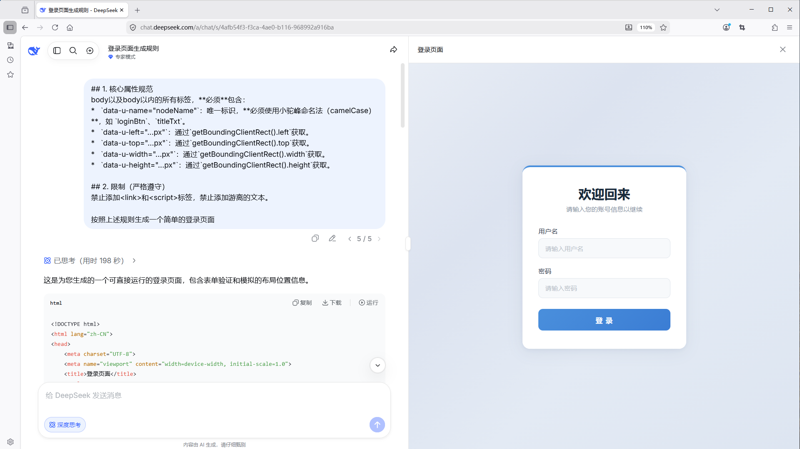
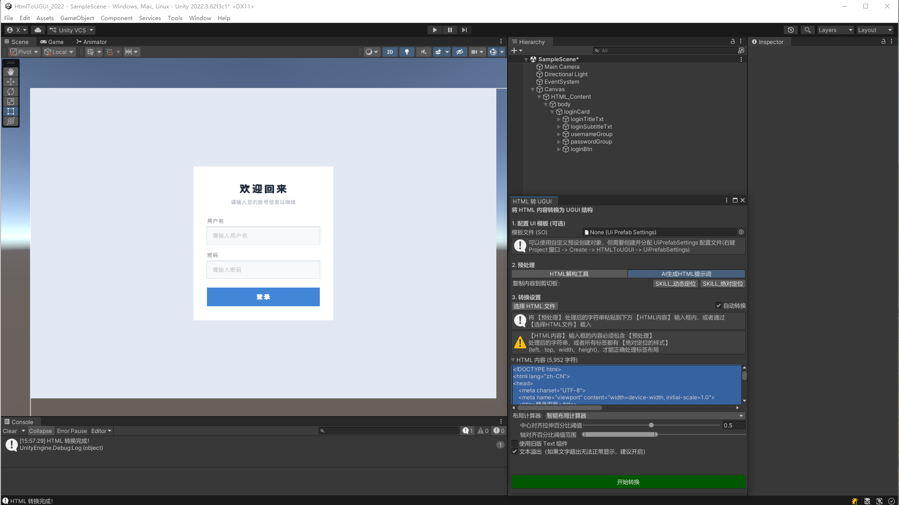
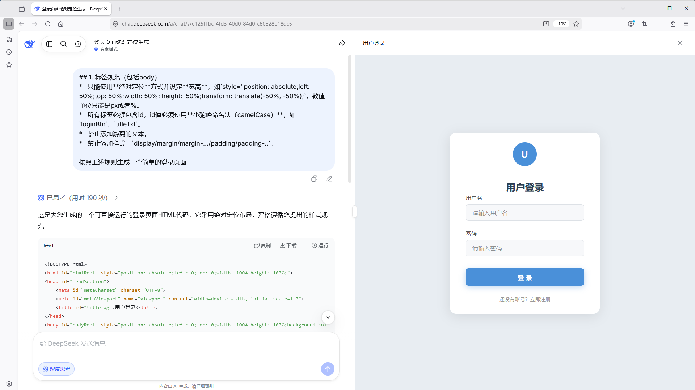
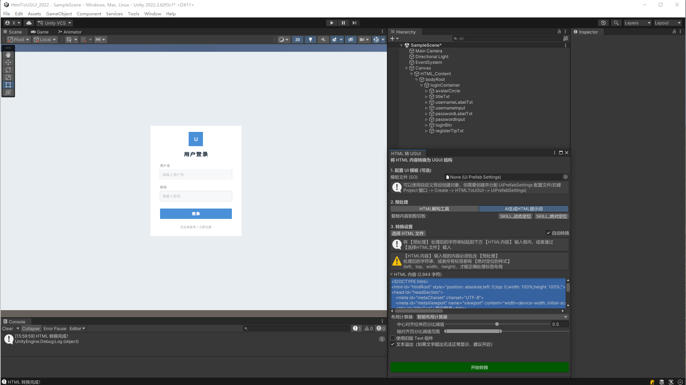

# 关于 HtmlToUGUI

使用 HtmlToUGUI 包在 Unity 编辑器中，将 HTML + CSS 内容转换为 UGUI（Canvas）层级结构。该包解析嵌入的 `<style>` 标签和行内样式，构建 CSS 级联，并将样式化的 HTML 结构映射为 UGUI GameObject（RectTransform、Image、TextMeshPro 文本、Button、InputField、Toggle、Slider、Dropdown、ScrollView）。

该包还提供了可从 Project 窗口右键菜单访问的 SpriteAtlas 工具。

## 安装

通过 Unity Package Manager 安装：

1. 打开 **Window → Package Manager**
2. 点击 **+** 按钮 → **Add package from git URL**（本地包可选择 Add by name）
3. 如果包包含 Samples，可在 Package Manager 窗口中导入

## 快速上手

1. 打开转换窗口：**Tools → HTML to UGUI Converter**
2. （可选）配置 UI 模板：创建 `UiPrefabSettings` 资源（**Assets → Create → Html To UGUI → UiPrefabSettings**），为各组件类型指定预制体
3. 加载 HTML 内容：
   - 将预处理后的 HTML 粘贴到文本区域；或
   - 点击 **选择 HTML 文件** 加载 `.html` 文件
4. 配置转换设置：

   | 设置项 | 说明 |
   |---|---|
   | 布局计算器 | 智能/全拉伸/居中 — 影响绝对定位元素到 RectTransform 锚点的映射方式 |
   | 旧版 Text 组件 | 使用 Unity 旧版 `Text` 组件代替 `TextMeshProUGUI` |
   | 文本溢出 | 启用后可防止单行文本自动换行 |
   | 自动转换 | 选择新文件后自动触发转换 |
   | 同步文件 | 监视 HTML 文件变更，自动重新转换 |

5. 点击 **开始转换**

生成的层级结构出现在场景的 `Canvas` 对象下（或复用场景中已有的 Canvas）。

> **提示 — AI 生成 HTML：** 如果想一步到位，不借助「HTML解构工具」转换，可在请求大语言模型生成 HTML 时附加 `Tools/HTMLTools/AI生成HTML提示词/` 目录下的提示词文件：
> - **SKILL_动态定位**（推荐，输出效果好）
> - **SKILL_绝对定位**（若 AI 足够听话，可直接输出可转换的 HTML）

> **效果对比：**

<table>
  <tr>
    <td></td>
    <td>→</td>
    <td></td>
  </tr>
</table>

<table>
  <tr>
    <td></td>
    <td>→</td>
    <td></td>
  </tr>
</table>

有关 HTML 解构工具的详细使用教程、三种使用方式和 CORS 代理说明，请查看 [HTML解构工具使用教程](../Tools/HTMLTools/HTML解构工具使用教程.md)。

## 布局计算器

三种 `LayoutCalculator` 实现控制 `data-u-left/top/width/height` 属性到 UGUI 锚点和偏移的转换方式：

| 计算器 | 行为 |
|---|---|
| 智能（默认） | 检测元素应拉伸填满、贴边还是居中 — 基于可配置的阈值 |
| 全拉伸 | 将元素包围盒直接映射为百分比锚点 min/max |
| 居中 | 将元素置于父容器中心，不拉伸 |

智能计算器的阈值可在转换窗口的「布局计算器」下调整。

### HTML 元素支持

内置标签处理器映射关系：

| HTML 标签 | UGUI 组件 |
|---|---|
| `div` / `span` / `p` | 容器（空 GameObject + RectTransform） |
| `h1` ~ `h6` | 容器 + Text（字体大小按标题级别缩放） |
| `button` | Button + Text |
| `input` | InputField / Toggle / Slider（按 type 区分） |
| `select` | Dropdown |
| `img` | Image（支持单模式/多模式/图集） |
| `textarea` | InputField（多行） |
| `progress` / `meter` | Slider（不可交互） |
| ScrollView | ScrollRect（含 Scrollbar 样式） |

ScrollView 额外支持 CSS 属性 `scrollbar-width`（`thin`）和 `scrollbar-color`（`thumb-color track-color`），以及 `::-webkit-scrollbar`/`::-webkit-scrollbar-thumb`/`::-webkit-scrollbar-track` 伪元素样式。Content 尺寸根据子元素位置自动计算。

### 伪类交互状态

支持的 CSS 伪类及其 Unity ColorBlock 映射：

| 伪类 | ColorBlock 属性 |
|---|---|
| `:enabled` / 默认 | `normalColor` |
| `:hover` | `highlightedColor` |
| `:active` | `pressedColor` |
| `:disabled` | `disabledColor` |
| `:selected` / `:focus` / `:checked` | `selectedColor` |

Dropdown 下拉项额外支持独立的伪类颜色设置（`ApplyDropdownItemPseudoColors`），避免与父级 Dropdown 的颜色冲突。

## Hierarchy 右键布局

在 Hierarchy 窗口中选中 UI 元素，右键 → **GameObject → Html To UGUI**，可对现有 UGUI 元素直接应用布局计算器：

| 菜单项 | 说明 |
|---|---|
| 应用UI智能布局 | 使用智能布局计算器重新计算锚点和偏移 |
| 应用UI居中布局 | 将元素及其子级居中于父容器 |
| 应用UI全拉伸布局 | 将元素拉伸填满父容器 |

布局将递归应用于所有子级元素，自动跳过非激活物体、TMP_SubMeshUI、旋转/缩放物体，并正确处理 ScrollRect 的 Content 节点。

## SpriteAtlas 工具

在 Project 窗口中选中 **SpriteAtlas** 或 **Sprite(Multiple)** 资源，右键 → **Assets → Html To UGUI → 2D**：

| 菜单项 | 说明 |
|---|---|
| SpriteAtlas → TMP_SpriteAsset | 将图集导出为 TextMeshPro SpriteAsset（`.asset`），包含字形表和字符表 |
| SpriteAtlas → Sprite(Multiple) | 将图集导出为 Multiple 模式的精灵表 `.png` |
| SpriteAtlas → TextureSheet | 将图集中所有精灵打包为单张网格纹理 |
| Sprite(Multiple) → Sprites | 将 Multiple 模式的精灵纹理切分为独立的单模式 `.png` 文件 |

需要安装 `com.unity.2d.sprite` 包。**Project Settings → SpriteAtlas** 中必须启用 SpriteAtlas 功能。

## 技术细节

### 环境要求

- Unity 2019.4.26f1 或更高版本
- `com.unity.textmeshpro`（自动安装）
- `com.unity.2d.sprite`（自动安装）
- HtmlAgilityPack（捆绑在包中）

### 已知限制

- HTML 输入必须经过预处理：每个元素必须携带 `data-u-left/top/width/height` 属性（绝对定位），或者 HTML 必须经过捆绑的「HTML解构工具」（位于 `Tools/HTMLTools/`）处理
- 图片路径必须指向 `Assets/` 或 `Packages/` 目录内的文件
- 圆角（border-radius）尚未渲染，仅通过 `Outline` 组件实现简单边框
- `<a>` 标签的超链接点击事件尚未接入
- CSS `display: flex` / `grid` 布局未模拟，仅支持绝对定位和相对定位
- 不支持HTML游离的文本，如`
游离的文本

`

### 包内容

| 位置 | 说明 |
|---|---|
| `Editor/` | 转换窗口、元素工厂、资源加载器、文件监视器、SpriteAtlas 工具 |
| `Runtime/` | CSS 解析器、布局计算器、标签处理器、样式应用器、数据模型（可在运行时使用） |
| `Samples/Example/` | 示例场景，包含 HTML 文件和精灵图集 |
| `Tools/HTMLTools/` | 预处理工具和辅助脚本 |
| `Documentation/` | 本文档 |

## 文档修订历史

| 日期 | 说明 |
|---|---|
| 2026-06-07 | 新增 HTML 元素支持表、伪类交互状态说明；补充进度条/scrollbar 文档 |
| 2026-06-05 | 新增 Hierarchy 右键布局菜单说明；SpriteAtlas 菜单重构说明 |
| 2026-06-04 | 增加游离文本已知限制，移除竞品对比章节 |
| 2026-05-19 | 初始发布 |