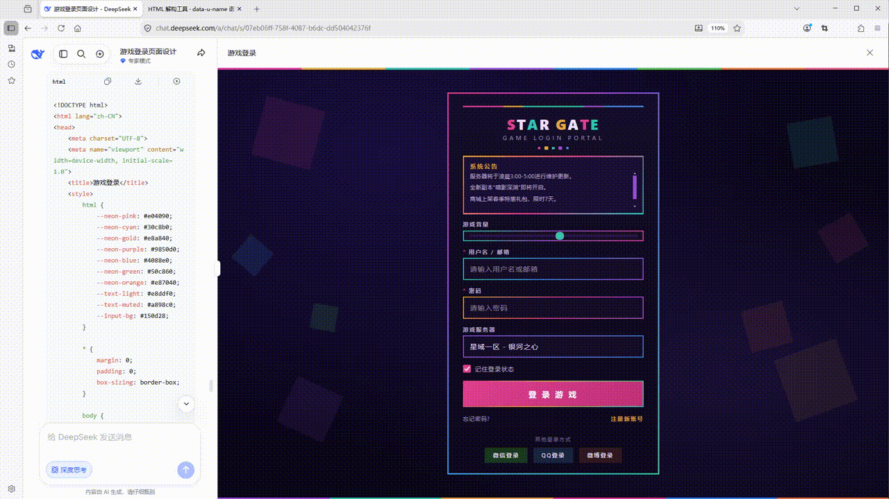

# HTML to UGUI Converter

[](https://unity.com/)
[](LICENSE.md)


Convert HTML + CSS content into Unity UGUI (Canvas) hierarchies at Editor time.



## Core Features

- **CSS Parsing** — supports `<style>` tags, inline styles, compound selectors (class/ID/attribute/descendant/child), pseudo-classes (`:hover`/`:active`/`:disabled`), CSS variables (`var()`), and relative units (`em`/`rem`/`%`/`calc()`)
- **Three Layout Calculators** — **Smart** (auto-chooses anchor/stretch/center), **Stretch** (full percentage), **Center** (centered pivot)
- **Pluggable Tag Handlers** — built-in support for `div`/`span`/`p`/`h1~h6`/`button`/`input`/`select`/`img`/`textarea`/`progress`/`meter`, extendable via `ITagHandler`
- **File Watcher** — automatically re-imports and converts on HTML file changes
- **Prefab Templates** — `UiPrefabSettings` ScriptableObject configures per-component prefabs

## Image Resolution

The tool resolves `` references against the HTML file's directory:
- `src="icon.png"` → looks for `icon.png`, or a named sprite inside a `.spriteatlasv2` atlas, or a slice from a Multiple-mode sprite sheet in the same folder
- Supports Single-mode sprites, Multiple-mode sprite sheets, and `.spriteatlasv2` atlases
- Image assets must reside under `Assets/` or `Packages/`

## SpriteAtlas Tools

Select a **SpriteAtlas** or **Sprite(Multiple)** asset, then use **Assets → Html To UGUI → 2D**:

| Menu Item | Description |
|---|---|
| SpriteAtlas → TMP_SpriteAsset | Export a SpriteAtlas into a TextMeshPro SpriteAsset (`.asset`) |
| SpriteAtlas → Sprite(Multiple) | Export a SpriteAtlas into a Multiple-mode sprite sheet |
| SpriteAtlas → TextureSheet | Pack sprites from a SpriteAtlas into a single grid-based texture |
| Sprite(Multiple) → Sprites | Split a Multiple-mode sprite sheet into individual sliced sprites |

> SpriteAtlas support must be enabled in **Project Settings → SpriteAtlas**.

## Quick Start

### Via Git URL (Recommended)

1. Open Unity **Package Manager** (Window > Package Manager)
2. Click the **+** button, select **"Add package from git URL..."**
3. Enter:
   ```
   https://github.com/jixinhaoqi/HtmlToUGUI.git
   ```
4. Click **Add** and wait for import

### Using the Converter

1. Open **Tools → HTML to UGUI Converter**
2. Paste HTML content (pre-processed by the bundled HtmlTool), or pick a `.html` file
3. Click **Start Convert** to generate the UGUI hierarchy under a Canvas

> **Tip — AI-Generated HTML:** For best results without the pre-processing tool, attach [AI prompt skills](Tools/HTMLTools/AI生成HTML提示词/) from  when generating HTML:
> - **SKILL_动态定位** — recommended, produces responsive layout output
> - **SKILL_绝对定位** — use if the model reliably follows absolute-positioning instructions

> **Comparison:**

<table>
  <tr>
    <td></td>
    <td>→</td>
    <td></td>
  </tr>
</table>

<table>
  <tr>
    <td></td>
    <td>→</td>
    <td></td>
  </tr>
</table>

## HTML Deconstruction Tool

[HTML Deconstruction Tool Tutorial](Tools/HTMLTools/HTML解构工具使用教程.md) — learn about the three usage modes, AI prompt skills, and CORS proxy setup.
[Online running tool](https://jixinhaoqi.github.io/HtmlToUGUI/)

## Samples

- [Example](Samples~/Example/): A simple HTML-to-UGUI demo scene with a complete `index_optimized.html`, sprite atlas, and Canvas output.

## Dependencies

| Package | Purpose |
|---|---|
| `com.unity.textmeshpro` | Text rendering (TextMeshPro) |
| `com.unity.2d.sprite` | Sprite atlas utilities |
| HtmlAgilityPack | HTML parsing and DOM traversal |

---
