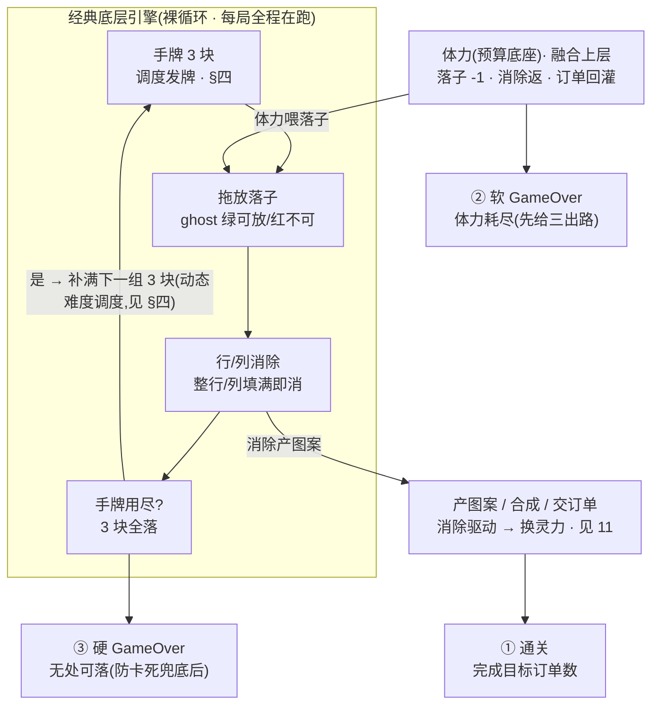

# 玩法总览

现状分析 · 经典 **8×8 拖放消除** 的六项核心机制——动态难度发牌、平方级计分、方块库、首发固定、早期屏蔽、连消钩子。这六项**不再构成独立的「纯无尽刷分」游戏**,而是<mark>下沉为融合玩法的底层引擎</mark>:游戏单入口运行,经典核心常驻于合成订单之下。本篇记录这套底层的现状。

> [!NOTE]
> **本篇定位:经典核心机制的现状记录,也是融合玩法的底层引擎**
>
> 游戏为**单入口循环**:经典机制完全吸收进合成订单,**无独立的「纯无尽刷分」入口**(该入口已移除,见 [29·§4.2](#29-gameplay-fusion::remove))。本篇描述的六项核心(8 算法 DDA / 计分公式 / 71·39 方块库 / 首发固定 / 早期屏蔽 / 连消钩子)仍是**活的底层**——融合玩法的发牌、产图案、连消爽感都建在其上。其上的统一玩法、经典各机制的保留/被覆盖去向、逐条裁决见 [29 · 玩法融合](#29-gameplay-fusion)(六项去向见 [29·§4.1](#29-gameplay-fusion::keep));合成订单的完整上层经济见 [11](#11-core-loop-completion)(切片现状 [09](#09-merge-order-energy)/[10](#10-score-element-rm-collect))。

## 一、核心循环:经典底层引擎 + 融合上层 {#loop}

经典 <mark>8×8 棋盘 + 三块拖放消除</mark>(同类:Block Blast / 1010!)是整套玩法的**底层引擎**:落子 → 行列消除 → 补牌,这条裸循环每局全程在跑。融合后它**不是整个游戏的唯一循环、也不是唯一出口**——其上叠了体力预算、图案产出、订单交付,出口扩为三条。下图分两层:内层蓝框是经典裸循环(底层引擎),外层是融合上层与三出口。

> [!NOTE]
> **三出口取代经典「无处可落即唯一结束」**:融合后结束条件为三条并列——**① 通关**(完成目标订单数)**② 软 GameOver**(体力耗尽且无单可交付,先给「自然恢复 / 祈愿兑体力 / 领奖含体力」三出路缓冲)**③ 硬 GameOver**(无处可落,由智能生成防卡死兜底后仍兜不住时触发)。经典的「剩余手牌无合法落点 → GameOver」被覆盖为<mark>三条出口之一</mark>(③)。完整结束模型见 <a href="#11-core-loop-completion::energy-empty">11·§7.3</a>,融合裁决见 <a href="#29-gameplay-fusion::v2">29·§3.2</a>。

窗口流转:主菜单(单入口「开始游戏」)→ 游戏窗 → 结算窗 / 通关窗。两窗合一与单入口化属融合落地项,见 [29·§五](#29-gameplay-fusion::dev)。

## 二、得分规则(消除基础分) {#score}

经典计分公式在融合后**仍是单一信息源**,两路共用。它产出的「消除基础分」是<mark>驱动量</mark>——喂元素产出与连消倍率,不直接等于玩家可见的「真分数」(可见主分数口径见 [29·§3.3](#29-gameplay-fusion::v3))。公式本身:

| 行为 | 得分公式 | 说明 |
| --- | --- | --- |
| 落子 | `每格 +1` | 方块占几格加几分 |
| 消除 | `消除格数 × 10 + 行列数² × 30` | 同时消越多行列,奖励呈<mark>平方级</mark>暴涨 |

消除收益示例(平方奖励鼓励**「憋大招」**):

| 同时消除 | 行列数²×30 | 体感 |
| --- | --- | --- |
| 1 行/列 | +30 | 常规 |
| 2 行/列 | +120 | 值得等 |
| 3 行/列 | <mark class="g">+270</mark> | 大爽点 |

> [!NOTE]
> **Combo 连消倍率链**:连续落子都有消除则连击数 +1,断了清零,连击弹字上屏(COMBO×N / PERFECT)。连消链长驱动<mark>显示分倍率</mark> ×1.0/1.2/1.5/1.8/2.0(封顶),**只乘显示分,不参与元素产出与全清判定**;经典侧的连击计数在融合后降为**纯视觉镜像量**(驱动弹字),真正的连消倍率由合成订单的连消链与清除结算承担。机制见 <a href="#11-core-loop-completion::combo-table">11·§5.3</a>,融合裁决(死钩子点亮)见 <a href="#29-gameplay-fusion::v5">29·§3.5</a>。

## 三、方块库 {#blocks}

方块库与首发固定**融合后保留**(开局好上手,与体力起步不冲突),全玩法共用同一库:

- 共 **71 种形状**定义,实际抽取池为 <mark>39 种常规形状</mark>。
- 新手**首发固定**为 2×2 方块、L 形、大 L 三块,保证开局好上手。
- **早期屏蔽**:分数 &lt; 10000 时,剔除特别难放的大形状,降低前期挫败。

> [!NOTE]
> **早期屏蔽的阈值口径随融合计分归一一并理清**:早期屏蔽以经典局内分数为阈值。合成订单局内该分量恒 0 → 早期屏蔽在融合玩法里**可能全程生效**(始终剔大形状)。融合后须确认早期屏蔽以哪个分量为阈值,避免「分数恒 0 → 永久屏蔽」与「分数随交付增长 → 中途解屏」两种行为含糊。裁决见 <a href="#29-gameplay-fusion::v6">29·§3.6</a>(连带项随 <a href="#29-gameplay-fusion::v3">§3.3</a> 计分口径定)。

## 四、最大特色:动态难度调度(融合发牌底层 R4) {#dda}

这是本作区别于普通方块消除的<mark>灵魂</mark>——发牌**不是纯随机,而是根据玩家表现「做局」**(一套橡皮筋式动态难度 DDA)。融合后它**下沉为发牌底层(R4)**:两路共用同一条补牌路径,8 算法与权重表即融合玩法的发牌底层。分数段决定调度策略:

| 分数段 | 调度行为 |
| --- | --- |
| &lt; 1000 | 纯随机无死亡,保证开局不卡 |
| 1000 \~ 15000 | **清屏窗口**:系统用贪心算法主动喂「能清空棋盘」的方块,引导清盘;清空后冷却 1\~2 回合走普通调度,再开窗口(张弛节奏) |
| ≥ 1000 激活 | **动态权重**:8 种算法按权重抽取发牌 |

### 8 种发牌算法(从「放水」到「做死」) {#algos}

| 算法 | 倾向 |
| --- | --- |
| Fill / ClearAll / AllCombination | 放水 好放、好消、助清盘 |
| RandomNoDie / EasyDiff | 中性偏易 |
| Add3(熵增)/ Diff(困难)/ StraightDeathDiff(死亡难题) | 做局 故意给难放 / 逼死的方块 |

核心机制是一个**动态权重**:玩家放了「难」方块权重下降、放「易」方块权重上升,系统据此在不同 **难度档**间切换发牌策略,让玩家长期停在<mark>「差点死又没死」的心流区</mark>。权重数值走配置表,可不改代码调参。

### 融合后:强度信号源决定 DDA 是否激活做局 {#dda-fusion}

> [!WARNING]
> **DDA「做局」能力在融合玩法里是否激活,取决于喂给发牌的强度信号——这是一个有安全默认的范围开关**([29·§3.8](#29-gameplay-fusion::v8) / 隐患 C)。DDA 以经典局内分数为强度信号:<1000 不激活、1000~15000 叠清屏窗口、≥1000 才进 8 算法权重段。合成订单局内该分量恒 0,故发牌**永远落在「未激活 + 清屏窗口」分支**——8 算法权重段从不触发,DDA 的橡皮筋做局能力**休眠**在清屏窗口。融合后:
>
> - **默认(选项甲)**:DDA 维持以经典局内分数为信号。该量在融合里若仍恒低 → DDA **继续休眠**在清屏窗口(= 合成订单现状,零配平、零回归)。
> - **可选(选项乙)**:把强度信号改接**经营进度量**(如累计得分或完成单数),让 DDA 随经营推进而升难度,与体力/订单节奏配合(需 test 配平「进度 → 难度」曲线)。
>
> 两选项都**不改 8 算法与权重表**,只改「喂给发牌的强度参数」。默认取甲,乙记入 [29·§七#2](#29-gameplay-fusion::decisions) 待拍板。

> [!NOTE]
> 这套系统是本作的灵魂,单独拆成一篇详解(含 8 种算法逐一拆解 + 真实权重数据,并以经典局内分数为强度信号通篇展开):→ <a href="#02-dynamic-difficulty">动态难度拆解</a>。

## 五、其它 {#misc}

- **存档**:经典存档(棋盘 + 手牌 + 分数 + 最高分)与动态权重自存是底层持久化。融合后并入「元层进盘 / 局内瞬态不进盘」的统一存档视图,最高分并入元层语义(跨会话长期指标),合并裁决见 [29·§3.7](#29-gameplay-fusion::v7)。
- **UI / 美术**:核心玩法窗已贴<mark class="g">塔罗木质换皮</mark>(设计 [27](#27-tarot-mode-hud-art));设置 / 个人信息 / 结算 / 排行榜各窗均有美术换皮(设计 [23](#23-settings-window-art)–[28](#28-rank-window-art))。棋盘 / 格底 / 拖拽落点预览等仍由代码渲染,但**已非「纯几何无美术」**。分数滚动动画保留。

## 相关文档

- [← 返回总览](#)
- [29 · 玩法融合(顶层裁决)](#29-gameplay-fusion)
- [11 · 核心玩法补全(合成订单完整设计)](#11-core-loop-completion)
- [02 · 动态难度拆解](#02-dynamic-difficulty)
- [09 · 合成订单切片](#09-merge-order-energy)
