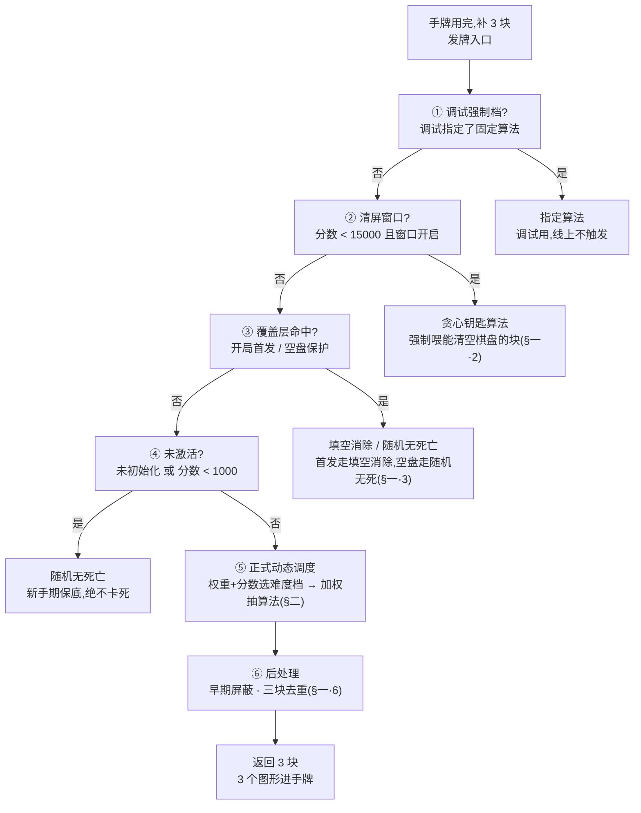
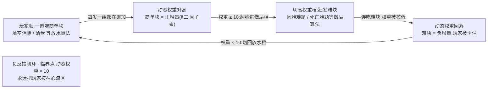

# 动态难度拆解

游戏最核心、最值钱的系统。它让发牌「会读心」:你顺的时候偷偷加码,你快死的时候悄悄放水,永远把你按在「就差一点」的心流区。

> [!NOTE]
> **这套 DDA 是融合发牌的底层引擎**:8 种发牌算法与权重表即融合玩法的发牌底层。本篇通篇以**得分**为强度信号(决定 DDA 是否激活做局);融合后<mark>DDA 用哪个进度量作强度信号</mark>是一个有安全默认的范围开关——默认以**得分**为信号(该量在融合里若恒低则 DDA 休眠在清屏窗口),可选改接经营进度量(让做局随经营推进激活)。信号源裁决与默认见 <a href="#29-gameplay-fusion::v8">29·§3.8</a> 与 <a href="#29-gameplay-fusion::decisions">29·§七#2</a>。

> [!NOTE]
> **一句话原理:** 系统维护一个隐藏变量**动态权重**(可理解为「最近有多惯着你」的累加器)。喂你简单块 → 这个值升高 → 触发「做局」档发难块;喂你难块 → 值降低 → 触发「放水」档发简单块。**一根自动收紧又松开的橡皮筋。**

## 一、调度总链路 {#dispatch}

每次手牌用完补 3 块时,按优先级从上到下决策,<mark>命中即返回</mark>。整条决策流如下图:

各级的判定细节与数值:

1. **调试强制档**:调试用,指定后所有发牌都用该固定算法。线上不触发。
2. **清屏窗口**(分数 &lt; <mark>15000</mark>):进入窗口后**每回合强制喂「能清空棋盘」的方块**(贪心钥匙算法),引导你清盘。清空后**冷却 1\~2 回合**走普通调度,再开窗口 —— 制造「填满→清空」的张弛节奏。
3. **优先级覆盖层**:特定时机插队接管。当前内置两条:
  - 开局首发 一局第一次补块走 **填空消除**,确保你一上手就能消行,建立「这游戏会消除」的预期。
  - 空盘保护 棋盘刚清空时走 **随机无死亡**,避免清盘后立刻甩一个死亡难题。
4. **未激活**(未初始化 或 分数 &lt; 1000):直接 **随机无死亡**,保证新手期绝不卡死。
5. **正式动态调度**:按**动态权重** + 当前分数选中一个 **难度档**,再在档内按 8 种算法的权重加权抽一个算法生成方块。
6. **后处理**:分数 &lt; 10000 时套**早期屏蔽**(剔除超难大块);非清屏窗口期做**三块去重**(避免一组里出现重复图形)。

## 二、核心机制:动态权重橡皮筋 {#weight}

每次发完一组牌、玩家落子后,按所用算法给**动态权重**加一个增量。<mark>增量正负就是这套 DDA 的方向盘</mark>。

### 调权因子表(每种算法把权重推向哪边) {#weight-factors}

| 算法 | 倾向 | 首次/换向 增量 | 同向连续 增量 |
| --- | --- | --- | --- |
| 清盘 | 放水 | +60 | +30 |
| 填空消除 | 放水 | +40 | +20 |
| 全组合 | 放水 | +35 | +15 |
| 简单难题 | 偏易 | +30 | +12 |
| 随机无死 | 中性 | +15 | +5 |
| 熵增 | 偏难 | −25 | −10 |
| 困难难题 | 做局 | −40 | −15 |
| 死亡难题 | 做局 | −80 | −30 |

> [!NOTE]
> 「同向连续」增量比首次小:连续放水/连续做局时**力度衰减**,防止权重一路冲到底,让橡皮筋更柔和。权重最终会被夹紧到配置表覆盖的真实区间内。

### 闭环是怎么转起来的 {#weight-loop}

关键在 **难度档表的设计**:**动态权重**越高,档内越偏向发**难块**。于是形成<mark class="g">自动负反馈</mark>,循环如下:

临界点大约在 <mark>动态权重 = 10</mark>:低于它是「放水档」,达到/超过它就翻脸进「做局档」。下表是第 1 分数段(1000–3795 分)的数据,看「做局占比」如何随权重陡然翻倍:

| 动态权重区间 | 做局占比\* | 体感 |
| --- | --- | --- |
| ≤ −410 | 28% | 放水 |
| −290 \~ −225 | 26% | 放水 |
| −105 \~ −70 | 19% | 大放水 |
| −10 \~ 10 | 18% | 最舒服 |
| 10 \~ 30 | **73%** | 翻脸做局 |
| 50 \~ 70 | 74% | 做局 |
| 90 \~ 130 | 74% | 做局 |
| ≥ 230 | **92%** | 往死里整 |

\* 做局占比 = (熵增+困难+死亡难题) 权重 / 全部权重。权重过 10 这条线,占比从 \~18% 直接跳到 \~73%,这就是橡皮筋「翻脸」的瞬间。

## 三、8 种发牌算法逐一拆解 {#algos}

每种算法都返回 3 个图形。难题类用「<mark>位棋盘启发式 + 蒙特卡洛采样</mark>」找最难的组合,放水类则找最好消的组合。

| # | 算法 | 目标 | 实现思路(简) | 采样次数 |
| --- | --- | --- | --- | --- |
| 0 | 填空消除 | 放水 | 先找「快填满的行/列」,针对缺口定制线条钥匙块,凑出能消最多格的组合 | 80 |
| 1 | 随机无死 | 保底 | 纯随机抽,只要保证三块都放得下(不逼死) | 50 |
| 2 | 熵增 | 偏难 | 挑让棋盘「最乱/碎片最多」的组合(最大化熵) | 60 |
| 3 | 简单难题 | 偏难 | 控制解法数量落在 5\~30 这个「要想但想得出」的甜区 | 80 |
| 4 | 困难难题 | 做局 | 找最大空矩形塞大锚块,逼到解法数 ≤ 几种 | 160 |
| 5 | 死亡难题 | 做局 | 双锚块猛攻,专门找「只有唯一解或直接逼死」的组合 | 320 |
| 6 | 清盘 Plus | 放水 | 棋盘格≥10 时,找一组能**一次清空全盘**的方块(大爽点) | 120 |
| 7 | 全组合 | 放水 | 穷举落点找能消最多行列的组合(比填空消除更激进) | 150 |

> [!NOTE]
> 采样次数 = 算法的「努力程度」。**死亡难题 320 次**采样最舍得算力,因为「逼死你」比「放水」更难找到合适组合。这些数字目前**硬编码**在程序里,**是一个可外置到配置表的调参入口**。

## 四、配置表结构 {#config}

权重表共 <mark>136 行 = 8 个分数段 × 17 个权重档</mark>。每行 13 个字段:难度档编号、8 种算法权重、分数上下限、权重因子区间上下限。

### 8 个分数段 {#config-segments}

| 段 | 分数范围 | 含义 |
| --- | --- | --- |
| 1 | 1000 – 3795 | 动态难度激活起点 |
| 2 | 3795 – 4597 |  |
| 3 | 4597 – 6460 |  |
| 4 | 6460 – 9265 |  |
| 5 | 9265 – 11802 |  |
| 6 | 11802 – 14233 |  |
| 7 | 14233 – 21872 | 跨过 15000,清屏窗口退场 |
| 8 | 21872 – 426964 | 高分长尾 |

有意思的是:**每个分数段的橡皮筋幅度几乎一致**——最低权重档约 27\~30% 做局,最高权重档约 92% 做局。

也就是说<mark>难度主要靠动态权重横向调,而非靠分数纵向堆</mark>。分数段更多是微调与上限控制。

### 第 1 段完整权重表(按权重档从低到高) {#config-odds}

| 权重区间 | 填空 | 随机无死 | 熵增 | 简单难题 | 困难难题 | 死亡难题 | 清盘 | 全组合 |
| --- | --- | --- | --- | --- | --- | --- | --- | --- |
| ≤ −410 | 299 | 55 | 75 | 0 | 203 | 0 | 49 | 319 |
| −290 \~ −225 | 503 | 28 | 63 | 0 | 192 | 0 | 58 | 156 |
| −105 \~ −70 | 715 | 9 | 38 | 0 | 149 | 0 | 36 | 53 |
| −10 \~ 10 | 770 | 2 | 37 | 0 | 146 | 0 | 20 | 25 |
| 10 \~ 30 | 156 | 10 | 40 | 1 | **694** | 0 | 0 | 99 |
| 50 \~ 70 | 162 | 9 | 35 | 0 | **707** | 0 | 1 | 86 |
| 90 \~ 130 | 159 | 8 | 33 | 0 | **709** | 0 | 0 | 91 |
| ≥ 230 | 45 | 3 | 8 | 0 | **908** | 0 | 0 | 36 |

表内是相对权重(不必归一)。注意 **简单难题和死亡难题这两列几乎全 0**——线上实际只用了 6 种算法,简单难题 / 死亡难题基本被雪藏,难度主要靠困难难题一列扛。权重低时填空消除唱主角(放水),权重一过 10,困难难题直接飙到 700+ 接管(做局)。

## 五、策划视角点评 &amp; 可调参数 {#review}

> [!TIP]
> **设计亮点:** 用一个隐藏标量 + 一张二维表(分数 × 权重)就实现了<mark class="g">平滑、自适应、玩家无感的动态难度</mark>,且把「难/易」拆成 8 种可独立调权的具体手法,调参空间极大。

> [!WARNING]
> **可优化 / 可调点:**
>
> - **简单难题 / 死亡难题列几乎全 0**——做了算法却没在表里启用,难度梯度其实只有「填空消除 ↔ 困难难题」两极。可考虑用上简单难题做更细腻的过渡档。
> - **翻脸太陡**:权重过 10 这条线,做局占比**从 18% 直接跳到 73%**,体感可能是「突然变态」。可在 10~30 档加一个中间梯度。
> - **采样次数硬编码**(死亡难题 320 次),建议外置到配置表,方便按机型性能/难度调。
> - 难度几乎只靠动态权重调,**8 个分数段区分度很低**——高分玩家和中分玩家体验曲线几乎一样,可考虑让高分段整体更毒。

## 相关文档

- [← 返回总览](#)
- [玩法总览](#01-gameplay-overview)
