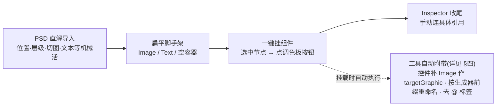

# PSD2UGUI 组件化工具

工具 / 管线 · 给「PSD 直解导入」生成的扁平节点,在 Unity 端**一键挂上对应 UGUI 组件**;spriteState / fill·handle / content 等引用在 Inspector 里连。

> [!NOTE]
> **它解决什么:**
>
> - **新工作流定调:**PSD 侧只做**位置 / 层级 / 切图 / 文本 / 阴影 / 描边 / 九宫格 / @PNG 合图**这些「机械活 + 只有导入能做」的部分;**组件类型移到 Unity 端**——在真相所在地点几下,比 PSD 标注更方便、好改。
> - **导入产物 = 扁平脚手架:**无组件标注的层,导入器本就输出 `Image` / `Text` / 空容器(位置·切图准确)。本工具给这些节点**一键挂上对应组件**,控件自动补 `Image` 作 targetGraphic。
> - **薄工具:**只挂组件、不猜角色、不自动连引用——`spriteState` / fill·handle / content 等**在 Inspector 里直接连**。不走重导合并(**Unity 为唯一真相**),组件化一次性完成。

<h2 id="principles">一、设计原则</h2>

| 原则 | 含义 |
| --- | --- |
| **薄工具** | 只做「挂组件 + 控件补 targetGraphic」;不猜角色、不自动连引用,具体在 Inspector 收尾。 |
| **选区驱动** | 作用于 Hierarchy 当前选中节点,支持多选批量挂。 |
| **幂等** | 节点已有该组件则跳过,不重复挂。 |
| **不破坏** | 只加组件,走 `Undo`,可整体撤销。 |
| **透明** | 控制台打印给谁挂了什么、targetGraphic 连了哪个。 |

<h2 id="palette">二、调色板组件</h2>

每个组件就是一颗按钮,点一下挂到选中节点。<b>控件类自动补 <code>Image</code> 作 targetGraphic</b>。

| 分组 | 组件 |
| --- | --- |
| 控件(补 targetGraphic) | Button · Toggle · Slider · Scrollbar · InputField |
| 布局 / 滚动 | Grid(GridLayoutGroup) · 水平布局 · 垂直布局 · ScrollRect · RectMask2D · LayoutElement · ContentSizeFitter |
| 图形 | Image · RawImage · Text |

TabGroup(项目自定义 CustomTab)后续补一颗按钮即可,同样是「挂组件 + Inspector 连」。

<h2 id="model">三、工作模型:挂组件 + Inspector 连引用</h2>

放弃了「缩略图角色指派 / 自动连 spriteState / 删状态节点 / 几何推断」那一整套——<mark class="y">美术命名不可靠</mark>、自动猜角色脆且收益有限。改为**极简流**,全链路如下:

对应的操作只有三步:

1. Hierarchy **选中节点**(可多选)
2. 窗口里**点对应组件按钮** → 组件挂上(控件自动补 Image 作 targetGraphic)
3. 在 **Inspector** 里连具体引用(spriteState、fill/handle、content…)

> [!NOTE]
> <b>为什么不自动连:</b>角色识别要么靠命名(不可靠),要么靠缩略图手点(每控件多步)。直接在 Inspector 连这些引用,是程序<mark class="g">最熟、最快、最可控</mark>的路径——工具只省「挂组件 + 补 targetGraphic」这点重复劳动即可。

<h2 id="rules">四、挂载规则</h2>

| 类别 | 挂载行为 |
| --- | --- |
| **控件**(Button/Toggle/Slider/Scrollbar/InputField,均 `Selectable`) | 节点若没有任何 `Graphic` → 先补一个 `Image`;再挂控件;`targetGraphic` 为空则自动指向该 Graphic。 |
| **布局 / 滚动 / 图形** | 直接挂;节点已有同类型则跳过(幂等)。 |
| <b>重命名(所有类别)</b> | 挂组件时按所选组件给节点加 **生成器命名前缀** 并<b>去掉 <code>@\*</code> 标签</b>,使节点能被项目 UI 脚本生成器绑定。 |

<h3 id="rules-naming">命名规则(已实现,对齐项目生成器)</h3>

前缀<b>实时读自 <code>ScriptGeneratorSetting</code></b>(UI 代码生成器的 `uiElementRegex` = <mark>单一来源</mark>):Button→`m_btn`、Image→`m_img`、Text→`m_text`、ScrollRect→`m_scroll`、Toggle→`m_toggle`、Slider→`m_slider`、Grid→`m_grid` 等。

挂组件时 = <b>前缀 + "\_" + 基名</b>,去 `@*` + 替换旧前缀(取**最长**匹配,`m_scrollBar` 不会被 `m_scroll` 误吞;剥离后残留分隔下划线也清掉,不会出双下划线)。例:`buy@PNG` + Button → `m_btn_buy`;`m_btn_buy` + Image → `m_img_buy`。

生成器 `ScriptGenerator.cs` 用 `name.StartsWith(uiElementRegex)` 绑定 → <mark class="g">节点名直接可用</mark>。不在规则里的组件(RectMask2D/LayoutElement/ContentSizeFitter)不改名。

<h3 id="rules-translate">中文基名 → 英文(MyMemory,免 key + 缓存)</h3>

基名含中文时,先查本地术语表缓存 `TranslationCache.json`;缺失则调 **MyMemory**(免 key/免费)翻译并写回缓存;失败/离线保留中文。窗口有开关可关。例:`购买@PNG` + Button → `m_btn_Buy`(缓存命中后即时)。

<mark class="y">翻译质量不完美</mark>(如 设置→SettingsIni、BUY 大写),缓存是**可手编 JSON**,改一次永久生效。

<h2 id="inspector">五、挂完在 Inspector 连什么(速查)</h2>

| 组件 | Inspector 里要连 / 调 |
| --- | --- |
| Button | SpriteSwap → `spriteState` 的 pressed/disabled/highlighted(targetGraphic 已自动连) |
| Toggle | `graphic` = 勾选态 Image;多选互斥再加 ToggleGroup |
| Slider | `fillRect` / `handleRect` / 方向 / 取值范围 |
| ScrollRect | `content` / `viewport` / 横竖滚动;视口配 RectMask2D |
| Grid | `cellSize` / spacing / 约束行列 |
| InputField | `textComponent` / placeholder |

<h2 id="ux">六、调用方式 / UX(仅窗口)</h2>

入口 = 停靠式 `EditorWindow「PSD2UGUI 组件化」`(菜单 <mark><code>QuickTool / PSD2UGUI 组件化</code></mark>)。

- **顶部**:选中节点的对象引用字段(跟随 Hierarchy;多选显示数量)。
- **分组按钮**:控件 / 布局·滚动 / 图形,点哪个挂哪个。
- **多选批量**:对选中的所有节点各挂一份。
- **Undo**:每次挂载进一个 Undo group,可撤销。
- **报告**:控制台打印挂载结果。

## 相关文档

- [← 返回总览](#)
