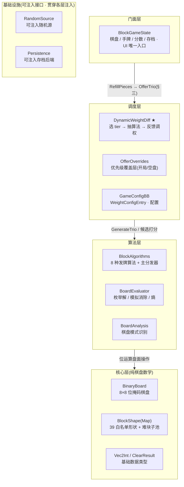
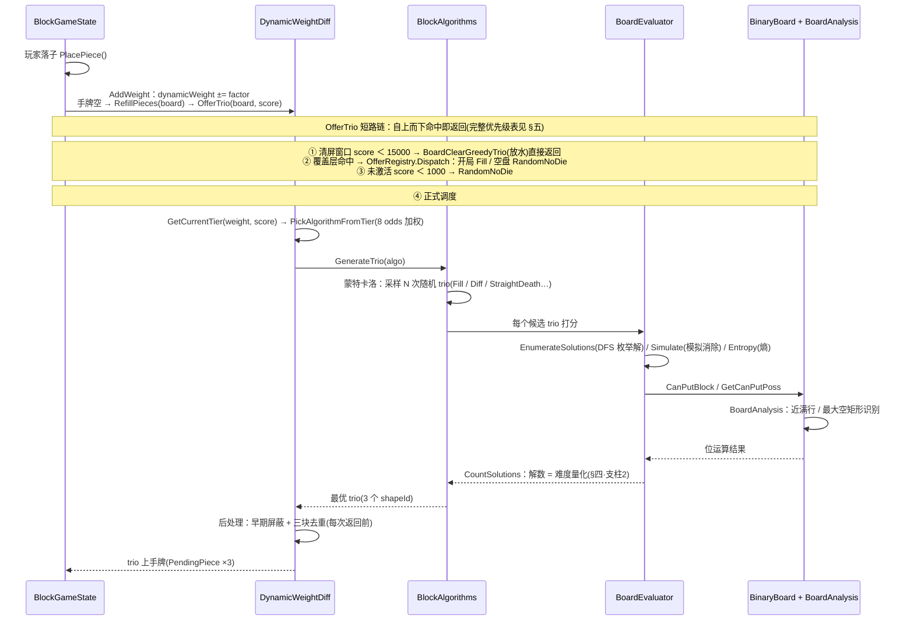

# BlockBlast 代码架构剖析

工程视角 · 看清离线还原版动态难度系统的 C# 代码是怎么分层、数据怎么流、热点在哪。数值与体感设计请看姊妹篇《[动态难度拆解](#02-dynamic-difficulty)》，本篇只讲**代码实现**。

> [!NOTE]
> <b>一句话定位：</b>这套代码的核心不是「游戏逻辑」，而是一台**发牌操控机**——根据你的分数和一个隐藏「难度账户」<mark><code>dynamicWeight</code></mark>，在 8×8 位棋盘上做**蒙特卡洛搜索**，实时决定下一组方块是帮你消除（放水）还是逼你走投无路（做局）。整个模块<mark class="g">完全 headless</mark>：除 <code>JsonUtility</code> 存档外不碰任何 Unity 运行时，可在 EditMode 直接单测。

<h2 id="layers">一、分层结构</h2>

目录路径：`Assets/GameScripts/HotFix/GameLogic/Module/BlockBlast/`。命名空间 `GameLogic.BlockBlast.*`，独立 asmdef，对接 TEngine 热更。先看文件落位：

<pre class="tree">BlockBlast/
├── Core/                     纯棋盘数学（无随机、无难度，可单测）
│   ├── BinaryBoard.cs            8×8 位掩码棋盘：放置 / 消除 / GameOver 判定
│   ├── BlockShape(Map).cs        39 个白名单形状（位掩码定义）+ 难块子池
│   ├── Vec2Int.cs / ClearResult.cs
├── Algorithms/               难度引擎
│   ├── BlockAlgorithms.cs        8 种发牌算法（放水 ↔ 做局光谱）+ 主分发器
│   ├── BoardEvaluator.cs         评分器：枚举解 / 模拟消除 / 算熵
│   ├── BoardAnalysis.cs          棋盘模式识别（近满行、最大空矩形…）
│   ├── WeightConfigEntry.cs      tier 配置 POCO（对接 Luban 表）
│   └── AlgorithmKind.cs
├── DynamicWeightDiff.cs   ★  总调度器：选 tier → 抽算法 → 反馈调权
├── OfferOverrides.cs         优先级覆盖层（开局 / 清盘特殊处理）
├── BlockGameState.cs         对外门面：棋盘 + 手牌 + 分数 + 存档
├── GameConfigBB.cs           调权因子 / 采样次数 / 首发牌（静态默认值）
├── PendingPiece.cs           手牌方块（形状 + 颜色 + 算法标签）
├── RandomSource.cs           可注入随机源（测试可固定种子）
├── Persistence.cs            可注入存档后端（解耦 PlayerPrefs）
├── SimpleSingleton.cs        轻量单例基类
└── Tests/                    EditMode 单元测试</pre>

按职责归层后，整个模块是一座<mark>依赖方向单向向下</mark>的四层塔，随机与存档作为可注入基础设施贯穿各层：

> [!TIP]
> 分层很干净：**Core 不知道难度存在，Algorithms 不知道调度存在，调度器只编排不实现棋盘操作**。依赖方向单向向下，所以每层都能独立替换与测试。

<h2 id="modules">二、模块职责一览</h2>

| 文件 | 角色 | 职责 |
| --- | --- | --- |
| `BlockGameState` | 门面 / 单例 | 对 UI 层暴露的唯一入口：8×8 带色棋盘、3 个手牌槽、分数/连击、落子、消行、存读档。 |
| `BinaryBoard` | 核心数据结构 | 把棋盘压成 8 个 int 行掩码。所有放置/消除/可解性判定都是位运算。 |
| `DynamicWeightDiff` | ★ 调度大脑 | 维护 `dynamicWeight`，按分数+权重选 tier、抽算法、发完牌后反馈调权。 |
| `BlockAlgorithms` | 策略集合 | 8 种「该发什么牌」的具体手法，统一返回 3 个 shapeId。 |
| `BoardEvaluator` | 发动机 | DFS 枚举一组牌的所有摆放、模拟消除、给候选打分。被所有算法复用。 |
| `OfferRegistry / IOfferOverride` | 覆盖层 | 在特定时机（开局、空盘）插队接管发牌，优先级高于正式调度。 |
| `GameConfigBB / WeightConfigEntry` | 配置 | 调权因子、采样次数、tier 表行结构。当前静态默认，预留接 Luban。 |
| `RandomSource / Persistence` | 基础设施 | 随机与存档抽象成可注入接口 —— 这是「可单测」的关键。 |

<h2 id="flow">三、核心数据流</h2>

玩家落子后若手牌用空，`RefillPieces` 触发整条调度链。下图是一次补牌的完整数据流：`OfferTrio` 先走短路链（命中即返回），没命中才进入正式调度，向下穿过算法层与评分器，最终落到位掩码棋盘上做位运算。

<h2 id="pillars">四、三大支柱拆解</h2>

<h3 id="p-board">支柱 1 · BinaryBoard —— 位掩码棋盘</h3>

每行用一个 int 的低 8 位表示，bit `(7 - col)` = 1 表示占用。整套棋盘操作都是<mark>位运算</mark>，极快：

- **放置** `PutBlock`：把形状行掩码左移对齐后 `|=` 到棋盘行。
- **可放性** `CanPutBlock`：形状掩码与棋盘行 `&` 非零即冲突。
- **满行/满列消除** `CanClearRowCols`：行掩码 == `255` 即满行；所有行 `&` 起来取满列。
- **GameOver 判定** `CheckPutAllBlocks`：DFS 试所有摆放顺序，存在一种能全放下即未死。

> [!NOTE]
> 所有「占用 / 空」都跟颜色无关。<b>颜色只活在 <code>BlockGameState.SaveArr</code> 这层带色 2D 数组里</b>，算法层完全不关心颜色——又一处干净的关注点分离。

<h3 id="p-eval">支柱 2 · BoardEvaluator —— 把「难度」变成可计算的数</h3>

这是整套难度引擎的发动机。关键洞察：<mark>一组牌的「解的数量」就是它的难度量化指标</mark>。

- `EnumerateSolutions`：DFS 枚举一组 trio 在当前盘面的所有合法摆放序列（带 limit 提前剪枝）。
- `CountSolutions`：只数解的个数。**做局算法**就是搜「解数趋近 1」的 trio，**放水算法**搜「能消最多 / 能清盘」的 trio。
- `Simulate`：模拟一条摆放序列并结算消除格数（与游戏内规则一致，避免行列交叉点重复计数）。
- `Entropy`：相邻格状态不同的边数 —— Add3「熵增」算法用它把盘面搞碎。

<h3 id="p-diff">支柱 3 · DynamicWeightDiff —— 两级加权随机调度</h3>

大脑的决策分两级，外加一条平滑反馈回路：

1. **选 tier**（`GetCurrentTier`）：用 `dynamicWeight ∈ FactorRange` **且** `score ∈ HighScoreRange` 命中一档；找不到精确档退化到「中点最近」的档。
2. **抽算法**（`PickAlgorithmFromTier`）：在该 tier 的 8 个 odds 里加权随机抽一种算法。
3. **反馈调权**（`AddWeight`）：发完牌按算法查 `FactorList` 拿增量累加回 `dynamicWeight`。**同向连续**用较小的 `Consecutive`、**换向**用较大的 `Basic` —— 防难度突变。

> [!NOTE]
> 代码里 <code>AddWeight</code> 有一段考古级注释：原版 TS 用 ±9999 sentinel 做 clamp，因 sentinel 比配置值还宽 → clamp 实际**失效**。还原版「修复」为按配置真实边界收敛。<mark class="g">这类与原版差异的标注贯穿全模块，是这套代码最值钱的部分之一。</mark>

<h2 id="priority">五、调度决策优先级（代码视角）</h2>

`OfferTrio` 是分层的「短路链」，从上往下命中即返回。每层对应一个明确的设计意图：

| 优先级 | 触发条件 | 代码出口 | 意图 |
| --- | --- | --- | --- |
| 1 调试 | `ForceAlgorithm != null` | 指定算法 | HUD 调试通道，线上不触发 |
| 2 清屏窗口 | score &lt; 15000 | `BoardClearGreedyTrio` | 放水 制造「填满→清空」张弛，护早期留存 |
| 3 覆盖层 | 开局首发 / 空盘 | `OfferRegistry.Dispatch` | 保护 开局 Fill 给甜头、空盘不甩死局 |
| 4 未激活 | score &lt; 1000 | `RandomNoDie` | 中性 新手期绝不卡死 |
| 5 正式调度 | 其余 | tier → algo | 核心 DDA，详见《[动态难度拆解](#02-dynamic-difficulty)》 |
| 6 后处理 | 每次返回前 | 过滤 / 去重 | 早期屏蔽难块、三块图形去重 |

覆盖层用**策略模式 + 注册表**（`IOfferOverride` 按 `TriggerTiming` 分桶、按 `Priority` 排序）。新增一条特殊规则只要实现接口并注册，不动调度主干 —— <mark class="g">对扩展开放</mark>。

<h2 id="review">六、工程亮点 &amp; 关注点</h2>

<b>亮点：</b>
      <ul>
        <li><b>完全 headless</b>：算法层零 Unity 依赖，<code>RandomSource</code>/<code>Persistence</code> 都是可注入接口，EditMode 单测可固定种子复现。</li>
        <li><b>关注点分离彻底</b>：占用（位棋盘）↔ 颜色（带色数组）↔ 难度（调度器）三层互不渗透。</li>
        <li><b>配置外置预留</b>：<code>WeightConfigEntry</code> 与采样次数都留了接 Luban 表的口子。</li>
        <li><b>忠实标注与原版差异</b>，便于回溯「为什么这么写」。</li>
      </ul>
    

<b>关注点：</b>
      <ul>
        <li><b>CPU 热点</b>：<code>StraightDeathDiff</code> <mark class="r">采样 320 次、每次还要 DFS 枚举解</mark>，<b>满盘时是最重的开销</b>。目前靠 limit 剪枝兜着，量产前需测真机帧时间。</li>
        <li><b>采样次数硬编码</b>在 <code>BlockAlgorithms.cs</code>（如死亡难题 320），建议外置配置，按机型/难度调。</li>
        <li><mark class="y">难度手感强依赖 weightcfg 表与 FactorList</mark>，目前是静态默认值，真正调校还没接表（见《<a href="#02-dynamic-difficulty">动态难度拆解</a>》对 odds 表的分析）。</li>
        <li><code>JsonUtility</code> 存档对 <code>int[][]</code> 不友好，已用「拍平成 64 长 int[]」绕过 —— 后续若换形状库需注意存档兼容。</li>
      </ul>
    

      <h2>相关文档</h2>
      

        <a href="#">← 返回总览</a>
        <a href="#02-dynamic-difficulty">动态难度拆解（数值视角）</a>
        <a href="#01-gameplay-overview">玩法总览</a>
      

    

