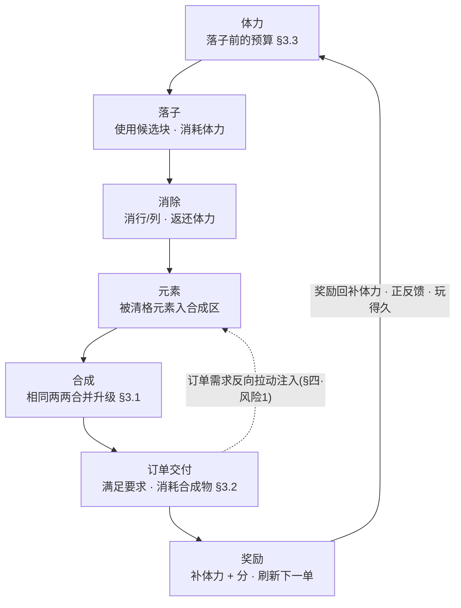
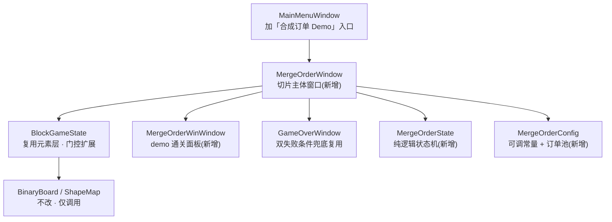

# 元素合成 + 订单 + 体力 Demo 切片

三套系统组成一条<mark>可自持的核心循环</mark>：**体力 → 落子 → 消除 → 元素 → 合成 → 订单交付 → 奖励**。候选块携带元素，消除时被清元素落入合成区两两合并升级；订单反向拉动玩家去消除指定元素，交付得奖励并刷新下一单。一条技巧驱动的正反馈链。

      <b>立项信息</b>
      <table>
        <tbody><tr><th>类型</th><td>垂直切片 / Demo 核心循环验证，非正式关卡内容</td></tr>
        <tr><th>基线</th><td>已落地的元素层（候选块携带元素 → 消除掉落，<code>BlockGameState</code> 元素层）。元素生成现状与符号映射以 <a href="#10-score-element-rm-collect">10 · 得分驱动元素生成</a> 为准。</td></tr>
        <tr><th>方向约束</th><td>离线还原 · <b>去变现</b>（体力无购买 / 无广告复活 / 无道具内购——项目红线）</td></tr>
        <tr><th>竞品参照</th><td>浪漫餐厅 / Gossip Harbor 的订单冷却刷新 + 锯齿波难度 + 体力模型（<b>取材不照抄</b>，数值按本作局长重算，见 <a href="#09-merge-order-energy::tradeoff">§六</a>）</td></tr>
        <tr><th>范围优先级</th><td>订单闭环优先（订单 → 交付 → 奖励 → 刷新跑通）；锯齿波难度可做简化实现，完整规则进文档</td></tr>
      </tbody></table>
    

<h2 id="why">一、切片构成</h2>

底层是**元素携带链路**：候选块携带元素，落子时转移到 `ElementArr`，消行/列时 `BlockGameState.HarvestClearedElements` 统计被清格元素并输出列表。本切片在这条链路上接三套系统，把被清元素导入一条<mark>可循环的经济</mark>：

| 环节 | 本切片做法 |
| --- | --- |
| 元素产出 | 候选块携带，类型为**当前订单所需**（需求拉动）+ 保底，数量由消除得分确定性产出（见 [§四·1](#09-merge-order-energy::risk1)） |
| 消除后 | 被清元素**落入合成区**，成为 Lv1 合成物 |
| 合成 | 合成区相同元素两两合并升级（Lv1×2 → Lv2 …） |
| 目标 | 订单要求「指定元素 + 指定等级 + 数量」，交付得奖励、刷新下一单 |
| 资源约束 | 落子耗体力、消除返还、订单奖励补充——技巧驱动「会消除 → 玩得久」 |
| 胜负 | 完成 N 单胜（demo 终点）/ 棋盘塞满 **或** 体力耗尽 GameOver |

<b>被清元素的去向</b>：被清元素路由进合成区，成为合成与订单经济的输入。「消除→统计被清元素」逻辑是 <code>BlockGameState.HarvestClearedElements</code>，输出本次被清元素列表供合成区摄入。

<h2 id="loop">二、核心循环</h2>

七个环节首尾相接成环：奖励的体力回填到「落子」预算（正反馈回路），订单需求**反向拉动**候选块注入（只产订单要的元素）：

正反馈链：奖励的体力回填到「落子」预算；订单需求**反向拉动**注入与消除（只产/只消订单要的元素）。<mark class="g">技巧（多消除）→ 体力净正 → 玩得久</mark>。

- **产出由消除得分确定**：元素数量随该次消除得分确定性产出（不靠概率），类型只产当前订单所需——「会消除」直接转化为「拿到要的元素」（见 [§四·风险1](#09-merge-order-energy::risk1)）。
- **两个失败条件**：棋盘塞满无可落子（硬死亡，复用 `GameOverWindow`）；体力耗尽且无法支付落子（软死亡，「精力耗尽」面板）。
- **demo 终点**：完成约定单数（默认 5 单）→ 通关面板。生产环境为无限订单流（仅靠失败条件结束），demo 设有限终点便于测试核对。

<h2 id="systems">三、三系统设计</h2>

<h3 id="merge">3.1 合成（Merge）</h3>

消除产出的每个元素以 Lv1 进入**合成区**；相同（类型 + 等级）两两合并升一级，直到封顶等级。

      <b>合成实现：自动配对库存（非空间拖拽）。</b>合成区按 <code>(类型, 等级)</code> 记数量。新元素到达 → <code>count[T][1]++</code>；只要某 <code>count[T][L] ≥ 2</code> 即 <code>count[T][L] -= 2; count[T][L+1]++</code>，向上级联到无法再合并为止。这是 <mark>2048 式自动合成</mark>，不引入空间拖拽棋盘。
      <ul>
        <li><b>为何不做浪漫餐厅式空间拖拽合成</b>：拖拽合成板是另一套完整交互（格子布局 / 拖放 / 占位），与 demo「订单闭环优先」的范围冲突。自动配对完整满足「相同两两合并升级」规则，开发量小、可单测，把玩家心智留在<b>方块层</b>（落子/消除决策）。空间拖拽合成列为后续增强（见 <a href="#09-merge-order-energy::tradeoff">§六</a>）。</li>
        <li><b>封顶等级</b> <code>MaxLevel = 3</code>（Lv1→Lv2→Lv3）。到顶不再合并，堆积等待订单消耗。</li>
        <li><b>等级折算基础元素</b>：Lv1=1，Lv2=2，Lv3=4。订单按此折算难度。</li>
        <li><b>合成区不设硬上限阻塞</b>：自动配对使每类每级数量恒 ≤1（满 2 即合），库存天然紧凑，不会「塞满阻塞」，规避了一个数值风险。</li>
      </ul>
    

<h3 id="order">3.2 订单（Order）</h3>

同时展示 `ActiveOrders = 2` 张订单。每单 = `(元素类型, 要求等级, 数量)`，例如「◆ Lv2 ×1」「★ Lv1 ×3」。

- <b>交付（手动）</b>：当合成区满足某单要求（库存有 ≥数量 的对应 `(类型,等级)`），该单「交付」按钮点亮；点击 → 扣除对应合成物 → 发奖 → 该订单槽刷新下一单。手动交付保留玩家「先交哪单」的取舍，且交付时机清晰可测。
- **奖励**：`体力 +8`（可溢出体力上限）+ `分数 = 等级 × 数量 × 50`（示例）。奖励数值为可调常量。
- **锯齿波难度刷新**：保证<mark class="g">「难单之后必出简单单」</mark>，每次会话都有够得着的目标。难度量 `d(单) = 数量 × 2^(等级-1)`（= 折算基础元素数）。刷新时下一单难度在「低 / 高」之间交替振荡（锯齿波）。
        
<b>demo 简化实现</b>：用一张<b>手编循环订单池</b>预先编排好锯齿波节奏（如 易→易→中→易→难→易…），<code>NextOrder()</code> 顺序取下一项。完整的程序化锯齿波（依玩家进度动态算 <code>d</code> 并约束相邻单一高一低）规则写在本节，dev 先实现循环池版本即可满足闭环验收。

- **体力瓶作为合成链产物**（浪漫餐厅模型，本作改造）：部分订单奖励可发一个「体力瓶」合成物，体力瓶本身可在合成区合并（瓶×2 → 大瓶），「使用」时回大额体力。**demo 范围内简化为奖励直接给体力**；体力瓶作为可合成奖励物列为文档化的后续项，避免拖累闭环。

<h3 id="energy">3.3 体力（Energy）</h3>

体力卡<mark>落子</mark>（本作的核心产出动作，对应浪漫餐厅卡「生成器」）。落子耗、消除返、订单补、自然恢复。

| 项 | 取值（demo 可调常量） | 说明 |
| --- | --- | --- |
| 起始体力 `EnergyStart` | 20 | 开局可支撑约 20 次落子起步 |
| 软上限 `EnergyCap` | 30 | 自然恢复 / 普通获取的封顶；**奖励可溢出此上限** |
| 落子消耗 `PlaceCost` | 1 / 块 | 从待选区使用一块即扣 1 |
| 消除返还 `ClearRefund` | = 本次消除行列数（1/行列） | 消 2 行返 2；技巧驱动「会消除→体力净正」 |
| 订单奖励 `OrderReward.Energy` | +8 | 主要补给来源，可溢出上限 |
| 自然恢复 `RegenPerTick / IntervalSec` | +1 / 120s | 参照浪漫餐厅 2 分钟 1 点；仅回到软上限。**demo 可简化**（加速或暂不实装，按现实时间跨会话恢复对单局测试意义小） |
| 体力耗尽兜底 | 软 GameOver「精力耗尽」 | 体力 &lt; `PlaceCost` 且场上有手持块 → 无法落子 → 复用 GameOver 流程（变体标题） |

<h2 id="risk">四、三个数值风险点的明确方案</h2>

boss 代决 §6 要求三个风险点在设计中给出明确方案，逐条如下。

<h3 id="risk1">风险 1 · 元素供给与订单卡死</h3>

**问题**：某订单所需的元素类型若长时间不产出，订单<mark class="r">卡死</mark>。

      <b>方案（两条，均确定性、无概率方差）：</b>
      <ol>
        <li><b>需求拉动</b>：待投放队列只压入<b>当前激活订单所需的元素类型</b>（按轮转游标均摊）。产出集中到「正被需要」的类型上，不产无用元素。</li>
        <li><b>得分驱动数量（确定性）</b>：每次消除按 <code>MergeOrderConfig.ElementsForScore(clearScore)</code> 算出元素数（<code>MinElementsPerClear=1</code> 保底，任何成功消除至少产 1），压入队列，补牌时 FIFO 抽干。无概率注入、无保底计数器——「会消除就有产出」由保底常量直接保证。映射与边界见 <a href="#10-score-element-rm-collect::map">10·§2.3</a>。</li>
      </ol>
    

<h3 id="risk2">风险 2 · 体力上限与单局落子数的匹配</h3>

**问题**：体力既要在早期不卡手，又要让玩家感到它是真实约束；上限/回速不能照抄浪漫餐厅（那是跨会话挂机节奏，本作是<mark class="y">单局活跃节奏</mark>）。

      <b>方案（按本作局长重算，给出预算数学）：</b>
      <ul>
        <li><b>预算下界</b>：无任何消除、无订单完成的最坏情况，起始 20 体力 = 20 次落子后软死亡——足够玩家撞出几次消除并完成首单。要求 <code>EnergyStart ≥ 完成首单所需落子数的期望</code>。</li>
        <li><b>可持续点</b>：一个约 3 块的批次配 1 次单行消除 ≈ 净 -2 体力；每 ~6–8 次落子完成 1 单 → +8 体力 → <mark class="g">熟练玩家体力净正</mark>，单局实际由「棋盘塞满」而非体力终结——正中 boss「技巧驱动：会消除→玩得久」的定位。</li>
        <li><b>取舍定档</b>：软上限取 <b>30</b>（demo 局长约数分钟）——高到早期不饿死、低到体力是被感知的资源。公式与各常量全部可调，dev/test 据此重配（核心不变量：<code>EnergyStart ≥ 完成首单的落子数</code>，否则首单前就饿死）。</li>
      </ul>
    

<h3 id="risk3">风险 3 · 落错子的兜底（无广告）</h3>

**问题**：落子耗体力且可能把棋盘逼进死局；一次失误代价大，而项目红线<mark class="y">禁广告复活</mark>。需要一个不依赖变现的解围阀。

      <b>方案 · 限次免费悔棋（推荐）：</b>每局 <code>UndoCharges = 3</code> 次免费悔棋（无广告、无内购，纯次数限制，契合去变现）。
      <ul>
        <li><b>悔棋范围</b>：仅撤销<b>最后一次落子</b>（单步）。落子前对受影响状态打快照：棋盘 <code>BinaryBoard</code>、元素层 <code>ElementArr</code>、体力值、合成区库存、订单进度、待投放元素队列 <code>PendingElements</code>。悔棋 = 整体回滚到该快照 + 把方块退回待选槽 + 退回该次落子扣的体力。</li>
        <li><b>更轻的备选</b>：仅当该次落子<b>未触发消除</b>（纯失误落子）时允许单步撤销，省去回滚消除/合成/订单的复杂度。若 dev 评估全量单步快照成本高，可先落地此备选版，全量快照列为增强。</li>
        <li>悔棋次数耗尽后回归正常死局判定（复用 <code>GameOverWindow</code>）。</li>
      </ul>
    

<h2 id="config">五、配置一览（可调常量）</h2>

全部硬编码在配置类 `MergeOrderConfig`（不接 Luban），<mark>改数即调难度</mark>。元素生成的旋钮含义见 [10·§2.3](#10-score-element-rm-collect::map)。

<table>
      <tbody><tr><th>模块</th><th>常量</th><th>默认</th></tr>
      <tr><td rowspan="3">合成</td><td><code>MaxLevel</code></td><td>3</td></tr>
      <tr><td><code>LevelBaseCost</code>（Lv1/2/3）</td><td>1 / 2 / 4</td></tr>
      <tr><td>合成区硬上限</td><td>无（自动配对天然紧凑）</td></tr>
      <tr><td rowspan="4">订单</td><td><code>ActiveOrders</code></td><td>2</td></tr>
      <tr><td><code>OrderReward.Energy / Score</code></td><td>+8 / 等级×数量×50</td></tr>
      <tr><td>难度量 <code>d(单)</code></td><td>数量 × 2^(等级-1)</td></tr>
      <tr><td><code>DemoGoalOrders</code>（通关单数）</td><td>5</td></tr>
      <tr><td rowspan="6">体力</td><td><code>EnergyStart</code></td><td>20</td></tr>
      <tr><td><code>EnergyCap</code>（软，奖励可溢出）</td><td>30</td></tr>
      <tr><td><code>PlaceCost</code></td><td>1 / 块</td></tr>
      <tr><td><code>ClearRefund</code></td><td>消除行列数</td></tr>
      <tr><td><code>RegenPerTick / IntervalSec</code></td><td>+1 / 120s（demo 可简化）</td></tr>
      <tr><td>耗尽兜底</td><td>软 GameOver</td></tr>
      <tr><td rowspan="4">元素生成 （得分驱动）</td><td><code>ScorePerElement</code></td><td>200（每 200 分折 1 元素）</td></tr>
      <tr><td><code>MinElementsPerClear</code></td><td>1（任何消除保底产 1）</td></tr>
      <tr><td><code>MaxElementsPerClear</code></td><td>4（单次消除封顶）</td></tr>
      <tr><td><code>MaxPendingElements</code></td><td>12（待投放队列上限）</td></tr>
      <tr><td>兜底</td><td><code>UndoCharges</code></td><td>3 / 局</td></tr>
    </tbody></table>

<h2 id="tradeoff">六、与浪漫餐厅 / Gossip Harbor 的取舍</h2>

| 维度 | 浪漫餐厅 / Gossip Harbor | 本切片取舍 |
| --- | --- | --- |
| 合成交互 | 空间拖拽合成板（格子布局 + 拖放） | **砍** → 自动配对库存。理由：拖拽合成是另一套完整交互，与「订单闭环优先」冲突；自动配对已满足「两两合并升级」规则。空间拖拽列为后续增强。 |
| 元素来源 | 生成器周期产出 | **改** → 候选块携带 + 消除掉落（本作的方块层就是产出动作），订单需求反向拉动注入 |
| 体力卡点 | 卡「生成器产出」 | **改** → 卡「落子」；且落子不保证消除（产出有方差），棋盘塞满是硬死亡——双失败条件是本作独有 |
| 体力数值 | 上限 100、2 分钟 1 点（跨会话挂机节奏） | **重算** → 上限 30、单局活跃节奏；自然恢复保留但 demo 可简化，主补给来自订单奖励 |
| 订单难度 | 冷却刷新 + 锯齿波 | **取材** → 锯齿波保留（难单后必出简单单）；demo 用手编循环池实现，完整程序化规则文档化 |
| 体力瓶 | 合成链上的可合并道具，使用回体力 | **文档化后续** → demo 订单奖励先直接给体力；体力瓶作为可合成奖励物列为增强项 |
| 变现 | 体力购买 / 广告 / 道具内购 | **全砍**（项目红线）→ 体力靠恢复+奖励，兜底靠限次免费悔棋，无任何付费/广告入口 |

<h2 id="hook">七、与现有模块的挂接点</h2>

**加法式 + 独立窗口 + 模式门控**策略：`MergeOrderMode` 门控本切片全部新逻辑；off 时（Classic）<mark>行为零变化</mark>。元素生成走得分驱动映射（`MergeOrderConfig.ElementsForScore` 算数量 → `MergeOrderState.PendingElements` 队列 → 补牌抽干），详见 [10·§四](#10-score-element-rm-collect::hook)。

| 现有 / 新增 | 挂接方式 |
| --- | --- |
| `Module/BlockBlast/BlockGameState.cs` | **复用**元素层（`ElementArr` / `BuildPiece` 注入 / `PlacePiece` 转移）。补牌时由 `DrainPendingElementsInto` 从得分驱动的待投放队列抽取元素写入新候选块（门控分支，Classic 路径不变）。`HarvestClearedElements` 输出本次被清元素列表供合成区摄入。 |
| 新增 `Module/BlockBlast/MergeOrderConfig.cs` | 静态配置类：合成/订单/体力/元素生成/兜底全部可调常量 + 循环订单池 + 得分→元素数映射 `ElementsForScore`。glyph/纯色取 `MergeElementVisual.Glyph/ColorOf`。 |
| 新增 `Module/BlockBlast/MergeOrderState.cs` | 新系统状态机（组合，不塞进 `BlockGameState` 以免污染）：合成区库存 `Dictionary<(MergeElement,int),int>` + 自动配对升级、订单队列 + 交付/刷新/锯齿波、体力值 + 扣/返/补/恢复、待投放元素队列 `PendingElements`、悔棋快照栈。纯逻辑、可单测。 |
| `Core/BinaryBoard.cs` / `Core/BlockShapeMap.cs` | **不改**。复用 `CanClearRowCols` / `PutBlock` / `CanPutAnyOf` / `IsEmpty`。 |
| 新增 `UI/BlockBlastUI/MergeOrderWindow.cs` | 切片主体窗口，复用 Classic 的棋盘/拖拽/ghost/落子流程。在 `PlaceAndResolve` 同构流程中插入：落子扣体力 → 消除返体力 → 被清元素入合成区（自动合并）→ 刷新订单/合成区/体力 UI → 检查订单可交付 → 检查 demo 通关 / 软死亡。新增悔棋按钮。 |
| 新增 UI：订单卡 ×2、合成区面板、体力条、悔棋按钮 | glyph/纯色零美术；订单卡显示「元素 glyph + Lv + 数量 + 交付按钮（满足点亮）」；合成区显示各类型当前等级 token；体力条显示 `当前/上限`。 |
| 新增 `UI/BlockBlastUI/MergeOrderWinWindow.cs` | demo 通关面板（完成 N 单），传「完成单数/奖励」摘要行。 |
| 复用 `UI/BlockBlastUI/GameOverWindow.cs` | 棋盘塞满 / 体力耗尽兜底；体力耗尽可传变体标题「精力耗尽」。 |
| `UI/BlockBlastUI/MainMenuWindow.cs` | 加「合成订单 Demo」入口按钮 → 打开 `MergeOrderWindow`。 |

<b>回归红线</b>：本切片全部新逻辑由 <code>MergeOrderMode</code> 门控。off 时 <code>BlockGameState</code> 的 Classic 落子/消除/补块/存档与现状<mark class="y">逐字节一致</mark>。Classic 回归测试必须通过。

<h2 id="scope">八、Demo 范围</h2>

<h3 id="scope-in">做什么（In Scope）</h3>

- 体力系统：落子扣、消除返、订单补、自然恢复（可简化）、耗尽软兜底。
- 合成区：消除元素入区 → 自动两两合并升级（封顶 Lv3）+ 显示。
- 订单系统：双订单、手动交付（消耗合成物 + 发奖）、刷新、锯齿波（循环池实现）。
- 元素生成：消除得分驱动数量（确定性映射）+ 需求拉动类型 + 队列上限。
- 落错兜底：限次免费悔棋（单步快照回滚）。
- demo 通关（完成 N 单 → 胜利面板）+ 双失败条件。
- 独立窗口 + 主菜单入口 + 模式门控（Classic 零影响）。

<h3 id="scope-out">不做什么（Out of Scope）</h3>

| 砍掉 | 原因 |
| --- | --- |
| 空间拖拽合成棋盘 | 另一套完整交互，与订单闭环优先冲突；自动配对已满足合并规则 |
| 体力瓶可合成道具的完整实装 | 奖励先直接给体力；瓶子合成链列为后续增强 |
| 完整程序化锯齿波（动态算难度约束相邻单） | demo 用手编循环池；完整规则已文档化 |
| 自然恢复的真实跨会话计时 / 离线结算 | 单局测试意义小；demo 可简化或暂不实装 |
| 关卡框架 / 存档 / 多关 / Luban 接表 | Demo 切片边界，配置硬编码 |
| 任何变现：体力购买 / 广告复活 / 道具内购 | 项目红线（去变现） |

<h2 id="risks">九、风险</h2>

| 风险 | 应对 |
| --- | --- |
| 元素供给不足饿死订单 | 需求拉动类型 + 得分驱动确定性数量 + 保底 `MinElementsPerClear≥1`（[§四·1](#09-merge-order-energy::risk1)） |
| 体力早期饿死 / 后期无感 | 预算数学定档（起始≥首单落子数、订单净正）；常量全可调（[§四·2](#09-merge-order-energy::risk2)） |
| 落错子死局且无广告复活 | 限次免费悔棋（单步快照，3 次/局）（[§四·3](#09-merge-order-energy::risk3)） |
| 悔棋快照范围广、易漏状态 | 集中快照 6 项状态于一处；备选轻量版（仅无消除时撤销）兜底 |
| 新逻辑污染 Classic | `MergeOrderMode` 门控 + 独立窗口 + 独立状态类；回归测试硬验收 |
| 自动合成削弱玩家合成层 agency | 玩家 agency 主要在方块层（落子/消除/先交哪单）；合成自动降低心智负担适配 demo；空间拖拽列为增强 |

      <h2>相关文档</h2>
      

        <a href="#">← 返回总览</a>
        <a href="#07-blockblast-code-architecture">BlockBlast 代码架构剖析</a>
      

    

