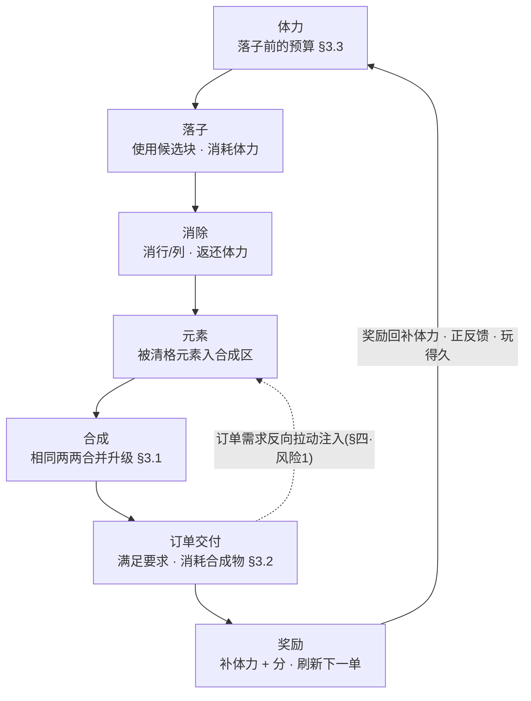

# 元素合成 + 订单 + 体力 Demo 切片

三套系统组成一条<mark>可自持的核心循环</mark>：**体力 → 落子 → 消除 → 元素 → 合成 → 订单交付 → 奖励**。候选块携带元素，消除时被清元素落入合成区两两合并升级；订单反向拉动玩家去消除指定元素，交付得奖励并刷新下一单。一条技巧驱动的正反馈链。

> [!NOTE]
> **立项信息**
>
> | 项 | 内容 |
> | --- | --- |
> | **类型** | 垂直切片 / Demo 核心循环验证，非正式关卡内容 |
> | **基线** | 已落地的元素层（候选块携带元素 → 消除掉落）。元素生成规则与视觉映射以 [10 · 得分驱动元素生成](#10-score-element-rm-collect) 为准。 |
> | **方向约束** | 离线还原 · **去变现**（体力无购买 / 无广告复活 / 无道具内购——项目红线） |
> | **竞品参照** | 浪漫餐厅 / Gossip Harbor 的订单冷却刷新 + 锯齿波难度 + 体力模型（**取材不照抄**，数值按本作局长重算，见 [§六](#09-merge-order-energy::tradeoff)） |
> | **范围优先级** | 订单闭环优先（订单 → 交付 → 奖励 → 刷新跑通）；锯齿波难度可做简化实现，完整规则进文档 |

## 一、切片构成 {#why}

底层是**元素携带链路**：候选块携带元素，落子时把元素转移到棋盘格上，消行/列时统计被清格元素并输出列表。本切片在这条链路上接三套系统，把被清元素导入一条<mark>可循环的经济</mark>：

| 环节 | 本切片做法 |
| --- | --- |
| 元素产出 | 候选块携带，类型为**当前订单所需**（需求拉动）+ 保底，数量由消除得分确定性产出（见 [§四·1](#09-merge-order-energy::risk1)） |
| 消除后 | 被清元素**落入合成区**，成为 Lv1 合成物 |
| 合成 | 合成区相同元素两两合并升级（Lv1×2 → Lv2 …） |
| 目标 | 订单要求「指定元素 + 指定等级 + 数量」，交付得奖励、刷新下一单 |
| 资源约束 | 落子耗体力、消除返还、订单奖励补充——技巧驱动「会消除 → 玩得久」 |
| 胜负 | 完成 N 单胜（demo 终点）/ 棋盘塞满 **或** 体力耗尽 GameOver |

> [!TIP]
> **被清元素的去向**：消除时统计被清格的元素并输出本次列表，该列表路由进合成区，成为合成与订单经济的输入。

## 二、核心循环 {#loop}

七个环节首尾相接成环：奖励的体力回填到「落子」预算（正反馈回路），订单需求**反向拉动**候选块注入（只产订单要的元素）：

正反馈链：奖励的体力回填到「落子」预算；订单需求**反向拉动**注入与消除（只产/只消订单要的元素）。<mark class="g">技巧（多消除）→ 体力净正 → 玩得久</mark>。

- **产出由消除得分确定**：元素数量随该次消除得分确定性产出（不靠概率），类型只产当前订单所需——「会消除」直接转化为「拿到要的元素」（见 [§四·风险1](#09-merge-order-energy::risk1)）。
- **两个失败条件**：棋盘塞满无可落子（硬死亡，进入通用结束面板）；体力耗尽且无法支付落子（软死亡，「精力耗尽」面板）。
- **demo 终点**：完成约定单数（默认 5 单）→ 通关面板。生产环境为无限订单流（仅靠失败条件结束），demo 设有限终点便于测试核对。

## 三、三系统设计 {#systems}

### 3.1 合成（Merge） {#merge}

消除产出的每个元素以 Lv1 进入**合成区**；相同（类型 + 等级）两两合并升一级，直到封顶等级。

> [!TIP]
> **合成方式：自动配对库存（非空间拖拽）。**合成区按「类型 + 等级」记数量。新元素到达即记入该类型的 Lv1 计数；只要某「类型 + 等级」数量 ≥ 2，立即扣 2 并把上一级数量 +1，向上级联到无法再合并为止。这是 **2048 式自动合成**，不引入空间拖拽棋盘。
>
> - **为何不做浪漫餐厅式空间拖拽合成**：拖拽合成板是另一套完整交互（格子布局 / 拖放 / 占位），与 demo「订单闭环优先」的范围冲突。自动配对完整满足「相同两两合并升级」规则，开发量小、可单测，把玩家心智留在**方块层**（落子/消除决策）。空间拖拽合成列为后续增强（见 [§六](#09-merge-order-energy::tradeoff)）。
> - **封顶等级 = 3**（Lv1→Lv2→Lv3）。到顶不再合并，堆积等待订单消耗。
> - **等级折算基础元素**：Lv1=1，Lv2=2，Lv3=4。订单按此折算难度。
> - **合成区不设硬上限阻塞**：自动配对使每类每级数量恒 ≤1（满 2 即合），库存天然紧凑，不会「塞满阻塞」，规避了一个数值风险。

### 3.2 订单（Order） {#order}

同时展示 2 张订单。每单 = 「元素类型 + 要求等级 + 数量」，例如「◆ Lv2 ×1」「★ Lv1 ×3」。

- **交付（手动）**：当合成区满足某单要求（库存有 ≥数量 的对应类型 + 等级），该单「交付」按钮点亮；点击 → 扣除对应合成物 → 发奖 → 该订单槽刷新下一单。手动交付保留玩家「先交哪单」的取舍，且交付时机清晰可测。
- **奖励**：体力 +8（可溢出体力上限）+ 分数 = 等级 × 数量 × 50（示例）。奖励数值为可调常量。
- **锯齿波难度刷新**：保证<mark class="g">「难单之后必出简单单」</mark>，每次会话都有够得着的目标。难度量 d(单) = 数量 × 2^(等级-1)（= 折算基础元素数）。刷新时下一单难度在「低 / 高」之间交替振荡（锯齿波）。

> [!NOTE]
> **demo 简化做法**：用一张**手编循环订单池**预先编排好锯齿波节奏（如 易→易→中→易→难→易…），按序取下一项。完整的程序化锯齿波（依玩家进度动态算难度并约束相邻单一高一低）规则写在本节；先做循环池版本即可满足闭环验收。

- **体力瓶作为合成链产物**（浪漫餐厅模型，本作改造）：部分订单奖励可发一个「体力瓶」合成物，体力瓶本身可在合成区合并（瓶×2 → 大瓶），「使用」时回大额体力。**demo 范围内简化为奖励直接给体力**；体力瓶作为可合成奖励物列为文档化的后续项，避免拖累闭环。

### 3.3 体力（Energy） {#energy}

体力卡<mark>落子</mark>（本作的核心产出动作，对应浪漫餐厅卡「生成器」）。落子耗、消除返、订单补、自然恢复。

| 项 | 取值（demo 可调常量） | 说明 |
| --- | --- | --- |
| 起始体力 | 20 | 开局可支撑约 20 次落子起步 |
| 软上限 | 30 | 自然恢复 / 普通获取的封顶；**奖励可溢出此上限** |
| 落子消耗 | 1 / 块 | 从待选区使用一块即扣 1 |
| 消除返还 | = 本次消除行列数（1/行列） | 消 2 行返 2；技巧驱动「会消除→体力净正」 |
| 订单奖励体力 | +8 | 主要补给来源，可溢出上限 |
| 自然恢复 | +1 / 120s | 参照浪漫餐厅 2 分钟 1 点；仅回到软上限。**demo 可简化**（加速或暂不实装，按现实时间跨会话恢复对单局测试意义小） |
| 体力耗尽兜底 | 软 GameOver「精力耗尽」 | 体力 &lt; 落子消耗 且场上有手持块 → 无法落子 → 进入结束流程（变体标题） |

## 四、三个数值风险点的明确方案 {#risk}

三个风险点在设计中给出明确方案，逐条如下。

### 风险 1 · 元素供给与订单卡死 {#risk1}

**问题**：某订单所需的元素类型若长时间不产出，订单<mark class="r">卡死</mark>。

> [!TIP]
> **方案（两条，均确定性、无概率方差）：**
>
> 1.  **需求拉动**：待投放队列只压入**当前激活订单所需的元素类型**（在多张订单的需求类型间轮转均摊）。产出集中到「正被需要」的类型上，不产无用元素。
> 2.  **得分驱动数量（确定性）**：每次消除按消除得分算出元素数（保底 1，任何成功消除至少产 1），压入队列，补牌时按容量加权随机分摊到 3 个新候选块。无概率注入、无保底计数器——「会消除就有产出」由保底常量直接保证。映射、分摊算法与边界见 [10·§2.3](#10-score-element-rm-collect::map) 与 [10·§2.2](#10-score-element-rm-collect::model)。

### 风险 2 · 体力上限与单局落子数的匹配 {#risk2}

**问题**：体力既要在早期不卡手，又要让玩家感到它是真实约束；上限/回速不能照抄浪漫餐厅（那是跨会话挂机节奏，本作是<mark class="y">单局活跃节奏</mark>）。

> [!TIP]
> **方案（按本作局长重算，给出预算数学）：**
>
> - **预算下界**：无任何消除、无订单完成的最坏情况，起始 20 体力 = 20 次落子后软死亡——足够玩家撞出几次消除并完成首单。要求 **起始体力 ≥ 完成首单所需落子数的期望**。
> - **可持续点**：一个约 3 块的批次配 1 次单行消除 ≈ 净 -2 体力；每 ~6–8 次落子完成 1 单 → +8 体力 → **熟练玩家体力净正**，单局实际由「棋盘塞满」而非体力终结——正中「技巧驱动：会消除→玩得久」的定位。
> - **取舍定档**：软上限取 **30**（demo 局长约数分钟）——高到早期不饿死、低到体力是被感知的资源。公式与各常量全部可调，据此重配（核心不变量：**起始体力 ≥ 完成首单的落子数**，否则首单前就饿死）。

### 风险 3 · 落错子的兜底（无广告） {#risk3}

**问题**：落子耗体力且可能把棋盘逼进死局；一次失误代价大，而项目红线<mark class="y">禁广告复活</mark>。需要一个不依赖变现的解围阀。

> [!TIP]
> **方案 · 限次免费悔棋（推荐）：**每局 3 次免费悔棋（无广告、无内购，纯次数限制，契合去变现）。
>
> - **悔棋范围**：仅撤销**最后一次落子**（单步）。落子前对受影响状态打快照，六项：当前棋盘占位、棋盘上的元素分布、体力值、合成区库存、订单进度、待投放元素队列。悔棋 = 整体回滚到该快照 + 把方块退回待选槽 + 退回该次落子扣的体力。
> - **更轻的备选**：仅当该次落子**未触发消除**（纯失误落子）时允许单步撤销，省去回滚消除/合成/订单的复杂度。若全量单步快照成本高，可先落地此备选版，全量快照列为增强。
> - 悔棋次数耗尽后回归正常死局判定（进入通用结束面板）。

## 五、配置一览（可调常量） {#config}

全部数值集中为一组可调常量（demo 不接 Luban、直接硬编码），<mark>改数即调难度</mark>。元素生成的旋钮含义见 [10·§2.3](#10-score-element-rm-collect::map)。

| 模块 | 常量 | 默认 |
| --- | --- | --- |
| 合成 | 封顶等级 | 3 |
| 合成 | 等级折算基础元素（Lv1/2/3） | 1 / 2 / 4 |
| 合成 | 合成区硬上限 | 无（自动配对天然紧凑） |
| 订单 | 同时激活订单数 | 2 |
| 订单 | 订单奖励（体力 / 分数） | +8 / 等级×数量×50 |
| 订单 | 难度量 d(单) | 数量 × 2^(等级-1) |
| 订单 | demo 通关单数 | 5 |
| 体力 | 起始体力 | 20 |
| 体力 | 软上限（奖励可溢出） | 30 |
| 体力 | 落子消耗 | 1 / 块 |
| 体力 | 消除返还 | 消除行列数 |
| 体力 | 自然恢复 | +1 / 120s（demo 可简化） |
| 体力 | 耗尽兜底 | 软 GameOver |
| 元素生成 （得分驱动） | 每元素折算分数 | 200（每 200 分折 1 元素） |
| 元素生成 （得分驱动） | 单次消除保底元素数 | 1（任何消除保底产 1） |
| 元素生成 （得分驱动） | 单次消除封顶元素数 | 4 |
| 元素生成 （得分驱动） | 待投放队列上限 | 12 |
| 兜底 | 每局悔棋次数 | 3 / 局 |

## 六、与浪漫餐厅 / Gossip Harbor 的取舍 {#tradeoff}

| 维度 | 浪漫餐厅 / Gossip Harbor | 本切片取舍 |
| --- | --- | --- |
| 合成交互 | 空间拖拽合成板（格子布局 + 拖放） | **砍** → 自动配对库存。理由：拖拽合成是另一套完整交互，与「订单闭环优先」冲突；自动配对已满足「两两合并升级」规则。空间拖拽列为后续增强。 |
| 元素来源 | 生成器周期产出 | **改** → 候选块携带 + 消除掉落（本作的方块层就是产出动作），订单需求反向拉动注入 |
| 体力卡点 | 卡「生成器产出」 | **改** → 卡「落子」；且落子不保证消除（产出有方差），棋盘塞满是硬死亡——双失败条件是本作独有 |
| 体力数值 | 上限 100、2 分钟 1 点（跨会话挂机节奏） | **重算** → 上限 30、单局活跃节奏；自然恢复保留但 demo 可简化，主补给来自订单奖励 |
| 订单难度 | 冷却刷新 + 锯齿波 | **取材** → 锯齿波保留（难单后必出简单单）；demo 用手编循环池实现，完整程序化规则文档化 |
| 体力瓶 | 合成链上的可合并道具，使用回体力 | **文档化后续** → demo 订单奖励先直接给体力；体力瓶作为可合成奖励物列为增强项 |
| 变现 | 体力购买 / 广告 / 道具内购 | **全砍**（项目红线）→ 体力靠恢复+奖励，兜底靠限次免费悔棋，无任何付费/广告入口 |

## 七、与 Classic 模式的关系 {#hook}

**加法式 + 独立窗口 + 模式门控**策略：本切片全部新逻辑由「合成订单」模式门控，关闭时（Classic 经典模式）<mark>行为零变化</mark>。元素生成走得分驱动映射（按消除得分算数量 → 入待投放队列 → 补牌时按容量加权随机分摊到 3 块），详见 [10·§四](#10-score-element-rm-collect::hook)。

本切片以独立窗口承载，复用 Classic 的棋盘 / 拖拽 / 落子流程，在落子结算流程中插入：落子扣体力 → 消除返体力 → 被清元素入合成区（自动合并）→ 刷新订单 / 合成区 / 体力显示 → 检查订单可交付 → 检查 demo 通关 / 软死亡。失败兜底（棋盘塞满 / 体力耗尽）进入通用结束面板，体力耗尽时用变体标题「精力耗尽」。界面零美术（glyph + 纯色）：订单卡显示「元素 glyph + 等级 + 数量 + 交付按钮（满足点亮）」、合成区显示各类型当前等级、体力条显示当前/上限。

> [!NOTE]
> **回归红线**：本切片全部新逻辑由「合成订单」模式门控。模式关闭时，Classic 的落子 / 消除 / 补块 / 存档行为与现状<mark class="y">逐字节一致</mark>。Classic 回归测试必须通过。

## 八、Demo 范围 {#scope}

### 做什么（In Scope） {#scope-in}

- 体力系统：落子扣、消除返、订单补、自然恢复（可简化）、耗尽软兜底。
- 合成区：消除元素入区 → 自动两两合并升级（封顶 Lv3）+ 显示。
- 订单系统：双订单、手动交付（消耗合成物 + 发奖）、刷新、锯齿波（循环池实现）。
- 元素生成：消除得分驱动数量（确定性映射）+ 需求拉动类型 + 队列上限。
- 落错兜底：限次免费悔棋（单步快照回滚）。
- demo 通关（完成 N 单 → 胜利面板）+ 双失败条件。
- 独立窗口 + 主菜单入口 + 模式门控（Classic 零影响）。

### 不做什么（Out of Scope） {#scope-out}

| 砍掉 | 原因 |
| --- | --- |
| 空间拖拽合成棋盘 | 另一套完整交互，与订单闭环优先冲突；自动配对已满足合并规则 |
| 体力瓶可合成道具的完整实装 | 奖励先直接给体力；瓶子合成链列为后续增强 |
| 完整程序化锯齿波（动态算难度约束相邻单） | demo 用手编循环池；完整规则已文档化 |
| 自然恢复的真实跨会话计时 / 离线结算 | 单局测试意义小；demo 可简化或暂不实装 |
| 关卡框架 / 存档 / 多关 / Luban 接表 | Demo 切片边界，配置硬编码 |
| 任何变现：体力购买 / 广告复活 / 道具内购 | 项目红线（去变现） |

## 九、风险 {#risks}

| 风险 | 应对 |
| --- | --- |
| 元素供给不足饿死订单 | 需求拉动类型 + 得分驱动确定性数量 + 保底（每次消除至少产 1）（[§四·1](#09-merge-order-energy::risk1)） |
| 体力早期饿死 / 后期无感 | 预算数学定档（起始≥首单落子数、订单净正）；常量全可调（[§四·2](#09-merge-order-energy::risk2)） |
| 落错子死局且无广告复活 | 限次免费悔棋（单步快照，3 次/局）（[§四·3](#09-merge-order-energy::risk3)） |
| 悔棋快照范围广、易漏状态 | 集中快照 6 项状态于一处；备选轻量版（仅无消除时撤销）兜底 |
| 新逻辑污染 Classic | 模式门控 + 独立窗口 + **元层进度用独立组合状态、不并进经典棋盘状态(避免污染经典无尽路径)**；回归测试硬验收 |
| 自动合成削弱玩家合成层 agency | 玩家 agency 主要在方块层（落子/消除/先交哪单）；合成自动降低心智负担适配 demo；空间拖拽列为增强 |

## 相关文档

- [← 返回总览](#)
- [BlockBlast 代码架构剖析](#07-blockblast-code-architecture)
