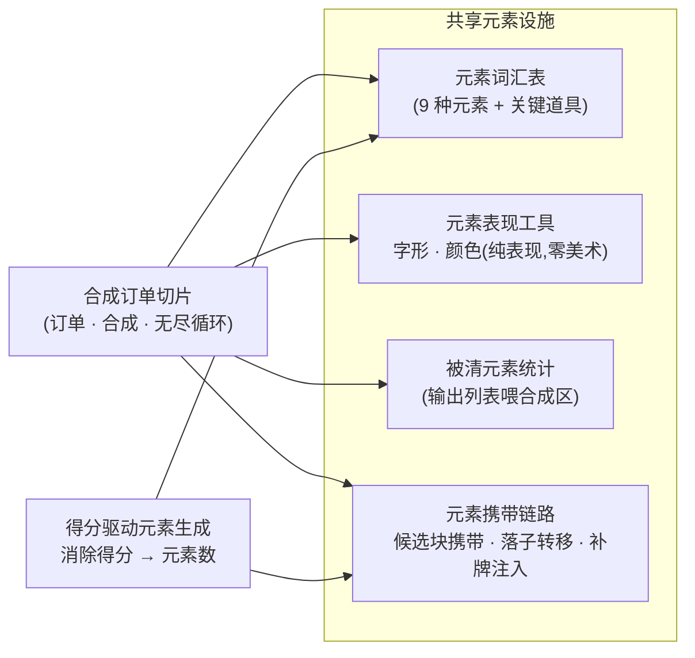
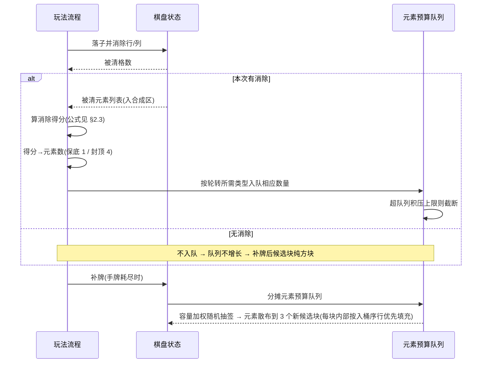

# 得分驱动元素生成

[合成订单切片](#09-merge-order-energy)的元素产出由<mark>消除得分驱动数量</mark>：消得越狠，待选区携带的元素越多。本篇定义这套生成模型——得分函数、类型选择、配置旋钮。

> [!NOTE]
> **立项信息**
>
> | 项 | 内容 |
> | --- | --- |
> | **类型** | 数值模型 合成订单切片的元素生成模型 |
> | **设计意图** | 元素生成与消除得分关联，得分越高产出越多——「会消除」直接奖励到产出上，比固定比例灵活。 |
> | **方向约束** | 离线还原 · 去变现（项目红线） |
> | **影响范围** | 仅 [合成订单切片](#09-merge-order-energy)的元素生成；合成 / 订单 / 体力 / 悔棋玩法不涉及。元素携带链路（候选块携带 → 落子转移 → 消除统计）是本模型的载体。 |

## 一、模型一句话 {#why}

每次落子若触发消除，用**该次消除的得分**算出元素数量，挑出相应数量的当前订单所需类型压入<mark>元素预算队列</mark>，补牌时按<mark>容量加权随机</mark>分摊到 3 个新候选块——每元素以「1 格 = 1 票」均权抽签落入某块。无消除则不入队，后续候选块为纯方块。

- **数量**由得分确定（§2.3 映射），**类型**由需求拉动（§2.4）——两条都是确定性，无概率。
- 得分越高 → 元素数量越大 → 队列积压越多 → 后续候选块携带越多元素。
- 得分仅作元素生成的**内部驱动量**，不计入玩家可见的订单得分。

## 二、得分驱动元素生成模型 {#score-element}

### 2.1 为何用得分驱动数量 {#cur}

元素产出数量与**该次消除的得分**挂钩，而非按固定比例。固定比例的产出与玩家表现脱钩——清一行和清四行携带的元素数一样，「会消除」没有被奖励到产出上。得分驱动让<mark class="g">消得越狠、产出越多</mark>，把技巧直接转化为经济收益。一个「每多少分折一个元素」的旋钮（§2.3）调松紧，比固定比例灵活。

### 2.2 得分 → 元素预算队列 {#model}

- **触发即得分**：每次落子若触发消除，就用**该次消除的得分**算元素数量。无消除 → 不入队 → 后续候选块纯方块。开局首手必纯方块（队列初始空）。
- **预算队列承接**：算出的元素数不立即凭空出现，而是压入<mark>元素预算队列</mark>；**补牌时**按<mark>容量加权随机</mark>分摊到 3 个新候选块——每元素以「1 格 = 1 票」均权抽签落入某块，大块（cellCount 高）统计上拿到更多、小块少但每块都有机会；每块内部按入桶序写到 `Elements` 前若干格（与落子转移的行优先填充格顺序同源），余格留空。元素始终出现在新发的候选块上，使生成逻辑可独立验证。
- **队列天然满足两个边界**：无消除 → 队列不增长 → 候选块干净；得分高 → 数量大 → 队列积压多 → 后续候选块携带更多元素。

> [!NOTE]
> **投放时机**：采用<mark>补牌时分摊队列</mark>（队列吃光或 3 块满格止），玩家感知为「狠消一手 → 下一批候选块明显更多元素，且散布在 3 块之间」。备选「消除当下立即注入到待选区现有未落子块」反馈更即时，但现有未落子块容量有限（0–2 块），列为后续 UX 增强（见 <a href="#10-score-element-rm-collect::decide">§六</a>）。

### 2.3 得分 → 元素数量映射 {#map}

采用**线性系数 + 保底 + 封顶**，「每多少分折一个元素」是调松紧的旋钮：

> [!TIP]
> **映射公式：**
>
> 得分 ≤ 0 → 元素数 = 0
> 得分 > 0 → 元素数 = Clamp( ⌈得分 ÷ 每元素得分⌉, 单次保底, 单次封顶 )
>
> | 常量 | 默认 | 含义 / 理由 |
> | --- | --- | --- |
> | 每元素得分 | **200** | 每 200 分折 1 个元素。略低于一次双消的分值，使单消稳得 1、双消得 2 —— 平滑的「多消多得」直觉。**这是「灵活」旋钮**：调小更慷慨，调大更吝啬。 |
> | 单次保底 | **1** | 保底：任何成功消除至少产 1 元素，让「产出→合成→订单」循环不会卡在小消除上——契合「会消除就有奖励」的意图。 |
> | 单次封顶 | **4** | 单次消除封顶。四消已是常规上限；4 个一级元素足以喂订单又不淹没待选区（一组 3 块约 15 格，即便三次满额消除 = 12 ≤ 15）。挡住超高连消刷爆经济。 |
> | 队列积压上限 | **12** | 队列总积压上限（≈一组候选块容量）。超出则不再入队——避免极端情形下元素积压速度远超候选格承接，扭曲经济。 |

**得分公式**`得分 = 被清格数 × 10 + 被清行列数² × 30`（与 Classic [现有计分](#07-blockblast-code-architecture)同源，「行列数平方」项已天然让多行消除拿更高分→更多元素）。代入典型消除：

| 消除类型 | 被清格数 | 得分 | → 元素数 |
| --- | --- | --- | --- |
| 无消除 | 0 | 0 | **0**（待选区纯方块） |
| 单行/列 | 8 | 80 + 30 = 110 | ⌈110/200⌉=1 → **1** |
| 双消（两行 / 行列交叉） | 15–16 | ≈270–280 | ⌈280/200⌉=2 → **2** |
| 三消 | ≈22–24 | ≈500 | ⌈500/200⌉=3 → **3** |
| 四消 | ≈29–32 | ≈780 | ⌈780/200⌉=4 → **4** |
| 五消及以上（极罕见） | 36+ | 1100+ | ⌈5.5⌉=6 → 封顶 **4** |

> [!NOTE]
> **边界处理小结**：0 分 → 0 元素（满足「开局/无消除纯方块」）；超高连消 → 封顶 4（不刷爆）；单消 → 保底 1（小消除不空手）。整段是<mark>单调递增、确定性</mark>（无随机），逐档可验证。

### 2.4 元素类型选择：需求拉动 + 轮转均摊 {#type}

队列里这些元素是**什么类型**，由<mark>需求拉动</mark>决定：只从当前激活订单所需类型的并集里取，保证产出对订单有用。多个所需类型时按**轮转游标**均摊，让双订单都被喂到。**当前无激活订单所需类型时（所需并集为空），本次不入队**——不产订单用不上的元素。

> [!TIP]
> **不设保底计数器**：本模型是确定性生成 + 轮转均摊，任何消除都必产 ≥1 且类型轮流覆盖所需，**结构上不会饿死某类型**，无需额外保底。

### 2.5 得分量与玩家可见分的隔离 {#drop}

这个消除得分仅作元素生成的**内部驱动量**，<mark>不计入</mark>玩家可见的订单得分（订单交付累计才是经营成绩）。会消除的玩家拿到更多元素，但合成订单的经济展示不被这个内部量通胀。

## 三、本模型依赖的元素设施 {#remove}

得分驱动生成不自带元素管线，而是**构建在**一套与合成订单切片共用的元素设施之上：元素词汇表、表现工具、被清元素统计、候选块携带链路。本模型只往这套设施的**队列**里写、在**补牌时**读，不改设施本身。依赖关系一图概览（谁用了哪一层）：

### 3.1 元素词汇表与表现 {#removed}

| 设施 | 是什么 | 谁依赖 |
| --- | --- | --- |
| 元素词汇表（9 种元素 + 关键道具） | <mark class="g">元素词汇表</mark>本身。得分驱动生成挑的类型、合成订单的合成物全用它。 | 棋盘状态 / 合成订单切片 / 得分驱动生成 |
| 元素表现工具（字形 / 颜色） | **纯元素表现工具**（字形 / 纯色，零美术）。 | 合成订单各处渲染 |

### 3.2 被清元素统计与携带链路 {#keep}

得分驱动生成的「写队列、补牌投放」两端都落在这条链路上——**队列**由本模型写（§四），**携带与转移**是链路既有能力，本模型不改。

| 设施 | 是什么 | 谁依赖 |
| --- | --- | --- |
| 被清元素统计 | 「统计被清格元素并输出列表」通用助手（喂合成区）。 | 合成订单（消除入合成区） |
| 元素携带链路：候选块携带 → 落子转移 → 补牌注入 | 得分驱动生成与合成订单**共同的元素流水线**。本模型只在补牌时把队列元素按容量加权随机分摊到 3 个新候选块。 | 得分驱动生成 / 合成订单切片 |

### 3.3 命名归属 {#misnomer}

这套设施整体归属于合成订单经济。其中元素词汇表、表现工具与被清元素统计不绑定具体界面，得分驱动生成与合成订单各界面共用同一套。

## 四、一次落子的元素流 {#hook}

「一次落子」的完整元素流时序——入队发生在<mark>消除处理中、补牌之前</mark>，投放发生在**补牌时**，两个时机隔了一次交互（这正是「狠消一手 → 下一批候选块更多元素」的玩家感知来源）。

入队发生在补牌**之前**，使紧随的补牌分摊队列；这是「入队—投放隔一次交互」的设计来源。各环节职责：被清元素统计喂合成区、得分换算元素数、按轮转所需类型入队（受队列积压上限截断）、补牌时按容量加权随机分摊到 3 个新候选块；合成区摄入 / 返体力 / 连击弹字各自独立（无尽模型下无通关 / 软死亡判定，[设计 49](#49-infinite-no-rounds)）。

悔棋时元素预算队列须**深拷贝**进快照，使撤销「引发消除的落子」时已入队的元素预算一并回退。

> [!NOTE]
> **回归红线**：合成订单切片整体由模式开关门控；关闭时 Classic 落子 / 消除 / 补块 / 存档<mark>逐字节不变</mark>。得分驱动生成的队列 / 分摊逻辑只在合成订单模式开启且元素状态存在时生效。Classic 回归测试必须全绿。

## 五、验收点 {#accept}

### 得分 → 元素映射

- **映射逐档**：得分换算元素数：0→0、110→1、280→2、500→3、780→4、2000→4（封顶）。负/0 分 → 0。
- **无消除纯方块**：连续落子不触发消除 → 元素预算队列恒空 → 补牌后候选块不携带元素。开局首手三块全干净。
- **消除即入队、补牌即投放**：构造一次得分 S 的消除 → 队列恰新增「该得分换算的元素数」个 → 触发补牌后，3 个新候选块按容量加权随机分摊携带元素（各块所得数之和 = min(队列元素数, 3 块总 cellCount)，分布性上至少 2 块拿到 ≥1 元素），类型均属于当前订单所需类型。
- **得分越高越多**：四消产出的元素数 > 单消（同所需类型下）。
- **类型轮转均摊**：双订单不同类型时，连续入队的元素类型轮流覆盖两类，不长期偏科。
- **积压封顶**：连续高分消除使待入队总数超队列积压上限 → 队列长度被截断、不超上限。
- **悔棋回滚队列**：落子→引发消除→入队若干个，悔棋后元素预算队列恢复到落子前（已入队的被撤回），剩余悔棋次数 -1。
- **关闭模式零触**：合成订单模式关闭时落子不入队、候选块不携带元素。

### 设施完整 + 不回归

- **共享设施存活**：元素词汇表 / 元素表现（字形、颜色）/ 被清元素统计仍在且被合成订单正常引用。
- **合成订单切片不回归**：合成区自动配对 / 订单交付刷新 / 体力扣返补 / 悔棋——既有用例全绿（无尽模型下无通关 / 双失败判定，[设计 49](#49-infinite-no-rounds)）。
- **Classic 不回归**：Classic 计分（与合成订单共用同一公式后）逐数字不变。
- **编译通过**：全工程 0 error、无悬空引用、无孤儿资源元数据。

> [!NOTE]
> **运行验证**：编译 + 全量 EditMode 单测经命令行无界面模式跑。Play 手验（拖拽落子时元素随得分出现在新候选块的目视确认）列人工遗留。

## 六、可调旋钮（交 boss/用户） {#decide}

| # | 旋钮 | 当前取定（默认值） |
| --- | --- | --- |
| 1 | **得分→元素映射数值**（核心） | 每元素得分 200 + 保底 1 + 封顶 4（§2.3）。慷慨度旋钮：调小更慷慨、调大更稀有。 |
| 2 | 元素投放时机与分摊方式 | **补牌时按容量加权随机分摊到 3 个新候选块**（每元素以 1 格 = 1 票均权抽签）；备选「消除当下即时注入待选区现有块」列后续 UX 增强（§2.2）。 |

## 七、风险 {#risk}

| 风险 | 应对 |
| --- | --- |
| 悔棋漏回滚元素预算队列 | 快照深拷贝队列 + 专项用例（§五·悔棋回滚队列）。 |
| 计分公式两路共用，改公式同时影响 Classic 与合成订单计分 | 硬约束「Classic 计分逐数字不变」+ 回归用例守门。 |
| 误删共享设施（元素词汇表 / 元素表现等）连累合成订单 | §三 依赖清单逐项标注依赖方；编译 0 error + 合成订单回归为硬验收。 |
| 映射数值不合手感（太多/太少元素） | 「每元素得分」等全为可调常量，配平后一处改数即可。 |

## 相关文档

- [← 返回总览](#)
- [合成订单切片](#09-merge-order-energy)
- [BlockBlast 代码架构剖析](#07-blockblast-code-architecture)
