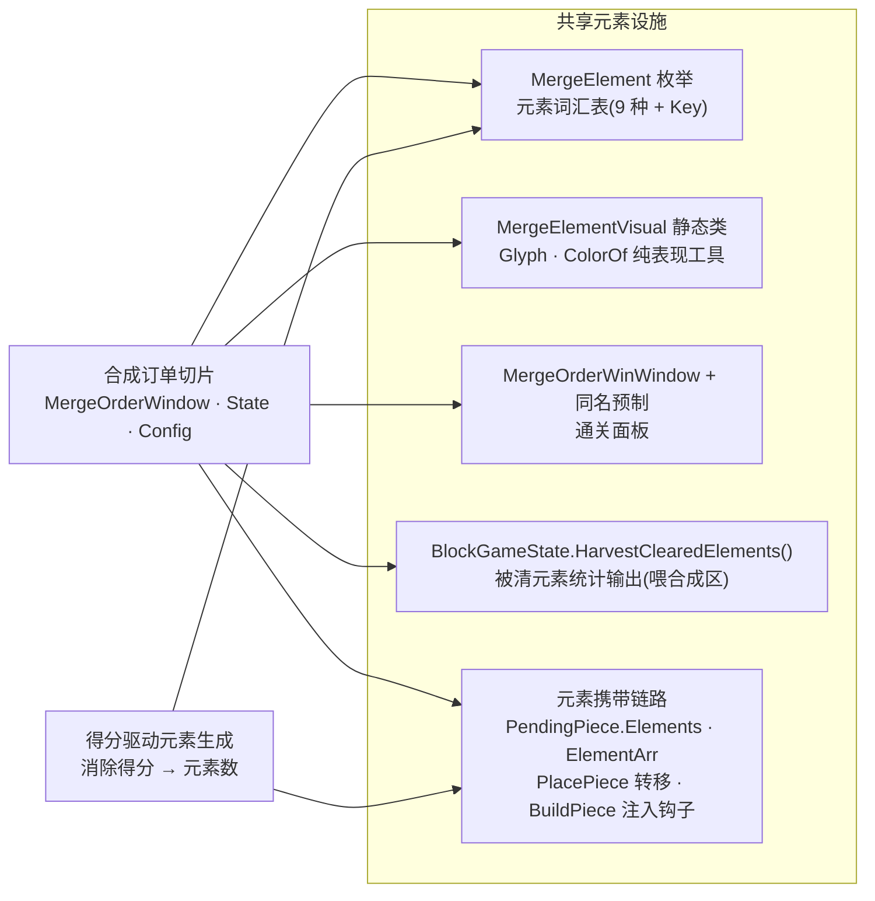
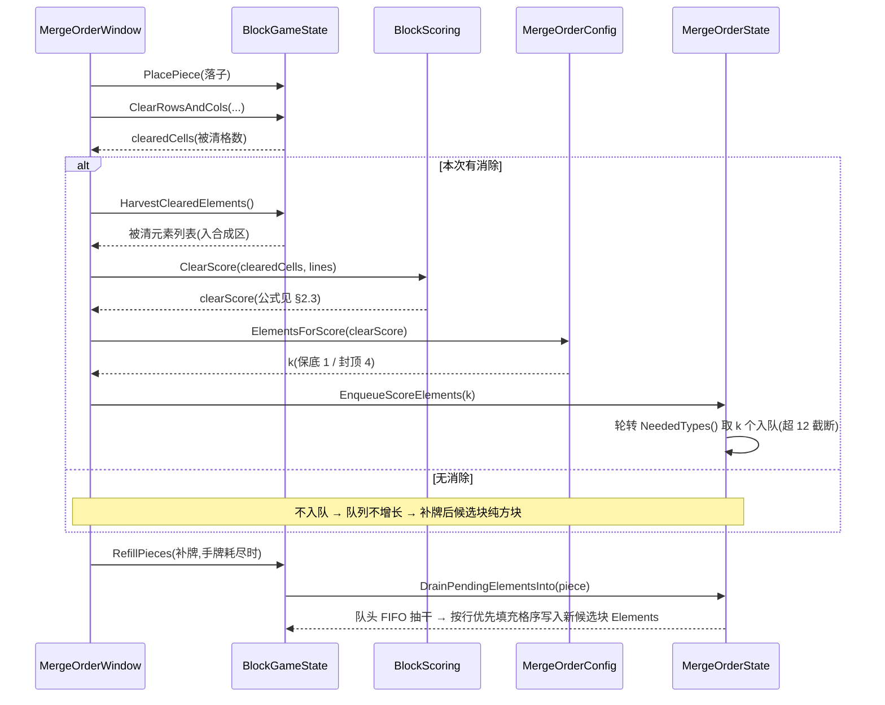

# 得分驱动元素生成

[合成订单切片](#09-merge-order-energy)的元素产出由<mark>消除得分驱动数量</mark>：消得越狠，待选区携带的元素越多。本篇定义这套生成模型——得分函数、类型选择、配置旋钮与挂接点。

      <b>立项信息</b>
      <table>
        <tbody><tr><th>类型</th><td>数值模型 合成订单切片的元素生成模型</td></tr>
        <tr><th>设计意图</th><td>元素生成与消除得分关联，得分越高产出越多——「会消除」直接奖励到产出上，比固定比例灵活。</td></tr>
        <tr><th>方向约束</th><td>离线还原 · 去变现（项目红线）</td></tr>
        <tr><th>影响范围</th><td>仅 <a href="#09-merge-order-energy">合成订单切片</a>的元素生成；合成 / 订单 / 体力 / 通关 / 悔棋系统不涉及。元素携带链路（候选块携带 → 落子转移 → 消除统计）是本模型的载体。</td></tr>
      </tbody></table>
    

<h2 id="why">一、模型一句话</h2>

每次落子若触发消除，用**该次消除的得分** `clearScore` 算出元素数 `k`，挑 `k` 个当前订单所需类型压入<mark>元素预算队列</mark>，补牌时按填充格顺序 FIFO 抽干、写入新候选块。无消除则不入队，后续候选块为纯方块。

- **数量**由得分确定（§2.3 映射），**类型**由需求拉动（§2.4）——两条都是确定性，无概率。
- 得分越高 → `k` 越大 → 队列积压越多 → 后续候选块携带越多元素。
- 得分仅作元素生成的**内部驱动量**，不计入玩家可见的订单得分。

<h2 id="score-element">二、得分驱动元素生成模型</h2>

<h3 id="cur">2.1 为何用得分驱动数量</h3>

元素产出数量与**该次消除的得分**挂钩，而非按固定比例。固定比例的产出与玩家表现脱钩——清一行和清四行携带的元素数一样，「会消除」没有被奖励到产出上。得分驱动让<mark class="g">消得越狠、产出越多</mark>，把技巧直接转化为经济收益。一个旋钮 `ScorePerElement`（§2.3）调松紧，比固定比例灵活。

<h3 id="model">2.2 得分 → 元素预算队列</h3>

      
<b>落子消除</b><small>触发行/列消除</small>

      
→

      
<b>该次消除得分</b><small>clearScore = 格数×10 + 行列数²×30</small>

      
→

      
<b>得分→数量</b><small>k = f(clearScore) 得分越高 k 越大</small>

      
→

      
<b>入元素预算队列</b><small>挑 k 个订单所需类型 压入 PendingElements</small>

      
→

      
<b>补牌时投放</b><small>新候选块按填充格顺序 FIFO 抽干队列</small>

    

- **触发即得分**：每次落子若触发消除，就用**该次消除的得分** `clearScore` 算元素数 `k`。无消除 → 不入队 → 后续候选块纯方块。开局首手必纯方块（队列初始空）。
- **预算队列承接**：算出的 `k` 个元素不立即凭空出现，而是压入 <mark><code>MergeState.PendingElements</code></mark> 队列；<b>补牌（<code>BuildPiece</code>）时</b>从队头 FIFO 抽取，按与落子转移一致的「行优先填充格顺序」写入新候选块的 `Elements`。元素始终出现在新发的候选块上，逻辑可纯单测。
- **队列天然满足两个边界**：无消除 → 队列不增长 → 候选块干净；得分高 → `k` 大 → 队列积压多 → 后续候选块携带更多元素。

<b>投放时机</b>：采用<mark>补牌时抽干队列</mark>，玩家感知为「狠消一手 → 下一批候选块明显更多元素」。备选「消除当下立即注入到待选区现有未落子块」反馈更即时，但要改两处注入点、且现有未落子块容量有限（0–2 块），列为后续 UX 增强（见 <a href="#10-score-element-rm-collect::decide">§六</a>）。

<h3 id="map">2.3 得分 → 元素数量映射</h3>

采用**线性系数 + 保底 + 封顶**，一个旋钮 <mark><code>ScorePerElement</code></mark> 调松紧：

      <b>映射公式：</b>
      <pre style="margin:8px 0;padding:10px;background:#0d1622;border-radius:8px;overflow:auto;">k = clearScore &lt;= 0
      ? 0
      : Clamp( CeilDiv(clearScore, ScorePerElement), MinPerClear, MaxPerClear )</pre>
      <table>
        <tbody><tr><th>常量</th><th>默认</th><th>含义 / 理由</th></tr>
        <tr><td><code>ScorePerElement</code></td><td><b>200</b></td><td>每 200 分折 1 个元素。略低于一次双消的分值，使单消稳得 1、双消得 2 —— 平滑的「多消多得」直觉。<b>这是「灵活」旋钮</b>：调小更慷慨，调大更吝啬。</td></tr>
        <tr><td><code>MinPerClear</code></td><td><b>1</b></td><td>保底：任何成功消除至少产 1 元素，让「产出→合成→订单」循环不会卡在小消除上——契合「会消除就有奖励」的意图。</td></tr>
        <tr><td><code>MaxPerClear</code></td><td><b>4</b></td><td>单次消除封顶。四消已是常规上限；4 个 Lv1 足以喂订单又不淹没待选区（一组 3 块约 15 格，即便三次满额消除 = 12 ≤ 15）。挡住超高连消刷爆经济。</td></tr>
        <tr><td><code>MaxPendingElements</code></td><td><b>12</b></td><td>队列总积压上限（≈一组候选块容量）。超出则不再入队——避免极端情形下元素积压速度远超候选格承接，扭曲经济。</td></tr>
      </tbody></table>
    

**得分公式**`clearScore = 被清格数 × 10 + 被清行列数² × 30`（复用 Classic [现有计分](#07-blockblast-code-architecture)，`lines²` 项已天然让多行消除拿更高分→更多元素）。代入典型消除：

| 消除类型 | 被清格数 | clearScore | → 元素数 k |
| --- | --- | --- | --- |
| 无消除 | 0 | 0 | **0**（待选区纯方块） |
| 单行/列 | 8 | 80 + 30 = 110 | ⌈110/200⌉=1 → **1** |
| 双消（两行 / 行列交叉） | 15–16 | ≈270–280 | ⌈280/200⌉=2 → **2** |
| 三消 | ≈22–24 | ≈500 | ⌈500/200⌉=3 → **3** |
| 四消 | ≈29–32 | ≈780 | ⌈780/200⌉=4 → **4** |
| 五消及以上（极罕见） | 36+ | 1100+ | ⌈5.5⌉=6 → 封顶 **4** |

<b>边界处理小结</b>：0 分 → 0 元素（满足「开局/无消除纯方块」）；超高连消 → 封顶 4（不刷爆）；单消 → 保底 1（小消除不空手）。整段是<mark>单调递增、确定性</mark>（无随机），逐档可单测。

<h3 id="type">2.4 元素类型选择：需求拉动 + 轮转均摊</h3>

队列里这 `k` 个元素是**什么类型**，由<mark>需求拉动</mark>决定：只从 `MergeState.NeededTypes()`（当前激活订单所需类型并集）里取，保证产出对订单有用。多个所需类型时按**轮转游标**均摊（`_needRotor` 取模递增），让双订单都被喂到。

<b>不设保底计数器</b>：本模型是确定性生成 + 轮转均摊，任何消除都必产 ≥1 且类型轮流覆盖所需，<b>结构上不会饿死某类型</b>，无需额外保底。

<h3 id="drop">2.5 得分量与玩家可见分的隔离</h3>

`clearScore` 仅作元素生成的**内部驱动量**，<mark>不计入</mark>玩家可见的订单得分（订单交付累计 `MergeOrderState.TotalScore` 才是经营成绩）。会消除的玩家拿到更多元素，但合成订单的经济展示不被这个内部量通胀。

<h2 id="remove">三、本模型依赖的元素设施</h2>

得分驱动生成不自带元素管线，而是**构建在**一套与合成订单切片共用的元素设施之上：元素词汇表、表现工具、被清元素统计、候选块携带链路。本模型只往这套设施的**队列**里写、由**补牌钩子**读，不改设施本身。依赖关系一图概览（谁用了哪一层）：

<h3 id="removed">3.1 元素词汇表与表现</h3>

| 设施 | 是什么 | 谁依赖 |
| --- | --- | --- |
| `MergeElement` 枚举（9 种元素 + Key） | <mark class="g">元素词汇表</mark>本身。得分驱动生成挑的类型、合成订单的合成物全用它。 | BlockGameState / MergeOrder\* / 得分驱动生成 |
| `MergeElementVisual` 静态类（`Glyph()`/`ColorOf()`） | **纯元素表现工具**（glyph / 纯色，零美术）。 | MergeOrderWindow（8 处渲染）/ MergeOrderConfig |
| `MergeOrderWinWindow.cs` + 同名预制 | 合成订单<mark class="g">通关面板</mark>（文案「通关！」、「再来一局」回 `MergeOrderWindow`）。 | MergeOrderWindow（通关弹窗） |

<h3 id="keep">3.2 被清元素统计与携带链路</h3>

得分驱动生成的「写队列、补牌投放」两端都落在这条链路上——**队列**由本模型写（§四），**携带与转移**是链路既有能力，本模型不改。

| 设施 | 是什么 | 谁依赖 |
| --- | --- | --- |
| `BlockGameState.HarvestClearedElements()` | 「统计被清格元素并输出列表」通用助手（喂合成区）。 | MergeOrderWindow（消除入合成区） |
| 「元素由候选块携带」链路：`PendingPiece.Elements` / `ElementArr` / `PlacePiece` 转移 / `BuildPiece` 注入钩子 | 得分驱动生成与合成订单**共同的元素流水线**。本模型只在 `BuildPiece` 钩子处把队列元素写入候选块。 | 得分驱动生成 / 合成订单切片 |

<h3 id="misnomer">3.3 命名约定</h3>

这套设施统一用 `Merge` 前缀命名（`MergeElement` / `MergeElementVisual` / `MergeOrderWinWindow` / `HarvestClearedElements`），标明其归属于合成订单经济。元素词汇表与表现工具（`MergeElement` / `MergeElementVisual` / `HarvestClearedElements`）不绑定具体窗口，得分驱动生成与合成订单各窗口共用同一套。

<h2 id="hook">四、挂接点（一次落子的元素流）</h2>

「一次落子」的完整元素流时序——入队发生在<mark>消除分支内、补牌之前</mark>，投放发生在**补牌时**，两个时机隔了一次交互（这正是「狠消一手 → 下一批候选块更多元素」的玩家感知来源）。各文件承担的角色见下表。

| 文件 | 承担的角色 |
| --- | --- |
| `Module/BlockBlast/MergeOrderConfig.cs` | 持有旋钮常量 `ScorePerElement=200` / `MinElementsPerClear=1` / `MaxElementsPerClear=4` / `MaxPendingElements=12`，以及静态 `int ElementsForScore(int clearScore)`（§2.3 公式）。 |
| `Module/BlockBlast/MergeOrderState.cs` | 持有 `Queue<MergeElement> PendingElements` + 轮转游标 `_needRotor`；`EnqueueScoreElements(int k)` 从 `NeededTypes()` 轮转取 k 个压队（受 `MaxPendingElements` 截断；`NeededTypes` 空则跳过）。`Reset()` 清空队列 + 游标。悔棋快照 `Snapshot.Capture/Restore` **深拷贝** `PendingElements`，使撤销引发消除的落子时元素预算一并回退。 |
| `Module/BlockBlast/BlockGameState.cs` | `DrainPendingElementsInto(piece, shapeId)`：按填充格行优先顺序，从 `MergeState.PendingElements` 队头 FIFO 抽取写入 `piece.Elements`（队空则不分配 `Elements`=纯方块）；由 `BuildPiece` 调用。元素转移 / `HarvestClearedElements` / 持久化各司其职。 |
| `Module/BlockBlast/BlockScoring.cs` | 纯计分函数 `int ClearScore(int clearedCells, int lines) => clearedCells*10 + lines*lines*30` 与 `int PlacementScore(int cells)=>cells`，`GameWindow`（Classic）与 `MergeOrderWindow` 共用，两路计分同源。 |
| `UI/BlockBlastUI/MergeOrderWindow.cs` | `PlaceAndResolve` 消除分支：`clearedCells`（`ClearRowsAndCols` 返回）→ `BlockScoring.ClearScore` → `MergeOrderConfig.ElementsForScore` → `_merge.EnqueueScoreElements(k)`，位于补牌（`RefillPieces`）**之前**，使紧随的补牌抽干队列。合成区摄入 / 返体力 / 连击弹字 / 通关 / 软死亡判定各自独立。 |
| `Editor/Tests/BlockBlast/MergeOrderTests.cs` | 覆盖 §五 各验收点的 EditMode 用例（映射逐档 / 无消除纯方块 / 入队投放 / 轮转均摊 / 积压封顶 / 悔棋回滚队列 / off 零触）。 |

<b>回归红线</b>：合成订单切片全部由 <code>MergeOrderMode</code> 门控；off 时 Classic 落子 / 消除 / 补块 / 存档<mark>逐字节不变</mark>。得分驱动生成的队列 / 抽干逻辑只在 <code>MergeOrderMode &amp;&amp; MergeState!=null</code> 路径生效。Classic 回归测试必须全绿。

<h2 id="accept">五、验收点（给 test 逐条核对）</h2>

### 得分 → 元素映射

- **映射逐档**：`ElementsForScore`：0→0、110→1、280→2、500→3、780→4、2000→4（封顶）。负/0 分 → 0。
- **无消除纯方块**：连续落子不触发消除 → `PendingElements` 恒空 → 补牌后候选块 `Elements==null`。开局首手三块全干净。
- **消除即入队、补牌即投放**：构造一次得分 S 的消除 → 队列恰新增 `ElementsForScore(S)` 个 → 触发补牌后，新候选块按填充格顺序 FIFO 携带这些元素，类型 ⊆ `NeededTypes()`。
- **得分越高越多**：四消产出的元素数 > 单消（同 NeededTypes 下）。
- **类型轮转均摊**：双订单不同类型时，连续入队的元素类型轮流覆盖两类，不长期偏科。
- **积压封顶**：连续高分消除使待入队总数超 `MaxPendingElements` → 队列长度被截断、不超上限。
- **悔棋回滚队列**：落子→引发消除→入队 k 个，悔棋后 `PendingElements` 恢复到落子前（k 个被撤回），剩余悔棋次数 -1。
- **off 模式零触**：`MergeOrderMode=false` 时落子不入队、不分配 `Elements`，`ElementArr` 保持 null。

### 设施完整 + 不回归

- **共享设施存活**：`MergeElement` / `MergeElementVisual.Glyph/ColorOf` / `MergeOrderWinWindow` / `HarvestClearedElements` 仍在且被合成订单正常引用。
- **合成订单切片不回归**：合成区自动配对 / 订单交付刷新 / 体力扣返补 / 通关（`MergeOrderWinWindow`）/ 双失败 / 悔棋——既有用例全绿。
- **Classic 不回归**：Classic 计分（经 `BlockScoring` 共用公式后）逐数字不变。
- **编译通过**：全工程 0 error、无悬空引用、无孤儿 .meta。

<b>运行验证</b>：dev/test 子会话无 Unity MCP，编译 + EditMode 全量单测由 boss 经命令行 batchmode 补跑。Play 手验（拖拽落子时元素随得分出现在新候选块的目视确认）列人工遗留。

<h2 id="decide">六、可调旋钮（交 boss/用户）</h2>

| # | 旋钮 | 当前取定（默认值） |
| --- | --- | --- |
| 1 | **得分→元素映射数值**（核心） | 线性系数 `ScorePerElement=200` + 保底 1 + 封顶 4（§2.3）。慷慨度旋钮：调小更慷慨、调大更稀有。 |
| 2 | 元素投放时机 | **补牌时抽干队列**；备选「消除当下即时注入待选区现有块」列后续 UX 增强（§2.2）。 |

<h2 id="risk">七、风险</h2>

| 风险 | 应对 |
| --- | --- |
| 悔棋漏回滚 `PendingElements` 队列 | 快照深拷贝队列 + 专项用例（§五·悔棋回滚队列）。 |
| `BlockScoring` 两路共用，改公式同时影响 Classic 与合成订单计分 | 硬约束「Classic 计分逐数字不变」+ 回归用例守门。 |
| 误删共享设施（`MergeElement`/`MergeOrderWinWindow` 等）连累合成订单 | §三 依赖清单逐项标注依赖方；编译 0 error + 合成订单回归为硬验收。 |
| 映射数值不合手感（太多/太少元素） | `ScorePerElement` 等全为可调常量，test 配平后一处改数即可。 |

      <h2>相关文档</h2>
      

        <a href="#">← 返回总览</a>
        <a href="#09-merge-order-energy">合成订单切片</a>
        <a href="#07-blockblast-code-architecture">BlockBlast 代码架构剖析</a>
      

    

