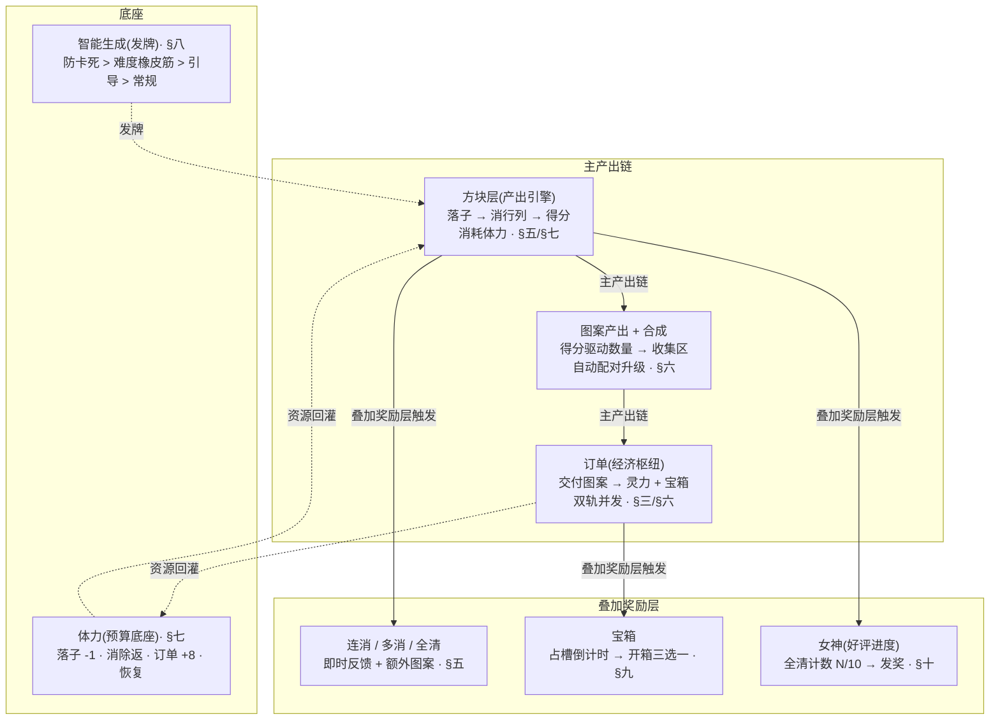
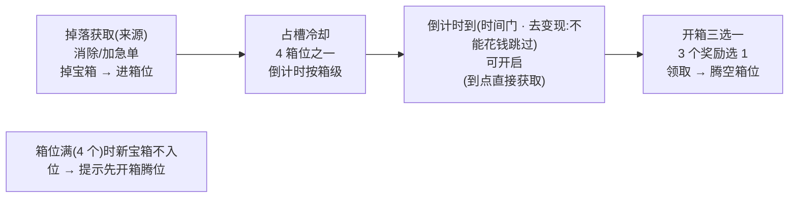

<style>
  /* 本篇专用：等级链 token */
  .lv { display:inline-block; min-width:1.6em; text-align:center; border:1px solid #444; border-radius:4px; padding:0 4px; }
  .gl { font-size:15px; }
  pre.code { margin:8px 0; padding:12px; background:#0d1622; border:1px solid var(--border); border-radius:8px; overflow:auto; font-size:13px; line-height:1.55; }
  .hole { display:inline-block; font-size:11px; letter-spacing:.5px; padding:1px 7px; border-radius:10px; background:var(--accent-soft); color:var(--accent); margin-left:6px; vertical-align:middle; }
  table.tight td, table.tight th { padding:6px 10px; }
</style>

# 核心玩法补全

把四份原始策划稿(方块玩法 / 订单 / 宝箱 / 女神)里的漏洞与空缺补成**完整、自洽、可验收**的一套设计。八个挂账问题逐条给确定答案——并发模型、连消/多消/全清结算、体力系统、货币与术语统一、图案经济数值、智能生成算法仲裁、宝箱、女神。术语与已落地的合成订单切片([09](#09-merge-order-energy)/[10](#10-score-element-rm-collect) 的语义)对齐,不另起第二套概念。

> [!WARNING]
> **本篇是融合玩法的完整设计**:游戏为<mark class="y">单入口、无局 · 无尽循环</mark>([设计 49](#49-infinite-no-rounds))——经典无尽融合进合成订单,无「纯无尽」独立入口;**无通关、无任何 GameOver**,订单无限、整盘续存,卡死与体力归零由两条兜底脱困(体力时基恢复 + 消除道具)。本篇补全的这套系统(并发订单 / 连消多消全清 / 体力 / 经济 / 智能生成 / 宝箱 / 女神)即融合玩法的上层设计,经典 DDA / 计分 / 连消钩子是其底层。顶层裁决、经典各机制的保留/被覆盖清单见 <a href="#29-gameplay-fusion::verdict">29·§三</a> 与 <a href="#29-gameplay-fusion::dev">29·§五</a>;无尽模型与两条兜底见 [设计 49](#49-infinite-no-rounds)。

> [!WARNING]
> **读前必看 · 完整目标与已落地切片的关系**
>
> 当前已落地的是一条**刻意收窄的垂直切片**(合成订单 demo):合成封顶 3 级、双订单、消除得分驱动图案产出、无宝箱/女神。原始策划稿描述的是一套**完整商业体量的游戏**(图案 5 级、四类订单、宝箱、女神、双货币、11 挂件)。两者不是替代关系,而是**同一款游戏的两个完成度**:
>
> - **已落地切片 = 当前真相**。本篇凡涉及已落地系统(合成/订单/体力/图案产出),数值**对齐切片现状**,在其上扩展,绝不另立一套常量。
> - **本篇 = 完整目标**。补全的系统(宝箱/女神/完整订单四类/图案多级经济)按完整游戏设计,但每节标注**「现状 / 本篇新增」**,让落地时一眼看清哪些是已有、哪些是要建。
> - **分期落地不在本篇决策范围**。本篇只产出「完整且自洽的设计 + 验收标准」,具体哪批先做由排期决定。设计自带「可降级到 demo 范围」的开关说明,便于切片。

> [!NOTE]
> **立项信息**
>
> | 项 | 内容 |
> | --- | --- |
> | **类型** | 核心玩法补全设计 仅策划阶段,本篇不进开发 |
> | **设计基线** | 四份原始策划稿(方块玩法 / 订单 / 宝箱 / 女神)+ 已落地合成订单切片([09](#09-merge-order-energy)/[10](#10-score-element-rm-collect)) |
> | **方向约束** | 离线还原 · **去变现**(无体力购买 / 无广告复活 / 无道具内购——项目红线;原稿「虔诚币/灵力」双货币按去变现重审,见 [§四](#11-core-loop-completion::term)) |
> | **竞品参照** | 浪漫餐厅 / Gossip Harbor 的订单冷却刷新、宝箱三选一、女神好评进度——**取材不照抄**,数值按本作重算 |
> | **关键约束(继承现状)** | **自动配对合成**使每个非封顶等级库存恒 ≤1(满 2 即升级),这从根上限制订单可满足形态——是整套经济的地基,见 [§六](#11-core-loop-completion::economy) |

## 一、八个挂账问题的处置一览 {#map}

原任务给出八个必须有明确答案的漏洞。逐条定位到本篇章节与一句话结论:

| # | 问题 | 一句话结论 | 详见 |
| --- | --- | --- | --- |
| 1 | 订单并发矛盾(方块稿说同时 1 单,订单稿定义四类可并行) | 采**双轨并发模型**:常驻 2 个「日常单槽」+ 可选 1 个「特殊单槽」(加急/剧情/黄金时段共用),封顶同屏 3 单 | [§三](#11-core-loop-completion::concurrency) |
| 2 | 连消/多消概念混用,奖励档位用连击术语 | 拆成**两个正交维度**:连消(连续落子链)与多消(单次同时清行列数);给完整奖励表 + 三者(连消/多消/全清)结算顺序 | [§五](#11-core-loop-completion::clear) |
| 3 | 体力模型缺失(扣体力但无系统) | 对齐现状体力档(起始 20/上限 30/落子 -1/消除返/订单 +8);补全回复、灵力关系、消除锤代价合理性、耗尽行为 | [§七](#11-core-loop-completion::energy) |
| 4 | 货币与名词不统一,残留 merge 术语 | 给**术语表**:统一为图案/收集区/合成;**双货币降为单货币**(灵力),虔诚币去变现后无落点,合并;给残留术语映射 | [§四](#11-core-loop-completion::term) |
| 5 | 图案经济数值(4 进 1×5 级 = 顶级 256 初级) | **5 级深度判定为不合理,建议降为 3 级**(对齐现状封顶 3 级);给产出-需求数值框架,常规单 5–10 分钟可完成 | [§六](#11-core-loop-completion::economy) |
| 6 | 智能生成 4 条规则的优先级仲裁 + 补完「未完待续」 | 定**严格优先级链**(防卡死 > 难度橡皮筋 > 引导 > 常规),给伪代码;互斥时高优先级独占该手 | [§八](#11-core-loop-completion::gen-algo) |
| 7 | 宝箱系统(仅「倒计时+三选一」线索) | 补全:**掉落获取 → 占槽冷却 → 倒计时到 → 开箱三选一**;奖池随箱级,4 箱位,与订单/活动解耦 | [§九](#11-core-loop-completion::chest) |
| 8 | 女神系统(仅「全清计数 N/10 进度奖励」线索) | 补全:**全清累计推进好评条 → 满 10 发奖 + 换背景 → 周期循环**,奖励档位升序 | [§十](#11-core-loop-completion::goddess) |

## 二、完整核心循环(把八个系统串起来) {#overview}

原稿四份文档各讲一块,缺一张「谁喂谁」的全局图。补一张:方块层是**唯一产出引擎**,所有下游系统(合成/订单/宝箱/女神)都靠它驱动;订单是**主经济枢纽**,宝箱/女神是**叠加的进度奖励层**。



- **唯一产出动作是落子**:体力、图案、连消/多消/全清、女神进度,全部由「落子→消除」这一个动作派生。订单是把图案变现为资源(灵力 + 宝箱)的出口,资源再回灌体力,闭环。
- **叠加奖励层(黄)不参与核心循环的资源平衡**:连消/多消/全清、宝箱、女神都是**额外**给予,拿不到也能正常玩。它们提供节奏惊喜与长线目标,但核心可玩性只依赖「落子→消除→订单」主链。这条原则保证后续按需切片时可以先砍奖励层、保住主链。

## 三、订单并发模型 <span class="hole">问题 1</span> {#concurrency}

**矛盾**:方块稿写「同时最多 1 个订单」,订单稿定义了四类(常规/加急/剧情/黄金时段)可并行。直接并存四类会让界面挤、决策乱;只留 1 单又浪费「双货币四类」的设计。

> [!TIP]
> **定:双轨并发模型(常驻日常轨 + 可选特殊轨)。**同屏订单槽固定布局,封顶 3 单:
>
> | 轨 | 槽数 | 承载订单类型 | 刷新方式 |
> | --- | --- | --- | --- |
> | **日常轨**(常驻) | 2(= 现状日常槽数) | 常规订单 | 交付即刷新下一单(锯齿波节奏,见 [§六](#11-core-loop-completion::economy)) |
> | **特殊轨**(可选) | 0 或 1 | 加急 / 剧情 / 黄金时段三类**分时复用同一槽**(同时只占一个) | 按各自触发条件出现;加急带倒计时,过期消失;剧情手动接取;黄金时段按游戏内钟点出现 |

**为何特殊轨三类共用一槽、且只 1 个**:三类都是「高价值、低频、要玩家特别关注」的订单——同屏只放一个,玩家心智不分裂,且天然规避「加急和剧情同时倒计时」的焦虑叠加。三类的**优先级**(同一时刻多个想占槽时听谁的):

```text
特殊槽占用优先级（高 → 低）：
  剧情/主线单   ＞  加急单（倒计时）  ＞  黄金时段单
  · 剧情单是进度唯一钥匙，最高：一旦满足触发条件就占槽，不被抢
  · 剧情槽空 时，加急单可占（加急是限时高收益，比黄金时段更稀缺）
  · 二者都不在时，黄金时段单在游戏内 12–14 / 18–20 点占槽
  · 已占槽的订单不被更高优先级中途踢出（避免玩家正在凑的单凭空消失）；
    新的高优先级单进等待队列，待当前特殊单交付/过期后再上
```

> [!NOTE]
> **降级到 demo 范围**:当前切片只有日常轨(2 个常规单槽),特殊轨 = 0 槽即为现状。本节的特殊轨是**本篇新增**,落地时新增 1 个特殊槽 + 三类订单的触发器,日常轨零改动。**剧情单的「死锁防护」**见 <a href="#11-core-loop-completion::economy">§六·剧情订单</a>(终极神物必须可在合理时间内凑出)。

## 四、货币与术语统一 <span class="hole">问题 4</span> {#term}

原稿混用两套词汇:方块稿用「图案/收集区/合成」,订单稿残留另一套消除游戏术语「食材/生成器/仓库」,还引入「虔诚币/灵力/终极神物」三个未定义名词。统一为一套,且与已落地切片(图案/收集区/合成)对齐。

### 4.1 货币:双货币降为单货币(灵力) {#currency}

> [!WARNING]
> **判定:砍掉「虔诚币」,只保留「灵力」一种软货币。**原稿设双货币(虔诚币 = 订单主奖励,灵力 = 少量副产),但**去变现后双货币失去存在理由**:
>
> - 双货币的常见目的是「软货币管养成、硬货币(付费)管加速」,或「主货币买大件、副货币买消耗」。本作**无付费、无商店**(项目红线),两种软货币会各自找不到独立花销出口,沦为两条并行的数字,徒增理解成本。
> - 合并为**单货币「灵力」**:既是订单/宝箱/女神的统一奖励,又是养成(神庙进度推进)的统一消耗。一种货币、一个钱包、一条收支线,清晰可平衡。
> - 原「虔诚币」的语义(向神庙的供奉)并入灵力的用途——灵力既驱动局内(体力关系见 [§七](#11-core-loop-completion::energy)),又作为神庙养成的供奉资源。
>
> 单货币方案已于 2026-06-12 拍板([§十二 #2](#11-core-loop-completion::confirm));若后续重开付费或需叙事区分而恢复双货币,须另设两者独立用途并重算奖励口径。

### 4.2 术语表(统一词汇 + 残留映射) {#glossary}

| 统一术语 | 含义 | 应淘汰的旧/混用词 |
| --- | --- | --- |
| **图案 / 元素** | 消除产出、合成与订单的基础物。9 种(◆⬟★♥☀☾✿♕⬢) | 食材、收集物 |
| **收集区** | 图案存放 + 自动合成的库存区 | 仓库、背包 |
| **合成** | 同图案同级两两自动合并升级 | 融合 |
| **等级 <span class="lv">Lv1</span>–<span class="lv">Lv3</span>** | 图案的合成层级(封顶 Lv3,见 [§六](#11-core-loop-completion::economy)) | 初/中/高/特/顶(原 5 级,降为 3 级) |
| **灵力** | 唯一软货币。订单/宝箱/女神奖励 + 养成消耗(本篇新增,现状只有局内得分) | 虔诚币(合并)、金币 |
| **体力** | 落子预算资源 | 精力、行动点 |
| **终极神物** | 剧情订单要求提交的特定高级图案组合(非新物种,是指定「类型 + Lv3 + 数量」的集合) | —(保留叙事名,机制上 = 高级图案组合) |
| **候选块 / 待选区** | 待落子的 3 个方块及其暂存区 | 生成器 |

> [!NOTE]
> **「生成器」的处置**:浪漫餐厅的「生成器周期产图案」在本作不存在——本作图案产出动作就是**落子消除**(见 <a href="#09-merge-order-energy::tradeoff">09·§六</a>)。订单稿里凡「生成器/食材/仓库」一律按上表替换为「候选块/图案/收集区」,不保留该套消除游戏概念。

## 五、连消 / 多消 / 全清:结算规则 <span class="hole">问题 2</span> {#clear}

**混用根源**:原稿「多消奖励档位」用的是连击术语(3 连击 = Great = 1 中级…),但又说「多消按单次同时消除行列数」——到底按「连续放置连击数」还是「单次同时消除行列数」?二者是**两个正交维度**,必须拆开,各给一张表,再定叠加时的结算顺序。

### 5.1 两个正交维度的定义 {#two-axis}

| 维度 | 定义 | 计量 | 清零条件 |
| --- | --- | --- | --- |
| **多消(Multi-clear)** | **单次落子**同时清掉的行+列总数 | 该次落子清除的行列条数(1=单消,2=双消,3=三消,4=四消…) | 每次落子独立结算,不跨手累积 |
| **连消(Combo)** | **连续多次落子**每次都有消除,形成的不中断链 | 连续触发消除的落子次数(链长 1→2→3…) | 某次落子**未触发任何消除** → 链断、计数归 1 |
| **全清(All-clear)** | 一次消除后**整个 8×8 棋盘清空** | 布尔事件(发生 / 不发生) | —(独立事件) |

> [!TIP]
> **术语裁决**:原稿「3 连击 = Great」的「连击」实指**多消**(单次同时消行列数),因为它后面紧跟「3 连击 = 1 中级图案」这种**单次结算**的奖励——连续落子链的奖励原稿没设计。本篇**明确**:即时弹字(Good/Amazing/...)绑**多消**;额外图案奖励也绑**多消**;**连消**另给一条独立的递增分数加成(新增,填补原稿空缺);全清独立发大奖。

### 5.2 多消奖励表(单次落子结算) {#multi-table}

对齐现状:图案产出已由[得分驱动](#10-score-element-rm-collect::map)(消得越狠图案越多,单次产出已封顶 4 个)。本表的「额外图案奖励」是在**得分驱动产出之上**的**多消里程碑加码**——把原稿「3 连击=1 中级」的设计接进来,作为高多消的**升级奖**(直接给中/高级,跳过合成)。

| 多消数 | 即时弹字 | 得分驱动基础产出(现状) | 多消里程碑加码(本篇新增) |
| --- | --- | --- | --- |
| 1(单消) | Good | 1 个 <span class="lv">Lv1</span> | 无 |
| 2(双消) | Amazing | 2 个 <span class="lv">Lv1</span> | 无 |
| 3(三消) | Great | 3 个 <span class="lv">Lv1</span> | **+1 个 <span class="lv">Lv2</span>**(中级) |
| 4(四消) | Wonderful | 4 个 <span class="lv">Lv1</span> | **+1 个 <span class="lv">Lv2</span> + 1 个 <span class="lv">Lv1</span>** |
| 5(五消) | Excellent | 4 个 <span class="lv">Lv1</span>(封顶) | **+1 个 <span class="lv">Lv2</span> + 2 个 <span class="lv">Lv1</span>** |
| 6+ (六消及以上,极罕见) | Excellent | 4 个 <span class="lv">Lv1</span>(封顶) | **+1 个 <span class="lv">Lv3</span>**(高级,直达封顶) |

> [!NOTE]
> **与原稿档位的对应**:原稿「3 连击=1 中级 / 4 连击=1 中级+1 初级 / 5 连击=1 中级+2 初级 / 6 连击及以上=1 高级」——本表「里程碑加码」列**逐档对齐**,只把术语从「连击」正名为「多消」,「初/中/高级」对齐为 <span class="lv">Lv1</span>/<span class="lv">Lv2</span>/<span class="lv">Lv3</span>。**里程碑加码直接进收集区,跳过合成**(这是高多消的爽点:省去攒 4 个 Lv1 才合 1 个 Lv2 的过程)。

### 5.3 连消奖励表(连续落子链,本篇新增) {#combo-table}

原稿对「连续落子链」无任何奖励设计,只有 1\~5 击反馈字。本篇补一条**连消分数加成**:鼓励玩家规划连续几手都能消除,提供「手感连贯」的正反馈,但**不给图案**(图案产出已归多消,避免双重通胀)。

| 连消链长 | 分数倍率 | 说明 |
| --- | --- | --- |
| 1 | ×1.0 | 基准,无加成 |
| 2 | ×1.2 | 连续两手都消除 |
| 3 | ×1.5 |  |
| 4 | ×1.8 |  |
| 5+ | ×2.0(封顶) | 封顶防分数爆炸 |

倍率**仅作用于该次落子的消除得分**(显示分,不影响得分驱动的图案产出计算,避免连消间接刷爆图案)。链断(某手无消除)→ 下次回 ×1.0。

### 5.4 全清奖励 {#allclear-table}

| 事件 | 奖励 | 约束 |
| --- | --- | --- |
| 全清(棋盘清空) | +1 个 <span class="lv">Lv3</span> 高级图案 + 换背景 + 推进女神好评条 1 格(见 [§十](#11-core-loop-completion::goddess)) | **不可连续触发 2 次**:本次全清后,下一次落子即便再次清空也不发全清奖(防刷);需中间至少有一次「非全清的落子」才重新武装 |

### 5.5 三者叠加时的结算顺序(关键) {#settle}

一次落子可能**同时**触发多消、连消、全清(例:连续第 3 手、本手四消、且清空棋盘)。结算必须有确定顺序,否则倍率施加对象有歧义、可单测性丧失。

```text
单次落子的结算流水线（顺序固定）：
1. 落子 → 扣 1 点体力（落子消耗）                    // §七
2. 判定消除 → 得 清除格数、行列消除条数（= 多消数）
   若本手无消除（条数 = 0）：
     · 连消链清零（链长回到 1）
     · 全清武装位重置（见步 6）
     · 结束（无消除分支）
3. 基础消除得分 = 按清除格数与行列条数计算           // §五，沿用现状计分
4. 连消加成：链长 +1；显示分 = 基础得分 × 连消倍率   // §5.3，仅作用显示分
5. 图案产出：产出个数 = 由【未乘连消】的基础得分驱动   // §六，用基础得分而非显示分，避免连消刷图案
   · 基础产出若干个 Lv1 入队（得分驱动，现状逻辑）
   · 多消里程碑加码：按 §5.2 表，行列条数 ≥3 时额外发 Lv2/Lv3 直接入收集区
6. 全清判定：若棋盘清空 且 全清武装位为「已武装」：
     · 发 Lv3 + 换背景 + 女神好评 +1（§5.4 / §十）
     · 全清武装位置「已发放」（本次已发，连续第二次不再发）
   否则（未清空）：全清武装位置「已武装」（重新武装）
7. 体力返还：按本手行列消除条数返还体力             // §七
8. 刷新界面：弹字（多消档 §5.2）、分数、收集区、订单可交付检查
> 顺序铁律：连消倍率只乘【显示分】，绝不参与【图案产出】与【全清判定】。
> 这条隔离保证「会连消的玩家拿高分爽感」与「图案经济不被连消通胀」两件事互不污染——
> 二者一旦耦合，连消就会变成刷图案的捷径，§六的经济平衡全盘失效。
```

## 六、图案经济:数值框架 <span class="hole">问题 5</span> {#economy}

> [!NOTE]
> 本节的图案经济是合成订单的完整循环,也是**融合玩法唯一的经济**——单入口循环下不存在「与纯无尽刷分并列的另一套经济」需要平衡。融合裁决(经济/计分口径维持现状、不另立常量)见 <a href="#29-gameplay-fusion::verdict">29·§三</a> 与 <a href="#29-gameplay-fusion::keep">29·§4.1</a>。

### 6.1 先决判定:5 级深度不合理,降为 3 级 {#depth}

> [!WARNING]
> **原稿 5 级 + 4 进 1 = 顶级图案需 256 个初级。这个深度对本作不合理,建议降为 3 级(对齐现状封顶 3 级)。**理由(具体到机制后果):
>
> 1.  **自动配对让高级图案的边际产速指数衰减**:现状**自动配对**(满 2 即合,见 [09·§3.1](#09-merge-order-energy::merge))下,每个非封顶等级库存恒 ≤1。要出 1 个 Lv5 需 16 个 Lv1 一路喂上来;按 [§6.3](#11-core-loop-completion::supply) 的产速(熟练约 1.5 图案/落子),凑一个 Lv5 要约 11 次落子且全程不挪用——而订单还在持续消耗低级图案,Lv5 实际**几乎永远凑不齐**,顶级订单死锁。
> 2.  **5 级的「特/顶」两级在 demo 体量下无内容承载**:原稿让 Lv4/Lv5 对应剧情终极神物,但剧情系统(神庙进度)尚未建。多出的两级是**悬空深度**——没有订单/玩法实际消费它们,纯属数字膨胀。
> 3.  **3 级已满足全部订单形态**:常规单要 Lv1/Lv2,加急/剧情要 Lv3 组合(见 [§6.4](#11-core-loop-completion::order-spec))。3 级的折算深度(Lv3 = 4 个 Lv1)正好卡在「要攒、但 5–10 分钟够得着」的甜区。
>
> **决定:封顶 Lv3**(= 现状)。原 5 级的「初/中/高/特/顶」收敛为 Lv1(初)/Lv2(中)/Lv3(高);「特/顶」语义并入「高级 + 剧情组合需求」(用多个 Lv3 + 多类型组合表达高难度,而非更高单级)。封顶 Lv3 已于 2026-06-12 拍板([§十二 #1](#11-core-loop-completion::confirm));若未来恢复 5 级深度,需先建神庙剧情系统承接 Lv4/Lv5,并重设合成方式(可能改手动合成)。

### 6.2 地基约束:自动配对 ⇒ 订单可满足形态受限 {#combine-constraint}

> [!TIP]
> **这是整套经济的地基,现状订单池设计已据此钉死,本篇遵从并解释清楚:**
>
> 自动配对使**每个 (类型, 非封顶等级) 的库存恒 ≤ 1**(满 2 立即升级)。直接后果:
>
> - **Lv1 / Lv2 订单的数量只能为 1**:收集区里同时绝不会有 2 个 Lv1-◆(第 2 个一到就合成 Lv2)。所以「◆ Lv1 ×3」这种订单**结构上不可满足**——原稿的「需求 1–3 个图案」对低级图案不成立。
> - **只有封顶 Lv3 可堆积,数量方可 ≥ 2**:Lv3 不再向上合并,可在收集区累积多个。所以「数量 ≥ 2 的订单」必须是 Lv3。
>
> **合法订单形态(收敛后):**
>
> | 等级 | 合法数量 | 示例 |
> | --- | --- | --- |
> | Lv1 | 恒 1 | ◆ Lv1 ×1 |
> | Lv2 | 恒 1 | ★ Lv2 ×1 |
> | Lv3 | 1 ~ N(可堆积) | ★ Lv3 ×2、◆ Lv3 ×3 |
> | **多类型组合** | 各类型按上行规则 | ◆ Lv2 ×1 + ★ Lv3 ×2(用于加急/剧情) |
>
> 用「**多类型组合 + Lv3 堆积**」表达高难度,而非靠单类型大数量——这既绕开自动配对约束,又让高级订单需要玩家**同时经营多条图案线**,难度自然上来。

### 6.3 产出速率(供给侧) {#supply}

图案产出已由[得分驱动](#10-score-element-rm-collect::map):产出个数由本次消除得分决定,单消保底 1、四消封顶 4。据此估算各等级的**期望获取速率**(以「落子数」为时间单位,因为体力按落子扣):

| 玩家水平 | 典型每手 | Lv1 产速 | 合成出 Lv2 节奏 | 合成出 Lv3 节奏 |
| --- | --- | --- | --- | --- |
| 新手 | 多为单消、偶尔双消 | ≈ 0.8 个 / 落子 | 每 ≈ 5 落子出 1 个(攒 2 Lv1) | 每 ≈ 20 落子出 1 个(攒 4 Lv1) |
| 熟练 | 常双消、偶三/四消 | ≈ 1.5 个 / 落子 | 每 ≈ 3 落子出 1 个 | 每 ≈ 11 落子出 1 个 |

(Lv1 产速含**需求拉动**:产出只挑当前订单所需类型,见 [10·§2.4](#10-score-element-rm-collect::type),故产速可直接折成对应等级的合成进度,不浪费在无关类型上。)

### 6.4 需求与奖励数值框架(需求侧) {#order-spec}

按「常规单 5–10 分钟可完成」反推。设熟练玩家 1 手落子 ≈ 6–8 秒(含思考 + 拖拽),5–10 分钟 ≈ 45–90 次落子。一个会话要完成多个常规单 + 推进特殊单,故**单个常规单目标控制在 ≈ 6–12 次落子可凑齐**。

| 订单类型 | 需求形态(遵 [§6.2](#11-core-loop-completion::combine-constraint) 约束) | 预期耗时 | 灵力奖励 | 附加奖励 |
| --- | --- | --- | --- | --- |
| **常规单**(日常轨) | 1 类 Lv1×1 \~ Lv2×1;难档 Lv3×1 | 3 \~ 12 落子(0.5 \~ 2 分钟) | 10 \~ 30 | — |
| **加急单**(特殊轨) | Lv3×2 \~ Lv3×3,或双类型组合 | 15 \~ 30 落子(倒计时 ≈ 5 分钟现实时间) | 60 \~ 120 | **+1 宝箱**(见 [§九](#11-core-loop-completion::chest)) |
| **剧情单**(特殊轨) | 终极神物 = 2 \~ 3 类 Lv3 组合(总折算 ≈ 24 \~ 36 Lv1) | 多个会话累积(非单局) | 大额 + 推进神庙进度 | 推进剧情(唯一钥匙) |
| **黄金时段单**(特殊轨) | = 常规单形态但额外加成 | 同常规单 | 常规 ×1.5 | 时段限定,过点消失 |

> [!NOTE]
> **剧情订单不死锁的硬约束(填补原稿空缺)**:剧情单需求(终极神物)的总折算量 = 各 Lv3 数量 × 4 Lv1。**不变量**:终极神物总折算 ≤ 「一个会话期望 Lv1 产量 × 会话数上限」(默认设 3 个会话内可凑)。具体:终极神物折算上限 ≈ 36 Lv1 = 熟练玩家 ≈ 24 落子的产量,跨 2–3 个会话攒齐(因为还要分薄给常规单)。**剧情单的图案需求绝不能要求超过 Lv3**(Lv3 已是封顶,要更高就死锁)——这也是 <a href="#11-core-loop-completion::depth">§6.1</a> 砍 5 级的连带理由。

### 6.5 收支平衡校验 {#econ-balance}

无尽模型无「通关单数」,但「最初 5 单」仍是有用的数走查单位——确认起步段体力净正、不饿死、不无脑(无尽下「饿死」= 体力归零等恢复,虽不结束游戏但卡节奏,仍要避免起步段就卡):

| 项 | 估算 |
| --- | --- |
| 起步 5 个常规单平均难度 | 遵订单池锯齿波,平均约 d2(折算 2 Lv1) |
| 完成 5 单所需图案总折算 | ≈ 5 × 2 = 10 Lv1(需求拉动下不浪费) |
| 熟练玩家产 10 Lv1 需落子数 | ≈ 10 / 1.5 ≈ 7 落子产出 + 合成延迟,实际约 10–15 落子 |
| 体力收支(起始 20 + 订单返 + 时基恢复) | 每单 +8 体力,5 单回 40;15 落子扣 15;**净正**——熟练玩家起步段不卡,正中「会消除→玩得久」定位(见 [09·§四·2](#09-merge-order-energy::risk2));体力归零时另有时基恢复(含离线)兜底,不结束游戏([设计 49](#49-infinite-no-rounds)) |

## 七、体力系统补全 <span class="hole">问题 3</span> {#energy}

原方块稿「每放 1 块扣 1 体力」但无体力系统。**对齐工程现状**:体力档已在切片落地(09·§3.3 设计),本节**补全原稿缺的四件事**:回复机制、灵力与体力关系、消除锤 20 体力的合理性、耗尽局内行为。

| 项 | 取值(现状) | 本节补全说明 |
| --- | --- | --- |
| 起始体力 | 20 | 不变量:≥ 完成首单落子数,否则首单前饿死(09·§四·2) |
| 软上限 | 30 | 自然恢复/落子返还封顶于此;**订单奖励可溢出** |
| 落子消耗 | 1 / 块 | — |
| 消除返还 | = 本次消除行列数 | 技巧驱动「会消除→体力净正」 |
| 订单奖励 | 8 / 单 | 主补给来源,可溢出 |
| 时基恢复 | 1 点 / 120 秒 | 无尽模型实装([设计 49 §3.2](#49-infinite-no-rounds::regen)):无条件、纯时间驱动、含离线,按真实时间跨会话回复,仅回到软上限不溢出。是无尽的最终保险——体力归零靠它迟早回升。活跃节奏仍靠消除+订单,时基恢复兜「久未玩 / 卡死等体力」 |

### 7.1 灵力与体力的关系(原稿未定,本篇补) {#energy-soul}

> [!TIP]
> **定:灵力与体力分离,但灵力可兑体力(限量、非购买)。**
>
> - **体力** = 落子的节流资源(短周期、当下尺度)。**灵力** = 跨会话软货币(长周期、养成尺度)。二者不合并——合并会让「攒养成货币」和「当下能不能落子」互相挤压。
> - **兑换口子(去变现 · 主动加速)**:体力不足想立刻继续时,可花灵力**祈愿补体力**(如 20 灵力换 10 体力),**每日限 N 次**(默认 3),纯灵力消耗、无任何付费/广告。这是用玩家自己攒的软货币主动加速体力,不引入外部变现。超次数则等时基恢复([设计 49 §3.2](#49-infinite-no-rounds::regen),含离线,迟早回升,不结束游戏)。

### 7.2 两种体力消耗道具的分工(消除道具 vs 消除锤) {#hammer}

无尽模型([设计 49](#49-infinite-no-rounds))引入**消除道具**作卡死脱困的一等兜底。它与原稿「消除锤」是**两个不同用途的道具**,分工写明:

| 道具 | 用途 | 作用对象 | 代价 | 权威设计 |
| --- | --- | --- | --- | --- |
| **消除道具** | **卡死脱困**(无处可落时清块、让棋盘重新可落) | 棋盘已占格(清一行 + 一列) | 体力 `ClearToolCost`(默认 25,≤ 软上限,无限可用只 gate 体力) | [设计 49 §3.1](#49-infinite-no-rounds::cleartool)(无尽兜底,挂[道具系统 16](#16-item-system)) |
| **消除锤**(原稿,可选) | 「能落但都不想落」(清掉挡手的烂候选块) | 待选区一个候选块 | 体力(建议 8 = 一单回血) | 本节(便利道具,非脱困) |

**两者的分界**:消除道具兜「无处可落(卡死)」,是无尽成立的硬兜底(必做,见 [设计 49 §3.3](#49-infinite-no-rounds::deadlock-proof));消除锤兜「能落但烂手」,是可选便利(可砍)。智能生成防卡死规则([§八](#11-core-loop-completion::gen-algo))降低卡死频率,但仍可能卡死——故消除道具是最终保险,消除锤不解决卡死(它只换候选块,棋盘已满时换块也放不下)。

> [!NOTE]
> **消除锤代价(可选便利道具)**:原稿 20 体力偏高(≈ 整局预算,玩家几乎不用,形同虚设)。建议降为 **8**(= 一单回血,「应急但肉疼」)。8 体力代价真实(用一次 ≈ 白做一单)但用得起。消除锤 8 体力已于 2026-06-12 拍板([§十二 #3](#11-core-loop-completion::confirm));为可调数值,实测滥用可上调。**注**:消除锤是可选项(可砍),卡死脱困的硬兜底是消除道具([设计 49 §3.1](#49-infinite-no-rounds::cleartool))。

### 7.3 体力耗尽的行为(无尽模型,无 GameOver) {#energy-empty}

无尽模型([设计 49](#49-infinite-no-rounds))下体力耗尽**不结束游戏**——无软 GameOver、无「精力耗尽」结束面板。体力是持续运营的节流资源,归零只是「暂时落不起子」,靠兜底脱困:

```text
体力不足以再落一子，且仍有手持候选块（无法落子）时：
  · 不弹任何结束面板；玩法窗保持可交互。
  · 体力时基恢复（无条件、纯时间驱动、含离线，设计 49 §3.2）持续补给
    —— 等足够真实时间（或离线挂着回来），体力回到可用量即可继续。
  · 可主动加速：花灵力祈愿补体力（§7.1，每日限次）；领含体力的宝箱/女神奖励。
  · 整盘续存（设计 14）：退出重进从原状态继续，体力按离线时差补算恢复。
卡死（无处可落）时：用消除道具清块脱困（设计 49 §3.1，代价体力）。
```

> [!NOTE]
> **从旧「软 GameOver」到无尽兜底**:旧分场次模型把「体力耗尽 + 无单可交付」判为软 GameOver(结束本局)。无尽模型取消这一结束——体力归零由时基恢复(含离线)迟早回升,卡死由消除道具脱困,二者合起来保证任何状态都能脱困(脱困证明见 [设计 49 §3.3](#49-infinite-no-rounds::deadlock-proof))。

## 八、智能生成算法:优先级仲裁 + 补完 <span class="hole">问题 6</span> {#gen-algo}

原方块稿给了 4 条发牌规则但标注「未完待续」,且没说**互斥时听谁的**。本节定优先级链并补完伪代码。4 条规则:

| 规则 | 原稿意图 | 触发条件 |
| --- | --- | --- |
| R1 清盘后连发异形 | 清盘(全清)后连发 3 个异形块增难,防止全清太爽 | 刚发生全清,且 anti-streak 计数 &lt; 3 |
| R2 连续未消除发可消方块 | 连续 5 次落子没消除 → 发一个能立即消除的方块,防卡死/防挫败 | 连续未消除次数 ≥ 5 |
| R3 高阶消除引导 | 检测到玩家能凑多消时,发引导其打出高多消的方块 | 棋盘存在「再放某形状即可三消+」的局面 |
| R4 清盘引导 | 棋盘接近清空时,发能促成全清的方块 | 剩余非空格 ≤ 阈值且存在可全清的发牌 |

> [!WARNING]
> **互斥仲裁:严格优先级链(防挫败 > 控难度 > 给惊喜)。**同一手多条规则都想生效时,**高优先级独占该手发牌,低优先级让位**:
>
> 优先级（高 → 低）：
>   P0  R2 防卡死        —— 玩家正在受苦（连续不消除/濒临死局），最高，无条件优先
>   P1  R1 清盘后增难    —— 节奏控制，紧随其后（防止全清后立刻又全清的失控正反馈）
>   P2  R4 清盘引导      —— 给惊喜，但仅在不与 P0/P1 冲突时
>   P3  R3 高阶引导      —— 锦上添花，最低
>   P4  常规动态难度发牌  —— 都不触发时，走现有动态难度橡皮筋（见 02 文档）
> 裁决铁律：
>   · P0 与 P1 永不同时（R2 要求「能消」，R1 要求「异形难消」——直接矛盾）。
>     P0 优先：玩家在受苦时，防卡死压倒增难。R1 的 anti-streak 计数此手暂停递减。
>   · P2 与 P3 可降级合并：若某发牌同时满足「促全清」与「促高多消」，按 P2 处理。
>   · 任一手最终只采纳一条规则的发牌建议；其余规则的内部计数照常更新（不因让位而清零）。

### 8.1 补完的完整伪代码(「未完待续」收尾) {#gen-pseudo}

```text
// 每次需要补发候选块时（手牌耗尽 → 补一组 3 块）
补发一组候选块（棋盘, 计数上下文）：
    手牌 = 空
    对槽位 0..2 各执行：
        块 = 为该槽选块(棋盘, 计数上下文)
        手牌 加入 块
        在棋盘上预演放下该块                  // 让同组后续块感知前块影响（防一组全卡）
    推进计数器（连续未消除次数 / 清盘后异形配额 等）
    返回 手牌
为该槽选块（棋盘, 计数上下文）：
    // —— P0 防卡死（最高）——
    若 连续未消除次数 >= 5（防卡死阈值）：
        若存在「放下即可消」的形状：
            标记本组已救          // 避免整组都塞简单块
            返回 该形状
        // 找不到可消形状（棋盘太满）→ 退而求其次：发占格最小的形状
        返回 占格最小的形状
    // —— P1 清盘后增难 ——
    若 清盘后异形配额 > 0：       // 全清后剩余的「连发异形」配额
        配额 -1
        返回 一个异形块（L/Z/T 等，增加摆放难度）
    // —— P2 清盘引导 ——
    若 棋盘非空格数 <= 8（清盘引导阈值）：
        若存在「放下即可促成全清」的形状：返回 该形状
    // —— P3 高阶消除引导 ——
    若 棋盘存在「再放某形状即可三消及以上」的局面：
        若存在「促成 ≥3 多消」的形状：返回 该形状
    // —— P4 常规：现有动态难度橡皮筋 ——
    返回 动态难度橡皮筋选块(棋盘, 计数上下文)    // 见 02 文档
// 计数器更新（每次落子后）
落子后更新（本手消除条数）：
    若 本手消除条数 == 0：连续未消除次数 +1
    否则：              连续未消除次数 归零
    若 本手为全清：清盘后异形配额 = 3            // 全清后武装 3 个异形配额
可调常量：防卡死阈值 = 5 · 清盘后异形配额 = 3 · 清盘引导阈值 = 8（剩余非空格）
        · 高阶引导触发 = 三消及以上
```

> [!NOTE]
> **与现状的关系**:R4(常规动态难度)= 现状已实现的动态难度橡皮筋(见 <a href="#02-dynamic-difficulty">02 文档</a>)。R1–R3 + 优先级链是**本篇新增**的上层仲裁,套在现有发牌之外:四条特殊规则都不触发时,完全回落到现状发牌,**现状行为零改变**。这保证智能生成可作为独立增强分批落地。

## 九、宝箱系统补全 <span class="hole">问题 7</span> {#chest}

原稿仅一句「倒计时开启宝箱获取奖励」+ 浪漫餐厅「开启挑选箱·三选一」截图,订单稿界面图标注「宝箱图标·倒计时 300·直接获取」。补成完整规则。参考原稿截图确认机制是**开箱时三选一**(选以下奖励之一)。



### 9.1 规则 {#chest-rules}

| 项 | 规则 |
| --- | --- |
| **获取来源** | ① 消除时小概率掉普通宝箱;② **加急单**奖励固定给 1 个高级宝箱(见 [§6.4](#11-core-loop-completion::order-spec));③ 女神好评满级附赠(见 [§十](#11-core-loop-completion::goddess))。来源与订单**解耦**——常规单不掉宝箱,避免宝箱沦为订单附属 |
| **箱位** | 4 个箱位(对齐原稿界面布局)。满 4 时新宝箱不入位,提示先开箱腾位——制造「想开箱」的牵引 |
| **倒计时** | 占箱位后开始倒计时,到点才可开。时长按箱级:普通箱 ≈ 5 分钟(原稿「倒计时 300」秒)、稀有箱 ≈ 30 分钟、史诗箱 ≈ 2 小时。**去变现红线:倒计时不可用付费/广告跳过**——只能等。这是本作宝箱与浪漫餐厅最大区别(那边可看广告/付钻加速) |
| **开箱(三选一)** | 倒计时到 → 开箱弹「选以下奖励之一」三张卡,玩家选 1 张领取(对齐截图)。三选一给玩家**决策权**(按当前缺什么挑),比直接发奖更有参与感 |
| **奖池** | 三张卡从箱级奖池随机抽 3 个不重复项。奖池内容:灵力、体力、图案(按箱级给 Lv1\~Lv3)、悔棋次数、祈愿补体力次数。**箱级越高,奖池里高价值项占比越大** |
| **与活动的关系** | 解耦。原稿界面有「活动×2」挂件,活动可**额外掉特殊宝箱**(活动限定奖池),但宝箱系统本身不依赖活动存在 |

| 箱级 | 倒计时 | 奖池基调 | 主要来源 |
| --- | --- | --- | --- |
| 普通 | ≈ 5 分钟 | 少量灵力/体力/Lv1 图案 | 消除掉落 |
| 稀有 | ≈ 30 分钟 | 中量灵力 + Lv2 图案 + 道具次数 | 加急单 |
| 史诗 | ≈ 2 小时 | 大量灵力 + Lv3 图案 + 多道具 | 女神满级 / 活动 |

> [!NOTE]
> **降级到 demo 范围**:宝箱是**本篇新增**系统,现状切片无宝箱。最小可玩版可先只做「普通箱 + 消除掉落 + 三选一」,稀有/史诗与活动联动列后续。倒计时在 demo 可大幅缩短(如 30 秒)便于测试。

## 十、女神系统补全 <span class="hole">问题 8</span> {#goddess}

原稿零文字,仅浪漫餐厅「好评如潮 7/10」进度弹窗截图,订单稿界面图标注「女神半身像·全屏消除(5/10)」。**线索锁定:女神 = 全清(全屏消除)计数的进度奖励系统**。补成完整规则。

> [!TIP]
> **定:女神好评条 = 全清累计计数器,满档发奖 + 换背景 + 循环。**
>
> | 项 | 规则 |
> | --- | --- |
> | **进度来源** | 每发生 1 次**全清**(全屏消除,见 [§5.4](#11-core-loop-completion::allclear-table)),好评条 +1。计数显示「N/10」(对齐截图)。**唯一来源是全清**——把「全清」这个高难成就接成长线进度,给技巧玩家额外的攒进度动力 |
> | **满档奖励** | 好评条满 10 → 触发「好评如潮」弹窗 → 发**档位奖励** → 好评条清零、进入下一档(周期循环) |
> | **奖励档位(升序)** | 女神有多个「好感等级」,每满 10 次全清升 1 级,奖励逐级加码:Lv1 满 → 灵力 + 1 史诗宝箱;Lv2 满 → 更多灵力 + Lv3 图案;…越往后越丰厚。给长线玩家「养女神」的目标感 |
> | **周期重置** | **好评条每档循环重置**(满 10 清零再攒);**女神好感等级只升不降**(永久累积,体现长线投入)。可选「赛季制」让好感等级周期性软重置(列后续,本篇默认只升不降) |
> | **换背景** | 女神好感升级时解锁新背景(对齐原稿「全清换背景」)——把全清的视觉奖励(换背景)与女神进度统一,不再是两套独立的换背景 |

> [!NOTE]
> **与全清奖励的关系(去重)**:<a href="#11-core-loop-completion::allclear-table">§5.4</a> 的「全清即时奖」(1 Lv3 + 换背景)是**每次**全清的即时给予;女神是全清的**累计**进度(攒 10 次的里程碑大奖)。二者不重复:即时奖管「这一次爽」,女神管「攒够了的长线爽」。换背景统一归女神升级触发,§5.4 的「换背景」改为「推进女神 +1」(女神升级时才换),避免每次全清都换背景的频繁打扰。

> [!NOTE]
> **降级到 demo 范围**:女神是**本篇新增**系统。最小版 = 单档好评条(全清 +1,满 10 发一次奖),好感多级 + 赛季列后续。现状切片无女神,落地时新增计数器 + 满档弹窗(可沿用现有订单完成弹窗风格)。

## 十一、验收标准(给 test 逐条核对) {#accept}

> [!NOTE]
> **验收性质说明**:本篇为**完整游戏设计**,含大量「本篇新增、未落地」系统。验收分两类:**(A) 与现状对齐项**——可立即对照已落地切片核验;**(B) 新增系统设计项**——落地后按此核验。按系统是否已落地选择适用类。

### 问题 1 · 并发模型

- 日常轨固定 2 槽(对齐现状日常槽数);特殊轨 0 或 1 槽,封顶同屏 3 单。
- 特殊槽占用优先级:剧情 > 加急 > 黄金时段;已占槽订单不被中途踢出,高优先级单进等待队列。

### 问题 2 · 连消/多消/全清

- 多消按单次落子清行列数结算(1\~6+),弹字与里程碑加码逐档对齐 [§5.2](#11-core-loop-completion::multi-table) 表(3 消 +1 Lv2、4 消 +1 Lv2+1 Lv1、5 消 +1 Lv2+2 Lv1、6+ 消 +1 Lv3)。
- 连消按连续消除落子链结算,倍率 ×1.0/1.2/1.5/1.8/2.0 封顶,链断回 ×1.0;**倍率仅作用显示分,不影响得分驱动的图案产出**(关键隔离,可单测)。
- 全清发 1 Lv3,且**不可连续触发 2 次**(武装位机制,[§5.5](#11-core-loop-completion::settle))。
- 结算顺序按 [§5.5](#11-core-loop-completion::settle) 流水线:连消倍率不参与元素产出与全清判定。

### 问题 3 · 体力

- 体力档对齐现状(起始 20/上限 30/落子 -1/消除返/订单 +8)。
- 灵力可祈愿兑体力,每日限次,纯灵力消耗无付费([§7.1](#11-core-loop-completion::energy-soul))。
- 消除道具(卡死脱困,[设计 49 §3.1](#49-infinite-no-rounds::cleartool))cost ≤ 软上限、无限可用只 gate 体力;消除锤(可选便利道具,清待选区方块)8 体力(建议值,可调)。体力耗尽**不结束游戏**(无尽模型,无 GameOver):靠时基恢复(含离线)回升,整盘续存([§7.3](#11-core-loop-completion::energy-empty))。

### 问题 4 · 术语/货币

- 统一术语:图案/收集区/合成/灵力/体力([§4.2](#11-core-loop-completion::glossary) 表);无「食材/生成器/仓库/虔诚币」残留。
- 单货币(灵力),订单/宝箱/女神奖励 + 养成消耗统一走灵力。

### 问题 5 · 图案经济

- 封顶 Lv3(对齐现状);订单需求遵自动配对约束:Lv1/Lv2 数量恒 1,仅 Lv3 可堆积 ≥2([§6.2](#11-core-loop-completion::combine-constraint))。
- 常规单 3\~12 落子可完成;剧情单总折算 ≤ 36 Lv1、需求等级 ≤ Lv3(不死锁,[§6.4](#11-core-loop-completion::order-spec))。
- 起步 5 单体力净正,不饿死(无通关目标,「最初 5 单」作起步段数走查单位,[§6.5](#11-core-loop-completion::econ-balance))。

### 问题 6 · 智能生成

- 4 规则优先级链:防卡死 > 清盘增难 > 清盘引导 > 高阶引导 > 常规;任一手只采纳一条规则发牌,其余计数照常更新。
- R2 与 R1 互斥时 R2 优先(防卡死压倒增难);四规则都不触发时回落现状动态难度,现状行为零改变。
- 计数器更新按 [§8.1](#11-core-loop-completion::gen-pseudo) 伪代码(连续未消除次数 / 清盘后异形配额)。

### 问题 7 · 宝箱

- 生命周期:获取 → 占箱位(4 位)→ 倒计时 → 开箱三选一 → 领取腾位;箱位满时新宝箱不入位。
- 倒计时**不可付费/广告跳过**(去变现);三选一从箱级奖池抽 3 不重复项。
- 来源与常规订单解耦(消除掉落 / 加急单 / 女神满级 / 活动)。

### 问题 8 · 女神

- 好评条 = 全清累计计数,显示 N/10,每全清 +1,满 10 发奖 + 清零循环。
- 女神好感多档升序加码,好感等级只升不降;升级解锁新背景(换背景统一归女神,[§十](#11-core-loop-completion::goddess))。

## 十二、拍板决策记录 {#confirm}

下列 8 项为策划偏离原稿或影响面较大的决策,**已于 2026-06-12 经用户确认,全部按「选择」列执行**;依据与影响面保留供追溯。

| # | 问题 | 选择(已确认) | 依据 | 影响面 |
| --- | --- | --- | --- | --- |
| 1 | **图案 5 级 → 3 级** | 降为 3 级(对齐现状封顶 3 级) | 自动配对使 5 级的高级图案产速指数衰减、顶级订单死锁;Lv4/Lv5 无内容承载(神庙剧情未建)。3 级已满足全订单形态([§6.1](#11-core-loop-completion::depth)) | **大**。决定整套经济深度。若保留 5 级,须先建神庙剧情系统承接 Lv4/Lv5,且需重设合成方式(可能要改成手动合成)以让高级图案可达 |
| 2 | **双货币(虔诚币+灵力)→ 单货币** | 合并为单货币「灵力」 | 去变现后双软货币各自无独立花销出口,徒增理解成本;单货币收支线清晰([§4.1](#11-core-loop-completion::currency)) | **中**。涉及全部奖励/养成数值的货币口径。若为后续留付费口子或叙事区分想保留双货币,需另设两者的独立用途 |
| 3 | **消除锤 20 体力 → 8 体力** | 降为 8(= 一单回血,「应急但肉疼」) | 20 体力 ≈ 整局预算,玩家几乎不会用,道具形同虚设;8 体力代价真实但用得起([§7.2](#11-core-loop-completion::hammer)) | **小**。单个可调数值。若要更稀缺可取 12 或保留 20 |
| 4 | **连消奖励只给分、不给图案** | 连消给分数倍率,图案产出归多消 | 避免连消与多消双重通胀图案经济;隔离「连消爽感」与「图案平衡」([§5.5](#11-core-loop-completion::settle) 铁律) | **中**。决定连消是否参与图案经济。若希望连消也产图案,须重算 [§六](#11-core-loop-completion::economy) 供给侧 |
| 5 | **多消里程碑加码直接给中/高级图案(跳过合成)** | 3 消+ 直接发 Lv2/Lv3 进收集区 | 对齐原稿「3 连击=1 中级」设计;高多消的爽点是省去攒合成([§5.2](#11-core-loop-completion::multi-table)) | **中**。高级图案多一条「跳过合成」的产出途径,须纳入经济平衡(已在 [§6.4](#11-core-loop-completion::order-spec) 考虑) |
| 6 | **全清「换背景」统一归女神升级触发** | 每次全清不换背景,女神好感升级才换 | 避免每次全清频繁换背景打扰;统一两套换背景为一套([§十·与全清去重](#11-core-loop-completion::goddess)) | **小**。纯表现,不影响数值。若希望每次全清都换背景(更即时爽感)可保留原稿 |
| 7 | **体力不足可花灵力祈愿补体力(每日限次)** | 引入软货币主动加速体力(去变现) | 去变现版的体力加速;用玩家自攒货币([§7.1](#11-core-loop-completion::energy-soul)) | **中**。引入「灵力 → 体力」兑换通道,须防止灵力贬值/滥用(靠每日限次约束)。无尽模型下不是「续命」(体力归零不结束),只是主动加速;不要此通道则等时基恢复([设计 49](#49-infinite-no-rounds)) |
| 8 | **特殊订单轨三类共用 1 槽** | 加急/剧情/黄金时段分时复用同一特殊槽,优先级仲裁 | 同屏只放 1 个高价值单,玩家心智不分裂,规避多倒计时焦虑叠加([§三](#11-core-loop-completion::concurrency)) | **中**。决定高级订单的同屏密度。若希望三类可同时并行(更高密度),需 3 个独立特殊槽 + 重设界面布局 |

## 十三、风险 {#risk}

| 风险 | 应对 |
| --- | --- |
| 本篇含大量未落地系统,落地时误把「设计目标」当「现状」改坏切片 | 每节标注「现状/本篇新增」+ 篇首「以已落地切片为准」红框;新系统全部可降级到 demo 范围,分批落地 |
| 连消/多消图案双重通胀 | [§5.5](#11-core-loop-completion::settle) 铁律:连消只给分,图案只归多消;倍率不参与得分驱动的图案产出 |
| 智能生成 4 规则互斥导致发牌抖动/玩家困惑 | 严格优先级链,任一手只采纳一条;都不触发回落现状发牌,行为可预测 |
| 宝箱倒计时去变现后玩家觉得「干等」 | 多箱位并行倒计时 + 加急单直接给可开箱;倒计时只是节奏阀不是付费墙 |
| 女神好感只升不降,长线玩家奖励边际递减 | 奖励档位升序加码;可选赛季软重置列后续([§十](#11-core-loop-completion::goddess)) |

## 相关文档

- [← 返回总览](#)
- [49 · 无局 · 无尽核心模型(无 GameOver + 两条兜底)](#49-infinite-no-rounds)
- [14 · 跨会话存档(整盘续存)](#14-save-system)
- [合成订单切片(体力/合成/订单/锯齿波现状)](#09-merge-order-energy)
- [得分驱动元素生成(图案产出现状)](#10-score-element-rm-collect)
- [动态难度拆解(智能生成 R4 现状)](#02-dynamic-difficulty)
- [玩法总览(经典核心机制,融合底层引擎)](#01-gameplay-overview)
