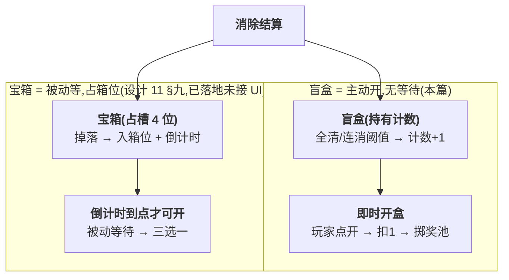

<style>
  /* 本篇专用：盲盒奖池小样式 */
  .lv { display:inline-block; min-width:1.6em; text-align:center; border:1px solid #444; border-radius:4px; padding:0 4px; }
  pre.code { margin:8px 0; padding:12px; background:#0d1622; border:1px solid var(--border); border-radius:8px; overflow:auto; font-size:13px; line-height:1.55; }
  .hole { display:inline-block; font-size:11px; letter-spacing:.5px; padding:1px 7px; border-radius:10px; background:var(--accent-soft); color:var(--accent); margin-left:6px; vertical-align:middle; }
  table.tight td, table.tight th { padding:6px 10px; }
  .pill-new { display:inline-block; font-size:11px; padding:1px 7px; border-radius:10px; background:rgba(91,214,160,.16); color:#5bd6a0; margin-left:6px; }
  .pill-cur { display:inline-block; font-size:11px; padding:1px 7px; border-radius:10px; background:rgba(108,140,255,.16); color:#6c8cff; margin-left:6px; }
</style>

# 神秘塔罗盲盒

把 GDD 的「神秘塔罗盲盒」落成一个**持有式、即时开盒**的核心系统:消除中的连消/全消挑战与特殊订单交付积累盲盒,玩家自选时机一键开出 <span class="lv">Lv1</span>–<span class="lv">Lv3</span> 图案 / 体力 / 当前订单所需高阶物。接入现有 merge-order 玩法([09](#09-merge-order-energy)/[10](#10-score-element-rm-collect)/[11](#11-core-loop-completion)),沿用其消除结算、特殊订单轨、宝箱的既有形态,不另起一套。

> [!WARNING]
> **读前必看 · 两条边界先钉死**
>
> 盲盒接的是已落地的 merge-order 玩法,不是 GDD 的完整商业体量游戏。
>
> - **产物上限封顶 Lv3,不引入 Lv4**。GDD 写盲盒产「Lv1–Lv4」,但合成链等级上限为 Lv3,且设计 11 §六已把「5 级 → 3 级」作为已拍板收敛(Lv4/Lv5 不落地)。盲盒奖池产 Lv4 会与封顶约束冲突——本篇据此把图案产物收敛为 Lv1–Lv3。详见 [§一](#12-tarot-blind-box::what)。
> - **「付费购买」渠道本设计不做**。项目红线去变现,GDD 盲盒的「付费购买」获取渠道明确不实装(见任务边界)。本设计只做**消除挑战解锁**与**特殊订单附赠**两条免费获取路径。

> [!NOTE]
> **立项信息**
>
> | 项 | 内容 |
> | --- | --- |
> | **类型** | 新玩法 · 核心系统 出设计稿 + 验收标准,交开发落地 |
> | **设计基线** | GDD「三 · 3 神秘塔罗盲盒」逐字需求 + 已落地 merge-order 玩法 |
> | **方向约束** | 离线还原 · **去变现**(无付费购买盲盒 / 无广告开盒加速——项目红线) |
> | **范围** | 新增盲盒奖池;持有计数纳入单局悔棋快照;消除结算追加解锁判定;特殊订单交付附赠;主玩法窗口加计数显示与开盒入口。**旧路径(Classic / 无盲盒触发时)零行为变化。** |
> | **关键约束(继承现状)** | **自动配对合成**使每个非封顶等级库存恒 ≤1(满 2 即升级)。盲盒产 Lv1/Lv2 图案进收集区会触发级联合并,这是预期行为而非缺陷;但意味着盲盒「产 1 个 Lv1」可能瞬间合成升级——产物价值要按级联后的实际收益评估。详见 [§3.3](#12-tarot-blind-box::grant)。 |

## 一、改什么与为什么 {#what}

当前 merge-order 玩法的中时间跨度目标只有「完成 N 单通关」与「女神好评条 N/10」。GDD 给盲盒定的定位是**「惊喜感,玩家的中时间跨度消除目标」**——即一个攒着开、开出随机惊喜的蓄水池,填补「连消/全消打得好 → 攒到一个看得见的奖励」这条反馈链。现状的连消/全消只即时发图案(设计 11 §5.2/§5.4),缺一个「跨多手攒、自选时机开」的延迟满足层。盲盒补的就是这一层。

本篇相对现状的三处新增,逐条对应 GDD:

| # | GDD 原文 | 本篇落法 |
| --- | --- | --- |
| 1 | 盲盒作为「惊喜感的中跨度目标」 | 一个持有计数,获取即累加,玩家自选时机开 |
| 2 | 获取:连消、全消等高挑战形成去开启 | 消除结算中追加判定:全清直发 1 个盲盒;连消链达阈值发 1 个 |
| 3 | 获取:订单奖励(特殊订单) | 特殊订单交付成功时附赠盲盒 |
| 4 | 内容:随机 Lv1–Lv4 图案 / 体力 / 订单所需高阶物 | 奖池产 <span class="lv">Lv1</span>–<span class="lv">Lv3</span> 图案 / 体力 / **当前订单缺口的高阶图案**(收敛 Lv4 见上方红框) |

**不做(本设计明确排除,后续轮次):**命运之轮活动包装、付费购买入口、集卡碎片、占卜屋/扭蛋、神谕降临双倍。本篇只做「持有 + 三渠道获取 + 即时开盒」的最小自洽系统。

## 二、系统模型 {#model}

### 2.1 持有式道具(非倒计时) {#hold}

盲盒与**宝箱**(设计 11 §九)是**两套不同的获取节奏**,刻意不合并:

- **宝箱 = 占槽 + 倒计时**:获取后入 4 箱位,必须等倒计时(去变现下只能等),到点才可开。它考验的是「攒箱位、规划开箱节奏」。
- **盲盒 = 持有计数 + 即时开**:获取即计数 +1,玩家任意时刻点「开盒」立即扣 1 开 1。它考验的是「连消/全消打得好就多攒,想用高阶物时就开」。无倒计时、无箱位上限概念,只有一个计数。

选持有计数模型而非复用宝箱占槽的理由:GDD 把盲盒定义为「中时间跨度目标」且「在消除过程中通过高挑战去开启」,语义是**攒够了就能开、想开就开**,与倒计时的「被动等待」相反。复用宝箱的倒计时会改变它的玩法语义。两套并存、各管一种节奏。

### 2.2 与宝箱的分工(为什么不复用宝箱的占槽) {#vs-chest}



两者共用上游的消除结算,下游分两套互不干扰。盲盒的产物落点(图案/体力)与宝箱发奖走同一条注入路径,改产物只改奖池一处。

## 三、数值正文 {#numbers}

全部数值为硬编码常量(不接 Luban 配置表)。下文给公式 + 默认常量 + 旋钮命名 + 边界逐档代入。

### 3.1 奖池与掉率 {#pool}

开一个盲盒掷出**恰好 1 项**奖励(不是三选一——盲盒是「开即得」的惊喜,不是宝箱的「选其一」)。奖项分五类,按权重抽样:

| 奖项 | 产物 | 默认权重 | 占比 | 价值定位 |
| --- | --- | --- | --- | --- |
| 低阶图案 | <span class="lv">Lv1</span> 图案 ×1(类型见 §3.3) | 40 | 40% | 常见、保底兜底项 |
| 中阶图案 | <span class="lv">Lv2</span> 图案 ×1 | 22 | 22% | 中等惊喜 |
| 体力 | 体力 +默认 10 | 20 | 20% | 续命,等价约 10 次落子 |
| 高阶图案 | <span class="lv">Lv3</span> 图案 ×1(=封顶高阶物) | 10 | 10% | 稀有大奖,GDD「高阶物品」 |
| 缺口高阶 | **当前订单缺口的最高等级图案 ×1**(无缺口时降级为高阶图案) | 8 | 8% | GDD「直接产出订单所需高阶物品」,针对性最强 |

权重总和 100,占比即权重(便于读)。**旋钮:** 各奖项权重独立可调——调大某项权重即提高该项出率;体力增量单独一档可调。

权重设计意图:图案类(低/中/高/缺口高阶)合计 80%,体力 20%。高阶物(高阶图案 + 缺口高阶)合计 18%,做到「常开常有小惊喜,偶尔大奖」。缺口高阶是「针对性高阶物」,占比刻意低于通用高阶图案,避免盲盒变成订单缺口的稳定补给(那会架空合成玩法)。

### 3.2 开盒算法(含保底) {#roll}

用确定性随机(同一随机种子可复现序列,可单测)做加权抽样:

```text
开盒掷 1 项:
total = 各奖项权重之和;            // = 100
r = 确定性随机取 [0, total);
累加权重,r 落入哪个区间即抽中该奖项;
返回掷出的奖项 + 产物等级/数量。
```

**保底**(双重):

- **下限保底:**任意一次开盒必产**有效奖励**(权重表无 0 价值项,最低也是 1 个 Lv1 图案或体力)。不存在「开了个空」。
- **缺口高阶降级保底:**抽中「缺口高阶」但当前无订单缺口(所有订单已可交付)→ 自动降级为通用高阶图案(Lv3),不浪费这次大奖。

### 3.3 产物落点与边界 {#grant}

| 奖项 | 落点 | 类型选择 | 边界处理 |
| --- | --- | --- | --- |
| 图案 Lv1/Lv2/Lv3 | 直接进合成区(收集区)库存 | 当前订单所需类型之一(轮转取),空则回退默认类型 | 入库走级联合并:产 Lv1 若该类已有 1 个 Lv1 → 自动升 Lv2(预期,非缺陷)。封顶 Lv3 不再升、堆积。 |
| 缺口高阶 | 直接进合成区库存 | 缺口里**最高等级**的那一项的(类型,等级) | 无缺口 → 降级高阶图案(见 §3.2) |
| 体力 | 返还体力(默认 +10) | — | 受体力软上限约束,不溢出(与消除返还同规则) |

> [!NOTE]
> **为什么图案直进合成区而非进待选区:**盲盒产的是「图案/收集物」,语义上属合成区(收集区)资源,直接进库存供合成/交付,与多消里程碑直发、全清奖、宝箱图案奖完全同源。不进待选区(待选区是「带元素的待落方块」,是另一条注入路径,设计 10 的待落元素队列)。这条边界让盲盒产物与现有图案经济无缝合流。

**开盒前置:** 持有计数 > 0 才可开;开盒后计数 -1。计数无硬上限(GDD 未限,持有式攒多少都行);若需防溢出可设软上限旋钮(默认很大,如 99,达上限后获取不再增——见 §七待拍板)。

### 3.4 连消/全消解锁阈值 {#unlock}

挂消除结算(单一信息源,所有落子后结算都经此)。在现有「连消链推进 / 全清武装位」逻辑之后追加盲盒解锁判定,**结算结果带出「本手获得几个盲盒」供窗口表现,计数副作用在结算内施加**(与全清奖、女神推进同体例):

| 触发条件 | 判据 | 盲盒产出 | 旁注 |
| --- | --- | --- | --- |
| **全清** | 发生全清且发奖(棋盘清空且全清武装位生效,沿用现有全清武装位) | +1 盲盒 | 复用全清武装位:连续第 2 次全清不发盲盒(防刷,与全清图案奖同步) |
| **连消链达阈值** | 连消链长恰好等于阈值(默认 4,即第 4 连消那一手) | +1 盲盒 | 用「恰好等于」而非「大于等于」:每条连消链**跨过阈值的那一手发一次**,链更长不重复发(否则 4/5/6 连消每手都发,通胀)。链断重置后重新计。 |

**逐档代入**(阈值默认 4):

| 连消链推进序列 | 各手连消链长 | 发盲盒的手 |
| --- | --- | --- |
| 连续 6 手都触发消除 | 2,3,4,5,6,7(注:倍率封顶但链值本身继续累加) | 仅第 3 手(链长跨到 4 的那手),共 +1 |
| 3 连消后断链,再 4 连消 | 2,3,4 \| 断 \| 2,3,4,5 | 第一段第 3 手 +1、第二段第 3 手 +1,共 +2 |
| 全程无连消(每手孤立消除) | 每手都是 2,然后链断重置 | 不发(没达到阈值 4) |

> [!NOTE]
> **连消链语义:** 消除结算中有消除时连消链长 +1,无消除时重置;开局起始为 1。倍率表用 5 档封顶 ×2.0,但链长本身不封顶。因此「链长 == 4」判定是稳的:第 4 连消那一手恰好链长从 3 自增到 4。**旋钮:** 连消阈值,调小更易出、调大更难。

### 3.5 特殊订单附赠 {#special}

GDD「紧急/特殊订单奖励含神秘塔罗盲盒」。特殊订单交付成功时按订单类型附赠盲盒。

| 特殊订单类型 | 附赠盲盒数 | 旋钮 |
| --- | --- | --- |
| 加急 | 默认 1 | 各类型独立常量,可分别调 |
| 剧情 | 默认 2(主线奖励更重) | 各类型独立常量,可分别调 |
| 黄金时段 | 默认 1 | 各类型独立常量,可分别调 |

附赠在交付动作内、按当前在槽订单的类型查表累加计数。交付是已提交动作,悔棋不倒回——附赠的盲盒计数随交付一起固化,不被悔棋倒回,符合「已交付」语义。

> [!NOTE]
> **现状边界:** 特殊订单轨与其交付逻辑已在数据层建成且有单测,但**尚未接入任何 UI 窗口**(目前只在测试里被触发)。本篇的特殊订单附赠是**数据层逻辑**,可单测、可落地;但「特殊订单在窗口里怎么投放/交付」是 <a href="#11-core-loop-completion::concurrency">11·§三(订单并发模型)</a> 的独立未接 UI 项,**不在本设计范围**。本设计只保证「一旦特殊订单交付成功,盲盒按表附赠」这条逻辑正确且被测覆盖。

## 四、持久化范围 {#hook}

盲盒持有计数纳入**悔棋快照**(纯内存机制),与灵魂/女神好评等进度同体例——落子触发的计数变化可随悔棋一并回滚,回滚正确。悔棋是内存机制,不进盘([设计 14·§2.2](#14-save-system::snapshot-vs-disk))。

跨会话持久化:无尽模型([设计 49](#49-infinite-no-rounds))下采**整盘续存**([设计 14](#14-save-system))——元层(灵魂、女神好评、盲盒计数等)与局内态(棋盘、待选块、合成区、订单、体力)都进盘,退出重进从原状态继续。盲盒持有计数作元层进盘([设计 14·§3.1](#14-save-system::boundary))。

## 五、UI 方案 {#ui}

glyph + 纯色,零美术,接现有主玩法窗口。两块:

- **盲盒计数 + 开盒按钮(常驻顶部信息行):**在体力条/完成单数那一行旁加一个「🔮 ×N」计数 + 「开盒」按钮。持有计数为 0 时按钮置灰(同悔棋按钮的置灰逻辑)。glyph 用 🔮 或 ◈,色用紫/金。
- **开盒结果(内联结果条):**点开盒 → 开出 1 项 → 用现有的飘字表现(全清/多消弹字同款)在棋盘上方弹一条「开出:◆ Lv3 ×1」之类,带 glyph + 色。不做独立全屏弹窗——盲盒是高频轻动作,内联弹字够且不打断节奏。获得盲盒时(连消/全清/交付)同样弹一条「+1 🔮」。

开盒结果展示用内联弹字而非模态窗口的理由:盲盒开得频繁,模态窗口每次都要点关闭会拖慢节奏;内联弹字与现有连消/多消反馈同一套表现语言,一致且零额外美术资源。若后续要做「开盒动画/仪式感」,那是表现层增强,本设计不做(见 §七)。

> [!NOTE]
> **刷新时机:**开盒/获得后须刷新合成区显示(图案进了合成区)+ 体力显示(可能加了体力)+ 盲盒计数与按钮态。与现有交付后的批量刷新同体例。

## 六、验收点(可逐条核对) {#accept}

每条对应一个或一组行为级测试,全绿且 core-loop 基线不回归。

| # | 验收点 | 完成定义(可核对) |
| --- | --- | --- |
| A1 | 奖池加权抽样确定性 | 固定随机种子后,连掷 N 次的奖项序列可复现;各奖项出现频次与权重比大致吻合(大样本)。 |
| A2 | 下限保底 | 任意种子下掷出的奖项 ∈ 有效奖项集,产物等级 ≥1 或体力 ≥1,不存在空奖。 |
| A3 | 缺口高阶降级保底 | 构造无订单缺口的局面,抽中缺口高阶 → 实际发放为高阶图案(Lv3);有缺口时发缺口最高等级项。 |
| A4 | 开盒扣计数 + 发放 | 持有计数=2,开盒一次后计数=1;图案项使合成区对应项 +1(或级联升级);体力项使体力增(不超软上限)。计数=0 时不可开盒、开盒不生效、计数不变。 |
| A5 | 全清解锁盲盒 | 全清且武装位生效 → 持有计数 +1 且结算结果记「本手获得 1 个盲盒」;连续第 2 次全清(武装位已消)不再发(本手获得 0 个)。 |
| A6 | 连消阈值解锁 | 连消链推进到恰好等于阈值那一手 +1 盲盒;同一连消链继续更长不再发;链断重置后再达阈值重新发。逐档代入(§3.4 表)逐行核对。 |
| A7 | 无消除不发盲盒 | 本手无消除时持有计数不增。 |
| A8 | 特殊订单附赠 | 各类型(加急/剧情/黄金时段)订单交付成功 → 持有计数按 §3.5 表增对应数;不可交付时(库存不足)交付失败且计数不变。 |
| A9 | 悔棋快照回滚计数 | 记持有计数=c → 存快照 → 落子触发全清使计数变 c+1 → 悔棋 → 计数回 c。(与灵魂/女神快照同构) |
| A10 | 旧路径零回归 | core-loop 基线全绿;无盲盒触发(无全清/未达连消阈值/不交付特殊单)时,所有现有结算结果与基线一致。 |

## 七、待拍板清单(交 boss / 用户) {#open}

以下为范围/取向开关,集中列出。其余数值我已按 §三默认拍板,dev 直接用。

| # | 待决项 | 我的默认取向(若无异议即按此) |
| --- | --- | --- |
| O1 | **盲盒产物是否含 Lv4。**GDD 写 Lv1–Lv4,合成链封顶 Lv3 且设计 11 已收敛 5→3 级。 | 收敛到 Lv1–Lv3(本篇方案)。若要支持 Lv4,须先抬高合成链等级上限并重审整个合成链(超本设计范围)。 |
| O2 | **持有计数是否设软上限。** | 本设计不设硬上限(GDD 未限,持有式);留旋钮默认 99 备用。 |
| O3 | **主玩法状态的跨会话磁盘持久化。** | 已由设计 [14](#14-save-system) 落地:无尽模型([设计 49](#49-infinite-no-rounds))下整盘续存,元层(含盲盒持有计数)+ 局内态都进盘,退出重进从原状态继续;只有悔棋栈(纯内存)不进盘。 |
| O4 | **开盒表现是否要独立仪式感动画/弹窗。** | 本设计内联弹字(轻、不打断)。仪式感动画属表现增强,后续轮次。 |

## 八、风险表 {#risk}

| 风险 | 后果 | 应对 |
| --- | --- | --- |
| 奖池高阶物占比偏高,盲盒成为订单缺口的稳定补给 | 架空合成玩法(玩家靠开盒而非合成凑单) | 高阶物合计 18%、缺口高阶仅 8%(§3.1);全部走旋钮,实测手感后调权重。验收 A1 留频次核对口子。 |
| 连消阈值用「大于等于」误实现 → 每手都发 | 盲盒严重通胀 | 设计明写「恰好等于」单次跨阈发(§3.4);验收 A6 逐档代入逐行核对,专测「链更长不重复发」。 |
| 盲盒计数漏进快照 | 悔棋后计数错乱(与灵魂计数早期同类隐患) | 持久化范围明列计数必入快照(§四);验收 A9 专测回滚;审查比对存档/复原字段对称。 |
| 图案入库触发的级联合并被误判为 bug | 误改入库逻辑破坏现有合成 | §3.3 明示级联是预期行为;验收按级联后实际库存断言,不断言「Lv1 必为 1 个」。 |
| 特殊订单 UI 未接,附赠无处触发 | 盲盒「特殊订单获取」渠道在 demo 里跑不出来,验收只能靠测试直接触发交付 | §3.5 明示这是数据层逻辑、UI 投放是设计 11 独立未接项;验收 A8 直接触发交付覆盖,不依赖 UI。 |
| 测试环境不可达,无法编译/跑测 | 无法判 PASS | 按硬约束:判 BLOCKED 不判 FAIL,环境恢复后补测。 |
