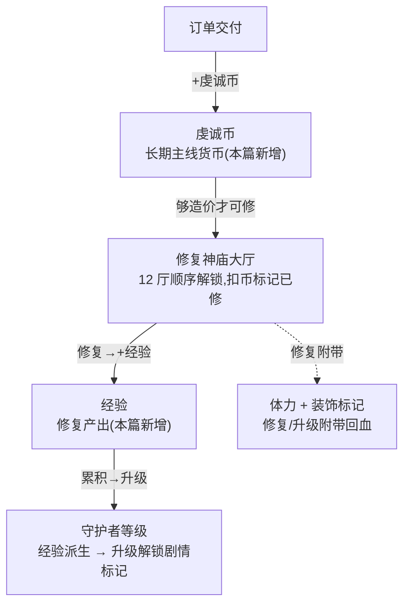

<style>
  /* 本篇专用：神庙/等级小样式 */
  .lv { display:inline-block; min-width:1.6em; text-align:center; border:1px solid #444; border-radius:4px; padding:0 4px; }
  pre.code { margin:8px 0; padding:12px; background:#0d1622; border:1px solid var(--border); border-radius:8px; overflow:auto; font-size:13px; line-height:1.55; }
  table.tight td, table.tight th { padding:6px 10px; }
  .pill-new { display:inline-block; font-size:11px; padding:1px 7px; border-radius:10px; background:rgba(91,214,160,.16); color:#5bd6a0; margin-left:6px; }
  .pill-cur { display:inline-block; font-size:11px; padding:1px 7px; border-radius:10px; background:rgba(108,140,255,.16); color:#6c8cff; margin-left:6px; }
  .coin { color:#ffcf5c; font-weight:bold; }
</style>

# 虔诚币 + 神庙修复

把 GDD 的**长期主线**落成一条可验收的成长链:订单交付产<span class="coin">虔诚币</span> → 攒够修复 12 座神庙大厅 → 每次修复产**经验**抬升**神庙守护者等级** → 升级解锁剧情章节(本设计只做解锁标记)。**加法式**接入已落地的订单合成玩法([09](#09-merge-order-energy)/[10](#10-score-element-rm-collect)/[11](#11-core-loop-completion)/[12](#12-tarot-blind-box)),沿用订单合成玩法的既有形态,**不重构现有灵力(软货币)经济**。

> [!WARNING]
> **读前必看 · 设计边界**
>
> 本篇接的是已落地的订单合成玩法,不是 GDD 的完整商业体量游戏。三条边界先钉死:
>
> - **加法式引入第二货币,不动灵力。**现行经济是设计 11 的单软货币灵力。本篇新增虔诚币作长期主线货币,与灵力并存、各管一段(对照 [§2.2](#13-piety-temple-repair::vs-soul))。GDD 写的「灵力 100 上限神谕槽」重构**不在本设计**。
> - **订单交付当前不发灵力。**现状订单交付只发体力 + 累计分,不发灵力。因此把虔诚币挂为「订单的主要奖励」是**纯新增**,不与现有奖励冲突。详见 [§3.1](#13-piety-temple-repair::piety-reward)。
> - **金币 / 高级图案包 不实装。**GDD 升级奖励含「金币和高级图案包」,但本作**无金币货币**,且图案包属变现向内容。本设计升级奖励只做**体力 + 剧情章节解锁标记**;金币/图案包**不做**(见 [§3.5](#13-piety-temple-repair::levelup) 与任务边界)。

> [!NOTE]
> **立项信息**
>
> | 项 | 内容 |
> | --- | --- |
> | **类型** | 新玩法 · 长期主线 出设计稿 + 验收标准,交开发落地 |
> | **设计依据** | GDD「虔诚币 / 神庙修复 / 经验·玩家等级」逐字需求 + 已落地的订单合成玩法 |
> | **方向约束** | 离线还原 · **去变现**(无付费购买虔诚币 / 无金币内购 / 无图案包售卖——项目红线);加法式扩展,不破坏现有核心循环 + 盲盒 |
> | **关键约束** | 长期主线进度(虔诚币 / 神庙修复 / 经验·守护者等级)经**跨会话磁盘存档**(设计 [14](#14-save-system))落盘,退出重进保留;局内瞬态(棋盘/手牌/订单/合成区/悔棋栈)不进盘,每局重建。本篇的「长期主线」是真正**跨会话尺度**的。 |

## 一、改什么与为什么 {#what}

当前 merge-order 切片的成长目标只有「完成 5 单通关」(短)与「女神好评条 N/10」(中)。GDD 给整个游戏定的**长期**主线是「攒虔诚币 → 修 12 神庙 → 升守护者等级 → 解锁剧情」,这是一条**跨越多个订单周期**的目标。现状缺这一层:订单交付完只回体力、加分,玩家没有一个「越打越接近的远期里程碑」。本篇补的就是这条长期反馈链。

本篇相对现状的新增,逐条对应 GDD 原文:

| # | GDD 原文 | 本篇落法 |
| --- | --- | --- |
| 1 | 虔诚币:长期主线货币,获取 = 完成订单的**主要奖励** | 订单交付按难度发放虔诚币([§3.1](#13-piety-temple-repair::piety-reward)) |
| 2 | 虔诚币消耗(唯一出口):修复 12 神庙大厅;例「愚者大厅」需 500 | 12 厅造价 + 顺序解锁;修复扣币、标记已修([§3.2](#13-piety-temple-repair::temple-cost)) |
| 3 | 修复反馈:大量经验值 + 体力 + 装饰性摆件 | 修复发奖:经验([§3.4](#13-piety-temple-repair::level-curve) 抬等级)+ 体力 + 装饰标记 |
| 4 | 经验:获取 = 修复神庙;作用 = 提升**神庙守护者等级** | 经验累积 → 守护者等级按曲线派生([§3.4](#13-piety-temple-repair::level-curve)) |
| 5 | 升级奖励:解锁新剧情章节、体力、金币、高级图案包 | 升级发体力 + **剧情章节解锁标记**(章节计数);金币/图案包不做(无金币货币,见红框) |

**不做(本设计明确排除,后续轮次):**钻石硬货币、灵力 重构为 100 上限神谕槽、剧情章节/NPC 剧情订单的**剧情内容**(只做解锁标记,不做剧情 UI)、装饰摆件的**实际美术**(只做 bool 标记)、金币货币与高级图案包、\~9 套活动。

## 二、系统模型 {#model}

### 2.1 三层主线链路 {#three-layer}

三个新系统串成一条单向链:订单是唯一虔诚币来源,神庙是唯一虔诚币出口,经验是修复的副产,等级是经验的派生。结构图:



整条链**单向、无随机**(全确定性,逐档可单测)。虔诚币的唯一来源是订单交付,唯一出口是神庙修复(GDD 明写「唯一出口」);经验只由修复产生;等级只由经验派生。三者互不旁路,链路清晰。

时间尺度:本链的虔诚币 / 神庙 / 经验·等级进度为**跨会话尺度**,经 [14 · 跨会话磁盘存档](#14-save-system::what)落盘,退出重进保留。

### 2.2 虔诚币 与 灵力 的分工(为什么不并入灵力) {#vs-soul}

新增第二货币而非并入灵力,是因为两者的**时间尺度与出口**不同,合并会互相污染:

|  | 灵力(现状,设计 11) | 虔诚币(本篇) |
| --- | --- | --- |
| 定位 | 短/中期软货币 | **长期主线货币** |
| 出口 | 兑体力(祈愿)、养成消耗(设计 11) | **唯一出口 = 修神庙**(GDD 明写) |
| 来源 | 宝箱 / 女神奖励 | 订单交付(GDD「完成订单的主要奖励」) |
| 消耗节奏 | 高频小额(随时兑体力) | 低频大额(攒几百修一厅) |

把神庙造价压到灵力上,会让「随时兑体力的高频小钱」与「攒着修庙的远期目标」抢同一个钱包,玩家要么不敢兑体力(怕拖慢修庙)、要么修庙遥遥无期。两个货币各管一段,出口互斥,长期目标才立得住。本篇**完全不改灵力的任何取值、公式、奖励规则**。

## 三、数值正文 {#numbers}

全部数值为固定常量配置(虔诚币产出旋钮续用订单合成玩法现有风格;神庙/等级表为新增配置)。下文给公式 + 默认常量 + 旋钮命名 + 边界逐档代入。

### 3.1 虔诚币产出(订单奖励) {#piety-reward}

虔诚币是「完成订单的主要奖励」,按**订单难度**发放——难单给得多。订单难度为已有量(折算成 Lv1 元素数,`Count × 2^(Level-1)`),自然形成「越难的单越值钱」。

```text
// 普通订单:现有发奖之后追加
虔诚币 += 订单难度 d × PietyPerDifficulty;        // 默认 PietyPerDifficulty = 30
// 特殊订单:现有发奖之后追加
虔诚币 += 订单难度 d × PietyPerDifficulty × SpecialPietyMult;  // 默认 SpecialPietyMult = 2
```

**逐档代入**(默认 `PietyPerDifficulty=30`,`SpecialPietyMult=2`):

| 订单 | 难度 d | 普通虔诚币 | 特殊虔诚币(×2) |
| --- | --- | --- | --- |
| Lv1 ×1 | 1 | 30 | 60 |
| Lv2 ×1 | 2 | 60 | 120 |
| Lv3 ×1 | 4 | 120 | 240 |
| Lv3 ×2 | 8 | 240 | 480 |

节奏标定:现行循环订单池(8 张)一轮总难度 = 1+2+4+1+8+1+2+4 = 23,即一轮约产 `23×30=690` 虔诚币。第一座神庙造价 500(GDD 例「愚者大厅 500」),约**完成 6–7 单**可修第一厅——比 demo 通关线(5 单)稍长,让「修第一厅」成为通关后仍想继续的钩子。**旋钮:**`PietyPerDifficulty` 调全局虔诚币慷慨度;`SpecialPietyMult` 调特殊订单溢价。

> [!NOTE]
> **边界:**虔诚币只增不减地累积(发放仅接受正数,负数/0 不增)。仅在修复神庙处扣减。无硬上限(攒多少都行,跨会话累积)。交付是已提交动作——发放随交付一起固化,不被悔棋倒回(交付即清空当局悔棋栈,与体力/分数奖励同步固化)。

### 3.2 12 神庙造价与解锁顺序 {#temple-cost}

GDD 写 12 座大厅、例「愚者大厅 500」。本篇按**大阿尔卡那(Major Arcana)**前 12 张命名(主题贴合「塔罗」),造价沿一条**线性递增**曲线,顺序解锁(必须修完第 i 厅才能修第 i+1 厅):

```text
// 第 i 座(序号从 0 起)造价
Cost(i) = TempleBaseCost + i × TempleCostStep;     // 默认 BaseCost=500, Step=250
// 顺序解锁:第 i 厅「可修」 ⟺ 前 i 厅全部已修(下一待修序号 == i)
```

| 序 | 大厅名 | 造价 | 累计 |
| --- | --- | --- | --- |
| 0 | 愚者大厅(The Fool) | 500 | 500 |
| 1 | 魔术师大厅(The Magician) | 750 | 1,250 |
| 2 | 女祭司大厅(The High Priestess) | 1,000 | 2,250 |
| 3 | 女皇大厅(The Empress) | 1,250 | 3,500 |
| 4 | 皇帝大厅(The Emperor) | 1,500 | 5,000 |
| 5 | 教皇大厅(The Hierophant) | 1,750 | 6,750 |
| 6 | 恋人大厅(The Lovers) | 2,000 | 8,750 |
| 7 | 战车大厅(The Chariot) | 2,250 | 11,000 |
| 8 | 力量大厅(Strength) | 2,500 | 13,500 |
| 9 | 隐士大厅(The Hermit) | 2,750 | 16,250 |
| 10 | 命运之轮大厅(Wheel of Fortune) | 3,000 | 19,250 |
| 11 | 正义大厅(Justice) | 3,250 | 22,500 |

数据驱动:12 厅的「厅名 + 造价」为手编清单,改名/改价/增删厅只动这一处。造价以公式默认值生成,但**逐项写死**(允许将来对个别厅手工调价,不被公式绑死)——即「公式定基调、清单可手调」风格,与订单池同款。**旋钮:**`TempleBaseCost` / `TempleCostStep` 调整体造价坡度。

> [!NOTE]
> **修复判定:**三条前置全满足才可修——①待修序号等于该厅序号(顺序,不可跳修);②该厅未修;③虔诚币 ≥ 该厅造价(币足)。任一不满足则修复不发生、状态不变。成功 → 扣造价、标记该厅已修、待修序号前移、发奖(<a href="#13-piety-temple-repair::temple-reward">§3.3</a>)。**全 12 厅修完后主线完成**(可作长期通关标记)。

### 3.3 修复发奖(经验 / 体力 / 装饰) {#temple-reward}

GDD:「修复建筑后,获得大量经验值、体力、以及装饰性摆件。」三项落法:

| 奖项 | 公式 / 默认 | 边界 |
| --- | --- | --- |
| **经验** | 经验 += 该厅造价(1:1,造价越高经验越「大量」);加完即重算守护者等级 | 只增;触发 0\~多次升级([§3.4](#13-piety-temple-repair::level-curve)) |
| **体力** | 回体力 `TempleRepairEnergy`(默认 30 = 回满软上限) | 受体力软上限约束,不溢出(与消除返还同规则) |
| **装饰摆件** | 标记该厅「已装饰」(本设计只做状态标记,无美术) | 修复成功即标记;美术表现后续轮次 |

经验取「= 造价」而非固定值的理由:GDD 写「大量经验值」且后期厅造价越来越高,经验跟造价走能让「修高价厅」同时是「跳等级」的大事件,后期升级感不疲软。**旋钮:**若要解耦,可引入「经验/造价比」系数(默认 1.0);本设计默认 1:1,留旋钮备调([§七 O2](#13-piety-temple-repair::open))。`TempleRepairEnergy` 调修复回血量。

### 3.4 经验 → 守护者等级曲线 {#level-curve}

守护者等级**从经验派生**(不单独存等级值,等级 = 经验的纯函数,避免两份状态漂移)。升一级所需经验**线性递增**:

```text
// 从第 L 级升到第 L+1 级所需经验(L 从 1 起):
ExpToNext(L) = LevelExpBase + (L - 1) × LevelExpStep;   // 默认 Base=500, Step=300
// 守护者等级 = 累积经验能买到的最高等级(从 1 起):
level=1; need=ExpToNext(1);
while (累积经验 >= need) { 累积经验 -= need; level++; need = ExpToNext(level); }
返回 level;
```

| 等级 | 本级所需 | 累计经验门槛 |
| --- | --- | --- |
| 1 → 2 | 500 | 500 |
| 2 → 3 | 800 | 1,300 |
| 3 → 4 | 1,100 | 2,400 |
| 4 → 5 | 1,400 | 3,800 |
| 5 → 6 | 1,700 | 5,500 |
| 6 → 7 | 2,000 | 7,500 |

坡度标定:修完前 12 厅累计产经验 = 神庙累计造价 22,500(§3.2 末行)。代入上表,22,500 经验约到**守护者 11 级**(累计门槛:Lv11 约 22,000)。即「修完全部神庙」≈「升到 11 级」,两条长期目标节奏对齐、互相牵引。**旋钮:**`LevelExpBase` / `LevelExpStep` 调升级坡度;调大更慢、调小更快。

> [!NOTE]
> **边界(逐档已核对):**① 累积经验 = 0 → 等级 1(开局)。② 恰好达门槛(如经验 500)→ 升到 2 级(门槛取「≥」)。③ 一次修复经验巨大可**跨多级**(连续逐级扣减判定),升级解锁按「跨了几级」逐级触发。④ 经验只增不减,等级只升不降。

### 3.5 升级解锁与边界 {#levelup}

守护者等级提升触发解锁。GDD 列「剧情章节 / 体力 / 金币 / 高级图案包」,本设计按红框收敛:

| GDD 升级奖励 | 本设计落法 | 说明 |
| --- | --- | --- |
| 解锁新剧情章节 | 已解锁章节计数 +1(每升 1 级解锁 1 章,只做**计数标记**) | 剧情内容/UI 不做(任务边界);窗口只显示「已解锁 N 章」 |
| 体力 | 回体力 `LevelUpEnergy`(默认 15),受软上限 | |
| 金币 | **不做** | 本作无金币货币(见红框);引入是独立大改 |
| 高级图案包 | **不做** | 图案包属变现向内容,去变现红线;且无打包系统 |

**跨级处理:**一次修复若使等级从 L 跨到 L+k,则已解锁章节计数 += k、发 k 份升级体力(一次性 `k×LevelUpEnergy`,受软上限)。**实装范围:**本设计至少做到「经验累积 + 等级计算 + 升级判定 + 解锁章节计数 + 升级回血」就位且被测覆盖。剧情章节的实际内容(对话/CG/剧情订单)不做。

## 四、状态与持久化 {#hook}

本系统引入的长期主线状态:虔诚币、经验、已解锁章节计数、12 厅的「已修/已装饰」标记、下一待修序号。守护者等级**不单独存值**,作为经验的纯函数派生([§3.4](#13-piety-temple-repair::level-curve)),避免两份状态漂移。

**所有产出加法式叠加,不改现有奖励的既有行为**——虔诚币只在订单交付的现有发奖之后追加发放;修复神庙是订单合成玩法之外的独立动作。

持久化分两条独立轨,字段虽重叠,但时机/介质/生命周期不同:

- **跨会话尺度**的长期主线进度(虔诚币 / 经验 / 守护者等级派生 / 神庙修复位)经设计 [14](#14-save-system) 的磁盘存档落盘,退出重进保留。
- **单局内**的悔棋回滚,在落子快照里同步记录主线字段(数组需深拷贝),悔棋时整体回滚,避免悔棋后主线状态错乱。

**修复神庙清空当局悔棋栈:**修复是发生在非落子时机的已提交经济动作,悔棋不应倒回已修的厅 / 已扣的币,与订单交付清栈同理。

## 五、UI 方案(神庙面板) {#ui}

glyph + 纯色,零美术,与现有 demo 一致。神庙面板布局:

- **顶部主线信息行:**<span class="coin">虔诚币 ✦ ×N</span>(金色)+ **守护者 Lv.L** + **经验条 cur/next**(本级进度,当前经验减去本级累计门槛 / 升下一级所需)+ 已解锁章节「第 N 章」。
- **12 厅列表(纵向滚动或 3×4 网格):**每厅一张卡,显示厅名 + 造价 ✦N + 状态徽标,**三态**各异:

| 态 | 判据 | 表现 | 修复按钮 |
|---|---|---|---|
| **已修** | 该厅已修 | 卡片高亮(绿/金)+「✓ 已修复」+ 装饰 glyph(◈/♕ 等纯字符) | 隐藏 / 显示「已修复」 |
| **可修** | 该厅为下一待修厅 且 币足 | 卡片正常 + 造价金色 | 「修复」可点(绿底) |
| **币不足** | 该厅为下一待修厅 且 币不足 | 造价标红/暗 +「还差 (造价−虔诚币)」 | 「修复」**置灰**(不可点) |
| **未解锁** | 该厅排在下一待修厅之后 | 卡片暗淡 + 🔒/「需先修前序大厅」 | 隐藏 / 置灰 |

- **修复反馈:**点「修复」→ 执行修复 → 弹内联提示「修复愚者大厅！+经验 500 +体力 30」;若跨级升级再弹「守护者 Lv↑ 解锁第 N 章」。然后刷新顶部信息行 + 该厅卡片态(+ 后一厅从「未解锁」转「可修/币不足」)。

> [!NOTE]
> **入口与刷新:**从订单合成主界面顶部「神庙」按钮打开(叠层,不丢当前局);或主菜单入口(§七 O4)。打开即按当前主线状态渲染。修复后刷新本窗信息行与厅列表;返回订单合成主界面时其虔诚币计数自然反映扣减(同一份主线状态)。表现用内联弹字而非全屏弹窗——与现有连消/开盒反馈同一套语言。

## 六、验收点(test 可逐条核对) {#accept}

本系统无随机,验收主要构造确定性状态后断言。除新增行为外,**现有基线全部不回归**。

| # | 验收点 | 完成定义(可核对) |
| --- | --- | --- |
| T1 | 普通订单发虔诚币 | 构造库存满足某订单 → 交付成功 → 虔诚币增 `难度 × PietyPerDifficulty`;现有体力/累计分奖励仍按原值增(不被破坏)。逐档代入 §3.1 表(Lv1×1=30、Lv3×1=120…)。 |
| T2 | 特殊订单发虔诚币(×倍率) | 占特殊槽且库存满足 → 交付特殊订单成功 → 虔诚币增 `难度 × PietyPerDifficulty × SpecialPietyMult`;现有盲盒附赠仍生效(不被破坏)。 |
| T3 | 不可交付不发币 | 库存不足 → 交付失败且虔诚币不变。 |
| T4 | 修复三前置门控 | 仅当「该厅为下一待修厅 且 未修 且 币足」时可修;跳修、回修已修厅、币不足三种情形均不可修。不满足时修复不发生、**状态全不变**(币不扣、不标记)。 |
| T5 | 修复扣币 + 标记 + 推进 | 币足修第 0 厅 → 虔诚币减该厅造价;第 0 厅标记已修、已装饰,下一待修序号前移到 1。再修第 1 厅同理推进到 2。 |
| T6 | 修复发经验 + 体力 | 修第 i 厅 → 经验增该厅造价;体力增 `TempleRepairEnergy` 但不超软上限(满血时不溢出)。 |
| T7 | 经验→等级曲线 | 经验 0 → 等级 1;恰好累计门槛(如 500)→ 2 级(「≥」判定);逐档代入 §3.4 表(1300→3级、2400→4级…)。等级是经验的纯函数,无独立状态。 |
| T8 | 修复触发升级(含跨级) | 构造经验接近门槛 → 一次修复使守护者等级增 ≥1;经验巨大时一次跨多级,已解锁章节增「跨的级数」、升级体力按跨级累加(受软上限)。 |
| T9 | 全厅修完标记 | 依次修完 12 厅 → 下一待修序号到 12、全部修完标记为真;此后任何修复请求失败。 |
| T10 | 虔诚币累积 + 只增 | 发放负数/0 不增;多次交付累加正确;无上限(大值不截断)。 |
| T11 | 悔棋快照回滚主线字段 | 记虔诚币/经验/下一待修序号/修复位 → 拍快照 → 落子交付使虔诚币变 → 悔棋 → 全部回滚到落子前。**另:**修复动作清空悔棋栈,修复后悔棋不倒回已修厅(§四)。 |
| T12 | 旧路径零回归 | 现有基线全绿;不触发虔诚币/神庙逻辑时,订单交付的现有断言(体力/分数/盲盒)与基线一致;Classic 模式零影响。 |

## 七、待拍板清单(交 boss / 用户) {#open}

以下为范围/取向开关,集中列出。其余数值我已按 §三默认拍板,dev 直接用。

| # | 待决项 | 我的默认取向(若无异议即按此) |
| --- | --- | --- |
| O1 | **升级奖励是否补金币/图案包。**GDD 列了,本作无金币货币、图案包属变现向。 | 本设计**不做**(只体力 + 章节解锁标记)。金币需先引入货币系统(独立大改);图案包触去变现红线。 |
| O2 | **修复经验是否解耦造价(引入「经验/造价比」系数)。** | 本设计经验 = 造价 1:1(简单且后期升级感强)。留旋钮默认 1.0,要调再说。 |
| O3 | **长期主线进度的跨会话磁盘持久化。** | 已由设计 [14](#14-save-system) 落地:虔诚币 / 经验·守护者等级 / 神庙修复位等长期主线进度随灵力·盲盒同体例进磁盘存档,退出重进保留;局内瞬态仍每局重建。「长期主线」即真正跨会话尺度。 |
| O4 | **神庙面板入口放哪。** | 主入口在订单合成主界面顶部「神庙」按钮(叠层,不丢局);主菜单入口为可选加分项,时间紧可省。 |
| O5 | **厅名是否用大阿尔卡那命名。** | 用(贴「塔罗」主题,GDD 例「愚者大厅」即大阿尔卡那第 0 张)。改名只动 12 厅清单一处。 |

## 八、风险表 {#risk}

| 风险 | 后果 | 应对 |
| --- | --- | --- |
| 误改订单交付现有发奖逻辑(非纯追加) | 破坏现有体力/分数/盲盒,基线回归 | §一/§四 明写「现有发奖之后追加」;验收 T1/T2 同时断言新旧奖励;T12 跑基线。 |
| 主线字段漏进悔棋快照 | 悔棋后虔诚币/经验/修复位错乱 | §四 列出主线字段须入快照(含数组深拷贝);验收 T11 专测回滚。 |
| 修复动作不清悔棋栈 → 悔棋倒回已修厅 | 玩家修庙后悔棋,币退回但厅仍标记已修(或反之),状态不一致 | §四 明示修复后清空悔棋栈(与交付同语义);验收 T11 末句专测。 |
| 顺序解锁判定漏判,可跳修高价厅 | 玩家攒够一笔直接修最贵厅,破坏顺序节奏 | §3.2 三前置含「待修序号严格等于该厅序号」;验收 T4 专测跳修失败。 |
| 测试环境不可达,无法编译/跑测 | 无法判 PASS | 按硬约束:test 判 BLOCKED 不判 FAIL,环境恢复后补测。 |
