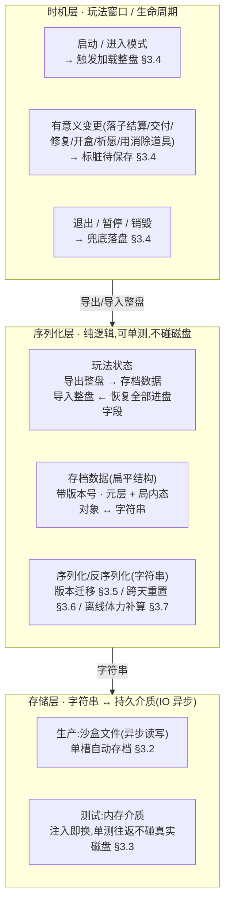
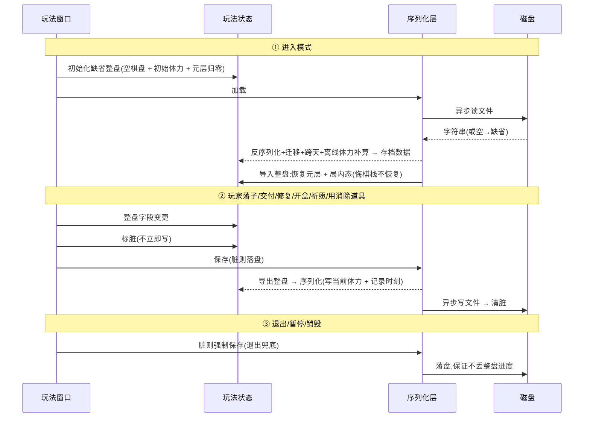

# 跨会话磁盘存档(整盘续存)

把合成订单玩法**整盘状态**——元层进度(虔诚币 / 神庙修复 / 经验·守护者等级 / 灵力 / 盲盒计数 / 女神 / 今日祈愿)**与局内态**(棋盘 / 手牌 / 合成区库存 / 进行中订单 / 体力)——从单局尺度升为**跨会话尺度**:启动加载整盘、有意义变更后保存,退出重进**从原状态继续**。无尽模型([设计 49](#49-infinite-no-rounds))下无「局」、无重开,故局内态也必须续存——这是无尽体验的一等需求(断点续玩=必做)。设计为接在已落地合成订单玩法之上([09](#09-merge-order-energy)/[10](#10-score-element-rm-collect)/[11](#11-core-loop-completion)/[12](#12-tarot-blind-box)/[13](#13-piety-temple-repair)),**不改变局内悔棋(单步 undo)的内存机制**。

> [!WARNING]
> **读前必看 · 四条边界**
>
> 本篇在无尽模型([设计 49](#49-infinite-no-rounds))下重定为**整盘续存**。四条边界先确定:
>
> - **整盘续存:元层进度 + 局内态都进盘。**棋盘 / 手牌 / 合成区库存 / 进行中订单 / 体力**进盘**,退出重进从原状态继续(详 [§3.1](#14-save-system::boundary))。只有少数纯内存瞬态不进盘(悔棋栈等,见 §3.1)。
> - **跨会话持久化,不引入新存储框架。**序列化层(对象↔字符串)与磁盘读写分层,沿用既有玩法存档的同一序列化口径(JSON + 扁平数据结构),不另起一套存储栈(对照 [§3.2](#14-save-system::format))。
> - **序列化层同步、可单测;磁盘 IO 走异步外壳。**纯序列化(对象↔字符串)同步、无磁盘依赖,单测往返不碰真实文件;仅**落盘 / 读盘**那一层走异步(满足「禁同步 IO」红线),详 [§3.3](#14-save-system::async)。
> - **悔棋机制不动。**局内单步 undo(内存机制)与磁盘存档是**两条独立轨**,字段虽有重叠但语义、时机、生命周期全不同(对照 [§2.2](#14-save-system::snapshot-vs-disk)),互不影响。

> [!NOTE]
> **立项信息**
>
> | 项 | 内容 |
> | --- | --- |
> | **类型** | 跨会话持久化 · 整盘续存 出设计稿 + 验收标准 |
> | **设计起因** | 无尽模型([设计 49](#49-infinite-no-rounds))取消「局」与重开:游戏是一条永不主动结束的循环,退出重进必须从原状态继续。元层长期反馈链(攒虔诚币 → 修神庙 → 升等级 → 解锁剧情)与局内态(没玩完的棋盘 / 没交完的订单 / 当前体力)都须跨会话保留。本篇统一为整盘续存。 |
> | **方向约束** | 离线还原 · **去变现**(本地单机存档,无云存档 / 无账号绑定 — 任务边界);加法式扩展,不破坏现有核心循环 + 已建系统(盲盒 / 神庙 / 女神 / 悔棋)。磁盘 IO 异步。 |
> | **关键约束** | 序列化层不依赖真实磁盘(单测往返到字符串 / 内存介质);悔棋的内存机制原样保留;整盘数据的对象↔字符串转换是纯逻辑(磁盘 IO 由存储层/窗口侧异步承接,不混进玩法状态逻辑)。 |

## 一、改什么与为什么 {#what}

现状(旧分场次模型):合成订单玩法只把**元层进度**做磁盘持久化,局内态(棋盘 / 手牌 / 合成区 / 订单 / 体力)每局重建、不进盘——因为旧模型每局重开,局内态本就该清零。

无尽模型([设计 49](#49-infinite-no-rounds))取消「局」与重开:游戏是一条持续运营的无尽循环,**退出重进必须从原状态继续**。这使局内态也成为跨会话需要保留的状态——玩家退出时棋盘上摆了一半、订单交了两单、体力剩 7 点,重进时这些都得在。本篇据此把存档从「只存元层」升为**整盘续存**:元层 + 局内态一起进盘。逐条对应需求:

| # | 需求 | 本篇落法 |
| --- | --- | --- |
| 1 | 整盘状态跨会话续存(断点续玩) | 启动从磁盘加载整盘并恢复;退出 / 有意义变更后落盘([§3.4](#14-save-system::timing)) |
| 2 | 存储层:沙盒路径 + 异步 IO(红线禁同步 IO) | 同步序列化 + 异步落盘外壳([§3.2](#14-save-system::format) / [§3.3](#14-save-system::async)) |
| 3 | 版本号 + 缺字段迁移 | 存档带版本号;加载缺字段给缺省、版本不匹配走兼容/重置([§3.5](#14-save-system::version)) |
| 4 | 每日字段(今日祈愿)跨天重置 | 存上次重置日期;加载跨天则今日祈愿归零([§3.6](#14-save-system::daily)) |
| 5 | 体力进盘 + 离线恢复 | 体力进盘;加载时按真实时差补算时基恢复([§3.7](#14-save-system::energy),与 [设计 49 §3.2](#49-infinite-no-rounds::regen) 联动) |
| 6 | 与悔棋分层,两者不冲突 | 磁盘存档独立轨,不进局内悔棋栈;悔棋内存机制原样不动([§2.2](#14-save-system::snapshot-vs-disk)) |

**不做(本设计明确排除):**云存档 / 账号绑定(本地单机文件);多存档槽 / 玩家手动存读档(单槽自动存档);悔棋栈进盘(纯内存瞬态,见 [§3.1](#14-save-system::boundary))。

## 二、系统模型 {#model}

### 2.1 三层分层(序列化 / 存储 / 时机) {#layers}

存档系统拆三层,各层职责单一、各自可测。下游依赖上游:序列化层产/吃字符串(纯逻辑),存储层把字符串落盘/读盘(异步 IO),时机层决定何时触发。数据流:

**为什么这样切:**把「对象↔字符串」与「字符串↔磁盘」拆成两层,是为了让<mark>序列化逻辑可单测而不依赖真实文件</mark>。序列化层只做纯转换,断言全在字符串 / 数据结构上;磁盘 IO 的异步与失败兜底封在存储层,单测用内存介质绕过真实磁盘。

### 2.2 磁盘存档 与 局内悔棋 的分工 {#snapshot-vs-disk}

两者字段有大量重叠(整盘续存后,棋盘 / 体力 / 合成区等局内态两边都出现),但语义、时机、生命周期全不同,是**两条独立轨**。对照:

| 维度 | 局内悔棋(内存机制,不动) | 磁盘存档(整盘续存) |
| --- | --- | --- |
| 目的 | 撤销最近一次落子:回滚到上一次落子前 | 退出重进:从离开时的整盘状态继续 |
| 介质 | 内存(悔棋栈) | 磁盘沙盒文件 |
| 范围 | 受落子影响的局内态快照(棋盘 / 元素分布 / 体力 / 合成区 / 订单进度 / 待投放队列) | 整盘(元层 + 局内态),见 [§3.1](#14-save-system::boundary) |
| 写时机 | 每次落子前压栈 | 有意义变更后 + 退出 / 暂停([§3.4](#14-save-system::timing)) |
| 生命周期 | 交付清栈;退出时丢弃(不进盘) | 持久,跨会话存活直到玩家清档 |
| 耦合 | **互不影响**:悔棋只读写内存栈、不碰磁盘;磁盘存档不进悔棋栈、不调用悔棋。悔棋回滚的是「最近一次落子」的瞬时快照;磁盘存的是「玩家离开时」的整盘态——同一批字段在两条轨上被独立读写,时机 / 介质 / 生命周期都不同,不互相调用。 |

> [!NOTE]
> **整盘续存后悔棋为何仍是独立轨**:整盘续存使磁盘也存棋盘 / 体力等局内态,与悔棋栈字段重叠。但二者**生命周期错开**——悔棋栈是「本次落子前的瞬时快照」(交付即清、退出即弃),磁盘存档是「离开时刻的整盘」。退出落盘存的是当前整盘态(含已应用的落子),不是悔棋栈里的历史快照;重进恢复整盘后,悔棋栈为空(无历史可撤),玩家从恢复的棋盘继续。两轨各管各的,互不调用。

## 三、设计正文 {#numbers}

### 3.1 持久化边界(哪些字段进盘) {#boundary}

判据(无尽模型下重定):**整盘状态进盘——元层进度 + 局内态都进盘;只有纯内存瞬态(无跨会话语义、可由进盘字段重建)不进盘**。逐项裁定(按游戏含义描述):

| 进度项 | 语义 | 进盘? |
| --- | --- | --- |
| 灵力 | 软货币 | 是(元层) |
| 虔诚币 | 长期主线货币 | 是(元层) |
| 累积经验 | 守护者等级是其纯函数 | 是(元层) |
| 已解锁剧情章节数 | — | 是(元层) |
| 下一座待修神庙序号 | — | 是(元层) |
| 各厅是否已修(12 厅) | 布尔数组,长度 12 | 是(元层) |
| 各厅是否已装饰(12 厅) | 布尔数组,长度 12 | 是(元层) |
| 盲盒持有计数 | — | 是(元层) |
| 女神当前档好评条计数 | — | 是(元层) |
| 女神好感等级 | — | 是(元层) |
| 今日已用祈愿次数 | 配跨天重置 §3.6 | 是(元层) |
| **当前体力** | 无尽节流资源 + 配离线恢复 §3.7 | **是(局内,O3 改)** |
| **棋盘占位 + 棋盘上元素分布** | 当前局内态 | **是(局内)** |
| **当前手牌(待选 3 块及其携带元素)** | 当前局内态 | **是(局内)** |
| **合成区库存(各类型各等级数量)** | 当前局内态 | **是(局内)** |
| **进行中订单(日常轨 2 单 + 特殊轨槽 + 订单池游标)** | 当前局内态 | **是(局内)** |
| **待投放元素队列** | 当前局内态(影响下次补牌) | **是(局内)** |
| **连消链长 / 全清武装位** | 当前局内态(影响下次结算) | **是(局内)** |
| **方块皮肤态(彩色 / 单色 + 当前单色标识)** | 当前局内态(随全清演进,见 [设计 50](#50-block-skin-switch)) | **是(局内)** |
| **生涯累计:历史完成单数 / 历史交付分** | 跨会话累计统计(无通关用途,见 O2) | **是(元层,O2 改;按 [49 §五 O4](#49-infinite-no-rounds::open) 默认进盘)** |
| —— 以下不进盘(纯内存瞬态)—— |  |  |
| 悔棋次数 / 悔棋栈 | 撤销最近落子的内存快照,退出即弃,不跨会话 | 否(内存瞬态) |
| 本次落子结算的临时中间量 | 一次结算内的临时变量,由进盘字段重算 | 否(内存瞬态) |

**边界裁定的两处需注意(决策汇总见 §五):**

- **O2 — 完成单数与交付分:**无通关后二者**不再用于场次判定 / 结算**。按 [设计 49 §五 O4](#49-infinite-no-rounds::open) 的默认,二者作**生涯累计统计进盘**(跨会话累计「历史完成单数 / 历史交付分」,可供成就 / 展示)。旧模型「不进盘」的理由(跨会话累计会让放下第一块即满足通关阈值导致秒结算)在无通关后**消失**——没有通关阈值,累计值不触发任何场次结束,故可安全进盘作长期统计。
- **O3 — 体力:**无尽模型下体力**进盘**,且加载时按真实时差补算时基恢复([§3.7](#14-save-system::energy))。旧模型「不进盘」的理由(跨会话保留体力 = 关掉游戏养体力漏洞)在无尽模型下**反转**:离线恢复正是兜底的最终保险([设计 49 §3.2](#49-infinite-no-rounds::regen)),「关掉游戏等体力恢复」是设计要的脱困路径而非漏洞。故体力进盘 + 离线恢复是无尽模型的必需项。

### 3.2 序列化格式 + 沙盒路径 {#format}

**格式:JSON。**理由——文本格式<mark>可人工查档调试、缺字段天然给类型默认值</mark>(利于 §3.5 迁移)、与既有玩法存档同口径零学习成本。不选二进制:存档体量仍小(整盘续存后增加棋盘 / 手牌 / 合成区 / 订单等局内态,但都是紧凑的整数 / 短数组),二进制省的空间无意义,反而牺牲可读性与缺字段容错。

**存档数据形态(扁平、序列化友好):**分元层段与局内态段,两段同档落盘。布尔数组 / 棋盘占位用紧凑数组表达;纯内存瞬态(悔棋栈等)不出现。

| 段 | 字段(语义) | 类型 | 说明 |
| --- | --- | --- | --- |
| 公共 | 版本号 | int | 存档结构版本,当前 = 2(§3.5) |
| 公共 | 上次记录时刻 | string/long | 用于离线体力补算 §3.7 + 跨天判定 §3.6 |
| 元层 | 灵力 / 虔诚币 / 累积经验 | int | 元层货币与经验 |
| 元层 | 已解锁章节数 / 下一待修神庙序号 | int | 主线进度 |
| 元层 | 各厅已修 / 已装饰 | bool[12] | 长度 = 神庙厅数(12) |
| 元层 | 盲盒持有计数 / 女神好评条计数 / 女神好感等级 | int | — |
| 元层 | 今日已用祈愿次数 / 上次祈愿重置日期 | int / string | 配跨天重置 §3.6 |
| 元层 | 历史完成单数 / 历史交付分(生涯累计) | int / long | O2,生涯统计 |
| 局内 | 当前体力 | int | O3,配离线恢复 §3.7 |
| 局内 | 棋盘占位 + 棋盘元素分布 | 紧凑数组 | 8×8 格的占位与每格元素 |
| 局内 | 当前手牌(3 块形状 + 各携带元素) | 紧凑结构 | 待选区当前 3 块 |
| 局内 | 合成区库存(各类型各等级数量) | 紧凑结构 | 自动配对后的紧凑库存 |
| 局内 | 进行中订单(日常 2 单 + 特殊槽 + 池游标) | 紧凑结构 | 当前激活订单与刷新游标 |
| 局内 | 待投放元素队列 | 紧凑数组 | 影响下次补牌 |
| 局内 | 连消链长 / 全清武装位 | int / bool | 影响下次结算 |
| 局内 | 方块皮肤态(皮肤模式 + 当前单色标识) | int/enum + string/int | 棋盘外观,随全清演进([设计 50](#50-block-skin-switch));缺字段保底为彩色态 |

**存储介质 / 路径(分生产与测试):**

| 环境 | 介质 | 说明 |
| --- | --- | --- |
| 测试 | 内存介质 | 测试前注入,往返不碰真实磁盘 |
| 生产(默认推荐) | 沙盒 JSON 文件 | 单槽自动存档,文件名带版本后缀(见下)。<mark>异步读写</mark>,满足红线;沙盒根取应用的可写沙盒目录 |
| 生产(降级备选) | 平台本地键值存储 | 若沙盒文件方案接入成本高,可先用平台本地键值存储兜底(非阻塞 IO,不触红线);介质升级为独立轮次,见 [§五 O4](#14-save-system::open) |

> [!NOTE]
> **存储位置带版本后缀 `_v2`:**后缀是「存储位置版本」(改它 = 旧档作废、全新位置),与存档数据内的版本号字段(同位置内的结构演进,走 §3.5 迁移)<mark>是两个层级</mark>:小改字段升版本号迁移,破坏性大改才换存储位置后缀。从「只存元层」升为「整盘续存」是结构破坏性扩张,数据内版本号升到 2;是否换存储位置后缀由实现按旧档兼容策略定(见 [§五 O5](#14-save-system::open))。

### 3.3 异步 IO 与同步序列化的分界 {#async}

红线「禁同步加载/IO」针对的是阻塞主线程的磁盘 / 资源 IO。本篇据此分界:

- **同步(纯逻辑,不碰磁盘):**导出整盘 → 存档数据、导入整盘 ← 恢复字段、存档数据 ↔ 字符串、版本迁移、跨天判定、离线体力补算。这些是内存内对象转换,<mark>单测直接同步断言,无需异步</mark>。
- **异步(落盘/读盘外壳):**保存 / 加载外壳包住「序列化 + 写文件」「读文件 + 反序列化」,文件读写走异步、不阻塞主线程。失败(IO 异常 / 文件不存在 / 解析失败)吞掉并返回「无存档」走缺省。

> [!WARNING]
> **测试与磁盘解耦(硬约束):**单测<mark>只测同步序列化层 + 内存介质往返</mark>,不测真实文件 IO(测试不应碰沙盒文件,异步文件 IO 在单测里也难覆盖)。验收锚点(§六)全部落在导出/导入整盘、序列化/反序列化、迁移、跨天、离线补算这些**同步纯逻辑**上。异步落盘外壳编译通过即可,正确性靠真机/人工冒烟,非本设计的单测验收范围。

**整盘转换保持纯逻辑:**导出/导入整盘是纯方法(无 IO、无异步);异步 IO 留在存储层与窗口侧。整盘转换可在纯逻辑单测里直接构造运行,不依赖异步框架(继承现状)。

### 3.4 存 / 读时机策略 {#timing}

**读(加载)——启动 / 进入模式时一次:**流程为先初始化一份缺省整盘(空棋盘 + 初始体力 + 元层归零),<mark>再加载存档,有档则用整盘恢复覆盖</mark>(无存档 / 加载失败 → 保持缺省,等价首次游玩)。整盘恢复覆盖元层 + 局内态全部进盘字段;悔棋栈不恢复(重进后为空)。

**写(保存)——标脏 + 节流,避免过频写盘:**

| 触发 | 动作 | 说明 |
| --- | --- | --- |
| 有意义变更 | 标脏待保存 | 落子结算、交付、修复、开盒、祈愿、女神升档、用消除道具后由**窗口侧**标脏。<mark>不在状态每次字段自增就写盘</mark>(那会每帧/过频)。 |
| 合并落盘 | 脏位为真时落盘一次 | 窗口在合适节点(动作处理结束 / 下一帧 / 定时)检查脏位,真则异步落盘并清脏。最简策略「每次有意义动作结束即异步落盘」(动作频率低,够用),复杂去抖列 O6。 |
| 退出 / 暂停 / 销毁(兜底) | 脏则强制落盘 | 窗口销毁 / 退出模式前、应用暂停 / 退出时,脏位为真强制落盘(退出场景下可接受短暂同步阻塞)。<mark>保证「玩家随手退出」不丢整盘进度(摆了一半的棋盘 / 没交完的订单 / 当前体力)。</mark> |

> [!NOTE]
> **落子是「有意义变更」**:整盘续存后,每次落子结算都改局内态(棋盘 / 体力 / 合成区 / 订单 / 队列),故落子结算结束即标脏。落子频率仍非每帧(玩家一手一手放),标脏 + 合并落盘足以避免过频写盘,又保证退出前必落最近一手。若实测落子频率下落盘开销偏高,走 O6 去抖合并。

### 3.5 版本号 + 缺字段迁移 {#version}

**当前版本号 = 2**(从「只存元层」升为「整盘续存」的结构扩张)。存档数据带版本号字段随档落盘。加载时按版本号决策:

| 读到的版本 | 处置 |
| --- | --- |
| == 当前版本(2) | 直接采用 |
| &lt; 当前版本(旧档,如版本=1 只有元层) | <mark>逐版迁移补缺</mark>:旧档缺局内态字段(版本=1 不存棋盘 / 手牌 / 体力等)→ 局内态全部走缺省(空棋盘 + 初始体力 + 空合成区 + 重置订单),等价「元层进度保留、局内态从头开始」;元层字段照常补缺(布尔数组为空 → 长 12 全 false、女神等级为 0 → 1、重置日期为空 → 当天)。补完置版本号为当前版本。 |
| &gt; 当前版本(未来档,降级运行) | 无法理解的新结构:保守<mark>重置为缺省(等价首次游玩)</mark>,不冒险用错位数据破坏存档。属极少见(玩家装回旧包),可接受丢档。 |
| 解析失败 / 非法档 | 当无存档,走缺省 |

**缺字段缺省规约(导入整盘时逐字段保底,即使版本匹配也跑):**

| 字段 | 缺省 / 保底 |
| --- | --- |
| 各厅已修 / 已装饰数组为空或长度≠12 | 重建为长 12 全 false |
| 女神好感等级 &lt; 1 | 置 1(等级从 1 起) |
| 下一待修神庙序号越界 | 夹到 `[0, 12]` |
| 当前体力越界(负 / 超溢出上限) | 夹到合法区间([0, 实际溢出上限]) |
| 棋盘占位 / 元素分布数组长度≠64 或越界 | 视作非法 → 局内态走缺省(空棋盘),不把脏棋盘带进玩法 |
| 合成区数量 / 队列含负值或越界等级 | 夹到合法区间;整体非法则该结构走缺省 |
| 其余整数字段 | 0 即合法缺省,直接用 |

**为什么导入时也逐字段保底:**哪怕版本相等,存档文件仍可能被外部篡改 / 截断(单机本地文件)。逐字段保底使导入对任意输入都产出<mark>合法的玩法状态不变量</mark>(等级≥1、神庙数组长 12、棋盘合法、体力在区间、索引不越界),不把脏数据带进玩法逻辑。局内态结构整体非法时,降级为「该结构走缺省」而非崩溃——最坏情况是局内态从头开始,元层进度仍保留。

### 3.6 每日字段跨天重置 {#daily}

「今日已用祈愿次数」语义是**今日**已用(上限 3 次/天)。跨会话存它必须配「上次重置日期」,否则昨天用满 3 次的玩家今天进来还是 0 可用。

- **存:**存档带上次祈愿重置日期(字符串 `yyyy-MM-dd`,本地日期)。每次落盘写入当前已用次数与上次重置日期。
- **读(导入时判定):**取当前本地日期 `today`。若上次重置日期 ≠ today → <mark>今日已用次数归零</mark>并把重置日期更新为 `today`;否则沿用存档值。
- **边界:**存档无日期字段(旧档 / 篡改)→ 视作「需重置」,已用次数归零 + 日期设为 today(宽松:宁可多给玩家一次每日额度,不卡死)。
- **日期源:**用本地日期。单测须能注入「当前日期」以测跨天(否则依赖真实时钟不可测)——跨天判定接收 `today` 参数,生产传当前时间,测试传构造日期。<mark>不做防作弊改表(本地单机、去变现,改系统时间无收益对象)。</mark>

### 3.7 体力进盘 + 离线时基恢复 {#energy}

体力进盘([§3.1](#14-save-system::boundary) O3),且加载时按真实时差补算时基恢复(机制见 [设计 49 §3.2](#49-infinite-no-rounds::regen))。

- **存:**落盘写入当前体力 + 上次记录时刻(本地时间戳,与跨天判定共用同一记录时刻)。
- **读(导入时补算):**取当前时刻 `now`。按 `Δ = now − 上次记录时刻` 真实秒数算应恢复点数 = `floor(Δ / RegenIntervalSec) × RegenPerTick`,把存档体力加上应恢复点数,**夹到体力软上限**(不溢出软上限;若存档体力本就高于软上限——订单奖励溢出——则不动,时基恢复只把低于软上限的补回软上限)。
- **边界(沿 [设计 49 §3.2](#49-infinite-no-rounds::regen) 崩法):**① 负时差(`now < 上次记录时刻`,玩家回调时钟)→ 应恢复按 0,不倒扣;② 首次无记录时刻(旧档 / 首次)→ 以 `now` 初始化,本次不补恢复;③ 不做时钟防作弊(本地单机、去变现,改时间最多自己早恢复、体力封顶软上限,无超发、无外部收益对象)。
- **日期 / 时刻源:**与跨天判定共用注入的 `now`,单测可构造「上次记录 = T0,当前 = T0 + N 秒」断言离线补算。

## 四、存读时序 {#flow}

一次完整的「进入模式 → 整盘变更 → 退出」的存读时序(参与方:窗口 / 玩法状态 / 序列化层 / 磁盘):

## 五、待拍板清单 {#open}

有安全默认的已自主拍板,此处只列**需 boss/用户裁决或交实现选型**的方向性开关:

| # | 问题 | 默认 / 建议 | 性质 |
| --- | --- | --- | --- |
| O2 | 完成单数 / 交付分进盘当生涯累计还是不进盘? | **默认进盘作生涯累计统计**(无通关后无场次判定用途,累计值不触发任何结束,可安全进盘作长期统计 / 成就)。若不要长期反馈可不进盘 | 范围开关(随 [49 §五 O4](#49-infinite-no-rounds::open)) |
| O3 | 体力跨会话保留? | **已拍板:进盘**(无尽节流资源,配离线时基恢复;旧「养体力漏洞」论据在无尽模型下反转为「脱困保险」) | 已拍板 |
| O4 | 生产存储介质:沙盒 JSON 文件 vs 平台本地键值存储? | **建议沙盒文件**(任务点名沙盒路径 + 异步)。**降级备选本地键值存储**(接入零成本,非阻塞不触红线)。两方案验收点(§六)不变(都经序列化层) | 实现选型 |
| O5 | 旧档(版本=1,只有元层)兼容策略 | **默认逐版迁移**:元层进度保留、局内态走缺省(等价「进度还在、棋盘从头开始」)。是否换存储位置后缀作废旧档由实现按兼容性权衡 | 实现选型 |
| O6 | 落盘节流:每次有意义动作即落盘 vs 帧末去抖合并? | **默认每次有意义动作结束即异步落盘**(动作频率低,够用)。复杂去抖(标脏 + 下一帧/定时合并)可选,不强求 | 实现选型 |

## 六、验收点 {#accept}

逐条可核对(全部锚在**同步纯逻辑** + 内存介质,不依赖真实磁盘 / 不依赖异步运行)。

| # | 验收点 | 完成定义 |
| --- | --- | --- |
| A1 | 整盘序列化往返保真 | 构造含全进盘字段非缺省值的整盘(元层 + 局内态:棋盘 / 手牌 / 合成区 / 订单 / 体力 / 队列 / 连消 / 全清武装) → 导出 → 序列化 → 反序列化 → 导入到新状态,所有进盘字段逐一相等(同一天 + 零时差,无跨天 / 离线干扰) |
| A2 | 长度 12 布尔数组往返保真 | 神庙已修 / 已装饰设若干 true 后往返,长度仍 12 且逐位相等 |
| A3 | 棋盘 / 合成区 / 订单往返保真 | 构造非空棋盘(若干格占位 + 元素)、非空合成区库存、进行中订单(含特殊槽与游标)往返后逐项相等 |
| A4 | 无存档 → 缺省(首次游玩) | 介质空时反序列化返回缺省;导入对缺省产出与初始化一致的整盘(空棋盘、体力=初始、虔诚币=0、女神等级=1、神庙全未修…) |
| A5 | 缺字段补缺(版本匹配但 JSON 缺字段) | 手造缺神庙数组 / 女神等级 / 棋盘字段的 JSON → 反序列化+导入后:数组重建为长 12 全 false、女神等级=1、棋盘走缺省(空),不抛异常 |
| A6 | 旧版本迁移(版本=1 只有元层) | 造版本=1(无局内态字段)的档 → 加载后元层字段保留补缺、局内态走缺省(空棋盘 + 初始体力)、版本号归一为 2,无异常 |
| A7 | 未来版本降级重置 | 造版本&gt;当前版本的档 → 加载走缺省重置(等价首次),不用错位数据 |
| A8 | 非法 / 截断档兜底 | 喂非 JSON 字符串 / 字段越界(待修神庙序号=99、女神等级=0、棋盘数组长度≠64、体力为负)→ 导入夹值到合法不变量(序号∈[0,12]、等级≥1、棋盘走缺省、体力∈区间),不抛、不污染玩法 |
| A9 | 跨天重置祈愿 | 存档今日已用=3 + 上次重置=昨天 → 以「今天」导入 → 今日已用=0 且重置日期更新为今天 |
| A10 | 同日不重置祈愿 | 存档今日已用=2 + 上次重置=今天 → 以「今天」导入 → 今日已用=2(不清零) |
| A11 | 缺日期字段宽松重置 | 存档无上次重置日期(旧档)→ 导入 → 今日已用=0 且日期设为今天 |
| A12 | 离线体力补算 | 存档体力=5 + 上次记录=T0,以「T0 + N 秒」导入 → 体力 = min(软上限, 5 + floor(N / RegenIntervalSec) × RegenPerTick) |
| A13 | 离线体力负时差兜底 | 存档体力=5 + 上次记录=T0,以「T0 − 100 秒」导入 → 体力=5(不倒扣、不抛) |
| A14 | 离线体力不溢出软上限 | 存档体力=29 + 大 N → 体力夹到软上限(30),不超过;存档体力本就>软上限(订单溢出)→ 时基补算不动它 |
| A15 | 悔棋栈不进盘 | 整盘往返不含悔棋栈;导入后悔棋栈为空,不触碰悔棋内存机制;原有悔棋(回滚)用例全部仍通过 |
| A16 | 旧路径零回归 | 现有用例全绿;不进入合成订单模式 / 不调存档时,玩法行为与本篇前一致 |
| A17 | 整盘转换仍纯逻辑 | 导出/导入整盘不依赖异步框架 / 不含磁盘 IO 调用,可在纯逻辑单测里同步调用 |
| A18 | 工程编译通过 | 含异步保存/加载外壳在内,编译无错(异步外壳正确性靠编译 + 人工冒烟,非单测断言) |

## 七、风险表 {#risk}

| 风险 | 影响 | 应对 |
| --- | --- | --- |
| 加载时整盘覆盖与缺省初始化顺序错位 | 缺省态污染存档 / 存档脏数据进玩法 | 确定顺序:先初始化缺省整盘,再用存档整盘恢复覆盖;局内态结构非法时降级走缺省(不抛);A1/A6/A8 验收 |
| 异步落盘在退出瞬间未完成 → 丢整盘进度 | 玩家摆了一半的棋盘 / 没交完的订单 / 攒的虔诚币退出后丢失 | 退出/暂停走兜底强制落盘(§3.4 ③);退出场景可接受同步落盘短暂阻塞 |
| 存档文件被篡改 / 截断(本地单机) | 脏数据进玩法,破坏不变量(等级=0、棋盘越界、体力为负) | 导入逐字段保底夹值 + 局内态结构非法降级走缺省,任意输入产出合法不变量(§3.5);A8 验收。本地去变现,不做加密/校验和(无对抗收益) |
| 离线体力补算依赖真实时钟 / 时差被改 | 倒扣体力 / 凭空给体力 / 不可测 | 离线补算 / 跨天判定接收 `now` 参数(生产传当前,测试传构造);负时差按 0、首次以 now 初始化([§3.7](#14-save-system::energy));A12-A14 验收 |
| 整盘续存使存档结构频繁加字段 | 后续加系统时存档字段膨胀 | 版本号 + 缺字段补缺机制(§3.5)正为此设计:新增字段加载时自动给缺省,旧档加载补缺;破坏性大改才换存储位置后缀 |
| 悔棋栈与整盘字段重叠致误把悔棋历史落盘 | 重进恢复到错误的历史快照 | 两轨独立(§2.2):落盘存「当前整盘」非「悔棋栈历史」,悔棋栈不进盘;A15 验收 |
