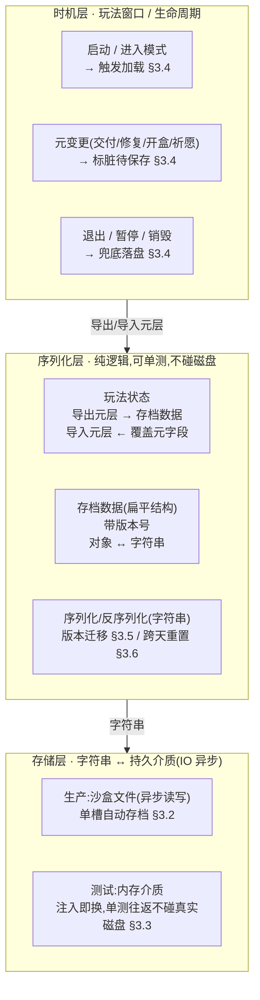
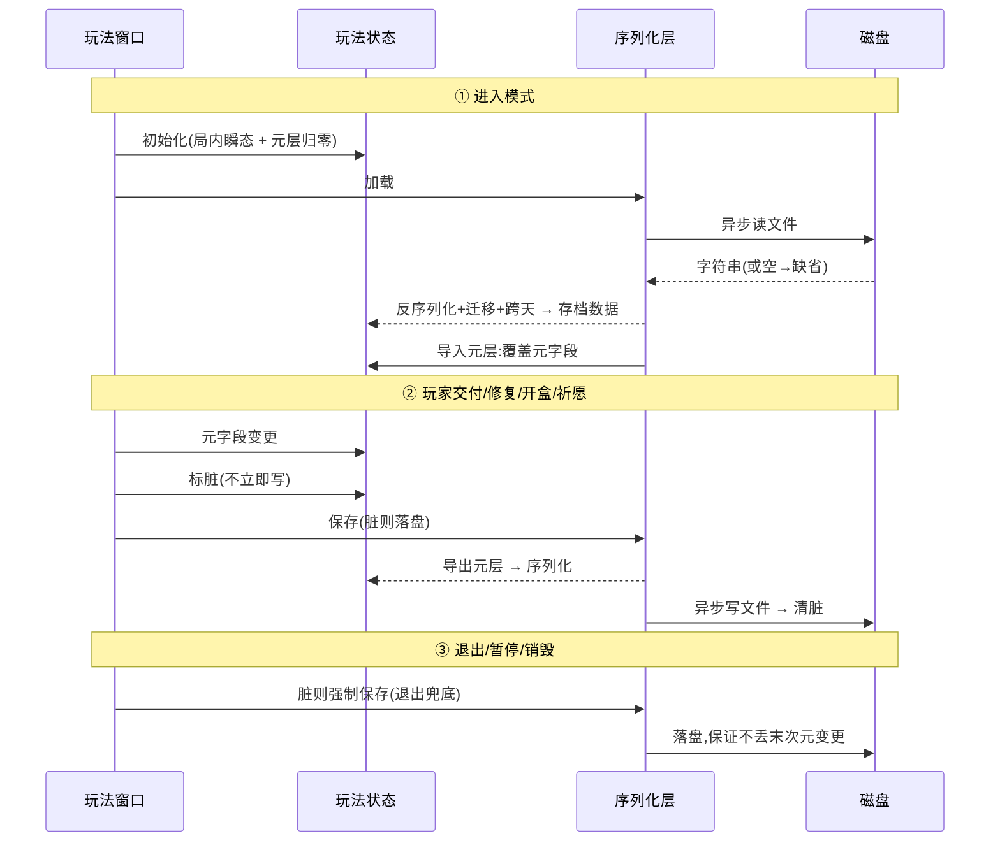

# 跨会话磁盘存档

把合成订单玩法的**元层进度**(虔诚币 / 神庙修复 / 经验·守护者等级 / 灵力 / 盲盒计数 / 女神 / 订单完成数 / 今日祈愿)从**单局尺度**升为**跨会话尺度**:启动加载、有意义元变更后保存,退出重进不再清零。设计为**加法式**扩展,接在已落地的合成订单玩法之上([09](#09-merge-order-energy)/[10](#10-score-element-rm-collect)/[11](#11-core-loop-completion)/[12](#12-tarot-blind-box)/[13](#13-piety-temple-repair)),**不改变局内悔棋(单局内 undo)**。

> [!WARNING]
> **读前必看 · 四条边界**
>
> 本篇兑现设计 [13 §七 O3](#13-piety-temple-repair::open) 标注为「独立大改、延后」的跨会话存盘。四条边界先钉死:
>
> - **只存元层进度,默认不存局内瞬态。**当前棋盘 / 手牌 / 进行中订单 / 合成区库存 / 悔棋栈 **每局重开不存**(断点续玩不做,详 [§3.1](#14-save-system::boundary) 与 [§七 O1](#14-save-system::open))。每局仍重建局内瞬态,只是元层不再从 0 起。
> - **跨会话持久化,不引入新存储框架。**序列化层(对象↔字符串)与磁盘读写分层,沿用既有玩法存档的同一序列化口径(JSON + 扁平数据结构),不另起一套存储栈(对照 [§3.2](#14-save-system::format))。
> - **序列化层同步、可单测;磁盘 IO 走异步外壳。**纯序列化(对象↔字符串)同步、无磁盘依赖,单测往返不碰真实文件;仅**落盘 / 读盘**那一层走异步(满足「禁同步 IO」红线),详 [§3.3](#14-save-system::async)。
> - **悔棋机制不动。**局内单步 undo(内存机制)与磁盘存档是**两条独立轨**,字段虽有重叠但语义、时机、生命周期全不同(对照 [§2.2](#14-save-system::snapshot-vs-disk)),互不影响。

> [!NOTE]
> **立项信息**
>
> | 项 | 内容 |
> | --- | --- |
> | **类型** | 新系统 · 跨会话持久化 出设计稿 + 验收标准 |
> | **设计起因** | GDD 把虔诚币 / 神庙定位为「长期主线」,与「整体不存盘、退出清零」的现状冲突。本篇消除该冲突,使长期反馈链(攒虔诚币 → 修神庙 → 升等级 → 解锁剧情)在多个会话间成立。 |
> | **方向约束** | 离线还原 · **去变现**(本地单机存档,无云存档 / 无账号绑定 — 任务边界);加法式扩展,不破坏现有核心循环 + 已建系统(盲盒 / 神庙 / 女神 / 悔棋)。磁盘 IO 异步。 |
> | **关键约束** | 序列化层不依赖真实磁盘(单测往返到字符串 / 内存介质);悔棋机制原样保留;元层数据的对象↔字符串转换是纯逻辑(磁盘 IO 由存储层/窗口侧异步承接,不混进玩法状态逻辑)。 |

## 一、改什么与为什么 {#what}

现状:合成订单玩法的元层进度**整体不做磁盘持久化**,只入局内悔棋(单局回滚)。每次进入模式,玩法状态都重建并清零所有元字段。结果是被 GDD 定位为**长期主线**的虔诚币 / 神庙修复进度,以及灵力 / 经验 / 守护者等级 / 盲盒计数 / 女神好感,全是**单局尺度**——玩家退出重进,一切归零。这与「攒虔诚币 → 修 12 神庙 → 升等级 → 解锁剧情」这条跨越多个订单周期的长期反馈链直接矛盾(设计 13 §七 O3 已记此为待办)。

本篇补的就是这一层:给元层进度加**跨会话磁盘存档**,使长期语义成立。逐条对应需求:

| # | 需求 | 本篇落法 |
| --- | --- | --- |
| 1 | 元层进度跨会话不清零 | 启动从磁盘加载并覆盖元层进度;退出 / 元变更后落盘([§3.4](#14-save-system::timing)) |
| 2 | 存储层:沙盒路径 + 异步 IO(红线禁同步 IO) | 同步序列化 + 异步落盘外壳([§3.2](#14-save-system::format) / [§3.3](#14-save-system::async)) |
| 3 | 版本号 + 缺字段迁移 | 存档带版本号;加载缺字段给缺省、版本不匹配走兼容/重置([§3.5](#14-save-system::version)) |
| 4 | 每日字段(今日祈愿)跨天重置 | 存上次重置日期;加载跨天则今日祈愿归零([§3.6](#14-save-system::daily)) |
| 5 | 与悔棋分层,两者不冲突 | 磁盘存档独立轨,不进局内悔棋;悔棋机制原样不动([§2.2](#14-save-system::snapshot-vs-disk)) |

**不做(本设计明确排除):**云存档 / 账号绑定(本地单机文件);xlsx 那 10 个系统(本设计后接);局内棋盘断点续玩(除非低成本顺带,默认不做,见 [§七 O1](#14-save-system::open));多存档槽 / 玩家手动存读档(本设计单槽自动存档)。

## 二、系统模型 {#model}

### 2.1 三层分层(序列化 / 存储 / 时机) {#layers}

存档系统拆三层,各层职责单一、各自可测。下游依赖上游:序列化层产/吃字符串(纯逻辑),存储层把字符串落盘/读盘(异步 IO),时机层决定何时触发。数据流:

**为什么这样切:**把「对象↔字符串」与「字符串↔磁盘」拆成两层,是为了让<mark>序列化逻辑可单测而不依赖真实文件</mark>。序列化层只做纯转换,断言全在字符串 / 数据结构上;磁盘 IO 的异步与失败兜底封在存储层,单测用内存介质绕过真实磁盘。

### 2.2 磁盘存档 与 局内悔棋 的分工 {#snapshot-vs-disk}

两者字段有重叠(虔诚币 / 灵力 / 经验等都在两边出现),但语义、时机、生命周期全不同,是**两条独立轨**。对照:

| 维度 | 局内悔棋(现状,不动) | 磁盘存档(本篇新增) |
| --- | --- | --- |
| 目的 | 局内单步 undo:回滚到上一次落子前 | 跨会话:退出重进保留长期进度 |
| 介质 | 内存(悔棋栈) | 磁盘沙盒文件 |
| 含局内瞬态 | 含(棋盘 / 手牌 / 合成区 / 订单进度…全量) | 不含(只元层进度,见 [§3.1](#14-save-system::boundary)) |
| 写时机 | 每次落子前压栈 | 有意义元变更后 + 退出 / 暂停([§3.4](#14-save-system::timing)) |
| 生命周期 | 交付 / 修复清栈;退出模式丢弃 | 持久,跨会话存活直到玩家清档 |
| 耦合 | **互不影响**:悔棋不读写磁盘;磁盘存档不进悔棋栈。悔棋只回滚局内瞬态(棋盘/库存),而元层进度的局内变化(如本局交付攒的虔诚币)随悔棋回滚——这是局内一致性,与磁盘存档「跨会话保留交付后已固化的进度」不矛盾:磁盘存的是**交付后**的已提交值(交付即清栈,不可悔),回滚只发生在交付之间。 |  |

## 三、设计正文 {#numbers}

### 3.1 持久化边界(哪些字段进盘) {#boundary}

判据:**元层进度(跨局累积、长期语义)进盘;局内瞬态(每局重开)不进盘**。逐项裁定(按游戏含义描述):

| 进度项 | 语义 | 进盘? |
| --- | --- | --- |
| 灵力 | 软货币 | 是 |
| 虔诚币 | 长期主线货币 | 是 |
| 累积经验 | 守护者等级是其纯函数 | 是 |
| 已解锁剧情章节数 | — | 是 |
| 下一座待修神庙序号 | — | 是 |
| 各厅是否已修(12 厅) | 布尔数组,长度 12 | 是 |
| 各厅是否已装饰(12 厅) | 布尔数组,长度 12 | 是 |
| 盲盒持有计数 | — | 是 |
| 女神当前档好评条计数 | — | 是 |
| 女神好感等级 | — | 是 |
| 今日已用祈愿次数 | 配跨天重置 §3.6 | 是 |
| —— 以下不进盘(局内瞬态)—— |  |  |
| 完成单数 | 单局通关进度,每局清零 | 否 (O2) |
| 本局交付得分 | 用于本局通关判定 / 结算摘要,每局清零 | 否 (O2) |
| 当前体力 | — | 否 (O3) |
| 合成区库存 | — | 否(局内) |
| 当前激活订单 / 订单池游标 | — | 否(局内) |
| 元素预算队列 | — | 否(局内) |
| 悔棋次数 / 悔棋栈 | — | 否(局内) |
| 连消链 / 全清武装位 | — | 否(局内) |
| 特殊订单轨(0/1 槽 + 等待队列) | — | 否(局内) |

**边界裁定的两处需注意(决策汇总见 §七):**

- **O2 — 完成单数与本局交付得分:**二者是单局瞬态,<mark>不进盘</mark>,每局重开清零。理由:完成单数用于本局通关判定(达标 5 单即通关),本局交付得分用于本局结算摘要,二者皆按局计;若跨会话累计,放下第一块即可能满足通关阈值导致秒结算,且结算摘要会显示生涯累计而非本局值。曾考虑把交付得分作「跨会话累计总分 / 成就」进盘,因与本局显示冲突已降级为不进盘——不影响其余进度项。
- **O3 — 体力:**默认<mark>不进盘</mark>,每局重开回到初始体力(=20)。体力是局内资源(落子扣 / 消除返 / 祈愿兑),跨会话保留它会让「关掉游戏养体力」成为漏洞,也与「每局重开」的现状一致。如将来要体力跨会话(配离线恢复),属独立设计,不在本设计。

### 3.2 序列化格式 + 沙盒路径 {#format}

**格式:JSON。**理由——文本格式<mark>可人工查档调试、缺字段天然给类型默认值</mark>(利于 §3.5 迁移)、与既有玩法存档同口径零学习成本。不选二进制:存档体量极小(十几个整数 + 两个长度 12 的布尔数组),二进制省的空间无意义,反而牺牲可读性与缺字段容错。

**存档数据形态(扁平、序列化友好):**逐字段含义如下。布尔数组直接序列化;不进盘的局内集合无需出现。

| 字段(语义) | 类型 | 说明 |
| --- | --- | --- |
| 版本号 | int | 存档结构版本,当前 = 1(§3.5) |
| 灵力 / 虔诚币 / 累积经验 | int | 元层货币与经验 |
| 已解锁章节数 / 下一待修神庙序号 | int | 主线进度 |
| 各厅已修 / 已装饰 | bool[12] | 长度 = 神庙厅数(12) |
| 盲盒持有计数 | int | — |
| 女神好评条计数 / 女神好感等级 | int | — |
| 今日已用祈愿次数 | int | 配跨天重置 |
| 上次祈愿重置日期 | string | `yyyy-MM-dd`(§3.6) |

**存储介质 / 路径(分生产与测试):**

| 环境 | 介质 | 说明 |
| --- | --- | --- |
| 测试 | 内存介质 | 测试前注入,往返不碰真实磁盘 |
| 生产(默认推荐) | 沙盒 JSON 文件 | 单槽自动存档,文件名带版本后缀(见下)。<mark>异步读写</mark>,满足红线;沙盒根取应用的可写沙盒目录 |
| 生产(降级备选) | 平台本地键值存储 | 若沙盒文件方案接入成本高,可先用平台本地键值存储兜底(非阻塞 IO,不触红线);介质升级为独立轮次,见 [§七 O4](#14-save-system::open) |

> [!NOTE]
> **存储位置带版本后缀 `_v1`:**后缀是「存储位置版本」(改它 = 旧档作废、全新位置),与存档数据内的版本号字段(同位置内的结构演进,走 §3.5 迁移)<mark>是两个层级</mark>:小改字段升版本号迁移,破坏性大改才换 `_v2` 存储位置。

### 3.3 异步 IO 与同步序列化的分界 {#async}

红线「禁同步加载/IO」针对的是阻塞主线程的磁盘 / 资源 IO。本篇据此分界:

- **同步(纯逻辑,不碰磁盘):**导出元层 → 存档数据、导入元层 ← 覆盖字段、存档数据 ↔ 字符串、版本迁移、跨天判定。这些是内存内对象转换,<mark>单测直接同步断言,无需异步</mark>。
- **异步(落盘/读盘外壳):**保存 / 加载外壳包住「序列化 + 写文件」「读文件 + 反序列化」,文件读写走异步、不阻塞主线程。失败(IO 异常 / 文件不存在 / 解析失败)吞掉并返回「无存档」走缺省。

> [!WARNING]
> **测试与磁盘解耦(硬约束):**单测<mark>只测同步序列化层 + 内存介质往返</mark>,不测真实文件 IO(测试不应碰沙盒文件,异步文件 IO 在单测里也难覆盖)。验收锚点(§六)全部落在导出/导入元层、序列化/反序列化、迁移、跨天这些**同步纯逻辑**上。异步落盘外壳编译通过即可,正确性靠真机/人工冒烟,非本设计的单测验收范围。

**元层转换保持纯逻辑:**导出/导入元层是纯方法(无 IO、无异步);异步 IO 留在存储层与窗口侧。元层转换可在纯逻辑单测里直接构造运行,不依赖异步框架(继承现状)。

### 3.4 存 / 读时机策略 {#timing}

**读(加载)——启动 / 进入模式时一次:**流程为先初始化局内瞬态 + 元层归零,<mark>再加载存档,有档则覆盖元字段</mark>(无存档 / 加载失败 → 保持缺省,等价首次游玩)。注意:初始化必须先跑(建好局内瞬态),再用存档覆盖元层——两者字段不重叠(§3.1),覆盖只动元字段。

**写(保存)——标脏 + 节流,避免过频写盘:**

| 触发 | 动作 | 说明 |
| --- | --- | --- |
| 有意义元变更 | 标脏待保存 | 交付、修复、开盒、祈愿、女神升档后由**窗口侧**标脏。<mark>不在元层每次字段自增就写盘</mark>(那会每帧/过频)。 |
| 合并落盘 | 脏位为真时落盘一次 | 窗口在合适节点(动作处理结束 / 下一帧 / 定时)检查脏位,真则异步落盘并清脏。最简策略「每次元动作结束即异步落盘」(动作频率低,够用),复杂去抖列 O5。 |
| 退出 / 暂停 / 销毁(兜底) | 脏则强制落盘 | 窗口销毁 / 退出模式前、应用暂停 / 退出时,脏位为真强制落盘(退出场景下可接受短暂同步阻塞)。<mark>保证「玩家随手退出」不丢最后一次元变更。</mark> |

**为什么标脏而非即时写:**元动作(交付/修复/开盒/祈愿)频率本就低(非每帧),但一次落子可能连带多次元变更(如交付触发升级 + 章节解锁)。标脏让「一串连带变更」合并成一次落盘,既避免过频写盘,又保证退出前必落。

### 3.5 版本号 + 缺字段迁移 {#version}

**当前版本号 = 1。**存档数据带版本号字段随档落盘。加载时按版本号决策:

| 读到的版本 | 处置 |
| --- | --- |
| == 当前版本 | 直接采用 |
| &lt; 当前版本(旧档) | <mark>逐版迁移补缺</mark>:JSON 里缺失的字段已是类型默认值(整数→0、数组→空),迁移把这些缺省补成合理值(如布尔数组为空 → 重建为长 12 全 false;女神等级为 0 → 1,因等级从 1 起;重置日期为空 → 当天)。补完置版本号为当前版本。 |
| &gt; 当前版本(未来档,降级运行) | 无法理解的新结构:保守<mark>重置为缺省(等价首次游玩)</mark>,不冒险用错位数据破坏存档。属极少见(玩家装回旧包),可接受丢档。 |
| 解析失败 / 字段全 0 的非法档 | 当无存档,走缺省 |

**缺字段缺省规约(导入元层时逐字段保底,即使版本匹配也跑):**

| 字段 | 缺省 / 保底 |
| --- | --- |
| 各厅已修 / 已装饰数组为空或长度≠12 | 重建为长 12 全 false |
| 女神好感等级 &lt; 1 | 置 1(等级从 1 起) |
| 下一待修神庙序号越界 | 夹到 `[0, 12]` |
| 其余整数字段 | 0 即合法缺省,直接用 |

**为什么导入时也逐字段保底:**哪怕版本相等,存档文件仍可能被外部篡改 / 截断(单机本地文件)。逐字段保底使导入对任意输入都产出<mark>合法的玩法状态不变量</mark>(等级≥1、神庙数组长 12、索引不越界),不把脏数据带进玩法逻辑。

### 3.6 每日字段跨天重置 {#daily}

「今日已用祈愿次数」语义是**今日**已用(上限 3 次/天)。跨会话存它必须配「上次重置日期」,否则昨天用满 3 次的玩家今天进来还是 0 可用。

- **存:**存档带上次祈愿重置日期(字符串 `yyyy-MM-dd`,本地日期)。每次落盘写入当前已用次数与上次重置日期。
- **读(导入时判定):**取当前本地日期 `today`。若上次重置日期 ≠ today → <mark>今日已用次数归零</mark>并把重置日期更新为 `today`;否则沿用存档值。
- **边界:**存档无日期字段(旧档 / 篡改)→ 视作「需重置」,已用次数归零 + 日期设为 today(宽松:宁可多给玩家一次每日额度,不卡死)。
- **日期源:**用本地日期。单测须能注入「当前日期」以测跨天(否则依赖真实时钟不可测)——跨天判定接收 `today` 参数,生产传当前时间,测试传构造日期。<mark>不做防作弊改表(本地单机、去变现,改系统时间无收益对象)。</mark>

## 四、存读时序 {#flow}

一次完整的「进入模式 → 元变更 → 退出」的存读时序(参与方:窗口 / 玩法状态 / 序列化层 / 磁盘):

## 五、待拍板清单 {#open}

有安全默认的已自主拍板,此处只列**需 boss/用户裁决或交实现选型**的方向性开关:

| # | 问题 | 默认 / 建议 | 性质 |
| --- | --- | --- | --- |
| O1 | 局内棋盘断点续玩(当前棋盘/手牌/进行中订单也存)做不做? | **默认不做**(任务边界:除非低成本顺带)。元层存档不含局内瞬态,每局重开。若评估顺带成本极低可加,但不在本设计验收 | 范围开关 |
| O2 | 完成单数 / 本局交付得分进盘当累计还是不进盘? | **已拍板:不进盘**(二者是单局瞬态,每局清零)。跨会话累计会让放下第一块即满足通关阈值导致秒结算、结算摘要显示生涯累计而非本局值,故降级为不进盘,不影响其余字段 | 已拍板 |
| O3 | 体力跨会话保留? | **默认不保留**(局内资源,跨会话保留会成养体力漏洞,且与「每局重开」一致)。离线体力恢复属独立设计,不在本设计 | 已拍板 |
| O4 | 生产存储介质:沙盒 JSON 文件 vs 平台本地键值存储? | **建议沙盒文件**(任务点名沙盒路径 + 异步)。**降级备选本地键值存储**(接入零成本,非阻塞不触红线)。两方案验收点(§六)不变(都经序列化层) | 实现选型 |
| O5 | 落盘节流:每次元动作即落盘 vs 帧末去抖合并? | **默认每次元动作结束即异步落盘**(元动作频率低,够用)。复杂去抖(标脏 + 下一帧/定时合并)可选,不强求 | 实现选型 |

## 六、验收点 {#accept}

逐条可核对(全部锚在**同步纯逻辑** + 内存介质,不依赖真实磁盘 / 不依赖异步运行)。

| # | 验收点 | 完成定义 |
| --- | --- | --- |
| A1 | 序列化往返保真 | 构造含全元字段非缺省值的元层 → 导出 → 序列化 → 反序列化 → 导入到新状态,所有进盘进度项(§3.1 表「是」的 11 项)逐一相等(同一天,无跨天干扰) |
| A2 | 长度 12 布尔数组往返保真 | 神庙已修 / 已装饰设若干 true 后往返,长度仍 12 且逐位相等 |
| A3 | 无存档 → 缺省(首次游玩) | 介质空时反序列化返回缺省;导入对缺省产出与初始化一致的元层(虔诚币=0、女神等级=1、神庙全未修、解锁章节=0…) |
| A4 | 缺字段补缺(版本匹配但 JSON 缺字段) | 手造缺神庙数组 / 女神等级的 JSON → 反序列化+导入后:数组重建为长 12 全 false、女神等级=1,不抛异常 |
| A5 | 旧版本迁移 | 造版本=0(或 &lt;当前版本)的档 → 加载后字段补缺合理、版本号归一为当前版本,无异常 |
| A6 | 未来版本降级重置 | 造版本&gt;当前版本的档 → 加载走缺省重置(等价首次),不用错位数据 |
| A7 | 非法 / 截断档兜底 | 喂非 JSON 字符串 / 字段越界(待修神庙序号=99、女神等级=0)→ 导入夹值到合法不变量(序号∈[0,12]、等级≥1),不抛、不污染玩法 |
| A8 | 跨天重置祈愿 | 存档今日已用=3 + 上次重置=昨天 → 以「今天」导入 → 今日已用=0 且重置日期更新为今天 |
| A9 | 同日不重置祈愿 | 存档今日已用=2 + 上次重置=今天 → 以「今天」导入 → 今日已用=2(不清零) |
| A10 | 缺日期字段宽松重置 | 存档无上次重置日期(旧档)→ 导入 → 今日已用=0 且日期设为今天 |
| A11 | 悔棋不受影响 | 原有悔棋(回滚)相关用例全部仍通过;导入不触碰悔棋栈 |
| A12 | 旧路径零回归 | 现有用例全绿;不进入合成订单模式 / 不调存档时,玩法行为与本篇前完全一致(初始化后元层仍归零,存档只在有档时覆盖) |
| A13 | 元层转换仍纯逻辑 | 导出/导入元层不依赖异步框架 / 不含磁盘 IO 调用,可在纯逻辑单测里同步调用 |
| A14 | 工程编译通过 | 含异步保存/加载外壳在内,编译无错(异步外壳正确性靠编译 + 人工冒烟,非单测断言) |

## 七、风险表 {#risk}

| 风险 | 影响 | 应对 |
| --- | --- | --- |
| 加载时元层覆盖与初始化顺序错位 | 存档被初始化清掉 / 局内瞬态被存档污染 | 钉死顺序:先初始化建局内瞬态 + 元层缺省,再导入只覆盖元字段(两者字段不重叠,§3.1 表已分);A1/A12 验收 |
| 异步落盘在退出瞬间未完成 → 丢末次变更 | 玩家「攒到的虔诚币」退出后丢失 | 退出/暂停走兜底强制落盘(§3.4 ③);退出场景可接受同步落盘短暂阻塞 |
| 存档文件被篡改 / 截断(本地单机) | 脏数据进玩法,破坏不变量(等级=0、数组越界) | 导入逐字段保底夹值,任意输入产出合法不变量(§3.5);A7 验收。本地去变现,不做加密/校验和(无对抗收益) |
| 跨天判定依赖真实时钟,不可测 | 每日重置逻辑无法单测 | 跨天判定 / 导入接收 `today` 参数(生产传当前时间,测试传构造日期);A8/A9/A10 验收 |
| 未来加 xlsx 10 系统时存档字段膨胀 | 存档结构频繁加字段 | 版本号 + 缺字段补缺机制(§3.5)正为此设计:新增字段加载时自动给缺省,旧档加载补缺,无需写一次性迁移;破坏性大改才换 `_v2` 存储位置 |
