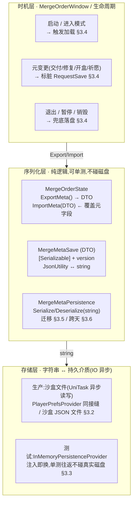
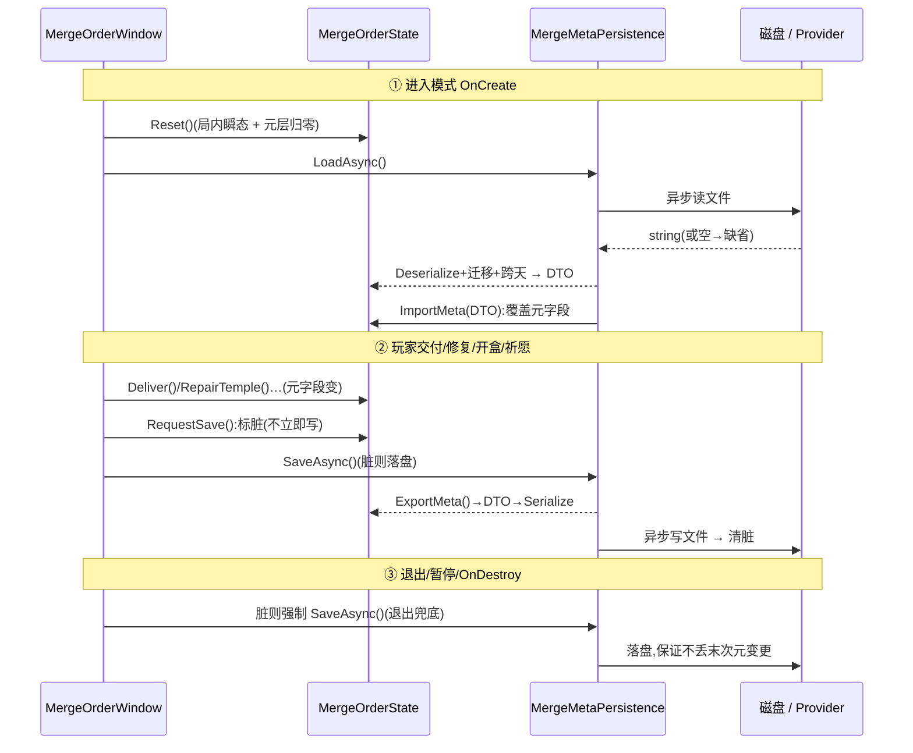

# 跨会话磁盘存档

把 `MergeOrderState` 的**元层进度**(虔诚币 / 神庙修复 / 经验·守护者等级 / 灵力 / 盲盒计数 / 女神 / 订单完成数 / 今日祈愿)从**单局尺度**升为**跨会话尺度**:启动加载、有意义元变更后保存,退出重进不再清零。**加法式**接入已落地 merge-order 切片([09](#09-merge-order-energy)/[10](#10-score-element-rm-collect)/[11](#11-core-loop-completion)/[12](#12-tarot-blind-box)/[13](#13-piety-temple-repair)),复用工程既有 `Persistence.Provider` 持久化接缝,<b>不动悔棋快照(局内 undo)</b>。

> [!WARNING]
> **读前必看 · 与工程现状的关系(单一事实源 = 代码)**
>
> 本篇直接兑现设计 [13 §七 O3](#13-piety-temple-repair::open) 标注为「独立大改、延后」的跨会话存盘——那项延后项即本篇。四条边界先钉死:
>
> - **只存元层进度,默认不存局内瞬态。**当前棋盘 / 手牌 / 进行中订单 / 合成区库存 / 悔棋栈 **每局重开不存**(断点续玩不做,详 [§3.1](#14-save-system::boundary) 与 [§七 O1](#14-save-system::open))。`ResetForMergeOrder` 仍每次重建局内瞬态,只是元层不再从 0 起。
> - **复用现有 `Persistence.Provider` 接缝,不自造存储框架。**工程已有 `Persistence`(`Module/BlockBlast/Persistence.cs`:生产 `PlayerPrefsProvider` / 测试 `InMemoryPersistenceProvider`),`BlockGameState` 与 `DynamicWeightDiff` 已按此模式存盘。本篇沿用同接缝 + 同 `JsonUtility` 序列化口径,**不引入新存储栈**(对照 [§3.2](#14-save-system::format))。
> - **序列化层同步、可单测;磁盘 IO 走异步外壳。**纯序列化(对象↔字符串)同步、无磁盘依赖,单测往返不碰真实文件(继承 168 例 EditMode 不依赖磁盘的现状);仅**落盘 / 读盘**那一层在生产侧用 UniTask 异步(满足 CLAUDE.md「禁同步 IO」红线),详 [§3.3](#14-save-system::async)。
> - **悔棋快照不动。**`MergeOrderState.Snapshot`(局内单步 undo,内存机制)与磁盘存档是**两条独立轨**,字段虽有重叠但语义、时机、生命周期全不同(对照 [§2.2](#14-save-system::snapshot-vs-disk)),互不调用、互不冲突。

> [!NOTE]
> **立项信息**
>
> | 项 | 内容 |
> | --- | --- |
> | **类型** | 新系统 · 跨会话持久化 出设计稿 + 验收标准,交开发落地 |
> | **设计基线** | 已落地 merge-order 切片的 `MergeOrderState` 元字段(设计 11/12/13 累计) + 工程既有持久化接缝(`Module/BlockBlast/Persistence.cs` / `BlockGameState.Save/Load` / `DynamicWeightDiff.Save/Load`)。GDD 把虔诚币 / 神庙定位「长期主线」,与「整体不存盘、退出清零」的现状冲突,本篇消除该冲突。 |
> | **方向约束** | 离线还原 · **去变现**(本地单机存档,无云存档 / 无账号绑定 — 任务边界);加法式扩展,不破坏现有核心循环 + 已建系统(盲盒 / 神庙 / 女神 / 悔棋)。IO 异步(UniTask)。 |
> | **影响范围** | 新增 `MergeMetaSave`(`[Serializable]` 存档数据传输对象,含 version 字段) + `MergeMetaPersistence`(序列化 / 落盘 / 读盘 / 跨天重置 / 版本迁移,纯逻辑可单测);`MergeOrderState` 加 `ExportMeta()` / `ImportMeta()` 两个纯方法 + 元变更后调 `RequestSave()`;`ResetForMergeOrder` 改为「加载存档 → 覆盖元层」而非全清元层;`MergeOrderWindow` 在 `OnDestroy` / 元动作后触发保存,app 暂停/退出兜底落盘。**旧路径(Classic / 不开 merge-order 时)零行为变化。** |
> | **关键约束(继承现状)** | 序列化层不依赖真实磁盘(单测往返到 string / InMemory Provider);悔棋快照机制原样保留;`MergeOrderState` 仍是纯逻辑类(磁盘 IO 不进 `MergeOrderState`,由窗口侧/持久化类承接异步)。 |

<h2 id="what">一、改什么与为什么</h2>

现状:`MergeOrderState` **整体不做磁盘持久化**,只入悔棋快照(单局内回滚)。每次进入 merge-order 模式,`ResetForMergeOrder` 都 `new MergeOrderState()` 并 `Reset()`,把所有元字段清零。结果是被 GDD 定位为**长期主线**的虔诚币 / 神庙修复进度,以及灵力 / 经验 / 守护者等级 / 盲盒计数 / 女神好感,全是**单局尺度**——玩家退出重进,一切归零。这与「攒虔诚币 → 修 12 神庙 → 升等级 → 解锁剧情」这条跨越多个订单周期的长期反馈链直接矛盾(设计 13 §七 O3 已记此为待办)。

本篇补的就是这一层:给元层进度加**跨会话磁盘存档**,使长期语义成立。逐条对应需求:

| # | 需求 | 本篇落法 | 现状/新增 |
| --- | --- | --- | --- |
| 1 | 元层进度跨会话不清零 | 启动从磁盘加载并覆盖 `MergeOrderState` 元字段;退出 / 元变更后落盘([§3.4](#14-save-system::timing)) | 新增系统 |
| 2 | 存储层:沙盒路径 + 异步 IO(红线禁同步 IO) | 复用 `Persistence.Provider` 接缝;同步序列化 + 异步落盘外壳([§3.2](#14-save-system::format) / [§3.3](#14-save-system::async)) | 复用接缝 + 异步外壳 |
| 3 | 版本号 + 缺字段迁移 | 存档带 `version`;加载缺字段给缺省、版本不匹配走兼容/重置([§3.5](#14-save-system::version)) | 新增 |
| 4 | 每日字段(今日祈愿)跨天重置 | 存上次重置日期;加载跨天则 `WishUsedToday=0`([§3.6](#14-save-system::daily)) | 新增 |
| 5 | 与悔棋快照分层,两者不冲突 | 磁盘存档独立轨,不进 `Snapshot`;悔棋机制原样不动([§2.2](#14-save-system::snapshot-vs-disk)) | 现状保留 |

<b>不做(本设计明确排除):</b>云存档 / 账号绑定(本地单机文件);xlsx 那 10 个系统(本设计后接);局内棋盘断点续玩(除非低成本顺带,默认不做,见 [§七 O1](#14-save-system::open));多存档槽 / 玩家手动存读档(本设计单槽自动存档)。

<h2 id="model">二、系统模型</h2>

<h3 id="layers">2.1 三层分层(序列化 / 存储 / 时机)</h3>

存档系统拆三层,各层职责单一、各自可测。下游依赖上游:序列化层产/吃字符串(纯逻辑),存储层把字符串落盘/读盘(异步 IO),时机层决定何时触发。结构图:

<b>为什么这样切:</b>把「对象↔字符串」与「字符串↔磁盘」拆成两层,是为了让<mark>序列化逻辑可单测而不依赖真实文件</mark>——这正是工程现有 `Persistence.Provider` 接缝的设计意图(生产 PlayerPrefs / 测试 InMemory)。序列化层只做纯转换,断言全在 string / DTO 上;磁盘 IO 的异步与失败兜底封在存储层,单测用 InMemory Provider 绕过。

<h3 id="snapshot-vs-disk">2.2 磁盘存档 与 悔棋快照 的分工</h3>

两者字段有重叠(Piety / Soul / Exp 等都在两边出现),但语义、时机、生命周期全不同,是**两条独立轨**。对照:

| 维度 | 悔棋快照 `Snapshot`(现状,不动) | 磁盘存档 `MergeMetaSave`(本篇新增) |
| --- | --- | --- |
| 目的 | 局内单步 undo:回滚到上一次落子前 | 跨会话:退出重进保留长期进度 |
| 介质 | 内存(`Stack<Snapshot>`) | 磁盘沙盒文件 / PlayerPrefs |
| 含局内瞬态 | 含(棋盘 / 手牌 / 合成区 / 订单进度…全量) | 不含(只元层进度,见 [§3.1](#14-save-system::boundary)) |
| 写时机 | 每次落子前压栈(`CaptureSnapshot`) | 有意义元变更后 + 退出 / 暂停([§3.4](#14-save-system::timing)) |
| 生命周期 | 交付 / 修复清栈;`ExitMergeOrder` 丢弃 | 持久,跨会话存活直到玩家清档 |
| 耦合 | **互不调用**:`Snapshot.Capture/Restore` 不读写磁盘;磁盘存档不进 `_undoStack`。悔棋只回滚局内瞬态(棋盘/库存),而元层进度的局内变化(如本局交付攒的虔诚币)随快照回滚——这是局内一致性,与磁盘存档「跨会话保留交付后已固化的进度」不矛盾:磁盘存的是**交付后**的已提交值(交付即清栈,不可悔),回滚只发生在交付之间。 |  |

<h2 id="numbers">三、设计正文</h2>

<h3 id="boundary">3.1 持久化边界(哪些字段进盘)</h3>

判据:**元层进度(跨局累积、长期语义)进盘;局内瞬态(每局重开)不进盘**。逐字段裁定(字段名经 grep `MergeOrderState.cs` 核实):

| 字段 | 类型 | 语义 | 进盘? |
| --- | --- | --- | --- |
| `Soul` | int | 灵力(软货币) | 是 |
| `Piety` | int | 虔诚币(长期主线货币) | 是 |
| `Exp` | int | 累积经验(守护者等级是其纯函数) | 是 |
| `UnlockedChapter` | int | 已解锁剧情章节数 | 是 |
| `NextRepairIndex` | int | 下一座待修神庙序号 | 是 |
| `TempleRepaired[]` | bool[12] | 各厅是否已修 | 是 |
| `TempleDecorated[]` | bool[12] | 各厅是否已装饰 | 是 |
| `BlindBoxCount` | int | 盲盒持有计数 | 是 |
| `GoddessRating` | int | 当前档好评条计数 | 是 |
| `GoddessLevel` | int | 女神好感等级 | 是 |
| `WishUsedToday` | int | 今日已用祈愿次数(配跨天重置 §3.6) | 是 |
| `CompletedOrders` | int | 累计完成单数 | 是 |
| `TotalScore` | int | 累计交付得分 | 是 (O2) |
| —— 以下不进盘(局内瞬态)—— |  |  |  |
| `Energy` | int | 当前体力 | 否 (O3) |
| `Inventory` | Dict | 合成区库存 | 否(局内) |
| `ActiveOrders` / `OrderCursor` | — | 当前激活订单 / 订单池游标 | 否(局内) |
| `PendingElements` | Queue | 元素预算队列 | 否(局内) |
| `UndoCharges` / `_undoStack` | — | 悔棋次数 / 快照栈 | 否(局内) |
| `ComboChain` / `AllClearArmed` | — | 连消链 / 全清武装位 | 否(局内) |
| `SpecialTrack` | obj | 特殊订单轨(0/1 槽 + 等待队列) | 否(局内) |

<b>边界裁定的两处需注意(列入待拍板 §七):</b>

- <b>O2 — <code>TotalScore</code>:</b>注释写「本局累计交付得分(用于通关/结算摘要)」,偏局内。但作为「跨会话累计总分 / 成就」也成立。默认<mark>进盘当累计总分</mark>(加法式、无害);若 dev 发现窗口把它当本局分用且与显示冲突,可降级为不进盘——不影响其余字段。
- <b>O3 — <code>Energy</code>(体力):</b>默认<mark>不进盘</mark>,每局 `ResetForMergeOrder` 回 `EnergyStart=20`。体力是局内资源(落子扣 / 消除返 / 祈愿兑),跨会话保留它会让「关掉游戏养体力」成为漏洞,也与「每局重开」的现状一致。如将来要体力跨会话(配离线恢复),属独立设计,不在本设计。

<h3 id="format">3.2 序列化格式 + 沙盒路径</h3>

<b>格式:JSON(<code>UnityEngine.JsonUtility</code>)。</b>理由——工程现有两处存档(`BlockGameState` / `DynamicWeightDiff`)都用 `JsonUtility.ToJson/FromJson` + `[Serializable]` 扁平 DTO,沿用同口径<mark>零学习成本、可人工查档调试、缺字段天然给类型默认值</mark>(利于 §3.5 迁移)。不选二进制:存档体量极小(十几个 int + 两个 bool\[12\]),二进制省的空间无意义,反而牺牲可读性与缺字段容错。

<b>DTO 形态(<code>MergeMetaSave</code>,扁平、JsonUtility 友好):</b>bool\[\] 直接可序列化;Dictionary 不进盘故无需拍平。

<pre class="code">[Serializable]
public sealed class MergeMetaSave
{
    public int version;          // 存档结构版本，当前 = MergeMetaPersistence.CurrentVersion
    public int soul;
    public int piety;
    public int exp;
    public int unlockedChapter;
    public int nextRepairIndex;
    public bool[] templeRepaired;   // 长度 = TempleConfig.HallCount(12)
    public bool[] templeDecorated;
    public int blindBoxCount;
    public int goddessRating;
    public int goddessLevel;
    public int completedOrders;
    public int totalScore;          // O2：默认进盘当累计总分
    public int wishUsedToday;
    public string lastWishResetDate; // 上次祈愿重置日期 yyyy-MM-dd（§3.6）
}</pre>

<b>存储介质 / 路径(分生产与测试):</b>

| 环境 | 介质 | 说明 |
| --- | --- | --- |
| 测试(EditMode) | `InMemoryPersistenceProvider` | SetUp 注入,与现有 `TempleRepairTests` / `TarotBlindBoxTests` 同款,往返不碰真实磁盘 |
| 生产(默认推荐) | YooAsset 沙盒 JSON 文件 | 路径 `{sandboxRoot}/blockblast_merge_meta_v1.json`。<mark>异步读写(UniTask)</mark>,满足红线;沙盒根取 TEngine/YooAsset 既有沙盒目录(dev 用 `unity_reflect` 核实确切 API,见 §五挂接点 O4) |
| 生产(降级备选) | `PlayerPrefsProvider` | 若沙盒文件 API 接入成本高,可先沿用现有 `Persistence.Provider`(PlayerPrefs,与 BlockGameState 同款)兜底,键 `block_blast_merge_meta_v1`。PlayerPrefs 非阻塞 IO,不触红线;路径升级为独立轮次,见 [§七 O4](#14-save-system::open) |

> [!NOTE]
> <b>键 / 文件名带版本后缀 <code>_v1</code>:</b>与现有 <code>block_blast_save_v1</code> / <code>block_blast_dynamic_v1</code> 同款。后缀是「存储位置版本」(改它 = 旧档作废、全新位置),与 DTO 内 <code>version</code> 字段(同位置内的结构演进,走 §3.5 迁移)<mark>是两个层级</mark>:小改字段升 <code>version</code> 迁移,破坏性大改才换 <code>_v2</code> 文件名。

<h3 id="async">3.3 异步 IO 与同步序列化的分界</h3>

CLAUDE.md 红线「禁同步加载/IO」针对的是阻塞主线程的磁盘 / 资源 IO。本篇据此分界:

- <b>同步(纯逻辑,不碰磁盘):</b>`MergeOrderState.ExportMeta()` → DTO、`ImportMeta(DTO)` ← 覆盖字段、`MergeMetaPersistence.Serialize(DTO)` → string、`Deserialize(string)` → DTO、版本迁移、跨天判定。这些是内存内对象转换,<mark>单测直接同步断言,无需 async</mark>。
- <b>异步(UniTask,落盘/读盘外壳):</b>`SaveAsync()` / `LoadAsync()` 包住「序列化 + 写文件」「读文件 + 反序列化」。写文件用 UniTask 异步文件 API(或把同步 PlayerPrefs 调用包进 `UniTask.RunOnThreadPool` / 直接 PlayerPrefs 非阻塞);读同理。失败(IO 异常 / 文件不存在 / 解析失败)吞掉并返回「无存档」走缺省,仿现有 `BlockGameState.Load` 的 try-catch 兜底。

> [!WARNING]
> <b>测试与磁盘解耦(硬约束):</b>单测<mark>只测同步序列化层 + InMemory Provider 往返</mark>,不测真实文件 IO(EditMode 不应碰沙盒文件,且 UniTask 异步在 EditMode 测试中麻烦)。验收锚点(§六)全部落在 <code>ExportMeta</code>/<code>ImportMeta</code>/<code>Serialize</code>/<code>Deserialize</code>/迁移/跨天这些**同步纯方法**上。异步落盘外壳由 dev 在工程内编译通过即可,不强求单测覆盖(异步文件 IO 的正确性靠 PlayMode / 人工冒烟,非本设计 EditMode 验收范围)。

<b>MergeOrderState 仍是纯逻辑类:</b>`ExportMeta`/`ImportMeta` 是纯方法(无 IO、无 UniTask);异步 IO 留在 `MergeMetaPersistence`(存储层)与窗口侧。`MergeOrderState` 不 `using` UniTask,保持可在纯 C# 单测里直接 new 出来跑(继承现状)。

<h3 id="timing">3.4 存 / 读时机策略</h3>

<b>读(加载)——启动 / 进入模式时一次:</b>把元层加载织进 `ResetForMergeOrder`(或其调用方 `MergeOrderWindow.OnCreate`)。流程:`new MergeOrderState()` → `Reset()`(初始化局内瞬态 + 元层归零)→ <mark><code>LoadAsync()</code> 读到存档则 <code>ImportMeta()</code> 覆盖元字段</mark>(无存档 / 加载失败 → 保持 Reset 的缺省,等价首次游玩)。注意:`Reset()` 必须先跑(建好局内瞬态),再用存档覆盖元层——两者字段不重叠(§3.1),覆盖只动元字段。

<b>写(保存)——标脏 + 节流,避免过频写盘:</b>

| 触发 | 动作 | 说明 |
| --- | --- | --- |
| 有意义元变更 | `RequestSave()` 标脏 | 交付(`Deliver`/`DeliverSpecial`)、修复(`RepairTemple`)、开盒(`OpenBlindBox`)、祈愿(`WishForEnergy`)、女神升档(`AdvanceGoddess`)后由**窗口侧**调用标脏。<mark>不在 <code>MergeOrderState</code> 内部每次字段自增就写盘</mark>(那会每帧/过频)。 |
| 合并落盘 | 脏位为真时落盘一次 | 窗口在合适节点(动作处理结束 / 下一帧 / 定时)检查脏位,真则 `SaveAsync()` 落盘并清脏。节流策略 dev 可选最简「每次元动作结束即异步落盘」(动作频率低,够用),复杂去抖列 O5。 |
| 退出 / 暂停 / 销毁(兜底) | 脏则强制落盘 | `MergeOrderWindow.OnDestroy` / `ExitMergeOrder` 前、`OnApplicationPause(true)` / `OnApplicationQuit` 时,脏位为真强制 `SaveAsync()`(或同步兜底落盘,退出场景下可接受短暂阻塞,仿 `PlayerPrefs.Save`)。<mark>保证「玩家随手退出」不丢最后一次元变更。</mark> |

<b>为什么标脏而非即时写:</b>元动作(交付/修复/开盒/祈愿)频率本就低(非每帧),但一次落子可能连带多次元变更(如交付触发升级 + 章节解锁)。标脏让「一串连带变更」合并成一次落盘,既避免过频写盘,又保证退出前必落。

<h3 id="version">3.5 版本号 + 缺字段迁移</h3>

<b>当前版本:</b>`MergeMetaPersistence.CurrentVersion = 1`。DTO 的 `version` 字段随档落盘。加载时按 `version` 决策:

| 读到的 version | 处置 |
| --- | --- |
| == CurrentVersion | 直接采用 |
| &lt; CurrentVersion(旧档) | <mark>逐版迁移补缺</mark>:JsonUtility 对 JSON 里缺失的字段已给类型默认值(int→0、bool\[\]→null),迁移函数把这些缺省补成合理值(如 `templeRepaired==null` → `new bool[12]`;`goddessLevel==0` → 1,因女神等级从 1 起;`lastWishResetDate==null` → 当天)。补完置 version=CurrentVersion。 |
| > CurrentVersion(未来档,降级运行) | 无法理解的新字段:保守<mark>重置为缺省(等价首次游玩)</mark>,不冒险用错位数据破坏存档。属极少见(玩家装回旧包),可接受丢档。 |
| 解析失败 / 字段全 0 的非法档 | 当无存档,走 Reset 缺省 |

<b>缺字段缺省规约(<code>ImportMeta</code> 内逐字段保底,即使 version 匹配也跑):</b>

| 字段 | 缺省 / 保底 |
| --- | --- |
| `templeRepaired` / `templeDecorated` 为 null 或长度≠12 | 重建为 `new bool[TempleConfig.HallCount]`(全 false) |
| `goddessLevel` &lt; 1 | 置 1(女神等级从 1 起,见 `Reset()`) |
| `nextRepairIndex` 越界 | 夹到 `[0, HallCount]` |
| 其余 int 字段 | 0 即合法缺省,直接用(JsonUtility 已给 0) |

<b>为什么 import 内也逐字段保底:</b>哪怕 version 相等,存档文件仍可能被外部篡改 / 截断(单机本地文件)。逐字段保底使 `ImportMeta` 对任意输入都产出<mark>合法的 MergeOrderState 不变量</mark>(等级≥1、神庙数组长 12、索引不越界),不把脏数据带进玩法逻辑。

<h3 id="daily">3.6 每日字段跨天重置</h3>

`WishUsedToday` 语义是「**今日**已用祈愿次数」(上限 `WishPerDayLimit=3`)。跨会话存它必须配「上次重置日期」,否则昨天用满 3 次的玩家今天进来还是 0 可用。

- <b>存:</b>DTO 带 `lastWishResetDate`(字符串 `yyyy-MM-dd`,本地日期)。每次落盘写入当前 `WishUsedToday` 与上次重置日期。
- <b>读(<code>ImportMeta</code> 内判定):</b>取当前本地日期 `today`。若 `lastWishResetDate != today` → <mark><code>WishUsedToday = 0</code></mark> 并把重置日期更新为 `today`;否则沿用存档的 `WishUsedToday`。
- <b>边界:</b>存档无日期字段(旧档 / 篡改)→ 视作「需重置」,`WishUsedToday=0` + 日期设为 today(宽松:宁可多给玩家一次每日额度,不卡死)。
- <b>日期源:</b>用本地日期(`DateTime.Now.Date` / `ToString("yyyy-MM-dd")`)。单测须能注入「当前日期」以测跨天(否则依赖真实时钟不可测)——给 `ImportMeta` / 跨天判定函数传入 `today` 参数,生产传 `DateTime.Now`,测试传构造日期。<mark>不做防作弊改表(本地单机、去变现,改系统时间无收益对象)。</mark>

<h2 id="flow">四、存读时序</h2>

一次完整的「进入模式 → 元变更 → 退出」的存读时序(参与方:窗口 / MergeOrderState / 持久化层 / 磁盘):

<h2 id="hook">五、挂接点 / dev 改动清单</h2>

符号名经 grep `Module/BlockBlast/` 与 `UI/BlockBlastUI/` 核实。新增为主,改动旧文件仅 `ResetForMergeOrder` 一处织入加载。

| # | 文件 / 符号 | 改动 | 类型 |
| --- | --- | --- | --- |
| 1 | `Module/BlockBlast/MergeMetaSave.cs`(新) | 新增 `[Serializable]` DTO,字段见 [§3.2](#14-save-system::format) | 新增 |
| 2 | `Module/BlockBlast/MergeMetaPersistence.cs`(新) | 新增静态类:`CurrentVersion` 常量 + `Serialize(DTO)→string` / `Deserialize(string)→DTO` / `Migrate(DTO)` / `ApplyDailyReset(DTO, today)`(同步纯逻辑)+ `SaveAsync(MergeMetaSave)` / `LoadAsync()→UniTask<MergeMetaSave>`(异步 IO 外壳,内部用 `Persistence.Provider` 或沙盒文件) | 新增 |
| 3 | `MergeOrderState.ExportMeta()`(新方法) | 读元字段填 `MergeMetaSave`(version=CurrentVersion);纯方法,无 IO | 新增 |
| 4 | `MergeOrderState.ImportMeta(MergeMetaSave, today)`(新方法) | 把 DTO 覆盖回元字段,内含逐字段保底([§3.5](#14-save-system::version))+ 跨天重置([§3.6](#14-save-system::daily));纯方法 | 新增 |
| 5 | `BlockGameState.ResetForMergeOrder(board)`(line 334) | 在 `MergeState.Reset()` 之后,织入「加载存档则 ImportMeta 覆盖元层」。注意 Reset 必须先跑([§3.4](#14-save-system::timing))。<mark>唯一改动旧逻辑处</mark>——旧行为(无存档时)等价首次游玩,零回归 | 改 |
| 6 | `UI/BlockBlastUI/MergeOrderWindow.cs` | ① 元动作处理(交付/修复/开盒/祈愿/女神升档)后调 `RequestSave()` 标脏;② `OnDestroy` / `ExitMergeOrder` 前 + `OnApplicationPause/Quit` 兜底落盘;③ `OnCreate` 加载(或经 ResetForMergeOrder 的 #5 路径) | 改 |
| 7 | `Persistence.cs` / 沙盒路径接入 | 若选沙盒文件方案:dev 用 `unity_reflect` 核实 TEngine/YooAsset 沙盒根目录 API(O4),实现异步文件读写;若降级 PlayerPrefs 方案则复用现有 Provider,无需改 Persistence.cs | 改/复用 |
| 8 | `Editor/Tests/BlockBlast/MergeMetaSaveTests.cs`(新) | 单测:序列化往返、加载缺省、版本兼容(缺字段补缺 / 旧版迁移 / 未来版重置)、跨天重置、保底夹值、旧路径零回归。SetUp 注入 InMemory Provider 仿 `TempleRepairTests` | 新增 |

<h2 id="accept">六、验收点</h2>

逐条 test 可核对(全部锚在**同步纯方法** + InMemory Provider,不依赖真实磁盘 / 不依赖 UniTask 运行)。dev 带 unityMCP 自行编译 + 跑 EditMode;MCP 不可达则 test 判 BLOCKED 不判 FAIL。

| # | 验收点 | 完成定义(测试可核对) |
| --- | --- | --- |
| A1 | 序列化往返保真 | 构造含全元字段非缺省值的 `MergeOrderState` → `ExportMeta` → `Serialize` → `Deserialize` → `ImportMeta` 到新 state,所有进盘字段(§3.1 表「是」的 13 项)逐一相等(同一天,无跨天干扰) |
| A2 | bool\[12\] 数组往返保真 | `TempleRepaired`/`TempleDecorated` 设若干 true 后往返,长度仍 12 且逐位相等 |
| A3 | 无存档 → 缺省(首次游玩) | Provider 空时 `Deserialize(null/"")` 返回 null/缺省;`ImportMeta` 对缺省产出与 `Reset()` 一致的元层(Piety=0、GoddessLevel=1、神庙全未修、UnlockedChapter=0…) |
| A4 | 缺字段补缺(version 匹配但 JSON 缺字段) | 手造缺 `templeRepaired` / `goddessLevel` 的 JSON → `Deserialize`+`ImportMeta` 后:数组重建为长 12 全 false、`GoddessLevel==1`,不抛异常 |
| A5 | 旧版本迁移 | 造 `version=0`(或 &lt;CurrentVersion)的档 → 加载后字段补缺合理、version 归一为 CurrentVersion,无异常 |
| A6 | 未来版本降级重置 | 造 `version>CurrentVersion` 的档 → 加载走缺省重置(等价首次),不用错位数据 |
| A7 | 非法 / 截断档兜底 | 喂非 JSON 字符串 / 字段越界(`nextRepairIndex=99`、`goddessLevel=0`)→ `ImportMeta` 夹值到合法不变量(index∈\[0,12\]、level≥1),不抛、不污染玩法 |
| A8 | 跨天重置祈愿 | 存档 `wishUsedToday=3` + `lastWishResetDate=`昨天 → 以「今天」`ImportMeta` → `WishUsedToday==0` 且重置日期更新为今天 |
| A9 | 同日不重置祈愿 | 存档 `wishUsedToday=2` + `lastWishResetDate=`今天 → 以「今天」`ImportMeta` → `WishUsedToday==2`(不清零) |
| A10 | 缺日期字段宽松重置 | 存档无 `lastWishResetDate`(旧档)→ `ImportMeta` → `WishUsedToday==0` 且日期设为今天 |
| A11 | 悔棋快照不受影响 | 原有 `MergeOrderTests`/`TempleRepairTests`/`TarotBlindBoxTests` 中悔棋(Capture/Undo)全部仍绿;`ImportMeta` 不触碰 `_undoStack` |
| A12 | 旧路径零回归 | 现有 168 例 EditMode 全绿;不进入 merge-order / 不调存档时,`MergeOrderState` 行为与本篇前完全一致(Reset 后元层仍归零,存档只在有档时覆盖) |
| A13 | MergeOrderState 仍纯逻辑 | `MergeOrderState` 不 `using` UniTask / 不含磁盘 IO 调用(`ExportMeta`/`ImportMeta` 可在纯 C# 单测里同步调用) |
| A14 | 工程编译通过 | 含异步 `SaveAsync`/`LoadAsync` 外壳在内,GameLogic 程序集编译无错(异步外壳正确性靠编译 + 人工冒烟,非 EditMode 断言) |

<h2 id="open">七、待拍板清单</h2>

有安全默认的已自主拍板(填 decisions),此处只列**需 boss/用户裁决或交 dev 实现选型**的方向性开关:

| # | 问题 | 默认 / 建议 | 性质 |
| --- | --- | --- | --- |
| O1 | 局内棋盘断点续玩(当前棋盘/手牌/进行中订单也存)做不做? | **默认不做**(任务边界:除非低成本顺带)。元层存档不含局内瞬态,每局重开。若 dev 评估顺带成本极低可加,但不在本设计验收 | 范围开关 |
| O2 | `TotalScore` 进盘当「累计总分」还是不进盘? | **默认进盘**(加法式无害,当累计成就分)。若与窗口「本局分」显示冲突,dev 可降级不进盘,不影响其余字段 | 边界微调(dev 可定) |
| O3 | 体力 `Energy` 跨会话保留? | **默认不保留**(局内资源,跨会话保留会成养体力漏洞,且与「每局重开」一致)。离线体力恢复属独立设计,不在本设计 | 已拍板(填 decisions) |
| O4 | 生产存储介质:沙盒 JSON 文件 vs PlayerPrefs? | **建议沙盒文件**(任务点名 YooAsset 沙盒路径 + 异步)。**降级备选 PlayerPrefs**(与现有 BlockGameState 同款,接入零成本,非阻塞不触红线)。dev 用 `unity_reflect` 核实沙盒 API 后定;两方案验收点(§六)不变(都经 Provider/序列化层) | 实现选型(dev 定) |
| O5 | 落盘节流:每次元动作即落盘 vs 帧末去抖合并? | **默认每次元动作结束即异步落盘**(元动作频率低,够用)。复杂去抖(标脏 + 下一帧/定时合并)dev 可选,不强求 | 实现选型(dev 定) |

<h2 id="risk">八、风险表</h2>

| 风险 | 影响 | 应对 |
| --- | --- | --- |
| 加载时元层覆盖与 Reset 顺序错位 | 存档被 Reset 清掉 / 局内瞬态被存档污染 | 钉死顺序:先 `Reset()` 建局内瞬态 + 元层缺省,再 `ImportMeta` 只覆盖元字段(两者字段不重叠,§3.1 表已分);A1/A12 验收 |
| 异步落盘在退出瞬间未完成 → 丢末次变更 | 玩家「攒到的虔诚币」退出后丢失 | 退出/暂停走兜底强制落盘(§3.4 ③);退出场景可接受同步落盘短暂阻塞(仿 PlayerPrefs.Save) |
| 存档文件被篡改 / 截断(本地单机) | 脏数据进玩法,破坏不变量(等级=0、数组越界) | `ImportMeta` 逐字段保底夹值,任意输入产出合法不变量(§3.5);A7 验收。本地去变现,不做加密/校验和(无对抗收益) |
| 跨天判定依赖真实时钟,不可测 | 每日重置逻辑无法单测 | 跨天判定 / ImportMeta 接收 `today` 参数(生产传 DateTime.Now,测试传构造日期);A8/A9/A10 验收 |
| 沙盒路径 API 与训练数据不符 | dev 写出不存在的 API,编译失败 | dev 落地前用 `unity_reflect` 核实 YooAsset/TEngine 沙盒目录确切 API(O4);降级 PlayerPrefs 方案零此风险 |
| 未来加 xlsx 10 系统时存档字段膨胀 | DTO 频繁加字段 | version + 缺字段补缺机制(§3.5)正为此设计:新增字段 JsonUtility 自动给缺省,旧档加载补缺,无需写一次性迁移;破坏性大改才换 `_v2` 文件名 |
