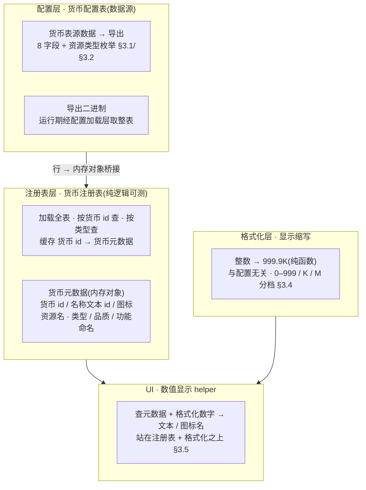
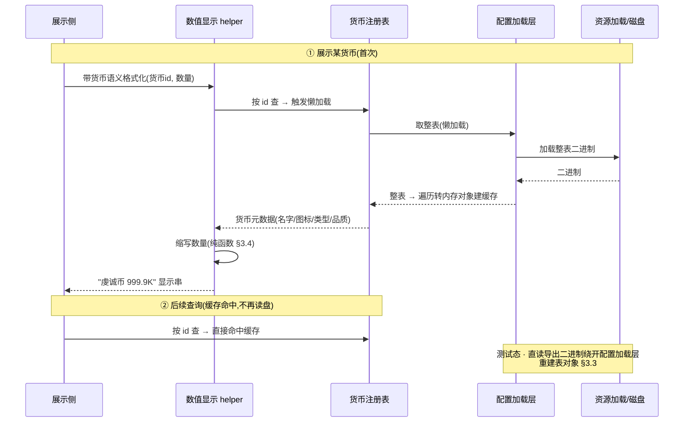

<style>
  /* 本篇专用：schema / 字段表 / 分档代入小样式 */
  pre.code { margin:8px 0; padding:12px; background:#0d1622; border:1px solid var(--border); border-radius:8px; overflow:auto; font-size:13px; line-height:1.55; }
  table.tight td, table.tight th { padding:6px 10px; }
  .pill-new { display:inline-block; font-size:11px; padding:1px 7px; border-radius:10px; background:rgba(91,214,160,.16); color:#5bd6a0; margin-left:6px; }
  .pill-cur { display:inline-block; font-size:11px; padding:1px 7px; border-radius:10px; background:rgba(108,140,255,.16); color:#6c8cff; margin-left:6px; }
  .pill-no  { display:inline-block; font-size:11px; padding:1px 7px; border-radius:10px; background:rgba(255,122,138,.16); color:#ff7a8a; margin-left:6px; }
  .yes { color:#5bd6a0; font-weight:bold; }
  .no  { color:#ff7a8a; font-weight:bold; }
  td.mono, code.mono { font-family:ui-monospace,Consolas,monospace; }
</style>

# 数值底层系统

把散落各处的 ad-hoc 货币(灵力 / 虔诚币 / 经验 / 体力)统一收进**配置化货币注册表**:用一张货币配置表描述每种数值的**名称文本 id / 图标资源名 / 类型 / 品质**,运行期按货币 id 查询;再提供一套全局**显示格式化**(0–999 原值 / K / M,带一位小数)与一个**可复用数值显示 helper**,供通用奖励展示等后续 UI 复用。这是配置化系统底层批次第一刀。**加法式**:只建框架 + 配置 + 格式化 + 查询,<mark>不强行重构现有货币字段</mark>。

> [!WARNING]
> **读前必看 · 设计边界**
>
> 四条边界先钉死,防止把「框架」做成「重构」:
>
> - **用配置表定义货币,不硬编码。**货币元数据走数据表配置,与项目里其他数据表(道具表 / 权重表)同一套配置管线,口径一致。
> - **加法式,不动现有货币字段。**本设计**不**把现有货币(灵力 / 虔诚币 / 经验 / 体力)的存储改成「按货币 id 索引的字典」,也不删任何现有字段或改其读写。数值系统是**旁挂的元数据注册表 + 工具**:谁要展示某货币的图标/名字/格式化数字,查注册表;货币的**数量值仍由各自现有存储持有**。全面迁移(把数量也收进注册表)列为后续轮,见 [§七 O1](#15-numeric-system::open)。
> - **注册表与格式化是纯逻辑,可单测;配置加载与纯逻辑分层。**「按货币 id 查名字/图标/类型/品质」「把整数格式化成 999.9K」都是纯内存逻辑,单测直接断言、不依赖资源加载或运行时环境。配置表的运行期加载走项目既有配置加载层;测试态绕开运行时加载层、直读导出的二进制(详 [§3.3](#15-numeric-system::registry))。
> - **UI helper 范围最小可用。**本设计交付「格式化数字 + (可选)拼图标资源名」的纯函数 / 轻组件,供后续通用奖励面板调用。**不**在本设计把现有合成订单界面的货币显示全部改走 helper(那是表现层重构,加法式之外),仅提供能力 + 一处可选示范接入,见 [§3.5](#15-numeric-system::ui) 与 [§七 O3](#15-numeric-system::open)。

> [!NOTE]
> **立项信息**
>
> | 项 | 内容 |
> | --- | --- |
> | **类型** | 新系统 · 配置化数值底层 出设计稿 + 验收标准,交开发落地。配置化系统底层批次第一刀。 |
> | **方向约束** | 离线还原 · **去变现**(本表不含任何充值 / 内购 / 计价字段;「钻石」类型仅作资源类型登记,不实装购买入口 — 任务边界)。加法式扩展,不破坏现有核心循环 + 已建系统。配置加载走项目既有配置加载层,IO 沿用框架异步规范。 |
> | **范围** | 新增一张货币配置表(8 字段,见 [§3.1](#15-numeric-system::schema)) + 资源类型枚举([§3.2](#15-numeric-system::enum));运行期注册表(配置行 → 内存对象桥接 + 按货币 id 查);纯逻辑显示格式化(整数 → 显示串);UI helper(格式化 + 拼图标名)。**现有货币字段与读写零改动;旧路径零行为变化。** |
> | **关键约束** | 注册表 / 格式化为纯逻辑,可在纯 C# 单测里直接调用(不依赖资源加载 / 运行时环境);配置表测试绕开运行时加载层、直读导出二进制;现有 190 例 EditMode 单测零回归。 |

## 一、做什么与为什么 {#what}

现状:游戏里的「数值」(灵力 / 虔诚币 / 经验 / 体力)各自为政——数量值散在各自独立的整数字段,显示处逐处硬编码(虔诚币、体力的图标符号与数值拼接都是写死的字符串),名称 / 图标 / 类型 / 品质这些**元数据无处登记**,大数字也没有统一的 K/M 缩写规则。每加一种数值就重复一遍「定字段 + 写死显示串 + 配个图标符号」,正是配置化系统要解决的「重复造轮子」。

本系统补的是**数值的元数据层 + 显示层**:用一张货币配置表统一登记每种数值「是什么(名字/图标/类型/品质)」,运行期按货币 id 查;再给一套全局格式化把任意整数变成 `999` / `999.9K` / `999.9M` 这样的显示串,和一个可复用的显示 helper。逐条对应需求:

| # | 需求 | 本篇落法 |
| --- | --- | --- |
| 1 | 统一管理各类数值、避免重复造轮子;表格管理 | 货币配置表登记所有数值的元数据;运行期注册表按货币 id 查([§3.1](#15-numeric-system::schema) / [§3.3](#15-numeric-system::registry)) |
| 2 | 位数显示:0–999 原值 / 1000–999999 显示 K(999.9K)/ 1000000–9999999 显示 M(999.9M) | 纯逻辑缩写函数,分档 + 一位小数,边界逐档代入见 [§3.4](#15-numeric-system::format) |
| 3 | 货币表字段:货币 id / 用途描述 / 功能命名(服务器用) / 名称文本 id / 图标资源名 / 资源类型 / 策划备注 / 品质 | 八字段 1:1 落配置 schema([§3.1](#15-numeric-system::schema));资源类型用枚举 |
| 4 | 样例行覆盖资源类型 1–4(经验/虔诚币/钻石/体力) | 4 行样例数据,见 [§3.2](#15-numeric-system::enum) |
| 5 | 可复用数值显示 helper(格式化 + 图标) | helper:`格式化数字` 必做 + `图标资源名解析` 给出,真实图标加载列可选([§3.5](#15-numeric-system::ui)) |

**不做(本设计明确排除):**<span class="pill-no">充值 / 内购 / 计价</span>(去变现 — 「钻石」类型仅登记,不实装购买);<span class="pill-no">现有货币数量值全面迁移到注册表索引</span>(本设计加法式,见 [§七 O1](#15-numeric-system::open));<span class="pill-no">成就点系统</span>(本表聚焦货币,成就点单列后续);<span class="pill-no">其他配置化系统</span>(本批次后续刀);<span class="pill-no">把合成订单界面货币显示全改走 helper</span>(表现层重构,见 [§七 O3](#15-numeric-system::open))。

## 二、系统模型 {#model}

### 2.1 三层分层(配置 / 注册表 / 格式化) {#layers}

系统拆三层,各层职责单一、各自可测。配置层是数据源(货币配置表),注册表层把表行桥接成内存对象并按货币 id 索引,格式化层是与配置无关的纯函数。UI helper 站在格式化层 + 注册表层之上。数据流:



**为什么这样切:**注册表层把配置行桥接成<mark>独立的内存对象</mark>,业务侧只认这层内存对象,查询逻辑不直接依赖配置表生成类型;配置表 schema 变动时改动收敛在桥接处。格式化层故意与配置完全无关(只吃一个整数),所以它的验收点全是纯函数断言、连配置都不需要,是最稳的回归锚。

### 2.2 加法式接入(与现有 ad-hoc 货币的关系) {#additive}

现有四种数值的**数量值**仍由各自现有存储持有,本设计一律不动。数值系统只补「元数据 + 格式化」,二者通过**约定的货币 id** 弱关联(谁要展示某字段就拿对应货币 id 查注册表)。对照:

| 维度 | 现有 ad-hoc 货币(本设计不动) | 数值系统(本篇新增) |
| --- | --- | --- |
| 数量值存在哪 | 灵力 / 虔诚币 / 经验 / 体力各自的整数存储 | 不持有数量,只持有元数据(名字/图标/类型/品质) |
| 怎么关联 | **弱关联,经货币 id**:约定货币 id ↔ 各货币(见 [§3.2](#15-numeric-system::enum) 映射约定)。注册表不读写货币的数量存储;数量存储不依赖注册表。展示侧自己拿值 + 拿货币 id 查元数据 |  |
| 本设计是否迁移数量 | 否。把各货币数量改成「货币 id → 数量」的统一钱包是**独立大改**(动核心循环 + 存档结构 + 悔棋快照字段),列后续轮 [§七 O1](#15-numeric-system::open) |  |
| 灵力为何不在表里 | 需求货币表资源类型只列 1–4(经验/虔诚币/钻石/体力),**无灵力**。本设计严格照需求填 4 行,灵力**暂不登记**;若后续要纳入,加一行即可(加法式),见 [§七 O2](#15-numeric-system::open) |  |

> [!NOTE]
> **加法式的回归保证:**不进入合成订单玩法、不调用注册表 / 格式化时,游戏行为与本篇前完全一致。数值系统全部是新增内容 + 新增配置表;唯一可能碰旧路径的是 §3.5 那处**可选**的 helper 示范接入(默认不做,见 O3)。

## 三、设计正文 {#numbers}

### 3.1 货币配置表 schema {#schema}

表沿用项目既有「schema 写在数据表表头」的模式(与道具表 / 权重表同款:schema 随数据文件读入,表头四行分别声明字段名 / 字段类型 / 导出分组 / 中文说明)。导出分组的含义:`c` 仅客户端导出、`s` 仅服务器导出、`cs` 双端、`e` 仅编辑器(不进运行期)。八字段逐字段定:

| 需求字段 | 字段名 | 类型 | 分组 | 语义 / 备注 |
| --- | --- | --- | --- | --- |
| 货币 id int32 唯一 | id | int | cs | 主键,表按 id 建映射索引。<mark>命名用 <code>id</code></mark>:与项目其他配置表主键惯例一致,便于按整数主键直接查 |
| 用途描述 int32 文本id | desc | int | cs | 用途描述文本 id(指向本地化文本表,本设计不实装文本表,存 id 即可) |
| 功能命名 string 服务器用 | func\_name | string | s | 数值功能命名(服务器用,仅服务器导出)。本项目离线无服务器,字段保留以贴合需求,客户端可不读 |
| 名称 int32 名称文本id | name | int | c | 名称文本 id(本地化)。<mark>存 int id 而非字符串</mark>(照需求) |
| 图标资源名 string | icon | string | c | 对应图标资源名(图集 / 精灵资源名,helper 用) |
| 资源类型 int32 1经验2虔诚币3钻石4体力 | num\_type | 资源类型枚举 | cs | <mark>用枚举</mark>而非裸整数(见 [§3.2](#15-numeric-system::enum)),编译期防写错类型值。枚举值 = 需求数字(经验=1…体力=4) |
| 策划备注 string | planner\_notes | string | e | 策划备注。<mark>仅编辑器分组</mark>:不导出到客户端 / 服务器运行期,仅留在表里给策划看,不占运行期体积 |
| 品质 int32 数值品质(影响界面显示) | quality | int / 品质枚举 | c | 品质,影响界面显示。裸整数或复用品质枚举,二选一见下「品质字段选型」 |

> [!NOTE]
> **品质字段选型(实现可定,默认给裸整数):**需求写「品质 int32」。两个安全选项:(a)**裸整数**——完全照需求,最省事,helper 按整数档位决定显示色;(b)复用已有的品质枚举(语义清晰)。<mark>默认选 (a) 裸整数</mark>(严格照需求「int32」,且品质语义在数值系统与道具系统未必同义,不强耦合道具品质枚举);若实现认为复用枚举更稳可选 (b),不影响验收点(验收只断言「品质值正确读出」)。

**表注册与数据表表头(8 字段,四行表头声明):**

```text
字段名      id    desc   func_name   name   icon   num_type   planner_notes   quality
字段类型    int   int    string      int    string 资源类型枚举 string          int
导出分组    cs    cs     s           c      c      cs         e               c
中文说明    资源id 描述文本id 功能命名(服务器) 名称文本id 图标资源名 资源类型 策划备注 品质
```

表按 id 建映射索引(map 模式),导出后产出整表二进制 + 行/表数据结构 + 整表懒加载入口,运行期经配置加载层按 id 取行。

### 3.2 资源类型枚举 + 样例数据 {#enum}

**资源类型枚举(值 = 需求数字):**

| 枚举项 | 值 | 含义 |
| --- | --- | --- |
| 经验 | 1 | 经验 |
| 虔诚币 | 2 | 虔诚币 |
| 钻石 | 3 | 钻石 |
| 体力 | 4 | 体力 |

枚举默认从 1 起递增编号,故经验=1 / 虔诚币=2 / 钻石=3 / 体力=4,与需求一一对应;若需显式钉值可在枚举定义里显式赋值。

**样例数据(4 行,覆盖资源类型 1–4),与现有货币的弱关联约定一并给出:**

| id | 资源类型 | 名称(文本id占位) | 图标(资源名占位) | 品质 | 用途描述 | 功能命名 | 策划备注 | ↔ 现有货币 |
| --- | --- | --- | --- | --- | --- | --- | --- | --- |
| 1 | 经验(1) | 100001 | icon\_exp | 1 | 200001 | exp | 守护者经验,修复神庙产出 | 经验 |
| 2 | 虔诚币(2) | 100002 | icon\_piety | 3 | 200002 | piety | 虔诚币,订单交付产出,长期主线 | 虔诚币 |
| 3 | 钻石(3) | 100003 | icon\_diamond | 4 | 200003 | diamond | 钻石,尚未实装,仅登记类型(去变现:不做购买) | —(未实装) |
| 4 | 体力(4) | 100004 | icon\_energy | 2 | 200004 | energy | 体力,落子消耗 / 消除返还,局内资源 | 体力 |

> [!NOTE]
> **文本 id / 图标名是占位:**名称 / 用途描述填占位整数(100001…/200001…),工程暂无本地化文本表,本设计不实装,helper 拿到 id 后**本设计直接显示 id 或功能命名兜底**(文本表接入列后续轮)。图标填语义化资源名占位(`icon_exp` 等),真实美术资源接入时替换。<mark>这些占位不影响验收</mark>:验收只断言「按 id 查出的 名称/图标/类型/品质 值 == 表里填的值」,不要求文本/美术真实存在。

**货币 id ↔ 现有货币映射是「约定」不是「硬绑定」:**把约定固化为注册表里的命名常量(经验=1、虔诚币=2、钻石=3、体力=4),展示侧用常量查元数据、自己从对应货币的现有存储拿数量。注册表**不**反向读货币的数量存储(保持加法式、零耦合)。

### 3.3 运行期注册表(加载 + 查询) {#registry}

**货币元数据(内存对象,业务侧只认它,隔离配置生成类型):**每行配置桥接成一个内存对象,持有以下字段——货币 id、用途描述文本 id、功能命名(服务器用,客户端可空)、名称文本 id、图标资源名、资源类型(底层整数,1=经验…4=体力)、品质。策划备注是仅编辑器分组,运行期不导出,内存对象不含该字段。

**注册表职责:**
- 固化**货币 id 约定常量**(经验=1、虔诚币=2、钻石=3、体力=4),供展示侧按语义查。
- **懒加载缓存**:首次查询时经配置加载层取整表,遍历每行桥接成内存对象,建「货币 id → 元数据」字典缓存;后续查询直接命中缓存,不再读盘。
- **按 id 查**:命中返元数据,查不到返空(不抛)。
- **按资源类型查**:返该类型的全部元数据,无匹配返空集合(不抛)。
- **测试注入口**:绕开配置加载层,直接灌入手造的元数据列表,供纯逻辑测试用。

> [!WARNING]
> **测试态如何拿到表(与项目既有配置表测试同款):**运行期的配置加载层依赖资源模块与运行时环境,**纯 C# / EditMode 跑不通**。两条已验证的测试路径:
>
> - **配置表往返测试**:绕开运行期加载层,直读导出的整表二进制 → 重建表对象 → 遍历转内存对象,验证「4 行加载 + 按 id 查值正确」。
> - **注册表 / 格式化纯逻辑测试**:用注册表的测试注入口灌手造元数据列表,或直接调格式化函数,完全不碰任何文件。

**运行期初始化时机:**注册表懒加载,首次查询触发加载。本注册表只读(无状态),无需在启动时主动预灌。<mark>不引入新的加载约束</mark>:沿用既有配置加载层的加载口径(其同步加载是工程现状,不在本设计改动范围;若后续把配置加载层改异步,本注册表自然跟随,见 [§七 O5](#15-numeric-system::open))。

### 3.4 显示格式化(0–999 / K / M) {#format}

一个把整数缩写成显示串的纯函数,与配置无关。**公式 + 默认常量 + 旋钮:**

```text
默认常量（可调旋钮，集中放置）
进入 K 缩写的下界 = 1000
进入 M 缩写的下界 = 1000000
缩写后保留小数位 = 1          （需求示例 999.9K → 1 位）
截断 vs 四舍五入 = 截断        （见下「进位边界」）

缩写(v):
    abs = |v|;  符号 = v<0 ? "-" : ""
    若 abs < 1000:        返回 符号 + abs                  // 0–999 原值整数
    若 abs < 1000000:     返回 符号 + 按千缩放(abs) + "K"
    否则:                 返回 符号 + 按百万缩放(abs) + "M"
按单位缩放(abs, 单位):   // abs/单位 保留 1 位小数，截断则向零截断
    缩放值 = 截断 ? floor(abs/单位 × 10) / 10
                  : round(abs/单位, 1 位)
    格式化时去掉无意义的尾随 0（1.0K → 1K）
```

**边界逐档代入(默认截断、1 位小数):**

| 输入 value | 档 | 输出 | 说明 |
| --- | --- | --- | --- |
| 0 | 原值 | 0 | 下界 |
| 999 | 原值 | 999 | K 档前最后一个原值(需求:0–999 显示具体数字) |
| 1000 | K | 1K | 恰好进 K(1000/1000=1.0,去尾 0) |
| 1500 | K | 1.5K | 一位小数 |
| 1999 | K | 1.9K | 截断(非 2.0K):floor(1.999×10)/10=1.9 |
| 999999 | K | 999.9K | <mark>需求示例</mark>:截断(999999/1000=999.999 → 999.9),不进位成 1000K |
| 1000000 | M | 1M | 恰好进 M(需求:1000000 起显示 M) |
| 1500000 | M | 1.5M | 一位小数 |
| 9999999 | M | 9.9M | <mark>需求区间上界</mark>:截断(9999999/1000000=9.999999 → 9.9)见下注 |
| -1500 | K | -1.5K | 负数保符号(防御性:数值理论非负,但格式化纯函数应稳) |

> [!NOTE]
> **截断 vs 进位的关键裁定(为何默认截断):**需求把 K 档示例钉成 `999.9K`(对应 999999),M 档示例钉成 `999.9M`。若用四舍五入,`999999` 会进位成 `1000.0K`(越界看着像该进 M 却没进),破坏需求示例。<mark>默认向零截断</mark> 保证 999999→999.9K 与需求逐字一致。代入表里 9999999 按「除以 1000000 截断到 1 位」= 9.9M(需求标 999.9M 是「M 档能显示到的量级示例」,非指 9999999 这个具体值;9999999 实际 = 9.9M,量级在 M 档内,符合需求「1000000–9999999 显示 M」的区间定义)。**本设计只定义到 M 档**(需求上界 9999999);超过 9999999(进十亿级)需求未规定,默认**继续用 M 显示**(如 1 亿 = 100000000 → 100M),不新增更高档(列 <a href="#15-numeric-system::open">§七 O6</a>,有需要再加旋钮)。

**为何把格式化做成与配置无关的独立纯函数:**显示缩写规则是全局的(不止货币,任何大数字——得分、计数都可能用),不该绑在货币注册表上。独立的格式化函数让它能被任何地方调用,且验收点(§六 F1–F9)全是纯断言,是最稳的回归锚——连配置表都不需要加载。

### 3.5 可复用数值显示 helper {#ui}

**范围最小可用:**helper 的核心可复用能力是「给一个货币 id + 数量,产出显示文本」。真实图标加载在本切片<mark>无既有先例</mark>(合成订单界面全用图标符号字形 + 程序化生成,无精灵图加载),故 helper **本设计交付到「文本 + 图标资源名」,真实图标加载列可选 O4**。

helper 提供四项能力:
- **格式化数字**:数量 → 缩写文本(最常用,纯逻辑,可单测)。
- **带货币语义的格式化**:货币 id + 数量 → 「名字 999.9K」。名字暂取文本 id / 功能命名兜底(本地化文本表未接入前)。
- **取图标资源名**:货币 id → 图标资源名(真实图标加载交调用方 / 后续轮,helper 只给名字)。
- **取品质色(可选)**:品质值 → 颜色(白/蓝/紫/红),helper 给映射,调用方上色。

**可选示范接入(默认不做,见 O3):**若要本设计就见到效果,可把合成订单界面虔诚币的刷新处一处改走 helper 作示范。<mark>默认不改</mark>——那是表现层重构,且会让回归面变大;helper 能力本身(纯函数 + 注册表)已足够验收,接入投放属后续。

## 四、加载与查询时序 {#flow}

一次「首次查询 → 缓存 → 展示」的时序(参与方:展示侧 / 数值显示 helper / 货币注册表 / 配置加载层 / 磁盘),及测试态的绕行路径:



## 五、交付物 {#hook}

本设计交付物全为新增内容,不动现有货币的存储与读写;唯一可能碰旧路径的是 §3.5 那处**可选**示范接入(默认不做)。交付物清单(按设计层次):

| # | 交付物 | 内容 |
| --- | --- | --- |
| 1 | 资源类型枚举 | 经验/虔诚币/钻石/体力 = 1–4([§3.2](#15-numeric-system::enum)) |
| 2 | 货币配置表 | 8 字段 schema + 4 行样例数据,按 id 建映射索引,经既有配置管线导出([§3.1](#15-numeric-system::schema)/[§3.2](#15-numeric-system::enum)) |
| 3 | 货币元数据(内存对象) | 隔离配置生成类型,业务侧只认它([§3.3](#15-numeric-system::registry)) |
| 4 | 货币注册表 | 配置行 → 内存对象桥接 + 懒加载缓存 + 按 id 查 / 按类型查 + 货币 id 约定常量 + 测试注入口([§3.3](#15-numeric-system::registry)) |
| 5 | 显示缩写(纯函数) | 整数 → 缩写串 + 旋钮常量(K/M 阈值、小数位、截断开关),与配置无关([§3.4](#15-numeric-system::format)) |
| 6 | 数值显示 helper | 格式化 / 带货币语义格式化 / 取图标名 / 取品质色;真实图标加载本设计不做(O4)([§3.5](#15-numeric-system::ui)) |
| 7 | 单测 | 格式化边界(F)+ 配置表往返(C)+ 注册表查询(R)+ 纯逻辑隔离(Z) |

## 六、验收点 {#accept}

逐条测试可核对。格式化(F)+ 注册表(R)锚在**纯逻辑**(不依赖任何文件 / 运行时环境);配置表(C)绕开运行期加载层、直读导出二进制(测试态可跑)。<mark>若导表工具链不可达,测试判 BLOCKED 不判 FAIL</mark>(在交接区写清卡点)。

| # | 验收点 | 完成定义(测试可核对) |
| --- | --- | --- |
| F1 | 原值档下界 | 缩写(0) == "0" |
| F2 | 原值档上界 | 缩写(999) == "999" |
| F3 | K 档进入边界 | 缩写(1000) == "1K"(去尾随 0,非 "1.0K") |
| F4 | K 档一位小数 | 缩写(1500) == "1.5K" |
| F5 | K 档截断不进位(需求示例) | 缩写(999999) == "999.9K"(截断,非 1000.0K / 不误进 M) |
| F6 | M 档进入边界 | 缩写(1000000) == "1M" |
| F7 | M 档一位小数 | 缩写(1500000) == "1.5M" |
| F8 | M 档区间上界 | 缩写(9999999) == "9.9M"(需求区间 1000000–9999999 全显示 M) |
| F9 | 亿级仍用 M(本设计无更高档) | 缩写(100000000) == "100M"(超需求上界默认续用 M,见 O6) |
| C1 | 货币表加载 4 行 | 直读导出二进制重建表对象 → 行数 == 4 |
| C2 | 按货币 id 查值正确 | 查 id=2(虔诚币):资源类型 == 2(虔诚币)、品质 == 3、图标 == "icon_piety"、名称 == 100002,逐字段 == 表里填的值 |
| C3 | 四档资源类型齐全且唯一 | 4 行的资源类型恰为 {1,2,3,4} 各一;id 唯一 {1,2,3,4} |
| R1 | 注册表桥接内存对象保真 | 行 → 内存对象后各字段 == 配置行对应字段 |
| R2 | 按 id 查询命中 / 未命中 | 灌 4 条后查 id=2 返虔诚币元数据;查不存在的 id 返空(不抛) |
| R3 | 按类型查询 | 按类型查体力返 1 条;查不存在的类型返空集合(不抛) |
| R4 | helper 格式化贯通 | 格式化(999999) == "999.9K";带货币语义格式化(虔诚币, 1500) 含 "1.5K";取图标名(2) == "icon_piety" |
| Z1 | 纯逻辑不依赖运行时 | 显示缩写与注册表(经测试注入口路径)不依赖资源加载 / 运行时环境,可在纯 C# 单测直接调用 |
| Z2 | 现有 190 例零回归 | 新增内容后,现有 EditMode 190 例全绿;不调注册表 / 格式化时游戏行为与本篇前一致(现有货币字段读写零改动) |
| Z3 | 工程编译通过 | 含导出的配置数据结构与新增逻辑在内,整体编译无错 |

## 七、待拍板清单 {#open}

有安全默认的已自主拍板,此处只列**需裁决或实现选型**的方向性开关:

| # | 问题 | 默认 / 建议 | 性质 |
| --- | --- | --- | --- |
| O1 | 现有货币数量值是否本设计迁移到「按货币 id 索引的统一钱包」? | **默认不迁移(本设计加法式)**。统一钱包要动核心循环 + 存档结构(设计 14)+ 悔棋快照字段,是独立大改,列后续轮。本设计注册表只持有元数据 | 范围开关(已拍板) |
| O2 | 灵力是否登记进货币表? | **默认不登记**(需求资源类型只列 1–4 无灵力,严格照需求填 4 行)。后续要纳入加一行即可(加法式) | 范围开关(已拍板) |
| O3 | 本设计是否把合成订单界面现有货币显示改走 helper? | **默认不改**(表现层重构,放大回归面)。helper 能力本身已可验收;接入投放列后续轮。若要本设计见效果,可选一处(虔诚币刷新)做示范接入 | 范围开关(可定) |
| O4 | UI helper 的图标:本设计做到「资源名」还是「真实图标加载」? | **默认到资源名**(合成订单界面无图标加载先例,且无真实美术资源)。真实图标异步加载 + 释放属后续美术接入轮 | 实现选型 |
| O5 | 配置加载:沿用既有配置加载层的同步加载还是改异步? | **沿用现状**(既有配置加载层是全局加载器,其同步加载是现状,不在本设计改动范围;改它影响全工程所有表)。本注册表懒加载贴既有加载层,它将来改异步则自然跟随 | 实现选型(不在本设计) |
| O6 | 超过 9999999(亿级/十亿级)是否加更高档(B 十亿)? | **默认不加,续用 M**(需求只规定到 9999999=M 档上界)。数值理论上限未定;有需要时加一个十亿阈值旋钮即可(格式化已留分档结构) | 范围开关(有需要再加) |
| O7 | 品质字段:裸整数还是复用品质枚举? | **默认裸整数**(严格照需求「int32」,不强耦合道具品质语义)。认为复用枚举更稳可选,验收点不变 | 实现选型 |

## 八、风险表 {#risk}

| 风险 | 影响 | 应对 |
| --- | --- | --- |
| 导表工具链不可达 | 导出数据出不来,配置表测试(C1–C3)无法跑 | 导表是本设计硬前置。<mark>不可达则测试判 BLOCKED 不判 FAIL</mark>(任务硬约束),交接区写清卡点;纯逻辑测试(F/R/Z)不依赖导表,仍可先验 |
| 截断 vs 四舍五入误用 → 999999 进位成 1000K | 与需求示例 999.9K 不符 | 默认向零截断;F5 验收专钉 999999→999.9K([§3.4](#15-numeric-system::format)) |
| 配置表测试写成依赖运行时环境 → 测试态报错 | 测试经运行期加载层取表 → 纯 C# 跑不通 | 配置表测试绕开运行期加载层、直读导出二进制(已验证可跑);注册表查询测试走测试注入口绕开加载层([§3.3](#15-numeric-system::registry)) |
| 把「加法式框架」做成「货币重构」 | 动现有货币的存储读写 → 破坏核心循环 + 存档,大面积回归 | 边界先钉([§2.2](#15-numeric-system::additive)):注册表只持元数据、不读写货币数量存储;O1 明确迁移不在本设计;Z2 验收现有字段读写零改动 |
| 策划备注(仅编辑器分组)被误当运行期字段读 | 内存对象含一个运行期不存在的字段,或导出体积变大 | 策划备注设仅编辑器分组不导出客户端;内存对象不含该字段([§3.3](#15-numeric-system::registry));仅留表里给策划 |
| 枚举编号与需求数字错位(经验应=1) | 资源类型值与需求 1–4 对不上,查询 / 类型判断错 | 枚举默认从 1 起递增;C3 验收资源类型恰为 {1,2,3,4};必要时显式赋值 | 
| 后续配置化系统 / 成就点 / 灵力加入时表频繁改 schema | 字段 / 行频繁增删 | 加行(新资源类型)是加法式、向前兼容(新增字段给缺省);成就点 / 其他系统单列后续表,不挤进本货币表 |
