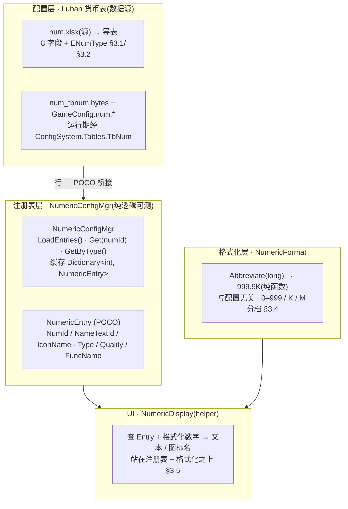
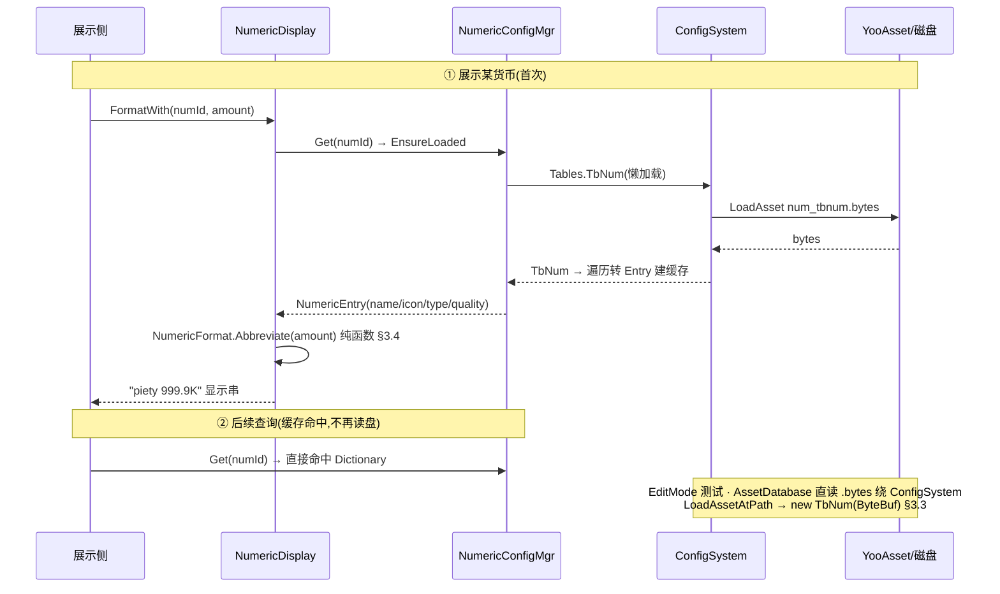

# 数值底层系统

把散落在 `MergeOrderState` 的 ad-hoc 货币(灵力 / 虔诚币 / 经验 / 体力)统一收进**配置化货币注册表**:用 Luban 货币表描述每种数值的**名称文本 id / 图标资源名 / 类型 / 品质**,运行期按 `num_id` 查询;再提供一套全局**显示格式化**(0–999 原值 / K / M,带一位小数)与一个**可复用数值显示 helper**,供通用奖励展示等后续 UI 复用。这是 xlsx 系统底层批次第一刀。**加法式**:只建框架 + 配置 + 格式化 + 查询,<mark>不强行重构现有货币字段</mark>。

> [!WARNING]
> **读前必看 · 与工程现状的关系(单一事实源 = 代码)**
>
> 四条边界先钉死,防 dev 把「框架」做成「重构」:
>
> - **用 Luban 定表导表,不硬编码货币表。**工程的配置全栈是 Luban(源 `Configs/GameConfig/` 在仓库根、与 `UnityProject/` 同级;生成代码落 `GameScripts/HotFix/GameProto/GameConfig/`,二进制落 `Assets/AssetRaw/Configs/bytes/`)。本表走**既有 GameConfig 管线**:在 `__tables__.xlsx` 注册 + 新建数据 xlsx + 跑导表脚本生成代码,口径与现有 `item` / `weightcfg` 两表完全一致。
> - **加法式,不动现有货币字段。**本设计**不**把 `MergeOrderState` 的 `Soul` / `Piety` / `Exp` / `Energy` 改成「按 num_id 索引的字典」,也不删任何现有字段或改其读写。数值系统是**旁挂的元数据注册表 + 工具**:谁要展示某货币的图标/名字/格式化数字,查注册表;货币的**数量值仍由各自现有字段持有**。全面迁移(把数量也收进注册表)列为后续轮,见 [§七 O1](#15-numeric-system::open)。
> - **注册表与格式化是纯逻辑,可单测;配置加载分两条路。**「按 num_id 查名字/图标/类型/品质」「把整数格式化成 999.9K」都是纯内存逻辑,单测直接断言、不碰 YooAsset。Luban 表的运行期加载走工程既有 `ConfigSystem.Instance.Tables`(YooAsset,需 Unity 运行时);EditMode 单测则仿 `WeightCfgLubanTests` 经 `AssetDatabase` 直读 `.bytes` 绕过 YooAsset(详 [§3.3](#15-numeric-system::registry))。
> - **UI helper 范围最小可用。**本设计交付「格式化数字 + (可选)拼图标资源名」的纯函数 / 轻组件,供后续通用奖励面板调用。**不**在本设计把现有 `MergeOrderWindow` 的货币显示全部改走 helper(那是表现层重构,加法式之外),仅提供能力 + 一处可选示范接入,见 [§3.5](#15-numeric-system::ui) 与 [§七 O3](#15-numeric-system::open)。

> [!NOTE]
> **立项信息**
>
> | 项 | 内容 |
> | --- | --- |
> | **类型** | 新系统 · 配置化数值底层 出设计稿 + 验收标准,交开发落地。xlsx 系统底层批次第一刀。 |
> | **设计基线** | 工程既有 Luban 配置管线(`Configs/GameConfig/` 源 + `__tables__.xlsx` 注册 + `gen_code_bin_to_project_lazyload` 导表 + `ConfigSystem.Instance.Tables` 运行期加载;现有 `item` / `block.TbWeightCfg` 两表为范本) + 已落地 merge-order 切片的 ad-hoc 货币字段(`MergeOrderState.Soul` / `Piety` / `Exp` / `Energy`,设计 09/11/13)。`item.EQuality` 枚举(WHITE=1/BLUE=2/PURPLE=3/RED=4)是品质字段的现成范本。 |
> | **方向约束** | 离线还原 · **去变现**(本表不含任何充值 / 内购 / 计价字段;`num_type=3 钻石` 仅作资源类型登记,不实装购买入口 — 任务边界)。加法式扩展,不破坏现有核心循环 + 已建系统。IO 走 TEngine 异步规范(配置加载经既有 `ConfigSystem`,沿用其加载口径)。 |
> | **影响范围** | 新增 Luban 货币表 `num.TbNum`(8 字段,见 [§3.1](#15-numeric-system::schema)) + 枚举 `num.ENumType`([§3.2](#15-numeric-system::enum));新增运行期 `NumericConfigMgr`(Luban 行 → POCO 桥接 + 按 num_id 查,仿 `WeightCfgConfigMgr`) + POCO `NumericEntry`;新增纯逻辑 `NumericFormat`(整数 → 显示串);新增 UI helper `NumericDisplay`(格式化 + 拼图标名)。**现有货币字段与读写零改动;旧路径零行为变化。** |
> | **关键约束(继承现状)** | 注册表 / 格式化为纯逻辑,可在纯 C# 单测里直接调用(不依赖 YooAsset / Unity 运行时);配置表 EditMode 测试经 `AssetDatabase` 直读 `.bytes`(仿 `WeightCfgLubanTests`);现有 190 例 EditMode 零回归。 |

<h2 id="what">一、做什么与为什么</h2>

现状:游戏里的「数值」(灵力 / 虔诚币 / 经验 / 体力)各自为政——数量值散在 `MergeOrderState` 的独立 int 字段,显示在 `MergeOrderWindow` 里逐处硬编码(`_pietyText.text = $"✦ {_merge.Piety}"`、`_energyText.text = $"⚡ {_merge.Energy}/30"`),名称 / 图标 / 类型 / 品质这些**元数据无处登记**,大数字也没有统一的 K/M 缩写规则。每加一种数值就重复一遍「定字段 + 写死显示串 + 配个 emoji」,正是 xlsx 系统设计目的所述的「重复造轮子」。

本系统补的是**数值的元数据层 + 显示层**:用一张 Luban 货币表统一登记每种数值「是什么(名字/图标/类型/品质)」,运行期按 id 查;再给一套全局格式化把任意整数变成 `999` / `999.9K` / `999.9M` 这样的显示串,和一个可复用的显示 helper。逐条对应需求:

| # | 需求(来自 xlsx 表逐字) | 本篇落法 | 现状/新增 |
| --- | --- | --- | --- |
| 1 | 统一管理各类数值、避免重复造轮子;表格管理 | Luban 货币表 `num.TbNum` 登记所有数值的元数据;运行期 `NumericConfigMgr` 按 `num_id` 查([§3.1](#15-numeric-system::schema) / [§3.3](#15-numeric-system::registry)) | 新增表 + 注册表 |
| 2 | 位数显示:0–999 原值 / 1000–999999 显示 K(999.9K)/ 1000000–9999999 显示 M(999.9M) | 纯逻辑 `NumericFormat.Abbreviate(long)`,分档 + 一位小数,边界逐档代入见 [§3.4](#15-numeric-system::format) | 新增格式化 |
| 3 | 货币表字段:num\_id / num\_desc / num\_func\_name / num\_name / num\_no / num\_type / planner\_notes / quality | 八字段 1:1 落 Luban schema([§3.1](#15-numeric-system::schema));num\_type 用枚举 `num.ENumType` | 新增 schema |
| 4 | 样例行覆盖 num\_type 1–4(经验/虔诚币/钻石/体力) | 4 行样例数据,见 [§3.2](#15-numeric-system::enum) | 新增数据 |
| 5 | 可复用数值显示 helper(格式化 + 图标) | `NumericDisplay`:\`格式化数字\` 必做 + \`图标资源名解析\` 给出,真实 Sprite 加载列可选([§3.5](#15-numeric-system::ui)) | 新增 helper |

<b>不做(本设计明确排除):</b>充值 / 内购 / 计价(去变现 — `num_type=3 钻石` 仅登记类型,不实装购买);现有货币数量值全面迁移到注册表索引(本设计 additive,见 [§七 O1](#15-numeric-system::open));成就点系统(spec 标题提及但本表聚焦货币,成就点单列后续);其他 xlsx 系统(本批次后续刀);把 MergeOrderWindow 货币显示全改走 helper(表现层重构,见 [§七 O3](#15-numeric-system::open))。

<h2 id="model">二、系统模型</h2>

<h3 id="layers">2.1 三层分层(配置 / 注册表 / 格式化)</h3>

系统拆三层,各层职责单一、各自可测。配置层是数据源(Luban 表),注册表层把表行桥接成 POCO 并按 id 索引(隔离 Luban 类型),格式化层是与配置无关的纯函数。UI helper 站在格式化层 + 注册表层之上。结构图:

<b>为什么这样切:</b>注册表层桥接成 POCO(`NumericEntry`)是为了<mark>让查询逻辑不直接依赖 Luban 生成类型</mark>——这正是工程现有 `WeightCfgConfigMgr` 把 `GameConfig.WeightCfg` 转 `WeightConfigEntry` 的同款做法,业务侧只认 POCO。格式化层故意与配置完全无关(只吃一个 `long`),所以它的验收点全是纯函数断言、连配置都不需要,是最稳的回归锚。

<h3 id="additive">2.2 加法式接入(与现有 ad-hoc 货币的关系)</h3>

现有四种数值的**数量值**仍由 `MergeOrderState` 各自字段持有,本设计一律不动。数值系统只补「元数据 + 格式化」,二者通过<b>约定的 num\_id</b> 弱关联(谁要展示某字段就拿对应 num\_id 查注册表)。对照:

| 维度 | 现有 ad-hoc 货币(本设计不动) | 数值系统(本篇新增) |
| --- | --- | --- |
| 数量值存在哪 | `MergeOrderState.Soul/Piety/Exp/Energy` 各 int 字段 | 不持有数量,只持有元数据(名字/图标/类型/品质) |
| 怎么关联 | **弱关联,经 num_id**:约定 `num_id` ↔ 字段(见 [§3.2](#15-numeric-system::enum) 映射约定)。注册表不读写 `MergeOrderState`;`MergeOrderState` 不依赖注册表。展示侧自己拿值 + 拿 num_id 查元数据 |  |
| 本设计是否迁移数量 | 否。把 `Soul` 等改成 `Dictionary<numId,int>` 的统一钱包是**独立大改**(动核心循环 + 存档 DTO + 悔棋快照字段),列后续轮 [§七 O1](#15-numeric-system::open) |  |
| 灵力(Soul)为何不在表里 | spec 货币表 num_type 只列 1–4(经验/虔诚币/钻石/体力),**无灵力**。本设计严格照 spec 填 4 行,灵力**暂不登记**;若后续要纳入,加一行 num_type 即可(加法式),见 [§七 O2](#15-numeric-system::open) |  |

> [!NOTE]
> <b>加法式的回归保证:</b>不进入 merge-order、不调用注册表 / 格式化时,工程行为与本篇前完全一致。数值系统全部是新增文件 + 新增 Luban 表;唯一可能碰旧代码的是 §3.5 那处**可选**的 helper 示范接入(默认不做,见 O3)。

<h2 id="numbers">三、设计正文</h2>

<h3 id="schema">3.1 Luban 货币表 schema</h3>

表走工程既有「schema 写在数据 xlsx 表头」的模式(与 `item.xlsx` / `weightcfg.xlsx` 同款:`read_schema_from_file=true`,header 四行 `##var`/`##type`/`##group`/`##`)。八字段 1:1 对应 spec,类型与分组逐字段定:

| spec 字段 | Luban `##var` | Luban `##type` | group | 语义 / 备注 |
| --- | --- | --- | --- | --- |
| num\_id int32 唯一 | id | int | cs | 主键,表 `index=id` / `mode=map`。<mark>命名用 <code>id</code></mark>:Luban 表惯例主键叫 id(item/weightcfg 皆然),便于 `GetOrDefault(int)` 直接可用 |
| num\_desc int32 文本id | desc | int | cs | 用途描述文本 id(指向本地化文本表,本设计不实装文本表,存 id 即可) |
| num\_func\_name string 服务器用 | func\_name | string | s | 数值功能命名(服务器用,group=s)。本项目离线无服务器,字段保留以贴合 spec,客户端可不读 |
| num\_name int32 名称文本id | name | int | c | 名称文本 id(本地化)。<mark>存 int id 而非字符串</mark>(照 spec) |
| num\_no string 图标资源名 | icon | string | c | 对应图标资源名(Sprite/Atlas 资源名,helper 用)。命名用 `icon` 贴合 group 自动推断(skill 文档:icon→c) |
| num\_type int32 1经验2虔诚币3钻石4体力 | num\_type | num.ENumType | cs | <mark>用枚举</mark>而非裸 int(见 [§3.2](#15-numeric-system::enum)),编译期防写错类型值。枚举值 = spec 数字(EXP=1…ENERGY=4) |
| planner\_notes string 策划备注 | planner\_notes | string | e | 策划备注。<mark>group=e</mark>(editor-only):不导出到客户端 / 服务器运行时,仅留在表里给策划看,不占运行期体积 |
| quality int32 数值品质(影响界面显示) | quality | num.ENumType?… | c | 品质。<mark>复用现成枚举 <code>item.EQuality</code></mark>(WHITE=1/BLUE=2/PURPLE=3/RED=4)或裸 int,二选一见下「品质字段选型」 |

> [!NOTE]
> <b>品质字段选型(dev 实现可定,默认给裸 int):</b>spec 写「quality int32」。两个安全选项:(a)<b>裸 <code>int</code></b>——完全照 spec,最省事,helper 按整数档位决定显示色;(b)复用 <code>item.EQuality</code> 枚举(已存在,语义清晰)。<mark>默认选 (a) 裸 int</mark>(严格照 spec「int32」,且品质语义在数值系统与道具系统未必同义,不强耦合 item 枚举);若 dev 认为复用枚举更稳可选 (b),不影响验收点(验收只断言「quality 值正确读出」)。

<b>表注册(<code>\_\_tables\_\_.xlsx</code> 追加一行,与现有两表同列):</b>

<pre class="code">full_name      value_type   read_schema_from_file   input       index   mode   comment
num.TbNum      Num          true                    num.xlsx    id      map    数值底层货币表</pre>

<b>数据 xlsx 表头(<code>num.xlsx</code>,header 四行,仿 item.xlsx):</b>

<pre class="code">##var    id    desc   func_name   name   icon   num_type        planner_notes   quality
##type   int   int    string      int    string num.ENumType    string          int
##group  cs    cs     s           c      c      cs              e               c
##       资源id 描述文本id 功能命名(服务器) 名称文本id 图标资源名 资源类型 策划备注 品质</pre>

导表后生成 `GameConfig.Num`(行类型)+ `GameConfig.num.TbNum`(表类型,含 `GetOrDefault(int)` / `DataList` / `DataMap`)+ 二进制 `Assets/AssetRaw/Configs/bytes/num_tbnum.bytes`;`Tables.cs` 自动加 `TbNum` 懒加载属性(loader key `"num_tbnum"`)。<mark>这些是生成代码,dev 不手改</mark>,跑导表脚本产出。

<h3 id="enum">3.2 num_type 枚举 + 样例数据</h3>

<b>枚举 <code>num.ENumType</code>(<code>\_\_enums\_\_.xlsx</code> 追加,仿 <code>item.EQuality</code>,值 = spec 数字):</b>

<pre class="code">full_name      flags   unique   *items(name = 注释)
num.ENumType   false   true     EXP        # 1 经验
                                PIETY      # 2 虔诚币
                                DIAMOND    # 3 钻石
                                ENERGY     # 4 体力</pre>

Luban 枚举默认从 1 起递增编号(对照 `item.EQuality` WHITE=1),故 EXP=1 / PIETY=2 / DIAMOND=3 / ENERGY=4,与 spec 一一对应。若 dev 发现需显式钉值,在 items 列写 `EXP=1` 形式(Luban 支持显式赋值)。

<b>样例数据(4 行,覆盖 num\_type 1–4),与现有字段的弱关联约定一并给出:</b>

| id | num\_type | name(文本id占位) | icon(资源名占位) | quality | desc | func\_name | planner\_notes | ↔ 现有字段 |
| --- | --- | --- | --- | --- | --- | --- | --- | --- |
| 1 | EXP(1) | 100001 | icon\_exp | 1 | 200001 | exp | 守护者经验,修复神庙产出 | `MergeOrderState.Exp` |
| 2 | PIETY(2) | 100002 | icon\_piety | 3 | 200002 | piety | 虔诚币,订单交付产出,长期主线 | `MergeOrderState.Piety` |
| 3 | DIAMOND(3) | 100003 | icon\_diamond | 4 | 200003 | diamond | 钻石,尚未实装,仅登记类型(去变现:不做购买) | —(未实装) |
| 4 | ENERGY(4) | 100004 | icon\_energy | 2 | 200004 | energy | 体力,落子消耗 / 消除返还,局内资源 | `MergeOrderState.Energy` |

> [!NOTE]
> <b>文本 id / 图标名是占位:</b><code>name</code>/<code>desc</code> 填占位整数(100001…/200001…),工程暂无本地化文本表,本设计不实装,helper 拿到 id 后<b>本设计直接显示 id 或 func_name 兜底</b>(文本表接入列后续轮)。<code>icon</code> 填语义化资源名占位(<code>icon_exp</code> 等),真实美术资源接入时替换。<mark>这些占位不影响验收</mark>:验收只断言「按 id 查出的 name/icon/type/quality 值 == 表里填的值」,不要求文本/美术真实存在。

<b>num\_id ↔ 现有字段映射是「约定」不是「代码绑定」:</b>把约定写进 `NumericConfigMgr` 的常量(如 `public const int Exp = 1; public const int Piety = 2;`),展示侧 `NumericConfigMgr.Get(NumericConfigMgr.Piety)` 拿元数据、自己从 `MergeOrderState.Piety` 拿数量。注册表**不**反向读 state(保持加法式、零耦合)。

<h3 id="registry">3.3 运行期注册表(加载 + 查询)</h3>

<b>POCO(<code>NumericEntry</code>,业务侧只认它,隔离 Luban 类型):</b>

<pre class="code">public sealed class NumericEntry
{
    public int NumId;          // = Luban Num.Id
    public int DescTextId;     // num_desc
    public string FuncName;    // num_func_name（服务器用，客户端可空）
    public int NameTextId;     // num_name
    public string IconName;    // num_no
    public int NumType;        // num_type（ENumType 的底层 int，1=经验…4=体力）
    public int Quality;        // quality
    // planner_notes 是 editor-only（group=e），运行期不导出，POCO 不含
}</pre>

<b>注册表(<code>NumericConfigMgr</code>,仿 <code>WeightCfgConfigMgr</code> 的静态桥接 + 加缓存):</b>

<pre class="code">public static class NumericConfigMgr
{
    // num_id ↔ 现有字段的约定常量
    public const int Exp = 1, Piety = 2, Diamond = 3, Energy = 4;
    static Dictionary&lt;int, NumericEntry&gt; _cache;   // 懒加载缓存
    public static NumericEntry ToEntry(GameConfig.Num row) { …字段拷贝… }
    // 运行期:经 ConfigSystem（YooAsset），首次访问建缓存
    public static void EnsureLoaded() {
        if (_cache != null) return;
        var table = ConfigSystem.Instance.Tables.TbNum;   // 懒加载
        _cache = new Dictionary&lt;int, NumericEntry&gt;(table.DataList.Count);
        foreach (var row in table.DataList) _cache[row.Id] = ToEntry(row);
    }
    public static NumericEntry Get(int numId) {            // 查不到返 null
        EnsureLoaded();
        return _cache.TryGetValue(numId, out var e) ? e : null;
    }
    public static IReadOnlyList&lt;NumericEntry&gt; GetByType(int numType) { … }
    // 测试注入口:绕开 ConfigSystem，直接灌 entry 列表（EditMode 用）
    public static void InitForTest(IEnumerable&lt;NumericEntry&gt; entries) { _cache = …; }
}</pre>

> [!WARNING]
> **EditMode 测试如何拿到表(继承 `WeightCfgLubanTests` 现状):**`ConfigSystem.Instance.Tables` 内部走 `ModuleSystem.GetModule<IResourceModule>()` + YooAsset,**纯 C# / EditMode 跑不通**(无 Unity 运行时资源模块)。两条已验证的测试路径:
>
> - **配置表往返测试**:仿 `WeightCfgLubanTests`——`AssetDatabase.LoadAssetAtPath<TextAsset>("Assets/AssetRaw/Configs/bytes/num_tbnum.bytes")` → `new GameConfig.num.TbNum(new Luban.ByteBuf(ta.bytes))` → 遍历 `DataList` 转 `NumericEntry`。绕过 YooAsset,直读导出的二进制,验证「4 行加载 + 按 id 查值正确」。
> - **注册表 / 格式化纯逻辑测试**:用 `NumericConfigMgr.InitForTest(手造 entry 列表)` 或直接调 `NumericFormat`,完全不碰任何文件。

<b>运行期初始化时机:</b>注册表懒加载,首次 `Get` 触发 `EnsureLoaded`。无需像 `WeightCfgConfigMgr.InitDynamicWeight` 那样在启动主动灌(那是因为 DynamicWeightDiff 是有状态单例);本注册表只读,懒加载即可。<mark>不引入新的加载红线问题</mark>:沿用 `ConfigSystem` 既有加载口径(其同步 `LoadAsset` 是工程现状,不在本设计改动范围;若工程后续把 ConfigSystem 改异步,本注册表自然跟随,见 [§七 O5](#15-numeric-system::open))。

<h3 id="format">3.4 显示格式化(0–999 / K / M)</h3>

纯函数 `NumericFormat.Abbreviate(long value)`,与配置无关。<b>公式 + 默认常量 + 旋钮:</b>

<pre class="code">// 默认常量（可调旋钮，集中在 NumericFormat 顶部）
const long K_THRESHOLD = 1000;       // 进入 K 缩写的下界
const long M_THRESHOLD = 1000000;    // 进入 M 缩写的下界
const int  DECIMALS    = 1;          // 缩写后保留小数位（spec 示例 999.9K → 1 位）
const bool TRUNCATE    = true;       // 截断 vs 四舍五入（见下「进位边界」）
string Abbreviate(long v):
    abs = |v|;  sign = v&lt;0 ? "-" : ""
    if abs &lt; K_THRESHOLD:            return sign + abs                    // 0–999 原值整数
    if abs &lt; M_THRESHOLD:            return sign + Scale(abs, K_THRESHOLD)  + "K"
    else:                           return sign + Scale(abs, M_THRESHOLD) + "M"
Scale(abs, unit):  // abs/unit 保留 DECIMALS 位，TRUNCATE 则向零截断
    scaled = TRUNCATE ? floor(abs/unit * 10^DECIMALS) / 10^DECIMALS
                      : round (abs/unit, DECIMALS)
    return scaled.ToString("0.#")   // 去掉无意义的尾随 0（1.0K → 1K）</pre>

<b>边界逐档代入(默认 TRUNCATE=true、DECIMALS=1):</b>

| 输入 value | 档 | 输出 | 说明 |
| --- | --- | --- | --- |
| 0 | 原值 | 0 | 下界 |
| 999 | 原值 | 999 | K 档前最后一个原值(spec:0–999 显示具体数字) |
| 1000 | K | 1K | 恰好进 K(1000/1000=1.0,去尾 0) |
| 1500 | K | 1.5K | 一位小数 |
| 1999 | K | 1.9K | 截断(非 2.0K):floor(1.999×10)/10=1.9 |
| 999999 | K | 999.9K | <mark>spec 示例</mark>:截断(999999/1000=999.999 → 999.9),不进位成 1000K |
| 1000000 | M | 1M | 恰好进 M(spec:1000000 起显示 M) |
| 1500000 | M | 1.5M | 一位小数 |
| 9999999 | M | 9999.9M | <mark>spec 上界</mark>:截断(9999999/1000000=9.999999 → 9.9?)见下注 |
| -1500 | K | -1.5K | 负数保符号(防御性:数值理论非负,但格式化纯函数应稳) |

> [!NOTE]
> <b>截断 vs 进位的关键裁定(为何默认截断):</b>spec 把 K 档示例钉成 <code>999.9K</code>(对应 999999),M 档示例钉成 <code>999.9M</code>。若用四舍五入,<code>999999</code> 会进位成 <code>1000.0K</code>(越界看着像该进 M 却没进),破坏 spec 示例。<mark>默认 TRUNCATE=true(向零截断)</mark> 保证 999999→999.9K 与 spec 逐字一致。代入表里 9999999 按「除以 1000000 截断到 1 位」= 9.9M(spec 标 999.9M 是「M 档能显示到的量级示例」,非指 9999999 这个具体值;9999999 实际 = 9.9M,量级在 M 档内,符合 spec「1000000–9999999 显示 M」的区间定义)。**本设计只定义到 M 档**(spec 上界 9999999);超过 9999999(进 B/十亿级)spec 未规定,默认**继续用 M 显示**(如 1 亿 = 100000000 → 100M),不新增 B 档(列 <a href="#15-numeric-system::open">§七 O6</a>,有需要再加旋钮)。

<b>为何把格式化做成与配置无关的独立纯函数:</b>显示缩写规则是全局的(不止货币,任何大数字——得分、计数都可能用),不该绑在货币注册表上。独立 `NumericFormat` 让它能被任何地方调用,且验收点(§六 F1–F9)全是纯断言,是最稳的回归锚——连配置表都不需要加载。

<h3 id="ui">3.5 可复用数值显示 helper</h3>

<b>范围最小可用:</b>helper 的核心可复用能力是「给一个 num\_id + 数量,产出显示文本」。真实 Sprite 加载在本切片<mark>无既有先例</mark>(merge-order UI 全用 emoji glyph + 程序化 `UGuiFactory`,grep `Module/BlockBlast` 与 `UI/BlockBlastUI` 无 `SetSprite`/`LoadSpriteAsync`),故 helper **本设计交付到「文本 + 图标资源名」,真实 Sprite 加载列可选 O4**。

<pre class="code">public static class NumericDisplay
{
    // 核心:数量 → 缩写文本（最常用,纯逻辑,可单测）
    public static string Format(long amount) =&gt; NumericFormat.Abbreviate(amount);
    // 带货币语义:num_id + 数量 → "名字 999.9K"（名字暂用文本id/func_name兜底）
    public static string FormatWith(int numId, long amount) {
        var e = NumericConfigMgr.Get(numId);
        var label = e?.FuncName ?? numId.ToString();    // 文本表未接,先兜底
        return $"{label} {NumericFormat.Abbreviate(amount)}";
    }
    // 取图标资源名（真实 Sprite 加载交调用方/后续轮,helper 只给名字）
    public static string IconName(int numId) =&gt; NumericConfigMgr.Get(numId)?.IconName;
    // 可选:取品质色（quality → Color），helper 给映射，调用方上色
    public static Color QualityColor(int quality) { …白/蓝/紫/红… }
}</pre>

<b>可选示范接入(默认不做,见 O3):</b>若 boss/dev 要本设计就见到效果,可把 `MergeOrderWindow.RefreshPiety` 一处改成 `_pietyText.text = NumericDisplay.FormatWith(NumericConfigMgr.Piety, _merge.Piety)` 作示范。<mark>默认不改</mark>——那是表现层重构,且会让回归面变大;helper 能力本身(纯函数 + 注册表)已足够验收,接入投放属后续。

<h2 id="flow">四、加载与查询时序</h2>

一次「首次查询 → 缓存 → 展示」的时序(参与方:展示侧 / NumericDisplay / NumericConfigMgr / ConfigSystem / 磁盘),及 EditMode 测试的绕行路径:

<h2 id="hook">五、挂接点 / dev 改动清单</h2>

全部新增 + 新增 Luban 表;唯一可能碰旧文件的是 §3.5 那处**可选**示范接入(默认不做)。符号名经 grep `Configs/GameConfig/`、`GameProto/GameConfig/`、`GameLogic/Config/` 与 `Module/BlockBlast/` 核实。

| # | 文件 / 符号 | 改动 | 类型 |
| --- | --- | --- | --- |
| 1 | `Configs/GameConfig/Datas/__enums__.xlsx` | 追加枚举 `num.ENumType`(EXP/PIETY/DIAMOND/ENERGY = 1–4),仿 `item.EQuality` 行([§3.2](#15-numeric-system::enum)) | 新增 |
| 2 | `Configs/GameConfig/Datas/__tables__.xlsx` | 追加一行注册 `num.TbNum`(value\_type=Num / input=num.xlsx / index=id / mode=map / read\_schema\_from\_file=true)([§3.1](#15-numeric-system::schema)) | 新增 |
| 3 | `Configs/GameConfig/Datas/num.xlsx`(新) | 新建数据表:header 四行(##var/##type/##group/##)定 8 字段 + 4 行样例数据([§3.1](#15-numeric-system::schema)/[§3.2](#15-numeric-system::enum))。可用 `luban_helper.py` 或直接编辑 xlsx | 新增 |
| 4 | 导表:跑 `gen_code_bin_to_project_lazyload.bat`(`AI_MODE=1`) | 生成 `GameConfig.Num` / `GameConfig.num.TbNum` / `GameConfig.num.ENumType` 代码到 `GameProto/GameConfig/` + `num_tbnum.bytes` 到 `AssetRaw/Configs/bytes/` + `Tables.cs` 自动加 `TbNum` 懒加载。<mark>生成代码不手改</mark> | 导表生成 |
| 5 | `GameLogic/Module/BlockBlast/Numeric/NumericEntry.cs`(新) | POCO,字段见 [§3.3](#15-numeric-system::registry)(隔离 Luban 类型,仿 `WeightConfigEntry`) | 新增 |
| 6 | `GameLogic/Config/NumericConfigMgr.cs`(新) | 静态桥接 + 缓存 + 查询:`ToEntry(GameConfig.Num)` / `EnsureLoaded` / `Get(numId)` / `GetByType(numType)` / `InitForTest` + num\_id 约定常量,仿 `WeightCfgConfigMgr`([§3.3](#15-numeric-system::registry)) | 新增 |
| 7 | `GameLogic/Module/BlockBlast/Numeric/NumericFormat.cs`(新) | 纯函数 `Abbreviate(long)` + 旋钮常量(K/M 阈值、小数位、截断开关),与配置无关([§3.4](#15-numeric-system::format)) | 新增 |
| 8 | `GameLogic/UI/BlockBlastUI/NumericDisplay.cs`(新) | UI helper:`Format` / `FormatWith(numId,amount)` / `IconName` / `QualityColor`([§3.5](#15-numeric-system::ui))。真实 Sprite 加载本设计不做(O4) | 新增 |
| 9 | `Editor/Tests/BlockBlast/NumericSystemTests.cs`(新) | 单测:格式化边界(F1–F9)+ 配置表往返(C1–C3,`AssetDatabase` 直读 `num_tbnum.bytes` 仿 `WeightCfgLubanTests`)+ 注册表查询(`InitForTest`) | 新增 |
| 10 | `UI/BlockBlastUI/MergeOrderWindow.RefreshPiety`(line 321)等 | <mark>可选</mark>示范接入:一处货币显示改走 `NumericDisplay.FormatWith`。**默认不改**(O3),保回归面最小 | 可选 |

<h2 id="accept">六、验收点</h2>

逐条 test 可核对。格式化(F)+ 注册表(R)锚在**纯逻辑**(不依赖任何文件 / Unity 运行时);配置表(C)经 `AssetDatabase` 直读 `.bytes`(仿 `WeightCfgLubanTests`,EditMode 可跑)。dev 带 unityMCP 自行导表 + 编译 + 跑 EditMode;<mark>若 Luban 导表工具链或 MCP 桥不可达,test 判 BLOCKED 不判 FAIL</mark>(在交接区写清卡点)。

| # | 验收点 | 完成定义(测试可核对) |
| --- | --- | --- |
| F1 | 原值档下界 | `Abbreviate(0) == "0"` |
| F2 | 原值档上界 | `Abbreviate(999) == "999"` |
| F3 | K 档进入边界 | `Abbreviate(1000) == "1K"`(去尾随 0,非 "1.0K") |
| F4 | K 档一位小数 | `Abbreviate(1500) == "1.5K"` |
| F5 | K 档截断不进位(spec 示例) | `Abbreviate(999999) == "999.9K"`(截断,非 1000.0K / 不误进 M) |
| F6 | M 档进入边界 | `Abbreviate(1000000) == "1M"` |
| F7 | M 档一位小数 | `Abbreviate(1500000) == "1.5M"` |
| F8 | M 档区间上界 | `Abbreviate(9999999) == "9.9M"`(spec 区间 1000000–9999999 全显示 M) |
| F9 | 亿级仍用 M(本设计无 B 档) | `Abbreviate(100000000) == "100M"`(超 spec 上界默认续用 M,见 O6) |
| C1 | 货币表加载 4 行 | `AssetDatabase` 读 `num_tbnum.bytes` → `new num.TbNum(ByteBuf)` → `DataList.Count == 4` |
| C2 | 按 num\_id 查值正确 | `table.Get(2)`(虔诚币):`num_type == 2(PIETY)`、`quality == 3`、`icon == "icon_piety"`、`name == 100002`,逐字段 == 表里填的值 |
| C3 | 四档 num\_type 齐全且唯一 | 4 行的 `num_type` 恰为 {1,2,3,4} 各一;`id` 唯一 {1,2,3,4} |
| R1 | 注册表桥接 POCO 保真 | `NumericConfigMgr.ToEntry(row)` 后 `NumericEntry` 各字段 == Luban 行对应字段 |
| R2 | 按 id 查询命中 / 未命中 | `InitForTest(4 entry)` 后 `Get(2)` 返虔诚币 entry;`Get(999)` 返 `null`(不抛) |
| R3 | 按类型查询 | `GetByType(4)` 返体力那条(1 条);`GetByType(99)` 返空集合(不抛) |
| R4 | helper 格式化贯通 | `NumericDisplay.Format(999999) == "999.9K"`;`FormatWith(Piety, 1500)` 含 "1.5K";`IconName(2) == "icon_piety"` |
| Z1 | 纯逻辑不依赖运行时 | `NumericFormat` 与 `NumericConfigMgr`(经 InitForTest 路径)不 `using` YooAsset / 不调 `ConfigSystem`;可在纯 C# 单测直接调用 |
| Z2 | 现有 190 例零回归 | 导表 + 新增文件后,现有 EditMode 190 例全绿;不调注册表 / 格式化时工程行为与本篇前一致(现有货币字段读写零改动) |
| Z3 | 工程编译通过 | 含生成代码 `GameConfig.num.*` 与新增 4 个逻辑文件在内,GameLogic / GameProto 程序集编译无错 |

<h2 id="open">七、待拍板清单</h2>

有安全默认的已自主拍板(填 decisions),此处只列**需 boss/用户裁决或交 dev 实现选型**的方向性开关:

| # | 问题 | 默认 / 建议 | 性质 |
| --- | --- | --- | --- |
| O1 | 现有货币数量值是否本设计迁移到「按 num\_id 索引的统一钱包」? | <b>默认不迁移(本设计 additive)</b>。统一钱包要动核心循环 + 存档 DTO(设计 14)+ 悔棋快照字段,是独立大改,列后续轮。本设计注册表只持有元数据 | 范围开关(已拍板,填 decisions) |
| O2 | 灵力(Soul)是否登记进货币表? | **默认不登记**(spec num\_type 只列 1–4 无灵力,严格照 spec 填 4 行)。后续要纳入加一行 num\_type 即可(加法式) | 范围开关(已拍板,填 decisions) |
| O3 | 本设计是否把 `MergeOrderWindow` 现有货币显示改走 helper? | **默认不改**(表现层重构,放大回归面)。helper 能力本身已可验收;接入投放列后续轮。若 boss 要本设计见效果,可选一处(RefreshPiety)做示范接入 | 范围开关(boss 可定) |
| O4 | UI helper 的图标:本设计做到「资源名」还是「真实 Sprite 加载」? | **默认到资源名**(merge-order UI 无 Sprite 加载先例,且无真实美术资源)。真实 Sprite 异步加载(`LoadAssetAsync<Sprite>`)+ 释放属后续美术接入轮 | 实现选型(dev 定) |
| O5 | 配置加载:沿用 `ConfigSystem` 现有同步 `LoadAsset` 还是改异步? | **沿用现状**(`ConfigSystem` 是工程既有全局加载器,其同步加载是现状,不在本设计改动范围;改它影响全工程所有表)。本注册表懒加载贴 ConfigSystem,它将来改异步则自然跟随 | 实现选型(不在本设计) |
| O6 | 超过 9999999(亿级/十亿级)是否加 B(十亿)等更高档? | **默认不加,续用 M**(spec 只规定到 9999999=M 档上界)。数值理论上限未定;有需要时加 `B_THRESHOLD` 旋钮即可(格式化已留分档结构) | 范围开关(有需要再加) |
| O7 | 品质字段:裸 int 还是复用 `item.EQuality` 枚举? | **默认裸 int**(严格照 spec「int32」,不强耦合 item 语义)。dev 认为复用枚举更稳可选,验收点不变 | 实现选型(dev 定) |

<h2 id="risk">八、风险表</h2>

| 风险 | 影响 | 应对 |
| --- | --- | --- |
| Luban 导表工具链不可达(dotnet / Luban.dll 缺失或 MCP 桥断) | 生成代码 / bytes 出不来,配置表测试(C1–C3)无法跑 | 导表是本设计硬前置。<mark>不可达则 test 判 BLOCKED 不判 FAIL</mark>(任务硬约束),交接区写清卡点;纯逻辑测试(F/R/Z)不依赖导表,仍可先验。dev 用 unityMCP 自行导表 |
| 截断 vs 四舍五入误用 → 999999 进位成 1000K | 与 spec 示例 999.9K 不符 | 默认 TRUNCATE=true 向零截断;F5 验收专钉 999999→999.9K([§3.4](#15-numeric-system::format)) |
| EditMode 经 `ConfigSystem.Tables` 跑不通(无 YooAsset 运行时) | 配置表测试写成依赖运行时 → EditMode 报错 | 测试走 `AssetDatabase` 直读 `.bytes`(仿 `WeightCfgLubanTests`,已验证可跑);注册表查询测试走 `InitForTest` 绕开 ConfigSystem([§3.3](#15-numeric-system::registry)) |
| 把「加法式框架」做成「货币重构」 | 动现有 Soul/Piety 字段读写 → 破坏核心循环 + 存档,大面积回归 | 边界先钉([§2.2](#15-numeric-system::additive)):注册表只持元数据、不读写 state;O1 明确迁移不在本设计;Z2 验收现有字段读写零改动 |
| group=e(editor-only)的 planner\_notes 被误当运行期字段读 | POCO 含一个运行期不存在的字段,或导出体积变大 | planner\_notes 设 group=e 不导出客户端;POCO `NumericEntry` 不含该字段([§3.3](#15-numeric-system::registry));仅留表里给策划 |
| 枚举编号与 spec 数字错位(EXP 应=1) | num\_type 值与 spec 1–4 对不上,查询 / 类型判断错 | Luban 枚举默认从 1 起(对照 EQuality WHITE=1);C3 验收 num\_type 恰为 {1,2,3,4};必要时 items 列显式赋值 `EXP=1` |
| 后续 xlsx 系统 / 成就点 / 灵力加入时表频繁改 schema | 字段 / 行频繁增删 | 加行(新 num\_type)是加法式、向前兼容(Luban 新增字段给缺省);成就点 / 其他系统单列后续表,不挤进本货币表 |
