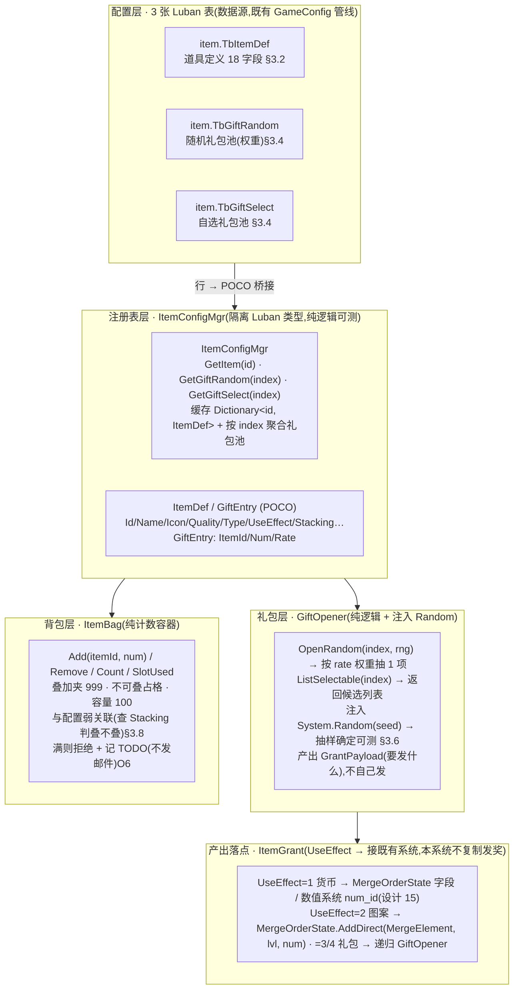
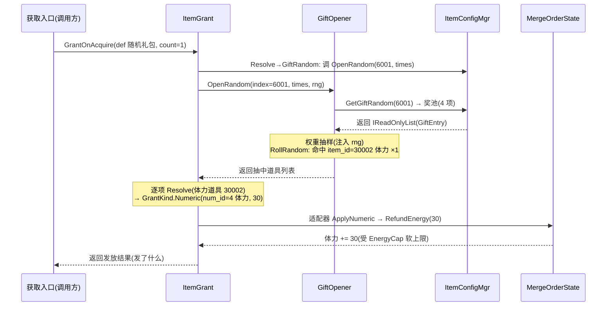

# 道具底层系统

用 Luban 道具表统一登记每件道具的**名称 / 描述 / 图标 / 品质 / 类型 / 使用效果 / 叠放规则**;运行期按 `Id` 查道具元数据;实现**礼包开启**(随机礼包按权重抽、自选礼包返回可选列表),产出经 `UseEffect` 落到对应系统(货币→[数值系统 / MergeOrderState](#15-numeric-system)、图案→`MergeElement`);并提供**基础背包容器**(计数 + 叠加上限 999 + 不可叠加单独占格 + 容量上限 100)。这是 xlsx 系统底层批次**第二刀**。**加法式**:新建框架 + 配置 + 纯逻辑,<mark>不重构既有货币 / 图案系统</mark>,旧路径零行为变化。

> [!WARNING]
> **读前必看 · 与工程现状的关系(单一事实源 = 代码)**
>
> 五条边界先钉死,防 dev 把「框架」做成「重构」、防误改既有切片:
>
> - **新建道具表,不扩展模板示例 `item.TbItem`。**工程里现有的 `Configs/GameConfig/Datas/item.xlsx`(`Item.TbItem`:衣服 / 裙子 / 鞋子 / 帽子、带 `price` / `upgrade_to_item_id` / `exchange_stream`)是 **TEngine 框架自带的模板示例**,字段与本系统 spec 不兼容、且无任何运行期业务代码消费它(grep 仅生成代码引用)。本系统在 `item` 模块下**新建独立表** `item.TbItemDef`,与 `TbItem` 并存互不干扰(拍板理由详 [§3.1](#16-item-system::fork))。
> - **新建品质枚举 `item.EItemQuality`(1–6),不复用现有 `item.EQuality`(1–4)。**现有 `EQuality` 为 `WHITE=1/BLUE=2/PURPLE=3/RED=4`,色序与本 spec(1 白 / 2 绿 / 3 蓝 / 4 紫 / 5 橙 / 6 红)**不一致且档数不够**;它被模板 `TbItem` 引用,改它会动模板示例。新建独立 6 档枚举,详 [§3.3](#16-item-system::enum)。
> - **礼包开启 / 背包是纯逻辑,可单测;配置加载分两条路。**「按 rate 权重抽奖」「自选礼包返回可选列表」「背包计数 / 叠加 / 占格」都是纯内存逻辑,单测直接断言、不碰 YooAsset。权重抽样接受外部 `System.Random`(种子可控)使**抽样结果确定可测**。Luban 表运行期加载走既有 `ConfigSystem.Instance.Tables`(YooAsset,需 Unity 运行时);EditMode 单测仿 `WeightCfgLubanTests` / `NumericSystemTests` 经 `AssetDatabase` 直读 `.bytes` 绕 YooAsset(详 [§3.5](#16-item-system::registry))。
> - **产出落点复用既有系统,不另起炉灶。**UseEffect=1(货币)调用既有 `MergeOrderState` 的对应字段路径 / [数值系统](#15-numeric-system) `NumericConfigMgr` 约定的 num_id;UseEffect=2(图案)调既有 `MergeOrderState.AddDirect(MergeElement, level, count)`。道具系统只产出「要发什么」的结构,**由调用方接到既有发奖方法**,本系统不复制发奖逻辑(详 [§3.7](#16-item-system::useeffect))。
> - **限时 / 邮件补偿 / UI 跳转本设计全部不做(spec 自身依赖未建系统)。**限时整套(`Term` / `TermTime` / `Compensate`→Reward 表 / `CompensateEmail`→邮件)、背包溢出邮件补发、`JumpList` 获取跳转、真实 Sprite / Light 特效——这些**字段照样进表**(为后续不返工),但运行期 **stub**:不做到期检测 / 补偿 / 邮件 / UI;背包满本设计**拒绝并记 TODO**不发邮件;资源名占位(详 [§七](#16-item-system::open) 各 O 项 + 风险表)。

> [!NOTE]
> **立项信息**
>
> | 项 | 内容 |
> | --- | --- |
> | **类型** | 新系统 · 配置化道具底层 出设计稿 + 验收标准,交开发落地。xlsx 系统底层批次第二刀。 |
> | **设计基线** | 工程既有 Luban 配置管线(`Configs/GameConfig/` 源 + `__tables__.xlsx` 注册 + `gen_code_bin_to_project_lazyload` 导表 + `ConfigSystem.Instance.Tables` 运行期加载;现有 `item` / `num` / `block.TbWeightCfg` 三表为范本) + 上轮已落地的[数值底层系统](#15-numeric-system)(`NumericConfigMgr` / `NumericEntry`,num_id 约定:1 经验 / 2 虔诚币 / 3 钻石 / 4 体力) + 已落地 merge-order 切片(`MergeOrderState.AddDirect` 图案注入、`MergeElement` 9 种图案、各货币字段)。 |
> | **方向约束** | 离线还原 · **去变现**(本表不含任何充值 / 内购 / 计价字段;道具仅作游戏内获取 / 使用登记)。加法式扩展,不破坏现有核心循环 + 已建系统(数值 / 存档 / 盲盒 / 神庙)。IO 走 TEngine 异步规范(配置加载经既有 `ConfigSystem`)。现有 209 例 EditMode 零回归。 |
> | **影响范围** | 新增 3 张 Luban 表:`item.TbItemDef`(道具定义,18 字段)+ `item.TbGiftRandom`(随机礼包池)+ `item.TbGiftSelect`(自选礼包池);新增 2 个枚举 `item.EItemQuality`(1–6)/ `item.EItemType`(类型);新增运行期 `ItemConfigMgr`(Luban 行 → POCO 桥接 + 按 Id 查,仿 `NumericConfigMgr`) + POCO `ItemDef` / `GiftEntry`;新增纯逻辑 `GiftOpener`(权重抽样 + 自选列表) + `ItemGrant`(UseEffect → 产出结构) + `ItemBag`(背包容器)。**既有货币字段 / 图案系统 / 数值系统读写零改动;旧路径零行为变化。** |
> | **关键约束(继承现状)** | 礼包抽样 / 背包 / UseEffect 解析为纯逻辑,可在纯 C# 单测直接 `new`(不依赖 YooAsset / Unity 运行时);权重抽样注入 `System.Random(seed)` 使确定可测;配置表 EditMode 测试经 `AssetDatabase` 直读 `.bytes`(仿 `NumericSystemTests`)。 |

<h2 id="what">一、做什么与为什么</h2>

现状:游戏里的「可获取物」分散在各处——货币是 `MergeOrderState` 的独立字段([数值系统](#15-numeric-system)登记元数据),图案是 `MergeElement` 枚举,盲盒奖励是 `ChestReward` 结构。但**没有一个统一的「道具」概念**把这些「能被领取 / 持有 / 使用」的物品登记成一张表:每种新道具(材料、功能材料、礼包)都得重新定义结构、各写一套获取逻辑。spec 的设计目的正是「各类道具信息,前端显示 + 后端记录」——补的是道具的**元数据层 + 获取层 + 持有层**。

本系统三件事:(1) 用一张 Luban 道具表登记每件道具「是什么」(名 / 描述 / 图标 / 品质 / 类型 / 使用效果 / 叠放),运行期按 `Id` 查;(2) 实现**礼包开启**——随机礼包按权重抽、自选礼包返回可选列表,开出的奖励经 `UseEffect` 落到对应既有系统;(3) 提供**基础背包容器**——计数、叠加上限 999、不可叠加单独占格、容量上限 100。逐条对应需求:

| # | 需求(来自 xlsx 表逐字) | 本篇落法 | 状态 |
| --- | --- | --- | --- |
| 1 | 道具表:Id / Name / Desc / Icon / Quality / Light / Automatic / Type / 参数 / UseEffect / Stacking / 限时整套 / JumpList | 18 字段 1:1 落 Luban schema `item.TbItemDef`([§3.2](#16-item-system::schema));Quality 用 `EItemQuality`、Type 用 `EItemType` | 新增表 |
| 2 | 品质 1 普通白 / 2 高级绿 / 3 精英蓝 / 4 史诗紫 / 5 传说橙 / 6 神话红 | 新建枚举 `item.EItemQuality`(6 档,不复用 1–4 的 `EQuality`,[§3.3](#16-item-system::enum)) | 新增枚举 |
| 3 | 类型 1 货币 / 2 材料 / 3 功能材料 / 5 自选礼包 / 6 随机礼包(以 spec 类型说明为准) | 新建枚举 `item.EItemType`;Type 作分类 / 背包归类([§3.3](#16-item-system::enum)) | 新增枚举 |
| 4 | 随机礼包表(auto\_id / index / item\_id / num / rate 权重)+ 自选礼包表(同字段) | 两张 Luban 表 `item.TbGiftRandom` / `item.TbGiftSelect`,按 index 聚合成礼包池([§3.4](#16-item-system::packs)) | 新增表 |
| 5 | UseEffect:1 获取对应 num(复用数值系统)/ 2 获取图案(复用 MergeElement)/ 3 自选礼包表 ID / 4 随机礼包表 id | `ItemGrant` 解析 UseEffect → 产出结构,落既有发奖路径([§3.7](#16-item-system::useeffect)) | 新增解析 |
| 6 | 礼包开启:随机按 rate 权重抽、自选返回可选列表 | `GiftOpener.OpenRandom(index, rng)` 权重抽 / `ListSelectable(index)` 返回候选([§3.6](#16-item-system::gift)) | 新增逻辑 |
| 7 | 可叠放(Stacking)同 ID 叠加上限 999,超过显示 999+;不可叠加单独占格;后端最大 100 格 | `ItemBag` 容器:叠加夹 999 / 占格 / 容量 100([§3.8](#16-item-system::bag)) | 新增容器 |
| 8 | 限时(Term/TermTime/Compensate→Reward/CompensateEmail→邮件) | 字段进表,运行期 **stub**:不做到期检测 / 补偿 / 邮件(依赖未建系统,[§七 O5](#16-item-system::open)) | 字段进表·逻辑 stub |
| 9 | 背包溢出邮件补发;JumpList 获取跳转;真实 Sprite / Light 特效 | 容量满**拒绝 + 记 TODO**(不发邮件);JumpList 进表不接 UI;资源名占位([§七 O6/O7/O8](#16-item-system::open)) | 字段进表·不接 |

<b>不做(本设计明确排除):</b>充值 / 内购 / 计价(去变现);限时到期检测 / Reward 表补偿 / 邮件补发(依赖未建系统,字段进表逻辑 stub,[§七 O5](#16-item-system::open));背包溢出邮件补发(邮件未建,仅容量上限,[§七 O6](#16-item-system::open));JumpList 获取跳转 UI(字段进表不接,[§七 O7](#16-item-system::open));真实 Sprite / Light 特效(无美术,资源名占位,[§七 O8](#16-item-system::open));道具背包 / 礼包开启 UI 界面(本设计交付数据层 + 纯逻辑,UI 投放独立后续,[§七 O9](#16-item-system::open));把货币数量值迁进背包统一持有(货币数量仍由 MergeOrderState 字段持有,[§七 O4](#16-item-system::open))。

<h2 id="model">二、系统模型</h2>

<h3 id="layers">2.1 四层分层(配置 / 注册表 / 礼包 / 背包)</h3>

系统拆四层,各层职责单一、各自可测。配置层是数据源(3 张 Luban 表),注册表层把表行桥接成 POCO 并按 id 索引(隔离 Luban 类型),礼包层是吃注册表 + 随机数的纯逻辑(产出「要发什么」的结构),背包层是与配置无关的纯计数容器。产出落点(UseEffect)由 `ItemGrant` 接到既有系统,本系统不持有发奖逻辑。结构图:

<b>为什么这样切:</b>注册表层桥接成 POCO(`ItemDef` / `GiftEntry`)让查询逻辑<mark>不直接依赖 Luban 生成类型</mark>——这是工程现有 `NumericConfigMgr` / `WeightCfgConfigMgr` 的同款做法。礼包层把随机数<mark>从外部注入</mark>(`System.Random`),所以抽样在单测里可用固定种子复现,这是「权重抽样确定性」验收点的地基。`ItemGrant` 故意只产出「要发什么」的结构、不自己发奖,这样它的单测只断言「解析出的产出结构对不对」,不需要拉起整个 MergeOrderState;真正的发放由调用方接到既有方法,避免本系统复制一份发奖逻辑导致两处漂移。

<h3 id="additive">2.2 加法式接入(与数值 / 图案系统的关系)</h3>

本系统不重构任何既有系统,只**新增**道具这一层抽象,通过 `UseEffect` 字段与既有系统弱关联:

| 既有系统 | 本系统怎么用它 | 动它吗 |
| --- | --- | --- |
| [数值系统(num\_id)](#15-numeric-system) | UseEffect=1 的道具,其「参数」/ 关联字段指向某 num\_id;`ItemGrant` 产出 `(num_id, amount)`,由调用方接到货币字段增减 | 否(只读 num\_id 约定) |
| `MergeElement` 图案 + `MergeOrderState.AddDirect` | UseEffect=2 的道具,`ItemGrant` 产出 `(MergeElement, level, count)`,调用方接到既有 `AddDirect` | 否(只调既有方法) |
| 货币字段(`Energy`/`Piety`/`Exp`…) | 不改字段、不迁数量值进背包;货币数量仍各字段持有(全面迁移见 [§七 O4](#16-item-system::open)) | 否 |
| `ChestReward` / 盲盒 | 不耦合;道具礼包是独立获取通道,与盲盒并存 | 否 |

背包(`ItemBag`)本设计持有的是 **Type=2 材料 / 3 功能材料** 这类「需要进背包格子」的道具。货币(Type=1)与图案(UseEffect=2)走各自既有系统、<mark>不进背包格子</mark>(它们没有「100 格上限」语义)。背包归类按 `Type` 划分([§3.8](#16-item-system::bag))。

<h2 id="numbers">三、设计正文</h2>

<h3 id="fork">3.1 新建 vs 扩展现有 item 表(拍板与理由)</h3>

工程里已存在 `Configs/GameConfig/Datas/item.xlsx` → `Item.TbItem`。boss 简报要求先核实、评估「扩展 vs 新建」。核实结论:

| 核实项 | 现状 |
| --- | --- |
| 现有 `item.xlsx` 内容 | 10 行**模板示例**:衣服 / 裤子 / 裙子 / 帽子 / 鞋子等服装,字段为 `id / name / desc / price / upgrade_to_item_id / expire_time / batch_useable / quality / exchange_stream / exchange_list / exchange_column` |
| 运行期消费者 | <mark>无</mark>。grep `TbItem` 仅命中生成代码(`GameProto/GameConfig/*.cs`),无任何 GameLogic 业务代码引用 |
| 字段兼容性 | 与 spec 冲突:`price`(计价,触去变现红线)、`upgrade_to_item_id`(装备升级,本 spec 无此概念)、`exchange_stream/list/column`(兑换流,本 spec 无)。spec 需要的 `Light / Automatic / Type / UseEffect / Stacking / Term / JumpList` 等 11 个字段现表全无 |
| 品质枚举 | 现 `item.EQuality` = WHITE 1 / BLUE 2 / PURPLE 3 / RED 4,仅 4 档,色序(白蓝紫红)与 spec(白绿蓝紫橙红 6 档)不一致 |

<b>拍板:新建,不扩展。</b>理由:① 现表是 TEngine 框架自带的**模板示例**(连同 `test.*` 系列示例 Bean / Enum 一起存在),并非本游戏的真实道具表,扩展它等于把模板示例改成生产表、且要删它带的 10 行无关数据;② 字段冲突严重——保留 `price/upgrade_to_item_id/exchange_*` 是垃圾字段,删它们又会破坏现有(虽无业务消费但)生成代码与 .bytes;③ 品质枚举档数 / 色序都对不上,改 `EQuality` 会动到模板 `TbItem` 的引用。新建 `item.TbItemDef` + `item.EItemQuality` 与模板并存,互不干扰,回归最干净。

> [!NOTE]
> **命名:**新表全名 `item.TbItemDef`(value_type `ItemDef`),导出 `item_tbitemdef.bytes`;礼包表 `item.TbGiftRandom` / `item.TbGiftSelect`,导出 `item_tbgiftrandom.bytes` / `item_tbgiftselect.bytes`。与现有 `item_tbitem.bytes`(模板)并列,文件名不撞。**命名理由:**「ItemDef」= 道具**定义**表,区别于将来可能的「ItemInstance」运行期实例;若直接叫 `TbItem2` 之类是无语义私造名,违 conventions 规则 5(公共词汇)。

<h3 id="schema">3.2 Luban 道具表 schema</h3>

道具表 `item.TbItemDef` 落 18 字段,严格按 spec。表头四行(`##var` / `##type` / `##group` / `##`)写进数据 xlsx,`__tables__.xlsx` 注册行 `read_schema_from_file=True`(schema-in-file)、`index=id` / `mode=map`。`##group` 写 `c,s`(客户端 + 服务端都导出,逗号分隔不写连写——见 dev memory Luban 条)。

| ##var | ##type | ##group | 说明(##) | 备注 |
| --- | --- | --- | --- | --- |
| id | int | c,s | 道具唯一 id(主键) | index=id |
| name | int | c,s | 道具名(关联多语言文本表 ID) | 文本 id,非字面串 |
| desc | int | c,s | 道具描述(关联多语言文本表 ID) | 文本 id |
| icon | string | c,s | 图标资源名 | 占位名(无美术 O8) |
| quality | item.EItemQuality | c,s | 品质(1–6) | 枚举 §3.3 |
| light | string | c,s | icon 特效 id / 路径 | 占位(无美术 O8) |
| automatic | int | c,s | 获得时是否自动使用(0 否 / 1 是) | 0/1,本设计 ItemGrant 读它决定是否立即结算 |
| type | item.EItemType | c,s | 道具类型(分类 / 背包归类) | 枚举 §3.3 |
| param | int | c,s | 「参数」:自选 / 随机礼包奖励数量 | spec「参数」字段;礼包开几次 / 数量 |
| use\_effect | int | c,s | 使用效果:1 num / 2 图案 / 3 自选礼包 ID / 4 随机礼包 id | 解析见 §3.7 |
| use\_value | int | c,s | 使用效果的目标 id:UseEffect=1 时 num\_id / =2 时图案 key / =3 时自选礼包 index / =4 时随机礼包 index | **新增辅助字段**,见下「字段补充说明」 |
| use\_num | int | c,s | 使用效果的数量:UseEffect=1 货币数量 / =2 图案数量 | **新增辅助字段** |
| use\_level | int | c,s | 图案等级(UseEffect=2 时,1–3;其余填 0) | **新增辅助字段** |
| stacking | int | c,s | 可叠放(0 否 / 1 是;叠加上限 999) | 背包用 §3.8 |
| term | int | c,s | 限时(0 非限时 / 1 指定日期 / 2 指定时长) | **stub**:进表不检测 O5 |
| term\_prompt | int | c,s | 限时提示(文本 id) | stub O5 |
| term\_time | string | c,s | 限时时间(日期串 / 时长秒) | stub O5 |
| compensate | int | c,s | 到期补偿(Reward 表 id) | stub O5(Reward 表未建) |
| compensate\_email | int | c,s | 补偿邮件(邮件 id) | stub O5(邮件未建) |
| jump\_list | (array#sep=,),int | c,s | 获取跳转列表 | 进表不接 UI O7 |

> [!NOTE]
> <b>字段补充说明(为何拆 use_value / use_num / use_level):</b>spec 把「使用效果」浓缩成一个 <code>UseEffect</code>(1–4)+「参数」字段,但实际「获取 5000 经验」「获取 3 个 Lv2 钻石图案」需要**目标 id + 数量 + 等级**三段信息,单一「参数」字段表达不下。拆成 <code>use_value</code>(目标 id)/ <code>use_num</code>(数量)/ <code>use_level</code>(图案等级)三列,语义清晰、Luban 可校验。spec 原「参数」字段(<code>param</code>)保留,语义收窄为「礼包奖励数量 / 开启次数」(UseEffect=3/4 时用),避免与 use_num 混淆。<b>这是设计补充,非偏离 spec——spec 字段全部保留,只是把过载的「参数」拆清。</b>列入 <a href="#16-item-system::open">§七 O2</a> 供 boss 确认。

<h3 id="enum">3.3 品质 / 类型枚举 + 样例数据</h3>

<b>品质枚举 <code>item.EItemQuality</code></b>(写 `__enums__.xlsx`,full\_name=`item.EItemQuality`,unique=True):

| name | alias | value | comment |
| --- | --- | --- | --- |
| COMMON | 普通 | 1 | 白 |
| FINE | 高级 | 2 | 绿 |
| ELITE | 精英 | 3 | 蓝 |
| EPIC | 史诗 | 4 | 紫 |
| LEGEND | 传说 | 5 | 橙 |
| MYTH | 神话 | 6 | 红 |

<b>类型枚举 <code>item.EItemType</code></b>(以 spec「类型说明」为准——值跳过 4,spec 未定义 4):

| name | alias | value | comment |
| --- | --- | --- | --- |
| CURRENCY | 货币 | 1 | 走数值系统,不进背包格 |
| MATERIAL | 材料 | 2 | 进背包,可叠放 |
| FUNC\_MATERIAL | 功能材料 | 3 | 进背包,可叠放 |
| GIFT\_SELECT | 自选礼包 | 5 | 开启返回候选列表 |
| GIFT\_RANDOM | 随机礼包 | 6 | 开启按权重抽 |

注:spec 类型说明里没有 value=4,枚举照 spec 跳过 4(Luban 非 flags 枚举允许值不连续)。若后续要补 4,直接加行即可。

<b>道具表样例数据(覆盖 Type 各类 + UseEffect 各值,至少 8 行):</b>

| id | name | type | use\_effect | use\_value | use\_num | use\_level | param | stacking | quality | 说明 |
| --- | --- | --- | --- | --- | --- | --- | --- | --- | --- | --- |
| 30001 | 110001 | 1 货币 | 1 num | 1(经验) | 5000 | 0 | 0 | 0 | 1 | 经验道具:领取 +5000 经验 |
| 30002 | 110002 | 1 货币 | 1 num | 4(体力) | 30 | 0 | 0 | 0 | 1 | 体力道具:领取 +30 体力 |
| 30003 | 110003 | 2 材料 | 0 无 | 0 | 0 | 0 | 0 | 1 | 2 | 普通材料:进背包可叠放(use\_effect=0=纯持有) |
| 30004 | 110004 | 3 功能材料 | 2 图案 | 100(钻石) | 2 | 2 | 0 | 1 | 3 | 功能材料:用后得 2 个 Lv2 钻石图案 |
| 30005 | 110005 | 5 自选礼包 | 3 自选 | 5001(自选 index) | 0 | 0 | 1 | 0 | 4 | 自选礼包:开启选 1 项 |
| 30006 | 110006 | 6 随机礼包 | 4 随机 | 6001(随机 index) | 0 | 0 | 1 | 0 | 5 | 随机礼包:开启抽 1 项 |
| 30007 | 110007 | 6 随机礼包 | 4 随机 | 6001 | 0 | 0 | 3 | 0 | 6 | 随机礼包(param=3):开启抽 3 次 |
| 30008 | 110008 | 2 材料 | 0 无 | 0 | 0 | 0 | 0 | 0 | 2 | 不可叠放材料:单独占格(stacking=0) |

其中 30007 的 `param=3` 表示开启时抽 3 次(自选礼包 param 表示可选 N 选 M 里的可选数;随机礼包 param 表示抽几次)。30008 `stacking=0` 用于验证背包占格逻辑。Term 字段所有样例行填 `term=0`(本设计 stub,不做限时)。

<h3 id="packs">3.4 随机 / 自选礼包表 + 样例</h3>

两张礼包池表结构相同(spec 逐字),`index=auto_id` / `mode=map`,按 `index` 字段(所属礼包 id)聚合成一个礼包池。`##group` 写 `c,s`。

<b>随机礼包表 <code>item.TbGiftRandom</code>:</b>

| ##var | ##type | 说明 |
| --- | --- | --- |
| auto\_id | int | 行主键(index=auto\_id) |
| index | int | 所属礼包 id(同 index 的行 = 一个奖池) |
| item\_id | int | 奖品道具 id(指向 item.TbItemDef;也可指 num,见下注) |
| num | int | 该奖品数量 |
| rate | int | 权重(非概率;抽中概率 = rate / 同 index 全部 rate 之和) |

注:`item_id` 指向 `item.TbItemDef` 的 id。礼包开出某道具后,该道具自己的 `use_effect` 决定它落哪(货币 / 图案 / 嵌套礼包)。即礼包奖品本身也是「道具」,产出统一走 `ItemGrant`(§3.7),奖池只描述「开出哪个道具 ×num」。

<b>随机礼包样例(index=6001,4 项,权重和 100):</b>

| auto\_id | index | item\_id | num | rate | 抽中概率 |
| --- | --- | --- | --- | --- | --- |
| 1 | 6001 | 30001(经验道具) | 1 | 50 | 50% |
| 2 | 6001 | 30002(体力道具) | 1 | 30 | 30% |
| 3 | 6001 | 30004(钻石图案道具) | 1 | 15 | 15% |
| 4 | 6001 | 30003(普通材料) | 2 | 5 | 5% |

<b>自选礼包表 <code>item.TbGiftSelect</code>:</b>字段同上(`auto_id / index / item_id / num / rate`)。`rate` 在自选礼包里仅作展示排序权重 / 保留字段(自选不抽,玩家手选),开启返回该 index 的全部候选项。

<b>自选礼包样例(index=5001,3 项):</b>

| auto\_id | index | item\_id | num | rate |
| --- | --- | --- | --- | --- |
| 1 | 5001 | 30001(经验道具) | 1 | 0 |
| 2 | 5001 | 30002(体力道具) | 1 | 0 |
| 3 | 5001 | 30004(钻石图案道具) | 1 | 0 |

<h3 id="registry">3.5 运行期道具注册表(加载 + 查询)</h3>

`ItemConfigMgr` 仿 `NumericConfigMgr`:静态类,持懒加载缓存,把 Luban 行桥接成 POCO,提供按 id / index 查。POCO 隔离 Luban 生成类型,业务侧只认 POCO。

<pre class="code">// POCO（隔离 Luban 类型，仿 NumericEntry）
public sealed class ItemDef {
    public int Id, Name, Desc;
    public string Icon, Light;
    public int Quality;        // EItemQuality 底层值 1–6
    public int Automatic;      // 0/1
    public int Type;           // EItemType 底层值
    public int Param;          // 礼包奖励数量 / 开启次数
    public int UseEffect;      // 0 无 / 1 num / 2 图案 / 3 自选 / 4 随机
    public int UseValue, UseNum, UseLevel;
    public int Stacking;       // 0/1
    public int Term, TermPrompt; public string TermTime;   // 限时（stub）
    public int Compensate, CompensateEmail;                // 限时补偿（stub）
    public int[] JumpList;     // 跳转（不接 UI）
}
public sealed class GiftEntry { public int ItemId, Num, Rate; }
// 注册表（仿 NumericConfigMgr：EnsureLoaded / Get / InitForTest / ResetForTest）
public static class ItemConfigMgr {
    public static ItemDef GetItem(int id);                       // 查不到返 null（不抛）
    public static IReadOnlyList(GiftEntry) GetGiftRandom(int index); // 按 index 聚合，空返空集合
    public static IReadOnlyList(GiftEntry) GetGiftSelect(int index);
    public static void EnsureLoaded();                           // 经 ConfigSystem.Tables（YooAsset）
    public static void InitForTest(IEnumerable&lt;ItemDef&gt; items,
                                   IEnumerable&lt;GiftEntry&gt; randoms = null,
                                   IEnumerable&lt;GiftEntry&gt; selects = null); // 绕 ConfigSystem
    public static void ResetForTest();
}</pre>

**桥接 group 注意**(继承 dev memory Luban 条):所有字段 `##group` 写 `c,s`(客户端 client target groups=\["c"\] 会保留)。本表无 group=s / group=e 字段,故客户端生成的行类含全部字段,POCO 可全量映射,无须 helper 兜底缺字段。

<b>配置加载分两路:</b>运行期 `EnsureLoaded` 走 `ConfigSystem.Instance.Tables.TbItemDef / TbGiftRandom / TbGiftSelect`(YooAsset,需 Unity 运行时);EditMode 测试经 `AssetDatabase.LoadAssetAtPath<TextAsset>("Assets/AssetRaw/Configs/bytes/item_tbitemdef.bytes")` → `new GameConfig.item.TbItemDef(new Luban.ByteBuf(ta.bytes))` 直读,绕 YooAsset(仿 `NumericSystemTests.LoadTableFromBytes`)。

<h3 id="gift">3.6 礼包开启(权重抽样 + 自选列表)</h3>

`GiftOpener` 是吃注册表 + 注入随机数的纯逻辑。<b>随机礼包:</b>按 `rate` 权重抽。<b>自选礼包:</b>返回候选列表交 UI 选。

<b>权重抽样算法(确定可测):</b>

<pre class="code">// 注入 System.Random 使种子可控、单测可复现。
public static GiftEntry RollRandom(IReadOnlyList(GiftEntry) pool, System.Random rng) {
    if (pool == null || pool.Count == 0) return null;
    int total = 0;
    foreach (var e in pool) total += Math.Max(0, e.Rate);  // 负权重当 0
    if (total &lt;= 0) return pool[0];                          // 全 0 权重退化：取第一项（不抛）
    int r = rng.Next(total);                                // [0, total)
    int acc = 0;
    foreach (var e in pool) {
        acc += Math.Max(0, e.Rate);
        if (r &lt; acc) return e;
    }
    return pool[pool.Count - 1];                            // 浮点/边界兜底
}
// 开 N 次（param=抽几次），每次独立抽（放回）
public static List&lt;GiftEntry&gt; OpenRandom(int index, int times, System.Random rng) {
    var pool = ItemConfigMgr.GetGiftRandom(index);
    var result = new List&lt;GiftEntry&gt;();
    for (int i = 0; i &lt; Math.Max(1, times); i++) {
        var e = RollRandom(pool, rng);
        if (e != null) result.Add(e);
    }
    return result;
}
// 自选：返回候选列表（不抽，UI 选）
public static IReadOnlyList(GiftEntry) ListSelectable(int index)
    =&gt; ItemConfigMgr.GetGiftSelect(index);</pre>

<b>抽样确定性验收的地基:</b>同一个 `new System.Random(种子)` + 同一奖池,`RollRandom` 必返同一项。单测用固定种子断言「抽 N 次的结果序列等于预期序列」;再用大样本(如 10000 次)断言「各项命中频率落在权重比例 ±容差内」(统计意义验权重生效,不依赖具体种子)。

<b>边界逐档(权重抽样):</b>

| 输入 | 行为 | 理由 |
| --- | --- | --- |
| 空奖池 / index 查无 | 返 null(OpenRandom 跳过) | 不抛,调用方判空 |
| 单项奖池 | 必中该项 | total=rate,r∈\[0,rate) 恒落第一项 |
| 全 0 权重 | 退化取第一项 | 避免除零 / 死循环;配置错误时不崩 |
| 含负 rate | 负权重当 0 | 防配置笔误污染分布 |
| times≤0 | 当 1 次 | 至少开 1 次 |

<h3 id="useeffect">3.7 UseEffect 产出落点</h3>

`ItemGrant` 把一个「道具 ×num」解析成「要发什么」的产出结构 `GrantPayload`,**不自己发奖**,由调用方接到既有系统。这样 `ItemGrant` 单测只断言「解析对不对」,不拉起 MergeOrderState。

<pre class="code">public enum GrantKind { None, Numeric, Pattern, GiftSelect, GiftRandom }
public readonly struct GrantPayload {
    public readonly GrantKind Kind;
    public readonly int TargetId;   // Numeric=num_id / Pattern=MergeElement key / Gift*=礼包 index
    public readonly int Amount;     // 货币 / 图案数量
    public readonly int Level;      // 图案等级（Pattern）
    public readonly int Times;      // 礼包开启次数（Gift*）
}
// 解析单个道具（不发，只产出）
public static GrantPayload Resolve(ItemDef def, int count) {
    switch (def.UseEffect) {
        case 1: return new GrantPayload(GrantKind.Numeric,    def.UseValue, def.UseNum * count, 0, 0);
        case 2: return new GrantPayload(GrantKind.Pattern,    def.UseValue, def.UseNum * count, def.UseLevel, 0);
        case 3: return new GrantPayload(GrantKind.GiftSelect, def.UseValue, 0, 0, def.Param);
        case 4: return new GrantPayload(GrantKind.GiftRandom, def.UseValue, 0, 0, def.Param);
        default:return new GrantPayload(GrantKind.None, def.Id, count, 0, 0); // 纯持有材料
    }
}</pre>

<b>调用方落点(挂接点,本系统提供「适配器」示范但不强制接 UI):</b>

| GrantKind | 落点(既有系统) | 本系统做到哪 |
| --- | --- | --- |
| Numeric | num\_id 对应货币字段:体力→`MergeOrderState.RefundEnergy` / 经验→`Exp +=` / 虔诚币→`AddPiety` / 钻石→(数值系统约定字段) | 产出 `(num_id, amount)`;适配器把 num\_id 映射到既有字段方法(给一份 `ApplyNumeric(MergeOrderState, payload)` 示范) |
| Pattern | `MergeOrderState.AddDirect(MergeElement, level, count)`(既有方法) | 产出 `(MergeElement, level, count)`;适配器调既有 AddDirect |
| GiftSelect | 返回候选列表交 UI(UI 本设计不接) | 产出 index + times;调 `GiftOpener.ListSelectable` |
| GiftRandom | 递归:抽出的道具再 `Resolve` + 落点 | 产出 index + times;调 `GiftOpener.OpenRandom` 再逐项 Resolve |
| None(纯材料) | 进背包 `ItemBag.Add(id, count)` | 适配器把材料放进背包 |

注:Pattern 的 `UseValue` 存 MergeElement 的枚举底层值(如钻石 100)。MergeElement key 见 `MergeElementVisual.cs`(Diamond=100…Stone=200)。适配器 `(MergeElement)payload.TargetId` 转回枚举。

<b>Automatic 字段:</b>`automatic=1` 的道具,获取时立即 `Resolve` + 落点(不进背包);`automatic=0` 的进背包待用户手动用。本设计 `ItemGrant` 提供 `GrantOnAcquire(def, count)` 读 Automatic 决定走「立即结算」还是「进背包」两条路。

<h3 id="bag">3.8 基础背包容器(叠加 / 上限 / 占格)</h3>

`ItemBag` 是与配置弱关联的纯计数容器:持有「道具 id → 数量」,叠加规则查 `ItemConfigMgr.GetItem(id).Stacking` 决定。

| 规则 | 值 | 行为 |
| --- | --- | --- |
| 叠加上限 | 999 | 同 id(stacking=1)累加,夹到 999;超出部分本设计**丢弃 + 记 TODO**(邮件补发 O6) |
| 显示 | 999+ | 数量 ≥999 显示 "999+"(给一个 `FormatCount(n)` 纯函数:n&lt;999 原值,≥999 返 "999+") |
| 占格(可叠) | 1 格 / id | stacking=1:同 id 不论数量占 1 格 |
| 占格(不可叠) | num 格 | stacking=0:每个占 1 格,num 个占 num 格 |
| 容量上限 | 100 格 | 已用格 + 新增格 >100 → 本设计**拒绝该次 Add(返回实际放入量)+ 记 TODO**(不发邮件 O6) |

<pre class="code">public sealed class ItemBag {
    public const int StackCap = 999;
    public const int SlotCap = 100;
    // id → 数量
    private readonly Dictionary&lt;int,int&gt; _stack = new();   // 可叠：id→总数
    private readonly Dictionary&lt;int,int&gt; _nonStack = new(); // 不可叠：id→个数（每个占 1 格）
    public int Count(int id);          // 该 id 总数
    public int SlotUsed { get; }       // 已用格 = 可叠种类数 + 不可叠个数总和
    // 放入 count 个，返回实际放入量（容量/叠加上限可能 &lt; count；差额记 TODO）
    public int Add(int id, int count);
    public bool Remove(int id, int count);
    public static string FormatCount(int n); // ≥999 → "999+"
}</pre>

<b>容量判定逐档:</b>

| 场景 | 行为 |
| --- | --- |
| 可叠 id 已在背包,加量 | 不占新格,数量累加夹 999;超 999 的差额丢弃记 TODO |
| 可叠 id 新进,有空格 | 占 1 格,放入 min(count, 999) |
| 可叠 id 新进,无空格 | 拒绝,返回 0,记 TODO(O6) |
| 不可叠 id,空格 k 个,放 count 个 | 放入 min(count, k) 个,占 min(count,k) 格;差额拒绝记 TODO |
| 移除到 0 | 从字典删该 id,释放格子 |

<b>背包持久化:</b>本设计背包**不接存档**(纯内存容器)。接入跨会话存档(序列化进 [设计 14](#14-save-system) 的存档 DTO)列为后续,见 [§七 O10](#16-item-system::open)。本设计验收只锚在内存容器的纯逻辑断言。

<h2 id="flow">四、礼包开启时序</h2>

以「玩家获取一个随机礼包道具(automatic=1)」为例,展示从获取到产出落地的调用链。参与方:获取入口(调用方)→ `ItemGrant` → `GiftOpener` → `ItemConfigMgr` → 既有系统(MergeOrderState)。

关键点:抽样发生在 `GiftOpener` 内、注入 `rng`;抽中的「道具」再回 `ItemGrant.Resolve` 二次解析(随机礼包的奖品可能又是货币 / 图案 / 嵌套礼包),最终货币 / 图案落到既有 `MergeOrderState` 方法。`ItemGrant` 与 `GiftOpener` 全程不直接写 MergeOrderState 字段,只产出结构 + 经适配器调既有方法——这条边界让两者可纯逻辑单测。

<h2 id="hook">五、挂接点 / dev 改动清单</h2>

符号名经 grep 核实(标注✓)。新增为主,既有方法只**调用**不修改。

| # | 动作 | 落点(文件 / 符号) |
| --- | --- | --- |
| L1 | 新建数据 xlsx + 注册 | `Configs/GameConfig/Datas/itemdef.xlsx` / `giftrandom.xlsx` / `giftselect.xlsx`(表头四行 schema);`__tables__.xlsx` 加 3 行(`item.TbItemDef` / `item.TbGiftRandom` / `item.TbGiftSelect`,read\_schema\_from\_file=True、index、mode=map、group 空走默认 c,s) |
| L2 | 新建枚举 | `__enums__.xlsx` 加 `item.EItemQuality`(6 档)+ `item.EItemType`(5 档) |
| L3 | 导表 | 设 `$env:DOTNET_ROLL_FORWARD="Major"` 后跑 `gen_code_bin_to_project_lazyload.bat`(dev memory Luban 条);新表用 luban\_helper 注意 `--no-auto-import` + 手填 read\_schema\_from\_file=True。生成 `GameProto/GameConfig/item.*.cs` + `bytes/item_tbitemdef.bytes` 等 |
| C1 | POCO | 新建 `ItemDef` / `GiftEntry`(仿 `NumericEntry.cs` 位置 `GameLogic/Module/BlockBlast/Item/` 或 `GameLogic/Config/`) |
| C2 | 注册表 | 新建 `ItemConfigMgr`(仿 `NumericConfigMgr.cs` ✓:EnsureLoaded / Get / InitForTest / ResetForTest;桥接 `GameConfig.item.TbItemDef` 等) |
| C3 | 礼包逻辑 | 新建 `GiftOpener`(RollRandom / OpenRandom / ListSelectable,注入 System.Random) |
| C4 | 产出解析 | 新建 `ItemGrant`(GrantPayload / Resolve / GrantOnAcquire + 适配器 ApplyNumeric / ApplyPattern)。Pattern 适配器调既有 `MergeOrderState.AddDirect(MergeElement, level, count)` ✓(MergeOrderState.cs:244);Numeric 适配器调既有 `RefundEnergy` ✓(:218) / `AddPiety` ✓(:475) / `Exp +=` ✓(:147) |
| C5 | 背包容器 | 新建 `ItemBag`(StackCap=999 / SlotCap=100 / Add / Remove / Count / SlotUsed / FormatCount) |
| T1 | 单测 | 新建 `ItemSystemTests.cs`(仿 `NumericSystemTests.cs` ✓ 位置 `Assets/Editor/Tests/BlockBlast/`):配置直读 .bytes(C 类)+ 注册表 InitForTest(R 类)+ 礼包抽样确定性(G 类)+ 背包(B 类)+ UseEffect 解析(U 类) |

<b>不碰的文件(零回归保证):</b>`MergeOrderState.cs` 不加 / 改字段(只被 `ItemGrant` 适配器**调用**既有 public 方法);`MergeElementVisual.cs` / `NumericConfigMgr.cs` 不改;现有 `item.xlsx` / `Item.TbItem` 不动。现有 209 例 EditMode 应零回归(本系统不改任何既有代码路径)。

<h2 id="accept">六、验收点</h2>

每条可被 test 逐条核对。配置类(C)经 AssetDatabase 直读 .bytes;其余(R/G/U/B/F)为纯逻辑 InitForTest / new。

| # | 验收点 | 完成定义(test 可核对) |
| --- | --- | --- |
| C1 | 道具表导出且行数对 | 直读 `item_tbitemdef.bytes` → `new TbItemDef`,`DataList.Count` = 样例行数(≥8) |
| C2 | 道具字段对得上源 | 取 id=30006(随机礼包),断言 type=6 / use\_effect=4 / use\_value=6001 / param=1 / quality=5 / stacking=0,与 §3.3 样例一致 |
| C3 | 品质枚举 1–6 齐全 | 表中 quality 取值覆盖 {1,2,3,4,5,6} 各至少一行;`(int)EItemQuality.MYTH==6` |
| C4 | 类型枚举值符 spec(跳过 4) | `(int)EItemType.GIFT_SELECT==5 && GIFT_RANDOM==6 && CURRENCY==1` |
| C5 | 随机礼包表导出且 index 聚合 | 直读 `item_tbgiftrandom.bytes`,index=6001 聚合出 4 项,权重和=100 |
| C6 | 自选礼包表导出 | 直读 `item_tbgiftselect.bytes`,index=5001 聚合出 3 项 |
| R1 | 注册表按 id 查命中 / 未命中 | InitForTest 后 `GetItem(30001)` 非 null 且字段对;`GetItem(999999)` 返 null 不抛 |
| R2 | 注册表按 index 查礼包池 | `GetGiftRandom(6001).Count==4`;查无返空集合不抛 |
| R3 | POCO 桥接保真 | 从真实 .bytes 行 `ToItemDef(row)`,逐字段 == row 原值(既验桥接也验 .bytes 对得上) |
| G1 | 权重抽样确定性(种子可复现) | 同 `new Random(种子)` + 同奖池,`RollRandom` 连抽 N 次结果序列两次运行完全相同 |
| G2 | 权重分布正确(大样本) | 样例奖池抽 10000 次,各 item\_id 命中频率落在 {50%,30%,15%,5%} ±3% 容差内 |
| G3 | 抽样边界 | 空池返 null;单项池必中;全 0 权重退化取第一项;负权重当 0;times≤0 当 1 |
| G4 | 自选返回完整候选 | `ListSelectable(5001).Count==3`,顺序 = 表内顺序 |
| U1 | UseEffect=1 解析为货币产出 | `Resolve(经验道具, 1)` → Kind=Numeric, TargetId=1, Amount=5000 |
| U2 | UseEffect=2 解析为图案产出(含等级) | `Resolve(钻石图案道具, 2)` → Kind=Pattern, TargetId=100, Amount=4(use\_num 2 ×count 2), Level=2 |
| U3 | UseEffect=3/4 解析为礼包 | 自选→Kind=GiftSelect,TargetId=5001;随机→Kind=GiftRandom,TargetId=6001,Times=param |
| U4 | UseEffect=0 解析为纯持有 | `Resolve(普通材料, 3)` → Kind=None(进背包路径) |
| U5 | Pattern 适配器落既有 AddDirect | 构造 MergeOrderState,ApplyPattern 后 `InventoryCount` 反映注入(经既有 AddDirect 级联) |
| B1 | 可叠加累加且占 1 格 | 同 id(stacking=1)Add 两次,Count=和,SlotUsed=1 |
| B2 | 叠加上限 999 + 显示 999+ | Add 超 999,Count 夹 999,返回实际放入量&lt;请求量;`FormatCount(1500)=="999+"` / `FormatCount(998)=="998"` |
| B3 | 不可叠单独占格 | stacking=0 的 id Add 3 个,SlotUsed=3 |
| B4 | 容量上限 100 拒绝 | 占满 100 格后再 Add 返回 0(拒绝),已有内容不变 |
| B5 | 移除释放格子 | Remove 到 0 后该 id 从背包消失,SlotUsed 减少 |
| Z1 | 全链纯逻辑无 ConfigSystem | G/U/B 类全部 InitForTest / new 跑通(本身即证未触 YooAsset / Unity 运行时) |
| Z2 | 既有 209 例零回归 | EditMode 全量跑,原 209 例(201 \[Test\] + 8 \[TestCase\])全绿,新增项另计 |

<b>BLOCKED 条件:</b>Luban 工具链不可达(`dotnet` / Luban.dll 跑不起来、导表失败)或 unityMCP 桥不可达(no\_session)→ test 判 **BLOCKED** 不判 FAIL,交接区写清卡点(见 dev/test memory Luban + unity-check 条)。C 类验收依赖 .bytes 导出成功;若导表 BLOCKED,R/G/U/B 类的 InitForTest 纯逻辑路径仍可单独跑(不依赖 .bytes)。

<h2 id="open">七、待拍板清单</h2>

有安全默认的已在 decisions 自行拍板(新建表 / 6 档枚举 / schema 字段拆分等);此处集中列**范围开关**交 boss / 用户裁决——均不阻塞本设计交付,默认按「本设计不做」推进。

| # | 事项 | 本设计默认 | 后续选项 |
| --- | --- | --- | --- |
| O1 | 礼包奖品 item\_id 是否允许指向「非道具」(直接指 num / 图案) | 奖品统一是道具 id,道具自身 use\_effect 决定落点(一层间接) | 若要奖池直接挂 num/图案,加 reward\_type 列;本设计不加,保持单一抽象 |
| O2 | 道具表把 spec「参数」拆成 use\_value/use\_num/use\_level/param 四字段 | 已拆(§3.2 字段补充说明),spec 字段全保留 | 若 boss 要严格 1:1 spec 字段,合回单「参数」+ 约定编码(不推荐,语义混) |
| O3 | EItemType 是否补 value=4 | 照 spec 跳过 4 | spec 后续定义 4 时直接加行 |
| O4 | 货币数量值是否迁进背包统一持有 | 否,货币仍 MergeOrderState 字段持有,背包只装材料 | 全面迁移(把所有可持有物收进背包)是更大重构,单列后续 |
| O5 | 限时整套(Term / TermTime / Compensate→Reward / CompensateEmail→邮件) | 字段进表,运行期 **stub**(不检测 / 不补偿 / 不发邮件) | Reward 表 + 邮件系统建成后,加到期检测 + 补偿发放(依赖未建系统) |
| O6 | 背包溢出(超 999 / 超 100 格)邮件补发 | 差额**丢弃 + 记 TODO**,不发邮件 | 邮件系统建成后,溢出走邮件补发 |
| O7 | JumpList 获取跳转 | 字段进表,不接 UI | 道具获取 UI 建成后接跳转 |
| O8 | 真实 Sprite / Light 特效 | 资源名占位,不加载真实资源 | 美术到位后,Icon/Light 接 YooAsset 加载(走异步红线) |
| O9 | 道具背包 / 礼包开启 UI 界面 | 本设计只交付数据层 + 纯逻辑,无 UIWindow | UI 投放独立后续(仿现有窗口,配 prefab) |
| O10 | 背包跨会话存档 | 本设计纯内存,不接存档 | 序列化进设计 14 存档 DTO(扁平 \[Serializable\],与 BlockGameState 同口径) |

<h2 id="risk">八、风险表</h2>

| 风险 | 应对 |
| --- | --- |
| 误把模板 `item.TbItem` 当本系统的表去扩展 / 误删 | §3.1 显式拍板新建独立表 `item.TbItemDef`;dev 改动清单标注「现有 item.xlsx 不动」;验收 C 类直读 `item_tbitemdef.bytes`(新文件名)区分 |
| 误复用 `item.EQuality`(1–4)致档数不够 / 色序错 | §3.3 新建 `item.EItemQuality` 6 档;C3 验收断言枚举 1–6 齐全 |
| Luban 导表环境(.NET7 缺 / group 写法 / 自动导入)踩坑 | dev memory Luban 条:`DOTNET_ROLL_FORWARD=Major` / group 写 `c,s` / `--no-auto-import` + read\_schema\_from\_file=True;不可达判 BLOCKED 不判 FAIL |
| 权重抽样不确定致单测 flaky | 抽样注入 `System.Random`,确定性验收(G1)用固定种子复现;分布验收(G2)用大样本 + 容差,不依赖具体种子 |
| ItemGrant 复制一份发奖逻辑致与 MergeOrderState 漂移 | ItemGrant 只产出结构,适配器调既有 `AddDirect` / `RefundEnergy` 等;不复制发奖算法 |
| 礼包递归(礼包开出礼包)无限循环 | 本设计样例不配自指礼包;dev 实现 OpenRandom 递归 Resolve 时加深度上限(如 ≤5 层)防配置环 |
| 改动触碰既有 209 例致回归 | 本系统全新增、不改既有代码路径;Z2 验收全量跑 209 例零回归 |
| stub 字段被后续误当已实现 | 设计稿 + 交接区显式标注 O5–O8 为 stub;道具表 Term 样例全填 0 |
