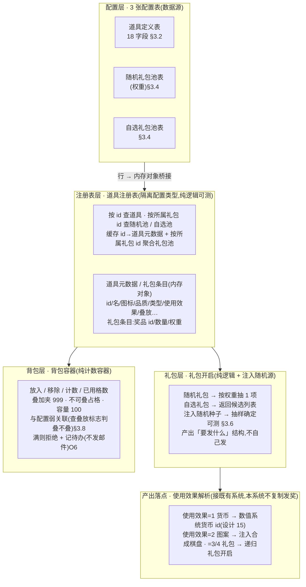
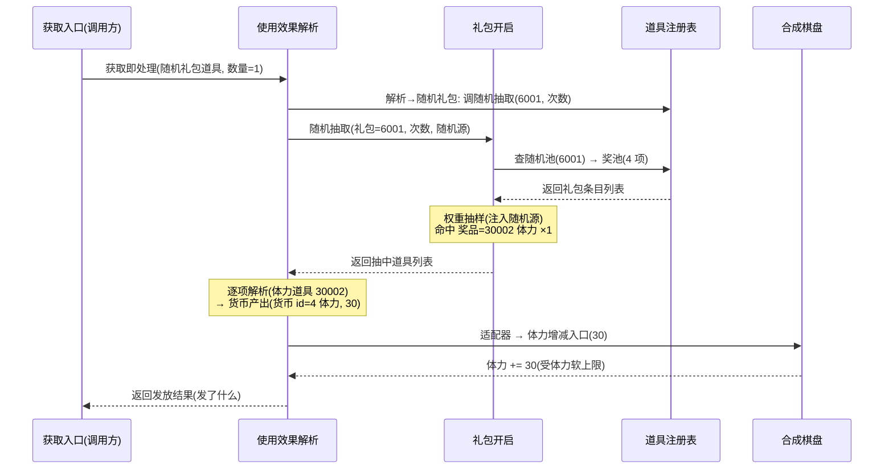

# 道具底层系统

用一张道具表统一登记每件道具的**名称 / 描述 / 图标 / 品质 / 类型 / 使用效果 / 叠放规则**;运行期按道具 id 查道具元数据;实现**礼包开启**(随机礼包按权重抽、自选礼包返回可选列表),产出经「使用效果」落到对应系统(货币→[数值系统](#15-numeric-system)、图案→合成棋盘);并提供**基础背包容器**(计数 + 叠加上限 999 + 不可叠加单独占格 + 容量上限 100)。**加法式**:新建一层道具抽象 + 配置 + 纯逻辑,<mark>不重构既有货币 / 图案系统</mark>,旧路径零行为变化。

> [!WARNING]
> **读前必看 · 设计边界**
>
> 五条边界先钉死,防止把「新增一层抽象」做成「重构」、防误改既有内容:
>
> - **新建道具定义表,不改造既有的服装模板示例表。**框架自带一张服装模板示例道具表(衣服 / 裙子 / 鞋子 / 帽子,带价格 / 升级目标 / 兑换流字段),字段与本系统所需不兼容、且无任何运行期业务消费它。本系统**新建一张独立的道具定义表**与之并存互不干扰(理由详 [§3.1](#16-item-system::fork))。
> - **新建 6 档品质枚举,不复用既有 4 档品质枚举。**既有品质枚举只有白 / 蓝 / 紫 / 红 4 档,色序与本系统所需(1 白 / 2 绿 / 3 蓝 / 4 紫 / 5 橙 / 6 红)**不一致且档数不够**;它被服装模板表引用,改它会动到模板示例。新建独立 6 档枚举,详 [§3.3](#16-item-system::enum)。
> - **礼包开启 / 背包是纯逻辑,可单测;配置加载分两条路。**「按权重抽奖」「自选礼包返回可选列表」「背包计数 / 叠加 / 占格」都是纯内存逻辑,可直接断言、不碰资源加载层。权重抽样接受外部注入的随机源(种子可控)使**抽样结果确定可测**。配置表运行期加载走异步资源管线;离线单测直读已导出的二进制配置文件,绕过资源管线(详 [§3.5](#16-item-system::registry))。
> - **产出落点复用既有系统,不另起炉灶。**「使用效果=1(货币)」落到[数值系统](#15-numeric-system)约定的货币 id;「使用效果=2(图案)」把图案注入合成棋盘。道具系统只产出「要发什么」的结构,**由调用方接到既有发奖入口**,本系统不复制发奖逻辑(详 [§3.7](#16-item-system::useeffect))。
> - **限时 / 邮件补偿 / UI 跳转本设计全部不做(自身依赖未建系统)。**限时整套(限时标志 / 限时时间 / 到期补偿 / 补偿邮件)、背包溢出邮件补发、获取跳转、真实图标 / 特效——这些**字段照样进表**(为后续不返工),但运行期**留空挂起**:不做到期检测 / 补偿 / 邮件 / UI;背包满本设计**拒绝并记待办**不发邮件;资源名占位(详 [§七](#16-item-system::open) 各 O 项 + 风险表)。

> [!NOTE]
> **立项信息**
>
> | 项 | 内容 |
> | --- | --- |
> | **类型** | 新系统 · 配置化道具底层。出设计稿 + 验收标准,交开发落地。 |
> | **设计前提** | 复用既有的配置表管线(源表 → 导表 → 运行期加载);承接已落地的[数值底层系统](#15-numeric-system)(货币 id 约定:1 经验 / 2 虔诚币 / 3 钻石 / 4 体力) + 已落地的合成棋盘(图案注入入口、9 种图案、各货币持有量)。 |
> | **方向约束** | 离线还原 · **去变现**(本表不含任何充值 / 内购 / 计价字段;道具仅作游戏内获取 / 使用登记)。加法式扩展,不破坏现有核心循环 + 已建系统(数值 / 存档 / 盲盒 / 神庙)。磁盘 IO 走异步规范。既有自动化测试零回归。 |
> | **交付内容** | 3 张配置表:道具定义表(18 字段)+ 随机礼包池表 + 自选礼包池表;2 个枚举:6 档品质枚举 / 道具类型枚举;运行期道具注册表(配置行 → 内存对象桥接 + 按 id 查) + 纯逻辑礼包开启(权重抽样 + 自选列表) + 使用效果解析(产出结构) + 背包容器。**既有货币 / 图案 / 数值系统读写零改动;旧路径零行为变化。** |
> | **关键约束** | 礼包抽样 / 背包 / 使用效果解析为纯逻辑,可脱离资源管线与运行时直接构造单测;权重抽样注入随机种子使确定可测;配置表离线测试直读已导出的二进制文件。 |

## 一、做什么与为什么 {#what}

现状:游戏里的「可获取物」分散在各处——货币由合成棋盘各持有量字段持有([数值系统](#15-numeric-system)登记元数据),图案是棋盘上的一类元素,盲盒奖励是另一套结构。但**没有一个统一的「道具」概念**把这些「能被领取 / 持有 / 使用」的物品登记成一张表:每种新道具(材料、功能材料、礼包)都得重新定义结构、各写一套获取逻辑。设计目的正是「各类道具信息,前端显示 + 后端记录」——补的是道具的**元数据层 + 获取层 + 持有层**。

本系统三件事:(1) 用一张道具表登记每件道具「是什么」(名 / 描述 / 图标 / 品质 / 类型 / 使用效果 / 叠放),运行期按 id 查;(2) 实现**礼包开启**——随机礼包按权重抽、自选礼包返回可选列表,开出的奖励经「使用效果」落到对应既有系统;(3) 提供**基础背包容器**——计数、叠加上限 999、不可叠加单独占格、容量上限 100。逐条对应需求:

| # | 需求 | 本篇落法 | 状态 |
| --- | --- | --- | --- |
| 1 | 道具表:id / 名 / 描述 / 图标 / 品质 / 特效 / 自动使用 / 类型 / 参数 / 使用效果 / 叠放 / 限时整套 / 跳转列表 | 18 字段落道具定义表([§3.2](#16-item-system::schema));品质 / 类型各用专属枚举 | 新增表 |
| 2 | 品质 1 普通白 / 2 高级绿 / 3 精英蓝 / 4 史诗紫 / 5 传说橙 / 6 神话红 | 新建 6 档品质枚举(不复用 4 档既有枚举,[§3.3](#16-item-system::enum)) | 新增枚举 |
| 3 | 类型 1 货币 / 2 材料 / 3 功能材料 / 5 自选礼包 / 6 随机礼包 | 新建类型枚举,类型作分类 / 背包归类([§3.3](#16-item-system::enum)) | 新增枚举 |
| 4 | 随机礼包表(行主键 / 所属礼包 / 奖品 / 数量 / 权重)+ 自选礼包表(同字段) | 两张礼包池表,按所属礼包 id 聚合成礼包池([§3.4](#16-item-system::packs)) | 新增表 |
| 5 | 使用效果:1 获取对应货币(复用数值系统)/ 2 获取图案(注入棋盘)/ 3 自选礼包 / 4 随机礼包 | 解析使用效果 → 产出结构,落既有发奖路径([§3.7](#16-item-system::useeffect)) | 新增解析 |
| 6 | 礼包开启:随机按权重抽、自选返回可选列表 | 随机礼包权重抽一项 / 自选礼包返回候选列表([§3.6](#16-item-system::gift)) | 新增逻辑 |
| 7 | 可叠放同 id 叠加上限 999,超过显示 999+;不可叠加单独占格;后端最大 100 格 | 背包容器:叠加夹 999 / 占格 / 容量 100([§3.8](#16-item-system::bag)) | 新增容器 |
| 8 | 限时(限时标志 / 限时时间 / 到期补偿 / 补偿邮件) | 字段进表,运行期**留空挂起**:不做到期检测 / 补偿 / 邮件(依赖未建系统,[§七 O5](#16-item-system::open)) | 字段进表·逻辑挂起 |
| 9 | 背包溢出邮件补发;获取跳转;真实图标 / 特效 | 容量满**拒绝 + 记待办**(不发邮件);跳转列表进表不接 UI;资源名占位([§七 O6/O7/O8](#16-item-system::open)) | 字段进表·不接 |

**不做(本设计明确排除):**充值 / 内购 / 计价(去变现);限时到期检测 / 到期补偿 / 邮件补发(依赖未建系统,字段进表逻辑挂起,[§七 O5](#16-item-system::open));背包溢出邮件补发(邮件未建,仅容量上限,[§七 O6](#16-item-system::open));获取跳转 UI(字段进表不接,[§七 O7](#16-item-system::open));真实图标 / 特效(无美术,资源名占位,[§七 O8](#16-item-system::open));道具背包 / 礼包开启 UI 界面(本设计交付数据层 + 纯逻辑,UI 投放独立后续,[§七 O9](#16-item-system::open));把货币数量值迁进背包统一持有(货币数量仍由合成棋盘各持有量字段持有,[§七 O4](#16-item-system::open))。

## 二、系统模型 {#model}

### 2.1 四层分层(配置 / 注册表 / 礼包 / 背包) {#layers}

系统拆四层,各层职责单一、各自可测。配置层是数据源(3 张配置表),注册表层把表行桥接成内存对象并按 id 索引(隔离配置生成类型),礼包层是吃注册表 + 随机数的纯逻辑(产出「要发什么」的结构),背包层是与配置无关的纯计数容器。产出落点(使用效果)接到既有系统,本系统不持有发奖逻辑。结构图:

**为什么这样切:**注册表层桥接成内存对象让查询逻辑<mark>不直接依赖配置生成类型</mark>——与数值系统注册表同款做法。礼包层把随机数<mark>从外部注入</mark>,所以抽样在单测里可用固定种子复现,这是「权重抽样确定性」验收点的地基。产出解析故意只产出「要发什么」的结构、不自己发奖,这样它的单测只断言「解析出的产出结构对不对」,不需要拉起整个棋盘状态;真正的发放由调用方接到既有入口,避免本系统复制一份发奖逻辑导致两处漂移。

### 2.2 加法式接入(与数值 / 图案系统的关系) {#additive}

本系统不重构任何既有系统,只**新增**道具这一层抽象,通过「使用效果」字段与既有系统弱关联:

| 既有系统 | 本系统怎么用它 | 动它吗 |
| --- | --- | --- |
| [数值系统(货币 id)](#15-numeric-system) | 使用效果=1 的道具,其关联字段指向某货币 id;产出「(货币 id, 数量)」,由调用方接到货币增减 | 否(只读货币 id 约定) |
| 合成棋盘图案 + 图案注入入口 | 使用效果=2 的道具,产出「(图案, 等级, 数量)」,调用方接到既有图案注入入口 | 否(只调既有入口) |
| 货币持有量(体力 / 虔诚币 / 经验…) | 不改字段、不迁数量值进背包;货币数量仍各持有量字段持有(全面迁移见 [§七 O4](#16-item-system::open)) | 否 |
| 盲盒奖励 | 不耦合;道具礼包是独立获取通道,与盲盒并存 | 否 |

背包本设计持有的是**材料 / 功能材料**这类「需要进背包格子」的道具。货币与图案走各自既有系统、<mark>不进背包格子</mark>(它们没有「100 格上限」语义)。背包归类按道具类型划分([§3.8](#16-item-system::bag))。

## 三、设计正文 {#numbers}

### 3.1 新建 vs 扩展既有道具表(决策与理由) {#fork}

框架自带一张服装模板示例道具表。先核实、评估「扩展 vs 新建」。核实结论:

| 核实项 | 现状 |
| --- | --- |
| 既有道具表内容 | 10 行**模板示例**:衣服 / 裤子 / 裙子 / 帽子 / 鞋子等服装,字段为 id / 名 / 描述 / 价格 / 升级目标道具 / 过期时间 / 可批量使用 / 品质 / 兑换流 / 兑换列表 / 兑换列 |
| 运行期消费者 | <mark>无</mark>。仅生成代码引用,无任何业务代码引用 |
| 字段兼容性 | 与本系统所需冲突:价格(计价,触去变现红线)、升级目标道具(装备升级,本系统无此概念)、兑换流 / 列表 / 列(兑换流,本系统无)。本系统需要的特效 / 自动使用 / 类型 / 使用效果 / 叠放 / 限时 / 跳转列表等 11 个字段现表全无 |
| 品质枚举 | 既有品质枚举仅白 / 蓝 / 紫 / 红 4 档,色序(白蓝紫红)与本系统所需(白绿蓝紫橙红 6 档)不一致 |

**决策:新建,不扩展。**理由:① 现表是框架自带的**模板示例**(连同其他示例配置一起存在),并非本游戏的真实道具表,扩展它等于把模板示例改成生产表、且要删它带的 10 行无关数据;② 字段冲突严重——保留价格 / 升级目标 / 兑换流是垃圾字段,删它们又会破坏现有(虽无业务消费但)生成代码与导出文件;③ 品质枚举档数 / 色序都对不上,改它会动到模板表的引用。新建独立道具定义表 + 6 档品质枚举与模板并存,互不干扰,回归最干净。

> [!NOTE]
> **命名:**新表为「道具定义表」,与既有服装模板表并列、文件名不撞。**命名理由:**「道具定义」区别于将来可能的「道具运行期实例」;不用无语义的派生编号名(违 conventions 规则 5 公共词汇)。

### 3.2 道具表字段定义 {#schema}

道具定义表落 18 字段。按 id 建主键、按 id 索引为映射表。所有字段客户端 + 服务端都导出。

| 字段 | 类型 | 说明 | 备注 |
| --- | --- | --- | --- |
| id | 整数 | 道具唯一 id(主键) | 索引键 |
| 名 | 整数 | 道具名(关联多语言文本表 ID) | 文本 id,非字面串 |
| 描述 | 整数 | 道具描述(关联多语言文本表 ID) | 文本 id |
| 图标 | 串 | 图标资源名 | 占位名(无美术 O8) |
| 品质 | 品质枚举 | 品质(1–6) | 枚举 §3.3 |
| 特效 | 串 | 图标特效 id / 路径 | 占位(无美术 O8) |
| 自动使用 | 整数 | 获得时是否自动使用(0 否 / 1 是) | 0/1,决定是否立即结算 |
| 类型 | 类型枚举 | 道具类型(分类 / 背包归类) | 枚举 §3.3 |
| 参数 | 整数 | 自选 / 随机礼包奖励数量 | 礼包开几次 / 数量 |
| 使用效果 | 整数 | 1 货币 / 2 图案 / 3 自选礼包 / 4 随机礼包 | 解析见 §3.7 |
| 效果目标 | 整数 | 使用效果=1 时货币 id / =2 时图案 / =3 时自选礼包 / =4 时随机礼包 | **新增辅助字段**,见下「字段补充说明」 |
| 效果数量 | 整数 | 使用效果=1 货币数量 / =2 图案数量 | **新增辅助字段** |
| 图案等级 | 整数 | 图案等级(使用效果=2 时,1–3;其余填 0) | **新增辅助字段** |
| 叠放 | 整数 | 可叠放(0 否 / 1 是;叠加上限 999) | 背包用 §3.8 |
| 限时 | 整数 | 限时(0 非限时 / 1 指定日期 / 2 指定时长) | **逻辑挂起**:进表不检测 O5 |
| 限时提示 | 整数 | 限时提示(文本 id) | 挂起 O5 |
| 限时时间 | 串 | 限时时间(日期串 / 时长秒) | 挂起 O5 |
| 到期补偿 | 整数 | 到期补偿(奖励表 id) | 挂起 O5(奖励表未建) |
| 补偿邮件 | 整数 | 补偿邮件(邮件 id) | 挂起 O5(邮件未建) |
| 跳转列表 | 整数数组 | 获取跳转列表 | 进表不接 UI O7 |

> [!NOTE]
> **字段补充说明(为何拆出效果目标 / 效果数量 / 图案等级):**「使用效果」浓缩成一个标志(1–4)+「参数」字段,但实际「获取 5000 经验」「获取 3 个二级钻石图案」需要**目标 id + 数量 + 等级**三段信息,单一「参数」字段表达不下。拆成效果目标(目标 id)/ 效果数量(数量)/ 图案等级三列,语义清晰、可校验。原「参数」字段保留,语义收窄为「礼包奖励数量 / 开启次数」(使用效果=3/4 时用),避免与效果数量混淆。**这是设计补充,非偏离需求——需求字段全部保留,只是把过载的「参数」拆清。**列入 <a href="#16-item-system::open">§七 O2</a> 供确认。

### 3.3 品质 / 类型枚举 + 样例数据 {#enum}

**品质枚举**(6 档,取值唯一):

| 档位 | 名称 | 值 | 颜色 |
| --- | --- | --- | --- |
| 普通 | 普通 | 1 | 白 |
| 高级 | 高级 | 2 | 绿 |
| 精英 | 精英 | 3 | 蓝 |
| 史诗 | 史诗 | 4 | 紫 |
| 传说 | 传说 | 5 | 橙 |
| 神话 | 神话 | 6 | 红 |

**类型枚举**(以需求「类型说明」为准——值跳过 4,需求未定义 4):

| 类型 | 名称 | 值 | 含义 |
| --- | --- | --- | --- |
| 货币 | 货币 | 1 | 走数值系统,不进背包格 |
| 材料 | 材料 | 2 | 进背包,可叠放 |
| 功能材料 | 功能材料 | 3 | 进背包,可叠放 |
| 自选礼包 | 自选礼包 | 5 | 开启返回候选列表 |
| 随机礼包 | 随机礼包 | 6 | 开启按权重抽 |

注:需求类型说明里没有值=4,枚举照需求跳过 4(允许取值不连续)。若后续要补 4,直接加行即可。

**道具表样例数据(覆盖类型各类 + 使用效果各值,至少 8 行):**

| id | 名 | 类型 | 使用效果 | 效果目标 | 效果数量 | 图案等级 | 参数 | 叠放 | 品质 | 说明 |
| --- | --- | --- | --- | --- | --- | --- | --- | --- | --- | --- |
| 30001 | 110001 | 1 货币 | 1 货币 | 1(经验) | 5000 | 0 | 0 | 0 | 1 | 经验道具:领取 +5000 经验 |
| 30002 | 110002 | 1 货币 | 1 货币 | 4(体力) | 30 | 0 | 0 | 0 | 1 | 体力道具:领取 +30 体力 |
| 30003 | 110003 | 2 材料 | 0 无 | 0 | 0 | 0 | 0 | 1 | 2 | 普通材料:进背包可叠放(使用效果=0=纯持有) |
| 30004 | 110004 | 3 功能材料 | 2 图案 | 100(钻石) | 2 | 2 | 0 | 1 | 3 | 功能材料:用后得 2 个二级钻石图案 |
| 30005 | 110005 | 5 自选礼包 | 3 自选 | 5001(自选礼包) | 0 | 0 | 1 | 0 | 4 | 自选礼包:开启选 1 项 |
| 30006 | 110006 | 6 随机礼包 | 4 随机 | 6001(随机礼包) | 0 | 0 | 1 | 0 | 5 | 随机礼包:开启抽 1 项 |
| 30007 | 110007 | 6 随机礼包 | 4 随机 | 6001 | 0 | 0 | 3 | 0 | 6 | 随机礼包(参数=3):开启抽 3 次 |
| 30008 | 110008 | 2 材料 | 0 无 | 0 | 0 | 0 | 0 | 0 | 2 | 不可叠放材料:单独占格(叠放=0) |

其中 30007 的参数=3 表示开启时抽 3 次(自选礼包参数表示可选数;随机礼包参数表示抽几次)。30008 叠放=0 用于验证背包占格逻辑。限时字段所有样例行填 0(本设计逻辑挂起,不做限时)。

### 3.4 随机 / 自选礼包表 + 样例 {#packs}

两张礼包池表结构相同,按行主键索引为映射表,按「所属礼包 id」字段聚合成一个礼包池。客户端 + 服务端都导出。

**随机礼包表:**

| 字段 | 类型 | 说明 |
| --- | --- | --- |
| 行主键 | 整数 | 行主键(索引键) |
| 所属礼包 | 整数 | 所属礼包 id(同所属礼包 id 的行 = 一个奖池) |
| 奖品 | 整数 | 奖品道具 id(指向道具定义表;见下注) |
| 数量 | 整数 | 该奖品数量 |
| 权重 | 整数 | 权重(非概率;抽中概率 = 权重 / 同礼包全部权重之和) |

注:奖品指向道具定义表的 id。礼包开出某道具后,该道具自己的「使用效果」决定它落哪(货币 / 图案 / 嵌套礼包)。即礼包奖品本身也是「道具」,产出统一走使用效果解析(§3.7),奖池只描述「开出哪个道具 × 数量」。

**随机礼包样例(所属礼包=6001,4 项,权重和 100):**

| 行主键 | 所属礼包 | 奖品 | 数量 | 权重 | 抽中概率 |
| --- | --- | --- | --- | --- | --- |
| 1 | 6001 | 30001(经验道具) | 1 | 50 | 50% |
| 2 | 6001 | 30002(体力道具) | 1 | 30 | 30% |
| 3 | 6001 | 30004(钻石图案道具) | 1 | 15 | 15% |
| 4 | 6001 | 30003(普通材料) | 2 | 5 | 5% |

**自选礼包表:**字段同上(行主键 / 所属礼包 / 奖品 / 数量 / 权重)。权重在自选礼包里仅作展示排序 / 保留字段(自选不抽,玩家手选),开启返回该礼包的全部候选项。

**自选礼包样例(所属礼包=5001,3 项):**

| 行主键 | 所属礼包 | 奖品 | 数量 | 权重 |
| --- | --- | --- | --- | --- |
| 1 | 5001 | 30001(经验道具) | 1 | 0 |
| 2 | 5001 | 30002(体力道具) | 1 | 0 |
| 3 | 5001 | 30004(钻石图案道具) | 1 | 0 |

### 3.5 运行期道具注册表(加载 + 查询) {#registry}

道具注册表持懒加载缓存,把配置行桥接成内存对象,提供按 id / 所属礼包 id 查。内存对象隔离配置生成类型,业务侧只认内存对象。

**内存数据模型:**

- **道具元数据**:承载道具定义表全部 18 字段的对应语义——id / 名 / 描述 / 图标 / 特效、品质(底层值 1–6)、自动使用(0/1)、类型、参数(礼包奖励数量 / 开启次数)、使用效果(0 无 / 1 货币 / 2 图案 / 3 自选 / 4 随机)、效果目标 / 效果数量 / 图案等级、叠放(0/1)、限时整套(挂起)、跳转列表(不接 UI)。
- **礼包条目**:奖品 id / 数量 / 权重三段。

**查询行为:**

- 按 id 查道具元数据:查不到返空(不抛),由调用方判空。
- 按所属礼包 id 查随机池 / 自选池:按所属礼包 id 聚合返回该礼包的条目列表;查无返空集合(不抛)。

**配置加载分两路:**运行期经异步资源管线加载三张表;离线单测直读已导出的二进制配置文件,绕过资源管线。注册表另提供「直接注入内存数据」的测试入口,使礼包 / 背包 / 使用效果解析的纯逻辑无需任何配置文件即可单测。

### 3.6 礼包开启(权重抽样 + 自选列表) {#gift}

礼包开启是吃注册表 + 注入随机数的纯逻辑。**随机礼包:**按权重抽。**自选礼包:**返回候选列表交 UI 选。

**权重抽样算法(确定可测):**单次抽样从外部注入随机源(种子可控、单测可复现):

1. 空奖池返空,由调用方判空。
2. 累加全部条目权重为权重总和,**负权重当 0**(防配置笔误污染分布)。
3. 权重总和 ≤0(全 0 权重)时退化取第一项(不抛,避免除零 / 死循环)。
4. 在 [0, 权重总和) 内取随机点,沿条目累加权重,随机点首次落入哪个条目的累加区间即命中该条目。
5. 浮点 / 边界兜底:取最后一项。

**开 N 次**(参数=抽几次,N≤0 当 1 次):每次独立抽(放回),逐次收集命中条目成列表。

**自选礼包:**直接返回该礼包的候选列表(不抽,交 UI 选)。

**抽样确定性验收的地基:**同一随机种子 + 同一奖池,抽样必返同一项。单测用固定种子断言「抽 N 次的结果序列等于预期序列」;再用大样本(如 10000 次)断言「各项命中频率落在权重比例 ±容差内」(统计意义验权重生效,不依赖具体种子)。

**边界逐档(权重抽样):**

| 输入 | 行为 | 理由 |
| --- | --- | --- |
| 空奖池 / 礼包查无 | 返空(开启时跳过) | 不抛,调用方判空 |
| 单项奖池 | 必中该项 | 权重总和=该项权重,随机点恒落第一项 |
| 全 0 权重 | 退化取第一项 | 避免除零 / 死循环;配置错误时不崩 |
| 含负权重 | 负权重当 0 | 防配置笔误污染分布 |
| 抽取次数 ≤0 | 当 1 次 | 至少开 1 次 |

### 3.7 使用效果产出落点 {#useeffect}

使用效果解析把一个「道具 × 数量」解析成「要发什么」的产出结构,**不自己发奖**,由调用方接到既有系统。这样解析单测只断言「解析对不对」,不拉起棋盘状态。

**产出结构**含五段:产出种类(无 / 货币 / 图案 / 自选礼包 / 随机礼包)、目标 id(货币=货币 id / 图案=图案标识 / 礼包=礼包 id)、数量(货币 / 图案数量)、图案等级、礼包开启次数。

**单个道具的解析(不发,只产出):**

| 使用效果 | 产出种类 | 目标 id | 数量 | 等级 | 次数 |
| --- | --- | --- | --- | --- | --- |
| 1 | 货币 | 效果目标(货币 id) | 效果数量 × 道具数量 | — | — |
| 2 | 图案 | 效果目标(图案标识) | 效果数量 × 道具数量 | 图案等级 | — |
| 3 | 自选礼包 | 效果目标(礼包 id) | — | — | 参数 |
| 4 | 随机礼包 | 效果目标(礼包 id) | — | — | 参数 |
| **5** | **EVENT 解锁** | **效果目标(头像 / 框 id,指向 avatar 表)** | **道具数量(适配器忽略,恒按 1 解锁)** | — | — |
| 0 | 无(纯持有材料) | 道具 id | 道具数量 | — | — |

**调用方落点(本系统提供「适配器」示范但不强制接 UI):**

| 产出种类 | 落点(既有系统) | 本系统做到哪 |
| --- | --- | --- |
| 货币 | 货币 id 对应持有量:体力 / 经验 / 虔诚币 / 钻石(数值系统约定字段) | 产出「(货币 id, 数量)」;适配器把货币 id 映射到既有货币增减入口(给一份货币适配示范) |
| 图案 | 既有图案注入入口 | 产出「(图案, 等级, 数量)」;适配器调既有图案注入 |
| 自选礼包 | 返回候选列表交 UI(UI 本设计不接) | 产出礼包 id + 次数;调自选列表 |
| 随机礼包 | 递归:抽出的道具再解析 + 落点 | 产出礼包 id + 次数;调随机抽取再逐项解析 |
| **EVENT 解锁** | **[18 §3.6 AvatarUnlockService.GrantUnlock](#18-player-info::unlock):把头像 / 框 id 写进 `PlayerInfo.UnlockedAvatarIds` 或 `UnlockedFrameIds`(由 AvatarEntry.Type 自动分流)** | **产出「(头像 / 框 id, 1)」;适配器查 [AvatarConfigMgr.GetAvatar(targetId)](#18-player-info) 得 entry → 调 `GrantUnlock(player, entry)`(已含则幂等)。落盘由调用方按 [41 §3.5 D3](#41-event-unlock-client::adapter) 触发 `SavePlayer`。** |
| 无(纯材料) | 进背包 | 适配器把材料放进背包 |

注:图案产出的目标 id 存图案的标识值(如钻石对应一个约定整数值,各图案标识值见合成棋盘约定)。适配器把目标 id 转回图案标识。

**自动使用字段:**自动使用=1 的道具,获取时立即解析 + 落点(不进背包);自动使用=0 的进背包待用户手动用。本系统提供「获取即处理」入口读自动使用字段,决定走「立即结算」还是「进背包」两条路。

> [!NOTE]
> **EVENT 类使用效果(`使用效果=5`)— 活动发放头像/框解锁通路接缝** {#useeffect-event}
>
> 头像与头像框的「活动发放」三态([设计 18 §3.6](#18-player-info::unlock))需要一条「服务端活动达标 → 邮件礼包奖励 → 客户端落地把 id 写进玩家已解锁集合」的通路。沿用本系统既有「礼包 → 道具 → 使用效果解析 → 适配器落点」范式接入,**不在 SendMailTo 签名 / 邮件领取响应里加旁路标记**。
>
> | 使用效果 | 产出种类 | 目标 id | 数量 | 等级 | 次数 |
> | --- | --- | --- | --- | --- | --- |
> | 5 | EVENT 解锁 | 效果目标(头像/框 id,指向 [18 §3.5](#18-player-info::schema) 表) | 1 | — | — |
>
> **调用方落点(EVENT)**:产出「(头像/框 id, 1)」;适配器调 `AvatarUnlockService.GrantUnlock`(客户端进程内 API,[设计 18](#18-player-info::unlock) §3.6 旁注「真实『发放』动作 = 把 id 加进该玩家的已解锁集合」),把 id 加入 `PlayerInfo.UnlockedAvatarIds` 或 `UnlockedFrameIds`(按头像表「类型」字段区分)。已含则幂等无操作。
>
> **服务端段(Tier 4 第 2 子单 server 段)交付**(已 PASS Fantasy `bafed768` + 设计稿 `d3e3b4fd`):服务端 `AuthoritativeDefs` 加 EVENT 活动实例(`activity_id=2, target=7, reward=6101`)+ `GiftPoolSeeds` 加 EVENT 礼包条目(`Index=6101 → ItemId=30101 × 1, Rate=100` 单项必中);服务端工程无 Luban,只守 `(道具 id=30101, 数量=1)` 抵达邮件附件。
>
> **客户端段(Tier 4 第 2 子单 client 段)交付**(由 [设计 41](#41-event-unlock-client) 兑现):① 客户端 `itemdef.xlsx` 加 1 行 EVENT 解锁道具(`id=30101, use_effect=5, use_value=3 指 avatar id=3 avt_star, automatic=1 立即结算, type=MATERIAL`,详 [41 §3.2](#41-event-unlock-client::item));② 客户端 `giftrandom.xlsx` 加 1 行 EVENT 礼包(`index=6101, item_id=30101, num=1, rate=100`,与 server `GiftPoolSeeds` 共识对齐,详 [41 §3.3](#41-event-unlock-client::gift));③ 本系统 `ItemGrant.cs` 扩 `GrantKind.EventUnlock` 枚举档 + `Resolve` switch 加 `case 5: return GrantPayload(EventUnlock, use_value, count, 0, 0)` + `ResolveAndApply` switch 加 `case GrantKind.EventUnlock` 分支(取 `GameContext.Instance?.Player` + `AvatarConfigMgr.GetAvatar(targetId)` → 都非 null → `AvatarUnlockService.GrantUnlock(p, e)`,详 [41 §3.4-3.5](#41-event-unlock-client::parse));④ 三处领奖路径(`MailboxService.ClaimMail` / `RemoteMailService.OnClaimResp` / `RedeemService.Apply`)按 [41 §3.5 D3](#41-event-unlock-client::adapter) 在 `GrantOnAcquire` 调用后核对 `produced` 列表含 `EventUnlock` 时触发 `GameContext.Instance?.SavePlayer()` 落盘。**注**:客户端 `use_effect` 字段是 `int`(非枚举),无需在 `__enums__.xlsx` 加 `EUseEffect.EVENT` 枚举档,`use_effect` 列直接填整数 `5`。
>
> **「为什么不在 ActivityDef 加 EventUnlockId 字段 / 不在邮件 reward 列表附 EVENT 标记」**:沿 16 现有道具系统,EVENT 解锁就是「一个特殊使用效果的道具」,经礼包随机库携带(同货币 / 图案道具一样)。在 [设计 39 ActivityDef](#39-activity-server::config) 的 `reward` 字段填 EVENT 礼包 id(如 `reward=6101`)即可,**不需要在 39 ActivityDef 加新字段、不需要在 32 SendMailTo 签名加 EVENT 参数、不需要扩邮件领取响应**——这条通路与现有所有奖励(货币 / 图案 / 嵌套礼包)走同一条「道具 → 使用效果 → 适配器」路径,正交扩展,守 [设计 32 §3.5 SendMailTo 入口](#32-mail-server::source-api) 签名不变。

### 3.8 基础背包容器(叠加 / 上限 / 占格) {#bag}

背包是与配置弱关联的纯计数容器:持有「道具 id → 数量」,叠加规则查道具的「叠放」标志决定。

| 规则 | 值 | 行为 |
| --- | --- | --- |
| 叠加上限 | 999 | 同 id(叠放=1)累加,夹到 999;超出部分本设计**丢弃 + 记待办**(邮件补发 O6) |
| 显示 | 999+ | 数量 ≥999 显示 "999+"(数量格式化为纯函数:小于 999 原值,≥999 返 "999+") |
| 占格(可叠) | 1 格 / id | 叠放=1:同 id 不论数量占 1 格 |
| 占格(不可叠) | 个数格 | 叠放=0:每个占 1 格,N 个占 N 格 |
| 容量上限 | 100 格 | 已用格 + 新增格 >100 → 本设计**拒绝该次放入(返回实际放入量)+ 记待办**(不发邮件 O6) |

**容器接口(行为级):**叠加上限 999、容量上限 100 格为常量;对外提供放入(返回实际放入量,容量 / 叠加上限可能小于请求量,差额记待办)、移除、按 id 计数、已用格数(= 可叠种类数 + 不可叠个数总和)、数量格式化(≥999 → "999+")。内部按「可叠:id→总数」与「不可叠:id→个数(每个占 1 格)」两部分计账。

**容量判定逐档:**

| 场景 | 行为 |
| --- | --- |
| 可叠 id 已在背包,加量 | 不占新格,数量累加夹 999;超 999 的差额丢弃记待办 |
| 可叠 id 新进,有空格 | 占 1 格,放入 min(请求量, 999) |
| 可叠 id 新进,无空格 | 拒绝,返回 0,记待办(O6) |
| 不可叠 id,空格 k 个,放 N 个 | 放入 min(N, k) 个,占 min(N, k) 格;差额拒绝记待办 |
| 移除到 0 | 删该 id,释放格子 |

**背包持久化:**本设计背包**不接存档**(纯内存容器)。接入跨会话存档(序列化进 [设计 14](#14-save-system) 的存档结构)列为后续,见 [§七 O10](#16-item-system::open)。本设计验收只锚在内存容器的纯逻辑断言。

## 四、礼包开启时序 {#flow}

以「玩家获取一个随机礼包道具(自动使用=1)」为例,展示从获取到产出落地的调用链。参与方:获取入口(调用方)→ 使用效果解析 → 礼包开启 → 道具注册表 → 既有系统(合成棋盘)。

关键点:抽样发生在礼包开启内、注入随机源;抽中的「道具」再回使用效果解析二次解析(随机礼包的奖品可能又是货币 / 图案 / 嵌套礼包),最终货币 / 图案落到既有合成棋盘入口。使用效果解析与礼包开启全程不直接写棋盘状态,只产出结构 + 经适配器调既有入口——这条边界让两者可纯逻辑单测。

## 五、接入约束 {#hook}

本系统全部为新增,与既有系统的关系是**只调用、不修改**:货币 / 图案产出经适配器接到既有货币增减入口与既有图案注入入口,本系统不改既有货币持有量、不改既有图案系统、不改数值系统、不动既有服装模板道具表。既有自动化测试应零回归(本系统不改任何既有代码路径)。

具体接到哪些既有入口、新增内容如何分文件组织,属实现层,由开发决定。

## 六、验收点 {#accept}

每条可逐条核对。配置类(C)校验导出的配置数据;其余(R/G/U/B)为脱离配置文件的纯逻辑断言。

| # | 验收点 | 完成定义 |
| --- | --- | --- |
| C1 | 道具表导出且行数对 | 加载道具定义表,行数 = 样例行数(≥8) |
| C2 | 道具字段对得上源 | 取 id=30006(随机礼包),断言类型=6 / 使用效果=4 / 效果目标=6001 / 参数=1 / 品质=5 / 叠放=0,与 §3.3 样例一致 |
| C3 | 品质枚举 1–6 齐全 | 表中品质取值覆盖 {1,2,3,4,5,6} 各至少一行;神话档值=6 |
| C4 | 类型枚举值符需求(跳过 4) | 自选礼包=5、随机礼包=6、货币=1 |
| C5 | 随机礼包表导出且按礼包聚合 | 加载随机礼包表,礼包 6001 聚合出 4 项,权重和=100 |
| C6 | 自选礼包表导出 | 加载自选礼包表,礼包 5001 聚合出 3 项 |
| R1 | 注册表按 id 查命中 / 未命中 | 查 30001 非空且字段对;查不存在的 id 返空不抛 |
| R2 | 注册表按礼包查礼包池 | 查礼包 6001 得 4 项;查无返空集合不抛 |
| R3 | 桥接保真 | 从真实配置行桥接,逐字段 == 行原值(既验桥接也验配置对得上) |
| G1 | 权重抽样确定性(种子可复现) | 同一随机种子 + 同奖池,连抽 N 次结果序列两次运行完全相同 |
| G2 | 权重分布正确(大样本) | 样例奖池抽 10000 次,各奖品命中频率落在 {50%,30%,15%,5%} ±3% 容差内 |
| G3 | 抽样边界 | 空池返空;单项池必中;全 0 权重退化取第一项;负权重当 0;抽取次数 ≤0 当 1 |
| G4 | 自选返回完整候选 | 查礼包 5001 候选 3 项,顺序 = 表内顺序 |
| U1 | 使用效果=1 解析为货币产出 | 解析经验道具×1 → 货币产出,目标=1(经验),数量=5000 |
| U2 | 使用效果=2 解析为图案产出(含等级) | 解析钻石图案道具×2 → 图案产出,目标=钻石,数量=4(效果数量 2 × 道具数量 2),等级=2 |
| U3 | 使用效果=3/4 解析为礼包 | 自选→自选礼包产出,目标=5001;随机→随机礼包产出,目标=6001,次数=参数 |
| U4 | 使用效果=0 解析为纯持有 | 解析普通材料×3 → 无效果产出(进背包路径) |
| U5 | 图案适配器落既有图案注入 | 经适配器注入后,棋盘图案库存反映注入(经既有图案注入级联) |
| B1 | 可叠加累加且占 1 格 | 同 id(叠放=1)放入两次,计数=和,已用格数=1 |
| B2 | 叠加上限 999 + 显示 999+ | 放入超 999,计数夹 999,返回实际放入量小于请求量;1500 显示 "999+" / 998 显示 "998" |
| B3 | 不可叠单独占格 | 叠放=0 的 id 放入 3 个,已用格数=3 |
| B4 | 容量上限 100 拒绝 | 占满 100 格后再放入返回 0(拒绝),已有内容不变 |
| B5 | 移除释放格子 | 移除到 0 后该 id 从背包消失,已用格数减少 |
| Z1 | 全链纯逻辑无依赖配置文件 | G/U/B 类全部脱离配置文件直接构造跑通(本身即证未触资源管线 / 运行时) |
| Z2 | 既有自动化测试零回归 | 全量跑,既有用例全绿,新增项另计 |

**BLOCKED 条件:**配置导表工具链不可达(导表失败)或编辑器自动化桥不可达 → 判 **BLOCKED** 不判 FAIL,交接区写清卡点。C 类验收依赖配置导出成功;若导表 BLOCKED,R/G/U/B 类的纯逻辑路径仍可单独跑(不依赖配置文件)。

## 七、待拍板清单 {#open}

有安全默认的已自行决策(新建表 / 6 档枚举 / 字段拆分等);此处集中列**范围开关**交裁决——均不阻塞本设计交付,默认按「本设计不做」推进。

| # | 事项 | 本设计默认 | 后续选项 |
| --- | --- | --- | --- |
| O1 | 礼包奖品是否允许直接指向「非道具」(直接指货币 / 图案) | 奖品统一是道具 id,道具自身使用效果决定落点(一层间接) | 若要奖池直接挂货币 / 图案,加奖励类型列;本设计不加,保持单一抽象 |
| O2 | 道具表把需求「参数」拆成效果目标 / 效果数量 / 图案等级 / 参数四字段 | 已拆(§3.2 字段补充说明),需求字段全保留 | 若要严格 1:1 还原需求字段,合回单「参数」+ 约定编码(不推荐,语义混) |
| O3 | 类型枚举是否补值=4 | 照需求跳过 4 | 需求后续定义 4 时直接加行 |
| O4 | 货币数量值是否迁进背包统一持有 | 否,货币仍各持有量字段持有,背包只装材料 | 全面迁移(把所有可持有物收进背包)是更大重构,单列后续 |
| O5 | 限时整套(限时标志 / 限时时间 / 到期补偿 / 补偿邮件) | 字段进表,运行期**逻辑挂起**(不检测 / 不补偿 / 不发邮件) | 奖励表 + 邮件系统建成后,加到期检测 + 补偿发放(依赖未建系统) |
| O6 | 背包溢出(超 999 / 超 100 格)邮件补发 | 差额**丢弃 + 记待办**,不发邮件 | 邮件系统建成后,溢出走邮件补发 |
| O7 | 获取跳转 | 字段进表,不接 UI | 道具获取 UI 建成后接跳转 |
| O8 | 真实图标 / 特效 | 资源名占位,不加载真实资源 | 美术到位后,图标 / 特效接异步资源加载(走异步红线) |
| O9 | 道具背包 / 礼包开启 UI 界面 | 本设计只交付数据层 + 纯逻辑,无界面 | UI 投放独立后续(仿现有窗口) |
| O10 | 背包跨会话存档 | 本设计纯内存,不接存档 | 序列化进设计 14 存档结构(扁平可序列化,与棋盘存档同口径) |

## 八、风险表 {#risk}

| 风险 | 应对 |
| --- | --- |
| 误把服装模板表当本系统的表去扩展 / 误删 | §3.1 显式决策新建独立道具定义表;标注「既有服装模板表不动」;验收 C 类校验新表区分 |
| 误复用 4 档品质枚举致档数不够 / 色序错 | §3.3 新建 6 档品质枚举;C3 验收断言枚举 1–6 齐全 |
| 配置导表环境踩坑(运行时版本 / 分组写法 / 自动导入) | 按既有导表规范处理;不可达判 BLOCKED 不判 FAIL |
| 权重抽样不确定致单测不稳定 | 抽样注入随机源,确定性验收(G1)用固定种子复现;分布验收(G2)用大样本 + 容差,不依赖具体种子 |
| 产出解析复制一份发奖逻辑致与既有系统漂移 | 产出解析只产出结构,适配器调既有发奖入口;不复制发奖算法 |
| 礼包递归(礼包开出礼包)无限循环 | 本设计样例不配自指礼包;实现递归解析时加深度上限(如 ≤5 层)防配置环 |
| 改动触碰既有用例致回归 | 本系统全新增、不改既有代码路径;Z2 验收全量跑既有用例零回归 |
| 挂起字段被后续误当已实现 | 设计稿 + 交接区显式标注 O5–O8 为挂起;道具表限时样例全填 0 |
