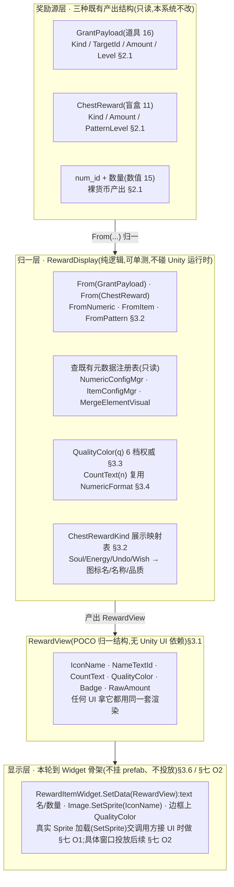
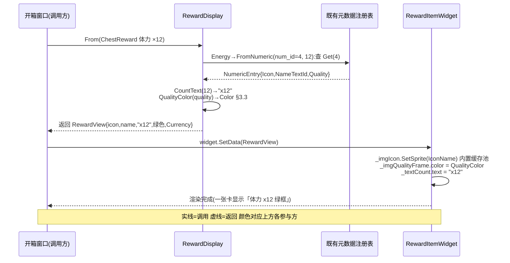

# 通用奖励展示

把游戏里<b>三种异构奖励产出</b>(道具系统 `GrantPayload` / 盲盒 `ChestReward` / 数值系统裸 num+数量)<mark>归一成一个统一的展示结构 <code>RewardView</code></mark>(图标资源名 + 名称文本 id + 数量显示文本 + 品质色 + 角标),让任何 UI(开箱三选一、礼包开启、订单交付、道具领取)<b>用同一套显示逻辑渲染奖励</b>。这是 xlsx 系统底层批次<b>第三刀</b>:补的是奖励的<b>展示归一层</b>——产出逻辑各系统已实现,本篇只做「拿到任意奖励 → 怎么显示」。<b>加法式</b>:新增纯逻辑 helper + POCO,<mark>不改任何既有产出 / 发奖路径</mark>,旧路径零行为变化。

    <b>读前必看 · 与工程现状的关系(单一事实源 = 代码)</b>
    
四条边界先钉死,防 dev 把「展示层」做成「重构产出逻辑」、防误改既有切片:

    <ul style="margin:8px 0 0">
      <li><b>只读不写既有产出结构。</b><code>GrantPayload</code>(<a href="#16-item-system">设计 16</a>,已实装 <code>ItemGrant.cs</code>)、<code>ChestReward</code>(<a href="#11-core-loop-completion">设计 11</a>,已实装 <code>ChestSystem.cs</code>)、<code>NumericEntry</code>(<a href="#15-numeric-system">设计 15</a>,已实装 <code>NumericConfigMgr.cs</code>)三个结构<mark>本系统不改一行</mark>,只读它们的字段产出 <code>RewardView</code>。发奖落点(谁加经验、谁调 AddDirect)仍归各既有系统,本系统不碰。</li>
      <li><b>归一 + 格式化是纯逻辑,可单测。</b>「<code>GrantPayload</code> → <code>RewardView</code>」「<code>ChestReward</code> → <code>RewardView</code>」「数量 → 显示文本」「品质 → 色」全是纯内存函数,EditMode / 纯 C# 单测直接断言,<mark>不碰 YooAsset / Unity 运行时</mark>。涉及 <code>NumericConfigMgr</code>(查货币元数据)的路径用既有 <code>InitForTest</code> 注入,绕 ConfigSystem。</li>
      <li><b>真实 Sprite 加载 / UI 投放本轮不做(无美术 + UI 是独立后续)。</b><code>RewardView</code> 只产出<b>图标资源名(字符串)</b>,真实 <code>Image.SetSprite(name)</code> 由调用方在接 UI 时做;本篇给一份<b>列表项 Widget 骨架</b>(<code>RewardItemWidget</code>)作接法示范,但<mark>本轮不挂 prefab、不投放到任何窗口</mark>,验收锚在纯逻辑 helper(详 <a href="#17-reward-display::open">§七 O1/O2</a>)。</li>
      <li><b>6 档品质色在本层定一份单一事实源,收编旧的 4 档。</b>既有 <code>NumericDisplay.QualityColor</code>(<a href="#15-numeric-system">设计 15</a>)是 4 档(白/蓝/紫/红),与<a href="#16-item-system">道具系统 6 档 <code>EItemQuality</code></a>(白/绿/蓝/紫/橙/红)<mark>色序不一致</mark>。本层新建权威的 6 档 <code>RewardDisplay.QualityColor</code>(<a href="#17-reward-display::quality">§3.3</a>);旧 4 档 helper 现状<b>不删</b>(它还被 <code>NumericDisplay</code> 自用,删要核 UI 引用,列独立低优先级正名任务,<a href="#17-reward-display::open">§七 O3</a>),但本层产出的 <code>RewardView.QualityColor</code> 一律走新 6 档。</li>
    </ul>
  

    <b>立项信息</b>
    <table>
      <tbody><tr><th>类型</th><td>新系统 · 奖励展示归一层 出设计稿 + 验收标准,交开发落地。xlsx 系统底层批次第三刀。<b>纯逻辑 helper + POCO,UI 投放本轮不做。</b></td></tr>
      <tr><th>设计基线</th><td>已落地的三种奖励产出结构(单一事实源 = 代码):① <a href="#16-item-system">道具系统</a> <code>GameLogic.BlockBlast.Item.GrantPayload</code>(<code>GrantKind {None,Numeric,Pattern,GiftSelect,GiftRandom}</code> + TargetId + Amount + Level + Times,见 <code>ItemGrant.cs</code>);② <a href="#11-core-loop-completion">盲盒</a> <code>GameLogic.BlockBlast.ChestReward</code>(<code>ChestRewardKind {Soul,Energy,Pattern,UndoCharge,WishCharge}</code> + Amount + PatternLevel,见 <code>ChestSystem.cs</code>);③ <a href="#15-numeric-system">数值系统</a> <code>NumericConfigMgr.Get(num_id)</code> → <code>NumericEntry</code>(IconName / NameTextId / Quality) + <code>NumericFormat.Abbreviate</code>(已实装的 0–999/K/M 缩写);④ <a href="#16-item-system">道具元数据</a> <code>ItemConfigMgr.GetItem(id)</code> → <code>ItemDef</code>(Icon / Name / Quality);⑤ <code>MergeElementVisual</code>(图案 glyph + 纯色,见 <code>MergeElementVisual.cs</code>)。</td></tr>
      <tr><th>方向约束</th><td>离线还原 · <b>去变现</b>(本层不含任何价格 / 充值显示)。加法式扩展,不破坏现有产出 / 发奖路径 + 已建系统(数值 / 道具 / 盲盒)。IO 走 TEngine 异步规范(图标真实加载用既有 <code>Image.SetSprite</code> 内置缓存池,本轮只给名字不加载)。现有 EditMode 零回归。</td></tr>
      <tr><th>影响范围</th><td>新增 POCO <code>RewardView</code>(展示归一结构)+ 静态 helper <code>RewardDisplay</code>(各源 → RewardView 转换 + 6 档品质色 + 数量文本 + 图标 / 名称解析)+ 列表项 Widget 骨架 <code>RewardItemWidget</code>(UI 接法示范,本轮不挂 prefab)。<b>既有 <code>GrantPayload</code> / <code>ChestReward</code> / <code>NumericConfigMgr</code> / <code>ItemConfigMgr</code> / <code>MergeElementVisual</code> 读写零改动;旧路径零行为变化。</b>无新增 Luban 表 / 枚举(复用既有)。</td></tr>
      <tr><th>关键约束(继承现状)</th><td>归一 / 格式化 / 品质色为纯逻辑,可在纯 C# 单测直接调(不依赖 YooAsset / Unity 运行时);涉及货币 / 道具元数据查询的路径经既有 <code>NumericConfigMgr.InitForTest</code> / <code>ItemConfigMgr.InitForTest</code> 注入(绕 ConfigSystem)。<code>RewardView</code> 是不含 Unity 类型(<code>Color</code> 除外,<code>UnityEngine.Color</code> 是值类型可在 EditMode 单测构造)的 POCO。</td></tr>
    </tbody></table>
  

<h2 id="what">一、做什么与为什么</h2>

现状:游戏里「发奖」这件事已经齐全——道具系统能产出 `GrantPayload`、盲盒能产出 `ChestReward`、数值系统能加各种货币。但<b>「把一份奖励显示给玩家看」这件事散在各处、各写一套</b>:开箱窗口要自己把 `ChestReward.Kind` 翻成「灵力 / 体力 / 图案」文案、自己挑图标、自己定颜色;将来礼包开启窗口、订单交付结算面板又要把 `GrantPayload` 翻一遍、各挑各的图标和颜色。同一个「灵力 +200」在开箱里和在订单结算里可能长得不一样,且每加一个新发奖入口就得重写一份显示逻辑。

本系统补的正是这一层<b>展示归一</b>:不管奖励从哪来(道具 / 盲盒 / 裸货币),先归一成一个统一的 `RewardView`(图标资源名 + 名称文本 id + 数量显示文本 + 品质色 + 类型角标),任何 UI 拿到 `RewardView` 用同一套渲染。三件事:

| # | 做什么 | 本篇落法 | 状态 |
| --- | --- | --- | --- |
| 1 | 定义统一展示结构 | POCO `RewardView`:IconName / NameTextId / CountText / QualityColor / Badge / RawAmount([§3.1](#17-reward-display::view)) | 新增结构 |
| 2 | 各奖励源 → RewardView 转换 | `RewardDisplay.From(GrantPayload)` / `From(ChestReward)` / `FromNumeric(num_id, amount)` / `FromItem(itemId, count)` / `FromPattern(MergeElement, level, count)`([§3.2](#17-reward-display::convert)) | 新增转换 |
| 3 | 统一品质色 + 数量文本 + 图标名 | 6 档权威品质色 `QualityColor(q)`([§3.3](#17-reward-display::quality))+ 数量文本 `CountText(n)`(复用 `NumericFormat`,[§3.4](#17-reward-display::count))+ 图标 / 名称解析([§3.5](#17-reward-display::icon)) | 新增 helper |
| 4 | 列表项渲染示范 | Widget 骨架 `RewardItemWidget.SetData(RewardView)`(UI 接法示范,<b>本轮不挂 prefab、不投放</b>,[§3.6](#17-reward-display::widget)) | 骨架·不投放 |

<b>不做(本轮明确排除):</b>价格 / 充值显示(去变现);真实 Sprite 加载(无美术,只产出图标资源名,真实 `SetSprite` 交调用方接 UI 时做,[§七 O1](#17-reward-display::open));奖励弹窗 / 三选一面板 / 结算面板等具体 UI 投放(本轮交付纯逻辑 helper + Widget 骨架,具体窗口投放是独立后续,[§七 O2](#17-reward-display::open));名称文本表查询(多语言)(文本表本轮未接,`RewardView` 给名称文本 id,真实查表 / 显示交后续,与 `NumericDisplay` 现状一致,[§七 O4](#17-reward-display::open));奖励获取动画 / 飞图标 / 数字滚动等表现(表现层独立,[§七 O5](#17-reward-display::open));改既有产出 / 发奖逻辑(本层只读不写)。

<h2 id="model">二、系统模型</h2>

<h3 id="sources">2.1 三种奖励源的现状形态</h3>

本层归一的输入是工程里已实装的三种产出结构。先把它们的真实形态钉清(字段名经 grep 实装文件核实),归一转换才能精确:

| 奖励源 | 结构(实装符号) | 关键字段 | 归一时怎么取展示元数据 |
| --- | --- | --- | --- |
| [道具系统](#16-item-system) | `GrantPayload`(`ItemGrant.cs`) | `Kind` / `TargetId` / `Amount` / `Level` / `Times` | Numeric→查 `NumericConfigMgr`;Pattern→查 `MergeElementVisual`;None(材料)→查 `ItemConfigMgr`;Gift\*→礼包占位 |
| [盲盒 / 宝箱](#11-core-loop-completion) | `ChestReward`(`ChestSystem.cs`) | `Kind {Soul,Energy,Pattern,UndoCharge,WishCharge}` / `Amount` / `PatternLevel` | Soul/Energy→映射到 num\_id 查 `NumericConfigMgr`;Pattern→查 `MergeElementVisual`;Undo/Wish→功能性占位(无 num\_id) |
| [数值系统](#15-numeric-system) | num\_id + 数量(裸值) | num\_id / amount | 直接查 `NumericConfigMgr.Get(num_id)` 拿 Icon/Name/Quality |

    <b>Soul(灵力)的 num_id 映射:</b><code>ChestRewardKind.Soul</code> 是灵力,数值系统现有约定常量是 <code>Exp=1 / Piety=2 / Diamond=3 / Energy=4</code>(<code>NumericConfigMgr</code>),<b>没有「灵力 / Soul」这一项</b>。核实:盲盒的 Soul 在既有发奖里落到哪个货币字段——经 grep,<code>ChestSystem</code> 只产出 <code>ChestReward</code>,真实发放由窗口对接 <code>MergeOrderState</code>(<code>ChestSystem.cs</code> 类注释)。<mark>灵力↔num_id 的映射现状未在 num 表登记</mark>。本层处理:<code>ChestRewardKind</code> → 展示元数据走一张<b>本层内的小映射表</b>(§3.2,Soul→图标名/名称 id/品质,不强依赖 num 表),而非假设一个不存在的 num_id。这张表是展示层私有约定,列入 <a href="#17-reward-display::open">§七 O6</a> 供 boss 确认是否补进 num 表统一。
  

<h3 id="layers">2.2 归一层 + 显示层结构</h3>

系统两层:<b>归一层</b>(各源 → `RewardView`,纯逻辑)+ <b>显示层</b>(`RewardView` → UI,本轮只到 Widget 骨架)。归一层吃既有产出结构 + 既有元数据注册表,产出与 Unity UI 无关的 `RewardView`(故可纯单测);显示层把 `RewardView` 喂给 Widget。结构图:

<b>为什么这样切:</b>把「奖励长什么样」从「奖励是什么」里抽出来,各发奖入口不再各写一份显示逻辑——加新发奖通道时只要能转成 `RewardView` 就能复用同一套渲染。归一层<mark>只读既有产出结构和元数据注册表、产出不含 Unity UI 类型的 POCO</mark>(`RewardView` 里唯一的 Unity 类型是 `Color` 值类型,可在 EditMode 单测构造),所以转换 + 格式化 + 品质色全部可纯单测——这是「展示归一可被逐条核对」验收点的地基。显示层只是把 `RewardView` 的字段贴到 UI 控件上,无业务逻辑,故本轮给骨架不投放也不影响逻辑验收。

<h2 id="numbers">三、设计正文</h2>

<h3 id="view">3.1 RewardView 归一结构</h3>

`RewardView` 是展示用的归一结构,字段只为「渲染一项奖励」服务。<b>不含产出语义</b>(不知道这奖励落哪个系统——那是产出层的事),只含「显示成什么样」。

<pre class="code">// 归一展示结构（POCO，唯一 Unity 类型是 Color 值类型，可 EditMode 单测构造）
public readonly struct RewardView {
    public readonly string IconName;     // 图标资源名（真实 Sprite 加载交调用方，本轮只给名）
    public readonly int    NameTextId;   // 名称多语言文本 id（文本表本轮未接，给 id，O4）
    public readonly string CountText;    // 数量显示文本（"x200" / "x999.9K" / "Lv2"，§3.4）
    public readonly Color  QualityColor; // 品质色（6 档权威，§3.3）
    public readonly RewardBadge Badge;   // 类型角标（货币 / 图案 / 材料 / 礼包，渲染左上角小标）
    public readonly long   RawAmount;    // 原始数量（供 UI 需要时自行格式化 / 排序，0=无数量语义）
    public RewardView(string iconName, int nameTextId, string countText,
                      Color qualityColor, RewardBadge badge, long rawAmount) { ... }
}
// 类型角标（渲染分类小标，与产出 GrantKind / ChestRewardKind 解耦）
public enum RewardBadge {
    None,      // 无角标
    Currency,  // 货币（灵力/体力/经验/虔诚币…）
    Pattern,   // 图案
    Material,  // 材料 / 功能材料
    Gift,      // 礼包（自选 / 随机）
    Function,  // 功能性（悔棋次数 / 祈愿次数等无图标实物的）
}</pre>

<b>字段取舍理由:</b>(1) `IconName` 是字符串而非 Sprite——归一层不碰 YooAsset(纯单测要求),真实加载用既有 `Image.SetSprite(name)`(内置缓存池,见 ui-patterns)由调用方做;(2) `NameTextId` 是文本 id 而非字面串——多语言文本表本轮未接,与既有 `NumericDisplay` 现状一致(它也只到文本 id);(3) `CountText` 已格式化好(如 "x200")——避免每个 UI 各拼一次「x + 数量」;(4) `RawAmount` 保留原始值——给少数需要自定义格式 / 排序的 UI 兜底;(5) `Badge` 与产出枚举解耦——归一时把 5 种 GrantKind / 5 种 ChestRewardKind 收成 6 种展示角标,UI 只认 `RewardBadge` 不认产出枚举。

<h3 id="convert">3.2 各源 → RewardView 转换</h3>

`RewardDisplay` 提供从每种源到 `RewardView` 的转换。核心三个对接既有产出结构,另两个对接裸输入:

<pre class="code">public static class RewardDisplay {
    // ① 道具系统产出 → 展示
    public static RewardView From(GrantPayload p) {
        switch (p.Kind) {
            case GrantKind.Numeric: return FromNumeric(p.TargetId, p.Amount);
            case GrantKind.Pattern: return FromPattern((MergeElement)p.TargetId, p.Level, p.Amount);
            case GrantKind.GiftSelect:
            case GrantKind.GiftRandom: return GiftView(p.TargetId, p.Times);  // 礼包占位（O6 图标）
            default: return FromItem(p.TargetId, p.Amount);                    // None：材料，TargetId=道具 id
        }
    }
    // ② 盲盒产出 → 展示（ChestRewardKind 走本层私有展示映射表，§2.1 注）
    public static RewardView From(ChestReward r) {
        switch (r.Kind) {
            case ChestRewardKind.Soul:    return ChestCurrencyView("Soul",   r.Amount); // 灵力
            case ChestRewardKind.Energy:  return FromNumeric(NumericConfigMgr.Energy, r.Amount);
            case ChestRewardKind.Pattern: return FromPattern(/*默认图案*/ MergeElement.Diamond, r.PatternLevel, r.Amount);
            case ChestRewardKind.UndoCharge: return FunctionView("UndoCharge", r.Amount); // 悔棋次数
            case ChestRewardKind.WishCharge: return FunctionView("WishCharge", r.Amount); // 祈愿次数
            default: return default;
        }
    }
    // ③ 裸货币 num_id + 数量 → 展示（查数值注册表）
    public static RewardView FromNumeric(int numId, long amount) {
        var e = NumericConfigMgr.Get(numId);  // 查不到返 null（不抛）
        string icon  = e != null ? e.IconName    : null;
        int    name  = e != null ? e.NameTextId  : 0;
        int    qual  = e != null ? e.Quality     : 1;
        return new RewardView(icon, name, CountText(amount),
                              QualityColor(qual), RewardBadge.Currency, amount);
    }
    // ④ 道具 id + 数量 → 展示（查道具注册表，材料类）
    public static RewardView FromItem(int itemId, long count) {
        var d = ItemConfigMgr.GetItem(itemId);
        string icon = d != null ? d.Icon : null;
        int    name = d != null ? d.Name : 0;
        int    qual = d != null ? d.Quality : 1;
        var badge = (d != null &amp;&amp; (d.Type == 5 || d.Type == 6)) ? RewardBadge.Gift : RewardBadge.Material;
        return new RewardView(icon, name, CountText(count), QualityColor(qual), badge, count);
    }
    // ⑤ 图案 + 等级 + 数量 → 展示（查 MergeElementVisual；图案品质映射等级）
    public static RewardView FromPattern(MergeElement el, int level, long count) {
        // 图标暂用图案资源名约定 "pattern_" + (int)el；名称 id 占位 0（O4）；品质按等级给（Lv1→精英…，§3.3 注）
        string icon = "pattern_" + (int)el;
        return new RewardView(icon, 0, PatternCountText(level, count),
                              QualityColor(PatternQuality(level)), RewardBadge.Pattern, count);
    }
}</pre>

<b>转换边界逐档:</b>

| 输入 | 行为 | 理由 |
| --- | --- | --- |
| `FromNumeric` 的 num\_id 查无 | icon=null / name=0 / 品质退化为 1(白),CountText 仍正常 | 注册表未灌该 id 时不抛,展示降级而非崩 |
| `FromItem` 的 itemId 查无 | 同上降级 | 同理 |
| `From(GrantPayload)` Kind=None,TargetId=道具 id | 走 FromItem(纯持有材料) | None 的 TargetId 是道具 id(见 `ItemGrant.Resolve` default 分支 `def.Id`) |
| `From(ChestReward)` Soul | 走本层私有展示映射(图标名 "Soul" 占位 / 名称 id 约定 / 品质 1) | 灵力无 num\_id(§2.1 注),不假设不存在的 num |
| Undo/Wish(功能性次数) | Badge=Function,图标名占位,CountText="x{n}" | 这类是「次数」非实物,无品质语义,品质退化白 |
| Gift\*(礼包) | Badge=Gift,图标名礼包占位,CountText 按 Times(开 N 次) | 礼包本身是一个待开的盒,展示为「礼包 ×Times」 |

    <b>盲盒 Pattern 的默认图案:</b><code>ChestReward.Pattern</code> 只带 <code>PatternLevel</code>(1–3)<b>不带具体图案种类</b>(盲盒奖池设计只到「给个 LvN 图案」,见 <code>ChestSystem.cs</code> 奖池 <code>new ChestReward(ChestRewardKind.Pattern, 1, 3)</code>)。归一时若无具体图案,展示用一个<b>代表性图案</b>(默认 Diamond ◆)+ 等级文案;若调用方已知具体图案,改用 <code>FromPattern(具体图案, level, count)</code> 直接转。这条列入 <a href="#17-reward-display::open">§七 O7</a>(是否给盲盒 Pattern 补具体图案种类)。
  

<h3 id="quality">3.3 6 档品质色(单一事实源)</h3>

本层定一份<b>权威的 6 档品质色</b>,与[道具系统 `EItemQuality`](#16-item-system)(1 普通白 / 2 高级绿 / 3 精英蓝 / 4 史诗紫 / 5 传说橙 / 6 神话红)一一对应。色值取自文档调色板,确保设计稿与运行期一致:

| quality | 名称 | 色 | RGB(运行期 `Color`) | 对应 EItemQuality |
| --- | --- | --- | --- | --- |
| 1 | 普通 | 白 | (0.85, 0.85, 0.85) | COMMON |
| 2 | 高级 | 绿 | (0.36, 0.84, 0.63) | FINE |
| 3 | 精英 | 蓝 | (0.42, 0.55, 1.0) | ELITE |
| 4 | 史诗 | 紫 | (0.69, 0.49, 1.0) | EPIC |
| 5 | 传说 | 橙 | (1.0, 0.66, 0.30) | LEGEND |
| 6 | 神话 | 红 | (1.0, 0.48, 0.54) | MYTH |
| 其它 / 越界 | — | 白(退化) | (0.85, 0.85, 0.85) | — |

<pre class="code">public static Color QualityColor(int quality) {
    switch (quality) {
        case 2: return new Color(0.36f, 0.84f, 0.63f); // 绿
        case 3: return new Color(0.42f, 0.55f, 1.00f); // 蓝
        case 4: return new Color(0.69f, 0.49f, 1.00f); // 紫
        case 5: return new Color(1.00f, 0.66f, 0.30f); // 橙
        case 6: return new Color(1.00f, 0.48f, 0.54f); // 红
        default: return new Color(0.85f, 0.85f, 0.85f); // 白(1) / 越界
    }
}</pre>

    <b>与既有 4 档 <code>NumericDisplay.QualityColor</code> 的关系:</b>既有 helper(<a href="#15-numeric-system">设计 15</a> 实装)是 4 档,色序<mark>白(1)/蓝(2)/紫(3)/红(4)</mark>——与本层 6 档(白/绿/蓝/紫/橙/红)在 2/3/4 档<b>色值不同</b>(它的 2=蓝,本层 2=绿)。本层是品质色的<b>新单一事实源</b>,凡走 <code>RewardView</code> 的展示一律用本层 6 档。既有 <code>NumericDisplay.QualityColor</code> <b>本轮不删不改</b>(它还被 <code>NumericDisplay.FormatWith</code> 自用,且未确认是否有 UI 直接引用),但<mark>不再扩展、不被本层调用</mark>;将来收编 <code>NumericDisplay</code> 到本层(让数值显示也走 RewardView)是独立正名任务(<a href="#17-reward-display::open">§七 O3</a>)。<b>本轮交付里两份品质色并存,本层 6 档是权威,旧 4 档冻结待收编。</b>
  

<b>图案品质映射(<code>PatternQuality(level)</code>):</b>图案无独立品质字段,按等级映射展示品质——Lv1→3(精英蓝)/ Lv2→4(史诗紫)/ Lv3→5(传说橙),越高越亮。这是展示约定,可调,列 [§七 O7](#17-reward-display::open)。

<h3 id="count">3.4 数量文本格式化</h3>

数量文本复用[已实装的 `NumericFormat.Abbreviate`](#15-numeric-system)(0–999 原值 / K / M 缩写,截断保 999999→"999.9K"),前面加 "x" 前缀。不重写一份格式化逻辑(避免两处漂移):

<pre class="code">public static string CountText(long amount) {
    // 1 个不显数量（如单件材料）；&gt;1 显 "x{缩写}"
    if (amount &lt;= 1) return amount == 1 ? "" : "x" + amount;  // 0 显 "x0"，1 显空（单件不带 x1）
    return "x" + NumericFormat.Abbreviate(amount);
}
// 图案数量文本：带等级（"Lv2 x3"）
public static string PatternCountText(int level, long count) {
    string lv = level &gt;= 1 ? "Lv" + level + " " : "";
    return count &gt; 1 ? lv + "x" + NumericFormat.Abbreviate(count) : lv.TrimEnd();
}</pre>

| 输入 | CountText 输出 | 说明 |
| --- | --- | --- |
| amount=200 | "x200" | 常规 |
| amount=999999 | "x999.9K" | 复用 Abbreviate 截断,不进位 |
| amount=1 | ""(空) | 单件不带 "x1"(如一件材料) |
| amount=0 | "x0" | 防御性,理论不出现 |
| PatternCountText(2, 3) | "Lv2 x3" | 图案带等级 |
| PatternCountText(1, 1) | "Lv1" | 单个图案只显等级 |

<b>"x1 是否显示" 旋钮:</b>默认单件不带 "x1"(界面更干净)。若某些 UI 要恒显数量,加一个 `CountText(amount, bool alwaysShow)` 重载即可,本轮默认单件不显,列 [§七 O8](#17-reward-display::open)。

<h3 id="icon">3.5 图标 / 名称解析</h3>

图标资源名与名称文本 id 从既有元数据注册表取,本层不持有美术资源映射:

| 奖励种类 | 图标名来源 | 名称 id 来源 |
| --- | --- | --- |
| 货币(num) | `NumericConfigMgr.Get(numId).IconName` | `.NameTextId` |
| 道具 / 材料 | `ItemConfigMgr.GetItem(id).Icon` | `.Name` |
| 图案 | 约定名 `"pattern_" + (int)MergeElement`(如 "pattern\_100") | 占位 0(图案无文本表项,O4) |
| 灵力 / 功能次数(盲盒) | 本层私有占位名("Soul" / "UndoCharge" / "WishCharge") | 本层约定 id(O6) |
| 礼包 | 本层私有占位名("gift\_select" / "gift\_random") | 本层约定 id |

真实 Sprite 加载用既有 `Image.SetSprite(iconName)`(ui-patterns:内置缓存池,无需手动释放)——由调用方在接 UI 时调,本层只到名字。无美术时 `SetSprite` 会落空(图标缺失),不影响文字 / 数量 / 颜色显示。

<h3 id="widget">3.6 列表项 Widget(UI 接法,本轮 stub)</h3>

给一份列表项 Widget 骨架作 UI 接法<b>示范</b>,<mark>本轮不挂 prefab、不投放到任何窗口</mark>(无美术 + UI 投放是独立后续,[§七 O2](#17-reward-display::open))。它展示「拿到 `RewardView` 怎么贴到控件」,供后续接 UI 时照搬。仿 ui-patterns 的 UIWidget 模板:

<pre class="code">// 列表项 Widget 骨架（UI 接法示范，本轮不挂 prefab、不投放）
public class RewardItemWidget : UIWidget {
    private Image _imgIcon;
    private Image _imgQualityFrame;
    private Text  _textName;   // 显示 NameTextId 查表后的名（文本表未接，本轮可临时显 id）
    private Text  _textCount;
    protected override void ScriptGenerator() {
        _imgIcon         = FindChildComponent&lt;Image&gt;("m_img_Icon");
        _imgQualityFrame = FindChildComponent&lt;Image&gt;("m_img_QualityFrame");
        _textName        = FindChildComponent&lt;Text&gt;("m_text_Name");
        _textCount       = FindChildComponent&lt;Text&gt;("m_text_Count");
    }
    public void SetData(RewardView v) {
        if (!string.IsNullOrEmpty(v.IconName)) _imgIcon.SetSprite(v.IconName); // 内置缓存池
        _imgQualityFrame.color = v.QualityColor;
        _textName.text  = v.NameTextId.ToString();  // 文本表接入前临时显 id（O4）
        _textCount.text = v.CountText;
    }
}</pre>

列表渲染用既有 `AdjustIconNum<RewardItemWidget>`(ui-patterns:列表数量管理)。这部分代码本轮<b>可写可不写</b>——若 dev 写了,因无 prefab 它不会被实例化,只作编译通过的接法示范;验收<b>不要求</b>它跑起来([§六 Z 类](#17-reward-display::accept)),只要求归一层纯逻辑全绿。是否本轮就写骨架列 [§七 O2](#17-reward-display::open)。

<h2 id="flow">四、归一 + 渲染时序</h2>

以「开箱三选一,把一张 `ChestReward` 显示成一项卡」为例,展示从产出结构到渲染的调用链。参与方:开箱窗口(调用方)→ `RewardDisplay` → 既有元数据注册表 → `RewardItemWidget`。

关键点:`RewardDisplay` 全程<mark>只读既有注册表、产出 RewardView</mark>,不碰 YooAsset / Unity 运行时(查注册表经 `Get`,单测用 `InitForTest` 注入);真实 Sprite 加载发生在 `RewardItemWidget.SetData` 内(经既有 `SetSprite`),那一步需 Unity 运行时——但本轮 Widget 不投放,验收只到「`From(...)` 返回的 `RewardView` 字段对不对」。这条边界让归一层可纯单测,渲染层留给接 UI 时验。

<h2 id="hook">五、挂接点 / dev 改动清单</h2>

符号名经 grep 核实(标注✓)。<b>纯新增,既有结构 / 方法只读不改。</b>

| # | 动作 | 落点(文件 / 符号) |
| --- | --- | --- |
| C1 | 归一结构 POCO | 新建 `RewardView`(readonly struct)+ `RewardBadge`(enum)。建议位置 `GameLogic/UI/BlockBlastUI/`(与 `NumericDisplay.cs` ✓ 同目录,均属展示层)或 `GameLogic/Module/BlockBlast/Reward/` |
| C2 | 归一 helper | 新建静态 `RewardDisplay`:`From(GrantPayload)` / `From(ChestReward)` / `FromNumeric` / `FromItem` / `FromPattern` / `GiftView` / `FunctionView` / `ChestCurrencyView` + `QualityColor(int)` 6 档 + `CountText(long)` / `PatternCountText` + `PatternQuality(int)`。读既有:`NumericConfigMgr.Get` ✓(`NumericConfigMgr.cs:55`)/ `ItemConfigMgr.GetItem` ✓ / `NumericFormat.Abbreviate` ✓(`NumericFormat.cs:26`) |
| C3 | ChestRewardKind 展示映射 | 在 `RewardDisplay` 内置 `ChestRewardKind` → 展示元数据的私有映射(Soul / Energy / Pattern / UndoCharge / WishCharge),读既有 `ChestReward` ✓(`ChestSystem.cs:24`)只取字段不改 |
| C4 | 列表项 Widget 骨架 | (可选,O2)新建 `RewardItemWidget : UIWidget`,`ScriptGenerator` + `SetData(RewardView)`。仿 ui-patterns UIWidget 模板;<b>不挂 prefab、不投放</b>,编译通过即可。`Image.SetSprite` ✓(框架内置) |
| T1 | 单测 | 新建 `RewardDisplayTests.cs`(仿 `NumericSystemTests.cs` ✓ 位置 `Assets/Editor/Tests/BlockBlast/`):转换(V 类)+ 品质色(Q 类)+ 数量文本(N 类)+ 边界降级(B 类)。涉及注册表查询用 `NumericConfigMgr.InitForTest` ✓ / `ItemConfigMgr.InitForTest` ✓ 注入 |

<b>不碰的文件(零回归保证):</b>`ItemGrant.cs` / `GrantPayload`、`ChestSystem.cs` / `ChestReward`、`NumericConfigMgr.cs` / `NumericEntry`、`ItemConfigMgr.cs` / `ItemDef`、`MergeElementVisual.cs`、`NumericDisplay.cs`(旧 4 档品质色不删不改,§3.3)——全部<b>只读不写</b>。现有 EditMode 全量应零回归(本系统不改任何既有代码路径)。

<h2 id="accept">六、验收点</h2>

每条可被 test 逐条核对。全部为纯逻辑:转换 / 格式化 / 品质色直接调,涉及注册表查询用 `InitForTest` 注入(绕 ConfigSystem)。<b>无配置表 .bytes 依赖、无 YooAsset、无 Unity 运行时</b>(故无 BLOCKED 风险——下方 Z3 说明)。

| # | 验收点 | 完成定义(test 可核对) |
| --- | --- | --- |
| V1 | GrantPayload(Numeric)→RewardView | `InitForTest` 灌经验 num(id=1,icon/name/quality),`From(GrantPayload{Numeric,1,5000})` → IconName/NameTextId == 注入值,CountText=="x5K"(5000→"5K"),Badge==Currency,RawAmount==5000 |
| V2 | GrantPayload(Pattern)→RewardView | `From(GrantPayload{Pattern,100,4,2})`(钻石 Lv2 ×4)→ IconName=="pattern\_100",Badge==Pattern,CountText=="Lv2 x4",QualityColor==QualityColor(PatternQuality(2)) |
| V3 | GrantPayload(None 材料)→RewardView | `ItemConfigMgr.InitForTest` 灌材料道具,`From(GrantPayload{None,道具id,3})` → 走 FromItem,IconName/NameTextId==道具值,Badge==Material |
| V4 | GrantPayload(Gift\*)→RewardView | `From(GrantPayload{GiftRandom,6001,0,0,3})` → Badge==Gift,CountText 反映 Times(开 3 次) |
| V5 | ChestReward(Energy)→RewardView | `InitForTest` 灌体力 num(id=4),`From(ChestReward{Energy,12})` → 走 FromNumeric(4,12),CountText=="x12",Badge==Currency |
| V6 | ChestReward(Soul)→RewardView | `From(ChestReward{Soul,200})` → Badge==Currency,IconName=="Soul"(本层占位),不抛(灵力无 num\_id 也不崩) |
| V7 | ChestReward(Pattern)→RewardView | `From(ChestReward{Pattern,1,3})`(Lv3 ×1)→ Badge==Pattern,CountText 含 "Lv3",品质==QualityColor(PatternQuality(3)) |
| V8 | ChestReward(Undo/Wish)→RewardView | `From(ChestReward{UndoCharge,2})` → Badge==Function,CountText=="x2",品质退化白 |
| V9 | FromNumeric / FromItem 直调 | `FromNumeric(1, 200)` 字段对;`FromItem(道具id, 1)` CountText==""(单件不带 x1) |
| Q1 | 6 档品质色齐全且互异 | `QualityColor(1..6)` 六个返回值两两不等;1==白(0.85,0.85,0.85) |
| Q2 | 品质越界退化白 | `QualityColor(0)` / `QualityColor(7)` / `QualityColor(-1)` 均 == 白 |
| Q3 | 品质色与设计稿一致 | 逐档断言 RGB == §3.3 表(2 绿/3 蓝/4 紫/5 橙/6 红 的具体浮点值,容差 0.01) |
| N1 | CountText 缩写复用 NumericFormat | `CountText(200)=="x200"`;`CountText(999999)=="x999.9K"`(截断不进位);`CountText(1)==""`;`CountText(0)=="x0"` |
| N2 | PatternCountText 带等级 | `PatternCountText(2,3)=="Lv2 x3"`;`PatternCountText(1,1)=="Lv1"` |
| B1 | num\_id 查无降级不抛 | 不 InitForTest(或灌空),`FromNumeric(999, 100)` → IconName==null / NameTextId==0 / 品质==白,CountText 仍 "x100",不抛 |
| B2 | itemId 查无降级不抛 | `FromItem(999999, 1)` → 降级(icon null / name 0 / 白),不抛 |
| Z1 | 全链纯逻辑无 ConfigSystem | V/Q/N/B 类全部直调 / `InitForTest` 跑通(本身即证未触 YooAsset / Unity 运行时) |
| Z2 | 既有 EditMode 零回归 | EditMode 全量跑,既有用例全绿,新增项另计 |
| Z3 | 无 BLOCKED 路径 | 本系统不依赖 Luban 导表 / .bytes(只读运行期注册表,单测走 InitForTest);故 Luban 工具链不可达<b>不影响本系统验收</b>(与 16 不同,本系统无 C 类配置直读测试) |

<b>BLOCKED 条件:</b>本系统纯逻辑,理论无 BLOCKED。唯一可能:unityMCP 桥不可达致 EditMode 无法跑(no\_session)→ test 判 <b>BLOCKED</b> 不判 FAIL,交接区写清卡点(见 unity-check 条)。可备选 batchmode 跑 EditMode(boss memory 第 11 条)。

<h2 id="open">七、待拍板清单</h2>

有安全默认的已在 decisions 自行拍板(归一结构字段 / 6 档品质色 / 复用 NumericFormat / Soul 走私有映射等);此处集中列<b>范围开关</b>交 boss / 用户裁决——均不阻塞本轮交付,默认按「本轮不做 / 按下方默认」推进。

| # | 事项 | 本轮默认 | 后续选项 |
| --- | --- | --- | --- |
| O1 | 真实 Sprite 加载 | 不做,只产出图标资源名;真实 `SetSprite` 交接 UI 时做(无美术,资源名占位) | 有美术后,Widget SetData 内 SetSprite 直接生效,无须改归一层 |
| O2 | 本轮是否写 `RewardItemWidget` 骨架 | <b>可选</b>:写则编译通过的接法示范(不挂 prefab、不投放、不验收跑通) | 不写则只交归一层 helper + POCO + 单测;接 UI 时再补 Widget。<b>建议写</b>(给后续接 UI 留模板,成本低) |
| O3 | 收编旧 4 档 `NumericDisplay.QualityColor` | 本轮不动(旧 helper 还被 NumericDisplay 自用;本层 6 档是新权威,两份并存) | 独立正名任务:让 NumericDisplay 也走 RewardView / RewardDisplay.QualityColor,删旧 4 档(需先核 UI 引用) |
| O4 | 名称多语言文本表查询 | 不接,`RewardView` 给 NameTextId;Widget 临时显 id(与 NumericDisplay 现状一致) | 文本表系统建好后,Widget SetData 内查表显真名,归一层不变 |
| O5 | 奖励获取动画 / 飞图标 / 数字滚动 | 不做(表现层独立) | 表现层后续轮,基于 RewardView 驱动 |
| O6 | 灵力(Soul)/ 功能次数是否补进 num 表 | 不补,走本层私有展示映射(图标名 / 名称 id 占位约定) | 若要统一管理,把灵力补进 num 表给 num\_id,From(ChestReward) Soul 改走 FromNumeric;功能次数(悔棋/祈愿)非货币,建议留私有映射 |
| O7 | 盲盒 Pattern 是否补具体图案种类 + 图案品质映射调整 | 盲盒 Pattern 无具体图案 → 展示用代表图案(Diamond)+ 等级;图案品质按等级 Lv1→3/Lv2→4/Lv3→5 | 若盲盒奖池补具体图案种类,From(ChestReward) Pattern 传真实图案;品质映射档位可调 |
| O8 | 单件是否显 "x1" | 不显(界面更干净);amount=1 → CountText 空 | 加 `CountText(amount, alwaysShow)` 重载,某些 UI 恒显数量 |

<h2 id="risk">八、风险表</h2>

| 风险 | 等级 | 应对 |
| --- | --- | --- |
| 归一转换误改既有产出结构(把展示层做成重构产出) | 中 | 读前必看四条边界 + §五「不碰的文件」清单显式列出 5 个只读结构;验收 Z2 既有零回归把关 |
| 两份品质色并存致显示不一致(旧 4 档 vs 新 6 档) | 中 | §3.3 钉死「本层 6 档是权威,凡走 RewardView 一律用本层」;旧 4 档冻结不被本层调用,收编列 O3 独立任务 |
| 灵力(Soul)假设一个不存在的 num\_id 致查表崩 / 显错 | 中 | §2.1 注核实灵力无 num\_id;§3.2 Soul 走本层私有映射不查 num 表;V6 验收专测「Soul 不抛」 |
| 盲盒 Pattern 无具体图案种类,展示图标对不上 | 低 | §3.2 注用代表图案(Diamond)+ 等级文案降级显示;补具体图案列 O7;不影响逻辑正确(等级/数量对) |
| 无美术致图标全空,界面只剩文字 | 低 | 本轮无美术是已知现状;`SetSprite` 落空不影响文字/数量/颜色;有美术后资源名直接生效,归一层不返工 |
| 注册表查询路径在单测里触 ConfigSystem(YooAsset 不可达) | 低 | §六全部用 InitForTest 注入绕 ConfigSystem;Z1 专验「全链无 ConfigSystem」;Z3 说明本系统无 .bytes 依赖 |
