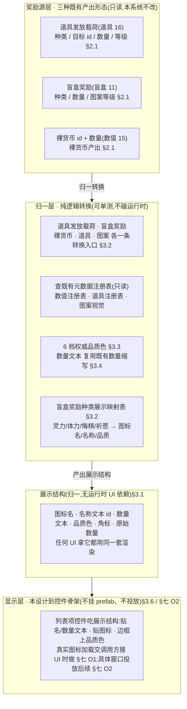
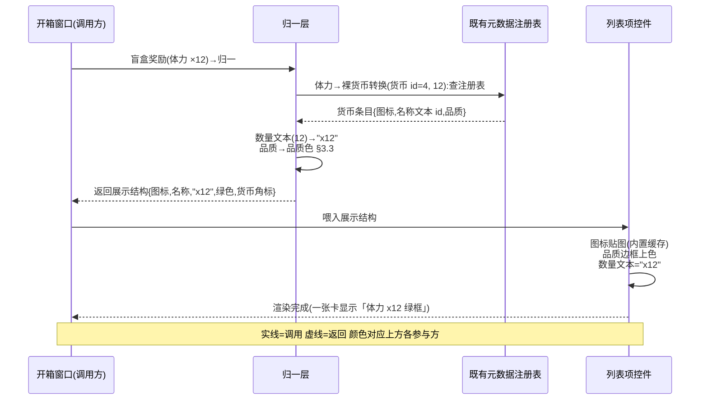

# 通用奖励展示

把游戏里**三种异构奖励产出**(道具发放 / 盲盒开出 / 数值系统裸货币+数量)<mark>归一成一个统一的展示结构</mark>(图标资源名 + 名称文本 id + 数量显示文本 + 品质色 + 角标),让任何 UI(开箱三选一、礼包开启、订单交付、道具领取)**用同一套显示逻辑渲染奖励**。补的是奖励的**展示归一层**——产出逻辑各系统已实现,本篇只做「拿到任意奖励 → 怎么显示」。**加法式**:新增纯逻辑转换 + 数据结构,<mark>不改任何既有产出 / 发奖路径</mark>,旧路径零行为变化。

> [!WARNING]
> **设计边界**
>
> 四条边界先钉死,防止把「展示层」做成「重构产出逻辑」、防误改既有功能:
>
> - **只读不写既有产出结构。**道具发放载荷([设计 16](#16-item-system))、盲盒奖励([设计 11](#11-core-loop-completion))、数值条目([设计 15](#15-numeric-system))三类产出**本层不改一行**,只读它们的字段产出展示结构。发奖落点(谁加经验、谁加货币)仍归各既有系统,本层不碰。
> - **归一 + 格式化是纯逻辑,可单测。**「产出载荷 → 展示结构」「盲盒奖励 → 展示结构」「数量 → 显示文本」「品质 → 色」全是纯内存函数,可直接断言,**不依赖资源加载 / 运行时**。涉及货币元数据查询的路径用测试注入,绕开配置系统。
> - **真实图标加载 / UI 投放本设计不做(无美术 + UI 是独立后续)。**展示结构只产出**图标资源名(字符串)**,真实贴图由调用方在接 UI 时做;本篇给一份**列表项控件骨架**作接法示范,但**本设计不挂 prefab、不投放到任何窗口**,验收锚在纯逻辑转换(详 [§七 O1/O2](#17-reward-display::open))。
> - **6 档品质色在本层定一份单一事实源,收编旧的 4 档。**既有数值显示的品质色([设计 15](#15-numeric-system))是 4 档(白/蓝/紫/红),与[道具系统 6 档品质](#16-item-system)(白/绿/蓝/紫/橙/红)**色序不一致**。本层新建权威的 6 档品质色([§3.3](#17-reward-display::quality));旧 4 档现状**不删**(它还被数值显示自用,删除需先核 UI 引用,列独立低优先级正名任务,[§七 O3](#17-reward-display::open)),但本层产出的展示品质色一律走新 6 档。

> [!NOTE]
> **立项信息**
>
> | 项 | 内容 |
> | --- | --- |
> | **类型** | 新系统 · 奖励展示归一层 出设计稿 + 验收标准。**纯逻辑转换 + 数据结构,UI 投放本设计不做。** |
> | **设计基线** | 已落地的三种奖励产出形态:① [道具系统](#16-item-system)的发放载荷(种类 {无/货币/图案/自选礼包/随机礼包} + 目标 id + 数量 + 等级 + 次数);② [盲盒](#11-core-loop-completion)奖励(种类 {灵力/体力/图案/悔棋次数/祈愿次数} + 数量 + 图案等级);③ [数值系统](#15-numeric-system)按货币 id 查到的条目(图标名 / 名称文本 id / 品质)+ 已实装的数量缩写(0–999/K/M);④ [道具元数据](#16-item-system)按道具 id 查到的定义(图标 / 名称 / 品质);⑤ 图案视觉(glyph + 纯色)。 |
> | **方向约束** | 离线还原 · **去变现**(本层不含任何价格 / 充值显示)。加法式扩展,不破坏现有产出 / 发奖路径 + 已建系统(数值 / 道具 / 盲盒)。图标真实加载走框架内置缓存贴图(本设计只给名字不加载)。现有 EditMode 零回归。 |
> | **关键约束** | 归一 / 格式化 / 品质色为纯逻辑,可在纯单测直接调(不依赖资源加载 / 运行时);涉及货币 / 道具元数据查询的路径经测试注入(绕开配置系统)。展示结构不含运行时 UI 类型(仅颜色为值类型,可在 EditMode 单测构造)。 |

## 一、做什么与为什么 {#what}

现状:游戏里「发奖」这件事已经齐全——道具系统能产出发放载荷、盲盒能开出奖励、数值系统能加各种货币。但**「把一份奖励显示给玩家看」这件事散在各处、各写一套**:开箱窗口要自己把盲盒奖励种类翻成「灵力 / 体力 / 图案」文案、自己挑图标、自己定颜色;将来礼包开启窗口、订单交付结算面板又要把道具发放载荷翻一遍、各挑各的图标和颜色。同一个「灵力 +200」在开箱里和在订单结算里可能长得不一样,且每加一个新发奖入口就得重写一份显示逻辑。

本系统补的正是这一层**展示归一**:不管奖励从哪来(道具 / 盲盒 / 裸货币),先归一成一个统一的展示结构(图标资源名 + 名称文本 id + 数量显示文本 + 品质色 + 类型角标),任何 UI 拿到它用同一套渲染。三件事:

| # | 做什么 | 本篇落法 |
| --- | --- | --- |
| 1 | 定义统一展示结构 | 图标资源名 / 名称文本 id / 数量显示文本 / 品质色 / 角标 / 原始数量([§3.1](#17-reward-display::view)) |
| 2 | 各奖励源 → 展示结构转换 | 道具发放载荷 / 盲盒奖励 / 裸货币(id+数量) / 道具(id+数量) / 图案(种类+等级+数量)各一条转换入口([§3.2](#17-reward-display::convert)) |
| 3 | 统一品质色 + 数量文本 + 图标名 | 6 档权威品质色([§3.3](#17-reward-display::quality))+ 数量文本(复用既有数量缩写,[§3.4](#17-reward-display::count))+ 图标 / 名称解析([§3.5](#17-reward-display::icon)) |
| 4 | 列表项渲染示范 | 列表项控件骨架(UI 接法示范,**本设计不挂 prefab、不投放**,[§3.6](#17-reward-display::widget)) |

**不做(本设计明确排除):**价格 / 充值显示(去变现);真实图标加载(无美术,只产出图标资源名,真实贴图交调用方接 UI 时做,[§七 O1](#17-reward-display::open));奖励弹窗 / 三选一面板 / 结算面板等具体 UI 投放(本设计交付纯逻辑转换 + 数据结构 + 控件骨架,具体窗口投放是独立后续,[§七 O2](#17-reward-display::open));名称文本表查询(多语言)(文本表本设计未接,展示结构给名称文本 id,真实查表 / 显示交后续,与数值显示现状一致,[§七 O4](#17-reward-display::open));奖励获取动画 / 飞图标 / 数字滚动等表现(表现层独立,[§七 O5](#17-reward-display::open));改既有产出 / 发奖逻辑(本层只读不写)。

## 二、系统模型 {#model}

### 2.1 三种奖励源的现状形态 {#sources}

本层归一的输入是已落地的三种产出形态。先把它们的字段钉清,归一转换才能精确:

| 奖励源 | 关键字段 | 归一时怎么取展示元数据 |
| --- | --- | --- |
| [道具系统](#16-item-system)发放载荷 | 种类 / 目标 id / 数量 / 等级 / 次数 | 货币→查数值注册表;图案→查图案视觉;无种类(材料)→查道具注册表;礼包→礼包占位 |
| [盲盒 / 宝箱](#11-core-loop-completion)奖励 | 种类 {灵力/体力/图案/悔棋次数/祈愿次数} / 数量 / 图案等级 | 灵力/体力→映射到货币 id 查数值注册表;图案→查图案视觉;悔棋/祈愿→功能性占位(无货币 id) |
| [数值系统](#15-numeric-system)裸货币 | 货币 id / 数量 | 直接查数值注册表拿图标 / 名称 / 品质 |

> [!NOTE]
> **灵力的货币 id 映射:**盲盒的「灵力」奖励,数值系统现有约定常量是 经验=1 / 虔诚币=2 / 钻石=3 / 体力=4,**没有「灵力」这一项**。盲盒只产出奖励结构,真实发放由窗口对接订单状态。<mark>灵力↔货币 id 的映射现状未在数值表登记</mark>。本层处理:盲盒奖励种类 → 展示元数据走一张**本层内的小映射表**(§3.2,灵力→图标名/名称 id/品质,不强依赖数值表),而非假设一个不存在的货币 id。这张表是展示层私有约定,列入 <a href="#17-reward-display::open">§七 O6</a> 供确认是否补进数值表统一。

### 2.2 归一层 + 显示层结构 {#layers}

系统两层:**归一层**(各源 → 展示结构,纯逻辑)+ **显示层**(展示结构 → UI,本设计只到控件骨架)。归一层吃既有产出结构 + 既有元数据注册表,产出与运行时 UI 无关的展示结构(故可纯单测);显示层把展示结构喂给控件。结构图:

**为什么这样切:**把「奖励长什么样」从「奖励是什么」里抽出来,各发奖入口不再各写一份显示逻辑——加新发奖通道时只要能转成展示结构就能复用同一套渲染。归一层<mark>只读既有产出结构和元数据注册表、产出不含运行时 UI 类型的纯数据结构</mark>(唯一的运行时类型是颜色值类型,可在 EditMode 单测构造),所以转换 + 格式化 + 品质色全部可纯单测——这是「展示归一可被逐条核对」验收点的地基。显示层只是把展示结构的字段贴到 UI 控件上,无业务逻辑,故本设计给骨架不投放也不影响逻辑验收。

## 三、设计正文 {#numbers}

### 3.1 展示结构 {#view}

展示结构的字段只为「渲染一项奖励」服务。**不含产出语义**(不知道这奖励落哪个系统——那是产出层的事),只含「显示成什么样」。字段如下:

| 字段 | 含义 |
| --- | --- |
| 图标资源名 | 字符串(真实贴图交调用方,本设计只给名) |
| 名称文本 id | 名称多语言文本 id(文本表本设计未接,给 id,O4) |
| 数量显示文本 | 已格式化好的数量文本("x200" / "x999.9K" / "Lv2",§3.4) |
| 品质色 | 6 档权威品质色(§3.3) |
| 角标 | 类型角标(货币 / 图案 / 材料 / 礼包,渲染左上角小标) |
| 原始数量 | 供 UI 需要时自行格式化 / 排序(0=无数量语义) |

类型角标(渲染分类小标,与产出种类枚举解耦)有 6 种:

| 角标 | 含义 |
| --- | --- |
| 无 | 无角标 |
| 货币 | 灵力 / 体力 / 经验 / 虔诚币… |
| 图案 | 图案 |
| 材料 | 材料 / 功能材料 |
| 礼包 | 自选 / 随机礼包 |
| 功能 | 功能性次数(悔棋次数 / 祈愿次数等无图标实物的) |

**字段取舍理由:**(1) 图标用资源名(字符串)而非加载好的贴图——归一层不碰资源加载(纯单测要求),真实加载交调用方(框架内置缓存贴图);(2) 名称用文本 id 而非字面串——多语言文本表本设计未接,与既有数值显示现状一致(它也只到文本 id);(3) 数量文本已格式化好(如 "x200")——避免每个 UI 各拼一次「x + 数量」;(4) 保留原始数量——给少数需要自定义格式 / 排序的 UI 兜底;(5) 角标与产出种类枚举解耦——归一时把 5 种道具发放种类 / 5 种盲盒奖励种类收成 6 种展示角标,UI 只认展示角标不认产出种类。

### 3.2 各源 → 展示结构转换 {#convert}

归一层提供从每种源到展示结构的转换。核心三条对接既有产出结构,另两条对接裸输入:

| 转换入口 | 输入 | 归一行为 |
| --- | --- | --- |
| 道具发放载荷 → 展示 | 发放载荷 | 按种类分流:货币→走裸货币转换;图案→走图案转换;礼包(自选/随机)→礼包占位(O6 图标);无种类(材料)→走道具转换(目标 id 即道具 id) |
| 盲盒奖励 → 展示 | 盲盒奖励 | 按种类分流(走本层私有展示映射表,§2.1 注):灵力→货币占位映射;体力→映射到货币 id=4 走裸货币转换;图案→走图案转换(默认图案,见下注);悔棋次数 / 祈愿次数→功能性占位 |
| 裸货币 → 展示 | 货币 id + 数量 | 查数值注册表;查到取图标 / 名称 / 品质,查不到降级(图标空 / 名称 0 / 品质退化为 1 白)不抛;角标=货币,数量文本走 §3.4 |
| 道具 → 展示 | 道具 id + 数量 | 查道具注册表;查到取图标 / 名称 / 品质,查不到同样降级不抛;道具类型为礼包类则角标=礼包,否则角标=材料 |
| 图案 → 展示 | 图案种类 + 等级 + 数量 | 图标用图案资源名约定;名称 id 占位 0(O4);品质按等级映射(§3.3);角标=图案,数量文本走 §3.4 图案带等级式 |

**转换边界逐档:**

| 输入 | 行为 | 理由 |
| --- | --- | --- |
| 裸货币的货币 id 查无 | 图标空 / 名称 0 / 品质退化为 1(白),数量文本仍正常 | 注册表未灌该 id 时不抛,展示降级而非崩 |
| 道具的道具 id 查无 | 同上降级 | 同理 |
| 道具发放载荷 种类=无,目标 id=道具 id | 走道具转换(纯持有材料) | 无种类时目标 id 即道具 id |
| 盲盒 灵力 | 走本层私有展示映射(图标名占位 / 名称 id 约定 / 品质 1) | 灵力无货币 id(§2.1 注),不假设不存在的货币 |
| 悔棋 / 祈愿(功能性次数) | 角标=功能,图标名占位,数量文本="x{n}" | 这类是「次数」非实物,无品质语义,品质退化白 |
| 礼包(自选 / 随机) | 角标=礼包,图标名礼包占位,数量文本按开启次数 | 礼包本身是一个待开的盒,展示为「礼包 ×次数」 |

> [!NOTE]
> **盲盒图案奖励的默认图案:**盲盒图案奖励只带图案等级(1–3)**不带具体图案种类**(盲盒奖池设计只到「给个 LvN 图案」)。归一时若无具体图案,展示用一个**代表性图案**(默认钻石 ◆)+ 等级文案;若调用方已知具体图案,改用图案转换直接传具体图案。这条列入 <a href="#17-reward-display::open">§七 O7</a>(是否给盲盒图案奖励补具体图案种类)。

### 3.3 6 档品质色(单一事实源) {#quality}

本层定一份**权威的 6 档品质色**,与[道具系统 6 档品质](#16-item-system)(1 普通白 / 2 高级绿 / 3 精英蓝 / 4 史诗紫 / 5 传说橙 / 6 神话红)一一对应。色值取自文档调色板,确保设计稿与运行期一致。越界 / 其它档退化为白(1):

| 品质档 | 名称 | 色 | RGB |
| --- | --- | --- | --- |
| 1 | 普通 | 白 | (0.85, 0.85, 0.85) |
| 2 | 高级 | 绿 | (0.36, 0.84, 0.63) |
| 3 | 精英 | 蓝 | (0.42, 0.55, 1.0) |
| 4 | 史诗 | 紫 | (0.69, 0.49, 1.0) |
| 5 | 传说 | 橙 | (1.0, 0.66, 0.30) |
| 6 | 神话 | 红 | (1.0, 0.48, 0.54) |
| 其它 / 越界 | — | 白(退化) | (0.85, 0.85, 0.85) |

> [!WARNING]
> **与既有 4 档数值品质色的关系:**既有数值显示的品质色(<a href="#15-numeric-system">设计 15</a>)是 4 档,色序<mark>白(1)/蓝(2)/紫(3)/红(4)</mark>——与本层 6 档(白/绿/蓝/紫/橙/红)在 2/3/4 档**色值不同**(它的 2=蓝,本层 2=绿)。本层是品质色的**新单一事实源**,凡走本层展示结构的一律用本层 6 档。既有数值品质色 **本设计不删不改**(它还被数值显示格式化自用,且未确认是否有 UI 直接引用),但<mark>不再扩展、不被本层调用</mark>;将来收编数值显示到本层(让数值显示也走本层展示结构)是独立正名任务(<a href="#17-reward-display::open">§七 O3</a>)。**本设计交付里两份品质色并存,本层 6 档是权威,旧 4 档冻结待收编。**

**图案品质映射:**图案无独立品质字段,按等级映射展示品质——Lv1→3(精英蓝)/ Lv2→4(史诗紫)/ Lv3→5(传说橙),越高越亮。这是展示约定,可调,列 [§七 O7](#17-reward-display::open)。

### 3.4 数量文本格式化 {#count}

数量文本复用[已实装的数量缩写](#15-numeric-system)(0–999 原值 / K / M 缩写,截断保 999999→"999.9K"),前面加 "x" 前缀。不重写一份格式化逻辑(避免两处漂移)。规则:数量 ≤1 时——1 个不带 "x1"(界面更干净,如单件材料显空),0 显 "x0";数量 >1 时显 "x{缩写}"。图案数量文本另带等级前缀("Lv2 x3"),单个图案只显等级。逐档:

| 输入 | 数量文本输出 | 说明 |
| --- | --- | --- |
| 数量=200 | "x200" | 常规 |
| 数量=999999 | "x999.9K" | 复用缩写截断,不进位 |
| 数量=1 | ""(空) | 单件不带 "x1"(如一件材料) |
| 数量=0 | "x0" | 防御性,理论不出现 |
| 图案 Lv2 ×3 | "Lv2 x3" | 图案带等级 |
| 图案 Lv1 ×1 | "Lv1" | 单个图案只显等级 |

**"x1 是否显示" 旋钮:**默认单件不带 "x1"(界面更干净)。若某些 UI 要恒显数量,提供一个「恒显数量」开关即可,本设计默认单件不显,列 [§七 O8](#17-reward-display::open)。

### 3.5 图标 / 名称解析 {#icon}

图标资源名与名称文本 id 从既有元数据注册表取,本层不持有美术资源映射:

| 奖励种类 | 图标名来源 | 名称 id 来源 |
| --- | --- | --- |
| 货币 | 数值注册表条目的图标名 | 数值注册表条目的名称文本 id |
| 道具 / 材料 | 道具注册表定义的图标 | 道具注册表定义的名称 |
| 图案 | 图案资源名约定(图案种类编号拼前缀,如 "pattern\_100") | 占位 0(图案无文本表项,O4) |
| 灵力 / 功能次数(盲盒) | 本层私有占位名(灵力 / 悔棋次数 / 祈愿次数) | 本层约定 id(O6) |
| 礼包 | 本层私有占位名(自选礼包 / 随机礼包) | 本层约定 id |

真实图标加载交调用方在接 UI 时做(框架内置缓存贴图,无需手动释放),本层只到名字。无美术时图标会落空(缺失),不影响文字 / 数量 / 颜色显示。

### 3.6 列表项控件(UI 接法,本设计骨架) {#widget}

给一份列表项控件骨架作 UI 接法**示范**,<mark>本设计不挂 prefab、不投放到任何窗口</mark>(无美术 + UI 投放是独立后续,[§七 O2](#17-reward-display::open))。它展示「拿到展示结构怎么贴到控件」,供后续接 UI 时照搬。控件有四个子元素:图标图、品质边框图、名称文本、数量文本。喂入一份展示结构时:

| 子元素 | 取展示结构的 | 行为 |
| --- | --- | --- |
| 图标图 | 图标资源名 | 名非空时贴图(框架内置缓存贴图) |
| 品质边框图 | 品质色 | 边框上色 |
| 名称文本 | 名称文本 id | 文本表接入前临时显 id(O4) |
| 数量文本 | 数量显示文本 | 直接显示 |

列表渲染用既有的列表数量管理机制。这部分本设计**可写可不写**——若写了,因无 prefab 它不会被实例化,只作编译通过的接法示范;验收**不要求**它跑起来([§六 Z 类](#17-reward-display::accept)),只要求归一层纯逻辑全绿。是否本设计就写骨架列 [§七 O2](#17-reward-display::open)。

## 四、归一 + 渲染时序 {#flow}

以「开箱三选一,把一张盲盒奖励显示成一项卡」为例,展示从产出结构到渲染的调用链。参与方:开箱窗口(调用方)→ 归一层 → 既有元数据注册表 → 列表项控件。

关键点:归一层全程<mark>只读既有注册表、产出展示结构</mark>,不碰资源加载 / 运行时(查注册表经只读接口,单测用注入);真实图标加载发生在列表项控件内,那一步需运行时——但本设计控件不投放,验收只到「归一返回的展示结构字段对不对」。这条边界让归一层可纯单测,渲染层留给接 UI 时验。

## 五、验收点 {#accept}

每条可逐条核对。全部为纯逻辑:转换 / 格式化 / 品质色直接调,涉及注册表查询用测试注入(绕开配置系统)。**无配置表依赖、无资源加载、无运行时**(故无阻塞风险——下方 Z3 说明)。

| # | 验收点 | 完成定义 |
| --- | --- | --- |
| V1 | 道具发放载荷(货币)→展示 | 注入经验货币(id=1,图标/名称/品质),归一货币种类目标 id=1 数量 5000 → 图标 / 名称文本 id == 注入值,数量文本=="x5K"(5000→"5K"),角标==货币,原始数量==5000 |
| V2 | 道具发放载荷(图案)→展示 | 归一图案种类(钻石图案编号 100,等级 2,数量 4)→ 图标=="pattern\_100",角标==图案,数量文本=="Lv2 x4",品质色==图案等级 2 映射的品质色 |
| V3 | 道具发放载荷(无种类·材料)→展示 | 注入材料道具,归一无种类(目标 id=道具 id,数量 3)→ 走道具转换,图标 / 名称文本 id==道具值,角标==材料 |
| V4 | 道具发放载荷(礼包)→展示 | 归一随机礼包(目标 id=6001,开启次数 3)→ 角标==礼包,数量文本反映开启次数(开 3 次) |
| V5 | 盲盒奖励(体力)→展示 | 注入体力货币(id=4),归一体力种类数量 12 → 走货币 id=4 数量 12,数量文本=="x12",角标==货币 |
| V6 | 盲盒奖励(灵力)→展示 | 归一灵力种类数量 200 → 角标==货币,图标==灵力占位名,不抛(灵力无货币 id 也不崩) |
| V7 | 盲盒奖励(图案)→展示 | 归一图案种类(等级 3,数量 1)→ 角标==图案,数量文本含 "Lv3",品质==图案等级 3 映射的品质色 |
| V8 | 盲盒奖励(悔棋 / 祈愿)→展示 | 归一悔棋次数种类数量 2 → 角标==功能,数量文本=="x2",品质退化白 |
| V9 | 裸货币 / 道具直调 | 裸货币(id=1,数量 200)字段对;道具(道具 id,数量 1)数量文本==""(单件不带 x1) |
| Q1 | 6 档品质色齐全且互异 | 品质 1..6 六个返回值两两不等;1==白(0.85,0.85,0.85) |
| Q2 | 品质越界退化白 | 品质 0 / 7 / -1 均 == 白 |
| Q3 | 品质色与设计稿一致 | 逐档断言 RGB == §3.3 表(2 绿/3 蓝/4 紫/5 橙/6 红 的具体浮点值,容差 0.01) |
| N1 | 数量文本缩写复用既有缩写 | 数量 200→"x200";999999→"x999.9K"(截断不进位);1→"";0→"x0" |
| N2 | 图案数量文本带等级 | 图案 Lv2 ×3→"Lv2 x3";图案 Lv1 ×1→"Lv1" |
| B1 | 货币 id 查无降级不抛 | 不注入(或灌空),裸货币(id=999,数量 100)→ 图标空 / 名称 0 / 品质==白,数量文本仍 "x100",不抛 |
| B2 | 道具 id 查无降级不抛 | 道具(id=999999,数量 1)→ 降级(图标空 / 名称 0 / 白),不抛 |
| Z1 | 全链纯逻辑无配置系统 | V/Q/N/B 类全部直调 / 注入跑通(本身即证未触资源加载 / 运行时) |
| Z2 | 既有 EditMode 零回归 | EditMode 全量跑,既有用例全绿,新增项另计 |
| Z3 | 无阻塞路径 | 本系统不依赖配置导表 / 配置二进制(只读运行期注册表,单测走注入);故配置工具链不可达**不影响本系统验收**(本系统无配置直读测试) |

**阻塞条件:**本系统纯逻辑,理论无阻塞。唯一可能:测试运行环境不可达致 EditMode 无法跑 → 判 **阻塞** 不判失败,交接区写清卡点。可备选无界面批处理模式跑 EditMode。

## 六、待拍板清单 {#open}

有安全默认的已自行拍板(归一结构字段 / 6 档品质色 / 复用既有数量缩写 / 灵力走私有映射等);此处集中列**范围开关**交裁决——均不阻塞本设计交付,默认按「本设计不做 / 按下方默认」推进。

| # | 事项 | 本设计默认 | 后续选项 |
| --- | --- | --- | --- |
| O1 | 真实图标加载 | 不做,只产出图标资源名;真实贴图交接 UI 时做(无美术,资源名占位) | 有美术后,控件喂入展示结构时贴图直接生效,无须改归一层 |
| O2 | 本设计是否写列表项控件骨架 | **可选**:写则编译通过的接法示范(不挂 prefab、不投放、不验收跑通) | 不写则只交归一层转换 + 数据结构 + 单测;接 UI 时再补控件。**建议写**(给后续接 UI 留模板,成本低) |
| O3 | 收编旧 4 档数值品质色 | 本设计不动(旧品质色还被数值显示自用;本层 6 档是新权威,两份并存) | 独立正名任务:让数值显示也走本层展示结构 / 品质色,删旧 4 档(需先核 UI 引用) |
| O4 | 名称多语言文本表查询 | 不接,展示结构给名称文本 id;控件临时显 id(与数值显示现状一致) | 文本表系统建好后,控件喂入时查表显真名,归一层不变 |
| O5 | 奖励获取动画 / 飞图标 / 数字滚动 | 不做(表现层独立) | 表现层后续轮,基于展示结构驱动 |
| O6 | 灵力 / 功能次数是否补进数值表 | 不补,走本层私有展示映射(图标名 / 名称 id 占位约定) | 若要统一管理,把灵力补进数值表给货币 id,盲盒灵力改走货币转换;功能次数(悔棋/祈愿)非货币,建议留私有映射 |
| O7 | 盲盒图案是否补具体图案种类 + 图案品质映射调整 | 盲盒图案无具体图案 → 展示用代表图案(钻石)+ 等级;图案品质按等级 Lv1→3/Lv2→4/Lv3→5 | 若盲盒奖池补具体图案种类,盲盒图案归一传真实图案;品质映射档位可调 |
| O8 | 单件是否显 "x1" | 不显(界面更干净);数量=1 → 数量文本空 | 提供「恒显数量」开关,某些 UI 恒显数量 |

## 七、风险表 {#risk}

| 风险 | 等级 | 应对 |
| --- | --- | --- |
| 归一转换误改既有产出结构(把展示层做成重构产出) | 中 | 设计边界四条 + 既有产出结构只读不写;验收 Z2 既有零回归把关 |
| 两份品质色并存致显示不一致(旧 4 档 vs 新 6 档) | 中 | §3.3 钉死「本层 6 档是权威,凡走本层展示结构一律用本层」;旧 4 档冻结不被本层调用,收编列 O3 独立任务 |
| 灵力假设一个不存在的货币 id 致查表崩 / 显错 | 中 | §2.1 注核实灵力无货币 id;§3.2 灵力走本层私有映射不查数值表;V6 验收专测「灵力不抛」 |
| 盲盒图案无具体图案种类,展示图标对不上 | 低 | §3.2 注用代表图案(钻石)+ 等级文案降级显示;补具体图案列 O7;不影响逻辑正确(等级/数量对) |
| 无美术致图标全空,界面只剩文字 | 低 | 本设计无美术是已知现状;图标落空不影响文字/数量/颜色;有美术后资源名直接生效,归一层不返工 |
| 注册表查询路径在单测里触配置系统(资源不可达) | 低 | §五全部用注入绕开配置系统;Z1 专验「全链无配置系统」;Z3 说明本系统无配置二进制依赖 |
