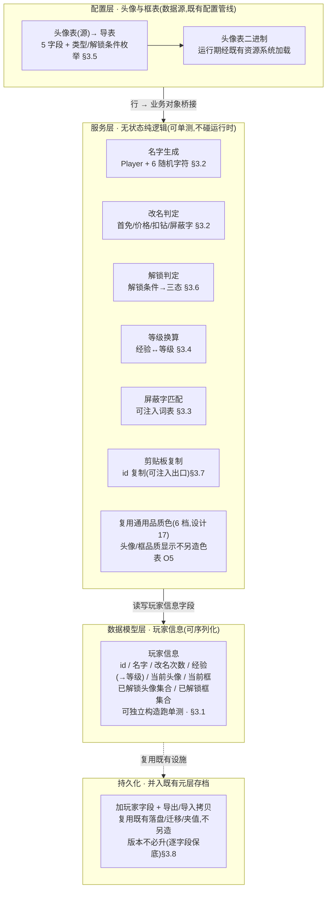
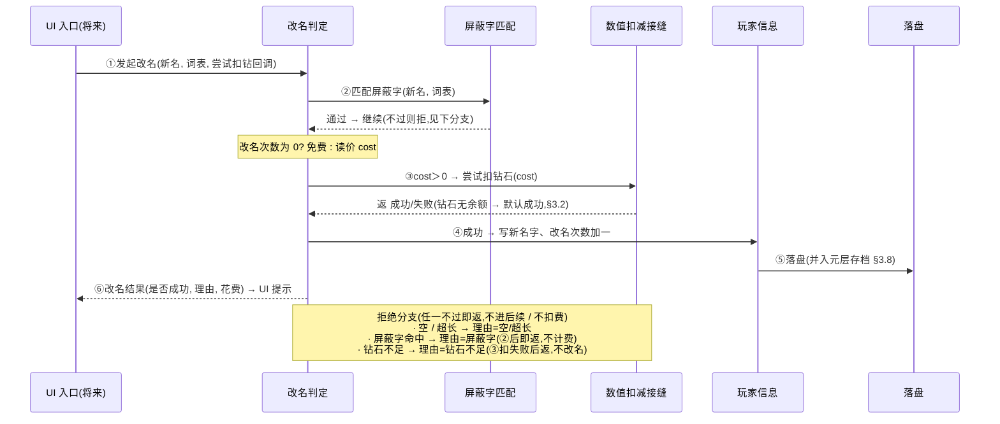

# 玩家信息系统 · 数据逻辑层

玩家个人信息系统的**数据逻辑层**:玩家信息数据模型(id / 名字 / 等级 / 经验 / 当前头像·框 / 已解锁集合)跨会话持久化,加上四组纯逻辑能力——**名字生成器**(初始系统名)、**改名逻辑**(首次免费 / 配置价格 / 钻石扣费尝试 / 屏蔽字匹配)、**头像/框解锁判定**(解锁条件→三态)、**id 复制剪贴板工具**。**数据层先行**:全部可独立单元测试;<mark>UI 窗口(玩家信息界面 / 改名界面 / 三态网格 / 经验槽 / 等级奖励预览)是表现层,需美术,延后轮,本设计只留钩子 + 待办</mark>。

> [!WARNING]
> **读前必看 · 设计边界**
>
> 五条边界先钉死,防把「数据层」做成「连 UI + 改既有系统」:
>
> - **头像&头像框走配置表,不硬编码。**头像/框定义(id / 类型 / 图片 / 解锁文字 / 解锁条件)是数据,以配置表承载,口径与现有数值表 / 道具表一致,便于策划增删不改逻辑。
> - **玩家信息持久化并入既有元层存档,不另造存储栈。**跨会话存档已落地(序列化 / 落盘 / 迁移 / 跨天重置,异步外壳 + 同步纯逻辑两层)。玩家信息新字段**增量并入**这套,不新建第二个存档文件、不新建第二套持久化栈。
> - **数据模型 + 服务是纯逻辑,可单测;配置加载分两路。**名字生成 / 改名判定 / 解锁三态 / 等级换算都是纯内存逻辑,单测直接断言、不碰资源加载。配置表运行期经既有资源系统加载;离线单测旁路直读配置二进制或经测试注入入口绕过资源系统(详 [§3.5](#18-player-info::schema))。
> - **UI 投放不在本设计。**玩家信息界面 / 改名界面 / 三态网格 / 经验槽 / 等级奖励预览 tips 是表现层,依赖尚不存在的美术(头像/框图),本设计**不**建窗口、不挂界面。本设计交付到「服务能力 + 数据模型 + 头像表查询」,留主界面入口钩子 + 待办(见 [§五](#18-player-info::hook))。
> - **离线 + 去变现适配(项目方向)。**① id 本地生成保证本地唯一(无服务器);② 账号绑定 = 不做(离线无账号);③ 改名「发起申请」服务端校验后即时生效(无人工审批);④ 解锁条件「活动发放」表字段支持,本设计只接「等级」自动判定,「活动发放」留钩子 + 待办(无活动系统);⑤ 钻石扣费 = 「首次免费 + 读配置价格 + 经服务端账本扣减」(O8 已兑现,扣减路径见 [§3.2](#18-player-info::name)、客户端段实现见[设计 38](#38-player-attr-client));去变现指**不实装购买钻石入口**,钻石余额由服务端发奖路径(排行 / 邮件 / 兑换码 / 活动)注入。

> [!NOTE]
> **立项信息**
>
> | 项 | 内容 |
> | --- | --- |
> | **类型** | 新系统 · 玩家信息数据逻辑层,出设计稿 + 验收标准。 |
> | **方向约束** | 离线还原 · **去变现**:本系统不含充值 / 内购入口;改名扣钻经服务端账本扣减([设计 37](#37-player-attr-server) 权威 + [设计 38](#38-player-attr-client) 客户端调用),余额由服务端发奖路径注入(去变现 = 不实装购买钻石入口,非「钻石无余额」)。加法式扩展,不破坏既有核心循环 + 已建系统(存档 / 数值 / 道具)。IO 异步:配置经既有资源系统加载,落盘经既有存档的异步外壳。 |
> | **设计要点** | 玩家等级是**独立第三条进度线**:与守护者经验(只由修神庙产出,语义是神庙主线进度)、女神好感互不读写;玩家等级单独建经验曲线(见 [§3.4](#18-player-info::level))。头像/框品质显示(若后续需要)复用既有通用奖励展示的 6 档品质色(白/绿/蓝/紫/橙/红),不另造色表(见 [§七 O5](#18-player-info::open))。 |
> | **关键约束** | 数据模型 / 服务为纯逻辑,可在纯单测直接构造 / 静态调用(不依赖资源系统 / 运行时);头像表离线测试直读配置二进制;现有全量单测零回归。剪贴板真实写入经可注入出口隔离,单测不碰真实剪贴板。 |

## 一、做什么与为什么 {#what}

现状:游戏**没有玩家个人信息系统**——无玩家 id、无昵称、无头像、无玩家账号等级。需求要求建一套「玩家个人信息」:玩家信息 = 玩家等级 + id + 名字 + 头像 + 头像框,配套改名 / id 复制 / 等级经验槽 / 头像框三态网格。

本设计交付其中**数据逻辑层**(需求主体的可测部分),逐条对应需求:

| # | 需求 | 本篇落法 |
| --- | --- | --- |
| 1 | 玩家信息 = 等级 + id + 名字 + 头像 + 头像框 | 数据模型持有全部字段 + 已解锁集合,跨会话落盘([§3.1](#18-player-info::model-data) / [§3.8](#18-player-info::persist)) |
| 2 | 名字:初始系统生成 `Player` + 从「52 字母 + 10 数字」随机 6 个(例 `Player2dfgKL`) | 名字生成器:固定前缀 + 6 字符从 62 字符集等概率抽([§3.2](#18-player-info::name)) |
| 3 | 改名:首次免费,之后每次读配置表价格扣钻石 | 改名服务:首次免费,否则读价 + 尝试扣钻石([§3.2](#18-player-info::name)) |
| 4 | 确定时前端屏蔽字匹配,符合才发起改名 | 屏蔽字匹配器(可注入词表);不通过直接拒绝、不扣费([§3.3](#18-player-info::profanity)) |
| 5 | id:服务器规则自动生成;界面可点按钮复制到剪贴板 | 离线本地生成本地唯一 id([§3.1](#18-player-info::model-data));复制经可注入出口([§3.7](#18-player-info::clipboard)) |
| 6 | 头像/头像框:初始默认机器人,玩家可换已拥有的;3 态(佩戴/已解锁/未解锁) | 初始头像/框 id 为配置常量;解锁判定返三态([§3.6](#18-player-info::unlock));换装写当前头像/框 id |
| 7 | 头像&amp;框表:id \| 类型(1头像/2框)\| 图片 \| 解锁文字(多语言) \| 解锁条件(1等级/2活动发放) | 配置表 5 字段 + 两枚举([§3.5](#18-player-info::schema));「活动发放」本设计留钩子 |
| 8 | 等级 + 经验槽 + 等级奖励预览 tips | 等级曲线:经验→等级换算 + 当前级进度([§3.4](#18-player-info::level));奖励预览数据本设计给接口、UI 延后 |
| 9 | 主界面左上角入口 → 玩家信息界面(改名 / id 复制 / 等级经验 / 头像框页签 / 选中保存) | UI 表现层,**本设计不做**,留入口钩子 + 待办([§五](#18-player-info::hook)) |
| 10 | 开启:玩家 1 级即开;道具/红点/邮件:无;运营:后做;美术:UI 见界面,原画/特效/动画:无 | 1 级即开 = 玩家始终可访问(无门槛逻辑);道具/红点/邮件/运营字段不建 |

**不做(本设计明确排除):**所有 UI 窗口(玩家信息界面 / 改名界面 / 三态网格 / 经验槽 / 奖励预览 tips — 需美术,延后,见 [§七 O1](#18-player-info::open));充值 / 内购钻石入口(去变现);账号绑定 / 登录(离线无账号);解锁条件「活动发放」的真实判定(无活动系统,留钩子 O3);多语言文本真实查表(解锁文字 / 名称存文本 id,与数值/道具/奖励的名称 id 现状一致,O4);头像/框真实图加载(无美术,只给图片资源名,O2);红点 / 邮件 / 运营 / 道具(需求明示无)。

## 二、系统模型 {#model}

### 2.1 分层(配置 / 数据模型 / 服务 / 持久化) {#layers}

系统拆四层,各层职责单一、各自可测。配置层是头像表,数据模型层持有玩家信息字段(可序列化),服务层是一组无状态纯逻辑(名字 / 改名 / 屏蔽字 / 解锁 / 等级 / 剪贴板),持久化层把数据模型并入既有元层存档跨会话落盘。结构图:

**为什么这样切:**头像表桥接成业务对象,隔离配置生成类型,业务侧只认业务对象,同道具表的做法。服务层全做成**无状态纯函数**(吃玩家信息 + 参数,产结果),不持有玩家状态——故验收点全是纯断言,连配置都未必加载。剪贴板与扣钻石这两处「碰外部世界」的操作,经<mark>可注入接缝</mark>(写出回调 / 扣减回调)隔离,使单测不碰真实剪贴板、不依赖钻石实装。

### 2.2 加法式接入(与既有持久化的关系) {#additive}

玩家信息**新增**一个数据模型 + 一组服务 + 一张表;持久化**增量并入**既有元层存档。既有玩法字段(灵力/虔诚币/经验/神庙…)与读写一律不动。对照:

| 维度 | 既有元层存档(本设计加字段不删) | 玩家信息(本篇新增) |
| --- | --- | --- |
| 持有什么 | 元层玩法进度字段(灵力/虔诚币/经验/神庙/盲盒/女神/订单/总分/祈愿) | 新增玩家字段(id/名字/改名次数/玩家经验/当前头像·框/已解锁集合) |
| 玩家等级从哪来 | **独立第三条进度线**:玩家等级是玩家经验的纯函数,**不**复用守护者经验(守护者经验仅由修神庙产出,语义不同)。两条线互不读写([§3.4](#18-player-info::level) 注) |  |
| 存哪 | **同一份元层存档**:玩家字段并入存档,随既有落盘 / 迁移 / 夹值一并走,不新建第二个存档文件 / 第二套持久化栈(见 [§3.8](#18-player-info::persist)) |  |
| 钻石扣费 | 扣减经服务端账本([设计 37](#37-player-attr-server) 权威);客户端调用见 [§3.2](#18-player-info::name) / [设计 38](#38-player-attr-client),失败时钻石不动且改名拒绝 |  |

> [!NOTE]
> **加法式的回归保证:**不进入玩家信息服务、不读玩家字段时,既有玩法行为与本篇前完全一致。玩家信息全部是新增能力 + 新增表 + 存档加字段(序列化框架对旧档缺字段自动给缺省,导入时逐字段保底)。唯一碰既有存档的是「加字段」与「导出/导入拷贝行」——若选 <a href="#18-player-info::persist">§3.8</a> 的「独立子对象」做法,连这两处都只是新增,既有字段一行不动。

## 三、设计正文 {#numbers}

### 3.1 玩家信息数据模型 {#model-data}

玩家信息是一个可序列化的扁平数据对象(与既有元层存档同口径:用整型数组承载集合,便于序列化)。字段及游戏含义:

| 字段(游戏含义) | 含义 / 初始值 |
| --- | --- |
| id | 本地生成的玩家 id(本地唯一,见下「id 生成」) |
| 名字 | 当前昵称(初始系统生成,[§3.2](#18-player-info::name)) |
| 改名次数 | 已改名次数(0 = 还没改过 → 下次免费) |
| 玩家经验 | 玩家账号经验(玩家等级 = 经验的纯函数,[§3.4](#18-player-info::level)) |
| 当前头像 id | 当前佩戴头像(初始 = 默认头像 id) |
| 当前框 id | 当前佩戴头像框(初始 = 默认框 id) |
| 已解锁头像集合 | 已解锁头像 id 集合(含活动发放的,[§3.6](#18-player-info::unlock)) |
| 已解锁框集合 | 已解锁头像框 id 集合 |

玩家等级**不单独存值**,运行期由玩家经验现场换算(避免两份状态漂移,同守护者等级做法)。

**初始默认常量(集中在一处便于调):**默认头像 id = 1(需求:初始默认「机器人」头像,对应头像表 id=1 那行);默认框 id = 101([§3.5](#18-player-info::schema) 样例:框类型起始 id)。

**id 生成(离线本地唯一,适配「服务器规则自动生成」):**需求写「服务器规则自动生成」,离线无服务器,故本地生成,本地唯一即足够(单机无碰撞域)。两个安全选项,**默认 (a)**:

| 选项 | 做法 | 权衡 |
| --- | --- | --- |
| **(a) 默认 · 全局唯一标识** | 生成 32 位十六进制全局唯一标识 | 唯一性由标识算法保证,最省事 |
| (b) 时间戳 + 随机后缀 | 毫秒时间戳 + 短随机后缀 | 可读性稍好,但需防同毫秒碰撞 |

id 一旦生成写入后不再变(改名不改 id)。

**首次创建(无存档时):**新 id + 生成系统名 + 改名次数=0 + 经验=0 + 默认头像/框 + 已解锁集合含默认头像/框(初始即拥有)。

> [!NOTE]
> **已解锁集合用整型数组而非哈希集合:**与既有元层存档同源约束——序列化框架不序列化哈希集合 / 字典,但序列化整型数组。运行期服务内部可临时转哈希集合做查重,落盘前转回数组。这是既有存档「字典不进盘故无需拍平」的同款落法,避免引入新的拍平字段。

### 3.2 名字生成器 + 改名逻辑 {#name}

**名字生成器(纯逻辑):**字符集 = 52 字母 + 10 数字 = 62 个字符(`A–Z` `a–z` `0–9`,需求逐字)。生成规则:固定前缀 `Player` + 从 62 字符集等概率抽 6 个字符拼接,总长 12(例 `Player2dfgKL`)。后缀长度是可调旋钮(默认 6)。

随机源可注入,使单测用固定种子断言确定输出。验收只断言「前缀正确 + 总长 = 6+6 + 后缀字符全落在 62 字符集内」,不断言具体随机值(随机不可复现就锚结构性质)。

**改名逻辑:**需求「首次免费,之后读配置价格扣钻石;确定时屏蔽字匹配,符合才发起」。判定顺序(任一不过即拒,后续不执行):

1. **合法性**:新名非空、长度在 `[最小长度, 最大长度]`(可调旋钮,默认 1–16),不全空白。不合法 → 拒(理由:空 / 超长)。
2. **屏蔽字**:屏蔽字匹配通过([§3.3](#18-player-info::profanity))。<mark>不通过直接拒,不扣费</mark>(理由:屏蔽字)。
3. **计费**:改名次数为 0 → 免费(花费 0);否则读价(默认固定价,见下旋钮),经数值路径尝试扣钻石;扣费失败(钻石不足)→ 拒,不改名(理由:钻石不足)。
4. **扣费成功 / 免费** → 写入新名字、改名次数加一,返回成功结果(带本次花费)。

改名返回一个**结构化结果**,便于 UI 分支提示:是否成功 + 拒绝理由(无 / 空 / 超长 / 屏蔽字 / 钻石不足)+ 本次花费(免费=0)。「尝试扣钻石」是注入的回调(返回是否扣成功),生产实现走设计 38 `PlayerAttrService.TryChangeAsync` 经服务端校验,测试实现注桩(见下「钻石扣费经服务端账本」)。

**改名价格旋钮:**需求说「读配置表价格」。两个安全选项,默认 (a):

| 选项 | 取价方式 | 边界代入(改名次数 → 花费) |
| --- | --- | --- |
| **(a) 默认 · 固定价常量** | 固定价 100 钻石,首次后每次同价 | 0次→免费;1次→100;2次→100;N次→100 |
| (b) 分档递增 | 读配置档位(如 100/200/500…) | 0→免费;1→100;2→200;3+→500(示意) |

> [!NOTE]
> **默认选 (a) 固定价 100:**需求只说「读配置价格」,未给具体数值或递增规则;固定价是最小可用、可单测、可后续改成分档(把常量换成查表即可)。<mark>价格放进配置常量</mark>,后续要分档或接配置表是局部替换,不动改名判定逻辑。验收只断言「首次花费=0、之后花费=配置价、扣费失败则不改名」,不绑死具体数字。

> [!NOTE]
> **钻石扣费接服务端权威(经设计 37/38 兑现):**钻石作为玩家属性的权威账本在服务端 MongoDB `players` 集合(设计 37),客户端经 `PlayerAttrService.TryChangeAsync(Diamond, -cost, "player_rename")` 同步等服务端校验响应(设计 38)。`trySpendDiamond` 注入接缝**形态保留不变**——生产实现 = 经 `PlayerAttrService` 调服务端;测试实现 = 注桩 `IRpcGateway` 返指定 `ChangeResult`,断言成功 / 失败两条分支不依赖真实网络。服务端拒(余额不足 / 服务暂不可用 / 未登录 / 网络断)统一在 `PlayerInfoWindow.ShowRenameReject` 内映射 `RenameReject.NotEnoughDiamond` 分支文案(细分见设计 38 §六)。改名判定逻辑(`PlayerRenameService.TryRename`)不返工,接缝语义守住「注入回调返扣成功与否」契约。

### 3.3 屏蔽字匹配 {#profanity}

**可注入词表的纯逻辑匹配:**需求「前端屏蔽字匹配,符合才发起改名」。真实词表是后续数据(运营 / 资源),本设计<mark>实现匹配算法 + 词表可注入</mark>,单测用夹具词表,不阻塞于真实词表缺失。

匹配规则:默认大小写不敏感的子串包含——名字含任一屏蔽词即判「不洁」。大小写敏感是可调旋钮(默认不敏感)。**词表为空或缺省 → 永远通过(不拦)。**

**边界代入(词表 = {"fuck","admin"},大小写不敏感):**

| 输入名字 | 结果 | 说明 |
| --- | --- | --- |
| "Player2dfgKL" | 通过 | 不含任何屏蔽词 |
| "superADMIN" | 拦 | 子串含 "admin"(大小写不敏感) |
| "Fuckyou" | 拦 | 子串含 "fuck"(大小写不敏感) |
| "" / 空表 | 通过 | 空词表永远通过(真实词表未接时不误拦,见下注) |

> [!NOTE]
> **子串匹配是默认起点,够用且可单测:**更复杂的「变形 / 拼音 / 间隔符绕过」匹配是后续增强(真实词表到位后按需),本设计的可注入接缝使后续替换匹配策略不动调用方。<mark>空词表 = 不拦</mark>是刻意的安全默认:本设计无真实词表,若空表当「全拦/全过」需明确——选「全过」使改名不被空词表卡死(去变现 / 不阻塞玩家),真实词表接入后自然生效。词表来源(配置表 / 文本资源 / 远程)列 <a href="#18-player-info::open">§七 O6</a>。

### 3.4 等级 / 经验曲线 {#level}

**独立第三条进度线(纯函数):**玩家账号等级是玩家经验的纯函数。<mark>不</mark>复用守护者经验 / 守护者等级(那只由修神庙产经验,语义是「神庙主线进度」,与「玩家账号活跃度」不同)。两条线互不读写。

**曲线公式 + 默认常量 + 旋钮:**每级所需经验线性递增(最小可用,可后续换表)。可调旋钮(默认):

- 基础经验 = 100(1→2 级所需经验)
- 步进经验 = 50(每升一级,下一级门槛多 50)
- 等级上限 = 60(封顶后经验仍累计但等级不再涨)

升到第 L 级(L≥1)所需的**累计经验门槛**为前 L−1 级逐级门槛之和:累计门槛(1)=0,累计门槛(L)= Σ(k=1..L−1) [ 基础经验 + (k−1)×步进经验 ]。

由累计经验可换算三个量,供经验槽显示:**当前等级**(满足累计门槛的最高级,封顶 60)、**当前级已积累经验**(累计经验 − 当前级门槛)、**升下一级还差多少**(下一级门槛 − 累计经验;封顶返 0)。

**边界逐档代入(基础=100,步进=50):**逐级门槛 = 1→2:100、2→3:150、3→4:200…;累计门槛 = L1:0、L2:100、L3:250、L4:450。

| 累计经验 | 等级 | 当前级已积累 | 升下一级还差 | 说明 |
| --- | --- | --- | --- | --- |
| 0 | 1 | 0 | 100 | 初始;1 级即开(需求) |
| 99 | 1 | 99 | 1 | 差 1 经验升 2 级 |
| 100 | 2 | 0 | 150 | 恰好升 2 级 |
| 250 | 3 | 0 | 200 | 累计 100+150 升 3 级 |
| 300 | 3 | 50 | 150 | 3 级内积累 50 |
| 极大值 | 60 | 余值 | 0 | 封顶:等级停 60,升下一级还差=0 |

> [!NOTE]
> **经验来源本设计不接(只给容器 + 换算):**需求要「等级 + 经验槽 + 等级奖励预览 tips」。本设计交付经验**容器**(玩家经验字段)+ **换算**(等级 / 槽进度,供经验槽 UI 用)+ **加经验接口**(只增不减)。<mark>「玩什么加多少经验」</mark>(消除得分 / 完成订单 / 每日…)是经济接线,本设计不接(无明确需求规则,且接哪个事件属后续运营),列 <a href="#18-player-info::open">§七 O7</a>。「等级奖励预览」的奖励内容(每级给什么)也是经济数据,本设计给**数据结构占位**(等级奖励接口 + 空实现),真实奖励表延后。

### 3.5 头像&amp;头像框表 schema {#schema}

头像表走工程既有配置管线(口径与现有数值表 / 道具表一致)。需求五字段 1:1,头像与头像框共用一张表,靠类型字段区分:

| 字段(游戏含义) | 类型 | 备注 |
| --- | --- | --- |
| id | 整型 | 主键,按 id 索引。头像与框共表(见样例约定 id 段) |
| 类型(1头像/2框) | 枚举 | <mark>用枚举</mark>:头像 / 头像框 |
| 图片 | 字符串 | 头像/框图片资源名(真实美术接入时替换占位) |
| 解锁文字(关联多语言表) | 整型(文本 id) | 解锁说明文本 id(指向多语言表,本设计存 id,文本表延后)。<mark>存文本 id</mark>,同数值/道具的名称现状 |
| 解锁条件(1等级/2活动发放) | 枚举 | <mark>用枚举</mark>:等级 / 活动发放。条件参数见下「条件参数」字段 |

> [!NOTE]
> **补一个「条件参数」字段(需求隐含,落地必需):**「解锁条件 = 等级」必须知道**哪一级**解锁。需求字段只列「解锁条件(类型)」未列参数,但等级解锁离不开门槛值。故补「条件参数」整型字段:等级解锁时 = 解锁所需等级;活动发放时 = 活动 id(本设计不判,留值)。这是「需求字段隐含必需参数」的补全,非擅自扩需求。验收只断言「按 id 查出的条件参数 == 表填值」。

**两个枚举(值 = 需求数字):**

- **头像类型**:头像 = 1 / 头像框 = 2
- **解锁条件**:等级 = 1 / 活动发放 = 2

枚举值与需求一一对应。

**数据样例(头像与框共表):**

| id | 类型 | 图片 | 解锁文字 id | 解锁条件 | 条件参数 | 说明 |
| --- | --- | --- | --- | --- | --- | --- |
| 1 | 头像 | avt_robot | 300001 | 等级 | 1 | 初始默认机器人,1 级即拥有 |
| 2 | 头像 | avt_cat | 300002 | 等级 | 5 | 5 级解锁 |
| 3 | 头像 | avt_star | 300003 | 活动发放 | 9001 | 活动发放(本设计不判,留值) |
| 101 | 头像框 | frm_default | 300101 | 等级 | 1 | 初始默认框,1 级即拥有 |
| 102 | 头像框 | frm_gold | 300102 | 等级 | 10 | 10 级解锁 |
| 103 | 头像框 | frm_event | 300103 | 活动发放 | 9002 | 活动发放 |

> [!NOTE]
> **id 段约定 + 占位说明:**头像与框共表,约定<mark>头像 id 用 1–100 段、框用 101+ 段</mark>(便于人读;运行期靠类型字段区分,不靠 id 段——id 段只是编排习惯)。图片 / 解锁文字填语义化占位(`avt_robot` / `300001`),真实美术 / 文本接入时替换;<mark>占位不影响验收</mark>(验收只断言「按 id 查出的字段值 == 表填值」,不要求美术 / 文本真实存在)。初始默认头像 = id 1(机器人,对应需求「初始默认机器人」),默认框 = id 101。

### 3.6 头像/框解锁判定 + 三态 {#unlock}

**三态(需求:当前佩戴 / 已解锁 / 未解锁):**未解锁(Locked)/ 已解锁未佩戴(Unlocked)/ 当前佩戴(Equipped)。

**判定逻辑(纯逻辑):**「是否已解锁」有两条来源,取或——① 已在该玩家的已解锁集合里(含活动发放、历史解锁);② 等级条件实时满足(解锁条件 = 等级 且 玩家等级 ≥ 条件参数)。活动发放条件本设计不实时判,未写进集合即视为未解锁。三态 = 已解锁 + 是否当前佩戴(该项 id == 当前佩戴的对应 id → 佩戴,否则已解锁未佩戴)。

配套两个动作:

- **升级补集合**:玩家升级后,把「等级新达标」的头像/框补进对应已解锁集合(去重,持久化用,避免每次实时算)。
- **换装**:仅当目标已解锁才允许佩戴(防换上未解锁的)——已解锁则写入当前头像/框 id 返回成功,未解锁则拒绝且不改。

**三态判定边界代入(玩家等级=5,当前头像=1):**

| 头像 id | 条件 / 参数 | 集合含? | 三态 | 说明 |
| --- | --- | --- | --- | --- |
| 1 | 等级/1 | 是 | **佩戴** | 已解锁 + 当前佩戴 |
| 2 | 等级/5 | 否 | **已解锁未佩戴** | 等级 5≥5,等级实时达标(即使集合未同步) |
| 2(等级=4) | 等级/5 | 否 | **未解锁** | 等级 4&lt;5,未达标 |
| 3 | 活动发放/9001 | 否 | **未解锁** | 活动发放本设计不判 → 未解锁(留钩子 O3) |
| 3 | 活动发放/9001 | 是 | **已解锁未佩戴** | 已被(将来)活动写进集合 → 视为已解锁 |

> [!NOTE]
> **活动发放本设计只留钩子:**活动发放条件的判定 = 「集合含才算解锁」——即真实「发放」动作 = 把 id 加进该玩家的已解锁集合(将来活动系统调用)。本设计无活动系统,故活动发放项除非被手动 / 测试写进集合,否则恒未解锁。<mark>表字段 + 判定分支齐备,只缺「谁来发放」的调用方</mark>,接活动系统时补一个「发放头像」调用把 id 写进集合即可,判定逻辑不返工(列 <a href="#18-player-info::open">§七 O3</a>)。

### 3.7 id 复制剪贴板工具 {#clipboard}

需求:「id 界面可点按钮复制到剪贴板」。引擎提供写系统剪贴板的运行期接口。为使逻辑可单测、不碰真实剪贴板,做一层带**可注入写出口**的薄封装:复制时若文本为空则不写,否则把文本交给写出口。默认写出口写真实系统剪贴板;测试时注入捕获到内存的写出口断言写入内容。

单测:把写出口替成捕获到局部变量的回调,调用复制后断言捕获值 == id;空串不写;测后还原写出口。<mark>不触真实剪贴板</mark>(离线测试环境也无桌面剪贴板语义)。生产侧默认写出口直接写系统剪贴板,无需额外接线。

### 3.8 跨会话持久化(并入元层存档) {#persist}

复用既有跨会话存档(设计 14):玩家信息字段**增量并入**元层存档,随既有落盘 / 迁移 / 跨天一并走,不另造存储栈。**两个安全做法,默认 (a):**

| 做法 | 怎么落 | 权衡 |
| --- | --- | --- |
| **(a) 默认 · 平铺进元层存档** | 存档直接加玩家字段(id/名字/改名次数/玩家经验/当前头像·框/已解锁集合);导出拷出、导入拷入 + 逐字段保底 | 最贴现状(存档已扁平),序列化友好;旧档缺字段自动给缺省 + 导入夹值。改动集中在少数既有文件 |
| (b) 嵌套子对象 | 存档加一个玩家信息子对象字段 | 玩家字段聚团、既有字段一行不动;序列化框架支持嵌套子对象 |

> [!NOTE]
> **默认选 (a) 平铺:**与既有元层存档的平铺字段同口径(设计 14 刻意扁平、避免序列化嵌套坑),一致性最高、回归面最小。**存档版本号不必升**(同设计 14:「新增字段不必升版,序列化框架给缺省 + 导入逐字段保底」)。**逐字段保底(导入时)**:旧档 / 篡改时——id 空 → 现场生成新 id;名字空 → 生成系统名;改名次数<0 → 夹 0;玩家经验<0 → 夹 0;当前头像/框不在表内或为 0 → 退默认 1/101;已解锁集合为空 → 重建为含默认头像/框的数组。这套与设计 14 的「导入对任意输入产出合法不变量」红线一致。

**首次游玩(无存档):**读档为空 → 调用方对玩家信息走「创建缺省」(新 id + 系统名 + 默认头像框 + 解锁集合含默认)。这与设计 14「无存档走缺省重置」同分支,只是缺省内容多了玩家信息构造。

## 四、改名 / 解锁时序 {#flow}

一次「改名(收费档)」的时序(参与方:UI 入口 / 改名判定 / 屏蔽字匹配 / 数值扣减接缝 / 玩家信息 / 持久化),以及解锁三态查询的旁路。UI 节点本设计不建,以「将来 UI 入口」标注:

## 五、交付范围与主界面入口 {#hook}

本设计交付到「服务能力 + 数据模型 + 头像表查询 + 持久化并入」一层,全部可独立单测。表现层与既有系统的边界:

- **新增**:头像&框表(数据 + 两枚举)+ 头像表查询能力 + 玩家信息数据模型 + 名字生成 / 改名判定 / 屏蔽字匹配 / 改名价格 / 等级曲线 / 加经验 / 解锁判定 / 剪贴板复制等纯逻辑服务。
- **增量改既有**:玩家信息字段平铺并入元层存档,导出/导入加对应拷贝 + 逐字段保底([§3.8](#18-player-info::persist));<mark>既有存档字段一行不改,存档版本号不升</mark>。
- **零回归(不碰)**:既有数值 / 道具 / 奖励展示 / 既有玩法逻辑 / 任何 UI 窗口,以及既有存档字段(只加不改)。
- **品质色复用**:头像/框若后续要做品质显示,复用既有通用奖励展示的 6 档权威品质色,不另造色表。头像表本身无品质字段(需求未要求),品质显示属可选增强,本设计不强求(O5)。

**主界面入口(留钩子,本设计不实现):**需求要主界面左上角有「玩家信息入口」→ 打开玩家信息界面。入口是 UI,本设计不建窗口、不接入口;在主界面留待办钩子,接 UI 轮时基于本层服务驱动,逻辑层不返工。

## 六、验收点 {#accept}

逐条核对。**配置直读类**(C 系列)需头像表二进制已导出(导表工具链不可达 → 判受阻不判失败);**其余全纯逻辑**,无配置二进制 / 资源系统依赖。

| # | 验收点 | 完成定义 |
| --- | --- | --- |
| N1 | 名字生成结构 | 生成名以 "Player" 开头,总长 = 6+6=12,后 6 字符全落在 62 字符集内(固定种子可复现断言) |
| N2 | 名字随机性 | 两个不同种子的生成后缀不全等(防写死);同种子两次生成结果一致(确定性) |
| R1 | 首次改名免费 | 改名次数=0,改名「新名」→ 成功,花费==0,名字=="新名",改名次数==1,**未触发**扣钻回调 |
| R2 | 二次改名读价扣钻 | 改名次数=1,扣钻回调返成功 → 成功,花费==配置价(默认100),改名次数==2;扣钻回调以该花费被调用 |
| R3 | 钻石不足拒绝 | 改名次数=1,扣钻回调返失败 → 失败,理由==钻石不足,名字不变,改名次数不变 |
| R4 | 屏蔽字拒绝且不计费 | 新名含屏蔽词 → 失败,理由==屏蔽字,名字不变,**扣钻回调未被调**(屏蔽字先于计费) |
| R5 | 空/超长拒绝 | 空串 → 理由==空;超最大长度 → 理由==超长;均不改名不计费 |
| P1 | 屏蔽字大小写不敏感 | 词表{"admin"},"superADMIN" → 判脏(拦);"Player2dfgKL" → 通过 |
| P2 | 空词表不拦 | 任意名 + 空词表/缺省词表 → 通过 |
| L1 | 等级换算分档 | 经验 0→等级 1;99→1;100→2;250→3(基础=100/步进=50,逐档对 §3.4 代入表) |
| L2 | 经验槽进度 | 累计经验 300:当前级已积累==50 且 升下一级还差==150(3 级内积累 50,差 150 升 4 级) |
| L3 | 等级封顶 | 极大经验 → 等级==上限(60),升下一级还差==0,不溢出/不抛 |
| L4 | 加经验只增 | 加 50 后经验增 50;加 -10 不减(夹 0 或忽略负数) |
| U1 | 等级条件实时解锁 | 等级=5,头像条件=等级/5,集合不含 → 已解锁;等级=4 同项 → 未解锁 |
| U2 | 三态:佩戴 | 已解锁 + id==当前头像 id → 佩戴 |
| U3 | 三态:已解锁未佩戴 / 未解锁 | 已解锁 + 非当前 → 已解锁未佩戴;未达条件且集合不含 → 未解锁(逐项对 §3.6 代入表) |
| U4 | 活动发放本设计不判 | 条件=活动发放,集合不含 → 未解锁;手动把 id 加进集合后 → 已解锁(钩子可达性) |
| U5 | 换装仅限已解锁 | 换装目标已解锁 → 成功且当前头像/框改为目标;未解锁 → 失败且不改 |
| U6 | 升级补集合 | 等级升到达标后补集合 → 达标的等级解锁头像 id 进集合(去重,不重复加) |
| C1 | 头像表直读 | 直读头像表二进制,行数==样例数,按 id 查类型/图片/解锁文字/解锁条件/条件参数 == 表填值 |
| C2 | 查询桥接 | 头像表查询从真实二进制转业务对象,按 id 查 id=1 图片=="avt_robot"、按类型查只含框类型行(逐字段比对桥接正确) |
| D1 | 创建缺省 | 创建缺省:id 非空,名字以 Player 开头,改名次数==0,经验==0,当前头像==1/当前框==101,已解锁集合含 1 与 101 |
| D2 | id 不随改名变 | 记录 id,改名成功后 id 不变(改名只改名字) |
| S1 | 持久化往返 | 构造玩家信息,经 导出→序列化→反序列化→导入 回来,玩家字段(id/名字/改名次数/经验/当前头像框/已解锁集合)全保真 |
| S2 | 旧档缺玩家字段保底 | 用无玩家字段的旧存档(只含设计14 字段)→ 反序列化+导入 → 玩家字段走缺省(id 现生成、名字现生成、头像框退默认、集合重建),不抛、既有字段不丢 |
| S3 | 篡改值夹到合法 | 改名次数=-5→0;经验=-100→0;当前头像=0/越界→默认1;已解锁集合空→含默认的数组(导入逐字段保底) |
| B1 | 剪贴板可注入断言 | 替写出口为捕获回调,复制 id 后捕获值==id;空串不写;测后还原写出口 |
| Z1 | 全链纯逻辑无资源系统 | N/R/P/L/U(非 C)/D/S/B 全部经构造 / 测试注入 / 直调跑通(即证未触资源系统 / 运行时) |
| Z2 | 既有测试零回归 | 全量单测跑,既有用例全绿,新增另计;编译 0 错误 |

> [!WARNING]
> **受阻条件:**(1) 导表工具链不可达致头像表二进制无法导出 → C1/C2 判受阻不判失败,其余纯逻辑验收正常跑;(2) 测试运行环境不可达致单测跑不起来 → 判受阻。

## 七、待拍板清单 {#open}

范围开关,均按「本设计安全默认」推进(不阻塞);boss 关单复核,要改另开增量轮。

- **O1 · UI 表现层全部延后**(默认 √)。玩家信息界面 / 改名界面 / 三态网格 / 经验槽 / 等级奖励预览 tips / 主界面左上角入口——需美术(头像/框图),本设计只留服务 + 入口待办钩子。接 UI 时基于本层服务驱动,逻辑层不返工。
- **O2 · 头像/框真实图加载**(默认延后)。本设计只给图片资源名占位,真实图加载随 UI 轮。
- **O3 · 解锁条件「活动发放」**(默认留钩子)。表字段 + 判定分支齐备,本设计无活动系统不判;真实「发放」= 接活动系统把 id 写进已解锁集合,判定逻辑不返工。
- **O4 · 多语言文本真实查表**(默认延后)。解锁文字 / 名称存文本 id,本设计显示 id 兜底,与数值/道具/奖励的名称 id 现状一致。文本表接入列后续。
- **O5 · 头像/框品质显示**(默认不做)。头像表**无品质字段**,品质显示属可选增强;若后续要,复用既有通用奖励展示的 6 档品质色(设计 17)+ 给头像表加品质字段,不另造色表。
- **O6 · 屏蔽字真实词表来源**(默认可注入夹具)。本设计算法 + 注入接缝就绪,真实词表(配置表 / 文本资源 / 远程)是运营数据,延后;匹配策略增强(变形/拼音/间隔符)同此轮接。
- **O7 · 玩家经验来源接线**(默认不接)。本设计给经验容器 + 换算 + 加经验接口,「玩什么加多少经验」(消除/订单/每日)是经济接线 + 运营数据,无明确需求规则,延后。等级奖励内容(每级给什么)同此,本设计给数据结构占位。
- **O8 · 钻石扣费经服务端账本(已兑现)**。设计 37 服务端段建 MongoDB `players` 集合三属性账本 + `C2G_PropertyChangeRequest` 通用变更入口;设计 38 客户端段建 `PlayerAttrService` 视图 + `trySpendDiamond` 接缝内核改为同步等服务端响应。注入接缝语义不变,改名判定逻辑不返工。去变现:首次免费保留;非首次的钻石不足时玩家通过其它路径(未来活动 / 邮件发放)获得钻石,而非购买。

## 八、风险表 {#risk}

| 风险 | 应对 |
| --- | --- |
| 玩家等级误复用守护者经验,两套语义混淆 | §3.4 钉死:玩家等级是玩家经验的独立第三线,**不读**守护者经验 / 守护者等级;验收 L1–L4 全用独立玩家经验,不触守护者 |
| 改名扣钻石被当真实付费墙(违去变现) | §3.2 注 + O8 已兑现:钻石经服务端账本,玩家通过未来活动/邮件发放获得钻石(非购买);不实装购买入口;首次免费保留;余额不足时拒改名是设计意图(避免名滥用) |
| 把数据层做成连 UI / 改既有玩法(回归面爆炸) | 读前必看边界 + §五 钉死:UI 不建、既有玩法/产出/数值零改动;唯一改既有是元层存档加字段(不删不改既有字段) |
| 持久化加字段破坏旧档加载 | §3.8 做法 a + S2/S3:存档版本号不升,序列化框架对旧档缺字段给缺省 + 导入逐字段保底夹值(同设计 14 红线);旧档既有字段不丢 |
| 序列化框架不序列化哈希集合 → 已解锁集合丢失 | §3.1 注:已解锁用整型数组落盘(同元层存档约定),运行期临时转哈希集合查重 |
| 剪贴板真实写入污染单测 / 测试环境无剪贴板语义 | §3.7:写出口可注入,单测注内存写出口断言、不碰系统剪贴板,测后还原 |
| 头像表导表工具链不可达 | 不可达 → C1/C2 判受阻不判失败,纯逻辑验收照跑 |
| id 本地生成碰撞(理论) | §3.1:默认全局唯一标识,单机无碰撞域;本地唯一已足够(需求「服务器规则」离线无服务器) |

## 关联文档

- [14 · 跨会话存档(本篇持久化复用其元层存档 / 持久化栈)](#14-save-system)
- [15 · 数值底层(钻石数值)](#15-numeric-system)
- [16 · 道具底层(头像表查询仿道具表;钻石扣费现状)](#16-item-system)
- [17 · 通用奖励展示(品质色复用其 6 档品质色)](#17-reward-display)
