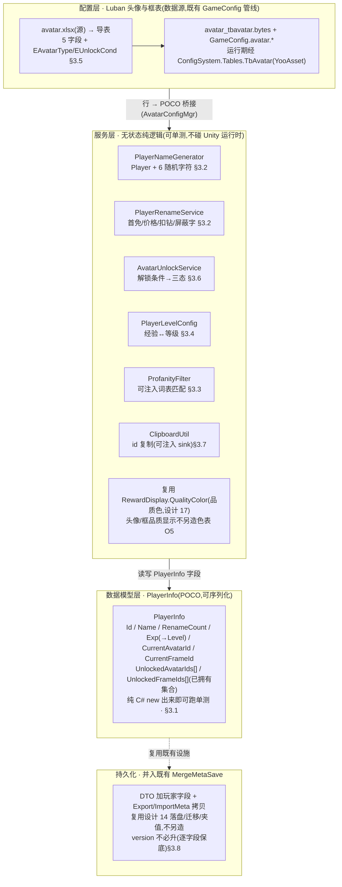
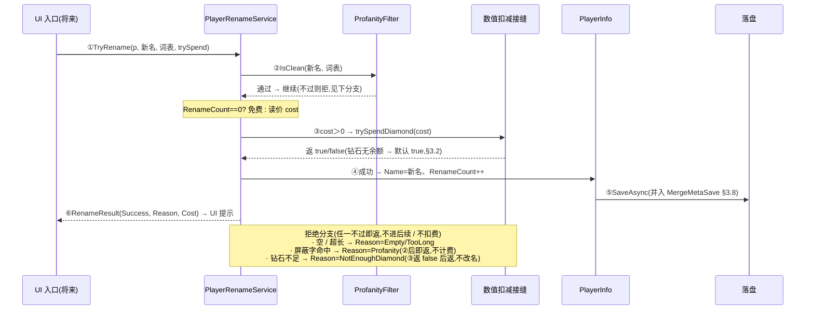

# 玩家信息系统 · 数据逻辑层

玩家个人信息系统的**数据逻辑层**:玩家信息数据模型(id / 名字 / 等级 / 经验 / 当前头像·框 / 已解锁集合)跨会话持久化,加上四组纯逻辑能力——**名字生成器**(初始系统名)、**改名逻辑**(首次免费 / 配置价格 / 钻石扣费尝试 / 屏蔽字匹配)、**头像/框解锁判定**(解锁条件→三态)、**id 复制剪贴板工具**。这是 xlsx 系统底层批次第四刀。**数据层先行**(沿用 15/16/17 节奏):全部 EditMode 可测;<mark>UI 窗口(玩家信息界面 / 改名界面 / 三态网格 / 经验槽 / 等级奖励预览)是表现层,需美术,延后轮,本设计只留钩子 + TODO</mark>。

    <b>读前必看 · 与工程现状的关系(单一事实源 = 代码)</b>
    
五条边界先钉死,防 dev 把「数据层」做成「连 UI + 改既有系统」:

    <ul style="margin:8px 0 0">
      <li><b>用 Luban 定头像&amp;头像框表,不硬编码。</b>工程配置全栈是 Luban(源 <code>Configs/GameConfig/Datas/</code> 在仓库根、与 <code>UnityProject/</code> 同级;生成代码落 <code>GameScripts/HotFix/GameProto/GameConfig/</code>,二进制落 <code>Assets/AssetRaw/Configs/bytes/</code>)。本表走<mark>既有 GameConfig 管线</mark>:<code>__tables__.xlsx</code> 注册 + 新建数据 <code>avatar.xlsx</code> + 跑导表脚本,口径与现有 <code>num</code> / <code>item</code> / <code>itemdef</code> 完全一致。</li>
      <li><b>玩家信息持久化并入既有 MergeMetaSave,不另造存储栈。</b>save-system(设计 14)已落地跨会话存档:<code>MergeMetaSave</code>(DTO,扁平 <code>[Serializable]</code>)+ <code>MergeMetaPersistence</code>(序列化 / 落盘 / 迁移 / 跨天重置,异步外壳 + 同步纯逻辑两层)。玩家信息新字段<mark>增量并入</mark>这套(加几个 DTO 字段 + ExportMeta/ImportMeta 拷贝),不新建第二个存档文件、不新建第二套 Persistence。</li>
      <li><b>数据模型 + 服务是纯逻辑,可单测;配置加载分两路。</b>名字生成 / 改名判定 / 解锁三态 / 等级换算都是纯内存逻辑,单测直接断言、不碰 YooAsset。Luban 表运行期加载走既有 <code>ConfigSystem.Instance.Tables</code>(YooAsset,需 Unity 运行时);EditMode 单测仿 <code>ItemSystemTests</code> 经 <code>AssetDatabase</code> 直读 <code>.bytes</code> 绕 YooAsset(详 <a href="#18-player-info::schema">§3.5</a>),或经 <code>InitForTest</code> 注入。</li>
      <li><b>UI 投放不在本设计。</b>玩家信息界面 / 改名界面 / 三态网格 / 经验槽 / 等级奖励预览 tips 是表现层,依赖尚不存在的美术(头像/框 Sprite),本设计<mark>不</mark>建窗口、不挂 prefab。本设计交付到「服务方法 + 数据模型 + 头像表查询」,留主界面入口钩子 + TODO(见 <a href="#18-player-info::hook">§五</a>)。</li>
      <li><b>离线 + 去变现适配(项目方向)。</b>① id 本地生成保证本地唯一(无服务器);② 账号绑定 = 不做(离线无账号);③ 改名「发起申请」离线直接生效(无服务器审批);④ 解锁条件 type 2「活动发放」表字段支持,本设计只接 type 1「等级」自动判定,type 2 留钩子 + TODO(无活动系统);⑤ 钻石扣费 = 实现「首次免费 + 读配置价格 + 经数值路径尝试扣减」逻辑,钻石(num_id=3)<mark>尚无可花费余额字段</mark>(item-system 关单记:<code>ItemGrant.ApplyNumeric</code> 对钻石返 false 不落),故扣减为 no-op,逻辑层照样可测(见 <a href="#18-player-info::name">§3.2</a>「钻石扣费的真实现状」)。</li>
    </ul>
  

    <b>立项信息</b>
    <table>
      <tbody><tr><th>类型</th><td>新系统 · 玩家信息数据逻辑层 出设计稿 + 验收标准,交开发落地。xlsx 系统底层批次第四刀。</td></tr>
      <tr><th>设计基线(经 grep 核实的真实符号)</th><td>
        <b>持久化</b>:<code>GameLogic.BlockBlast.MergeMetaSave</code>(DTO,15 字段)+ <code>MergeMetaPersistence</code>(<code>Serialize</code>/<code>Deserialize</code>/<code>Migrate</code>/<code>ApplyDailyReset</code>/<code>Load</code>/<code>SaveAsync</code>/<code>LoadAsync</code>,<code>CurrentVersion=1</code>,<code>StorageKey="block_blast_merge_meta_v1"</code>)+ <code>MergeOrderState.ExportMeta(today)</code>/<code>ImportMeta(dto,today)</code>(纯方法,逐字段保底夹值)。 
        <b>数值/扣费</b>:<code>GameLogic.Config.NumericConfigMgr</code>(常量 <code>Diamond=3</code>;<code>Get/GetByType/InitForTest/ResetForTest</code>);<code>ItemGrant.ApplyNumeric(state,payload)</code>(钻石走 default 分支返 false,无字段)。 
        <b>配置范本</b>:<code>ItemConfigMgr</code>(Luban 行→POCO 桥接 + <code>EnsureLoaded</code>/<code>GetItem</code>/<code>InitForTest</code>/<code>ResetForTest</code>);<code>ItemSystemTests</code>(<code>AssetDatabase.LoadAssetAtPath&lt;TextAsset&gt;(".../item_tbitemdef.bytes")</code>→<code>new GameConfig.item.TbItemDef(new Luban.ByteBuf(ta.bytes))</code> 直读)。 
        <b>品质色复用</b>:<code>RewardDisplay.QualityColor(int)</code>(6 档权威色,白/绿/蓝/紫/橙/红,设计 17 §3.3)——头像/框品质显示<mark>复用它</mark>,不另造色表(见 <a href="#18-player-info::open">§七 O5</a>)。 
        <b>等级现状</b>:工程<mark>无「玩家账号等级」</mark>概念——仅有 <code>MergeOrderState.GuardianLevel</code>(守护者等级,<code>TempleConfig.GuardianLevelFor(Exp)</code> 的纯函数,仅修神庙产经验)与 <code>GoddessLevel</code>(女神好感)。玩家等级是独立第三条进度线(见 <a href="#18-player-info::level">§3.4</a>)。
      </td></tr>
      <tr><th>方向约束</th><td>离线还原 · <b>去变现</b>:本系统不含充值 / 内购入口;改名扣钻石仅作「读价 + 尝试扣减」逻辑,钻石无余额字段时为 no-op(去变现:不实装购买钻石入口)。加法式扩展,不破坏既有核心循环 + 已建系统(存档 / 数值 / 道具)。IO 走 TEngine 异步规范(配置经既有 <code>ConfigSystem</code>;落盘经既有 <code>MergeMetaPersistence.SaveAsync</code> 异步外壳)。</td></tr>
      <tr><th>影响范围</th><td>
        <b>新增 Luban</b>:头像&amp;头像框表 <code>avatar.TbAvatar</code>(5 字段,<a href="#18-player-info::schema">§3.5</a>)+ 枚举 <code>avatar.EAvatarType</code>(头像/框)/ <code>avatar.EUnlockCond</code>(等级/活动); 
        <b>新增运行期</b>:<code>AvatarConfigMgr</code>(Luban 行→POCO <code>AvatarEntry</code> 桥接 + 按 id 查 / 按 type 列,仿 <code>ItemConfigMgr</code>); 
        <b>新增数据模型</b>:<code>PlayerInfo</code>(POCO,<a href="#18-player-info::model-data">§3.1</a>) + 服务 <code>PlayerNameGenerator</code> / <code>PlayerRenameService</code> / <code>ProfanityFilter</code> / <code>PlayerLevelConfig</code> / <code>AvatarUnlockService</code> / <code>ClipboardUtil</code>; 
        <b>改既有(增量,加字段不删)</b>:<code>MergeMetaSave</code> 加玩家信息字段;<code>MergeOrderState</code> 的 <code>ExportMeta</code>/<code>ImportMeta</code> 加对应拷贝行(或玩家信息独立挂 state,见 <a href="#18-player-info::persist">§3.8</a> 选型)。 
        <b>UI 零改动</b>(本设计不建窗口)。<b>既有玩法逻辑零行为变化</b>。
      </td></tr>
      <tr><th>关键约束(继承现状)</th><td>数据模型 / 服务为纯逻辑,可在纯 C# 单测直接 <code>new</code> / 静态调用(不依赖 YooAsset / Unity 运行时);头像表 EditMode 测试经 <code>AssetDatabase</code> 直读 <code>.bytes</code>(仿 <code>ItemSystemTests</code>);现有 251 例 EditMode 零回归。剪贴板真实写入(<code>GUIUtility.systemCopyBuffer</code>)经可注入 sink 隔离,单测不碰真实剪贴板。</td></tr>
    </tbody></table>
  

<h2 id="what">一、做什么与为什么</h2>

现状:游戏**没有玩家个人信息系统**——无玩家 id、无昵称、无头像、无玩家账号等级。spec(`1001玩家信息系统.xlsx`)要求建一套「玩家个人信息」:玩家信息 = 玩家等级 + id + 名字 + 头像 + 头像框,配套改名 / id 复制 / 等级经验槽 / 头像框三态网格。

本设计交付其中**数据逻辑层**(spec 主体的可测部分),逐条对应 spec:

| # | 需求(来自 spec 逐字) | 本篇落法 | 现状/新增 |
| --- | --- | --- | --- |
| 1 | 玩家信息 = 等级 + id + 名字 + 头像 + 头像框 | 数据模型 `PlayerInfo` 持有全部字段 + 已解锁集合,跨会话落盘([§3.1](#18-player-info::model-data) / [§3.8](#18-player-info::persist)) | 新增模型 |
| 2 | 名字:初始系统生成 `Player` + 从「52 字母 + 10 数字」随机 6 个(例 `Player2dfgKL`) | `PlayerNameGenerator.Generate(rng)`:固定前缀 + 6 字符从 62 字符集等概率抽([§3.2](#18-player-info::name)) | 新增生成器 |
| 3 | 改名:首次免费,之后每次读配置表价格扣钻石 | `PlayerRenameService.TryRename`:`RenameCount==0` 免费,否则读价 + 经数值路径尝试扣钻石([§3.2](#18-player-info::name)) | 新增服务 |
| 4 | 确定时前端屏蔽字匹配,符合才发起改名 | `ProfanityFilter.IsClean(name, wordList)` 可注入词表;不通过直接拒绝、不扣费([§3.3](#18-player-info::profanity)) | 新增匹配 |
| 5 | id:服务器规则自动生成;界面可点按钮复制到剪贴板 | 离线本地生成本地唯一 id([§3.1](#18-player-info::model-data));`ClipboardUtil.Copy` 经可注入 sink([§3.7](#18-player-info::clipboard)) | 新增生成 + 工具 |
| 6 | 头像/头像框:初始默认机器人,玩家可换已拥有的;3 态(佩戴/已解锁/未解锁) | 初始头像/框 id 配置常量;`AvatarUnlockService.StateOf` 返三态([§3.6](#18-player-info::unlock));换装写 `PlayerInfo.CurrentAvatarId/CurrentFrameId` | 新增服务 |
| 7 | 头像&amp;框表:id \| 类型(1头像/2框)\| 图片 \| 解锁文字(多语言) \| 解锁条件(1等级/2活动发放) | Luban 表 `avatar.TbAvatar` 5 字段 + 两枚举([§3.5](#18-player-info::schema));type 2 活动发放本设计留钩子 | 新增表 |
| 8 | 等级 + 经验槽 + 等级奖励预览 tips | `PlayerLevelConfig`:经验→等级换算 + 当前级进度([§3.4](#18-player-info::level));奖励预览数据本设计给接口、UI 延后 | 新增曲线 |
| 9 | 主界面左上角入口 → 玩家信息界面(改名 / id 复制 / 等级经验 / 头像框页签 / 选中保存) | UI 表现层,**本设计不做**,留入口钩子 + TODO([§五](#18-player-info::hook)) | 表现层延后 |
| 10 | 开启:玩家 1 级即开;道具/红点/邮件:无;运营:后做;美术:UI 见界面,原画/特效/动画:无 | 1 级即开 = 玩家始终可访问(无门槛逻辑);道具/红点/邮件/运营字段不建 | 无需逻辑 |

<b>不做(本设计明确排除):</b>所有 UI 窗口(玩家信息界面 / 改名界面 / 三态网格 / 经验槽 / 奖励预览 tips — 需美术,延后,见 [§七 O1](#18-player-info::open));充值 / 内购钻石入口(去变现);账号绑定 / 登录(离线无账号);解锁条件 type 2 活动发放的真实判定(无活动系统,留钩子 O3);多语言文本真实查表(解锁文字 / 名称存 text id,与 num/item/reward NameTextId 现状一致,O4);头像/框真实 Sprite 加载(无美术,只给图片资源名,O2);红点 / 邮件 / 运营 / 道具(spec 明示无)。

<h2 id="model">二、系统模型</h2>

<h3 id="layers">2.1 分层(配置 / 数据模型 / 服务 / 持久化)</h3>

系统拆四层,各层职责单一、各自可测。配置层是头像表(Luban),数据模型层持有玩家信息字段(纯 POCO,可序列化),服务层是一组无状态纯逻辑(名字 / 改名 / 屏蔽字 / 解锁 / 等级 / 剪贴板),持久化层把数据模型并入既有 `MergeMetaSave` 跨会话落盘。结构图:

<b>为什么这样切:</b>头像表桥接成 POCO(`AvatarEntry`)隔离 Luban 类型,同 `ItemConfigMgr` 把 `GameConfig.ItemDef` 转 POCO 的做法,业务侧只认 POCO。服务层全做成**无状态纯函数 / 静态方法**(吃 `PlayerInfo` + 参数,产结果),不持有玩家状态——故验收点全是纯断言,连配置都未必加载。剪贴板与扣钻石这两处「碰外部世界」的操作,经<mark>可注入接缝</mark>(sink / 数值扣减回调)隔离,使单测不碰真实剪贴板、不依赖钻石实装。

<h3 id="additive">2.2 加法式接入(与既有持久化的关系)</h3>

玩家信息**新增**一个数据模型 + 一组服务 + 一张表;持久化**增量并入**既有 `MergeMetaSave`。既有玩法字段(灵力/虔诚币/经验/神庙…)与读写一律不动。对照:

<table>
    <tbody><tr><th>维度</th><th>既有 MergeMetaSave(本设计加字段不删)</th><th>玩家信息(本篇新增)</th></tr>
    <tr><td>持有什么</td><td>元层玩法进度 15 字段(soul/piety/exp/神庙/盲盒/女神/订单/总分/祈愿)</td><td>新增玩家字段(id/name/renameCount/playerExp/当前头像·框/已解锁集合)</td></tr>
    <tr><td>玩家等级从哪来</td><td colspan="2"><mark>独立第三条进度线</mark>:玩家等级 = <code>PlayerLevelConfig</code> 对 <code>PlayerInfo.Exp</code> 的纯函数,<b>不</b>复用守护者经验(<code>MergeOrderState.Exp</code> 仅修神庙产出,语义不同)。两条线互不读写(<a href="#18-player-info::level">§3.4</a> 注)</td></tr>
    <tr><td>存哪</td><td colspan="2"><mark>同一份 MergeMetaSave</mark>:玩家字段并入 DTO,随既有落盘 / 迁移 / 夹值一并走,不新建第二个存档文件 / 第二套 Persistence(设计 14 复用,见 <a href="#18-player-info::persist">§3.8</a>)</td></tr>
    <tr><td>钻石扣费</td><td colspan="2">扣减经数值路径尝试;钻石无余额字段(item-system 现状)时为 no-op,逻辑层照样可测(<a href="#18-player-info::name">§3.2</a>)</td></tr>
  </tbody></table>

> [!NOTE]
> <b>加法式的回归保证:</b>不进入玩家信息服务、不读玩家字段时,既有玩法行为与本篇前完全一致。玩家信息全部是新增文件 + 新增表 + DTO 加字段(JsonUtility 旧档缺字段自动给缺省,ImportMeta 逐字段保底)。唯一碰旧文件的是 <code>MergeMetaSave</code>(加字段)与 <code>ExportMeta/ImportMeta</code>(加拷贝行)——若选 <a href="#18-player-info::persist">§3.8</a> 的「独立子对象」做法,连这两处都只是新增,既有字段一行不动。

<h2 id="numbers">三、设计正文</h2>

<h3 id="model-data">3.1 玩家信息数据模型 PlayerInfo</h3>

纯 POCO,扁平 `[Serializable]`(JsonUtility 友好,同 `MergeMetaSave` 口径:`int[]` 直接可序列化代替 `HashSet`)。

<pre class="code">[Serializable]
public sealed class PlayerInfo
{
    public string Id;             // 本地生成的玩家 id（本地唯一，§3.1「id 生成」）
    public string Name;           // 当前昵称（初始系统生成，§3.2）
    public int    RenameCount;    // 已改名次数（0 = 还没改过 → 下次免费）
    public int    Exp;            // 玩家账号经验（玩家等级 = PlayerLevelConfig.LevelFor(Exp)，§3.4）
    public int    CurrentAvatarId;// 当前佩戴头像 id（初始 = DefaultAvatarId）
    public int    CurrentFrameId; // 当前佩戴头像框 id（初始 = DefaultFrameId）
    public int[]  UnlockedAvatarIds; // 已解锁头像 id 集合（含活动发放的，§3.6）
    public int[]  UnlockedFrameIds;  // 已解锁头像框 id 集合
    // 玩家等级是 Exp 的纯函数，不单独存值（避免两份状态漂移，同 GuardianLevel 做法）
    public int Level =&gt; PlayerLevelConfig.LevelFor(Exp);
}</pre>

<b>初始默认常量(配置常量,集中在一处便于调):</b>

<pre class="code">public const int DefaultAvatarId = 1;   // spec：初始默认「机器人」头像（表里 id=1 那行）
public const int DefaultFrameId  = 101; // 初始默认头像框（表里框类型起始 id，见 §3.5 样例）</pre>

<b>id 生成(离线本地唯一,适配「服务器规则自动生成」):</b>spec 写「服务器规则自动生成」,离线无服务器,故本地生成。本地唯一即足够(单机无碰撞域)。默认实现:

<pre class="code">// PlayerInfo.NewId()：本地唯一 id。两个安全选项，默认 (a)：
// (a) Guid.NewGuid().ToString("N")  —— 32 位十六进制，本地唯一性由 GUID 保证，最省事
// (b) 时间戳(毫秒) + 短随机后缀  —— 可读性稍好但需防同毫秒碰撞
// 默认 (a)。id 一旦生成写入 PlayerInfo.Id 后不再变（改名不改 id）。</pre>

<b>首次创建(无存档时):</b>`PlayerInfo.CreateDefault(rng)` = 新 id + 生成系统名 + RenameCount=0 + Exp=0 + 默认头像/框 + 已解锁集合含默认头像/框(初始即拥有)。

> [!NOTE]
> <b>已解锁集合为何用 <code>int[]</code> 而非 <code>HashSet</code>:</b>与 <code>MergeMetaSave</code> 同源约束——JsonUtility **不**序列化 <code>HashSet</code>/<code>Dictionary</code>,但序列化 <code>int[]</code>。运行期服务内部可临时转 <code>HashSet</code> 做查重(<code>Contains</code>),落盘前转回 <code>int[]</code>。这是设计 14「Dictionary 不进盘故无需拍平」的同款落法,避免引入新的拍平字段。

<h3 id="name">3.2 名字生成器 + 改名逻辑</h3>

<b>名字生成器(<code>PlayerNameGenerator</code>,纯逻辑):</b>

<pre class="code">// 字符集 = 52 字母 + 10 数字 = 62（spec 逐字）
const string CHARSET = "ABCDEFGHIJKLMNOPQRSTUVWXYZabcdefghijklmnopqrstuvwxyz0123456789";
const string PREFIX  = "Player";
const int    SUFFIX_LEN = 6;     // 可调旋钮：随机后缀长度
string Generate(System.Random rng):
    sb = PREFIX
    for i in 0..SUFFIX_LEN-1:
        sb += CHARSET[ rng.Next(CHARSET.Length) ]   // 等概率从 62 字符抽
    return sb     // 例 "Player2dfgKL"（前缀 + 6 字符，总长 12）</pre>

注入 `System.Random` 使单测可用固定种子断言确定输出。验收只断言「前缀正确 + 长度 = 6+6 + 后缀字符全落在 62 字符集内」,不断言具体随机值(随机不可复现就锚结构性质)。

<b>改名逻辑(<code>PlayerRenameService.TryRename</code>):</b>spec「首次免费,之后读配置价格扣钻石;确定时屏蔽字匹配,符合才发起」。判定顺序(任一不过即拒,后续不执行):

1. **合法性**:新名非空、长度在 `[MinLen, MaxLen]`(可调旋钮,默认 1–16),不全空白。
2. **屏蔽字**:`ProfanityFilter.IsClean(name, wordList)` 通过([§3.3](#18-player-info::profanity))。<mark>不通过直接拒,不扣费</mark>。
3. **计费**:`RenameCount == 0` → 免费;否则读价 `cost = RenamePriceConfig.PriceFor(RenameCount)`(默认固定价,见下旋钮),经数值路径尝试扣钻石。
4. **扣费成功 / 免费** → 写 `Name = newName`、`RenameCount++`,返回成功结果。扣费失败(钻石不足)→ 拒,不改名。

<pre class="code">public readonly struct RenameResult {        // 结构化结果，便于 UI 分支提示
    public readonly bool Success;
    public readonly RenameReject Reason;     // None / Empty / TooLong / Profanity / NotEnoughDiamond
    public readonly int Cost;                // 本次花费（免费=0）
}
public enum RenameReject { None, Empty, TooLong, Profanity, NotEnoughDiamond }
// trySpend：注入的「尝试扣钻石」回调，返回是否扣成功。把扣费接缝外置使逻辑可测、
// 不硬依赖钻石实装（见下「钻石扣费的真实现状」）。
RenameResult TryRename(PlayerInfo p, string newName, IReadOnlyCollection&lt;string&gt; wordList,
                       Func&lt;int,bool&gt; trySpendDiamond):
    if 不合法 → return 拒(Empty/TooLong)
    if !ProfanityFilter.IsClean(newName, wordList) → return 拒(Profanity)   // 不扣费
    cost = (p.RenameCount == 0) ? 0 : RenamePriceConfig.PriceFor(p.RenameCount)
    if cost &gt; 0 &amp;&amp; !trySpendDiamond(cost) → return 拒(NotEnoughDiamond)     // 钻石不足
    p.Name = newName;  p.RenameCount++;
    return 成功(cost)</pre>

<b>改名价格旋钮(<code>RenamePriceConfig</code>):</b>spec 说「读配置表价格」。两个安全选项,默认 (a):

| 选项 | 取价方式 | 边界代入(RenameCount → cost) |
| --- | --- | --- |
| <b>(a) 默认 · 固定价常量</b> | `const int RENAME_PRICE = 100`(钻石),首次后每次同价 | 0次→免费;1次→100;2次→100;N次→100 |
| (b) 分档递增 | 读配置档位(如 100/200/500…) | 0→免费;1→100;2→200;3+→500(示意) |

> [!NOTE]
> <b>默认选 (a) 固定价 100:</b>spec 只说「读配置价格」,未给具体数值或递增规则;固定价是最小可用、可单测、可后续改成分档(把常量换成查表即可)。<mark>价格放进配置常量</mark>(<code>RenamePriceConfig.RENAME_PRICE</code>),后续要分档或接 Luban 表是局部替换,不动 <code>TryRename</code> 逻辑。验收只断言「首次 cost=0、之后 cost=配置价、扣费失败则不改名」,不绑死具体数字。

> [!WARNING]
> <b>钻石扣费的真实现状(经 grep 核实,逻辑可测但生产为 no-op):</b>钻石 <code>num_id=3</code> 在工程<mark>无可花费余额字段</mark>——<code>ItemGrant.ApplyNumeric</code> 对钻石走 default 分支返 <code>false</code>(item-system 关单遗留 #19 同此现状),<code>MergeOrderState</code> 无 Diamond 字段。故 <code>trySpendDiamond</code> 的生产实现当前**无真实余额可扣**:可选(a)生产侧暂返 <code>true</code>(改名直接成功,等价「钻石未实装则不拦」,符合去变现:不靠钻石设付费墙);或(b)返 <code>false</code>(改名收费档一律拒)。<mark>默认 (a)</mark>——去变现方向下不该用钻石卡改名;待钻石实装为可花费余额(后续轮),把 <code>trySpendDiamond</code> 接到真实扣减即可,<code>TryRename</code> 逻辑不返工。**单测**用 stub 回调(可控返 true/false)断言两条分支,不依赖钻石实装。

<h3 id="profanity">3.3 屏蔽字匹配</h3>

<b>纯逻辑可注入词表(<code>ProfanityFilter</code>):</b>spec「前端屏蔽字匹配,符合才发起改名」。真实词表是后续数据(运营 / 资源),本设计<mark>实现匹配算法 + 词表可注入</mark>,单测用夹具词表,不阻塞于真实词表缺失。

<pre class="code">// 默认匹配 = 大小写不敏感子串包含（含任一屏蔽词即不洁）。
// 旋钮 IgnoreCase 默认 true；词表为空 → 永远通过（IsClean=true）。
bool IsClean(string name, IReadOnlyCollection&lt;string&gt; wordList):
    if wordList == null || wordList.Count == 0 → return true       // 无词表 = 不拦
    foreach w in wordList:
        if name.IndexOf(w, IgnoreCase ? OrdinalIgnoreCase : Ordinal) &gt;= 0 → return false
    return true</pre>

<b>边界代入(词表 = {"fuck","admin"},IgnoreCase=true):</b>

| 输入 name | 结果 | 说明 |
| --- | --- | --- |
| "Player2dfgKL" | clean | 不含任何屏蔽词 |
| "superADMIN" | 脏 | 子串含 "admin"(大小写不敏感) |
| "Fuckyou" | 脏 | 子串含 "fuck"(大小写不敏感) |
| "" / 空表 | clean | 空词表永远通过(真实词表未接时不误拦,见下注) |

> [!NOTE]
> <b>子串匹配是默认起点,够用且可单测:</b>更复杂的「变形 / 拼音 / 间隔符绕过」匹配是后续增强(真实词表到位后按需),本设计的可注入接缝使后续替换匹配策略不动调用方。<mark>空词表 = 不拦</mark>是刻意的安全默认:本设计无真实词表,若空表当「全拦/全过」需明确——选「全过」使改名不被空词表卡死(去变现 / 不阻塞玩家),真实词表接入后自然生效。词表来源(Luban 表 / 文本资源 / 远程)列 <a href="#18-player-info::open">§七 O6</a>。

<h3 id="level">3.4 等级 / 经验曲线</h3>

<b>独立第三条进度线(<code>PlayerLevelConfig</code>,纯函数):</b>玩家账号等级是 `PlayerInfo.Exp` 的纯函数。<mark>不</mark>复用 `MergeOrderState.Exp`/`GuardianLevel`(那是守护者等级,只由修神庙产经验,语义是「神庙主线进度」,与「玩家账号活跃度」不同)。两条线互不读写。

<b>曲线公式 + 默认常量 + 旋钮:</b>每级所需经验线性递增(最小可用,可后续换表)。

<pre class="code">// 默认常量（可调旋钮，集中在 PlayerLevelConfig 顶部）
const int BASE_EXP = 100;   // 1→2 级所需经验
const int STEP_EXP = 50;    // 每升一级，下一级门槛多 50
const int MAX_LEVEL = 60;   // 等级上限（封顶后经验仍累计但等级不再涨）
// 升到第 L 级（L≥1）所需的「累计」经验门槛：
// CumExp(1) = 0；CumExp(L) = Σ_{k=1..L-1} (BASE_EXP + (k-1)*STEP_EXP)
int LevelFor(int exp):                 // 累计经验 → 当前等级
    L = 1
    while L &lt; MAX_LEVEL &amp;&amp; exp &gt;= CumExp(L+1):  L++
    return L
int ExpIntoLevel(int exp):             // 当前级已积累经验（经验槽用）
    return exp - CumExp(LevelFor(exp))
int ExpToNext(int exp):                // 升下一级还差多少（经验槽用；封顶返 0）
    lvl = LevelFor(exp)
    return lvl &gt;= MAX_LEVEL ? 0 : CumExp(lvl+1) - exp</pre>

<b>边界逐档代入(BASE=100,STEP=50):</b>逐级门槛 = 1→2:100、2→3:150、3→4:200…;累计门槛 CumExp = L1:0、L2:100、L3:250、L4:450。

| 累计 Exp | Level | ExpIntoLevel | ExpToNext | 说明 |
| --- | --- | --- | --- | --- |
| 0 | 1 | 0 | 100 | 初始;1 级即开(spec) |
| 99 | 1 | 99 | 1 | 差 1 经验升 2 级 |
| 100 | 2 | 0 | 150 | 恰好升 2 级 |
| 250 | 3 | 0 | 200 | 累计 100+150 升 3 级 |
| 300 | 3 | 50 | 150 | 3 级内积累 50 |
| 极大值 | 60 | 余值 | 0 | 封顶:等级停 60,ExpToNext=0 |

> [!NOTE]
> <b>经验来源本设计不接(只给容器 + 换算):</b>spec 要「等级 + 经验槽 + 等级奖励预览 tips」。本设计交付经验**容器**(<code>PlayerInfo.Exp</code>)+ **换算**(等级 / 槽进度,供经验槽 UI 用)+ **加经验接口**(<code>PlayerExpService.AddExp(p, n)</code>,只增不减)。<mark>「玩什么加多少经验」</mark>(消除得分 / 完成订单 / 每日…)是经济接线,本设计不接(无明确 spec 规则,且接哪个事件属后续运营),列 <a href="#18-player-info::open">§七 O7</a>。「等级奖励预览」的奖励内容(每级给什么)也是经济数据,本设计给**数据结构占位**(<code>LevelReward</code> 接口 + 空实现),真实奖励表延后。

<h3 id="schema">3.5 Luban 头像&amp;头像框表 schema</h3>

表走工程既有「schema 写在数据 xlsx 表头」模式(与 `item.xlsx`/`num.xlsx` 同款:`read_schema_from_file=true`,header 四行 `##var`/`##type`/`##group`/`##`)。spec 五字段 1:1:

| spec 字段 | Luban `##var` | Luban `##type` | group | 语义 / 备注 |
| --- | --- | --- | --- | --- |
| id(序列数字) | id | int | cs | 主键,表 `index=id`/`mode=map`。头像与框共表,靠 type 区分(见样例约定 id 段) |
| 类型(1头像/2头像框) | type | avatar.EAvatarType | cs | <mark>用枚举</mark>:AVATAR=1 / FRAME=2(见下枚举) |
| 图片(图片名) | image | string | c | 头像/框图片资源名(Sprite 资源名,真实美术接入时替换占位) |
| 解锁文字(关联多语言表) | unlock\_text | int | c | 解锁说明文本 id(指向多语言表,本设计存 id,文本表延后)。<mark>存 int id</mark>,同 num.name/item.name 现状 |
| 解锁条件(1等级/2活动发放) | unlock\_cond | avatar.EUnlockCond | cs | <mark>用枚举</mark>:LEVEL=1 / EVENT=2。条件参数见下 `unlock_param` |

> [!NOTE]
> <b>补一个 <code>unlock_param</code> 字段(spec 隐含,落地必需):</b>「解锁条件 = 1等级」必须知道**哪一级**解锁。spec 字段只列「解锁条件(类型)」未列参数,但 LEVEL 解锁离不开门槛值。故补 <code>unlock_param int</code>(group=cs):LEVEL 时 = 解锁所需等级;EVENT 时 = 活动 id(本设计不判,留值)。这是「spec 字段隐含必需参数」的补全(同设计 15 给 num 表补 <code>func_name</code> 贴 spec 的做法),非擅自扩需求。验收只断言「按 id 查出的 unlock_param == 表填值」。

<b>枚举(<code>\_\_enums\_\_.xlsx</code> 追加,仿 <code>item.EItemQuality</code> / <code>num.ENumType</code>,值 = spec 数字):</b>

<pre class="code">full_name           flags   unique   *items(name = 注释)
avatar.EAvatarType   false   true     AVATAR     # 1 头像
                                      FRAME      # 2 头像框
avatar.EUnlockCond   false   true     LEVEL      # 1 等级解锁
                                      EVENT      # 2 活动发放</pre>

Luban 枚举默认从 1 起递增(对照 `item.EItemQuality` COMMON=1),故 AVATAR=1/FRAME=2、LEVEL=1/EVENT=2,与 spec 一一对应。需显式钉值时在 items 列写 `AVATAR=1` 形式。

<b>表注册(<code>\_\_tables\_\_.xlsx</code> 追加一行,与现有表同列):</b>

<pre class="code">full_name         value_type   read_schema_from_file   input        index   mode   comment
avatar.TbAvatar   Avatar       true                    avatar.xlsx  id      map    头像与头像框表</pre>

<b>数据 xlsx 表头 + 样例(<code>avatar.xlsx</code>,header 四行,仿 item.xlsx):</b>

<pre class="code">##var    id    type               image          unlock_text   unlock_cond           unlock_param
##type   int   avatar.EAvatarType string         int           avatar.EUnlockCond    int
##group  cs    cs                 c              c             cs                    cs
##       id    类型(1头像2框)    图片资源名     解锁文字id    解锁条件(1等级2活动)  条件参数(等级/活动id)
         1     AVATAR             avt_robot      300001        LEVEL                 1      # 初始默认机器人，1 级即拥有
         2     AVATAR             avt_cat        300002        LEVEL                 5      # 5 级解锁
         3     AVATAR             avt_star       300003        EVENT                 9001   # 活动发放（本设计不判，留值）
         101   FRAME              frm_default    300101        LEVEL                 1      # 初始默认框，1 级即拥有
         102   FRAME              frm_gold       300102        LEVEL                 10     # 10 级解锁
         103   FRAME              frm_event      300103        EVENT                 9002   # 活动发放</pre>

> [!NOTE]
> <b>id 段约定 + 占位说明:</b>头像与框共表,约定<mark>头像 id 用 1–100 段、框用 101+ 段</mark>(便于人读;运行期靠 <code>type</code> 字段区分,不靠 id 段——id 段只是编排习惯)。<code>image</code>/<code>unlock_text</code> 填语义化占位(<code>avt_robot</code>/<code>300001</code>),真实美术/文本接入时替换;<mark>占位不影响验收</mark>(验收只断言「按 id 查出的字段值 == 表填值」,不要求美术/文本真实存在)。初始默认头像 = id 1(机器人,对应 spec「初始默认机器人」),默认框 = id 101。

导表后生成 `GameConfig.Avatar`(行)+ `GameConfig.avatar.TbAvatar`(表,含 `GetOrDefault(int)`/`DataList`/`DataMap`)+ 二进制 `Assets/AssetRaw/Configs/bytes/avatar_tbavatar.bytes`;`Tables.cs` 自动加 `TbAvatar` 懒加载(loader key `"avatar_tbavatar"`)。<mark>这些是生成代码,dev 不手改</mark>,跑导表脚本产出。

<h3 id="unlock">3.6 头像/框解锁判定 + 三态</h3>

<b>三态(spec:当前佩戴 / 已解锁 / 未解锁):</b>

<pre class="code">public enum AvatarState { Locked, Unlocked, Equipped }   // 未解锁 / 已解锁未佩戴 / 当前佩戴</pre>

<b>判定服务(<code>AvatarUnlockService</code>,纯逻辑):</b>「是否已解锁」有两条来源——① 已在 `PlayerInfo.UnlockedAvatarIds/FrameIds` 集合里(含活动发放、历史解锁);② 等级条件实时满足(`unlock_cond==LEVEL && player.Level >= unlock_param`)。两者取或。三态 = 已解锁 + 是否当前佩戴。

<pre class="code">bool IsUnlocked(PlayerInfo p, AvatarEntry e):
    if p.UnlockedSet(e).Contains(e.Id) → return true       // 集合已含（活动发放/历史）
    if e.UnlockCond == LEVEL → return p.Level &gt;= e.UnlockParam  // 等级条件实时判
    return false                                            // EVENT 未发放 → 未解锁（暂不判活动）
AvatarState StateOf(PlayerInfo p, AvatarEntry e):
    if !IsUnlocked(p, e) → return Locked
    int current = (e.Type == AVATAR) ? p.CurrentAvatarId : p.CurrentFrameId
    return e.Id == current ? Equipped : Unlocked
// 升级时把「等级新达标」的头像/框补进已解锁集合（持久化用，避免每次实时算）：
void SyncLevelUnlocks(PlayerInfo p, IEnumerable&lt;AvatarEntry&gt; all):
    foreach e in all where e.UnlockCond==LEVEL &amp;&amp; p.Level&gt;=e.UnlockParam:
        把 e.Id 加进对应 UnlockedSet（去重）
// 换装：仅当目标已解锁才允许佩戴（防换上未解锁的）
bool TryEquip(PlayerInfo p, AvatarEntry e):
    if !IsUnlocked(p, e) → return false
    if e.Type==AVATAR → p.CurrentAvatarId = e.Id  else p.CurrentFrameId = e.Id
    return true</pre>

<b>三态判定边界代入(玩家 Level=5,当前头像=1):</b>

| 头像 id | cond / param | 集合含? | StateOf | 说明 |
| --- | --- | --- | --- | --- |
| 1 | LEVEL/1 | 是 | **Equipped** | 已解锁 + 当前佩戴 |
| 2 | LEVEL/5 | 否 | **Unlocked** | Level5≥5,等级实时达标(即使集合未同步) |
| 2(Level=4) | LEVEL/5 | 否 | **Locked** | Level4&lt;5,未达标 |
| 3 | EVENT/9001 | 否 | **Locked** | 活动发放本设计不判 → 未解锁(留钩子 O3) |
| 3 | EVENT/9001 | 是 | **Unlocked** | 已被(将来)活动写进集合 → 视为已解锁 |

> [!NOTE]
> <b>活动发放(type 2)本设计只留钩子:</b><code>IsUnlocked</code> 对 EVENT 条件返「集合含才算解锁」——即真实「发放」动作 = 把 id 加进 <code>UnlockedAvatarIds</code>(将来活动系统调用)。本设计无活动系统,故 EVENT 项除非被手动/测试写进集合,否则恒 Locked。<mark>表字段 + 判定分支齐备,只缺「谁来发放」的调用方</mark>,接活动系统时补一个 <code>GrantAvatar(p, id)</code> 调用即可,判定逻辑不返工(列 <a href="#18-player-info::open">§七 O3</a>)。

<h3 id="clipboard">3.7 id 复制剪贴板工具</h3>

spec:「id 界面可点按钮复制到剪贴板」。Unity 标准 API 是 `GUIUtility.systemCopyBuffer = text`(运行期可用)。为使逻辑可单测、不碰真实剪贴板,做**可注入 sink** 的薄封装:

<pre class="code">public static class ClipboardUtil
{
    // 可注入接缝：默认生产 sink 写真实剪贴板；测试注入内存 sink 断言写入内容。
    public static Action&lt;string&gt; Sink = text =&gt; UnityEngine.GUIUtility.systemCopyBuffer = text;
    public static void Copy(string text) {
        if (string.IsNullOrEmpty(text)) return;   // 空不写
        Sink?.Invoke(text);
    }
}</pre>

单测:把 `ClipboardUtil.Sink` 替成捕获到局部变量的 lambda,调 `Copy(player.Id)` 后断言捕获值 == id;测后还原 Sink。<mark>不触真实剪贴板</mark>(EditMode 也无桌面剪贴板语义)。生产侧默认 sink 直接写系统剪贴板,无需额外接线。

<h3 id="persist">3.8 跨会话持久化(并入 MergeMetaSave)</h3>

复用 save-system(设计 14):玩家信息字段**增量并入** `MergeMetaSave`,随既有 `MergeMetaPersistence.SaveAsync/Load` 落盘 / 迁移 / 跨天一并走,不另造存储栈。<b>两个安全做法,默认 (a):</b>

| 做法 | 怎么落 | 权衡 |
| --- | --- | --- |
| <b>(a) 默认 · 平铺进 MergeMetaSave</b> | DTO 直接加 `playerId/playerName/renameCount/playerExp/curAvatarId/curFrameId/unlockedAvatarIds[]/unlockedFrameIds[]` 字段;`ExportMeta` 拷出、`ImportMeta` 拷入 + 逐字段保底 | 最贴现状(DTO 已扁平),JsonUtility 友好;旧档缺字段自动给缺省 + ImportMeta 夹值。改动集中在 3 个既有文件 |
| (b) 嵌套子对象 | DTO 加一个 `PlayerInfo player` 子对象字段(\[Serializable\] 嵌套 JsonUtility 支持) | 玩家字段聚团、既有字段一行不动;但 `PlayerInfo` 含 `Level` 计算属性(不序列化,OK)与 `int[]`(OK) |

> [!NOTE]
> <b>默认选 (a) 平铺:</b>与 <code>MergeMetaSave</code> 现有 15 个平铺字段同口径(设计 14 刻意扁平、避免 JsonUtility 嵌套坑),一致性最高、回归面最小。<code>CurrentVersion</code> <mark>不必升</mark>(同设计 14:「新增字段不必升版,JsonUtility 给缺省 + ImportMeta 逐字段保底」)。<b>逐字段保底(ImportMeta)</b>:旧档 / 篡改时——<code>playerId</code> 空 → 现场生成新 id;<code>playerName</code> 空 → 生成系统名;<code>renameCount&lt;0</code> → 夹 0;<code>playerExp&lt;0</code> → 夹 0;<code>curAvatarId/curFrameId</code> 不在表内或 0 → 退默认 1/101;<code>unlockedAvatarIds/FrameIds</code> null → 重建为含默认头像/框的数组。这套与设计 14 的「ImportMeta 对任意输入产出合法不变量」红线一致。

<b>首次游玩(无存档):</b>`Load` 返 null → 调用方对玩家信息走 `PlayerInfo.CreateDefault(rng)`(新 id + 系统名 + 默认头像框 + 解锁集合含默认)。这与设计 14「无存档走缺省重置」同分支,只是缺省内容多了玩家信息构造。

<h2 id="flow">四、改名 / 解锁时序</h2>

一次「改名(收费档)」的时序(参与方:UI 入口 / PlayerRenameService / ProfanityFilter / 数值扣减接缝 / PlayerInfo / 持久化),以及解锁三态查询的旁路。UI 节点本设计不建,以「将来 UI 入口」标注:

<h2 id="hook">五、挂接点 / dev 改动清单</h2>

符号名经 grep 核实(见 [立项·设计基线](#18-player-info::intro))。<b>C = 新建文件,M = 改既有文件(增量),T = 测试,X = 不碰(零回归)。</b>

| # | 动作 | 落点 / 内容 |
| --- | --- | --- |
| **C1** | Luban 头像表 | 源 `Configs/GameConfig/Datas/avatar.xlsx`(5+1 字段,§3.5);`__enums__.xlsx` 追加 `avatar.EAvatarType`/`avatar.EUnlockCond`;`__tables__.xlsx` 追加 `avatar.TbAvatar` 行。跑导表脚本(`gen_code_bin_to_project_lazyload`,本机带 `DOTNET_ROLL_FORWARD=Major`,见遗留 #18)生成 `GameConfig.avatar.*` + `avatar_tbavatar.bytes` |
| **C2** | 头像注册表 + POCO | 新建 `GameLogic.Config.AvatarConfigMgr`(仿 `ItemConfigMgr`:`ToEntry` 桥接 / `EnsureLoaded` 经 ConfigSystem / `GetAvatar(id)` / `GetByType(type)` / `All()` / `InitForTest` / `ResetForTest`)+ POCO `AvatarEntry`(`GameLogic.BlockBlast.PlayerInfo` 命名空间下,Id/Type/Image/UnlockText/UnlockCond/UnlockParam)。落 `GameScripts/HotFix/GameLogic/Config/` |
| **C3** | 数据模型 | 新建 `GameLogic.BlockBlast.PlayerInfo`(POCO,§3.1)+ 常量 `DefaultAvatarId/DefaultFrameId` + `NewId()` + `CreateDefault(rng)`。落 `GameScripts/HotFix/GameLogic/Module/BlockBlast/Player/`(新目录) |
| **C4** | 名字 + 改名 + 屏蔽字 | 新建 `PlayerNameGenerator`(§3.2)/ `ProfanityFilter`(§3.3)/ `RenamePriceConfig`(常量)/ `PlayerRenameService.TryRename` + `RenameResult`/`RenameReject`(§3.2)。同 Player 目录 |
| **C5** | 等级曲线 + 加经验 | 新建 `PlayerLevelConfig`(`LevelFor`/`ExpIntoLevel`/`ExpToNext`/`CumExp`,§3.4)+ `PlayerExpService.AddExp(p,n)`(只增)。`LevelReward` 占位接口(等级奖励预览数据结构,空实现) |
| **C6** | 解锁判定 | 新建 `AvatarUnlockService`(`IsUnlocked`/`StateOf`/`SyncLevelUnlocks`/`TryEquip`,§3.6)+ `AvatarState` 枚举 |
| **C7** | 剪贴板工具 | 新建 `GameLogic.BlockBlast.ClipboardUtil`(可注入 Sink,§3.7) |
| **M1** | 持久化加字段(增量) | `MergeMetaSave.cs` 加玩家平铺字段(§3.8 做法 a);`MergeOrderState.ExportMeta`/`ImportMeta` 加玩家字段拷贝 + 逐字段保底夹值(§3.8 注)。<mark>既有字段一行不改</mark>,`CurrentVersion` 不升 |
| **M2** | 品质色复用(若 UI 需要) | 头像/框品质显示直接调 `RewardDisplay.QualityColor(int)`(设计 17,6 档权威)——**本设计无 UI,此条仅约定**,不新建色表(O5)。注:avatar 表无 quality 字段(spec 未要求),品质显示属可选增强,本设计不强求 |
| **H1** | 主界面入口钩子(TODO) | 主界面左上角「玩家信息入口」是 UI,本设计不建。在主界面 UI 脚本(如 `MergeOrderWindow` 或主菜单)留 `// TODO(player-info UI 轮): 左上角入口 → 打开 PlayerInfoWindow` 注释钩子,不写实现 |
| **T1** | EditMode 测试 | 新建 `PlayerInfoTests.cs`(落 `Assets/Editor/Tests/BlockBlast/`,加进 `BlockBlast.Tests.asmdef` 覆盖范围)。配置表(C 类)= `AssetDatabase` 直读 `avatar_tbavatar.bytes`(仿 `ItemSystemTests`);其余 = 纯逻辑 new / 静态调用 / `InitForTest` 注入 |
| **X** | 不碰(零回归) | `ItemGrant.cs` / `NumericConfigMgr.cs` / `ItemConfigMgr.cs` / `RewardDisplay.cs` / 既有玩法逻辑 / 任何 UI 窗口 / 既有 `MergeMetaSave` 字段(只加不改) |

> [!NOTE]
> <b>命名空间提示:</b>玩家信息逻辑落 <code>GameLogic.BlockBlast.Player</code>(或沿用 <code>GameLogic.BlockBlast</code>),配置管理器落 <code>GameLogic.Config</code>(同 <code>NumericConfigMgr</code>/<code>ItemConfigMgr</code>),POCO <code>AvatarEntry</code> 跟随。测试 asmdef 已引用 <code>GameLogic</code>/<code>GameProto</code>,无需改引用,新增 <code>.cs</code> 自动纳入。

<h2 id="accept">六、验收点</h2>

test 逐条核对。**C 类**(配置直读)需 `avatar_tbavatar.bytes` 已导出(导表工具链不可达 → 判 BLOCKED 不判 FAIL,boss memory);**其余全纯逻辑**,无 .bytes / YooAsset 依赖。

| # | 验收点 | 完成定义 |
| --- | --- | --- |
| N1 | 名字生成结构 | `Generate(rng)` 以 "Player" 开头,总长 = 6+6=12,后 6 字符全落在 62 字符集内(固定种子可复现断言) |
| N2 | 名字随机性 | 两个不同种子的 `Generate` 后缀不全等(防写死);同种子两次调用结果一致(确定性) |
| R1 | 首次改名免费 | `RenameCount=0`,`TryRename(p,"新名",词表,stub)`→ Success,Cost==0,Name=="新名",RenameCount==1,**未调** trySpend |
| R2 | 二次改名读价扣钻 | `RenameCount=1`,trySpend 返 true → Success,Cost==配置价(默认100),RenameCount==2;trySpend 被以 cost 调用 |
| R3 | 钻石不足拒绝 | `RenameCount=1`,trySpend 返 false → Success==false,Reason==NotEnoughDiamond,Name 不变,RenameCount 不变 |
| R4 | 屏蔽字拒绝且不计费 | 新名含屏蔽词 → Success==false,Reason==Profanity,Name 不变,**trySpend 未被调**(屏蔽字先于计费) |
| R5 | 空/超长拒绝 | 空串 → Reason==Empty;超 MaxLen → Reason==TooLong;均不改名不计费 |
| P1 | 屏蔽字大小写不敏感 | 词表{"admin"},"superADMIN" → IsClean==false;"Player2dfgKL" → true |
| P2 | 空词表不拦 | `IsClean(任意名, 空表/null)`==true |
| L1 | 等级换算分档 | `LevelFor(0)==1`;`LevelFor(99)==1`;`LevelFor(100)==2`;`LevelFor(250)==3`(BASE=100/STEP=50,逐档对 §3.4 代入表) |
| L2 | 经验槽进度 | `ExpIntoLevel(300)==50` 且 `ExpToNext(300)==150`(3 级内积累 50,差 150 升 4 级) |
| L3 | 等级封顶 | 极大经验 → `LevelFor==MAX_LEVEL`(60),`ExpToNext==0`,不溢出/不抛 |
| L4 | AddExp 只增 | `AddExp(p,50)` 后 Exp 增 50;`AddExp(p,-10)` 不减(夹 0 或忽略负数) |
| U1 | 等级条件实时解锁 | Level=5,头像 cond=LEVEL/param=5,集合不含 → `IsUnlocked==true`;Level=4 同项 → false |
| U2 | 三态:佩戴 | 已解锁 + Id==CurrentAvatarId → `StateOf==Equipped` |
| U3 | 三态:已解锁未佩戴 / 未解锁 | 已解锁 + 非当前 → Unlocked;未达条件且集合不含 → Locked(逐项对 §3.6 代入表) |
| U4 | 活动发放本设计不判 | cond=EVENT,集合不含 → Locked;手动把 id 加进集合后 → Unlocked(钩子可达性) |
| U5 | 换装仅限已解锁 | `TryEquip` 目标已解锁 → true 且 CurrentXxxId 改为目标;未解锁 → false 且不改 |
| U6 | SyncLevelUnlocks 补集合 | Level 升到达标后调 Sync → 达标的 LEVEL 头像 id 进集合(去重,不重复加) |
| C1 | 头像表直读 | `AssetDatabase` 直读 `avatar_tbavatar.bytes` → `new GameConfig.avatar.TbAvatar`,行数==样例数,按 id 查 type/image/unlock\_text/unlock\_cond/unlock\_param == 表填值 |
| C2 | 注册表桥接 | `AvatarConfigMgr` 从真实 .bytes 转 POCO,`GetAvatar(1).Image=="avt_robot"`、`GetByType(FRAME)` 只含框类型行(逐字段比对桥接正确) |
| D1 | CreateDefault 缺省 | `CreateDefault(rng)`:Id 非空,Name 以 Player 开头,RenameCount==0,Exp==0,CurrentAvatarId==1/CurrentFrameId==101,已解锁集合含 1 与 101 |
| D2 | id 不随改名变 | 记录 Id,改名成功后 Id 不变(改名只改 Name) |
| S1 | 持久化往返 | 构造 PlayerInfo,经 `ExportMeta`→`Serialize`→`Deserialize`→`ImportMeta` 回来,玩家字段(id/name/renameCount/exp/当前头像框/已解锁集合)全保真 |
| S2 | 旧档缺玩家字段保底 | 用无玩家字段的旧 JSON(只含设计14 字段)→ Deserialize+ImportMeta → 玩家字段走缺省(id 现生成、name 现生成、头像框退默认、集合重建),不抛、既有 14 字段不丢 |
| S3 | 篡改值夹到合法 | renameCount=-5→0;exp=-100→0;curAvatarId=0/越界→默认1;unlockedIds=null→含默认的数组(ImportMeta 逐字段保底) |
| B1 | 剪贴板可注入断言 | 替 `ClipboardUtil.Sink` 为捕获 lambda,`Copy(p.Id)` 后捕获值==Id;空串不写;测后还原 Sink |
| Z1 | 全链纯逻辑无 ConfigSystem | N/R/P/L/U(非 C)/D/S/B 全部 new/InitForTest/直调跑通(即证未触 YooAsset/Unity 运行时) |
| Z2 | 既有 EditMode 零回归 | EditMode 全量跑,既有 251 例全绿,新增另计;编译 0 error |

> [!WARNING]
> <b>BLOCKED 条件:</b>(1) 导表工具链不可达(本机缺 .NET 7 / DOTNET_ROLL_FORWARD 未配,见遗留 #18)致 <code>avatar_tbavatar.bytes</code> 无法导出 → C1/C2 判 BLOCKED 不判 FAIL,其余纯逻辑验收正常跑;(2) unityMCP 桥不可达致 EditMode 跑不起来(no_session)→ 判 BLOCKED,可备选 batchmode 跑 EditMode(boss memory)。

<h2 id="open">七、待拍板清单</h2>

范围开关,均按「本设计安全默认」推进(不阻塞);boss 关单复核,要改另开增量轮。

- **O1 · UI 表现层全部延后**(默认 √)。玩家信息界面 / 改名界面 / 三态网格 / 经验槽 / 等级奖励预览 tips / 主界面左上角入口——需美术(头像/框 Sprite),本设计只留服务 + 入口 TODO 钩子。接 UI 时基于本层服务驱动,逻辑层不返工。
- **O2 · 头像/框真实 Sprite 加载**(默认延后)。本设计只给 `image` 资源名占位,真实 Sprite 加载(`Image.SetSprite` + 资源路径)随 UI 轮。
- **O3 · 解锁条件 type 2 活动发放**(默认留钩子)。表字段 + 判定分支齐备,本设计无活动系统不判;真实「发放」= 接活动系统调 `GrantAvatar(p,id)` 把 id 写进集合,判定逻辑不返工。
- **O4 · 多语言文本真实查表**(默认延后)。`unlock_text` / 名称存 text id,本设计显示 id 兜底,与 num/item/reward NameTextId 现状一致。文本表接入列后续。
- **O5 · 头像/框品质显示**(默认不做)。spec avatar 表**无 quality 字段**,品质显示属可选增强;若后续要,复用 `RewardDisplay.QualityColor`(设计 17,6 档)+ 给 avatar 表加 quality 字段,不另造色表。
- **O6 · 屏蔽字真实词表来源**(默认可注入夹具)。本设计算法 + 注入接缝就绪,真实词表(Luban 表 / 文本资源 / 远程)是运营数据,延后;匹配策略增强(变形/拼音/间隔符)同此轮接。
- **O7 · 玩家经验来源接线**(默认不接)。本设计给经验容器 + 换算 + `AddExp` 接口,「玩什么加多少经验」(消除/订单/每日)是经济接线 + 运营数据,无明确 spec 规则,延后。等级奖励内容(每级给什么)同此,本设计给数据结构占位。
- **O8 · 钻石可花费余额**(默认 no-op)。钻石 num\_id=3 无余额字段(item-system 遗留 #19),改名扣钻经 `trySpendDiamond` 接缝,默认生产返 true(去变现:不靠钻石卡改名);待钻石实装为可花费余额,接真实扣减,`TryRename` 不返工。

<h2 id="risk">八、风险表</h2>

| 风险 | 应对 |
| --- | --- |
| 玩家等级误复用守护者经验,两套语义混淆 | §3.4 钉死:玩家等级是 `PlayerInfo.Exp` 独立第三线,**不读** `MergeOrderState.Exp`/`GuardianLevel`;验收 L1–L4 全用独立 PlayerInfo 经验,不触守护者 |
| 改名扣钻石被当真实付费墙(违去变现) | §3.2 注 + O8:钻石无余额,`trySpendDiamond` 默认返 true(不拦);逻辑保留可测,生产不卡玩家;不实装购买入口 |
| 把数据层做成连 UI / 改既有玩法(回归面爆炸) | 读前必看四条边界 + §五 X 行钉死:UI 不建、既有玩法/产出/数值零改动;唯一改既有是 MergeMetaSave 加字段(不删不改既有字段) |
| 持久化加字段破坏旧档加载 | §3.8 做法 a + S2/S3:CurrentVersion 不升,JsonUtility 旧档缺字段给缺省 + ImportMeta 逐字段保底夹值(同设计 14 红线);旧档既有 14 字段不丢 |
| JsonUtility 不序列化 HashSet → 已解锁集合丢失 | §3.1 注:已解锁用 `int[]` 落盘(同 MergeMetaSave 约定),运行期临时转 HashSet 查重 |
| 剪贴板真实写入污染单测 / EditMode 无剪贴板语义 | §3.7:`ClipboardUtil.Sink` 可注入,单测注内存 sink 断言、不碰系统剪贴板,测后还原 |
| 头像表导表工具链不可达(本机缺 .NET 7) | 遗留 #18 已知:导表带 `DOTNET_ROLL_FORWARD=Major`;不可达 → C1/C2 判 BLOCKED 不判 FAIL,纯逻辑验收照跑 |
| id 本地生成碰撞(理论) | §3.1:默认 Guid.NewGuid,单机无碰撞域;本地唯一已足够(spec「服务器规则」离线无服务器) |

    <h2>关联文档</h2>
    

      <a href="#14-save-system">14 · 跨会话存档(本篇持久化复用其 MergeMetaSave / MergeMetaPersistence)</a>
      <a href="#15-numeric-system">15 · 数值底层(钻石 num_id=3 / NumericConfigMgr 常量)</a>
      <a href="#16-item-system">16 · 道具底层(AvatarConfigMgr 仿 ItemConfigMgr;钻石扣费现状)</a>
      <a href="#17-reward-display">17 · 通用奖励展示(品质色复用 RewardDisplay.QualityColor)</a>
    

  

