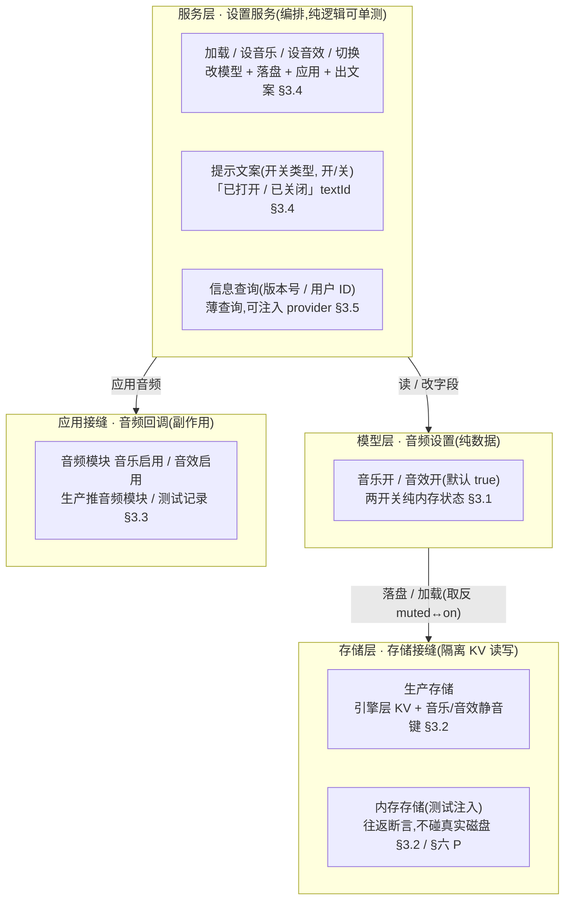
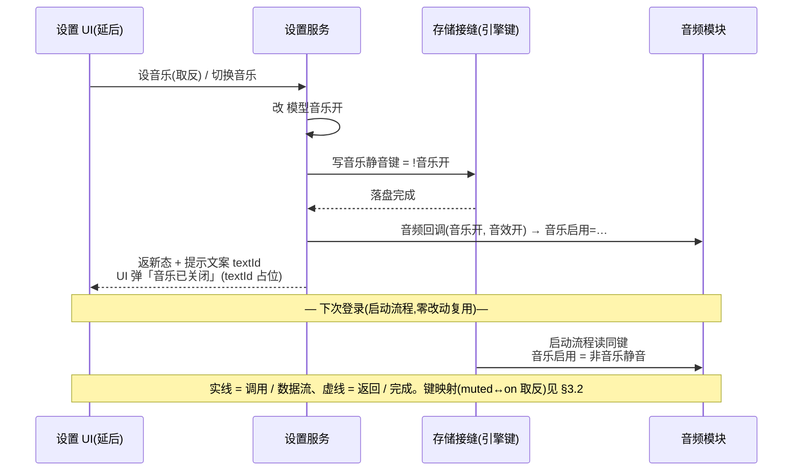

# 通用设置系统 · 数据逻辑层

常规游戏设置界面的**数据逻辑层**:**音频设置**(音乐开 / 关 + 音效开 / 关,默认全开)+ 本地持久化(就近复用引擎层既有的设置持久化约定,启动时加载)+ 应用接缝(把两开关推给音频模块),再加两个**信息查询**(版本号 / 用户 ID 复用 [玩家信息](#18-player-info))。这是系统底层批次第五刀。**数据层先行**:设置模型 + 持久化往返可单测;<mark>设置界面窗口 + 各按钮投放(联系客服 / 新手说明 / 用户协议网址 / 兑换码 / 快捷登录)是表现层,需美术(icon = 主界面设置图标),延后轮,本设计只留服务契约 + 占位常量 + 延后项标记</mark>。

> [!WARNING]
> **读前必看 · 设计边界**
>
> 四条边界先钉死,防把「设置数据层」做成「连 UI + 另造一套设置存储」:
>
> - **音频持久化就近复用引擎层既有设置约定,不另造存储栈。**引擎层**已有**一套设置持久化与启动加载约定:启动流程会在游戏启动时读取音频静音键并应用到音频模块。本设计**写同一套键**(故启动加载零改动即生效),不新建第二套设置存储、不新建第二个键空间。注意引擎键存的是「静音(muted)」语义:`muted=false` 即音乐开;本层模型「开(on)」与之取反映射([§3.2](#19-settings-system::store))。
> - **数据模型 + 服务是纯逻辑,可单测;存储 / 应用经可注入接缝隔离副作用。**音频设置是纯数据(两个布尔),读 / 写 / 切换都是纯内存逻辑。持久化经存储接缝隔离(生产实现包装真实 KV 读写 + 引擎键 / 测试用内存实现注入)。应用到音频模块经可注入回调(生产推音频模块 / 测试记录调用),单测不碰真实音频模块、不碰真实磁盘。验收锚在模型 + 存储往返 + 服务逻辑的单测上。
> - **UI 投放不在本设计。**设置界面窗口 + 各功能按钮(音乐 / 音效开关、联系客服、新手说明、版本号显示、用户协议·隐私网址、用户 ID 与复制、兑换码入口、快捷登录)是表现层,依赖美术(icon = 主界面设置图标)与多个尚未建成的系统跳转,本设计**不**建窗口。本设计交付到「服务契约 + 数据模型 + 信息查询 + 延后项占位常量」,留主界面入口钩子 + 延后项标记(见 [§五](#19-settings-system::hook))。
> - **离线 + 去变现适配(项目方向)。**① 快捷登录 = **不做**(离线无账号系统,同 18 player-info 账号绑定排除);② 联系客服 = spec 自身标「待定」,留占位常量 + 延后项标记;③ 用户协议 / 隐私政策 = 存 URL 常量(占位),UI 接时用系统打开网址能力;④ 兑换码入口 = 依赖未建的兑换码系统,留延后项标记;⑤ 新手说明 → 新手关卡 = 依赖未建的新手 / 教学关,留延后项标记。以上均不阻塞,数据层不返工([§3.6](#19-settings-system::stub))。

> [!NOTE]
> **立项信息**
>
> | 项 | 内容 |
> | --- | --- |
> | **类型** | 新系统 · 通用设置数据逻辑层 出设计稿 + 验收标准。系统底层批次第五刀。 |
> | **方向约束** | 离线还原 · **去变现**:本系统不含充值 / 内购 / 快捷登录(离线无账号);用户协议 / 隐私 / 联系客服仅存占位常量,真实 URL / 客服系统延后。加法式扩展,不破坏既有核心循环 + 已建系统。持久化走非阻塞 KV 读写(不触「禁阻塞 IO」红线,同 14 save-system 口径)。 |
> | **范围** | **数据模型**:音频设置(两布尔,默认全开,[§3.1](#19-settings-system::model-data)); **存储 / 服务**:存储接缝(生产包装引擎层 KV + 引擎键 / 测试内存实现)+ 设置服务(读 / 写 / 切换 / 应用 / 提示文案,[§3.4](#19-settings-system::service)); **信息查询**:版本号 / 用户 ID,经可注入 provider([§3.5](#19-settings-system::info)); **延后项占位**:用户协议 / 隐私 URL 占位 + 客服 / 兑换码 / 新手关跳转标记([§3.6](#19-settings-system::stub))。 **不改引擎层**:写引擎层既有设置键,启动加载零改动即兼容。**UI 零改动**(本设计不建窗口)。**既有玩法逻辑零行为变化**。 |
> | **关键约束** | 数据模型 / 服务为纯逻辑,可在纯单测直接构造 / 静态调用(不依赖资源系统 / 运行时 / 真实音频模块);持久化往返经内存存储注入断言(不碰真实磁盘);音频应用经可注入回调隔离(单测记录两布尔,不触真实音频模块)。既有单测套零回归。 |

## 一、做什么与为什么 {#what}

现状:游戏**没有玩家可见的设置系统**——引擎层虽已有音频开关与启动加载约定(启动时读取音频静音键并应用),但<mark>没有任何运行期入口能让玩家切换并落盘</mark>:玩家无法关音乐 / 音效,也无处看版本号 / 用户 ID。spec 要求建一套「常规游戏设置界面」:信息展示 + 功能设定。

本设计交付其中**数据逻辑层**(spec 主体的可测部分),逐条对应 spec:

| # | 需求(来自 spec 逐字) | 本篇落法 | 形态 |
| --- | --- | --- | --- |
| 1 | 音乐 / 音效开关:默认全部打开;玩家配置本地存储、下次登录用本地配置 | 音频设置模型(两布尔,默认全开,[§3.1](#19-settings-system::model-data))+ 存储接缝写引擎层既有键([§3.2](#19-settings-system::store));启动流程读同键即「下次登录用本地配置」([§四](#19-settings-system::flow)) | 模型 + 存储 |
| 2 | 按开关 开 / 关 游戏音乐音效 | 设置服务经可注入回调把两布尔推给音频模块([§3.3](#19-settings-system::apply)) | 应用接缝 |
| 3 | 点击提示「音乐 / 音效已打开(已关闭)」 | 设置服务按 (开关类型, 开/关) 返提示文案 textId + 占位文本(多语言查表延后,同 num/item 文案口径,[§3.4](#19-settings-system::service)) | 文案 |
| 4 | 当前版本号(显示) | 版本号查询经可注入 provider,默认返应用版本号([§3.5](#19-settings-system::info)) | 查询 |
| 5 | 用户 ID 查看(+ 复制) | 用户 ID 查询复用 [玩家信息](#18-player-info) 的本地唯一 id;复制复用设计 18 既有剪贴板工具([§3.5](#19-settings-system::info)) | 复用 18 |
| 6 | 用户协议和隐私政策(点击打开网址) | 用户协议 / 隐私 URL 占位常量;UI 接时用系统打开网址能力([§3.6](#19-settings-system::stub)) | 占位常量 |
| 7 | 联系客服(spec 标「待定」) | 客服占位常量 + 延后项标记,spec 自身未定形态([§3.6](#19-settings-system::stub)) | 占位 |
| 8 | 新手说明(进新手关卡) | 依赖未建的新手 / 教学关,留跳转标记([§3.6](#19-settings-system::stub)) | 延后 |
| 9 | 兑换码入口 | 依赖未建的兑换码系统,留延后标记([§3.6](#19-settings-system::stub)) | 延后 |
| 10 | 快捷登录 | 离线无账号系统,**不做**(同 18 账号绑定排除)([§3.6](#19-settings-system::stub)) | 不做 |
| 11 | 开启:玩家 1 级即开;道具 / 红点 / 邮件 / 跑马灯 / 运营 / 服务器需求:无;美术:UI 见界面,icon = 主界面设置图标 | 1 级即开 = 设置始终可访问(无门槛逻辑);道具 / 红点 / 邮件 / 运营字段不建;icon / UI 是表现层延后 | 无需逻辑 |

**不做(本设计明确排除):**所有 UI 窗口(设置界面 / 各功能按钮 — 需美术,延后,见 [§七 O1](#19-settings-system::open));快捷登录 / 账号系统(离线无账号);联系客服真实形态(spec 标待定,O2);用户协议 / 隐私真实 URL(占位常量,O3);兑换码系统(未建,O4);新手 / 教学关(未建,O5);多语言文案真实查表(提示文案存 textId + 占位,与 num/item/reward 文案口径一致,O6);音量滑条(spec 只给开 / 关,不给滑条 — 引擎层虽有音量字段,本设计不投放,O7);红点 / 邮件 / 跑马灯 / 运营 / 道具(spec 明示无)。

## 二、系统模型 {#model}

### 2.1 分层(模型 / 存储 / 应用接缝) {#layers}

系统拆三层 + 一组信息查询,各层职责单一、各自可测。**模型层**持有音频设置字段(纯数据,两布尔);**存储层**把模型读 / 写到引擎层既有设置键(经存储接缝隔离 KV 读写);**服务层**编排「切换 → 落盘 → 应用音频 → 出提示文案」;信息查询是独立薄查询(版本号 / 用户 ID)。应用到音频模块经可注入回调(副作用,不单测)。结构图:

### 2.2 加法式接入(复用引擎层既有设置约定) {#additive}

这套设计的关键是<mark>不另造存储栈</mark>。引擎层本就有完整的设置持久化与启动加载约定,本设计只补「运行期可切换并落盘」这一缺口:

| 环节 | 引擎层既有(不动) | 本设计补 |
| --- | --- | --- |
| 键定义 | 音乐 / 音效静音键 | 复用,不新增键 |
| 读写底层 | 非阻塞 KV 读写 + 落盘 | 生产存储实现包装它 |
| 启动加载 | 启动流程读键应用到音频模块 | 零改动 — 本层写同键,启动即读到 |
| 运行期切换 | 缺(无任何入口让玩家切换并落盘) | **本设计主体**:设置服务改模型 + 落盘 + 即时应用 |

> [!NOTE]
> **为什么不并入玩家存档(对比设计 18)?**
>
> 玩家信息(设计 18)是**玩法元层进度**,自然属于游戏存档;而音频开关是**引擎级设置**,引擎层已有专用键且启动流程已在读它。把音频设置塞进游戏存档反而要重新接一遍启动加载、且与引擎约定分叉。<mark>就近复用引擎层既有约定 = 启动加载零改动 + 与引擎口径一致</mark>。两套存储职责不同(游戏元进度 vs 引擎设置),不强行合并。

## 三、设计正文 {#numbers}

### 3.1 音频设置数据模型 {#model-data}

纯数据,两个布尔(音乐开 / 音效开),默认全开(spec:默认全部打开)。无运行时依赖,可单测直接构造。提供「默认全开」工厂作为无存档时的初始态。

| 字段 | 含义 | 默认值 |
| --- | --- | --- |
| 音乐开 | 游戏背景音乐是否启用 | true(spec:默认打开) |
| 音效开 | 游戏音效是否启用 | true(spec:默认打开) |

**约束**:无量化旋钮 —— 两个开关没有数值,默认全部打开(spec 逐字「默认全部打开」)。本设计**不**建音量滑条(spec 只给开 / 关,见 [§七 O7](#19-settings-system::open))。模型可序列化、无运行时依赖,使其能在纯单测里直接构造、不触资源系统或音频模块。

### 3.2 存储接缝 + 引擎键映射(静音键 ↔ 开关) {#store}

存储经接缝隔离,使单测能注入内存实现、断言往返,不碰真实磁盘。接缝定义最小读写契约(按键读 / 写一个布尔);生产实现包装引擎层的非阻塞 KV 读写并写引擎既有静音键(写后落盘),测试实现用内存字典做往返断言、不污染真实存储。**键映射是本节关键**:引擎键存「静音(muted)」语义,本层模型存「开(on)」语义,落盘 / 加载时<mark>取反</mark>。这样启动流程(读「非静音」应用到音频模块)无需改动即能正确读到本层写入的值。

**键映射表**(muted ↔ on 取反,默认 muted=false 即 on=true):

| 模型字段 | 引擎静音键 | 落盘(写) | 加载(读) |
| --- | --- | --- | --- |
| 音乐开 | 音乐静音键 | 写入 `!音乐开` | 读「非音乐静音」(默认 false) |
| 音效开 | 音效静音键 | 写入 `!音效开` | 读「非音效静音」(默认 false) |

**默认 / 边界逐档代入**:

| 场景 | 存储中「音乐静音」 | 加载后「音乐开」 | 说明 |
| --- | --- | --- | --- |
| 首次游玩(无键) | 不存在 → 取默认 false | `!false = true` | 默认音乐开,符合 spec |
| 玩家关过音乐 | true(已写 muted) | `!true = false` | 下次登录沿用「关」 |
| 玩家关后又开 | false | `!false = true` | 回到「开」 |

**键来源**:本层引用引擎层既有的静音键常量,<mark>不</mark>在本层硬编码字符串字面量(防与引擎键漂移)。

### 3.3 应用接缝(推给音频模块) {#apply}

切换后须即时把两布尔应用到真实音频模块,玩家才听得到效果。这是**副作用**,经可注入回调隔离:生产侧在接线时注入一个把两布尔推给音频模块开关的回调,测试侧注入一个记录调用的回调。模型 / 服务本身不引用音频模块,保持纯逻辑可单测。

> [!NOTE]
> **应用路径属实现细节,不影响本层验收**
>
> 把两布尔推给音频模块「音乐启用 / 音效启用」开关,具体走哪条模块访问路径属实现细节。<mark>回调内部用哪条访问路径不影响本层验收</mark> —— 验收只断言回调被以正确的 (音乐开, 音效开) 调用([§六 A](#19-settings-system::accept)),真实音频生效走 Play 手验遗留。

### 3.4 设置服务(读 / 写 / 切换 / 提示文案) {#service}

编排层:把「改模型 → 落盘 → 应用音频 → 出提示文案」串起来。状态只持有一个音频设置实例 + 注入的存储接缝 + 可空的音频应用回调(未接 UI 时为空)。提供的行为:

| 行为 | 含义 |
| --- | --- |
| 加载 | 从存储读两键(取反静音为「开」),无键 → 默认全开 |
| 设音乐(开/关) | 改模型音乐开 → 落盘(写音乐静音键为取反值)→ 应用音频回调 |
| 设音效(开/关) | 改模型音效开 → 落盘(写音效静音键为取反值)→ 应用音频回调 |
| 切换音乐 / 切换音效 | 翻转当前值后走「设音乐 / 设音效」,返回新值 |
| 提示文案 | 按 (开关类型, 开/关) 返提示文案 textId |

落盘时把「开」取反写入对应静音键(开 → 非静音);应用时若回调非空则以当前两布尔调用(回调为空不抛)。

**提示文案**:按 (开关类型, 开/关) 返多语言 textId(占位常量,真实查表延后,与 num/item/reward 文案口径一致,见 [§七 O6](#19-settings-system::open))。spec 的「音乐已打开 / 已关闭」「音效已打开 / 已关闭」共四条,本设计给 textId + 占位中文常量,UI 接多语言表时替换。

### 3.5 信息查询(版本号 / 用户 ID) {#info}

两个薄查询,经可注入 provider 使纯逻辑可测:

- **版本号**:默认返应用版本号;测试可注入固定值断言格式化。
- **用户 ID**:复用 [玩家信息](#18-player-info) 的本地唯一 id;入参为空时返空串(不抛)。

**用户 ID 复制**:spec 要求「用户 ID 查看」,设计 18 已建剪贴板复制工具(经可注入回调)。复制按钮 UI 接时直接调它,本层不重复造剪贴板工具。

### 3.6 延后项的占位常量与延后标记 {#stub}

spec 列了多个「跳转到其它系统」的入口,这些系统多数未建。本设计给占位常量 + 延后标记,不阻塞数据层验收:

| 入口 | 本设计形态 | 说明 |
| --- | --- | --- |
| 用户协议 / 隐私政策 | 占位 URL 常量 | UI 接时用系统打开网址能力(O3);有真实 URL 时替换 |
| 联系客服 | 空占位常量 + 延后标记 | spec 自身标「待定」,形态未定(O2) |
| 新手说明 → 新手关卡 | 延后标记 | 依赖未建的新手 / 教学关,UI 接到真实系统时填(O5) |
| 兑换码入口 | 延后标记 | 依赖未建的兑换码系统(O4) |

**快捷登录 = 不做**:离线无账号系统(同设计 18 账号绑定排除),不留钩子(不投机性建未来用不上的接口)。

## 四、切换音乐开关时序 {#flow}

玩家点音乐开关 → 服务改模型 → 落盘(写引擎键)→ 应用到音频模块 → 出提示文案;下次登录启动流程读同键应用。三方参与(UI / 服务 / 存储+音频),用时序图归纳:

## 五、集成意图与交付边界 {#hook}

设置是<mark>通用系统</mark>(非玩法专属),逻辑上独立于核心玩法、与玩法解耦。本设计交付到数据逻辑层并止于此:

- **交付**:音频设置模型([§3.1](#19-settings-system::model-data))、存储接缝(生产 + 内存两实现,[§3.2](#19-settings-system::store))、设置服务(读 / 写 / 切换 / 应用 / 文案,[§3.4](#19-settings-system::service))、信息查询(版本号 / 用户 ID,[§3.5](#19-settings-system::info))、延后项占位常量与标记([§3.6](#19-settings-system::stub)),以及覆盖模型 / 存储往返 / 服务切换 / 信息查询的单测([§六](#19-settings-system::accept))。
- **音频应用接缝**:只给回调契约(以两布尔推音频模块开关),生产侧的接线在 UI 投放时注入([§3.3](#19-settings-system::apply))。
- **主界面入口钩子**:设置图标 → 打开设置窗口,UI 表现层,本设计不建窗口(沿用 17/18 延后做法),仅留入口标记。
- **不改引擎层**:本层写引擎层既有设置键,启动加载零改动即兼容;启动流程 / 引擎键定义 / 音频模块接口均不动。

## 六、验收点 {#accept}

全部可单测(纯逻辑 + 注入隔离)。落地后须逐条核对。验收锚在**设置模型 + 持久化往返 + 服务逻辑 + 信息查询**;真实音频生效 / UI 视觉 → Play 手验遗留(boss 授权)。

| 组 | # | 验收点(完成定义,可逐条核对) |
| --- | --- | --- |
| 模型 M | M1 | 默认全开工厂产出的设置「音乐开 && 音效开」(spec:默认全开) |
| 模型 M | M2 | 直接构造的设置初值同为开(默认全开,不依赖工厂) |
| 模型 M | M3 | 设置模型可序列化且无运行时依赖(可在纯单测构造,不触资源系统 / 音频模块) |
| 存储往返 P(注入内存存储) | P1 | 空存储(无键)→ 加载后「音乐开 && 音效开」(无键走默认全开) |
| 存储往返 P(注入内存存储) | P2 | 设音乐为关后,存储中「音乐静音」为 true(开→取反静音正确) |
| 存储往返 P(注入内存存储) | P3 | 设音乐为关后,用同一存储重新加载 → 音乐开为 false(跨实例往返保真,模拟「下次登录用本地配置」) |
| 存储往返 P(注入内存存储) | P4 | 设音效为关不影响「音乐静音」键(两键独立),且「音效静音」为 true |
| 存储往返 P(注入内存存储) | P5 | 关后再开:设音乐关再设音乐开 → 存储中「音乐静音」为 false、重新加载回「音乐开」 |
| 服务 S | S1 | 切换音乐翻转并返回新值;连续两次回到原值 |
| 服务 S | S2 | 设音乐为关触发音频回调被以 (音乐关, 当前音效) 调用(应用接缝按当前两布尔推送);回调为空时不抛 |
| 服务 S | S3 | 提示文案对 (音乐,开/关) 与 (音效,开/关) 四组各返不同的非 0 textId(对应 spec 四条提示) |
| 服务 S | S4 | 落盘写入的键确为引擎层既有静音键(非硬编码字面量) |
| 信息 I | I1 | 注入固定版本号 provider → 版本号查询返该固定值(provider 可注入) |
| 信息 I | I2 | 不注入时版本号查询返应用版本号(可读,非空) |
| 信息 I | I3 | 用户 ID 查询返玩家信息的 id;入参为空 → 返空串(不抛) |
| 回归 / 编译 R | R1 | 编译 0 error;既有单测套全绿(零回归);新增设置测试全绿 |
| 回归 / 编译 R | R2 | Code Review 5 红线:异步优先 / 模块访问 / 资源释放 / 热更边界 / 事件解耦(本层无资源加载、无事件,重点核「非阻塞 KV 不触同步 IO 红线」「音频访问经正路径」) |

> [!WARNING]
> **不在本设计验收(boss 授权遗留)**
>
> 真实音频开 / 关实听(切开关后真听到音乐停 / 起)、设置界面 UI 视觉、各跳转按钮(协议网址打开 / 兑换码 / 新手关 / 客服)→ <mark>Play 手验遗留 + 表现层延后轮</mark>。这些依赖美术(icon)与未建系统,数据层不返工。

## 七、待拍板清单 {#open}

以下为范围开关,boss 自治授权下**均取安全默认推进**(已在 boss 预先拍板内),列此备查;要改另开增量轮。

| # | 开关 | 本设计默认 | 备选 / 触发改动 |
| --- | --- | --- | --- |
| O1 | 设置界面 UI + 各按钮投放 | **延后**(需美术 icon,留服务 + 钩子) | 有美术 + 具体 UI 流程时接真实窗口,Play 手验 |
| O2 | 联系客服形态 | 占位常量 + 延后标记(spec 自身标待定) | spec 定形态后补(邮箱 / 网页 / 工单) |
| O3 | 用户协议 / 隐私 URL | 占位 URL 常量 | 有真实 URL 时替换常量,UI 用系统打开网址能力 |
| O4 | 兑换码入口 | 延后标记(依赖未建兑换码系统) | 兑换码系统建成后接入 |
| O5 | 新手说明 → 新手关卡 | 延后标记(依赖未建新手 / 教学关) | 新手关建成后接跳转 |
| O6 | 提示文案多语言 | textId 占位常量 + 中文占位(同 num/item/reward 文案口径) | 多语言文本表建成后查表替换 |
| O7 | 音量滑条 | **不做**(spec 只给开 / 关,引擎层虽有音量字段) | 要细粒度音量时新增滑条 + 音量值落盘 |
| O8 | 快捷登录 | **不做**(离线无账号,不留钩子) | 若上账号系统需单独排期 |
| O9 | UI 音效开关 | **不做**(spec 只列「音乐 / 音效」两项;引擎层另有 UI 音效开关) | 要独立 UI 音效开关时加第三个布尔 + 复用引擎层 UI 音效静音键 |

## 八、风险表 {#risk}

| 风险 | 应对 |
| --- | --- |
| **键映射取反写错**:把「音乐开」直接写进「音乐静音」键(不取反)→ 与启动流程(读「非静音」)语义相反,玩家关音乐反而下次开 | §3.2 键映射表逐档代入 + 验收 P2/P3/P5 专门断言取反正确(关后存储中静音为 true、加载回 false);必跑这三条 |
| **音频访问路径选错**:误用不可达的访问路径导致编译错或运行期空引用 | §3.3 标注应用路径属实现细节,验收不依赖此选择;回调隔离使本层验收不受影响 |
| **误改引擎层代码**:为「接通」去改启动流程 / 引擎键定义 / 音频模块接口 | §五 明列「不改引擎层」;本层复用引擎既有键,启动加载零改动即兼容,改引擎层反而破坏其它依赖 |
| **另造存储栈**:把音频设置塞进游戏存档或新建第二套设置键 | §2.2 显式说明复用引擎既有约定的理由(启动加载零改动 + 口径一致);读前必看第 1 条钉死 |
| **过度建延后系统**:为快捷登录 / 客服 / 兑换码建未来用不上的接口 | §3.6 / §七 区分「占位常量(协议 URL)」「占位(客服)」「延后标记(兑换码 / 新手关)」「不做(快捷登录)」四档,不投机性建接口 |
