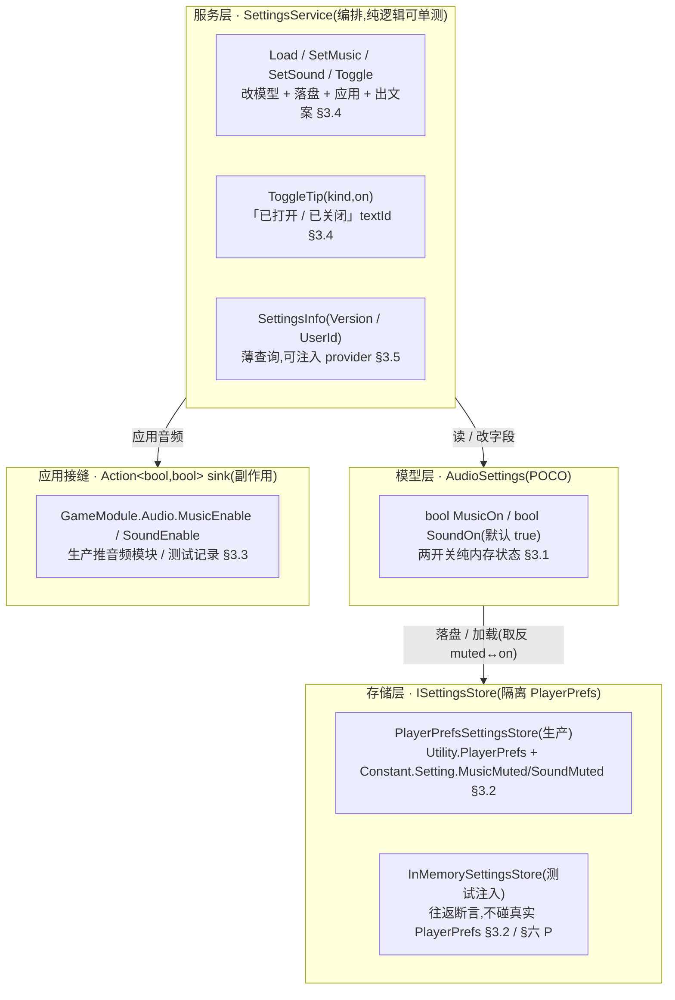
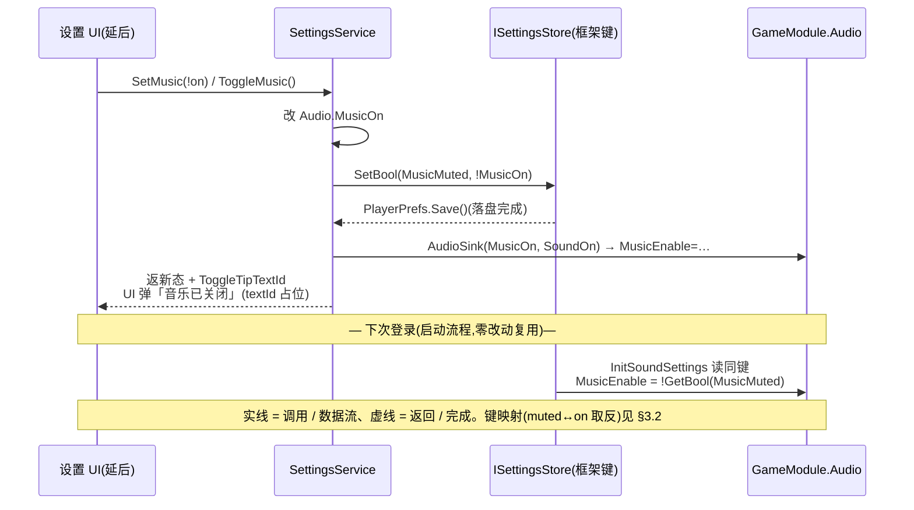

# 通用设置系统 · 数据逻辑层

常规游戏设置界面的<b>数据逻辑层</b>:<b>音频设置</b>(音乐开 / 关 + 音效开 / 关,默认全开)+ 本地持久化(复用框架既有 `Constant.Setting` 键 + `Utility.PlayerPrefs`,启动加载)+ 应用接缝(把两开关推给 TEngine 既有 `GameModule.Audio`),再加两个<b>信息 getter</b>(版本号 `Application.version` / 用户 ID 复用 [玩家信息](#18-player-info) 的 `PlayerInfo.Id`)。这是 xlsx 系统底层批次第五刀。<b>数据层先行</b>(沿用 15/16/17/18 节奏):设置模型 + 持久化往返 EditMode 可测;<mark>设置界面窗口 + 各按钮投放(联系客服 / 新手说明 / 用户协议网址 / 兑换码 / 快捷登录)是表现层,需美术(icon = 主界面设置图标),延后轮,本轮只留服务 + 钩子常量 + TODO</mark>。

    <b>读前必看 · 与工程现状的关系(单一事实源 = 代码)</b>
    
四条边界先钉死,防 dev 把「设置数据层」做成「连 UI + 另造一套设置存储」:

    <ul style="margin:8px 0 0">
      <li><b>音频持久化复用框架既有设置约定,不另造存储栈。</b>TEngine 框架<mark>已有</mark>一套设置持久化约定:键 <code>TEngine.Constant.Setting.MusicMuted</code>/<code>SoundMuted</code>(见 <code>Assets/TEngine/Runtime/Core/Constant/Constant.cs</code>),经 <code>TEngine.Utility.PlayerPrefs.GetBool/SetBool</code> 读写,启动流程 <code>ProcedureLaunch.InitSoundSettings()</code>(<code>Assets/GameScripts/Procedure/ProcedureLaunch.cs:83</code>)在游戏启动时读这些键并应用到 <code>_audioModule.MusicEnable/SoundEnable</code>。本轮<mark>写这同一套键</mark>(故启动加载零改动即生效),不新建第二套设置存储、不新建第二个 PlayerPrefs 键空间。注意框架键存的是「静音(muted)」语义:<code>MusicMuted=false</code> 即音乐开;本层模型 <code>MusicOn</code> 与之取反映射(<a href="#19-settings-system::store">§3.2</a>)。</li>
      <li><b>数据模型 + 服务是纯逻辑,可单测;存储 / 应用经可注入接缝隔离副作用。</b><code>AudioSettings</code> 是纯 POCO(两 bool),读 / 写 / 切换都是纯内存逻辑。持久化经 <code>ISettingsStore</code> 接缝(生产包 <code>Utility.PlayerPrefs</code> + 框架键 / 测试用 InMemory 注入),仿工程既有 <code>IPersistenceProvider</code>(<code>Assets/GameScripts/HotFix/GameLogic/Module/BlockBlast/Persistence.cs</code>)做法。应用到音频模块经可注入 <code>Action&lt;bool,bool&gt;</code> sink(生产推 <code>GameModule.Audio</code> / 测试记录调用),单测不碰真实音频模块、不碰真实 PlayerPrefs。验收锚在模型 + 存储往返 + 服务逻辑的 EditMode 单测上。</li>
      <li><b>UI 投放不在本轮。</b>设置界面窗口 + 各功能按钮(音乐 / 音效开关、联系客服、新手说明、版本号显示、用户协议·隐私网址、用户 ID 与复制、兑换码入口、快捷登录)是表现层,依赖美术(icon = 主界面设置图标)与多个尚未建成的系统跳转,本轮<mark>不</mark>建窗口、不挂 prefab。本轮交付到「服务方法 + 数据模型 + 信息 getter + 延后项钩子常量」,留主界面入口钩子 + TODO(见 <a href="#19-settings-system::hook">§五</a>)。</li>
      <li><b>离线 + 去变现适配(项目方向)。</b>① 快捷登录 = <mark>不做</mark>(离线无账号系统,同 18 player-info 账号绑定 out);② 联系客服 = spec 自身标「待定」,留 stub 常量 + TODO;③ 用户协议 / 隐私政策 = 存 URL 常量(占位),UI 接时用 <code>Application.OpenURL</code>;④ 兑换码入口 = 依赖未建的兑换码系统,留 TODO 钩子;⑤ 新手说明 → 新手关卡 = 依赖未建的新手 / 教学关,留 TODO 钩子。以上均不阻塞,数据层不返工(<a href="#19-settings-system::stub">§3.6</a>)。</li>
    </ul>
  

    <b>立项信息</b>
    <table>
      <tbody><tr><th>类型</th><td>新系统 · 通用设置数据逻辑层 出设计稿 + 验收标准,交开发落地。xlsx 系统底层批次第五刀。</td></tr>
      <tr><th>设计基线(经 grep 核实的真实符号)</th><td>
        <b>音频模块</b>:<code>TEngine.IAudioModule</code>(<code>Assets/TEngine/Runtime/Module/AudioModule/IAudioModule.cs</code>),布尔开关 <code>MusicEnable</code>/<code>SoundEnable</code>/<code>UISoundEnable</code>(get/set);运行期经 <code>ModuleSystem.GetModule&lt;IAudioModule&gt;()</code>(<code>ProcedureLaunch.cs:19</code>;注:framework 未挂 <code>GameModule.Audio</code> 便捷属性于本工程的 HotFix 可达性须 dev 用 grep 复核,见 <a href="#19-settings-system::apply">§3.3</a>)。 
        <b>设置持久化约定</b>:键常量 <code>TEngine.Constant.Setting.MusicMuted="Setting.MusicMuted"</code>/<code>SoundMuted="Setting.SoundMuted"</code>(<code>Constant.cs:13,15</code>);读写 <code>TEngine.Utility.PlayerPrefs.GetBool(key,def)</code>/<code>SetBool(key,value)</code>/<code>Save()</code>(<code>Utility.PlayerPrefs.cs:153,162,283</code>);启动加载 <code>ProcedureLaunch.InitSoundSettings()</code>(<code>ProcedureLaunch.cs:83</code>,读 <code>!GetBool(MusicMuted,false)</code> 应用到 <code>_audioModule.MusicEnable</code>)。 
        <b>持久化接缝范本</b>:<code>GameLogic.BlockBlast.IPersistenceProvider</code> + <code>Persistence.Provider</code>(默认 <code>PlayerPrefsProvider</code> / 测试 <code>InMemoryPersistenceProvider</code>,<code>Persistence.cs</code>)——<code>ISettingsStore</code> 仿此模式。 
        <b>用户 ID</b>:<code>GameLogic.BlockBlast.Player.PlayerInfo.Id</code>(string,本地生成本地唯一,设计 18 §3.1)。 
        <b>版本号</b>:<code>UnityEngine.Application.version</code>(Editor 直读 PlayerSettings 版本号)。
      </td></tr>
      <tr><th>方向约束</th><td>离线还原 · <b>去变现</b>:本系统不含充值 / 内购 / 快捷登录(离线无账号);用户协议 / 隐私 / 联系客服仅存占位常量,真实 URL / 客服系统延后。加法式扩展,不破坏既有核心循环 + 已建系统。IO 走框架既有 <code>Utility.PlayerPrefs</code>(PlayerPrefs 为非阻塞 KV、不触「禁阻塞 IO」红线,同 14 save-system 口径)。</td></tr>
      <tr><th>影响范围</th><td>
        <b>新增数据模型</b>:<code>AudioSettings</code>(POCO,两 bool,<a href="#19-settings-system::model-data">§3.1</a>); 
        <b>新增存储 / 服务</b>:<code>ISettingsStore</code> + <code>PlayerPrefsSettingsStore</code>(包 <code>Utility.PlayerPrefs</code> + 框架键) + <code>InMemorySettingsStore</code>(测试) + <code>SettingsService</code>(读 / 写 / 切换 / 应用 / 提示文案,<a href="#19-settings-system::service">§3.4</a>); 
        <b>新增信息 getter</b>:<code>SettingsInfo</code>(版本号 / 用户 ID,经可注入 provider,<a href="#19-settings-system::info">§3.5</a>); 
        <b>新增钩子常量</b>:<code>SettingsLinks</code>(用户协议 / 隐私 URL 占位 + 客服 / 兑换码 / 新手关跳转 TODO 标记,<a href="#19-settings-system::stub">§3.6</a>)。 
        <b>改既有</b>:无(写框架既有 <code>Constant.Setting</code> 键,不改框架代码;<code>ProcedureLaunch.InitSoundSettings</code> 零改动即兼容)。<b>UI 零改动</b>(本轮不建窗口)。<b>既有玩法逻辑零行为变化</b>。
      </td></tr>
      <tr><th>关键约束(继承现状)</th><td>数据模型 / 服务为纯逻辑,可在纯 C# 单测直接 <code>new</code> / 静态调用(不依赖 YooAsset / Unity 运行时 / 真实音频模块);持久化往返经 <code>InMemorySettingsStore</code> 注入断言(不碰真实 PlayerPrefs);音频应用经可注入 sink 隔离(单测记录两 bool,不触 <code>GameModule.Audio</code>)。现有 279 例 EditMode 零回归。</td></tr>
    </tbody></table>
  

<h2 id="what">一、做什么与为什么</h2>

现状:游戏<b>没有玩家可见的设置系统</b>——框架虽已有音频开关字段(`IAudioModule.MusicEnable/SoundEnable`)与启动加载约定(`InitSoundSettings` 读 `Constant.Setting` 键),但<mark>没有任何运行期入口能让玩家切换并落盘</mark>:玩家无法关音乐 / 音效,也无处看版本号 / 用户 ID。spec(`1005通用设置系统.xlsx`)要求建一套「常规游戏设置界面」:信息展示 + 功能设定。

本轮交付其中<b>数据逻辑层</b>(spec 主体的可测部分),逐条对应 spec:

| # | 需求(来自 spec 逐字) | 本篇落法 | 现状/新增 |
| --- | --- | --- | --- |
| 1 | 音乐 / 音效开关:默认全部打开;玩家配置本地存储、下次登录用本地配置 | `AudioSettings`(两 bool,默认全开,[§3.1](#19-settings-system::model-data))+ `ISettingsStore` 写框架既有键([§3.2](#19-settings-system::store));启动 `InitSoundSettings` 读同键即「下次登录用本地配置」([§四](#19-settings-system::flow)) | 新增模型 + 存储 |
| 2 | 按开关 开 / 关 游戏音乐音效 | `SettingsService.ApplyToAudio` 经可注入 sink 把两 bool 推给 `GameModule.Audio.MusicEnable/SoundEnable`([§3.3](#19-settings-system::apply)) | 新增应用接缝 |
| 3 | 点击提示「音乐 / 音效已打开(已关闭)」 | `SettingsService.ToggleTip(kind,on)` 返提示文案 textId + 占位文本(多语言查表延后,同 num/item NameTextId,[§3.4](#19-settings-system::service)) | 新增文案 |
| 4 | 当前版本号(显示) | `SettingsInfo.Version` 经可注入 provider 默认返 `Application.version`([§3.5](#19-settings-system::info)) | 新增 getter |
| 5 | 用户 ID 查看(+ 复制) | `SettingsInfo.UserId(playerInfo)` 复用 `PlayerInfo.Id`;复制复用设计 18 既有 `ClipboardUtil.Copy`([§3.5](#19-settings-system::info)) | 复用 18 |
| 6 | 用户协议和隐私政策(点击打开网址) | `SettingsLinks.UserAgreementUrl/PrivacyPolicyUrl` 占位 URL 常量;UI 接时用 `Application.OpenURL`([§3.6](#19-settings-system::stub)) | 占位常量 |
| 7 | 联系客服(spec 标「待定」) | `SettingsLinks.ContactSupport` stub 常量 + TODO,spec 自身未定形态([§3.6](#19-settings-system::stub)) | stub |
| 8 | 新手说明(进新手关卡) | 依赖未建的新手 / 教学关,留跳转 TODO 钩子([§3.6](#19-settings-system::stub)) | 钩子延后 |
| 9 | 兑换码入口 | 依赖未建的兑换码系统,留 TODO 钩子([§3.6](#19-settings-system::stub)) | 钩子延后 |
| 10 | 快捷登录 | 离线无账号系统,<b>不做</b>(同 18 账号绑定 out)([§3.6](#19-settings-system::stub)) | 不做 |
| 11 | 开启:玩家 1 级即开;道具 / 红点 / 邮件 / 跑马灯 / 运营 / 服务器需求:无;美术:UI 见界面,icon = 主界面设置图标 | 1 级即开 = 设置始终可访问(无门槛逻辑);道具 / 红点 / 邮件 / 运营字段不建;icon / UI 是表现层延后 | 无需逻辑 |

<b>不做(本轮明确排除):</b>所有 UI 窗口(设置界面 / 各功能按钮 — 需美术,延后,见 [§七 O1](#19-settings-system::open));快捷登录 / 账号系统(离线无账号);联系客服真实形态(spec 标待定,O2);用户协议 / 隐私真实 URL(占位常量,O3);兑换码系统(未建,O4);新手 / 教学关(未建,O5);多语言文案真实查表(提示文案存 textId + 占位,与 num/item/reward NameTextId 现状一致,O6);音量滑条(spec 只给开 / 关,不给滑条 — 框架虽有 `MusicVolume` 字段,本轮不投放,O7);红点 / 邮件 / 跑马灯 / 运营 / 道具(spec 明示无)。

<h2 id="model">二、系统模型</h2>

<h3 id="layers">2.1 分层(模型 / 存储 / 应用接缝)</h3>

系统拆三层 + 一组信息 getter,各层职责单一、各自可测。<b>模型层</b>持有音频设置字段(纯 POCO,两 bool);<b>存储层</b>把模型读 / 写到框架既有 `Constant.Setting` 键(经 `ISettingsStore` 接缝隔离 PlayerPrefs);<b>服务层</b>编排「切换 → 落盘 → 应用音频 → 出提示文案」;信息 getter 是独立薄查询(版本号 / 用户 ID)。应用到 `GameModule.Audio` 经可注入 sink(副作用,不单测)。结构图:

<h3 id="additive">2.2 加法式接入(复用框架既有设置约定)</h3>

这套设计的关键是<mark>不另造存储栈</mark>。框架本就有完整的设置持久化与启动加载约定,本轮只补「运行期可切换并落盘」这一缺口:

| 环节 | 框架既有(不动) | 本轮补 |
| --- | --- | --- |
| 键定义 | `Constant.Setting.MusicMuted/SoundMuted` | 复用,不新增键 |
| 读写底层 | `Utility.PlayerPrefs.GetBool/SetBool/Save` | `PlayerPrefsSettingsStore` 包装它 |
| 启动加载 | `ProcedureLaunch.InitSoundSettings()` 读键应用到音频模块 | 零改动 — 本层写同键,启动即读到 |
| 运行期切换 | 缺(无任何入口让玩家切换并落盘) | <b>本轮主体</b>:`SettingsService` 改模型 + 落盘 + 即时应用 |

    <b>为什么不并入 MergeMetaSave(对比设计 18)?</b>
    
玩家信息(设计 18)是<b>玩法元层进度</b>,自然属于 <code>MergeMetaSave</code> 这套游戏存档;而音频开关是<b>引擎级设置</b>,框架已有专用键(<code>Constant.Setting</code>)且启动流程已在读它。把音频设置塞进 <code>MergeMetaSave</code> 反而要重新接一遍启动加载、且与框架约定分叉。<mark>就近复用框架既有约定 = 启动加载零改动 + 与框架口径一致</mark>。两套存储职责不同(游戏元进度 vs 引擎设置),不强行合并。

  

<h2 id="numbers">三、设计正文</h2>

<h3 id="model-data">3.1 音频设置数据模型 AudioSettings</h3>

纯 POCO,两个 bool,默认全开(spec:默认全部打开)。无 Unity 依赖,单测直接 `new`。

<pre class="code">namespace GameLogic.Settings  // 新建命名空间，与 BlockBlast 玩法解耦（设置是通用系统）
{
    [System.Serializable]
    public sealed class AudioSettings
    {
        public bool MusicOn = true;   // spec：默认打开
        public bool SoundOn = true;   // spec：默认打开
        /// &lt;summary&gt;默认全开（无存档时的初始态）。&lt;/summary&gt;
        public static AudioSettings CreateDefault() =&gt; new AudioSettings();
    }
}</pre>

<b>约束</b>:无量化旋钮 —— 两 bool 没有数值,默认常量是 `MusicOn=true`/`SoundOn=true`(spec 逐字「默认全部打开」)。本轮<b>不</b>建音量滑条(spec 只给开 / 关,见 [§七 O7](#19-settings-system::open))。

<h3 id="store">3.2 存储接缝 + 框架键映射(MusicMuted/SoundMuted)</h3>

存储经接缝隔离,使单测能注入 InMemory 实现、断言往返,不碰真实 PlayerPrefs。<b>键映射是本节关键</b>:框架键存「静音(muted)」语义,本层模型存「开(on)」语义,落盘 / 加载时<mark>取反</mark>。这样 `ProcedureLaunch.InitSoundSettings()`(读 `!GetBool(MusicMuted,false)`)无需改动即能正确读到本层写入的值。

<pre class="code">namespace GameLogic.Settings
{
    /// &lt;summary&gt;设置存储接缝。生产包 Utility.PlayerPrefs + 框架键；测试用 InMemory 注入。&lt;/summary&gt;
    public interface ISettingsStore
    {
        bool GetBool(string key, bool defaultValue);
        void SetBool(string key, bool value);
    }
    /// &lt;summary&gt;生产实现：直写框架既有 Constant.Setting 键，故启动 InitSoundSettings 零改动即生效。&lt;/summary&gt;
    public sealed class PlayerPrefsSettingsStore : ISettingsStore
    {
        public bool GetBool(string key, bool def) =&gt; TEngine.Utility.PlayerPrefs.GetBool(key, def);
        public void SetBool(string key, bool v)  { TEngine.Utility.PlayerPrefs.SetBool(key, v); TEngine.Utility.PlayerPrefs.Save(); }
    }
    /// &lt;summary&gt;测试实现：内存字典，往返断言不污染真实 PlayerPrefs。&lt;/summary&gt;
    public sealed class InMemorySettingsStore : ISettingsStore
    {
        private readonly System.Collections.Generic.Dictionary&lt;string,bool&gt; _m = new();
        public bool GetBool(string key, bool def) =&gt; _m.TryGetValue(key, out var v) ? v : def;
        public void SetBool(string key, bool v) =&gt; _m[key] = v;
    }
}</pre>

<b>键映射表</b>(muted ↔ on 取反,默认 muted=false 即 on=true):

| 模型字段 | 框架键(`Constant.Setting`) | 落盘(写) | 加载(读) |
| --- | --- | --- | --- |
| `MusicOn` | Setting.MusicMuted | `store.SetBool(MusicMuted, !MusicOn)` | `MusicOn = !store.GetBool(MusicMuted, false)` |
| `SoundOn` | Setting.SoundMuted | `store.SetBool(SoundMuted, !SoundOn)` | `SoundOn = !store.GetBool(SoundMuted, false)` |

<b>默认 / 边界逐档代入</b>:

| 场景 | PlayerPrefs 中 MusicMuted | 加载后 MusicOn | 说明 |
| --- | --- | --- | --- |
| 首次游玩(无键) | 不存在 → `GetBool` 返默认 false | `!false = true` | 默认音乐开,符合 spec |
| 玩家关过音乐 | true(已写 muted) | `!true = false` | 下次登录沿用「关」 |
| 玩家关后又开 | false | `!false = true` | 回到「开」 |

<b>键常量来源</b>:dev 直接引用 `TEngine.Constant.Setting.MusicMuted`/`SoundMuted`,<mark>不</mark>在本层硬编码字符串字面量(防与框架键漂移)。`SettingsService` 内持这两个 key 的引用。

<h3 id="apply">3.3 应用接缝(推给 GameModule.Audio)</h3>

切换后须即时把两 bool 应用到真实音频模块,玩家才听得到效果。这是<b>副作用</b>,经可注入 `Action<bool,bool>` sink 隔离:生产传一个推 `GameModule.Audio` 的 lambda,测试传一个记录调用的 lambda。模型 / 服务本身不引用音频模块,保持纯逻辑可单测。

<pre class="code">// 生产侧（UI / 启动接线时注入；本轮只给约定，UI 投放延后）：
service.AudioSink = (musicOn, soundOn) =&gt;
{
    GameModule.Audio.MusicEnable = musicOn;
    GameModule.Audio.SoundEnable = soundOn;
};
// 测试侧：
bool? lastMusic = null, lastSound = null;
service.AudioSink = (m, s) =&gt; { lastMusic = m; lastSound = s; };</pre>

    <b>dev 须 grep 核实的接缝</b>
    
tengine-dev references 给的 <code>GameModule.Audio</code> 便捷属性、与启动流程实际用的 <code>ModuleSystem.GetModule&lt;IAudioModule&gt;()</code>(<code>ProcedureLaunch.cs:19</code>)是两种访问路径。<code>IAudioModule.MusicEnable/SoundEnable</code> 这对布尔属性已 grep 确认存在(<code>IAudioModule.cs:43,48</code>);但 <code>GameModule.Audio</code> 在 HotFix 程序集的可达性 dev 须 grep 核实(若 HotFix 不可直达,改用 <code>ModuleSystem.GetModule&lt;IAudioModule&gt;()</code> 同 <code>ProcedureLaunch</code>)。<mark>sink 内部用哪条访问路径属 dev 实现细节,不影响本层验收</mark> —— 验收只断言 sink 被以正确的 (MusicOn, SoundOn) 调用(<a href="#19-settings-system::accept">§六 A</a>),真实音频生效走 Play 手验遗留。

  

<h3 id="service">3.4 设置服务 SettingsService(读 / 写 / 切换 / 提示文案)</h3>

编排层:把「改模型 → 落盘 → 应用音频 → 出提示文案」串起来。无状态以外只持有 `AudioSettings` 实例 + 注入的 `ISettingsStore` + `AudioSink`。

<pre class="code">namespace GameLogic.Settings
{
    public sealed class SettingsService
    {
        public AudioSettings Audio { get; private set; } = AudioSettings.CreateDefault();
        private readonly ISettingsStore _store;
        public System.Action&lt;bool,bool&gt; AudioSink;   // (musicOn, soundOn)，可空（未接 UI 时）
        public SettingsService(ISettingsStore store) =&gt; _store = store;
        /// &lt;summary&gt;从存储加载（muted 取反为 on）。无键 → 默认全开。&lt;/summary&gt;
        public void Load()
        {
            Audio.MusicOn = !_store.GetBool(TEngine.Constant.Setting.MusicMuted, false);
            Audio.SoundOn = !_store.GetBool(TEngine.Constant.Setting.SoundMuted, false);
        }
        public void SetMusic(bool on) { Audio.MusicOn = on; Persist(); Apply(); }
        public void SetSound(bool on) { Audio.SoundOn = on; Persist(); Apply(); }
        public bool ToggleMusic() { SetMusic(!Audio.MusicOn); return Audio.MusicOn; }
        public bool ToggleSound() { SetSound(!Audio.SoundOn); return Audio.SoundOn; }
        private void Persist()
        {
            _store.SetBool(TEngine.Constant.Setting.MusicMuted, !Audio.MusicOn);  // on → !muted
            _store.SetBool(TEngine.Constant.Setting.SoundMuted, !Audio.SoundOn);
        }
        private void Apply() =&gt; AudioSink?.Invoke(Audio.MusicOn, Audio.SoundOn);
        /// &lt;summary&gt;点击提示文案 textId（spec：「音乐/音效已打开/已关闭」）。多语言真实查表延后（O6）。&lt;/summary&gt;
        public static int ToggleTipTextId(SettingKind kind, bool on) =&gt; (kind, on) switch
        {
            (SettingKind.Music, true)  =&gt; SettingsText.MusicOn,    // 占位 textId
            (SettingKind.Music, false) =&gt; SettingsText.MusicOff,
            (SettingKind.Sound, true)  =&gt; SettingsText.SoundOn,
            (SettingKind.Sound, false) =&gt; SettingsText.SoundOff,
            _ =&gt; 0,
        };
    }
    public enum SettingKind { Music, Sound }
}</pre>

<b>提示文案</b>:`ToggleTipTextId` 返多语言 textId(占位常量,真实查表延后,与 num/item/reward 的 NameTextId 现状一致,见 [§七 O6](#19-settings-system::open))。spec 的「音乐已打开 / 已关闭」「音效已打开 / 已关闭」共四条,本轮给 textId 枚举 + 占位中文常量,UI 接多语言表时替换。

<h3 id="info">3.5 信息 getter(版本号 / 用户 ID)</h3>

两个薄查询,经可注入 provider 使纯逻辑可测(版本号默认 `Application.version`,可注入固定值断言格式化;用户 ID 复用设计 18 的 `PlayerInfo.Id`)。

<pre class="code">namespace GameLogic.Settings
{
    public static class SettingsInfo
    {
        /// &lt;summary&gt;版本号 provider，默认 Application.version；测试可注入固定值。&lt;/summary&gt;
        public static System.Func&lt;string&gt; VersionProvider = () =&gt; UnityEngine.Application.version;
        /// &lt;summary&gt;当前版本号显示文本（spec：当前版本号显示）。&lt;/summary&gt;
        public static string Version() =&gt; VersionProvider();
        /// &lt;summary&gt;用户 ID（spec：用户 ID 查看）。复用玩家信息（设计 18）的本地唯一 id。&lt;/summary&gt;
        public static string UserId(GameLogic.BlockBlast.Player.PlayerInfo p) =&gt; p?.Id ?? string.Empty;
    }
}</pre>

<b>用户 ID 复制</b>:spec 要求「用户 ID 查看」,设计 18 已建 `ClipboardUtil.Copy`(经可注入 sink)。复制按钮 UI 接时直接调它,本层不重复造剪贴板工具。

<h3 id="stub">3.6 延后项的钩子常量与 stub</h3>

spec 列了多个「跳转到其它系统」的入口,这些系统多数未建。本轮给占位常量 + TODO 钩子,不阻塞数据层验收。

<pre class="code">namespace GameLogic.Settings
{
    public static class SettingsLinks
    {
        // 用户协议 / 隐私政策：占位 URL 常量。UI 接时用 Application.OpenURL（O3）。
        public const string UserAgreementUrl = "https://example.com/terms";   // TODO: 替换真实 URL
        public const string PrivacyPolicyUrl = "https://example.com/privacy";  // TODO: 替换真实 URL
        // 联系客服：spec 标「待定」，形态未定，留 stub（O2）。
        public const string ContactSupport = "";  // TODO: spec 待定后补
        // 新手说明 → 新手关卡 / 兑换码入口：依赖未建系统，UI 接到真实系统时填（O4/O5）。
        // public static void OpenTutorial() { /* TODO: 依赖新手/教学关 */ }
        // public static void OpenRedeemCode() { /* TODO: 依赖兑换码系统 */ }
    }
}</pre>

<b>快捷登录 = 不做</b>:离线无账号系统(同设计 18 账号绑定 out),不留钩子(不投机性建未来用不上的接口)。

<h2 id="flow">四、切换音乐开关时序</h2>

玩家点音乐开关 → 服务改模型 → 落盘(写框架键)→ 应用到音频模块 → 出提示文案;下次登录启动流程读同键应用。三方参与(UI / 服务 / 存储+音频),用时序图归纳:

<h2 id="hook">五、挂接点 / dev 改动清单</h2>

符号名经 grep 核实(真实存在的标注「✓ 已核实」,新建的标注「新建」)。本轮全部落 `GameScripts/HotFix/GameLogic`(热更区),新建独立命名空间 `GameLogic.Settings`(设置是通用系统,与 BlockBlast 玩法解耦)。

| # | 文件 / 符号 | 动作 | 说明 |
| --- | --- | --- | --- |
| 1 | `GameLogic/Module/Settings/AudioSettings.cs` · `GameLogic.Settings.AudioSettings` | 新建 | POCO 两 bool 默认全开 + `CreateDefault`([§3.1](#19-settings-system::model-data)) |
| 2 | 同目录 · `ISettingsStore` / `PlayerPrefsSettingsStore` / `InMemorySettingsStore` | 新建 | 存储接缝;生产包 `TEngine.Utility.PlayerPrefs`(✓ 已核实 `Utility.PlayerPrefs.cs:153,162,283`)([§3.2](#19-settings-system::store)) |
| 3 | 同目录 · `SettingsService` + `SettingKind` 枚举 | 新建 | 读 / 写 / 切换 / 应用 / 文案;引用 `TEngine.Constant.Setting.MusicMuted/SoundMuted`(✓ 已核实 `Constant.cs:13,15`)([§3.4](#19-settings-system::service)) |
| 4 | 同目录 · `SettingsInfo` | 新建 | 版本号 provider(默认 `Application.version`)+ `UserId(PlayerInfo)`(✓ `PlayerInfo.Id` 已核实)([§3.5](#19-settings-system::info)) |
| 5 | 同目录 · `SettingsLinks` + `SettingsText`(textId 占位常量) | 新建 | 协议 / 隐私 URL 占位 + 客服 stub + 提示文案 textId([§3.6](#19-settings-system::stub) / [§3.4](#19-settings-system::service)) |
| 6 | 音频应用接缝(生产 lambda 推 `GameModule.Audio.MusicEnable/SoundEnable` 或 `ModuleSystem.GetModule<IAudioModule>()`) | 约定(UI 接线时注入) | dev grep 核实 `GameModule.Audio` 在 HotFix 可达性([§3.3](#19-settings-system::apply));本轮只给 sink 契约,UI 投放延后 |
| 7 | 主界面入口钩子(设置图标 → 打开设置窗口) | TODO 注释 | UI 表现层,本轮不建窗口(沿用 17/18 延后做法) |
| 8 | `Assets/Editor/Tests/BlockBlast/SettingsSystemTests.cs`(或新建 `Settings` 测试目录) | 新建测试 | 覆盖模型 / 存储往返 / 服务切换 / 信息 getter([§六](#19-settings-system::accept))。asmdef 已含 `GameLogic` + `TEngine.Runtime` 引用,直接可达 |
| — | `ProcedureLaunch.InitSoundSettings()` / `Constant.cs` / `IAudioModule.cs` | <b>不改</b> | 本层写框架既有键,启动加载零改动即兼容;框架代码不动 |

    <b>命名空间归属</b>
    
设置是<mark>通用系统</mark>(非 BlockBlast 玩法专属),命名空间用 <code>GameLogic.Settings</code>。物理目录建议 <code>GameScripts/HotFix/GameLogic/Module/Settings/</code>(与 <code>BlockBlast</code> 平级),与玩法解耦。dev 落地时若工程已有更合适的通用模块目录,可调整物理位置,但命名空间保持 <code>GameLogic.Settings</code> 以表语义。

  

<h2 id="accept">六、验收点</h2>

全部 EditMode 可测(纯逻辑 + 注入隔离)。dev 落地后须 test 逐条核对。验收锚在<b>设置模型 + 持久化往返 + 服务逻辑 + 信息 getter</b>;真实音频生效 / UI 视觉 → Play 手验遗留(boss 授权)。

<table class="tight">
    <tbody><tr><th>组</th><th>#</th><th>验收点(完成定义,test 可逐条核对)</th></tr>
    <tr><td rowspan="3">模型 M</td><td>M1</td><td><code>AudioSettings.CreateDefault()</code> 的 <code>MusicOn==true &amp;&amp; SoundOn==true</code>(spec:默认全开)</td></tr>
    <tr><td>M2</td><td><code>new AudioSettings()</code> 字段初值同为 true(默认全开,不依赖工厂)</td></tr>
    <tr><td>M3</td><td><code>AudioSettings</code> 标 <code>[Serializable]</code> 且无 Unity 运行时依赖(可在纯 C# 单测 <code>new</code>,不触 YooAsset / 音频模块)</td></tr>
    <tr><td rowspan="5">存储往返 P(注入 <code>InMemorySettingsStore</code>)</td><td>P1</td><td>空 store(无键)→ <code>service.Load()</code> 后 <code>MusicOn==true &amp;&amp; SoundOn==true</code>(无键走默认全开)</td></tr>
    <tr><td>P2</td><td><code>SetMusic(false)</code> 后 store 中 <code>Setting.MusicMuted==true</code>(on→!muted 取反正确)</td></tr>
    <tr><td>P3</td><td><code>SetMusic(false)</code> 后新建 service 复用同 store 调 <code>Load()</code> → <code>MusicOn==false</code>(跨实例往返保真,模拟「下次登录用本地配置」)</td></tr>
    <tr><td>P4</td><td><code>SetSound(false)</code> 不影响 <code>Setting.MusicMuted</code>(两键独立),且 <code>SoundMuted==true</code></td></tr>
    <tr><td>P5</td><td>关后再开:<code>SetMusic(false)</code> 再 <code>SetMusic(true)</code> → store 中 <code>MusicMuted==false</code>、<code>Load()</code> 回 <code>MusicOn==true</code></td></tr>
    <tr><td rowspan="4">服务 S</td><td>S1</td><td><code>ToggleMusic()</code> 翻转并返回新值;连续两次回到原值</td></tr>
    <tr><td>S2</td><td><code>SetMusic(false)</code> 触发 <code>AudioSink</code> 被以 <code>(false, SoundOn)</code> 调用(应用接缝按当前两 bool 推送);<code>AudioSink</code> 为 null 时不抛(<code>?.Invoke</code>)</td></tr>
    <tr><td>S3</td><td><code>ToggleTipTextId(SettingKind.Music, true/false)</code> 与 <code>(Sound, true/false)</code> 四组各返不同的非 0 textId(对应 spec 四条提示)</td></tr>
    <tr><td>S4</td><td>引用的键常量确为 <code>TEngine.Constant.Setting.MusicMuted/SoundMuted</code>(非硬编码字面量;test 可断言 <code>Persist</code> 写入的 key 等于框架常量)</td></tr>
    <tr><td rowspan="3">信息 I</td><td>I1</td><td>注入 <code>SettingsInfo.VersionProvider = () =&gt; "9.9.9"</code> → <code>SettingsInfo.Version()=="9.9.9"</code>(provider 可注入)</td></tr>
    <tr><td>I2</td><td>不注入时 <code>SettingsInfo.Version()</code> 返 <code>Application.version</code>(EditMode 可读,非空)</td></tr>
    <tr><td>I3</td><td><code>SettingsInfo.UserId(playerInfo)</code> 返 <code>playerInfo.Id</code>;入参 null → 返空串(不抛)</td></tr>
    <tr><td rowspan="2">回归 / 编译 R</td><td>R1</td><td>编译 0 error;现有 279 例 EditMode 全绿(零回归);新增 Settings 测试全绿</td></tr>
    <tr><td>R2</td><td>Code Review 5 红线:异步优先 / 模块访问 GameModule / 资源释放 / 热更边界 / 事件解耦(本层无资源加载、无事件,重点核「PlayerPrefs 非阻塞不触同步 IO 红线」「音频访问经 GameModule 或 ModuleSystem 正路径」)</td></tr>
  </tbody></table>

    <b>不在本轮验收(boss 授权遗留)</b>
    
真实音频开 / 关实听(切开关后真听到音乐停 / 起)、设置界面 UI 视觉、各跳转按钮(协议网址打开 / 兑换码 / 新手关 / 客服)→ <mark>Play 手验遗留 + 表现层延后轮</mark>。这些依赖美术(icon)与未建系统,数据层不返工。

  

<h2 id="open">七、待拍板清单</h2>

以下为范围开关,boss 自治授权下<b>均取安全默认推进</b>(已在 boss 预先拍板内),列此备查;要改另开增量轮。

| # | 开关 | 本轮默认 | 备选 / 触发改动 |
| --- | --- | --- | --- |
| O1 | 设置界面 UI + 各按钮投放 | <b>延后</b>(需美术 icon,留服务 + 钩子) | 有美术 + 具体 UI 流程时接真实窗口,Play 手验 |
| O2 | 联系客服形态 | stub 常量 + TODO(spec 自身标待定) | spec 定形态后补(邮箱 / 网页 / 工单) |
| O3 | 用户协议 / 隐私 URL | 占位 URL 常量 | 有真实 URL 时替换常量,UI 用 `Application.OpenURL` |
| O4 | 兑换码入口 | TODO 钩子(依赖未建兑换码系统) | 兑换码系统建成后接入 |
| O5 | 新手说明 → 新手关卡 | TODO 钩子(依赖未建新手 / 教学关) | 新手关建成后接跳转 |
| O6 | 提示文案多语言 | textId 占位常量 + 中文占位(同 num/item/reward NameTextId) | 多语言文本表建成后查表替换 |
| O7 | 音量滑条 | <b>不做</b>(spec 只给开 / 关,框架虽有 `MusicVolume` 字段) | 要细粒度音量时新增滑条 + `SoundVolume/MusicVolume` 落盘 |
| O8 | 快捷登录 | <b>不做</b>(离线无账号,不留钩子) | 若上账号系统需单独排期 |
| O9 | UISound(UI 音效)开关 | <b>不做</b>(spec 只列「音乐 / 音效」两项;框架另有 `UISoundEnable` 字段) | 要独立 UI 音效开关时加第三 bool + 复用 `Constant.Setting.UISoundMuted` 键 |

<h2 id="risk">八、风险表</h2>

| 风险 | 应对 |
| --- | --- |
| <b>键映射取反写错</b>:把 `MusicOn` 直接写进 `MusicMuted` 键(不取反)→ 与启动 `InitSoundSettings`(读 `!GetBool`)语义相反,玩家关音乐反而下次开 | §3.2 键映射表逐档代入 + 验收 P2/P3/P5 专门断言取反正确(关后 store 中 muted==true、Load 回 false);test 必跑这三条 |
| <b>音频访问路径选错</b>:HotFix 程序集若不可直达 `GameModule.Audio`,dev 误用导致编译错或运行期空引用 | §3.3 / §五#6 标注 dev 须 grep 核实可达性,不可达则改 `ModuleSystem.GetModule<IAudioModule>()`(同 `ProcedureLaunch`);sink 隔离使验收不依赖此选择 |
| <b>误改框架代码</b>:dev 为「接通」去改 `Constant.cs` / `ProcedureLaunch` / `IAudioModule` | §五 末行明列「不改」;本层复用框架既有键,启动加载零改动即兼容,改框架反而破坏其它依赖 |
| <b>另造存储栈</b>:dev 把音频设置塞进 `MergeMetaSave` 或新建第二套 PlayerPrefs 键 | §2.2 显式说明复用框架既有约定的理由(启动加载零改动 + 口径一致);读前必看第 1 条钉死 |
| <b>过度建延后系统</b>:dev 为快捷登录 / 客服 / 兑换码建未来用不上的接口 | §3.6 / §七 区分「占位常量(协议 URL)」「stub(客服)」「TODO 钩子(兑换码 / 新手关)」「不做(快捷登录)」四档,不投机性建接口 |
