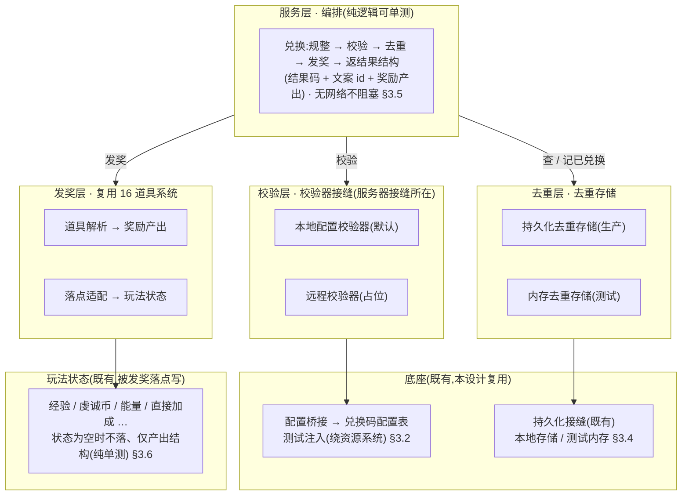
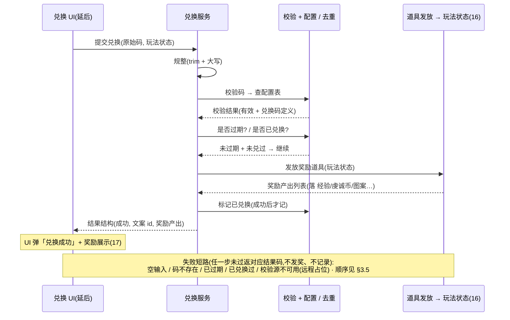

# 通用兑换码系统 · 数据逻辑层 + 服务器接缝

把玩家输入的**兑换码字符串**解析成**奖励发放**的**数据逻辑层**:校验(码是否有效)+ 一次性去重(本地防重复兑换)+ 发奖(复用 [道具系统](#16-item-system) 既有发放落点)+ 结果编排(成功 / 各类失败的结果码与提示文案 id)。关键在**服务器接缝**:校验经可注入的校验器接缝隔离——<mark>离线默认实现查本地配置表,远程实现留占位(本工程无网络模块、方向去变现,不实接服务器)</mark>。本设计兑现 [设计 19](#19-settings-system) 通用设置里留的兑换码入口钩子。<mark>兑换码输入窗口 + 结果弹窗(表现层)需美术,延后,本设计只交付数据逻辑层 + 接缝 + 入口钩子。</mark>

> [!WARNING]
> **读前必看 · 四条边界**
>
> 四条边界先明确,防把「兑换码数据层」做成「真接 HTTP 服务器 + 另造一套发奖」:
>
> - **「服务器接缝」= 可注入校验器接口,不是真发网络请求。**本工程**没有网络模块**,且项目方向**离线还原 · 去变现**。本设计把「校验码是否有效、能换什么」抽象成一个校验器接口:生产默认实现查本地配置表(离线可用);远程实现仅留**占位**(未来若上服务器,在此实现一次,服务层零改动切换)。「服务器接缝」指的是**这个接口边界本身**——它让发奖逻辑不绑定校验来源,而非本设计真去连服务器。
> - **发奖复用道具系统既有落点,不另造发奖逻辑。**兑换码的奖励 = 一组「道具 id × 数量」,经道具系统(设计 16)既有解析与落点逻辑发放。本系统**只产出「要发哪些道具」的列表,不复制发奖落点逻辑**(避免与道具系统两处漂移)。落点解析为纯函数,可单测。
> - **一次性去重经持久化接缝,本地单机判定。**离线单机,一个码用没用过查本地已兑换集合,经工程既有持久化接缝(序列化层 + 磁盘读写分层,生产落本地存储 / 测试走内存)。**不**新建第二套存储栈。「全局有限次 / 限量」类需后端计数,离线做不到,本设计仅占位(见 [§3.4](#20-redeem-code-system::dedupe) / [§七 O5](#20-redeem-code-system::open))。
> - **UI 投放不在本设计。**兑换码输入框 + 兑换按钮 + 结果弹窗 + 奖励展示(可接 [设计 17](#17-reward-display) 的奖励展示组件)是表现层,依赖美术与窗口流程,本设计**不**建窗口、不挂资源。交付到「服务入口 + 校验接缝 + 去重存储 + 结果码 + 文案 id 占位」,并把设计 19 留的兑换码入口钩子接到本系统服务入口(见 [§五](#20-redeem-code-system::hook))。

> [!NOTE]
> **立项信息**
>
> | 项 | 内容 |
> | --- | --- |
> | **类型** | 新系统 · 通用兑换码数据逻辑层 + 服务器接缝 出设计稿 + 验收标准,交开发落地。 |
> | **方向约束** | 离线还原 · **去变现**:兑换码用于运营发放(节日礼包 / 补偿),**不**含充值 / 内购 / 付费解锁;真实服务器校验延后(本工程无网络模块),离线默认查本地配置。持久化走非阻塞本地存储(序列化纯函数可单测、IO 异步,不触阻塞 IO 红线)。加法式扩展,不破坏既有核心循环 + 已建系统。 |
> | **影响范围** | **新增**:兑换码配置表(码 → 奖励项,[§3.1](#20-redeem-code-system::config));运行期数据结构 + 配置桥接([§3.2](#20-redeem-code-system::poco));校验接缝(本地默认实现 + 远程占位,[§3.3](#20-redeem-code-system::validator));去重存储(生产包既有持久化接缝 + 测试内存实现,[§3.4](#20-redeem-code-system::dedupe));兑换服务 + 结果码 + 结果结构 + 文案 id 占位([§3.5](#20-redeem-code-system::service) / [§3.7](#20-redeem-code-system::text))。 **改既有**:无(发奖复用 16 既有落点,持久化复用既有接缝,框架不动)。**UI 零改动**(本设计不建窗口)。**既有玩法逻辑零行为变化**。 |
> | **关键约束(继承现状)** | 数据结构 / 服务 / 校验器 / 去重存储为纯逻辑,可在纯 C# 单测直接构造 / 调用(不依赖资源系统 / Unity 运行时 / 网络);配置经测试注入口灌入(绕运行期配置系统);去重往返经内存存储注入断言(不碰真实本地存储);发奖落玩法状态经既有落点(状态为空时走纯解析)。现有 EditMode 测试零回归。 |

## 一、做什么与为什么 {#what}

现状:游戏**没有兑换码系统**——设计 19 通用设置在功能入口列表里留了「兑换码入口」,但只留了入口钩子,没有任何能把玩家输入的码换成奖励的逻辑。本设计建一套**通用兑换码数据逻辑层**:玩家输入码 → 校验 → 去重 → 发奖 → 出结果。

「通用」体现在两处:① 奖励内容不写死,经配置表声明,复用道具系统已有的发奖落点(任何道具 / 货币 / 图案都能发);② 校验来源经接缝抽象,离线查本地配置、未来可切远程服务器而服务层不改。逐条对应需求:

| # | 需求 | 本篇落法 |
| --- | --- | --- |
| 1 | 玩家输入兑换码字符串,提交兑换 | 兑换服务入口:规整(trim + 大小写归一)→ 校验 → 去重 → 发奖 → 返结果结构([§3.5](#20-redeem-code-system::service)) |
| 2 | 校验码是否有效(能换什么) | 校验器接缝;默认实现查本地兑换码配置表([§3.3](#20-redeem-code-system::validator)) |
| 3 | 服务器校验(运营在后台配码) | 远程校验**占位**:本工程无网络模块、方向去变现,留接口待未来实现([§3.3](#20-redeem-code-system::validator) / [§七 O1](#20-redeem-code-system::open)) |
| 4 | 同一码每个玩家只能兑换一次(防重复) | 本地已兑换集合,经既有持久化接缝落地([§3.4](#20-redeem-code-system::dedupe)) |
| 5 | 发放奖励(道具 / 货币 / 图案) | 复用 16 道具系统的解析 + 落点逻辑([§3.6](#20-redeem-code-system::grant)) |
| 6 | 结果提示(成功 / 无效码 / 已兑换 / 过期) | 结果码 + 结果文案 id(占位,真实查表延后,[§3.7](#20-redeem-code-system::text)) |
| 7 | 奖励展示(成功后显示发了什么) | 产出奖励产出列表,UI 接时转 17 的奖励展示组件统一渲染([§3.6](#20-redeem-code-system::grant)) |
| 8 | 设置界面的兑换码入口 | 把设计 19 留的兑换码入口钩子接到本系统服务入口(UI 投放时,[§五](#20-redeem-code-system::hook)) |
| 9 | 兑换码输入 / 结果弹窗 UI | 表现层,需美术,**延后**([§七 O7](#20-redeem-code-system::open)) |

**不做(本设计明确排除):**真实服务器 / HTTP 校验(无网络模块,O1);所有 UI 窗口(输入框 / 结果弹窗 — 需美术,O7);全局限量 / 有限次码(需后端计数,离线做不到,留占位,O5);限时码到期判定的真实时钟接入(给可注入的时间来源接缝,默认不限时,O4);多语言结果文案真实查表(文案 id 占位,同 num/item/reward 现状,O6);充值 / 付费 / 内购码(去变现方向,不做)。

## 二、系统模型 {#model}

### 2.1 分层(校验 / 去重 / 发奖 / 编排) {#layers}

系统拆四层,各层职责单一、各自可测。**校验层**判码是否有效、能换什么(经接缝,离线查配置 / 未来切远程);**去重层**判该码本机是否兑换过(经持久化接缝);**发奖层**复用道具系统既有落点(不新造);**服务层**编排「规整 → 校验 → 去重 → 发奖 → 出结果码 + 文案」。结构图:

### 2.2 服务器接缝(可注入校验器,离线默认 + 远程占位) {#seam}

这是本篇标题里「服务器接缝」的实义。**不是本设计真去连服务器**——本工程无网络模块、方向去变现。而是把「这个码有效吗、能换什么」这件<mark>本应由服务器拍板的事</mark>抽象成一个校验器接口,让兑换服务只依赖接口、不依赖校验来源:

| 实现 | 本设计状态 | 校验来源 | 说明 |
| --- | --- | --- | --- |
| 本地配置校验器 | **本设计做(默认)** | 本地兑换码配置表 | 离线可用:策划在配置表里登记码 → 奖励。运营码也写进表随热更下发([§3.1](#20-redeem-code-system::config)) |
| 远程校验器 | 占位 | (未来)后端接口 | 留空实现,返「校验源不可用」结果(不抛异常)。未来上服务器时在此实现一次,服务层零改动换注入([§七 O1](#20-redeem-code-system::open)) |

> [!NOTE]
> **为什么离线游戏还要做兑换码 + 服务器接缝?**
>
> 兑换码的常见用途是**运营发放**(节日礼包、公告补偿、玩家反馈奖励),与变现无关——离线还原版同样可用:策划把码与奖励写进配置表,随热更下发,玩家输码即得。<mark>服务器接缝是为了不让「未来可能上线的后端校验」与离线实现耦合</mark>:接口边界一次划清,本地实现先用,远程实现日后补,服务层与发奖层都不必返工。这与去变现方向不冲突——本系统不发可购买物,只发运营配置的奖励。

### 2.3 加法式接入(复用既有发奖 + 持久化接缝) {#additive}

本设计<mark>不新造发奖、不新造存储栈</mark>,只补「码 → 奖励列表」的映射与编排:

| 环节 | 既有(不动) | 本设计补 |
| --- | --- | --- |
| 发奖落点 | 道具解析 + 落点适配(设计 16) | 复用,只产出「发哪些道具 id × 数量」交给它 |
| 道具元数据 | 道具配置查询(设计 16) | 复用,不重复登记道具 |
| 持久化 | 既有持久化接缝 | 去重存储包它存已兑换集合 |
| 奖励展示 | 奖励展示组件归一(设计 17) | 复用,UI 接时把奖励产出转奖励展示组件 |
| 码 → 奖励映射 | 缺 | **本设计主体**:配置表 + 校验接缝 + 去重 + 服务编排 |

## 三、设计正文 {#numbers}

### 3.1 兑换码配置表 {#config}

兑换码与奖励经配置表声明(运营在配置表里登记,随热更下发)。一个码可发多项奖励,故拆两表:**码主表**(码 + 元属性) + **奖励子表**(码 → 多个奖励项,按码聚合)。策划备注类字段只供配置维护、不进运行期。

**码主表**(主键 = 码字符串):

| 字段 | 类型 | 含义 |
| --- | --- | --- |
| 码 | 字符串 | 兑换码字符串(主键)。<mark>规整后比对</mark>:trim + 转大写([§3.5](#20-redeem-code-system::service)),故表里统一存大写 |
| 名称 | 文本 id | 码名称 / 用途(多语言文本 id,运营备注) |
| 每玩家是否仅一次 | 整数 | 1 是(进去重集合)/ 0 否(可重复兑,如演示码)。默认 1 |
| 过期时间 | 日期串 | 空 = 不限时。本设计可注入时间来源判定,默认不接真实时钟([§七 O4](#20-redeem-code-system::open)) |
| 备注 | 字符串 | 策划备注,不进运行期 |

**奖励子表**(按码聚合):

| 字段 | 类型 | 含义 |
| --- | --- | --- |
| 码 | 字符串 | 所属兑换码(外键 → 码主表) |
| 道具 id | 整数 | 奖励道具 id(指向道具表,设计 16)。道具自己的使用效果决定落点(货币 / 图案 / 礼包) |
| 数量 | 整数 | 奖励数量(传给道具解析) |

> [!NOTE]
> **为什么奖励复用「道具 id × 数量」而非自定义奖励结构?**
>
> 道具系统(设计 16)已把「一件东西怎么发」收进道具的使用效果:货币 / 图案 / 自选礼包 / 随机礼包 / 纯持有。兑换码奖励只要引用道具 id,<mark>发什么、怎么落,全交给道具系统既有逻辑</mark>——不必在兑换码侧重新定义奖励类型,也避免两套奖励结构漂移。这与礼包配置引用道具 id 同构。

### 3.2 运行期数据结构 + 配置桥接 {#poco}

配置表行桥接成运行期数据结构,业务侧只认这层(隔离配置生成产物);运行期按需加载走配置系统,EditMode 经测试注入口直接灌入(绕资源系统)。兑换码是通用系统,与玩法逻辑解耦。

**运行期数据结构**:

- **单个奖励项**:道具 id + 数量。
- **兑换码定义**:已规整(大写)的码 + 名称文本 id + 每玩家是否仅一次(默认 1)+ 过期时间(空 = 不限时)+ 奖励项列表。

**配置桥接职责**:

- **加载聚合**:先读码主表建各兑换码定义,再遍历奖励子表按码把奖励项塞进对应定义的奖励列表(同礼包按聚合键归并的做法)。索引键用<mark>规整后(大写)</mark>的码,与服务层比对口径一致。
- **查询**:按规整后的码查;查不到返空(不抛异常)。
- **测试注入**:绕运行期配置系统直接灌入兑换码定义(索引键 = 已规整码),并提供测试态复位。

### 3.3 校验器接缝(本地 / 远程) {#validator}

校验只回答两件事:**码有效吗**、**能换什么**(连同失败原因)。返一个校验结果(三态:命中 / 未命中 / 校验源不可用,命中时附带兑换码定义)。<mark>校验不碰去重、不发奖</mark>——那是服务层的事,使校验器可独立替换。校验接受规整后的码。

**两个实现**:

- **本地配置校验器(离线默认)**:按规整后的码查本地兑换码配置表;命中返「有效 + 兑换码定义」,未命中返「未找到 + 空定义」。
- **远程校验器(占位)**:本工程无网络模块,留接口待未来实现。当前一律返「校验源不可用」(<mark>不抛异常</mark>,服务层映射成对应结果码,不崩);未来上服务器时替换为真实远程校验,服务层零改动换注入。

本设计生产注入本地配置校验器。

### 3.4 一次性去重存储(本地集合) {#dedupe}

离线单机,「这个码本机兑过没」查本地已兑换集合,经既有持久化接缝落地(单键存一个码集合,序列化为分隔串 / JSON)。去重存储接缝有两个操作:**查某码是否已兑换**、**标记某码已兑换**。仿设置存储的接缝模式,使往返可单测。

**两个实现**:

- **持久化去重存储(生产)**:经既有持久化接缝,用本系统专用键存码集合(不与框架 / 其它系统键冲突)。首次访问时从持久化层反序列化,无键时得空集合;标记新码后写回。
- **内存去重存储(测试)**:纯内存集合,往返断言不污染真实本地存储。

**序列化**:码集合是字符串集合,可用换行 / 逗号分隔串(码本身规整为大写字母数字,不含分隔符)或简单 JSON。<mark>本地单机文件可被篡改 / 截断</mark>,反序列化对任意输入须产出合法集合(空串 → 空集合,不抛;同 14 存档系统保底口径)。**只去重「每玩家仅一次」的码**:可重复兑的码不查不记。

### 3.5 兑换服务(编排 + 结果码) {#service}

编排层把四步串起来,返一个**结果结构**(结果码 + 文案 id + 成功时的奖励产出列表)。注入校验器 + 去重存储 + 发奖落点(玩法状态,可为空走纯解析)。时间来源可注入(默认系统时钟)。

**六类结果码**:

| 结果码 | 含义 |
| --- | --- |
| 成功 | 兑换成功 |
| 空输入 | 空 / 纯空白输入 |
| 码不存在 | 校验未命中 |
| 已兑换过 | 「每玩家仅一次」的码重复兑换 |
| 已过期 | 超过过期时间 |
| 校验源不可用 | 远程校验占位返回 |

**规整**:trim + 转大写(与配置表口径一致);空 / 纯空白输入归一为空串。

**兑换流程(顺序关键)**:

1. 规整输入。
2. 空输入最先短路 → 空输入(不查表)。
3. 校验 → 校验源不可用 → 码不存在(各自短路)。
4. 命中后判过期(过期时间空 → 不限时;否则解析后与注入的时间来源比)→ 已过期。
5. 判去重(仅对「每玩家仅一次」的码查已兑换集合)→ 已兑换过。
6. 发奖:复用 16 道具系统落点([§3.6](#20-redeem-code-system::grant))。
7. <mark>发奖成功后才记录已兑换</mark>(仅「每玩家仅一次」的码;失败不占名额)。
8. 返成功 + 奖励产出。

各失败分支返对应结果码 + 文案 id,不抛异常。

### 3.6 发奖落点(复用道具系统) {#grant}

发奖<mark>不新造逻辑</mark>:遍历兑换码的奖励项,每项查道具元数据,用道具系统(设计 16)既有的「获得即结算」落点(自动结算项立即落玩法状态 / 非自动项进背包),汇总成奖励产出列表返回。玩法状态为空时只产出结构、不落实际系统(纯解析单测路径,同 16)。

**自动 / 非自动落点**:自动结算项立即落对应玩法系统并产出展示结构;非自动项(进背包)由调用方 / UI 负责入背包(同 16),本设计暂不接背包实例(O3),只汇总立即结算的产出供 UI 展示。

**展示**:成功后结果结构里的奖励产出列表,UI 接时可转设计 17 的奖励展示组件统一渲染(图标 / 名称 / 数量 / 品质色)。本设计只产出结构,UI 投放延后。

### 3.7 结果文案 id(占位) {#text}

每个结果码对应一条提示文案 id(占位,真实多语言查表延后,同 num/item/reward/settings 的现状)。各结果码的占位文案(供 UI 参考):

| 结果码 | 占位文案 |
| --- | --- |
| 成功 | 「兑换成功,奖励已发放」 |
| 空输入 | 「请输入兑换码」 |
| 码不存在 | 「兑换码无效」 |
| 已兑换过 | 「该兑换码已使用过」 |
| 已过期 | 「兑换码已过期」 |
| 校验源不可用 | 「兑换服务暂不可用」 |

**占位约定**:本设计文案 id 给<mark>互不相同的占位值</mark>(验收断言六类各返不同的非默认值,同 19 提示做法);真实多语言文本表建成后替换。结果码到文案 id 的映射在服务层提供。

## 四、兑换一个码的时序 {#flow}

玩家输码 → 服务规整 → 校验(查配置)→ 判过期 / 去重 → 发奖(复用 16)→ 记录 → 返结果。四方参与(UI / 服务 / 校验+配置 / 去重存储),用时序图归纳:

## 五、与设置入口的接线 {#hook}

兑换码是<mark>通用系统</mark>(非玩法专属),与玩法逻辑解耦。本设计交付数据逻辑层 + 接缝;设置界面留的兑换码入口钩子(设计 19)在 UI 投放时接到本系统的兑换服务入口。本设计不建窗口,发奖落点复用 16,持久化复用既有接缝(只调用不修改)。

> [!NOTE]
> **配置验收路径(继承 numeric/item 先例)**
>
> 运行期配置加载走资源系统,<mark>纯 C# / EditMode 跑不通</mark>。配置验收点锚在「直读导出的配置二进制」的 EditMode 测试(绕资源系统);纯逻辑(桥接 / 校验 / 去重 / 服务)经测试注入口单测。导表工具链若不可达,直读那条列 BLOCKED 不判 FAIL,纯逻辑条仍须全绿。

## 六、验收点 {#accept}

纯逻辑全 EditMode 可测(数据结构 + 注入隔离);配置直读条按工具链可达性(不可达列 BLOCKED)。dev 落地后须 test 逐条核对。验收锚在**配置桥接 + 校验接缝 + 去重往返 + 服务结果码 + 发奖产出**;真实服务器 / UI 视觉不在本设计(无后端 / 需美术)。

| 组 | # | 验收点(完成定义,test 可逐条核对) |
| --- | --- | --- |
| 配置 C | C1 | 测试注入兑换码后,按规整码查返对应兑换码定义,奖励列表按码正确聚合(一码多奖) |
| 配置 C | C2 | 索引键用规整(大写)码:查 "ABC" 与配置存大写一致;查不存在的码返空(不抛) |
| 配置 C | C3 | (配置直读,工具链可达时)读取导出的兑换码配置二进制,行数 > 0 且字段映射正确;不可达列 **BLOCKED** |
| 校验 V | V1 | 本地配置校验器校验已注入码返「有效」且兑换码定义非空;未注入码返「未找到」且定义为空 |
| 校验 V | V2 | 远程校验器校验任意码返「校验源不可用」且**不抛异常**(占位不崩) |
| 校验 V | V3 | 服务注入远程校验器 → 兑换返「校验源不可用」(服务层正确映射占位状态;证「换注入零改动服务层」) |
| 去重 D | D1 | 内存去重存储:标记某码后查为已兑换;未标记的码查为未兑换 |
| 去重 D | D2 | 持久化去重存储注入内存持久化:标记后新建存储实例复用同持久化层 → 查仍为已兑换(跨实例往返保真,模拟重启);反序列化空串 / 无键 → 空集合不抛 |
| 去重 D | D3 | 「每玩家可重复」的码兑两次都成功(不进去重集合);「仅一次」的码第二次返已兑换过 |
| 服务 S | S1 | 空 / 纯空白输入 → 空输入(最先短路,不查表) |
| 服务 S | S2 | 输入 " abc " 经规整 → trim+大写 命中存为 "ABC" 的码(规整正确) |
| 服务 S | S3 | 有效码首次兑换 → 成功且奖励产出非空;「仅一次」的码再兑 → 已兑换过且**第二次不重复发奖**(去重集合已含) |
| 服务 S | S4 | 过期码(过期时间早于注入的时间来源)→ 已过期;空过期时间不判过期 |
| 服务 S | S5 | 失败分支(码不存在 / 已过期 / 校验源不可用)**不发奖、不写去重集合**(失败不占名额);各结果码映射的文案 id 为非默认值且六类互不相同 |
| 发奖 G | G1 | 奖励项指向货币道具 → 兑换(玩法状态非空)后状态对应字段(如经验 / 虔诚币 / 能量)增加正确数量(复用 16 落点) |
| 发奖 G | G2 | 一码多奖:奖励产出列表项数 / 内容与配置奖励项对应(经道具系统汇总) |
| 发奖 G | G3 | 玩法状态为空时兑换仍返成功且奖励产出含产出结构(纯解析路径,不抛;同 16 状态可空) |
| 回归 / 编译 R | R1 | 编译 0 error;现有 EditMode 测试全绿(零回归);新增兑换码测试全绿 |
| 回归 / 编译 R | R2 | Code Review 5 红线:异步优先 / 模块访问 / 资源释放 / 热更边界 / 事件解耦(本层无资源加载、无事件;重点核「无真实网络 / HTTP 调用」「持久化非阻塞不触同步 IO」「发奖复用 16 不复制落点」) |

> [!WARNING]
> **不在本设计验收(boss 授权遗留)**
>
> 真实服务器校验(无网络模块)、兑换码输入窗口 + 结果弹窗 UI 视觉、奖励展示真实图片、设置界面兑换码入口按钮接线 → <mark>表现层延后 + 远程实现未来轮</mark>。依赖美术(UI)与后端(远程校验),数据层不返工。

## 七、待拍板清单 {#open}

以下为范围开关,boss 自治授权下**均取安全默认推进**(已在 boss 预先拍板内),列此备查;要改另开增量轮。

| # | 开关 | 本设计默认 | 备选 / 触发改动 |
| --- | --- | --- | --- |
| O1 | 真实服务器校验 | **占位**(远程校验器留接口,默认注本地) | 未来上后端时实现远程校验器,换注入即切;服务层零改动 |
| O2 | 码 → 奖励的奖励结构 | 复用「道具 id × 数量」(经 16 道具系统落点) | 若需兑换码专属奖励类型(非道具),扩奖励子表 + 落点;当前复用足够 |
| O3 | 非自动道具进背包 | 不接背包实例(非自动结算项不汇总,只汇总立即结算项) | 背包实例接入后,UI / 调用方把非自动项入背包(同 16) |
| O4 | 限时码到期判定 | 可注入时间来源(默认系统时钟);过期时间空即不限时 | 真实运营限时码:配过期时间日期串;时区 / 服务器时间对齐随远程校验一并定 |
| O5 | 全局限量 / 有限次码 | **占位 / 不做**(需后端计数,离线单机做不到) | 上后端后由远程校验返「名额已满」;本地只能做「每玩家一次」 |
| O6 | 结果文案多语言 | 文案 id 占位(同 num/item/reward/settings) | 多语言文本表建成后查表替换 |
| O7 | 兑换码输入 / 结果弹窗 UI | **延后**(需美术,留服务 + 钩子) | 有美术 + 窗口流程时建窗口,接 17 奖励展示组件,运行手验 |
| O8 | 码格式 / 长度校验 | 仅 trim + 大写规整;有效性全交配置命中(查不到即码不存在) | 若需前置格式校验(长度 / 字符集)减少无效查表,加规整后的格式预检 |

## 八、风险表 {#risk}

| 风险 | 应对 |
| --- | --- |
| **误把「服务器接缝」做成真发 HTTP 请求**:引入网络请求或真连后端 → 离线游戏跑不通、且违方向 | 读前必看第 1 条 + §2.2 已明确:接缝 = 可注入接口,生产注本地配置校验器(查配置);远程仅占位。Code Review R2 重点核「无真实网络调用」 |
| **记录已兑换的时机错**:在发奖前就标记 → 发奖若中途异常,码已占用名额、玩家拿不到奖又不能重兑 | §3.5 顺序明确「发奖成功后才记录」;验收 S5 专门断言失败分支不写去重集合 |
| **规整口径不一致**:配置表存大写、服务比对没转大写(或反之)→ 玩家输对码却判码不存在 | §3.1 / §3.2 / §3.5 统一「配置索引键与比对都走规整(trim+大写)」;验收 C2 / S2 断言规整命中 |
| **另造发奖逻辑**:不复用 16 的发奖落点,自己写一套「码→货币/图案」落点 → 与道具系统两处漂移 | 读前必看第 2 条 + §3.6 显式调既有道具发放落点;Code Review 核不复制落点。验收 G1/G2 断言落点与 16 一致 |
| **另造存储栈**:新建第二套本地存储键空间存已兑换集合,不用既有持久化接缝 | §3.4 复用既有接缝;去重存储用本系统专用键(不与框架 / 其它系统键冲突),仍走同一持久化层 |
| **本地去重可被绕过**:玩家清本地存储 / 改存档可重兑「每玩家一次」码 | 本地单机的固有限制,如实承认(§3.4)。真正防绕过需后端计数(O5),离线做不到——这正是「服务器接缝」存在的理由:未来远程校验可补足 |
| **配置自指 / 礼包递归环**:奖励道具指向随机礼包、礼包又指回 → 递归爆栈 | 复用 16 既有的礼包深度上限(已防环);本系统不引入新递归 |
