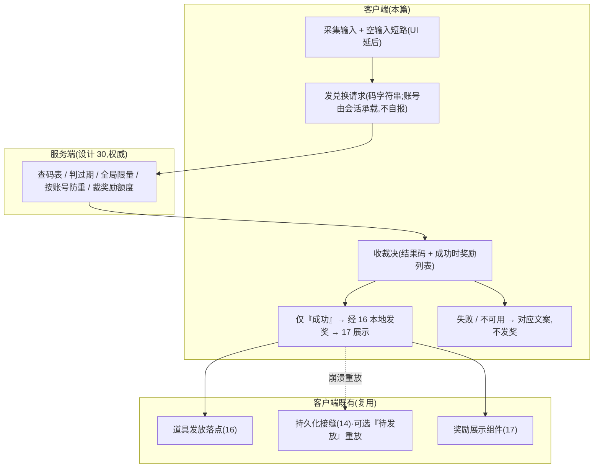

<style>
  /* 本篇专用:字段表 / 代码块 / 状态 pill(沿用系统底层批次口径) */
  pre.code { margin:8px 0; padding:12px; background:#0d1622; border:1px solid var(--border); border-radius:8px; overflow:auto; font-size:13px; line-height:1.55; }
  table.tight td, table.tight th { padding:6px 10px; }
  .pill-cli { display:inline-block; font-size:11px; padding:1px 7px; border-radius:10px; background:rgba(108,140,255,.16); color:#6c8cff; margin-left:6px; }
  .pill-srv { display:inline-block; font-size:11px; padding:1px 7px; border-radius:10px; background:rgba(255,176,90,.18); color:#ffb05a; margin-left:6px; }
  .pill-no  { display:inline-block; font-size:11px; padding:1px 7px; border-radius:10px; background:rgba(255,122,138,.16); color:#ff7a8a; margin-left:6px; }
  .yes { color:#5bd6a0; font-weight:bold; }
  .no  { color:#ff7a8a; font-weight:bold; }
  td.mono, code.mono { font-family:ui-monospace,Consolas,monospace; }
</style>

# 兑换码系统 · 客户端侧职责

兑换码系统的**客户端侧**:玩家在输入框键入兑换码 → 客户端发起兑换请求 → 服务端裁决 → 客户端按裁决结果**本地发奖**(复用 [道具系统](#16-item-system) 既有落点)+ **展示结果**(可接 [设计 17 奖励展示](#17-reward-display))。<mark>兑换的裁决权威在服务端(见 [设计 30 兑换码服务端化](#30-redeem-code-server))</mark>:码是否有效、此账号是否兑过、全局限量是否已满、能换什么,全由服务端裁定;客户端不持本地码表、不做本地校验与去重权威。本设计兑现 [设计 19](#19-settings-system) 通用设置里留的兑换码入口钩子。<mark>兑换码输入窗口 + 结果弹窗(表现层)需美术,延后</mark>,本篇交付客户端数据逻辑层(发请求 + 处理回包 + 本地发奖 + 入口钩子)。

> [!WARNING]
> **读前必看 · 三条边界**
>
> - **裁决权威在服务端,客户端不做离线兜底校验。**码有效性 / 防重 / 限量 / 奖励额度全由服务端裁定(设计 30)。客户端**不**保留「服务不可用时本地放行兑换」的兜底——那等于让玩家断网即可绕过服务端的跨设备防重 + 全局限量。服务不可用时兑换**不发生**:返「服务暂不可用,请稍后重试」,不发奖,码保持可兑。本篇关注客户端如何发请求、如何处理六类回包结果。
> - **发奖复用道具系统既有落点,不另造发奖逻辑。**服务端裁决「成功」时回包带一组「道具 id × 数量」,客户端经道具系统(设计 16)既有解析与落点逻辑发放。客户端**只按回包发哪些道具,不复制发奖落点逻辑**(避免与道具系统两处漂移)。落点解析为纯函数,可单测。
> - **UI 投放不在本设计。**兑换码输入框 + 兑换按钮 + 结果弹窗 + 奖励展示(可接 [设计 17](#17-reward-display))是表现层,依赖美术与窗口流程,本设计**不**建窗口、不挂资源。交付到「客户端兑换服务入口 + 发请求 + 回包处理 + 本地发奖 + 结果码 + 文案 id 占位」,并把设计 19 留的兑换码入口钩子接到本系统服务入口(见 [§五](#20-redeem-code-system::hook))。

> [!NOTE]
> **立项信息**
>
> | 项 | 内容 |
> | --- | --- |
> | **类型** | 兑换码系统客户端侧职责 · 出设计稿 + 验收标准,交客户端开发落地。服务端权威与协议契约见 [设计 30](#30-redeem-code-server)。 |
> | **方向约束** | 离线还原 · **去变现**:兑换码用于运营发放(节日礼包 / 补偿),**不**含充值 / 内购 / 付费解锁。客户端按服务端裁决本地发奖,持久化走非阻塞本地存储(不触阻塞 IO 红线)。加法式扩展,不破坏既有核心循环 + 已建系统。 |
> | **影响范围** | **客户端新增**:兑换服务入口(发请求 → 收裁决 → 编排发奖与结果);回包结果码 → 文案 id 映射([§3.5](#20-redeem-code-system::service) / [§3.7](#20-redeem-code-system::text));可选「待发放」崩溃重放(复用既有持久化接缝,[§3.4](#20-redeem-code-system::dedupe))。 **复用既有**:发奖落点(16,[§3.6](#20-redeem-code-system::grant))、持久化接缝(14)、奖励展示(17)。 **退出客户端**:本地兑换码配置表、本地配置校验器、本地去重集合(权威上移服务端,[§六关系](#20-redeem-code-system::supersede))。**UI 零改动**(本篇不建窗口)。**既有玩法逻辑零行为变化**。 |
> | **关键约束(继承现状)** | 客户端兑换服务 / 回包处理为纯逻辑,可在纯 C# 单测直接构造 / 调用(注入桩响应覆盖六类结果码分支,不依赖真实网络 / Unity 运行时);发奖落玩法状态经既有落点(状态为空时走纯解析)。现有 EditMode 测试零回归。 |

## 一、做什么与为什么 {#what}

兑换码完整特性 = **服务端权威(设计 30)** + **客户端侧(本篇)**。本篇只覆盖客户端:把玩家输入的码发给服务端,按服务端裁决落地发奖与展示。逐条对应需求:

| # | 需求 | 本篇(客户端)落法 |
| --- | --- | --- |
| 1 | 玩家输入兑换码字符串,提交兑换 | 客户端兑换服务入口:采集 → 空输入短路(UX)→ 发请求 → 收裁决 → 编排发奖 + 结果([§3.5](#20-redeem-code-system::service)) |
| 2 | 校验码是否有效(能换什么) | **服务端裁定**(设计 30);客户端只发码、收结果,不本地判有效性 |
| 3 | 服务器校验(运营在后台配码) | **服务端权威**(设计 30):服务端查权威码表裁决。设计 20 早期把它当「占位」,已被设计 30 兑现 |
| 4 | 同一码每个玩家只能兑换一次(防重复) | **服务端按账号防重**(设计 30,跨会话 / 跨设备);客户端不再持本地去重权威 |
| 5 | 发放奖励(道具 / 货币 / 图案) | 客户端按回包「道具 id × 数量」复用 16 道具系统落点本地发放([§3.6](#20-redeem-code-system::grant)) |
| 6 | 结果提示(成功 / 无效码 / 已兑换 / 过期 / 限量 / 不可用) | 客户端把六类结果码映射文案 id(占位,真实查表延后,[§3.7](#20-redeem-code-system::text)) |
| 7 | 奖励展示(成功后显示发了什么) | 客户端用 16 道具元数据解析回包奖励项,转 17 的奖励展示组件统一渲染([§3.6](#20-redeem-code-system::grant)) |
| 8 | 设置界面的兑换码入口 | 把设计 19 留的兑换码入口钩子接到本系统客户端服务入口(UI 投放时,[§五](#20-redeem-code-system::hook)) |
| 9 | 兑换码输入 / 结果弹窗 UI | 表现层,需美术,**延后**([§七 O7](#20-redeem-code-system::open)) |

**不做(本篇明确排除):**<span class="pill-no">本地兑换权威</span>(校验 / 防重 / 限量全在服务端,设计 30);<span class="pill-no">所有 UI 窗口</span>(输入框 / 结果弹窗 — 需美术,O7);<span class="pill-no">离线兜底校验</span>(服务不可用不本地放行,见读前必看);<span class="pill-no">多语言结果文案真实查表</span>(文案 id 占位,同 num/item/reward 现状,O6);<span class="pill-no">充值 / 付费 / 内购码</span>(去变现方向,不做)。

## 二、客户端在兑换链路中的位置 {#model}

兑换是一次「客户端发请求 → 服务端裁决 → 客户端落地」的往返。客户端负责两端:**发起**(采集 + 发请求)与**落地**(按裁决发奖 + 展示);中间的裁决全在服务端。结构图(客户端视角):



> [!NOTE]
> **客户端为什么「成功才发奖、不可用不放行」?**
>
> 服务端是兑换的唯一权威(设计 30)。客户端只在收到「成功」裁决时才发奖——失败 / 服务不可用一律不发。若客户端在「服务不可用」时本地放行,玩家断网即可绕过服务端的跨设备防重 + 全局限量,服务端化形同虚设(设计 20 离线版正因本地权威可被绕过才上移服务端)。<mark>「服务不可用」与「码无效」是两个不同结果码</mark>:前者鼓励重试(码仍有效)、后者告知码本身不行,文案与处理都不同。

## 三、设计正文(客户端) {#numbers}

### 3.1 不再持有本地兑换码配置表 {#config}

设计 20 早期把「码 → 奖励 / 有效期 / 限量」作为**客户端** Luban 配置表(本地校验权威)。服务端化后,该码表上移为**服务端权威配置**(设计 30),<mark>客户端不再持有兑换码表</mark>——客户端发码字符串、收服务端裁决即可,无需预知码能换什么(结果是兑换之后由回包描述、再展示)。

> [!NOTE]
> **为什么客户端不留一份码表?**
>
> 客户端留第二份码表只会引入「双份漂移」(同码两端裁决不同),且无收益:客户端无需在兑换前预览码能换什么(成功后回包会描述奖励)。唯一权威码表在服务端,客户端零持有,从根消除漂移(详见 [设计 30 读前必看第 2 条](#30-redeem-code-server))。客户端仍持有的是**道具元数据表**(设计 16 道具表:名 / 图标 / 品质)——那是供背包 / 邮件 / 排行榜等多处展示的共享配置,与兑换码无关,用于解析回包里的「道具 id」。

### 3.2 回包奖励的运行期表达 {#poco}

服务端「成功」回包带一组「道具 id × 数量」,客户端桥接成运行期奖励项(道具 id + 数量)交给发奖落点。客户端只认这层运行期结构(隔离协议生成产物),不持兑换码定义、不做码表桥接(码表已不在客户端)。

- **单个奖励项**:道具 id + 数量。
- **来源**:服务端裁决的回包(非本地配置)。

### 3.3 结果码处理(六类分支) {#validator}

客户端不做校验——校验是服务端的事(设计 30)。客户端只**处理服务端裁决回来的六类结果码**(见 [§3.5](#20-redeem-code-system::service) 结果码表),每类映射文案 + 决定是否发奖。这层是纯逻辑,可注入桩响应单测六类分支。

> 设计 20 早期的「本地配置校验器 / 远程校验器占位」二选一接缝**已退出**:不再有本地校验权威,远程校验已兑现为服务端真实裁决(设计 30)。客户端侧不留校验器接缝,只留「发请求 + 处理回包」。

### 3.4 「待发放」崩溃重放(可选,闭中途丢奖窗口) {#dedupe}

服务端记「已兑」与客户端本地落地之间有一个崩溃窗口:服务端已记已兑、回包成功,客户端在发进玩家进度前崩溃 → 码消耗了但奖励没到。可选机制闭合该窗口(设计 30 §五崩法表 / O3):

- **待发放记录(可选)**:客户端收「成功」裁决后,先把奖励列表写入本地「待发放」持久记录(复用既有持久化接缝,序列化层同步可单测 + 磁盘 IO 异步外壳,同设计 14 存档分层),再发进进度,落地后清除;启动时重放任何未清除的待发放,使「记录已兑 → 本地落地」跨崩溃恰好一次。
- **砍掉的退化**:不做则崩溃窗口极小概率丢奖,靠邮件补偿;核心循环不依赖它(O3 可砍)。

> <mark>注意:这不是设计 20 早期的「本地去重集合」</mark>。本地去重(判此码本机兑过没)作为兑换权威**已退出客户端**——防重在服务端按账号做(设计 30)。「待发放」只是落地的崩溃保险,不是兑换闸门。

### 3.5 客户端兑换服务(发请求 + 编排回包) {#service}

客户端兑换服务把一次兑换串起来:采集 → 发请求 → 收裁决 → 按结果码编排(发奖 / 文案)。返一个**结果结构**(结果码 + 文案 id + 成功时的奖励产出列表)。

**六类结果码**(与服务端回包一一对应,见 [设计 30 §3.2](#30-redeem-code-server)):

| 结果码 | 含义 | 客户端处理 |
| --- | --- | --- |
| 成功 | 兑换成功,服务端授权发奖 | 按奖励列表本地发奖 + 展示 |
| 码无效 | 码不存在 / 空 / 规整后为空 | 提示「兑换码无效」,不发奖 |
| 已兑过 | 本账号已兑过此码 | 提示「该兑换码已使用过」,不发奖 |
| 已过期 | 码已过过期时间(服务端时钟) | 提示「兑换码已过期」,不发奖 |
| 全局限量已满 | 码达全局上限 | 提示「兑换码已被领完」,不发奖 |
| 服务不可用 | 请求未达 / 超时 / 服务端无法处理 | 提示「兑换服务暂不可用,请稍后重试」,不发奖,码可重试 |

**客户端兑换流程**:

1. 采集输入;空 / 纯空白输入客户端短路 → 「请输入兑换码」、不发请求(UX 优化;服务端仍对空兜底,见设计 30)。
2. 发兑换请求(码字符串;**不自报账号 id**,身份由会话承载,见设计 30 §3.1)。
3. 收裁决回包。
4. 按结果码分支:
   - 成功 → (可选先写待发放)→ 经 16 本地发奖([§3.6](#20-redeem-code-system::grant))→ 展示奖励 + 「兑换成功」。
   - 任一失败 / 不可用 → 对应文案,**不发奖**。

各结果码映射对应文案 id,不抛异常。规整由服务端权威执行(客户端只需显示层 trim)。

### 3.6 本地发奖落点(复用道具系统) {#grant}

客户端收「成功」回包后发奖<mark>不新造逻辑</mark>:遍历回包奖励项(道具 id × 数量),每项查道具元数据(16),用道具系统既有的「获得即结算」落点(自动结算项立即落玩法状态 / 非自动项进背包),汇总成奖励产出列表。玩法状态为空时只产出结构、不落实际系统(纯解析单测路径,同 16)。

**自动 / 非自动落点**:自动结算项立即落对应玩法系统并产出展示结构;非自动项(进背包)由调用方 / UI 负责入背包(同 16),本设计暂不接背包实例(O3 道具侧),只汇总立即结算的产出供 UI 展示。

**展示**:成功后结果结构里的奖励产出列表,UI 接时可转设计 17 的奖励展示组件统一渲染(图标 / 名称 / 数量 / 品质色)。本设计只产出结构,UI 投放延后。

### 3.7 结果文案 id(占位) {#text}

每个结果码对应一条提示文案 id(占位,真实多语言查表延后,同 num/item/reward/settings 的现状)。各结果码的占位文案(供 UI 参考):

| 结果码 | 占位文案 |
| --- | --- |
| 成功 | 「兑换成功,奖励已发放」 |
| 码无效 | 「兑换码无效」 |
| 已兑过 | 「该兑换码已使用过」 |
| 已过期 | 「兑换码已过期」 |
| 全局限量已满 | 「兑换码已被领完」 |
| 服务不可用 | 「兑换服务暂不可用,请稍后重试」 |

**占位约定**:本设计文案 id 给<mark>互不相同的占位值</mark>(验收断言六类各返不同的非默认值,同 19 提示做法);真实多语言文本表建成后替换。结果码到文案 id 的映射在客户端兑换服务提供。

## 四、客户端兑换一个码的时序 {#flow}

玩家输码 → 客户端规整(显示层)+ 空输入短路 → 发请求 → 服务端裁决(设计 30)→ 客户端按结果码落地。四方参与(UI / 客户端服务 / 服务端 / 道具发放),用时序图归纳:

```mermaid
sequenceDiagram
    participant UI as 兑换 UI(延后)
    participant C as 客户端兑换服务
    participant S as 服务端(设计 30,权威)
    participant G as 道具发放 → 玩法状态(16)
    UI->>C: 提交兑换(原始码)
    C->>C: 空输入短路 / 显示层 trim
    C->>S: 兑换请求(码字符串;账号由会话取)
    S->>S: 规整 + 查码表 + 过期 + 全局限量 + 按账号防重
    S-->>C: 裁决(结果码 + 成功时奖励列表)
    alt 成功
        C->>G: 按奖励列表本地发奖
        G-->>C: 奖励产出(落经验/虔诚币/图案…)
        C-->>UI: 成功 + 奖励产出 + 文案
        Note over UI: 弹「兑换成功」+ 奖励展示(17)
    else 失败 / 不可用
        C-->>UI: 对应结果码 + 文案(不发奖)
        Note over UI,S: 码无效 / 已兑过 / 已过期 / 全局满 / 服务不可用<br/>服务不可用时码可重试(不本地放行)
    end
```

## 五、与设置入口的接线 {#hook}

兑换码是<mark>通用系统</mark>(非玩法专属),与玩法逻辑解耦。本设计交付客户端数据逻辑层(发请求 + 回包处理 + 本地发奖);设置界面留的兑换码入口钩子(设计 19)在 UI 投放时接到本系统的客户端兑换服务入口。本设计不建窗口,发奖落点复用 16,持久化(可选待发放)复用既有接缝(只调用不修改)。

> [!NOTE]
> **客户端验收路径**
>
> 客户端兑换服务 / 回包处理是纯逻辑,可注入桩响应单测六类结果码分支(不依赖真实网络);发奖落点经测试注入玩法状态断言(状态为空走纯解析)。真实往返(连真服务端)属联调,见 [设计 30 §8.3](#30-redeem-code-server)。

## 六、与设计 30 的关系(权威在服务端,本篇客户端落地) {#supersede}

兑换码完整特性拆两篇:[设计 30](#30-redeem-code-server) = 服务端权威 + 前后端协议契约;本篇 = 客户端侧落地与展示。设计 20 早期(服务端化前)把权威放客户端,服务端化后客户端职责改写如下:

| 设计 20 早期 | 现状(服务端化后) |
| --- | --- |
| 本地配置校验器(查本地码表判有效) | <span class="no">退出</span>:校验上移服务端,客户端不再本地判有效性 |
| 本地去重集合(本地判已兑) | <span class="no">退出</span>:防重上移服务端(按账号,跨设备),客户端不再持本地去重权威 |
| 客户端兑换码 Luban 配置表 | <span class="no">退出</span>:码表服务端权威,客户端不持第二份 |
| 远程校验器「占位」 | <span class="yes">兑现</span>:由设计 30 服务端真实裁决 |
| 本地发奖落点(复用 16) | <span class="yes">保留</span>:服务端裁决成功后客户端本地发奖 |
| 结果码 / 结果文案 | <span class="yes">保留并扩一类</span>:新增「全局限量已满」(服务端新能力) |

## 七、待拍板清单 {#open}

以下为客户端侧范围开关,自治授权下取安全默认推进,列此备查;服务端侧开关见 [设计 30 §七](#30-redeem-code-server)。

| # | 开关 | 本设计默认 | 备选 / 触发改动 |
| --- | --- | --- | --- |
| O1 | 客户端是否留本地兜底校验 | **不留**(服务不可用不本地放行) | 留兜底会绕过服务端权威,不做;离线演示码若需可走「服务端码表配不限量演示码」而非客户端兜底 |
| O3 | 客户端「待发放」崩溃重放 | **做**(复用 14 存档接缝闭丢奖窗口) | 砍则退化为邮件补偿;核心循环不依赖,可砍(同设计 30 O3) |
| O6 | 结果文案多语言 | 文案 id 占位(同 num/item/reward/settings) | 多语言文本表建成后查表替换 |
| O7 | 兑换码输入 / 结果弹窗 UI | **延后**(需美术,留服务 + 钩子) | 有美术 + 窗口流程时建窗口,接 17 奖励展示组件,运行手验 |
| O8 | 客户端码格式预检 | 仅显示层 trim;有效性全交服务端裁定 | 若需前置格式校验(长度 / 字符集)减少无效请求,加规整后的格式预检(纯 UX,不替代服务端权威) |

## 八、风险表 {#risk}

| 风险 | 应对 |
| --- | --- |
| **客户端加回离线兜底校验**:为「体验」在服务不可用时本地放行 → 玩家断网绕过服务端跨设备防重 + 全局限量 | 读前必看第 1 条 + §二:服务不可用不本地放行,只进降级提示、码可重试;验收断言断服不会本地成功发奖 |
| **把「服务不可用」当「码无效」**:玩家以为好码失效、不再重试 | §3.5 / §四:两个独立结果码、文案不同(鼓励重试 vs 告知码不行);验收断言两者文案有别 |
| **另造发奖逻辑**:不复用 16 落点,自己写一套「码→货币/图案」落点 → 与道具系统两处漂移 | 读前必看第 2 条 + §3.6 显式调既有道具发放落点;Code Review 核不复制落点 |
| **客户端留一份码表**:与服务端码表不一致 → 同码两端裁决不同 | §3.1:客户端不持码表,唯一权威在服务端;客户端只持道具元数据(展示用,与码表无关) |
| **中途丢奖**:服务端记已兑、客户端落地前崩 → 码消耗奖没到 | §3.4 可选「待发放」崩溃重放(O3);砍则邮件补偿,如实承认 |
| **客户端自报账号**:把账号 id 当请求字段 → 冒充他人 | §3.5 流程 + 设计 30 §3.1:身份由会话承载,客户端不自报账号 |
