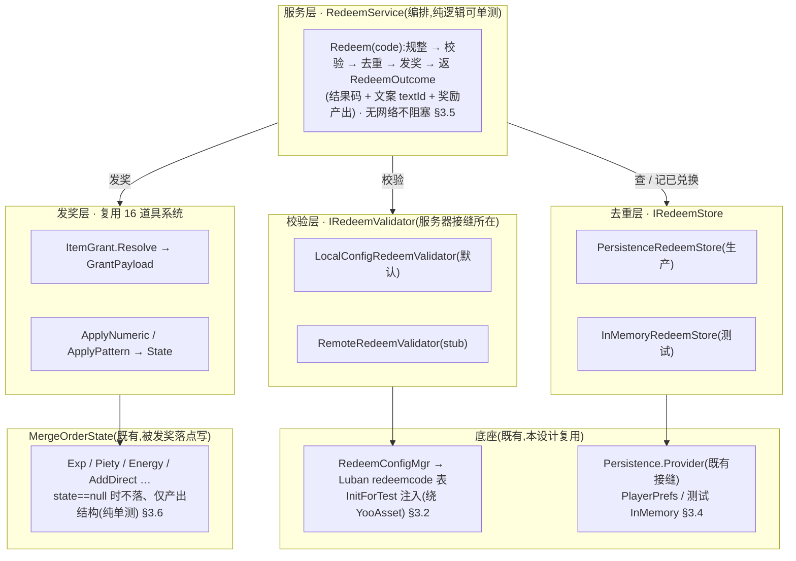
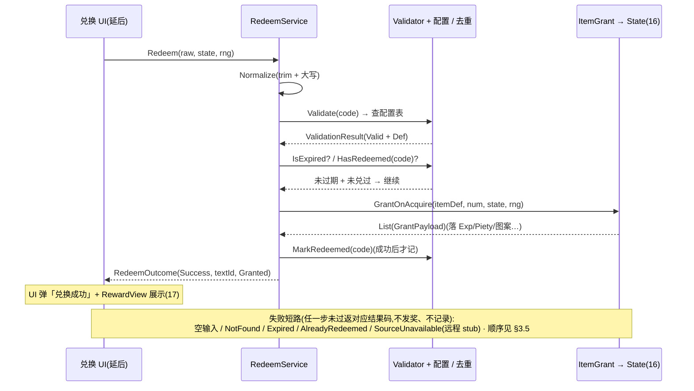

# 通用兑换码系统 · 数据逻辑层 + 服务器接缝

把玩家输入的**兑换码字符串**解析成**奖励发放**的**数据逻辑层**:校验(码是否有效)+ 一次性去重(本地防重复兑换)+ 发奖(复用 [道具系统](#16-item-system) 既有 `ItemGrant`/`GrantPayload` 落点)+ 结果编排(成功 / 各类失败的结果码与提示 textId)。关键在**服务器接缝**:校验经可注入 `IRedeemValidator` 接缝隔离——<mark>离线默认实现查本地 Luban 配置表,远程实现留 stub(本工程无网络模块、方向去变现,不实接服务器)</mark>。这是 xlsx 系统底层批次第六刀,兑现 [设计 19 §3.6 / §七 O4](#19-settings-system) 留的兑换码 TODO 钩子。<mark>兑换码输入窗口 + 结果弹窗(表现层)需美术,延后轮,本设计只留服务 + 接缝 + 钩子常量。</mark>

> [!WARNING]
> **读前必看 · 与工程现状的关系(单一事实源 = 代码)**
>
> 四条边界先明确,防 dev 把「兑换码数据层」做成「真接 HTTP 服务器 + 另造一套发奖」:
>
> - **「服务器接缝」= 可注入校验器接口,不是真发网络请求。**本工程**没有网络模块**(`Books/3-8-网络模块.md` 标「待补充」,全工程 grep 无 `INetworkModule`/`UnityWebRequest`/`HttpClient`),且项目方向**离线还原 · 去变现**。本设计把「校验码是否有效、能换什么」抽象成 `IRedeemValidator` 接口:生产默认实现 `LocalConfigRedeemValidator` 查本地 Luban 配置表(离线可用);`RemoteRedeemValidator` 仅留 **stub + TODO**(未来若上服务器,在此实现一次,服务层零改动切换)。「服务器接缝」指的是**这个接口边界本身**——它让发奖逻辑不绑定校验来源,而非本设计真去连服务器。
> - **发奖复用 16 道具系统既有落点,不另造发奖逻辑。**兑换码的奖励 = 一组「道具 id × 数量」,经道具系统既有 `ItemGrant.Resolve` 解析成 `GrantPayload`、再经既有适配器(`ApplyNumeric`/`ApplyPattern`)落 `MergeOrderState`(`Assets/GameScripts/HotFix/GameLogic/Module/BlockBlast/Item/ItemGrant.cs`)。本系统**只产出「要发哪些道具」的列表,不复制发奖落点逻辑**(避免与道具系统两处漂移)。落点适配同 16 可纯单测。
> - **一次性去重经持久化接缝,本地单机判定。**离线单机,一个码用没用过查本地已兑换集合(经工程既有 `GameLogic.BlockBlast.IPersistenceProvider`/`Persistence.Provider`,`Persistence.cs`,生产 PlayerPrefs / 测试 InMemory)。**不**新建第二套存储栈。「全局有限次 / 限量」类需后端计数,离线做不到,本设计 stub(见 [§3.4](#20-redeem-code-system::dedupe) / [§七 O5](#20-redeem-code-system::open))。
> - **UI 投放不在本设计。**兑换码输入框 + 兑换按钮 + 结果弹窗 + 奖励展示(可接 [设计 17](#17-reward-display) 的 `RewardView`)是表现层,依赖美术与窗口流程,本设计**不**建窗口、不挂 prefab。交付到「服务方法 + 校验接缝 + 去重存储 + 结果码 + 文案 textId 占位」,并把 19 §3.6 留的 `OpenRedeemCode()` TODO 钩子接到本系统服务入口(见 [§五](#20-redeem-code-system::hook))。

> [!NOTE]
> **立项信息**
>
> | 项 | 内容 |
> | --- | --- |
> | **类型** | 新系统 · 通用兑换码数据逻辑层 + 服务器接缝 出设计稿 + 验收标准,交开发落地。xlsx 系统底层批次第六刀。 |
> | **设计基线(经 grep 核实的真实符号)** | **发奖落点**:`GameLogic.BlockBlast.Item.ItemGrant.Resolve(ItemDef,count)` → `GrantPayload`;适配器 `ApplyNumeric(MergeOrderState,payload)`/`ApplyPattern(...)`/`GrantOnAcquire(...)`(`Item/ItemGrant.cs`,设计 16 §3.7)。道具元数据查 `GameLogic.Config.ItemConfigMgr.GetItem(id)`(`Config/ItemConfigMgr.cs`,含 `InitForTest` 注入口)。 **持久化接缝**:`GameLogic.BlockBlast.IPersistenceProvider`(`TryGet/Set/Remove`)+ `Persistence.Provider`(默认 `PlayerPrefsProvider` / 测试 `InMemoryPersistenceProvider`,`Module/BlockBlast/Persistence.cs`)——去重集合仿此。 **配置桥接范本**:`ItemConfigMgr`/`NumericConfigMgr`(Luban 行 → POCO,运行期 `EnsureLoaded` 走 `ConfigSystem.Instance.Tables`;EditMode 经 `InitForTest` 注入绕 YooAsset)。 **结果展示(可选接)**:`GameLogic.BlockBlast.Reward.RewardView`(`Module/BlockBlast/Reward/RewardView.cs`,设计 17)——兑换成功后用它统一渲染奖励;本设计只产出 `GrantPayload`,UI 接时自行转 `RewardView`。 **设置入口钩子**:`GameLogic.Settings.SettingsLinks`(`Module/Settings/SettingsLinks.cs`,设计 19)留的 `OpenRedeemCode()` TODO 注释。 |
> | **方向约束** | 离线还原 · **去变现**:兑换码用于运营发放(节日礼包 / 补偿),**不**含充值 / 内购 / 付费解锁;真实服务器校验延后(本工程无网络模块),离线默认查本地配置。IO 走框架既有非阻塞 PlayerPrefs(同 14/19 口径,不触「禁阻塞 IO」红线)。加法式扩展,不破坏既有核心循环 + 已建系统。 |
> | **影响范围** | **新增配置表**:`redeemcode.xlsx` → Luban `GameConfig.RedeemCode` + `GameConfig.RedeemReward`(码 → 奖励项,[§3.1](#20-redeem-code-system::config)); **新增 POCO + 桥接**:`RedeemCodeDef`/`RedeemReward` + `RedeemConfigMgr`(含 `InitForTest`,[§3.2](#20-redeem-code-system::poco)); **新增校验接缝**:`IRedeemValidator` + `LocalConfigRedeemValidator`(默认) + `RemoteRedeemValidator`(stub,[§3.3](#20-redeem-code-system::validator)); **新增去重存储**:`IRedeemStore` + `PersistenceRedeemStore`(包既有 `Persistence.Provider`) + `InMemoryRedeemStore`(测试,[§3.4](#20-redeem-code-system::dedupe)); **新增服务 + 结果码 + 文案**:`RedeemService` + `RedeemResult`(枚举) + `RedeemOutcome`(结果结构) + `RedeemText`(textId 占位,[§3.5](#20-redeem-code-system::service) / [§3.7](#20-redeem-code-system::text))。 **改既有**:无(发奖复用 16 既有适配器,持久化复用既有接缝,框架代码不动)。**UI 零改动**(本设计不建窗口)。**既有玩法逻辑零行为变化**。 |
> | **关键约束(继承现状)** | POCO / 服务 / 校验器 / 去重存储为纯逻辑,可在纯 C# 单测直接 `new` / 静态调用(不依赖 YooAsset / Unity 运行时 / 网络);配置经 `RedeemConfigMgr.InitForTest` 注入(绕 ConfigSystem);去重往返经 `InMemoryRedeemStore` 注入断言(不碰真实 PlayerPrefs);发奖落 `MergeOrderState` 经既有适配器(state 可 null 走纯解析)。现有 EditMode 测试零回归。 |

<h2 id="what">一、做什么与为什么</h2>

现状:游戏**没有兑换码系统**——设计 19 通用设置在功能入口列表里留了「兑换码入口」,但只写了 `OpenRedeemCode()` 的 TODO 钩子注释([19 §3.6](#19-settings-system)),没有任何能把玩家输入的码换成奖励的逻辑。本设计建一套**通用兑换码数据逻辑层**:玩家输入码 → 校验 → 去重 → 发奖 → 出结果。

「通用」体现在两处:① 奖励内容不写死,经配置表声明,复用道具系统已有的发奖落点(任何道具 / 货币 / 图案都能发);② 校验来源经接缝抽象,离线查本地配置、未来可切远程服务器而服务层不改。逐条对应需求:

| # | 需求 | 本篇落法 | 现状/新增 |
| --- | --- | --- | --- |
| 1 | 玩家输入兑换码字符串,提交兑换 | `RedeemService.Redeem(code)` 入口:规整(trim + 大小写归一)→ 校验 → 去重 → 发奖 → 返 `RedeemOutcome`([§3.5](#20-redeem-code-system::service)) | 新增服务 |
| 2 | 校验码是否有效(能换什么) | `IRedeemValidator.Validate(code)` 接缝;默认 `LocalConfigRedeemValidator` 查本地 `redeemcode` 表([§3.3](#20-redeem-code-system::validator)) | 新增校验接缝 |
| 3 | 服务器校验(运营在后台配码) | `RemoteRedeemValidator` **stub** + TODO:本工程无网络模块、方向去变现,留接口待未来实现([§3.3](#20-redeem-code-system::validator) / [§七 O1](#20-redeem-code-system::open)) | stub |
| 4 | 同一码每个玩家只能兑换一次(防重复) | `IRedeemStore` 本地已兑换集合,经既有 `Persistence.Provider` 持久化([§3.4](#20-redeem-code-system::dedupe)) | 新增去重存储 |
| 5 | 发放奖励(道具 / 货币 / 图案) | 复用 16 道具系统 `ItemGrant.Resolve` → `GrantPayload` + 既有适配器落 `MergeOrderState`([§3.6](#20-redeem-code-system::grant)) | 复用 16 |
| 6 | 结果提示(成功 / 无效码 / 已兑换 / 过期) | `RedeemResult` 枚举 + `RedeemText` 结果文案 textId(占位,真实查表延后,[§3.7](#20-redeem-code-system::text)) | 新增结果码 + 文案 |
| 7 | 奖励展示(成功后显示发了什么) | 产出 `GrantPayload` 列表,UI 接时转 17 的 `RewardView` 统一渲染([§3.6](#20-redeem-code-system::grant)) | 复用 17 |
| 8 | 设置界面的兑换码入口 | 把 19 §3.6 留的 `OpenRedeemCode()` TODO 钩子接到本系统服务入口(UI 投放时,[§五](#20-redeem-code-system::hook)) | 兑现 19 钩子 |
| 9 | 兑换码输入 / 结果弹窗 UI | 表现层,需美术,**延后**(同 15–19 节奏,[§七 O7](#20-redeem-code-system::open)) | UI 延后 |

<b>不做(本设计明确排除):</b>真实服务器 / HTTP 校验(无网络模块,O1);所有 UI 窗口(输入框 / 结果弹窗 — 需美术,O7);全局限量 / 有限次码(需后端计数,离线做不到,留 stub,O5);限时码到期判定的真实时钟接入(给可注入 `nowProvider` 接缝,默认不限时,O4);多语言结果文案真实查表(textId 占位,同 num/item/reward 现状,O6);充值 / 付费 / 内购码(去变现方向,不做)。

<h2 id="model">二、系统模型</h2>

<h3 id="layers">2.1 分层(校验 / 去重 / 发奖 / 编排)</h3>

系统拆四层,各层职责单一、各自可测。**校验层**判码是否有效、能换什么(经接缝,离线查配置 / 未来切远程);**去重层**判该码本机是否兑换过(经持久化接缝);**发奖层**复用道具系统既有落点(不新造);**服务层**编排「规整 → 校验 → 去重 → 发奖 → 出结果码 + 文案」。结构图:

<h3 id="seam">2.2 服务器接缝(可注入校验器,离线默认 + 远程 stub)</h3>

这是本篇标题里「服务器接缝」的实义。**不是本设计真去连服务器**——本工程无网络模块、方向去变现。而是把「这个码有效吗、能换什么」这件<mark>本应由服务器拍板的事</mark>抽象成一个接口 `IRedeemValidator`,让兑换服务只依赖接口、不依赖校验来源:

| 实现 | 本设计状态 | 校验来源 | 说明 |
| --- | --- | --- | --- |
| `LocalConfigRedeemValidator` | <b>本设计做(默认)</b> | 本地 Luban `redeemcode` 配置表 | 离线可用:策划在配置表里登记码 → 奖励。运营码也写进表随热更下发([§3.1](#20-redeem-code-system::config)) |
| `RemoteRedeemValidator` | stub + TODO | (未来)后端接口 | 留空实现 + 抛 `NotImplementedException` 或返「校验源不可用」结果。未来上服务器时在此实现一次,`RedeemService` 零改动换注入([§七 O1](#20-redeem-code-system::open)) |

> [!NOTE]
> <b>为什么离线游戏还要做兑换码 + 服务器接缝?</b>
>
> 兑换码的常见用途是**运营发放**(节日礼包、公告补偿、玩家反馈奖励),与变现无关——离线还原版同样可用:策划把码与奖励写进配置表,随热更下发,玩家输码即得。<mark>服务器接缝是为了不让「未来可能上线的后端校验」与离线实现耦合</mark>:接口边界一次划清,本地实现先用,远程实现日后补,服务层与发奖层都不必返工。这与去变现方向不冲突——本系统不发可购买物,只发运营配置的奖励。

<h3 id="additive">2.3 加法式接入(复用既有发奖 + 持久化接缝)</h3>

本设计<mark>不新造发奖、不新造存储栈</mark>,只补「码 → 奖励列表」的映射与编排:

| 环节 | 既有(不动) | 本设计补 |
| --- | --- | --- |
| 发奖落点 | `ItemGrant.Resolve` / `ApplyNumeric` / `ApplyPattern`(设计 16) | 复用,只产出「发哪些道具 id × 数量」交给它 |
| 道具元数据 | `ItemConfigMgr.GetItem(id)`(设计 16) | 复用,不重复登记道具 |
| 持久化 | `Persistence.Provider`(`IPersistenceProvider`) | `PersistenceRedeemStore` 包它存已兑换集合 |
| 奖励展示 | `RewardView` 归一(设计 17) | 复用,UI 接时把 `GrantPayload` 转 `RewardView` |
| 码 → 奖励映射 | 缺 | **本设计主体**:配置表 + 校验接缝 + 去重 + 服务编排 |

<h2 id="numbers">三、设计正文</h2>

<h3 id="config">3.1 兑换码配置表 redeemcode(Luban)</h3>

源 xlsx 在仓库根 `Configs/GameConfig/Datas/redeemcode.xlsx`(与 `UnityProject` 同级,同 num/item/avatar 表)。一个码可发多项奖励,故拆两表:**码主表**(码 + 元属性) + **奖励子表**(码 → 多个奖励项,按码 id 聚合,同 gift 表的 index 聚合做法)。schema 写数据 xlsx 表头四行(`##var` / `##type` / `##group` / `##`);planner 备注类字段设 `group=e` 不导出运行期。

**码主表 redeemcode**(主键 `code` 字符串):

| 字段(##var) | 类型(##type) | group | 含义 |
| --- | --- | --- | --- |
| code | string | c,s | 兑换码字符串(主键)。<mark>规整后比对</mark>:trim + 转大写([§3.5](#20-redeem-code-system::service)),故表里统一存大写 |
| name | int | c,s | 码名称 / 用途(多语言文本 id,运营备注) |
| once\_per\_player | int | c,s | 每玩家是否仅一次:1 是(进去重集合)/ 0 否(可重复兑,如演示码)。默认 1 |
| expire\_time | string | c,s | 过期时间(日期串,空 = 不限时)。本设计可注入 `nowProvider` 判定,默认不接真实时钟([§七 O4](#20-redeem-code-system::open)) |
| remark | string | e | 策划备注(`group=e` 不导出运行期) |

**奖励子表 redeemreward**(同一 xlsx 第二张表或独立 xlsx,按 `code` 聚合):

| 字段(##var) | 类型(##type) | group | 含义 |
| --- | --- | --- | --- |
| code | string | c,s | 所属兑换码(外键 → redeemcode.code) |
| item\_id | int | c,s | 奖励道具 id(指向 `item.TbItemDef`,设计 16)。道具自己的 `use_effect` 决定落点(货币 / 图案 / 礼包) |
| num | int | c,s | 奖励数量(传给 `ItemGrant.Resolve(def, num)`) |

> [!NOTE]
> <b>为什么奖励复用「道具 id × 数量」而非自定义奖励结构?</b>
>
> 道具系统(设计 16)已把「一件东西怎么发」收进 <code>item.TbItemDef.use_effect</code>:1=货币 / 2=图案 / 3=自选礼包 / 4=随机礼包 / 其余=纯持有。兑换码奖励只要引用道具 id,<mark>发什么、怎么落,全交给道具系统既有逻辑</mark>——不必在兑换码侧重新定义奖励类型,也避免两套奖励结构漂移。这与礼包(<code>gift_random</code>/<code>gift_select</code> 的 <code>item_id</code>)同构。

<h3 id="poco">3.2 运行期 POCO + 桥接(RedeemCodeDef / RedeemReward)</h3>

仿 `ItemConfigMgr`:Luban 行桥接成 POCO,业务侧只认 POCO(隔离生成类型);运行期 `EnsureLoaded` 走 `ConfigSystem`,EditMode 经 `InitForTest` 注入绕 YooAsset。

<pre class="code">namespace GameLogic.Redeem  // 新建命名空间，通用系统，与 BlockBlast 玩法解耦
{
    public sealed class RedeemReward  // 单个奖励项
    {
        public int ItemId;
        public int Num;
    }
    public sealed class RedeemCodeDef
    {
        public string Code;             // 已规整（大写）
        public int Name;                // 名称 textId
        public int OncePerPlayer = 1;   // 默认每玩家一次
        public string ExpireTime;       // 空 = 不限时
        public System.Collections.Generic.List&lt;RedeemReward&gt; Rewards = new();
    }
}
namespace GameLogic.Config
{
    public static class RedeemConfigMgr
    {
        private static System.Collections.Generic.Dictionary&lt;string, RedeemCodeDef&gt; _codes;
        public static void EnsureLoaded() { /* 走 ConfigSystem.Instance.Tables.TbRedeemCode / TbRedeemReward，按 code 聚合奖励 */ }
        /// &lt;summary&gt;按规整后的码查;查不到返 null(不抛)。&lt;/summary&gt;
        public static RedeemCodeDef Get(string normalizedCode) { EnsureLoaded(); return _codes.TryGetValue(normalizedCode, out var d) ? d : null; }
        /// &lt;summary&gt;测试注入口:绕 ConfigSystem 直接灌 POCO。&lt;/summary&gt;
        public static void InitForTest(System.Collections.Generic.IEnumerable&lt;RedeemCodeDef&gt; codes) { /* 灌入字典(key=已规整码) */ }
        public static void ResetForTest() { _codes = null; }
    }
}</pre>

**聚合**:`EnsureLoaded` 先读码主表建 `RedeemCodeDef`,再遍历奖励子表按 `code` 把 `RedeemReward` 塞进对应 `Rewards`(同 `ItemConfigMgr.AppendPool` 按 index 聚合礼包)。字典 key 用<mark>规整后(大写)</mark>的码,与服务层比对口径一致。

<h3 id="validator">3.3 校验器接缝 IRedeemValidator(本地 / 远程)</h3>

校验只回答两件事:**码有效吗**、**能换什么**(连同失败原因)。返一个 `ValidationResult` 结构(命中 / 未命中 / 校验源不可用 + 命中时的 `RedeemCodeDef`)。<mark>校验不碰去重、不发奖</mark>——那是服务层的事,使校验器可独立替换。

<pre class="code">namespace GameLogic.Redeem
{
    public enum ValidationStatus { Valid, NotFound, SourceUnavailable }
    public readonly struct ValidationResult
    {
        public readonly ValidationStatus Status;
        public readonly RedeemCodeDef Def;   // Valid 时非空
        public ValidationResult(ValidationStatus s, RedeemCodeDef d) { Status = s; Def = d; }
    }
    public interface IRedeemValidator
    {
        /// &lt;summary&gt;校验规整后的码。&lt;/summary&gt;
        ValidationResult Validate(string normalizedCode);
    }
    /// &lt;summary&gt;离线默认:查本地 Luban 配置表。&lt;/summary&gt;
    public sealed class LocalConfigRedeemValidator : IRedeemValidator
    {
        public ValidationResult Validate(string normalizedCode)
        {
            var def = GameLogic.Config.RedeemConfigMgr.Get(normalizedCode);
            return def != null
                ? new ValidationResult(ValidationStatus.Valid, def)
                : new ValidationResult(ValidationStatus.NotFound, null);
        }
    }
    /// &lt;summary&gt;远程校验 stub:本工程无网络模块,留接口待未来实现(§2.2 / §七 O1)。&lt;/summary&gt;
    public sealed class RemoteRedeemValidator : IRedeemValidator
    {
        // TODO: 未来上服务器时实现一次,RedeemService 零改动换注入。
        public ValidationResult Validate(string normalizedCode)
            =&gt; new ValidationResult(ValidationStatus.SourceUnavailable, null);
    }
}</pre>

**stub 行为**:`RemoteRedeemValidator` 返 `SourceUnavailable`(<mark>不抛异常</mark>,服务层映射成「校验源不可用」结果码,不崩);未来实现真实远程校验时替换方法体。本设计生产注入 `LocalConfigRedeemValidator`。

<h3 id="dedupe">3.4 一次性去重存储 IRedeemStore(本地集合)</h3>

离线单机,「这个码本机兑过没」查本地已兑换集合,经既有 `Persistence.Provider` 持久化(单键存一个码集合,序列化为分隔串 / JSON)。仿 `ISettingsStore` 接缝模式,使往返可单测。

<pre class="code">namespace GameLogic.Redeem
{
    public interface IRedeemStore
    {
        bool HasRedeemed(string normalizedCode);
        void MarkRedeemed(string normalizedCode);
    }
    /// &lt;summary&gt;生产:经既有 Persistence.Provider(单键存码集合)。&lt;/summary&gt;
    public sealed class PersistenceRedeemStore : IRedeemStore
    {
        private const string Key = "Redeem.Redeemed";   // 本系统专用键,不与框架键冲突
        private System.Collections.Generic.HashSet&lt;string&gt; _set;
        private void Ensure() { /* 首次从 Persistence.Provider.TryGet(Key) 反序列化;无键 → 空集合 */ }
        public bool HasRedeemed(string c) { Ensure(); return _set.Contains(c); }
        public void MarkRedeemed(string c) { Ensure(); if (_set.Add(c)) Persistence.Provider.Set(Key, Serialize(_set)); }
    }
    /// &lt;summary&gt;测试:内存集合,往返断言不污染 PlayerPrefs。&lt;/summary&gt;
    public sealed class InMemoryRedeemStore : IRedeemStore
    {
        private readonly System.Collections.Generic.HashSet&lt;string&gt; _set = new();
        public bool HasRedeemed(string c) =&gt; _set.Contains(c);
        public void MarkRedeemed(string c) =&gt; _set.Add(c);
    }
}</pre>

**序列化**:码集合是字符串集合,可用换行 / 逗号分隔串(码本身规整为大写字母数字,不含分隔符)或简单 JSON。<mark>本地单机文件可被篡改/截断</mark>,反序列化对任意输入须产出合法集合(空串 → 空集合,不抛;同 14 save-system 保底口径)。<b>只去重 <code>once\_per\_player=1</code> 的码</b>:可重复兑的码(=0)不查不记。

<h3 id="service">3.5 兑换服务 RedeemService(编排 + 结果码)</h3>

编排层把四步串起来,返一个**结果结构**(结果码 + 文案 textId + 成功时的奖励产出列表)。注入校验器 + 去重存储 + 发奖落点(`MergeOrderState`,可 null 走纯解析)。

<pre class="code">namespace GameLogic.Redeem
{
    public enum RedeemResult
    {
        Success,            // 兑换成功
        EmptyInput,         // 空 / 纯空白输入
        NotFound,           // 码不存在
        AlreadyRedeemed,    // 已兑换过(once_per_player=1)
        Expired,            // 已过期
        SourceUnavailable,  // 校验源不可用(远程 stub)
    }
    public readonly struct RedeemOutcome
    {
        public readonly RedeemResult Result;
        public readonly int TextId;   // 结果提示文案(占位,§3.7)
        public readonly System.Collections.Generic.IReadOnlyList&lt;GameLogic.BlockBlast.Item.GrantPayload&gt; Granted; // 成功时非空
        public RedeemOutcome(RedeemResult r, int textId, System.Collections.Generic.IReadOnlyList&lt;...&gt; g) { ... }
    }
    public sealed class RedeemService
    {
        private readonly IRedeemValidator _validator;
        private readonly IRedeemStore _store;
        public System.Func&lt;System.DateTime&gt; NowProvider = () =&gt; System.DateTime.Now;  // 可注入,默认系统时钟
        public RedeemService(IRedeemValidator validator, IRedeemStore store) { _validator = validator; _store = store; }
        /// &lt;summary&gt;规整：trim + 转大写（与配置表口径一致）。&lt;/summary&gt;
        public static string Normalize(string raw) =&gt; string.IsNullOrWhiteSpace(raw) ? "" : raw.Trim().ToUpperInvariant();
        public RedeemOutcome Redeem(string raw, GameLogic.BlockBlast.Item.MergeOrderState state, System.Random rng)
        {
            var code = Normalize(raw);
            if (code.Length == 0) return Fail(RedeemResult.EmptyInput);
            var v = _validator.Validate(code);
            if (v.Status == ValidationStatus.SourceUnavailable) return Fail(RedeemResult.SourceUnavailable);
            if (v.Status == ValidationStatus.NotFound)          return Fail(RedeemResult.NotFound);
            var def = v.Def;
            if (IsExpired(def)) return Fail(RedeemResult.Expired);
            if (def.OncePerPlayer == 1 &amp;&amp; _store.HasRedeemed(code)) return Fail(RedeemResult.AlreadyRedeemed);
            // 发奖：复用 16 道具系统落点（§3.6）
            var granted = GrantRewards(def, state, rng);
            if (def.OncePerPlayer == 1) _store.MarkRedeemed(code);   // 成功后才记（失败不占名额）
            return new RedeemOutcome(RedeemResult.Success, RedeemText.Success, granted);
        }
        private bool IsExpired(RedeemCodeDef def) { /* def.ExpireTime 空 → false;否则 parse 与 NowProvider() 比 */ }
    }
}</pre>

**顺序关键**:校验源不可用 → 不存在 → 过期 → 已兑换 → 发奖 → 记录。<mark>「记录已兑换」必须在发奖成功之后</mark>(失败不占名额)。空输入最先短路(不查表)。各失败分支返对应结果码 + 文案 textId,不抛异常。

<h3 id="grant">3.6 发奖落点(复用 ItemGrant / GrantPayload)</h3>

发奖<mark>不新造逻辑</mark>:遍历 `def.Rewards`,每项查 `ItemConfigMgr.GetItem(item_id)` 拿 `ItemDef`,用既有 `ItemGrant.GrantOnAcquire(def, num, state, rng)`(automatic=1 立即结算 / 0 进背包)或 `Resolve` + 适配器落 `MergeOrderState`,汇总成 `GrantPayload` 列表返回。`state==null` 时只产出结构、不落实际系统(纯解析单测路径,同 16)。

<pre class="code">private IReadOnlyList&lt;GrantPayload&gt; GrantRewards(RedeemCodeDef def, MergeOrderState state, System.Random rng)
{
    var all = new List&lt;GrantPayload&gt;();
    foreach (var r in def.Rewards)
    {
        var itemDef = GameLogic.Config.ItemConfigMgr.GetItem(r.ItemId);   // 既有
        var produced = GameLogic.BlockBlast.Item.ItemGrant.GrantOnAcquire(itemDef, r.Num, state, rng); // 既有，自动落点
        all.AddRange(produced);
        // automatic=0（进背包）项 GrantOnAcquire 返空，调用方/UI 负责入背包（同 16 §3.7）；
        // 暂不接背包实例（O3），只汇总立即结算的产出供 UI 展示。
    }
    return all;
}</pre>

**展示**:成功后 `RedeemOutcome.Granted` 是 `GrantPayload` 列表,UI 接时可转设计 17 的 `RewardView` 统一渲染(图标 / 名称 / 数量 / 品质色)。本设计只产出结构,UI 投放延后。

<h3 id="text">3.7 结果文案 textId(占位)</h3>

每个 `RedeemResult` 对应一条提示文案 textId(占位常量,真实多语言查表延后,同 num/item/reward/settings 的现状)。

<pre class="code">namespace GameLogic.Redeem
{
    public static class RedeemText  // 占位 textId，真实查表延后（O6）
    {
        public const int Success           = 0; // 实际填多语言 id：「兑换成功，奖励已发放」
        public const int EmptyInput        = 0; // 「请输入兑换码」
        public const int NotFound          = 0; // 「兑换码无效」
        public const int AlreadyRedeemed   = 0; // 「该兑换码已使用过」
        public const int Expired           = 0; // 「兑换码已过期」
        public const int SourceUnavailable = 0; // 「兑换服务暂不可用」
    }
    public static int TextIdFor(RedeemResult r) =&gt; r switch { ... };  // 结果码 → textId
}</pre>

**占位约定**:本设计 textId 给<mark>互不相同的占位常量</mark>(验收断言六类各返不同非 0 值,同 19 ToggleTip 做法);真实多语言文本表建成后替换。`RedeemText` 上方注释写中文占位文案供 UI 参考。

<h2 id="flow">四、兑换一个码的时序</h2>

玩家输码 → 服务规整 → 校验(查配置)→ 判过期 / 去重 → 发奖(复用 16)→ 记录 → 返结果。四方参与(UI / 服务 / 校验+配置 / 去重存储),用时序图归纳:

<h2 id="hook">五、挂接点 / dev 改动清单</h2>

符号名经 grep 核实(真实存在的标注「✓ 已核实」,新建的标注「新建」)。本设计全部落 `GameScripts/HotFix/GameLogic`(热更区),新建独立命名空间 `GameLogic.Redeem`(兑换码是通用系统,与 BlockBlast 玩法解耦);配置桥接放 `GameLogic.Config`(同 `ItemConfigMgr`)。

| # | 文件 / 符号 | 动作 | 说明 |
| --- | --- | --- | --- |
| 1 | `Configs/GameConfig/Datas/redeemcode.xlsx`(+ 奖励子表)· Luban schema 注册 `__tables__`/`__beans__` | 新建配置 | 码主表 + 奖励子表([§3.1](#20-redeem-code-system::config));导表生成 `GameConfig.RedeemCode`/`RedeemReward` + `TbRedeemCode`/`TbRedeemReward`。导表工具链不可达时 test 列 BLOCKED 不判 FAIL |
| 2 | `GameLogic/Module/Redeem/RedeemCodeDef.cs` · `RedeemCodeDef` / `RedeemReward` POCO | 新建 | 运行期 POCO,隔离 Luban 生成类型([§3.2](#20-redeem-code-system::poco)) |
| 3 | `GameLogic/Config/RedeemConfigMgr.cs` · `RedeemConfigMgr` | 新建 | 桥接 + `EnsureLoaded`(走 `ConfigSystem.Instance.Tables`,✓ 范本 `ItemConfigMgr`)+ `Get` + `InitForTest`/`ResetForTest`([§3.2](#20-redeem-code-system::poco)) |
| 4 | 同 Redeem 目录 · `IRedeemValidator` / `LocalConfigRedeemValidator` / `RemoteRedeemValidator` + `ValidationResult`/`ValidationStatus` | 新建 | 校验接缝;Local 查配置(默认)、Remote stub 返 `SourceUnavailable`([§3.3](#20-redeem-code-system::validator)) |
| 5 | 同目录 · `IRedeemStore` / `PersistenceRedeemStore` / `InMemoryRedeemStore` | 新建 | 去重存储;生产包既有 `Persistence.Provider`(✓ 已核实 `Persistence.cs`)([§3.4](#20-redeem-code-system::dedupe)) |
| 6 | 同目录 · `RedeemService` + `RedeemResult`/`RedeemOutcome` + `RedeemText` | 新建 | 编排 + 结果码 + 文案 textId;发奖复用 `ItemGrant.GrantOnAcquire`(✓ 已核实 `Item/ItemGrant.cs`)、道具查 `ItemConfigMgr.GetItem`(✓)([§3.5](#20-redeem-code-system::service) / [§3.6](#20-redeem-code-system::grant) / [§3.7](#20-redeem-code-system::text)) |
| 7 | `GameLogic.Settings.SettingsLinks` 的 `OpenRedeemCode()` TODO 钩子(设计 19 §3.6) | TODO 接线(UI 投放时) | UI 接到 `RedeemService.Redeem`;本设计不建窗口,留注释指向本系统(✓ 已核实 `Settings/SettingsLinks.cs`) |
| 8 | `Assets/Editor/Tests/BlockBlast/RedeemCodeSystemTests.cs` | 新建测试 | 覆盖配置桥接 / 校验器 / 去重往返 / 服务结果码 / 发奖产出([§六](#20-redeem-code-system::accept))。asmdef 已含 `GameLogic`+`GameProto`+`TEngine.Runtime` 引用,直接可达 |
| — | `ItemGrant` / `ItemConfigMgr` / `Persistence` / 框架代码 | **不改** | 发奖 / 持久化复用既有接缝,只调用不修改 |

> [!NOTE]
> **命名空间归属**
>
> 兑换码是<mark>通用系统</mark>(非 BlockBlast 玩法专属),服务 / 校验 / 去重命名空间用 <code>GameLogic.Redeem</code>(同 19 <code>GameLogic.Settings</code> 做法);配置桥接 <code>RedeemConfigMgr</code> 归 <code>GameLogic.Config</code>(与既有 <code>ItemConfigMgr</code>/<code>NumericConfigMgr</code> 并列)。物理目录建议 <code>GameScripts/HotFix/GameLogic/Module/Redeem/</code>。发奖落点 <code>GrantPayload</code> 仍在 <code>GameLogic.BlockBlast.Item</code>(复用,不搬)。

> [!WARNING]
> **dev 须按 numeric/item 先例处理配置验收**
>
> 运行期 <code>ConfigSystem.Instance.Tables</code> 走 YooAsset + ModuleSystem,<mark>纯 C# / EditMode 跑不通</mark>。配置验收点锚在「<code>AssetDatabase.LoadAssetAtPath&lt;TextAsset&gt;(.../redeemcode.bytes)</code> → <code>new TbRedeemCode(ByteBuf)</code>」直读二进制的 EditMode 测试(绕 YooAsset,✓ 范本 <code>WeightCfgLubanTests</code>);纯逻辑(桥接 / 校验 / 去重 / 服务)经 <code>InitForTest</code> 注入 POCO 单测。导表工具链若不可达,Luban 直读那条列 BLOCKED 不判 FAIL,纯逻辑条仍须全绿。

<h2 id="accept">六、验收点</h2>

纯逻辑全 EditMode 可测(POCO + 注入隔离);Luban 直读条按工具链可达性(不可达列 BLOCKED)。dev 落地后须 test 逐条核对。验收锚在**配置桥接 + 校验接缝 + 去重往返 + 服务结果码 + 发奖产出**;真实音频外的真实服务器 / UI 视觉不在本设计(无后端 / 需美术)。

| 组 | # | 验收点(完成定义,test 可逐条核对) |
| --- | --- | --- |
| 配置 C | C1 | `RedeemConfigMgr.InitForTest` 灌入码后 `Get(规整码)` 返对应 `RedeemCodeDef`,奖励列表按 code 正确聚合(一码多奖) |
| 配置 C | C2 | 字典 key 用规整(大写)码:`Get("ABC")` 与配置存大写一致;查不存在的码返 null(不抛) |
| 配置 C | C3 | (Luban 直读,工具链可达时)`AssetDatabase.LoadAssetAtPath<TextAsset>(.../redeemcode.bytes)` → `new TbRedeemCode(ByteBuf)` 行数 > 0 且字段映射正确;不可达列 **BLOCKED** |
| 校验 V | V1 | `LocalConfigRedeemValidator.Validate(已注入码)` 返 `Status==Valid` 且 `Def` 非空;未注入码返 `NotFound` 且 `Def==null` |
| 校验 V | V2 | `RemoteRedeemValidator.Validate(任意)` 返 `SourceUnavailable` 且**不抛异常**(stub 不崩) |
| 校验 V | V3 | `RedeemService` 注入 `RemoteRedeemValidator` → `Redeem` 返 `RedeemResult.SourceUnavailable`(服务层正确映射 stub 状态;证「换注入零改动服务层」) |
| 去重 D | D1 | `InMemoryRedeemStore`:`MarkRedeemed(c)` 后 `HasRedeemed(c)==true`;未标记的码 `HasRedeemed==false` |
| 去重 D | D2 | `PersistenceRedeemStore` 注 `InMemoryPersistenceProvider`:标记后新建 store 实例复用同 provider → `HasRedeemed==true`(跨实例往返保真,模拟重启);反序列化空串 / 无键 → 空集合不抛 |
| 去重 D | D3 | `once_per_player=0` 的码兑两次都成功(不进去重集合);`=1` 的码第二次返 `AlreadyRedeemed` |
| 服务 S | S1 | `Redeem("")` / 纯空白 → `EmptyInput`(最先短路,不查表) |
| 服务 S | S2 | `Redeem(" abc ")` 经 `Normalize` → trim+大写 命中存为 `ABC` 的码(规整正确) |
| 服务 S | S3 | 有效码首次 `Redeem` → `Success` 且 `Granted` 非空;`once_per_player=1` 时再兑 → `AlreadyRedeemed` 且**第二次不重复发奖**(去重集合已含) |
| 服务 S | S4 | 过期码(`ExpireTime` 早于注入的 `NowProvider`)→ `Expired`;空 `ExpireTime` 不判过期 |
| 服务 S | S5 | 失败分支(NotFound / Expired / SourceUnavailable)**不发奖、不写去重集合**(失败不占名额);各结果码经 `TextIdFor` 返非 0 且六类互不相同的 textId |
| 发奖 G | G1 | 奖励项指向货币道具(`use_effect=1`)→ `Redeem(state!=null)` 后 `state` 对应字段(如 Exp/Piety/Energy)增加正确数量(复用 16 落点) |
| 发奖 G | G2 | 一码多奖:`Granted` 列表项数 / 内容与配置奖励项对应(经 `ItemGrant.GrantOnAcquire` 汇总) |
| 发奖 G | G3 | `state==null` 时 `Redeem` 仍返 `Success` 且 `Granted` 含产出结构(纯解析路径,不抛;同 16 state 可空) |
| 回归 / 编译 R | R1 | 编译 0 error;现有 EditMode 测试全绿(零回归);新增 Redeem 测试全绿 |
| 回归 / 编译 R | R2 | Code Review 5 红线:异步优先 / 模块访问 GameModule / 资源释放 / 热更边界 / 事件解耦(本层无资源加载、无事件;重点核「无真实网络 / HTTP 调用」「PlayerPrefs 非阻塞不触同步 IO」「发奖复用 16 不复制落点」) |

> [!WARNING]
> <b>不在本设计验收(boss 授权遗留)</b>
>
> 真实服务器校验(无网络模块)、兑换码输入窗口 + 结果弹窗 UI 视觉、奖励展示真实 Sprite、设置界面兑换码入口按钮接线 → <mark>表现层延后轮 + 远程实现未来轮</mark>。依赖美术(UI)与后端(远程校验),数据层不返工。

<h2 id="open">七、待拍板清单</h2>

以下为范围开关,boss 自治授权下**均取安全默认推进**(已在 boss 预先拍板内),列此备查;要改另开增量轮。

| # | 开关 | 本设计默认 | 备选 / 触发改动 |
| --- | --- | --- | --- |
| O1 | 真实服务器校验 | **stub**(`RemoteRedeemValidator` 留接口,默认注 Local) | 未来上后端时实现 `RemoteRedeemValidator`,换注入即切;服务层零改动 |
| O2 | 码 → 奖励的奖励结构 | 复用「道具 id × 数量」(经 16 道具系统落点) | 若需兑换码专属奖励类型(非道具),扩奖励子表 + 落点;当前复用足够 |
| O3 | 非自动道具进背包 | 不接背包实例(`GrantOnAcquire` 对 automatic=0 返空,只汇总立即结算项) | 背包实例接入后,UI / 调用方把 automatic=0 项入背包(同 16 §3.7) |
| O4 | 限时码到期判定 | 可注入 `NowProvider`(默认系统时钟);`ExpireTime` 空即不限时 | 真实运营限时码:配 `ExpireTime` 日期串;时区 / 服务器时间对齐随远程校验一并定 |
| O5 | 全局限量 / 有限次码 | **stub / 不做**(需后端计数,离线单机做不到) | 上后端后由远程校验返「名额已满」;本地只能做「每玩家一次」 |
| O6 | 结果文案多语言 | textId 占位常量(同 num/item/reward/settings) | 多语言文本表建成后查表替换 |
| O7 | 兑换码输入 / 结果弹窗 UI | **延后**(需美术,留服务 + 钩子) | 有美术 + 窗口流程时建窗口,接 17 RewardView 展示,Play 手验 |
| O8 | 码格式 / 长度校验 | 仅 trim + 大写规整;有效性全交配置命中(查不到即 NotFound) | 若需前置格式校验(长度 / 字符集)减少无效查表,加 `Normalize` 后的格式预检 |

<h2 id="risk">八、风险表</h2>

| 风险 | 应对 |
| --- | --- |
| **dev 误把「服务器接缝」做成真发 HTTP 请求**:引入 `UnityWebRequest`/`HttpClient` 或真连后端 → 离线游戏跑不通、且违方向 | 读前必看第 1 条 + §2.2 已明确:接缝 = 可注入接口,生产注 `LocalConfigRedeemValidator`(查配置);Remote 仅 stub。Code Review R2 重点核「无真实网络调用」 |
| **记录已兑换的时机错**:在发奖前就 `MarkRedeemed` → 发奖若中途异常,码已占用名额、玩家拿不到奖又不能重兑 | §3.5 顺序明确「发奖成功后才记录」;验收 S5 专门断言失败分支不写去重集合 |
| **规整口径不一致**:配置表存大写、服务比对没转大写(或反之)→ 玩家输对码却 NotFound | §3.1 / §3.2 / §3.5 统一「配置 key 与比对都走 `Normalize`(trim+大写)」;验收 C2 / S2 断言规整命中 |
| **另造发奖逻辑**:dev 不复用 16 的 `ItemGrant`,自己写一套「码→货币/图案」落点 → 与道具系统两处漂移 | 读前必看第 2 条 + §3.6 显式调既有 `GrantOnAcquire`/`Resolve`;Code Review 核不复制落点。验收 G1/G2 断言落点与 16 一致 |
| **另造存储栈**:dev 新建第二套 PlayerPrefs 键空间存已兑换集合,不用既有 `Persistence.Provider` | §3.4 复用既有接缝;去重存储用本系统专用键 `"Redeem.Redeemed"`(不与框架 / 其它系统键冲突),仍走同一 Provider |
| **本地去重可被绕过**:玩家清 PlayerPrefs / 改存档可重兑「每玩家一次」码 | 本地单机的固有限制,如实承认(§3.4)。真正防绕过需后端计数(O5),离线做不到——这正是「服务器接缝」存在的理由:未来远程校验可补足 |
| **配置自指 / 礼包递归环**:奖励道具指向随机礼包、礼包又指回 → 递归爆栈 | 复用 16 既有 `ItemGrant.MaxGiftDepth` 深度上限(已防环);本系统不引入新递归 |
