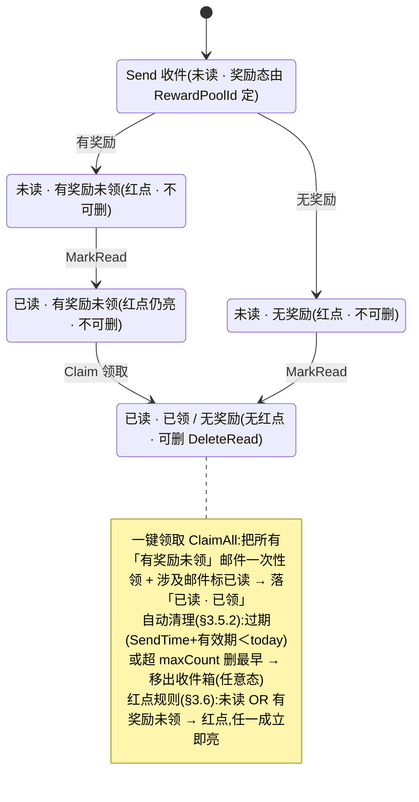
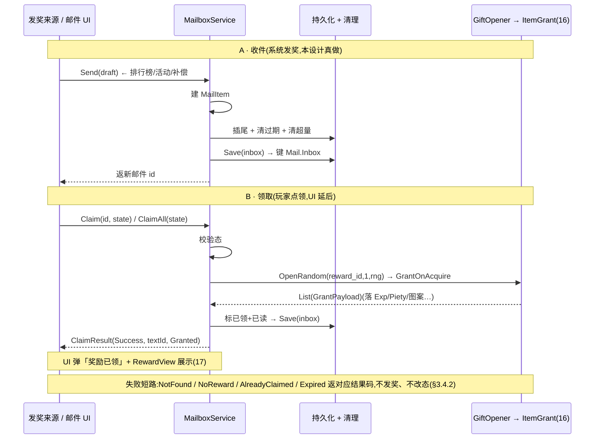

# 通用邮件系统 · 数据逻辑层 + 服务器/运营接缝

命名空间 `GameLogic.Mail` 的**收件箱数据逻辑层**:邮件数据模型(发件人 / 时间 / 标题 / 内容 / 奖励附件 / 已读 / 已领取)+ 收件箱服务 `MailboxService`(收件 / 列表排序 / 标记已读 / 领取奖励单封+一键 / 删除已读 / 自动清理超量+过期 / 红点)。关键在两道接缝:① **对外收件 API** `IMailService.Send`——供排行榜结算 / 活动回收 / 系统奖励调用(即 spec 的「为其他功能留邮件调用接口」);② **服务器/运营接缝** `IMailSource`(后台发删 / 定时 / 区服多选)<mark>= stub + TODO,离线不实现</mark>。奖励附件复用 [道具系统 16](#16-item-system) 的礼包随机库 + `ItemGrant` 落点,领取后用 [设计 17](#17-reward-display) 的 `RewardView` 展示。这是 xlsx 系统底层批次第七刀。<mark>邮件界面 / 详情 / 红点显示 / icon(表现层)需美术,延后轮,本设计只留服务 + 接缝 + 红点状态 getter。</mark>

    <b>读前必看 · 与工程现状的关系(单一事实源 = 代码)</b>
    
五条边界先明确,防 dev 把「邮件数据层」做成「真连服务器收发邮件 + 另造一套发奖 / 存储」:

    <ul style="margin:8px 0 0">
      <li><b>「服务器/运营接缝」= 可注入邮件来源接口,不是真收发网络邮件。</b>本工程<mark>没有网络模块</mark>(<code>Books/3-8-网络模块.md</code> 标「待补充」,全工程 grep 无 <code>INetworkModule</code>/<code>UnityWebRequest</code>/<code>HttpClient</code>),方向<b>离线还原 · 去变现</b>。「后台全服发邮件 / 定时邮件 / 区服多选」本应由运营后台 + 服务器推送,本设计抽象成 <code>IMailSource</code> 接口:留 <mark>stub + TODO</mark>,离线不实现,<b>区服离线视单一本地区服</b>(无多区概念)。这道接缝指的是<b>接口边界本身</b>,而非本设计真去连服务器(见 <a href="#21-mail-system::source">§3.7</a> / <a href="#21-mail-system::open">§七 O1</a>)。</li>
      <li><b>「对外收件 API」是本设计真做的核心接缝。</b>spec 写「为其他功能留邮件调用接口,用于奖励发放」——这是<mark>本游戏内部</mark>各系统(排行榜结算 / 活动回收 / 系统补偿)把奖励经邮件发给玩家的入口 <code>IMailService.Send(MailDraft)</code>。它<b>不依赖网络</b>,是本设计真实实现的服务方法。下一轮排行榜底层即接此真实本地邮件服务做结算发奖,而非再 stub(本批次决策,见 boss.md)。</li>
      <li><b>奖励附件复用 16 道具系统的礼包随机库 + 既有落点,不另造发奖。</b>邮件配置表第 5 列 <code>Reward表id</code> = <mark>奖励随机库表 id</mark>(spec 原文),即道具系统 <code>gift_random</code> 礼包池的 index。领取时经既有 <code>GiftOpener.OpenRandom(rewardId, 1, rng)</code> 抽出 <code>GiftEntry</code> 列表,每项经 <code>ItemConfigMgr.GetItem</code> → <code>ItemGrant.GrantOnAcquire</code> 落 <code>MergeOrderState</code>(<code>Item/ItemGrant.cs</code>,设计 16 §3.6/§3.7)。本系统<mark>只持有「奖励来自哪个库表 id」,不复制发奖落点逻辑</mark>。</li>
      <li><b>持久化复用既有接缝,本地单机。</b>整个收件箱(邮件列表 + 各封已读/已领状态)序列化进既有 <code>GameLogic.BlockBlast.IPersistenceProvider</code>/<code>Persistence.Provider</code> 的专用键 <code>Mail.Inbox</code>(生产 PlayerPrefs / 测试 InMemory)。<mark>不</mark>新建第二套存储栈。脏数据 / 截断对任意输入须产出合法空集合不抛(同 14 save-system 保底口径)。</li>
      <li><b>UI 投放不在本设计。</b>邮件界面 / 详情 / 无邮件态 / 全部删除二次确认 / 红点显示 / 邮件 icon 是表现层,依赖美术与窗口流程,本设计<mark>不</mark>建窗口、不挂 prefab。交付到「邮件模型 + 收件箱服务 + 两道接缝 + 红点状态 getter + 文案 textId 占位」。多语言标题/内容存 textId 占位(同 num/item/reward/settings/redeem 现状)。</li>
    </ul>
  

    <b>立项信息</b>
    <table>
      <tbody><tr><th>类型</th><td>新系统 · 通用邮件数据逻辑层 + 服务器/运营接缝 出设计稿 + 验收标准,交开发落地。xlsx 系统底层批次第七刀。</td></tr>
      <tr><th>设计基线(经 grep 核实的真实符号)</th><td>
        <b>奖励发放</b>:邮件附件 = 礼包随机库 id → <code>GameLogic.BlockBlast.Item.GiftOpener.OpenRandom(index, times, rng)</code>(<code>Item/GiftOpener.cs</code>,返 <code>List&lt;GiftEntry&gt;</code>);每项 <code>GiftEntry.ItemId/Num</code> → <code>GameLogic.Config.ItemConfigMgr.GetItem(id)</code> → <code>GameLogic.BlockBlast.Item.ItemGrant.GrantOnAcquire(def, num, state, rng)</code> 落 <code>MergeOrderState</code>(<code>Item/ItemGrant.cs</code>,设计 16)。 
        <b>持久化接缝</b>:<code>GameLogic.BlockBlast.IPersistenceProvider</code>(<code>TryGet/Set/Remove</code>)+ <code>Persistence.Provider</code>(默认 <code>PlayerPrefsProvider</code> / 测试 <code>InMemoryPersistenceProvider</code>,<code>Module/BlockBlast/Persistence.cs</code>)。 
        <b>序列化范本</b>:<code>MergeMetaPersistence.Serialize/Deserialize/Migrate</code> + <code>MergeMetaSave</code>(<code>JsonUtility</code> 友好 <code>[Serializable]</code> DTO + version 字段 + 反序列化 null 保底,<code>Module/BlockBlast/MergeMeta*.cs</code>,设计 14)。 
        <b>配置桥接范本</b>:<code>ItemConfigMgr</code>/<code>RedeemConfigMgr</code>(Luban 行 → POCO,运行期 <code>EnsureLoaded</code> 走 <code>ConfigSystem.Instance.Tables</code>;EditMode 经 <code>InitForTest</code> 注入绕 YooAsset)。 
        <b>结果展示(可选接)</b>:<code>GameLogic.BlockBlast.Reward.RewardView</code>(<code>Module/BlockBlast/Reward/RewardView.cs</code>,设计 17)——领取后用它统一渲染奖励;本设计只产出 <code>GrantPayload</code>,UI 接时自行转 <code>RewardView</code>。 
        <b>主界面入口钩子</b>:邮件 icon = 主界面邮件按钮 + 红点(spec),本设计留<code>MailboxService.HasUnreadOrUnclaimed</code> 红点 getter 供主界面接,UI 投放延后。
      </td></tr>
      <tr><th>方向约束</th><td>离线还原 · <b>去变现</b>:邮件用于运营发放(节日礼包 / 公告补偿 / 系统奖励)与<b>游戏内系统结算发奖</b>(排行榜 / 活动回收),<mark>不</mark>含充值 / 内购 / 付费;真实服务器后台发删邮件延后(本工程无网络模块),离线版 <code>IMailSource</code> inert。IO 走框架既有非阻塞 PlayerPrefs(同 14/19/20 口径,不触「禁阻塞 IO」红线)。加法式扩展,不破坏既有核心循环 + 已建系统。</td></tr>
      <tr><th>影响范围</th><td>
        <b>新增配置表</b>:<code>mail.xlsx</code>(邮件模板表) → Luban <code>GameConfig.Mail</code>;<b>全局配置</b> maxCount(默认 100)/ retainDays(默认 30)入 <code>mail_global</code> 表或既有全局配置(<a href="#21-mail-system::config">§3.1</a>); 
        <b>新增 POCO + 桥接</b>:<code>MailDef</code> + <code>MailGlobalConfig</code> + <code>MailConfigMgr</code>(含 <code>InitForTest</code>,归 <code>GameLogic.Config</code>,<a href="#21-mail-system::poco">§3.2</a>); 
        <b>新增邮件模型</b>:<code>MailItem</code>(运行期) + <code>MailDraft</code>(收件入参) + <code>MailStatus</code> 枚举(<a href="#21-mail-system::model">§二</a> / <a href="#21-mail-system::draft">§3.3</a>); 
        <b>新增收件箱服务</b>:<code>MailboxService</code>(实现对外 <code>IMailService</code>)+ <code>ClaimResult</code>(领取结果)+ <code>MailText</code>(textId 占位,<a href="#21-mail-system::service">§3.4</a>–<a href="#21-mail-system::reddot">§3.6</a>); 
        <b>新增持久化层</b>:<code>MailInboxSave</code>(<code>[Serializable]</code> DTO)+ <code>MailPersistence</code>(序列化 + 专用键 <code>Mail.Inbox</code>,包既有 <code>Persistence.Provider</code>,<a href="#21-mail-system::persist">§3.5</a>); 
        <b>新增运营接缝</b>:<code>IMailSource</code> + <code>InertMailSource</code>(stub,<a href="#21-mail-system::source">§3.7</a>); 
        <b>改既有</b>:无(发奖复用 16 既有礼包库+落点,持久化复用既有接缝,框架代码不动)。<b>UI 零改动</b>(本设计不建窗口)。<b>既有玩法逻辑零行为变化</b>。
      </td></tr>
      <tr><th>关键约束(继承现状)</th><td>POCO / 模型 / 服务 / 持久化 / 接缝为纯逻辑,可在纯 C# 单测直接 <code>new</code> / 注入(不依赖 YooAsset / Unity 运行时 / 网络);配置经 <code>MailConfigMgr.InitForTest</code> 注入(绕 ConfigSystem);持久化往返经 <code>InMemoryPersistenceProvider</code> 注入断言(不碰真实 PlayerPrefs);<mark>时钟注入 <code>NowProvider</code></mark>(默认 <code>DateTime.Now</code>,有效期/保留/过期清理用注入 today,可单测);发奖落 <code>MergeOrderState</code> 经既有礼包库+落点(state 可 null 走纯解析)。现有 EditMode 测试零回归。</td></tr>
    </tbody></table>
  

<h2 id="what">一、做什么与为什么</h2>

现状:游戏**没有邮件系统**。spec(`1002通用邮件系统.xlsx`)要一套「系统发信息与奖励」的收件箱:运营在后台发全服/私人/附件邮件,系统(排行榜结算 / 活动回收 / 补偿)也经邮件给玩家发奖励。本设计建一套**通用邮件数据逻辑层**:收件 → 列表(排序)→ 读 → 领奖 → 删除 → 自动清理,并把「奖励发放接口」「服务器/运营来源」两道接缝划清。

「通用」体现在三处:① 邮件内容(标题/内容/有效期/奖励)经配置表声明,奖励复用道具系统的礼包随机库(任何道具/货币/图案都能发);② 对外收件 API 让游戏内任意系统都能经邮件发奖,不绑定来源;③ 运营来源经接缝抽象,离线 inert、未来可切真实后台而服务层不改。逐条对应 spec 需求:

| # | 需求(spec) | 本篇落法 | 现状/新增 |
| --- | --- | --- | --- |
| 1 | 系统/运营发信息与奖励到收件箱 | `MailboxService.Send(MailDraft)`(对外 `IMailService`):把一封邮件草稿(发件人/标题/内容/有效期/奖励库 id)收进收件箱([§3.3](#21-mail-system::draft)) | 新增对外 API |
| 2 | 为其他功能留邮件调用接口,用于奖励发放 | 同上 `IMailService.Send`:排行榜结算 / 活动回收 / 系统补偿调它发奖。<mark>本设计真做(本地)</mark>,下轮排行榜接此([§3.4](#21-mail-system::service)) | 本设计真做接缝 |
| 3 | 邮件格式:发件人+时间+标题+内容+奖励包(可选) | `MailItem` 模型:Sender / SendTime / TitleTextId / BodyTextId / RewardPoolId(0=无奖励) + 状态([§二](#21-mail-system::model)) | 新增模型 |
| 4 | 列表排序:已读>未读,再按时间 | `MailboxService.List()`:未读优先(置顶),组内按发件时间降序(新在前,[§3.4](#21-mail-system::service)) | 新增列表 |
| 5 | 标记已读 | `MarkRead(mailId)` / 列表查看自动标读([§3.4](#21-mail-system::service)) | 新增 |
| 6 | 领取奖励:单封 / 一键(发所有未领→展示→全标已读) | `Claim(mailId)` / `ClaimAll()`:发奖复用 16 礼包库+落点,返 `ClaimResult`(产出列表供 17 展示);一键领后未领奖全发 + 涉及邮件标已读([§3.4.2](#21-mail-system::claim)) | 复用 16/17 |
| 7 | 删除已读(已读且奖励已领或无奖励) | `DeleteRead(mailId)`:仅当已读 &amp;&amp;(无奖励 ‖ 奖励已领)才可删;否则拒绝([§3.4](#21-mail-system::service)) | 新增 |
| 8 | 保留期默认一月到期自动消失 | 过期清理:邮件 SendTime + 有效期天数 &lt; 注入 today → 删;全局 retainDays 默认 30 兜底([§3.5.2](#21-mail-system::cleanup)) | 新增清理 |
| 9 | 未领取数>N(默认 100)删最早,新邮件插尾,总上限 N | 容量清理:收件后若超 maxCount,按发件时间删最早的([§3.5.2](#21-mail-system::cleanup)) | 新增清理 |
| 10 | N 与保留时间入全局配置 | `mail_global` 表:maxCount(默认 100)/ retainDays(默认 30),`MailConfigMgr` 读([§3.1](#21-mail-system::config)) | 新增全局配置 |
| 11 | 红点 = 未读 OR 有奖励未领;主界面图标右上+列表项右上 | `HasUnreadOrUnclaimed`(全局红点)/ 每封 `MailItem.HasRedDot`(列表项红点,[§3.6](#21-mail-system::reddot)) | 新增红点 getter |
| 12 | 开启:1 级即开 | 无等级门控逻辑(始终可用);1 级开仅 UI 入口可见性,表现层处理 | 无门控 |
| 13 | 运营/服务器:后台发删定时邮件(标待定/后面做) | `IMailSource` 接缝 + `InertMailSource` **stub**:离线不实现,区服离线视单一本地区服([§3.7](#21-mail-system::source) / [§七 O1](#21-mail-system::open)) | stub |
| 14 | 邮件界面 / 详情 / 无邮件 / 全部删除提示 / 红点显示 / icon | 表现层,需美术,**延后**(同 15–20 节奏,[§七 O7](#21-mail-system::open)) | UI 延后 |

<b>不做(本设计明确排除):</b>真实服务器 / 后台收发邮件(无网络模块,O1);区服多选 / 多区概念(离线单区,O2);所有 UI 窗口(界面/详情/无邮件态/删除确认 — 需美术,O7);多语言标题/内容真实查表(textId 占位,同 num/item/reward 现状,O5);道具/跑马灯(spec 明写无,O6);充值 / 付费 / 内购邮件(去变现方向,不做)。

<h2 id="model">二、邮件模型与状态机</h2>

<h3 id="states">2.1 邮件状态(已读 × 奖励三态)</h3>

一封邮件有两个正交维度:**读态**(未读/已读)与**奖励态**(无奖励 / 有奖励未领 / 有奖励已领)。spec 的红点、删除、领取规则都由这两维派生。状态图:

<b>删除前置(spec「删除已读」)</b>:`DeleteRead` 仅当 <mark>已读 &amp;&amp;(RewardPoolId==0 ‖ Claimed)</mark> 才允许。「未读」或「有奖励未领」拒绝删除(防玩家误删未领奖励)——这是 spec「已读且奖励已领或无奖励」的逐字落法。

<h3 id="additive">2.2 加法式接入(复用既有发奖 + 持久化接缝)</h3>

本设计<mark>不新造发奖、不新造存储栈</mark>,只补「收件箱状态机 + 编排 + 两道接缝」:

| 环节 | 既有(不动) | 本设计补 |
| --- | --- | --- |
| 奖励库 | `GiftOpener.OpenRandom(index,times,rng)` 礼包随机库(设计 16) | 复用,邮件附件 = 库表 id,领取时抽奖 |
| 发奖落点 | `ItemGrant.GrantOnAcquire` / `ApplyNumeric` / `ApplyPattern`(设计 16) | 复用,把抽出的道具落 `MergeOrderState` |
| 道具元数据 | `ItemConfigMgr.GetItem(id)`(设计 16) | 复用,不重复登记道具 |
| 持久化 | `Persistence.Provider`(`IPersistenceProvider`)+ `JsonUtility` 序列化范本(设计 14) | `MailPersistence` 包它存收件箱(键 `Mail.Inbox`) |
| 奖励展示 | `RewardView` 归一(设计 17) | 复用,UI 接时把领取产出 `GrantPayload` 转 `RewardView` |
| 收件箱状态机 + 服务 + 接缝 | 缺 | **本设计主体**:模型 + 列表/读/领/删/清理 + 收件 API + 运营接缝 |

<h2 id="numbers">三、设计正文</h2>

<h3 id="config">3.1 邮件配置表 mail + 全局配置(Luban)</h3>

源 xlsx 在仓库根 `Configs/GameConfig/Datas/mail.xlsx`(与 `UnityProject` 同级,同 num/item/redeem 表)。schema 写数据 xlsx 表头四行(`##var` / `##type` / `##group` / `##`);planner 备注类字段设 `group=e` 不导出运行期。

**邮件模板表 mail**(主键 `id`,字段直取 spec 的 `表` sheet 表头):

| 字段(##var) | 类型(##type) | group | 含义(spec) |
| --- | --- | --- | --- |
| id | int | c,s | 邮件模板 id(主键)。`Send` 时可引用模板,也可不引用直接发自定义草稿([§3.3](#21-mail-system::draft)) |
| title | int | c,s | 邮件标题(多语言文本 textId)。demo 行存占位 mailName\_1..5([§七 O5](#21-mail-system::open)) |
| desc | int | c,s | 邮件内容(多语言文本 textId)。demo 行存占位 mailDesc\_1..5 |
| expire\_days | int | c,s | 有效期(天)。demo 行 = 14;0 / 负 = 用全局 retainDays 兜底([§3.5.2](#21-mail-system::cleanup)) |
| reward\_id | int | c,s | <mark>奖励随机库表 id</mark>(spec「Reward表id」)。指向道具系统 `gift_random` 礼包池 index(设计 16);demo 行 = 1002;0 = 无奖励 |

spec 的 5 条 demo 行(`id 1–5` / title=mailName\_1..5 / desc=mailDesc\_1..5 / expire=14 / reward=1002)**原样录入**(reward=1002 须道具系统 16 的礼包随机库存在该 index 才能领出实物,否则领取产出空列表——不抛,见 [§3.4.2](#21-mail-system::claim) 边界)。

<b>全局配置 mail\_global</b>(单行 / KV,或并入既有全局配置表):

| 字段(##var) | 类型(##type) | 默认 | 含义(spec「全局表」) |
| --- | --- | --- | --- |
| max\_count | int | 100 | 收件箱总上限 N:超过按发件时间删最早(spec「未领取数>N 删最早 / 总上限 N」) |
| retain\_days | int | 30 | 默认保留天数(spec「保留期默认一月」)。邮件自身 expire\_days>0 时优先用邮件的;否则用本值 |

> [!NOTE]
> <b>为什么奖励复用「礼包随机库 id」而非道具 id 列表?</b>
>
> spec 的邮件配置表第 5 列原文是「<code>Reward表id(奖励随机库表id)</code>」——指向<mark>一个随机奖励库</mark>,不是单个道具。道具系统(设计 16)已有 <code>gift_random</code> 礼包随机库:一个 index 对应一组带权重的 <code>GiftEntry(ItemId/Num/Rate)</code>。邮件附件直接引用库 id,领取时经 <code>GiftOpener.OpenRandom(reward_id, 1, rng)</code> 抽出实物,再经 <code>ItemGrant</code> 落点。<mark>发什么、按什么权重、怎么落,全交给道具系统既有逻辑</mark>——不必在邮件侧重定义奖励结构,也避免两套漂移。这与兑换码(设计 20)走「道具 id × 数量」是**同源不同入口**:邮件走库表(spec 如此),兑换码走道具项,二者最终都汇到 <code>ItemGrant</code>。

<h3 id="poco">3.2 运行期 POCO + 桥接(MailDef / MailGlobalConfig / MailConfigMgr)</h3>

仿 `ItemConfigMgr`/`RedeemConfigMgr`:Luban 行桥接成 POCO,业务侧只认 POCO(隔离生成类型);运行期 `EnsureLoaded` 走 `ConfigSystem`,EditMode 经 `InitForTest` 注入绕 YooAsset。<b>配置桥接 <code>MailConfigMgr</code> 归 <code>GameLogic.Config</code></b>(与既有 `ItemConfigMgr` 并列);邮件模型/服务归新建 `GameLogic.Mail`(同 `GameLogic.Redeem` 体例)。

<pre class="code">namespace GameLogic.Mail  // 新建命名空间，通用系统，与 BlockBlast 玩法解耦
{
    public sealed class MailDef        // 邮件模板（配置行 → POCO）
    {
        public int Id;
        public int TitleTextId;        // 标题 textId
        public int BodyTextId;         // 内容 textId
        public int ExpireDays;         // 有效期（天）；&lt;=0 用全局 retainDays
        public int RewardPoolId;       // 奖励随机库 id（gift_random index）；0 = 无奖励
    }
    public sealed class MailGlobalConfig
    {
        public int MaxCount   = 100;   // 收件箱总上限 N
        public int RetainDays = 30;    // 默认保留天数
    }
}
namespace GameLogic.Config
{
    public static class MailConfigMgr
    {
        private static System.Collections.Generic.Dictionary&lt;int, MailDef&gt; _mails;
        private static MailGlobalConfig _global;
        public static void EnsureLoaded() { /* 走 ConfigSystem.Instance.Tables.TbMail / TbMailGlobal 桥接 POCO */ }
        /// &lt;summary&gt;按模板 id 查;查不到返 null(不抛)。&lt;/summary&gt;
        public static MailDef GetMail(int id) { EnsureLoaded(); return _mails.TryGetValue(id, out var d) ? d : null; }
        /// &lt;summary&gt;全局配置(总有值:表缺则返默认 100/30)。&lt;/summary&gt;
        public static MailGlobalConfig Global { get { EnsureLoaded(); return _global ??= new MailGlobalConfig(); } }
        /// &lt;summary&gt;测试注入口:绕 ConfigSystem 直接灌 POCO。&lt;/summary&gt;
        public static void InitForTest(System.Collections.Generic.IEnumerable&lt;MailDef&gt; mails, MailGlobalConfig global = null) { /* 灌入字典 + 全局 */ }
        public static void ResetForTest() { _mails = null; _global = null; }
    }
}</pre>

<h3 id="draft">3.3 邮件模型 MailItem + 收件草稿 MailDraft</h3>

收件入口收的是一张**草稿**(`MailDraft`:谁发的 / 标题 / 内容 / 有效期 / 奖励库 id),服务给它配上 id + 收件时间 + 初始状态,变成**运行期邮件**(`MailItem`)。模型字段对应 spec「发件人+发件时间+标题+内容+奖励包(可选)」+ 读态/奖励态。

<pre class="code">namespace GameLogic.Mail
{
    /// &lt;summary&gt;收件草稿:对外 IMailService.Send 的入参。可由模板 id 构造，也可直接填字段。&lt;/summary&gt;
    public sealed class MailDraft
    {
        public int    SenderTextId;   // 发件人（系统 / 运营 / 排行榜… 用 textId 占位）
        public int    TitleTextId;
        public int    BodyTextId;
        public int    ExpireDays;     // &lt;=0 → 用全局 retainDays
        public int    RewardPoolId;   // 0 = 无奖励
        /// &lt;summary&gt;按模板 id 建草稿(从 MailConfigMgr.GetMail 复制字段)。&lt;/summary&gt;
        public static MailDraft FromTemplate(int mailDefId, int senderTextId) { /* 查 MailConfigMgr，复制字段 */ }
    }
    /// &lt;summary&gt;收件箱里的一封邮件(运行期 + 可序列化)。&lt;/summary&gt;
    public sealed class MailItem
    {
        public long   Id;             // 收件箱内唯一 id(自增/时间戳,服务分配)
        public int    SenderTextId;
        public int    TitleTextId;
        public int    BodyTextId;
        public long   SendTimeTicks;  // 收件时间(DateTime.Ticks,可序列化、可与注入 today 比)
        public int    ExpireDays;     // 有效期(天);收件时已折算成自身天数
        public int    RewardPoolId;   // 0 = 无奖励
        public bool   Read;           // 已读
        public bool   Claimed;        // 奖励已领(无奖励邮件 RewardPoolId==0 视同已结清)
        public bool HasReward =&gt; RewardPoolId != 0;
        public bool HasRedDot =&gt; !Read || (HasReward &amp;&amp; !Claimed);   // 红点:未读 OR 有奖未领(§3.6)
        public bool CanDelete =&gt; Read &amp;&amp; (!HasReward || Claimed);     // 删除前置(§2.1)
    }
}</pre>

**时间用 Ticks 存**:`DateTime` 不是 `JsonUtility` 友好类型,存 `long Ticks`(可序列化、可与注入 today 的 Ticks 比),过期判定时还原(同 save-system 存原始值口径)。

<h3 id="service">3.4 收件箱服务 MailboxService(对外 API + 列表 + 读 + 删)</h3>

服务持有收件箱(`List<MailItem>`)+ 注入(持久化层 / 时钟 / 奖励随机数)。实现对外 `IMailService`(收件 API)+ 收件箱操作。每个写操作(收件/领取/删除/清理)落盘一次。

<pre class="code">namespace GameLogic.Mail
{
    /// &lt;summary&gt;对外收件接口:游戏内任意系统(排行榜/活动/补偿)经此发奖。spec「留邮件调用接口」。&lt;/summary&gt;
    public interface IMailService
    {
        /// &lt;summary&gt;收一封邮件进收件箱(收件后触发容量/过期清理)。返新邮件 id。&lt;/summary&gt;
        long Send(MailDraft draft);
    }
    public sealed class MailboxService : IMailService
    {
        private readonly IMailPersistence _persist;     // 落盘(注入)
        public System.Func&lt;System.DateTime&gt; NowProvider = () =&gt; System.DateTime.Now;  // 时钟(注入)
        public System.Func&lt;System.Random&gt;  RngProvider  = () =&gt; new System.Random();   // 抽奖随机(注入)
        private System.Collections.Generic.List&lt;MailItem&gt; _inbox;
        public MailboxService(IMailPersistence persist) { _persist = persist; _inbox = persist.Load(); }
        // ── 收件(对外 API)──
        public long Send(MailDraft draft)
        {
            var now = NowProvider();
            var m = new MailItem { Id = NextId(now), SenderTextId = draft.SenderTextId,
                TitleTextId = draft.TitleTextId, BodyTextId = draft.BodyTextId, SendTimeTicks = now.Ticks,
                ExpireDays = draft.ExpireDays, RewardPoolId = draft.RewardPoolId, Read = false, Claimed = false };
            _inbox.Add(m);                       // 新邮件插尾
            CleanupExpired(now); CleanupOverflow();  // §3.5.2
            _persist.Save(_inbox);
            return m.Id;
        }
        // ── 列表(已读&gt;未读,组内时间降序)──
        public System.Collections.Generic.IReadOnlyList&lt;MailItem&gt; List()
        {
            CleanupExpired(NowProvider());       // 列表前先清过期
            return _inbox
                .OrderBy(m =&gt; m.Read ? 1 : 0)     // 未读(0)在前
                .ThenByDescending(m =&gt; m.SendTimeTicks)  // 新在前
                .ToList();
        }
        // ── 标记已读 ──
        public void MarkRead(long mailId) { var m = Find(mailId); if (m != null &amp;&amp; !m.Read) { m.Read = true; _persist.Save(_inbox); } }
        // ── 删除已读(前置:已读 &amp;&amp; (无奖励 || 已领))──
        public bool DeleteRead(long mailId)
        {
            var m = Find(mailId);
            if (m == null || !m.CanDelete) return false;   // 未读 / 有奖未领 → 拒绝
            _inbox.Remove(m); _persist.Save(_inbox); return true;
        }
    }
}</pre>

**排序口径**:spec「已读>未读」——理解为<mark>未读邮件置顶</mark>(玩家先看新内容),已读沉底;组内按发件时间降序(新邮件在前)。`Read ? 1 : 0` 升序使未读(0)排在已读(1)之前。

<h4 id="claim">3.4.2 领取奖励(单封 Claim / 一键 ClaimAll)</h4>

领取 = 抽奖励库 → 落点 → 标已领 → 标已读。复用 16 礼包库+落点,产出 `GrantPayload` 列表供 UI 转 17 `RewardView` 展示。

<pre class="code">namespace GameLogic.Mail
{
    public enum ClaimStatus { Success, NotFound, NoReward, AlreadyClaimed, Expired }
    public readonly struct ClaimResult
    {
        public readonly ClaimStatus Status;
        public readonly int TextId;   // 结果文案(占位,§3.8)
        public readonly System.Collections.Generic.IReadOnlyList&lt;GameLogic.BlockBlast.Item.GrantPayload&gt; Granted; // 成功时非空
    }
    public partial class MailboxService
    {
        /// &lt;summary&gt;单封领取:抽奖励库 → 落点 → 标已领 + 已读。state 可 null 走纯解析。&lt;/summary&gt;
        public ClaimResult Claim(long mailId, GameLogic.BlockBlast.Item.MergeOrderState state)
        {
            var m = Find(mailId);
            if (m == null)        return Fail(ClaimStatus.NotFound);
            if (!m.HasReward)     return Fail(ClaimStatus.NoReward);     // 无奖励邮件无可领
            if (m.Claimed)        return Fail(ClaimStatus.AlreadyClaimed);
            if (IsExpired(m, NowProvider())) return Fail(ClaimStatus.Expired);
            var granted = GrantPool(m.RewardPoolId, state);  // 抽库 + 落点(§3.4.3)
            m.Claimed = true; m.Read = true;                 // 领后标已领 + 已读
            _persist.Save(_inbox);
            return new ClaimResult(ClaimStatus.Success, MailText.ClaimSuccess, granted);
        }
        /// &lt;summary&gt;一键领取:领所有「有奖励未领」邮件,涉及邮件标已读,汇总产出。&lt;/summary&gt;
        public ClaimResult ClaimAll(GameLogic.BlockBlast.Item.MergeOrderState state)
        {
            var now = NowProvider();
            var all = new System.Collections.Generic.List&lt;GameLogic.BlockBlast.Item.GrantPayload&gt;();
            foreach (var m in _inbox)
            {
                m.Read = true;                                  // 一键顺带全标已读(spec)
                if (m.HasReward &amp;&amp; !m.Claimed &amp;&amp; !IsExpired(m, now))
                { all.AddRange(GrantPool(m.RewardPoolId, state)); m.Claimed = true; }
            }
            _persist.Save(_inbox);
            return new ClaimResult(ClaimStatus.Success, MailText.ClaimSuccess, all);
        }
    }
}</pre>

<b>一键语义(spec「发所有未领奖→弹奖励展示→全标已读」)</b>:遍历收件箱,所有<mark>有奖励未领且未过期</mark>的发奖,涉及邮件标已领;<mark>全部邮件</mark>(含无奖励/已领)标已读(spec「全标已读」)。汇总产出一次性交 UI 展示。已过期未领的不发(由清理移除)。

<h4 id="grant">3.4.3 发奖落点(复用 GiftOpener / ItemGrant)</h4>

发奖<mark>不新造逻辑</mark>:奖励库 id → `GiftOpener.OpenRandom` 抽出 `GiftEntry` 列表 → 每项查 `ItemConfigMgr.GetItem` → `ItemGrant.GrantOnAcquire` 落 `MergeOrderState`,汇总 `GrantPayload` 列表返回。`state==null` 时只产出结构、不落实际系统(纯解析单测路径,同 16/20)。

<pre class="code">private IReadOnlyList(GrantPayload) GrantPool(int rewardPoolId, MergeOrderState state)
{
    var all = new List(GrantPayload)();
    if (rewardPoolId == 0) return all;                                  // 无奖励
    var rng = RngProvider();
    var rolled = GameLogic.BlockBlast.Item.GiftOpener.OpenRandom(rewardPoolId, 1, rng); // 既有，抽一次
    foreach (var e in rolled)
    {
        var itemDef = GameLogic.Config.ItemConfigMgr.GetItem(e.ItemId);                  // 既有
        all.AddRange(GameLogic.BlockBlast.Item.ItemGrant.GrantOnAcquire(itemDef, e.Num, state, rng)); // 既有，自动落点
    }
    return all;                                                          // 池缺/空 → 空列表(不抛)
}</pre>

**边界**:奖励库 id 在道具系统未登记(`OpenRandom` 查无返空列表)→ 领取仍返 `Success` 但 `Granted` 空(不抛;demo 行 reward=1002 须 16 礼包库存在该 index 才有实物)。`automatic=0` 项 `GrantOnAcquire` 返空(进背包路径,本设计不接背包实例,O3)。

<h3 id="persist">3.5 持久化层(MailInboxSave / MailPersistence)</h3>

整个收件箱序列化进既有 `Persistence.Provider` 专用键 `Mail.Inbox`。仿 `MergeMetaPersistence`(设计 14):`[Serializable]` DTO + `JsonUtility` + version + 反序列化保底。<mark>序列化层纯逻辑同步可单测</mark>(对象↔string / InMemory Provider 往返),不碰真实磁盘。

<pre class="code">namespace GameLogic.Mail
{
    [System.Serializable]
    public sealed class MailInboxSave   // JsonUtility 友好:List&lt;MailItemSave&gt; 包在容器里可序列化
    {
        public int version = 1;
        public System.Collections.Generic.List&lt;MailItem&gt; mails = new();
        // MailItem 已是可序列化字段(无属性/无 Unity 引用类型),JsonUtility 直接吃
    }
    public interface IMailPersistence
    {
        System.Collections.Generic.List&lt;MailItem&gt; Load();   // 读盘/反序列化;无键/脏数据 → 空列表(不抛)
        void Save(System.Collections.Generic.List&lt;MailItem&gt; inbox);
    }
    /// &lt;summary&gt;生产:经既有 Persistence.Provider(键 Mail.Inbox)。&lt;/summary&gt;
    public sealed class MailPersistence : IMailPersistence
    {
        private const string Key = "Mail.Inbox";   // 本系统专用键,不与框架/其它系统键冲突
        public List&lt;MailItem&gt; Load()
        {
            if (!Persistence.Provider.TryGet(Key, out var raw) || string.IsNullOrEmpty(raw)) return new();
            var dto = UnityEngine.JsonUtility.FromJson&lt;MailInboxSave&gt;(raw);   // 失败/脏 → 下方 catch → 空
            return (dto?.mails) ?? new();   // 任意非法输入产出合法空集合(§读前必看第 4 条)
        }
        public void Save(List&lt;MailItem&gt; inbox)
        {
            var dto = new MailInboxSave { mails = inbox };
            Persistence.Provider.Set(Key, UnityEngine.JsonUtility.ToJson(dto));
        }
    }
    /// &lt;summary&gt;测试:内存,往返断言不污染 PlayerPrefs。&lt;/summary&gt;
    public sealed class InMemoryMailPersistence : IMailPersistence { /* List 字段直存直取 */ }
}</pre>

**保底**:`Load` 对无键 / 空串 / `FromJson` 抛异常(脏数据/截断)统一产出空列表(`try/catch` 包 `FromJson`,同 14 `Deserialize` 口径)。本地单机文件可被篡改,反序列化对任意输入不抛。version 字段预留迁移(本设计恒 1)。

<h4 id="cleanup">3.5.2 自动清理(过期 + 超量,注入时钟)</h4>

两条清理规则,都用<mark>注入的 <code>NowProvider</code></mark> 判定(可单测),在收件后 + 列表前触发:

| 规则 | 判据 | spec 出处 |
| --- | --- | --- |
| **过期清理** `CleanupExpired(now)` | 每封:有效期 = `ExpireDays>0 ? ExpireDays : Global.RetainDays`;`SendTime + 有效期天 < now` → 删 | 「保留期默认一月到期自动消失」(邮件自带 expire 优先,缺省用全局 retainDays=30) |
| **超量清理** `CleanupOverflow()` | 收件箱数 > `Global.MaxCount`(默认 100)→ 按 `SendTimeTicks` 升序删最早的,直到 = MaxCount | 「未领取数>N 删最早、新邮件插尾、总上限 N」 |

<b>超量口径取舍(O4)</b>:spec 写「未领取数>N」与「总上限 N」两句。本设计取<mark>总上限 N</mark>(收件箱总条数上限,默认 100),超量删最早——这是安全默认:既满足「总上限 N」,又使「插尾 + 删最早」FIFO 语义清晰。「只数未领取」会让已读已领的旧邮件不占名额、收件箱可无限堆已读邮件,反而不符「总上限」。要改成「只对未领取计数」可在 `CleanupOverflow` 换判据(O4)。<mark>删最早不论读/领态</mark>(超量是硬上限);未领奖励被超量删除是 spec 既定取舍(玩家应及时领取)。

<pre class="code">private void CleanupExpired(System.DateTime now)
{
    int retain = GameLogic.Config.MailConfigMgr.Global.RetainDays;
    _inbox.RemoveAll(m =&gt; {
        int days = m.ExpireDays &gt; 0 ? m.ExpireDays : retain;
        return new System.DateTime(m.SendTimeTicks).AddDays(days) &lt; now;
    });
}
private void CleanupOverflow()
{
    int max = GameLogic.Config.MailConfigMgr.Global.MaxCount;
    if (_inbox.Count &lt;= max) return;
    _inbox.Sort((a, b) =&gt; a.SendTimeTicks.CompareTo(b.SendTimeTicks)); // 早→晚
    _inbox.RemoveRange(0, _inbox.Count - max);                        // 删最早的,留最新 max 封
}</pre>

<h3 id="reddot">3.6 红点 getter(未读 OR 有奖未领)</h3>

spec 红点 = 「邮件未读时 / 有奖励未领时」,显示在**主界面邮件图标右上**(全局红点)与**列表项右上**(每封红点)。本设计只给状态 getter,UI 投放延后。

<pre class="code">public partial class MailboxService
{
    /// &lt;summary&gt;全局红点(主界面图标):任一封有红点即亮。先清过期再判。&lt;/summary&gt;
    public bool HasUnreadOrUnclaimed
    {
        get { CleanupExpired(NowProvider()); foreach (var m in _inbox) if (m.HasRedDot) return true; return false; }
    }
    /// &lt;summary&gt;未读数 / 未领数(供 UI 角标显示,可选)。&lt;/summary&gt;
    public int UnreadCount    =&gt; _inbox.Count(m =&gt; !m.Read);
    public int UnclaimedCount =&gt; _inbox.Count(m =&gt; m.HasReward &amp;&amp; !m.Claimed);
}</pre>

每封列表项红点由 `MailItem.HasRedDot`([§3.3](#21-mail-system::draft) 已定义:`!Read || (HasReward && !Claimed)`)。全局红点是任一封 `HasRedDot` 的 OR。先清过期再判(过期邮件不亮红点)。

<h3 id="source">3.7 服务器/运营接缝 IMailSource(stub)</h3>

这是标题里「服务器/运营接缝」的实义。spec 的「后台全服发邮件 / 定时邮件 / 区服多选」本应由运营后台 + 服务器推送,<mark>本工程无网络模块、方向去变现,本设计不实现</mark>。抽象成 `IMailSource` 接口,留 stub:

<pre class="code">namespace GameLogic.Mail
{
    /// &lt;summary&gt;邮件来源接缝:未来真实服务器/运营后台推送邮件经此进收件箱。
    /// 后台全服发 / 定时邮件 / 区服多选 = 服务器侧能力,离线 inert。&lt;/summary&gt;
    public interface IMailSource
    {
        /// &lt;summary&gt;拉取待派发邮件(未来:从服务器拉全服/私人/定时邮件)。&lt;/summary&gt;
        System.Collections.Generic.IReadOnlyList&lt;MailDraft&gt; Pull();
    }
    /// &lt;summary&gt;离线 stub:无服务器,返空。区服离线视单一本地区服(无多区概念)。
    /// TODO: 未来上后端时实现一次(拉服务器邮件 → 转 MailDraft → MailboxService.Send),服务层零改动。&lt;/summary&gt;
    public sealed class InertMailSource : IMailSource
    {
        public System.Collections.Generic.IReadOnlyList&lt;MailDraft&gt; Pull()
            =&gt; System.Array.Empty&lt;MailDraft&gt;();   // 不抛、不连网
    }
}</pre>

<b>为什么离线游戏还要这道接缝?</b> 与对外收件 API(`IMailService.Send`,本设计真做)区分:`Send` 是<mark>游戏内系统</mark>发奖入口(排行榜/活动/补偿,离线可用);`IMailSource` 是<mark>外部服务器/运营</mark>推送入口(离线不可用,stub)。两道接缝一进一出,边界一次划清,未来上后端只补 `IMailSource` 实现,`MailboxService` 与发奖层不返工。这与去变现方向不冲突——邮件只发运营配置的奖励,不发可购买物。

<h3 id="text">3.8 结果文案 textId(占位)</h3>

每个领取结果对应一条提示文案 textId(占位常量,真实多语言查表延后,同 num/item/reward/settings/redeem 现状)。邮件标题/内容/发件人也是 textId 占位(配置表 / 草稿存 id)。

<pre class="code">namespace GameLogic.Mail
{
    public static class MailText  // 占位 textId，真实查表延后（O5）
    {
        public const int ClaimSuccess    = 0; // 「奖励已领取」
        public const int ClaimNoReward   = 0; // 「该邮件无奖励」
        public const int AlreadyClaimed  = 0; // 「奖励已领取过」
        public const int ClaimExpired    = 0; // 「邮件已过期」
        public const int MailNotFound    = 0; // 「邮件不存在」
    }
    public static int TextIdFor(ClaimStatus s) =&gt; s switch { ... };  // 结果码 → textId
}</pre>

**占位约定**:本设计 textId 给<mark>互不相同的占位常量</mark>(验收断言各返不同非 0 值,同 19/20 做法);真实多语言文本表建成后替换。注释写中文占位文案供 UI 参考。

<h2 id="flow">四、收件 → 领取一封邮件的时序</h2>

系统发奖(收件)与玩家领取是两条独立流。四方参与(发奖来源 / 服务 / 持久化+清理 / 礼包库+落点),用时序图归纳:

<h2 id="hook">五、挂接点 / dev 改动清单</h2>

符号名经 grep 核实(真实存在的标注「✓ 已核实」,新建的标注「新建」)。本设计全部落 `GameScripts/HotFix/GameLogic`(热更区),新建独立命名空间 `GameLogic.Mail`(邮件是通用系统,与 BlockBlast 玩法解耦);配置桥接放 `GameLogic.Config`(同 `ItemConfigMgr`)。

| # | 文件 / 符号 | 动作 | 说明 |
| --- | --- | --- | --- |
| 1 | `Configs/GameConfig/Datas/mail.xlsx`(邮件模板表 + 全局配置表)· Luban schema 注册 `__tables__` | 新建配置 | 邮件模板表 + 全局配置([§3.1](#21-mail-system::config));导表生成 `GameConfig.Mail` + `TbMail`(+ 全局)。5 条 demo 行原样录入。导表工具链不可达时 test 列 BLOCKED 不判 FAIL |
| 2 | `GameLogic/Module/Mail/MailDef.cs` · `MailDef` / `MailGlobalConfig` POCO | 新建 | 运行期 POCO,隔离 Luban 生成类型([§3.2](#21-mail-system::poco)) |
| 3 | `GameLogic/Config/MailConfigMgr.cs` · `MailConfigMgr` | 新建 | 桥接 + `EnsureLoaded`(走 `ConfigSystem.Instance.Tables`,✓ 范本 `ItemConfigMgr`)+ `GetMail` + `Global` + `InitForTest`/`ResetForTest`([§3.2](#21-mail-system::poco)) |
| 4 | 同 Mail 目录 · `MailItem` / `MailDraft` / `MailInboxSave` + `ClaimStatus`/`ClaimResult` | 新建 | 邮件模型 + 草稿 + 序列化 DTO + 领取结果([§3.3](#21-mail-system::draft) / [§3.4.2](#21-mail-system::claim) / [§3.5](#21-mail-system::persist))。`MailItem` 字段须 `JsonUtility` 友好(无属性序列化,红点/可删用 getter 表达不进盘) |
| 5 | 同目录 · `IMailPersistence` / `MailPersistence` / `InMemoryMailPersistence` | 新建 | 持久化层;生产包既有 `Persistence.Provider`(✓ 已核实 `Persistence.cs`)键 `Mail.Inbox`;`JsonUtility` 序列化(✓ 范本 `MergeMetaPersistence`)([§3.5](#21-mail-system::persist)) |
| 6 | 同目录 · `IMailService` / `MailboxService` + `MailText` | 新建 | 对外收件 API + 收件箱服务(列表/读/领单+一键/删/清理/红点)+ 文案 textId;发奖复用 `GiftOpener.OpenRandom`(✓ 已核实 `Item/GiftOpener.cs`)+ `ItemGrant.GrantOnAcquire`(✓ `Item/ItemGrant.cs`)+ 道具查 `ItemConfigMgr.GetItem`(✓)([§3.4](#21-mail-system::service)–[§3.6](#21-mail-system::reddot) / [§3.8](#21-mail-system::text)) |
| 7 | 同目录 · `IMailSource` / `InertMailSource` | 新建 | 服务器/运营接缝;离线 stub 返空、不连网([§3.7](#21-mail-system::source)) |
| 8 | `Assets/Editor/Tests/BlockBlast/MailSystemTests.cs` | 新建测试 | 覆盖配置桥接 / 收件 / 排序 / 读 / 领单+一键 / 删 / 清理超N+过期 / 红点 / 持久化往返 / 发奖产出([§六](#21-mail-system::accept))。asmdef 已含 `GameLogic`+`GameProto`+`TEngine.Runtime` 引用,直接可达 |
| — | `GiftOpener` / `ItemGrant` / `ItemConfigMgr` / `Persistence` / 框架代码 | **不改** | 发奖 / 持久化复用既有接缝,只调用不修改 |

> [!NOTE]
> **命名空间归属**
>
> 邮件是<mark>通用系统</mark>(非 BlockBlast 玩法专属),模型 / 服务 / 接缝命名空间用 <code>GameLogic.Mail</code>(同 20 <code>GameLogic.Redeem</code> 做法);配置桥接 <code>MailConfigMgr</code> 归 <code>GameLogic.Config</code>(与既有 <code>ItemConfigMgr</code> 并列)。物理目录建议 <code>GameScripts/HotFix/GameLogic/Module/Mail/</code>。发奖落点 <code>GiftOpener</code>/<code>ItemGrant</code>/<code>GrantPayload</code> 仍在 <code>GameLogic.BlockBlast.Item</code>(复用,不搬)。

> [!WARNING]
> **dev 须按 numeric/item/redeem 先例处理配置验收**
>
> 运行期 <code>ConfigSystem.Instance.Tables</code> 走 YooAsset + ModuleSystem,<mark>纯 C# / EditMode 跑不通</mark>。配置验收点锚在「<code>AssetDatabase.LoadAssetAtPath&lt;TextAsset&gt;(.../mail.bytes)</code> → <code>new TbMail(ByteBuf)</code>」直读二进制的 EditMode 测试(绕 YooAsset,✓ 范本 <code>WeightCfgLubanTests</code>);纯逻辑(桥接 / 模型 / 服务 / 持久化 / 清理)经 <code>InitForTest</code> + <code>InMemoryMailPersistence</code> + 注入 <code>NowProvider</code> 单测。导表工具链若不可达,Luban 直读那条列 BLOCKED 不判 FAIL,纯逻辑条仍须全绿。<b>导表须带环境变量 <code>DOTNET_ROLL_FORWARD=Major</code></b>(本机无 .NET 7 runtime,见 boss 遗留 #18)。

<h2 id="accept">六、验收点</h2>

纯逻辑全 EditMode 可测(POCO + 注入隔离 + 注入时钟);Luban 直读条按工具链可达性(不可达列 BLOCKED)。dev 落地后须 test 逐条核对。验收锚在**配置桥接 + 收件 + 排序 + 读 + 领取单/一键 + 删除 + 自动清理 + 红点 + 持久化往返 + 发奖复用**;真实服务器 / UI 视觉不在本设计(无后端 / 需美术)。

<table class="tight">
    <tbody><tr><th>组</th><th>#</th><th>验收点(完成定义,test 可逐条核对)</th></tr>
    <tr><td rowspan="3">配置 C</td><td>C1</td><td><code>MailConfigMgr.InitForTest</code> 灌入邮件后 <code>GetMail(id)</code> 返对应 <code>MailDef</code>,字段(title/desc/expire_days/reward_id)正确;查不存在的 id 返 null(不抛)</td></tr>
    <tr><td>C2</td><td><code>Global</code> 在表缺省时返默认 <code>MaxCount==100</code> / <code>RetainDays==30</code>;注入自定义全局配置后返注入值</td></tr>
    <tr><td>C3</td><td>(Luban 直读,工具链可达时)<code>AssetDatabase.LoadAssetAtPath&lt;TextAsset&gt;(.../mail.bytes)</code> → <code>new TbMail(ByteBuf)</code> 含 5 条 demo 行且字段映射正确(id 1–5 / reward=1002 / expire=14);不可达列 <b>BLOCKED</b></td></tr>
    <tr><td rowspan="2">收件 N</td><td>N1</td><td><code>Send(draft)</code> 后收件箱 +1,新邮件 <code>Read==false</code> / <code>Claimed==false</code> / <code>SendTimeTicks</code>==注入 now;返回的 id 能 <code>Find</code> 到</td></tr>
    <tr><td>N2</td><td><code>MailDraft.FromTemplate(defId)</code> 从配置复制字段(title/desc/expire/reward 与 <code>MailDef</code> 一致);<code>Send</code> 进收件箱</td></tr>
    <tr><td rowspan="2">排序 SO</td><td>SO1</td><td><code>List()</code>:未读邮件排在已读之前(已读&gt;未读 = 未读置顶);组内按 <code>SendTimeTicks</code> 降序(新在前)</td></tr>
    <tr><td>SO2</td><td>混合(2 未读 + 2 已读,各含早晚)→ <code>List()</code> 次序 = [未读新, 未读旧, 已读新, 已读旧]</td></tr>
    <tr><td rowspan="1">已读 RD</td><td>RD1</td><td><code>MarkRead(id)</code> 后该邮件 <code>Read==true</code>;再 <code>MarkRead</code> 幂等(不重复落盘可不强求,但状态不变);未读数 <code>UnreadCount</code> 相应减少</td></tr>
    <tr><td rowspan="4">领取 CL</td><td>CL1</td><td>有奖励邮件 <code>Claim(id, state!=null)</code> → <code>Success</code> 且 <code>Granted</code> 含产出;邮件 <code>Claimed==true</code> &amp;&amp; <code>Read==true</code>(领后标已领+已读)</td></tr>
    <tr><td>CL2</td><td>再次 <code>Claim</code> 同邮件 → <code>AlreadyClaimed</code> 且<mark>不重复发奖</mark>;无奖励邮件(reward=0)<code>Claim</code> → <code>NoReward</code>;不存在 id → <code>NotFound</code></td></tr>
    <tr><td>CL3</td><td><code>ClaimAll(state)</code>:所有「有奖励未领未过期」邮件被领(<code>Claimed==true</code>),<mark>全部邮件标已读</mark>(spec);<code>Granted</code> 汇总各封产出;已领/无奖励邮件不重复发</td></tr>
    <tr><td>CL4</td><td><code>state==null</code> 时 <code>Claim</code>/<code>ClaimAll</code> 仍返 <code>Success</code> 且 <code>Granted</code> 含产出结构(纯解析路径,不抛);奖励库 id 在道具系统未登记 → <code>Granted</code> 空但仍 <code>Success</code>(不抛)</td></tr>
    <tr><td rowspan="2">删除 DEL</td><td>DEL1</td><td><code>DeleteRead(id)</code>:已读+无奖励 → 删成功(返 true,收件箱 -1);已读+奖励已领 → 删成功</td></tr>
    <tr><td>DEL2</td><td>未读邮件 → <code>DeleteRead</code> 返 false 不删;已读+有奖励未领 → 返 false 不删(<code>CanDelete</code> 前置)</td></tr>
    <tr><td rowspan="3">清理 CU</td><td>CU1</td><td>过期清理:邮件 <code>SendTime + ExpireDays &lt; 注入 today</code> → 收件 / <code>List</code> / 红点查询时被移除;未过期保留;<code>ExpireDays&lt;=0</code> 的邮件用全局 <code>RetainDays</code> 判过期</td></tr>
    <tr><td>CU2</td><td>超量清理:连发 &gt; <code>MaxCount</code> 封 → 收件箱稳定在 <code>MaxCount</code> 封,<mark>留最新</mark>(删最早 <code>SendTimeTicks</code>);新邮件在(插尾)、最早的被删</td></tr>
    <tr><td>CU3</td><td>清理用<mark>注入的 <code>NowProvider</code></mark>:同一批邮件,注入「今天」无过期、注入「一月后」全过期(证时钟可注入可单测)</td></tr>
    <tr><td rowspan="2">红点 RDOT</td><td>RDOT1</td><td><code>HasUnreadOrUnclaimed</code>:有未读邮件 → true;有「有奖未领」邮件 → true;全已读且(无奖励 ‖ 已领)→ false。每封 <code>MailItem.HasRedDot</code> 同口径</td></tr>
    <tr><td>RDOT2</td><td>已读但奖励未领的邮件 <code>HasRedDot==true</code>(读态不消红点,奖励态才消);领取后该邮件 <code>HasRedDot==false</code></td></tr>
    <tr><td rowspan="2">持久化 P</td><td>P1</td><td><code>MailPersistence</code> 注 <code>InMemoryPersistenceProvider</code>:<code>Send</code> 几封后新建 <code>MailboxService</code> 实例(复用同 provider)→ <code>List</code> 含原邮件且读/领态保真(跨实例往返,模拟重启)</td></tr>
    <tr><td>P2</td><td>反序列化保底:provider 无键 / 空串 / 非法 JSON → <code>Load</code> 返空列表(不抛);服务能从空收件箱正常 <code>Send</code></td></tr>
    <tr><td rowspan="2">接缝 SK</td><td>SK1</td><td><code>InertMailSource.Pull()</code> 返空集合且<mark>不抛、不连网</mark>(stub 不崩);grep 全系统无 <code>UnityWebRequest</code>/<code>HttpClient</code> 引用</td></tr>
    <tr><td>SK2</td><td><code>IMailService.Send</code> 是真实可用接口:经接口引用调 <code>Send</code> 收件成功(证「对外收件 API」本设计真做,下轮排行榜可接)</td></tr>
    <tr><td rowspan="2">回归 / 编译 R</td><td>R1</td><td>编译 0 error;现有 EditMode 测试全绿(零回归);新增 Mail 测试全绿</td></tr>
    <tr><td>R2</td><td>Code Review 5 红线:异步优先 / 模块访问 GameModule / 资源释放 / 热更边界 / 事件解耦(本层无资源加载、无事件;重点核「无真实网络 / HTTP 调用」「PlayerPrefs/JsonUtility 非阻塞不触同步 IO」「发奖复用 16 不复制落点」「持久化复用既有 Provider 不另造存储栈」)</td></tr>
  </tbody></table>

> [!WARNING]
> <b>不在本设计验收(boss 授权遗留)</b>
>
> 真实服务器后台发删/定时邮件(无网络模块)、区服多选(离线单区)、邮件界面+详情+无邮件态+全部删除二次确认 UI 视觉、红点显示、邮件 icon、奖励展示真实 Sprite、主界面邮件入口接线 → <mark>表现层延后轮 + 远程实现未来轮</mark>。依赖美术(UI)与后端(服务器),数据层不返工。

<h2 id="open">七、待拍板清单</h2>

以下为范围开关,boss 自治授权下**均取安全默认推进**(已在 boss 预先拍板内),列此备查;要改另开增量轮。

| # | 开关 | 本设计默认 | 备选 / 触发改动 |
| --- | --- | --- | --- |
| O1 | 真实服务器后台发删/定时邮件 | **stub**(`IMailSource`/`InertMailSource` 留接口,离线返空) | 未来上后端时实现 `IMailSource`(拉服务器邮件 → `Send`),服务层零改动 |
| O2 | 区服多选 / 多区概念 | **不做**(离线单区,区服离线视单一本地区服) | 上后端 + 多区时,`IMailSource` 实现按区服拉取;本地无多区 |
| O3 | 非自动道具进背包 | 不接背包实例(`GrantOnAcquire` 对 automatic=0 返空,只汇总立即结算项) | 背包实例接入后,UI / 调用方把 automatic=0 项入背包(同 16 §3.7 / 20 O3) |
| O4 | 超量计数口径 | **总条数上限 N**(默认 100,超量删最早,不论读/领态) | 若要「只对未领取计数」(已读已领不占名额),换 `CleanupOverflow` 判据;当前「总上限 N」更符 spec「总上限 N」语义 |
| O5 | 标题/内容/发件人 + 结果文案多语言 | textId 占位常量(同 num/item/reward/settings/redeem) | 多语言文本表建成后查表替换 |
| O6 | 道具 / 跑马灯需求 | **不做**(spec 明写「道具:无」「跑马灯:无」) | spec 未要求,不投机做 |
| O7 | 邮件界面 / 详情 / 红点显示 / icon UI | **延后**(需美术,留服务 + 红点 getter) | 有美术 + 窗口流程时建窗口,接 17 RewardView 展示,主界面入口接红点 getter,Play 手验 |
| O8 | 邮件 id 分配策略 | 服务分配(自增 / 收件时间戳保唯一) | 未来服务器邮件须用服务器下发的全局 id 防冲突;本地分配够用 |

<h2 id="risk">八、风险表</h2>

| 风险 | 应对 |
| --- | --- |
| **dev 误把「服务器接缝」做成真收发网络邮件**:引入 `UnityWebRequest`/`HttpClient` 或真连后端 → 离线游戏跑不通、且违方向 | 读前必看第 1 条 + §3.7 已明确:接缝 = 可注入接口,离线注 `InertMailSource`(返空)。对外 `IMailService.Send` 是游戏内发奖入口(本地,本设计真做),与 `IMailSource`(外部推送,stub)区分。Code Review R2 + 验收 SK1 核「无真实网络调用」 |
| **另造发奖逻辑**:dev 不复用 16 的 `GiftOpener`/`ItemGrant`,自己写一套「奖励库→道具」落点 → 与道具系统两处漂移 | 读前必看第 3 条 + §3.4.3 显式调既有 `OpenRandom`/`GrantOnAcquire`;Code Review 核不复制落点。验收 CL1/CL4 断言落点与 16 一致 |
| **另造存储栈**:dev 新建第二套 PlayerPrefs 键空间存收件箱,不用既有 `Persistence.Provider` | §3.5 复用既有接缝;持久化用本系统专用键 `"Mail.Inbox"`(不与框架 / 其它系统键冲突),仍走同一 Provider。验收 P1 断言往返 |
| **删除前置判错**:把「未读」或「有奖未领」邮件也允许删 → 玩家误删未领奖励 | §2.1 / §3.4 `CanDelete = Read && (!HasReward \|\| Claimed)`;验收 DEL2 专门断言未读 / 未领拒绝删 |
| **领取时机/重复发奖**:领取前就标已领,或领取后忘标 → 漏发或重复发 | §3.4.2 顺序「抽奖落点成功 → 标已领+已读 → 落盘」;验收 CL2 断言二次领取 `AlreadyClaimed` 不重复发 |
| **清理删掉未领奖励**:超量 / 过期把玩家未领的邮件删了 → 奖励丢失 | spec 既定取舍(玩家应及时领取):过期(到期消失)与超量(总上限 N 删最早)是硬规则,不论读/领态(§3.5.2)。如要「未领的不被超量删」可改 O4 判据;过期 spec 明写「到期自动消失」不可避 |
| **时间序列化丢精度 / DateTime 不可序列化**:直接存 `DateTime` 进 JsonUtility → 失败或丢字段 | §3.3 存 `long SendTimeTicks`(JsonUtility 友好),过期判定用 `new DateTime(ticks).AddDays(...)` 还原;验收 P1 跨实例往返断言时间保真 |
| **奖励库自指 / 礼包递归环**:奖励道具指向随机礼包、礼包又指回 → 递归爆栈 | 复用 16 既有 `ItemGrant.MaxGiftDepth` 深度上限(已防环);本系统不引入新递归 |
| **脏存档崩服务**:本地文件被篡改 / 截断,反序列化抛异常 → 收件箱进不去 | §3.5 `Load` 对无键 / 空串 / 非法 JSON 统一产空列表(`try/catch` 包 `FromJson`,同 14 口径);验收 P2 断言脏数据不抛 |
