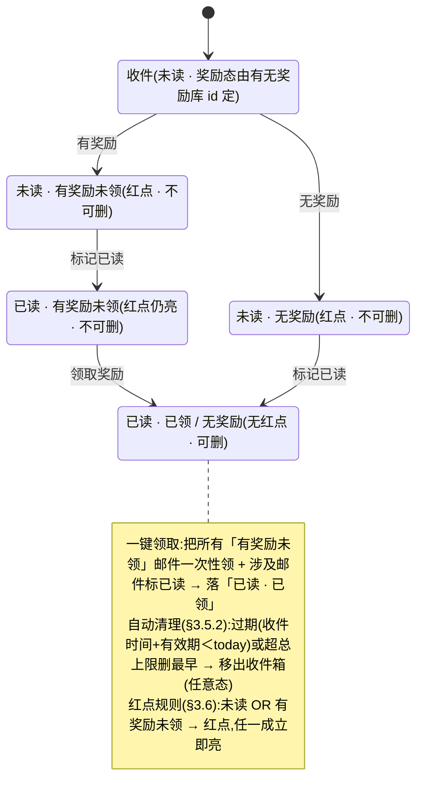
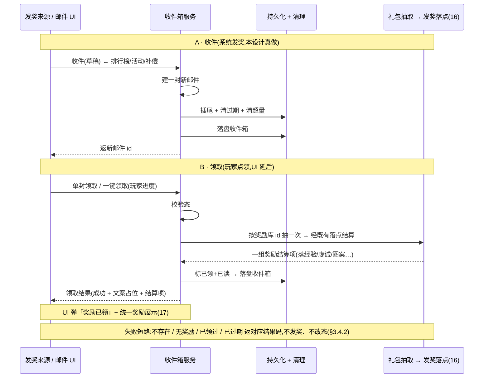

# 通用邮件系统 · 数据逻辑层 + 服务器/运营接缝

一套**收件箱数据逻辑层**:邮件数据模型(发件人 / 时间 / 标题 / 内容 / 奖励附件 / 已读 / 已领取)+ 收件箱服务(收件 / 列表排序 / 标记已读 / 领取奖励单封+一键 / 删除已读 / 自动清理超量+过期 / 红点)。关键在两道接缝:① **对外收件接口**——供排行榜结算 / 活动回收 / 系统奖励调用(即 spec 的「为其他功能留邮件调用接口」);② **服务器/运营接缝**(后台发删 / 定时 / 区服多选)<mark>= 占位接口,离线不实现</mark>。奖励附件复用 [道具系统 16](#16-item-system) 的礼包随机库 + 发奖落点,领取后用 [设计 17](#17-reward-display) 的统一奖励展示。这是 xlsx 系统底层批次第七刀。<mark>邮件界面 / 详情 / 红点显示 / icon(表现层)需美术,延后轮,本设计只留服务 + 接缝 + 红点状态查询。</mark>

> [!WARNING]
> **读前必看 · 设计边界**
>
> 五条边界先明确,防把「邮件数据层」做成「真连服务器收发邮件 + 另造一套发奖 / 存储」:
>
> - **「服务器/运营接缝」= 可注入的邮件来源接口,不是真收发网络邮件。**本工程**没有网络模块**,方向**离线还原 · 去变现**。「后台全服发邮件 / 定时邮件 / 区服多选」本应由运营后台 + 服务器推送,本设计抽象成一个**邮件来源接口**:留**占位实现**,离线不实现,**区服离线视单一本地区服**(无多区概念)。这道接缝指的是**接口边界本身**,而非本设计真去连服务器(见 [§3.7](#21-mail-system::source) / [§七 O1](#21-mail-system::open))。
> - **「对外收件接口」是本设计真做的核心接缝。**spec 写「为其他功能留邮件调用接口,用于奖励发放」——这是**本游戏内部**各系统(排行榜结算 / 活动回收 / 系统补偿)把奖励经邮件发给玩家的入口:收一封邮件草稿进收件箱。它**不依赖网络**,是本设计真实实现的服务能力。下一轮排行榜底层即接此真实本地邮件服务做结算发奖,而非再留占位。
> - **奖励附件复用 16 道具系统的礼包随机库 + 既有落点,不另造发奖。**邮件配置表第 5 列「Reward表id」= **奖励随机库表 id**(spec 原文),即道具系统礼包随机池的库表序号。领取时经道具系统既有礼包抽取(抽一次)得到一组带权奖励项,每项查道具元数据后经既有发奖落点结算到玩家进度(设计 16)。本系统**只持有「奖励来自哪个库表 id」,不复制发奖落点逻辑**。
> - **持久化复用既有接缝,本地单机。**整个收件箱(邮件列表 + 各封已读/已领状态)序列化进既有持久化层的专用存储键(生产环境写本地存档 / 测试环境写内存)。**不**新建第二套存储栈。脏数据 / 截断对任意输入须产出合法空集合不抛(同 14 save-system 保底口径)。
> - **UI 投放不在本设计。**邮件界面 / 详情 / 无邮件态 / 全部删除二次确认 / 红点显示 / 邮件 icon 是表现层,依赖美术与窗口流程,本设计**不**建窗口、不挂界面。交付到「邮件模型 + 收件箱服务 + 两道接缝 + 红点状态查询 + 文案占位标识」。多语言标题/内容存文本占位标识(同 num/item/reward/settings/redeem 现状)。

> [!NOTE]
> **立项信息**
>
> | 项 | 内容 |
> | --- | --- |
> | **类型** | 新系统 · 通用邮件数据逻辑层 + 服务器/运营接缝 出设计稿 + 验收标准,交开发落地。xlsx 系统底层批次第七刀。 |
> | **方向约束** | 离线还原 · **去变现**:邮件用于运营发放(节日礼包 / 公告补偿 / 系统奖励)与**游戏内系统结算发奖**(排行榜 / 活动回收),**不**含充值 / 内购 / 付费;真实服务器后台发删邮件延后(本工程无网络模块),离线版邮件来源接口惰性(返空、不动作)。持久化走框架既有的非阻塞本地存档(不触「禁阻塞 IO」红线)。加法式扩展,不破坏既有核心循环 + 已建系统。 |
> | **影响范围** | 新增邮件系统(模型 / 收件箱服务 / 持久化 / 两道接缝 / 红点状态);**不改动任何既有系统与玩法,旧路径零行为变化**;UI 投放延后(需美术)。 |
> | **关键约束(继承现状)** | 模型 / 服务 / 持久化 / 接缝为纯逻辑,可在纯逻辑单测中直接构造 / 注入(不依赖资源系统 / 运行时 / 网络);配置经测试注入口注入(绕配置加载);持久化往返经内存存储注入断言(不碰真实本地存档);**时钟可注入**(默认取系统当前时间,有效期 / 保留 / 过期清理用注入的「今天」判定,可单测);发奖落玩家进度经既有礼包库 + 落点(玩家进度对象可为空时走纯解析路径)。现有单测零回归。 |

## 一、做什么与为什么 {#what}

现状:游戏**没有邮件系统**。spec(`1002通用邮件系统.xlsx`)要一套「系统发信息与奖励」的收件箱:运营在后台发全服/私人/附件邮件,系统(排行榜结算 / 活动回收 / 补偿)也经邮件给玩家发奖励。本设计建一套**通用邮件数据逻辑层**:收件 → 列表(排序)→ 读 → 领奖 → 删除 → 自动清理,并把「奖励发放接口」「服务器/运营来源」两道接缝划清。

「通用」体现在三处:① 邮件内容(标题/内容/有效期/奖励)经配置表声明,奖励复用道具系统的礼包随机库(任何道具/货币/图案都能发);② 对外收件接口让游戏内任意系统都能经邮件发奖,不绑定来源;③ 运营来源经接缝抽象,离线惰性、未来可切真实后台而服务层不改。逐条对应 spec 需求:

| # | 需求(spec) | 本篇落法 | 现状/新增 |
| --- | --- | --- | --- |
| 1 | 系统/运营发信息与奖励到收件箱 | 对外收件接口:把一封邮件草稿(发件人/标题/内容/有效期/奖励库 id)收进收件箱([§3.3](#21-mail-system::draft)) | 新增对外接口 |
| 2 | 为其他功能留邮件调用接口,用于奖励发放 | 同上收件接口:排行榜结算 / 活动回收 / 系统补偿调它发奖。<mark>本设计真做(本地)</mark>,下轮排行榜接此([§3.4](#21-mail-system::service)) | 本设计真做接缝 |
| 3 | 邮件格式:发件人+时间+标题+内容+奖励包(可选) | 邮件模型:发件人 / 收件时间 / 标题 / 内容 / 奖励库 id(0=无奖励) + 状态([§二](#21-mail-system::model)) | 新增模型 |
| 4 | 列表排序:已读>未读,再按时间 | 列表:未读优先(置顶),组内按发件时间降序(新在前,[§3.4](#21-mail-system::service)) | 新增列表 |
| 5 | 标记已读 | 标记已读 / 列表查看自动标读([§3.4](#21-mail-system::service)) | 新增 |
| 6 | 领取奖励:单封 / 一键(发所有未领→展示→全标已读) | 单封领取 / 一键领取:发奖复用 16 礼包库+落点,返领取结果(产出列表供 17 展示);一键领后未领奖全发 + 涉及邮件标已读([§3.4.2](#21-mail-system::claim)) | 复用 16/17 |
| 7 | 删除已读(已读且奖励已领或无奖励) | 删除已读:仅当已读 &amp;&amp;(无奖励 ‖ 奖励已领)才可删;否则拒绝([§3.4](#21-mail-system::service)) | 新增 |
| 8 | 保留期默认一月到期自动消失 | 过期清理:收件时间 + 有效期天数 &lt; 注入 today → 删;全局保留天数默认 30 兜底([§3.5.2](#21-mail-system::cleanup)) | 新增清理 |
| 9 | 未领取数>N(默认 100)删最早,新邮件插尾,总上限 N | 容量清理:收件后若超上限,按发件时间删最早的([§3.5.2](#21-mail-system::cleanup)) | 新增清理 |
| 10 | N 与保留时间入全局配置 | 全局配置:总上限(默认 100)/ 保留天数(默认 30),配置层读取([§3.1](#21-mail-system::config)) | 新增全局配置 |
| 11 | 红点 = 未读 OR 有奖励未领;主界面图标右上+列表项右上 | 全局红点状态(任一封有红点即亮)/ 每封红点状态(列表项红点,[§3.6](#21-mail-system::reddot)) | 新增红点状态 |
| 12 | 开启:1 级即开 | 无等级门控逻辑(始终可用);1 级开仅 UI 入口可见性,表现层处理 | 无门控 |
| 13 | 运营/服务器:后台发删定时邮件(标待定/后面做) | 邮件来源接缝 + 惰性占位实现:离线不实现,区服离线视单一本地区服([§3.7](#21-mail-system::source) / [§七 O1](#21-mail-system::open)) | 占位 |
| 14 | 邮件界面 / 详情 / 无邮件 / 全部删除提示 / 红点显示 / icon | 表现层,需美术,**延后**(同 15–20 节奏,[§七 O7](#21-mail-system::open)) | UI 延后 |

**不做(本设计明确排除):**真实服务器 / 后台收发邮件(无网络模块,O1);区服多选 / 多区概念(离线单区,O2);所有 UI 窗口(界面/详情/无邮件态/删除确认 — 需美术,O7);多语言标题/内容真实查表(文本占位,同 num/item/reward 现状,O5);道具/跑马灯(spec 明写无,O6);充值 / 付费 / 内购邮件(去变现方向,不做)。

## 二、邮件模型与状态机 {#model}

### 2.1 邮件状态(已读 × 奖励三态) {#states}

一封邮件有两个正交维度:**读态**(未读/已读)与**奖励态**(无奖励 / 有奖励未领 / 有奖励已领)。spec 的红点、删除、领取规则都由这两维派生。状态图:

**删除前置(spec「删除已读」)**:删除已读仅当 <mark>已读 &amp;&amp;(无奖励 ‖ 奖励已领)</mark> 才允许。「未读」或「有奖励未领」拒绝删除(防玩家误删未领奖励)——这是 spec「已读且奖励已领或无奖励」的逐字落法。

### 2.2 加法式接入(复用既有发奖 + 持久化接缝) {#additive}

本设计<mark>不新造发奖、不新造存储栈</mark>,只补「收件箱状态机 + 编排 + 两道接缝」:

| 环节 | 既有(不动) | 本设计补 |
| --- | --- | --- |
| 奖励库 | 礼包随机库(按库表序号抽一组带权奖励项,设计 16) | 复用,邮件附件 = 库表 id,领取时抽奖 |
| 发奖落点 | 道具系统既有发奖落点(数值 / 图案 / 道具,设计 16) | 复用,把抽出的道具结算到玩家进度 |
| 道具元数据 | 按道具 id 查元数据(设计 16) | 复用,不重复登记道具 |
| 持久化 | 既有持久化层(本地存档 + 序列化范本,设计 14) | 邮件持久化层包它存收件箱(专用存储键) |
| 奖励展示 | 统一奖励展示(设计 17) | 复用,UI 接时把领取产出转交统一展示 |
| 收件箱状态机 + 服务 + 接缝 | 缺 | **本设计主体**:模型 + 列表/读/领/删/清理 + 收件接口 + 运营接缝 |

## 三、设计正文 {#numbers}

### 3.1 邮件配置表 mail + 全局配置 {#config}

邮件配置以数据表(xlsx)声明,与 num/item/redeem 表同处一套配置目录。表头按既有数据表约定写四行(变量名 / 类型 / 分组 / 注释);备注类字段标分组为「仅编辑用」不导出运行期。

**邮件模板表 mail**(主键 `id`,字段直取 spec 的「表」sheet 表头):

| 字段 | 类型 | 分组 | 含义(spec) |
| --- | --- | --- | --- |
| id | int | c,s | 邮件模板 id(主键)。收件时可引用模板,也可不引用直接发自定义草稿([§3.3](#21-mail-system::draft)) |
| title | int | c,s | 邮件标题(多语言文本占位标识)。demo 行存占位 mailName\_1..5([§七 O5](#21-mail-system::open)) |
| desc | int | c,s | 邮件内容(多语言文本占位标识)。demo 行存占位 mailDesc\_1..5 |
| expire\_days | int | c,s | 有效期(天)。demo 行 = 14;0 / 负 = 用全局保留天数兜底([§3.5.2](#21-mail-system::cleanup)) |
| reward\_id | int | c,s | <mark>奖励随机库表 id</mark>(spec「Reward表id」)。指向道具系统礼包随机池的库表序号(设计 16);demo 行 = 1002;0 = 无奖励 |

spec 的 5 条 demo 行(id 1–5 / title=mailName\_1..5 / desc=mailDesc\_1..5 / expire=14 / reward=1002)**原样录入**(reward=1002 须道具系统 16 的礼包随机库存在该库表序号才能领出实物,否则领取产出空列表——不抛,见 [§3.4.2](#21-mail-system::claim) 边界)。

**全局配置 mail\_global**(单行 / KV,或并入既有全局配置表):

| 字段 | 类型 | 默认 | 含义(spec「全局表」) |
| --- | --- | --- | --- |
| max\_count | int | 100 | 收件箱总上限 N:超过按发件时间删最早(spec「未领取数>N 删最早 / 总上限 N」) |
| retain\_days | int | 30 | 默认保留天数(spec「保留期默认一月」)。邮件自身 expire\_days>0 时优先用邮件的;否则用本值 |

> [!NOTE]
> **为什么奖励复用「礼包随机库 id」而非道具 id 列表?**
>
> spec 的邮件配置表第 5 列原文是「Reward表id(奖励随机库表id)」——指向<mark>一个随机奖励库</mark>,不是单个道具。道具系统(设计 16)已有礼包随机库:一个库表序号对应一组带权重的奖励项(道具 id / 数量 / 权重)。邮件附件直接引用库 id,领取时按该序号抽一次得到实物,再经既有发奖落点结算。<mark>发什么、按什么权重、怎么落,全交给道具系统既有逻辑</mark>——不必在邮件侧重定义奖励结构,也避免两套漂移。这与兑换码(设计 20)走「道具 id × 数量」是**同源不同入口**:邮件走库表(spec 如此),兑换码走道具项,二者最终都汇到同一发奖落点。

### 3.2 运行期数据对象 + 配置桥接 {#poco}

仿既有道具 / 兑换码配置层:配置表行桥接成纯运行期数据对象,业务侧只认这层数据对象(隔离生成类型);运行期从配置系统加载,单测环境经测试注入口直接灌入绕开资源加载。邮件配置层与既有道具配置层并列;邮件模型 / 服务独立成一套通用系统,与玩法解耦。

**邮件模板数据对象**(由配置行桥接而来):
- 模板 id
- 标题文本占位标识
- 内容文本占位标识
- 有效期天数(≤0 时用全局保留天数)
- 奖励随机库 id(0 = 无奖励)

**全局配置数据对象**:
- 收件箱总上限(默认 100)
- 默认保留天数(默认 30)

配置层行为约定:
- 按模板 id 查询,查不到返空(不抛)。
- 全局配置总有值:配置表缺省时返默认值(总上限 100 / 保留 30)。
- 提供测试注入口:绕配置系统直接灌入数据对象,以及测试间重置。

### 3.3 邮件模型 + 收件草稿 {#draft}

收件入口收的是一张**草稿**(谁发的 / 标题 / 内容 / 有效期 / 奖励库 id),服务给它配上 id + 收件时间 + 初始状态,变成**收件箱里的一封邮件**。模型字段对应 spec「发件人+发件时间+标题+内容+奖励包(可选)」+ 读态/奖励态。

**收件草稿**(对外收件接口的入参,可由模板 id 构造或直接填字段):
- 发件人(系统 / 运营 / 排行榜…,文本占位标识)
- 标题、内容(文本占位标识)
- 有效期天数(≤0 时用全局保留天数)
- 奖励随机库 id(0 = 无奖励)
- 由模板构造:按模板 id 查配置,复制各字段。

**收件箱里的一封邮件**(运行期 + 可序列化),除草稿带来的字段外另有:
- 收件箱内唯一 id(收件时由服务分配)
- 收件时间
- 已读标记
- 奖励已领标记(无奖励邮件视同已结清)

由这些状态派生的判定:
- **是否有奖励** = 奖励库 id 非 0。
- **是否亮红点** = 未读 OR(有奖励且未领)(§3.6)。
- **是否可删** = 已读 且(无奖励 或 已领)(删除前置,§2.1)。

**时间存原始值**:收件时间存为可序列化的时间原始值(可与注入的「今天」直接比较),过期判定时还原(同 save-system 存原始值口径,避免日期类型序列化丢字段)。

### 3.4 收件箱服务(对外收件 + 列表 + 读 + 删) {#service}

服务持有收件箱(一组邮件)+ 注入(持久化层 / 时钟 / 抽奖随机源)。对外提供收件接口 + 收件箱操作。构造时从持久化层载入收件箱;每个写操作(收件 / 领取 / 删除 / 清理)落盘一次。

**对外收件接口**(游戏内任意系统经此发奖,spec「留邮件调用接口」):收一封邮件草稿进收件箱,返新邮件 id。行为:
- 取当前时间为收件时间,据草稿建一封新邮件(初始未读、未领),**插到收件箱尾部**;
- 收件后触发**过期清理 + 超量清理**(§3.5.2);
- 落盘并返回新邮件 id。

**列表**:返回排序后的收件箱。列表前先清过期。排序口径见下。

**标记已读**:把指定邮件标已读(已读则幂等),落盘。

**删除已读**:删除前置 = 已读 且(无奖励 或 已领);未读 / 有奖未领 → 拒绝(返失败、不删)。

**排序口径**:spec「已读>未读」——理解为<mark>未读邮件置顶</mark>(玩家先看新内容),已读沉底;组内按发件时间降序(新邮件在前)。即先按读态分两组(未读组在前),组内按收件时间从新到旧。

#### 3.4.2 领取奖励(单封 / 一键) {#claim}

领取 = 抽奖励库 → 落点 → 标已领 → 标已读。复用 16 礼包库+落点,产出一组奖励结算项供 UI 转交 17 的统一奖励展示。

**领取结果**包含三部分:结果码、结果文案占位标识(§3.8)、成功时的奖励结算项列表。结果码分五种:成功 / 邮件不存在 / 无奖励 / 已领过 / 已过期。

**单封领取**:抽奖励库 → 落点 → 标已领 + 已读。玩家进度对象可为空时走纯解析路径。校验与行为:
- 邮件不存在 → 返「不存在」;
- 无奖励 → 返「无奖励」(无可领);
- 已领 → 返「已领过」;
- 已过期 → 返「已过期」;
- 校验通过 → 抽库 + 落点(§3.4.3)得奖励结算项,该邮件标已领 + 已读,落盘,返「成功」+ 结算项。

**一键领取**(spec「发所有未领奖→弹奖励展示→全标已读」):遍历收件箱,
- 所有<mark>有奖励未领且未过期</mark>的邮件发奖、标已领;
- <mark>全部邮件</mark>(含无奖励 / 已领)标已读(spec「全标已读」);
- 汇总各封奖励结算项一次性交 UI 展示,落盘。

已过期未领的不发(由清理移除)。

#### 3.4.3 发奖落点(复用礼包抽取 + 既有发奖) {#grant}

发奖<mark>不新造逻辑</mark>:奖励库 id → 道具系统礼包抽取(按库表序号抽一次)得一组奖励项 → 每项查道具元数据 → 经既有发奖落点结算到玩家进度,汇总奖励结算项列表返回。玩家进度对象为空时只产出结算结构、不落实际系统(纯解析单测路径,同 16/20)。库表序号为 0 或抽出空 → 返空列表(不抛)。

**边界**:
- 奖励库 id 在道具系统未登记(抽取查无返空)→ 领取仍返「成功」但结算项为空(不抛;demo 行 reward=1002 须 16 礼包库存在该库表序号才有实物)。
- 非自动结算项(需进背包的项)经既有落点返空(本设计不接背包实例,O3)。

### 3.5 持久化层 {#persist}

整个收件箱序列化进既有持久化层的**专用存储键**(本系统专用,不与框架 / 其它系统的键冲突)。仿设计 14 的存档范本:可序列化容器 + version 版本号 + 反序列化保底。<mark>序列化层纯逻辑同步可单测</mark>(对象与字符串互转 / 内存存储往返),不碰真实本地存档。

持久化层抽象成一个接口:
- **读取**:从存储读出并反序列化收件箱;无键 / 脏数据 → 空列表(不抛)。
- **写入**:把收件箱序列化写回存储。

两种实现:
- **生产实现**:经既有持久化层 + 上述专用存储键。读取时若无键 / 空串 → 空列表;反序列化失败(脏数据 / 截断)→ 空列表。
- **测试实现**:内存直存直取,往返断言不污染真实本地存档。

序列化容器须对序列化友好(字段型,不含框架引用类型;红点 / 可删等派生判定由模型现算、不进盘)。

**保底**:读取对无键 / 空串 / 反序列化抛异常(脏数据 / 截断)统一产出空列表(同 14 口径)。本地单机文件可被篡改,反序列化对任意输入不抛。version 版本号预留迁移(本设计恒 1)。

#### 3.5.2 自动清理(过期 + 超量,注入时钟) {#cleanup}

两条清理规则,都用<mark>注入的「今天」</mark>判定(可单测),在收件后 + 列表前触发:

| 规则 | 判据 | spec 出处 |
| --- | --- | --- |
| **过期清理** | 每封:有效期天数 = 邮件自带有效期>0 时用自带,否则用全局保留天数;收件时间 + 有效期天数 < 今天 → 删 | 「保留期默认一月到期自动消失」(邮件自带有效期优先,缺省用全局保留天数 30) |
| **超量清理** | 收件箱数 > 总上限(默认 100)→ 按收件时间从早到晚删最早的,直到等于总上限 | 「未领取数>N 删最早、新邮件插尾、总上限 N」 |

**超量口径取舍(O4)**:spec 写「未领取数>N」与「总上限 N」两句。本设计取<mark>总上限 N</mark>(收件箱总条数上限,默认 100),超量删最早——这是安全默认:既满足「总上限 N」,又使「插尾 + 删最早」先进先出语义清晰。「只数未领取」会让已读已领的旧邮件不占名额、收件箱可无限堆已读邮件,反而不符「总上限」。要改成「只对未领取计数」可换判据(O4)。<mark>删最早不论读/领态</mark>(超量是硬上限);未领奖励被超量删除是 spec 既定取舍(玩家应及时领取)。

### 3.6 红点状态(未读 OR 有奖未领) {#reddot}

spec 红点 = 「邮件未读时 / 有奖励未领时」,显示在**主界面邮件图标右上**(全局红点)与**列表项右上**(每封红点)。本设计只给状态查询,UI 投放延后。

服务提供:
- **全局红点**(主界面图标):任一封邮件有红点即亮。先清过期再判。
- **未读数 / 未领数**(供 UI 角标显示,可选)。

每封列表项红点由邮件自身的红点判定([§3.3](#21-mail-system::draft) 已定义:未读 OR(有奖励且未领))。全局红点是「任一封有红点」的或。先清过期再判(过期邮件不亮红点)。

### 3.7 服务器/运营接缝(占位实现) {#source}

这是标题里「服务器/运营接缝」的实义。spec 的「后台全服发邮件 / 定时邮件 / 区服多选」本应由运营后台 + 服务器推送,<mark>本工程无网络模块、方向去变现,本设计不实现</mark>。抽象成一个**邮件来源接口**,留占位实现:

- **邮件来源接口**:对外暴露一个「拉取待派发邮件」的能力,返一组邮件草稿。未来真实服务器 / 运营后台推送的全服 / 私人 / 定时邮件经此进收件箱。后台全服发 / 定时邮件 / 区服多选都是服务器侧能力,离线惰性。
- **离线占位实现**:无服务器,拉取恒返空、不连网、不抛。区服离线视单一本地区服(无多区概念)。未来上后端时只需实现一次(拉服务器邮件 → 转邮件草稿 → 走对外收件接口),服务层零改动。

**为什么离线游戏还要这道接缝?** 与对外收件接口(本设计真做)区分:对外收件接口是<mark>游戏内系统</mark>发奖入口(排行榜/活动/补偿,离线可用);邮件来源接口是<mark>外部服务器/运营</mark>推送入口(离线不可用,占位)。两道接缝一进一出,边界一次划清,未来上后端只补来源接口实现,收件箱服务与发奖层不返工。这与去变现方向不冲突——邮件只发运营配置的奖励,不发可购买物。

### 3.8 结果文案占位 {#text}

每个领取结果对应一条提示文案占位标识(真实多语言查表延后,同 num/item/reward/settings/redeem 现状)。邮件标题/内容/发件人也是文本占位标识(配置表 / 草稿存标识)。结果码到文案占位的映射覆盖五种结果:

- 奖励已领取(成功)
- 该邮件无奖励
- 奖励已领取过
- 邮件已过期
- 邮件不存在

**占位约定**:本设计给<mark>互不相同的占位标识</mark>(验收断言各返不同非默认值,同 19/20 做法);真实多语言文本表建成后替换。占位附中文文案供 UI 参考。

## 四、收件 → 领取一封邮件的时序 {#flow}

系统发奖(收件)与玩家领取是两条独立流。四方参与(发奖来源 / 收件箱服务 / 持久化+清理 / 礼包库+落点),用时序图归纳:

## 五、验收点 {#accept}

纯逻辑全可单测(运行期数据对象 + 注入隔离 + 注入时钟);配置直读条按工具链可达性(不可达列 BLOCKED)。验收锚在**配置桥接 + 收件 + 排序 + 读 + 领取单/一键 + 删除 + 自动清理 + 红点 + 持久化往返 + 发奖复用**;真实服务器 / UI 视觉不在本设计(无后端 / 需美术)。

| 组 | # | 验收点(完成定义,可逐条核对) |
| --- | --- | --- |
| 配置 C | C1 | 经测试注入口灌入邮件后,按模板 id 查询返对应模板,字段(标题/内容/有效期/奖励库 id)正确;查不存在的 id 返空(不抛) |
| 配置 C | C2 | 全局配置在配置表缺省时返默认(总上限 100 / 保留 30);注入自定义全局配置后返注入值 |
| 配置 C | C3 | (配置直读,工具链可达时)直读编译后的邮件配置二进制含 5 条 demo 行且字段映射正确(id 1–5 / reward=1002 / expire=14);不可达列 **BLOCKED** |
| 收件 N | N1 | 收件后收件箱 +1,新邮件未读 / 未领,收件时间 = 注入的当前时间;返回的 id 能查到该邮件 |
| 收件 N | N2 | 由模板构造草稿:从配置复制字段(标题/内容/有效期/奖励 与模板一致);收件进收件箱 |
| 排序 SO | SO1 | 列表:未读邮件排在已读之前(已读>未读 = 未读置顶);组内按收件时间降序(新在前) |
| 排序 SO | SO2 | 混合(2 未读 + 2 已读,各含早晚)→ 列表次序 = [未读新, 未读旧, 已读新, 已读旧] |
| 已读 RD | RD1 | 标记已读后该邮件已读;再标记幂等(不重复落盘可不强求,但状态不变);未读数相应减少 |
| 领取 CL | CL1 | 有奖励邮件领取(玩家进度非空)→ 成功且结算项含产出;邮件标已领且已读(领后标已领+已读) |
| 领取 CL | CL2 | 再次领取同邮件 → 已领过且**不重复发奖**;无奖励邮件(reward=0)领取 → 无奖励;不存在 id → 不存在 |
| 领取 CL | CL3 | 一键领取:所有「有奖励未领未过期」邮件被领(标已领),**全部邮件标已读**(spec);结算项汇总各封产出;已领/无奖励邮件不重复发 |
| 领取 CL | CL4 | 玩家进度对象为空时领取 / 一键领取仍返成功且结算项含产出结构(纯解析路径,不抛);奖励库 id 在道具系统未登记 → 结算项空但仍成功(不抛) |
| 删除 DEL | DEL1 | 删除已读:已读+无奖励 → 删成功(收件箱 -1);已读+奖励已领 → 删成功 |
| 删除 DEL | DEL2 | 未读邮件 → 删除返失败不删;已读+有奖励未领 → 返失败不删(删除前置) |
| 清理 CU | CU1 | 过期清理:邮件 收件时间 + 有效期 < 注入 today → 收件 / 列表 / 红点查询时被移除;未过期保留;有效期≤0 的邮件用全局保留天数判过期 |
| 清理 CU | CU2 | 超量清理:连发 > 总上限 封 → 收件箱稳定在总上限封,**留最新**(删收件时间最早的);新邮件在(插尾)、最早的被删 |
| 清理 CU | CU3 | 清理用**注入的时钟**:同一批邮件,注入「今天」无过期、注入「一月后」全过期(证时钟可注入可单测) |
| 红点 RDOT | RDOT1 | 全局红点:有未读邮件 → 亮;有「有奖未领」邮件 → 亮;全已读且(无奖励 ‖ 已领)→ 不亮。每封红点判定同口径 |
| 红点 RDOT | RDOT2 | 已读但奖励未领的邮件红点仍亮(读态不消红点,奖励态才消);领取后该邮件红点不亮 |
| 持久化 P | P1 | 持久化层注内存存储:收几封后新建一个新的收件箱服务实例(复用同一存储)→ 列表含原邮件且读/领态保真(跨实例往返,模拟重启) |
| 持久化 P | P2 | 反序列化保底:存储无键 / 空串 / 非法数据 → 读取返空列表(不抛);服务能从空收件箱正常收件 |
| 接缝 SK | SK1 | 邮件来源占位实现拉取返空集合且**不抛、不连网**(占位不崩);全系统无任何真实网络 / HTTP 调用 |
| 接缝 SK | SK2 | 对外收件接口是真实可用接口:经接口引用调收件成功(证「对外收件接口」本设计真做,下轮排行榜可接) |
| 回归 / 编译 R | R1 | 编译 0 error;现有单测全绿(零回归);新增邮件测试全绿 |
| 回归 / 编译 R | R2 | Code Review 5 红线:异步优先 / 模块访问规范 / 资源释放 / 热更边界 / 事件解耦(本层无资源加载、无事件;重点核「无真实网络 / HTTP 调用」「本地存档 / 序列化非阻塞不触同步 IO」「发奖复用 16 不复制落点」「持久化复用既有接缝不另造存储栈」) |

> [!WARNING]
> **不在本设计验收(boss 授权遗留)**
>
> 真实服务器后台发删/定时邮件(无网络模块)、区服多选(离线单区)、邮件界面+详情+无邮件态+全部删除二次确认 UI 视觉、红点显示、邮件 icon、奖励展示真实图标、主界面邮件入口接线 → <mark>表现层延后轮 + 远程实现未来轮</mark>。依赖美术(UI)与后端(服务器),数据层不返工。

## 六、待拍板清单 {#open}

以下为范围开关,boss 自治授权下**均取安全默认推进**(已在 boss 预先拍板内),列此备查;要改另开增量轮。

| # | 开关 | 本设计默认 | 备选 / 触发改动 |
| --- | --- | --- | --- |
| O1 | 真实服务器后台发删/定时邮件 | **占位**(邮件来源接口留着,离线返空) | 未来上后端时实现来源接口(拉服务器邮件 → 收件),服务层零改动 |
| O2 | 区服多选 / 多区概念 | **不做**(离线单区,区服离线视单一本地区服) | 上后端 + 多区时,来源接口实现按区服拉取;本地无多区 |
| O3 | 非自动道具进背包 | 不接背包实例(非自动结算项经既有落点返空,只汇总立即结算项) | 背包实例接入后,UI / 调用方把非自动结算项入背包(同 16 §3.7 / 20 O3) |
| O4 | 超量计数口径 | **总条数上限 N**(默认 100,超量删最早,不论读/领态) | 若要「只对未领取计数」(已读已领不占名额),换超量清理判据;当前「总上限 N」更符 spec「总上限 N」语义 |
| O5 | 标题/内容/发件人 + 结果文案多语言 | 文本占位标识(同 num/item/reward/settings/redeem) | 多语言文本表建成后查表替换 |
| O6 | 道具 / 跑马灯需求 | **不做**(spec 明写「道具:无」「跑马灯:无」) | spec 未要求,不投机做 |
| O7 | 邮件界面 / 详情 / 红点显示 / icon UI | **延后**(需美术,留服务 + 红点状态查询) | 有美术 + 窗口流程时建窗口,接 17 统一奖励展示,主界面入口接红点状态,Play 手验 |
| O8 | 邮件 id 分配策略 | 服务分配(自增 / 收件时间戳保唯一) | 未来服务器邮件须用服务器下发的全局 id 防冲突;本地分配够用 |

## 七、风险表 {#risk}

| 风险 | 应对 |
| --- | --- |
| **误把「服务器接缝」做成真收发网络邮件**:引入真实网络请求或真连后端 → 离线游戏跑不通、且违方向 | 读前必看第 1 条 + §3.7 已明确:接缝 = 可注入接口,离线注入占位实现(返空)。对外收件接口是游戏内发奖入口(本地,本设计真做),与邮件来源接口(外部推送,占位)区分。Code Review R2 + 验收 SK1 核「无真实网络调用」 |
| **另造发奖逻辑**:不复用 16 的礼包抽取 / 发奖落点,自己写一套「奖励库→道具」落点 → 与道具系统两处漂移 | 读前必看第 3 条 + §3.4.3 显式调既有礼包抽取 / 发奖落点;Code Review 核不复制落点。验收 CL1/CL4 断言落点与 16 一致 |
| **另造存储栈**:新建第二套本地存档键空间存收件箱,不用既有持久化层 | §3.5 复用既有接缝;持久化用本系统专用存储键(不与框架 / 其它系统键冲突),仍走同一持久化层。验收 P1 断言往返 |
| **删除前置判错**:把「未读」或「有奖未领」邮件也允许删 → 玩家误删未领奖励 | §2.1 / §3.4 删除前置 = 已读 且(无奖励 ‖ 已领);验收 DEL2 专门断言未读 / 未领拒绝删 |
| **领取时机/重复发奖**:领取前就标已领,或领取后忘标 → 漏发或重复发 | §3.4.2 顺序「抽奖落点成功 → 标已领+已读 → 落盘」;验收 CL2 断言二次领取「已领过」不重复发 |
| **清理删掉未领奖励**:超量 / 过期把玩家未领的邮件删了 → 奖励丢失 | spec 既定取舍(玩家应及时领取):过期(到期消失)与超量(总上限 N 删最早)是硬规则,不论读/领态(§3.5.2)。如要「未领的不被超量删」可改 O4 判据;过期 spec 明写「到期自动消失」不可避 |
| **时间序列化丢精度 / 日期类型不可序列化**:直接存日期对象进序列化 → 失败或丢字段 | §3.3 存可序列化的时间原始值,过期判定时还原;验收 P1 跨实例往返断言时间保真 |
| **奖励库自指 / 礼包递归环**:奖励道具指向随机礼包、礼包又指回 → 递归爆栈 | 复用 16 既有礼包递归深度上限(已防环);本系统不引入新递归 |
| **脏存档崩服务**:本地文件被篡改 / 截断,反序列化抛异常 → 收件箱进不去 | §3.5 读取对无键 / 空串 / 非法数据统一产空列表(同 14 口径);验收 P2 断言脏数据不抛 |
