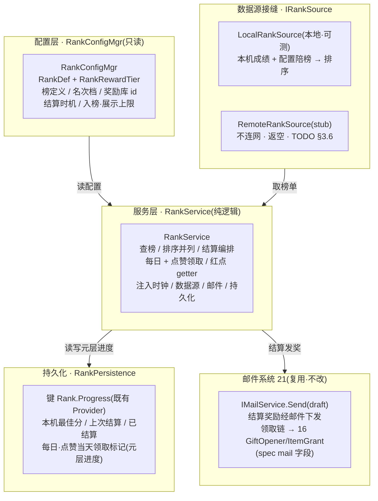
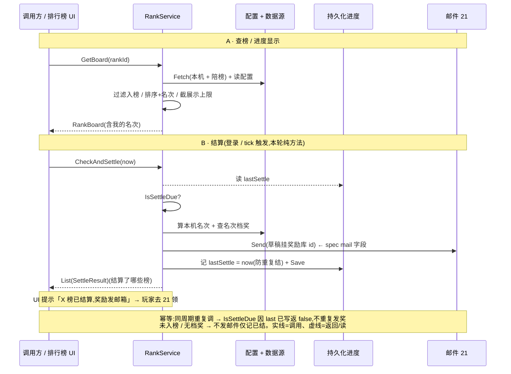

# 排行榜底层系统 · 数据逻辑层 + 服务器接缝

命名空间 `GameLogic.Rank` 的**排名数据逻辑层**:一张配置表控制所有榜单([§3.1](#22-rank-system::config) spec「统一用一个表格控制所有排行榜」),按 spec 字段建排行榜定义 + 奖励档位 + 结算时机;运行期提供**查榜**(取前 N 名、查自己名次)、**排序与并列规则**(分数降序 + 同分按入榜时间)、**结算编排**(到点算名次 → 按档位查奖励 → 发结算邮件)。关键在**排名数据源接缝**:① `IRankSource`——<mark>本地离线榜实现可跑可测</mark>(本机自己一条记录 + 配置陪榜,排序产出名次),<mark>远程 stub 零网络调用</mark>;② 结算发奖<mark>不另造</mark>,直接调 [邮件系统 21](#21-mail-system) 既有 `IMailService.Send`(spec「mail 字段 = 邮件 id,结算奖励写到邮件中」),奖励内容复用 [道具系统 16](#16-item-system) 礼包随机库。这是 xlsx 系统底层批次第八刀。<mark>排行榜界面 / 名次列表 / 点赞按钮 / 头像(表现层)与真实全服榜单数据(需服务器)延后,本轮只留数据逻辑 + 接缝 + 结算 + 红点 getter + TODO。</mark>

    <b>读前必看 · 与工程现状的关系(单一事实源 = 代码)</b>
    
六条边界先明确,防 dev 把「排名数据层」做成「真连服务器拉全服榜单 + 另造一套发奖」:

    <ul style="margin:8px 0 0">
      <li><b>「服务器接缝」= 可注入排名数据源接口,不是真拉全服排名。</b>本工程<mark>没有网络模块</mark>(<code>Books/3-8-网络模块.md</code> 标「待补充」,全工程 grep 无 <code>INetworkModule</code>/<code>UnityWebRequest</code>/<code>HttpClient</code>),方向<b>离线还原 · 去变现</b>。「全服排名 / 攀比」本应由服务器汇总各玩家数据后下发,本轮抽象成 <code>IRankSource</code> 接口:离线默认 <code>LocalRankSource</code>——<mark>用本机自己的一条成绩 + 配置陪榜垫底,本地排序产出一份可跑可测的榜单</mark>(玩家能看到自己名次、能结算发奖);<code>RemoteRankSource</code> 仅留 <mark>stub + TODO</mark>(不连网、返空 / inert)。这道接缝指的是<b>排名数据从哪来</b>这个边界本身,而非本轮真去连服务器(见 <a href="#22-rank-system::source">§3.6</a> / <a href="#22-rank-system::open">§七 O1</a>)。</li>
      <li><b>结算发奖直接调邮件系统 21,不另造发奖。</b>spec 排行榜表 <code>mail</code> 列原文「结算邮件:填邮件 id,结算奖励也写到邮件中」——结算时按名次查到档位的奖励库 id,<mark>组一封邮件草稿 <code>MailDraft</code>(挂奖励库 id)调 <code>IMailService.Send</code></mark>(设计 21 §3.4,本批次第七刀已真做本地实现),奖励留在邮件里待玩家领取(领取走 21 既有 <code>Claim</code> → <code>GiftOpener</code> → <code>ItemGrant</code> 落点)。<mark>排名层不直接发奖、不碰 MergeOrderState</mark>——奖励发放是邮件系统的职责,排行榜只负责「算出谁该收哪封带什么奖的邮件」。这正是 21 §一「下一轮排行榜接此真实本地邮件服务做结算发奖」的兑现。</li>
      <li><b>奖励内容复用 16 礼包随机库 id,不另造奖励结构。</b>排行榜表 <code>reward</code> / <code>reward_daily</code> / <code>reward_praise</code> 列 = <mark>奖励随机库表 id</mark>(同邮件 reward_id / 兑换码同源),指向道具系统 <code>gift_random</code> 礼包池 index。本系统只持有「哪个名次档发哪个库 id」,具体发什么经邮件领取时由道具系统既有逻辑展开(<a href="#22-rank-system::reward">§3.4</a>)。</li>
      <li><b>持久化复用既有接缝,本地单机。</b>需要跨会话留存的只有<mark>本机自己的最佳成绩 + 各榜上次结算时间 + 已结算去重标记 + 每日奖励/点赞领取的当天标记</mark>(元层进度),序列化进既有 <code>GameLogic.BlockBlast.IPersistenceProvider</code>/<code>Persistence.Provider</code> 专用键 <code>Rank.*</code>(生产 PlayerPrefs / 测试 InMemory)。全服他人成绩<mark>不进盘</mark>(本来就没有,陪榜由配置生成)。脏数据 / 截断对任意输入须产合法默认不抛(同 14/21 保底口径)。</li>
      <li><b>结算时机的「时间」由注入时钟驱动,可单测。</b>spec <code>valid_type</code> 四档(无结算 / 开服 X 天 / 指定时间 / 周循环星期 X)的「现在该不该结算」全用<mark>注入的 <code>NowProvider</code> + 注入的开服日期</mark>判定(同 21 邮件清理口径),不依赖真实系统时钟、不起后台定时器。本轮提供「给定 now,该榜是否到结算点 + 算出本次结算名次 + 组邮件发奖」的纯方法;何时被调用(登录检查 / 主循环 tick)交调用方,可单测。</li>
      <li><b>UI 投放不在本轮。</b>排行榜界面 / 名次列表 / 我的名次条 / 点赞按钮 / 奖励预览 / 头像框 是表现层,依赖美术与窗口流程,本轮<mark>不</mark>建窗口、不挂 prefab。交付到「排行榜定义 + 榜单查询 + 排序并列 + 结算编排 + 每日/点赞领取 + 红点 getter + 两道接缝 + 文案 textId 占位」。多语言名称存 textId 占位(同 num/item/reward/settings/redeem/mail 现状)。</li>
    </ul>
  

    <b>立项信息</b>
    <table>
      <tbody><tr><th>类型</th><td>新系统 · 排行榜数据逻辑层 + 服务器接缝 出设计稿 + 验收标准,交开发落地。xlsx 系统底层批次第八刀。</td></tr>
      <tr><th>设计基线(经 grep 核实的真实符号)</th><td>
        <b>结算发奖(本轮核心复用)</b>:<code>GameLogic.Mail.IMailService.Send(MailDraft)</code>(<code>Module/Mail/MailboxService.cs</code>,设计 21,本地真实实现);草稿经 <code>GameLogic.Mail.MailDraft</code>(字段 <code>SenderTextId/TitleTextId/BodyTextId/ExpireDays/RewardPoolId</code>),可 <code>MailDraft.FromTemplate(mailDefId, senderTextId)</code> 按邮件模板 id 建草稿(<code>Module/Mail/MailItem.cs</code>)。 
        <b>奖励内容</b>:奖励库 id 即道具系统 <code>gift_random</code> 礼包池 index(设计 16);本轮排名层只持有 id,展开由邮件领取链(<code>GiftOpener.OpenRandom</code> → <code>ItemGrant.GrantOnAcquire</code>)负责,排名层不直接调。 
        <b>持久化接缝</b>:<code>GameLogic.BlockBlast.IPersistenceProvider</code>(<code>TryGet/Set/Remove</code>)+ <code>Persistence.Provider</code>(默认 <code>PlayerPrefsProvider</code> / 测试 <code>InMemoryPersistenceProvider</code>,<code>Module/BlockBlast/Persistence.cs</code>)。 
        <b>序列化范本</b>:<code>MailInboxSave</code> + <code>MailPersistence</code>(<code>JsonUtility</code> 友好 <code>[Serializable]</code> DTO + version + 反序列化保底,<code>Module/Mail/MailPersistence.cs</code>,设计 21);更早范本 <code>MergeMetaSave</code>(设计 14)。 
        <b>配置桥接范本</b>:<code>MailConfigMgr</code>/<code>ItemConfigMgr</code>/<code>RedeemConfigMgr</code>(Luban 行 → POCO,运行期 <code>EnsureLoaded</code> 走 <code>ConfigSystem.Instance.Tables</code>;EditMode 经 <code>InitForTest</code> 注入绕 YooAsset,<code>Config/MailConfigMgr.cs</code>)。 
        <b>玩家身份(陪榜 / 我的名次)</b>:本机玩家名/头像来自玩家信息系统 <code>PlayerInfo</code>(设计 18);本轮排名只需「我的成绩 + 我的展示名 textId 占位」,不强依赖 18,可注入。 
        <b>主界面入口钩子</b>:排行榜 icon 红点(可领每日 / 点赞 / 有未领结算)留 <code>RankService.HasClaimable</code> 红点 getter 供主界面接,UI 投放延后。
      </td></tr>
      <tr><th>方向约束</th><td>离线还原 · <b>去变现</b>:排行榜用于<b>进度显示 / 攀比 / 名次奖励</b>(spec 设计目的三条),<mark>不</mark>含充值榜 / 付费冲榜 / 买名次;真实全服排名延后(本工程无网络模块),离线版 <code>RemoteRankSource</code> stub,<code>LocalRankSource</code> 用本机成绩 + 配置陪榜产出可玩可测的本地榜。IO 走框架既有非阻塞 PlayerPrefs(同 14/19/20/21 口径,不触「禁阻塞 IO」红线)。加法式扩展,不破坏既有核心循环 + 已建系统(尤其邮件 21 零改动,只调用)。</td></tr>
      <tr><th>影响范围</th><td>
        <b>新增配置表</b>:<code>rank.xlsx</code>(排行榜主表,一行一个名次档) → Luban <code>GameConfig.Rank</code> + <code>TbRank</code>(<a href="#22-rank-system::config">§3.1</a>); 
        <b>新增 POCO + 桥接</b>:<code>RankDef</code> + <code>RankRewardTier</code> + <code>RankConfigMgr</code>(含 <code>InitForTest</code>,归 <code>GameLogic.Config</code>,<a href="#22-rank-system::poco">§3.2</a>); 
        <b>新增排名模型</b>:<code>RankEntry</code>(榜上一名:玩家 textId / 分数 / 名次 / 是否本人) + <code>RankBoard</code>(一个榜的快照) + <code>SettleResult</code>(<a href="#22-rank-system::model">§二</a> / <a href="#22-rank-system::query">§3.3</a> / <a href="#22-rank-system::settle">§3.5</a>); 
        <b>新增排名服务</b>:<code>RankService</code>(查榜 / 排序并列 / 结算编排 / 每日 + 点赞领取 / 红点)+ <code>RankText</code>(textId 占位,<a href="#22-rank-system::query">§3.3</a>–<a href="#22-rank-system::reddot">§3.7</a>); 
        <b>新增持久化层</b>:<code>RankProgressSave</code>(<code>[Serializable]</code> DTO:本机各榜最佳成绩 + 上次结算时间 + 已结算标记 + 每日/点赞当天领取标记)+ <code>RankPersistence</code>(键 <code>Rank.Progress</code>,包既有 <code>Persistence.Provider</code>,<a href="#22-rank-system::persist">§3.8</a>); 
        <b>新增排名数据源接缝</b>:<code>IRankSource</code> + <code>LocalRankSource</code>(本地榜,可跑可测)+ <code>RemoteRankSource</code>(stub,<a href="#22-rank-system::source">§3.6</a>); 
        <b>调用既有</b>:<code>IMailService.Send</code>(发结算邮件,设计 21,只调用不改);奖励库 id 复用 16;持久化复用既有 Provider。<b>框架代码不动</b>。<b>UI 零改动</b>。<b>既有玩法逻辑零行为变化</b>。
      </td></tr>
      <tr><th>关键约束(继承现状)</th><td>POCO / 模型 / 服务 / 持久化 / 接缝为纯逻辑,可在纯 C# 单测直接 <code>new</code> / 注入(不依赖 YooAsset / Unity 运行时 / 网络);配置经 <code>RankConfigMgr.InitForTest</code> 注入(绕 ConfigSystem);持久化往返经 <code>InMemoryPersistenceProvider</code> 注入断言(不碰真实 PlayerPrefs);<mark>时钟注入 <code>NowProvider</code> + 开服日期注入</mark>(结算时机判定可单测);<mark>结算发奖经注入的 <code>IMailService</code></mark>(测试注 fake/真 <code>MailboxService</code> 断言「发了哪封带哪个奖励库的邮件」,不碰真实网络);排名数据源经注入 <code>IRankSource</code>(默认 <code>LocalRankSource</code>)。现有 EditMode 测试零回归;邮件系统 21 零改动。</td></tr>
    </tbody></table>
  

<h2 id="what">一、做什么与为什么</h2>

现状:游戏**没有排行榜**。spec(`1007排行榜底层.xlsx`)的设计目的是「进度显示 / 全服排名 / 攀比 / 名次奖励」,设计思路是「<mark>统一用一个表格控制所有排行榜</mark>」——即一张配置表,每一行声明一个榜(或一个榜的一个名次奖励档),字段涵盖榜 id / 名称 / 分组 / 玩法类型 / 入榜要求 / 名次区间 / 奖励 / 每日奖励 / 点赞奖励 / 结算时机 / 结算邮件 / 入榜上限 / 展示上限。本轮建一套**排名数据逻辑层**:查榜(取前 N、查自己)→ 排序并列 → 到点结算 → 按名次档查奖励 → 发结算邮件,并把「排名数据源」「结算发奖」两道接缝划清。

因为本作离线、无服务器,「全服真实排名」拿不到。本轮的关键判断:<b>把「排名从哪来」抽象成 <code>IRankSource</code> 接缝</b>,离线用 `LocalRankSource`——玩家自己打出的成绩进本机记录,配置里放一组「陪榜成绩」(NPC/基准分)垫底,本地按分数排序产出一份名次榜。玩家能看到自己排第几、能在结算时按名次拿奖。这既兑现了 spec 的「进度显示 / 攀比 / 名次奖励」(对单机玩家成立:和基准分比、和自己历史最佳比),又把真实全服榜留成未来上后端时只换 `IRankSource` 实现的一道接缝。逐条对应 spec 字段与需求:

| # | spec 字段 / 需求 | 本篇落法 | 现状/新增 |
| --- | --- | --- | --- |
| 1 | `Id` 排行榜唯一 id / `Name` 排行名称 | `RankDef.Id` / `NameTextId`(多语言占位)。一行一个名次档,同 `Id` 的多行 = 一个榜的多个奖励档([§3.1](#22-rank-system::config)) | 新增配置 |
| 2 | `rank_group` 排行榜组 / `rank_method` 所属玩法类型 | `RankDef.Group` / `Method`:分组供 UI 分页签;玩法类型标识该榜分数来自哪个维度(本轮枚举占位,[§3.1](#22-rank-system::config) / [§七 O3](#22-rank-system::open)) | 新增字段 |
| 3 | `rank_condition` 入榜要求 | 最低入榜分:成绩 &lt; condition 不进榜(查榜 / 结算都按此过滤,[§3.3](#22-rank-system::query)) | 新增 |
| 4 | `rank_min` / `rank_max` 名次区间 | 该奖励档覆盖的名次闭区间 \[min,max\];结算时玩家名次落入哪档就发哪档奖([§3.5](#22-rank-system::settle)) | 新增 |
| 5 | `reward` 奖励内容 / `rank_show_reward` 显示的奖励内容 | `RewardPoolId`(奖励随机库 id,结算实发)/ `ShowRewardPoolId`(UI 预览用,可与实发不同,[§3.4](#22-rank-system::reward)) | 复用 16 |
| 6 | `reward_praise` 每天点赞奖励(为空不显示点赞按钮) | `PraiseRewardPoolId`:>0 才有点赞按钮;`ClaimPraise` 每天一次发该库奖(经邮件 / 直发,[§3.4.2](#22-rank-system::daily))。==0 → 无点赞 | 新增 |
| 7 | `reward_daily` 每日奖励:当前名次每日奖励 | `DailyRewardPoolId`:按玩家当前名次档的每日奖,每天可领一次(`ClaimDaily`,跨天重置,[§3.4.2](#22-rank-system::daily)) | 新增 |
| 8 | `valid_type` / `valid_val` 结算时机(0 无结算 / 1 开服 X 天 / 2 指定时间 / 3 周循环星期 X) | `ValidType` 枚举 + `ValidVal`;`IsSettleDue(now, openDate, lastSettle)` 按四档判「到点没」([§3.5](#22-rank-system::settle) 逐档代入表) | 新增结算时机 |
| 9 | `mail` 结算邮件:填邮件 id,结算奖励写到邮件中 | 结算时按名次档查奖励库 id,组 `MailDraft`(挂该库 id + 邮件模板 `mail` 的标题/内容)调 [21 `IMailService.Send`](#21-mail-system) 发邮件([§3.5](#22-rank-system::settle)) | 复用 21 |
| 10 | `rank_count_max` 入榜上限(计算前多少玩家)/ `show_count_max` 展示上限 | `CountMax`(参与排名/结算的名额上限)/ `ShowMax`(`List` 返回条数上限);超出不计/不展示([§3.3](#22-rank-system::query)) | 新增 |
| 11 | 排序与并列规则(spec 未明写,设计补全) | 分数**降序**;同分按<mark>更早达到该分者名次靠前</mark>(入榜时间升序,稳定并列,[§3.3.2](#22-rank-system::sort)) | 设计补全 |
| 12 | 查自己名次 / 进度显示(设计目的「进度显示 / 攀比」) | `GetMyRank(rankId)` 返本人名次 + 分数(未入榜返 0 名次 + 距入榜差值,[§3.3](#22-rank-system::query)) | 新增 |
| 13 | 全服真实排名(服务器侧) | `IRankSource` 接缝:离线 `LocalRankSource`(本机成绩 + 配置陪榜,可跑可测)/ `RemoteRankSource` **stub**([§3.6](#22-rank-system::source) / [§七 O1](#22-rank-system::open)) | 远程 stub |
| 14 | 功能开启:玩家 1 级即开 | 无等级门控逻辑(始终可用);1 级开仅 UI 入口可见性,表现层处理 | 无门控 |
| 15 | 排行榜界面 / 名次列表 / 点赞按钮 / 头像 / icon | 表现层,需美术,**延后**(同 15–21 节奏,[§七 O8](#22-rank-system::open)) | UI 延后 |

<b>不做(本轮明确排除):</b>真实全服排名 / 服务器拉榜(无网络模块,O1);真实他人玩家数据(离线无,陪榜由配置生成,O2);所有 UI 窗口(界面 / 列表 / 点赞按钮 / 头像 — 需美术,O8);多语言名称 / 文案真实查表(textId 占位,同 num/item/reward/mail 现状,O6);道具 / 跑马灯(spec 明写无,O7);充值榜 / 付费冲榜 / 买名次(去变现方向,不做)。

<h2 id="model">二、数据模型与分层</h2>

排行榜底层分三层,职责清晰互不越界:**配置层**(榜定义 + 奖励档,只读)、**数据源层**(榜上有谁、各多少分 — 接缝,离线本地 / 远程 stub)、**服务层**(查榜 / 排序并列 / 结算编排 / 领取 / 红点 — 纯逻辑)。结算时服务层向**邮件系统 21** 借 `IMailService.Send` 发奖。结构图:

<b>「一表控所有榜」的行模型(spec 设计思路)</b>:配置表一行 = 一个榜的<mark>一个名次奖励档</mark>。同 `Id` 的多行属同一个榜(共享 Name/group/method/condition/结算时机/mail/上限),各行的 `rank_min/rank_max/reward` 不同(第 1 名一档、2–10 名一档、11–100 名一档…)。桥接时按 `Id` 聚合成 `RankDef`(榜级字段取首行)+ `List<RankRewardTier>`(各名次档,[§3.2](#22-rank-system::poco)),同 16 道具礼包子项 / 20 兑换码奖励子表的「主+子聚合」做法。

<h2 id="numbers">三、设计正文</h2>

<h3 id="config">3.1 排行榜配置表 rank(Luban)</h3>

源 xlsx 在仓库根 `Configs/GameConfig/Datas/rank.xlsx`(与 `UnityProject` 同级,同 num/item/redeem/mail 表)。schema 写数据 xlsx 表头四行(`##var` / `##type` / `##group` / `##`);planner 备注类字段设 `group=e` 不导出运行期。字段直取 spec 的 `排行榜迭代1.0` sheet 表头(O18–O33):

| 字段(##var) | 类型(##type) | group | 含义(spec 原文 + 落法) |
| --- | --- | --- | --- |
| row\_id | int | c,s | 表行主键(Luban 需唯一主键;spec 的 `Id` 可重复 = 同榜多档,故另设行主键)。<mark>新增,非 spec 字段</mark>,仅作 Luban 主键 |
| id | int | c,s | spec `Id`「排行榜被调用的唯一 id」。同 id 多行 = 一个榜的多个名次档 |
| name | int | c,s | spec `Name`「排行名称」(多语言 textId 占位)。同 id 各行取首行 |
| rank\_group | int | c,s | spec `rank_group`「排行榜组」(UI 分页签分组) |
| rank\_method | int | c,s | spec `rank_method`「所属玩法类型」(分数来自哪个维度;枚举占位,[§七 O3](#22-rank-system::open)) |
| rank\_condition | long | c,s | spec `rank_condition`「入榜要求」(最低入榜分;成绩 &lt; 此值不进榜) |
| rank\_min | int | c,s | spec `rank_min`「名次区间(最小)」(本档覆盖名次下界,含) |
| rank\_max | int | c,s | spec `rank_max`「名次区间(最大)」(本档覆盖名次上界,含) |
| reward | int | c,s | spec `reward`「奖励内容」= <mark>奖励随机库 id</mark>(道具系统 16 `gift_random` index);结算实发;0 = 该档无奖 |
| rank\_show\_reward | int | c,s | spec `rank_show_reward`「显示的奖励内容」(UI 预览库 id,可与实发不同;0 = 同 reward) |
| reward\_praise | int | c,s | spec `reward_praise`「每天点赞奖励,为空则不显示点赞按钮」(库 id;0 = 无点赞)。同 id 各行取首行 |
| reward\_daily | int | c,s | spec `reward_daily`「每日奖励:当前名次每日奖励」(库 id;本档名次的每日奖) |
| valid\_type | int | c,s | spec `valid_type`:0 无结算持续开启 / 1 开服 X 天后结算 / 2 指定时间结算 / 3 周循环星期 X 结算。同 id 各行取首行 |
| valid\_val | long | c,s | spec `valid_val`:type=1→开服第 X 天(整数天);type=2→指定时间(Unix 秒或 Ticks);type=3→星期 X(1–7);type=0 不生效。同 id 各行取首行([§3.5](#22-rank-system::settle) 逐档代入) |
| mail | int | c,s | spec `mail`「结算邮件:填邮件 id,结算奖励写到邮件中」= 邮件模板 id(设计 21 `MailDef.Id`);结算时 `MailDraft.FromTemplate(mail,…)` + 挂本档 reward 库。同 id 各行取首行 |
| rank\_count\_max | int | c,s | spec `rank_count_max`「入榜上限:计算前多少玩家」(参与排名/结算名额)。同 id 各行取首行 |
| show\_count\_max | int | c,s | spec `show_count_max`「展示上限:展示多少玩家」(`List` 返回条数)。同 id 各行取首行 |

<b>demo 行(本轮录入,供验收锚定)</b>:建一个榜 `id=1`「周榜」三档:① row\_id=1, id=1, name=占位, group=1, method=1, condition=100, min=1, max=1, reward=1002(第 1 名), show\_reward=1002, praise=1003, daily=1004, valid\_type=3, valid\_val=1(周一结算), mail=1, count\_max=100, show\_max=50;② row\_id=2, id=1,…(榜级字段同上), min=2, max=10, reward=1005;③ row\_id=3, id=1, min=11, max=100, reward=1006。再建一个 `id=2`「无结算总榜」一档(valid\_type=0)。<mark>奖励库 id 1002–1006 须道具系统 16 有对应礼包池才能领出实物;邮件模板 1 须邮件系统 21 表里存在</mark>;否则结算仍发邮件、邮件领取产出空(不抛,见 [§3.5](#22-rank-system::settle) / 21 §3.4.3 边界)。

<h3 id="poco">3.2 运行期 POCO + 桥接(RankDef / RankRewardTier / RankConfigMgr)</h3>

仿 `MailConfigMgr`/`ItemConfigMgr`:Luban 行桥接成 POCO,业务侧只认 POCO;运行期 `EnsureLoaded` 走 `ConfigSystem`,EditMode 经 `InitForTest` 注入绕 YooAsset。<mark>按 <code>id</code> 聚合</mark>:同 id 多行 → 一个 `RankDef`(榜级字段取首行)+ 各行 `RankRewardTier`(名次档,按 rank\_min 升序)。配置桥接 `RankConfigMgr` 归 `GameLogic.Config`(与 `MailConfigMgr` 并列);模型 / 服务归新建 `GameLogic.Rank`(同 `GameLogic.Mail` 体例)。

<pre class="code">namespace GameLogic.Rank  // 新建命名空间，通用系统，与 BlockBlast 玩法解耦
{
    /// &lt;summary&gt;结算时机类型（spec valid_type）。&lt;/summary&gt;
    public enum RankValidType
    {
        Always    = 0,  // 无结算，持续开启
        OpenDays  = 1,  // 开服第 X 天结算（valid_val = 天数）
        FixedTime = 2,  // 指定时间结算（valid_val = Unix 秒 / Ticks）
        Weekly    = 3,  // 周循环，星期 X 结算（valid_val = 1..7）
    }
    /// &lt;summary&gt;一个名次奖励档（spec 一行）。&lt;/summary&gt;
    public sealed class RankRewardTier
    {
        public int RankMin;            // 名次区间下界（含）
        public int RankMax;            // 名次区间上界（含）
        public int RewardPoolId;       // 实发奖励库 id（gift_random index）；0 = 无奖
        public int ShowRewardPoolId;   // UI 预览库 id；0 = 同 RewardPoolId
        public int DailyRewardPoolId;  // 本档每日奖励库 id；0 = 无每日奖
    }
    /// &lt;summary&gt;一个榜的定义（同 id 多行聚合）。&lt;/summary&gt;
    public sealed class RankDef
    {
        public int  Id;                // 榜唯一 id
        public int  NameTextId;        // 名称 textId（占位）
        public int  Group;             // 排行榜组
        public int  Method;            // 所属玩法类型
        public long Condition;         // 入榜要求（最低入榜分）
        public int  PraiseRewardPoolId;// 点赞奖励库 id；0 = 无点赞按钮
        public RankValidType ValidType;
        public long ValidVal;          // 配合 ValidType
        public int  MailDefId;         // 结算邮件模板 id（设计 21）
        public int  CountMax;          // 入榜上限（参与排名名额）
        public int  ShowMax;           // 展示上限（List 条数）
        public System.Collections.Generic.List&lt;RankRewardTier&gt; Tiers; // 名次档（按 RankMin 升序）
        /// &lt;summary&gt;按名次查中奖档；无匹配返 null（名次未落入任何区间 → 无奖）。&lt;/summary&gt;
        public RankRewardTier TierForRank(int rank)
        {
            if (Tiers == null) return null;
            for (int i = 0; i &lt; Tiers.Count; i++)
                if (rank &gt;= Tiers[i].RankMin &amp;&amp; rank &lt;= Tiers[i].RankMax) return Tiers[i];
            return null;
        }
    }
}
namespace GameLogic.Config
{
    public static class RankConfigMgr
    {
        private static System.Collections.Generic.Dictionary&lt;int, RankDef&gt; _ranks;
        public static void EnsureLoaded() { /* 走 ConfigSystem.Instance.Tables.TbRank，按 id 聚合多行 → RankDef + Tiers */ }
        /// &lt;summary&gt;按榜 id 查；查不到返 null（不抛）。&lt;/summary&gt;
        public static RankDef GetRank(int id) { EnsureLoaded(); return _ranks.TryGetValue(id, out var d) ? d : null; }
        /// &lt;summary&gt;全部榜（供 UI 列分页 / 登录时遍历检查结算）。&lt;/summary&gt;
        public static System.Collections.Generic.IReadOnlyCollection&lt;RankDef&gt; All() { EnsureLoaded(); return _ranks.Values; }
        public static void InitForTest(System.Collections.Generic.IEnumerable&lt;RankDef&gt; ranks) { /* 灌字典 */ }
        public static void ResetForTest() { _ranks = null; }
    }
}</pre>

    <b>聚合口径:榜级字段冲突怎么办?</b>
    
同 <code>id</code> 各行的榜级字段(name/group/method/condition/praise/valid_*/mail/count_max/show_max)<b>应填一致</b>;桥接<mark>取该 id 首行的值</mark>(按 row_id 升序后第一行),后续行只取 <code>rank_min/rank_max/reward/show_reward/reward_daily</code> 三个名次档字段。这与 16 礼包子项 / 20 兑换码奖励子表的「主行定主属性、子行定明细」同源。配置规范:同榜各行榜级字段务必一致(planner 约定),桥接不做冲突告警(本轮),后续可加 Luban 校验器。

  

<h3 id="query">3.3 榜单查询 + 排序并列(RankService 第一部分)</h3>

服务持有注入(配置 / 数据源 / 时钟 / 持久化 / 邮件服务)。查榜走数据源接缝取「榜上有谁多少分」,本地排序产出名次。

<pre class="code">namespace GameLogic.Rank
{
    /// &lt;summary&gt;榜上一名（数据源产出 + 服务排名后填名次）。&lt;/summary&gt;
    public sealed class RankEntry
    {
        public int  PlayerNameTextId; // 玩家展示名 textId（陪榜 = 配置占位名；本人 = PlayerInfo 名占位）
        public long Score;            // 成绩
        public long AchievedTicks;    // 达到该分的时间（并列时早者靠前）
        public bool IsSelf;           // 是否本机玩家
        public int  Rank;             // 名次（服务排序后回填，1 起）
    }
    /// &lt;summary&gt;一个榜的查询快照。&lt;/summary&gt;
    public sealed class RankBoard
    {
        public int Id;
        public System.Collections.Generic.List&lt;RankEntry&gt; Entries; // 已排序、已截展示上限
        public RankEntry Self;       // 本机玩家在榜的条目（未入榜则 null）
        public int SelfRank;         // 本人名次（未入榜 = 0）
        public long SelfScore;       // 本人成绩（未入榜 = 当前最佳，可能 &lt; condition）
    }
    public sealed class RankService
    {
        private readonly IRankConfigSource _cfg;     // 默认包 RankConfigMgr（可注入 fake）
        private readonly IRankSource _source;        // 数据源接缝（默认 LocalRankSource）
        private readonly IRankPersistence _persist;  // 元层进度落盘
        private readonly GameLogic.Mail.IMailService _mail; // 结算发奖（设计 21）
        public System.Func&lt;System.DateTime&gt; NowProvider = () =&gt; System.DateTime.Now; // 时钟（注入）
        public System.DateTime OpenDate;             // 开服日期（注入；OpenDays 结算用）
        public RankService(IRankSource source, IRankPersistence persist,
                           GameLogic.Mail.IMailService mail, IRankConfigSource cfg = null) { /* … */ }
        /// &lt;summary&gt;查一个榜：取数据源原始记录 → 过滤入榜要求 → 排序回填名次 → 截展示上限 → 标本人。&lt;/summary&gt;
        public RankBoard GetBoard(int rankId) { /* §3.3.2 排序 */ }
        /// &lt;summary&gt;查本人名次（轻量，不返全榜）。未入榜返 SelfRank=0。&lt;/summary&gt;
        public (int rank, long score) GetMyRank(int rankId) { /* … */ }
        /// &lt;summary&gt;提交本机一次成绩（取较大者更新最佳，落盘）。供玩法结束时调。&lt;/summary&gt;
        public void SubmitScore(int rankId, long score) { /* 更新本机最佳 + AchievedTicks + Save */ }
    }
}</pre>

<h4 id="sort">3.3.2 排序与并列规则(spec 未明写,设计补全)</h4>

spec 没写排序细节,本轮明确两条规则(均为安全默认,见 [§七 O4](#22-rank-system::open)):

| 规则 | 判据 | 理由 |
| --- | --- | --- |
| **主序:分数降序** | `Score` 大者名次靠前(第 1 名 = 最高分) | 排行榜通例;spec「攀比 / 名次奖励」隐含高分高名次 |
| **并列:入榜时间升序** | 同分时 `AchievedTicks` 小者(<mark>更早达到该分</mark>)名次靠前 | 稳定并列(可复现、可测);奖励竞速类「先到先得」通例,避免同分名次抖动 |
| **过滤:入榜要求** | `Score < Condition` 不进榜(不参与排名、不占名额、不展示) | spec `rank_condition`「入榜要求」 |
| **入榜上限** | 排序后只取前 `CountMax` 名参与名次 / 结算;超出的不计名次 | spec `rank_count_max`「计算前多少玩家」 |
| **展示上限** | `GetBoard` 返回的 `Entries` 截前 `ShowMax` 条 | spec `show_count_max`「展示多少玩家」 |

**名次回填**:排序后从 1 起顺序编号(<mark>同分也各占一个名次位</mark>,即「密集名次 vs 标准名次」取**标准名次**:1,2,2,4 还是 1,2,3,4?本轮取 <mark>1,2,3,4 顺序名次</mark> — 每条记录占一个唯一名次,简单可测,见 O4)。本人 `IsSelf` 由数据源标记(本机成绩那条)。

<h3 id="reward">3.4 奖励内容(复用 16 礼包库 id) + 每日 / 点赞领取</h3>

排行榜表 `reward`/`reward_daily`/`reward_praise` 三列都是<mark>奖励随机库 id</mark>(道具系统 16 `gift_random` index),与邮件 reward\_id / 兑换码同源。排名层**只持有 id**,不展开:结算奖经邮件下发(领取时展开),每日 / 点赞奖按 O5 默认**也经邮件下发**(统一走 21,不另造直发落点)。

<h4 id="daily">3.4.2 每日奖励 + 点赞(跨天重置,经邮件发)</h4>

spec:`reward_daily`「当前名次每日奖励」、`reward_praise`「每天点赞奖励」。两者都是<mark>每天一次</mark>,跨天重置(同 14 save-system 每日字段口径:存「上次领取日期」,与注入 today 比)。

<pre class="code">public sealed partial class RankService
{
    /// &lt;summary&gt;领今日每日奖（按本人当前名次档的 DailyRewardPoolId）。
    /// 当天已领 → AlreadyClaimedToday；本人无名次 / 无每日奖 → NoReward。成功经邮件发奖。&lt;/summary&gt;
    public RankClaimResult ClaimDaily(int rankId)
    {
        var today = NowProvider().Date;
        if (AlreadyClaimedDailyToday(rankId, today)) return Fail(RankClaimStatus.AlreadyClaimedToday);
        var (rank, _) = GetMyRank(rankId);
        if (rank == 0) return Fail(RankClaimStatus.NotRanked);
        var def  = _cfg.GetRank(rankId);
        var tier = def?.TierForRank(rank);
        if (tier == null || tier.DailyRewardPoolId == 0) return Fail(RankClaimStatus.NoReward);
        SendRewardMail(def, tier.DailyRewardPoolId, RankText.DailyMailTitle); // → 21 IMailService.Send
        MarkDailyClaimed(rankId, today); _persist.Save(_progress);
        return Ok();
    }
    /// &lt;summary&gt;领今日点赞奖（PraiseRewardPoolId）。==0 无点赞按钮 → NoReward。每天一次。&lt;/summary&gt;
    public RankClaimResult ClaimPraise(int rankId) { /* 同上，用 PraiseRewardPoolId + praise 当天标记 */ }
}</pre>

<b>每日奖按「当前名次档」</b>:玩家名次落在哪档(`TierForRank`),就发该档 `DailyRewardPoolId`;未入榜 → 无每日奖。点赞奖是榜级(`PraiseRewardPoolId`),不分档。两者都经 `SendRewardMail` 组草稿调 21 `Send` 发邮件(玩家去邮箱领),不在排名层直发(O5)。

<h3 id="settle">3.5 结算编排(到点 → 算名次 → 发结算邮件)</h3>

结算是排行榜的核心动作:到结算时机时,算出本机玩家名次,查名次档奖励,组结算邮件经 21 发奖,记已结算防重复。<mark>本轮提供纯方法,不起后台定时器</mark>;调用方(登录检查 / 主循环)按需调 `CheckAndSettle(now)`。

<h4 id="due">3.5.1 结算时机判定(valid_type 四档逐档代入)</h4>

<pre class="code">/// &lt;summary&gt;给定 now / 开服日期 / 上次结算时间，判该榜是否到结算点（且本周期未结过）。&lt;/summary&gt;
public bool IsSettleDue(RankDef def, System.DateTime now, System.DateTime openDate, System.DateTime? lastSettle)
{
    switch (def.ValidType)
    {
        case RankValidType.Always:    return false;                       // 无结算，持续开启，永不结算
        case RankValidType.OpenDays:  return now &gt;= openDate.AddDays(def.ValidVal) &amp;&amp; lastSettle == null; // 开服第 X 天后，一次性
        case RankValidType.FixedTime: { var t = FromValidVal(def.ValidVal); return now &gt;= t &amp;&amp; lastSettle == null; } // 指定时间，一次性
        case RankValidType.Weekly:    return IsWeeklyDue(now, def.ValidVal, lastSettle); // 周循环，每周一次
        default: return false;
    }
}</pre>

| valid\_type | valid\_val 含义 | 到点判据 | 结算频率 | 代入示例(now / open / last) |
| --- | --- | --- | --- | --- |
| 0 Always | 不生效 | 永不结算(持续开启,只查榜不发结算奖) | 无 | — |
| 1 OpenDays | 开服第 X 天 | `now ≥ openDate + X 天` 且 `last == null` | 一次性(结过即止) | open=6/1, val=7, now=6/8 → due;若 last=6/8 → 不再结 |
| 2 FixedTime | 指定时间(Unix 秒) | `now ≥ 该时间` 且 `last == null` | 一次性 | val=2026/7/1 0:00, now=7/1 0:01 → due |
| 3 Weekly | 星期 X(1=周一…7=周日) | 本周已过「星期 X 的结算时刻」且本周期(本周)未结过 | 每周一次 | val=1(周一), now=周二 → 本周已过周一且 last 不在本周 → due;last 在本周 → 不再结 |

**周循环判据细节**:`IsWeeklyDue` = 算出 now 所在自然周的「星期 X 结算时刻」`thisWeekSettle`;若 `now ≥ thisWeekSettle` 且(`lastSettle == null` 或 `lastSettle < thisWeekSettle`)→ due。结算后写 `lastSettle = now`,使本周不再重复结、下周到点再结。时刻精度本轮到「天」(spec valid\_val 只给星期 X,小时统一,见 O4);要精确到小时另开增量。

<h4 id="orchestrate">3.5.2 结算编排 CheckAndSettle</h4>

<pre class="code">/// &lt;summary&gt;检查所有榜，对到点且未结的榜结算：算本机名次 → 查档奖 → 组结算邮件 → 经 21 发 → 记已结算。
/// 返回本次结算了哪些榜（供 UI 提示）。纯方法，调用方按需调（登录 / tick）。&lt;/summary&gt;
public System.Collections.Generic.List&lt;SettleResult&gt; CheckAndSettle(System.DateTime now)
{
    var results = new System.Collections.Generic.List&lt;SettleResult&gt;();
    foreach (var def in _cfg.All())
    {
        var last = GetLastSettle(def.Id);
        if (!IsSettleDue(def, now, OpenDate, last)) continue;
        var (myRank, myScore) = GetMyRank(def.Id);          // 本机名次（基于 §3.3 排序）
        var tier = myRank &gt; 0 ? def.TierForRank(myRank) : null;
        if (tier != null &amp;&amp; tier.RewardPoolId != 0 &amp;&amp; def.MailDefId != 0)
        {
            var draft = GameLogic.Mail.MailDraft.FromTemplate(def.MailDefId, RankText.SettleSender)
                        ?? new GameLogic.Mail.MailDraft { SenderTextId = RankText.SettleSender, TitleTextId = RankText.SettleTitle };
            draft.RewardPoolId = tier.RewardPoolId;          // 把名次档奖励挂到结算邮件（spec「奖励写到邮件中」）
            _mail.Send(draft);                               // → 设计 21，本地真实发奖入口
        }
        SetLastSettle(def.Id, now);                          // 记已结算（防重复结）
        results.Add(new SettleResult(def.Id, myRank, myScore, tier?.RewardPoolId ?? 0));
    }
    if (results.Count &gt; 0) _persist.Save(_progress);
    return results;
}</pre>

**关键边界**:① 玩家未入榜(myRank==0)或名次未落任何档(tier==null)或该档无奖(RewardPoolId==0)→ <mark>不发邮件,仅记已结算</mark>(本周期已处理,下次不重复算);② 邮件模板 id==0 → 不发(配置无结算邮件);③ `FromTemplate` 返 null(模板表无此 id)→ 兜底用占位草稿(发件人 / 标题占位 textId),仍挂奖励发出,不漏奖;④ 同周期重复调 `CheckAndSettle` → `IsSettleDue` 因 last 已写而返 false,<mark>不重复发奖</mark>(幂等防刷)。

<h3 id="source">3.6 排名数据源接缝 IRankSource(本地可测 / 远程 stub)</h3>

这是标题「服务器接缝」的实义。spec 的「全服排名」本应由服务器汇总下发,本工程无网络模块。抽象成 `IRankSource`:给一个榜 id,返回「榜上有哪些参赛记录」(原始未排序),由服务层排序。两个实现:

<pre class="code">namespace GameLogic.Rank
{
    /// &lt;summary&gt;排名数据源接缝：给榜 id，返回参赛原始记录（含本机自己 + 陪榜）。服务层负责排序 / 名次。&lt;/summary&gt;
    public interface IRankSource
    {
        /// &lt;summary&gt;取该榜的参赛记录（未排序）。含本机一条（IsSelf=true）+ 若干陪榜。&lt;/summary&gt;
        System.Collections.Generic.IReadOnlyList&lt;RankEntry&gt; Fetch(int rankId);
    }
    /// &lt;summary&gt;离线本地源（可跑可测）：本机最佳成绩（来自持久化 / 注入）+ 配置陪榜成绩 → 一组参赛记录。
    /// 「陪榜」= 配置 / 注入的基准成绩（NPC 名 + 分数 textId 占位），使单机也有一份可排序的榜。&lt;/summary&gt;
    public sealed class LocalRankSource : IRankSource
    {
        private readonly System.Func&lt;int, (long score, long ticks, int nameTextId)&gt; _selfProvider; // 本机成绩
        private readonly System.Func&lt;int, System.Collections.Generic.IReadOnlyList&lt;RankEntry&gt;&gt; _filler; // 陪榜
        public System.Collections.Generic.IReadOnlyList&lt;RankEntry&gt; Fetch(int rankId)
        {
            var list = new System.Collections.Generic.List&lt;RankEntry&gt;();
            var self = _selfProvider(rankId);
            list.Add(new RankEntry { IsSelf = true, Score = self.score, AchievedTicks = self.ticks, PlayerNameTextId = self.nameTextId });
            list.AddRange(_filler(rankId)); // 陪榜（配置基准分；离线无真人）
            return list;
        }
    }
    /// &lt;summary&gt;远程 stub：无服务器，返空、不连网。
    /// TODO: 未来上后端时实现一次（HTTP 拉全服榜 → 转 RankEntry），RankService 与排序层零改动。&lt;/summary&gt;
    public sealed class RemoteRankSource : IRankSource
    {
        public System.Collections.Generic.IReadOnlyList&lt;RankEntry&gt; Fetch(int rankId)
            =&gt; System.Array.Empty&lt;RankEntry&gt;(); // 不抛、不连网
    }
}</pre>

<b>为什么离线游戏还要这道接缝?</b> 把「排名从哪来」一次划清:离线注 `LocalRankSource`(本机 + 陪榜,玩家有得玩、有名次、能结算);未来上后端只换 `RemoteRankSource` 实现(拉全服真实榜),<mark><code>RankService</code> 的查榜 / 排序 / 结算 / 领取逻辑零改动</mark>。陪榜成绩本轮由**配置 / 注入**提供(基准分,NPC 名占位 textId);不引入随机生成 NPC(那是表现层 / 运营内容,O2)。这与去变现方向不冲突——榜只比成绩,不卖名次。

<h3 id="reddot">3.7 红点 getter(可领每日 / 点赞 / 有未领结算邮件)</h3>

排行榜 icon 红点 = 有可领的每日奖 OR 可领的点赞奖 OR 有未结算到点的榜。结算奖发进邮箱后由**邮件红点**(21 `HasUnreadOrUnclaimed`)负责,排行榜红点只管<mark>「榜内可领项」</mark>,避免与邮件红点重复亮。本轮只给状态 getter,UI 投放延后。

<pre class="code">public sealed partial class RankService
{
    /// &lt;summary&gt;排行榜 icon 红点：任一榜「今日每日奖可领」或「今日点赞可领」或「到点未结算」即亮。&lt;/summary&gt;
    public bool HasClaimable
    {
        get
        {
            var now = NowProvider(); var today = now.Date;
            foreach (var def in _cfg.All())
            {
                if (IsSettleDue(def, now, OpenDate, GetLastSettle(def.Id))) return true;       // 到点未结
                var (rank, _) = GetMyRank(def.Id);
                if (rank &gt; 0)
                {
                    var tier = def.TierForRank(rank);
                    if (tier != null &amp;&amp; tier.DailyRewardPoolId != 0 &amp;&amp; !AlreadyClaimedDailyToday(def.Id, today)) return true;
                }
                if (def.PraiseRewardPoolId != 0 &amp;&amp; !AlreadyClaimedPraiseToday(def.Id, today)) return true;
            }
            return false;
        }
    }
}</pre>

<h3 id="persist">3.8 持久化层(RankProgressSave / RankPersistence)</h3>

需要跨会话留存的只有**本机元层进度**:各榜本机最佳成绩 + 达到时间、上次结算时间、已结算周期标记、每日 / 点赞当天领取日期。<mark>全服他人成绩不进盘</mark>(离线没有;陪榜由配置生成,每次现取)。仿 `MailPersistence`(设计 21):`[Serializable]` DTO + `JsonUtility` + version + 反序列化保底。序列化层纯逻辑同步可单测,不碰真实磁盘。

<pre class="code">namespace GameLogic.Rank
{
    [System.Serializable]
    public sealed class RankBoardProgress  // 一个榜的本机元层进度
    {
        public int  rankId;
        public long bestScore;          // 本机最佳成绩
        public long bestAchievedTicks;  // 达到最佳分的时间（并列排序用）
        public long lastSettleTicks;    // 上次结算时间（0 = 从未结算）
        public long dailyClaimDateBin;  // 上次领每日奖的日期（DateTime.Date.Ticks；跨天比对重置）
        public long praiseClaimDateBin; // 上次领点赞奖的日期
    }
    [System.Serializable]
    public sealed class RankProgressSave
    {
        public int version = 1;
        public System.Collections.Generic.List&lt;RankBoardProgress&gt; boards = new();
    }
    public interface IRankPersistence
    {
        RankProgressSave Load();        // 无键 / 脏数据 → 合法空（不抛）
        void Save(RankProgressSave save);
    }
    /// &lt;summary&gt;生产：经既有 Persistence.Provider（键 Rank.Progress），JsonUtility，脏数据保底。&lt;/summary&gt;
    public sealed class RankPersistence : IRankPersistence
    {
        public const string Key = "Rank.Progress";
        /* Load: TryGet → FromJson（try/catch 保底）→ null 返 new RankProgressSave()
           Save: new RankProgressSave{boards=…} → ToJson → Provider.Set */
    }
    public sealed class InMemoryRankPersistence : IRankPersistence { /* 内存往返，不污染 PlayerPrefs */ }
}</pre>

**保底 + 跨天重置**(同 14/21 口径):`Load` 对无键 / 空串 / 非法 JSON 统一返合法空 `RankProgressSave`(`try/catch` 包 `FromJson`);每日 / 点赞领取用「<mark>存上次领取日期、与注入 today 比</mark>」判跨天(`dailyClaimDateBin != today.Date.Ticks` → 可领);`version` 预留迁移(本轮恒 1)。本地单机文件可被篡改,反序列化对任意输入不抛、对负分 / 越界字段产出合法默认(成绩夹 ≥0)。

<h3 id="text">3.9 结果文案 textId(占位)</h3>

领取 / 结算结果对应提示文案 textId(占位常量,真实多语言查表延后,同 num/item/reward/settings/redeem/mail 现状)。榜名称 / 玩家名 / 结算邮件标题也是 textId 占位。

<pre class="code">namespace GameLogic.Rank
{
    public enum RankClaimStatus { Success, NotRanked, NoReward, AlreadyClaimedToday }
    public readonly struct RankClaimResult { public readonly RankClaimStatus Status; public readonly int TextId; /* … */ }
    public static class RankText  // 占位 textId，真实查表延后（O6）；验收断言各返互不相同的非 0 值（同 19/20/21）
    {
        public const int ClaimSuccess        = 110801;
        public const int NotRanked           = 110802;
        public const int NoReward            = 110803;
        public const int AlreadyClaimedToday = 110804;
        public const int SettleSender        = 110805; // 结算邮件发件人
        public const int SettleTitle         = 110806; // 结算邮件标题（模板缺省兜底）
        public const int DailyMailTitle      = 110807; // 每日奖邮件标题
        public const int PraiseMailTitle     = 110808; // 点赞奖邮件标题
        public static int TextIdFor(RankClaimStatus s) =&gt; /* switch */ 0;
    }
}</pre>

<h2 id="flow">四、结算一个榜的时序</h2>

结算是五方参与的核心流(调用方 / 服务 / 配置 / 数据源 / 邮件系统 21)。查榜与结算两条流,用时序图归纳:

<h2 id="hook">五、挂接点 / dev 改动清单</h2>

符号名经 grep 核实(真实存在的标注「✓ 已核实」,新建的标注「新建」)。本轮全部落 `GameScripts/HotFix/GameLogic`(热更区),新建独立命名空间 `GameLogic.Rank`(排行榜是通用系统,与 BlockBlast 玩法解耦);配置桥接放 `GameLogic.Config`(同 `MailConfigMgr`)。

| # | 文件 / 符号 | 动作 | 说明 |
| --- | --- | --- | --- |
| 1 | `Configs/GameConfig/Datas/rank.xlsx`(排行榜主表)· Luban schema 注册 `__tables__` | 新建配置 | 一行一个名次档([§3.1](#22-rank-system::config));导表生成 `GameConfig.Rank` + `TbRank`。demo:id=1 三档 + id=2 一档。导表工具链不可达时 test 列 BLOCKED 不判 FAIL;<b>导表须带 <code>DOTNET\_ROLL\_FORWARD=Major</code></b>(本机无 .NET 7 runtime,见 boss 遗留 #18) |
| 2 | `GameLogic/Module/Rank/RankDef.cs` · `RankDef` / `RankRewardTier` / `RankValidType` POCO | 新建 | 运行期 POCO,隔离 Luban 生成类型;`TierForRank` 按名次查档([§3.2](#22-rank-system::poco)) |
| 3 | `GameLogic/Config/RankConfigMgr.cs` · `RankConfigMgr` | 新建 | 桥接 + `EnsureLoaded`(走 `ConfigSystem.Instance.Tables`,<mark>按 id 聚合多行</mark>,✓ 范本 `MailConfigMgr`)+ `GetRank` / `All` + `InitForTest`/`ResetForTest`([§3.2](#22-rank-system::poco)) |
| 4 | `GameLogic/Module/Rank/RankModel.cs` · `RankEntry` / `RankBoard` / `SettleResult` / `RankClaimStatus` / `RankClaimResult` / `RankText` | 新建 | 查询快照 + 结算结果 + 领取结果 + 文案占位([§3.3](#22-rank-system::query) / [§3.5](#22-rank-system::settle) / [§3.9](#22-rank-system::text)) |
| 5 | 同目录 · `RankProgressSave` / `RankBoardProgress` / `IRankPersistence` / `RankPersistence` / `InMemoryRankPersistence` | 新建 | 持久化层;生产包既有 `Persistence.Provider`(✓ 已核实 `Persistence.cs`)键 `Rank.Progress`;`JsonUtility`(✓ 范本 `MailPersistence`);脏数据保底 + version([§3.8](#22-rank-system::persist)) |
| 6 | 同目录 · `IRankSource` / `LocalRankSource` / `RemoteRankSource` | 新建 | 排名数据源接缝;本地源(本机 + 陪榜,可测)/ 远程 stub(返空、不连网,[§3.6](#22-rank-system::source)) |
| 7 | 同目录 · `IRankConfigSource`(可选薄接口包 `RankConfigMgr`,便于注 fake) · `RankService` | 新建 | 查榜 / 排序并列 / 结算编排 / 每日+点赞领取 / 红点;<mark>结算发奖经注入 <code>GameLogic.Mail.IMailService.Send</code></mark>(✓ 已核实 `Module/Mail/MailboxService.cs`,设计 21)+ `MailDraft.FromTemplate`(✓ `Module/Mail/MailItem.cs`)([§3.3](#22-rank-system::query)–[§3.7](#22-rank-system::reddot)) |
| 8 | `Assets/Editor/Tests/BlockBlast/RankSystemTests.cs` | 新建测试 | 覆盖配置聚合 / 查榜排序并列 / 入榜+上限过滤 / 我的名次 / 结算时机四档 / 结算发邮件 / 幂等防重 / 每日+点赞跨天 / 红点 / 持久化往返 / 接缝([§六](#22-rank-system::accept))。结算用注入 fake/真 `MailboxService` 断言「发了带哪个奖励库的邮件」。asmdef 已含 `GameLogic`+`GameProto`+`TEngine.Runtime` 引用,直接可达 |
| — | `IMailService`/`MailboxService`/`MailDraft`(21)· `GiftOpener`/`ItemGrant`(16)· `Persistence` · 框架代码 | **不改** | 结算发奖调 21、奖励展开由 21 领取链走 16、持久化复用既有接缝,<mark>只调用不修改</mark> |

    <b>命名空间归属</b>
    
排行榜是<mark>通用系统</mark>(非 BlockBlast 玩法专属),模型 / 服务 / 接缝命名空间用 <code>GameLogic.Rank</code>(同 21 <code>GameLogic.Mail</code> / 20 <code>GameLogic.Redeem</code> 做法);配置桥接 <code>RankConfigMgr</code> 归 <code>GameLogic.Config</code>(与既有 <code>MailConfigMgr</code> 并列)。物理目录 <code>GameScripts/HotFix/GameLogic/Module/Rank/</code>。发奖入口 <code>IMailService</code> 仍在 <code>GameLogic.Mail</code>(复用,不搬)。

  

    <b>dev 须按 numeric/item/redeem/mail 先例处理配置验收</b>
    
运行期 <code>ConfigSystem.Instance.Tables</code> 走 YooAsset + ModuleSystem,<mark>纯 C# / EditMode 跑不通</mark>。配置验收点锚在「<code>AssetDatabase.LoadAssetAtPath&lt;TextAsset&gt;(.../rank.bytes)</code> → <code>new TbRank(ByteBuf)</code>」直读二进制的 EditMode 测试(绕 YooAsset,✓ 范本 <code>WeightCfgLubanTests</code> / <code>MailSystemTests</code> 的 Luban 直读条);纯逻辑(桥接聚合 / 排序 / 结算时机 / 结算编排 / 领取 / 红点 / 持久化)经 <code>InitForTest</code> + <code>InMemoryRankPersistence</code> + 注入 <code>NowProvider</code> + 注入 <code>IMailService</code> + 注入 <code>IRankSource</code> 单测。导表工具链若不可达,Luban 直读那条列 BLOCKED 不判 FAIL,纯逻辑条仍须全绿。

  

<h2 id="accept">六、验收点</h2>

纯逻辑全 EditMode 可测(POCO + 注入隔离 + 注入时钟 + 注入邮件服务 + 注入数据源);Luban 直读条按工具链可达性(不可达列 BLOCKED)。dev 落地后须 test 逐条核对。验收锚在**配置聚合 + 查榜 + 排序并列 + 入榜/上限 + 我的名次 + 结算时机四档 + 结算发邮件 + 幂等 + 每日/点赞跨天 + 红点 + 持久化往返 + 接缝**;真实全服排名 / UI 视觉不在本轮(无后端 / 需美术)。

<table class="tight">
    <tbody><tr><th>组</th><th>#</th><th>验收点(完成定义,test 可逐条核对)</th></tr>
    <tr><td rowspan="3">配置 C</td><td>C1</td><td><code>RankConfigMgr.InitForTest</code> 灌入后 <code>GetRank(id)</code> 返 <code>RankDef</code>,榜级字段(name/group/method/condition/praise/valid_type/valid_val/mail/count_max/show_max)正确;查不存在 id 返 null(不抛)</td></tr>
    <tr><td>C2</td><td><b>聚合</b>:同 id 多行(3 档)→ 一个 <code>RankDef</code> 含 3 个 <code>RankRewardTier</code>(按 RankMin 升序);<code>TierForRank(rank)</code> 名次落区间返对应档(rank=1→档1, rank=5→档2, rank=50→档3),落空区间返 null</td></tr>
    <tr><td>C3</td><td>(Luban 直读,工具链可达时)<code>AssetDatabase.LoadAssetAtPath&lt;TextAsset&gt;(.../rank.bytes)</code> → <code>new TbRank(ByteBuf)</code> 含 demo 行且字段映射正确(id=1 三档 + id=2 一档,reward 1002–1006);不可达列 <b>BLOCKED</b></td></tr>
    <tr><td rowspan="3">查榜 + 排序 SO</td><td>SO1</td><td><code>GetBoard</code>:分数<b>降序</b>(最高分名次 1);同分按 <code>AchievedTicks</code> 升序(早者靠前);名次从 1 起顺序回填(同分各占唯一名次,1,2,3,4)</td></tr>
    <tr><td>SO2</td><td><b>入榜要求</b>:成绩 &lt; <code>Condition</code> 的记录不进榜(不占名次、不在 Entries);<b>入榜上限</b>:超 <code>CountMax</code> 名的记录不计名次;<b>展示上限</b>:<code>Entries</code> 截前 <code>ShowMax</code> 条</td></tr>
    <tr><td>SO3</td><td><b>我的名次</b>:本机记录(IsSelf)在榜时 <code>SelfRank</code> = 其名次、<code>Self</code> 非空;未达入榜要求时 <code>SelfRank==0</code>;<code>GetMyRank</code> 与 <code>GetBoard.SelfRank</code> 一致</td></tr>
    <tr><td rowspan="4">结算时机 DUE</td><td>DUE1</td><td><code>valid_type=0 Always</code>:<code>IsSettleDue</code> 恒 false(持续开启不结算)</td></tr>
    <tr><td>DUE2</td><td><code>valid_type=1 OpenDays</code>(val=7):now &lt; open+7 天 → false;now ≥ open+7 且 last==null → true;已结(last!=null)→ false(一次性)</td></tr>
    <tr><td>DUE3</td><td><code>valid_type=2 FixedTime</code>:now &lt; 指定时间 → false;now ≥ 且 last==null → true;已结 → false</td></tr>
    <tr><td>DUE4</td><td><code>valid_type=3 Weekly</code>(val=周一):now 在本周「周一结算时刻」之后且 last 不在本周 → true;同周已结 → false;下周到点 → 再 true(周循环)</td></tr>
    <tr><td rowspan="3">结算编排 ST</td><td>ST1</td><td><code>CheckAndSettle(now)</code>:到点且本机名次落中奖档(reward!=0、mail!=0)→ 注入 <code>IMailService</code> 收到一封 <code>Send</code> 调用,草稿 <code>RewardPoolId</code> == 该名次档 <code>RewardPoolId</code>(spec「奖励写到邮件中」);返回的 <code>SettleResult</code> 含名次 + 奖励库 id</td></tr>
    <tr><td>ST2</td><td><b>幂等防重</b>:同周期连续两次 <code>CheckAndSettle</code> → 第二次 <code>IsSettleDue</code> 因 <code>lastSettle</code> 已写返 false,<mark>邮件服务只被调一次</mark>(不重复发奖)</td></tr>
    <tr><td>ST3</td><td><b>边界</b>:未入榜(rank=0)/ 名次未落任何档 / 该档 reward==0 / mail==0 → <mark>不调 <code>Send</code> 但仍记 lastSettle</mark>(本周期已处理);<code>FromTemplate</code> 返 null(模板缺)→ 兜底占位草稿仍挂奖励发出(不漏奖)</td></tr>
    <tr><td rowspan="3">每日/点赞 DP</td><td>DP1</td><td><code>ClaimDaily(rankId)</code>:入榜且当前名次档有 <code>DailyRewardPoolId</code> → <code>Success</code> 且注入邮件服务收到挂该库 id 的 <code>Send</code>;当天再领 → <code>AlreadyClaimedToday</code> 不重复发;未入榜 → <code>NotRanked</code>;无每日奖 → <code>NoReward</code></td></tr>
    <tr><td>DP2</td><td><b>跨天重置</b>:注入 today 领过后,注入 <b>次日</b> today → <code>ClaimDaily</code> 又可领(证「存领取日期 + 注入 today 比」可单测);点赞 <code>ClaimPraise</code> 同口径(<code>PraiseRewardPoolId==0</code> → <code>NoReward</code>,每天一次)</td></tr>
    <tr><td>DP3</td><td>每日 / 点赞奖均<mark>经邮件下发</mark>(注入 <code>IMailService</code> 收到 <code>Send</code>),排名层不直发落点(O5)</td></tr>
    <tr><td rowspan="2">红点 RD</td><td>RD1</td><td><code>HasClaimable</code>:有「到点未结算」榜 → true;有「今日每日奖可领」→ true;有「今日点赞可领」→ true;全部已领且无到点结算 → false</td></tr>
    <tr><td>RD2</td><td>领过今日每日 / 点赞后该项不再触发红点(当天);结算后该榜 <code>IsSettleDue</code> false 不再触发(结算红点由邮件红点 21 接管,不重复)</td></tr>
    <tr><td rowspan="2">持久化 P</td><td>P1</td><td><code>RankPersistence</code> 注 <code>InMemoryPersistenceProvider</code>:<code>SubmitScore</code> / 结算 / 领取后新建 <code>RankService</code> 实例(复用同 provider)→ 本机最佳分 / lastSettle / 每日领取日期保真(跨实例往返,模拟重启)</td></tr>
    <tr><td>P2</td><td>反序列化保底:provider 无键 / 空串 / 非法 JSON → <code>Load</code> 返合法空 <code>RankProgressSave</code>(不抛);负分 / 越界字段产出合法默认(成绩夹 ≥0);服务能从空进度正常 <code>SubmitScore</code></td></tr>
    <tr><td rowspan="2">接缝 SK</td><td>SK1</td><td><code>RemoteRankSource.Fetch</code> 返空集合且<mark>不抛、不连网</mark>(stub 不崩);<code>LocalRankSource.Fetch</code> 返「本机一条(IsSelf)+ 注入陪榜」可被 <code>RankService</code> 排序;grep 全系统无 <code>UnityWebRequest</code>/<code>HttpClient</code> 引用</td></tr>
    <tr><td>SK2</td><td>注入 <code>RemoteRankSource</code>(空榜)时 <code>GetBoard</code> 返空 Entries、不抛;切回 <code>LocalRankSource</code> 行为不变(证数据源可换、服务层零改动)</td></tr>
    <tr><td rowspan="2">回归 / 编译 R</td><td>R1</td><td>编译 0 error;现有 EditMode 测试全绿(零回归,尤其邮件 21 测试不受影响);新增 Rank 测试全绿</td></tr>
    <tr><td>R2</td><td>Code Review 5 红线:异步优先 / 模块访问 GameModule / 资源释放 / 热更边界 / 事件解耦(本层无资源加载、无事件;重点核「无真实网络 / HTTP 调用」「PlayerPrefs/JsonUtility 非阻塞不触同步 IO」「结算发奖复用 21 <code>IMailService</code> 不另造发奖、不碰 MergeOrderState」「持久化复用既有 Provider 不另造存储栈」「邮件系统 21 零改动」)</td></tr>
  </tbody></table>

    <b>不在本轮验收(boss 授权遗留)</b>
    
真实全服排名(无网络模块)、真实他人玩家数据(离线无,陪榜配置生成)、排行榜界面 + 名次列表 + 我的名次条 + 点赞按钮 + 奖励预览 + 头像框 UI 视觉、排行榜 icon 红点显示、主界面入口接线、结算的自动触发时机(登录检查 / 后台 tick 由表现层 / 流程层接) → <mark>表现层延后轮 + 远程实现未来轮</mark>。依赖美术(UI)与后端(服务器),数据层不返工。

  

<h2 id="open">七、待拍板清单</h2>

以下为范围开关,boss 自治授权下**均取安全默认推进**(已在 boss 预先拍板内),列此备查;要改另开增量轮。

| # | 开关 | 本轮默认 | 备选 / 触发改动 |
| --- | --- | --- | --- |
| O1 | 真实全服排名 / 服务器拉榜 | **远程 stub**(`RemoteRankSource` 返空、不连网);离线用 `LocalRankSource`(本机 + 陪榜,可跑可测) | 未来上后端实现 `RemoteRankSource`(HTTP 拉全服榜 → `RankEntry`),`RankService` 排序/结算/领取零改动 |
| O2 | 陪榜成绩来源 | **配置 / 注入基准分**(NPC 名 textId 占位 + 固定分数,单机有得排) | 随机生成 NPC / 动态难度陪榜 = 表现层/运营内容,本轮不投机做;真人榜上后端取 |
| O3 | `rank_method` 玩法类型语义 | 整数枚举占位(标识分数来自哪个维度,本轮不绑具体玩法分数源) | 各玩法接入时把自己的成绩经 `SubmitScore(rankId, score)` 提交;method 仅作分类标识,语义由接入方约定 |
| O4 | 排序并列 + 名次编号口径 | 分数降序 + 同分入榜时间升序(早者靠前);**顺序名次**(1,2,3,4 — 同分各占唯一名次) | 若要密集名次(1,2,2,4)或同分同名次,改名次回填逻辑;周结算时刻本轮精度到「天」,要精确到小时改 `IsWeeklyDue` |
| O5 | 每日 / 点赞 / 结算奖发放渠道 | **统一经邮件 21 下发**(组草稿挂奖励库 id 调 `IMailService.Send`,玩家去邮箱领) | 若要每日/点赞即时直发(不经邮箱),排名层接 16 `GiftOpener`/`ItemGrant` 直落 MergeOrderState;当前统一走邮件最省、最一致 |
| O6 | 名称 / 玩家名 / 文案多语言 | textId 占位常量(同 num/item/reward/settings/redeem/mail) | 多语言文本表建成后查表替换 |
| O7 | 道具 / 跑马灯需求 | **不做**(spec 明写「道具:无」「跑马灯:无」) | spec 未要求,不投机做 |
| O8 | 排行榜界面 / 列表 / 点赞按钮 / 头像 / icon UI | **延后**(需美术,留服务 + 红点 getter) | 有美术 + 窗口流程时建窗口,接 17 `RewardView` 展示奖励预览,主界面入口接红点 getter,Play 手验 |
| O9 | 结算自动触发时机 | 本轮<b>纯方法 <code>CheckAndSettle(now)</code></b>,不起后台定时器;调用方(登录检查 / 主循环)按需调 | 表现层 / 流程层接入时,在登录流程 + 定时 tick 调 `CheckAndSettle`;本地无服务器推送,被动检查够用 |

<h2 id="risk">八、风险表</h2>

| 风险 | 应对 |
| --- | --- |
| **dev 误把「服务器接缝」做成真拉全服排名**:引入 `UnityWebRequest`/`HttpClient` 或真连后端 → 离线游戏跑不通、且违方向 | 读前必看第 1 条 + §3.6 已明确:接缝 = 可注入数据源接口,离线注 `LocalRankSource`(本机 + 陪榜),`RemoteRankSource` 仅 stub 返空。Code Review R2 + 验收 SK1 核「无真实网络调用」 |
| **另造发奖逻辑**:dev 不调邮件 21 的 `IMailService.Send`,自己写一套「名次→奖励→落 MergeOrderState」→ 与邮件 / 道具系统多处漂移,且违 spec「奖励写到邮件中」 | 读前必看第 2 条 + §3.5 显式调既有 `IMailService.Send`(注入);排名层不碰 `MergeOrderState`/`ItemGrant`。Code Review 核不另造发奖。验收 ST1/DP1 断言「发了挂对应奖励库 id 的邮件」 |
| **结算重复发奖**:同周期多次调 `CheckAndSettle`(登录 + tick)→ 玩家多次收奖 | §3.5.2 `IsSettleDue` 带 `lastSettle` 判据 + 结算后写 `lastSettle=now`;验收 ST2 断言同周期第二次不发。周循环按「本周已结」判,下周再结 |
| **每日 / 点赞奖跨天判错**:用本地系统时钟直接比 / 不存领取日期 → 当天可重复领或永远领不了 | §3.8 存「上次领取日期 `DateTime.Date.Ticks`」+ 注入 today 比(同 14 每日字段口径);验收 DP2 注入次日 today 断言可再领 |
| **排序不稳定 / 同分名次抖动**:只按分数排,同分时名次每次不同 → 不可复现、结算名次飘 | §3.3.2 并列规则「同分按 `AchievedTicks` 升序」稳定排序;验收 SO1 用同分不同时间断言名次固定 |
| **聚合丢档 / 榜级字段冲突**:同 id 多行桥接时漏掉某档,或各行榜级字段不一致取错 | §3.2 按 id 聚合、各档按 RankMin 升序入 Tiers、榜级字段取首行;验收 C2 断言 3 行聚合成 3 档且 `TierForRank` 命中正确 |
| **未入榜 / 无档 结算崩**:本机没成绩或名次落空区间,结算时空引用 | §3.5.2 边界:rank==0 / tier==null / reward==0 / mail==0 均不发邮件仅记已结;`FromTemplate` 返 null 兜底占位草稿。验收 ST3 专门断言 |
| **脏存档崩服务**:本地文件被篡改 / 截断,反序列化抛异常 / 负分 → 进度进不去 | §3.8 `Load` 对无键 / 空串 / 非法 JSON 统一产空 `RankProgressSave`(`try/catch` 包 `FromJson`,同 14/21 口径);负分 / 越界字段产合法默认。验收 P2 断言脏数据不抛 |
| **红点与邮件红点重复亮**:结算奖发进邮箱后排行榜 icon 仍亮「有结算奖」→ 两处红点指同一封 | §3.7 排行榜红点只管「榜内可领项(每日/点赞)+ 到点未结」;结算奖进邮箱后由邮件红点(21)负责,排行榜红点不再为已结算项亮。验收 RD2 断言结算后该榜不再触发红点 |
