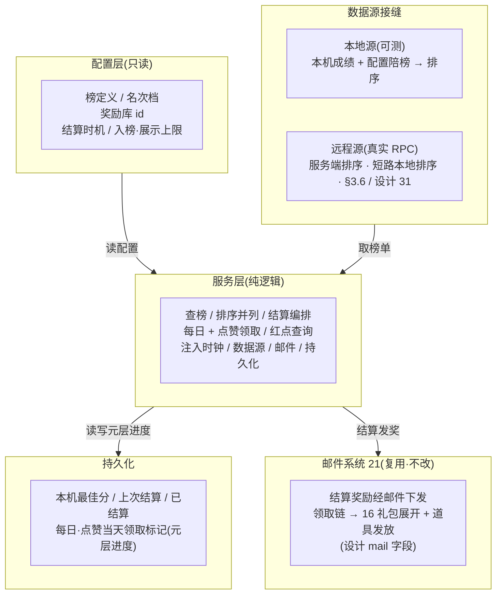
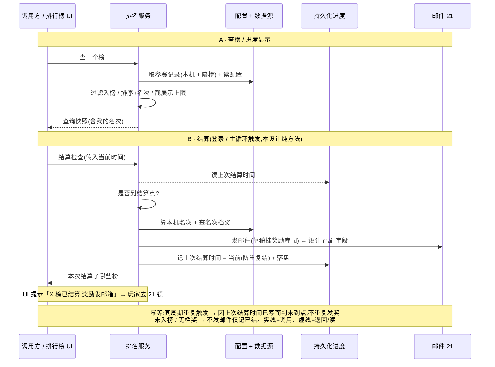

# 排行榜底层系统 · 数据逻辑层 + 服务器接缝

**排名数据逻辑层**:一张配置表控制所有榜单([§3.1](#22-rank-system::config),设计思路「统一用一个表格控制所有排行榜」),按字段建排行榜定义 + 奖励档位 + 结算时机;运行期提供**查榜**(取前 N 名、查自己名次)、**排序与并列规则**(分数降序 + 同分按入榜时间)、**结算编排**(到点算名次 → 按档位查奖励 → 发结算邮件)。关键在**排名数据源接缝**:① 一道可注入的排名数据源接口——<mark>本地离线榜实现可跑可测</mark>(本机自己一条记录 + 配置陪榜,排序产出名次),<mark>远程实现经[设计31](#31-rank-server)接真实 RPC、断服回退本地源</mark>;② 结算发奖<mark>不另造</mark>,直接走 [邮件系统 21](#21-mail-system) 既有发奖入口(设计目的「mail 字段 = 邮件 id,结算奖励写到邮件中」),奖励内容复用 [道具系统 16](#16-item-system) 礼包随机库。<mark>排行榜界面 / 名次列表 / 点赞按钮 / 头像(表现层)延后(需美术);真实全服榜单数据经[设计31](#31-rank-server)上后端兑现(远程源接真实 RPC、断服回退本地源)。本设计提供数据逻辑 + 接缝 + 结算 + 红点查询 + 后续扩展占位。</mark>

> [!WARNING]
> **读前必看 · 设计边界**
>
> 六条边界先明确,防止把「排名数据层」做成「真连服务器拉全服榜单 + 另造一套发奖」:
>
> - **「服务器接缝」= 可注入排名数据源接口(本地 / 远程可换)。**方向**离线还原 · 去变现**。「全服排名 / 攀比」由服务端汇总各玩家数据后下发——[设计31上后端](#31-rank-server)已将远程源接真实 RPC(服务端权威存储 + 排序 + 算名次),客户端拿服务端已排好的前 N 名 + 自己名次;**断服 / 离线回退本地源**——**用本机自己的一条成绩 + 配置陪榜垫底,本地排序产出一份可跑可测的榜单**(玩家仍能看到自己名次、能结算发奖)。这道接缝指的是**排名数据从哪来**(本地 / 远程)这个边界本身(见 [§3.6](#22-rank-system::source) / [§六 O1](#22-rank-system::open))。
> - **结算发奖直接走邮件系统 21,不另造发奖。**排行榜配置 `mail` 列原文「结算邮件:填邮件 id,结算奖励也写到邮件中」——结算时按名次查到档位的奖励库 id,**组一封邮件草稿(挂奖励库 id)经邮件系统发出**,奖励留在邮件里待玩家领取(领取由邮件系统的既有领取链落地)。**排名层不直接发奖、不碰玩法状态**——奖励发放是邮件系统的职责,排行榜只负责「算出谁该收哪封带什么奖的邮件」。
> - **奖励内容复用 16 礼包随机库 id,不另造奖励结构。**排行榜表 `reward` / `reward_daily` / `reward_praise` 列 = **奖励随机库表 id**(与邮件奖励 / 兑换码同源),指向道具系统的礼包池索引。本系统只持有「哪个名次档发哪个库 id」,具体发什么经邮件领取时由道具系统既有逻辑展开([§3.4](#22-rank-system::reward))。
> - **持久化复用既有接缝,本地单机。**需要跨会话留存的只有**本机自己的最佳成绩 + 各榜上次结算时间 + 已结算去重标记 + 每日奖励/点赞领取的当天标记**(元层进度)。序列化层与磁盘读写分层(序列化纯函数可单测、IO 异步),生产用框架既有非阻塞本地存档、测试用内存实现。全服他人成绩**不进盘**(本来就没有,陪榜由配置生成)。脏数据 / 截断对任意输入须产合法默认不抛(同 14/21 保底口径)。
> - **结算时机的「时间」由注入时钟驱动,可单测。**结算时机四档(无结算 / 开服 X 天 / 指定时间 / 周循环星期 X)的「现在该不该结算」全用**注入的当前时间 + 注入的开服日期**判定(同 21 邮件清理口径),不依赖真实系统时钟、不起后台定时器。本设计提供「给定当前时间,该榜是否到结算点 + 算出本次结算名次 + 组邮件发奖」的纯方法;何时被调用(登录检查 / 主循环)交调用方,可单测。
> - **UI 投放不在本设计。**排行榜界面 / 名次列表 / 我的名次条 / 点赞按钮 / 奖励预览 / 头像框 是表现层,依赖美术与窗口流程,本设计**不**建窗口、不挂 prefab。交付到「排行榜定义 + 榜单查询 + 排序并列 + 结算编排 + 每日/点赞领取 + 红点查询 + 两道接缝 + 文案占位」。多语言名称存文本 id 占位(同 num/item/reward/settings/redeem/mail 现状)。

> [!NOTE]
> **立项信息**
>
> | 项 | 内容 |
> | --- | --- |
> | **类型** | 新系统 · 排行榜数据逻辑层 + 服务器接缝 出设计稿 + 验收标准,交开发落地。 |
> | **方向约束** | 离线还原 · **去变现**:排行榜用于**进度显示 / 攀比 / 名次奖励**(设计目的三条),**不**含充值榜 / 付费冲榜 / 买名次;真实全服排名经[设计31上后端](#31-rank-server)兑现(远程源接真实 RPC、服务端权威排序 + 算名次);断服 / 离线回退本地源(本机成绩 + 配置陪榜)产出可玩可测的本地榜。本地存档用非阻塞写入(不触「禁阻塞 IO」红线)。加法式扩展,不破坏既有核心循环 + 已建系统(尤其邮件系统 21 零改动,只调用)。 |
> | **影响范围** | 新增排行榜配置表(一行一个名次档,[§3.1](#22-rank-system::config));新增运行期榜定义 + 名次奖励档模型 + 配置桥接([§3.2](#22-rank-system::poco));新增排名模型(榜上一名:玩家文本 id / 分数 / 名次 / 是否本人;一个榜的查询快照;结算结果,[§二](#22-rank-system::model) / [§3.3](#22-rank-system::query) / [§3.5](#22-rank-system::settle));新增排名服务(查榜 / 排序并列 / 结算编排 / 每日 + 点赞领取 / 红点)+ 文案占位([§3.3](#22-rank-system::query)–[§3.7](#22-rank-system::reddot));新增持久化层(本机各榜最佳成绩 + 上次结算时间 + 已结算标记 + 每日/点赞当天领取标记,[§3.8](#22-rank-system::persist));新增排名数据源接缝(本地源可跑可测 + 远程占位源,[§3.6](#22-rank-system::source));调用既有:邮件系统 21 发结算邮件(只调用不改),奖励库 id 复用 16,持久化复用既有本地存档。**UI 零改动**。**既有玩法逻辑零行为变化**。 |
> | **关键约束** | 模型 / 服务 / 持久化 / 接缝为纯逻辑,可在纯 C# 单测直接构造 / 注入(不依赖资源框架 / Unity 运行时 / 网络);配置经测试注入绕过运行期配置系统;持久化往返经内存实现注入断言(不碰真实本地存档);**当前时间 + 开服日期注入**(结算时机判定可单测);**结算发奖经注入的邮件服务**(测试注入断言「发了哪封带哪个奖励库的邮件」,不碰真实网络);排名数据源经接口注入(默认本地源)。现有 EditMode 测试零回归;邮件系统 21 零改动。 |

## 一、做什么与为什么 {#what}

现状:游戏**没有排行榜**。设计目的是「进度显示 / 全服排名 / 攀比 / 名次奖励」,设计思路是「<mark>统一用一个表格控制所有排行榜</mark>」——即一张配置表,每一行声明一个榜(或一个榜的一个名次奖励档),字段涵盖榜 id / 名称 / 分组 / 玩法类型 / 入榜要求 / 名次区间 / 奖励 / 每日奖励 / 点赞奖励 / 结算时机 / 结算邮件 / 入榜上限 / 展示上限。本设计建一套**排名数据逻辑层**:查榜(取前 N、查自己)→ 排序并列 → 到点结算 → 按名次档查奖励 → 发结算邮件,并把「排名数据源」「结算发奖」两道接缝划清。

因为本作离线、无服务器,「全服真实排名」拿不到。本设计的关键判断:**把「排名从哪来」抽象成一道可注入的排名数据源接缝**,离线用本地源——玩家自己打出的成绩进本机记录,配置里放一组「陪榜成绩」(NPC/基准分)垫底,本地按分数排序产出一份名次榜。玩家能看到自己排第几、能在结算时按名次拿奖。这既兑现了「进度显示 / 攀比 / 名次奖励」(对单机玩家成立:和基准分比、和自己历史最佳比),又把真实全服榜留成未来上后端时只换数据源实现的一道接缝。逐条对应设计字段与需求:

| # | 设计字段 / 需求 | 本篇落法 | 现状/新增 |
| --- | --- | --- | --- |
| 1 | `Id` 排行榜唯一 id / `Name` 排行名称 | 榜唯一 id / 名称(多语言占位)。一行一个名次档,同 `Id` 的多行 = 一个榜的多个奖励档([§3.1](#22-rank-system::config)) | 新增配置 |
| 2 | `rank_group` 排行榜组 / `rank_method` 所属玩法类型 | 分组供 UI 分页签;玩法类型标识该榜分数来自哪个维度(本设计枚举占位,[§3.1](#22-rank-system::config) / [§六 O3](#22-rank-system::open)) | 新增字段 |
| 3 | `rank_condition` 入榜要求 | 最低入榜分:成绩 &lt; condition 不进榜(查榜 / 结算都按此过滤,[§3.3](#22-rank-system::query)) | 新增 |
| 4 | `rank_min` / `rank_max` 名次区间 | 该奖励档覆盖的名次闭区间 \[min,max\];结算时玩家名次落入哪档就发哪档奖([§3.5](#22-rank-system::settle)) | 新增 |
| 5 | `reward` 奖励内容 / `rank_show_reward` 显示的奖励内容 | 实发奖励库 id(结算实发)/ 显示用奖励库 id(UI 预览用,可与实发不同,[§3.4](#22-rank-system::reward)) | 复用 16 |
| 6 | `reward_praise` 每天点赞奖励(为空不显示点赞按钮) | 点赞奖励库 id:>0 才有点赞按钮;每天一次发该库奖(经邮件 / 直发,[§3.4.2](#22-rank-system::daily))。==0 → 无点赞 | 新增 |
| 7 | `reward_daily` 每日奖励:当前名次每日奖励 | 每日奖励库 id:按玩家当前名次档的每日奖,每天可领一次(跨天重置,[§3.4.2](#22-rank-system::daily)) | 新增 |
| 8 | `valid_type` / `valid_val` 结算时机(0 无结算 / 1 开服 X 天 / 2 指定时间 / 3 周循环星期 X) | 结算时机类型 + 配套值;按当前时间 / 开服日期 / 上次结算时间四档判「到点没」([§3.5](#22-rank-system::settle) 逐档代入表) | 新增结算时机 |
| 9 | `mail` 结算邮件:填邮件 id,结算奖励写到邮件中 | 结算时按名次档查奖励库 id,组邮件草稿(挂该库 id + 该邮件模板的标题/内容)经 [邮件系统 21](#21-mail-system) 发出([§3.5](#22-rank-system::settle)) | 复用 21 |
| 10 | `rank_count_max` 入榜上限(计算前多少玩家)/ `show_count_max` 展示上限 | 参与排名/结算的名额上限 / 查榜返回条数上限;超出不计/不展示([§3.3](#22-rank-system::query)) | 新增 |
| 11 | 排序与并列规则(设计未明写,本篇补全) | 分数**降序**;同分按<mark>更早达到该分者名次靠前</mark>(入榜时间升序,稳定并列,[§3.3.2](#22-rank-system::sort)) | 设计补全 |
| 12 | 查自己名次 / 进度显示(设计目的「进度显示 / 攀比」) | 返回本人名次 + 分数(未入榜返 0 名次 + 距入榜差值,[§3.3](#22-rank-system::query)) | 新增 |
| 13 | 全服真实排名(服务器侧) | 排名数据源接缝:离线本地源(本机成绩 + 配置陪榜,可跑可测)/ 远程源**已接真实 RPC**(服务端权威排序,断服回退本地源,[§3.6](#22-rank-system::source) / [§六 O1](#22-rank-system::open) / [设计 31](#31-rank-server)) | 远程已接 |
| 14 | 功能开启:玩家 1 级即开 | 无等级门控逻辑(始终可用);1 级开仅 UI 入口可见性,表现层处理 | 无门控 |
| 15 | 排行榜界面 / 名次列表 / 点赞按钮 / 头像 / icon | 表现层,需美术,**延后**([§六 O8](#22-rank-system::open)) | UI 延后 |

**不做(本设计明确排除):**真实全服排名 / 服务器拉榜(本设计建本地源 + 远程接缝;真实远程经[设计31](#31-rank-server)已兑现,O1);真实他人玩家数据(离线无,陪榜由配置生成,O2);所有 UI 窗口(界面 / 列表 / 点赞按钮 / 头像 — 需美术,O8);多语言名称 / 文案真实查表(文本 id 占位,同 num/item/reward/mail 现状,O6);道具 / 跑马灯(设计明写无,O7);充值榜 / 付费冲榜 / 买名次(去变现方向,不做)。

## 二、数据模型与分层 {#model}

排行榜底层分三层,职责清晰互不越界:**配置层**(榜定义 + 奖励档,只读)、**数据源层**(榜上有谁、各多少分 — 接缝,离线本地 / 远程经[设计31](#31-rank-server)接真实 RPC)、**服务层**(查榜 / 排序并列 / 结算编排 / 领取 / 红点 — 纯逻辑)。结算时服务层向**邮件系统 21** 借发奖入口发奖。结构图:

**「一表控所有榜」的行模型(设计思路)**:配置表一行 = 一个榜的<mark>一个名次奖励档</mark>。同 `Id` 的多行属同一个榜(共享名称/分组/玩法类型/入榜要求/结算时机/结算邮件/上限),各行的名次区间与奖励不同(第 1 名一档、2–10 名一档、11–100 名一档…)。运行期按 `Id` 聚合成一个榜定义(榜级字段取首行)+ 一组名次奖励档([§3.2](#22-rank-system::poco)),同 16 道具礼包子项 / 20 兑换码奖励子表的「主+子聚合」做法。

## 三、设计正文 {#numbers}

### 3.1 排行榜配置表 {#config}

配置表与现有 num/item/redeem/mail 表同级管理。备注类字段不导出到运行期。字段逐列含义:

| 字段 | 类型 | 含义(设计原文 + 落法) |
| --- | --- | --- |
| 行主键 | int | 表行唯一主键。设计的 `Id` 可重复(同榜多档),故另设一列作行主键。<mark>新增,非设计字段</mark>,仅作表行唯一键 |
| id | int | 设计 `Id`「排行榜被调用的唯一 id」。同 id 多行 = 一个榜的多个名次档 |
| name | int | 设计 `Name`「排行名称」(多语言文本 id 占位)。同 id 各行取首行 |
| rank\_group | int | 设计 `rank_group`「排行榜组」(UI 分页签分组) |
| rank\_method | int | 设计 `rank_method`「所属玩法类型」(分数来自哪个维度;枚举占位,[§六 O3](#22-rank-system::open)) |
| rank\_condition | long | 设计 `rank_condition`「入榜要求」(最低入榜分;成绩 &lt; 此值不进榜) |
| rank\_min | int | 设计 `rank_min`「名次区间(最小)」(本档覆盖名次下界,含) |
| rank\_max | int | 设计 `rank_max`「名次区间(最大)」(本档覆盖名次上界,含) |
| reward | int | 设计 `reward`「奖励内容」= <mark>奖励随机库 id</mark>(道具系统 16 礼包池索引);结算实发;0 = 该档无奖 |
| rank\_show\_reward | int | 设计 `rank_show_reward`「显示的奖励内容」(UI 预览库 id,可与实发不同;0 = 同 reward) |
| reward\_praise | int | 设计 `reward_praise`「每天点赞奖励,为空则不显示点赞按钮」(库 id;0 = 无点赞)。同 id 各行取首行 |
| reward\_daily | int | 设计 `reward_daily`「每日奖励:当前名次每日奖励」(库 id;本档名次的每日奖) |
| valid\_type | int | 设计 `valid_type`:0 无结算持续开启 / 1 开服 X 天后结算 / 2 指定时间结算 / 3 周循环星期 X 结算。同 id 各行取首行 |
| valid\_val | long | 设计 `valid_val`:type=1→开服第 X 天(整数天);type=2→指定时间(秒或时间戳);type=3→星期 X(1–7);type=0 不生效。同 id 各行取首行([§3.5](#22-rank-system::settle) 逐档代入) |
| mail | int | 设计 `mail`「结算邮件:填邮件 id,结算奖励写到邮件中」= 邮件模板 id(设计 21);结算时按该邮件模板组草稿 + 挂本档 reward 库。同 id 各行取首行 |
| rank\_count\_max | int | 设计 `rank_count_max`「入榜上限:计算前多少玩家」(参与排名/结算名额)。同 id 各行取首行 |
| show\_count\_max | int | 设计 `show_count_max`「展示上限:展示多少玩家」(查榜返回条数)。同 id 各行取首行 |

**示例行(本设计录入,供验收锚定)**:建一个榜 `id=1`「周榜」三档:① 行主键=1, id=1, name=占位, group=1, method=1, condition=100, min=1, max=1, reward=1002(第 1 名), show\_reward=1002, praise=1003, daily=1004, valid\_type=3, valid\_val=1(周一结算), mail=1, count\_max=100, show\_max=50;② 行主键=2, id=1,…(榜级字段同上), min=2, max=10, reward=1005;③ 行主键=3, id=1, min=11, max=100, reward=1006。再建一个 `id=2`「无结算总榜」一档(valid\_type=0)。<mark>奖励库 id 1002–1006 须道具系统 16 有对应礼包池才能领出实物;邮件模板 1 须邮件系统 21 表里存在</mark>;否则结算仍发邮件、邮件领取产出空(不抛,见 [§3.5](#22-rank-system::settle) / 21 §3.4.3 边界)。

### 3.2 运行期榜定义与名次奖励档(配置聚合) {#poco}

配置原始行桥接成运行期榜模型,业务侧只认运行期模型;运行期从配置系统加载,测试经注入绕过资源框架直接灌入。<mark>按 <code>id</code> 聚合</mark>:同 id 多行 → 一个**榜定义**(榜级字段取首行)+ 各行一个**名次奖励档**(按 rank\_min 升序)。排行榜是通用系统,与核心玩法解耦。

**结算时机类型(对应 valid\_type)**:

| 取值 | 含义 | 配套值含义 |
| --- | --- | --- |
| 0 持续开启 | 无结算,持续开启 | 不生效 |
| 1 开服 X 天 | 开服第 X 天结算 | 天数 |
| 2 指定时间 | 指定时间点结算 | 时间(秒 / 时间戳) |
| 3 周循环 | 周循环,星期 X 结算 | 星期 1..7 |

**名次奖励档(配置一行)**字段:名次区间下界(含)、名次区间上界(含)、实发奖励库 id(0 = 无奖)、UI 预览库 id(0 = 同实发)、本档每日奖励库 id(0 = 无每日奖)。

**榜定义(同 id 多行聚合)**字段:榜唯一 id、名称文本 id(占位)、排行榜组、所属玩法类型、入榜要求(最低入榜分)、点赞奖励库 id(0 = 无点赞按钮)、结算时机类型 + 配套值、结算邮件模板 id(设计 21)、入榜上限(参与排名名额)、展示上限(查榜返回条数)、按 rank\_min 升序的名次奖励档列表。

**按名次查中奖档**:给定名次,在各档名次区间内查命中档;名次未落入任何区间 → 无匹配(无奖)。

运行期榜查询行为:按榜 id 查(查不到返空,不抛);可取全部榜(供 UI 分页 / 登录时遍历检查结算)。

> [!NOTE]
> **聚合口径:榜级字段冲突怎么办?**
>
> 同 `id` 各行的榜级字段(名称/分组/玩法类型/入榜要求/点赞/结算时机/结算邮件/入榜上限/展示上限)**应填一致**;聚合时<mark>取该 id 首行的值</mark>(按行主键升序后第一行),后续行只取 `rank_min/rank_max/reward/show_reward/reward_daily` 这几个名次档字段。这与 16 礼包子项 / 20 兑换码奖励子表的「主行定主属性、子行定明细」同源。配置规范:同榜各行榜级字段务必一致(策划约定),聚合不做冲突告警(本设计),后续可加配置校验器。

### 3.3 榜单查询 + 排序并列 {#query}

排名服务持有注入项(配置 / 数据源 / 时钟 / 持久化 / 邮件服务)。查榜走数据源接缝取「榜上有谁多少分」,本地排序产出名次。

**榜上一名**(数据源产出 + 服务排名后填名次)记录:玩家展示名文本 id(陪榜 = 配置占位名;本人 = 玩家信息名占位)、成绩、达到该分的时间(并列时早者靠前)、是否本机玩家、名次(服务排序后回填,1 起)。

**一个榜的查询快照**:榜 id、已排序并截展示上限的条目列表、本机玩家在榜的条目(未入榜则空)、本人名次(未入榜 = 0)、本人成绩(未入榜 = 当前最佳,可能低于入榜要求)。

服务对外提供三个动作:

- **查一个榜**:取数据源原始记录 → 过滤入榜要求 → 排序回填名次 → 截展示上限 → 标本人,返回查询快照。
- **查本人名次**(轻量,不返全榜):返回本人名次 + 分数,未入榜时名次为 0。
- **提交本机一次成绩**(取较大者更新最佳并落盘),供玩法结束时调。

#### 3.3.2 排序与并列规则(设计未明写,本篇补全) {#sort}

设计没写排序细节,本设计明确两条规则(均为安全默认,见 [§六 O4](#22-rank-system::open)):

| 规则 | 判据 | 理由 |
| --- | --- | --- |
| **主序:分数降序** | 分数大者名次靠前(第 1 名 = 最高分) | 排行榜通例;「攀比 / 名次奖励」隐含高分高名次 |
| **并列:入榜时间升序** | 同分时<mark>更早达到该分</mark>者名次靠前 | 稳定并列(可复现、可测);奖励竞速类「先到先得」通例,避免同分名次抖动 |
| **过滤:入榜要求** | 成绩低于入榜要求不进榜(不参与排名、不占名额、不展示) | 设计 `rank_condition`「入榜要求」 |
| **入榜上限** | 排序后只取前 N 名(入榜上限)参与名次 / 结算;超出的不计名次 | 设计 `rank_count_max`「计算前多少玩家」 |
| **展示上限** | 查榜返回的条目截前 N 条(展示上限) | 设计 `show_count_max`「展示多少玩家」 |

**名次回填**:排序后从 1 起顺序编号(<mark>同分也各占一个名次位</mark>,即「密集名次 vs 标准名次」取**标准名次**:1,2,2,4 还是 1,2,3,4?本设计取 <mark>1,2,3,4 顺序名次</mark> — 每条记录占一个唯一名次,简单可测,见 O4)。本人那条由数据源标记(本机成绩那条)。

### 3.4 奖励内容(复用 16 礼包库 id) + 每日 / 点赞领取 {#reward}

排行榜表 `reward`/`reward_daily`/`reward_praise` 三列都是<mark>奖励随机库 id</mark>(道具系统 16 礼包池索引),与邮件奖励 / 兑换码同源。排名层**只持有 id**,不展开:结算奖经邮件下发(领取时展开),每日 / 点赞奖按 O5 默认**也经邮件下发**(统一走 21,不另造直发落点)。

#### 3.4.2 每日奖励 + 点赞(跨天重置,经邮件发) {#daily}

设计:`reward_daily`「当前名次每日奖励」、`reward_praise`「每天点赞奖励」。两者都是<mark>每天一次</mark>,跨天重置(同 14 存档系统每日字段口径:存「上次领取日期」,与注入的今天日期比)。

**领今日每日奖**(按本人当前名次档的每日奖励库 id)的判定顺序:当天已领 → 返「今日已领」;本人无名次 → 返「未入榜」;无每日奖 → 返「无奖励」;否则按当前名次档的每日奖励库组草稿经邮件系统 21 发出,记当天已领并落盘,返成功。

**领今日点赞奖**(榜级点赞奖励库)同口径:点赞奖励库为 0(无点赞按钮)→ 返「无奖励」;每天一次,跨天重置。

**每日奖按「当前名次档」**:玩家名次落在哪档,就发该档每日奖励库;未入榜 → 无每日奖。点赞奖是榜级(整个榜一个点赞奖励库),不分档。两者都组邮件草稿经 21 发邮件(玩家去邮箱领),不在排名层直发(O5)。

### 3.5 结算编排(到点 → 算名次 → 发结算邮件) {#settle}

结算是排行榜的核心动作:到结算时机时,算出本机玩家名次,查名次档奖励,组结算邮件经 21 发奖,记已结算防重复。<mark>本设计提供纯方法,不起后台定时器</mark>;调用方(登录检查 / 主循环)按需触发结算检查并传入当前时间。

#### 3.5.1 结算时机判定(valid_type 四档逐档代入) {#due}

给定当前时间 / 开服日期 / 上次结算时间,按四档判该榜是否到结算点(且本周期未结过):

| valid\_type | valid\_val 含义 | 到点判据 | 结算频率 | 代入示例(now / open / last) |
| --- | --- | --- | --- | --- |
| 0 持续开启 | 不生效 | 永不结算(持续开启,只查榜不发结算奖) | 无 | — |
| 1 开服 X 天 | 开服第 X 天 | 当前时间 ≥ 开服日期 + X 天 且 从未结算 | 一次性(结过即止) | open=6/1, val=7, now=6/8 → 到点;若 last=6/8 → 不再结 |
| 2 指定时间 | 指定时间(秒) | 当前时间 ≥ 该时间 且 从未结算 | 一次性 | val=2026/7/1 0:00, now=7/1 0:01 → 到点 |
| 3 周循环 | 星期 X(1=周一…7=周日) | 本周已过「星期 X 的结算时刻」且本周期(本周)未结过 | 每周一次 | val=1(周一), now=周二 → 本周已过周一且 last 不在本周 → 到点;last 在本周 → 不再结 |

**周循环判据细节**:算出当前时间所在自然周的「星期 X 结算时刻」;若当前时间 ≥ 该时刻 且(从未结算 或 上次结算早于该时刻)→ 到点。结算后把上次结算时间记为当前时间,使本周不再重复结、下周到点再结。时刻精度本设计到「天」(valid\_val 只给星期 X,小时统一,见 O4);要精确到小时另开增量。

#### 3.5.2 结算编排 {#orchestrate}

结算检查是一个纯方法:给定当前时间,遍历所有榜,对到点且未结的榜执行结算——算本机名次(基于 [§3.3](#22-rank-system::query) 排序)→ 查名次档奖 → 组结算邮件经 21 发出 → 记已结算;返回本次结算了哪些榜(供 UI 提示)。调用方按需调(登录 / 主循环)。

发结算邮件的条件:本机名次落中奖档、该档实发奖励库非 0、且榜配置有结算邮件模板。组草稿时按该邮件模板取标题/内容,把名次档实发奖励库挂到草稿上(设计「奖励写到邮件中」),经邮件系统 21 发出。结算后把该榜上次结算时间记为当前时间(防重复结)。

**关键边界**:① 玩家未入榜或名次未落任何档或该档无奖 → <mark>不发邮件,仅记已结算</mark>(本周期已处理,下次不重复算);② 结算邮件模板为 0 → 不发(配置无结算邮件);③ 邮件模板表无此 id → 兜底用占位草稿(发件人 / 标题占位文本 id),仍挂奖励发出,不漏奖;④ 同周期重复触发结算检查 → 因上次结算时间已写而判为未到点,<mark>不重复发奖</mark>(幂等防刷)。

### 3.6 排名数据源接缝(本地源 + 远程源) {#source}

这是标题「服务器接缝」的实义。「全服排名」由服务端汇总,本设计把「排名从哪来」抽象成一道**排名数据源接缝**,使本地源与远程源可换、服务层不变。接缝有两条数据源:

- **离线本地源**(可跑可测):给一个榜 id 返「榜上有哪些参赛记录」(原始未排序),由服务层排序——本机最佳成绩(来自持久化 / 注入)+ 配置陪榜成绩 → 一组参赛记录,本机那条标记为本人。「陪榜」= 配置 / 注入的基准成绩(NPC 名 + 分数文本 id 占位),使单机也有一份可排序的榜。
- **远程源**:经联网会话发上报 / 查榜 RPC,服务端权威存储全服分数、排序、算名次,客户端拿服务端已排好的前 N 名 + 自己名次直接显示(短路本地排序)。服务端段(全服分数存储 + 排序 + 名次)与客户端段(远程源切真实 RPC)见 [设计 31 排行榜上后端](#31-rank-server)。断服 / 超时回退本地源(不阻断玩法、不伪造全服名次)。

**为什么两条源算名次的位置不同?** 本地源全部参赛记录(本机 + 陪榜)在客户端,客户端自己排序算名次;远程源全服分数在服务端,由服务端排序算名次后下发前 N 名 + 自己名次,客户端短路本地排序直接采用。两条源对服务层暴露同一查询快照(已排序条目 + 我的名次),服务层无需关心名次由谁算——这是接缝把「排名从哪来」抽象掉的价值。陪榜成绩本设计由**配置 / 注入**提供(基准分,NPC 名占位文本 id);不引入随机生成 NPC(表现层 / 运营内容,O2)。榜只比成绩、不卖名次,与去变现方向一致。

### 3.7 红点查询(可领每日 / 点赞 / 有未领结算邮件) {#reddot}

排行榜 icon 红点 = 有可领的每日奖 OR 可领的点赞奖 OR 有未结算到点的榜。结算奖发进邮箱后由**邮件红点**(21)负责,排行榜红点只管<mark>「榜内可领项」</mark>,避免与邮件红点重复亮。本设计只给状态查询,UI 投放延后。

红点判定:遍历所有榜,任一榜满足以下任一条件即亮——① 该榜到点未结算;② 本机入榜且当前名次档有每日奖且今日未领;③ 该榜有点赞奖且今日未领。全部不满足 → 不亮。

### 3.8 持久化层 {#persist}

需要跨会话留存的只有**本机元层进度**:各榜本机最佳成绩 + 达到时间、上次结算时间、已结算周期标记、每日 / 点赞当天领取日期。<mark>全服他人成绩不进盘</mark>(离线没有;陪榜由配置生成,每次现取)。序列化层与磁盘读写分层:序列化是纯函数可单测、IO 异步;带版本号 + 反序列化保底。生产用框架既有非阻塞本地存档(榜进度专用键),测试用内存实现(不污染真实本地存档)。

**一个榜的本机元层进度**字段(按游戏含义):本机最佳成绩、达到最佳分的时间(并列排序用)、上次结算时间(0 = 从未结算)、上次领每日奖的日期、上次领点赞奖的日期。整份存档另带版本号(预留迁移,本设计恒 1)。

**保底 + 跨天重置**(同 14/21 口径):读取对无存档 / 空内容 / 非法数据统一返合法空进度(不抛);每日 / 点赞领取用「<mark>存上次领取日期、与注入的今天日期比</mark>」判跨天(日期不同 → 可领)。本地单机文件可被篡改,反序列化对任意输入不抛、对负分 / 越界字段产出合法默认(成绩夹 ≥0)。

### 3.9 结果文案占位 {#text}

领取 / 结算结果对应提示文案文本 id(占位,真实多语言查表延后,同 num/item/reward/settings/redeem/mail 现状)。榜名称 / 玩家名 / 结算邮件标题也是文本 id 占位。领取结果状态:成功 / 未入榜 / 无奖励 / 今日已领。各状态及邮件文案对应互不相同的非 0 占位值(供验收断言):

| 用途 | 占位值 |
| --- | --- |
| 领取成功 | 110801 |
| 未入榜 | 110802 |
| 无奖励 | 110803 |
| 今日已领 | 110804 |
| 结算邮件发件人 | 110805 |
| 结算邮件标题(模板缺省兜底) | 110806 |
| 每日奖邮件标题 | 110807 |
| 点赞奖邮件标题 | 110808 |

## 四、结算一个榜的时序 {#flow}

结算是五方参与的核心流(调用方 / 服务 / 配置 / 数据源 / 邮件系统 21)。查榜与结算两条流,用时序图归纳:

## 五、验收点 {#accept}

纯逻辑全 EditMode 可测(模型 + 注入隔离 + 注入时钟 + 注入邮件服务 + 注入数据源);配置直读条按导表工具链可达性(不可达列 BLOCKED)。验收锚在**配置聚合 + 查榜 + 排序并列 + 入榜/上限 + 我的名次 + 结算时机四档 + 结算发邮件 + 幂等 + 每日/点赞跨天 + 红点 + 持久化往返 + 接缝**;真实全服排名 / UI 视觉不在本设计(无后端 / 需美术)。

| 组 | # | 验收点(完成定义,可逐条核对) |
| --- | --- | --- |
| 配置 C | C1 | 灌入配置后按榜 id 查得榜定义,榜级字段(名称/分组/玩法类型/入榜要求/点赞/结算时机/结算邮件/入榜上限/展示上限)正确;查不存在的 id 返空(不抛) |
| 配置 C | C2 | **聚合**:同 id 多行(3 档)→ 一个榜定义含 3 个名次奖励档(按 rank_min 升序);按名次查档时名次落区间返对应档(rank=1→档1, rank=5→档2, rank=50→档3),落空区间返空 |
| 配置 C | C3 | (配置直读,工具链可达时)读取配置二进制后含示例行且字段映射正确(id=1 三档 + id=2 一档,reward 1002–1006);不可达列 **BLOCKED** |
| 查榜 + 排序 SO | SO1 | 查榜:分数**降序**(最高分名次 1);同分按达到时间升序(早者靠前);名次从 1 起顺序回填(同分各占唯一名次,1,2,3,4) |
| 查榜 + 排序 SO | SO2 | **入榜要求**:成绩低于入榜要求的记录不进榜(不占名次、不在返回条目);**入榜上限**:超上限名次的记录不计名次;**展示上限**:返回条目截前 N 条 |
| 查榜 + 排序 SO | SO3 | **我的名次**:本机记录在榜时本人名次 = 其名次、本人条目非空;未达入榜要求时本人名次为 0;查本人名次与查榜返回的本人名次一致 |
| 结算时机 DUE | DUE1 | 持续开启(type=0):是否到结算点恒为否(持续开启不结算) |
| 结算时机 DUE | DUE2 | 开服 X 天(val=7):当前时间 < 开服+7 天 → 否;当前时间 ≥ 开服+7 且从未结算 → 是;已结 → 否(一次性) |
| 结算时机 DUE | DUE3 | 指定时间(type=2):当前时间 < 指定时间 → 否;当前时间 ≥ 且从未结算 → 是;已结 → 否 |
| 结算时机 DUE | DUE4 | 周循环(val=周一):当前时间在本周「周一结算时刻」之后且上次结算不在本周 → 是;同周已结 → 否;下周到点 → 再是(周循环) |
| 结算编排 ST | ST1 | 结算检查:到点且本机名次落中奖档(reward≠0、mail≠0)→ 注入的邮件服务收到一封发送调用,草稿挂的奖励库 == 该名次档实发奖励库(设计「奖励写到邮件中」);返回的结算结果含名次 + 奖励库 id |
| 结算编排 ST | ST2 | **幂等防重**:同周期连续两次结算检查 → 第二次因上次结算时间已写而判未到点,**邮件服务只被调一次**(不重复发奖) |
| 结算编排 ST | ST3 | **边界**:未入榜(名次 0)/ 名次未落任何档 / 该档 reward==0 / mail==0 → **不发邮件但仍记上次结算时间**(本周期已处理);邮件模板缺失 → 兜底占位草稿仍挂奖励发出(不漏奖) |
| 每日/点赞 DP | DP1 | 领每日奖:入榜且当前名次档有每日奖励库 → 成功且注入的邮件服务收到挂该库 id 的发送;当天再领 → 今日已领不重复发;未入榜 → 未入榜;无每日奖 → 无奖励 |
| 每日/点赞 DP | DP2 | **跨天重置**:注入今天领过后,注入 **次日** → 又可领(证「存领取日期 + 注入今天日期比」可单测);点赞同口径(点赞奖励库==0 → 无奖励,每天一次) |
| 每日/点赞 DP | DP3 | 每日 / 点赞奖均**经邮件下发**(注入的邮件服务收到发送),排名层不直发落点(O5) |
| 红点 RD | RD1 | 红点查询:有「到点未结算」榜 → 亮;有「今日每日奖可领」→ 亮;有「今日点赞可领」→ 亮;全部已领且无到点结算 → 不亮 |
| 红点 RD | RD2 | 领过今日每日 / 点赞后该项不再触发红点(当天);结算后该榜不再到点不再触发(结算红点由邮件红点 21 接管,不重复) |
| 持久化 P | P1 | 持久化注内存实现:提交成绩 / 结算 / 领取后新建服务实例(复用同存档)→ 本机最佳分 / 上次结算时间 / 每日领取日期保真(跨实例往返,模拟重启) |
| 持久化 P | P2 | 反序列化保底:无存档 / 空内容 / 非法数据 → 读取返合法空进度(不抛);负分 / 越界字段产出合法默认(成绩夹 ≥0);服务能从空进度正常提交成绩 |
| 接缝 SK | SK1 | 远程源**同步 Fetch** 取记录返空集合且**不抛、不连网**(同步回退路径;真实 RPC 往返在异步远程入口,见[设计31](#31-rank-server));本地源取记录返「本机一条(本人)+ 注入陪榜」可被服务排序;数据层 EditMode 单测以桩响应 / 本地源覆盖、不连真网 |
| 接缝 SK | SK2 | 注入远程占位源(空榜)时查榜返空条目、不抛;切回本地源行为不变(证数据源可换、服务层零改动) |
| 回归 / 编译 R | R1 | 编译 0 error;现有 EditMode 测试全绿(零回归,尤其邮件 21 测试不受影响);新增排行榜测试全绿 |
| 回归 / 编译 R | R2 | Code Review 5 红线:异步优先 / 模块访问规范 / 资源释放 / 热更边界 / 事件解耦(本层无资源加载、无事件;重点核「数据层单测以桩响应 / 本地源覆盖、同步 Fetch 不连网(真实往返走设计31异步远程入口)」「本地存档非阻塞不触同步 IO」「结算发奖复用邮件系统 21 不另造发奖、不碰玩法状态」「持久化复用既有本地存档不另造存储栈」「邮件系统 21 零改动」) |

> [!WARNING]
> **不在本设计验收**
>
> 真实全服昵称(玩家信息上后端,设计31 §七 O5)、排行榜界面 + 名次列表 + 我的名次条 + 点赞按钮 + 奖励预览 + 头像框 UI 视觉、排行榜 icon 红点显示、主界面入口接线、结算的自动触发时机(登录检查 / 后台轮询由表现层 / 流程层接) → <mark>表现层延后轮</mark>。依赖美术(UI);真实全服排名 / 服务器拉榜已由[设计31](#31-rank-server)兑现,数据层不返工。

## 六、待拍板清单 {#open}

以下为范围开关,自治授权下**均取安全默认推进**(已在预先拍板内),列此备查;要改另开增量轮。

| # | 开关 | 本设计默认 | 备选 / 触发改动 |
| --- | --- | --- | --- |
| O1 | 真实全服排名 / 服务器拉榜 | **远程源已接真实 RPC**([设计 31](#31-rank-server)):服务端权威排序 + 算名次,客户端短路本地排序;断服回退本地源(本机 + 陪榜,可跑可测) | 结算发奖上后端(依赖名次档奖 + 邮件 21)、真实全服昵称(玩家信息上后端)是后续独立增量,见设计 31 §七 |
| O2 | 陪榜成绩来源 | **配置 / 注入基准分**(NPC 名占位 + 固定分数,单机有得排) | 随机生成 NPC / 动态难度陪榜 = 表现层/运营内容,本设计不投机做;真人榜上后端取 |
| O3 | `rank_method` 玩法类型语义 | 整数枚举占位(标识分数来自哪个维度,本设计不绑具体玩法分数源) | 各玩法接入时把自己的成绩提交到对应榜;method 仅作分类标识,语义由接入方约定 |
| O4 | 排序并列 + 名次编号口径 | 分数降序 + 同分入榜时间升序(早者靠前);**顺序名次**(1,2,3,4 — 同分各占唯一名次) | 若要密集名次(1,2,2,4)或同分同名次,改名次回填逻辑;周结算时刻本设计精度到「天」,要精确到小时另开增量 |
| O5 | 每日 / 点赞 / 结算奖发放渠道 | **统一经邮件 21 下发**(组草稿挂奖励库 id 发出,玩家去邮箱领) | 若要每日/点赞即时直发(不经邮箱),排名层接道具系统 16 直发落地;当前统一走邮件最省、最一致 |
| O6 | 名称 / 玩家名 / 文案多语言 | 文本 id 占位(同 num/item/reward/settings/redeem/mail) | 多语言文本表建成后查表替换 |
| O7 | 道具 / 跑马灯需求 | **不做**(设计明写「道具:无」「跑马灯:无」) | 设计未要求,不投机做 |
| O8 | 排行榜界面 / 列表 / 点赞按钮 / 头像 / icon UI | **延后**(需美术,留服务 + 红点查询) | 有美术 + 窗口流程时建窗口,接 [奖励展示 17](#17-reward-display) 展示奖励预览,主界面入口接红点查询,手验 |
| O9 | 结算自动触发时机 | 本设计**纯方法,传入当前时间触发结算检查**,不起后台定时器;调用方(登录检查 / 主循环)按需调 | 表现层 / 流程层接入时,在登录流程 + 定时轮询触发结算检查;本地无服务器推送,被动检查够用 |

## 七、风险表 {#risk}

| 风险 | 应对 |
| --- | --- |
| **远程源接真实 RPC 后漏断服回退**:断网 / 服务端不可用时排行榜不可用或卡住(本作离线优先,不能因服务端缺席而玩不了) | [设计31](#31-rank-server)远程源失败 / 超时 / null 一律回退本地源(本机 + 陪榜),不阻断玩法、不伪造全服名次;远程**同步 Fetch** 仍返空(真实往返走异步远程入口)。Code Review R2 + 验收 SK1 核「数据层不连真网 / 同步 Fetch 不连网」+ 设计31 CV4 核断服回退不抛 |
| **另造发奖逻辑**:不走邮件系统 21,自己写一套「名次→奖励→落玩法状态」→ 与邮件 / 道具系统多处漂移,且违设计「奖励写到邮件中」 | 读前必看第 2 条 + §3.5 显式走既有邮件系统发奖入口(注入);排名层不碰玩法状态、不直接发道具。Code Review 核不另造发奖。验收 ST1/DP1 断言「发了挂对应奖励库 id 的邮件」 |
| **结算重复发奖**:同周期多次触发结算检查(登录 + 轮询)→ 玩家多次收奖 | §3.5.2 是否到点判据带上次结算时间 + 结算后写上次结算时间为当前;验收 ST2 断言同周期第二次不发。周循环按「本周已结」判,下周再结 |
| **每日 / 点赞奖跨天判错**:用本地系统时钟直接比 / 不存领取日期 → 当天可重复领或永远领不了 | §3.8 存「上次领取日期」+ 注入今天日期比(同 14 每日字段口径);验收 DP2 注入次日断言可再领 |
| **排序不稳定 / 同分名次抖动**:只按分数排,同分时名次每次不同 → 不可复现、结算名次飘 | §3.3.2 并列规则「同分按达到时间升序」稳定排序;验收 SO1 用同分不同时间断言名次固定 |
| **聚合丢档 / 榜级字段冲突**:同 id 多行聚合时漏掉某档,或各行榜级字段不一致取错 | §3.2 按 id 聚合、各档按 rank_min 升序入档列表、榜级字段取首行;验收 C2 断言 3 行聚合成 3 档且按名次查档命中正确 |
| **未入榜 / 无档 结算崩**:本机没成绩或名次落空区间,结算时空引用 | §3.5.2 边界:名次 0 / 无命中档 / reward==0 / mail==0 均不发邮件仅记已结;邮件模板缺失兜底占位草稿。验收 ST3 专门断言 |
| **脏存档崩服务**:本地文件被篡改 / 截断,反序列化抛异常 / 负分 → 进度进不去 | §3.8 读取对无存档 / 空内容 / 非法数据统一产空进度(同 14/21 口径);负分 / 越界字段产合法默认。验收 P2 断言脏数据不抛 |
| **红点与邮件红点重复亮**:结算奖发进邮箱后排行榜 icon 仍亮「有结算奖」→ 两处红点指同一封 | §3.7 排行榜红点只管「榜内可领项(每日/点赞)+ 到点未结」;结算奖进邮箱后由邮件红点(21)负责,排行榜红点不再为已结算项亮。验收 RD2 断言结算后该榜不再触发红点 |
