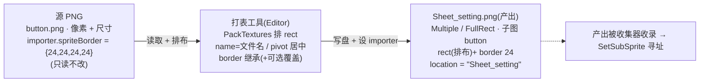
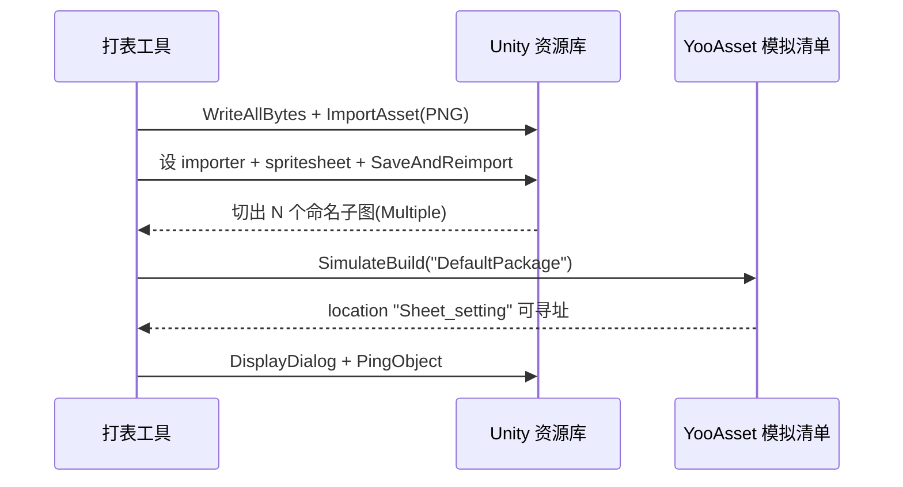

<style>
  /* 本篇专用:代码块 / 字段表 / 流程小样式(沿用 15–23 口径) */
  pre.code { margin:8px 0; padding:12px; background:#0d1622; border:1px solid var(--border); border-radius:8px; overflow:auto; font-size:13px; line-height:1.55; }
  table.tight td, table.tight th { padding:6px 10px; }
  .pill-new { display:inline-block; font-size:11px; padding:1px 7px; border-radius:10px; background:rgba(91,214,160,.16); color:#5bd6a0; margin-left:6px; }
  .pill-cur { display:inline-block; font-size:11px; padding:1px 7px; border-radius:10px; background:rgba(108,140,255,.16); color:#6c8cff; margin-left:6px; }
  .pill-no  { display:inline-block; font-size:11px; padding:1px 7px; border-radius:10px; background:rgba(255,122,138,.16); color:#ff7a8a; margin-left:6px; }
  .yes { color:#5bd6a0; font-weight:bold; }
  .no  { color:#ff7a8a; font-weight:bold; }
  td.mono, code.mono { font-family:ui-monospace,Consolas,monospace; }
  .diagram { margin:12px 0; padding:12px; background:#0d1622; border:1px solid var(--border); border-radius:8px; overflow:auto; }
</style>

# 散切图打表工具(Editor)

一个 Editor 菜单工具:输入一个**散切图目录**(`AssetRaw/UIRaw/Atlas/<screen>/`),一键输出一张 <mark>Multiple 模式精灵表 PNG</mark>(`Sheet_<目录名>.png`),落 `AssetRaw/UIRaw/Atlas/` 并设好 `TextureImporter`。目的:[设计 23](#23-settings-window-art) 确立的切图寻址范式(每屏一张 Multiple 精灵表 PNG + `Image.SetSubSprite(图集 location, 子图名)`)当前靠**一次性手工合表**实现,后续约 20 屏 UI 换皮若每屏手工打表,成本线性累积且易错(子图名漏改 / rect / pivot / border 手设)。本工具把这条打表流程工具化,服务整条换皮主线([遗留 #28](#))。

> [!WARNING]
> **读前必看 · 与工程现状的关系(单一事实源 = 代码)**
>
> 四条边界先明确,防把「做一个打表工具」做歪成「重写图集系统 / 改框架 / 自造寻址」:
>
> - **寻址范式不动,只工具化产出。** 范式 = [设计 23](#23-settings-window-art) 关单确立的「Multiple 精灵表 PNG + `SetSubSprite`」([遗留 #28](#))。**不**用 SpriteAtlas v2(经实测不向 YooAsset 暴露子精灵,`LoadSubAssetsAsync<Sprite>` count=0,不可用,[遗留 #29](#) 是其失败残留)。本工具产出的就是现状 `Sheet_settings.png` 那种「单张 PNG + spriteMode=Multiple + 多个命名子图」资源。
> - **子图名 = 源 PNG 文件名(去扩展名)。** `SetSubSprite` 内部走 `LoadSubAssetsAsync<Sprite>(location).GetSubAssetObject<Sprite>(子图名)`,子图名即精灵表里每个 `SpriteMetaData.name`。工具把每张源 PNG 的文件名(去 `.png`)作为对应子图的 `name`,运行期 `SetSubSprite("Sheet_setting", "button")` 即按文件名取得到。
> - **不复用既有 AtlasMaker。** 工程已有 `TEngine.Editor.AtlasConfiguration` / AtlasMaker(`Assets/TEngine/Editor/AtlasMakerEditor/`),但它生成的是 **SpriteAtlas v2** 容器(上一条已排除),与本工具产出的「Multiple 精灵表 PNG」是两条不同路径。本工具是新建独立 Editor 脚本,不改 AtlasMaker。
> - **纯 Editor 工具,不进热更区、不进运行期。** 工具脚本落 `Assets/Editor/`(编辑器程序集,不打包、不热更);产出资源(PNG + .meta)落 `AssetRaw/UIRaw/Atlas/` 被收集器收。运行期代码(`SetSubSprite` 调用方)是各换皮窗口的事,本设计不碰。

> [!NOTE]
> **立项信息**
>
> | 项 | 内容 |
> | --- | --- |
> | **类型** | Editor 工具 · 换皮生产基础设施 出设计稿 + 验收标准,交开发落地。兑现遗留 #28。 |
> | **设计基线(经勘察核实的真实符号 / 现状)** | **寻址底层(已实证,只生产符合它的资源)**:`Image.SetSubSprite(string location, string spriteName, bool setNativeSize=false)`(`SetSpriteExtensions.cs:43`)→ 内部 `YooAssets.GetAssetInfo(location)` + `LoadSubAssetsAsync<Sprite>(location)` + `GetSubAssetObject<Sprite>(spriteName)`(`ResourceExtComponent.SubSprite.cs`)。要求 `location` 指向「含多个命名 Sprite 子对象的单一资源」= spriteMode=Multiple 的精灵表 PNG。 **收集器**:`AssetBundleCollectorSetting.asset` 组 `UIRaw` 收 `Assets/AssetRaw/UIRaw/Atlas`(`AddressByFileName` + `PackDirectory`,`AssetBundleCollectorConfig.xml:32-34`)。**故 `Sheet_setting.png` 直接落该目录 → location = `Sheet_setting`(文件名,不含路径 / 扩展名)**,无需改收集器。 **模拟清单重建**:`YooAsset.EditorSimulateModeHelper.SimulateBuild(string packageName)`(`EditorSimulateModeHelper.cs:6`);默认包名 `"DefaultPackage"`(`ProcedureInitPackage.cs` 用 `_resourceModule.DefaultPackageName`)。改 `AssetRaw` 资源后须重建,EditorSimulateMode 下 location 才解析得到;Play 启动会自动重建,工具内调一次便于改完即在编辑器查询。 **对照基准**:现有手工表 `Assets/AssetRaw/UIRaw/Atlas/Sheet_settings.png`(+ `.meta`)= 工具产出的逐字段对照基准。其 importer:`textureType=8`(Sprite) / `spriteMode=2`(Multiple) / `spriteMeshType=1`(FullRect) / `sRGBTexture=1` / `alphaIsTransparency=1` / `maxTextureSize=2048` / `compressionQuality=50` / `filterMode=1` / `spriteExtrude=1` / `spritePixelsToUnits=100` / `alignment=0` / `spritePivot={0.5,0.5}`;其 `spriteSheet.sprites` 实际 21 个命名子图(6 个 `border=24`:base_plate/base_plate2/base_plate3/box1/box2/button;其余 15 个 `border=0`)。**另有 `Sheet_settings_0..25` 共 26 个早期自动切残留名,只在 `internalIDToNameTable`/`nameFileIdTable`、不在真实 sprites 列表(`LoadSubAssetsAsync` count=21);工具产出不带此类残留。** |
> | **方向约束** | 离线还原 · 去变现:工具不触网、不含任何变现逻辑,纯本地资源加工。加法式:新建独立 Editor 脚本 + 不改收集器(`Sheet_*` 落已收录目录)、不改框架、不改运行期代码、不动既有 `Sheet_settings.png`(产出 `Sheet_setting.png` 与之并排,非破坏)。 |
> | **影响范围** | **新增代码(编辑器区)**:1 个 Editor 脚本(`Assets/Editor/UIAtlasPacker/`,菜单入口 + 打表核心 + 可选「覆盖」配置承载),不打包不热更; **新增产出(运行本工具时)**:`Sheet_<目录名>.png` + `.meta`(落 `AssetRaw/UIRaw/Atlas/`);首跑对 `setting/` → `Sheet_setting.png`; **新增测试(编辑器区)**:EditMode 测试,调打表入口 → 读回产出表断言子图 / rect / pivot / border; **不改**:收集器配置、框架代码、运行期热更代码、现有 `Sheet_settings.png`、AtlasMaker。 |
> | **关键约束(继承现状)** | 工具逻辑(读源 → 排布 → 写 PNG → 设 importer → 读回校验)**全部 EditMode 可验**(batchmode 能跑 EditMode;工具是 Editor 脚本,测试里可直接调打表入口、再用 `AssetImporter`/`TextureImporter` 读回产出表的 `spritesheet` 断言)。唯**运行期寻址**(Play 中 `SetSubSprite` / `LoadSubAssetsAsync<Sprite>` 取子图)须 Play 模式验。验收按「逻辑可单测」与「需 Play」两档拆开([§九](#24-ui-atlas-packer::accept))。 |

## 一、做什么与为什么 {#what}

现状:[设计 23](#23-settings-window-art) 关单确立了切图寻址范式(每屏一张 Multiple 精灵表 PNG + `SetSubSprite` 按子图名取图),并落地了第一屏 `Sheet_settings.png`——但那张表是<mark>一次性手工合表</mark>:在 Sprite Editor 里逐张摆 rect、逐子图设名 / pivot / border、再导出。后续主线([遗留 #30](#))约 20 屏 UI 待换皮,每屏一张这样的表。若全程手工:① 每屏几十张子图的 rect 摆放是机械重活;② 子图名须精确等于「窗口脚本里 `SetSubSprite` 第二参数」,手设易拼错 → 运行期按名取返 null;③ 九宫格按钮底图的 border 须逐张设对,漏设则拉伸糊;④ 现有手工表已暴露「自动切残留名表」(`Sheet_settings_0..25`)这类脏数据。这些都是确定性、可程序化的步骤。

本工具把打表流程固化成**一键操作**:选中一个散切图目录 → 跑工具 → 得到一张干净的 Multiple 精灵表 PNG。源 PNG 自身已是规范的 Single Sprite(导入时设好 pivot / border),工具从源继承这些参数,使产出可**精确复现手工表**(以现有 `Sheet_settings.png` 为对照基准验证),同时消除手工的易错点。

| # | 本设计交付的 | 落法 | 性质 |
| --- | --- | --- | --- |
| 1 | Editor 菜单入口 + 输入校验 | 菜单项 / 选中 Project 目录操作;校验目录在 `AssetRaw/UIRaw/Atlas/` 下、非空、含 PNG([§二](#24-ui-atlas-packer::entry)) | <span class="pill-new">新工具入口</span> |
| 2 | 排布 + 切 rect(打表核心) | `Texture2D.PackTextures` 自动排布 + padding → 各子图 rect([§三](#24-ui-atlas-packer::pack)) | <span class="pill-new">新核心</span> |
| 3 | 逐子图 SpriteMetaData | name=源文件名 / pivot 居中 / border 从源 `TextureImporter.spriteBorder` 继承 + 可选覆盖 / rect 由排布定([§四](#24-ui-atlas-packer::meta)) | <span class="pill-new">新核心</span> |
| 4 | 写盘 + TextureImporter 配置 | `EncodeToPNG` 写 `Sheet_<目录名>.png`(不覆盖)→ importer 设 Sprite/Multiple/FullRect 等(对齐基准)→ `SimulateBuild`([§五](#24-ui-atlas-packer::write)) | <span class="pill-new">新核心</span> |
| 5 | 「可选覆盖」承载 | 个别子图允许在工具里手填覆盖 border([§六](#24-ui-atlas-packer::override)) | <span class="pill-cur">用户拍板 I/O 约定</span> |

**不做(本设计明确排除):**<span class="pill-no">改寻址范式</span>(沿用 23);<span class="pill-no">改收集器</span>(`Sheet_*` 落已收录目录);<span class="pill-no">运行期换皮代码</span>(各窗口脚本是后续每屏的事);<span class="pill-no">复用 / 改 AtlasMaker</span>(SpriteAtlas v2 路径已排除);<span class="pill-no">覆盖已存在的表文件</span>(用户拍板:不覆盖,并排比对);<span class="pill-no">把源 PNG 的导入设置改成别的</span>(源 PNG 现状即规范,工具只读不改源)。

## 二、工具入口与输入校验 {#entry}

### 2.1 入口形态(默认:对 Project 选中目录操作) {#entry-form}

菜单项 `Tools/UI/打表(散切图 → Multiple 精灵表)`(具体菜单路径 dev 可对齐工程既有 `Tools/` 习惯)。操作对象 = **Project 窗口当前选中的目录**(`Selection.activeObject` → `AssetDatabase.GetAssetPath` → 判 `AssetDatabase.IsValidFolder`)。选中一个散切图目录后点菜单即对它打表。

| 承载 | 做法 | 取舍 |
| --- | --- | --- |
| **(默认)选中目录 + 菜单项** | `[MenuItem]` 方法读 `Selection`;`[MenuItem(..., true)]` 验证函数在「选中非目录 / 目录不合法」时灰掉菜单 | 零额外 UI,最快;符合 Unity 工具习惯。**取此为默认** |
| (备选)EditorWindow 面板 | 开一个窗口,拖目录 + 看子图列表 + 逐项填覆盖 + 「打表」按钮 | 承载「可选覆盖」更顺手(§六),但本设计覆盖是少数个例,不值得为它先建面板。覆盖承载见 §六 的轻量方案 |

### 2.2 输入合法性校验(逐项处置) {#entry-validate}

工具开跑前逐项校验,任一不过 → `EditorUtility.DisplayDialog` 报错并中止(不产出半成品):

| 校验项 | 判据 | 不过时处置 |
| --- | --- | --- |
| 选中是目录 | `AssetDatabase.IsValidFolder(path)` | 报「请在 Project 选中一个切图目录」 |
| 目录在收录树下 | path 以 `Assets/AssetRaw/UIRaw/Atlas/` 为前缀(且非该目录本身) | 报「目录须在 AssetRaw/UIRaw/Atlas/ 下,否则产出表不被收集器收录、运行期寻址不到」<mark>+ 中止</mark>(落点错 = 寻址必失败,不能放过) |
| 含 PNG 源 | 目录下(顶层,不递归子目录)至少 1 张 `.png` | 报「目录内无 PNG 切图」+ 中止 |
| 非 PNG 文件 | 目录内混入 `.jpg`/`.psd`/其它图等 | **跳过非 PNG、只收 PNG**(不中止);若有被跳过的,在结果对话框列出「已跳过:xxx.jpg」提示,避免静默漏图 |
| 子目录 | 目录内还有子文件夹 | 只处理顶层 PNG,不递归(与「一目录 = 一表」语义一致);如有子目录在结果里提示「未递归:子目录 xxx」 |
| 源 PNG 是 Sprite 类型 | 每张源 PNG 的 importer `textureType==Sprite` 且可读出尺寸 | 非 Sprite 类型的图无 `spriteBorder` 可继承;报「xxx.png 非 Sprite 导入类型」+ 中止(让用户先把源导入设置好,工具不擅自改源导入) |
| 子图名唯一 | 去扩展名后的文件名集合无重复(同名不同扩展、或 `a.png` 与子目录里另一 `a.png`) | 子图名须唯一(否则 `GetSubAssetObject` 按名取歧义);报重复名 + 中止 |

> [!NOTE]
> **为什么「目录非法」要中止而非降级**
>
> 落点不在 `AssetRaw/UIRaw/Atlas/` 下 = 收集器组 `UIRaw` 收不到 = 运行期 `GetAssetInfo` 返 invalid = `SetSubSprite` 必失败。这不是「凑合能用」的降级场景,是「产出注定不可用」,故中止并解释原因,比产出一张寻址不到的表更省后续排查。

## 三、排布与切 rect 算法 {#pack}

### 3.1 核心:Texture2D.PackTextures {#pack-core}

读每张源 PNG 的像素到一个 `Texture2D`(源 importer 须 `isReadable` 才能 `GetPixels`——工具临时把源设 readable 读完**恢复原值**,或用 `AssetDatabase.LoadAssetAtPath<Texture2D>` 配合可读取路径;dev 取可靠者),把这批 `Texture2D[]` 交给 `Texture2D.PackTextures`,它自动排布到一张大图并返回每张子图的归一化 `Rect[]`:

```text
// 伪代码骨架(dev 以工程实际 API 签名为准)
Texture2D[] srcs = LoadSourceTextures(pngPaths);   // 各源像素
Texture2D sheet = new Texture2D(2, 2, TextureFormat.RGBA32, false);
Rect[] uvRects = sheet.PackTextures(srcs, padding: 2, maximumAtlasSize: 2048);
// uvRects[i] = 第 i 张子图在 sheet 上的归一化矩形(0..1)
// 像素 rect = uvRects[i] × (sheet.width, sheet.height)，给 SpriteMetaData.rect 用
byte[] png = sheet.EncodeToPNG();
```

| 参数 | 取值 | 依据 |
| --- | --- | --- |
| `padding` | **2** | 对齐既有 `AtlasConfiguration.padding=2`;防相邻子图采样溢色 |
| `maximumAtlasSize` | **2048** | 对齐基准 `Sheet_settings.png` 的 `maxTextureSize=2048` 与既有图集口径 |
| 子图 rect | `uvRects[i] × 表尺寸`,取整到像素 | 归一化 → 像素;`SpriteMetaData.rect` 用像素矩形(同 `Sheet_settings.png.meta` 各 rect 是像素整数) |

### 3.2 确定性排布(回归可比对的前提) {#pack-determinism}

`PackTextures` 的排布顺序依赖输入 `Texture2D[]` 的顺序。为使「同一目录重复跑产出一致」(回归测试可比对、git diff 不抖动),<mark>输入数组按文件名排序后再喂</mark>(`OrderBy(文件名, StringComparer.Ordinal)`)。这样:① 同一组源图每次产出相同布局;② 子图名→rect 的映射稳定。

> [!NOTE]
> **rect 不要求逐像素等于现有手工表**
>
> 现有 `Sheet_settings.png` 是手工 Sprite Editor 排的,其具体 rect 坐标(如 base_plate 在 x=120,y=949)是手工布局产物。工具用 `PackTextures` 自动排,rect 坐标**会不同**——这是预期且无害:运行期靠**子图名**取图,不靠坐标。验收对 rect 的要求是「**每张子图的 rect 尺寸(width/height)等于源 PNG 尺寸**」(<a href="#24-ui-atlas-packer::accept">§9.1 R3</a>),而非坐标等于手工表。border 与 pivot 才要求与现有表一致(那些是从源继承的语义值,不随布局变)。

### 3.3 超出图集上限的处置 {#pack-overflow}

若一批子图在 2048×2048 内排不下,`PackTextures` 会返回 false / 排布失败(或自动放大超过期望)。处置:

- **先尝试 2048**(对齐基准)。排不下时 `PackTextures` 返回失败 → 工具<mark>报错并中止</mark>,提示「子图总面积超 2048×2048,本屏切图过大或过多,需拆分目录 / 压缩源图」。
- 本设计目标屏(setting 等)源图都是小图标 + 几张底板,2048 充裕(`Sheet_settings.png` 内容均在 2048 内)。**不**本设计就支持多页表 / 自动升 4096——那是投机性扩展,真有超限屏时另开增量(列 §十一)。

## 四、逐子图 SpriteMetaData {#meta}

每张源 PNG 对应输出表里一个 `SpriteMetaData`(放进 `TextureImporter.spritesheet`)。各字段来源:

| 字段 | 取值 | 来源 / 依据 |
| --- | --- | --- |
| `name` | **源 PNG 文件名(去 `.png`)** | = `SetSubSprite` 的 `spriteName`。如 `button.png` → 子图名 `button`;运行期 `SetSubSprite("Sheet_setting","button")` 取得到 |
| `rect` | 由 §三 排布定(像素矩形,尺寸=源图尺寸) | `PackTextures` 返回的归一化 rect × 表尺寸,取整 |
| `alignment` | **0**(Center) | 对齐基准各子图 `alignment:0` |
| `pivot` | **{0.5, 0.5}**(居中) | 用户约定:默认居中。<mark>不从源继承 pivot</mark>——源 PNG 的 `spriteSheet.sprites[0].pivot` 因 alignment=Center 实际是 {0,0} 占位(见 `base_plate.png.meta`),真实居中由 alignment=0 表达;基准表各子图也是固定 `pivot:{0.5,0.5}`。固定居中即复现现状([B1](#24-ui-atlas-packer::open) 备:如某屏需非居中 pivot,再加「可选覆盖 pivot」,本设计 border 已有覆盖通道、pivot 暂统一居中) |
| `border` | **从源 `TextureImporter.spriteBorder` 继承** + 可选覆盖(§六) | 用户拍板:读每张源 PNG 的 importer 级 `spriteBorder`。<mark>关键:读 importer 的 <code>spriteBorder</code> 属性,不是 <code>spriteSheet.sprites\[0\].border</code></mark>——后者在 Single 模式下是 {0,0,0,0} 占位,真实九宫格 border 存在 importer 级(`base_plate.png.meta` 第 55 行 `spriteBorder:{24,24,24,24}`,而其 sprites\[0\].border 是 {0,0,0,0}) |

> [!WARNING]
> **border 继承的精确读法(这是「精确复现现表」的命门)**
>
> 每张源:`var ti = (TextureImporter)AssetImporter.GetAtPath(源png路径); Vector4 b = ti.spriteBorder;` → 写进该子图的 `SpriteMetaData.border = b`(`Vector4` 的 x/y/z/w = left/bottom/right/top)。已勘察:6 个底图(base_plate/base_plate2/base_plate3/box1/box2/button)源 `spriteBorder={24,24,24,24}`,其余 15 个图标 ={0,0,0,0}。故「从源继承」**逐字段复现**现有 `Sheet_settings.png` 的 6×24 + 15×0 border 分布。这是验收核心锚(<a href="#24-ui-atlas-packer::accept">§9.1 R4</a>)。



## 五、写盘 + TextureImporter 配置 + 刷新 {#write}

排布与 metadata 备好后,按顺序写盘:

1. **定输出路径**:`Assets/AssetRaw/UIRaw/Atlas/Sheet_<目录名>.png`(目录名 = 选中目录的文件夹名,如 `setting` → `Sheet_setting.png`)。<mark>若文件已存在 → 不覆盖</mark>:报「`Sheet_setting.png` 已存在,本工具不覆盖;如需重打请先手动删旧表」并中止(用户拍板:不覆盖,并排比对。这使首跑产出 `Sheet_setting.png` 与现有手工 `Sheet_settings.png` 并存、可对照,非破坏)。
2. **写 PNG**:`File.WriteAllBytes(绝对路径, sheet.EncodeToPNG())` → `AssetDatabase.ImportAsset(资源路径)` 使 Unity 识别。
3. **设 TextureImporter**(对齐基准 `Sheet_settings.png.meta`):

```text
var ti = (TextureImporter)AssetImporter.GetAtPath(sheetPath);
ti.textureType          = TextureImporterType.Sprite;        // textureType=8
ti.spriteImportMode     = SpriteImportMode.Multiple;         // spriteMode=2 ← SetSubSprite 的前提
ti.spritePixelsPerUnit  = 100;                               // 对齐基准
ti.mipmapEnabled        = false;
ti.sRGBTexture          = true;                              // sRGBTexture=1
ti.alphaIsTransparency  = true;                              // alphaIsTransparency=1
ti.filterMode           = FilterMode.Bilinear;               // filterMode=1
ti.maxTextureSize       = 2048;
// meshType=FullRect(spriteMeshType=1)经 TextureImporterSettings 设:
var s = new TextureImporterSettings(); ti.ReadTextureSettings(s);
s.spriteMeshType = SpriteMeshType.FullRect; s.spriteAlignment = (int)SpriteAlignment.Center;
ti.SetTextureSettings(s);
ti.spritesheet = metas;                                      // 逐子图 SpriteMetaData[](§四)— 见下方 callout
EditorUtility.SetDirty(ti);
ti.SaveAndReimport();                                        // 落 .meta + 切子图
```

> [!WARNING]
> **`TextureImporter.spritesheet` 已 Obsolete——dev 落地用现代 API 写子图**
>
> 已经 unity_reflect + 官方文档核实:本工程 Unity 版本里 `TextureImporter.spritesheet`(`SpriteMetaData[]`)标 **Obsolete**(「Support for accessing sprite meta data through spritesheet has been removed. Please use the `ISpriteEditorDataProvider` interface instead」),读写仍可编译、reimport 仍生效(现有手工 `Sheet_settings.png` 的 .meta 即此格式),但行为不保证跨版本。<mark>dev 写子图首选现代 API <code>UnityEditor.U2D.Sprites.ISpriteEditorDataProvider</code>(已核实存在于程序集 <code>Unity.2D.Sprite.Editor</code>)</mark>:
>
> var factory = new UnityEditor.U2D.Sprites.SpriteDataProviderFactories(); factory.Init(); var dp = factory.GetSpriteEditorDataProviderFromObject(ti); // ti = 上面的 TextureImporter dp.InitSpriteEditorDataProvider(); var rects = sources.Select(src =&gt; new UnityEditor.U2D.Sprites.SpriteRect { name = src.spriteName, rect = src.pixelRect, // §四:name=源文件名 / rect=排布 pivot = new Vector2(0.5f, 0.5f), alignment = SpriteAlignment.Center, border = src.border // §四:从源 spriteBorder 继承 }).ToArray(); dp.SetSpriteRects(rects); dp.Apply(); ti.SaveAndReimport();</pre> <p style="margin:8px 0 0">**验收读回也用现代 API**:测试经 `GetSpriteEditorDataProvider…GetSpriteRects()` 读回断言(§9.1),与写路径同源。obsolete 的 `ti.spritesheet` 作兜底(若现代路在本版本有坑可退回),两路产出须满足同一验收(§九)。上面的 `ti.spritesheet = metas` 写法保留为**等价示意**,实做以现代 API 为准。

1. **重建模拟清单**:`AssetDatabase.Refresh()` 后调 `YooAsset.EditorSimulateModeHelper.SimulateBuild("DefaultPackage")`,使 EditorSimulateMode 下 `Sheet_setting` 这个 location 立即可被 `GetAssetInfo` 解析(否则要等下次 Play 启动自动重建)。dev 核实包名:用 `_resourceModule.DefaultPackageName` 的实际值(勘察为 `"DefaultPackage"`);若工具拿不到运行期模块,直接传字符串常量 `"DefaultPackage"`。
2. **结果反馈**:`EditorUtility.DisplayDialog` 报「打表完成:Sheet\_setting.png,N 个子图;已跳过 / 未递归:…」,并 `EditorGUIUtility.PingObject` 选中产出表便于查看。



## 六、可选覆盖(border)的承载 {#override}

用户约定:border 默认从源继承,并提供「个别子图可在工具里手填覆盖值」的入口。承载方案(默认取轻量方案 A):

| 方案 | 做法 | 取舍 |
| --- | --- | --- |
| **A. 旁置覆盖文件(默认推荐)** | 目录内可选放一个 `_border_override.json`(或 `.txt`):`{"chat":[8,8,8,8], "help":[12,12,12,12]}`。工具打表时若存在该文件,对其中列出的子图用覆盖值、其余继承源。文件不存在 = 全继承(零负担) | 无需建 UI;覆盖值可 git 跟踪、可复跑复现;对「少数个例覆盖」足够。**取此为默认**。该文件本身非 PNG,§2.2 校验里归入「跳过的非 PNG」不报错(或显式识别为配置) |
| B. EditorWindow 逐项填 | 开窗列出所有子图 + 各自源 border + 一个可编辑覆盖列 + 「打表」 | 最直观,但要先建面板(§2.1 默认是菜单项无面板);本设计覆盖是少数,建面板收益不抵成本。<mark>真有「每屏大量手调 border」的需求时再升级到 B</mark>(列 §十一) |

> [!NOTE]
> **覆盖是「可选」——不配即全继承,继承已能精确复现现表**
>
> 已勘察:`setting/` 21 张源 PNG 的 `spriteBorder` 已全部设对(6×24 + 15×0),**纯继承、零覆盖**即逐字段复现现有 `Sheet_settings.png`。覆盖通道是给「源 border 偶尔没设对、又不想改源」的个例兜底,非常规路径。验收锚(<a href="#24-ui-atlas-packer::accept">§9.1 R4</a>)走纯继承路径即可达成。

## 七、幂等与重跑 {#idempotent}

| 场景 | 工具行为 |
| --- | --- |
| 对同一目录重复跑(表已存在) | **不覆盖、报「已存在」并中止**(§五·1,用户拍板)。要重打须先手删旧表——使「重打」是显式动作,不会静默改掉已在用的表 |
| 源增 / 删一张后重跑 | 因表已存在仍中止。**正确流程:删旧 `Sheet\_setting.png`(+ .meta)→ 重跑** → 产出含新增 / 去掉删除的子图、rect 重排。子图名稳定(按文件名),已接线窗口对未变子图的 `SetSubSprite` 不受影响;新增子图需窗口侧补 `SetSubSprite` 调用(那是换皮窗口的事) |
| 确定性 | 输入按文件名排序后喂 `PackTextures`(§3.2),**同一组源图每次产出相同布局** → 删旧重跑得到一致结果,回归测试可比对、git diff 不无谓抖动 |

> [!NOTE]
> **「不覆盖」与「重打」的取舍**
>
> 「不覆盖」是用户拍板的安全默认(防误触改掉在用表)。代价是改一张图要「手删 + 重跑」两步。若后续高频迭代某屏觉得繁,可加一个**显式**的「强制重打(覆盖)」菜单变体(带二次确认),但默认仍不覆盖。本设计按拍板只做「不覆盖」,强制变体列 §十一 备选。

## 八、dev 改动清单 {#hook}

符号名经勘察核实(真实存在标「✓」,新建标「新建」)。工具代码全落编辑器区 `Assets/Editor/`(不打包不热更);产出资源落 `AssetRaw/UIRaw/Atlas/` 被收集器收。

| # | 文件 / 资源 | 动作 | 说明 |
| --- | --- | --- | --- |
| 1 | `Assets/Editor/UIAtlasPacker/UIAtlasPacker.cs` | 新建 | 菜单入口(`[MenuItem]` + 验证函数)+ 输入校验(§二)+ 打表核心(读源 → `PackTextures` § 三 → 逐子图元数据 § 四 → 写盘 + importer § 五);用 ✓ `UnityEditor.TextureImporter` / `AssetImporter.GetAtPath` / `AssetDatabase` / ✓ `YooAsset.EditorSimulateModeHelper.SimulateBuild`;写子图用 ✓ `UnityEditor.U2D.Sprites.ISpriteEditorDataProvider`(`Unity.2D.Sprite.Editor` 程序集,非 obsolete,§五 callout) |
| 2 | (可选)`_border_override.json` 解析(§六 方案 A) | 新建(并入 #1 或单独小类) | 目录内有则读、覆盖对应子图 border;无则全继承。轻量,可后置 |
| 3 | `Assets/Editor/Tests/BlockBlast/UIAtlasPackerTests.cs`(或就近既有测试目录) | 新建测试 | §9.1:对 `setting/`(或测试夹具目录)调打表入口 → `AssetImporter.GetAtPath` 读回产出表 `spritesheet` → 断言 21 子图 + name 集合 + 各 rect 尺寸=源尺寸 + pivot{0.5,0.5} + border(6×24/15×0,对照 `Sheet_settings.png`)+ 无 `Sheet_settings_0..25` 残留名 |
| — | 收集器 `AssetBundleCollectorSetting.asset` / 框架 / 运行期热更代码 / 现有 `Sheet_settings.png` / AtlasMaker | **不改** | `Sheet_*` 落已收录的 `UIRaw/Atlas/`,无需改收集器;工具不进运行期、不动既有表 |

> [!WARNING]
> **dev 落地须自行核实的两处工程实际(references 与 API 可能有出入)**
>
> - **源像素读取**:`PackTextures` 需源 `Texture2D` 可读(`isReadable`)。源 PNG 现状 `isReadable=0`(`base_plate.png.meta:27`)。dev 取可靠路径:临时设源 readable 读完恢复,或读 PNG 原始字节自行 `LoadImage` 到临时 `Texture2D`(不动源 importer,更干净)。grep 工程是否已有同类读图工具可复用
> - **SimulateBuild 包名**:勘察值 `"DefaultPackage"`(`ProcedureInitPackage.cs` 用 `_resourceModule.DefaultPackageName`);Editor 工具不在运行期、拿不到 `_resourceModule` 时,直接传字符串常量。dev grep 确认无其它默认包名

## 九、验收点 {#accept}

拆两档:**工具行为正确性(EditMode,test 直接跑,batchmode 可验)** vs **运行期寻址(需 Play)**。逻辑 / 表现拆开。核心验收锚(以 `boss.md` 为准):对 `setting/` 跑工具 → `Sheet_setting.png` 含 21 命名子图、寻址可取、各子图 rect / pivot / border 与现有 `Sheet_settings.png` 对应子图一致(6 个 border=24、15 个=0)、不带 `Sheet_settings_0..25` 残留。

### 9.1 工具行为可单测(EditMode) {#accept-logic}

| 组 | # | 验收点(完成定义) |
| --- | --- | --- |
| 编译 C | C1 | `UIAtlasPacker.cs` 编译 0 error(编辑器程序集);现有 EditMode 全绿(零回归——工具在 Editor 区,不碰运行期 / 热更) |
| 编译 C | C2 | Code Review:工具只读源 importer 的 `spriteBorder`、不改源导入设置;产出落 `AssetRaw/UIRaw/Atlas/`;不触网;不改收集器 / 框架 / 既有 `Sheet_settings.png` |
| 产出结构 R | R1 | 对 `setting/`(21 源 PNG)跑工具 → `Assets/AssetRaw/UIRaw/Atlas/Sheet_setting.png` 生成;importer `textureType==Sprite` && `spriteImportMode==Multiple` && `spriteMeshType==FullRect` && `sRGBTexture==true` && `alphaIsTransparency==true` && `maxTextureSize==2048`(对齐基准 `Sheet_settings.png.meta`) |
| 产出结构 R | R2 | 读回产出表子图(`ISpriteEditorDataProvider.GetSpriteRects()`,§五):正好 **21** 个,其 `name` 集合 == 21 个源文件名(去扩展名)集合;**不含任何 `Sheet_setting_0..N` / `Sheet_settings_0..25` 形态的自动切残留名** |
| 产出结构 R | R3 | 每个子图 `SpriteMetaData.rect` 的 `width/height` == 对应源 PNG 的像素尺寸(rect 坐标由排布定、不要求等于现有手工表坐标);各子图 rect 互不重叠且都在表尺寸内 |
| 语义字段 S | S1 | 每个子图 `pivot == {0.5, 0.5}` && `alignment == Center(0)` |
| 语义字段 S | S2 | **border 继承 + 对照基准**:base_plate / base_plate2 / base_plate3 / box1 / box2 / button 六个子图 `border == {24,24,24,24}`;其余 15 个 == {0,0,0,0}。**与现有 `Sheet_settings.png` 对应子图逐一相等**(test 同时读两张表的子图集 `GetSpriteRects()` 按 name 配对断言 border 相等)。这是核心锚 |
| 语义字段 S | S3 | border 覆盖(若实现 §六)生效:目录内放覆盖配置列某子图 → 产出该子图 border == 覆盖值,其余仍继承源 |
| 校验与幂等 V | V1 | 对「非 `AssetRaw/UIRaw/Atlas/` 下目录」/「空目录」/「无 PNG 目录」跑 → 工具中止、不产出文件、给明确报错(§2.2) |
| 校验与幂等 V | V2 | 表已存在时重跑 → 不覆盖、中止、报「已存在」;旧表内容不变(§五·1 / §七) |
| 校验与幂等 V | V3 | 确定性:同一目录(删旧后)两次跑,产出表的子图 name→rect 映射一致(§3.2 排序) |

> [!NOTE]
> **EditMode 测试如何「读回产出表」**
>
> 工具是 Editor 脚本,EditMode 测试可直接调其打表入口(把核心逻辑做成可调静态方法,菜单项只是薄壳),产出落真实资源路径后,用 `(TextureImporter)AssetImporter.GetAtPath(sheetPath)` 取 `spriteImportMode`,子图列表经现代 API `ISpriteEditorDataProvider.GetSpriteRects()` 读回各 `SpriteRect`(name/rect/pivot/border)断言(与写路径同源,§五 callout;obsolete 的 `.spritesheet` 读法仍可作兜底)。border 对照基准走对 `Sheet_settings.png` 同样 `GetSpriteRects()` 按 name 配对。测试夹具:可直接用 `setting/`(真实 21 张),或建一个小夹具目录(几张含 border 与不含 border 的 PNG)使测试更快更隔离——dev 取其一,核心锚(21 子图 + 6×24/15×0)以 `setting/` 为准。**测试产出的 `Sheet_setting.png` 若不应入库,测试 `TearDown` 删除之**(或写到临时目录;但临时目录不在收集器树下会影响寻址类断言——R 组不依赖寻址,可临时目录;寻址类断言见 §9.2 走 Play)。

### 9.2 运行期寻址(需 Play) {#accept-play}

| # | 验收点 | 能否 MCP 截图 |
| --- | --- | --- |
| P1 | Play 中对 `Sheet_setting` 调 `YooAssets.LoadSubAssetsAsync<Sprite>("Sheet_setting")`:SubAssets **count==21**(= 21 命名子图,不含残留名) | 可经测试钩子 / 临时脚本 Log count;Play 启动自动重建模拟清单后查 |
| P2 | 按名取得到:对 21 个名逐一 `GetSubAssetObject<Sprite>(名)` 返非 null;任取一名(如 `button`)`_img.SetSubSprite("Sheet_setting","button")` → Image 显示该子图 | 贴图可 ShowUI + 截图核(证明寻址链路通) |
| P3 | 九宫格 border 生效:对 border=24 的子图(如 `button`)用 `Image.type=Sliced` 拉伸,四角不糊、中段平铺(border 正确写入) | 可截图核九宫格拉伸表现 |

> [!WARNING]
> **本设计的「工具可用」标志(给 boss 关单判据)**
>
> R2 + S2 是核心:<mark>产出表读回正好 21 个命名子图、border 分布与现有 <code>Sheet_settings.png</code> 逐一相等、无自动切残留名</mark>——证明工具能精确复现手工表的语义。P1/P2 证明产出表运行期可寻址。二者齐 = 工具可替代手工合表,后续每屏「散切图目录 → 跑工具 → 得可寻址精灵表」成立。

## 十、待拍板清单(范围开关,交 boss / 用户) {#open}

常规模式、用户在场。有安全默认的按默认推进(列此备查);均不抵触寻址范式 / 不可逆,**不入 blockers**(不停机)。

| # | 开关 | 本设计默认(安全默认) | 备选 / 改动触发 |
| --- | --- | --- | --- |
| **B1** | pivot 是否支持「可选覆盖」(同 border) | **统一居中 {0.5,0.5}**,不做 pivot 覆盖(现状各表子图均居中,setting 复现不需要) | 某屏需非居中 pivot(如锚定角)时,比照 border 覆盖通道加「pivot 覆盖」,本设计不预建 |
| B2 | 「可选覆盖」承载形式 | **方案 A 旁置 `\_border\_override.json`**(§六,轻量、可 git 追溯) | 若后续某屏需大量手调 border → 升级到方案 B EditorWindow 逐项填 |
| B3 | 是否提供「强制重打(覆盖已存在)」变体 | **不提供**,只「不覆盖 + 报已存在」(用户拍板:不覆盖) | 高频迭代某屏觉「手删 + 重跑」繁 → 加带二次确认的「强制重打」菜单变体(§七) |
| B4 | 菜单路径 / 入口形态 | **菜单项 + Project 选中目录**(§2.1,零额外 UI) | 覆盖需求增大时改 EditorWindow(B2 联动) |
| B5 | 超 2048 的处置 | **报错中止**(§3.3,目标屏不会超) | 真有超限屏 → 另开增量支持多页表 / 升 4096,本设计不投机 |
| B6 | 测试产出表是否入库 | **测试 TearDown 删除 / 写临时目录**(不污染 `AssetRaw/`);`setting/` 的正式 `Sheet_setting.png` 由人工跑工具生成、是否入库由 boss / 后续换皮轮决定 | — |
| B7 | 写子图元数据 API | **`ISpriteEditorDataProvider`**(现代、非 obsolete、已核实存在;§五 callout) | `TextureImporter.spritesheet`(已 Obsolete 但仍可写)作兜底;两路同验收(§九)。属工程实现取舍、有安全默认,记 decisions 不入 blockers |

## 十一、风险表 {#risk}

| 风险 | 应对 |
| --- | --- |
| **border 读错来源**:误读 `spriteSheet.sprites[0].border`(Single 模式下 {0,0,0,0} 占位)而非 importer 级 `spriteBorder` → 全部子图 border=0、九宫格糊 | §四 callout 明确:读 `(TextureImporter).spriteBorder`(`base_plate.png.meta:55` 证 24 存于 importer 级)。验收 S2 逐子图对照基准捕获此错 |
| **子图名带残留**:产出表带 `Sheet_setting_0..N` 自动切名(同现有 `Sheet_settings.png` 的脏数据)→ `LoadSubAssetsAsync` count≠21、寻址混乱 | §五:产出前显式只把 21 个命名 `SpriteMetaData` 写进 `spritesheet`,不依赖 Unity 自动切。验收 R2 断言无残留名、P1 断言 count==21 |
| **源不可读**:源 `isReadable=0`,`PackTextures` 取不到像素 → 产出空 / 报错 | §八 callout:dev 临时设源 readable 读完恢复,或读 PNG 字节自行 `LoadImage` 到临时纹理(不动源)。落地第一步先验证「能读出源像素并排出一张非空表」 |
| **落点错 → 寻址失败**:产出 PNG 落到不被收集器收的目录(如 `AssetArt/`)→ 运行期 `GetAssetInfo` 返 invalid | §2.2 校验:目录非 `AssetRaw/UIRaw/Atlas/` 下即中止;输出固定落 `AssetRaw/UIRaw/Atlas/`(组 `UIRaw` 收录,`AddressByFileName` → location=文件名)。P1/P2 Play 验寻址通 |
| **SimulateBuild 漏调 / 包名错**:改完资源未重建模拟清单 → 编辑器内查 location 还是 invalid(误判工具坏) | §五·4:写盘后调 `SimulateBuild("DefaultPackage")`;包名 dev grep 核实(勘察 `DefaultPackage`)。Play 启动也会自动重建,故即便工具内漏调,Play 验(§9.2)仍能通——把它当「便利项」,寻址正确性以 Play 为准 |
| **覆盖已在用的表**:重跑静默改掉已被某窗口接线的表 → 子图 rect 变、潜在错位 | §五·1 / §七:不覆盖、报已存在、中止(用户拍板)。重打须显式手删,且确定性排布(§3.2)使删旧重跑结果稳定 |
