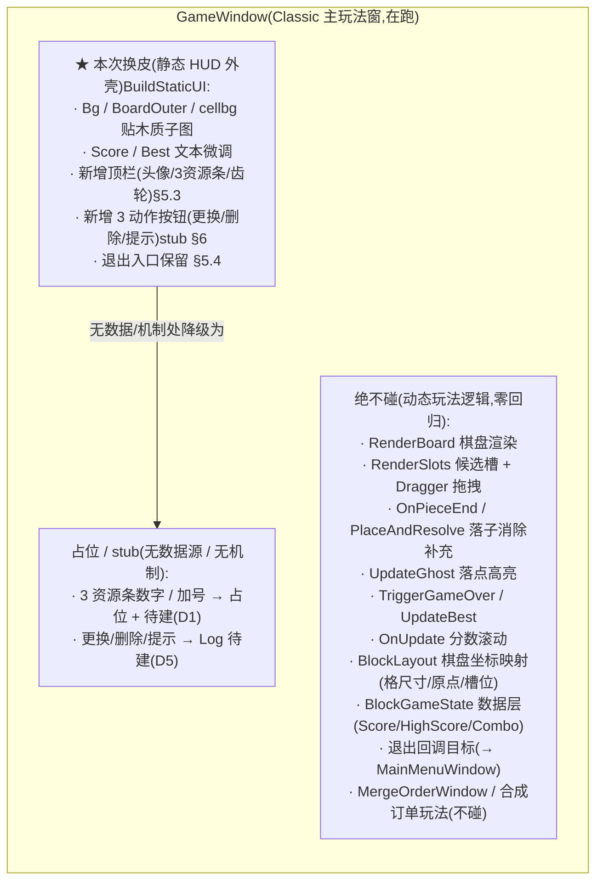

<style>
  /* 本篇专用：节点树 / 字段表 / 分流 / 对照小样式（沿用 23 / 25 / 26 口径） */
  pre.code { margin:8px 0; padding:12px; background:#0d1622; border:1px solid var(--border); border-radius:8px; overflow:auto; font-size:13px; line-height:1.55; }
  table.tight td, table.tight th { padding:6px 10px; }
  .pill-new { display:inline-block; font-size:11px; padding:1px 7px; border-radius:10px; background:rgba(91,214,160,.16); color:#5bd6a0; margin-left:6px; }
  .pill-cur { display:inline-block; font-size:11px; padding:1px 7px; border-radius:10px; background:rgba(108,140,255,.16); color:#6c8cff; margin-left:6px; }
  .pill-no  { display:inline-block; font-size:11px; padding:1px 7px; border-radius:10px; background:rgba(255,122,138,.16); color:#ff7a8a; margin-left:6px; }
  .yes { color:#5bd6a0; font-weight:bold; }
  .no  { color:#ff7a8a; font-weight:bold; }
  td.mono, code.mono { font-family:ui-monospace,Consolas,monospace; }
  .tree { font-family:ui-monospace,Consolas,monospace; font-size:12.5px; line-height:1.6; white-space:pre; background:#0d1622; border:1px solid var(--border); border-radius:8px; padding:12px; overflow:auto; }
  .diagram { margin:12px 0; padding:12px; background:#0d1622; border:1px solid var(--border); border-radius:8px; overflow:auto; }
</style>

# 主玩法 HUD 美术换皮 · 表现层

塔罗 UI 换皮自治线**第四屏（centerpiece，风险最高）**:把效果图 `tarot_mode.png` 换皮成<mark>已在运行的 Classic 主玩法窗 <code>GameWindow</code></mark> 的静态 HUD 外壳。<mark>本次换皮 = 纯 UI 补完（只换静态视觉壳）</mark>:棋盘渲染 / 落子拖拽 / 消除 / 补充 / ghost / GameOver 等动态玩法逻辑**一行不动**,只把 `UGuiFactory` 的纯色背景 / 棋盘外框 / 分数面板换成贴 `Sheet_tarot_mode` 木质子图,并对位效果图补出**静态顶栏（头像 + 3 资源条 + 齿轮）+ 3 动作按钮（更换 / 删除 / 提示）的视觉占位**。取图链路复用[设计 23](#23-settings-window-art)、换皮手法复用[设计 26 路 A](#26-settlement-window-art)(对在跑 code-built 窗的 `UGuiFactory` Image 链 `SetSubSprite`);**本屏是首个用<a href="#24-ui-atlas-packer">设计 24 打表工具</a>产新精灵表 `Sheet\_tarot\_mode` 的真实换皮屏**(前三屏复用 `Sheet_settings`,本屏有专属切图)。

> [!WARNING]
> **读前必看 · 五条边界（本屏触及在跑玩法窗，守「不破坏 Classic / Merge」是硬约束）**
>
> - **tarot_mode = Classic `GameWindow` 的再主题，不是合成订单 `MergeOrderWindow`。**(经读图 + 读代码核实,[§二](#27-tarot-mode-hud-art::which))效果图结构 = 8×8 棋盘 + 3 候选块 + 大居中分数 + **无订单卡 / 无合成区 / 无体力条**,与 `GameWindow.cs`(Classic,435 行)逐项匹配;`MergeOrderWindow.cs`(799 行)有双订单卡 / 合成 token 行 / 体力条 / 虔诚币 / 神庙 / 盲盒,效果图全无。**本次换皮只改 `GameWindow.cs` 的 `BuildStaticUI` 视觉部分**,不碰 `MergeOrderWindow`。
> - **动态玩法逻辑绝不碰，只 reskin 静态 HUD 外壳。**棋盘渲染(`RenderBoard`)/ 候选槽(`RenderSlots`)/ 落子拖拽回调(`OnPieceBegin/Drag/End`)/ 消除补充(`PlaceAndResolve`)/ ghost 高亮(`UpdateGhost`)/ GameOver(`TriggerGameOver`)/ 分数滚动(`OnUpdate`)/ `BlockLayout` 棋盘坐标映射 —— 全部**保留不动**。本次换皮只动 `BuildStaticUI` 里「背景 / 棋盘外框 / 格子背景 / 分数面板 / 退出钮」这些**静态视觉构建行**,以及新增静态顶栏 / 动作按钮节点([§九 R 组](#27-tarot-mode-hud-art::regress)零回归硬验收)。
> - **顶栏 3 资源条 + 3 动作按钮（更换/删除/提示）= 视觉占位 + stub 钩子，不是真机制。**Classic `GameWindow` 的数据层 `BlockGameState` 经 grep 只有 `Score` / `HighScore` / `Combo`([§三](#27-tarot-mode-hud-art::data)),**没有体力 / 货币 / 钻石等资源字段**,也**没有「更换候选块 / 删除棋子 / 提示落点」这三个新机制**。本次换皮:3 资源条接得上的字段就接(分数 / 最高分),接不上就摆数字占位;3 动作按钮摆视觉 + 点击给 `Log`「待建」+ TODO,**真机制是新玩法功能、本范围外**([§六](#27-tarot-mode-hud-art::stub))。
> - **取路 A（轻量换皮），不取路 B（prefab 重构）。**同[设计 26 §三](#26-settlement-window-art::way):`GameWindow` 已用 `UGuiFactory` 跑通,`CreateImage` 返回 `Image` 可直接链 `.SetSubSprite`、`CreateButton` 经 `out Image bgImage` 给按钮底图引用。保留窗口结构 + 全部玩法逻辑,只换静态视觉。**不**改成 prefab + `FindChildComponent`(重写在跑的核心玩法窗 = 回归面最大,与「纯 UI 补完」相悖)。
> - **本屏首次用打表工具产新精灵表，UI 代码在热更区。**16 张切图(`塔罗模式\`)→ 导入 ASCII 目录 `AssetRaw/UIRaw/Atlas/tarot_mode/` → 跑[设计 24 打表工具](#24-ui-atlas-packer)产 `Sheet_tarot_mode.png` → 运行期 `SetSubSprite("Sheet_tarot_mode", 子图名)` 取图([§四](#27-tarot-mode-hud-art::atlas))。`GameWindow.cs` 在 `GameScripts/HotFix/GameLogic/UI/BlockBlastUI/`(热更),本次换皮只改它一个 `.cs` 的视觉部分 + 新增切图 / 精灵表资源。**不动数据层、不动 MergeOrderWindow、不动收集器**。

> [!NOTE]
> **立项信息**
>
> | 项 | 内容 |
> | --- | --- |
> | **类型** | 表现层换皮 · 塔罗 UI 自治线第 4 屏（centerpiece）· 纯 UI 补完（只换静态视觉壳） 复用设计 23 取图链路 + 设计 26 路 A 手法 + 设计 24 打表工具,给在跑 Classic 主玩法窗换静态 HUD 皮。出设计稿 + 验收标准,交开发落地。 |
> | **设计基线（经 grep / 读图核实的真实符号 / 现状）** | **被换皮窗口（code-built，本次换皮只改静态视觉，玩法逻辑不动）**:`GameLogic.BlockBlastUI.GameWindow`(`[Window(UILayer.UI, "GameWindow", fullScreen:true)]`,435 行)。 **静态视觉构建（本次换皮改这里）**:`BuildStaticUI()`(:86–132)摆 `Bg` 全屏背景(纯色 `BlockLayout.BgColor`)、`BoardOuter` 棋盘外框(`BoardOuterColor`)、64 个 `cellbg_r_c` 格子背景(`BoardCellBgColor`)、`BestLabel`+`Best` 最高分文本、`Score` 大分数文本、`Exit` 退出钮(透明底 "×")。 **动态玩法逻辑（本次换皮绝不动）**:`RenderBoard`(:147)逐格贴 `BlockLayout.ColorOf` 方块色;`RenderSlots`(:177)建 3 候选槽 + `BlockPieceDragger` 拖拽;`OnPieceEnd`(:248)+ `PlaceAndResolve`(:274)落子 / 消除 / 补充 / 弹字 / GameOver;`UpdateGhost`(:340)落点高亮;`InitGhostPool` / `ComputeGridPos` / `UpdateBest` / `OnUpdate` 分数滚动。 **数据层（grep 核实，本次换皮只读不写）**:`GameLogic.BlockBlast.BlockGameState`(`SimpleSingleton`)字段仅 `SaveArr`(棋盘)/ `OperaArr`(3 候选块)/ `Score`(当前分)/ `HighScore`(Classic 最高分)/ `Combo`(连击)+ merge-order 门控字段(`ElementArr`/`MergeOrderMode`/`MergeState`,Classic 下不用)。**无体力 / 货币 / 钻石 / 心 / 提示次数等资源字段**。 **构建工厂 + 坐标系（本次换皮沿用）**:`UGuiFactory.CreateImage(parent,name,designCx,designCy,w,h,color)` → 返回 `Image`(可链 `.SetSubSprite`);`CreateButton(...,out Image bgImage,out Text label)` → `out bgImage` 即按钮底图;`CreateContentPanel` 建 750×1334 固定面板 localScale 放大到 1080 参考宽(`BlockLayout.ContentScale`)。坐标 = **750×1334 设计系**(左上原点 Y 下正,经 `DesignToAnchored` 转锚点);棋盘原点 / 格尺寸 / 候选槽位由 `BlockLayout` 常量定(本次换皮不动)。 **取图 API（设计 23 实测打通）**:`Image.SetSubSprite(string location, string spriteName)`(`SetSpriteExtensions.cs:43`);`location="Sheet_tarot_mode"`(本屏打表产出的单张 Multiple 精灵表,**非 SpriteAtlas v2** —— v2 不向 YooAsset 暴露子精灵,设计 23 §3.3 实测),子图名 = 源切图文件名。 **打表工具（设计 24 已落地）**:`UIAtlasPackerTool.UIAtlasPacker.Pack(string folderPath, bool simulateBuild=true)`(`Assets/Editor/UIAtlasPacker/UIAtlasPacker.cs:92`);菜单 `Tools/UI/打表(散切图 -> Multiple 精灵表)`(:31,选中目录后点);产出落 `Assets/AssetRaw/UIRaw/Atlas/`,**不覆盖已存在文件**。 **本屏切图源（16 张，`C:\Users\pc\Downloads\塔罗\塔罗\塔罗模式\`）**:`Rectangle` · `advertisement` · `blue` · `chess` · `chessboard` · `gemstone` · `gemstone2` · `hammer` · `icon_setting` · `image` · `magic_book` · `mask` · `potion` · `resourcebar2` · `tarot_mode` · `temple`。子图名 = 文件名去扩展名([§4.3](#27-tarot-mode-hud-art::map) 给映射推断)。 |
> | **方向约束** | 离线还原 · **去变现**:主玩法 HUD 无内购 / 资源购买 / 看广告(效果图顶栏资源条带「+」加号是**视觉占位**,本次换皮点击 → `Log`「待建」,**不接任何购买 / 充值**);切图里 `advertisement`(广告)子图不投放([§十 D3](#27-tarot-mode-hud-art::open))。加法 / 改既有都最小:只改 `GameWindow.cs` 静态视觉构建 + 新增切图 / 精灵表,不改框架、不改数据层、不改任何玩法逻辑。 |
> | **影响范围** | **新增资源**:切图 16 张(`AssetRaw/UIRaw/Atlas/tarot_mode/`,ASCII 目录)+ 打表产出 `Sheet_tarot_mode.png` + `.meta`(落 `AssetRaw/UIRaw/Atlas/`,被收集器 `UIRaw` 组自动收录)。 **新增代码**:**无新文件 / 无新窗口类**(路 A 不重构)。 **改既有（最小，仅静态视觉）**:`GameWindow.cs` 的 `BuildStaticUI` —— 背景 / 棋盘外框 / 格子背景 / 分数文本区改贴 `Sheet_tarot_mode` 子图 + 底色白;新增静态顶栏(头像 + 3 资源条 + 齿轮)+ 3 动作按钮(更换 / 删除 / 提示)节点 + stub 钩子。 **不改**:`GameWindow` 的所有 `Render*` / 拖拽 / 落子 / 消除 / ghost / GameOver / `OnUpdate` 逻辑;`BlockLayout` 棋盘坐标映射;`BlockGameState` / `MergeOrderState` 数据层;`MergeOrderWindow` / Classic 触发链;收集器配置;打表工具本身。 |
> | **关键约束（零回归是硬验收）** | 这是**正在被玩家用来玩 Classic 的核心玩法窗**。换皮后:① 编译 0 error + 现有 EditMode 全绿;② Classic 整局可进可玩 —— 摆块 / 落子 / 消除 / 连击弹字 / 补块 / GameOver / 分数滚动 / 最高分全部正常,棋盘坐标对位不偏;③ 合成订单 `MergeOrderWindow` 完全不受影响(本次换皮不碰它,门控独立)。任一玩法回归即不通过。视觉对位 / 真机拖拽落子须 Play / 人眼手验([§九](#27-tarot-mode-hud-art::accept)两档拆开)。 |

## 一、做什么与为什么 {#what}

现状:Classic 主玩法窗 `GameWindow` <mark>已实装且在跑</mark> —— 玩家从主菜单进 Classic 就是它:8×8 棋盘 + 3 候选块 + 大分数 + BEST,全是 `UGuiFactory` 的纯色木纹色块 + 内置字体,零美术。前三屏换皮([设置窗](#23-settings-window-art) / [个人信息窗](#25-player-info-window-art) / [结算窗](#26-settlement-window-art))已把塔罗木质风格铺到弹窗与结算,但**玩家停留时间最长的主玩法界面仍是纯色占位** —— 这是整条换皮线的 centerpiece。

给主玩法 HUD 换上塔罗木质皮。**与前三屏的两点差异**:① 它触及<mark>核心玩法窗</mark>(前三屏是弹窗 / 结算,玩死才弹;主玩法窗每局全程在跑),「不破坏 Classic」的零回归约束最重;② 它是<mark>首个有专属切图、要用打表工具产新精灵表的换皮屏</mark>(前三屏复用 `Sheet_settings`),把[设计 24 打表工具](#24-ui-atlas-packer)从「只验过 `setting/`」推到「真实生产一屏」。

| # | 本次换皮交付的 | 落法 | 性质 |
| --- | --- | --- | --- |
| 1 | 切图导入 + 打表产 `Sheet_tarot_mode` | 16 张切图导入 ASCII 目录 `tarot_mode/` → 跑设计 24 打表工具 → 产 `Sheet_tarot_mode.png`([§四](#27-tarot-mode-hud-art::atlas)) | <span class="pill-new">新精灵表（首用打表工具产）</span> |
| 2 | `GameWindow` 静态 HUD 换皮(对位 tarot\_mode.png) | 背景 / 棋盘外框 / 格子背景 / 分数面板改贴 `Sheet_tarot_mode` 木质子图 + 底色白([§五](#27-tarot-mode-hud-art::board)) | <span class="pill-cur">改既有静态视觉</span> |
| 3 | 静态顶栏(头像 + 3 资源条 + 齿轮)视觉占位 + 入口接线 | 新增静态节点对位顶栏;资源条接得上的接(分数 / 最高分)、接不上摆占位;齿轮 → 开设置窗([§5.3](#27-tarot-mode-hud-art::topbar)) | <span class="pill-cur">视觉占位 + 接线</span> |
| 4 | 3 动作按钮(更换 / 删除 / 提示)视觉占位 + stub 钩子 | 新增按钮节点 + 点击 → `Log`「待建」+ TODO,真机制本范围外([§六](#27-tarot-mode-hud-art::stub)) | <span class="pill-no">stub 占位</span> |

**不做（本次换皮明确排除）:**<span class="pill-no">改任何玩法逻辑</span>(棋盘渲染 / 落子 / 消除 / 补充 / ghost / GameOver / 分数滚动不动);<span class="pill-no">改 <code>BlockLayout</code> 棋盘坐标映射</span>(格尺寸 / 原点 / 候选槽位不动,防对位偏移);<span class="pill-no">真做更换 / 删除 / 提示机制</span>(新玩法功能,本范围外,stub);<span class="pill-no">给资源条接真货币 / 资源系统</span>(数据层无字段,占位);<span class="pill-no">改成 prefab 重构</span>(路 A 不重构);<span class="pill-no">动 MergeOrderWindow / 合成订单玩法</span>(本次换皮不碰);<span class="pill-no">投放广告 / 资源购买</span>(去变现)。

## 二、调查结论：tarot_mode = 哪个窗？（给证据） {#which}

简报要求读图 + 读代码核实 tarot\_mode.png 对应 `GameWindow`(Classic)还是 `MergeOrderWindow`(合成订单)。<mark>结论:Classic <code>GameWindow</code> 的再主题</mark>。逐项比对:

| 效果图 tarot\_mode.png 元素 | GameWindow（Classic，435 行） | MergeOrderWindow（合成订单，799 行） | 判定 |
| --- | --- | --- | --- |
| 8×8 棋盘 + 格子背景 | ✓ 64 个 `cellbg` + `RenderBoard` 逐格 | ✓ 同构(也有棋盘) | 两者都有 |
| 3 候选块（底部一行） | ✓ `RenderSlots` 建 3 槽 | ✓ 同构 | 两者都有 |
| 大居中分数（"23333"） | ✓ `Score` 大文本 84px 居中 + `OnUpdate` 滚动 | ✗ 无大居中分数(顶部是体力 / 完成单数 / 标题「合成订单 DEMO」) | **指向 GameWindow** |
| 订单卡 / 合成 token 行 / 体力条 | ✗ 无(Classic 无这些系统) | ✓ 双订单卡 + 合成 token 行 + 体力条 + 虔诚币 + 神庙 + 盲盒 | **效果图全无 → 指向 GameWindow** |
| 顶栏 3 资源条 + 头像 + 齿轮 | ✗ 当前只有 BEST + 大分数 + 退出 × | ✗ 当前是体力 / 单数 / 盲盒 / 虔诚币 / 神庙 / 悔棋 / 退出 | 两窗当前都无此顶栏(本次换皮新增静态占位) |
| 3 动作按钮（更换 / 删除 / 提示） | ✗ 无 | ✗ 无(有的是悔棋 / 开盒 / 交付,语义不同) | 两窗都无 → 新机制,本次换皮 stub 占位 |

**判定依据**:效果图<mark>有「大居中分数」、无「订单卡 / 合成区 / 体力条」</mark> —— 这正是 Classic `GameWindow` 的特征(大分数是它的核心 HUD,而合成订单窗顶部是体力 / 单数 / 标题、无大居中分数)。故 **tarot\_mode = Classic `GameWindow` 的再主题**,本次换皮改 `GameWindow.cs`。这也决定**回归面 = Classic 整局玩法**(合成订单窗本次换皮不碰,其门控 `MergeOrderMode` 独立、Classic 下短路)。

## 三、顶栏 3 资源条 = 什么？（对照数据层） {#data}

效果图顶栏自左到右:① 圆头像;② 3 个资源条(各显「12345」+ 末尾「+」加号);③ 右上齿轮。要判断 3 资源条各显什么、能否接真数据,须对照 Classic `GameWindow` 的数据层 `BlockGameState`。grep 核实其全部数值字段:

| `BlockGameState` 字段 | 语义 | 能否给资源条接 |
| --- | --- | --- |
| `Score` (int) | 当前局得分 | 已在大分数显示;不重复进资源条(也可作其一) |
| `HighScore` (int) | Classic 历史最高分 | ✓ 可接一条资源条(语义 = 最高分 / 奖杯) |
| `Combo` (int) | 连击数(瞬态,消除清零) | 瞬态、非「资源」语义,不接资源条 |
| — | <mark>无体力 / 金币 / 钻石 / 心 / 宝石 / 提示次数字段</mark> | 资源条要的「货币 / 资源」语义无数据源 |

> [!NOTE]
> **结论：3 资源条绑 PlayerAttrService 三属性(Coin / Diamond / Stamina)**
>
> Classic `BlockGameState` 只有得分语义字段(`Score` / `HighScore` / `Combo`),无三属性资源字段。但 Tier 2 真实玩家属性权威体系已在 [设计 37 服务端段](#37-player-attr-server) + [设计 38 客户端数据层](#38-player-attr-client) 落地三属性账本(金币 / 钻石 / 体力),客户端经 `GameContext.Instance.PlayerAttr`(`PlayerAttrService`)持有视图 + 订阅服务端推送实时刷新。HUD 顶栏 3 资源条绑这三属性([设计 42](#42-tarot-hud-player-attr-bind) 接续刀):**自左到右 = Coin / Diamond / Stamina**,数字位订阅 `PlayerAttrService.OnAttrChanged` 自动刷新,`IsReady=false`(快照未到)时显「—」非 0 不误导玩家。图标沿用现有切图 `gemstone / gemstone2 / potion` 占位对位(产品要专属图标另开 UI 抛光刀)。加号「+」点击保留为 `Log` 待建 + TODO,<mark>不接任何购买 / 充值入口</mark>(去变现红线);具体属性变更入口归各业务玩法刀(38 已接的改名扣钻 / 后续邮件领奖 / 兑换码到账 / 任务奖励等)。本节(D1)在设计 42 落地后由原「视觉占位」改写为现行的「绑三属性」现状。

## 三之补 · 效果图拆解（对位基准） {#effigy}

美术基准 `tarot_mode.png`(竖屏,扁平 PNG,木纹底)。自上而下:

| 区块 | 效果图内容 | 取图 / 处置 | 对应既有节点 |
| --- | --- | --- | --- |
| ① 窗口背景 | 木纹竖向背景(暖棕) | `chessboard` / `image` / `blue` 择木纹底者,或保既有纯色微调([§4.3](#27-tarot-mode-hud-art::map)) | ✓ `Bg`(换皮) |
| ② 顶栏头像 | 左上圆头像(双人占位图) | <mark>无头像数据源(Classic 无 PlayerInfo 接入)</mark> → 占位圆图(通用子图 / 纯色),或接 [设计 18](#18-player-info) 默认头像([§十 D2](#27-tarot-mode-hud-art::open)) | 新增静态(无既有对应) |
| ③ 顶栏 3 资源条 | 3 个木条:图标 + 「12345」+ 「+」加号 | `resourcebar2`(条底)+ `gemstone`/`gemstone2`/`potion`(图标)+ 文本 + 加号占位([§5.3](#27-tarot-mode-hud-art::topbar),<mark>无数据源 → 占位 D1</mark>) | 新增静态(部分接 HighScore) |
| ④ 顶栏齿轮 | 右上圆齿轮(设置入口) | `icon_setting` → 接 `ShowUIAsync<SettingsWindow>`([设计 23](#23-settings-window-art) 已建,**真接线**) | 替既有 `Exit` ×(见 [§5.4](#27-tarot-mode-hud-art::exit)) |
| ⑤ 大分数 | 顶栏下大白字「23333」 | 沿用既有 `Score` 大文本([§5.5](#27-tarot-mode-hud-art::digits):位图数字 `image` 为可选增强);字号 / 色对位效果图 | ✓ `Score`(保留 / 微调) |
| ⑥ 棋盘外框 + 格子背景 | 木质圆角外框 + 8×8 浅格 | `chess`(外框)+ `Rectangle` / `blue`(格底),或保既有纯色微调([§五](#27-tarot-mode-hud-art::board)) | ✓ `BoardOuter` + `cellbg_*`(换皮) |
| ⑦ 候选块（3 块） | 底部一行 3 候选方块(彩色) | <mark>动态生成,本次换皮不碰</mark>(`RenderSlots` + `BlockLayout.ColorOf` 纯色块保留) | ✓ 动态,保留不动 |
| ⑧ 3 动作按钮 | 底部 3 木条按钮「更换 / 删除 / 提示」 | `Rectangle`(条底)+ `magic_book`/`hammer`/图标 + 文本;<mark>新机制 → stub 占位</mark>([§六](#27-tarot-mode-hud-art::stub)) | 新增静态 + stub |

> [!NOTE]
> **切图与功能的对应须 dev 读图二次核实**
>
> 16 张切图的命名(`chess` / `chessboard` / `Rectangle` / `resourcebar2` / `magic_book` / `hammer` 等)与效果图各区块的对应,上表是<mark>按图名 + 缩略推断</mark>。dev 落地时对照 `tarot_mode.png` 与各子图缩略图逐一核实,把最终「子图名 → 区块」映射写进 `GameWindow.cs` 注释。子图名取**切图文件名(不含扩展名)**。

## 四、美术资产接入（首个用打表工具产新精灵表） {#atlas}

### 4.1 切图导入落点（ASCII 目录，避免中文 location） {#atlas-import}

把 `C:\Users\pc\Downloads\塔罗\塔罗\塔罗模式\` 的 16 张 PNG 导入工程,落点**用 ASCII 目录名**(中文目录会让 location / 子图名带中文,寻址 / git 易出问题):

```text
Assets/AssetRaw/UIRaw/Atlas/tarot_mode/        ← 新建 ASCII 子目录，16 张切图放这里
    Rectangle.png  advertisement.png  blue.png  chess.png  chessboard.png
    gemstone.png  gemstone2.png  hammer.png  icon_setting.png  image.png
    magic_book.png  mask.png  potion.png  resourcebar2.png  tarot_mode.png  temple.png
```

**导入设置**(每张):`Texture Type = Sprite (2D and UI)`、`Sprite Mode = Single`、`Mesh Type = Full Rect`;九宫格拉伸图(`resourcebar2` 资源条底 / `Rectangle` 按钮条底 / `chess` 棋盘外框)在源 PNG importer 设 `Border`(打表工具从源 `spriteBorder` 继承,设计 24 §四)。<mark>目录须在 <code>AssetRaw/UIRaw/Atlas/</code> 下</mark>(打表工具校验落点;不在该树下产出表不被收集器收录、寻址不到,设计 24 §2.2)。

### 4.2 跑打表工具产 Sheet_tarot_mode {#atlas-pack}

切图导入后,用[设计 24 打表工具](#24-ui-atlas-packer)(已落地)把 `tarot_mode/` 目录打成一张 Multiple 精灵表。两种跑法等价:

- **菜单**:Project 选中 `Assets/AssetRaw/UIRaw/Atlas/tarot_mode` 目录 → 点菜单 `Tools/UI/打表(散切图 -> Multiple 精灵表)`。
- **代码**:`UIAtlasPackerTool.UIAtlasPacker.Pack("Assets/AssetRaw/UIRaw/Atlas/tarot_mode")`。

产出 `Assets/AssetRaw/UIRaw/Atlas/Sheet_tarot_mode.png`(+ `.meta`),16 个命名子图(子图名 = 源文件名去扩展名),`spriteMode=Multiple` / pivot 居中 / border 从源继承 / `SimulateBuild` 重建模拟清单使运行期可寻址。落点在收集器 `UIRaw` 组(`AddressByFileName` + `PackDirectory`)已收录树下,<mark>无需改收集器</mark>,`location = "Sheet_tarot_mode"`。打表工具**不覆盖已存在文件**(设计 24);若 `Sheet_tarot_mode.png` 已存在(重跑),先删旧表再跑。

> [!NOTE]
> **dev 落地第一步：先验寻址跑通，再铺满整窗**
>
> 同<a href="#23-settings-window-art::atlas">设计 23</a> 经验:**打表后先在 Play 模式取任意一张子图显示出来**(如给棋盘外框贴 `chess`),确认 `SetSubSprite("Sheet_tarot_mode", "chess")` 取得到(`GetAssetInfo` 不返 invalid、子图非 null),再逐节点铺满。避免摆完整窗才发现寻址不通。设计 23 / 25 / 26 已实证 `Sheet_settings` 寻址链路通,本屏只是换一张新表(同范式),风险点收敛在「打表工具对 16 张新切图产出正确 + 新表能被 YooAsset 当 SubAssets 加载」—— 这正是本屏作为「首个用打表工具产新表的真实屏」要验的核心。

### 4.3 子图映射（dev 读图核实） {#map}

下表是<mark>按图名 + 缩略推断</mark>的映射。dev 落地对照 `tarot_mode.png` 与各子图缩略,把最终映射写进 `GameWindow.cs` 注释。

| 节点 / 区块 | 推断子图 | 说明 |
| --- | --- | --- |
| 窗口背景 `Bg` | `chessboard` / `image` / `blue` | 木纹底,择最贴效果图者;若无整屏背景图则保既有纯色微调 |
| 棋盘外框 `BoardOuter` | `chess` | 木质圆角外框(九宫格拉伸,border 从源继承) |
| 格子背景 `cellbg_*` | `Rectangle` / `blue` | 浅格底;64 个共用一张子图。<mark>若贴图导致逐格 64 张 Image 各加载子图开销 / 视觉杂,可只换外框 + 背景、格底保既有纯色</mark>([§5.2](#27-tarot-mode-hud-art::board) 取舍) |
| 资源条底 | `resourcebar2` | 3 条共用(九宫格拉伸) |
| 资源条图标 | `gemstone` / `gemstone2` / `potion` | 3 资源各一图标(占位,无数据源 D1) |
| 齿轮 | `icon_setting` | 设置入口(真接线 → SettingsWindow) |
| 动作按钮条底 | `Rectangle` | 3 按钮共用(九宫格) |
| 动作按钮图标 | `magic_book`(提示?) / `hammer`(删除?) / ?(更换) | dev 读图核实哪图标对哪按钮;无对位图标的用文本「更换 / 删除 / 提示」 |
| 头像 | `mask` / 占位圆 | 无头像数据源 → 占位(D2) |
| (不投放) | `advertisement` | 广告图,去变现方向不投放([§十 D3](#27-tarot-mode-hud-art::open)) |

## 五、GameWindow 静态 HUD 换皮（对位 tarot_mode.png） {#board}

逐节点对照既有 `GameWindow.BuildStaticUI`(:86–132)给「保留 / 换皮 / 新增 / 改」标注。<mark>玩法逻辑行(<code>Render\*</code> / 拖拽 / 落子 / ghost / GameOver / <code>OnUpdate</code>)一律保留不动</mark>,只动 `BuildStaticUI` 里的静态视觉构建。

### 5.1 既有静态节点逐项处置 {#board-existing}

| 既有节点（BuildStaticUI） | 本次换皮处置 | 具体改动 |
| --- | --- | --- |
| `Bg`(全屏背景纯色 `BgColor`) | 换皮 | 色改 `Color.white` + `bg.SetSubSprite(Atlas,"chessboard")`(或木纹底子图);若无整屏背景图则保纯色微调 |
| `BoardOuter`(棋盘外框纯色 `BoardOuterColor`) | 换皮 | 色改白 + `SetSubSprite(Atlas,"chess")`(木质外框,九宫格);<mark>位置 / 尺寸不动</mark>(`BlockLayout.BoardOriginX/Y` + `BoardPixels`,改了会偏移落子对位) |
| 64 个 `cellbg_r_c`(格底纯色 `BoardCellBgColor`) | 换皮 / 可选保纯色 | 可改白 + `SetSubSprite(Atlas,"Rectangle")`;<mark>位置 / 尺寸不动</mark>(`CellCenterDesign` + `CellSize`)。[§5.2](#27-tarot-mode-hud-art::board-cellbg):64 张逐格贴图若视觉杂 / 开销大,保既有纯色格底也可(外框 + 背景已足够换出木质风) |
| `BestLabel` + `Best`(最高分文本) | 保留 / 改位 | 文本逻辑不动(读 `_initialHigh` / `UpdateBest`);可挪进顶栏资源条之一([§5.3](#27-tarot-mode-hud-art::topbar)),字号 / 色对位效果图 |
| `Score`(大分数文本) | 保留 / 微调 | 文本逻辑不动(`OnUpdate` 滚动);字号 / 色 / 位置对位效果图(大白字居中)。位图数字 [§5.5](#27-tarot-mode-hud-art::digits) 可选增强 |
| `Exit`(退出钮 "×" 透明底) | 改 / 见 §5.4 | 效果图右上是齿轮不是 ×。<mark>退出入口须保留</mark>(否则无法离开主玩法窗回主菜单)—— [§5.4](#27-tarot-mode-hud-art::exit):齿轮接设置窗,退出钮另置或并入 |

### 5.2 棋盘换皮的取舍：外框必换，格底可选 {#board-cellbg}

棋盘是玩法核心区,换皮须<mark>绝对保位</mark>(落子靠 `BlockLayout` 坐标映射,外框 / 格底只是视觉底,坐标常量一动落子就偏)。两档:

| 方案 | 做法 | 取舍 |
| --- | --- | --- |
| **A. 外框 + 背景换皮，格底保纯色（默认推荐）** | `Bg` + `BoardOuter` 贴木质子图;64 个 `cellbg` 保既有 `BoardCellBgColor` 纯色(或微调更暖) | 改动最小、64 格无逐张贴图开销、木质风已出(外框 + 背景是视觉主体);取此为默认 |
| B. 连格底也换皮 | 64 个 `cellbg` 也 `SetSubSprite(Atlas,"Rectangle")` | 更贴效果图格纹,但 64 张 Image 各持子图引用、视觉可能杂;dev 视效果定,不强求 |

**取 A(默认)**:外框 + 背景换出木质风即达标,格底纯色不影响对位效果图整体观感,且零额外开销。<mark>无论 A / B,<code>BlockLayout</code> 的棋盘原点 / 格尺寸 / 候选槽位常量一律不动</mark>(动了落子对位偏移 = 玩法回归)。

### 5.3 新增静态顶栏（头像 + 3 资源条 + 齿轮） {#topbar}

效果图顶栏在既有 `GameWindow` 里**不存在**(它当前只有 BEST + 大分数 + ×)。本次换皮新增静态节点对位顶栏(头像 + 3 资源条 + 齿轮 + 退出钮),全是 `UGuiFactory.CreateImage` / `CreateButton` 摆在 `_content` 上(750 设计系坐标);**3 资源条数字位绑 `GameContext.Instance.PlayerAttr` 三属性**(Coin / Diamond / Stamina,自左到右,见[设计 42](#42-tarot-hud-player-attr-bind))订阅 `OnAttrChanged` 实时刷新,`IsReady=false` 显「—」加载中态;头像占位无数据源(D2);齿轮真接 [设计 23 设置窗](#23-settings-window-art);加号 `Log` 待建去变现(D1)。

**接线行为(行为级,代码层 dev 现场定位)**:

| 步 | 行为 | 落点 |
| --- | --- | --- |
| 1 | 头像 `CreateImage` 贴 `mask` 占位(D2) | `BuildTopBar` |
| 2 | 3 资源条:`CreateImage` 条底 `resourcebar2` + 图标 `gemstone/gemstone2/potion`(默认对位 Coin/Diamond/Stamina)+ 数字 `CreateText` 初值「`IsReady ? Attr.<Type> : "—"`」 + 加号 `Log` 待建 | `BuildTopBar` |
| 3 | 保存 3 数字 `Text` 引用(`_resNumCoin / _resNumDiamond / _resNumStamina`) | `GameWindow` 字段 |
| 4 | `Attr.OnAttrChanged += OnAttrChangedDispatch`(null-safe);分发按 type 刷对应 `Text`(All → 三条全刷) | `BuildTopBar` 末 |
| 5 | 窗销毁/关闭钩子内 `Attr.OnAttrChanged -=` 解绑(防泄漏,沿 `PlayerInfoWindow` 范式) | 销毁/关闭钩子 |
| 6 | 齿轮 `CreateButton` 贴 `icon_setting` + `onClick → ShowUIAsync<SettingsWindow>` | `BuildTopBar` |
| 7 | 退出钮 `CreateButton`「×」+ `onClick → CloseUI<GameWindow> + ShowUIAsync<MainMenuWindow>`(回调一字不改,R4)| `BuildTopBar`(见 §5.4) |

> [!NOTE]
> **本节(资源条数据接入)与本篇换皮的关系**
>
> 本篇([设计 27](#27-tarot-mode-hud-art))最初交付的资源条是「视觉占位 + 第 1 条接 HighScore」,因当时无三属性账本。Tier 2 服务端段(37) + 客户端数据层(38) + HUD 接续刀(42)落地后,资源条已升级为绑 `PlayerAttrService` 三属性的现状(沿 conventions §6 覆盖式重写本节为现状)。HighScore 显示位已挪到大分数下方独立 `Best` 文本(见 §5.1),不在顶栏挤位。

### 5.4 退出入口须保留（效果图无 ×，但不能丢退出） {#exit}

既有 `Exit` 钮("×")是<mark>玩家离开主玩法窗回主菜单的唯一入口</mark>(回调 `CloseUI<GameWindow>` + `ShowUIAsync<MainMenuWindow>`)。效果图右上是齿轮(设置)而非 ×。处置:

- **默认**:齿轮接设置窗(§5.3);<mark>退出钮保留</mark>但挪位(如齿轮左侧小返回钮,或顶栏头像旁),回调**一字不改**。不能因对位效果图把退出入口删掉(否则进了 Classic 出不来)。
- **备选**:设置窗里本就有「返回主菜单 / 退出」路径(设计 23),若产品确认「主玩法只留齿轮、退出走设置窗」,则退出钮可并入设置窗 —— 但本次换皮安全默认**保留独立退出钮**(改动小、不依赖设置窗有退出项),退出交互归属列 [§十 D4](#27-tarot-mode-hud-art::open) 交 boss。

### 5.5 分数数字：默认沿用 Text，位图为可选增强 {#digits}

同[设计 26 §4.4](#26-settlement-window-art::digits):**默认**大分数 / 资源条数字沿用既有 `UGuiFactory.CreateText`(内置字体,零依赖、已在跑),换皮只改字号 / 色对位效果图。切图 `image` 若是位图数字条,要用须先确认它是「单张含 0–9 的精灵 / 或已是子图」并逐位拼,<mark>属额外工作量、非本次换皮必需</mark>,列可选增强([§十 B2](#27-tarot-mode-hud-art::open))。**取默认 Text**(安全默认):分数视觉够用,先把换皮主体落地。

## 六、3 动作按钮（更换 / 删除 / 提示）= 视觉占位 + stub 钩子 {#stub}

效果图底部一行 3 木条按钮「更换 / 删除 / 提示」。这是<mark>三个新玩法机制</mark>,Classic `GameWindow` 与数据层 `BlockGameState` 均无:

| 按钮 | 推测机制 | 现状（grep 核实） | 本次换皮处置 |
| --- | --- | --- | --- |
| **更换** | 更换当前 3 候选块(花资源重摇) | 无(`RefillPieces` 是落完自动补,无手动重摇 + 无资源扣费) | 视觉占位 + stub |
| **删除** | 删除棋盘某棋子 / 某候选块(花资源) | 无(无单格删除机制) | 视觉占位 + stub |
| **提示** | 高亮一个可行落点(花资源 / 次数) | 无(有 `UpdateGhost` 拖拽时高亮,但无「主动求提示」) | 视觉占位 + stub |

**处置**:新增 3 按钮节点(`Rectangle` 条底 + 图标 + 文本),点击调统一 stub:

```text
// BuildStaticUI 末尾新增（3 动作按钮，stub 钩子）
string[] actions = { "更换", "删除", "提示" };
for (int i = 0; i < 3; i++) {
    float cx = 130 + i * 245;
    var btn = UGuiFactory.CreateButton(_content, $"Action_{i}", cx, 1245, 220, 110,
        actions[i], 32, Color.white, Color.white, out var btnBg, out _);
    btnBg.SetSubSprite(Atlas, "Rectangle");
    int captured = i;
    btn.onClick.AddListener(() => Log.Info($"[GameWindow] 动作按钮「{actions[captured]}」：待建（新玩法机制，设计27 §六）"));
    // TODO(设计27 §六)：更换/删除/提示是新玩法功能，真机制本范围外，待产品定义后另开轮
}
```

> [!WARNING]
> **stub 不等于无反馈，但绝不碰玩法逻辑**
>
> 3 按钮点击要有「待建」`Log`(或 Toast),不能死按钮;但<mark>绝不在本次换皮顺手实现「更换 / 删除 / 提示」机制</mark> —— 那要动 `OperaArr` / `SaveArr` / 资源扣费 + 落子合法性,溢出「纯 UI 补完」、且会改玩法逻辑(违零回归)。真机制是独立新玩法功能,待产品定义(花什么资源 / 几次 / 规则)后另开轮(<a href="#27-tarot-mode-hud-art::open">§十 D5</a>)。本次换皮只摆视觉 + 留接线点。

## 七、换皮范围与零回归边界（结构图） {#flow}

下图标出 `GameWindow` 哪些部分本次换皮(静态 HUD)、哪些绝不碰(动态玩法)。给 dev / test 作零回归核对基准。

> ★ 换皮只动 `BuildStaticUI` 视觉构建行 + 新增静态节点;所有 `Render*`/拖拽/落子/坐标映射保留不动。资源条加号 / 动作按钮一律占位 stub,绝不在本次换皮实现真机制或接购买(去变现 + 纯 UI 补完)。



## 八、dev 改动清单 {#hook}

符号名经 grep / 读图核实(真实存在标「✓」)。<mark>本次换皮无新代码文件、无新窗口类</mark>,只改一个在跑窗口的静态视觉构建 + 新增切图 / 精灵表资源。

| # | 文件 / 资源 | 动作 | 说明 |
| --- | --- | --- | --- |
| 1 | 切图 16 张 → `AssetRaw/UIRaw/Atlas/tarot_mode/` | 新增(ASCII 目录) | §4.1;源 `塔罗\塔罗模式\`;每张设 Sprite/Single/FullRect,九宫格图设 Border |
| 2 | `Sheet_tarot_mode.png` + `.meta` | 打表产出 | §4.2;跑 `UIAtlasPacker.Pack(".../tarot_mode")` 或菜单;落 `AssetRaw/UIRaw/Atlas/`,收集器自动收 |
| 3 | ✓ `HotFix/GameLogic/UI/BlockBlastUI/GameWindow.cs` | 改 `BuildStaticUI` 视觉 | §五 / §六;`Bg`/`BoardOuter`(/`cellbg`)贴子图 + 底色白;新增顶栏(头像 / 3 资源条 / 齿轮)+ 3 动作按钮 + stub;齿轮接 `ShowUIAsync<SettingsWindow>`;退出入口保留。<mark>所有 Render\*/拖拽/落子/ghost/GameOver/OnUpdate/BlockLayout 不动</mark> |
| 4 | 测试:`Assets/Editor/Tests/...` GameWindow 静态换皮回归 | 新建 / 补 | §9.1 R 组:静态核对玩法逻辑行未改 + 编译 0 error |
| — | ✓ `BlockLayout.cs` | **不改** | 棋盘原点 / 格尺寸 / 候选槽位 / 坐标映射常量不动(动了落子对位偏移 = 玩法回归) |
| — | ✓ `BlockGameState.cs` / `MergeOrderState.cs` | **不改** | 不动数据层;不为资源条 / 动作按钮加字段 |
| — | ✓ `MergeOrderWindow.cs` | **不改** | 合成订单玩法本次换皮不碰(门控独立,Classic 下短路) |
| — | ✓ 收集器 `AssetBundleCollectorSetting.asset` | **不改** | `Sheet_tarot_mode` 落已收录 `UIRaw/Atlas` 树,自动收 |

## 九、验收点 {#accept}

拆两档:**回归（硬：不破坏对应玩法 + Classic + Merge，编译零回归）**与 **视觉（Play 对位 tarot\_mode.png + 切图贴对 + 玩法仍可进可玩）**。<mark>回归是本次换皮硬验收</mark>(主玩法窗在跑)。

### 9.1 回归 / 编译（EditMode + 静态核对，硬验收） {#regress}

| 组 | # | 验收点（完成定义） |
| --- | --- | --- |
| 编译 C | C1 | `GameWindow.cs` 编译 0 error;现有 EditMode 全绿(零回归) |
| 编译 C | C2 | Code Review 5 红线:资源释放(`SetSubSprite` 自管引用计数,无裸 `LoadAssetAsync<Sprite>`)/ 热更边界(`GameWindow` 在 HotFix)/ 事件解耦(按钮 onClick)/ 模块访问(`GameModule.UI`)/ 异步优先(取图走 SetSubSprite 异步外壳) |
| 零回归 R （硬） | R1 | **玩法逻辑行未改**:静态核对 `RenderBoard` / `RenderSlots` / `OnPieceBegin/Drag/End` / `PlaceAndResolve` / `UpdateGhost` / `InitGhostPool` / `ComputeGridPos` / `TriggerGameOver` / `UpdateBest` / `OnUpdate` 与换皮前逐行一致(只 `BuildStaticUI` 视觉部分变) |
| 零回归 R （硬） | R2 | **棋盘坐标映射未改**:`BlockLayout` 的 `BoardOriginX/Y` / `BoardPixels` / `CellSize` / `CellCenterDesign` / `SlotCenterX` / `SlotY` / `SlotSpacing` 等常量未动(换皮节点的 position/size 沿用既有值);落子 grid 计算路径不变 |
| 零回归 R （硬） | R3 | **数据层未改**:`BlockGameState` 无新增字段;`OperaArr` / `SaveArr` / `Score` / `HighScore` / `Combo` 读写路径不变;资源条 / 动作按钮未往数据层加任何状态 |
| 零回归 R （硬） | R4 | **退出回调目标未改**:退出入口回调仍 `CloseUI<GameWindow>` + `ShowUIAsync<MainMenuWindow>`(代码静态核对);齿轮新增的 `ShowUIAsync<SettingsWindow>` 是叠层、不关本窗、不丢局 |
| 零回归 R （硬） | R5 | **合成订单玩法不受影响**:`MergeOrderWindow.cs` 本次换皮未改(git diff 仅 `GameWindow.cs` + 资源);`MergeOrderMode` 门控独立,Classic 换皮不触碰合成订单分支 |

> [!WARNING]
> **R 组怎么 test：以静态核对 + 编译为主**
>
> `GameWindow` 的玩法依赖 `BlockGameState.Instance` 运行期单例 + `UIWindow` 生命周期 + 拖拽指针事件,EditMode 反射驱动 `OnCreate` / 模拟拖拽落子成本高。<mark>R 组主验收 = 编译 0 error(换皮未破坏类型 / 调用)+ test 逐条静态核对</mark>:① 所有 `Render*` / 拖拽 / 落子 / ghost / GameOver / `OnUpdate` 逻辑行未改;② `BlockLayout` 坐标常量未改;③ 数据层无新字段;④ 退出回调目标未改;⑤ git diff 仅 `GameWindow.cs` 视觉部分 + 资源。这是「视觉换皮不碰玩法」的可核对证据。R1–R5 是硬验收 —— 任一处玩法逻辑被改即不通过(换皮越界)。**整局可玩**(摆块→落子→消除→连击→补块→GameOver→分数滚动)须 Play / 人眼手验(MCP 不能模拟拖拽落子),归 §9.2 V4。

### 9.2 视觉对位 / 真机（需 Play / 人眼，手验遗留） {#accept-play}

| # | 验收点 | 能否 MCP 截图 |
| --- | --- | --- |
| V1 | <mark>打表 + 切图经 SetSubSprite 正常显示</mark>:`Sheet_tarot_mode` 打表产 16 子图、运行期取得到(背景 / 棋盘外框 / 资源条 / 齿轮 / 动作按钮贴上木质子图)。证明打表工具产新表 + 寻址链路在主玩法屏也通(本屏核心) | 可 ShowUIAsync + 截图(核心) |
| V2 | **对位 tarot\_mode.png**:顶栏(头像 + 3 资源条 + 齿轮)+ 大分数 + 木质棋盘外框 + 8×8 + 3 候选块 + 底部 3 动作按钮(更换 / 删除 / 提示),版面接近效果图 | 可 ShowUIAsync + 截图比对 |
| V3 | **棋盘对位不偏**:换皮后落子 ghost / 已落方块仍精确贴 8×8 格(坐标映射未受换皮影响);候选块在底部正确位 | 截图可看静态对位;拖拽落子手验 |
| V4 | **Classic 整局可进可玩（零回归实玩）**:从主菜单进 Classic → 摆块 / 落子 / 消除 / 连击弹字 / 补块 / GameOver / 分数滚动 / 最高分全部正常 | 玩到整局须真机 / 手验(MCP 不模拟拖拽落子) |
| V5 | **齿轮 / 退出 / 加号 / 动作按钮交互**:齿轮 → 开设置窗(不丢局);退出 → 回主菜单;加号 / 更换 / 删除 / 提示 → Log 待建(不报错、不动玩法) | 点击须真机 / 手验(MCP 不模拟点击) |
| V6 | 资源条占位 / 动作按钮 stub 不报错、不挡棋盘 / 候选块 / 落子区、不穿帮 | 可截图核版面 |
| V7 | **合成订单窗不受影响**:从主菜单进合成订单 → 正常(本次换皮未碰) | 可 ShowUIAsync 截图 + 手验 |

## 十、待拍板清单（范围开关，交 boss / 用户） {#open}

自治模式。有安全默认的按默认推进(记 decisions 供 boss 关单复核);<mark>无安全默认 / 抵触 spec / 不可逆</mark>的才入 blockers。下表均有安全默认 → **不入 blockers**。

| # | 开关 | 本次换皮默认（安全默认） | 备选 / 改动触发 |
| --- | --- | --- | --- |
| **D1** | 顶栏 3 资源条数据源 / 图标 / 加号行为 | **绑 PlayerAttrService 三属性 + 图标占位 + 加号去变现**([§5.3](#27-tarot-mode-hud-art::topbar) + [设计 42](#42-tarot-hud-player-attr-bind))—— Coin/Diamond/Stamina 自左到右,订阅 OnAttrChanged 实时刷新;图标沿用 gemstone/gemstone2/potion 占位对位,IsReady=false 显「—」;加号保留 `Log` 待建(去变现不接购买) | 产品要专属三属性图标(真金币 / 真钻石 / 真闪电心)→ 美术新切图 + 重跑打表 + 替图,另开 UI 抛光刀(超 27 + 42 接线范围,不阻塞);加号变购买入口违去变现红线,若产品方向变需另开新设计 |
| **D5** | 3 动作按钮(更换 / 删除 / 提示)真机制 | **stub 占位**([§六](#27-tarot-mode-hud-art::stub))—— 摆视觉 + 点击 Log 待建 + TODO;真机制本范围外 | 更换 / 删除 / 提示是新玩法功能(花什么资源 / 几次 / 规则未定),产品定义后另开轮真做。<mark>本次换皮不实现(违纯 UI 补完 + 零回归)</mark> |
| D2 | 顶栏头像数据源(Classic 无 PlayerInfo 接入) | **占位圆图**(用 mask / 通用子图)—— 不为头像把 PlayerInfo 接进 Classic `GameWindow` | 若要真头像:接 [设计 18](#18-player-info) 默认头像(`GameContext.Instance.Player`),属接数据层、可后续做 |
| D3 | 切图 `advertisement`(广告)是否投放 | **不投放**([§4.3](#27-tarot-mode-hud-art::map))—— 去变现方向,不接广告 | 切图自带但本次换皮不用;若产品要广告位则违去变现方向,须 boss 拍(默认不投) |
| D4 | 退出入口归属(独立退出钮 vs 并入设置窗) | **保留独立退出钮**([§5.4](#27-tarot-mode-hud-art::exit))—— 挪位但回调不改,不依赖设置窗有退出项 | 产品若定「主玩法只留齿轮、退出走设置窗」则可并入(但设置窗须有退出主菜单项);默认保独立钮更稳 |
| B1 | 棋盘格底是否换皮(64 格) | **外框 + 背景换皮，格底保纯色**([§5.2](#27-tarot-mode-hud-art::board-cellbg) 方案 A) | dev 视效果可连格底也换(方案 B);视觉为准,坐标常量一律不动 |
| B2 | 大分数 / 资源条数字是否用位图数字 | **沿用 Text**([§5.5](#27-tarot-mode-hud-art::digits))—— 零依赖够用 | 要位图数字须先确认 `image` 切图是数字条并逐位拼,额外工作量,后续增强 |
| B3 | 背景 / 棋盘外框 / 各底用哪张子图 | dev 读图选最贴效果图者([§4.3](#27-tarot-mode-hud-art::map) 推断 chessboard/chess/Rectangle/resourcebar2) | 视觉为准,dev 落地核实 |

> [!NOTE]
> **自治分流说明**
>
> D1–B3 均有安全默认、可逆、不抵触 spec / GDD 主线(去变现 · 离线还原方向)→ 按 plan 红线**取默认推进、记 decisions、不入 blockers**(不停机)。其中 **D1**(资源条语义)与 **D5**(动作按钮机制)是最值得 boss / 产品复核的两项 —— 安全默认都是占位 / stub,真做需产品定义资源 / 机制含义,但<mark>本次换皮不因它们停机</mark>(占位 + stub 即可交付完整静态壳换皮)。**本次换皮无「无安全默认 / 抵触 GDD / 不可逆」的方向问题 → blockers 为空。**

## 十一、风险表 {#risk}

| 风险 | 应对 |
| --- | --- |
| **换皮越界改了玩法逻辑**:dev 在改视觉时顺手动了 `Render*` / 落子 / ghost / GameOver / `OnUpdate`,造成 Classic 整局回归(主玩法窗在跑,这是本次换皮第一风险) | §五逐节点标「玩法逻辑行保留不动」;§7 结构图明分换皮区 / 不碰区;§9.1 R 组硬验收逐条静态核对 + git diff 仅 `GameWindow.cs` 视觉;§八清单明列「不改」项 |
| **动了 BlockLayout 坐标常量致落子对位偏移**:为对位效果图改了棋盘原点 / 格尺寸 / 候选槽位,落子 / ghost 不再贴格 | §5.2 / R2:换皮节点 position/size 沿用既有 `BlockLayout` 值,坐标常量一律不动;V3 Play 验落子对位不偏 |
| **为对位捏造资源 / 机制**:dev 为摆 3 资源条 / 3 动作按钮去加货币字段 / 实现更换删除提示,溢出范围 + 动逻辑 | §三 D1 / §六 D5:资源条 / 动作按钮是占位 + stub,不绑数据 / 不实现机制;真做须产品定义后另开轮 |
| **贴图后被纯色 Image.color 染暗**:沿用既有 `CreateImage` 深色却又贴子图,木纹被染黑 | §5.1:换皮节点 `color` 改 `Color.white` 让木纹原色透出;按钮 `bgColor` 同改白(同设计 26 经验) |
| **打表工具对 16 张新切图产出异常**:首次用打表工具产新表,可能遇九宫格 border 未继承 / 子图名带中文 / 超 2048 排不下 | §4.1 ASCII 目录 + 源 PNG 设 Border;§4.2 dev 落地第一步先验取到一张子图再铺满;设计 24 工具有校验中止(超 2048 报错)。这是本屏「首用打表工具」的核心验证点(V1) |
| **丢失退出入口**:照搬效果图右上齿轮把退出 × 删掉,进 Classic 出不来 | §5.4:退出入口须保留(挪位但回调不改);齿轮是设置入口、非退出;V5 验退出回主菜单 |
| **误碰合成订单窗**:换皮时顺手改了 `MergeOrderWindow` 或共享的 `BlockLayout` | §八:`MergeOrderWindow` 不改;R5 / V7 验合成订单窗不受影响;git diff 仅 `GameWindow.cs` + 资源 |
| **误引 prefab 范式重构**:dev 想统一范式把 `GameWindow` 改成 prefab + FindChildComponent,扩大回归面 | §读前必看边界4 / 设计 26 §三:本屏取路 A 轻量换皮,不重构;保持 code-built + UGuiFactory,只对返回的 Image 链 SetSubSprite |
