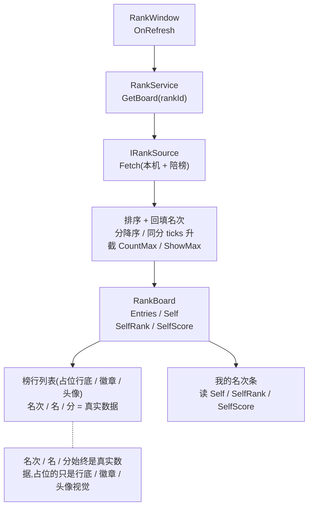

# 排行榜窗美术换皮 · 表现层

塔罗 UI 换皮自治线<b>末屏(第五屏)</b>:把效果图 `排行榜.png` 换皮成可运行的 `RankWindow`。目的:兑现[设计 22 排行榜底层系统](#22-rank-system)遗留的表现层(boss 遗留 #27)。<mark>本轮 = 纯 UI 补完</mark>——数据逻辑层([设计 22](#22-rank-system))已交付并经 EditMode 单测(归档 `pipeline/archive/2026-06-14-rank-system/`),本屏只**调用**它 + 接线,不重写数据层。基础设施**全部复用**[设计 23 设置窗](#23-settings-window-art)已确立、并经[设计 25 个人信息窗](#25-player-info-window-art)二次验证的范式:`[Window(Top, false)]` 弹窗 + 半透明遮罩 + `GameContext` 持有数据服务 + `FindChildComponent` 绑定 + `m_` 前缀 + `Image.SetSubSprite(精灵表, 子图名)` 取图 + `OnRefresh` 读数据刷态。<b>不重新发明任何基础设施。</b>

    <b>读前必看 · 五条边界(界定范围,防把「换皮一个窗」扩成重写)</b>
    <ul style="margin:8px 0 0">
      <li><b>数据层不动,只调用。</b><code>GameLogic.Rank</code>(<code>RankService</code> / <code>RankBoard</code> / <code>RankEntry</code> / <code>RankDef</code> / <code>RankClaimResult</code> / <code>LocalRankSource</code> / <code>RemoteRankSource</code> / <code>RankPersistence</code> / <code>RankConfigMgrSource</code>)+ 配置 <code>GameLogic.Config.RankConfigMgr</code> 已实装并经 EditMode 单测(<a href="#22-rank-system">设计 22</a>)。本轮<mark>不</mark>改这些类的逻辑;窗口只<b>调用</b>(查榜、查我的名次、领点赞、读红点)。</li>
      <li><b>基础设施全部复用设计 23 / 25,不重造。</b>切图寻址(<code>SetSubSprite(精灵表 location, 子图名)</code>)、绑定(<code>FindChildComponent</code> + <code>m_</code> 前缀)、窗口范式(<code>UIWindow</code> + <code>[Window]</code> + 遮罩 + Top 层)、运行期上下文(<code>GameContext</code> 单例)全部已打通(<a href="#23-settings-window-art">设计 23</a> §三/§四/§五/§六,<a href="#25-player-info-window-art">设计 25</a> 复验)。本屏照搬,<mark>无任何新基础设施</mark>。</li>
      <li><b>本屏无专属切图,复用 <code>Sheet_settings</code> 精灵表 + 占位榜行 / 徽章 / 头像。</b>塔罗素材里<mark>没有「排行榜」专属切图文件夹,也没有榜行底 / 名次徽章(金银铜)/ 头像切图</mark>。本屏的面板 / 标题板 / 关闭钮 / 底部按钮用 <code>Sheet_settings</code> 通用木板 / 按钮子图拼(<a href="#28-rank-window-art::atlas">§三</a>);榜行底 / 名次徽章 / 头像 = <mark>占位</mark>(纯色条 / 纯色块 + 字符)+ TODO 待美术(<a href="#28-rank-window-art::placeholder">§3.2</a>)。<b>本屏视觉是结构占位、非高保真——这是本屏已知限制,不判 FAIL。</b></li>
      <li><b>离线本地榜 + 远程 stub 返空 → 榜单多为占位 / 陪榜。</b>数据层 <code>RemoteRankSource</code> 返空(无网络模块),离线 <code>LocalRankSource</code> 产「本机一条 + 配置陪榜」(<a href="#22-rank-system::source">设计 22 §3.6</a>)。本屏渲染的真实数据来自 <code>RankService.GetBoard</code>:本机成绩是真的,陪榜由配置 / 注入基准分(非随机 NPC)。<mark>真实全服榜待网络模块就绪后实现,服务层零改动切注入</mark>(<a href="#28-rank-window-art::open">§十一 BLK1</a>)。</li>
      <li><b>UI 业务代码在热更区,资源走 YooAsset,加法式不破坏玩法。</b>窗口脚本落 <code>GameScripts/HotFix/GameLogic/UI/</code>(热更,与 <code>SettingsWindow.cs</code> / <code>PlayerInfoWindow.cs</code> 同目录);prefab 落 <code>AssetRaw/UI/Prefabs/</code>。改动全在加法侧——<code>GameContext</code> 扩一个 <code>Rank</code> 成员、主菜单加一个入口按钮(同设置窗 / 个人信息窗),不动 Classic / Merge 主玩法(<a href="#28-rank-window-art::accept">§九 验收 R</a>)。</li>
    </ul>
  

    <b>立项信息</b>
    <table>
      <tbody><tr><th>类型</th><td>表现层换皮 · 塔罗 UI 自治线第 5 屏(末屏)· 纯 UI 补完 · art 受限 复用设计 23 / 25 范式,兑现遗留 #27(rank 表现层)。出设计稿 + 验收标准,交开发落地。</td></tr>
      <tr><th>设计基线(经 grep 核实的真实符号)</th><td>
        <b>数据层(已实装,只调用,命名空间 <code>GameLogic.Rank</code>)</b>:<code>RankService(IRankSource source, IRankPersistence persist, GameLogic.Mail.IMailService mail, IRankConfigSource cfg = null)</code>;字段 <code>NowProvider</code>(<code>Func&lt;DateTime&gt;</code>,默认系统时钟)/ <code>OpenDate</code>(<code>DateTime</code>)。查榜入口:<code>RankBoard GetBoard(int rankId)</code>(榜不存在返 null)、<code>(int rank, long score) GetMyRank(int rankId)</code>、<code>(long score, long ticks, int nameTextId) GetMyBest(int rankId)</code>、<code>void SubmitScore(int rankId, long score)</code>。领取:<code>RankClaimResult ClaimDaily(int rankId)</code> / <code>RankClaimResult ClaimPraise(int rankId)</code>;红点 <code>bool HasClaimable</code>;结算 <code>List&lt;SettleResult&gt; CheckAndSettle(DateTime now)</code>。 
        <b>查榜返回结构</b>:<code>RankBoard{ int Id; List&lt;RankEntry&gt; Entries; RankEntry Self; int SelfRank; long SelfScore; }</code>;<code>RankEntry{ int PlayerNameTextId; long Score; long AchievedTicks; bool IsSelf; int Rank; }</code>(<code>Rank</code> 由服务排序后回填,1 起);领取结果 <code>RankClaimResult{ RankClaimStatus Status; int TextId; }</code>,状态枚举 <code>RankClaimStatus{ Success, NotRanked, NoReward, AlreadyClaimedToday }</code>。 
        <b>榜定义</b>:<code>RankDef{ int Id; int NameTextId; int Group; int Method; long Condition; int PraiseRewardPoolId; RankValidType ValidType; long ValidVal; int MailDefId; int CountMax; int ShowMax; List&lt;RankRewardTier&gt; Tiers; }</code>;<code>RankRewardTier TierForRank(int rank)</code>(无匹配返 null);<code>RankRewardTier{ int RankMin; int RankMax; int RewardPoolId; int ShowRewardPoolId; int DailyRewardPoolId; }</code>。 
        <b>数据源 / 持久化 / 配置接缝</b>:<code>IRankSource.Fetch(int rankId)</code>;离线 <code>LocalRankSource(Func&lt;int,(long,long,int)&gt; selfProvider, Func&lt;int,IReadOnlyList&lt;RankEntry&gt;&gt; filler = null)</code>;远程 <code>RemoteRankSource</code>(<code>Fetch</code> 返 <code>Array.Empty</code>,不连网不抛);<code>RankPersistence</code>(键 <code>"Rank.Progress"</code>,经 <code>Persistence.Provider</code>)/ <code>InMemoryRankPersistence</code>(测试);<code>RankConfigMgrSource</code>(默认配置源,包 <code>RankConfigMgr</code>);<code>GameLogic.Config.RankConfigMgr</code>(<code>GetRank(id)</code> / <code>All()</code> / <code>EnsureLoaded()</code> / <code>InitForTest(IEnumerable&lt;RankDef&gt;)</code> / <code>ResetForTest()</code>)。 
        <b>发奖渠道</b>:领取 / 结算奖一律经注入 <code>GameLogic.Mail.IMailService.Send(MailDraft)</code>(设计 21),排名层不碰 <code>MergeOrderState</code> / <code>ItemGrant</code>——<mark>窗口领点赞后奖励进邮箱,不在排行榜窗直接弹奖</mark>(<a href="#28-rank-window-art::praise">§六 点赞</a>)。 
        <b>UI 框架 + 取图 API(与设计 23 / 25 同源,已打通)</b>:<code>UIWindow</code> + <code>[Window(UILayer, location, fullScreen, hideTimeToClose)]</code>;生命周期 <code>ScriptGenerator → OnCreate → OnRefresh</code>;绑定 <code>FindChildComponent&lt;T&gt;(path)</code>;打开 <code>GameModule.UI.ShowUIAsync&lt;T&gt;()</code> / 关闭 <code>CloseUI&lt;T&gt;()</code>;取子图 <code>Image.SetSubSprite("Sheet_settings", 子图名)</code>(精灵表 Multiple 模式,子图名 = 源切图文件名,<a href="#23-settings-window-art::atlas">设计 23 §三</a>)。 
        <b>运行期上下文(已建,本轮扩持有)</b>:<code>GameLogic.GameContext : SimpleSingleton&lt;GameContext&gt;</code>(<code>OnInit</code> 里建 <code>Settings</code> + <code>Player</code>;现有 <code>InitSettingsWithStore</code> / <code>InitPlayerFromMeta</code> 测试注入入口)。 
        <b>入口现状</b>:<code>GameLogic.BlockBlastUI.MainMenuWindow</code>(code-built,<code>OnCreate</code> 里 <code>UGuiFactory.CreateButton</code>)已加 <code>BtnSettings</code>(第 58–63 行)+ <code>BtnPlayerInfo</code>(第 65–71 行)入口——本轮照同样做法加 <code>BtnRank</code>。 
        <b>分辨率</b>:UIRoot CanvasScaler 参考分辨率 <mark>1080×1920</mark>;prefab 直接用 1080×1920 锚点,<mark>不</mark>套 <code>BlockLayout</code> 那套 750×1334 私有坐标系。
      </td></tr>
      <tr><th>方向约束</th><td>离线还原 · <b>去变现</b>:窗口不含充值 / 内购 / 真实社交分享。点赞奖经数据层发邮件(去变现:点赞是免费每日福利,非诱导付费)。加法式:新建窗口 + prefab + GameContext 扩一个成员,不改框架、不改数据层逻辑、不动既有玩法窗口。无网络模块 → 远程榜返空,本屏榜单以本机 + 陪榜为主(<a href="#28-rank-window-art::open">§十一 BLK1</a>)。</td></tr>
      <tr><th>影响范围</th><td>
        <b>新增资源</b>:<code>RankWindow.prefab</code>(<code>AssetRaw/UI/Prefabs/</code>);<mark>无新切图</mark>(复用 <code>Sheet_settings</code> + 占位)。 
        <b>新增代码(热更区)</b>:<code>RankWindow.cs</code>(窗口脚本,落 <code>GameScripts/HotFix/GameLogic/UI/</code>,同 <code>SettingsWindow.cs</code> / <code>PlayerInfoWindow.cs</code>);<code>RankRowWidget</code>(榜行,见 <a href="#28-rank-window-art::row">§五</a> dev 二选一)。 
        <b>改既有(最小)</b>:<code>GameContext.cs</code> 加一个 <code>Rank</code> 成员 + <code>OnInit</code> 里构造(<a href="#28-rank-window-art::holder">§四</a>);<code>MainMenuWindow.cs</code> 加入口按钮(一处约 5 行,同 <code>BtnPlayerInfo</code> 做法)。 
        <b>不改</b>:<code>GameLogic.Rank</code> 各类逻辑、<code>RankConfigMgr</code>、<code>GameLogic.Mail</code>、框架 UI / 资源代码、Classic / Merge 玩法窗口、数据层单测、<code>Persistence</code> 任一键。
      </td></tr>
      <tr><th>关键约束(继承设计 23 / 25)</th><td>窗口逻辑可被反射 / 直调驱动单测(EditMode 编译 + <code>GameContext</code> 持有 + 查榜数据贯通 + 点赞结果),但<b>真实视觉对位 / 列表渲染 / 指针点击</b>须 Play 模式人眼 + 手验。验收按「逻辑可单测(EditMode)」与「需 Play / 人眼」两档拆开(<a href="#28-rank-window-art::accept">§九</a>)。</td></tr>
    </tbody></table>
  

<h2 id="what">一、做什么与为什么</h2>

现状:[设计 22](#22-rank-system) 的排行榜**数据层已交付但无任何窗口能触达**——玩家无处看榜、无处看自己的名次、无处领点赞奖。[设计 23](#23-settings-window-art) 已把整条换皮链路打通并固化成模板,[设计 25](#25-player-info-window-art) 复验了模板 + 兑现 `GameContext` 扩持有的预告。本轮是<mark>模板的第五次应用(末屏)</mark>:照搬范式把排行榜窗补出来,顺带把 `GameContext` 从「持有 Settings + Player」扩成「也持有 Rank」(兑现设计 23 §五「item / mail / rank 后续逐个挂入」的 rank 那一项)。

**本屏比设计 22 的完整数据层简,且 art 受限**:数据层支持多榜分组 / 名次档奖励预览 / 每日 + 点赞双奖 / 结算邮件;<mark>效果图 <code>排行榜.png</code> 是简化版</mark>——只有「标题板『排行榜』+ 关闭 X + 5 行榜单(前 3 名金银铜奖杯徽章,4/5 名纯数字)+『我的排名』分隔 + 我的名次条(999)+ 底部『再来一次』按钮」,**无点赞按钮、无奖励预览、无多榜页签**。**本轮以效果图为对位基准**(简报指定):按效果图摆节点、接真实数据;数据层有但效果图未画的元素(点赞按钮 / 奖励预览 / 页签)按「数据支持则可选接、否则占位 / 省略」分流([§七](#28-rank-window-art::dispatch))。徽章 / 头像无切图 → 占位([§3.2](#28-rank-window-art::placeholder))。

| # | 本轮交付的 | 落法 | 性质 |
| --- | --- | --- | --- |
| 1 | prefab 节点树(对位 排行榜.png) | 按效果图层级摆节点 + `m_` 前缀 + 1080×1920 锚点 + 标注每节点用 `Sheet_settings` 哪张子图 / 占位([§四之后 §五](#28-rank-window-art::tree)) | 新 prefab |
| 2 | 窗口脚本(绑定 / 查榜 / 渲染列表 / 刷我的名次) | `RankWindow : UIWindow` + `[Window(Top, false)]`,`OnRefresh` 拉 `GameContext.Instance.Rank.GetBoard(rankId)` 刷列表 + 我的名次条([§六](#28-rank-window-art::window)) | 新窗口 |
| 3 | GameContext 扩持有 RankService | 加 `Rank` 成员 + `OnInit` 里构造(延续设计 23 §五统一上下文,[§四](#28-rank-window-art::holder)) | 扩既有(加成员) |
| 4 | 榜单列表渲染(数据贯通) | `RankBoard.Entries` 逐条渲染榜行(名次 / 头像占位 / 名 / 分),`Self` + `SelfRank` 渲染我的名次条([§五](#28-rank-window-art::row)) | 接线 |
| 5 | 点赞接 ClaimPraise(数据支持则做) | 若效果图 / 产品要点赞按钮:点击 → `Rank.ClaimPraise(rankId)` → `RankClaimResult` 分支提示;奖进邮箱([§六](#28-rank-window-art::praise))。效果图无该钮 → 默认省略 / 占位([§七](#28-rank-window-art::dispatch) D2) | 接线(可选) |
| 6 | 打开入口 + 关闭 | 主菜单 `MainMenuWindow` 加入口 → `ShowUIAsync`;X / 遮罩 / 底部按钮 → `CloseUI`([§八](#28-rank-window-art::entry)) | 新接线 |

<b>不做(本轮明确排除):</b>改数据层逻辑(只调用);真实全服榜 / 随机 NPC 陪榜(无网络模块,陪榜由配置 / 注入基准分,[§十一 BLK1](#28-rank-window-art::open));高保真徽章 / 头像(无切图,占位 + TODO,[§3.2](#28-rank-window-art::placeholder));结算定时器(`CheckAndSettle` 触发交调用方,本屏可在 `OnRefresh` 调一次或不调,[§七](#28-rank-window-art::dispatch) D4);新切图 / 新图集 / 打表(复用 `Sheet_settings`)。

<h2 id="effigy">二、效果图拆解(对位基准)</h2>

美术基准 `排行榜.png`(1080×1920 竖屏,扁平 PNG)。盖在游戏 HUD 上的**模态弹窗**:半透明深色遮罩 + 居中木牌面板。顶部有一排状态栏(头像 + 3 个资源条 + 齿轮,属底层 HUD 透出,非本窗内容)。本窗自上而下:

<table class="tight">
    <tbody><tr><th>区块</th><th>效果图内容</th><th>取图(<code>Sheet_settings</code> 子图 / 占位)</th><th>节点类型</th><th>处置</th></tr>
    <tr><td>① 遮罩</td><td>盖住整屏的半透明深色背景(透出底层 HUD)</td><td>无(纯色 <code>Image</code>,alpha≈0.6)</td><td><code>Button</code>(点击关窗)</td><td class="yes">实做</td></tr>
    <tr><td>② 标题木牌</td><td>顶部木牌「排行榜」</td><td><code>box2</code>(木牌底,设置窗上面板同用)+ 文本「排行榜」</td><td><code>Image</code> + <code>Text</code></td><td class="yes">实做</td></tr>
    <tr><td>③ 关闭按钮</td><td>右上角圆形 × 按钮</td><td><code>icon_x</code>(圆 + X 一体图,设置窗同用)</td><td><code>Button</code></td><td class="yes">实做</td></tr>
    <tr><td>④ 主面板底板</td><td>居中大木板(米色,长竖)</td><td><code>box1</code>(木板底,设置窗面板同用)</td><td><code>Image</code></td><td class="yes">实做</td></tr>
    <tr><td>⑤ 榜单列表</td><td>5 行可见(前 3 名带金 / 银 / 铜奖杯徽章,4/5 名圆圈纯数字)。每行:左名次徽章 + 圆头像 + 「玩家1」+ 右侧分数胶囊「★2289」。第 5 行底部渐隐(暗示可滚动 / 更多)</td><td>榜行底:<mark>无切图 → 占位</mark>(纯色圆角条,前 3 名暖金 / 银灰 / 铜棕,4/5 名浅米);名次徽章:<mark>无切图 → 占位</mark>(纯色圆 + 数字 / 字符);头像:<mark>无切图 → 占位</mark>(纯色块);分数胶囊:文本 + 可用 <code>button</code> 子图缩成小胶囊底</td><td>列表容器 + 行 Widget</td><td class="yes">列表渲染实做 行底/徽章/头像占位</td></tr>
    <tr><td>⑥「我的排名」分隔</td><td>列表下方虚线分隔 + 居中「我的排名」小标</td><td>无(<code>Text</code> + 可选分隔线 <code>Image</code>)</td><td><code>Text</code></td><td class="yes">实做(纯文本)</td></tr>
    <tr><td>⑦ 我的名次条</td><td>突出一行:左大「999」+ 圆头像 + 「玩家1」+ 「★2289」(同榜行结构,更醒目)</td><td>同榜行占位(高亮色区分,如暖金底)</td><td>行 Widget(复用)</td><td class="yes">实做(读 <code>Self</code>/<code>SelfRank</code>/<code>SelfScore</code>)</td></tr>
    <tr><td>⑧ 底部按钮</td><td>底部黄色「再来一次」长条</td><td><code>button</code>(长条底,设置窗同用)+ 文本「再来一次」</td><td><code>Button</code></td><td class="yes">实做(语义见 <a href="#28-rank-window-art::dispatch">§七</a> D3)</td></tr>
    <tr><td>(无)点赞按钮</td><td>效果图<mark>未出现点赞 / 喜欢按钮</mark></td><td>—</td><td>—</td><td class="no">默认省略,数据层 <code>ClaimPraise</code> 留接线点(<a href="#28-rank-window-art::dispatch">§七</a> D2)</td></tr>
    <tr><td>(无)奖励预览</td><td>效果图<mark>未出现奖励图标 / 名次档奖预览</mark></td><td>—</td><td>—</td><td class="no">默认省略,数据层 <code>TierForRank</code>/<code>ShowRewardPoolId</code> 留接线点(<a href="#28-rank-window-art::dispatch">§七</a> D5)</td></tr>
    <tr><td>(无)多榜页签</td><td>效果图<mark>只显一个榜,无页签 / 分组切换</mark></td><td>—</td><td>—</td><td class="no">默认单榜,数据层 <code>RankDef.Group</code>/<code>All()</code> 支持多榜则可选接(<a href="#28-rank-window-art::dispatch">§七</a> D1)</td></tr>
  </tbody></table>

    <b>取图须 dev 读图二次核实</b>
    
上表「取哪张子图」是<mark>按设置窗已用子图推断</mark>的最省方案。dev 落地时对照 <code>排行榜.png</code> 与 <code>Sheet_settings</code> 各子图缩略图核实哪张木板最贴(<code>box1</code>/<code>box2</code>/<code>base_plate</code>/<code>base_plate2</code>/<code>base_plate3</code> 五种木板任选最贴的)。<b>子图名集合 = 设置窗那 22 张切图文件名</b>(见 <a href="#23-settings-window-art::atlas">设计 23 §三</a> / <a href="#25-player-info-window-art::effigy">设计 25 §二</a> 列出的 22 名)——<mark>榜行底 / 名次徽章 / 头像都不在其中,故占位</mark>(<a href="#28-rank-window-art::placeholder">§3.2</a>)。

  

<h2 id="atlas">三、美术资产接入(复用 Sheet_settings,无新切图)</h2>

<h3 id="atlas-reuse">3.1 复用设置窗精灵表</h3>

本屏<mark>不导入任何新切图、不建新图集、不动打表工具</mark>。设置窗已把 `Sheet_settings.png`(单张 Multiple 模式精灵表,含 22 个命名子精灵)导入并被收集器收录、运行期可经 `SetSubSprite` 寻址([设计 23 §三](#23-settings-window-art::atlas)实测打通,设计 25 复用通过)。本屏的木板 / 标题板 / 关闭按钮 / 底部按钮 / 分数胶囊直接复用其子图:

<pre class="code">private const string Atlas = "Sheet_settings";   // 复用设置窗精灵表 location（设计 23 §三）
// OnCreate 一次性贴静态图（SetSubSprite 内置引用计数 + SubSpriteReference 自动释放，无需手动 Unload）
_imgPanelBg.SetSubSprite(Atlas, "box1");     // 主面板底板
_imgTitleBg.SetSubSprite(Atlas, "box2");     // 标题木牌
_imgClose.SetSubSprite(Atlas, "icon_x");     // 关闭圆按钮
_imgBottomBtnBg.SetSubSprite(Atlas, "button"); // 底部「再来一次」长条
// …各节点贴，子图名以 §二 dev 读图核实后的映射为准</pre>

**不写法**(同设计 23 / 25):不用 `LoadAssetAsync<Sprite>`(违 `resource-api` 红线);不用 `AddressByFileName` 平铺单图。静态图在 `OnCreate` 贴一次,会运行期变的(榜行内容)由 `OnRefresh` 刷([§六](#28-rank-window-art::window))。

<h3 id="placeholder">3.2 三处缺图的占位策略(本屏 art 受限的核心)</h3>

效果图有三类图 `Sheet_settings` 没有,本轮占位 + 留 TODO,不阻塞验收(同设计 25 占位口径——占位 = 节点摆齐 + 可交互 + 留清晰 TODO,不是「不摆」):

| 缺的图 | 占位做法 | TODO(待美术补) |
| --- | --- | --- |
| <b>榜行底(行卡片)</b> | 纯色圆角 `Image` 条作行底。<mark>前 3 名用暖色区分</mark>(1 名暖金 / 2 名银灰 / 3 名铜棕),4 名起浅米;我的名次条用高亮暖金。颜色携带名次语义,补图后替 `SetSubSprite` 即生效。 | 待美术补「榜行底」切图(普通 + 前三名高亮 + 我的名次高亮) |
| <b>名次徽章(金银铜奖杯)</b> | 前 3 名:纯色圆 `Image`(金 / 银 / 铜)+ 文本字符(「①」/「②」/「③」或「1/2/3」,可叠「🏆」字符)。4 名起:浅色圆 + 名次数字文本。<mark>名次数字始终是真实 <code>RankEntry.Rank</code></mark>,占位的只是徽章外观。 | 待美术补「金 / 银 / 铜奖杯徽章」切图,替子图即生效 |
| **圆头像** | 纯色块 / 纯色圆 `Image`(`color` 由 `PlayerNameTextId` 或 `IsSelf` 取稳定色,本人用醒目色)。头像 Sprite 无美术(同设计 25 头像占位)。 | 待美术补「圆头像 / 头像框」切图 + 各头像 Sprite,接真实头像资源加载 |

    <b>占位的统一原则(同设计 23 / 25)+ 本屏特别声明</b>
    
占位 = <b>节点摆齐 + 可交互 + 数据真实 + 留清晰 TODO</b>。榜行底 / 徽章 / 头像视觉是占位,但<mark>名次数字、玩家名、分数全部是 <code>RankService.GetBoard</code> 的真实数据</mark>——美术切图到位后替子图 / 替 Sprite 即生效,节点结构与脚本逻辑不返工。<b>本屏视觉是「结构占位、非高保真」,这是简报已声明的本屏已知限制(塔罗素材无排行榜专属切图),验收以「列表渲染对、数据贯通对、不破坏玩法」为准,不因占位图朴素判 FAIL</b>(<a href="#28-rank-window-art::accept">§九 BLOCKED 条款</a>)。

  

<h2 id="holder">四、GameContext 扩持有 RankService(延续统一上下文,兑现末项预告)</h2>

[设计 23 §五](#23-settings-window-art::holder)已确立:`GameContext` 是「数据层已建、需运行期持有者」的无主系统的统一归宿,并明示「player-info / item / mail / rank 后续逐个挂入」。设计 25 已兑现 player-info 那一项;<mark>本轮兑现 rank 那一项(末项)</mark>——把 `RankService` 的运行期持有 + 构造收进 `GameContext`。窗口只 `GameContext.Instance.Rank` 取,与 `Settings`/`Player` 同源。

`RankService` 的构造需注入三个接缝(`IRankSource` / `IRankPersistence` / `IMailService`)+ 可选配置源。`GameContext.OnInit` 里按生产实现装配:

<pre class="code">// GameContext.cs（增量：加 Rank 成员 + OnInit 里构造）
public RankService Rank { get; private set; }   // 新增成员（设计 22 数据层服务）
protected override void OnInit()
{
    // ── 既有：Settings（设计 23）+ Player（设计 25），一行不改 ──
    Settings = new SettingsService(new PlayerPrefsSettingsStore());
    Settings.Load();
    LoadPlayer();
    // ── 新增：Rank（设计 22 数据层）──
    InitRank();
}
/// &lt;summary&gt;装配排行榜服务（生产接缝：本地源 + 生产持久化 + 邮件服务 + 默认配置源）。&lt;/summary&gt;
private void InitRank()
{
    // 本机成绩来自 RankService 自身进度（GetMyBest），陪榜由配置 / 注入基准分（无随机 NPC，设计 22 §3.6）。
    // selfProvider 经一个先行实例的 GetMyBest 取本机最佳；filler 暂 null（陪榜内容是运营 / 配置项，§十一 BLK1）。
    var persist = new RankPersistence();                       // 键 Rank.Progress，复用 Persistence.Provider
    var mail    = ResolveMailService();                        // 邮件服务（见下 callout，dev 按工程现状取）
    // selfProvider 闭包引用 Rank 自身：先建服务，再用其 GetMyBest 作 selfProvider（同设计 22 测试 SK1 写法）
    RankService svc = null;
    var source = new LocalRankSource(
        id =&gt; svc.GetMyBest(id),                               // 本机成绩
        _  =&gt; null);                                          // 陪榜：本轮无（待运营内容，§十一 BLK1）
    svc = new RankService(source, persist, mail);             // cfg 默认包 RankConfigMgr（运行期走 ConfigSystem）
    Rank = svc;
}</pre>

    <b>待 dev 核实(B1):邮件服务从哪取 + selfProvider 闭包时序</b>
    <ul style="margin:6px 0 0">
      <li><b>邮件服务来源</b>:<code>RankService</code> 构造要一个 <code>GameLogic.Mail.IMailService</code>(设计 21)。dev 落地时按工程现状取:① 若 <code>GameContext</code> 后续也持有 <code>MailboxService</code>(mail 表现层轮,遗留 #26),则复用同一实例;② 本轮 mail 表现层未做 → dev 现场 <code>new MailboxService(...)</code>(注入 mail 的生产持久化 + 配置源,仿设计 21)作 <code>RankService</code> 的发奖出口,或暂注一个 no-op <code>IMailService</code>(领奖时记日志、不真发,待 mail 表现层接入后替为真实实例)。<mark>本屏验收只要求「点赞返 Success 且数据层 <code>ClaimPraise</code> 被调」</mark>(W4),奖是否真进邮箱属 mail 表现层(#26)范畴,非本屏方向问题。dev 取何路记 dev 交接区。</li>
      <li><b>selfProvider 闭包</b>:<code>LocalRankSource</code> 的 <code>selfProvider</code> 要引用 <code>RankService</code> 自身的 <code>GetMyBest</code>——存在「服务引用源、源引用服务」的循环,用「先声明 svc 变量、闭包捕获、后赋值」打破(上方代码 + 设计 22 测试 SK1 / 持久化往返用例已是此写法,可照搬)。</li>
    </ul>
  

**测试注入入口**(仿既有 `InitSettingsWithStore` / `InitPlayerFromMeta`):加一个 `InitRankWithDeps(IRankSource source, IRankPersistence persist, IMailService mail, IRankConfigSource cfg = null)`,EditMode 经它灌入 `InMemoryRankPersistence` + `RecordingMailService` + `RankConfigMgr.InitForTest` 的榜定义,断言 `GameContext.Instance.Rank.GetBoard` 数据贯通,不污染真实 PlayerPrefs / 不连网(验收 H2/H3,[§九](#28-rank-window-art::accept))。

<h2 id="row">五、prefab 节点树 + 榜单列表渲染(数据源 → 行)</h2>

列表的数据源是 `RankService.GetBoard(rankId)` 返回的 `RankBoard`:`Entries`(已排序、已截 `ShowMax` 的条目,各条 `Rank` 已回填)→ 渲染列表行;`Self` + `SelfRank` + `SelfScore` → 渲染「我的名次条」。每条 `RankEntry` 的可显字段:`Rank`(名次)/ `PlayerNameTextId`(名,占位查表 → 暂显占位名 / id)/ `Score`(分)/ `IsSelf`(是否本人,本人行高亮)。

<h3 id="tree">5.0 prefab 节点树(对位 排行榜.png + m_ 前缀命名)</h3>

根节点照设置窗 / 个人信息窗 prefab 范式:根挂 `RectTransform`(stretch 0,0→1,1)+ `Canvas` + `GraphicRaycaster`。坐标系 = 1080×1920 参考分辨率,直接用真实锚点。`m_` 前缀决定 `FindChildComponent` 绑定类型(前缀表见 tengine-dev `naming-rules`)。下方坐标为对位描述,精确像素 dev 摆图时对着 `排行榜.png` 微调。

RankWindow                             (根: RectTransform 全屏 stretch + Canvas + GraphicRaycaster)
├─ m_btn_Mask                          Button  全屏遮罩(Image alpha≈0.6 深色; 点击关窗); 锚点全屏 stretch
└─ Root                                RectTransform 居中容器(承载所有可见内容)
   ├─ m_img_TitleBg                    Image   标题木牌底; 子图 box2
   ├─ m_text_Title                     Text    "排行榜"(若美术木牌已烤字则删此节点)
   ├─ m_btn_Close                      Button  右上角圆形关闭; 子图 icon_x; 锚点(顶部右)
   ├─ m_img_PanelBg                    Image   主面板底板; 子图 box1
   ├─ m_scroll_List                    ScrollRect 榜单列表(方案 A/B; 方案 C 固定槽则改 RectTransform 容器)
   │  └─ Viewport
   │     └─ Content                    RectTransform + VerticalLayoutGroup(行容器; 运行期填充 §5.1)
   │        └─ (行实例)               RankRowWidget / code-built 行: 名次徽章占位 + 头像占位 + 名 + 分胶囊
   ├─ m_text_MyRankLabel               Text    "我的排名"(分隔小标; 可配分隔线 Image)
   ├─ m_node_MyRank                    RectTransform 我的名次条(同行结构, 高亮底色区分; 读 Self/SelfRank/SelfScore)
   │  ├─ m_text_MyRank                 Text    大名次数字(如 "999"; 未入榜显 "--")
   │  ├─ m_img_MyAvatar                Image   头像占位(纯色块)
   │  ├─ m_text_MyName                 Text    本机玩家名
   │  └─ m_text_MyScore               Text    本机成绩(SelfScore)
   └─ m_btn_Bottom                     Button  底部"再来一次"长条; 子图 button + 文本; 点击→关窗(§七 D3)

    <b>静态节点 vs 动态节点</b>
    
本窗<b>静态壳 + 动态列表</b>:标题 / 关闭 / 面板底 / 底部按钮是 prefab 摆好的静态节点(<code>OnCreate</code> 贴一次子图);运行期变的是<b>榜单列表行</b>(<code>m_scroll_List/Content</code> 下,<code>OnRefresh</code> 按 <code>Entries</code> 填充,§5.1)与<b>我的名次条</b>(<code>m_node_MyRank</code>,读 <code>Self</code>/<code>SelfRank</code>/<code>SelfScore</code>)。<mark>榜行底 / 名次徽章 / 头像</mark>无切图 → 占位(<a href="#28-rank-window-art::placeholder">§3.2</a>),名次 / 名 / 分真实。

  

<h3 id="row-impl">5.1 行的实现:UIWidget vs 代码生成 vs 固定槽(dev 三选一)</h3>

效果图榜单约 5–6 行可见 + 第 5 行底部渐隐(暗示可滚动)。数据层 `ShowMax` 控展示条数(测试夹具用 50)。行数不定 → 三种实现,dev 按工程现状取:

| 方案 | 做法 | 取舍 |
| --- | --- | --- |
| <b>A · 行 Widget + 对象池(推荐)</b> | 建一个 `RankRowWidget : UIWidget`(参工程既有 `RewardItemWidget` / Widget 范式),榜行 prefab 一份;`OnRefresh` 时按 `Entries.Count` 调整行实例数(对象池 / `AdjustIconNum` 式增删),逐行 `SetData(entry)`。列表容器套 `ScrollRect` + `VerticalLayoutGroup` 支持滚动看更多。 | 条数不定时最干净;复用 Widget 范式;dev 须确认工程 UIWidget / 对象池 API(grep `UIWidget` / `RewardItemWidget` / `AdjustIconNum` 实际签名再用,**别臆造**)。 |
| <b>B · 代码生成行(无池)</b> | `OnRefresh` 里清空容器子节点 → 按 `Entries` 逐条 `UGuiFactory.CreateXxx` 拼一行(同 `MainMenuWindow` code-built 风格)。容器套 `ScrollRect` 滚动。 | 不依赖 Widget 范式,纯代码;每次刷重建(条数少无性能问题);与主菜单 code-built 风格一致。 |
| **C · 固定 N 行槽位** | prefab 预摆固定行数(如效果图可见 5–6 行 + 我的名次条),`OnRefresh` 按 `Entries` 填前 N 行、超出隐藏。不滚动或浅滚动。 | 最简,但只显前 N 名(效果图本就只显 5 行 + 我的名次,可接受);超 N 名看不到。本轮 art 受限 + 离线榜条目少,此方案足够对位效果图。 |

    <b>本轮推荐与底线</b>
    
推荐 <b>方案 A</b>(行 Widget + 滚动),与「条数不定」最契合;若工程 UIWidget / 对象池接线成本高,退 <b>方案 C 固定槽</b>(效果图本就只显 5 行 + 我的名次条,固定槽足以对位)。<mark>三方案验收等价</mark>:都要求「<code>Entries</code> 逐条名次 / 名 / 分渲染正确 + 我的名次条读 <code>Self</code>/<code>SelfRank</code>/<code>SelfScore</code> 正确」(<a href="#28-rank-window-art::accept">§九 V2/W3</a>)。dev 取何方案 + 实际用的 UIWidget / 池 API 记 dev 交接区。

  

<h3 id="row-flow">5.2 查榜 → 渲染 数据流</h3>

<h2 id="window">六、窗口脚本设计(RankWindow)</h2>

继承 `UIWindow` + `[Window]`,弹窗参数同设置窗 / 个人信息窗:层级 `Top`、`fullScreen:false`。生命周期分工:`ScriptGenerator` 绑节点 + 接钮 → `OnCreate` 贴静态图 → `OnRefresh` 每次开窗查榜刷列表 + 我的名次。命名空间 `GameLogic.UI`(同 `SettingsWindow` / `PlayerInfoWindow`)。

<pre class="code">using UnityEngine;
using UnityEngine.UI;
using TEngine;
using GameLogic.Rank;
namespace GameLogic.UI
{
    /// &lt;summary&gt;排行榜窗(美术换皮，设计 28)。模态弹窗：标题 + 榜单列表 + 我的名次条 + 底部按钮。
    /// 数据走 GameContext.Instance.Rank(设计 22 数据层)，切图复用 Sheet_settings 精灵表(设计 23)。
    /// 榜行底 / 名次徽章 / 头像无切图 → 占位(§3.2,本屏 art 受限)。&lt;/summary&gt;
    [Window(UILayer.Top, location: "RankWindow", fullScreen: false)]
    public sealed class RankWindow : UIWindow
    {
        private const string Atlas = "Sheet_settings";   // 复用设置窗精灵表（设计 23 §三）
        private const int RankId = 1;                     // 本屏默认展示榜 id（单榜，§七 D1；多榜则换页签选中 id）
        private Button _btnMask, _btnClose, _btnBottom;
        private Image  _imgPanelBg, _imgTitleBg, _imgClose, _imgBottomBtnBg;
        private Transform _listRoot;     // 榜单列表容器（ScrollRect content 或固定槽父节点，§五）
        private Transform _myRankRoot;   // 我的名次条容器
        private RankService Svc =&gt; GameContext.Instance.Rank;
        protected override void ScriptGenerator()
        {
            _btnMask        = FindChildComponent&lt;Button&gt;("m_btn_Mask");
            _btnClose       = FindChildComponent&lt;Button&gt;("Root/m_btn_Close");
            _btnBottom      = FindChildComponent&lt;Button&gt;("Root/m_btn_Bottom");
            _imgPanelBg     = FindChildComponent&lt;Image&gt;("Root/m_img_PanelBg");
            _imgTitleBg     = FindChildComponent&lt;Image&gt;("Root/m_img_TitleBg");
            _imgClose       = FindChildComponent&lt;Image&gt;("Root/m_btn_Close");
            _imgBottomBtnBg = FindChildComponent&lt;Image&gt;("Root/m_btn_Bottom");
            _listRoot       = FindChildComponent&lt;Transform&gt;("Root/m_scroll_List/Viewport/Content");
            _myRankRoot     = FindChildComponent&lt;Transform&gt;("Root/m_node_MyRank");
            // …其余按 §五 节点树路径绑定
            // 接钮（onClick；监听随 GameObject 销毁自动清，无需手动 Remove——同设计 23 / 25）
            _btnMask.onClick.AddListener(Close);     // 遮罩 = 点任意处关闭
            _btnClose.onClick.AddListener(Close);
            _btnBottom.onClick.AddListener(OnBottomButton);   // 「再来一次」语义见 §七 D3
        }
        protected override void OnCreate()
        {
            // 一次性贴静态图（SetSubSprite 自动管引用计数）
            _imgTitleBg?.SetSubSprite(Atlas, "box2");
            _imgPanelBg.SetSubSprite(Atlas, "box1");
            _imgClose.SetSubSprite(Atlas, "icon_x");
            _imgBottomBtnBg.SetSubSprite(Atlas, "button");
            // 榜行底 / 名次徽章 / 头像无图 → 占位（§3.2，行渲染时按名次 / IsSelf 取占位色）
        }
        protected override void OnRefresh()
        {
            var board = Svc.GetBoard(RankId);      // 查榜：本机 + 陪榜 → 排序 → 回填名次（数据层 §3.3）
            RenderList(board);                     // 逐条渲染榜行（占位行底/徽章/头像 + 真实名次/名/分，§五）
            RenderMyRank(board);                   // 我的名次条（读 Self / SelfRank / SelfScore）
        }
        /// &lt;summary&gt;渲染榜单列表（dev 按 §五 取 Widget+池 / 代码生成 / 固定槽 三选一）。&lt;/summary&gt;
        private void RenderList(RankBoard board)
        {
            // board == null（榜不存在）→ 空列表 + 友好态；非 null → 遍历 board.Entries 逐行 SetData。
            // 每行：Rank（真实名次）→ 徽章占位色（前三金银铜）；PlayerNameTextId → 名（占位查表）；
            //       Score → 分；IsSelf → 本人行高亮。TODO(§3.2): 头像 Sprite / 徽章切图待美术。
        }
        /// &lt;summary&gt;渲染我的名次条（board.Self 为 null = 未入榜 → 显「未上榜」+ 当前最佳 SelfScore）。&lt;/summary&gt;
        private void RenderMyRank(RankBoard board)
        {
            // board.SelfRank &gt; 0 → 显名次 + 头像占位 + 名 + SelfScore；
            // board.SelfRank == 0 → 未入榜：显「--」/「未上榜」+ 当前最佳分（board.SelfScore）。
        }
        /// &lt;summary&gt;底部按钮（效果图「再来一次」；语义 §七 D3：默认关窗回上一界面 / 再开一局）。&lt;/summary&gt;
        private void OnBottomButton() =&gt; Close();
        private void Close() =&gt; GameModule.UI.CloseUI&lt;RankWindow&gt;();
    }
}</pre>

    <b>dev 注意(与设计 23 / 25 一致的工程实际)</b>
    <ul style="margin:6px 0 0">
      <li>接钮一律 <code>onClick.AddListener</code>(本工程 UIModule <mark>无 <code>RegisterButtonClick</code></mark>,设计 23 已验证)。<code>onClick</code> 监听随 GameObject 销毁自动清,无需手动 <code>RemoveAllListeners</code>。</li>
      <li>占位反馈临时走 <code>Log.Info</code>(工程暂无 Toast / 飘字,同设计 23 / 25);<mark>占位不等于死按钮</mark>:点了要有 Log / 提示。</li>
      <li>列表行实现(Widget / 代码生成 / 固定槽)+ 实际用的 <code>UIWidget</code> / 对象池 / <code>ScrollRect</code> API,dev <b>grep 工程真实签名后用,别臆造方法名</b>(<a href="#28-rank-window-art::row">§五</a>)。</li>
      <li>名 <code>PlayerNameTextId</code> 是占位 textId(真实多语言查表延后,设计 22 O6)→ 本屏暂显占位名 / 直接显 textId 数字 / 显「玩家+id」皆可,补查表后替。</li>
    </ul>
  

<h3 id="praise">6.1 点赞接 ClaimPraise(数据支持,效果图无钮 → 可选)</h3>

数据层有 `ClaimPraise(rankId)`:每日一次,榜级奖(`PraiseRewardPoolId`),奖经邮件发。<mark>效果图未画点赞按钮</mark>,故本轮默认**不强加点赞按钮**([§七](#28-rank-window-art::dispatch) D2,安全默认 = 按效果图);但留接线点——若产品 / 后续要点赞,加一个 `m_btn_Praise` 节点,点击:

<pre class="code">private void OnPraise()
{
    var result = Svc.ClaimPraise(RankId);   // 数据层：每日一次 → 奖经邮件发（设计 22 §3.4.2）
    switch (result.Status)
    {
        case RankClaimStatus.Success:            ShowTip("点赞成功，奖励已发到邮箱"); break;
        case RankClaimStatus.AlreadyClaimedToday: ShowTip("今日已点赞"); break;
        case RankClaimStatus.NoReward:           ShowTip("本榜无点赞奖"); break;
        default:                                 ShowTip("点赞失败"); break;
    }
    OnRefresh();   // 刷红点 / 按钮态（HasClaimable）
}</pre>

点赞奖<mark>进邮箱、不在本窗弹奖</mark>(排名层经邮件发奖,设计 22 §3.5;领奖展示属 mail 表现层 #26)。验收只要求「点赞返 `Success` 且数据层 `ClaimPraise` 被调、当天再点返 `AlreadyClaimedToday`」([§九 W4](#28-rank-window-art::accept),可单测)。

<h2 id="dispatch">七、各控件处置分流表</h2>

按「实做 / 占位 / 不做(本屏)」三档。占位项不阻塞验收——只要点击不报错、留清晰接线点即可。

<table class="tight">
    <tbody><tr><th>功能位</th><th>本轮处置</th><th>接什么 / 留什么</th></tr>
    <tr><td><b>榜单列表渲染</b></td><td class="yes">实做(数据贯通)</td><td><code>OnRefresh</code> 读 <code>Svc.GetBoard(RankId).Entries</code> → 逐行渲染名次 / 名 / 分。<b>核心验收项</b>(W3/V2)。行底 / 徽章 / 头像占位(<a href="#28-rank-window-art::placeholder">§3.2</a>),名次 / 名 / 分真实。</td></tr>
    <tr><td><b>我的名次条</b></td><td class="yes">实做(数据贯通)</td><td>读 <code>board.Self</code>/<code>SelfRank</code>/<code>SelfScore</code>;未入榜(<code>SelfRank==0</code>)显「未上榜」+ 当前最佳分。<b>核心验收项</b>(W3)。</td></tr>
    <tr><td><b>名次徽章(金银铜)</b></td><td class="yes">名次实做 徽章图占位</td><td>名次数字 = 真实 <code>RankEntry.Rank</code>;徽章外观无切图 → 前 3 名占位金 / 银 / 铜色圆 + 字符,4 名起浅色圆 + 数字(<a href="#28-rank-window-art::placeholder">§3.2</a>)。</td></tr>
    <tr><td><b>头像</b></td><td class="yes">摆位实做 真图占位</td><td>头像 Sprite 无美术(同设计 25)→ 占位纯色块(<code>IsSelf</code> / 名取稳定色)。TODO 接真实头像资源。</td></tr>
    <tr><td><b>关闭 X</b> + <b>遮罩(点任意处)</b></td><td class="yes">实做</td><td><code>CloseUI&lt;RankWindow&gt;()</code>。遮罩 <code>m_btn_Mask</code> 在节点树最底,面板内容盖其上,点面板不穿透(同设计 25)。</td></tr>
    <tr><td><b>底部「再来一次」按钮</b></td><td class="yes">实做</td><td>语义见 D3。默认 = 关窗(回上一界面);若要「再开一局」dev 接 <code>ShowUIAsync&lt;GameWindow&gt;</code>。</td></tr>
    <tr><td><b>点赞按钮</b></td><td class="no">占位 / 省略(可选接)</td><td><mark>效果图无该钮</mark>(D2)。默认不加;留 <code>ClaimPraise</code> 接线点(<a href="#28-rank-window-art::praise">§6.1</a>)。若产品要 → 加 <code>m_btn_Praise</code> 接数据层,奖进邮箱。</td></tr>
    <tr><td><b>奖励预览</b></td><td class="no">不做(本屏)</td><td><mark>效果图无奖励预览位</mark>(D5)。数据层有 <code>TierForRank(rank).ShowRewardPoolId</code> + 17 <code>RewardView</code> 归一可显,效果图未画 → 本轮不强加,留后续屏(阻塞于奖励图标美术,同遗留 #20)。</td></tr>
    <tr><td><b>多榜页签</b></td><td class="no">默认单榜(可选接)</td><td><mark>效果图只显一个榜、无页签</mark>(D1)。默认展示 <code>RankId=1</code> 单榜;数据层 <code>RankDef.Group</code> + <code>RankConfigMgr.All()</code> 支持多榜分组,若产品要 → 加页签按组切换选中 <code>RankId</code>(留接线点,本轮按效果图单榜)。</td></tr>
    <tr><td><b>红点</b></td><td class="no">不做(本屏内)</td><td>数据层 <code>HasClaimable</code> 供主菜单 / HUD 入口 icon 红点(D6)。本屏是被打开的窗,红点显示在入口侧(后续轮接入口 icon 时用);本屏内不重复显。</td></tr>
    <tr><td><b>结算触发</b></td><td class="no">默认不触发(可选)</td><td>数据层 <code>CheckAndSettle(now)</code> 是纯方法,触发交调用方(登录 / tick,设计 22 O9)。本屏 <code>OnRefresh</code> 可选调一次(开窗时补结算),也可不调(交后续登录流程)。默认<b>不在本屏起结算</b>(避免开窗副作用),D4。</td></tr>
  </tbody></table>

<h2 id="entry">八、打开入口 + 关闭</h2>

| 动作 | 触发 | 实现 |
| --- | --- | --- |
| 打开 | 主菜单入口 | 照 `MainMenuWindow.cs` 既有 `BtnSettings`(第 58–63 行)/ `BtnPlayerInfo`(第 65–71 行)做法,加一个 `BtnRank`:`UGuiFactory.CreateButton(...) + onClick` → `GameModule.UI.ShowUIAsync<GameLogic.UI.RankWindow>()`。最小改动。 |
| 关闭(X) | 右上角 `m_btn_Close` | `CloseUI<RankWindow>()` |
| 关闭(点任意处) | `m_btn_Mask` 全屏遮罩 | 同上。<mark>遮罩 Button 须在节点树最底,面板内容盖其上</mark>,点面板不穿透关窗。 |
| 关闭(底部按钮) | `m_btn_Bottom`「再来一次」 | 默认 `CloseUI`(D3)。 |

    <b>入口落主菜单(同设计 23 / 25)</b>
    
入口与前几屏一致先落主菜单 <code>MainMenuWindow</code>(改动面最小,加一个按钮),打通「能开 → 看榜 → 能关」闭环;玩法内 HUD 顶栏 / 结算窗的排行榜入口涉及 HUD 容器,留后续轮次。验收只要求<b>能从某个入口打开</b>(<a href="#28-rank-window-art::accept">§九 V1</a>)。

  

<h2 id="accept">九、验收标准</h2>

拆两档:**H/W 组 = 逻辑可 EditMode 单测**(编译 + `GameContext` 持有 + 查榜数据贯通 + 点赞结果,不依赖 Play / 真实视觉);**V 组 = 需 Play / 人眼**(对位 + 列表渲染 + 指针 + 不破坏玩法)。占位项验收 = 「点击不报错 + 数据真实 + 节点摆齐」,不要求高保真图。

<h3 id="accept-hw">9.1 H/W 组 — EditMode 可单测(test 直调断言)</h3>

| # | 验收点 | 怎么核 |
| --- | --- | --- |
| H1 | 编译通过 | 新增 `RankWindow.cs` + `RankRowWidget`(如取方案 A)+ 改 `GameContext.cs` / `MainMenuWindow.cs` 后,热更程序集编译 0 error。 |
| H2 | GameContext 持有 RankService | EditMode:`GameContext.Instance.Rank` 非 null;多次 `Instance` 返回同一 `RankService`(持有,不每次新建)。经测试注入入口 `InitRankWithDeps` 灌入 `InMemoryRankPersistence` + `RecordingMailService` + fake 配置源后可用。 |
| H3 | 查榜数据贯通(排序 / 名次正确) | EditMode:`RankConfigMgr.InitForTest` 灌一个榜定义,`LocalRankSource` 注入「本机 + 几条陪榜基准分」→ `GameContext.Instance.Rank.GetBoard(rankId)`:`Entries` 按分降序排好、`Rank` 从 1 回填、本机 `IsSelf=true` 标对、`SelfRank`/`SelfScore` 与本机成绩一致(直接复用设计 22 已有的 `RankService` 排序单测口径,本轮验收 = 经 `GameContext` 拿到的服务行为一致)。 |
| W3 | 窗口渲染读数据层(列表 + 我的名次) | EditMode:构造已知 `RankBoard`(或经注入服务 `GetBoard`)→ 反射调窗口 `RenderList`/`RenderMyRank`(或其纯逻辑提取)后,断言行数 == `Entries.Count`、首行名次 / 名 / 分 == 数据、我的名次条文本 == `SelfRank`/`SelfScore`(同设计 23 / 25 反射驱动口径)。<mark>若行渲染强依赖真实 UGUI 实例化难纯测</mark>,则 W3 退为「把『board → 行 VM 列表』的映射抽成纯方法单测 + 行实例化并 V2 人眼核」([V 组](#28-rank-window-art::accept-v))。 |
| W4 | 点赞贯通数据层(若做点赞) | EditMode 经注入服务:首次 `ClaimPraise(rankId)`(本人入榜 + 榜有 `PraiseRewardPoolId`)→ `Status==Success` 且 `RecordingMailService.Sent` 多一封;当天再点 → `AlreadyClaimedToday`;`PraiseRewardPoolId==0` 的榜 → `NoReward`。<mark>数据层已有此单测(设计 22)</mark>,本轮验收 = 窗口确实委托 `Svc.ClaimPraise`、不自写领取逻辑。**不做点赞按钮则本条 N/A**(D2)。 |
| W5 | 窗口绑定路径对齐 prefab | `ScriptGenerator` 里每个 `FindChildComponent<T>(path)` 的 path 与 §五 / §六 节点树逐一对齐(dev 自查 + test code review 核);Play 模式打开窗口无「FindChild 返回 null」报错(并入 V 组实测)。 |
| W6 | 未入榜 / 空榜不崩 | EditMode:`GetBoard` 返本机未达入榜要求(`SelfRank==0`)/ 榜不存在(返 null)时,`RenderList`/`RenderMyRank` 不抛、不空引用,显友好态。 |

<h3 id="accept-v">9.2 V 组 — 需 Play / 人眼(MCP 截图 + 手验)</h3>

| # | 验收点 | 怎么核 |
| --- | --- | --- |
| V1 | 能从入口打开 | 主菜单点排行榜入口 → 窗口出现(MCP `ShowUIAsync` + 截图),无报错。 |
| V2 | 视觉对位 排行榜.png + 列表渲染 | 人眼比对:标题木牌 / 关闭 / 榜单列表(多行,前 3 名徽章占位色区分)/「我的排名」分隔 / 我的名次条 / 底部按钮 位置与效果图大致一致;榜行的名次 / 名 / 分逐行显示正确。占位图(行底 / 徽章 / 头像)允许朴素,**位置 + 数据须对**([§3.2](#28-rank-window-art::placeholder) 本屏 art 受限声明)。 |
| V3 | 切图贴对(复用 Sheet\_settings) | 截图核 `box1`/`box2`/`icon_x`/`button` 等子图正确显示(`SetSubSprite` 寻址通,同设计 23 / 25 已打通的链路)。 |
| V4 | 滚动 / 多行(若取方案 A/B) | 榜单条数多于可见区时可滚动看更多(方案 A/B);取方案 C 固定槽则核前 N 行 + 我的名次条显示对。 |
| V5 | 三种关闭都生效 | 点 X / 点遮罩空白处 / 点底部按钮 → 窗口关闭;点面板内容不穿透关窗。 |
| R | 不破坏 Classic / Merge(零回归) | 主菜单 → CLASSIC / 合成订单 DEMO 正常进、正常玩(本轮只加按钮 + 加 GameContext 一个成员,不动玩法);既有 EditMode 单测零回归(编译 0 error,设计 22 / 23 / 25 测试照过)。 |

    <b>BLOCKED 条件</b>
    
(1) unityMCP 桥不可达致 EditMode / Play 跑不起 → V 组判 BLOCKED 不判 FAIL(可备选 batchmode 跑 EditMode);(2) 榜行底 / 名次徽章 / 头像 / 真实全服榜缺失 = <b>预期占位 / 已知限制</b>(本屏 art 受限 + 无网络模块,<a href="#28-rank-window-art::placeholder">§3.2</a> / <a href="#28-rank-window-art::open">§十一 BLK1</a>),不判 FAIL;(3) 邮件服务在本轮以 no-op / 临时实例接(mail 表现层 #26 未做)→ 点赞「奖进邮箱」不可真验属预期,验收只锚 <code>ClaimPraise</code> 返码 + 数据层调用(W4)。

  

<h2 id="open">十、待拍板清单(范围开关 + BLOCKED,交 boss / 产品)</h2>

范围开关均有安全默认、本轮按默认推进、不阻塞;列出供 boss / 产品复核,要改另开增量。BLK 项是「无安全默认 / 依赖未建系统」的真阻塞,本轮跳过、结束呈报。

| # | 开关 / 阻塞 | 本轮默认 / 处置 | 备选 / 解阻条件 |
| --- | --- | --- | --- |
| D1 | 多榜页签是否本屏做 | 单榜(展示 `RankId=1`,对位效果图无页签) | 产品要多榜 → 加页签按 `RankDef.Group` 分组切换(数据层 `All()` 支持,留接线点) |
| D2 | 点赞按钮是否本屏做 | 不做(效果图无该钮);留 `ClaimPraise` 接线点([§6.1](#28-rank-window-art::praise)) | 产品要点赞 → 加 `m_btn_Praise` 接数据层,奖进邮箱 |
| D3 | 底部「再来一次」语义 | 关窗(回上一界面);文案沿用效果图「再来一次」 | 「再开一局」→ dev 接 `CloseUI + ShowUIAsync<GameWindow>`(需定从哪个玩法再来) |
| D4 | 结算是否在本屏触发 | 不触发(`CheckAndSettle` 交后续登录 / tick 流程,避免开窗副作用) | 要开窗补结算 → `OnRefresh` 调一次 `CheckAndSettle(now)` |
| D5 | 名次档奖励预览是否本屏做 | 不做(效果图无该位) | 后续屏接 `TierForRank.ShowRewardPoolId` + 17 `RewardView`(阻塞于奖励图标美术,同遗留 #20) |
| D6 | 入口 icon 红点 | 本屏内不显;红点用 `HasClaimable` 显在入口侧(后续轮接入口 icon 时用) | — |
| D7 | 行实现方案 | 推荐 Widget+池(方案 A);art 受限可退固定槽(方案 C) | 三方案验收等价([§五](#28-rank-window-art::row)),dev 按工程现状取 |
| BLK1 | **真实全服榜 + 真实他人成绩** | **跳过(无安全默认):无网络模块**。`RemoteRankSource` 返空,本屏榜单 = 本机 + 配置 / 注入陪榜(非随机 NPC)。陪榜内容是运营 / 配置项,本轮 `filler=null`(榜上可能只有本机一条) | 解阻 = 网络模块就绪后实现 `RemoteRankSource`,服务层零改动切注入(设计 22 §3.6);陪榜基准分由运营配置补 |
| BLK2 | **点赞奖真进邮箱可见** | **部分阻塞:mail 表现层(#26)未做**。点赞 `ClaimPraise` 经 `IMailService.Send` 发奖,但无邮件窗看不到收到的奖。本屏验收只锚 `ClaimPraise` 返码 + 数据层调用(W4) | 解阻 = mail 表现层(#26)落地后,点赞奖在邮件窗可见可领 |

<h2 id="risk">十一、风险表</h2>

| 风险 | 应对 |
| --- | --- |
| 本屏视觉朴素(行底 / 徽章 / 头像占位)被误判为做错 | 本屏 art 受限是简报已声明的已知限制(塔罗素材无排行榜专属切图),[§3.2](#28-rank-window-art::placeholder) + 验收 BLOCKED 条款已声明占位不判 FAIL;美术补图后替子图 / Sprite 即生效,节点 / 逻辑不返工。 |
| 榜单几乎空(只本机一条,无陪榜) | 无网络 + `filler=null` → 榜可能只本机一条,属预期(BLK1)。我的名次条仍正确显本机名次 / 分;陪榜由运营配置补、远程榜待网络模块。验收 V2 以「本机条目渲染正确」为准,不要求满榜。 |
| 列表行实现臆造 UIWidget / 池 API 致编译错 | [§五](#28-rank-window-art::row) 已要求 dev grep 工程真实 `UIWidget` / 对象池 / `ScrollRect` 签名后用;退路方案 C 固定槽不依赖池 API。 |
| `RankService` selfProvider 闭包循环引用未处理 | [§四](#28-rank-window-art::holder) 给了「先声明变量、闭包捕获、后赋值」写法(设计 22 测试 SK1 / 持久化往返用例已是此写法,照搬)。 |
| 邮件服务实例本轮无真实来源 | [§四 B1](#28-rank-window-art::holder):dev 取 no-op `IMailService` / 临时 `new MailboxService` 作发奖出口,待 mail 表现层(#26)接入替真实实例;本屏验收不依赖奖真进邮箱(BLK2 / W4)。 |
| 遮罩穿透 / z 序错致点面板也关窗 | 遮罩 `m_btn_Mask` 在节点树最底,`Root` 内容盖其上([§五节点树](#28-rank-window-art::tree) / [§八](#28-rank-window-art::entry));验收 V5 实测点面板不穿透。 |
| 名 `PlayerNameTextId` 真实查表未做显数字 | 真实多语言查表延后(设计 22 O6,同 num/item/reward/settings/redeem/mail);本屏暂显占位名 / id,补查表后替,不返工。 |
