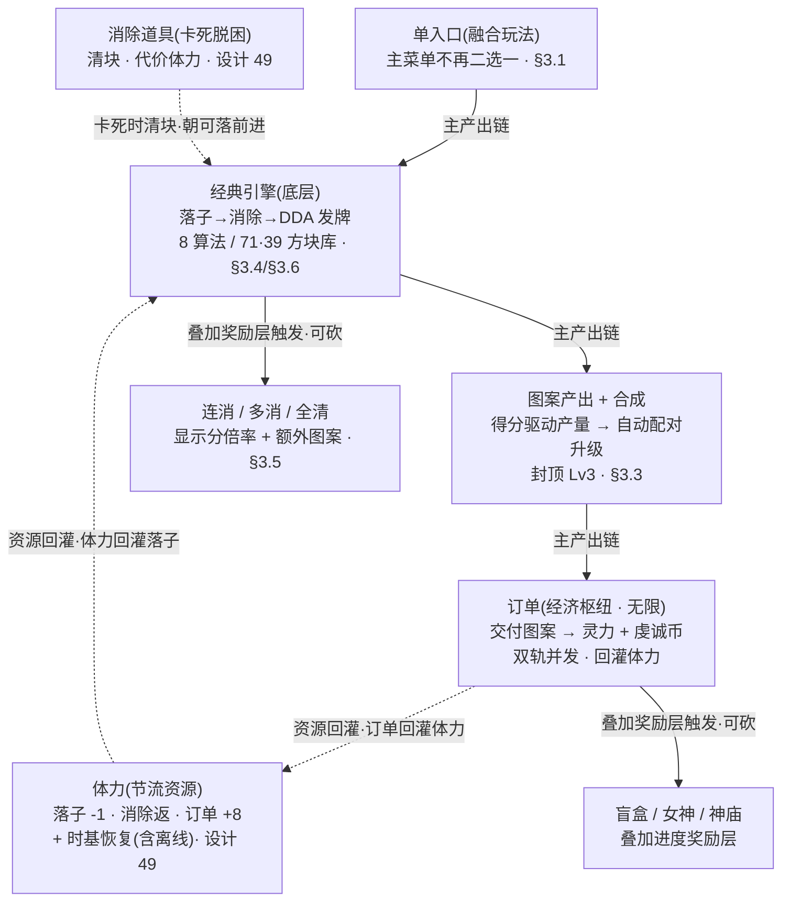

# 玩法融合 · 经典吸收进合成订单

把两个并存入口（经典无尽 / 合成订单）融成**一套**循环：经典核心<mark>完全吸收</mark>为底层引擎，合成订单的体力 / 合成 / 订单 / 宝箱 / 女神 / 神庙是其完整经济。本篇逐条裁决 8 个冲突点，给出经典「保留 / 被覆盖」清单与融合落地的设计指引。

> [!WARNING]
> **融合玩法运行在无局 · 无尽模型下**（[设计 49](#49-infinite-no-rounds)）：单条持续运营的无尽循环——无「局」概念、订单无限、**无任何 GameOver**、局内态整盘跨会话续存。卡死与体力归零都不结束游戏，由两条兜底脱困（体力时基恢复 + 消除道具）。本篇凡涉「结束条件 / 体力作单局预算 / 通关」处均以无尽模型为准（§3.2 / §八决策 3 已据此重定）；旧「三出口结束模型」已被覆盖。

> [!NOTE]
> **立项信息**
>
> | 项 | 内容 |
> | --- | --- |
> | **类型** | 玩法融合 · 顶层裁决设计 |
> | **设计依据** | 经典无尽现状（[01](#01-gameplay-overview) / [02](#02-dynamic-difficulty)）与合成订单现状及完整设计（[09](#09-merge-order-energy) / [10](#10-score-element-rm-collect) / [11](#11-core-loop-completion)）两套设计的对照——本篇裁决建立在这两套之上 |
> | **方向约束** | 离线还原 · **去变现**（无体力购买 / 无广告复活 / 无道具内购——项目红线）。融合不引入任何变现入口 |
> | **影响范围** | 顶层裁决，不改任何已落地系统的内部数值。落点集中在 **UI 入口与窗口组织**（主菜单单入口、两窗合一）+ **三处跨模式状态隐患** + **存档结构合并**，纯逻辑系统（合成 / 订单 / 体力 / 结算 / 智能生成 / 宝箱 / 女神 / 神庙）维持现状 |
> | **已锁定决策（不再讨论）** | ① 融合产物 = 一份统一设计文档；② 经典**完全吸收**，移除「纯无尽」独立入口；③ 运行在无局 · 无尽模型下（[设计 49](#49-infinite-no-rounds)）：无 GameOver、体力为持续运营节流资源 + 时基恢复。见 [§七](#29-gameplay-fusion::decisions) |

## 一、改什么与为什么 {#why}

当前有<mark>两个并存的可玩入口</mark>，本质是同一款游戏的「浅版 / 深版」分叉：

| 入口 | 是什么 |
| --- | --- |
| **经典无尽** | 8×8 拖放消除 + 8 算法动态难度（DDA），纯刷分，无处可落即 GameOver |
| **合成订单** | 落子消除 → 产图案 → 自动合成 → 交订单换灵力 / 虔诚币，带体力、盲盒、女神、神庙；运行在无局 · 无尽模型下（[设计 49](#49-infinite-no-rounds)），无 GameOver、订单无限、整盘续存 |

两者共用同一套落子消除核心、同一计分公式、同一发牌逻辑，靠一个模式开关分流。合成订单本就把方块层定位为「唯一产出引擎」，其智能生成的最底层即经典现有 DDA，上层经济套在其外——**合成订单本来就是「经典核心 + 上层经济」**。

> [!WARNING]
> **问题（为何融合）：**
>
> - **入口分叉割裂体验**：玩家在主菜单二选一（浅版刷分 vs 深版经营），把同一款游戏拆成两个半成品的印象。
> - **两套文档各说各话**：01（经典）与 11（合成订单）在 DDA、计分、连消、结束条件上重叠且口径不一，无单一裁决。
> - **共享状态埋了跨模式隐患**：经典与合成订单复用同一套全局游戏状态，跨模式切换时部分状态未归一（详见 [§六](#29-gameplay-fusion::dev) 三隐患），目前靠「每次进窗口重置」掩盖，融合为单窗口后须把不变量写明。
>
> **目标（已拍板）：**融成**一套**——经典完全吸收进合成订单（不再有纯刷分独立入口），保留体力预算作单局约束。经典的 DDA / 计分公式 / 方块库 / 连消钩子全部下沉为融合玩法的底层。

## 二、融合后的单一玩法（总览） {#overview}

一个入口、一套**无尽**循环（[设计 49](#49-infinite-no-rounds)）：<mark class="g">落子（扣体力）→ 消除（返体力）→ 智能生成发牌 → 产图案 / 合成 / 交订单换灵力 → 宝箱 / 女神 / 神庙叠加奖励 → 订单刷新下一单（无限）→ 继续</mark>。经典骨架（落子→消除→DDA 发牌）是**引擎**，合成订单的经济是**完整循环**，叠加奖励层（连消 / 多消 / 全清、宝箱、女神、神庙）**可砍不影响主链**。体力是循环的**节流资源**（持续补给 + 时基恢复），不是单场预算；卡死与体力归零由两条兜底脱困而非结束。

## 三、冲突逐条裁决（本篇核心） {#verdict}

八个在 01（经典）与 11（合成订单）之间口径分叉的点，逐条给「经典 × 合成订单 × 融合后取定」，**无悬而未决**。

### 3.1 入口 / 模式 {#v1}

| 维度 | 取定 |
| --- | --- |
| 经典（01） | 主菜单 CLASSIC 入口 → 纯刷分玩法 |
| 合成订单（11） | 主菜单「合成订单 DEMO」入口 → 带经济的深版玩法 |
| 融合后取定 | **单入口**。主菜单去掉「CLASSIC / 合成订单 DEMO」二选一，「开始游戏」直接进融合玩法。模式开关失去分流意义（融合态恒为深版） |

### 3.2 结束条件 {#v2}

| 维度 | 取定 |
| --- | --- |
| 经典（01） | 唯一结束 = 剩余手牌无任何合法落点 → 硬 GameOver |
| 合成订单（旧分场次模型） | 曾有三条出口：完成目标单数 → 通关；体力耗尽 → 软 GameOver；无处可落 → 硬 GameOver |
| 融合后取定 | **无任何 GameOver**（[设计 49](#49-infinite-no-rounds)）。游戏是单条持续运营的无尽循环，无「局」、无通关、无软/硬 GameOver。**卡死与体力归零都不结束游戏**，由两条兜底脱困：**① 体力时基恢复**（无条件、纯时间驱动、含离线，[49·§3.2](#49-infinite-no-rounds::regen)）**② 消除道具**（卡死时主动清块、代价体力、无限可用，[49·§3.1](#49-infinite-no-rounds::cleartool)）。经典「无处可落即结束」与合成订单旧三出口**全部被覆盖** |

> [!NOTE]
> **体力与无尽的关系（节流资源 + 时基恢复）**：体力不再是单场预算，而是持续运营的节流资源。体力归零不结束游戏——靠时基恢复（含离线）迟早回到可用量，靠消除道具脱困卡死。脱困闭环（卡死 + 0 体力也能脱困）见 [49·§3.3](#49-infinite-no-rounds::deadlock-proof)。

### 3.3 计分语义 {#v3}

| 维度 | 取定 |
|---|---|
| 经典（01） | 局内得分 = 刷分目标，同时驱动 DDA 分数段、存最高分。落子 +格数、消除 `×10 + 行列² ×30`。连击有计数但**未进任何得分公式**（死钩子，见 <a href="#29-gameplay-fusion::v5">§3.5</a>） |
| 合成订单（11） | 局内不刷得分（落子 / 消除均不累加可见分）；用消除基础分作**元素产出的内部驱动量**，不计入玩家可见分；交付累计「交付分」记经营成绩 |
| 融合后取定 | **三个量各司其职、口径写明，不强行合并**： ① **消除基础分** = 驱动量，喂元素产出与连消倍率，**不是玩家可见的「真分数」**； ② **交付累计分** = 经营成绩，无通关后作**生涯累计统计**（跨会话累计，可用于成就 / 展示，[设计 14 §3.1](#14-save-system::boundary) 进盘）； ③ **最高分** = 经典遗产，跨会话存储的长期挑战指标。 <mark class="y">融合后须明确「玩家可见的主分数」口径</mark>，并理清局内可见分在融合玩法的角色（详见 <a href="#29-gameplay-fusion::dev">§6.3</a> 隐患 A） |

> 本篇不改计分公式（消除基础分公式是单一信息源，两路共用），只裁定三个分量的语义归属。

### 3.4 发牌 {#v4}

| 维度 | 取定 |
| --- | --- |
| 经典（01） | 纯 DDA：每次补牌按动态难度权重橡皮筋选 tier、tier 内 8 算法加权抽（见 02）。分数 < 1000 走随机无死亡，< 15000 叠「清屏窗口」 |
| 合成订单（11） | 同一条补牌路径。叠加「需求拉动元素注入」（待注入元素队列灌入候选块）。**注意**：11·§八 设计的智能生成 R1–R3 上层仲裁已写成纯逻辑**但未接入任一玩法窗口**（仅被单测引用），现状发牌实际只走底层 DDA（R4） |
| 融合后取定 | **统一为一套发牌**：底层恒为 DDA（R4，即经典动态难度）；元素注入沿用需求拉动。**智能生成 R1–R3 仲裁层的「是否接线进融合窗口」单列为范围开关**（见 [§七 #1](#29-gameplay-fusion::decisions)）——接则套在 R4 之外（四规则都不触发回落 R4，行为可降级），不接则维持现状只走 R4。两选项都**不改 DDA 本身** |

> 发牌入口在两路本已共用同一条补牌路径；R1–R3 接线属可选增强（[§6.5](#29-gameplay-fusion::dev)）。动态难度权重的跨模式 / 跨局残留须在融合开局时处理（[§6.3 隐患 B](#29-gameplay-fusion::dev)）。

### 3.5 连消（Combo 死钩子点亮） {#v5}

| 维度 | 取定 |
| --- | --- |
| 经典（01） | 连击连续消除 +1、断了清零，**只驱动屏幕弹字**（COMBO×N / PERFECT），<mark class="y">未进任何得分公式</mark>——已埋好但未启用的数值钩子（死钩子） |
| 合成订单（11） | **连消已点亮**，但走的是**另一条独立链**：连消链经结算算连消倍率（×1.0→2.0 封顶），**只乘显示分**，不参与元素产出与全清判定。经典连击在此仅被镜像为「≥2 才显示」的弹字量 |
| 融合后取定 | **点亮经典死钩子 = 采用合成订单已实现的连消倍率链**。融合后玩家只在**一条**连消语义下：连消链长 → 显示分倍率（×1.0/1.2/1.5/1.8/2.0 封顶，见 [11·§5.3](#11-core-loop-completion::combo-table)）。**铁律**：倍率<mark>只乘显示分，不参与元素产出与全清判定</mark>（[11·§5.5](#11-core-loop-completion::settle) 已编码保证）。经典连击降为**纯视觉镜像量**（弹字用），不再是独立的「待启用钩子」 |

> 连消逻辑归一到合成订单已实现的结算链；融合窗口沿用其连消链 → 弹字镜像。经典侧「连击纯计数」的旧路径随两窗合一被覆盖。

> [!TIP]
> **「死钩子点亮」的准确含义**：连消进入**显示分**而非元素经济。这是刻意隔离——会连消的玩家拿高分爽感，但图案经济不被连消通胀（否则连消变成刷图案捷径，<a href="#11-core-loop-completion::economy">11·§六</a> 经济平衡失效）。融合**不**把连消塞进消除基础分公式（那会同时污染元素产出），而是沿用结算的「基础分喂经济 / 显示分给爽感」两分账。

### 3.6 方块库 / 早期屏蔽 {#v6}

| 维度 | 取定 |
| --- | --- |
| 经典（01） | **71 种形状**定义、抽取池 **39 种 COMMON**；首发固定 `[9,39,24]`；分数 < 10000 剔除大形状 |
| 合成订单（11） | 同库（共用方块库 / 补牌）。注意：早期屏蔽以局内可见分为阈值，而合成订单局内可见分恒 0 → 早期屏蔽**在合成订单里实际全程生效**（始终剔除大形状） |
| 融合后取定 | **保留**方块库与首发固定（开局好上手），与体力起步不冲突。早期屏蔽**保留**，但其阈值依赖的「可见分口径」随 [§3.3](#29-gameplay-fusion::v3) 的计分归一一并理清——融合后须确认早期屏蔽以哪个分量为阈值（详见 [§6.3 隐患 A](#29-gameplay-fusion::dev)），避免「分数恒 0 → 永久屏蔽大形状」与「分数随交付增长 → 中途解除屏蔽」两种行为含糊 |

> 方块库 / 首发零改动；早期屏蔽阈值口径连同计分归一一起拍（[§6.3 隐患 A](#29-gameplay-fusion::dev) 的连带项）。

### 3.7 存档 {#v7}

| 维度 | 取定 |
| --- | --- |
| 经典（01） | 局内存档：棋盘 + 手牌 + 分数 + 最高分。另有动态难度权重自存一份 |
| 合成订单（无尽模型） | **整盘跨会话存档**（[设计 14](#14-save-system)）：元层（灵力 / 虔诚币 / 经验·守护者 / 神庙 / 盲盒 / 女神 / 今日祈愿）+ 局内态（棋盘 / 手牌 / 合成区 / 进行中订单 / 体力 / 待投放队列 / 连消链 / 全清武装）**都进盘**，退出重进从原状态继续。只有纯内存瞬态（悔棋栈）不进盘 |
| 融合后取定 | **合并为一套整盘存档视图**（[设计 14](#14-save-system)）。无尽模型下无「局」、无重开，局内态必须续存——故棋盘 / 手牌 / 体力 / 合成区 / 订单**进盘**，与元层进度同一套加载 / 落盘时机。经典的最高分并入元层语义（跨会话长期指标）。**断点续玩 = 必做**：玩家退出时摆了一半的棋盘 / 没交完的订单 / 当前体力，重进时都在 |

> 核心是整盘续存（元层 + 局内态）走同一套加载 / 落盘时机。无尽模型下「局内续玩」就是整盘续存本身——重进恢复整盘后从原状态继续，无「重开 / 通关」概念。详见 [§6.4](#29-gameplay-fusion::dev) 与 [设计 14](#14-save-system)。

### 3.8 DDA 强度适配 {#v8}

| 维度 | 取定 |
|---|---|
| 经典（01） | DDA 以局内可见分为强度信号：<1000 不激活、1000~15000 叠清屏窗口、≥1000 激活 8 算法权重段（02）。高分 → 难度递增 |
| 合成订单（11） | 局内可见分恒 0（不刷分），故强度信号**永远落在「分数 < 1000 未激活」+「分数 < 15000 清屏窗口」分支**——DDA 的 8 算法权重段在合成订单里**从不触发**，实际全程走「清屏窗口 / 随机无死亡」。即：合成订单现状下 DDA 的「橡皮筋做局」能力是**休眠**的 |
| 融合后取定 | 融合后分数语义重新理清（<a href="#29-gameplay-fusion::v3">§3.3</a>）。<mark class="y">DDA 用哪个分量作强度信号，决定它在融合玩法里是否激活做局</mark>——这是一个需配平的范围开关（见 <a href="#29-gameplay-fusion::decisions">§七 #2</a>）： **选项甲（保守）**：DDA 维持现状以局内可见分为信号，融合后该量若仍恒低 → DDA 继续休眠在清屏窗口（行为同合成订单现状，最稳）； **选项乙（启用做局）**：把 DDA 强度信号改接**经营进度量**（如交付累计分或完成单数），让 DDA 随经营推进而升难度，与体力 / 订单节奏配合。 两选项都**不改 8 算法与权重表**，只改「喂给强度信号的参数」 |

> 选项乙需 test 配平「经营进度 → 难度」曲线；选项甲零配平。默认取甲（最小变更、零回归），乙记入待拍板（<a href="#29-gameplay-fusion::decisions">§七 #2</a>）。详见 <a href="#29-gameplay-fusion::dev">§6.3 隐患 C</a>。

## 四、经典被吸收后的去向 {#absorb}

明确「哪些保留、哪些被覆盖移除」，避免融合落地时误删仍在用的资产。

### 4.1 下沉为底层（保留） {#keep}

| 经典资产 | 融合后角色 |
| --- | --- |
| 8 算法动态难度（DDA） | 融合发牌的底层（R4）；强度信号口径见 [§3.8](#29-gameplay-fusion::v8) |
| 计分公式 | 消除基础分驱动量（喂元素产出 + 连消倍率），两路单一信息源 |
| 71 / 39 方块库 | 保留，全玩法共用 |
| 首发固定 `[9,39,24]` | 保留，开局好上手 |
| 早期屏蔽（<10000 剔大形状） | 保留；阈值口径连同计分归一一起理清（[§3.6](#29-gameplay-fusion::v6)） |
| 连消钩子（由死转活） | 点亮为连消倍率链（显示分），经典连击降为视觉镜像量（[§3.5](#29-gameplay-fusion::v5)） |

### 4.2 被覆盖 / 移除 {#remove}

| 经典要素 | 处置 | 替代 |
| --- | --- | --- |
| <mark class="r">「纯无尽刷分」独立入口</mark> | **移除**主菜单二选一，去掉独立的纯刷分模式 | 单入口融合玩法（[§3.1](#29-gameplay-fusion::v1)） |
| <mark class="r">「无处可落即唯一 GameOver」单一结束模型</mark> | **被覆盖移除** | 无任何 GameOver（[设计 49](#49-infinite-no-rounds)）：卡死由消除道具脱困、体力归零由时基恢复兜底（[§3.2](#29-gameplay-fusion::v2)） |
| <mark class="r">合成订单旧「通关 / 软 GameOver / 硬 GameOver」三出口结束模型</mark> | **被覆盖移除** | 无局 · 无尽循环：订单无限、无通关、两条兜底脱困（[设计 49](#49-infinite-no-rounds)） |
| 经典侧「连击纯计数、未进分」的旧路径 | **随两窗合一被覆盖** | 合成订单的连消倍率链（[§3.5](#29-gameplay-fusion::v5)） |

> [!NOTE]
> **命名不连带改动**：「移除纯无尽独立入口」指**玩法 / 入口下线**，不等于消灭历史命名。窗口与状态的内部命名即便职责变化，是否改名是独立的低优先级整理项，不在本融合范围（改名要连带动入口路径 / prefab / 调用点，对已交付窗口是真风险）。

## 五、融合落点指引（供后续 /pipeline dev） {#dev}

### 5.1 主菜单单入口化 {#dev-entry}

- **现状**：主菜单有两个开始入口——CLASSIC（→ 经典纯刷分）与「合成订单 DEMO」（→ 深版玩法）。另有设置 / 个人信息 / 排行榜入口与 BEST 显示。
- **本篇目标**：合并为**一个「开始游戏」按钮**→ 进融合玩法。去掉「二选一」的视觉与文案分叉。BEST（最高分）显示保留。设置 / 个人信息 / 排行榜入口不动。
- **注意**：入口去留只动主菜单的 UI 构建，不动数据层。

### 5.2 两窗合一 {#dev-merge}

- **现状**：经典窗与合成订单窗是两个独立窗口，棋盘 / 拖拽 / ghost / 落子流程**同构**。差异在：合成订单窗多体力条 / 订单卡 / 合成区 / 盲盒 / 神庙 / 悔棋，且落子结算插入扣体力 / 元素入区 / 连消结算 / 存档落盘；经典窗是裸刷分 + 大分数 + DDA。
- **本篇目标**：融合为**一套窗口**承载完整无尽循环（落子 + 消除 + 体力 + 合成 + 订单 + 叠加奖励层 + 消除道具脱困入口；无结束判定，[设计 49](#49-infinite-no-rounds)）。实现路径（dev 取舍）：**以合成订单窗为主体**（它已是完整循环的超集），把经典独有的视觉（如大居中分数，若融合保留可见分）按需并入；或反向。<mark class="y">注意经典窗已承载塔罗木质换皮（设计 27）</mark>——合一时美术换皮归属须一并理清（哪套视觉是融合窗口的最终皮）。
- **零回归红线**：棋盘坐标映射常量（格尺寸 / 原点 / 槽位）**绝不动**（动了落子对位偏）；拖拽 / ghost / 落子合法性判定保留。

### 5.3 修三处跨模式状态隐患 {#dev-hazards}

三隐患都源于经典与合成订单**复用同一套全局游戏状态**。现状靠「每次进窗口重置」掩盖；融合为单窗口后须把不变量写明，避免日后再分叉时复发。

> [!WARNING]
> **隐患 A · 连击 / 局内可见分在单窗口下的角色归一**
>
> **现状（不是当前的活 bug）**：连击与局内可见分是窗口间共享的状态。旧分场次模型靠「每次进窗口重置」掩盖跨窗口残留。
>
> **本篇目标（无尽模型下重定）**：无尽整盘续存（[设计 14](#14-save-system)）下，进窗口**不再清零局内态**——而是恢复整盘态（含连消链 / 局内可见分等局内分量）。故旧「进入即重置」不变量**改为「重进恢复整盘态」**：连消链 / 全清武装位等局内瞬态分量随整盘续存进盘（[设计 14 §3.1](#14-save-system::boundary)），重进时恢复而非清零。仍须确定三个分量的最终角色：消除基础分（驱动量，不可见）/ 交付累计分（经营成绩，生涯累计进盘）/ 最高分（跨会话）；连击降为视觉镜像。**连带项**：早期屏蔽阈值（<a href="#29-gameplay-fusion::v6">§3.6</a>）依赖的「可见分口径」随此一并定。

> [!WARNING]
> **隐患 B · 动态难度权重跨模式 / 跨局 / 跨启动残留**
>
> **现状（真实残留）**：动态难度权重**持久化到磁盘**，启动时回读。两窗进入时都只做开局轻量准备（清补牌索引 / 清屏窗口 / 冷却），**都不做完整重置**（完整重置才清动态难度权重）。结果：动态难度权重**跨局、跨经典↔合成订单、跨 app 重启持续累积**——上一局做局到 -200，下一局（哪怕换模式）从 -200 继续。
>
> **本篇目标**：融合开局时**明确动态难度权重的归一策略**——是每局重置（每局公平起步）还是**刻意**跨局累积（橡皮筋长期记忆玩家水平）。这是个设计取舍（不是必须改成重置），但**必须在融合时显式选定并写明**，不能继续靠「两窗都恰好不完整重置」的隐式现状。

> [!WARNING]
> **隐患 C · DDA 对「无分压」场景的适配**
>
> **现状（休眠）**：合成订单局内可见分恒 0，强度信号永远走「未激活 + 清屏窗口」分支，DDA 的 8 算法权重段从不触发（见 <a href="#29-gameplay-fusion::v8">§3.8</a>）。即合成订单里 DDA「做局」能力休眠。
>
> **本篇目标**：随 <a href="#29-gameplay-fusion::v8">§3.8</a> 的范围开关定——**默认选项甲**（DDA 维持以局内可见分为信号、在融合玩法里继续休眠在清屏窗口，零回归）；**可选项乙**（DDA 强度信号改接经营进度量，让做局随经营推进激活，需 test 配平「进度 → 难度」曲线）。见待拍板 <a href="#29-gameplay-fusion::decisions">§七 #2</a>。

### 5.4 存档结构合并 {#dev-save}

- **现状**：两套存档并存——经典局内存档（棋盘 / 手牌 / 分数 / 最高分）、动态难度权重单独存一份、以及元层存档（设计 14，灵力 / 虔诚币 / 女神 / 神庙 / 盲盒等）。
- **本篇目标**：合并为**一套整盘存档视图**（[设计 14](#14-save-system)，无尽模型整盘续存）。核心动作：① 把经典最高分的跨会话存储并入元层时机（与整盘存档同一加载 / 落盘节点）；② 局内态（棋盘 / 手牌 / 合成区 / 订单 / 体力 / 连消链 / 全清武装）随整盘续存进盘，重进恢复整盘（断点续玩 = 必做，[设计 14 §3.1](#14-save-system::boundary)），悔棋栈仍不进盘；③ 动态难度权重的存储随隐患 B 的归一策略定。

### 5.5 智能生成 R1–R3 接线（可选增强） {#dev-arbiter}

- **现状**：智能生成 R1–R3 优先级链（防卡死 / 清盘增难 / 引导）连同其上下文计数（连续无消除 / 连击防累）已写成纯逻辑、有单测，**但未接入任一玩法窗口**——发牌只走底层 DDA（R4）。
- **本篇目标**：是否把 R1–R3 接进融合窗口，单列范围开关（[§七 #1](#29-gameplay-fusion::decisions)）。**接**则在补牌前插一层仲裁：接管则用其算法、不接管回落 DDA（四规则都不触发 = 现状行为零改变）；并在每次落子后推进上下文计数。**不接**则维持现状。两选项都不改 DDA。

## 六、验收标准（给后续 test / dev 逐条核对） {#accept}

> [!NOTE]
> **验收性质**：本篇为**设计文档**，验收分两类——**(A) 文档自检项**（本篇产出即可核对）；**(B) 落地核验项**（后续 `/pipeline dev` 实现融合后按此核验）。本阶段**不含代码改动**。

### 6.1 文档自检项（A，本篇即核） {#acc-a}

- 8 个冲突点（[§3.1](#29-gameplay-fusion::v1)–[§3.8](#29-gameplay-fusion::v8)）逐条给「经典 × 合成订单 × 融合后取定」，**无悬而未决**（范围开关项明确列入 [§七](#29-gameplay-fusion::decisions)，非悬空）。
- 明确单入口（[§3.1](#29-gameplay-fusion::v1)）、无局 · 无尽 + 无 GameOver + 两条兜底（[§3.2](#29-gameplay-fusion::v2) / [设计 49](#49-infinite-no-rounds)）、连消钩子点亮 = 显示分倍率链（[§3.5](#29-gameplay-fusion::v5)）、发牌统一为底层 DDA（[§3.4](#29-gameplay-fusion::v4)）。
- 列出经典「保留」（[§4.1](#29-gameplay-fusion::keep)，6 项）与「被覆盖 / 移除」（[§4.2](#29-gameplay-fusion::remove)，3 项）清单 + 融合落点（[§五](#29-gameplay-fusion::dev)，四组）。
- 凡本篇目标未落地处显式标注「现状 / 本篇目标」，无「设计目标写成现状」。
- doc 01 顶部加状态说明（被 29 吸收，经典核心已下沉）+ index 注册 29 + 01 / 11 主题修订到位，新旧无矛盾。

### 6.2 落地核验项（B，融合实现后核） {#acc-b}

- **编译 0 error**；主菜单单入口可进融合玩法，无残留的「二选一」按钮。
- **无 GameOver + 两条兜底可达**：Play 验无通关 / 无软或硬 GameOver 面板；卡死时消除道具可脱困、体力归零靠时基恢复（含离线）回升（验收锚在 [设计 49 §6.2](#49-infinite-no-rounds::accept) B 组）。
- **连消倍率隔离**：连消倍率只乘显示分，不改元素产出与全清判定（沿用已有连消结算单测，[11·§5.5](#11-core-loop-completion::settle)）。
- **三隐患按选定策略落地**：动态难度权重归一策略已显式实现并写明（隐患 B）；DDA 强度信号口径已定（隐患 C）。**注**：隐患 A 旧「进入即重置局内瞬态」在无尽整盘续存下改为「重进恢复整盘态、不清零」——局内瞬态分量随整盘续存，不再每次进窗口清零（详 [§6.3 隐患 A](#29-gameplay-fusion::dev)）。
- **存档整盘续存**：元层 + 局内态都进盘（[设计 14](#14-save-system)）；融合后退出重进整盘往返不丢（棋盘 / 手牌 / 合成区 / 订单 / 体力 / 元层进度逐项一致，沿用设计 14 单测口径）。
- **范围开关按 <a href="#29-gameplay-fusion::decisions">§七</a> 的拍板结果落地**（R1–R3 接线、DDA 强度信号源）。

## 七、待拍板清单（范围开关，交 boss / 用户） {#decisions}

下列为**有安全默认可走**的范围开关：默认值不与 spec / 已锁定决策抵触、可逆，按默认推进即可，无需停机。boss / 用户复核时若要改，另开增量即可（节点已设计好）。

| # | 开关 | 安全默认（本篇取定） | 备选 | 影响面 |
| --- | --- | --- | --- | --- |
| 1 | **智能生成 R1–R3 是否接入融合窗口**（[§5.5](#29-gameplay-fusion::dev)） | **默认不接**：维持现状只走底层 DDA（R4）。最小变更、零回归，且 R1–R3 已可降级（四规则不触发即回落 R4） | 接入：在补牌前插仲裁层 + 落子后推进上下文，启用防卡死 / 清盘增难 / 引导 | 中。接入提升发牌智能但增配平面；不接维持现状发牌 |
| 2 | **DDA 强度信号源**（[§3.8](#29-gameplay-fusion::v8) / [§6.3 隐患 C](#29-gameplay-fusion::dev)） | **默认选项甲**：维持以局内可见分为信号。融合后该量若仍恒低则 DDA 继续休眠在清屏窗口（= 合成订单现状，零配平、零回归） | 选项乙：改接经营进度量（交付累计分 / 完成单数），让 DDA 做局随经营激活 | 中。乙需 test 配平「进度 → 难度」曲线；甲零配平 |
| 3 | **动态难度权重归一策略**（[§6.3 隐患 B](#29-gameplay-fusion::dev)） | **默认随整盘续存**：无尽模型下无「局」边界，动态难度权重作局内态进盘（[设计 14](#14-save-system)）、重进恢复，等价「跨会话持续记忆玩家水平」（橡皮筋长期生效，与无尽长线经营一致） | 不进盘、每次启动重置（每次进游戏从中性权重起，更可预测但丢失长期做局记忆）| 小。单处归一行为；不改 8 算法 / 权重表 |
| 4 | **融合后「玩家可见主分数」口径**（[§3.3](#29-gameplay-fusion::v3) / [§6.3 隐患 A](#29-gameplay-fusion::dev)） | **默认沿用合成订单现状**：经营成绩用交付累计分作主可见量，消除基础分保持为不可见驱动量。最贴合「合成订单为主体」的融合方向 | 恢复经典「消除即时刷大分数」为主可见量（需把消除基础分接回可见分显示，并重定 DDA 信号） | 中。决定 HUD 主数字与 DDA 信号；牵动隐患 A / C |

> [!NOTE]
> 四项默认**组合自洽**：以合成订单为主体（#4 默认）、DDA 维持现状信号在融合里休眠（#2 默认）、动态难度权重随整盘续存（#3 默认，与无尽整盘续存一致）、R1–R3 暂不接（#1 默认）——构成「最小变更、零回归、行为可预测」的安全融合基线。任一项改备选都是**局部增量**，不返工已落地系统。

## 八、拍板决策记录 {#confirm}

下列为本融合任务的已锁定决策，按「取定」列执行；依据保留供追溯。体例仿 [11·§十二](#11-core-loop-completion::confirm)。

| # | 决策 | 取定（已确认） | 依据 |
| --- | --- | --- | --- |
| 1 | **融合产物形态** | 一份统一策划设计文档（本篇）。代码融合另起 `/pipeline dev` | 产物定为「策划文档」，正是 plan 角色职责；代码层是后续独立任务 |
| 2 | **经典去留** | 经典**完全吸收**进合成订单，**移除「纯无尽」独立入口**，只剩一套带订单 / 体力 / 合成的循环 | 两入口本是同款游戏的浅 / 深分叉，本就是「经典骨架 + 上层经济」；单入口消除割裂 |
| 3 | **运行模型 / 体力角色** | 无局 · 无尽循环（[设计 49](#49-infinite-no-rounds)）：无 GameOver、订单无限、整盘续存；体力是**持续运营的节流资源 + 时基恢复**（不是单场预算）| 失败惩罚（GameOver / 通关后无事可做）是退坑点；无尽 + 整盘续存使「想玩就玩、停了进度还在」，体力作节流资源使「会消除 → 体力净正 → 玩得久」的技巧驱动定位仍成立，归零由时基恢复 + 消除道具兜底 |

## 九、风险 {#risk}

| 风险 | 应对 |
| --- | --- |
| 两窗合一改坏在跑的玩法（核心玩法窗全程在跑，改一处坐标 / 逻辑即整盘回归） | §5.2 立零回归红线：棋盘坐标常量绝不动、拖拽 / ghost / 落子判定保留；以合成订单窗（完整循环超集）为主体减少新写 |
| 隐患若按「直觉重置」一刀切，可能误清刻意续存的局内态（如动态难度权重长期记忆、整盘续存的棋盘） | 隐患归一**显式列为「须选定并写明」**；无尽模型下局内态随整盘续存（不再每次进窗口清零）；§七 #3 给默认 + 备选，由 boss 拍 |
| 美术换皮归属含糊（经典窗已贴塔罗木质皮，合一时哪套是最终皮不清） | §5.2 显式点出换皮归属须随两窗合一一并理清，列为 dev 落地的明确子项 |
| 范围开关被当方向问题反复上报，空停流水线 | 四项开关均有安全默认且可逆，本篇按默认推进、记入 §七 待拍板，不入 blockers |

## 相关文档

- [← 返回总览](#)
- [49 · 无局 · 无尽核心模型(覆盖三出口结束模型)](#49-infinite-no-rounds)
- [01 · 玩法总览(经典核心,已下沉为融合引擎)](#01-gameplay-overview)
- [11 · 核心玩法补全(合成订单完整设计)](#11-core-loop-completion)
- [02 · 动态难度拆解(DDA / R4 现状)](#02-dynamic-difficulty)
- [09 · 合成订单切片(体力 / 合成 / 订单现状)](#09-merge-order-energy)
