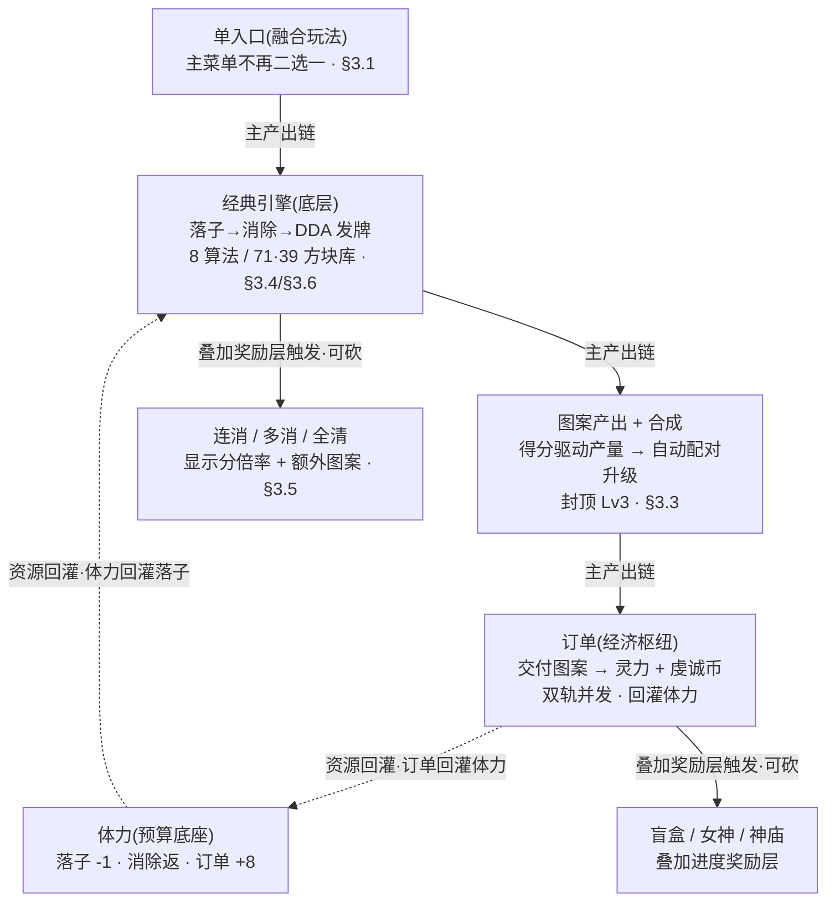

# 玩法融合 · 经典吸收进合成订单

把两个并存入口（经典无尽 / 合成订单）融成**一套**循环：经典核心<mark>完全吸收</mark>为底层引擎，合成订单的体力 / 合成 / 订单 / 宝箱 / 女神 / 神庙是其完整经济。本篇逐条裁决 8 个冲突点，给出经典「保留 / 被覆盖」清单与代码层融合落点指引。**仅策划阶段，不改任何工程代码**。

> [!WARNING]
> **读前必看 · 本篇与工程现状的关系（单一事实源 = 代码现状）**
>
> 本篇凡涉及已落地系统，数值 / 符号**对齐代码现状**（`Module/BlockBlast/` 与 `UI/BlockBlastUI/`），不照旧设计稿的快照。两入口的代码本就是**同一套「经典骨架 + 上层经济」**，靠 `BlockGameState.MergeOrderMode` 这个布尔门控分流——融合即把分流去掉，让经典核心常驻为底层。
>
> - **「现状」** = 已编译落地、可在工程核实的行为。涉及它的句子可直接对照代码。
> - **「本篇目标」** = 融合后要达成但尚未落地的改动（单入口、两窗合一、三隐患修复、存档合并）。每处**显式标注**，仿 [11](#11-core-loop-completion) 的「现状 / 本篇新增」体例，**绝不把设计目标写成现状**。
> - 代码层融合是后续独立的 `/pipeline dev` 任务，**本篇不改码**，只给落点指引（见 [§六](#29-gameplay-fusion::dev)）。

> [!NOTE]
> **立项信息**
>
> | 项 | 内容 |
> | --- | --- |
> | **类型** | 玩法融合 · 顶层裁决设计 仅策划阶段，本篇不进开发 |
> | **设计基线** | 经典无尽现状（[01](#01-gameplay-overview) + [02](#02-dynamic-difficulty)）× 合成订单现状与完整设计（[09](#09-merge-order-energy) / [10](#10-score-element-rm-collect) / [11](#11-core-loop-completion)）× 代码现状（`BlockGameState` / `BlockScoring` / `DynamicWeightDiff` / `MergeOrderState` / `ClearSettlement` / `HandGenerationArbiter`，UI 三窗 `MainMenuWindow` / `GameWindow` / `MergeOrderWindow`） |
> | **方向约束** | 离线还原 · **去变现**（无体力购买 / 无广告复活 / 无道具内购——项目红线）。融合不引入任何变现入口 |
> | **影响范围** | 顶层裁决，不改任何已落地系统的内部数值。落点集中在 **UI 入口与窗口组织**（主菜单单入口、两窗合一）+ **三处跨模式状态隐患** + **存档结构合并**，纯逻辑系统（合成 / 订单 / 体力 / 结算 / 智能生成 / 宝箱 / 女神 / 神庙）维持现状 |
> | **已锁定决策（不再讨论）** | ① 融合产物 = 一份统一设计文档；② 经典**完全吸收**，移除「纯无尽」独立入口；③ 单局**保留体力预算**作为约束。2026-06-16 用户确认，见 [§七](#29-gameplay-fusion::decisions) |

## 一、改什么与为什么 {#why}

当前有<mark>两个并存的可玩入口</mark>，本质是同一款游戏的「浅版 / 深版」分叉：

| 入口 | 路径（现状） | 是什么 |
| --- | --- | --- |
| **经典无尽** | `MainMenuWindow` → CLASSIC 按钮 → `GameWindow` | 8×8 拖放消除 + 8 算法动态难度（DDA），纯刷分，无处可落即 GameOver |
| **合成订单** | `MainMenuWindow` → 合成订单 DEMO 按钮 → `MergeOrderWindow` | 落子消除 → 产图案 → 自动合成 → 交订单换灵力 / 虔诚币，带体力预算、盲盒、女神、神庙；完成 5 单通关或体力耗尽软 GameOver |

代码层两者**共用同一 `BlockGameState` 单例、同一计分公式 `BlockScoring`、同一发牌方法 `RefillPieces`**，靠 `MergeOrderMode` 这个 bool 门控分流。合成订单自述「方块层是唯一产出引擎」「智能生成 R4 = 经典现有 DDA，R1–R3 套在外面」——**合成订单本来就是「经典核心 + 上层经济」**。

> [!WARNING]
> **问题（为何融合）：**
>
> - **入口分叉割裂体验**：玩家在主菜单二选一（浅版刷分 vs 深版经营），把同一款游戏拆成两个半成品的印象。
> - **两套文档各说各话**：01（经典）与 11（合成订单）在 DDA、计分、连消、结束条件上重叠且口径不一，无单一裁决。
> - **共享单例埋了跨模式状态隐患**：经典与合成订单复用 `BlockGameState` / `DynamicWeightDiff` 等全局单例，跨模式切换时部分状态未归一（详见 [§六](#29-gameplay-fusion::dev) 三隐患），目前靠「每次进窗口重置」掩盖，融合为单窗口后须把不变量写明。
>
> **目标（已拍板）：**融成**一套**——经典完全吸收进合成订单（不再有纯刷分独立入口），保留体力预算作单局约束。经典的 DDA / 计分公式 / 方块库 / 连消钩子全部下沉为融合玩法的底层。

## 二、融合后的单一玩法（总览） {#overview}

一个入口、一套循环：<mark class="g">体力预算下 → 落子（扣体力）→ 消除（返体力）→ 智能生成发牌 → 产图案 / 合成 / 交订单换灵力 → 宝箱 / 女神 / 神庙叠加奖励</mark>。经典骨架（落子→消除→DDA 发牌）是**引擎**，合成订单的经济是**完整循环**，叠加奖励层（连消 / 多消 / 全清、宝箱、女神、神庙）**可砍不影响主链**。

## 三、冲突逐条裁决（本篇核心） {#verdict}

八个在 01（经典）与 11（合成订单）之间口径分叉的点，逐条给「经典现状 × 合成订单现状 × 融合后取定 + 落点」，**无悬而未决**。落点列指明改动落在「设计层裁决 / UI 入口 / 跨模式状态」哪一类（细节见 [§六](#29-gameplay-fusion::dev)）。

### 3.1 入口 / 模式 {#v1}

| 维度 | 取定 |
| --- | --- |
| 经典（01）现状 | `MainMenuWindow` 的 `BtnClassic` → `GameWindow`（纯刷分） |
| 合成订单（11）现状 | `MainMenuWindow` 的 `BtnMerge`（「合成订单 DEMO」）→ `MergeOrderWindow` |
| 融合后取定 | **单入口**。主菜单去掉「CLASSIC / 合成订单 DEMO」二选一，「开始游戏」直接进融合玩法。`MergeOrderMode` 门控失去分流意义（融合态恒为 on） |
| 落点 | **UI 入口**：`MainMenuWindow` 单入口化（[§6.1](#29-gameplay-fusion::dev)）；**窗口组织**：`GameWindow` / `MergeOrderWindow` 合一（[§6.2](#29-gameplay-fusion::dev)） |

### 3.2 结束条件 {#v2}

| 维度 | 取定 |
| --- | --- |
| 经典（01）现状 | 唯一结束 = 剩余手牌无任何合法落点 → 硬 GameOver（`GameWindow.TriggerGameOver`） |
| 合成订单（11）现状 | 三条：完成 `DemoGoalOrders=5` 单 → 通关（`MergeOrderWinWindow`）；体力付不起落子且无单可交付 → 软 GameOver「精力耗尽」；手牌无处可放 → 硬 GameOver。三者均已落地于 `MergeOrderWindow.PlaceAndResolve` |
| 融合后取定 | **以合成订单的多结束模型为准**，统一为三条出口并列：**① 通关**（完成目标单数）**② 软 GameOver**（体力耗尽 + 无单可交付，先给「三出路」缓冲，见 [11·§7.3](#11-core-loop-completion::energy-empty)）**③ 硬 GameOver**（无处可落，由智能生成防卡死兜底后仍兜不住时触发）。经典「无处可落即唯一结束」被覆盖为**三条之一** |
| 落点 | **设计层裁决**：融合窗口沿用 `MergeOrderWindow` 已实现的三出口判定逻辑；「无处可落」的兜底由智能生成 R2 防卡死降低触发率（见 [§3.4](#29-gameplay-fusion::v4) / [11·§八](#11-core-loop-completion::gen-algo)），不改判定本身 |

> [!NOTE]
> **体力与结束的关系（保留体力预算·已拍板）**：融合保留体力作单局约束，故「软 GameOver = 体力耗尽」是结束模型的一等出口，不退化为经典的纯落点死局。三出路缓冲（自然恢复 / 祈愿兑体力 / 领奖含体力）保证体力耗尽不等于立即结束。

### 3.3 计分语义 {#v3}

| 维度 | 取定 |
|---|---|
| 经典（01）现状 | `BlockGameState.Score` = 刷分目标，同时驱动 DDA 分数段、存 `HighScore`。落子 +格数、消除 `×10 + 行列² ×30`（`BlockScoring`）。连击 `Combo` 有计数但**未进任何得分公式**（死钩子，见 <a href="#29-gameplay-fusion::v5">§3.5</a>） |
| 合成订单（11）现状 | 局内不刷 `BlockGameState.Score`（落子 / 消除均不调 `AddScore`）；用 `BlockScoring.ClearScore` 作**元素产出的内部驱动量**（`ElementsForScore`），不计入玩家可见分；交付累计 `MergeOrderState.TotalScore` 作通关 / 结算摘要。结束时一次性把 `TotalScore` 镜像给 `Score` 供结算窗显示 |
| 融合后取定 | **三个量各司其职、口径写明，不强行合并**： ① **消除基础分**（`ClearScore`）= 驱动量，喂元素产出与连消倍率，**不是玩家可见的「真分数」**； ② **交付累计分**（`TotalScore`）= 经营成绩，通关 / 结算摘要； ③ **最高分**（`HighScore`）= 经典遗产，跨局存储的长期挑战指标。 <mark class="y">融合后须明确「玩家可见的主分数」口径</mark>，并理清 `Score` 在融合窗口的角色（详见 <a href="#29-gameplay-fusion::dev">§6.3</a> 隐患 A） |
| 落点 | **设计层裁决 + 跨模式状态**：见 <a href="#29-gameplay-fusion::dev">§6.3 隐患 A</a>（`Score` / `Combo` 在单窗口下的角色归一）。本篇**不改计分公式**（`BlockScoring` 是单一信息源，两路共用） |

### 3.4 发牌 {#v4}

| 维度 | 取定 |
| --- | --- |
| 经典（01）现状 | 纯 DDA：`RefillPieces` → `DynamicWeightDiff.OfferTrio(board, Score)`，按 `dynamicWeight` 橡皮筋选 tier、tier 内 8 算法加权抽（见 02）。分数 &lt; `ActivationScore=1000` 走随机无死亡，&lt; 15000 叠「清屏窗口」 |
| 合成订单（11）现状 | 同一条 `RefillPieces` → `OfferTrio`。叠加「需求拉动元素注入」（`PendingElements` 队列经 `BuildPiece` 灌入候选块）。**注意**：11·§八 设计的智能生成 R1–R3 上层仲裁（`HandGenerationArbiter`）已写成纯逻辑类**但未接入任一窗口**（仅被单测引用），现状发牌实际只走 `DynamicWeightDiff`（R4） |
| 融合后取定 | **统一为一套发牌**：底层恒为 `DynamicWeightDiff`（R4，即经典 DDA）；元素注入沿用需求拉动。**智能生成 R1–R3 仲裁层的「是否接线进融合窗口」单列为范围开关**（见 [§七 #1](#29-gameplay-fusion::decisions)）——接则套在 R4 之外（四规则都不触发回落 R4，行为可降级），不接则维持现状只走 R4。两选项都**不改 `DynamicWeightDiff` 本身** |
| 落点 | **设计层裁决**：发牌入口归一为 `RefillPieces`（已是两路共用）；R1–R3 接线属可选增强（[§6.5](#29-gameplay-fusion::dev)）。**跨模式状态**：`dynamicWeight` 跨模式 / 跨局残留须在融合 `BeginGame` 处理（[§6.3 隐患 B](#29-gameplay-fusion::dev)） |

### 3.5 连消（Combo 死钩子点亮） {#v5}

| 维度 | 取定 |
| --- | --- |
| 经典（01）现状 | `BlockGameState.Combo` 连续消除 +1、断了清零，**只驱动屏幕弹字**（COMBO×N / PERFECT），<mark class="y">未进 <code>BlockScoring</code> 任何公式</mark>——已埋好但未启用的数值钩子（死钩子） |
| 合成订单（11）现状 | **连消已点亮**，但走的是**另一条独立链**：`MergeOrderState.ComboChain` 经 `ClearSettlement` 算连消倍率（`ComboMultPermilleFor`，×1.0→2.0 封顶），**只乘显示分**，不参与元素产出与全清判定。`BlockGameState.Combo` 在此仅被镜像为「≥2 才显示」的弹字量 |
| 融合后取定 | **点亮经典死钩子 = 采用合成订单已实现的连消倍率链**（`ComboChain` + `ClearSettlement`）。融合后玩家只在**一条**连消语义下：连消链长 → 显示分倍率（×1.0/1.2/1.5/1.8/2.0 封顶，见 [11·§5.3](#11-core-loop-completion::combo-table)）。**铁律**：倍率<mark>只乘显示分，不参与元素产出与全清判定</mark>（[11·§5.5](#11-core-loop-completion::settle) 已编码保证）。`BlockGameState.Combo` 降为**纯视觉镜像量**（弹字用），不再是独立的「待启用钩子」 |
| 落点 | **设计层裁决**：连消逻辑归一到 `ClearSettlement`（已实现）；融合窗口沿用 `MergeOrderWindow` 已有的 `settle.ComboChain` → `Combo` 镜像 + 弹字。经典 `GameWindow` 里「`Combo` 纯计数」的旧路径随两窗合一被覆盖 |

> [!TIP]
> **「死钩子点亮」的准确含义**：连消进入**显示分**而非元素经济。这是刻意隔离——会连消的玩家拿高分爽感，但图案经济不被连消通胀（否则连消变成刷图案捷径，<a href="#11-core-loop-completion::economy">11·§六</a> 经济平衡失效）。融合**不**把连消塞进 `ClearScore` 公式（那会同时污染元素产出），而是沿用 `ClearSettlement` 的「baseScore 喂经济 / displayScore 给爽感」两分账。

### 3.6 方块库 / 早期屏蔽 {#v6}

| 维度 | 取定 |
| --- | --- |
| 经典（01）现状 | **71 种形状**定义、抽取池 **39 种 COMMON**（`BlockShapeMap.CommonShapeIds`）；首发固定 `[9,39,24]`（`GameConfigBB.FirstHand`）；分数 &lt; `EarlyGameBlockScoreThreshold=10000` 剔除大形状（`EarlyGameBlockedIds`） |
| 合成订单（11）现状 | 同库（共用 `BlockShapeMap` / `RefillPieces`）。注意：早期屏蔽以 `BlockGameState.Score` 为阈值，而合成订单局内 `Score` 恒 0 → 早期屏蔽**在合成订单里实际全程生效**（始终剔除大形状） |
| 融合后取定 | **保留**方块库与首发固定（开局好上手），与体力起步不冲突。早期屏蔽**保留**，但其阈值依赖的「`Score` 口径」随 [§3.3](#29-gameplay-fusion::v3) 的计分归一一并理清——融合后须确认早期屏蔽以哪个分量为阈值（详见 [§6.3 隐患 A](#29-gameplay-fusion::dev)），避免「分数恒 0 → 永久屏蔽大形状」与「分数随交付增长 → 中途解除屏蔽」两种行为含糊 |
| 落点 | **设计层裁决**：方块库 / 首发零改动；早期屏蔽阈值口径连同计分归一一起拍（[§6.3 隐患 A](#29-gameplay-fusion::dev) 的连带项） |

### 3.7 存档 {#v7}

| 维度 | 取定 |
| --- | --- |
| 经典（01）现状 | `BlockGameState.Save/Load`（键 `block_blast_save_v1`）：棋盘 + 手牌 + 分数 + 最高分。另有 `DynamicWeightDiff` 自存 `dynamicWeight`（键 `block_blast_dynamic_v1`） |
| 合成订单（11）现状 | 元层跨会话存档（设计 14）：`MergeMetaSave` / `MergeMetaPersistence` 存灵力 / 虔诚币 / 经验·守护者 / 神庙 / 盲盒 / 女神 / 完成单数 / 今日祈愿等 13 项。局内瞬态（棋盘 / 手牌 / 订单 / 合成区 / 悔棋栈）**不进盘**，每局 `Reset` 重建 |
| 融合后取定 | **合并为一套存档视图**，但**保持「元层进盘 / 局内瞬态不进盘」的分层不变**（设计 14 已确立的判据：跨局累积进盘、局内瞬态每局重开）。融合后单局态 = 棋盘 / 手牌 / 分数 / 体力 / 合成区 / 订单；元层 = 灵力 / 虔诚币 / 女神 / 神庙 / 最高分等。经典的 `HighScore` 并入元层语义（跨会话长期指标），与 `MergeMetaSave` 的元层进度**同一套加载 / 落盘时机** |
| 落点 | **存档结构合并**：见 [§6.4](#29-gameplay-fusion::dev)。核心是把 `HighScore` 的跨会话存储与 `MergeMetaSave` 归一时机，并明确单窗口下「局内续玩」用哪套（设计 14 的 `ImportMeta` 只覆盖元字段、不触局内瞬态，融合沿用） |

### 3.8 DDA 强度适配 {#v8}

| 维度 | 取定 |
|---|---|
| 经典（01）现状 | DDA 以 `Score` 为强度信号：&lt;1000 不激活、1000~15000 叠清屏窗口、≥1000 激活 8 算法权重段（02）。高分 → 难度递增 |
| 合成订单（11）现状 | 局内 `Score` 恒 0（不刷分），故 `OfferTrio(board, 0)` **永远落在「分数 &lt; 1000 未激活」+「分数 &lt; 15000 清屏窗口」分支**——DDA 的 8 算法权重段在合成订单里**从不触发**，实际全程走「清屏窗口 / 随机无死亡」。即：合成订单现状下 DDA 的「橡皮筋做局」能力是**休眠**的 |
| 融合后取定 | 融合后分数语义重新理清（<a href="#29-gameplay-fusion::v3">§3.3</a>）。<mark class="y">DDA 用哪个分量作强度信号，决定它在融合玩法里是否激活做局</mark>——这是一个需配平的范围开关（见 <a href="#29-gameplay-fusion::decisions">§七 #2</a>）： **选项甲（保守）**：DDA 维持现状以 `BlockGameState.Score` 为信号，融合后该量若仍恒低 → DDA 继续休眠在清屏窗口（行为同合成订单现状，最稳）； **选项乙（启用做局）**：把 DDA 强度信号改接**经营进度量**（如 `TotalScore` 或完成单数），让 DDA 随经营推进而升难度，与体力 / 订单节奏配合。 两选项都**不改 8 算法与权重表**，只改「喂给 `OfferTrio` 的强度参数」 |
| 落点 | **跨模式状态 + 配平**：见 <a href="#29-gameplay-fusion::dev">§6.3 隐患 C</a>。选项乙需 test 配平「经营进度 → 难度」曲线；选项甲零配平。默认取甲（最小变更、零回归），乙记入待拍板（<a href="#29-gameplay-fusion::decisions">§七 #2</a>） |

## 四、经典被吸收后的去向 {#absorb}

明确「哪些保留、哪些被覆盖移除」，避免融合落地时误删仍在用的资产。

### 4.1 下沉为底层（保留） {#keep}

| 经典资产 | 融合后角色 | 工程符号 |
| --- | --- | --- |
| 8 算法动态难度（DDA） | 融合发牌的底层（R4）；强度信号口径见 [§3.8](#29-gameplay-fusion::v8) | `DynamicWeightDiff` / `BlockAlgorithms` / `weightcfg` 表 |
| 计分公式 | 消除基础分驱动量（喂元素产出 + 连消倍率），两路单一信息源 | `BlockScoring.ClearScore / PlacementScore` |
| 71 / 39 方块库 | 保留，全玩法共用 | `BlockShapeMap.CommonShapeIds` |
| 首发固定 `[9,39,24]` | 保留，开局好上手 | `GameConfigBB.FirstHand` |
| 早期屏蔽（&lt;10000 剔大形状） | 保留；阈值口径连同计分归一一起理清（[§3.6](#29-gameplay-fusion::v6)） | `EarlyGameBlockedIds` / `EarlyGameBlockScoreThreshold` |
| 连消钩子（由死转活） | 点亮为连消倍率链（显示分），`Combo` 降为视觉镜像量（[§3.5](#29-gameplay-fusion::v5)） | `BlockGameState.Combo`（镜像）+ `MergeOrderState.ComboChain` + `ClearSettlement` |

### 4.2 被覆盖 / 移除 {#remove}

| 经典要素 | 处置 | 替代 |
| --- | --- | --- |
| <mark class="r">「纯无尽刷分」独立入口</mark> | **移除**主菜单二选一，去掉独立的纯刷分模式 | 单入口融合玩法（[§3.1](#29-gameplay-fusion::v1)） |
| <mark class="r">「无处可落即唯一 GameOver」单一结束模型</mark> | **被覆盖**为三出口之一 | 通关 / 体力软 GameOver / 无处可落硬 GameOver（[§3.2](#29-gameplay-fusion::v2)，防卡死兜底降低硬死率） |
| `GameWindow` 里「`Combo` 纯计数、未进分」的旧路径 | **随两窗合一被覆盖** | `ClearSettlement` 的连消倍率链（[§3.5](#29-gameplay-fusion::v5)） |

> [!NOTE]
> **命名不连带改动**：「移除纯无尽独立入口」指**玩法 / 入口下线**，不等于消灭历史命名。`GameWindow`、`BlockGameState` 等符号即便职责变化，是否改名是独立的低优先级整理项，不在本融合范围（改名要连带动 UI `location` 字符串 / prefab / `[Window]` / 调用点，对已交付窗口是真风险）。

## 五、代码层融合落点指引（供后续 /pipeline dev，本篇不改码） {#dev}

> [!WARNING]
> **本节是给后续 dev 的指引，不是本篇的改动**。所有符号名经 grep 核实于代码现状；改动分四组，每组标注「现状 → 本篇目标」。融合落地另起 `/pipeline dev` 任务。

### 5.1 主菜单单入口化（`MainMenuWindow`） {#dev-entry}

- **现状**：`OnCreate` 建两个开始按钮——`BtnClassic`（→ `GameWindow`）与 `BtnMerge`（→ `MergeOrderWindow`）。另有设置 / 个人信息 / 排行榜入口与 BEST 显示。
- **本篇目标**：合并为**一个「开始游戏」按钮**→ 进融合窗口。去掉「二选一」的视觉与文案分叉。BEST（`HighScore`）显示保留。设置 / 个人信息 / 排行榜入口不动。
- **注意**：按钮去留只动 `MainMenuWindow.OnCreate` 的 UI 构建，不动数据层。

### 5.2 两窗合一（`GameWindow` / `MergeOrderWindow`） {#dev-merge}

- **现状**：两个独立 `UIWindow`，棋盘 / 拖拽 / ghost / 落子流程**同构**（`MergeOrderWindow` 自述「与 `GameWindow` 同构」）。差异在：`MergeOrderWindow` 多体力条 / 订单卡 / 合成区 / 盲盒 / 神庙 / 悔棋，且 `PlaceAndResolve` 插入扣体力 / 元素入区 / `ClearSettlement` 结算 / 存档落盘；`GameWindow` 是裸刷分 + 大分数 + DDA。
- **本篇目标**：融合为**一套窗口**承载完整循环（落子 + 消除 + 体力 + 合成 + 订单 + 叠加奖励层 + 结束判定）。实现路径（dev 取舍）：**以 `MergeOrderWindow` 为主体**（它已是完整循环的超集），把经典独有的视觉（如大居中分数，若融合保留可见分）按需并入；或反向。<mark class="y">注意 <code>GameWindow</code> 已承载塔罗木质换皮（设计 27，贴 <code>Sheet\_tarot\_mode</code> 子图）</mark>——合一时美术换皮归属须一并理清（哪套视觉是融合窗口的最终皮）。
- **零回归红线**：棋盘坐标映射常量（`BlockLayout` 的格尺寸 / 原点 / 槽位）**绝不动**（动了落子对位偏）；拖拽 / ghost / 落子合法性判定保留。

### 5.3 修三处跨模式状态隐患 {#dev-hazards}

三隐患都源于经典与合成订单**复用全局单例**。现状靠「每次进窗口重置」掩盖；融合为单窗口后须把不变量写明，避免日后再分叉时复发。

> [!WARNING]
> **隐患 A · `Combo` / `Score` 在单窗口下的角色归一**
>
> **现状（不是当前的活 bug）**：`BlockGameState.Combo` / `Score` 是窗口间共享的单例字段。两窗的 `OnCreate` 都在**进入时**把它们清零（`GameWindow` 直接 `Score=0;Combo=0`；`MergeOrderWindow` 经 `ResetForMergeOrder` 清零），故跨窗口切换**未表现出残留 bug**——下一个窗口的进入重置掩盖了上一个窗口的退出未清。`ExitMergeOrder` 本身**不**清 `Combo` / `Score`。
>
> **本篇目标**：融合为单窗口后，「进入即重置」仍须是**显式不变量**（融合窗口的进入路径必须清零局内瞬态分量）。同时确定三个分量的最终角色：`ClearScore`（驱动量，不可见）/ `TotalScore`（经营成绩）/ `HighScore`（跨会话）；`Combo` 降为视觉镜像。**连带项**：早期屏蔽阈值（<a href="#29-gameplay-fusion::v6">§3.6</a>）依赖的「`Score` 口径」随此一并定。

> [!WARNING]
> **隐患 B · `dynamicWeight` 跨模式 / 跨局 / 跨启动残留**
>
> **现状（真实残留）**：`DynamicWeightDiff._dynamicWeight` **持久化到磁盘**（键 `block_blast_dynamic_v1`），`Init` 时 `Load` 回来。两窗 `OnCreate` 都只调 `BeginGame()`（仅清 `refillIndex` / 清屏窗口 / 冷却），**都不调 `Reset()`**（`Reset` 才清 `_dynamicWeight`）。结果：`_dynamicWeight` **跨局、跨经典↔合成订单、跨 app 重启持续累积**——上一局做局到 -200，下一局（哪怕换模式）从 -200 继续。
>
> **本篇目标**：融合 `BeginGame` 时**明确 `dynamicWeight` 的归一策略**——是每局重置（调 `Reset()`，每局公平起步）还是**刻意**跨局累积（橡皮筋长期记忆玩家水平）。这是个设计取舍（不是必须改成重置），但**必须在融合时显式选定并写明**，不能继续靠「两窗都恰好不 `Reset`」的隐式现状。

> [!WARNING]
> **隐患 C · DDA 对「无分压」场景的适配**
>
> **现状（休眠）**：合成订单局内 `Score` 恒 0，`OfferTrio(board, 0)` 永远走「未激活 + 清屏窗口」分支，DDA 的 8 算法权重段从不触发（见 <a href="#29-gameplay-fusion::v8">§3.8</a>）。即合成订单里 DDA「做局」能力休眠。
>
> **本篇目标**：随 <a href="#29-gameplay-fusion::v8">§3.8</a> 的范围开关定——**默认选项甲**（DDA 维持以 `Score` 为信号、在融合玩法里继续休眠在清屏窗口，零回归）；**可选项乙**（DDA 强度信号改接经营进度量，让做局随经营推进激活，需 test 配平「进度 → 难度」曲线）。见待拍板 <a href="#29-gameplay-fusion::decisions">§七 #2</a>。

### 5.4 存档结构合并 {#dev-save}

- **现状**：两套存档键并存——`block_blast_save_v1`（`BlockGameState`：棋盘 / 手牌 / 分数 / 最高分）、`block_blast_dynamic_v1`（`dynamicWeight`）、以及 `MergeMetaSave` 元层（设计 14，灵力 / 虔诚币 / 女神 / 神庙 / 盲盒 / 完成单数等）。
- **本篇目标**：合并为**一套连贯的存档视图**，**保持「元层进盘 / 局内瞬态不进盘」分层**（设计 14 判据）。核心动作：① 把经典 `HighScore` 的跨会话存储并入元层时机（与 `MergeMetaSave` 同一加载 / 落盘节点）；② 明确融合单窗口的「局内续玩」用哪套（`ImportMeta` 只覆盖元字段、不触局内瞬态与悔棋栈，融合沿用此分层）；③ `dynamicWeight` 的存储随隐患 B 的归一策略定（若每局重置则不必跨会话存）。

### 5.5 智能生成 R1–R3 接线（可选增强） {#dev-arbiter}

- **现状**：`HandGenerationArbiter`（R1–R3 优先级链）+ `HandGenContext`（NoClearStreak / AntiStreak 计数）已写成纯逻辑类、有单测，**但未接入任一窗口**——发牌只走 `DynamicWeightDiff`（R4）。
- **本篇目标**：是否把 R1–R3 接进融合窗口，单列范围开关（[§七 #1](#29-gameplay-fusion::decisions)）。**接**则在 `RefillPieces` 前插一层 `HandGenerationArbiter.Decide`：接管则用其算法、不接管回落 `OfferTrio`（四规则都不触发 = 现状行为零改变）；并在每次落子后推 `HandGenContext.OnPlaced`。**不接**则维持现状。两选项都不改 `DynamicWeightDiff`。

## 六、验收标准（给后续 test / dev 逐条核对） {#accept}

> [!NOTE]
> **验收性质**：本篇为**设计文档**，验收分两类——**(A) 文档自检项**（本篇产出即可核对）；**(B) 落地核验项**（后续 `/pipeline dev` 实现融合后按此核验）。本阶段**不含代码改动**。

### 6.1 文档自检项（A，本篇即核） {#acc-a}

- 8 个冲突点（[§3.1](#29-gameplay-fusion::v1)–[§3.8](#29-gameplay-fusion::v8)）逐条给「经典现状 × 合成订单现状 × 融合后取定 + 落点」，**无悬而未决**（范围开关项明确列入 [§七](#29-gameplay-fusion::decisions)，非悬空）。
- 明确单入口（[§3.1](#29-gameplay-fusion::v1)）、体力优先的三出口结束模型（[§3.2](#29-gameplay-fusion::v2)）、连消钩子点亮 = 显示分倍率链（[§3.5](#29-gameplay-fusion::v5)）、发牌统一为 `RefillPieces` 底层 `DynamicWeightDiff`（[§3.4](#29-gameplay-fusion::v4)）。
- 列出经典「保留」（[§4.1](#29-gameplay-fusion::keep)，6 项）与「被覆盖 / 移除」（[§4.2](#29-gameplay-fusion::remove)，3 项）清单 + 代码层融合落点（[§五](#29-gameplay-fusion::dev)，四组）。
- 凡涉及已落地系统的数值 / 符号对齐代码现状；凡本篇目标未落地处显式标注「现状 / 本篇目标」，无「设计目标写成现状」。
- doc 01 顶部加状态说明（被 29 吸收，经典核心已下沉）+ index 注册 29 + 01 / 11 主题修订到位，新旧无矛盾。

### 6.2 落地核验项（B，融合实现后核） {#acc-b}

- **编译 0 error**；主菜单单入口可进融合玩法，无残留的「二选一」按钮。
- **三出口可达**：Play 验通关 / 体力软 GameOver / 无处可落硬 GameOver 三条路径各能触发。
- **连消倍率隔离**：连消倍率只乘显示分，不改元素产出与全清判定（沿用 `ClearSettlement` 已有单测，[11·§5.5](#11-core-loop-completion::settle)）。
- **三隐患按选定策略落地**：进入融合窗口清零局内瞬态分量（隐患 A）；`dynamicWeight` 归一策略已显式实现并写明（隐患 B）；DDA 强度信号口径已定（隐患 C）。
- **存档合并**：元层 / 局内瞬态分层不变；`HighScore` 跨会话存储与元层同时机；融合后存读档往返不丢元层进度（沿用设计 14 单测口径）。
- **范围开关按 <a href="#29-gameplay-fusion::decisions">§七</a> 的拍板结果落地**（R1–R3 接线、DDA 强度信号源）。

## 七、待拍板清单（范围开关，交 boss / 用户） {#decisions}

下列为**有安全默认可走**的范围开关：默认值不与 spec / 已锁定决策抵触、可逆，按默认推进即可，无需停机。boss / 用户复核时若要改，另开增量即可（节点已设计好）。

| # | 开关 | 安全默认（本篇取定） | 备选 | 影响面 |
| --- | --- | --- | --- | --- |
| 1 | **智能生成 R1–R3 是否接入融合窗口**（[§5.5](#29-gameplay-fusion::dev)） | **默认不接**：维持现状只走 `DynamicWeightDiff`（R4）。最小变更、零回归，且 R1–R3 已可降级（四规则不触发即回落 R4） | 接入：在 `RefillPieces` 前插 `HandGenerationArbiter.Decide` + 落子后推 `OnPlaced`，启用防卡死 / 清盘增难 / 引导 | 中。接入提升发牌智能但增配平面；不接维持现状发牌 |
| 2 | **DDA 强度信号源**（[§3.8](#29-gameplay-fusion::v8) / [§6.3 隐患 C](#29-gameplay-fusion::dev)） | **默认选项甲**：维持以 `BlockGameState.Score` 为信号。融合后该量若仍恒低则 DDA 继续休眠在清屏窗口（= 合成订单现状，零配平、零回归） | 选项乙：改接经营进度量（`TotalScore` / 完成单数），让 DDA 做局随经营激活 | 中。乙需 test 配平「进度 → 难度」曲线；甲零配平 |
| 3 | **`dynamicWeight` 跨局归一策略**（[§6.3 隐患 B](#29-gameplay-fusion::dev)） | **默认每局重置**：融合 `BeginGame` 调 `Reset()`，每局公平起步（消除现状「跨局 / 跨模式 / 跨重启累积」的隐式行为，最可预测） | 刻意跨局累积：保留橡皮筋长期记忆玩家水平（需说明跨会话存储语义） | 小。单处 `BeginGame` 行为；不改 8 算法 / 权重表 |
| 4 | **融合后「玩家可见主分数」口径**（[§3.3](#29-gameplay-fusion::v3) / [§6.3 隐患 A](#29-gameplay-fusion::dev)） | **默认沿用合成订单现状**：经营成绩用 `TotalScore`（交付累计）作主可见量，`ClearScore` 保持为不可见驱动量。最贴合「合成订单为主体」的融合方向 | 恢复经典「消除即时刷大分数」为主可见量（需把 `ClearScore` 接回 `Score` 显示，并重定 DDA 信号） | 中。决定 HUD 主数字与 DDA 信号；牵动隐患 A / C |

> [!NOTE]
> 四项默认**组合自洽**：以合成订单为主体（#4 默认）、DDA 维持现状信号在融合里休眠（#2 默认）、`dynamicWeight` 每局重置消除残留（#3 默认）、R1–R3 暂不接（#1 默认）——构成「最小变更、零回归、行为可预测」的安全融合基线。任一项改备选都是**局部增量**，不返工已落地系统。

## 八、拍板决策记录 {#confirm}

下列为本融合任务的已锁定决策，**已于 2026-06-16 经用户确认**，按「取定」列执行；依据保留供追溯。体例仿 [11·§十二](#11-core-loop-completion::confirm)，使其脱离当下对话成立。

| # | 决策 | 取定（已确认） | 依据 |
| --- | --- | --- | --- |
| 1 | **融合产物形态** | 一份统一策划设计文档（本篇 HTML）。代码融合另起 `/pipeline dev` | 用户选定产物为「策划文档」，正是 plan 角色职责；代码层是后续独立任务 |
| 2 | **经典去留** | 经典**完全吸收**进合成订单，**移除「纯无尽」独立入口**，只剩一套带订单 / 体力 / 合成的循环 | 两入口本是同款游戏的浅 / 深分叉，代码本就是「经典骨架 + 上层经济」；单入口消除割裂 |
| 3 | **单局节奏** | 单局**保留体力预算**（合成订单现状）作为约束 | 体力是合成订单核心循环的预算底座；保留使「会消除 → 体力净正 → 玩得久」的技巧驱动定位成立 |

## 九、风险 {#risk}

| 风险 | 应对 |
| --- | --- |
| 本篇基于代码现状（已远超旧设计稿快照），若 dev 照旧设计稿快照实现会改坏现有系统 | 篇首立「单一事实源 = 代码现状」红框；每条裁决标注「现状 / 本篇目标」；落点符号经 grep 核实 |
| 两窗合一改坏在跑的玩法（核心玩法窗每局全程在跑，改一处坐标 / 逻辑即整局回归） | §5.2 立零回归红线：`BlockLayout` 坐标常量绝不动、拖拽 / ghost / 落子判定保留；以 `MergeOrderWindow`（完整循环超集）为主体减少新写 |
| 三隐患若按「直觉重置」一刀切，可能误删刻意的跨局累积（如 `dynamicWeight` 长期记忆） | 三隐患均**显式列为「须选定并写明」**而非默认改重置；§七 #3 给默认 + 备选，由 boss 拍 |
| 美术换皮归属含糊（`GameWindow` 已贴塔罗木质皮，合一时哪套是最终皮不清） | §5.2 显式点出换皮归属须随两窗合一一并理清，列为 dev 落地的明确子项 |
| 范围开关被当方向问题反复上报，空停流水线 | 四项开关均有安全默认且可逆，本篇按默认推进、记入 §七 待拍板，不入 blockers |

## 相关文档

- [← 返回总览](#)
- [01 · 玩法总览(经典核心,已下沉为融合引擎)](#01-gameplay-overview)
- [11 · 核心玩法补全(合成订单完整设计)](#11-core-loop-completion)
- [02 · 动态难度拆解(DDA / R4 现状)](#02-dynamic-difficulty)
- [09 · 合成订单切片(体力 / 合成 / 订单现状)](#09-merge-order-energy)
