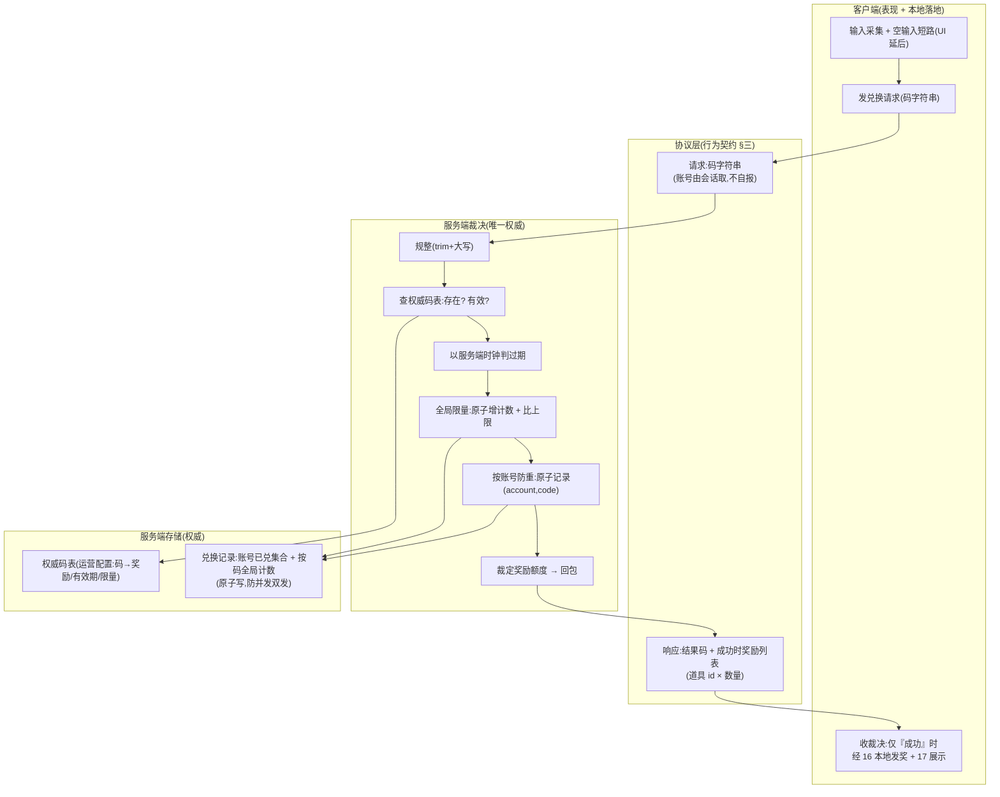

# 兑换码服务端化 · 服务端权威 + 前后端协议契约

把兑换码的**裁决权威**从客户端搬到服务端:服务端校验码有效性、按玩家账号防跨会话 / 跨设备重兑、守住全局限量、裁定奖励额度;客户端只负责输入、发起请求、按服务端裁决落地发奖与展示。这是本项目第一个**全栈特性**——服务端段(协议 + 处理逻辑 + 存储)先行,客户端段(发请求 + 处理回包)随后,两段据**同一份行为级基线**开工。

本篇是 [设计 20 兑换码系统](#20-redeem-code-system) 的服务端化扩展:设计 20 原把兑换权威放在客户端(本地配置校验 + 本地去重),本篇将其上移服务端,设计 20 同步改写为**客户端侧职责**(输入 UI 数据层 + 发请求 + 接裁决 + 本地发奖 + 展示),不再持本地校验 / 去重权威。

> [!WARNING]
> **读前必看 · 四条边界**
>
> - **服务端是兑换的唯一权威,客户端不做离线兜底校验。**码是否有效、此账号是否兑过、全局是否超量、能换什么,**全由服务端裁定**。客户端**不**保留「服务不可用时本地校验放行」的兜底——那等于让玩家断网即可绕过服务端的全部保证(跨设备防重、全局限量)。服务不可用时,兑换**不发生**:返「服务暂不可用,请稍后重试」,不发奖,码保持可兑,网络恢复后重试即可。设计 20 原有的本地配置校验器 / 本地去重集合**退出权威路径**(见 [§六](#30-redeem-code-server::supersede))。
> - **码表是服务端权威配置,客户端不持有第二份。**「码 → 奖励 / 有效期 / 限量」是运营在服务端配置的权威数据,客户端**不再持有兑换码表**。客户端发码字符串,服务端裁定一切并在回包里描述奖励内容;客户端无需预知码能换什么(结果是兑换**之后**展示的)。这从根上消除「双份漂移」——只有服务端一份码表。
> - **奖励内容用「道具 id × 数量」表达,与既有奖励同源。**服务端回包里的奖励 = 一组「道具 id × 数量」,客户端用既有道具元数据(设计 16 道具表,客户端本就持有,供背包 / 邮件 / 排行榜等多处展示)解析图标 / 名称,经 [设计 17 奖励展示](#17-reward-display) 渲染。与邮件(21)/ 排行榜(22)奖励「id 在展示时解析」同范式,不另造奖励结构。
> - **玩家身份取联网会话的设备账号,客户端不自报账号。**玩家键 = 现有联网会话已认证的设备账号,**由服务端从会话取**,客户端**不**把账号 id 当兑换参数发(否则客户端可冒充他人账号)。不要求先建完整账号系统(已与用户拍板)。

> [!NOTE]
> **立项信息**
>
> | 项 | 内容 |
> | --- | --- |
> | **类型** | 全栈特性 · 兑换码裁决权威上移服务端。出 code-free 设计意图 + 行为级协议契约 + 行为级验收,交服务端段(协议 + 处理逻辑 + 存储)与客户端段(发请求 + 回包处理)落地。 |
> | **方向约束** | 离线还原 · **去变现**:兑换码用于**运营发放**(节日礼包 / 公告补偿 / 反馈奖励),**不**含充值 / 内购 / 付费解锁——服务端只裁定运营配置的奖励,不发可购买物,与去变现不冲突。服务端化是为「跨设备防重 + 全局限量」这两件离线做不到的事(设计 20 §八已承认本地去重可被绕过),不是为变现。加法式:服务端是本项目新引入的权威端,客户端既有发奖 / 持久化 / 展示链路复用,既有玩法逻辑零行为变化。 |
> | **范围(产品 · 玩法)** | **服务端新增**:兑换请求的处理入口 + 裁决逻辑(存在性 / 有效期 / 全局限量 / 按账号防重)+ 权威码表(运营配置)+ 兑换记录存储(按账号已兑集合 + 按码全局计数)。 **客户端改**:兑换由「本地校验 + 本地去重 + 本地发奖」改为「发请求 → 收裁决 → 仅成功时本地发奖(复用 16)+ 展示(17)」;移除本地校验 / 去重权威。 **协议新增**:兑换请求 + 兑换响应(行为语义见 [§三](#30-redeem-code-server::protocol))。 **UI 零改动**(输入 / 结果弹窗仍延后,需美术,同设计 20)。 |
> | **需求降层** | **a. 表层要求**(任务字面):兑换码上后端——服务端成兑换权威,防跨会话 / 跨设备重兑、守全局限量、裁定奖励额度;客户端保留输入 / 发请求 / 展示。 **b. 底层目的**(为玩家 / 运营达成什么):让运营能安全发码——同一码每个真实玩家只兑一次(换设备 / 重装 / 多端都拦得住)、限量码不被超发,这是设计 20 离线方案做不到、且本地存档可被改绕过的两件事;对玩家则是「码在哪台设备登同一账号都只能用一次」的一致体验。 **c. 有无更直达 b 的做法**:b 的本质是「兑换记录需一个玩家改不了、跨设备共享的权威存储」——服务端账号级记录是直达做法,无更省的替代(纯客户端做不到跨设备 + 防篡改;这正是设计 20 留服务器接缝的原因)。无更优解,按表层实现。 |
> | **关键约束** | 服务端遵 Fantasy.Net 既有约定(协议 / 处理逻辑 / 存储 / 错误码,正本以服务端工程 fantasy-net 为准,本稿不写代码符号);裁决以**错误码 / 结果码**回包,不抛异常致连接断。客户端复用既有发奖落点(16)/ 持久化接缝(14)/ 奖励展示(17),不另造。本篇正文为 code-free 设计意图,不含协议消息名 / 字段代码名 / 类名 / 文件路径——服务端段据行为语义定协议与存储,客户端段据同一契约接收。 |

## 一、前后端职责切分 {#split}

兑换流程的每一步归谁,按「权威 vs 表现」一刀切清:**凡影响『码能否兑、兑了什么』的判定全在服务端;凡输入采集与结果呈现在客户端**。逐环节归属:

| 环节 | 归属 | 说明 |
| --- | --- | --- |
| 兑换码输入采集 | **客户端** 表现 | 输入框、提交按钮(UI 仍延后,需美术);提交前可做空输入短路(省一次往返,纯 UX) |
| 码字符串规整(trim + 大写) | **服务端**(权威) | 规整口径以服务端为准,使两台客户端不会因规整差异得到不同结果;客户端可做显示层 trim,但不作裁决依据(见 [§三](#30-redeem-code-server::protocol)) |
| 码是否存在 / 是否有效 | **服务端**(权威) | 查服务端权威码表 |
| 是否已过期 | **服务端**(权威) | 以服务端时钟为准(离线方案的「客户端时钟可改」问题一并解决) |
| 全局限量是否已满 | **服务端**(权威) | 设计 20 离线做不到的能力,本篇新增 |
| 此账号是否已兑过此码 | **服务端**(权威) | 按设备账号记录,跨会话 / 跨设备 / 重装均拦得住 |
| 奖励额度裁定 | **服务端**(权威) | 服务端按码表返「道具 id × 数量」,客户端不申报、不能虚增额度 |
| 实际发奖落地 | **客户端** 表现 | 玩家进度(灵力 / 虔诚币 / 经验 / 道具背包)当前为客户端本地(设计 14 存档),服务端无玩家库存可写;客户端按服务端裁决的奖励列表,经道具系统(16)既有落点发放 |
| 结果展示 | **客户端** 表现 | 成功 / 各类失败的提示文案 + 成功时奖励展示(经 17),仍延后(需美术) |

> [!NOTE]
> **为什么「发奖落地」留在客户端,而权威在服务端?**
>
> 本项目玩家进度(货币 / 经验 / 背包)当前是**客户端本地存档**(设计 14),服务端是本特性新引入的、目前只管兑换裁决的权威端,**没有玩家库存可直接写**。故采「服务端裁决 + 客户端落地」:服务端是「这个码这个账号能不能兑、兑什么」的唯一权威并记录已兑;客户端拿到裁决后把奖励发进自己的本地进度。<mark>防重兑 / 防超量的保证来自服务端的记录(同一码同账号第二次请求返『已兑过』、不再附奖励)</mark>,与「进度存在哪」无关。客户端本地进度本就可被改存档篡改(设计 14 已承认),服务端化**不**声称让本地进度防篡改——它声称的是**码兑换本身**权威(每码每账号一次、全局限量),这是可达且正确的范围(边界见 [§五](#30-redeem-code-server::walk) 崩法表)。

## 二、系统模型 {#model}

四方参与:客户端(发请求 / 收裁决 / 落地)、协议层(请求 / 响应)、服务端裁决(校验 + 防重 + 限量)、服务端存储(码表 + 兑换记录)。结构图:

> [!NOTE]
> **裁决顺序为什么是「存在 → 过期 → 全局限量 → 按账号防重」?**
>
> 先判与账号无关的整码级条件(存在 / 过期 / 全局满),再判与本账号相关的「我兑过没」。理由:① 与账号无关的失败对所有人一致,可早短路、不必碰账号记录;② 全局限量的「占名额」必须在「记本账号已兑」之前或与之原子合并——否则两个账号并发兑最后一个名额时都可能通过(崩法见 [§五](#30-redeem-code-server::walk))。各失败分支返对应结果码,不发奖、不记录、不抛异常。

## 三、行为级协议契约 {#protocol}

用**行为语言**描述请求与响应,服务端段据此定协议消息(消息名 / 字段代码名由服务端段按 Fantasy.Net 约定定,本稿不写)。

### 3.1 请求(玩家提交兑换) {#request}

| 携带项 | 行为语义 | 约束 |
| --- | --- | --- |
| 兑换码字符串 | 玩家在输入框键入的码,原样或仅做显示层 trim 后提交 | **规整权威在服务端**:服务端收到后做 trim + 转大写再查表。客户端可 trim 仅为显示整洁,不作裁决依据,故同一码不同客户端规整差异不影响结果 |
| 玩家身份 | **不作为请求字段**:服务端从当前联网会话已认证的设备账号取 | <mark>客户端不得自报账号 id</mark>——否则可冒充他人账号兑换或查他人是否兑过。身份是会话属性,非请求参数 |

> [!NOTE]
> **空输入的处理(客户端短路 + 服务端兜底,双保险)**
>
> 客户端可在提交前判空 / 纯空白,直接提示「请输入兑换码」、不发请求(省一次往返,纯 UX 优化)。但服务端**不信任**客户端的前置判断:收到空 / 规整后为空的码一律按「码无效」裁决。客户端短路是优化、服务端兜底是权威,两者都要有。

### 3.2 响应(服务端裁决结果) {#response}

响应是一个**结果码 + 成功时的奖励列表**。结果码六类(比设计 20 离线版多一类「全局限量已满」——服务端新能力):

| 结果码 | 触发 | 客户端行为 |
| --- | --- | --- |
| 成功 · 已发奖 | 校验通过、未过期、未超量、本账号未兑过 | 按奖励列表经 16 本地发奖 + 17 展示「兑换成功」 |
| 码无效 | 码不存在(规整后查表未命中),或空 / 规整后为空 | 提示「兑换码无效」,不发奖 |
| 已兑过 | 本账号已兑过此码(服务端记录命中) | 提示「该兑换码已使用过」,**不发奖** |
| 已过期 | 码有过期时间且服务端时钟已超过 | 提示「兑换码已过期」,不发奖 |
| 全局限量已满 | 码配了全局上限且已达上限 | 提示「兑换码已被领完」,不发奖 |
| 服务不可用 | 请求未达服务端 / 服务端无法处理 / 超时 | 提示「兑换服务暂不可用,请稍后重试」,不发奖,**码保持可兑**(见 [§四](#30-redeem-code-server::degrade)) |

成功时附带的**奖励列表**:一组「道具 id × 数量」。语义:服务端裁定的、本次兑换应发放的奖励项。客户端用既有道具元数据(16)解析每项的图标 / 名称 / 品质,经 17 归一展示。

> [!NOTE]
> **为什么响应只回「道具 id × 数量」而不回完整奖励外观(图标 / 名称)?**
>
> 道具元数据(名 / 图标 / 品质)是客户端本就持有的共享配置(设计 16 道具表,供背包 / 商店 / 邮件 / 排行榜等多处展示),与兑换码无关。故响应只需回语言无关、轻量的「道具 id × 数量」,客户端本地解析展示即可——与邮件(21)/ 排行榜(22)奖励「回 id、展示时解析」同范式。<mark>服务端只需持「码 → 道具 id × 数量」即可裁决,无需持道具的名 / 图标</mark>:那些是纯展示、归客户端。

## 四、服务不可用的降级行为 {#degrade}

服务端是唯一权威,故「服务不可用」必须有明确且**不可被利用**的降级:

| 情形 | 客户端行为 | 为什么 |
| --- | --- | --- |
| 请求发不出 / 超时 / 服务端返「服务不可用」 | 提示「兑换服务暂不可用,请稍后重试」;**不发奖**;码未消耗,玩家可稍后重试 | 若此时本地放行兑换,玩家断网即可绕过跨设备防重 + 全局限量,服务端化形同虚设 |

<mark>降级 ≠ 离线兑换</mark>:这正是与设计 20 离线版的本质区别——设计 20 把本地校验当默认权威,本篇把本地校验从权威路径移除。「服务不可用」与「码无效」是**两个不同结果码**,客户端文案与处理都不同:前者鼓励重试(码仍有效),后者告知码本身不行。误把不可用当无效会让玩家以为好码失效。

## 五、整局走查 · 每个机制的崩法与对策 {#walk}

把一次兑换从输入到落地在纸面跑一遍,逐机制点出最可能炸的一类(零值 / 满值 / 并发 / 中途存档 / 恶意利用)+ 对策:

| 机制 | 最可能的崩法 | 类别 | 对策 |
| --- | --- | --- | --- |
| 全局限量计数 | 两个账号并发兑最后一个名额,都先读到「未满」再各自 +1 → 超发 | 并发 | 服务端「检查上限 + 增计数」必须是**单次原子操作**(条件递增,达上限即失败),不可先读后写两步 |
| 按账号防重 | 同账号并发两次请求同一码(连点 / 重试),都先查到「未兑过」再各自发奖 → 双发 | 并发 | 服务端「检查未兑过 + 记录已兑」必须**原子**(以(账号,码)为唯一键的条件写入,重复即失败);第二次请求拿到「已兑过」 |
| 奖励额度 | 客户端篡改请求虚报想要的数量 | 恶意利用 | 客户端**不申报额度**;额度由服务端按码表裁定并回包。即便客户端改了回包数量,改的是自己本地存档(设计 14 既有限制),不影响服务端记录 |
| 客户端本地发奖 | 服务端已记「已兑」、回包成功,客户端在落地前崩溃 → 码消耗了但奖励没进玩家存档 | 中途存档 | **安全默认含「待发放记录」**:客户端收成功裁决后,先把奖励列表写入本地「待发放」持久记录(复用设计 14 存档接缝),再发进进度,落地后清除;启动时重放任何未清除的待发放。使「记录已兑 → 本地落地」跨崩溃仍恰好一次。该机制可砍(见 [§七 O3](#30-redeem-code-server::open)),砍后退化为「极小概率丢奖,靠邮件补偿」 |
| 服务不可用降级 | 把「服务不可用」当「码无效」提示,玩家以为好码废了;或本地放行兑换绕过权威 | 恶意利用 / 体验 | 「服务不可用」是独立结果码,文案鼓励重试、码不消耗;**绝不本地放行**(见 [§四](#30-redeem-code-server::degrade)) |
| 身份取值 | 客户端自报账号 id 冒充他人 / 探测他人是否兑过 | 恶意利用 | 身份从会话已认证账号取,**非请求参数**(见 [§3.1](#30-redeem-code-server::request)) |
| 空输入 | 客户端漏判空,空码打到服务端 | 零值 | 服务端兜底:规整后为空按「码无效」,不崩(见 [§3.1](#30-redeem-code-server::request)) |

> [!WARNING]
> **承认的固有限制(诚实边界)**
>
> 服务端化让「码兑换」权威(每码每账号一次、全局限量、跨设备),但**不**让客户端本地进度防篡改——玩家进度仍是本地存档(设计 14),被改存档者可直接编辑自己的货币 / 背包,这与兑换码无关、服务端化不解决,也非本特性目标。本特性的可达且正确范围 = **兑换裁决权威**。若未来要进度也服务端权威,是另一项更大的「存档上云」特性,不在本篇。

## 六、与设计 20 的关系(权威上移,客户端侧改写) {#supersede}

设计 20 把兑换权威放客户端(本地配置校验器 + 本地去重集合);本篇上移服务端后,设计 20 的客户端侧职责改写如下(设计 20 正文已同步,本节为对照):

| 设计 20 原职责 | 本篇后 | 处置 |
| --- | --- | --- |
| 本地配置校验器(查本地码表判有效) | 退出权威路径 | 校验上移服务端;客户端不再本地判码有效性,不再持本地码表 |
| 远程校验器「占位」 | 兑现为真实服务端校验 | 设计 20 §2.2 把远程校验当「永久占位 / 本工程无网络」——该前提被本特性**推翻**:服务端即网络权威端 |
| 本地去重集合(本地判已兑) | 退出权威路径 | 防重上移服务端(按账号);客户端不再持本地去重权威。<mark>玩家清本地存储即可重兑的漏洞由此关闭</mark>(跨设备防重只有服务端做得到) |
| 本地发奖落点(复用 16) | **保留** | 服务端裁决成功后,客户端仍经 16 本地发奖——落地在客户端(玩家进度本地) |
| 结果码 / 结果文案 | **保留并扩一类** | 六类结果码语义保留,新增「全局限量已满」(服务端新能力) |
| 客户端兑换码 Luban 配置表 | 退出客户端 | 码表上移服务端权威;客户端不再持有,避免双份漂移 |

> [!NOTE]
> **设计 20 §2.2「为什么离线还要做服务器接缝」的前提已变**
>
> 设计 20 当时的判断是「本工程无网络模块、远程校验是永久占位」。本特性引入服务端权威端,该前提不再成立——设计 20 相关段落已按现状改写,指向本篇。这与去变现方向不冲突:服务端只裁运营配置的奖励,不发可购买物。

## 七、待拍板清单(范围开关 + 可砍档) {#open}

自治授权下均取安全默认推进;列此交 boss / 用户复核,要改另开增量。

| # | 开关 | 安全默认 | 备选 / 触发改动 |
| --- | --- | --- | --- |
| O1 | 奖励内容表达 | **道具 id × 数量**(客户端用 16 道具表解析展示) | 若运营要发「随机库」式奖励(同邮件 21 / 排行榜 22 的库 id),服务端码表可改回库 id、客户端领取时抽——但兑换码语义偏「确定奖励」,当前用道具项更直观 |
| O2 | 全局限量 | **做**(服务端原子计数,本特性核心新能力之一) 核心 | 不配上限的码即不限量(上限字段空 = 无限) |
| O3 | 客户端「待发放」崩溃重放 | **做**(闭中途存档丢奖窗口,复用 14 存档接缝,成本低) 增强 | 砍掉则退化为「崩溃窗口极小概率丢奖,靠邮件补偿」;核心循环(权威兑换 + 一次性)不依赖它,可砍 |
| O4 | 服务端码表的存储形态 | 服务端权威配置(具体落配置文件还是数据库集合由服务端段定) | 与运营改码频率有关:静态配置改码需重发,数据库集合可后台热改——服务端段据 Fantasy.Net 现状取 |
| O5 | 过期判定时钟 | **服务端时钟**(离线版的客户端时钟可改问题一并解决) | 多区服 / 时区对齐随未来区服化再定,本特性单一服务端时钟即可 |
| O6 | 结果文案多语言 | 文案 id 占位(同 num/item/reward/settings 现状) | 多语言文本表建成后查表替换 |
| O7 | 输入 / 结果弹窗 UI | **延后**(需美术,同设计 20) | 有美术 + 窗口流程时建窗口,接 17 奖励展示,运行手验 |
| O8 | 玩家账号体系 | 复用现有联网会话设备账号(已与用户拍板,不建完整账号系统) | 未来若建实名 / 多端同账号体系,玩家键换成正式账号 id;本特性的服务端记录按当前账号键即可 |

> **核心 / 增强 / 可砍三档**:核心 = 服务端权威裁决(存在 / 过期 / 全局限量 / 按账号防重)+ 协议请求响应 + 客户端「成功才发奖、不可用不放行」;砍掉所有增强(O3 待发放重放)后,核心循环「运营配码 → 玩家兑 → 每账号一次 / 限量守住 → 发奖」仍成立。增强 = O3 崩溃重放(robust 化)。

## 八、验收点 {#accept}

按段拆:**服务端验收**(server-test 跑服 Log 往返 + 源生成器产物 + Code Review 核)、**客户端验收**(client-test EditMode 可单测纯逻辑 + Play 手验回包处理)、**联调验收**(两段都到位后,前后端一次往返核)。完成定义均为**行为可观测**,不含代码定位。

### 8.1 服务端验收(server-test) {#accept-server}

| # | 验收点(完成定义,可逐条核) |
| --- | --- |
| SV1 | 有效码 + 此账号首次请求 → 返「成功」+ 奖励列表(道具 id × 数量)与码表配置一致 |
| SV2 | 同账号对同一码第二次请求 → 返「已兑过」,**响应不含奖励列表**(不再授权发奖) |
| SV3 | 不存在的码 / 规整后为空的码 → 返「码无效」;服务端对空输入不崩(兜底) |
| SV4 | 配了过期时间且服务端时钟已过 → 返「已过期」;无过期时间的码任何时刻不判过期 |
| SV5 | 配了全局上限的码:达上限后再请求 → 返「全局限量已满」,不再授权;未配上限的码不受限 |
| SV6 | 规整权威在服务端:请求带 " abc " 与带 "ABC" 命中码表存为 "ABC" 的同一码(服务端 trim+大写) |
| SV7 | **并发防重**:同账号并发两次请求同一码,最终只有一次返「成功」、另一次「已兑过」;账号已兑记录里该码只一条(原子写,无双发) |
| SV8 | **并发限量**:多账号并发抢最后 N 个名额,成功数 ≤ 配置上限(全局计数原子,无超发) |
| SV9 | 身份从会话取:请求不携带账号字段也能裁决(以会话账号为键);若实现接受了客户端账号字段则视为缺陷(可冒充)——核对协议契约不含客户端自报账号 |
| SV10 | 失败分支(码无效 / 已过期 / 全局满 / 已兑过)均**不写兑换记录、不增全局计数**(失败不占名额),且**以结果码回包、不抛异常断连** |
| SV11 | 服务端存储:重启服务端后,先前已兑记录与全局计数仍在(账号重兑仍返「已兑过」、限量计数不清零)——记录持久,非内存态 |
| SV12 | Code Review:服务端遵 Fantasy.Net 约定(协议 / 处理逻辑 / 存储 / 错误码而非异常 / 不手改生成物 / 不手动注册),正本清单逐条核 |

### 8.2 客户端验收(client-test) {#accept-client}

| # | 验收点(完成定义,可逐条核) |
| --- | --- |
| CV1 | 收到「成功」回包 → 按奖励列表经 16 本地发奖,玩家进度对应字段 / 背包增加正确数量;经 17 可展示发了什么 |
| CV2 | 收到「已兑过 / 码无效 / 已过期 / 全局满」回包 → **不发奖**,展示对应文案;四类文案互不相同 |
| CV3 | 收到「服务不可用」(或请求超时 / 发不出)→ **不发奖**,展示「服务暂不可用,请稍后重试」文案(与「码无效」文案不同),码状态不变可重试 |
| CV4 | 客户端**不**保留本地校验放行路径:断开服务端后兑换不会本地成功发奖(只会进「服务不可用」降级)——证权威已上移、无离线兜底 |
| CV5 | 空 / 纯空白输入:客户端提交前短路提示「请输入兑换码」、不发请求(UX 优化);即便发了,服务端兜底为「码无效」(SV3) |
| CV6 | 客户端不持兑换码表 / 不持本地去重权威:兑换是否成功完全取决于服务端回包(可注入桩响应单测各结果码的客户端处理分支) |
| CV7 | (O3 做时)「待发放」崩溃重放:模拟「收到成功裁决、写入待发放后、落地前中断」→ 重新进入时重放待发放、奖励恰好发一次(不漏不重);复用设计 14 存档接缝,纯逻辑可单测 |
| CV8 | 客户端发请求不携带自报账号 id(与 SV9 对称:身份由会话承载) |
| CV9 | Code Review 5 红线(异步优先 / 模块访问 / 资源释放 / 热更边界 / 事件解耦);重点核「成功才发奖、发奖复用 16 不另造落点」「服务不可用不本地放行」 |

### 8.3 联调验收(两段到位后) {#accept-e2e}

| # | 验收点(完成定义,可逐条核) |
| --- | --- |
| E1 | 真实往返:客户端输有效码 → 服务端裁决「成功」+ 奖励列表 → 客户端本地发奖 + 展示,玩家进度增加正确;Log 两端可见请求 / 响应 |
| E2 | 跨会话防重:同账号兑成功后断开重连、再兑同码 → 返「已兑过」、不再发奖(证服务端记录跨会话生效) |
| E3 | 协议同步:服务端协议改动后,客户端协议生成物已同步、双端各自编译通过(server-test 协议同步检查项)——漏同步判 FAIL |
| E4 | 全栈零回归:兑换码外的既有客户端玩法 / 服务端功能不受影响 |

> [!WARNING]
> **不在本特性验收 / 视环境 BLOCKED**
>
> - 输入 / 结果弹窗 UI 视觉、奖励真实图片 → 表现层延后(需美术),数据 / 协议层不返工。
> - 服务端跑服手验(SV / E)依赖服务端可起(端口 / 数据库可达):跑不动按 **BLOCKED** 处理(server-test 出 BLOCKED 非 FAIL),编译 / 源生成器产物 / Code Review 仍照做。
> - 跨设备防重(E2 的「换设备」变体)需两端真实联网环境,自治模式下以「同账号跨会话」近似验证,真跨物理设备列 BLOCKED。

## 九、风险表 {#risk}

| 风险 | 应对 |
| --- | --- |
| **并发双发 / 超发**:同账号并发兑、多账号抢最后名额,先读后写致重复发奖 / 超量 | [§五](#30-redeem-code-server::walk) 明确「检查 + 写入」须原子;验收 SV7 / SV8 专门并发断言。这是兑换码服务端最经典的坑,server-dev 须用条件写 / 原子递增 |
| **本地兜底重开漏洞**:客户端为「体验」加回离线兜底校验 → 玩家断网绕过全部服务端保证 | 读前必看第 1 条 + [§四](#30-redeem-code-server::degrade) 明令服务不可用不本地放行;验收 CV4 专门断言断服不会本地成功发奖 |
| **客户端自报账号被冒充**:把账号 id 当请求字段 → 冒充他人 / 探测他人兑换状态 | [§3.1](#30-redeem-code-server::request) / 验收 SV9 / CV8:身份从会话取,非请求参数 |
| **中途丢奖**:服务端已记已兑、客户端落地前崩 → 码消耗奖没到 | [§五](#30-redeem-code-server::walk) 安全默认含「待发放」崩溃重放(O3);砍则退化为邮件补偿,如实承认 |
| **双份码表漂移**:客户端留一份码表与服务端不一致 → 同码两端裁决不同 | 读前必看第 2 条:客户端**不**持码表,唯一权威在服务端,从根消除漂移;设计 20 客户端码表已改写为退出([§六](#30-redeem-code-server::supersede)) |
| **协议漏同步**:服务端改协议、客户端生成物没跟 → 联调假错 | 验收 E3 + server-test 协议同步检查项(漏同步判 FAIL);全栈最高风险点,交接区须显式声明同步状态 |
| **把「服务不可用」当「码无效」**:玩家以为好码失效、不再重试 | [§四](#30-redeem-code-server::degrade):两个独立结果码、文案不同;验收 CV3 断言两者文案有别 |
| **去变现误判**:误以为「上后端」=「要变现」 | 立项框 + 读前必看:服务端只裁运营配置奖励,不发可购买物,与去变现一致;设计 20 §2.2 同此论证 |
