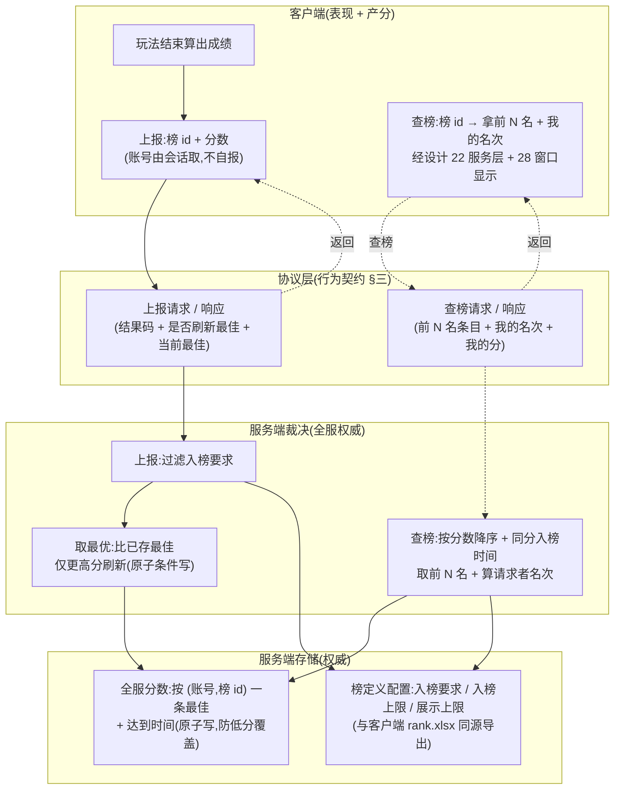

# 排行榜上后端 · 全服数据源(服务端权威 + 前后端协议契约)

把排行榜的**全服榜数据**从客户端搬到服务端:服务端权威存储全服分数、维护排序、计算名次,对客户端提供两件事——**上报一次成绩**、**查询某榜的前 N 名 + 自己名次**。客户端玩法结束时把成绩上报到对应榜,展示时拉前 N 名与自己名次。这是本项目第二个**全栈特性**(继 [设计 30 兑换码服务端化](#30-redeem-code-server) 之后),服务端段(协议 + 处理逻辑 + 存储)先行,客户端段(把占位的远程数据源切真实 RPC)后续另增量,两段据**同一份行为级基线**开工。

本篇兑现 [设计 22 排行榜底层系统](#22-rank-system) 留的**远程数据源接缝**:设计 22 把「排名从哪来」抽象成一道可注入接口,离线用本机 + 配置陪榜的本地源,远程源仅留占位(返空、不连网);本篇实现这道远程源背后的服务端——全服真实玩家的分数从此有了权威来源。设计 22 的客户端服务层(查榜 / 排序并列规则 / 结算编排 / 每日点赞 / 红点)与本地源**不动**,只在客户端段把远程源从占位切成真实 RPC。

> [!WARNING]
> **读前必看 · 五条边界**
>
> - **服务端是全服榜的唯一权威:分数存储、排序、名次计算都在服务端。**「谁在榜上、各多少分、谁第几名」由服务端裁定。客户端**不**在本地对全服榜排序、不自行算全服名次——那需要全服所有玩家的分数,客户端没有。客户端只做两件事:上报自己的成绩、显示服务端算好的前 N 名 + 自己名次。与设计 22 的**本地源**(本机 + 陪榜,客户端排序)是两条独立数据源,本篇只做远程源背后的服务端。
> - **玩家身份取联网会话的设备账号,客户端不自报账号。**上报成绩的「这是谁的分」、查询名次的「我是谁」,**由服务端从当前联网会话已认证的设备账号取**,客户端**不**把账号 id 当请求字段发(否则可冒充他人刷分、或顶替他人成绩)。沿用 [设计 30](#30-redeem-code-server::request) 已确立的身份口径(身份是会话属性,非请求参数),不要求先建完整账号系统(已与用户拍板)。
> - **同账号重复上报取「最优」(保留较高分),服务端权威判定。**同一账号对同一榜多次上报,服务端只保留**更高的成绩**(分数降序榜,高分是更好的成绩),低于已存最佳的上报被服务端接受请求但不更新榜(返「未刷新最佳」)。「检查更优 + 写入」必须**原子**,否则并发上报会让低分覆盖高分(崩法见 [§五](#31-rank-server::walk))。这是服务端权威判定,客户端上报什么分由服务端按此规则裁定是否入榜。
> - **本增量只做数据源(上报 + 查询),结算发奖不在本增量。**[设计 22 §3.4–3.5](#22-rank-system::reward) 的结算编排(到点 → 算名次 → 按名次档查奖 → 发结算邮件)、每日 / 点赞奖领取依赖邮件系统(21),**不在本增量**,留后续。本篇交付到「服务端权威全服榜:上报成绩 + 查前 N 名 + 查自己名次 + 防刷 + 排序并列 + 入榜 / 展示上限」。榜的奖励 / 结算时机字段(reward / valid_type / mail 等)本增量服务端**不消费**(那是结算的事)。
> - **榜定义配置服务端权威,与客户端同源导出。**榜的「入榜要求 / 入榜上限 / 展示上限 / 排序并列规则」是裁定全服榜的依据,服务端持权威副本(与客户端 [设计 22 §3.1](#22-rank-system::config) `rank.xlsx` 同一 Luban 源,经服务端导出路径生成),使两端对「成绩低于入榜要求不进榜」「前 N 名参与排名」等口径一致。本增量服务端只需榜级的入榜 / 上限 / 排序字段;奖励 / 结算字段服务端可不加载(本增量不结算)。

> [!NOTE]
> **立项信息**
>
> | 项 | 内容 |
> | --- | --- |
> | **类型** | 全栈特性 · 排行榜全服榜数据源上移服务端。出 code-free 设计意图 + 行为级协议契约 + 行为级验收,交服务端段(协议 + 处理逻辑 + 存储)先行落地,客户端段(远程源切真实 RPC)后续另增量。 |
> | **方向约束** | 离线还原 · **去变现**:排行榜用于**进度显示 / 攀比 / 名次奖励**(设计 22 三条目的),**不**含充值榜 / 付费冲榜 / 买名次——服务端只按玩法成绩排名,分数来自玩法、不可购买,与去变现不冲突。服务端化是为「真实全服排名」这件离线做不到的事(设计 22 §3.6 已承认本作无网络层、远程源只能占位),不是为变现。加法式:服务端是已引入的权威端(设计 30 起),本特性新增排行榜的协议 / 裁决 / 存储;客户端既有排行榜服务层(设计 22)与本地源复用,既有玩法逻辑零行为变化。 |
> | **需求降层** | **a. 表层要求**(任务字面):排行榜上后端——服务端权威存全服分数、排序、算名次;协议含上报成绩 + 查前 N 名与自己名次;身份从会话取、客户端不自报;防刷(同账号重复上报取最优 / 最新由设计定);本增量只做数据源,结算发奖留后续。 **b. 底层目的**(为玩家达成什么):让玩家能与**全服真实玩家**比名次——设计 22 离线版只能和配置陪榜(NPC 基准分)+ 自己历史比,看不到真人榜;上后端后「我在全服第几名」才有真实意义,这是「攀比」「全服排名」两条目的离线做不到的核心。 **c. 有无更直达 b 的做法**:b 的本质是「全服分数需一个跨设备汇总、玩家改不了的权威存储 + 排名」——服务端账号级分数存储 + 服务端排序是直达做法,无更省替代(纯客户端拿不到全服数据,这正是设计 22 留远程源接缝、本作无网络层只能占位的原因)。无更优解,按表层实现。 |
> | **范围(产品 · 玩法)** | **服务端新增**:① 上报成绩的处理入口 + 入榜裁定(过滤入榜要求 + 取最优防刷,原子写)+ 全服分数权威存储(按账号 + 榜 id 一条最佳记录);② 查榜的处理入口(按榜 id 取前 N 名 + 算请求者自己名次,服务端排序);③ 榜定义权威配置副本(入榜要求 / 上限 / 排序规则)。 **客户端改**(后续增量,本稿仅作契约约束):排行榜远程数据源从占位(返空)切成真实 RPC——上报走上报协议、查榜走查询协议;客户端既有服务层(设计 22 查榜 / 我的名次)对远程源短路掉本地排序(服务端已排好,见 [§六](#31-rank-server::seam))。 **协议新增**:上报成绩请求 / 响应、查榜请求 / 响应(行为语义见 [§三](#31-rank-server::protocol))。 **UI 零改动**(排行榜界面 / 列表 / 头像仍延后,需美术,同设计 22 / 28)。 |
> | **关键约束** | 服务端遵 Fantasy.Net 既有约定(协议 / 处理逻辑 / MongoDB 存储 / 错误码非异常 / 不手改生成物 / 不手动注册,正本以服务端工程 fantasy-net 为准,本稿不写代码符号);裁决以**结果码**回包,不抛异常致连接断;沿用设计 30 已确立的「身份从会话取」「协议双端同步」基线。客户端复用既有排行榜服务层(设计 22),不另造。本篇正文为 code-free 设计意图,不含协议消息名 / 字段代码名 / 类名 / 文件路径 / 接缝清单——服务端段据行为语义定协议与存储,客户端段据同一契约接收。 |

## 一、前后端职责切分 {#split}

排行榜的每一步归谁,按「全服权威 vs 本端表现」一刀切清:**凡涉及『全服谁多少分、谁第几名』的存储与计算全在服务端;凡输入触发(玩法产出成绩)与结果显示在客户端**。逐环节归属:

| 环节 | 归属 | 说明 |
| --- | --- | --- |
| 玩法产出成绩(一局结束的分数) | **客户端** 表现 | 成绩由客户端玩法算出(本地玩法逻辑),上报时机 = 玩法结束(同设计 22 §3.3「提交本机一次成绩」的触发点) |
| 上报成绩的请求发起 | **客户端** 表现 | 客户端发「榜 id + 这次的分数」,身份不自报(见 [§3.1](#31-rank-server::submit)) |
| 是否够入榜要求 | **服务端**(权威) | 服务端按榜配置的入榜要求过滤,成绩低于要求不进榜 |
| 同账号重复上报取最优 | **服务端**(权威) | 服务端比已存最佳,仅更高分刷新(原子),低分上报不覆盖(见 [§3.3](#31-rank-server::dedupe)) |
| 全服分数存储 | **服务端**(权威) | 按账号 + 榜 id 存一条最佳成绩 + 达到时间,跨会话 / 跨设备持久(MongoDB) |
| 排序(分数降序 + 同分并列) | **服务端**(权威) | 服务端按设计 22 §3.3.2 规则排序;客户端不对全服榜排序(无全服数据) |
| 名次计算(前 N 名 + 自己第几) | **服务端**(权威) | 服务端算请求者在全服的名次,返前 N 名条目 + 自己名次 |
| 榜单显示(列表 / 我的名次条) | **客户端** 表现 | 客户端拿服务端排好的结果直接渲染(UI 仍延后,需美术);经设计 22 服务层 + 设计 28 窗口 |
| 排序并列规则的定义 | **两端同源** | 规则(分数降序 + 同分入榜时间升序 + 顺序名次)由设计 22 §3.3.2 定,服务端执行;两端配置同源导出使口径一致 |

> [!NOTE]
> **为什么「成绩产出」在客户端,而排序 / 名次在服务端?**
>
> 本项目玩法逻辑(算分)当前在**客户端本地**:一局打完得多少分由客户端玩法算出,服务端不跑玩法。故采「客户端产分上报 + 服务端权威排名」:服务端是「全服谁多少分、谁第几名」的唯一权威并持久存储(跨设备汇总),客户端把自己玩法算出的分上报上去、把服务端排好的榜显示出来。<mark>防刷(取最优 + 身份从会话取)守住的是『同账号的分由谁顶替、能不能被低分覆盖、能不能冒充他人』,而非『分本身怎么算出来的』</mark>——客户端玩法算分本就可被改客户端篡改(同设计 14 本地进度限制),服务端化**不**声称防客户端改分上报虚高,它声称的是**全服榜的存储 + 排序 + 名次权威**(每账号一条最佳、跨设备、名次由服务端算),这是可达且正确的范围(诚实边界见 [§五](#31-rank-server::walk) 末)。

## 二、系统模型 {#model}

四方参与:客户端(产分 / 上报 / 查榜显示)、协议层(上报 / 查榜两组请求响应)、服务端裁决(入榜过滤 + 取最优防刷 + 排序 + 名次)、服务端存储(全服分数 + 榜定义配置)。结构图:

> [!NOTE]
> **「取最优」放在哪一步、为什么必须原子?**
>
> 上报的核心动作是「比一比:这次分比这账号已存的最佳高吗?高就更新」。这是一个**读-比-写**:读已存最佳 → 比 → (更高则)写新最佳。若分成三步非原子,两个并发上报(连点 / 重试 / 多端)都先读到旧最佳、各自判断「我更高」,后写的可能用较低分覆盖先写的较高分(崩法见 [§五](#31-rank-server::walk))。故「检查更优 + 写入」必须是**单次原子操作**(条件写:仅当新分 > 存量才更新),不可先读后写两步。这与设计 30 兑换码「检查 + 写入须原子」同主题,是服务端权威数据最经典的并发坑。

## 三、行为级协议契约 {#protocol}

两组协议:**上报成绩**、**查榜**。用**行为语言**描述携带项与语义,服务端段据此定协议消息(消息名 / 字段代码名由服务端段按 Fantasy.Net 约定定,本稿不写)。

### 3.1 上报成绩 · 请求(玩法结束提交一次成绩) {#submit}

| 携带项 | 行为语义 | 约束 |
| --- | --- | --- |
| 榜 id | 这次成绩提交到哪个榜(设计 22 的榜唯一 id) | 服务端按此查榜定义;查不到的榜 id 按「榜不存在」返(不崩) |
| 本次成绩(分数) | 客户端玩法这一局算出的成绩值 | 数值类型须容纳设计 22 `rank_condition` 同量级(long);负数 / 0 由服务端按入榜要求过滤,不特殊崩 |
| 玩家身份 | **不作为请求字段**:服务端从当前联网会话已认证的设备账号取 | <mark>客户端不得自报账号 id</mark>——否则可顶替他人成绩、冒充刷分。身份是会话属性,非请求参数(沿用设计 30 §3.1) |

### 3.2 上报成绩 · 响应 {#submit-resp}

响应是一个**结果码 + 当前最佳成绩**(便于客户端显示「你的最佳分」)。结果码:

| 结果码 | 触发 | 客户端行为 |
| --- | --- | --- |
| 已刷新最佳 | 本次成绩够入榜要求且高于此账号已存最佳 → 服务端更新为新最佳 | 可提示「新纪录」;附带的当前最佳 = 本次成绩 |
| 未刷新最佳 | 本次成绩够入榜要求但不高于已存最佳 → 服务端接受请求但不更新 | 不提示新纪录;当前最佳 = 已存最佳(高于本次) |
| 未达入榜要求 | 本次成绩低于该榜入榜要求 → 不进榜 | 可提示「未达上榜分数」;当前最佳 = 此账号已存最佳(可能为「无」) |
| 榜不存在 | 榜 id 在服务端榜配置查不到 | 不崩,提示通用失败 / 静默(配置问题,非玩家可控) |
| 服务不可用 | 请求未达服务端 / 无法处理 / 超时 | 不阻断玩法(成绩已在本地);稍后重连可重报,见 [§四](#31-rank-server::degrade) |

> [!NOTE]
> **为什么上报响应要回「当前最佳」?**
>
> 客户端上报后常需立即显示「你的最佳成绩」(结算页 / 排行入口)。服务端既已做完「比一比取最优」,顺手在响应里回当前最佳,客户端无需再发一次查询。这与设计 22 §3.3 客户端本地源「提交成绩取较大者」对齐——只是权威从本地最佳变成了服务端最佳。

### 3.3 同账号重复上报的取舍:取最优(保留较高分) {#dedupe}

任务把「取最优 / 取最新」的选择交本设计定。**取最优(保留较高分)**,理由:

| 候选 | 含义 | 是否采用 | 理由 |
| --- | --- | --- | --- |
| **取最优** | 同账号多次上报,服务端保留**最高分**,低分上报不覆盖 | 采用(默认) | 排行榜是分数降序榜,「我的最好成绩」是排行通例(玩家打出过的最高分代表实力);与设计 22 客户端本地源「提交成绩取较大者更新最佳」同语义,两端一致;低分上报不降名次,符合玩家预期 |
| 取最新 | 同账号多次上报,服务端总用**最近一次**(可能更低) | 不采用 | 排行榜语义不符——玩家会因一局发挥差而掉名次,反直觉;仅「当前赛季最近表现」类榜才需要,设计 22 未要求此类 |

故服务端存的是**每账号每榜一条最佳成绩**;并列排序用的「达到时间」= **首次达到该最佳分的时间**(同设计 22 §3.3.2 同分按入榜时间升序,早者靠前——刷新最佳时若新分严格更高才更新分与时间;同分重报不更新时间,保住先到先得)。

### 3.4 查榜 · 请求 {#query}

| 携带项 | 行为语义 | 约束 |
| --- | --- | --- |
| 榜 id | 查哪个榜 | 查不到返「榜不存在」/ 空榜 |
| 玩家身份 | **不作为请求字段**:服务端从会话取,用于算「我的名次」 | 同 [§3.1](#31-rank-server::submit),不自报 |

> [!NOTE]
> **要不要分页 / 传 N?**
>
> 本增量**不做分页**:返回条数 = 该榜配置的**展示上限**(设计 22 `show_count_max`),由服务端按配置截断。客户端不传 N、不传页码——展示上限是榜级配置,客户端要多少由配置定。分页(滚动加载更多)是表现层增强,数据支持后另开(见 [§七 O3](#31-rank-server::open))。

### 3.5 查榜 · 响应 {#query-resp}

响应 = **前 N 名条目列表(已排序)+ 请求者自己的名次 + 自己的分数**:

| 携带项 | 行为语义 | 约束 |
| --- | --- | --- |
| 前 N 名条目列表 | 服务端已按分数降序 + 同分入榜时间升序排好、截到展示上限的条目;每条 = 名次 + 玩家展示名 + 分数 | 名次由服务端算(1 起,顺序名次,同设计 22 §3.3.2);玩家展示名见下「展示名怎么来」 |
| 我的名次 | 请求者(会话账号)在全服的名次 | 未入榜(无成绩 / 低于入榜要求 / 超出入榜上限)= 0(同设计 22「未入榜返 0 名次」) |
| 我的分数 | 请求者当前最佳成绩 | 无成绩 = 0 / 无;可能低于入榜要求(此时名次为 0、分数照回供「距上榜差值」显示) |
| 结果码 | 成功 / 榜不存在 / 服务不可用 | 见各表 |

> [!NOTE]
> **榜单条目的「玩家展示名」从哪来?**
>
> 本增量服务端存的是「账号 + 榜 id + 分数 + 时间」;玩家**展示名**(昵称)属玩家信息(设计 18 客户端本地),服务端当前**无玩家昵称库**。安全默认:本增量榜条目的展示名回**账号标识的占位**(如账号 id 字符串 / 占位文本 id),客户端显示时若有本地昵称则替换、否则显占位。真实全服昵称需服务端持有玩家昵称(玩家信息也上后端,是更大的特性),不在本增量(见 [§七 O5](#31-rank-server::open))。这与设计 22 §3.9「玩家名文本 id 占位」一致——名字是显示层,数据层先占位。

## 四、服务不可用的降级行为 {#degrade}

服务端是全服榜的唯一权威,但排行榜与兑换码不同——**它不阻断核心玩法**:

| 情形 | 客户端行为 | 为什么 |
| --- | --- | --- |
| 上报发不出 / 超时 / 服务端返「服务不可用」 | **不阻断玩法**:成绩已在客户端本地(设计 22 本地源仍记本机最佳);提示可弱化或静默,稍后重连可重报 | 玩法结束不应因榜服务挂了而卡住;本地源保证玩家仍看得到自己历史最佳 + 陪榜榜 |
| 查榜发不出 / 超时 / 返「服务不可用」 | **降级到设计 22 本地源**:显示本机 + 陪榜的本地榜(玩家有得看),或显示「全服榜暂不可用」 | 设计 22 的本地源本就是离线可跑的榜;远程不可用时回退本地源是天然降级,不是漏洞 |

> [!NOTE]
> **与设计 30 兑换码降级的关键区别:这里回退本地源不是漏洞**
>
> 设计 30 明令兑换码「服务不可用不本地放行」——因为本地放行会绕过防重 / 限量这些**安全保证**。排行榜不同:全服榜不可用时回退到设计 22 的**本地源**(本机 + 陪榜),玩家看到的是「自己和基准分比」的本地榜,<mark>这既不发奖、也不伪造全服名次</mark>(本地榜不冒充全服榜),没有可被利用的安全后果。区别根源:兑换码的服务端保证是「发奖额度 / 防重」,本地放行=超发;排行榜的服务端保证是「全服名次真实」,本地回退只是少了全服真实数据、退回离线体验,不产生超发 / 超量。结算发奖(依赖名次)不在本增量,故本增量降级无发奖风险。

## 五、整局走查 · 每个机制的崩法与对策 {#walk}

把一次「玩法结束 → 上报 → 查榜」在纸面跑一遍,逐机制点出最可能炸的一类(零值 / 满值 / 并发 / 中途存档 / 恶意利用)+ 对策:

| 机制 | 最可能的崩法 | 类别 | 对策 |
| --- | --- | --- | --- |
| 取最优写入 | 同账号并发两次上报(连点 / 重试 / 多端),都先读到旧最佳、各自判「我更高」,后写的用较低分覆盖较高分 | 并发 | 服务端「比更优 + 写入」必须**单次原子**(条件写:仅当新分 > 存量才更新),不可先读后写两步;并发下只有真更高者写成功(崩法主题同设计 30 兑换码) |
| 名次计算 | 全服分数在持续变(他人同时上报),算「我的名次」时分数快照不一致 → 名次抖动 | 并发 | 名次是**查询时刻的快照**,不要求跨查询事务隔离;同一次查询内基于一致的存储读出算名次即可。排行榜名次本就是「此刻排名」,瞬时抖动可接受,非缺陷 |
| 入榜要求过滤 | 0 分 / 负分 / 远低于要求的成绩上报 → 若不过滤,垃圾分占榜 | 零值 | 服务端按榜配置入榜要求过滤,低于要求**不写存储、不进榜**(返「未达入榜要求」),不崩 |
| 入榜 / 展示上限 | 全服人数远超上限,查榜全量加载排序 → 大榜性能炸 | 满值 | 服务端按分数有序的存储 / 索引取前 N(展示上限),不每次全量加载到内存再排;入榜上限同理只让前 N 名参与名次(设计 22 `rank_count_max` / `show_count_max`)。具体索引由服务端段按 Fantasy.Net + MongoDB 现状定 |
| 身份取值 | 客户端自报账号 id,顶替他人成绩 / 冒充刷分 / 查他人名次 | 恶意利用 | 身份从会话已认证账号取,**非请求参数**(见 [§3.1](#31-rank-server::submit) / [§3.4](#31-rank-server::query));上报只能写自己账号的分,查只能查自己名次 |
| 分数虚高上报 | 客户端改玩法算分,上报一个不可能的高分 → 霸榜 | 恶意利用 | <mark>承认的固有限制</mark>:客户端玩法算分在本地、可被改(同设计 14)。本增量服务端**不**做分数合理性校验(无服务端玩法仿真可比对);服务端守的是「存储 / 排序 / 名次 / 防顶替」权威,不是「分真不真」。真要防作弊分需服务端跑玩法或加合理性上限,是更大的反作弊特性,不在本增量(见 [§七 O6](#31-rank-server::open) + 下方诚实边界) |
| 上报中途断连 | 玩法结束、上报请求发出后断连 → 这次成绩没上榜 | 中途存档 | 成绩仍在客户端本地源(设计 22 本机最佳),不丢;重连后客户端可重报(取最优,重报同分不降名次)。本增量**不**做服务端待入队列(成绩可重报,无需服务端缓冲) |
| 榜不存在 | 客户端传了服务端没有的榜 id | 零值 / 配置 | 服务端返「榜不存在」结果码,不崩、不写存储 |

> [!WARNING]
> **承认的固有限制(诚实边界)**
>
> 服务端化让**全服榜的存储 / 排序 / 名次 / 防顶替**权威(每账号一条最佳、跨设备、名次服务端算、低分不覆盖高分、身份不可冒充),但**不**让「客户端上报的分数本身」可信——玩法算分在客户端本地(设计 14),被改客户端者可上报虚高分霸榜。这与排行榜数据源无关、服务端化不解决,也非本增量目标。本增量的可达且正确范围 = **全服榜数据的存储与排名权威**。若未来要防作弊分,是另一项「服务端玩法校验 / 反作弊」特性(服务端跑玩法仿真或分数合理性模型),不在本篇。

## 六、与设计 22 的关系(远程源兑现 + 客户端段适配) {#seam}

设计 22 把「排名从哪来」抽象成可注入数据源接缝,远程源留**占位**(返空、不连网);本篇实现这道远程源背后的服务端。客户端段(后续增量)的适配如下(本节为前瞻约束,客户端段据此开工):

| 设计 22 现状 | 本篇后(客户端段适配) | 处置 |
| --- | --- | --- |
| 远程数据源「占位」(返空、不连网) | 兑现为真实 RPC:上报走上报协议、查榜走查询协议 | 设计 22 §3.6 / §六 O1 的「未来上后端实现远程源」即本特性兑现 |
| 数据源接缝返「原始未排序参赛记录」,**客户端服务层排序** | 服务端**已排好序 + 算好名次**:远程源拿到的是有序的前 N 名 + 自己名次 | <mark>客户端段关键适配点</mark>:本地源仍走「返原始记录 → 客户端排序」;远程源走「服务端排好 → 客户端短路本地排序,直接用服务端名次」。两条源对客户端服务层产出的「查询快照」结构一致(条目 + 我的名次),只是名次由谁算不同(见下「为什么两条源算名次的位置不同」) |
| 客户端服务层查榜 / 我的名次 / 提交成绩(设计 22 §3.3) | **不动**(本地源逻辑保留);提交成绩对远程源 = 发上报协议 | 服务层对外行为不变,内部按当前数据源分流(本地排序 vs 远程已排序) |
| 结算编排 / 每日点赞 / 红点(设计 22 §3.4–3.7) | **本增量不动、不依赖本特性** | 结算依赖名次 + 邮件(21),留后续增量;本增量只做数据源 |

> [!NOTE]
> **为什么本地源和远程源「算名次的位置」不同?这不矛盾吗?**
>
> 不矛盾,这正是数据源接缝的价值。**本地源**:全部参赛记录(本机 + 陪榜)都在客户端手里,客户端有完整数据,自己排序算名次最自然。**远程源**:全服分数在服务端、客户端没有完整数据,只能由服务端排序算名次后把结果(前 N 名 + 我的名次)下发。两者对客户端**服务层**暴露同一个「查询快照」(已排序条目 + 我的名次),服务层无需关心名次是本地算的还是服务端算的——这就是设计 22 把「排名从哪来」抽象成接缝的意义。客户端段实现远程源时,把服务端响应转成查询快照即可,设计 22 的排序并列规则(§3.3.2)对远程源不再重复执行(服务端已按同一规则排好,配置同源保证规则一致)。

## 七、待拍板清单(范围开关 + 可砍档) {#open}

自治授权下均取安全默认推进;列此交 boss / 用户复核,要改另开增量。

| # | 开关 | 安全默认 | 备选 / 触发改动 |
| --- | --- | --- | --- |
| O1 | 同账号重复上报取舍 | **取最优(保留较高分)** 核心 | 取最新(每榜赛季制 / 当前表现榜)需要时另配;本增量按设计 22 「最佳成绩」语义取最优 |
| O2 | 本增量范围 | **只做数据源(上报 + 查询)** 核心 | 结算发奖(设计 22 §3.4–3.5,依赖邮件 21)+ 每日 / 点赞奖留后续增量(服务端结算 + 名次档奖 + 发邮件,是独立一刀) |
| O3 | 查榜分页 | **不分页**(返展示上限条数,服务端按 `show_count_max` 截) | 滚动加载更多 / 翻页是表现层增强,数据支持后加分页参数另开 |
| O4 | 榜定义配置存储形态 | **与客户端 rank.xlsx 同源,经服务端导出路径生成权威副本** | 运营热改榜参数需求出现时,改用服务端数据库集合管理榜定义;本增量静态配置够用 |
| O5 | 榜条目玩家展示名 | **账号标识占位 / 占位文本 id**(客户端有本地昵称则替换) | 真实全服昵称需玩家信息(设计 18)也上后端,服务端持昵称库——更大特性,另开 |
| O6 | 上报分数反作弊 | **不做**(承认客户端算分可被改,服务端只守存储 / 排序 / 名次 / 防顶替权威) | 服务端玩法仿真 / 分数合理性上限 / 异常检测是独立反作弊特性,另开 |
| O7 | 身份与账号体系 | 复用现有联网会话设备账号(沿用设计 30,已与用户拍板) | 未来建实名 / 多端同账号体系时,玩家键换正式账号 id;服务端记录按当前账号键即可 |
| O8 | 结果文案多语言 | 文案 id 占位(同 num/item/reward/settings/redeem 现状) | 多语言文本表建成后查表替换 |

> **核心 / 增强 / 可砍三档**:核心 = 服务端权威全服榜(上报取最优入榜 + 全服分数存储 + 查前 N 名 + 算自己名次 + 身份从会话取防顶替 + 原子写防并发覆盖)+ 上报 / 查榜两组协议。砍掉所有非核心(分页 O3 等)后,核心循环「玩法产分 → 上报 → 服务端排名 → 查榜显示全服名次」仍成立。本增量不含结算发奖(O2,留后续)——它不是本数据源增量的可砍档,而是独立的下一刀。

## 八、验收点 {#accept}

按段拆:**服务端验收**(server-test 跑服 Log 往返 + 源生成器产物 + Code Review 核)、**客户端验收**(client 段后续增量,本稿先列契约约束供其开工)、**联调验收**(两段都到位后,前后端一次往返核)。完成定义均为**行为可观测**,不含代码定位。真往返写库依赖 MongoDB,本机不可达时按 **BLOCKED** 处理(非 FAIL):编译 / 源生成器产物 / Code Review / 协议双端同步照常验。

### 8.1 服务端验收(server-test,本增量主验) {#accept-server}

| # | 验收点(完成定义,可逐条核) |
| --- | --- |
| SV1 | 上报有效成绩(够入榜要求)+ 此账号该榜无历史 → 返「已刷新最佳」,当前最佳 = 本次成绩;查存储该 (账号,榜 id) 存了这条成绩 + 达到时间 |
| SV2 | **取最优**:同账号同榜先报高分再报低分 → 第二次返「未刷新最佳」,当前最佳仍 = 高分;存储未被低分覆盖;先报低再报高 → 第二次返「已刷新最佳」,最佳更新为高分、达到时间更新 |
| SV3 | **未达入榜要求**:上报低于该榜入榜要求的成绩 → 返「未达入榜要求」,**不写存储**(该账号该榜仍无记录 / 仍是旧最佳),不进榜 |
| SV4 | 查榜:多账号上报后查某榜 → 返条目按**分数降序**;同分按**达到时间升序**(早者名次靠前);名次从 1 起顺序回填(同分各占唯一名次,1,2,3,4) |
| SV5 | **我的名次**:请求者在榜时返其真实名次 + 分数;未达入榜要求 / 无成绩时名次 = 0、分数照回(供距上榜差值);名次 0 与名次 1 行为有别 |
| SV6 | **入榜 / 展示上限**:超入榜上限名次的成绩不计名次;查榜返回条目截到展示上限(`show_count_max`)条;两上限按榜配置生效 |
| SV7 | **并发取最优**:同账号并发多次上报不同分数 → 最终存储 = 其中**最高分**(原子条件写,无低分覆盖高分);并发上报次数不影响最终最佳正确性 |
| SV8 | 身份从会话取:上报 / 查榜请求**不携带账号字段**也能裁决(以会话账号为键);上报只写会话账号的分、查只算会话账号名次;若实现接受客户端账号字段则视为缺陷(可顶替 / 冒充)——核对协议契约不含客户端自报账号 |
| SV9 | 榜不存在:上报 / 查榜传服务端无的榜 id → 返「榜不存在」结果码,**不崩、不写存储**;以结果码回包、不抛异常断连 |
| SV10 | 失败 / 边界分支(未达入榜 / 榜不存在 / 未刷新最佳)均**以结果码回包、不抛异常断连**;0 分 / 负分上报不崩(按入榜要求过滤) |
| SV11 | 服务端存储持久:重启服务端后,先前上报的全服分数仍在(查榜名次 / 我的最佳不清零)——记录持久(MongoDB),非内存态 |
| SV12 | 榜定义配置:服务端加载的入榜要求 / 入榜上限 / 展示上限与客户端 rank.xlsx 同源一致(同一榜 id 两端口径相同);本增量服务端不消费奖励 / 结算字段(不结算) |
| SV13 | Code Review:服务端遵 Fantasy.Net 约定(协议 / 处理逻辑 / MongoDB 存储 / 错误码而非异常 / 不手改生成物 / 不手动注册),正本清单逐条核;重点核「取最优为原子条件写、非先读后写」「身份从会话取、不接受客户端账号字段」「本增量不消费奖励 / 结算字段、不发邮件」 |

### 8.2 客户端验收(client 段后续增量,契约约束) {#accept-client}

> 本增量 server 段先行,客户端段(远程源切真实 RPC)后续另增量。以下为客户端段开工时的验收契约,本增量**不**实现、不验收,列此使两段据同一基线。

| # | 验收点(客户端段完成定义) |
| --- | --- |
| CV1 | 远程数据源从占位切真实 RPC:玩法结束上报走上报协议;查榜走查询协议;断服 / 超时回退设计 22 本地源(本机 + 陪榜),不阻断玩法(见 [§四](#31-rank-server::degrade)) |
| CV2 | 客户端不对全服榜排序:远程源拿服务端排好的前 N 名 + 名次直接转成设计 22 查询快照,**短路本地排序**;本地源仍走客户端排序——两条源对服务层产出同一快照结构 |
| CV3 | 客户端发请求**不携带自报账号 id**(与 SV8 对称:身份由会话承载) |
| CV4 | 设计 22 既有服务层(查榜 / 我的名次 / 提交成绩)对外行为不变;结算编排 / 每日点赞 / 红点不受本增量影响(本增量不动结算) |
| CV5 | Code Review 5 红线(异步优先 / 模块访问 / 资源释放 / 热更边界 / 事件解耦);重点核「远程源不可用回退本地源、不伪造全服名次」 |

### 8.3 联调验收(两段到位后) {#accept-e2e}

| # | 验收点(完成定义,可逐条核) |
| --- | --- |
| E1 | 真实往返:客户端上报成绩 → 服务端取最优入榜 → 客户端查榜拿到含自己的前 N 名 + 自己名次,名次正确;Log 两端可见上报 / 查询请求响应 |
| E2 | 跨会话 / 跨设备:同账号上报后断开重连(或换端登同账号)再查 → 最佳成绩与名次仍在(证服务端存储跨会话生效);重报同分名次不变 |
| E3 | 协议同步:服务端协议改动后,客户端协议生成物已同步、双端各自编译通过(server-test 协议同步检查项)——漏同步判 FAIL |
| E4 | 全栈零回归:排行榜外的既有客户端玩法 / 服务端功能(含兑换码 30)不受影响;设计 22 本地源 / 服务层既有 EditMode 测试全绿 |

> [!WARNING]
> **不在本特性验收 / 视环境 BLOCKED**
>
> - 排行榜界面 / 列表 / 我的名次条 / 点赞按钮 / 头像框 UI 视觉 → 表现层延后(需美术,设计 28),数据 / 协议层不返工。
> - **结算发奖 / 每日 / 点赞奖**(设计 22 §3.4–3.5,依赖邮件 21)→ **不在本增量**,留后续(O2)。
> - 服务端跑服手验(SV / E)依赖服务端可起 + **MongoDB 可达**:跑不动按 **BLOCKED** 处理(server-test 出 BLOCKED 非 FAIL),编译 / 源生成器产物 / Code Review / 协议双端同步仍照做。
> - 跨物理设备防顶替(E2 的「换设备」变体)需两端真实联网环境,自治模式下以「同账号跨会话」近似验证,真跨物理设备列 BLOCKED。
> - 上报分数反作弊(O6)、真实全服昵称(O5)、客户端段实现(8.2)不在本增量。

## 九、风险表 {#risk}

| 风险 | 应对 |
| --- | --- |
| **并发低分覆盖高分**:同账号并发上报,先读后写致较低分覆盖较高最佳 | [§五](#31-rank-server::walk) 明确「比更优 + 写入」须原子(条件写,仅当新分 > 存量才更新);验收 SV7 专门并发断言。这是服务端权威数据最经典的坑,server-dev 须用条件写 / 原子更新,不可先读后写 |
| **客户端自报账号被冒充 / 顶替**:把账号 id 当请求字段 → 顶替他人成绩、冒充刷分、查他人名次 | [§3.1](#31-rank-server::submit) / [§3.4](#31-rank-server::query) / 验收 SV8 / CV3:身份从会话取,非请求参数;上报只写自己、查只算自己 |
| **误把全服榜排序放客户端**:客户端试图本地对全服榜排序 → 没有全服数据、名次错 | 读前必看第 1 条 + [§一](#31-rank-server::split):排序 / 名次在服务端;客户端只显示服务端排好的结果。验收 CV2 核远程源短路本地排序 |
| **大榜性能炸**:全服人数远超上限,查榜全量加载排序 | [§五](#31-rank-server::walk):服务端按分数有序存储 / 索引取前 N(展示上限),不全量加载;具体索引由 server-dev 按 MongoDB 现状定。验收 SV6 核上限生效 |
| **取最新致玩家掉名次**:误用「取最新」,玩家一局发挥差就掉名次 → 反直觉 | [§3.3](#31-rank-server::dedupe) 明确取最优(保留较高分),与设计 22「最佳成绩」语义一致;验收 SV2 断言低分不覆盖高分 |
| **协议漏同步**:服务端改协议、客户端生成物没跟 → 联调假错 | 验收 E3 + server-test 协议同步检查项(漏同步判 FAIL);全栈最高风险点,交接区须显式声明同步状态(沿用设计 30) |
| **把数据源增量做成结算增量**:顺手把结算发奖 / 名次档奖 / 发邮件做进来 → 范围溢出、且依赖邮件 21 | 读前必看第 4 条 + [§七 O2](#31-rank-server::open):本增量只做数据源(上报 + 查询),结算留后续;验收 SV13 核服务端不消费奖励 / 结算字段、不发邮件 |
| **服务不可用误判**:把全服榜不可用做成「阻断玩法」或「本地伪造全服名次」 | [§四](#31-rank-server::degrade):上报不阻断玩法、查榜回退设计 22 本地源(不伪造全服名次、不发奖);与兑换码「不本地放行」区别已论证(无超发风险) |
| **误把上报分数当可信**:以为服务端化后分数就防作弊了 | [§五](#31-rank-server::walk) 诚实边界:客户端算分可被改,服务端守存储 / 排序 / 名次 / 防顶替权威,不守「分真不真」;反作弊是独立特性(O6),不在本篇 |
| **去变现误判**:误以为「上后端」=「要变现 / 充值榜」 | 立项框 + 读前必看:服务端只按玩法成绩排名,分来自玩法不可购买,与去变现一致(同设计 30 §论证) |
