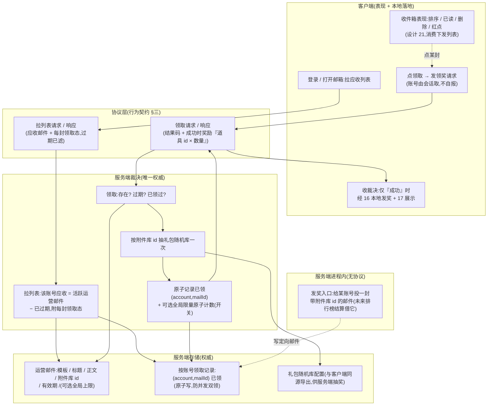

# 邮件上后端 · 运营推送来源 + 领奖权威(服务端权威 + 前后端协议契约)

把邮件的**运营推送来源**与**领奖裁决权威**从客户端搬到服务端:服务端权威存运营邮件(模板 / 标题 / 正文 / 附件奖励库 id / 有效期 / 可选全局限量),客户端登录 / 拉取时下发**该账号应收的邮件列表**;领奖时由服务端**原子防重领**(同邮件同账号只领一次)、**裁定附件奖励**(服务端抽奖、客户端不申报)、**过期校验**(服务端时钟)。这是本项目第三个**全栈特性**(继 [设计 30 兑换码服务端化](#30-redeem-code-server)、[设计 31 排行榜上后端](#31-rank-server) 之后),服务端段(协议 + 处理逻辑 + 存储)先行,客户端段(占位的运营来源切真实 RPC + 领奖走服务端校验)后续另增量,两段据**同一份行为级基线**开工。

本篇兑现 [设计 21 通用邮件系统](#21-mail-system) 留的**服务器 / 运营来源接缝**(设计 21 §3.7 把「后台全服发邮件 / 定时邮件」抽象成可注入的邮件来源接口,离线留占位、返空),并把设计 21 客户端本地裁决的**领奖**(§3.4.2 抽奖 + 落点 + 标已领,客户端权威)上移服务端裁决。设计 21 的**收件箱表现**(列表排序 / 已读 / 删除已读 / 红点 / 超量清理)本增量**不动**,留客户端表现层,客户端段落地时再适配。

> [!WARNING]
> **读前必看 · 五条边界**
>
> - **服务端是运营邮件的唯一来源、领奖的唯一权威。**「这个账号该收哪些运营邮件、每封能不能领、领出什么」由服务端裁定。客户端**不**在本地伪造运营邮件、不自行决定领奖结果。客户端只做三件事:拉取服务端下发的应收邮件列表、把领奖请求发给服务端、按服务端裁决的奖励本地落地(复用 [设计 16](#16-item-system) 落点)+ 展示([设计 17](#17-reward-display))。这与设计 21 的**对外收件接口**(游戏内系统在客户端进程内发奖,如设计 22 排行榜客户端结算)是**两道不同的入口**——对外收件接口仍是客户端进程内能力,本篇新增的是**服务端**侧的运营来源 + 领奖权威。
> - **奖励附件用「奖励随机库 id」,服务端抽奖、客户端不申报。**邮件附件 = [设计 16](#16-item-system) 礼包随机库的库表 id(spec「Reward 表 id」,`gift_random` 的 index)。<mark>抽奖在服务端</mark>:服务端持礼包随机库配置(与客户端同源导出),领奖时按库 id 抽一次,把抽出的「道具 id × 数量」放进领奖响应;客户端不申报想要什么、不能虚增。客户端拿到「道具 id × 数量」后用既有道具元数据([设计 16](#16-item-system) 道具表)解析图标 / 名称、经 [设计 17](#17-reward-display) 展示,并经既有落点发进本地进度——与兑换码([设计 30](#30-redeem-code-server::response))奖励「服务端裁定『道具 id × 数量』、客户端本地落地」同范式。
> - **领奖落地在客户端,防重领权威在服务端。**玩家进度(灵力 / 虔诚币 / 经验 / 道具背包)当前是**客户端本地存档**([设计 14](#14-save-system)),服务端无玩家库存可写。故采「服务端裁决 + 记录已领 + 客户端落地」:服务端是「这封邮件这个账号领过没、能领出什么」的唯一权威并**原子记录已领**;客户端拿到裁决后把奖励发进自己本地进度。防重领的保证来自服务端记录(同邮件同账号第二次领返「已领过」、不再附奖励),与「进度存在哪」无关(诚实边界见 [§五](#32-mail-server::walk) 末)。
> - **身份取联网会话的设备账号,客户端不自报账号。**「这是谁的收件箱、谁在领这封邮件」**由服务端从当前联网会话已认证的设备账号取**,客户端**不**把账号 id 当请求字段发(否则可领他人邮件 / 顶替领奖)。沿用 [设计 30](#30-redeem-code-server::request) / [设计 31](#31-rank-server::submit) 已确立的身份口径(身份是会话属性,非请求参数),不要求先建完整账号系统(已与用户拍板)。
> - **本增量只做「运营推送来源 + 领奖校验 + 过期」核心,收件箱表现留客户端。**邮件**列表排序 / 标记已读 / 删除已读 / 红点 / 超量清理**是收件箱表现(设计 21 §3.4–3.6),本增量服务端**不接管**,留客户端表现层(设计 21 收件箱消费服务端下发的列表)。全局限量、定时发放作**范围开关**(默认不做,见 [§七](#32-mail-server::open)),不强行塞满。本篇交付到「服务端权威运营邮件来源 + 拉列表协议 + 领奖协议(原子防重 + 服务端抽奖 + 过期)+ 服务端发奖入口(供未来服务端结算复用)」。

> [!NOTE]
> **立项信息**
>
> | 项 | 内容 |
> | --- | --- |
> | **类型** | 全栈特性 · 邮件运营来源 + 领奖裁决上移服务端。出 code-free 设计意图 + 行为级协议契约 + 行为级验收,交服务端段(协议 + 处理逻辑 + 存储)先行落地,客户端段(运营来源切真实 RPC + 领奖走服务端校验)后续另增量。 |
> | **方向约束** | 离线还原 · **去变现**:邮件用于**运营发放**(节日礼包 / 公告补偿 / 系统奖励)与**游戏内系统结算发奖**(排行榜结算 / 活动回收),**不**含充值 / 内购 / 付费——服务端只下发运营配置的奖励,不发可购买物,与去变现不冲突。服务端化是为「运营能给真实账号推送邮件 + 同邮件每账号只领一次(跨设备防重领)+ 奖励额度权威」这几件离线做不到的事([设计 21](#21-mail-system) §3.7 已承认本作无网络层、运营来源只能占位),不是为变现。加法式:服务端是已引入的权威端([设计 30](#30-redeem-code-server) 起),本特性新增邮件的协议 / 裁决 / 存储;客户端既有发奖落点(16)/ 持久化(14)/ 展示(17)复用,既有玩法逻辑零行为变化。 |
> | **需求降层** | **a. 表层要求**(任务字面):邮件上后端——服务端存运营邮件并下发该账号应收列表;领奖由服务端原子防重领 + 裁定附件 + 过期校验 + 可选全局限量;身份从会话取、客户端不自报;发奖入口设计成可复用(未来排行榜结算发结算邮件借它);本增量只做来源 + 领奖,收件箱表现留客户端。 **b. 底层目的**(为玩家 / 运营达成什么):让运营能给**真实账号**安全推送邮件与奖励——同一封邮件每个真实玩家只领一次(换设备 / 重装 / 多端都拦得住)、奖励额度由服务端裁定不被客户端虚增,这是设计 21 离线方案做不到(本地收件箱可被改存档绕过防重领)且本地时钟可改无法守过期的几件事;对玩家则是「邮件在哪台设备登同一账号都只能领一次、领出的奖励是服务端给的」的一致体验。同时为「游戏内系统结算发奖」(排行榜结算)备一个服务端侧的发邮件入口。 **c. 有无更直达 b 的做法**:b 的本质是「邮件与领取记录需一个跨设备汇总、玩家改不了的权威存储 + 服务端裁决」——服务端账号级邮件存储 + 领取记录是直达做法,无更省替代(纯客户端做不到跨设备 + 防篡改 + 服务端时钟,这正是设计 21 留运营来源接缝、本作无网络层只能占位的原因)。无更优解,按表层实现。 |
> | **范围(产品 · 玩法)** | **服务端新增**:① 运营邮件来源——权威存运营邮件(模板 / 标题 / 正文 textId / 附件库 id / 有效期),拉取协议下发该账号应收的非过期邮件列表 + 每封领取态;② 领奖裁决——原子防重领(同邮件同账号一次)+ 服务端按库 id 抽奖裁定附件 + 服务端时钟判过期;③ 服务端发奖入口(进程内 API:给某账号投一封带附件库 id 的邮件),供未来服务端结算(排行榜)复用;④ 邮件存储(运营邮件集合 + 按账号邮件领取记录集合)。 **客户端改**(后续增量,本稿仅作契约约束):运营邮件来源从占位(返空)切真实 RPC 拉取;领奖从客户端本地裁决(设计 21 §3.4.2)切成「发领奖请求 → 服务端裁决 → 仅成功时本地发奖(复用 16)+ 展示(17)」;收件箱表现(排序 / 已读 / 删除 / 红点 / 清理)适配服务端下发的列表。 **协议新增**:拉邮件列表请求 / 响应、领取请求 / 响应(行为语义见 [§三](#32-mail-server::protocol))。 **UI 零改动**(邮件界面 / 详情 / 红点显示 / icon 仍延后,需美术,同设计 21)。 |
> | **关键约束** | 服务端遵 Fantasy.Net 既有约定(协议 / 处理逻辑 / MongoDB 存储 / 错误码非异常 / 不手改生成物 / 不手动注册,正本以服务端工程 fantasy-net 为准,本稿不写代码符号);裁决以**结果码**回包,不抛异常致连接断;沿用设计 30 / 31 已确立的「身份从会话取」「协议双端同步」基线。服务端抽奖复用礼包随机库配置(与客户端同源导出),不另造奖励结构。客户端复用既有发奖落点(16)/ 展示(17),不另造。本篇正文为 code-free 设计意图,不含协议消息名 / 字段代码名 / 类名 / 文件路径 / 接缝清单——服务端段据行为语义定协议与存储,客户端段据同一契约接收。 |

## 一、前后端职责切分 {#split}

邮件流程的每一步归谁,按「权威 vs 表现」一刀切清:**凡影响『这账号收哪些邮件、能不能领、领出什么』的判定全在服务端;凡收件箱呈现与领奖落地在客户端**。逐环节归属:

| 环节 | 归属 | 说明 |
| --- | --- | --- |
| 运营配置邮件(模板 / 标题 / 正文 / 附件库 id / 有效期) | **服务端**(权威) | 运营在服务端配置的权威数据;客户端不持第二份运营邮件来源 |
| 「这账号应收哪些邮件」 | **服务端**(权威) | 服务端按运营邮件 + 该账号领取记录下发应收列表(默认全服广播,见 [§3.5](#32-mail-server::source-api)) |
| 过期判定 | **服务端**(权威) | 以服务端时钟为准(离线方案「客户端时钟可改」问题一并解决);过期邮件不下发、不可领 |
| 同邮件同账号是否已领 | **服务端**(权威) | 按账号 + 邮件记录,跨会话 / 跨设备 / 重装均拦得住(原子防重领) |
| 附件奖励裁定(抽奖) | **服务端**(权威) | 服务端按附件库 id 抽礼包随机库一次,返「道具 id × 数量」;客户端不申报、不能虚增额度 |
| 可选全局限量(范围开关) | **服务端**(权威) | 配了上限的运营邮件,领取占名额,原子计数防超发(默认不做,见 [§七 O2](#32-mail-server::open)) |
| 实际发奖落地 | **客户端** 表现 | 玩家进度(货币 / 经验 / 道具背包)当前为客户端本地存档([设计 14](#14-save-system)),服务端无玩家库存可写;客户端按裁决的奖励列表经 [设计 16](#16-item-system) 既有落点发放 |
| 收件箱列表排序(已读>未读 + 时间) | **客户端** 表现 | 设计 21 §3.4 收件箱排序,消费服务端下发的列表;本增量服务端不接管 |
| 标记已读 / 删除已读 / 红点 / 超量清理 | **客户端** 表现 | 设计 21 §3.4–3.6 收件箱表现,本增量不接管(已读 / 删除是否上服务端 = 范围开关,见 [§七 O4 / O5](#32-mail-server::open)) |
| 结果 / 邮件展示 | **客户端** 表现 | 邮件界面 / 详情 / 领奖结果文案 + 奖励展示(经 17),仍延后(需美术) |

> [!NOTE]
> **为什么「领奖落地」留在客户端,而领奖权威在服务端?**
>
> 与兑换码([设计 30](#30-redeem-code-server::split))同理:本项目玩家进度(货币 / 经验 / 背包)当前是**客户端本地存档**([设计 14](#14-save-system)),服务端是只管裁决 + 记录的权威端,**没有玩家库存可直接写**。故采「服务端裁决 + 记录已领 + 客户端落地」:服务端是「这封邮件这个账号能不能领、领什么」的唯一权威并原子记录已领;客户端拿到裁决后把奖励发进自己本地进度。<mark>防重领的保证来自服务端记录(同邮件同账号第二次请求返『已领过』、不再附奖励),与进度存在哪无关</mark>。客户端本地进度本就可被改存档篡改([设计 14](#14-save-system) 已承认),服务端化**不**声称让本地进度防篡改——它声称的是**邮件领取本身**权威(每邮件每账号一次、奖励额度服务端定、过期服务端判),这是可达且正确的范围(诚实边界见 [§五](#32-mail-server::walk) 末)。

## 二、系统模型 {#model}

四方参与:客户端(拉列表 / 收件箱表现 / 领奖落地)、协议层(拉列表 / 领取两组请求响应)、服务端裁决(应收过滤 + 过期 + 防重领 + 抽奖)、服务端存储(运营邮件 + 按账号领取记录)。另有一条不经协议的**服务端进程内发奖入口**(供未来服务端结算投递定向邮件)。结构图:

> [!NOTE]
> **领取裁决顺序为什么是「存在 → 过期 → 已领过 →(限量)→ 抽奖 → 记录」?**
>
> 先判与账号无关的整邮件级条件(存在 / 过期),再判与本账号相关的「我领过没」,最后才抽奖 + 记录。理由:① 与账号无关的失败对所有人一致,可早短路、不必碰账号记录;② <mark>抽奖必须在「确认未领过」之后、且与「记录已领」原子合并</mark>——否则同账号并发两次领同一封,都先查到「未领过」再各自抽奖发奖,造成双领(崩法见 [§五](#32-mail-server::walk));③ 全局限量(开关开时)的「占名额」与「记本账号已领」须原子,防并发超发(同 [设计 30](#30-redeem-code-server::walk) 限量原子)。各失败分支返对应结果码,不发奖、不记录、不抛异常。

## 三、行为级协议契约 {#protocol}

两组协议:**拉邮件列表**、**领取奖励**。用**行为语言**描述携带项与语义,服务端段据此定协议消息(消息名 / 字段代码名由服务端段按 Fantasy.Net 约定定,本稿不写)。

### 3.1 拉邮件列表 · 请求 {#pull}

| 携带项 | 行为语义 | 约束 |
| --- | --- | --- |
| (无业务字段) | 「把我这个账号应收的邮件列表给我」 | 触发时机由客户端定(登录后 / 打开邮箱 / 下拉刷新) |
| 玩家身份 | **不作为请求字段**:服务端从当前联网会话已认证的设备账号取 | <mark>客户端不得自报账号 id</mark>——否则可拉他人收件箱。身份是会话属性,非请求参数(沿用 [设计 30](#30-redeem-code-server::request) / [设计 31](#31-rank-server::submit)) |

### 3.2 拉邮件列表 · 响应 {#pull-resp}

响应 = **该账号应收的邮件列表**(每封一条),外加结果码:

| 携带项 | 行为语义 | 约束 |
| --- | --- | --- |
| 应收邮件列表 | 服务端筛出该账号应收、**未过期**的邮件;每封 = 邮件标识 + 发件人 textId + 标题 textId + 正文 textId + 收件 / 发件时间 + 是否有附件 + **该账号对此邮件的领取态(已领 / 未领)** | 过期邮件**不**下发(服务端时钟已滤);列表**不含**奖励明细(奖励是领取后才裁定 / 展示的,见下「为什么列表不回奖励明细」);排序 / 已读态由客户端表现层处理(本增量不下发已读态,见 [§七 O4](#32-mail-server::open)) |
| 结果码 | 成功 / 服务不可用 | 见 [§四](#32-mail-server::degrade) 降级 |

> [!NOTE]
> **为什么列表只回「是否有附件 + 已领态」,不回奖励明细?**
>
> 邮件附件是**奖励随机库 id**(spec),其产物要**抽奖**才确定;在「拉列表」时就抽奖会让「看一眼列表」产生随机结果(且玩家没点领取就消耗了随机)。故列表只回「有无附件 + 这账号领过没」(够客户端画红点 / 标领取按钮);真正的奖励「道具 id × 数量」在**领取响应**里给(领取时才抽)。这与设计 21 §3.4.2「领取 = 抽奖 → 落点」时机一致,只是抽奖从客户端移到服务端。文本(标题 / 正文 / 发件人)是 textId 占位,客户端查多语言表显示(同 num/item/reward/settings 现状)。

### 3.3 领取奖励 · 请求 {#claim}

| 携带项 | 行为语义 | 约束 |
| --- | --- | --- |
| 邮件标识 | 要领取的那封邮件(拉列表响应里的邮件标识) | 服务端按此 + 会话账号定位该账号的这封邮件;定位不到按「邮件不存在」返(不崩) |
| 玩家身份 | **不作为请求字段**:服务端从会话取 | 同 [§3.1](#32-mail-server::pull),不自报——否则可领他人邮件 / 顶替领奖 |

> [!NOTE]
> **一键领取(领所有未领)放哪?**
>
> spec / 设计 21 §3.4.2 有「一键领取」(领所有有奖未领 + 全标已读)。本增量**领取协议按单封设计**(一封一请求),理由:① 单封领取是核心、语义最清晰,防重 / 抽奖 / 记录都按单封原子;② 一键领取 = 客户端对所有未领邮件**逐封发单封领取请求**(客户端编排),服务端无需新协议即可支持,且每封仍各自原子防重;③ 若要服务端侧「一次请求领多封」批量协议(省往返)是表现层增强,作开关([§七 O6](#32-mail-server::open)),默认用「客户端逐封领」。「全标已读」属收件箱表现,留客户端(本增量不接管已读)。

### 3.4 领取奖励 · 响应 {#claim-resp}

响应 = **结果码 + 成功时的奖励列表**。结果码五类(对应设计 21 §3.4.2 的领取结果码,「服务不可用」为服务端化新增):

| 结果码 | 触发 | 客户端行为 |
| --- | --- | --- |
| 成功 · 已发奖 | 邮件存在、未过期、本账号未领过(且限量开关开时未超量) | 按奖励列表经 [16](#16-item-system) 本地发奖 + [17](#17-reward-display) 展示「奖励已领取」 |
| 邮件不存在 | 按邮件标识 + 会话账号定位不到 | 提示「邮件不存在」,不发奖 |
| 无奖励 | 该邮件附件库 id = 0(无奖励邮件) | 提示「该邮件无奖励」,不发奖(纯通知邮件) |
| 已领过 | 本账号已领过此邮件(服务端记录命中) | 提示「奖励已领取过」,**不发奖** |
| 已过期 | 邮件有有效期且服务端时钟已超过 | 提示「邮件已过期」,不发奖 |
| 服务不可用 | 请求未达服务端 / 无法处理 / 超时 | 提示「服务暂不可用,请稍后重试」,不发奖,**邮件保持可领**(见 [§四](#32-mail-server::degrade)) |

成功时附带的**奖励列表**:一组「道具 id × 数量」——服务端按该邮件附件库 id 抽礼包随机库一次得到的产物。客户端用既有道具元数据([16](#16-item-system))解析每项图标 / 名称 / 品质,经 [17](#17-reward-display) 归一展示,并经既有落点发进本地进度。

> [!NOTE]
> **抽空 / 库 id 未登记 / 全局限量已满怎么回?**
>
> ① 附件库 id 在服务端礼包随机库**未登记**(抽取查无)→ 仍返「成功」但奖励列表为空(不抛;同设计 21 §3.4.3 边界:demo 行 reward=1002 须服务端礼包库存在该 index 才有实物)。② 全局限量开关**开**且已满 → 返「已领完 / 全局限量已满」结果码(开关关时无此分支)。③ 抽奖在服务端,客户端拿到的就是确定的「道具 id × 数量」,不会两端抽出不同结果(设计 21 客户端本地抽奖时,不同设备各抽各的;搬服务端后同一次领取产物唯一)。

### 3.5 服务端发奖入口(进程内,无协议) {#source-api}

任务要求**发奖入口设计成可复用**——未来排行榜结算(Tier1 后续)要借它发结算邮件。这是一个**服务端进程内 API**(非客户端协议):

| 能力 | 行为语义 | 约束 |
| --- | --- | --- |
| 给某账号投一封邮件 | 入参 = 目标账号 + 发件人 textId + 标题 / 正文 textId + 附件库 id + 有效期;服务端写一条**定向邮件**进该账号的收件存储(初始未领),该账号下次拉列表即可见、可领 | <mark>这是服务端版的设计 21「对外收件接口」</mark>:服务端内部各系统(未来排行榜结算 / 活动回收 / 系统补偿)经此把奖励经邮件发给某账号;走与运营邮件**同一套领取协议 / 防重 / 抽奖机制**,无需为结算另造发奖路径 |

> [!NOTE]
> **运营广播邮件 vs 系统定向邮件:两路插入,一套领取**
>
> 服务端邮件有两条插入来源,但**领取机制完全一致**(都按单封防重 + 抽奖 + 记录):
> - **运营广播**(本增量核心):运营在服务端配置的模板邮件,**全服**账号应收(默认广播,见下「应收口径」)。来源 = 运营配置(与客户端 `mail.xlsx` 同源导出的模板)。
> - **系统定向**(发奖入口):服务端进程内系统投给**指定账号**的邮件(未来排行榜结算借它)。来源 = 服务端进程内 API。
>
> 两者下发与领取走同一协议([§3.1](#32-mail-server::pull)–[§3.4](#32-mail-server::claim-resp)),客户端无需区分。<mark>本增量发奖入口先建好可被调用,真正的调用方(排行榜服务端结算)是后续 Tier1 增量</mark>——本增量验收其「可被进程内调用、投递的邮件能被该账号拉到并领取」(见 [§八 SV](#32-mail-server::accept-server)),不接真实结算。

> [!NOTE]
> **「该账号应收哪些运营广播邮件」的口径(安全默认:全服广播)**
>
> 本增量运营邮件默认**全服广播**:每个账号应收所有**活跃**(已发布 + 未过期)的广播邮件,减去该账号已领过的(已领的仍可下发但标已领态,删除属客户端表现)。「私人 / 区服多选 / 定向投放」是运营后台能力,本增量除「系统定向发奖入口」外**不做**(区服离线视单一本地区服,同设计 21);要做定向运营投放是范围开关([§七 O3](#32-mail-server::open))。服务端如何物化「应收」(拉取时按 account 比对已领记录算,还是预生成每账号每邮件行)是服务端实现选择(code-blind,server-dev 定);**行为契约**只要求:拉列表返该账号应收、未过期的邮件 + 每封领取态。

## 四、服务不可用的降级行为 {#degrade}

服务端是运营来源 + 领奖的唯一权威。邮件与排行榜类似——**它不阻断核心玩法**(邮件不是玩法路径),但领奖须**不可被利用**:

| 情形 | 客户端行为 | 为什么 |
| --- | --- | --- |
| 拉列表发不出 / 超时 / 返「服务不可用」 | **不阻断玩法**:邮箱显示「暂不可用 / 稍后重试」或空列表;玩法照常 | 邮件不是玩法路径,服务挂了不该卡住游戏;无本地运营邮件可伪造(运营来源唯一在服务端) |
| 领取发不出 / 超时 / 返「服务不可用」 | 提示「服务暂不可用,请稍后重试」;**不发奖**;邮件保持可领,稍后重试 | 若此时本地放行领奖,玩家断网即可绕过跨设备防重领(同一封领多次),服务端化形同虚设——同 [设计 30](#30-redeem-code-server::degrade) 兑换码「不本地放行」 |

> [!NOTE]
> **与排行榜降级的区别:邮件领取「不本地放行」,靠近兑换码而非排行榜**
>
> [设计 31](#31-rank-server::degrade) 排行榜查榜不可用时**回退本地源**(本机 + 陪榜),因为本地榜既不发奖也不伪造全服名次、无安全后果。邮件**领取**不同:它**发奖**且**须防重领**,本地放行 = 可重复领同一封 = 超发,与 [设计 30](#30-redeem-code-server) 兑换码同类——故领取**绝不本地放行**,服务不可用 = 领取不发生 + 可重试。区别根源同 [设计 31 §四旁注](#31-rank-server::degrade):本地兜底会不会绕过该服务端的**安全保证**——绕过(发奖 / 防重)则不放行,不绕过(纯显示)则可回退。
>
> 注意:邮件**列表**的降级与**领取**的降级不同——列表只是显示(不可用时空列表 / 提示,无安全后果);领取是发奖(不可用时不放行)。「服务不可用」与「邮件不存在 / 已过期 / 已领过」是**不同结果码**,文案不同(前者鼓励重试、邮件仍可领;后者告知此邮件本身不能领),误把不可用当其一会让玩家以为好邮件废了。

## 五、整局走查 · 每个机制的崩法与对策 {#walk}

把一次「运营发邮件 → 玩家拉列表 → 领取 → 落地」在纸面跑一遍,逐机制点出最可能炸的一类(零值 / 满值 / 并发 / 中途存档 / 恶意利用)+ 对策:

| 机制 | 最可能的崩法 | 类别 | 对策 |
| --- | --- | --- | --- |
| 领奖防重领 | 同账号并发两次领同一封(连点 / 重试 / 多端),都先查到「未领过」再各自抽奖发奖 → 双领 | 并发 | 服务端「检查未领过 + 抽奖 + 记录已领」必须**原子**(以(账号,邮件)为唯一键的条件写入,重复即失败);第二次请求拿到「已领过」、不再附奖励。抽奖须在记录原子区内(或记录成功后才认抽奖结果),不可「先抽奖发响应、再记录」 |
| 全局限量计数(开关开时) | 多账号并发领最后一个名额,都先读到「未满」再各自 +1 → 超发 | 并发 | 「检查上限 + 增计数」单次原子(条件递增,达上限即失败),不可先读后写——同 [设计 30](#30-redeem-code-server::walk) 限量原子。开关关时无此机制 |
| 附件奖励裁定 | 客户端篡改领取请求虚报想要的道具 / 数量 | 恶意利用 | 客户端**不申报**奖励;附件由服务端按库 id 抽奖裁定并回包。即便客户端改了回包数量,改的是自己本地存档([设计 14](#14-save-system) 既有限制),不影响服务端记录 |
| 过期判定 | 客户端改本地时钟想领过期邮件 / 服务端漏判过期下发了过期邮件 | 恶意利用 / 零值 | 过期以**服务端时钟**判:过期邮件不下发([§3.2](#32-mail-server::pull-resp))、领取时再判一次过期(防下发后到期);客户端时钟不参与裁决 |
| 客户端本地发奖 | 服务端已记「已领」、回包成功,客户端在落地前崩溃 → 邮件领了但奖励没进玩家存档 | 中途存档 | **安全默认含「待发放」崩溃重放**(同 [设计 30 O3](#30-redeem-code-server::open)):客户端收成功裁决后先把奖励列表写入本地「待发放」持久记录(复用 [设计 14](#14-save-system) 存档接缝)、再发进进度、落地后清除;启动重放未清除的待发放。使「记录已领 → 本地落地」跨崩溃恰好一次。该机制属客户端段、可砍(砍则退化为极小概率丢奖) |
| 应收列表口径 | 已领 / 已过期邮件仍下发占列表 / 已删邮件又冒出来 | 满值 / 体验 | 拉列表服务端滤掉已过期;已领的仍可下发但标已领态(客户端决定显不显 / 删不删,本增量删除属客户端表现);广播邮件按活跃集计算应收 |
| 身份取值 | 客户端自报账号 id 领他人邮件 / 拉他人收件箱 | 恶意利用 | 身份从会话已认证账号取,**非请求参数**([§3.1](#32-mail-server::pull) / [§3.3](#32-mail-server::claim));拉只拉自己、领只领自己 |
| 邮件不存在 | 客户端传了服务端没有 / 不属于该账号的邮件标识 | 零值 / 配置 | 服务端返「邮件不存在」结果码,不崩、不写记录、以结果码回包不抛异常断连 |
| 发奖入口(服务端进程内) | 结算重复触发对同账号投重复结算邮件 → 玩家重复收结算奖 | 中途存档 / 幂等 | 本增量发奖入口只负责「投一封邮件」;**结算的幂等**(同一次结算只投一次)是**调用方**(排行榜结算[设计 33](#33-rank-settle-server::idem))的责任,不在本增量。本增量发奖入口验收只验「可投递 + 被领」,不验结算幂等 |

> [!WARNING]
> **承认的固有限制(诚实边界)**
>
> 服务端化让**邮件领取**权威(每邮件每账号一次、奖励额度服务端定、过期服务端判、跨设备防重领),但**不**让客户端本地进度防篡改——玩家进度仍是本地存档([设计 14](#14-save-system)),被改存档者可直接编辑自己的货币 / 背包,这与邮件无关、服务端化不解决,也非本特性目标。本特性的可达且正确范围 = **邮件领取裁决权威 + 运营来源权威**。另:**已读态 / 删除**本增量留客户端表现(非服务端权威),故跨设备已读 / 删除不同步是已知取舍(范围开关 O4 / O5,默认客户端本地);若未来要已读 / 删除也服务端权威,是收件箱状态上云的增量,不在本篇。

## 六、与设计 21 的关系(运营来源兑现 + 领奖上移 + 客户端段适配) {#seam}

设计 21 把「运营来源」抽象成可注入接口(占位返空)、领奖由客户端本地裁决(§3.4.2)。本篇实现运营来源背后的服务端 + 把领奖上移服务端。**本增量 server 段先行,只建服务端、未改客户端现状**,故设计 21 本次**无需改写**(其收件箱仍客户端本地可跑);下表为**客户端段(后续增量)**的适配前瞻,客户端段据此开工:

| 设计 21 现状 | 本篇后(客户端段适配) | 处置 |
| --- | --- | --- |
| 运营来源接口「占位」(返空、不连网) | 兑现为真实 RPC:拉列表走拉列表协议,把服务端下发的运营邮件转成设计 21 的收件草稿 / 邮件进收件箱 | 设计 21 §3.7 / §七 O1 的「未来上后端实现来源接口」即本特性兑现 |
| 领奖**客户端本地裁决**(§3.4.2 抽奖 + 落点 + 标已领,客户端权威) | 领奖切「发领取请求 → 服务端裁决(防重 + 抽奖 + 过期)→ 仅成功时本地发奖(复用 16)+ 展示(17)」 | <mark>客户端段关键改写点</mark>:设计 21 的本地抽奖 / 本地防重退出权威路径,客户端不再本地决定领奖结果(同 [设计 20→30](#30-redeem-code-server::supersede) 兑换码本地校验退出权威) |
| 收件箱表现:列表排序 / 已读 / 删除 / 红点 / 超量清理(§3.4–3.6) | **保留**,改为消费服务端下发的列表;已读 / 删除默认仍客户端本地(范围开关 O4 / O5) | 收件箱表现层逻辑不变,数据来源从「本地 + 占位来源」变「服务端下发」 |
| 对外收件接口(客户端进程内,设计 22 排行榜客户端结算调它,§3.3) | **保留**(客户端进程内能力不变) | 这是**客户端**进程内发奖入口,与本篇**服务端**进程内发奖入口([§3.5](#32-mail-server::source-api))**并行**;客户端结算用前者,未来服务端结算用后者,互不替代 |
| 收件箱本地持久化(本地存档,§3.5) | **保留**(客户端收件箱本地缓存仍可用);领取态权威以服务端为准 | 本地存档退化为「下发列表的本地缓存 + 客户端表现态(已读 / 删除)」,领取态以服务端回包为准 |

> [!NOTE]
> **为什么本增量不改写设计 21?(与设计 31 同理)**
>
> 本增量是 server 段先行刀,只建「运营来源背后的服务端 + 领奖权威端」,**未改客户端现状**——设计 21 的收件箱 + 本地抽奖领奖在客户端段落地前**仍真、仍可跑**。真正触发设计 21「占位 → 真实」「本地领奖 → 服务端领奖」现状改写的是**后续客户端段增量**(同 [设计 31](#31-rank-server::seam) 对设计 22 的处置:server 段先行不急着改旧稿,先问「这一刀改的是哪一端的现状」)。本节为前瞻记录客户端段适配契约,供其开工;本增量不改设计 21 正文。

## 七、待拍板清单(范围开关 + 可砍档) {#open}

自治授权下均取安全默认推进;列此交 boss / 用户复核,要改另开增量。

| # | 开关 | 安全默认 | 备选 / 触发改动 |
| --- | --- | --- | --- |
| O1 | 本增量范围 | **运营推送来源 + 领奖校验(防重 + 抽奖 + 过期)+ 服务端发奖入口** 核心 | 收件箱表现(排序 / 已读 / 删除 / 红点 / 超量清理)留客户端(设计 21);排行榜服务端结算调发奖入口是后续 Tier1 增量 |
| O2 | 运营邮件全局限量 | **不做**(本增量核心 = 来源 + 领奖 + 过期;mail.xlsx 现无限量字段) 可砍 / 后续 | 运营要限量发(前 N 名领完即止)时,运营邮件加「全局上限」字段 + 领取原子计数(镜像 [设计 30](#30-redeem-code-server) 兑换码 LIMITED:检查上限 + 增计数原子);本增量先不加,留接口余量 |
| O3 | 定向 / 私人运营投放 | **不做**(运营默认全服广播;系统定向仅经服务端进程内发奖入口) 后续 | 运营后台要给指定账号 / 区服 / 分群发邮件时,运营来源加定向投放(目标账号集);区服离线视单一本地区服(同设计 21) |
| O4 | 已读态服务端同步 | **不做**(已读留客户端表现,跨设备不同步) 后续 | 要跨设备已读一致时,服务端按账号记每封已读态 + 加「标已读」协议;本增量已读纯客户端(设计 21 §3.4) |
| O5 | 删除已读服务端同步 | **不做**(删除留客户端表现,跨设备不同步) 后续 | 要跨设备删除一致时,服务端软删 + 加「删除」协议;本增量删除纯客户端(设计 21 §3.4) |
| O6 | 一键领取批量协议 | **不做**(一键 = 客户端逐封发单封领取请求,每封各自原子防重) 增强 | 要省往返时,加「一次请求领多封」批量领取协议(服务端逐封原子);默认客户端逐封领即可([§3.3](#32-mail-server::claim) 旁注) |
| O7 | 客户端「待发放」崩溃重放 | **做**(闭领奖落地丢奖窗口,复用 14 存档接缝,属客户端段) 增强 | 砍则退化为「崩溃窗口极小概率丢奖,靠后续邮件补偿」;核心循环(权威领取 + 一次性)不依赖它,可砍(同 [设计 30 O3](#30-redeem-code-server::open)) |
| O8 | 运营邮件存储形态 | 服务端权威配置(模板与客户端 `mail.xlsx` 同源导出,具体落配置文件还是数据库集合由服务端段定) | 运营要热改 / 后台发邮件时,改用服务端数据库集合管理运营邮件;本增量同源导出模板 + 进程内发奖入口够用(server-dev 据 Fantasy.Net 现状取) |
| O9 | 身份与账号体系 | 复用现有联网会话设备账号(沿用 [设计 30](#30-redeem-code-server) / [31](#31-rank-server),已与用户拍板) | 未来建实名 / 多端同账号体系时,账号键换正式 id;服务端记录按当前账号键即可 |
| O10 | 结果 / 邮件文案多语言 | textId 占位(同 num/item/reward/settings/redeem 现状) | 多语言文本表建成后查表替换 |
| O11 | 邮件界面 / 详情 / 红点显示 / icon UI | **延后**(需美术,同设计 21) | 有美术 + 窗口流程时建窗口,接 17 奖励展示,运行手验 |

> **核心 / 增强 / 可砍三档**:核心 = 服务端权威运营来源(拉列表下发该账号应收 + 未过期)+ 领奖裁决(原子防重领 + 服务端抽奖裁定附件 + 服务端时钟判过期)+ 服务端进程内发奖入口(可被调用、投递可领)+ 拉列表 / 领取两组协议。砍掉所有非核心(全局限量 O2 / 定向投放 O3 / 已读 O4 / 删除 O5 / 批量领 O6 / 待发放 O7)后,核心循环「运营配邮件 → 玩家拉列表 → 领取(每账号一次、奖励服务端定)→ 本地发奖」仍成立。收件箱表现(O1 后半)与排行榜服务端结算调发奖入口不是本增量的可砍档,而是各自独立的后续刀。

## 八、验收点 {#accept}

按段拆:**服务端验收**(server-test 跑服 Log 往返 + 源生成器产物 + Code Review 核)、**客户端验收**(client 段后续增量,本稿先列契约约束供其开工)、**联调验收**(两段都到位后,前后端一次往返核)。完成定义均为**行为可观测**,不含代码定位。真往返写库依赖 MongoDB,本机不可达时按 **BLOCKED** 处理(非 FAIL):编译 / 源生成器产物 / Code Review / 协议双端同步照常验。

### 8.1 服务端验收(server-test,本增量主验) {#accept-server}

| # | 验收点(完成定义,可逐条核) |
| --- | --- |
| SV1 | 拉列表:某账号会话拉取 → 返该账号应收的运营邮件列表(默认全服广播:所有活跃未过期广播邮件),每封含发件人 / 标题 / 正文 textId + 收件时间 + 是否有附件 + 该账号领取态(初次全为「未领」) |
| SV2 | 拉列表**过期过滤**:已过期(服务端时钟 > 收件时间 + 有效期;有效期≤0 用全局 retain_days 兜底)的邮件**不下发**;未过期的下发;过期判定用服务端时钟(非客户端传入) |
| SV3 | 领取成功:领一封有附件、未过期、本账号未领过的邮件 → 返「成功」+ 奖励列表(道具 id × 数量)= 服务端按该邮件附件库 id 抽礼包随机库一次的产物;服务端记录该 (账号,邮件) 已领 |
| SV4 | **防重领**:同账号对同一封第二次领取 → 返「已领过」,**响应不含奖励列表**(不再授权发奖);该账号该邮件领取记录只一条 |
| SV5 | **并发防重领**:同账号并发两次领同一封 → 最终只有一次返「成功」、另一次「已领过」;只发一次奖、记录只一条(原子写,无双领) |
| SV6 | 无奖励邮件(附件库 id = 0)领取 → 返「无奖励」、不发奖、不崩;有附件但库 id 在服务端礼包库**未登记**(抽取查无)→ 返「成功」但奖励列表为空(不抛) |
| SV7 | 领取**过期校验**:邮件下发后到期(服务端时钟已过)再领 → 返「已过期」,不发奖、不记录已领;无有效期 / 未到期的任何时刻可领 |
| SV8 | 邮件不存在:领取传服务端无的 / 不属于该账号的邮件标识 → 返「邮件不存在」结果码,**不崩、不写记录**,以结果码回包不抛异常断连 |
| SV9 | 身份从会话取:拉列表 / 领取请求**不携带账号字段**也能裁决(以会话账号为键);拉只返会话账号收件箱、领只领会话账号的邮件;若实现接受客户端账号字段则视为缺陷(可领他人 / 拉他人收件箱)——核对协议契约不含客户端自报账号 |
| SV10 | **服务端发奖入口**(进程内):经进程内调用给某账号投一封带附件库 id 的邮件 → 该账号拉列表能看到这封(未领态)→ 领取返「成功」+ 该库 id 抽出的奖励;证发奖入口可复用(未来排行榜结算可借它发结算邮件) |
| SV11 | 失败 / 边界分支(邮件不存在 / 已过期 / 已领过 / 无奖励)均**以结果码回包、不抛异常断连**,且**不发奖、不重复记录**;空 / 异常邮件标识不崩 |
| SV12 | **服务端存储持久**:重启服务端后,先前领取记录仍在(同账号同邮件重领仍返「已领过」)、运营邮件仍可拉取——记录持久(MongoDB),非内存态 |
| SV13 | 运营邮件配置与客户端 `mail.xlsx` **同源一致**(同邮件 id 两端标题 / 正文 textId / 有效期 / 附件库 id 口径相同;mail_global 的 retain_days 一致);服务端抽奖用的礼包随机库与客户端 `gift_random` 同源 |
| SV14 | **Code Review**:服务端遵 Fantasy.Net 约定(协议 / 处理逻辑 / MongoDB 存储 / 错误码非异常 / 不手改生成物 / 不手动注册),正本清单逐条核;重点核「防重领 = 检查 + 抽奖 + 记录原子(非先抽后记)」「附件奖励服务端抽奖、协议不含客户端自报奖励 / 账号」「过期用服务端时钟」「发奖入口走同一套领取 / 防重机制不另造发奖路径」 |

### 8.2 客户端验收(client 段后续增量,契约约束) {#accept-client}

> 本增量 server 段先行,客户端段(运营来源切真实 RPC + 领奖走服务端校验 + 收件箱适配)后续另增量。以下为客户端段开工时的验收契约,本增量**不**实现、不验收,列此使两段据同一基线。

| # | 验收点(客户端段完成定义) |
| --- | --- |
| CV1 | 运营来源从占位切真实 RPC:拉列表走拉列表协议,把服务端下发的运营邮件转成设计 21 收件箱的邮件;断服 / 超时不阻断玩法(邮箱显示暂不可用 / 空列表,见 [§四](#32-mail-server::degrade)) |
| CV2 | 领奖切服务端校验:点领取发领取协议;收「成功」→ 按奖励列表经 [16](#16-item-system) 本地发奖 + [17](#17-reward-display) 展示;收「已领过 / 无奖励 / 已过期 / 邮件不存在」→ 不发奖、展示对应文案(互不相同);设计 21 §3.4.2 本地抽奖 / 本地防重退出权威路径 |
| CV3 | 客户端**不**保留本地放行领奖路径:断服后领取不会本地成功发奖(只进「服务不可用」降级、邮件保持可领)——证权威已上移、无离线兜底(同 [设计 30 CV4](#30-redeem-code-server::accept-client)) |
| CV4 | 收件箱表现适配:列表排序(已读>未读 + 时间)/ 红点 / 删除已读 / 超量清理消费服务端下发的列表;已读 / 删除默认客户端本地(O4 / O5);设计 21 收件箱服务对外行为不变 |
| CV5 | 客户端发请求**不携带自报账号 id**(与 SV9 对称:身份由会话承载);一键领取 = 逐封发单封领取请求(O6 默认) |
| CV6 | (O7 做时)「待发放」崩溃重放:模拟「收到成功裁决、写入待发放后、落地前中断」→ 重进时重放、奖励恰好发一次(不漏不重);复用 [设计 14](#14-save-system) 存档接缝,纯逻辑可单测 |
| CV7 | Code Review 5 红线(异步优先 / 模块访问 / 资源释放 / 热更边界 / 事件解耦);重点核「成功才发奖、发奖复用 16 不另造落点」「领奖服务不可用不本地放行」「奖励明细以服务端回包为准、客户端不本地抽奖」 |

### 8.3 联调验收(两段到位后) {#accept-e2e}

| # | 验收点(完成定义,可逐条核) |
| --- | --- |
| E1 | 真实往返:运营在服务端配一封带附件的邮件 → 客户端拉列表看到 → 点领取 → 服务端裁决「成功」+ 奖励列表 → 客户端本地发奖 + 展示,玩家进度增加正确;Log 两端可见拉列表 / 领取请求响应 |
| E2 | 跨会话 / 跨设备防重领:同账号领成功后断开重连(或换端登同账号)再拉列表 → 该邮件标已领、再领返「已领过」、不再发奖(证服务端记录跨会话生效) |
| E3 | 发奖入口联动(若有调用方桩):经服务端进程内发奖入口投一封定向邮件给某账号 → 该账号客户端拉列表看到 → 领取得奖(证发奖入口端到端可用,为未来排行榜结算发结算邮件铺路) |
| E4 | 协议同步:服务端协议改动后,客户端协议生成物已同步、双端各自编译通过(server-test 协议同步检查项)——漏同步判 FAIL |
| E5 | 全栈零回归:邮件外的既有客户端玩法 / 服务端功能(含兑换码 30 / 排行榜 31)不受影响;设计 21 收件箱 / 设计 22 既有 EditMode 测试全绿 |

> [!WARNING]
> **不在本特性验收 / 视环境 BLOCKED**
>
> - 邮件界面 / 详情 / 无邮件态 / 全部删除二次确认 UI 视觉、红点显示、邮件 icon、奖励真实图标 → 表现层延后(需美术,同设计 21),数据 / 协议层不返工。
> - **收件箱表现**(列表排序 / 已读 / 删除 / 红点 / 超量清理)→ 本增量留客户端(O1),server 段不接管、不验收。
> - **排行榜服务端结算调发奖入口**→ 后续 Tier1 增量(本增量只验发奖入口可被调用 + 投递可领,不接真实结算)。
> - 服务端跑服手验(SV / E)依赖服务端可起 + **MongoDB 可达**:跑不动按 **BLOCKED** 处理(server-test 出 BLOCKED 非 FAIL),编译 / 源生成器产物 / Code Review / 协议双端同步仍照做。
> - 跨物理设备防重领(E2 的「换设备」变体)需两端真实联网环境,自治模式下以「同账号跨会话」近似验证,真跨物理设备列 BLOCKED。
> - 全局限量(O2)、定向投放(O3)、已读 / 删除服务端同步(O4 / O5)、批量领协议(O6)、客户端段实现(8.2)不在本增量。

## 九、风险表 {#risk}

| 风险 | 应对 |
| --- | --- |
| **并发双领 / 超发**:同账号并发领同一封、多账号抢限量名额,先读后写致重复发奖 / 超量 | [§五](#32-mail-server::walk) 明确「检查未领过 + 抽奖 + 记录」须原子(唯一键条件写)、限量「检查 + 增计数」须原子;验收 SV5(并发防重领)专门断言。这是邮件领奖最经典的坑(同 [设计 30](#30-redeem-code-server) 兑换码),server-dev 须原子、抽奖在记录原子区内 |
| **抽奖时机错致两端不一致 / 重复随机**:在拉列表时抽奖、或先抽后记 → 看列表就消耗随机 / 双领发不同奖 | [§3.2](#32-mail-server::pull-resp) 列表不回奖励明细、不抽奖;[§3.4](#32-mail-server::claim-resp) 领取时才抽且抽奖在记录原子区内;验收 SV3 / SV5 断言领取产物唯一、并发只发一次 |
| **客户端自报账号被冒充**:把账号 id 当请求字段 → 领他人邮件 / 拉他人收件箱 | [§3.1](#32-mail-server::pull) / [§3.3](#32-mail-server::claim) / 验收 SV9 / CV5:身份从会话取,非请求参数;拉只拉自己、领只领自己 |
| **本地兜底重开漏洞**:客户端为「体验」加回离线领奖 → 玩家断网绕过跨设备防重领、重复领 | 读前必看第 3 条 + [§四](#32-mail-server::degrade) 明令领取服务不可用不本地放行;验收 CV3 专门断言断服不会本地成功发奖。区别于排行榜查榜回退(无发奖、无安全后果) |
| **过期靠客户端时钟**:客户端改本地时钟领过期邮件 | [§五](#32-mail-server::walk):过期以服务端时钟判,下发滤过期 + 领取再判过期;验收 SV2 / SV7 断言服务端时钟过期 |
| **中途丢奖**:服务端已记已领、客户端落地前崩 → 邮件领了奖没到 | [§五](#32-mail-server::walk) 安全默认含「待发放」崩溃重放(O7,客户端段);砍则退化为邮件补偿,如实承认 |
| **运营来源双份漂移**:客户端留一份运营邮件来源与服务端不一致 | 读前必看第 1 条:运营邮件来源唯一在服务端,客户端运营来源占位切真实 RPC(不自造运营邮件);模板配置与客户端 `mail.xlsx` 同源导出(SV13),消除漂移 |
| **发奖入口被误当结算幂等保证**:以为发奖入口本身防重复结算 → 结算重复触发投重复邮件 | [§五](#32-mail-server::walk):发奖入口只负责投一封;结算幂等是调用方([排行榜结算 设计 33](#33-rank-settle-server::idem))的责任,不在本增量;验收 SV10 只验「可投递 + 可领」 |
| **协议漏同步**:服务端改协议、客户端生成物没跟 → 联调假错 | 验收 E4 + server-test 协议同步检查项(漏同步判 FAIL);全栈最高风险点,交接区须显式声明同步状态(沿用 [设计 30](#30-redeem-code-server) / [31](#31-rank-server)) |
| **把数据源增量做成收件箱 / 结算增量**:顺手把已读 / 删除 / 红点 / 排序 / 排行榜结算做进服务端 → 范围溢出 | 读前必看第 5 条 + [§七 O1](#32-mail-server::open):本增量只做来源 + 领奖 + 过期 + 发奖入口,收件箱表现留客户端、结算留后续;验收 SV14 核服务端不接管收件箱表现、不接真实结算 |
| **去变现误判**:误以为「上后端」=「要变现」 | 立项框 + 读前必看:服务端只下发运营配置奖励,不发可购买物,与去变现一致(同 [设计 30](#30-redeem-code-server) / [31](#31-rank-server) 论证) |
