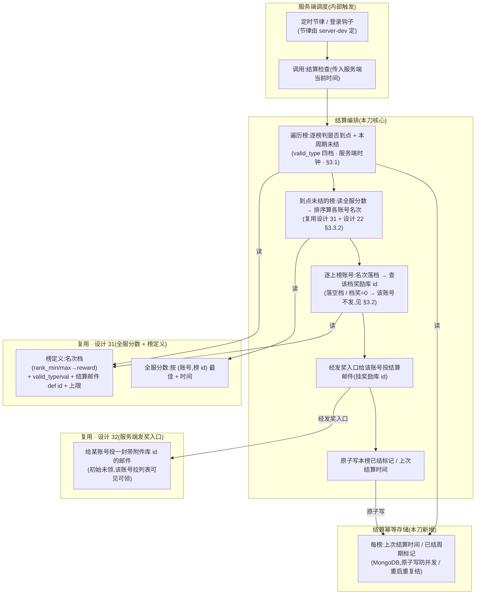

# 排行榜结算发奖上后端 · 服务端结算编排(到点 → 算名次 → 档奖 → 发结算邮件 + 幂等)

把排行榜的**结算发奖**从客户端搬到服务端:服务端按结算时机判定(服务端时钟)→ 读全服分数算名次 → 按名次档查奖励库 id → 经服务端发奖入口给上榜玩家投结算邮件,并保证**同周期只结算一次**(跨会话 / 重启 / 并发不重复发奖)。这是本项目第四个**全栈特性**(继 [设计 30 兑换码](#30-redeem-code-server)、[设计 31 排行榜数据源](#31-rank-server)、[设计 32 邮件](#32-mail-server) 之后),也是排行榜全栈三刀的**收口刀**——本刀只落**服务端段**(结算编排 + 幂等存储),不动客户端。

本篇兑现两件被前序刀**显式留给本刀**的事:① [设计 31 §七 O2](#31-rank-server::open) 把「结算发奖(到点 → 算名次 → 按名次档查奖 → 发结算邮件)」标为「独立的下一刀」,本篇即那一刀;② [设计 32 §3.5 / §五](#32-mail-server::source-api) 建好服务端进程内发奖入口并声明「结算幂等是**调用方**(未来排行榜结算)的责任」,本篇即那个调用方,接上发奖入口并实现结算侧幂等。结算编排的**行为语义基线**是 [设计 22 §3.4–3.5](#22-rank-system::reward),本篇把它从「客户端单机算本人名次」升为「服务端遍历全服上榜账号、逐名次档发奖」。

> [!WARNING]
> **读前必看 · 六条边界**
>
> - **结算是服务端内部触发,不是客户端 RPC。**「这个榜到点没、该给谁发什么奖」由服务端自己判定与执行,**没有客户端请求参与**——客户端不发「触发结算」请求(否则任意客户端可催结算 / 刷结算)。结算检查是**服务端进程内过程**:被服务端调度(定时节律 / 登录钩子,由 server-dev 按 Fantasy.Net 现状定)调用时,按**服务端时钟**判到点 + 算名次 + 发奖。本篇 server-test 因而能**直接真往返验证**(起服 + 预置全服分数 + 触发结算 → 查已结算标记 + 查投出的结算邮件),无需客户端触发器。
> - **结算遍历全服上榜账号,逐账号按其名次档发奖。**服务端持全服分数([设计 31](#31-rank-server)),结算时按 [设计 22 §3.3.2](#22-rank-system::sort) 规则排序算出**每个上榜账号**的名次,各账号名次落哪档就给它投哪档奖的结算邮件。这与设计 22 客户端版「只算本机一个玩家名次」根本不同——服务端给**所有**够入榜、名次落中奖档的账号发奖,不止请求者自己。
> - **发奖不另造,走设计 32 服务端进程内发奖入口。**结算按名次档查到奖励库 id,经 [设计 32 §3.5](#32-mail-server::source-api) 的服务端发奖入口给该账号投一封结算邮件(挂该奖励库 id),奖励留在邮件里待玩家去邮箱领([设计 32](#32-mail-server) 领奖权威已上移服务端)。结算层**不直接发奖、不写玩家库存**——奖励发放是邮件领取链的职责,结算只「算出谁该收哪封带什么奖的邮件」,与设计 22 客户端版经客户端邮件入口发奖同构,只是入口换成服务端版。
> - **同周期只结算一次,幂等防刷是本刀的核心保证。**服务端记每个榜的**上次结算标记**(MongoDB);并发触发 / 服务重启后重复触发 / 同周期多次调度都**不重复发奖**。这是 [设计 32 §五](#32-mail-server::walk) 明令「调用方负责」的结算幂等,本篇实现。「判到点未结 + 写已结标记」须**原子**,否则并发两次结算都判「未结」各自发一遍(崩法见 [§五](#33-rank-settle-server::walk))。
> - **本刀只做周期结算 + 名次档发奖 + 幂等;每日 / 点赞奖不在本刀。**[设计 22 §3.4.2](#22-rank-system::daily) 的每日奖 / 点赞奖依赖玩家当前名次 + 点赞数据(点赞数据本身尚无服务端来源),作**范围闸**留后续(见 [§七 O1](#33-rank-settle-server::open))。本篇交付到「服务端结算时机判定 + 全服名次结算 + 名次档发结算邮件 + 跨会话 / 并发幂等」。
> - **客户端段已落地:设计 22 §3.5 / §3.7 / §3.8 已改写。**server 段先行后,客户端段「本地结算退役 + 红点交棒邮件」增量已把设计 22 §3.5 重写为「服务端权威结算,客户端不再本地结算」、§3.7 红点去掉「到点未结」分支、§3.8 持久化去掉「上次结算时间 / 已结标记」字段。详见 [§六](#33-rank-settle-server::seam) 关系表。

> [!NOTE]
> **立项信息**
>
> | 项 | 内容 |
> | --- | --- |
> | **类型** | 全栈特性 · 排行榜结算发奖上移服务端(排行榜全栈三刀收口)。出 code-free 设计意图 + 行为级结算契约 + 行为级验收,交服务端段(结算编排 + 幂等存储)落地;客户端段(本地结算退役)后续另增量。 |
> | **方向约束** | 离线还原 · **去变现**:结算奖来自榜配置的名次档奖励库 id(玩法成绩排名的名次奖),**不**含付费冲榜 / 买名次 / 充值结算——服务端只按玩法成绩算的名次发配置奖,奖来自礼包库不可购买,与去变现一致(同 [30](#30-redeem-code-server) / [31](#31-rank-server) / [32](#32-mail-server))。加法式:服务端是已引入的权威端([设计 30](#30-redeem-code-server) 起),本特性新增结算编排 + 幂等存储,复用 [设计 31](#31-rank-server) 全服分数 + 榜定义、[设计 32](#32-mail-server) 服务端发奖入口;客户端既有排行榜服务层(设计 22)本刀不动。 |
> | **需求降层** | **a. 表层要求**(任务字面):排行榜结算发奖上后端——服务端时钟判结算时机(设计 22 §3.5 四档)→ 读全服分数算名次 → 按名次档查奖励库 id → 经发奖入口给上榜玩家发结算邮件;跨会话 / 防刷幂等(同周期只结算一次、不重复发奖);每日 / 点赞奖作范围闸可留后续。 **b. 底层目的**(为玩家 / 运营达成什么):让**全服名次奖**真实可信——设计 22 离线版的结算只能在每台设备本地、按本机 + 陪榜的名次发奖(各设备各算、可改存档绕过),称不上「全服第 X 名的奖」;搬服务端后,名次由服务端按全服真实分数算、奖由服务端权威发且**每个周期每个账号只发一次**(换设备 / 重启都不重复),这才兑现「全服排名 → 名次奖励」这条设计目的(设计 22 三目的之一)在联网下的真实形态。 **c. 有无更直达 b 的做法**:b 的本质是「全服名次需服务端权威算 + 名次奖需跨设备防重发的权威发放 + 周期幂等」——服务端读权威分数排序算名次 + 经服务端发奖入口投邮件 + 周期已结标记是直达做法,无更省替代(纯客户端算不了全服名次、也防不住跨设备重复发,这正是设计 22 §3.6 留远程源接缝、§3.5 结算留「纯方法待上后端」的原因)。无更优解,按表层实现。 |
> | **范围(产品 · 玩法)** | **服务端新增**:① 结算时机判定(沿用设计 22 §3.5 四档语义:0 无结算 / 1 开服 X 天 / 2 指定时间 / 3 周循环星期 X,**服务端时钟**);② 结算编排——到点 → 读全服分数([设计 31](#31-rank-server) 存储)按设计 22 §3.3.2 排序算各上榜账号名次 → 按名次落档查奖励库 id → 经 [设计 32](#32-mail-server) 服务端发奖入口给该账号投结算邮件;③ 结算幂等存储——每榜上次结算标记 / 时间(MongoDB),并发 / 重启 / 同周期重复触发不重复发奖;④ 触发节律(定时节律 / 登录钩子)接入,由 server-dev 按 Fantasy.Net 现状定。 **客户端改**(后续增量,本稿仅作契约约束):设计 22 客户端本地结算编排退役(服务端接管结算),客户端不再本地算名次发结算奖。 **协议**:本刀**无新增客户端协议**(结算是服务端内部触发,不经客户端 RPC);复用设计 32 拉列表 / 领取协议让玩家领结算邮件。 **UI 零改动**(排行榜界面 / 邮件界面仍延后,需美术)。 |
> | **关键约束** | 服务端遵 Fantasy.Net 既有约定(处理逻辑 / MongoDB 存储 / 错误码非异常 / 不手改生成物 / 不手动注册,正本以服务端工程 fantasy-net 为准,本稿不写代码符号);结算过程不抛异常致连接断 / 不中断服务进程;沿用 [设计 30](#30-redeem-code-server) / [31](#31-rank-server) / [32](#32-mail-server) 已确立的基线(MongoDB 存储 / 服务端时钟 / 复用发奖入口)。结算复用 [设计 31](#31-rank-server) 全服分数 + 榜定义、[设计 32](#32-mail-server) 服务端发奖入口,不另造排序 / 发奖路径。本篇正文为 code-free 设计意图,不含协议消息名 / 字段代码名 / 类名 / 文件路径 / 接缝清单——服务端段据行为语义定结算过程与存储。 |

## 一、前后端职责切分 {#split}

排行榜结算的每一步归谁,按「全服权威计算与发放 vs 本端表现」一刀切清。与前三刀不同,结算**几乎全在服务端**——客户端只剩「去邮箱领结算奖」这一步(且那是 [设计 32](#32-mail-server) 领奖链的事,本刀不新增客户端动作):

| 环节 | 归属 | 说明 |
| --- | --- | --- |
| 结算时机判定(到点没) | **服务端**(权威) | 按榜配置 valid_type 四档 + **服务端时钟** + 开服日期 + 上次结算标记判,客户端不参与(见 [§3.1](#33-rank-settle-server::due)) |
| 触发结算检查(何时调) | **服务端**(内部) | 服务端进程内调度(定时节律 / 登录钩子)调用结算检查,**非客户端 RPC**;节律由 server-dev 定([§3.4](#33-rank-settle-server::trigger)) |
| 读全服分数 + 排序算名次 | **服务端**(权威) | 复用 [设计 31](#31-rank-server) 全服分数存储 + 设计 22 §3.3.2 排序规则,算每个上榜账号名次 |
| 按名次落档查奖励库 id | **服务端**(权威) | 按榜定义名次奖励档(rank_min/rank_max → reward 库 id),账号名次落哪档查哪档奖 |
| 发结算邮件给上榜账号 | **服务端**(权威) | 经 [设计 32 §3.5](#32-mail-server::source-api) 服务端发奖入口逐账号投结算邮件(挂奖励库 id),不直接发奖 |
| 结算幂等(同周期一次) | **服务端**(权威) | 每榜上次结算标记 / 时间(MongoDB),原子「判未结 + 写已结」,并发 / 重启不重复发([§3.3](#33-rank-settle-server::idem)) |
| 领结算邮件 + 奖励落地 | **客户端** 表现 | 玩家去邮箱领(走 [设计 32](#32-mail-server) 拉列表 / 领取链,服务端抽奖裁定 + 客户端本地落地),**本刀不新增客户端动作** |
| 结算 / 邮件界面显示 | **客户端** 表现 | 排行榜「已结算」提示、邮件界面仍延后(需美术) |

> [!NOTE]
> **为什么结算几乎全在服务端,而前三刀客户端都有动作?**
>
> 前三刀(兑换码 / 排行榜数据源 / 邮件领取)都由**玩家动作触发**(输入码 / 上报成绩 / 点领取),故客户端必有「发起请求」一环。结算不同:它由**时间**触发(到结算时机就该发奖),不是玩家点出来的。设计 22 客户端版让「登录检查 / 主循环」在客户端被动触发结算检查,是因为离线无服务器、只能客户端自己算自己。<mark>搬服务端后,结算的触发与执行都在服务端进程内,客户端在结算这件事上无动作</mark>——玩家只是过后在邮箱里看到结算奖(那是 [设计 32](#32-mail-server) 领奖链,非本刀新增)。本刀因而是**纯服务端编排刀**,无新客户端协议。

## 二、系统模型 {#model}

四方参与:服务端调度(触发结算检查)、结算编排(判到点 + 算名次 + 查档奖)、复用的两个既有服务端能力([设计 31](#31-rank-server) 全服分数 + 榜定义、[设计 32](#32-mail-server) 发奖入口)、结算幂等存储。结构图:

> [!NOTE]
> **结算编排为什么是「先判到点未结(读已结标记)→ 再算名次发奖 → 最后写已结标记」?**
>
> 顺序的关键在**幂等**:① 先用「上次结算标记」判本周期是否已结,已结直接跳过(不碰分数 / 不发奖),这是幂等的第一道闸;② 真要发奖时,「判未结 + 写已结标记」必须**原子合并**——否则并发两次结算检查(两个调度 tick / 重启后重触发)都先读到「未结」、各自算名次发一遍奖,造成同周期双发(崩法见 [§五](#33-rank-settle-server::walk));③ 写已结标记用**本周期的结算时刻**作幂等键(周循环 = 本周的星期 X 时刻,一次性 = 该次时刻),使同周期重复触发判已结、下周期到点再结。各失败 / 跳过分支不发奖、不抛异常。

## 三、设计正文 {#detail}

### 3.1 结算时机判定(valid_type 四档,服务端时钟) {#due}

沿用 [设计 22 §3.5.1](#22-rank-system::due) 四档语义,把判定基准从「客户端注入时钟」改为**服务端时钟**(服务端权威,客户端改不了);开服日期取服务端配置 / 进程基准。给定服务端当前时间 / 开服日期 / 本榜上次结算时间,逐档判「是否到结算点且本周期未结」:

| valid_type | valid_val 含义 | 到点判据(服务端时钟) | 结算频率 | 代入示例(now / open / last) |
| --- | --- | --- | --- | --- |
| 0 持续开启 | 不生效 | **永不结算**(持续开启,只供查榜,不发结算奖) | 无 | — |
| 1 开服 X 天 | 开服第 X 天 | 服务端当前时间 ≥ 开服日期 + X 天 且 从未结算 | 一次性(结过即止) | open=6/1, val=7, now=6/8 → 到点;若 last 已记 → 不再结 |
| 2 指定时间 | 指定时间(秒 / 时间戳) | 服务端当前时间 ≥ 该时间 且 从未结算 | 一次性 | val=2026/7/1 0:00, now=7/1 0:01 → 到点;已结 → 否 |
| 3 周循环 | 星期 X(1=周一…7=周日) | 本周「星期 X 结算时刻」已过 且 本周期(本周)未结过 | 每周一次 | val=1(周一), now=周二 → 本周已过周一且 last 不在本周 → 到点;last 在本周 → 不再结 |

**周循环判据细节**(同设计 22):算出服务端当前时间所在自然周的「星期 X 结算时刻」;若当前时间 ≥ 该时刻 且(从未结算 或 上次结算早于该时刻)→ 到点。结算后把上次结算时间记为本次结算时刻(或当前服务端时间),使本周不再重复结、下周到点再结。时刻精度本设计到「天」(valid_val 只给星期 X,小时统一,同设计 22 §3.5.1,要精确到小时另开增量,见 [§七 O3](#33-rank-settle-server::open))。

> [!NOTE]
> **服务端时钟 vs 设计 22 客户端注入时钟:为什么必须换?**
>
> 设计 22 §3.5 的结算时机用「注入的当前时间」判,是因为离线无服务器、且要可单测。搬服务端后,<mark>结算时机的判定基准换成服务端时钟(客户端改不了)</mark>——否则客户端改本地时钟即可催 / 拖结算。这与 [设计 32](#32-mail-server) 过期判定换服务端时钟同理(守住客户端时钟可改的漏洞)。server-test 验证时由 server-dev 用可控的时间注入点驱动(起服时设基准 / 注入测试时钟),行为契约只要求「判定基准是服务端权威时间,非客户端传入」。

### 3.2 结算编排:遍历全服上榜账号 → 逐档发奖 {#orchestrate}

到点且本周期未结的榜,执行结算:

1. **读全服分数 + 排序算名次**:读本榜全服分数(复用 [设计 31](#31-rank-server) 存储:按账号该榜一条最佳 + 达到时间),按 [设计 22 §3.3.2](#22-rank-system::sort) 规则排序(分数降序 + 同分按达到时间升序 + 顺序名次 1,2,3,4),过滤入榜要求(成绩 < rank_condition 不进榜)、截入榜上限(rank_count_max,只前 N 名参与名次)。
2. **逐上榜账号查名次档奖**:对每个进入名次的账号,按其名次在榜定义名次奖励档(rank_min/rank_max)内查命中档 → 取该档实发奖励库 id(reward)。
3. **逐账号发结算邮件**:命中档且该档奖励库 id 非 0、且榜配置有结算邮件模板(mail def id 非 0)→ 经 [设计 32 §3.5](#32-mail-server::source-api) 服务端发奖入口给**该账号**投一封结算邮件:邮件标题 / 正文 textId 取该榜结算邮件模板([设计 32](#32-mail-server) / 设计 21 邮件 def,id = 榜配置 mail 列),**附件库 id = 该名次档的实发奖励库 id**(非邮件模板自带的奖励,见下旁注),发件人 textId 用结算占位([§3.5](#33-rank-settle-server::text))、有效期取邮件模板有效期。
4. **原子写已结标记**:全榜处理完写本榜上次结算时间 = 本次结算时刻([§3.3](#33-rank-settle-server::idem))。

**逐账号边界**(对单个上榜账号,沿用 [设计 22 §3.5.2](#22-rank-system::orchestrate) 边界,但作用于**每个账号**而非仅本机一人):

| 情形 | 处置 |
| --- | --- |
| 账号名次未落任何奖励档(如 rank_count_max 内但无覆盖该名次的档) | <mark>该账号不发邮件</mark>;不影响其他账号 / 不影响本榜记已结 |
| 命中档的实发奖励库 id = 0(该档无奖) | 该账号不发邮件 |
| 榜结算邮件模板 id = 0(榜无结算邮件) | 整榜不发结算邮件,仅记已结(同设计 22 §3.5.2 ②) |
| 榜结算邮件模板 id 非 0 但邮件 def 表无此 id | 兜底:用结算占位标题 / 发件人 textId 组邮件,仍挂奖励库 id 投出(不漏奖,同设计 22 §3.5.2 ③) |
| 奖励库 id 在服务端礼包随机库未登记 | 邮件仍投出(挂该库 id);玩家领取时按 [设计 32 §3.4](#32-mail-server::claim-resp) 边界「抽取查无 → 成功但奖励列表空」处理,结算侧不抛 |
| 本榜全服无人上榜 / 无人名次落中奖档 | 整榜不发任何邮件,仅记已结(本周期已处理,下次不重复算,同设计 22 §3.5.2 ①) |

> [!NOTE]
> **结算邮件挂的是「名次档奖励库 id」,不是邮件模板自带的奖励——为什么?**
>
> 邮件 def(设计 32 / 21 的 `mail.xlsx`)每条自带一个奖励库 id(运营邮件的附件);但结算邮件的奖励要按**名次档**走(第 1 名一档奖、2–10 名另一档奖),不是邮件模板那一个固定奖。故结算组邮件时:<mark>标题 / 正文 / 有效期取邮件模板,附件库 id 用名次档的 reward 库 id 覆盖</mark>。这正是 [设计 22 §3.5.2](#22-rank-system::orchestrate)「组草稿时按邮件模板取标题 / 内容,把名次档实发奖励库挂到草稿上」的服务端落地——[设计 32 §3.5](#32-mail-server::source-api) 发奖入口入参本就含「附件库 id」,结算调用时传名次档的库 id 即可,无需改发奖入口。

> [!NOTE]
> **与设计 22 客户端结算的根本差异:一个玩家 vs 全服遍历**
>
> 设计 22 §3.5.2 客户端结算「算**本机玩家**名次 → 查本机名次档奖 → 给本机发一封」,因为客户端只有自己 + 陪榜、只能给自己结算。服务端持全服分数,故服务端结算<mark>遍历本榜全部上榜账号(截入榜上限),逐个算名次、逐个发对应档奖邮件</mark>——周榜结算一次可能给前 100 名(rank_count_max=100)里命中档的账号各发一封。陪榜(设计 22 离线的 NPC 基准分)是客户端本地源的概念,**服务端全服榜无陪榜**(都是真实账号),结算只对真实上榜账号发奖。

### 3.3 结算幂等(同周期一次,跨会话 / 并发 / 重启) {#idem}

结算幂等是本刀的核心保证([设计 32 §五](#32-mail-server::walk) 明令的「调用方责任」)。两层防重:

- **周期幂等键**:每榜存「上次结算时间 / 已结周期标记」。判到点时([§3.1](#33-rank-settle-server::due))把「本周期应结时刻」与「上次结算标记」比——已覆盖本周期则判已结、跳过。周循环 = 本周星期 X 时刻;一次性(开服 X 天 / 指定时间)= 该次时刻(结过即永不再结)。
- **判未结 + 写已结原子**:真要发奖前,「确认本周期未结 + 写本周期已结标记」须**单次原子**(条件写:仅当存量标记 < 本周期时刻才更新并占位),不可先判后写两步。并发两次结算检查只有一次原子成功、执行发奖,另一次判已结跳过(崩法见 [§五](#33-rank-settle-server::walk))。

**跨会话 / 重启**:已结标记存 MongoDB(非内存),服务重启后重复触发结算检查,读到已结标记即跳过,不重复发奖(验收 [SV7](#33-rank-settle-server::accept-server))。

> [!NOTE]
> **幂等键为什么用「本周期结算时刻」而非「结算次数 / 布尔已结」?**
>
> 周循环榜每周都要结一次,布尔「已结」无法区分「本周已结」与「上周已结」。用**本周期应结时刻**作键:周循环本周时刻 > 上次结算标记 → 本周未结、可结;结后标记 = 本周时刻,下周时刻又 > 标记 → 下周可结。一次性榜结后标记落在该次时刻、之后任何时刻都 ≤ 标记覆盖范围 → 永不再结。这与设计 22 §3.5.1「结算后把上次结算时间记为当前,使本周不再重复结、下周到点再结」同口径,只是存储从客户端本地存档移到服务端 MongoDB。

> [!NOTE]
> **结算到一半崩溃 / 部分账号已发邮件了,重启后会重复发吗?**
>
> 本刀的幂等键是**榜级**(整榜一个已结标记),在「全榜账号都发完邮件后」才原子写。若结算执行到一半(发了前 50 个账号的邮件)进程崩溃、已结标记**未写**,重启后重触发会**重新结整榜**——前 50 个账号会**再收一封**结算邮件。对策有两层,按取舍选(见 [§七 O4](#33-rank-settle-server::open)):**安全默认(本刀)= 接受这一窄崩溃窗口的重复发**(玩家多收一封同奖邮件,领取仍各自走 [设计 32](#32-mail-server) 防重领、不超领该邮件——但**不同 mailId 的两封同奖邮件各自可领**,故确有多得一份奖的窄窗);**可选加固(O4)= 账号级已发标记**(每账号每榜每周期一条「已发结算邮件」记录,发邮件与记账号标记原子,重启后跳过已发账号)。默认接受窄窗,因结算崩溃概率低、且比「整榜级事务」实现简单;真要严格一次另开 O4。本刀 server-test **不**强制验证半程崩溃重放(列 [§八](#33-rank-settle-server::accept) BLOCKED / 后续)。

### 3.4 触发节律(服务端进程内调度) {#trigger}

结算检查由**服务端进程内调度**调用,不经客户端。节律的具体形态(Fantasy.Net 定时器组件 / 调度实体 / 玩家登录钩子顺带检查 / 进程启动后周期 tick)是 server-dev 的实现选择(code-blind),本设计只定**行为契约**:

| 行为 | 约束 |
| --- | --- |
| 结算检查被调用 | 传入服务端当前时间(或由过程内取服务端时钟),遍历所有榜,对到点且未结的榜执行结算([§3.2](#33-rank-settle-server::orchestrate)) |
| 调用节律 | 由 server-dev 按 Fantasy.Net 现状定;**安全默认**:周期 tick(如每分钟 / 每小时检查一次)或登录时顺带检查皆可,只要「到点后某次检查内能结上、且重复检查幂等」 |
| 不依赖客户端 | 客户端无「触发结算」协议;任意客户端无法催 / 刷结算 |

> [!NOTE]
> **节律快慢要紧吗?为什么交 server-dev 定?**
>
> 不要紧(在合理范围内):因为幂等保证「同周期只结一次」,节律快(每分钟检查)只是更早结上、不会多发;节律慢(每小时)只是结算晚至多一个节律周期,周榜 / 一次性榜对「晚一小时结」无感。故节律是性能 / 实现取舍(由 server-dev 按 Fantasy.Net 调度设施现状定最省的),不是行为正确性问题——正确性由「服务端时钟判到点 + 幂等」保证,与节律解耦。设计 22 §O9 客户端版「登录检查 / 主循环触发」的同源判断,在服务端落为「进程内调度触发」。

### 3.5 结算结果文案占位 {#text}

结算邮件的发件人 / 标题 textId 复用 [设计 22 §3.9](#22-rank-system::text) 占位口径(真实多语言查表延后,同 num/item/reward/settings/redeem/mail 现状):结算邮件发件人 = 110805;结算邮件标题(邮件模板缺省兜底)= 110806。榜本身有结算邮件模板(mail def id 非 0 且 def 存在)时,标题 / 正文取该模板的 textId;模板缺失才用 110806 兜底发件人 / 标题占位。

## 四、服务异常下的行为 {#degrade}

结算是服务端内部过程,无客户端请求,故无「客户端降级」一说;但结算过程自身的异常须**不中断服务、不破坏幂等**:

| 情形 | 服务端行为 | 为什么 |
| --- | --- | --- |
| 某账号发奖入口投递失败(单封邮件写失败) | 该账号本次未收到结算邮件;**不应在写已结标记后才暴露**——见下「投递失败与已结标记的次序」 | 单账号投递失败不该让整榜结算崩;但已结标记一旦写下该账号本周期不再补发(取舍见 O4) |
| 读全服分数 / 排序过程异常 | 本榜本次结算不完成、**不写已结标记**(下次检查重试);不抛异常致服务进程中断 | 算名次失败属可重试,不写标记则下次节律重试,符合「到点后某次检查结上」 |
| MongoDB 不可达(读分数 / 写标记失败) | 结算不发生、不写标记,下次重试;server-test 此情形列 **BLOCKED** 非 FAIL | 存储不可达是环境问题,非结算逻辑错(同 [31](#31-rank-server) / [32](#32-mail-server) MongoDB 不可达口径) |

> [!NOTE]
> **投递失败与已结标记的次序:本刀的诚实取舍**
>
> 理想是「每账号发奖与该账号已发标记原子」(账号级幂等,O4),则投递失败的账号下次重试、不漏不重。本刀**安全默认用榜级已结标记**(整榜发完才写一个标记),取舍后果:① 整榜结算成功写标记后,个别账号若投递曾失败,本周期不再补发(玩家漏一封结算奖,靠后续运营补偿);② 写标记前崩溃则整榜重结(已发账号重收,见 [§3.3](#33-rank-settle-server::idem) 旁注)。两者都是「榜级标记」的已知窄窗,换「严格每账号恰好一次」需账号级标记 + 逐账号原子(O4),实现更重。本刀按「结算崩溃 / 单封失败概率低 + 邮件可补偿」接受窄窗,默认推进;严格一次列 [§七 O4](#33-rank-settle-server::open) 后续。

## 五、整局走查 · 每个机制的崩法与对策 {#walk}

把一次「到结算时机 → 服务端结算 → 上榜玩家邮箱收奖」在纸面跑一遍,逐机制点出最可能炸的一类(零值 / 满值 / 并发 / 中途存档 / 恶意利用)+ 对策:

| 机制 | 最可能的崩法 | 类别 | 对策 |
| --- | --- | --- | --- |
| 结算幂等(判未结 + 写已结) | 同周期两次结算检查(两个调度 tick / 重启后重触发)都先读到「未结」,各自算名次发一遍奖 → 同周期全员双发 | 并发 | 「判本周期未结 + 写本周期已结标记」必须**单次原子**(条件写:仅当存量标记 < 本周期时刻才更新占位);并发只有一次成功执行发奖,另一次判已结跳过([§3.3](#33-rank-settle-server::idem));这是本刀最核心的坑,同 [设计 30/32](#30-redeem-code-server) 「检查 + 写入原子」主题 |
| 结算半程崩溃 | 整榜结算发到一半(部分账号已投邮件)进程崩,已结标记未写,重启重结 → 已发账号重收结算邮件 | 中途存档 | 安全默认接受窄崩溃窗(榜级标记,玩家多收一封;领取各自防重领),严格一次需账号级标记([§3.3](#33-rank-settle-server::idem) 旁注 + [§七 O4](#33-rank-settle-server::open));本刀不强验半程重放 |
| 结算时机判定 | 持续开启榜(valid_type=0)被误结算 / 客户端改时钟催结算 | 零值 / 恶意利用 | type=0 永不结算([§3.1](#33-rank-settle-server::due));时机判定用**服务端时钟**(客户端改不了),无客户端触发协议([§3.4](#33-rank-settle-server::trigger)) |
| 全服名次计算 | 全服人数超 rank_count_max,结算时全量加载排序 → 大榜性能炸 | 满值 | 复用 [设计 31](#31-rank-server) 「按分数有序存储 / 索引取前 N」,结算只对入榜上限内账号算名次发奖,不全量加载;具体由 server-dev 按 MongoDB 现状定([设计 31 §五](#31-rank-server::walk)) |
| 逐账号名次落档 | 账号名次落在档区间空隙(如档只覆盖 1 / 2–10 / 11–100,名次 101 超出) / 该档奖=0 | 零值 | 名次未落任何档 / 档奖=0 → **该账号不发邮件**,不崩、不影响其他账号([§3.2](#33-rank-settle-server::orchestrate) 边界表) |
| 结算邮件组装 | 榜配置 mail def id 指向的邮件 def 不存在 / 奖励库 id 服务端未登记 | 配置 / 零值 | mail def 缺失 → 兜底占位标题 / 发件人仍挂奖投出(不漏奖);奖励库未登记 → 邮件仍投,领取时按 [设计 32](#32-mail-server) 边界产空奖(不抛)([§3.2](#33-rank-settle-server::orchestrate) 边界表) |
| 发奖入口复用 | 结算另造一套「名次→奖励→发邮件」绕过设计 32 发奖入口 → 与邮件领取链漂移、重复实现 | 恶意利用(设计走样) | 结算**必经** [设计 32 §3.5](#32-mail-server::source-api) 服务端发奖入口投邮件(挂名次档奖励库 id),不另造发奖路径;验收 [SV3/SV5](#33-rank-settle-server::accept-server) 核「投出的邮件走发奖入口、可被该账号领」 |
| 空榜 / 无人中奖 | 全服无人上榜 / 无人名次落中奖档,结算时空集合 | 零值 | 整榜不发任何邮件,**仍记已结**(本周期已处理,不重复算,[§3.2](#33-rank-settle-server::orchestrate) 边界表) |

> [!WARNING]
> **承认的固有限制(诚实边界)**
>
> 服务端化让**结算的名次计算、发奖、周期幂等**权威(名次按全服真实分数服务端算、奖经发奖入口权威发、同周期跨会话 / 并发只发一次),但有两条已知限制:① <mark>本刀用榜级已结标记,半程崩溃 / 单封投递失败有窄重复 / 漏发窗口</mark>(严格每账号恰好一次需账号级标记,O4 后续);② 结算发的是「名次奖」,而名次基于客户端上报的分([设计 31](#31-rank-server) 诚实边界:客户端算分可被改)——<mark>本刀不解决「分真不真」</mark>(反作弊是独立特性,[设计 31 §七 O6](#31-rank-server::open)),结算只忠实按服务端存的分排名发奖。本刀的可达且正确范围 = **全服名次结算 + 名次档发奖 + 周期幂等(榜级)**。每日 / 点赞奖(O1)、严格账号级幂等(O4)不在本刀。

## 六、与设计 22 的关系(结算上移 + 客户端段已落地) {#seam}

[设计 22 §3.5](#22-rank-system::settle) 历史是**客户端进程内纯方法**(登录 / 主循环触发,算本机名次,经客户端邮件入口发奖,本地存上次结算标记)。本篇把结算上移服务端;<mark>客户端段已落地</mark>(随客户端「本地结算退役 + 红点交棒邮件」增量),[设计 22 §3.5 已重写](#22-rank-system::settle) 为「服务端权威结算,客户端不再本地结算」;§3.7 红点去掉「到点未结」分支,结算奖红点交[邮件红点 21](#21-mail-system);§3.8 持久化去掉「上次结算时间 / 已结标记」字段(权威移服务端 MongoDB)。下表为退役后的最终关系:

| 设计 22 项 | 退役前(历史) | 退役后(现状) |
| --- | --- | --- |
| §3.5 结算编排 | 客户端进程内纯方法(算本机名次 → 客户端邮件入口发奖 → 本地存已结标记) | **客户端不参与**:结算上移本设计 33 服务端;客户端服务层不提供「结算检查 / 结算时机判定 / 上次结算时间 / 已结标记」对外方法 |
| 结算奖发送入口 | **客户端**邮件入口(设计 21 对外收件接口)发本机一封 | **服务端**发奖入口([设计 32 §3.5](#32-mail-server::source-api))给上榜账号发;客户端只在邮箱**领**(走设计 32 客户端段领奖链) |
| §3.7 红点查询 | 红点 = 每日 + 点赞 + **到点未结算** | 红点 = 每日 + 点赞;<mark>结算奖红点交[邮件红点 21](#21-mail-system)</mark>(服务端结算的邮件落邮箱后,邮件红点统一表达「有未领结算奖」,排行榜红点不再为此亮) |
| §3.8 持久化字段 | 本机最佳分 + 上次结算时间 + 已结标记 + 每日 / 点赞领取日期 | 本机最佳分 + 每日 / 点赞领取日期;**上次结算时间 / 已结标记**移服务端 MongoDB |
| §3.3 / §3.4 / §3.6 查榜 / 我的名次 / 提交成绩 / 每日点赞 | 客户端服务层(查榜 / 排序 / 远程源接口) | **不动**;查榜 / 我的名次走 [设计 31](#31-rank-server) 远程源(已由设计 31 兑现);每日 / 点赞奖客户端入口本刀不动(留 O1 后续) |
| §3.6 数据源接缝 | 本地源(本机 + 陪榜)+ 远程源占位 | 本地源不动(查榜降级用,服务端不可达时仍可看本机 + 陪榜的本地榜);远程源已由[设计 31](#31-rank-server) 接真实 RPC |
| 断服 / 离线时本地结算 | 客户端按本地源算本机名次发本机结算邮件 | <mark>不本地补结算</mark>(否则跨设备 / 重连后双发);断服只用于显示本机 + 陪榜的本地榜,等服务端恢复后正式结算 |

> [!NOTE]
> **排行榜全栈三刀已全部落地:31 数据源 + 33 结算 server 段 + 客户端段(本地结算退役 + 红点交棒)**
>
> 排行榜上后端按「数据源 → 结算 → 客户端切换」三刀走:[设计 31](#31-rank-server) 建全服分数存储 + 排序 + 名次(上报 / 查榜协议);**本篇(33)** 建服务端结算(到点 → 算名次 → 档奖 → 发结算邮件 + 幂等),复用 31 的分数 + 32 的发奖入口;**客户端段**把设计 22 客户端的本地结算编排退役(§3.5 / §3.7 / §3.8 改写)+ 红点交棒邮件(每日 / 点赞仍客户端、结算奖红点交邮件红点 21)。客户端段对设计 22 §3.5 的改写见上方关系表 + [设计 22 §3.5 现状](#22-rank-system::settle)。

## 七、待拍板清单(范围开关 + 可砍档) {#open}

自治授权下均取安全默认推进;列此交 boss / 用户复核,要改另开增量。

| # | 开关 | 安全默认 | 备选 / 触发改动 |
| --- | --- | --- | --- |
| O1 | 每日奖 / 点赞奖上后端 | **不做** 后续:本刀核心 = 周期结算 + 名次档发奖 + 幂等;每日奖依赖玩家当前名次(可服务端算)但**点赞奖依赖点赞数据**(点赞数 / 谁赞了谁尚无服务端来源,设计 22 §3.5 标「另段」) | 点赞数据上后端(玩家给榜上他人点赞的服务端存储 + 协议)是独立特性;到位后每日 / 点赞奖结算复用本刀编排(按名次档 / 榜级查 reward_daily / reward_praise 库,经发奖入口投邮件) |
| O2 | 结算触发节律 | **server-dev 按 Fantasy.Net 现状定**(周期 tick / 登录钩子皆可,幂等保证节律快慢不影响正确性) 核心(行为) | 节律是性能 / 实现取舍;真要「精确到点即时结」需更细 tick / 定时器,本刀「到点后某次检查结上」够用 |
| O3 | 周结算时刻精度 | **到「天」**(valid_val 只给星期 X,结算时刻为该天某统一时刻,同设计 22 §3.5.1) | 要精确到小时 / 分钟需 valid_val 扩展(星期 X + 时刻)+ 判据细化,另开增量 |
| O4 | 结算幂等粒度 | **榜级已结标记**(整榜发完原子写一个标记;半程崩溃 / 单封失败有窄重复 / 漏窗) 可砍加固 | 严格「每账号每周期恰好一次」需账号级已发标记(每账号发奖与记标记原子,重启跳过已发账号);本刀概率低 + 邮件可补偿,默认榜级,严格一次另开 |
| O5 | 结算结果对外通知 | **不主动推**(玩家过后拉邮件列表即见结算奖,走 [设计 32](#32-mail-server)) | 要「结算后实时推送『X 榜已结算』」需服务端主动下发通知协议;本刀被动(玩家拉邮箱见),无需新协议 |
| O6 | 榜定义结算字段存储形态 | **与客户端 `rank.xlsx` 同源导出**(valid_type/val、reward 档、mail def id;`##group=c,s` 已含服务端,见 [§八 SV8](#33-rank-settle-server::accept-server)) | 运营热改结算时机 / 名次档奖需求出现时,改用服务端数据库集合管理榜定义(同 [设计 31 §七 O4](#31-rank-server::open));本刀静态配置够用 |
| O7 | 结算结果文案多语言 | textId 占位(同 num/item/reward/settings/redeem/mail 现状) | 多语言文本表建成后查表替换 |

> **核心 / 增强 / 可砍三档**:核心 = 服务端结算时机判定(服务端时钟四档)+ 全服名次结算(复用 31 分数 + 22 排序)+ 名次档发结算邮件(经 32 发奖入口)+ 周期幂等(榜级原子,跨会话 / 并发不重复发)。砍掉所有非核心(每日 / 点赞奖 O1、账号级幂等 O4、实时通知 O5)后,核心循环「到结算时机 → 服务端算全服名次 → 按档发结算邮件 → 同周期只发一次 → 玩家邮箱领奖」仍成立。每日 / 点赞奖(O1)、账号级严格幂等(O4)、客户端本地结算退役(§六)不是本刀的可砍档,而是各自独立的后续刀。

## 八、验收点 {#accept}

按段拆:**服务端验收**(server-test 跑服真往返 + Code Review 核,本增量主验)、**客户端验收**(client 段后续增量,本稿先列契约约束供其开工)、**联调验收**(两段都到位后核)。完成定义均为**行为可观测**,不含代码定位。

本刀结算是**服务端内部触发**,server-test 应能**直接真往返验证**(无需客户端触发器):起服 + 预置全服分数(写 [设计 31](#31-rank-server) 全服分数存储)+ 触发结算检查(驱动服务端结算过程,传可控服务端时钟)→ 查 MongoDB 本榜已结标记 + 查 [设计 32](#32-mail-server) 发奖入口投出的结算邮件落到上榜账号收件箱 + 该账号拉列表 / 领取得奖。**力争真往返 PASS**;真往返写库依赖 MongoDB,本机不可达时按 **BLOCKED** 处理(非 FAIL):编译 / 源生成器产物 / Code Review 照常验。

### 8.1 服务端验收(server-test,本增量主验) {#accept-server}

| # | 验收点(完成定义,可逐条核) |
| --- | --- |
| SV1 | **结算时机四档**:持续开启(type=0)任意时间触发结算检查恒不结算;开服 X 天(type=1)服务端时间 < 开服+X 天不结、≥ 且未结过则结、已结不再结;指定时间(type=2)同口径;周循环(type=3)本周「星期 X 时刻」已过且上次结算不在本周则结、同周已结不再结、下周到点再结——均以**服务端时钟**判(非客户端传入) |
| SV2 | **全服名次结算**:预置多账号全服分数(不同分 + 同分不同达到时间)→ 触发周榜结算 → 服务端按**分数降序 + 同分达到时间升序 + 顺序名次**算各账号名次,过滤入榜要求(< rank_condition 不参与)、截入榜上限(rank_count_max 外不参与) |
| SV3 | **逐账号名次档发奖**:示例周榜(id=1)三档(rank 1→库 1002,rank 2–10→库 1005,rank 11–100→库 1006)→ 结算后名次 1 的账号收到挂库 1002 的结算邮件、名次 5 的账号收挂库 1005、名次 50 的账号收挂库 1006;每封经 [设计 32](#32-mail-server) 发奖入口投出(该账号拉列表可见、未领) |
| SV4 | **逐账号边界**:名次未落任何档(如名次 101,超档覆盖)/ 该档奖励库 id=0 的账号**不发邮件**,不影响其他账号收奖;全服无人上榜 / 无人名次落中奖档 → 整榜不发任何邮件 |
| SV5 | **结算邮件组装**:结算邮件标题 / 正文 textId 取榜配置结算邮件模板(mail def id = rank.mail 列,示例=1),**附件库 id = 名次档的 reward 库 id(非邮件模板自带 reward_id)**;邮件 def 表无此 id → 兜底占位标题 / 发件人(110806/110805)仍挂奖投出 |
| SV6 | **周期幂等(同周期一次)**:同一周期内连续两次触发结算检查 → 第二次因已结标记判已结、**不重复发奖**(上榜账号不会收到两封同周期结算邮件);本榜已结标记只记一次 |
| SV7 | **跨会话 / 重启幂等**:结算后重启服务端再触发结算检查 → 读到已结标记、不重复发奖(已结标记持久在 MongoDB,非内存);下周期(周循环到下周)再触发则正常结下周期 |
| SV8 | **并发幂等**:同周期并发多次触发结算检查 → 最终只结算一次、上榜账号每个只收一封本周期结算邮件、已结标记只一条(原子「判未结+写已结」,无并发双结) |
| SV9 | **复用发奖入口**:结算投出的结算邮件走 [设计 32 §3.5](#32-mail-server::source-api) 服务端发奖入口(与运营 / 定向邮件同一套领取 / 防重),上榜账号拉列表能看到结算邮件、领取返「成功」+ 该名次档库 id 抽出的奖励(证结算复用发奖入口、未另造发奖路径) |
| SV10 | **服务端存储持久**:重启服务端后本榜已结标记仍在(同周期不重复结);结算依赖的全服分数([设计 31](#31-rank-server))与投出的结算邮件([设计 32](#32-mail-server))均持久(MongoDB) |
| SV11 | **结算过程不中断服务 / 不抛异常断连**:空榜 / 异常配置(mail def 缺失 / 奖励库未登记 / 名次落空档)结算过程不抛致服务进程中断;单账号投递失败不让整榜结算崩(按 [§四](#33-rank-settle-server::degrade)) |
| SV12 | **榜定义结算字段同源**:服务端加载的 valid_type/valid_val、名次档(rank_min/max→reward)、结算邮件 def id、入榜要求 / 上限与客户端 `rank.xlsx` 同源一致(同榜 id 两端口径相同;`rank.xlsx ##group=c,s` 已含服务端);结算用的礼包随机库与客户端 `gift_random`、邮件模板与 `mail.xlsx` 同源 |
| SV13 | **Code Review**:服务端遵 Fantasy.Net 约定(处理逻辑 / MongoDB 存储 / 错误码非异常 / 不手改生成物 / 不手动注册),正本清单逐条核;重点核「结算幂等=判未结+写已结原子(非先判后写)」「结算复用 [设计 31](#31-rank-server) 分数 + 22 排序、不另造排序」「发结算邮件复用 [设计 32](#32-mail-server) 发奖入口、不另造发奖路径」「结算时机用服务端时钟、无客户端触发协议」「结算遍历全服上榜账号非仅一人」 |

### 8.2 客户端验收(client 段后续增量,契约约束) {#accept-client}

> 本增量 server 段先行,客户端段(本地结算退役)后续另增量。以下为客户端段开工时的验收契约,本增量**不**实现、不验收,列此使两段据同一基线。

| # | 验收点(客户端段完成定义) |
| --- | --- |
| CV1 | 设计 22 客户端**本地结算编排退役**:客户端不再本地算名次发结算奖(结算由服务端接管);设计 22 §3.5 结算纯方法 + 本地已结标记退出权威路径 |
| CV2 | 客户端「领结算奖」走 [设计 32](#32-mail-server) 领奖链(拉列表见结算邮件 → 领取 → 服务端抽奖裁定 → 本地落地复用 16);客户端不发「触发结算」请求 |
| CV3 | 设计 22 既有服务层(查榜 / 我的名次 / 提交成绩)与 [设计 31](#31-rank-server) 远程源对外行为不变;每日 / 点赞奖客户端入口本刀不动(留 O1 后续) |
| CV4 | (降级)断服 / 离线时客户端仍可按 [设计 22](#22-rank-system) 本地源查榜(本机 + 陪榜);本地不再伪造「全服已结算」、不本地补发结算奖(结算权威在服务端) |
| CV5 | Code Review 5 红线;重点核「客户端本地结算退役、不本地发结算奖」「结算奖只经服务端发、客户端只领」 |

### 8.3 联调验收(两段到位后) {#accept-e2e}

| # | 验收点(完成定义,可逐条核) |
| --- | --- |
| E1 | 真往返:多账号上报成绩([设计 31](#31-rank-server))→ 服务端到结算时机结算 → 上榜账号客户端拉邮件列表见结算邮件 → 领取得名次档奖 + 本地发奖展示;Log 两端可见(服务端结算 + 客户端领取) |
| E2 | 跨会话 / 跨设备:同账号结算后断开重连(或换端登同账号)再拉邮件 → 结算邮件在、领取得奖;同周期不会因重连 / 换端收到两封结算邮件(服务端幂等跨会话生效) |
| E3 | 全栈零回归:结算外的既有客户端玩法 / 服务端功能(含兑换码 30 / 排行榜数据源 31 / 邮件 32)不受影响;设计 22 本地源 / 服务层、设计 21 收件箱既有 EditMode 测试全绿 |
| E4 | 协议同步:本刀**无新增客户端协议**(结算服务端内部触发);若实现中确需新协议则双端生成物同步、各自编译过(漏同步判 FAIL)——本刀预期此项为「无新协议、N/A」,实现若偏离须在交接区声明 |

> [!WARNING]
> **不在本特性验收 / 视环境 BLOCKED**
>
> - 排行榜界面 / 邮件界面 / 结算「已结算」提示 UI 视觉 → 表现层延后(需美术,同设计 22 / 28),数据 / 逻辑层不返工。
> - **每日奖 / 点赞奖**(设计 22 §3.4.2,点赞奖依赖点赞数据无服务端来源)→ **不在本刀**,留后续(O1)。
> - **结算半程崩溃严格不重复**(账号级幂等,O4)→ 本刀用榜级标记,不强验半程崩溃重放;严格一次另开。
> - 服务端跑服手验(SV / E)依赖服务端可起 + **MongoDB 可达**:跑不动按 **BLOCKED** 处理(server-test 出 BLOCKED 非 FAIL),编译 / 源生成器产物 / Code Review 仍照做。
> - 跨物理设备(E2 的「换设备」变体)需两端真实联网环境,自治模式下以「同账号跨会话」近似验证,真跨物理设备列 BLOCKED。
> - 客户端段实现(8.2)不在本增量。

## 九、风险表 {#risk}

| 风险 | 应对 |
| --- | --- |
| **同周期重复发奖**:并发触发 / 重启重触发 / 同周期多次调度,先判后写非原子致全员双发 | [§3.3](#33-rank-settle-server::idem) / [§五](#33-rank-settle-server::walk):「判未结 + 写已结标记」须单次原子(条件写,仅当存量标记 < 本周期时刻才占位);已结标记持久 MongoDB 跨会话 / 重启;验收 SV6/SV7/SV8 专门断言同周期 / 重启 / 并发只发一次。这是本刀最核心的坑(同 [30/32](#30-redeem-code-server) 原子主题) |
| **结算半程崩溃重发 / 漏发**:榜级标记下,发到一半崩则重结(已发账号重收)、单封投递失败则漏发 | [§3.3](#33-rank-settle-server::idem) 旁注 + [§四](#33-rank-settle-server::degrade):安全默认接受窄窗(榜级标记,概率低 + 邮件可补偿),严格每账号一次需账号级标记([§七 O4](#33-rank-settle-server::open));诚实边界已写明,不假装严格一次 |
| **另造发奖路径**:结算自己写一套「名次→奖励→发邮件」绕过设计 32 发奖入口 → 与邮件领取链漂移 | 读前必看第 3 条 + [§3.2](#33-rank-settle-server::orchestrate):结算必经 [设计 32 §3.5](#32-mail-server::source-api) 服务端发奖入口投邮件;验收 SV9 + Code Review SV13 核「投出的邮件走发奖入口、可被领」 |
| **客户端可催 / 刷结算**:结算做成客户端 RPC 触发 → 任意客户端催结算 / 重复触发刷奖 | 读前必看第 1 条 + [§3.4](#33-rank-settle-server::trigger):结算是服务端内部触发,**无客户端触发协议**;时机用服务端时钟;验收 SV1 核服务端时钟、SV13 核无客户端触发协议 |
| **客户端改时钟催 / 拖结算**:结算时机用客户端时钟 | [§3.1](#33-rank-settle-server::due):时机判定用**服务端时钟**(客户端改不了),同 [设计 32](#32-mail-server) 过期判定;验收 SV1 |
| **只给一个玩家结算**:照搬设计 22 客户端版只算本机名次 → 全服其他上榜账号收不到奖 | 读前必看第 2 条 + [§3.2](#33-rank-settle-server::orchestrate):服务端遍历全服上榜账号(截入榜上限)逐账号发奖;验收 SV2/SV3 断言多账号各按名次档收奖;Code Review SV13 核「遍历全服非仅一人」 |
| **结算奖挂错(用了邮件模板自带奖而非名次档奖)**:结算邮件挂成 mail def 的 reward_id 而非名次档 reward | [§3.2](#33-rank-settle-server::orchestrate) 旁注:标题 / 正文取模板,**附件库 id 用名次档 reward 覆盖**;验收 SV5 断言附件库 id = 名次档 reward(非模板自带) |
| **大榜性能炸**:全服人数远超上限,结算全量加载排序 | [§五](#33-rank-settle-server::walk):复用 [设计 31](#31-rank-server) 按分数有序存储 / 索引取前 N(入榜上限),不全量加载;由 server-dev 按 MongoDB 现状定 |
| **结算过程异常中断服务**:某榜配置异常 / 单封投递失败致整个结算过程抛异常中断服务进程 | [§四](#33-rank-settle-server::degrade):各失败分支以「不发该封 / 本榜不写标记下次重试」处置,不抛致服务中断;验收 SV11 |
| **误把每日 / 点赞奖塞进本刀**:顺手把每日 / 点赞奖结算做进来 → 范围溢出且点赞奖无数据来源 | 读前必看第 5 条 + [§七 O1](#33-rank-settle-server::open):本刀只做周期结算 + 名次档奖 + 幂等;每日 / 点赞奖(点赞依赖点赞数据无服务端来源)留后续;验收范围限周期结算 |
| **客户端段误本地补结算**:断服 / 离线时客户端按本地源算名次发本机结算邮件 → 跨设备 / 重连后服务端再权威发一次,玩家双收 | [§六](#33-rank-settle-server::seam) + 设计 22 §3.5.2 旁注:断服**不本地补结算**,只用于显示本机 + 陪榜的本地榜;结算奖只在服务端权威发出。客户端段验收 CV4 核「断服查榜仍可,但不本地补发结算奖」 |
| **去变现误判**:误以为「结算上后端」=「付费冲榜 / 买名次」 | 立项框 + 读前必看:结算只按玩法成绩算的名次发配置奖,奖来自礼包库不可购买,与去变现一致(同 [30/31/32](#30-redeem-code-server)) |
