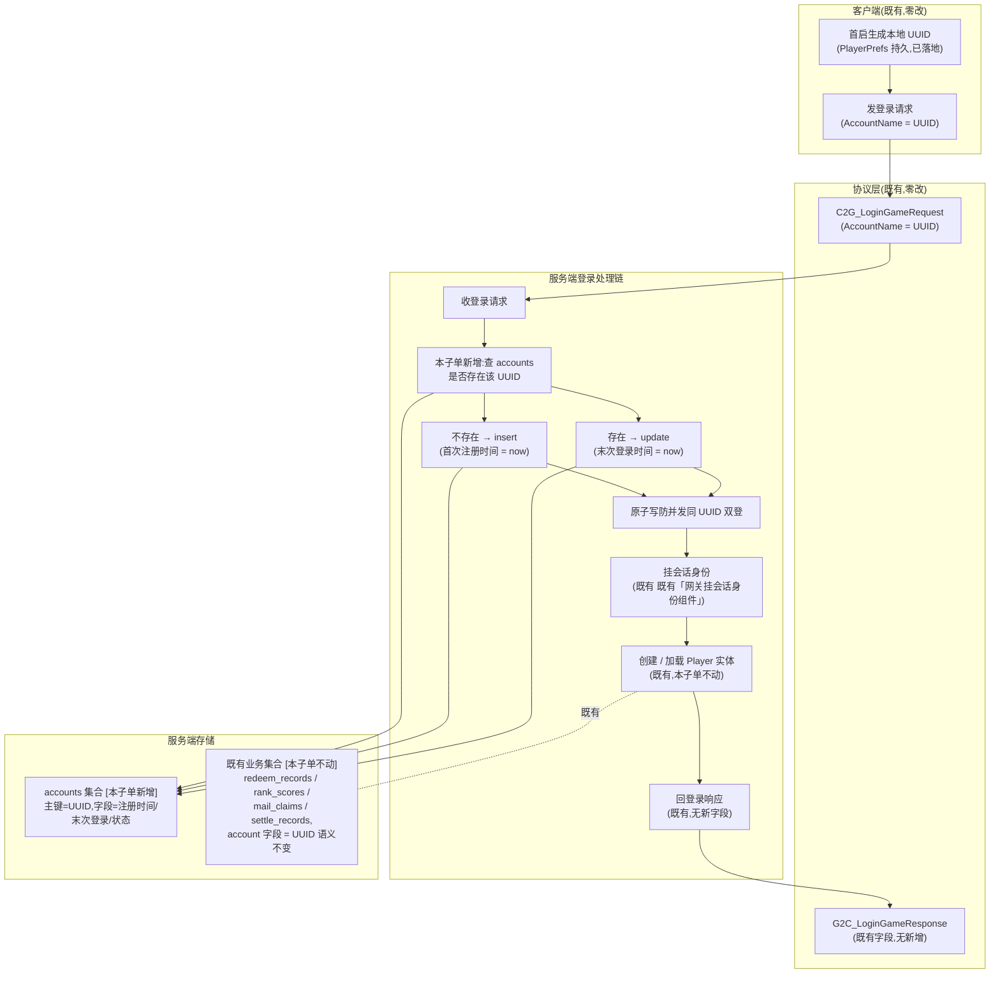

<style>
  /* 本篇专用:角色切分表 / 协议字段语义表 / 状态 pill(沿用全栈批次 30/31/32/33 口径) */
  pre.code { margin:8px 0; padding:12px; background:#0d1622; border:1px solid var(--border); border-radius:8px; overflow:auto; font-size:13px; line-height:1.55; }
  table.tight td, table.tight th { padding:6px 10px; }
  .pill-srv { display:inline-block; font-size:11px; padding:1px 7px; border-radius:10px; background:rgba(255,176,90,.18); color:#ffb05a; margin-left:6px; }
  .pill-cli { display:inline-block; font-size:11px; padding:1px 7px; border-radius:10px; background:rgba(108,140,255,.16); color:#6c8cff; margin-left:6px; }
  .pill-core{ display:inline-block; font-size:11px; padding:1px 7px; border-radius:10px; background:rgba(91,214,160,.16); color:#5bd6a0; margin-left:6px; }
  .pill-enh { display:inline-block; font-size:11px; padding:1px 7px; border-radius:10px; background:rgba(108,140,255,.16); color:#6c8cff; margin-left:6px; }
  .pill-cut { display:inline-block; font-size:11px; padding:1px 7px; border-radius:10px; background:rgba(255,122,138,.16); color:#ff7a8a; margin-left:6px; }
  .yes { color:#5bd6a0; font-weight:bold; }
  .no  { color:#ff7a8a; font-weight:bold; }
</style>

# 账号服务端 · 注册 + 登录会话(Tier 0 第 1 子单)

把客户端 UUID 自登录的「即用即建」自动注册流 + 登录会话挂账号身份**地基化到服务端**(Fantasy.Net):服务端新建 MongoDB `accounts` 集合作账号权威存储,首连即按 UUID 自动 upsert(无密码、无用户输入、玩家无感),登录会话挂账号身份,使既有四个全栈特性(兑换码 30 / 排行榜 31 / 邮件 32 / 结算 33)所用的「身份从会话取」语义有了**真账号实体**作底,而非裸 UUID 字符串。

这是 Tier 0 真实账号体系的**第 1 子单(地基)**:本子单只做「**注册 + 登录会话**」两件事,登出 / 客户端 LoginUI 接线 / OpenID 绑定 / 跨设备恢复均**不做**(留 Tier 1+ / Tier 3)。本子单收口后 Tier 0 第 2 子单(客户端 LoginUI 接线 + 设备 UUID 迁移、设置窗登出协议)在其上叠。

> [!WARNING]
> **读前必看 · 五条边界**
>
> - **account = UUID 字符串,既有四个全栈特性零迁移、零数据兼容性问题。**现状:客户端首启已自动生成 UUID 写 `PlayerPrefs` 作账号名,登录时把 UUID 经 登录请求的「账号名」字段 上报服务端,既有 30 / 31 / 32 / 33 都已稳定使用「会话上的 account = UUID」作 MongoDB 主键(兑换记录 / 排行榜分数 / 邮件领取 / 结算标记的主键语义)。本子单**沿用同一 UUID** 作 accounts 集合主键(`_id` = UUID),既有业务集合的 account 字段语义**不变**,无数据迁移、无 schema 改、无客户端代码改。这是 Tier 0「在不破坏既有数据的前提下铺真账号地基」的硬约束。
> - **服务端 accounts 集合是账号权威存储,但本子单不承载身份验证。**accounts 集合存「UUID 主键 + 首次注册时间 + 末次登录时间 + 状态字段」,作为「这个 UUID 是已知玩家、何时注册、何时上次活跃」的账本。**不**存密码 / 不存第三方令牌 / 不存设备指纹——本子单无密码注册(沿用「持 UUID 即可登」的现状),服务端**无法**从密码学层面区分「这 UUID 真是同一玩家」与「另一玩家拿了别人的 UUID 来仿冒」。这是 Tier 0 在「去变现 + 单设备一对一 + 无登录摩擦」前提下的明承知限制(见 [§五](#35-account-server::walk) 末诚实边界),Tier 3 跨设备恢复时升「绑定 OpenID / 邮箱」作账号转移协议(本稿 [§六](#35-account-server::tier3) 留接口余量)。
> - **客户端工程零 diff。**本子单纯 server 段:Unity 工程(`Assets/`)零改动。客户端的 LoginUI 空壳保留(无新接线)、UUID 生成器 既有客户端 UUID 生成器 保留(逻辑不变)、设置窗登出按钮占位「离线版无账号系统」保留(本子单不实装登出)。客户端仍按既有路径走「首启生成 UUID → 登录用 UUID」,服务端在收到登录请求时把「按 UUID 自动 upsert accounts」加进既有 既有登录处理链 的处理链——这是「**地基铺到位但客户端无感**」的关键不变量。
> - **本子单不做的事(显式排除,留下一刀 / 后续 Tier):**OpenID / 邮箱 / 密码 / 第三方登录(Tier 3 上层接入)、跨设备恢复 / 账号转移(Tier 3)、踢号 / 封号 / 状态字段的运营操作(运营后台后续刀)、登出协议(Tier 1+ 客户端段)、玩家信息查询协议(设计 18 是离线数据层,与服务端 accounts 是两套不同关注点,本子单不联动)、Account 实体内存态字段扩展(本子单只加持久化层 + 登录时机持久化挂钩,Account 实体本身不扩玩法字段)。
> - **既有 demo 账号链路复用,不另造账号实体。**Fantasy.Net Server 侧既有「内存态账号实体 + 登录请求处理链 + 网关挂会话身份组件」一套 demo 链路(30 / 31 / 32 / 33 已依赖其中「会话上取 account」语义),本子单**复用**这套既有链路,**新建**的只有「accounts 集合持久化层(MongoDB)+ 在登录处理链中加 upsert 挂钩」。判据:既有 demo 已实现「会话上挂 account 标记」的全部行为,本子单要补的是「这个 account 在 MongoDB 有账本记录」+「登录时记一笔时间」,与既有内存态账号是**正交关注点**(内存态是当前会话上下文、持久态是账本),不替换。具体既有链路的代码层定位(类名 / 方法名 / 文件路径)由 server-dev 据 fantasy-net 工程现状取(plan code-blind,不指字面量)。

> [!NOTE]
> **立项信息**
>
> | 项 | 内容 |
> | --- | --- |
> | **类型** | 全栈特性 · Tier 0 真实账号体系第 1 子单(地基)。出 code-free 设计意图 + 行为级协议契约 + 行为级验收,交服务端段(协议复用 + 处理链增量 + 存储)落地;客户端段零改动。 |
> | **方向约束** | 离线还原 · **去变现**:账号系统**不**含付费会员 / VIP 等级 / 充值绑定——账号只承载身份地基(谁是谁、何时注册、何时上次活跃),不承载可购买物。无密码注册下身份强度仅适用「单设备一对一 + 不防仿冒」的玩法语义,与去变现不冲突(无可被盗号窃取的付费物)。加法式:服务端 accounts 集合是新增的权威存储,既有四个全栈特性的业务集合(redeem_records / rank_scores / mail_claims / settle_records 等,实际名以服务端段为准)零迁移;客户端既有 UUID 生成 + 登录链路零改动。 |
> | **需求降层** | **a. 表层要求**(GDD Tier 0 + boss brief):铺真实账号地基——服务端有 accounts 集合,首连自动注册(account = UUID),登录会话挂账号身份;本子单只做注册 + 登录会话,登出 / OpenID / 跨设备恢复留后续。 **b. 底层目的**(为玩家 / 工程达成什么):让既有四个全栈特性的「身份从会话取」语义有真账号实体作底——目前 30 / 31 / 32 / 33 都按「UUID 即 account」工作,但 UUID 只是字符串,**服务端无账本知道这个 UUID 是何时首次出现、是否已知**;有 accounts 集合后,Tier 1+ 才能在其上做「登录次数 / 上次活跃 / 邮件未读数」等查询,Tier 3 才能在其上挂绑定 OpenID / 邮箱作账号转移协议。**对玩家** Tier 0 是无感的(无登录摩擦、无 UI 改动);**对工程**是为 Tier 1+ / Tier 3 铺接口余量。 **c. 有无更直达 b 的做法**:b 的本质 = 「让 UUID 在服务端有账本记录」,设备 UUID 自动注册式账号是直达做法——客户端已有 UUID,服务端只需 upsert 一笔,无新协议、无新客户端代码、无玩家可感操作。**备选(已否)**:① 让玩家输入用户名 / 密码 / 邮箱 → 增加登录摩擦,与「玩家无感」目的相反,且 Tier 0 GDD 未要求账号识别强度;② 不建 accounts 集合、靠业务集合主键存在性反推「已知 UUID」→ 无法承载 Tier 1+「注册时间 / 上次活跃」查询,且每加一个新业务集合都要重新「反推」、违数据建模常识。无更优解,按表层「UUID 自动 upsert」实现。 |
> | **范围(产品 · 玩法)** | **服务端新增**:① MongoDB `accounts` 集合(主键 = UUID 字符串,字段 = 首次注册时间 / 末次登录时间 / 状态,字段集见 [§3.1](#35-account-server::schema));② 在既有登录处理链(既有登录处理链)挂 upsert 钩子:登录请求到达 → 查 accounts 表 → 不存在则 insert(首次注册)/ 存在则 update 末次登录时间(后续登录),原子写防并发同 UUID 双登创建两份;③ accounts 集合的索引(主键 UUID 已天然唯一,无需额外索引)。 **服务端不动**:Account 内存态实体字段(本子单不扩玩法字段)、既有「网关挂会话身份组件」 挂会话身份的既有链路、既有登录处理链 既有的「按账号查 / 创建 Player 实体 / 进游戏服」流程。 **协议**:**复用既有** 登录请求 / 登录响应,**不新增**客户端可见 RPC——本子单的注册是「登录请求处理过程中**服务端隐式 upsert**」,客户端无感、无协议改动。 **客户端零改**(Unity 工程)。 |
> | **关键约束** | 服务端遵 Fantasy.Net 既有约定(协议 / 处理逻辑 / MongoDB 存储 / 错误码非异常 / 不手改生成物 / 不手动注册,正本以服务端工程 fantasy-net 为准,本稿不写代码符号);裁决以**结果码**回包,不抛异常致连接断;沿用 30 / 31 / 32 / 33 已确立的「身份从会话取」「MongoDB 持久」基线。本篇正文为 code-free 设计意图,不含协议消息名 / 字段代码名 / 类名 / 文件路径 / 接缝清单——服务端段据行为语义定持久化层挂钩点与 schema 字段名。 |

## 一、前后端职责切分 {#split}

账号注册 / 登录的每一步归谁,按「**账本权威 vs 输入触发**」一刀切清。本子单的特点是**协议层不变、几乎全服务端、客户端零感知**:

| 环节 | 归属 | 说明 |
| --- | --- | --- |
| 首启生成本地 UUID | **客户端** <span class="pill-cli">既有</span> | 沿用客户端既有「首启随机生成 UUID 写本地持久存储、后续读同 key」实现,本子单不改 |
| 发登录请求(携带 UUID) | **客户端** <span class="pill-cli">既有</span> | 沿用既有登录请求的「账号名」字段(承载 UUID 字符串),本子单不改协议 |
| 服务端收到登录请求 | **服务端**(权威) | 既有登录处理链入口,本子单在其处理链早期挂 upsert 钩子(见 [§3.2](#35-account-server::upsert)) |
| 查 accounts 集合是否已存在该 UUID | **服务端**(权威) | 本子单新增 |
| 不存在 → 自动注册(insert) | **服务端**(权威) | 本子单新增:写入首次注册时间 = 服务端时钟、末次登录时间 = 同时、状态 = 正常 |
| 存在 → 自动登录(update) | **服务端**(权威) | 本子单新增:仅更新末次登录时间 = 服务端时钟,首次注册时间不动、状态不动 |
| 把 UUID 挂会话作账号身份 | **服务端**(权威 · 既有) | 沿用既有「网关挂会话身份组件」链路(30 / 31 / 32 / 33 已依赖「会话上取 account」语义),本子单不动 |
| 创建 / 加载玩家进度实体(Player) | **服务端**(权威 · 既有) | 沿用既有登录处理链后续流程,本子单不动 |
| 登录响应回客户端 | **服务端**(权威 · 既有) | 沿用既有登录响应协议,无新字段(本子单的注册是服务端内部完成,客户端无需知晓「这是首次」还是「再登」) |
| 进入游戏世界 | **客户端** <span class="pill-cli">既有</span> | 沿用既有 LoginUI 空壳后续路径(本子单不动 LoginUI) |
| 后续业务请求(兑换码 / 排行榜 / 邮件 / 结算) | **两端 · 既有** | 30 / 31 / 32 / 33 从会话取 account 链路完全不变,account = UUID 字符串语义不变 |

> [!NOTE]
> **为什么「客户端无感」是本子单的关键设计?**
>
> 本子单的目的是**为 Tier 1+ / Tier 3 铺接口余量**,不是给玩家提供新功能。GDD Tier 0 + boss brief 均明示:「玩家无感」「客户端工程零 diff」是硬约束。这有三个理由:① 既有四个全栈特性 + 客户端 UUID 链路已稳,改动面越小回归风险越小;② 玩家在 Tier 0 见不到任何账号 UI(LoginUI 空壳、设置窗登出占位),让服务端先有账本、客户端 Tier 1+ 再叠 UI,是「地基先于装饰」的工程节奏;③ Tier 3 升「绑定 OpenID / 邮箱」时,客户端要新加绑定 UI、服务端要新加绑定协议,但 **accounts 主键不变**(仍是 UUID,绑定 OpenID 是加字段),Tier 0 → Tier 3 是加字段加协议,非改主键 / 改数据,这正是「无密码自动注册」作 Tier 0 默认的最大优势。

## 二、系统模型 {#model}

四方参与:客户端(发登录请求,既有)、协议层(复用既有登录协议)、服务端登录处理链(既有 + 本子单 upsert 钩子)、服务端存储(本子单新增 accounts 集合 + 既有业务集合不动)。结构图:



> [!NOTE]
> **挂钩点为什么是「登录请求处理早期」?**
>
> upsert 必须在「会话挂账号身份」**之前或同步**完成——因为既有 30 / 31 / 32 / 33 都依赖会话上的 account 标记来定位 MongoDB 业务集合的主键,若 upsert 失败(MongoDB 不可达 / 网络抖动)而会话身份照常挂,后续业务请求会看到「会话有 account 但 accounts 集合无对应记录」的不一致态。挂钩点早 = 失败可早返,保持「accounts 是业务集合 account 字段的上游」这一弱不变量(本子单不强求「accounts 不存在则业务集合也不能有」——既有数据已是裸 UUID,Tier 0 不做反向校验,见 [§五](#35-account-server::walk) 走查)。

## 三、行为级协议契约 {#protocol}

用**行为语言**描述本子单涉及的协议消息——本子单**不新增客户端可见 RPC**,只在既有登录请求 / 登录响应的**处理过程中**加服务端内部步骤。协议字段集 1:1 沿用既有(消息名 / 字段代码名由服务端段以 fantasy-net 现状为准),本节给「行为契约」描述请求 / 响应的**语义升级**:既有登录请求原是「登录已存在玩家」,本子单**语义升级**为「认证 = 注册 + 登录二合一」。

### 3.1 accounts 集合 schema(服务端持久层) {#schema}

新增 MongoDB 集合 `accounts`(实际集合名以服务端段 Fantasy.Net 约定为准),字段集如下:

| 字段(游戏含义) | 类型 | 含义 / 默认 |
| --- | --- | --- |
| 主键(`_id`) | 字符串 | UUID = 客户端 既有客户端 UUID 生成器 生成的设备 UUID(原文不变 / 不哈希 / 不加盐——既有业务集合的 account 字段也是裸 UUID,主键口径一致) |
| 首次注册时间 | 日期时间 | 该 UUID 第一次到达服务端的时刻(insert 时写入服务端时钟,后续不动) |
| 末次登录时间 | 日期时间 | 该 UUID 每次登录到达的时刻(insert 时与首次注册时间同;后续每次登录 update) |
| 状态 | 枚举(整型) | 0 = 正常(默认,所有现状记录均为 0)。Tier 0 暂不写入其它值;运营踢号 / 封号是后续刀,本子单**字段先有、不消费**(Login Handler 不读此字段,本子单无「状态非 0 拒登」分支) |

**索引**:主键 UUID 由 MongoDB 天然唯一,无需额外索引。本子单**不**加首次注册时间 / 末次登录时间索引(本子单无按时间查询的需求,Tier 1+ 真要做「上次活跃 N 天前的玩家」类查询时再加,避免投机性索引)。

**与既有业务集合的关系**:本子单**不**在业务集合(redeem_records / rank_scores / mail_claims / settle_records 等)加 account 外键约束——MongoDB 无关系型 FK,且既有业务集合已用 UUID 作主键 / 复合主键的一部分,加约束 = 改既有 schema = 违「既有零迁移」红线。`accounts` 与业务集合的关系是**应用层弱不变量**:正常路径下「业务集合中出现的 account UUID 必在 accounts 中有记录」,但本子单不做反向校验、也不做数据迁移补齐(见 [§五](#35-account-server::walk) 走查「既有裸 UUID 数据」分支)。

### 3.2 登录请求处理链:upsert 时机与原子性 {#upsert}

既有登录处理链收到登录请求后的处理顺序,本子单在其中**加一个早期步骤**(原顺序不动,只在「挂会话身份」之前插入):

| 顺序 | 步骤 | 归属 |
| --- | --- | --- |
| 1 | 收到登录请求 | 既有(本子单不动) |
| 2 | 解析账号名(= UUID) | 既有 |
| 3 | **本子单新增:upsert accounts(UUID)** | **本子单** — 查表;不存在则 insert(首次注册时间 = 末次登录时间 = 服务端时钟,状态 = 0);存在则 update(末次登录时间 = 服务端时钟,首次注册时间 / 状态不动) |
| 4 | upsert 成功 → 继续;失败 → 返登录失败结果码 | **本子单** — 失败回错码不抛异常(沿用 Fantasy.Net 错误码非异常基线) |
| 5 | 挂会话身份(既有「网关挂会话身份组件」) | 既有 |
| 6 | 创建 / 加载玩家进度实体 | 既有 |
| 7 | 回登录响应 | 既有 |

**原子性**:upsert 必须**原子单条件写**——「不存在则 insert 首次注册时间 + 末次登录时间 + 状态 = 0;存在则只 update 末次登录时间(首次注册时间 / 状态不动)」在 MongoDB 的**单条命令**内完成,**不**先查后写两步(两步 = 并发同 UUID 双登可能各 insert 一份 = 主键冲突 = 二次登失败,或更糟:主键冲突若被吞则两个会话各自拿到不同的「首次注册时间」)。具体 MongoDB 操作符与命令选择由 server-dev 据 fantasy-net 工程现状取(plan code-blind 不指字面量)。这是「检查 + 写入原子」的本子单专项落地,口径同 30 兑换码防重领 / 31 排行榜取最优 / 32 邮件防重领。

**失败结果码**:upsert 失败的两类原因:① MongoDB 不可达(连接断 / 集群挂)→ 返「服务暂不可用,请稍后重试」类结果码,客户端可重试,本次登录不发生(既有 30 「服务不可用不本地放行」同口径);② 服务端逻辑异常 → 返「登录失败」类结果码,不抛异常断连。本子单**不**新增「账号被封禁」类结果码(状态字段本子单不消费,见 [§3.1](#35-account-server::schema))。

### 3.3 协议字段语义升级表 {#semantic}

既有协议字段语义在本子单的升级一览(字段集 1:1 不变,只是处理语义扩展):

| 协议字段(语义) | Tier 0 前(既有) | Tier 0 本子单后 |
| --- | --- | --- |
| 登录请求 · 账号名(承载 UUID) | 仅作业务集合主键的字符串 | + 作 accounts 集合 upsert 主键 |
| 登录响应(各字段) | 既有字段,无变化 | 同左,**无新增**(注册成功 vs 登录成功对客户端无差别) |
| (无新字段) | — | 本子单不加「是否首次登录」类字段——若 Tier 1+ 需要首次登录欢迎流程,服务端可以「末次登录时间 - 首次注册时间 < 几秒」判定,或后续 Tier 加专用字段;本子单不做投机性扩展 |

## 四、登录时序 {#flow}

一次「客户端 UUID 自登录」的完整时序(参与方:客户端 / 既有登录协议 / 服务端登录链 / 本子单 upsert 钩子 / 既有会话身份链 / MongoDB),以及首连 vs 重连两条分支:

```mermaid
sequenceDiagram
    participant C as 客户端(既有)
    participant P as 登录协议(既有)
    participant L as 登录处理链(既有 + 本子单挂钩)
    participant A as accounts 集合(本子单新增)
    participant G as 会话身份组件(既有)
    participant B as 业务流程(玩家实体创建 / 加载,既有)
    C->>P: ① 登录请求(账号名 = UUID)
    P->>L: ② 路由到登录处理链
    L->>A: ③ upsert(UUID) — 原子单条命令
    Note over A: 不存在 → insert(注册时间 / 末次登录 = now, 状态 = 0)<br/>存在 → update(末次登录 = now)<br/>原子,防并发同 UUID 双登
    A-->>L: ✓ 成功(注册 or 登录)<br/>✗ MongoDB 不可达 / 写失败 → 返错码
    alt upsert 失败
        L-->>C: 登录响应(失败结果码,服务暂不可用 / 登录失败)
        Note over C,L: 客户端按既有逻辑可重试登录(本子单不指定客户端重试策略,沿用既有)
    else upsert 成功
        L->>G: ④ 挂会话身份(account = UUID,既有链路不动)
        L->>B: ⑤ 创建 / 加载玩家实体(既有,本子单不动)
        B-->>L: 成功
        L-->>C: 登录响应(成功,既有字段)
    end
    Note over C,B: — 后续业务请求(30 / 31 / 32 / 33) —
    C->>G: 兑换 / 上报分 / 拉邮件 / 等
    G-->>B: 取会话 account(= UUID) → 走业务集合主键
    Note over A,B: accounts 与业务集合在应用层弱不变量:<br/>正常路径 account 必在 accounts;本子单不做反向校验
```

## 五、整局走查与崩法 {#walk}

把本子单的所有机制在「**首连 / 重连 / 并发同 UUID / MongoDB 不可达 / 既有裸 UUID 数据存量 / 重启**」六类场景下走一遍,每个机制点出最可能炸的那类 + 对策:

### 5.1 首连(新 UUID)崩法

新 UUID 第一次到达,accounts 集合中无记录 → upsert 走 insert 分支 → 写入首次注册时间 + 末次登录时间 + 状态 = 0。

| 崩法 | 后果 | 对策 |
| --- | --- | --- |
| 并发同新 UUID 两个连接同时首连(单端无此场景但工程上可能:玩家快速点两次连服按钮) | 若 upsert 非原子(两步先查后写)→ 两次 insert,主键冲突致其中一个抛异常 / 或两份不同主键文档(主键冲突时若被吞)→ 后续业务请求看到的「我的注册时间」不稳定 | 单条原子命令(见 [§3.2](#35-account-server::upsert)):MongoDB 保证单条命令原子,第二次到达走 update 分支、「首次注册时间只在 insert 时写」语义使其不被覆盖,首次注册时间稳定 = 第一次写入值 |

### 5.2 重连(已知 UUID)崩法

已知 UUID 再次登录,accounts 集合中有记录 → upsert 走 update 分支 → 仅 update 末次登录时间。

| 崩法 | 后果 | 对策 |
| --- | --- | --- |
| update 时误把「首次注册时间」也写成 now → 每次登录都把首次注册时间覆盖 | 「该玩家何时首次注册」的账本失真,Tier 1+ 上层任何依赖此字段的查询(如新手期判定)都崩 | 严格分:**首次注册时间只在 insert 时写,update 路径不动**;末次登录时间在每次都写。验收 SV4 专门核「重连后首次注册时间不变」 |
| 误把状态字段也 update 为 0 → 运营若 Tier 1+ 把某账号状态设为「封禁」(非 0),下次玩家登录会被自动重置为 0(无封禁) | 运营踢号 / 封号失效 | upsert 时**不**触碰状态字段(insert 路径写默认值 0,update 路径完全不写)。本子单不消费状态字段,但**不能误改** — Tier 1+ 上层若加状态消费,本子单的 upsert 不与之冲突 |

### 5.3 并发同 UUID 双登崩法

同 UUID 两个会话在毫秒级内同时发登录请求(理论上单设备一对一不会出现,但工程上玩家网络抖动重试 / 多端共享 UUID(本子单不防)可能触发)。

| 崩法 | 后果 | 对策 |
| --- | --- | --- |
| 两个会话各自走 upsert 都走 insert 分支(若 upsert 非原子)→ 主键冲突 | 一次成功 / 一次抛异常,第二会话登录失败 | 单条原子命令(同 §5.1):第二会话走 update 分支不抛 |
| 两个会话挂会话身份 → 既有 30 / 31 / 32 / 33 业务集合 account 字段对两个会话指向同一记录 → 两会话各自的业务操作互相覆盖 / 防重领等以「第一会话先到」为准 | 本子单不解决「同 UUID 多会话」问题(Tier 0 范围外)。GDD 边界:**单设备一对一**,多会话同 UUID 是 Tier 1+ 的「挤号 / 顶号」议题 | 本子单**显式承认此限制**:account = UUID 在多会话场景下退化为「first-come-first-serve 业务竞争」。Tier 1+ 上「挤号 / 顶号」时在登录链加「踢前一会话」步骤,本子单的 upsert 不与之冲突 |

### 5.4 MongoDB 不可达崩法

MongoDB 集群 / 单机 mongod 挂或网络中断,upsert 报错。

| 崩法 | 后果 | 对策 |
| --- | --- | --- |
| upsert 失败被吞 → 继续挂会话身份 → 后续业务请求看到「会话有 account 但 accounts 集合无记录」 | 应用层弱不变量被破:Tier 1+ 上「查注册时间」类查询找不到记录 | upsert 失败 → 直接返登录失败结果码 / 短路后续步骤,**不**挂会话身份、**不**继续业务流程(同 30 「服务不可用不本地放行」)。客户端按既有逻辑可重试登录(MongoDB 恢复后下次登录正常 upsert) |
| Mongo 不可达持续 → 玩家永远登不上 | 玩家被锁出 | Tier 0 范围下接受此后果:这是「服务端有真账号体系」的代价,服务端不可用时玩家不应能登。server-test 验收时 MongoDB 不可达 → BLOCKED 非 FAIL(既定档,memory `local-mongodb-for-server-roundtrip` + server-test memory `feedback-blocked-vs-fail`) |

### 5.5 既有裸 UUID 数据存量崩法

本子单上线前,既有 30 / 31 / 32 / 33 业务集合中已有用 UUID 作主键的记录(开发过程中已 PASS 的真往返产生),但 accounts 集合是本子单新建的、初始为空。

| 崩法 | 后果 | 对策 |
| --- | --- | --- |
| 已有玩家本子单上线后首次登录 → upsert 走 insert 分支 → 首次注册时间 = 服务端时钟「上线后那一刻」,**不**是该玩家真正第一次出现的时间 | 「首次注册时间」对存量玩家失真(真实情况是「至少在那之前就来过」) | **接受**此失真:本子单不做数据迁移补齐(无法从业务集合反推「真正首次注册时间」)。Tier 0 验收的 SV 不依赖「首次注册时间是真正第一次」语义,只断言「上线后首次登录后该字段被写入且后续不变」。文档显式声明此限制供后续 Tier 知悉 |
| 业务集合中有但 accounts 中无的 UUID(Tier 0 期间业务集合先于 accounts 落地)→ 任何反向校验都崩 | 本子单**不做反向校验**(见 [§3.1](#35-account-server::schema) 末段) | accounts → 业务集合是**应用层弱不变量**:仅承诺「登录走过本子单的 UUID 必有 accounts 记录」,不承诺「业务集合中所有 account 必有 accounts 记录」 |

### 5.6 重启崩法

服务端重启(mongod 不挂 / accounts 集合数据保留)。

| 崩法 | 后果 | 对策 |
| --- | --- | --- |
| 重启后无内存态 → 既有 demo Account 实体(内存态)消失 | 既有 demo 已处理此场景:登录时按 account 重新构造 Account 实体。本子单不动此链路 | 既有,本子单不动 |
| 重启后 accounts 集合数据完好 → 重连玩家走 update 分支(首次注册时间不变) | 正常 | 验收 SV6:重启后重连 → 首次注册时间不变、末次登录时间更新 |

### 5.7 诚实边界(本子单守住什么、不守什么)

本子单**守住**:
- account 的 MongoDB 账本记录(每 UUID 一行,首次注册时间 / 末次登录时间持久)
- 并发 / 重启 / MongoDB 抖动下 accounts 记录的 schema 一致性
- account = UUID 字符串语义对既有 30 / 31 / 32 / 33 业务集合的零迁移兼容
- upsert 失败 → 登录失败的硬约束(不挂半截会话)

本子单**不守**:
- **身份强度**:无密码注册下,服务端无法区分「这 UUID 真是同一玩家」与「另一玩家拿了别人的 UUID 来仿冒」——UUID 是客户端本地生成的,理论上可被读取 / 复制 / 伪造。Tier 0 在去变现 + 单设备一对一前提下接受此限制(无密码注册的本质代价)。Tier 3 升「绑定 OpenID / 邮箱」时,身份强度由第三方提供商保证,本子单的 accounts 集合作为账本不变,只是多个识别维度(UUID + OpenID)挂同一 `_id`(见 [§六](#35-account-server::tier3))
- **挤号 / 顶号 / 多会话同 UUID**(Tier 1+ 议题,见 §5.3)
- **状态字段消费**(踢号 / 封号是运营后台后续刀,本子单只让字段先有 / 默认 0,不读不写)
- **设备 UUID 跨设备恢复**(Tier 3 议题,见 §六)
- **既有裸 UUID 数据「真正首次注册时间」补齐**(无法反推,接受失真)

## 六、与既有稿关系 + Tier 3 接口余量 {#tier3}

### 6.1 与既有设计稿的关系(本子单不改任何既有稿)

| 既有稿 | 关系 | 本子单是否改写 |
| --- | --- | --- |
| [18 玩家信息系统](#18-player-info) | 离线数据层(MergeMetaSave 持久),职责 = 玩家**玩法元层**信息(id 复制 / 名字 / 等级 / 头像);本子单职责 = 服务端账号**账本**(注册时间 / 登录时间)。两套**正交**关注点,共用「id」概念但介质 / 生命周期不同(18 是客户端本地 MergeMetaSave、本子单是服务端 MongoDB accounts) | **不改**。18 的 player-info.id 是离线本地生成、客户端持久;本子单的 accounts.`_id` 是 UUID 字符串(由客户端 既有客户端 UUID 生成器 生成,与 18 的 player-info.id 是**不同字段**——两者可同 / 可异,Tier 1+ 上「服务端拉取我的等级」类查询时再决定是否联动) |
| [19 设置系统](#19-settings-system) | §3.6 §七 O8 列「快捷登录 = 不做(离线无账号系统)」+ 设置窗登出按钮占位「离线版无账号系统」 | **不改**。本子单不实装登出协议,设置窗登出按钮仍占位、设置稿仍维持「离线版」表述——Tier 1+ 客户端段(LoginUI 接线)时再改 |
| [30 兑换码服务端化](#30-redeem-code-server) | 「身份从会话取已认证设备账号、客户端不自报」基线 = 本子单的基础 | **不改**。30 的 account 语义 = UUID,本子单上线后 account = UUID 仍然成立,只是 MongoDB 多了一个 accounts 集合作账本,30 的业务集合(redeem_records 等)的 account 字段不变 |
| [31 排行榜服务端化](#31-rank-server) | 同 30:身份从会话取、account = UUID | **不改**。31 的 rank_scores.account 字段语义不变 |
| [32 邮件服务端化](#32-mail-server) | 同 30:身份从会话取、领奖记录的 account = UUID | **不改**。32 的 mail_claims.account 字段语义不变 |
| [33 排行榜结算服务端化](#33-rank-settle-server) | 同 31:遍历全服上榜账号(即遍历 rank_scores.account)逐个发奖 | **不改**。33 的「全服上榜账号」= rank_scores.account 集合,与 accounts 集合的关系是「上榜账号 ⊆ accounts」(弱不变量,见 §5.5 存量数据限制) |

### 6.2 Tier 3 接口余量声明

Tier 0 → Tier 3 的演进路径(本子单为此铺地基,但 Tier 3 自身落地是后续刀,本子单仅声明余量):

| Tier 3 目标 | 在本子单 accounts 集合上的演进 |
| --- | --- |
| 玩家绑定 OpenID(微信 / Google / Apple) | accounts 集合**加字段**:`openid` 字符串、`openid_provider` 枚举、`bind_time` 日期时间。主键 `_id` = UUID **不变**,只是同一文档多一个识别维度。绑定流程 = 新协议(Tier 3 加),本子单不预留 |
| 玩家绑定邮箱 | accounts 集合**加字段**:`email` 字符串、`email_verified` 布尔。同上,主键不变 |
| 跨设备恢复(同一玩家在 B 设备用 A 设备的账号) | Tier 3 登录前先用 OpenID / 邮箱验证 → 服务端查 accounts 找到对应 `_id`(UUID) → 把 B 设备的本地 UUID 替换为 A 设备的 UUID(客户端 PlayerPrefs 改写)→ 后续登录走原 UUID。**accounts 主键不变**,改的是客户端本地 UUID。新协议(Tier 3 加),本子单不预留 |
| 状态字段消费(踢号 / 封号) | accounts「状态字段」 字段**已存在**(本子单创建时默认 0),Tier 1+ 上线运营后台时加运营 RPC 改写此字段 + Login Handler 加「状态 != 0 拒登」分支。本子单的 upsert 不会误改状态字段(见 §5.2),故 Tier 1+ 兼容 |

**为什么 Tier 0 不投机性预留 Tier 3 接口?**沿用 conventions 「不投机性建未来用不上的接口」(同 19 settings「快捷登录 = 不做,不留钩子」做法):Tier 3 落地时新加字段 / 新加协议是局部增量(accounts 主键不变,既有业务集合不动),不存在「现在不预留就改主键」的风险——预留反而是不必要的复杂度。

## 七、验收点 {#accept}

服务端段全部由 server-test 跑;客户端段无新增(本子单零客户端 diff)。验收以「**起服 + 真往返 MongoDB**」为主,辅以 Code Review。

### 7.1 服务端段验收(SV)

| # | 验收点 | 完成定义(行为可观测) |
| --- | --- | --- |
| SV1 | 编译通过 + 源生成器产物 | 服务端工程(fantasy-net)dotnet build 0 error;protoc / Fantasy 源生成器产物正确生成,无手改 |
| SV2 | accounts 集合 schema | 服务端启动后 MongoDB 中 accounts 集合存在(或在首次 upsert 时自动创建,以 Fantasy.Net 约定为准);文档结构含主键 / 首次注册时间 / 末次登录时间 / 状态四字段(其它实现细节字段不强求) |
| SV3 | 首连自动注册 | 用一个 accounts 集合中**不存在**的新 UUID 发登录请求 → 登录成功 → MongoDB accounts 集合中出现一条新记录,`_id` = 该 UUID、首次注册时间 ≈ 末次登录时间 ≈ 当前服务端时钟(秒级精度内)、状态 = 0 |
| SV4 | 重连自动登录(首次注册时间不变) | 用一个 accounts 集合中**已存在**的 UUID 发登录请求 → 登录成功 → MongoDB accounts 中**仍只有一条**记录(无重复 insert)、首次注册时间**不变**(== 第一次登录时写入的值)、末次登录时间**更新**为当前服务端时钟 |
| SV5 | 状态字段不被覆盖 | 手动把某 UUID 的 accounts「状态字段」 改为非 0(模拟 Tier 1+ 运营改写)→ 该 UUID 再次登录 → 登录成功(本子单不消费状态字段)→ 状态字段 **仍为非 0**(本子单不误改) |
| SV6 | 重启持久 | 写入若干 UUID → 重启服务端 → 这些 UUID 再次登录走 update 分支,首次注册时间不变、末次登录时间更新(证 accounts 集合数据持久,非内存态) |
| SV7 | 并发同 UUID 双登原子 | 模拟两个连接近乎同时用同一新 UUID 发登录请求 → 一次走 insert / 一次走 update(MongoDB 单条命令原子)→ accounts 集合中**仅一条**该 UUID 记录、首次注册时间稳定(为「先到达」会话写入的值)、无主键冲突异常断连 |
| SV8 | MongoDB 不可达失败 | 在 MongoDB 已停服 / 不可达情况下发登录请求 → 服务端返登录失败结果码(不抛异常断连)→ 会话身份**不挂**(既有「网关挂会话身份组件」 无该 account 标记)→ 后续业务请求该会话无法走通(由 30 / 31 / 32 / 33 既有「无身份拒服务」分支兜底,本子单不专门验) |
| SV9 | 既有四个全栈特性零回归 | 本子单上线后,30 兑换码 / 31 排行榜上报 + 查榜 / 32 邮件拉列表 + 领取 / 33 排行榜结算的服务端段 SV(各自已 PASS 的验收点)**全部仍 PASS**(account 字段语义不变、业务集合零迁移) |
| SV10 | account 字段语义对齐 | 用一个新 UUID 走「登录(本子单 upsert)→ 兑换码请求 → 排行榜上报 → 邮件领取」全链路 → 各业务集合中该 UUID 作 account 字段值正确(同 accounts.`_id`,均为裸 UUID 字符串、无哈希 / 加盐 / 改写) |
| SV11 | 客户端工程零 diff | 验证 Unity 工程(`UnityProject/Assets/`)**git diff 为空**(本子单完成后)— 协议生成物 `Assets/GameProto/` 也无新增(本子单无新协议) |
| SV12 | Code Review | 服务端段 PR 经 Code Review 通过,重点核:① upsert 用**单条原子命令**(查 + 写一步完成),**非**先查后写两步;② **仅在 insert 时写首次注册时间**(后续 update 不动)、**仅在每次都写末次登录时间**,状态字段在 insert / update **两条路径下均不触碰**;③ upsert 失败 → 返结果码 + 短路后续登录步骤(不挂会话身份);④ 不手改 protoc / Fantasy 源生成器产物;⑤ 不手动注册 handler(沿用 Fantasy.Net 自动注册);⑥ MongoDB 连接配置沿用工程现有配置文件口径,不新增连接串 |

### 7.2 不在本子单验收 / BLOCKED

- **本机 MongoDB(`D:\mongodb-portable`)不可达** → 真往返写库类 SV(SV3 / SV4 / SV6 / SV7 / SV10)判 **BLOCKED 非 FAIL**(memory `local-mongodb-for-server-roundtrip` + server-test memory `feedback-blocked-vs-fail`),编译 / Code Review(SV1 / SV12)、客户端工程零 diff(SV11)、零回归(SV9)照常验
- **登出协议 / 设置窗登出按钮接线** → Tier 1+ 客户端段刀,本子单不验
- **客户端 LoginUI 接线 / 设备 UUID 迁移** → Tier 0 第 2 子单,本子单不验
- **OpenID / 邮箱绑定 / 跨设备恢复** → Tier 3,本子单只声明接口余量(§六),不验
- **状态字段消费(踢号 / 封号)** → 运营后台后续刀,本子单只让字段先有 / 默认 0(SV5 仅验「不被本子单误改」),不验运营操作
- **多会话同 UUID 挤号 / 顶号** → Tier 1+ 议题,本子单显式承认限制(§5.3),不验
- **既有裸 UUID 数据「真正首次注册时间」补齐** → 无法反推,文档声明限制(§5.5),不验

## 八、待拍板清单 {#open}

范围开关,boss 自治授权下**均取安全默认推进**(已在 boss brief 预先拍板 + 本稿设计自治内);列此备查,要改另开增量。

| # | 开关 | 本设计默认 | 备选 / 触发改动 |
| --- | --- | --- | --- |
| O1 | accounts 集合实际名 | **服务端段定**(Fantasy.Net 约定,plan 不指定字面量) | server-dev 据工程现状取 |
| O2 | 字段命名(首次注册时间 / 末次登录时间 / 状态) | **服务端段定**(以 Fantasy.Net + MongoDB 现有 BSON 命名约定为准) | 同上 |
| O3 | 状态枚举值定义 | **本子单只用 0 = 正常**;非 0 值由 Tier 1+ 运营后台刀定 | Tier 1+ 加状态消费时定 |
| O4 | upsert 失败结果码 | **沿用既有 Fantasy.Net 结果码体系**(plan 不指定具体码值);失败语义 = 「服务暂不可用 / 登录失败」非「账号不存在」(本子单语义升级:认证 = 注册 + 登录二合一,无「账号不存在」分支) | server-dev 据 Fantasy.Net 现状取 / 加 |
| O5 | 多会话同 UUID 挤号 | **本子单不防**(Tier 1+ 议题,见 §5.3) | Tier 1+ 加「踢前一会话」步骤 |
| O6 | 既有裸 UUID 数据补齐 accounts | **不做**(无法反推真正首次注册时间,接受失真) | 若运营要「老玩家保留来日」可加运营脚本批量 insert,但首次注册时间仍是脚本运行时点 |
| O7 | accounts 索引(首次注册时间 / 末次登录时间) | **不加**(本子单无按时间查询需求,避免投机性索引) | Tier 1+ 要「上次活跃 N 天前的玩家」类查询时加 |

## 九、风险表 {#risk}

| 风险 | 应对 |
| --- | --- |
| **upsert 非原子(两步先查后写)→ 并发同 UUID 双登致主键冲突 / 首次注册时间不稳定** | §3.2 + §5.1 + §5.3 守住:单条原子命令(查 + 写一步)+「首次注册时间只在 insert 时写、末次登录时间每次都写」严格分;SV7 专项验「两连接近乎同时新 UUID 登录 → 仅一条记录、首次注册时间稳定」 |
| **重连误把首次注册时间改成 now → 账本失真** | §3.2 「首次注册时间只在 insert 时写、update 路径不动」严格分;SV4 专项验「重连后首次注册时间不变」;SV12 Code Review 重点核此项 |
| **upsert 误改状态字段 → Tier 1+ 运营改的封禁被本子单重置为 0** | §3.2 + §5.2:upsert 时 update 路径**完全不触碰**状态字段(insert 路径仅写默认 0);SV5 专项验「手动改状态为非 0 → 再登 → 仍非 0」;SV12 Code Review 重点核此项 |
| **upsert 失败被吞 → 会话身份照常挂 → 应用层弱不变量破** | §3.2 + §5.4:upsert 失败 → 短路后续步骤 / 不挂会话身份 / 返结果码;SV8 专项验「Mongo 不可达 → 登录失败 + 后续业务不通」 |
| **既有裸 UUID 数据「真正首次注册时间」失真致 Tier 1+ 上层逻辑被误用** | §5.5 + §7.2:文档显式声明此限制,Tier 1+ 上层若依赖「首次注册时间是真正第一次」语义,自行决定是否做数据迁移(本子单不做) |
| **客户端工程被误改(违「零 diff」红线)** | §立项 + §7.1 SV11 专项验「git diff Unity 工程为空 + Assets/GameProto/ 无新增」;Code Review 拦客户端代码改动 |
| **新增 RPC / 新增客户端可见协议(违「无新协议」红线)** | §3.3 + §一切分表 + §7.1 SV11:本子单复用既有 登录请求 / 登录响应,**无**新增客户端可见 RPC;SV11 + SV12 Code Review 拦新协议 |
| **MongoDB 不可达致玩家被锁出(本身正确但用户感知糟)** | §5.4:Tier 0 接受此后果(服务端化的代价);server-test 验收时 MongoDB 不可达 → BLOCKED 非 FAIL;memory `local-mongodb-for-server-roundtrip` 已落 |
| **状态字段不消费但提前加 → 字段腐烂** | §3.1 接受此投机:Tier 1+ 运营后台是 GDD 已知的下一步,默认 0 字段先存 / 不消费是「先有字段、后加消费」的最小投资,违 conventions「不投机性建未来用不上的接口」是字段不是接口的边缘判断;SV5 让此字段在本子单内被「不误改」验收,确保 Tier 1+ 加消费时兼容 |

## 关联文档

- [18 · 玩家信息系统(本子单与之**正交**:18 = 客户端本地玩家玩法元层,本子单 = 服务端账号账本)](#18-player-info)
- [19 · 通用设置系统(设置窗登出按钮占位「离线版无账号系统」,本子单**不改**,Tier 1+ 客户端段刀再接)](#19-settings-system)
- [30 · 兑换码服务端化(身份从会话取基线,本子单沿用)](#30-redeem-code-server)
- [31 · 排行榜服务端化(同 30,account = UUID 语义不变)](#31-rank-server)
- [32 · 邮件服务端化(同 30,领奖防重的 account 主键不变)](#32-mail-server)
- [33 · 排行榜结算服务端化(同 31,遍历全服上榜账号 ⊆ accounts)](#33-rank-settle-server)
