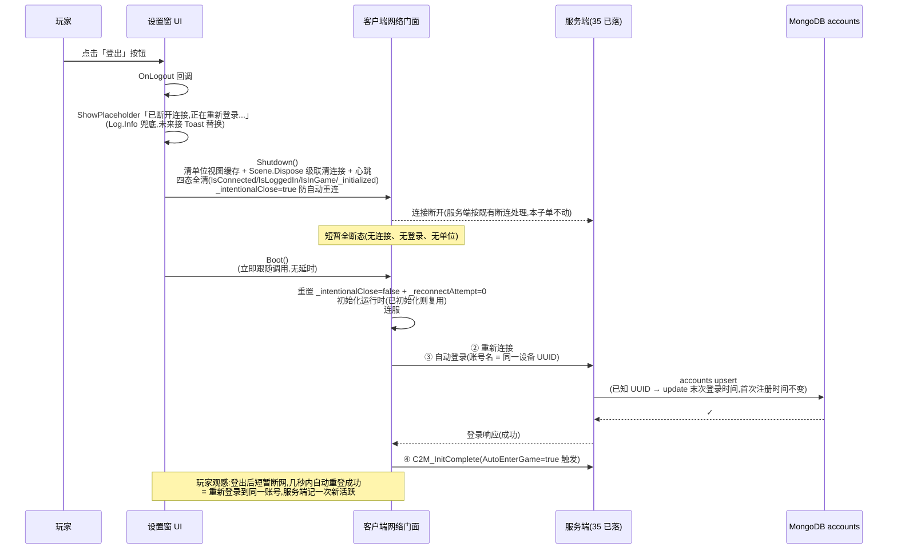

<style>
  /* 本篇专用:现状审计表 / 决策表 / 占位关闭表 */
  pre.code { margin:8px 0; padding:12px; background:#0d1622; border:1px solid var(--border); border-radius:8px; overflow:auto; font-size:13px; line-height:1.55; }
  table.tight td, table.tight th { padding:6px 10px; }
  .pill-srv { display:inline-block; font-size:11px; padding:1px 7px; border-radius:10px; background:rgba(255,176,90,.18); color:#ffb05a; margin-left:6px; }
  .pill-cli { display:inline-block; font-size:11px; padding:1px 7px; border-radius:10px; background:rgba(108,140,255,.16); color:#6c8cff; margin-left:6px; }
  .pill-core{ display:inline-block; font-size:11px; padding:1px 7px; border-radius:10px; background:rgba(91,214,160,.16); color:#5bd6a0; margin-left:6px; }
  .pill-enh { display:inline-block; font-size:11px; padding:1px 7px; border-radius:10px; background:rgba(108,140,255,.16); color:#6c8cff; margin-left:6px; }
  .pill-cut { display:inline-block; font-size:11px; padding:1px 7px; border-radius:10px; background:rgba(255,122,138,.16); color:#ff7a8a; margin-left:6px; }
  .yes { color:#5bd6a0; font-weight:bold; }
  .no  { color:#ff7a8a; font-weight:bold; }
</style>

# 账号客户端 · 登出接线 + 自动登录链路审计(Tier 0 第 2 子单)

承接 [35 服务端段](#35-account-server) 已 PASS 的注册 + 登录会话地基(MongoDB accounts 集合 + LoginGameHandler upsert + 设备 UUID 自动注册),本子单收口 Tier 0 真实账号体系**客户端段**:① 审计当前客户端登录链路与 LoginUI / 设置窗登出占位的真实现状;② 把设置窗登出按钮的占位换成接服务端登出语义(本子单可观测 UX 的唯一一处);③ 守住「服务端注册流真往返跑得起来」这一 Tier 0 全栈联调闭环。

这是 Tier 0 第 2 子单(客户端段),本子单收口后 Tier 0 全栈联调对外即告完成。Tier 1+ 起涉及账号 UI 真做(账号详情 / 切号 / 绑定第三方)、Tier 3 起涉及 OpenID / 邮箱 / 跨设备恢复,均不在本子单。

> [!WARNING]
> **读前必看 · 五条边界**
>
> - **现状已自动登录跑通,LoginUI 不在玩家路径上。**经客户端登录链路调查(详见 [§一现状审计](#36-account-client::audit)):热更入口在打开主菜单**之前**就已调起客户端网络门面 Boot,Boot 内自动连服 → 收到连接完成回调即自动登录(账号名 = 设备 UUID)→ 登录成功自动通知服务端开始接收单位 → 主菜单窗直接打开。LoginUI 工程内**零** ShowUIAsync 调用、源码仅 11 行真空壳。**本子单不上线 LoginUI**(详见 [§二决策 D1](#36-account-client::decisions))。
> - **设备 UUID 来源是设备唯一标识、不是 PlayerPrefs。**经核源码:登录用的 UUID 取自 `SystemInfo.deviceUniqueIdentifier`(同一设备多次启动稳定同值)+ 一段固定前缀,**无** PlayerPrefs 写入。boss 简报「PlayerPrefs UUID」表述与现状不符;本子单**沿用现状**:UUID = 设备唯一标识派生值,**不**引入 PlayerPrefs UUID(引入 = 改 account 主键值的派生路径 = 既有四个全栈特性的 account 字段值漂移 = 违 35 守不变量「既有零迁移」)。
> - **服务端段 35 已 PASS,登录请求触达即自动 upsert accounts。**客户端**零** RPC 改动:登录请求字段集不变(账号名 = 设备 UUID),处理语义服务端已升级为「认证 = 注册 + 登录二合一」,本子单不动客户端登录流程,自动登录每次都触发服务端 upsert。
> - **本子单唯一新增可观测 UX = 设置窗登出按钮接线。**当前 OnLogout 仅 ShowPlaceholder 反馈「离线版无账号系统」——server 段 35 上线后此占位文案过时(账号体系已上服务端)。本子单把该回调换成「断网络 + 自动重连」的登出语义(详见 [§三登出语义](#36-account-client::logout))。
> - **本子单不做的事(显式排除,留后续 Tier):**LoginUI 实质 UI(显式状态显示 / 进入游戏按钮 / 重试按钮 — Tier 1+ 客户端段)、账号切换 / 多账号(Tier 3)、OpenID / 邮箱绑定 / 跨设备恢复(Tier 3)、PlayerPrefs UUID 改造(简报误读,且与既有 account 主键值漂移冲突)、回登录前态的 UI 设施(GameApp 启动是一次性、无「回登录前」概念,新建超本子单范围)、自动登录的开关 / 配置项(沿用 FantasyNetworkConfig 既有默认全开)、踢号 / 封号(Tier 1+ 运营后台)。

> [!NOTE]
> **立项信息**
>
> | 项 | 内容 |
> | --- | --- |
> | **类型** | 全栈特性 · Tier 0 真实账号体系第 2 子单(客户端段)。出 code-free 行为级设计 + 现状审计 + 唯一一处接线设计(设置窗登出),交客户端段(单点接线 + 调用现有门面)落地;无新协议、无新数据层。 |
> | **方向约束** | 离线还原 · **去变现**:Tier 0 客户端段无任何登录 UI(玩家不见、不感知有账号),与 19 设置系统去变现 + 玩家无感的语体一致。**加法式**:本子单仅在已有的设置窗登出按钮(UI 早已就位)上接已有的网络门面 API,不动登录链路、不动 LoginUI、不动 UUID 来源、不动客户端协议。**沿用 server 段 35 守不变量**:account = 设备 UUID 字符串语义不变,既有四个全栈特性(兑换码 30 / 排行榜 31 / 邮件 32 / 结算 33)的 E1 真往返链路不被破坏。 |
> | **需求降层** | **a. 表层要求**(boss brief):① LoginUI 接服务端注册流;② 设置窗登出按钮接线;③ PlayerPrefs UUID 迁移现状确认。 **b. 底层目的**(为玩家 / 工程达成什么):① boss brief 自带警告——前 4 全栈特性 E1 真往返跑通的前提是「客户端已自动连服 + 自动登录」,意味着客户端登录流可能已经在跑,LoginUI 接线本身可能不存在「接线工作」;真正目的是确认 Tier 0 客户端段在 server 段 35 PASS 后**没有遗留接线工作**让登录流断;② 设置窗登出按钮当前占位文案「离线版无账号系统」在 server 段 35 上线后过时(账号体系已上),需把占位换成与现状一致的语义。 **c. 有无更直达 b 的做法**:b 的本质 = 「Tier 0 客户端段做最少的事使全栈联调闭环成立」。**现状审计**(详见 [§一](#36-account-client::audit))证实 b① 是真——登录流已无声跑通、不存在接线工作,LoginUI 真空壳是「设计意图」(玩家无感)而非「漏接」。**安全默认**:LoginUI 不上线;登出按钮接线 = 断连 + 自动重连(等价「重新登录到同一账号」)。**备选(已否)**:b① 的备选「显式 LoginUI 状态 + 进入游戏按钮」会在主菜单自动打开路径上插入 UI 阻断点,要么动 GameApp 启动序列(回归面)、要么 LoginUI 一闪而过(无意义);Tier 0 GDD「玩家无感」明示不需要;详见 [§二 D1 理由](#36-account-client::decisions)。无更优解,按表层 + 安全默认实现。 |
> | **范围(产品 · 玩法)** | **客户端新增**:① 设置窗登出按钮回调接线 — 把 OnLogout 的 ShowPlaceholder 占位换成「调网络门面断连 → 立即重启自动登录」一步;② 占位文案常量同步(若有任何「离线版无账号系统」类残留文案,清理为现状语义)。 **客户端不动**:LoginUI(保留 11 行真空壳)、UUID 生成方式(沿用 SystemInfo.deviceUniqueIdentifier 派生)、登录请求协议(无新字段)、登录响应处理(无新分支)、热更入口 GameApp 启动序列(连服 / 登录 / 进游戏 / 主菜单的自动链路全保留)、自动重连策略(沿用 FantasyNetworkConfig 既有配置)。 **协议**:**无新增**(本子单完全基于既有协议 + 既有客户端门面 API)。 |
> | **关键约束** | 服务端段 35 已 PASS(MongoDB accounts 集合 + LoginGameHandler upsert + 既有 GateAccountFlagComponent 单链);本子单完全在客户端,守不变量 = 「自动登录链路不断、既有四特性 E1 真往返不被破坏、account 主键值不漂移」。无新代码层接缝(接线点是已存在的按钮回调与已存在的门面 API)。本篇正文 code-free,文件路径 / 类名 / 方法名 / 字段名仅在 [§一现状审计](#36-account-client::audit) 给出具体落点作 dev 锚(同 35 「§读前必看 + §一切分表」给 server-dev 锚的口径);[§三登出语义](#36-account-client::logout) 之后回到行为契约。 |

## 一、现状审计 {#audit}

本节是 plan 不读工程代码红线的**例外**:本子单是「现状审计 + 单点接线」类任务,接线点在哪、占位现状是什么、自动登录链路是否已通,必须用工程现状作单一事实源——若 plan 不审计就开工,dev 拿不到接线点的真实姿态、容易误把「现状已通」当「漏接」。故本节给出 dev 必须接对的现状,**仅本节**含文件路径与方法名作锚,其余章节回到行为契约。

### 1.1 自动登录链路(已自动跑通,本子单不动) {#auto-login}

热更入口 `GameApp.StartGameLogic()` 在打开主菜单**之前**调起客户端网络门面的 Boot,Boot 内部完成连服 + 自动登录 + 自动进入游戏。逐步顺序如下,**本子单全部保留**:

| 步骤 | 落点(锚) | 行为(自动,无 UI) |
| --- | --- | --- |
| ① 热更入口启动 | `Assets/GameScripts/HotFix/GameLogic/GameApp.cs::StartGameLogic` | 第一行调 `FantasyClient.FantasyNetwork.Boot()` |
| ② 网络门面 Boot | `Assets/Fantasy/Scripts/FantasyNetwork.cs::Boot` | 读 `FantasyNetworkConfig.ServerAddress` 与 `DefaultAccountName()`(账号名 = 设备 UUID 派生值),协程发起连接 |
| ③ 连接成功回调 | `FantasyNetwork.cs::OnConnectComplete` | 自动调 `LoginAsync(account)`(账号名 = 设备 UUID) |
| ④ 服务端处理登录请求 | server 段 35 已落 | accounts 集合 upsert(首连 insert / 重连 update 末次登录时间)+ 既有 GateAccountFlagComponent 挂会话身份 |
| ⑤ 客户端收登录响应 | `FantasyNetwork.cs::LoginAsync` | 错误码 0 即登录成功 → 触发 `OnLoggedIn` 事件 → 按 `AutoEnterGame=true` 自动调 `EnterGame()` 发 `C2M_InitComplete` |
| ⑥ 主菜单打开 | `GameApp.cs::StartGameLogic` 末尾 | 直接 `GameModule.UI.ShowUIAsync<MainMenuWindow>()`(与 ⑤ 并行,不互等) |

**关键现状**:工程**无任何代码**调过 `GameModule.UI.ShowUIAsync<LoginUI>()`(已 grep `LoginUI` 全工程仅命中两处:`UI/LoginUI/LoginUI.cs` 自身定义、`IEvent/ILoginUI.cs` 接口定义,后者亦无 invoke 点)。LoginUI 是**设计意图**(玩家无感、登录走后台)而非「漏接 / 待接」,这点是本子单决策 D1「LoginUI 不上线」的事实依据。

### 1.2 LoginUI 当前真空壳(本子单不动) {#login-ui-shell}

`Assets/GameScripts/HotFix/GameLogic/UI/LoginUI/LoginUI.cs` 全文 11 行:
```
namespace GameLogic
{
    [Window(UILayer.UI)]
    class LoginUI : UIWindow { }
}
```

无字段、无 OnCreate、无 OnRefresh、无任何 UI 元素。配套的 `IEvent/ILoginUI.cs` 给两个口子(`ShowLoginUI` / `CloseLoginUI`),但事件接口实现处亦零。两者一并保留作 Tier 1+ 真正实做账号 UI 时的接口余量。

### 1.3 设备 UUID 来源(本子单不动) {#uuid-source}

`Assets/Fantasy/Scripts/FantasyNetworkConfig.cs::DefaultAccountName()`:
- 取 `SystemInfo.deviceUniqueIdentifier`(同一设备多次启动稳定同值,Unity Editor 与真机各自一个稳定值);
- `unsupportedIdentifier` 或空时用字面量 `"editor"` 作回退;
- 拼前缀 `"dev_"` 作账号名(即 server 段 35 「account = UUID 字符串」中的 UUID 字符串)。

**无 PlayerPrefs 写入路径**:全工程 grep `PlayerPrefs` 与 `deviceUniqueIdentifier` 的结合点为零,设备 UUID 不入 PlayerPrefs。boss 简报「PlayerPrefs UUID 是否真在用、谁生成」的检视结论 = **不在用**(简报对 UUID 来源的判断与现状不符,已据此调整本子单决策 D3,见 [§二](#36-account-client::decisions))。

### 1.4 设置窗登出按钮(本子单唯一接线点) {#logout-button}

`Assets/GameScripts/HotFix/GameLogic/UI/SettingsWindow.cs` 现状:

| 元素 | 行 | 状态 |
| --- | --- | --- |
| `_btnLogout` Button | 42 | 已在 `ScriptGenerator` 找到节点(`Root/PanelTop/m_btn_Logout`)、76 行绑定 |
| `_imgLogoutBg` Image | 43 | 已在 80 行找到节点 |
| `_imgLogoutIcon` Image | 44 | 已在 84 行找到节点 |
| 按钮 onClick | 117 | 已 `AddListener(OnLogout)` |
| 按钮底图 SetSubSprite | 143 | 已贴 `base_plate3` |
| 按钮 Icon SetSubSprite | 147 | 已贴 `exit` |
| **回调 `OnLogout`** | **202** | **`=> ShowPlaceholder("离线版无账号系统(设计 19 §七 O8)")` ← 本子单唯一替换点** |

**视觉 + 接线 + 子图全部就位**,差的只是 OnLogout 回调实质——这是本子单唯一可观测的 UX 改动。

### 1.5 客户端门面已暴露的登出能力 {#facade-api}

`FantasyNetwork.cs` 已有的两个 API 是本子单实现登出的基础(本子单**不**新增门面方法,直接调既有 API):

| API | 行 | 行为 |
| --- | --- | --- |
| `Shutdown()` | 211 | 标 `_intentionalClose=true` → 清单位视图缓存 → `Scene?.Dispose()`(级联清连接 + 心跳 + 一切 Fantasy 功能)→ 清四态(`IsConnected/IsLoggedIn/IsInGame/_initialized` 全清)→ 不触发自动重连 |
| `Boot()` | 55 | 重置 `_intentionalClose=false` + `_reconnectAttempt=0` → 初始化运行时(若未初始化)→ 连服 → 自动登录 → 自动进游戏 |

两者顺次调用 = 「断当前会话 → 重新走一次完整自动登录」,这是本子单登出语义的实现基础(详见 [§三](#36-account-client::logout))。

## 二、决策表(plan 自治拍板) {#decisions}

按 boss brief「自治模式 + 三段阶梯」处置,以下决策均为「①有明显安全默认」档,记入 decisions 推进、不入 blockers:

| # | 决策 | 选定 | 理由 / 否决备选 |
| --- | --- | --- | --- |
| **D1** | **LoginUI 是否上线(显式状态显示 + 进入游戏按钮)** | **不上线,保留 11 行真空壳** | ① 自动登录链路已通(§1.1),登录全程后台、玩家无感是当前架构的**设计意图**而非漏接;② boss 简报 a 默认是「显式状态 + 进入游戏按钮」,但热更入口的最后一行已直接 `ShowUIAsync<MainMenuWindow>()`,如要插入 LoginUI 阻断点,要么改 GameApp 启动序列(违 35 的「客户端工程零 diff」精神 + 触玩法主入口路径回归面)、要么 LoginUI 上去再让位主菜单(=一闪而过 / 无 UX 价值);③ Tier 0 GDD 明示「玩家无感」「客户端工程零 diff(server 段)」,客户端段本子单与 server 段 35 同主题、宜沿用同一克制口径;④ 备选「显式 LoginUI」是 Tier 1+ 范围(真做账号 UI 时再上),本子单不预留接口余量(同 19 settings 与 35 §六 「不投机性预留」做法);⑤ 现有 `LoginUI.cs` + `ILoginUI.cs` 真空壳作 Tier 1+ 接口余量保留,本子单不删 |
| **D2** | **设置窗登出按钮接线** | **接线,实做** | 按钮基础设施 + 子图 + 节点 + 监听全已就位(§1.4),OnLogout 占位文案「离线版无账号系统」在 server 段 35 上线后已过时(账号体系已上服务端,不再「离线无账号」)— 这是本子单**唯一**可观测 UX 改动,boss brief 明列 |
| **D3** | **登出语义** | **断当前会话 + 立即重新走自动登录**(Shutdown() → Boot() 顺次调) | ① 玩家「登出」的自然意图 = 「重新登录到同一账号」,自动重连一次恰是该意图;② 当前架构 GameApp 启动是「一次性」、无「回登录前态」的设施,要做「回 LoginUI 等账号 UI」需新建大量 UX(LoginUI 实做 + 启动序列改写 + 主菜单关闭 / 等待逻辑)= 超本子单范围;③ 账号切换 / 与服务端断开后停在登录前 / 多账号管理均是 Tier 1+ / Tier 3 范围(brief 硬边界排除);④ 设备 UUID 不变(SystemInfo 派生 + 无 PlayerPrefs 写入,玩家无法清),Shutdown 后再 Boot 会用同一 UUID 重连 = server 段 35 走 update 分支(末次登录时间刷新,首次注册时间不变)— 玩家观感 = 「我重连了一下,服务端记我又活跃了」,符合「重新登录到同一账号」的自然意图 |
| **D4** | **PlayerPrefs UUID 迁移** | **不引入,沿用现状 SystemInfo.deviceUniqueIdentifier** | ① boss 简报「客户端 PlayerPrefs UUID 是否真在用、谁生成」的现状审计结论 = **不在用,UUID 取自 SystemInfo**(§1.3 已核源码);② 引入 PlayerPrefs UUID 会改 account 主键值的派生路径 → 既有四个全栈特性已在 MongoDB 的 redeem_records / rank_scores / mail_claims / settle_records 等业务集合中按设备 UUID 派生值作 account 字段的真往返记录(开发期 PASS 流程产出),改派生 = 这些记录的 account 字段值漂移 = 违 server 段 35 守不变量「既有四特性零迁移、零数据兼容性问题」;③ SystemInfo.deviceUniqueIdentifier 同设备稳定,Tier 0 单设备一对一前提下无需第二套生成器 |
| **D5** | **设置窗 OnLogout 反馈方式** | **保持 ShowPlaceholder 一次反馈 + 调 Shutdown→Boot;不开新窗 / 不弹确认** | ① 工程暂无确认弹窗组件(同 19 §六 V5 `OnClearSave` 占位说明,清除存档因无二次确认组件也走占位),登出加确认弹窗 = 新建组件 = 超本子单范围;② Tier 0 登出不损坏玩家数据(服务端账号账本仍在、客户端 MergeMetaSave 仍在),无需二次确认守护;③ ShowPlaceholder 在 19 设计稿是「占位反馈」语义(Log.Info 兜底,未来接 Toast 时统一替换),本子单的「调 Shutdown→Boot 后给一次反馈」是 ShowPlaceholder 的合法用法(表达「已收到登出指令、网络正在重连」即可);④ 文案改为现状语义(如「已断开连接,正在重新登录…」),不再写「离线版无账号系统」 |
| **D6** | **19 设计稿是否同步改写**(conventions §6) | **改写**(§一 #10 / §3.6 / §七 O8 / §3.6 末段) | ① 19 §一 #10 / §3.6 / §七 O8 表述「快捷登录 = 不做(离线无账号系统)」+ §3.6 末段「快捷登录 = 不做(离线无账号系统)」+ OnLogout 占位文案均**基于「离线无账号系统」前提**;② server 段 35 上线后此前提已被推翻(账号体系已上服务端,设备 UUID 自动注册式账号);③ conventions §6 「现行体系仍有活引用 → 覆盖式重写」触发条件成立,且 conventions「改一处即同步被它过时的他篇」要求**同任务内**改写,不能留给后续轮;④ 改写口径:**「快捷登录(玩家不输入账号密码即自动登录)」仍 = 不做**(Tier 3 OpenID/邮箱绑定才属此范畴,本子单确实不做)、**但「无账号系统」的旁注必须删**(已上服务端);**「设置窗登出按钮 = 占位」改为「设置窗登出按钮 = 实做(接线 = 断连 + 重连,详 36 §三)」**;详见 [§六同步改写清单](#36-account-client::sync) |

## 三、登出语义 {#logout}

设置窗登出按钮点击后的完整时序:



### 3.1 行为契约(给客户端段 dev)

| # | 步骤 | 行为级完成定义 |
| --- | --- | --- |
| 1 | 设置窗 OnLogout 回调内,先给一次玩家反馈(沿用 ShowPlaceholder 兜底,文案改为现状语义,不再写「离线版无账号系统」) | 文案示例「已断开连接,正在重新登录…」(中文;真实 Toast 系统未建时落 Log.Info,接 Toast 后替换) |
| 2 | 调客户端网络门面的 Shutdown() | 顺次调,无延时 |
| 3 | 立即调客户端网络门面的 Boot()(参数沿默认,账号名走 DefaultAccountName 派生) | 顺次调,Boot 内部异步完成连服 + 自动登录 + 进游戏 |
| 4 | 设置窗自身不关闭(玩家可继续看面板,网络重连在后台进行) | 沿用现状,登出按钮不调 Close 设置窗 |

**实现规模**:`OnLogout` 由 1 行 ShowPlaceholder 改为 3 行(ShowPlaceholder + Shutdown + Boot),无新方法、无新字段、无新文件。

### 3.2 边界与异常分支

| 场景 | 行为 |
| --- | --- |
| Shutdown 前未连接(玩家在登录失败状态下点登出) | Shutdown 内部对未初始化 Scene 是 null 安全(`Scene?.Dispose()`);Boot 走「初始化 + 连服 + 自动登录」全流程 = 与初次启动等价 |
| Shutdown 后 Boot 期间网络不可达 | 沿用既有 `OnConnectFail` 链路 → `ScheduleReconnect` 按 `ReconnectMaxAttempts` 重试;本子单不改重连策略 |
| Boot 后服务端 35 的 accounts upsert 失败(MongoDB 不可达) | 沿用 35 §3.2 + §5.4 设计:服务端返登录失败结果码 → 客户端 `LoginAsync` 返非 0 → 客户端 `IsLoggedIn=false` → 后续业务请求 cannot proceed;本子单不专门验,沿用 35 的 SV8 兜底 |
| 玩家在 Boot 期间快速点登出多次 | 每次都 Shutdown + Boot;Shutdown 是幂等的(已 Dispose 的 Scene 再 Dispose 是 null 安全),Boot 也是幂等的(`_initialized` 标记防重复初始化运行时);最坏情况 = 多次连服尝试,沿用既有重连退避 |
| 登出后既有四个全栈特性(兑换码 30 / 排行榜 31 / 邮件 32 / 结算 33)的客户端状态 | server 段全栈特性的业务状态在服务端(账户身份重新挂上即恢复),客户端无残留状态需清;客户端本地的 MergeOrderState / MergeMetaSave 等元层数据**不动**(玩法存档不归账号管,登出 ≠ 切号)— 这与 D3「登出 = 重新登录到同一账号」语义一致 |

## 四、整局走查与崩法 {#walk}

把本子单的登出接线在「**普通登出 / 重连前服务端不可达 / 登出连点 / 既有四特性零回归 / UUID 派生路径漂移**」五类场景下走一遍。

### 4.1 普通登出崩法

| 崩法 | 后果 | 对策 |
| --- | --- | --- |
| Shutdown 后忘了 Boot → 玩家断网卡死 | 不可玩(无网络下既有四特性 E1 全断) | OnLogout 回调内**顺次**调 Shutdown + Boot,**不**做 if 分支 / 条件等待 / 异步 await;Code Review 拦「中间夹任何条件 / 等待」 |
| Boot 前忘了 Shutdown → Boot 内部 `_initialized=true` 早返 → 复用旧 Scene 不重连 | 看似登出但实际未断 | Shutdown 内已清 `_initialized=false`,故 Boot 会走完整初始化;Code Review 拦「调换顺序」 |

### 4.2 重连前服务端不可达崩法

| 崩法 | 后果 | 对策 |
| --- | --- | --- |
| Boot 后连服失败 → 玩家停在「已断网」态 | 沿用既有重连退避,玩家观感 = 几秒后自动重连;若 `ReconnectMaxAttempts` 达上限则停止 | 本子单**不**改重连策略;Code Review 不要求「Boot 后等待 OnLoggedIn 才反馈」(异步等待会让 OnLogout 回调挂死,UI 主线程卡顿) |
| 服务端 accounts upsert 失败(35 SV8 场景) | 服务端返登录失败 → 客户端 LoginAsync 非 0 → `IsLoggedIn=false` | 沿用 35 §5.4 设计:不挂会话身份、不继续业务流程;客户端可点登出再触发(等价人工重试) |

### 4.3 登出连点崩法

| 崩法 | 后果 | 对策 |
| --- | --- | --- |
| 玩家在 Boot 异步期间快速点登出多次 → 多次 Shutdown + Boot 叠加 | Shutdown 幂等(`Scene?.Dispose()` 容忍 null)、Boot 幂等(`_initialized` 标记),最坏 = 多次连服尝试 | 本子单不防(沿用既有架构幂等性);若实测连点导致 UI 主线程卡 → 后续 Tier 加防抖,本子单不做 |

### 4.4 既有四特性零回归崩法

| 崩法 | 后果 | 对策 |
| --- | --- | --- |
| 登出按钮回调改动误触玩法逻辑 / 主菜单状态 | 兑换码 / 排行榜 / 邮件 / 结算客户端段任何回归 | 本子单**只改一个方法**(`SettingsWindow.OnLogout`),不动任何其它路径;Code Review 核 `Assets/` git diff 仅 `SettingsWindow.cs` 一文件 |
| 登出后 Boot 用了不同的账号名(派生路径变了) | 既有四特性 account 字段值漂移、E1 真往返断 | 本子单**不动** `DefaultAccountName()`;Boot 调用沿默认参数(走 `FantasyNetworkConfig.DefaultAccountName()` 派生)= 与初次启动同一账号 |

### 4.5 UUID 派生路径漂移崩法

| 崩法 | 后果 | 对策 |
| --- | --- | --- |
| 误以为 boss 简报「PlayerPrefs UUID」是现状 → 加 PlayerPrefs UUID 持久存储 + 取代 SystemInfo 派生 | 新 UUID 与既有 account 字段值不同 → 玩家观感「我所有的兑换 / 名次 / 邮件 / 结算都没了」 | 本子单 D4 已拍板**不引入 PlayerPrefs UUID**;Code Review 拦「`SystemInfo.deviceUniqueIdentifier` / `DefaultAccountName` 任何改动」「`PlayerPrefs` 新增 UUID 写入」 |

### 4.6 诚实边界(本子单守住什么、不守住什么)

本子单**守住**:
- 设置窗登出按钮的可观测 UX(点击后断网 + 自动重连完成,玩家可见反馈文案)
- 自动登录链路完整(零改动,登出 + 重连 = 与初次启动等价路径)
- account 主键值不漂移(沿用 SystemInfo.deviceUniqueIdentifier 派生)
- 既有四个全栈特性 E1 真往返不被破坏(本子单 Assets/ git diff 仅 SettingsWindow.cs 一文件、不动 GameApp 启动 / FantasyNetwork 门面 / LoginUI / FantasyNetworkConfig)
- 与 server 段 35 协同(account = UUID 字符串语义不变、登录请求字段集不变、客户端无新协议)

本子单**不守住**:
- **回登录前态的 UI**(Tier 1+ 范围,见 D1 + D3);本子单的「登出 = 重新登录到同一账号」是简化默认,不是真正的「回到登录前可换账号」
- **账号切换 / 多账号**(Tier 3 范围,见 §五前瞻);本子单登出不让玩家选别的账号
- **二次确认弹窗**(D5 见,工程无确认弹窗组件,登出加确认 = 超本子单范围)
- **登出后清玩法存档**(D3 + §3.2 末);玩法存档不归账号管(归 MergeMetaSave 元层),登出 ≠ 切号 ≠ 清进度
- **账号 UI / 头像 / 等级 / 注册时间显示**(Tier 1+ 范围;若 Tier 1+ 上账号面板,从 server 段 35 accounts 集合查询取数,本子单不预留协议)

## 五、与既有稿关系 + Tier 1+ / Tier 3 接口余量 {#tier-next}

### 5.1 与既有设计稿的关系

| 既有稿 | 关系 | 本子单是否改写 |
| --- | --- | --- |
| [18 玩家信息系统](#18-player-info) | 离线本地玩家玩法元层(MergeMetaSave 持久),与本子单(客户端账号网络层接线)**正交** | **不改**。18 的 PlayerInfo.id 是离线本地 id,与登录 account = 设备 UUID 派生值是两套不同字段;Tier 1+ 上「服务端拉取我的等级」类查询时再决定是否联动 |
| [19 设置系统](#19-settings-system) | §一 #10 / §3.6 / §七 O8 / §3.6 末段的「快捷登录 = 不做(离线无账号系统)」+ OnLogout 占位文案「离线版无账号系统」**已被 server 段 35 上线推翻** | **改写**(本任务内同步,详见 [§六](#36-account-client::sync))。改写口径:① 「快捷登录」语义收窄为 Tier 3 OpenID/邮箱绑定自动登(仍 = 不做);② 「无账号系统」的旁注删除(已上服务端);③ OnLogout 占位标记改为「实做(本子单 36 接线)」 |
| [20 兑换码客户端侧](#20-redeem-code-system) | account = UUID 字符串语义、客户端从会话取身份基线 | **不改**。本子单登出 + 重连用同一 UUID,20 的 E1 真往返链路不变 |
| [21 通用邮件系统](#21-mail-system) | 同 20 | **不改** |
| [22 排行榜底层系统](#22-rank-system) | 同 20 | **不改** |
| [23 设置窗美术换皮](#23-settings-window-art) | 设置窗的 prefab / 按钮节点 / 子图 / OnLogout 占位 | **不改**(23 已在 §六 标 OnLogout 占位待接,本子单恰是兑现该接线点,不改 23 的设计意图,只在 19 §3.6 同步现状) |
| [30 兑换码服务端化](#30-redeem-code-server) | account = UUID + 身份从会话取 | **不改**。本子单不改 account 派生路径 |
| [31 排行榜服务端化](#31-rank-server) | 同 30 | **不改** |
| [32 邮件服务端化](#32-mail-server) | 同 30 | **不改** |
| [33 排行榜结算服务端化](#33-rank-settle-server) | 同 30 | **不改** |
| [35 账号服务端 Tier 0 第 1 子单](#35-account-server) | 本子单是其客户端段配套,**接力**而非冲突 | **不改**。35 §六关系表说「Tier 0 第 2 子单将触发 19 / Login 链路相关稿改写」 = 本子单已兑现:19 改写在 [§六](#36-account-client::sync),Login 链路(LoginUI / FantasyNetwork)经 D1 + D3 拍板**不改动** |

### 5.2 Tier 1+ 接口余量声明(本子单为此铺地基,但 Tier 1+ 落地是后续刀)

| Tier 1+ 目标 | 在本子单基础上的演进 |
| --- | --- |
| LoginUI 实做(显式状态 + 进入游戏按钮 + 账号详情) | `Assets/GameScripts/HotFix/GameLogic/UI/LoginUI/LoginUI.cs` + `IEvent/ILoginUI.cs` 真空壳保留作接口余量,Tier 1+ 实做时加字段 + OnCreate + 事件绑定;GameApp 启动序列改写为「先 Show LoginUI → 玩家点击 → 调 Boot」(代价:动玩法主入口路径,Tier 1+ 范围) |
| 账号详情面板(注册时间 / 上次登录 / 设备数) | 新加客户端协议(向 server 拉 accounts 当前 UUID 的字段);server 段 35 的 accounts 集合字段集已经满足,Tier 1+ 加查询 RPC 即可 |
| 真二次确认弹窗(登出确认) | Tier 1+ 加通用确认弹窗组件(同 19 §六 V5 OnClearSave 也需要);加完后 OnLogout 在 Shutdown + Boot 前先弹确认窗 |
| 切号(玩家手动指定 account 字符串作 UUID) | Tier 3 上「绑定 OpenID/邮箱」后,玩家用 OpenID 切换不同 account;本子单不预留 |
| 踢号 / 封号 | server 段 35 §3.1 「状态字段」 字段已存(本子单不消费);Tier 1+ 上运营后台 + Login Handler 状态 != 0 拒登分支 |

**为什么 Tier 0 不投机性预留 Tier 1+ 接口?** 同 35 §六 沿用 conventions 「不投机性建未来用不上的接口」(同 19 settings「快捷登录 = 不做,不留钩子」做法):Tier 1+ 落地是局部增量(LoginUI 真实做 + 加查询协议),不存在「现在不预留就要改链路」的风险——预留反而是不必要的复杂度。

## 六、19 设计稿同步改写清单 {#sync}

conventions §6 「改一处即同步被它过时的他篇」触发,本任务内同步改写 19 设计稿,不留给后续轮。改写位置与口径:

| 改写位置 | 当前文案(过时) | 改写后(现状) |
| --- | --- | --- |
| 19 §一 表格 #10 行「形态」列 | `<span class="pill-no">不做</span>` + 「快捷登录(离线无账号系统,**不做**,同 18 账号绑定排除)」 | 拆两档:**「快捷登录(玩家不输入账号密码即自动登录)」仍 = 不做(Tier 3 OpenID/邮箱绑定才属此范畴)**;**「设置窗登出按钮」改为 = 实做(本子单 36 接线,详见 [§3.6](#19-settings-system::stub))** |
| 19 §一 「不做」总结段 | `<span class="pill-no">快捷登录 / 账号系统</span>(离线无账号)` | `<span class="pill-no">快捷登录(玩家不输入账号即自动登录,Tier 3)</span>`;**移除**「账号系统(离线无账号)」表述(账号体系已上服务端 35 + 客户端 36) |
| 19 §3.6 末段 | 「**快捷登录 = 不做**:离线无账号系统(同设计 18 账号绑定排除),不留钩子(不投机性建未来用不上的接口)。」 | 「**设置窗登出按钮 = 实做**(本子单 36):server 段 35 上线后账号体系已上服务端,客户端登出 = 断当前会话 + 立即重新走自动登录(详见 [36 §三](#36-account-client::logout))。**Tier 3 快捷登录(OpenID/邮箱绑定后免输入登)**仍 = 不做,不留钩子(不投机性建未来用不上的接口)。」 |
| 19 §七 O8 行 | 「快捷登录 \| **不做**(离线无账号,不留钩子) \| 若上账号系统需单独排期」 | 「设置窗登出按钮 \| **实做**(已接线,详 36 §三) \| 本子单已兑现,无需另开」 + 新增一行:「O8a \| Tier 3 快捷登录(OpenID/邮箱) \| **不做**(留 Tier 3) \| Tier 3 接 OpenID/邮箱时另开」 |
| 19 §八风险表「过度建延后系统」行 | 「为快捷登录 / 客服 / 兑换码建未来用不上的接口」 | 「为客服 / 多语言 / Tier 3 快捷登录建未来用不上的接口」(「快捷登录」表述收窄为 Tier 3 OpenID/邮箱绑定范畴) |

> 19 §六验收点全部沿用、不改(本子单不影响 19 数据层验收);§五交付边界不改(本子单不动 19 数据层);§3.5 用户 ID 查询不改(本子单不动 PlayerInfo.id)。

## 七、验收点 {#accept}

本子单交付**纯客户端段**,以 EditMode 编译验证 + 静态核对 + PlayMode E1 真往返三档为主。Tier 0 全栈联调闭环由本子单收口。

### 7.1 EditMode + 静态核对 (CV — client verify)

| # | 验收点 | 完成定义(行为可观测) |
| --- | --- | --- |
| **CV1** | 编译通过 | Unity 工程 dotnet build 0 error |
| **CV2** | 改动面控制 | `git diff Assets/` 仅命中 `Assets/GameScripts/HotFix/GameLogic/UI/SettingsWindow.cs` 一文件;其它任何路径(GameApp.cs / FantasyNetwork.cs / FantasyNetworkConfig.cs / LoginUI.cs / ILoginUI.cs / Assets/GameProto/)零改动 |
| **CV3** | OnLogout 回调结构 | `SettingsWindow.cs::OnLogout` 改为顺次三步:① ShowPlaceholder(文案不再含「离线版无账号系统」);② 调 `FantasyClient.FantasyNetwork.Shutdown()`;③ 调 `FantasyClient.FantasyNetwork.Boot()`。无 if 分支、无 await、无新方法、无新字段 |
| **CV4** | 文案现状化 | OnLogout 内 ShowPlaceholder 的文案常量已改写为现状语义(示例「已断开连接,正在重新登录…」),不再写「离线版无账号系统(设计 19 §七 O8)」 |
| **CV5** | LoginUI 真空壳保留 | `Assets/GameScripts/HotFix/GameLogic/UI/LoginUI/LoginUI.cs` 与 `IEvent/ILoginUI.cs` 内容**不动**;工程内 grep `ShowUIAsync<LoginUI>` 与 `LoginUI` 实例化点为零 |
| **CV6** | UUID 派生路径不变 | `Assets/Fantasy/Scripts/FantasyNetworkConfig.cs::DefaultAccountName()` 内容**不动**(仍 `SystemInfo.deviceUniqueIdentifier` + `"dev_"` 前缀);工程内 grep `PlayerPrefs` 无新增 UUID 写入键 |
| **CV7** | 19 设计稿同步改写已落 | `design-docs/19-settings-system.md` §一 #10 / §一总结段 / §3.6 末段 / §七 O8 / §八风险表 已按 [§六](#36-account-client::sync) 改写;原「离线无账号系统」「快捷登录 = 不做(账号系统未建)」类表述已清,改为「登出按钮 = 实做」「Tier 3 快捷登录 = 不做」分档 |
| **CV8** | Code Review | PR 经 Code Review 通过,重点核:① 仅一文件改动(CV2);② 三步顺次调用且无异步 await / 无 if 分支(CV3);③ 文案不含过时表述(CV4);④ LoginUI / FantasyNetwork / FantasyNetworkConfig / GameApp 零改动(CV5 + CV6);⑤ 19 设计稿同步改写齐全(CV7);⑥ 不新增门面方法、不新增协议、不新增字段、不删除 LoginUI 真空壳作 Tier 1+ 接口余量 |

### 7.2 PlayMode E1 真往返联调 (E — end-to-end roundtrip)

| # | 验收点 | 完成定义(行为可观测) |
| --- | --- | --- |
| **E1** | Tier 0 全栈登录链路真往返 | 起 Fantasy 服务端 + 本机 MongoDB → Unity PlayMode 启动 → 自动登录链路完整跑通(日志可见 `[Fantasy] ✅ 已连接服务器` + `[Fantasy] ✅ 登录成功 account=dev_<设备 UUID 派生值>` + `[Fantasy] 进入游戏...`)→ 主菜单窗打开 → MongoDB accounts 集合查询 `_id = dev_<设备 UUID 派生值>` 落档(首次注册时间 + 末次登录时间 + 状态 = 0)|
| **E2** | 登出按钮 + 自动重连真往返 | 同 E1 起服 + 启动至主菜单 → 打开设置窗 → 点登出按钮 → 日志可见 `[Fantasy] 与服务器断开连接`(或等价断连)→ 几秒内见 `[Fantasy] ✅ 已连接服务器` + `[Fantasy] ✅ 登录成功` 再次出现 → MongoDB accounts 集合该 UUID 记录的「末次登录时间」**已更新**为登出后的服务端时钟、「首次注册时间」**不变** |
| **E3** | 既有四个全栈特性 E1 真往返不被破坏 | E1 跑通后,30 兑换码 / 31 排行榜上报 + 查榜 / 32 邮件拉列表 + 领取 / 33 排行榜结算的 E1 真往返验收(各自已 PASS 的端到端用例)**全部仍 PASS**(account 字段语义不变、UUID 派生路径不变、登录链路不变) |

### 7.3 不在本子单验收 / BLOCKED

- **本机 MongoDB(`D:\mongodb-portable`)不可达 / Fantasy 服务端起不来** → E1/E2/E3 判 **BLOCKED 非 FAIL**(memory `local-mongodb-for-server-roundtrip` + server-test memory `feedback-blocked-vs-fail`);CV1-CV8 照常验
- **LoginUI 实做(显式状态 + 进入游戏按钮)** → Tier 1+ 范围(D1 + §5.2),本子单不验
- **账号切换 / 多账号 / 账号详情面板** → Tier 1+/Tier 3 范围,本子单不验
- **二次确认弹窗** → Tier 1+ 范围(D5 + §4.6),工程无确认弹窗组件,不验
- **OpenID / 邮箱绑定 / 跨设备恢复** → Tier 3 范围,本子单不验
- **踢号 / 封号(状态字段消费)** → 运营后台后续刀,本子单不验

## 八、待拍板清单 {#open}

范围开关,boss 自治授权下**均取安全默认推进**(已在 D1-D6 拍板内);列此备查,要改另开增量。

| # | 开关 | 本设计默认 | 备选 / 触发改动 |
| --- | --- | --- | --- |
| **O1** | LoginUI 上线 | **不上线,保留真空壳作 Tier 1+ 接口余量**(D1) | Tier 1+ 真做账号 UI 时上,需配套改 GameApp 启动序列 |
| **O2** | 登出语义 | **断连 + 立即自动重连(= 重新登录到同一账号)**(D3) | Tier 1+ 加「登出后停在登录前态」需先做 LoginUI 实做 + 启动序列改写 |
| **O3** | UUID 派生路径 | **沿用 SystemInfo.deviceUniqueIdentifier + "dev_" 前缀**(D4) | Tier 3 「绑定 OpenID/邮箱」时不改派生路径,只 accounts 集合加字段(同 35 §六 Tier 3 接口余量) |
| **O4** | 登出二次确认弹窗 | **不做**(D5,工程无确认弹窗组件) | Tier 1+ 上确认弹窗组件后顺带接 |
| **O5** | 登出反馈文案 | **ShowPlaceholder 兜底(Log.Info)+ 文案改现状语义**(D5) | Toast 系统建成后统一替换(同 19 §六 V5 OnClearSave 占位也走 ShowPlaceholder)|
| **O6** | 登出后是否关闭设置窗 | **不关**(§3.1 步骤 4,玩家可继续看面板,网络重连在后台进行) | 若产品要求登出后强制回主菜单 → Tier 1+ 配合 LoginUI 实做时改 |
| **O7** | 登出连点防抖 | **不做**(§4.3,沿用既有架构幂等性) | 实测 UI 主线程卡时 Tier 1+ 加防抖 |

## 九、风险表 {#risk}

| 风险 | 应对 |
| --- | --- |
| **改动面外溢(误改 GameApp / FantasyNetwork / LoginUI / FantasyNetworkConfig)→ 自动登录链路断 / 既有四特性 E1 真往返破** | §3.1 显式给「仅改 SettingsWindow.OnLogout 一处」;CV2 git diff 一文件硬验;CV5 + CV6 + CV8 Code Review 拦其它路径任何改动 |
| **登出后 Boot 用了不同账号名 → account 主键值漂移 → 既有四特性 account 字段失活** | §3.1 步骤 3 + §4.5:Boot 调用沿默认参数(走 `FantasyNetworkConfig.DefaultAccountName()` 派生),与初次启动等价;CV3 + CV8 Code Review 核「Boot() 无参调用、不传 account 字符串」 |
| **PlayerPrefs UUID 误改造(被简报误导)** | §1.3 + D4 + §4.5 + CV6:沿用 SystemInfo 派生不引入 PlayerPrefs UUID;CV8 Code Review 拦「PlayerPrefs 新增 UUID 写入键」 |
| **OnLogout 异步 await / if 分支 / 中间夹等待 → UI 主线程卡 / 反馈延迟 / 登出指令丢** | §3.1 步骤 1-3 显式「顺次调,无延时,无 if,无 await」;CV3 + CV8 Code Review 拦 |
| **19 设计稿过时文案未同步 → 文档现状不一致** | §六同步改写清单;CV7 验 19 已改;不留给后续轮(conventions §6) |
| **LoginUI / ILoginUI 真空壳被误删 → 失 Tier 1+ 接口余量** | CV5 + CV8 Code Review 拦真空壳删除 |
| **Tier 0 全栈联调失败(E1 真往返跑不起来)** | E1 / E2 / E3 真往返验收 + 沿 server 段 35 已 PASS 基线;失败 BLOCKED(MongoDB / Fantasy 起不来)非 FAIL;若 server 段 35 SV 已 PASS 而 E1 跑不起来 → 调查客户端段三步接线(其他都是不改的)是否走样,Code Review 兜底 |

## 关联文档

- [18 · 玩家信息系统(本子单与之**正交**:18 = 客户端本地玩家玩法元层,本子单 = 客户端账号网络层接线)](#18-player-info)
- [19 · 通用设置系统(本子单**同步改写** §一 #10 / §3.6 / §七 O8 / §八风险表,见 [§六](#36-account-client::sync))](#19-settings-system)
- [23 · 设置窗美术换皮(登出按钮节点 + 子图 + 监听基础设施,本子单**兑现** OnLogout 接线点)](#23-settings-window-art)
- [30 · 兑换码服务端化(account = UUID + 身份从会话取,本子单**不动**)](#30-redeem-code-server)
- [31 · 排行榜服务端化(同 30,本子单**不动**)](#31-rank-server)
- [32 · 邮件服务端化(同 30,本子单**不动**)](#32-mail-server)
- [33 · 排行榜结算服务端化(同 30,本子单**不动**)](#33-rank-settle-server)
- [35 · 账号服务端 Tier 0 第 1 子单(本子单是其**客户端段配套**,共同收口 Tier 0 全栈)](#35-account-server)
