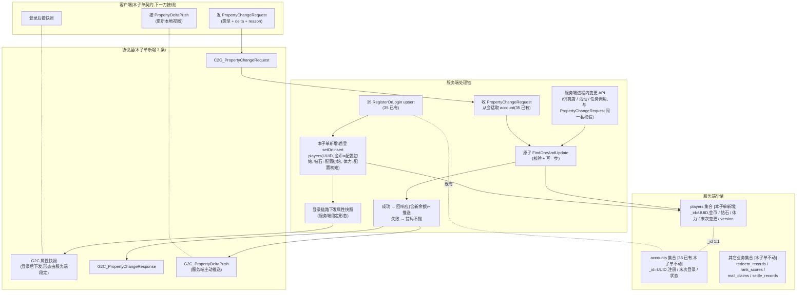
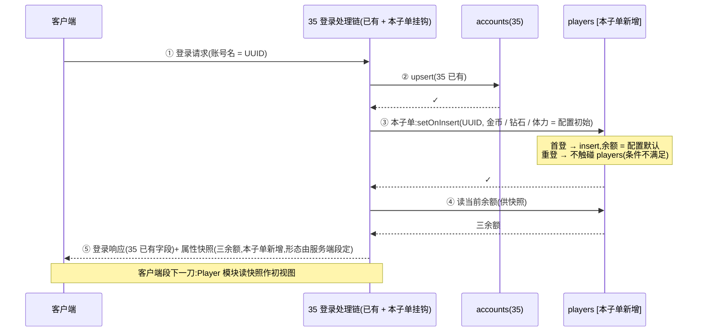
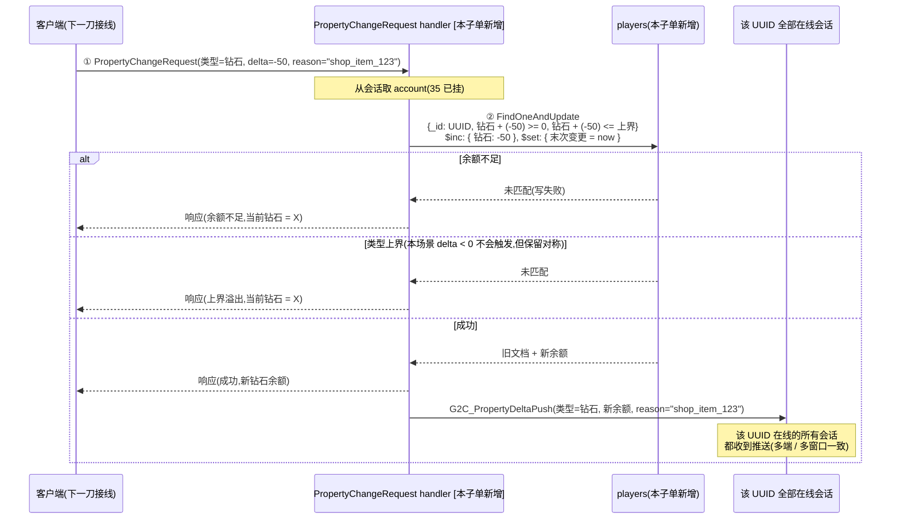
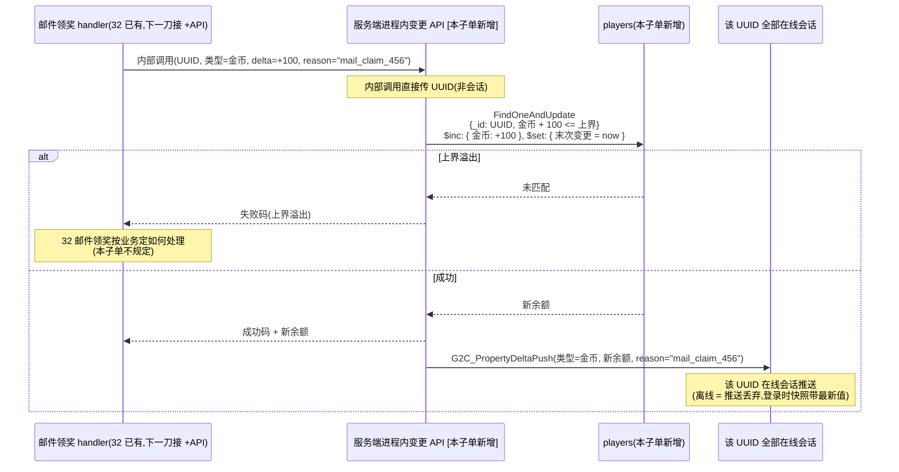

# 玩家属性服务端 · 金币 / 钻石 / 体力(Tier 2 第 1 子单)

把三类玩家属性(金币 / 钻石 / 体力)的**权威值与变更裁决**从客户端 PlayerPrefs + Player 模块运行期态搬服务端(Fantasy.Net),铺反作弊地基。服务端新建 MongoDB `players` 集合作三属性权威存储(主键 = 账号 UUID,与 35 `accounts` 集合 `_id` 1:1 关联),并对客户端提供三条 RPC 能力:① 登录后属性快照拉取(客户端登录即拥有当前属性视图);② 单一通用变更入口 PropertyChangeRequest(客户端只声明相对增量 + 原因 reason,服务端原子校验 + 写库);③ 变更后主动推送 PropertyDeltaPush(服务端起的远程通知,使多客户端 / 多入口的属性同步一致)。

这是 Tier 2 真实玩家属性权威体系的**第 1 子单(地基)**:本子单只做「**服务端权威 + 通用变更入口 + 推送**」三件事,客户端 PlayerPrefs 迁移 + Player 模块改持有方式 + 既有变更入口接线 = Tier 2 第 2 子单(客户端段)。本子单的「钻石消费校验恒返 true」反作弊核心缺口由服务端校验天然合上(客户端段下一刀让钻石消费走服务端校验流后,缺口彻底关闭)。

> [!WARNING]
> **读前必看 · 六条边界**
>
> - **本三属性 = 金币 / 钻石 / 体力,**不含经验 / 等级 / 体力上限 / 体力恢复速率,**也不含**分数 / 进度。前者属本子单服务端权威范围;后者中,经验 / 等级是设计 18 玩家信息系统的离线数据层(玩家玩法元层,与本子单正交);分数 / 进度是排行榜与玩法结算的范畴(反作弊另开,属服务端跑玩法仿真范畴,见 31 排行榜诚实边界)。体力上限 / 体力恢复速率是 Tier 2+ 后续刀的话题(本刀只把当前体力**余额**视作整数属性,上限默认 5 由运营配置)。
> - **`players` 集合主键 = 账号 UUID,与 35 `accounts` 集合 1:1 关联。**主键值沿用 35 已确立的「account = UUID 字符串」基线(同 30/31/32/33 业务集合的 account 字段值),故 `players._id` 即 `accounts._id` 即既有四个全栈特性所用的 account 字段值。两个集合**正交、不合并**——35 是账号身份账本(注册时间 / 末次登录 / 状态),37 是玩家属性账本(金币 / 钻石 / 体力余额),职责单一、各自演进(35 加 OpenID / 邮箱是身份维度;37 加经验 / 等级是玩家进度维度)。
> - **反作弊红线:服务端永不接受客户端传入的绝对数值。**客户端只能声明「相对变更」(类型 + 增量 delta + 原因 reason 字符串,如「+100 金币 / -50 钻石 / -1 体力」),服务端在 MongoDB 端原子校验余额下界(不许负)+ 类型上界(运营配置)+ 写库 + 推送。客户端**不持权威值**——它持的是「上次从服务端收到的最近视图」,任何客户端持的字段都不参与裁决,完全可被服务端推送覆盖。「PlayerNameGenerator.cs:152 钻石消费校验恒返 true」是已知反作弊核心缺口,本刀服务端校验上线后,客户端段下一刀让钻石消费走 PropertyChangeRequest 经服务端裁决,缺口彻底关闭(本刀不动 PlayerNameGenerator 代码,客户端段下一刀接)。
> - **客户端工程零 diff。**本子单纯 server 段:Unity 工程(`Assets/`)零改动。客户端 PlayerPrefs 三属性 key 保留(本刀不删,客户端段下一刀迁移)、Player 模块运行期持有方式保留(本刀不改)、消费 / 增加入口保留(本刀不接 PropertyChangeRequest)、PlayerNameGenerator 校验恒返 true 保留(客户端段下一刀改走服务端)。这与 30/31/32 服务端段先行刀同口径——服务端铺地基、客户端段后续刀接线,各刀改动面最小、回归风险最小。
> - **本子单不做的事(显式排除,留下一刀 / 后续 Tier):**ledger 历史(每笔变更存表供查询是 Tier 2+ 后续刀,本刀的「末次变更时间」只是单字段不是流水)、商店购买路径接通(商店发起消费由商店系统某刀接 PropertyChangeRequest 服务端进程内 API,本刀不接)、活动 / 任务 / 排行榜结算的奖励发放路径接通(各业务系统的发奖刀按其各自范围接 PropertyChangeRequest 进程内 API,本刀仅声明该入口形态)、退款 / 回滚(Tier 2+,需 ledger 才能做)、客户端 PlayerPrefs 迁移(客户端段下一刀)、Player 模块改持有方式(客户端段下一刀)、其它属性(经验 / 等级 / 体力上限 / 体力恢复速率等非本三属性)。
> - **复用 35 既有账号链路。**35 已确立「登录请求 → upsert accounts → 挂会话身份 → 创建 Player 实体」处理链,本子单在该链路的**「创建 Player 实体」步骤前后**加两个挂钩:① **首登 setOnInsert 写 players 初始记录**(与 35 同事务模式,但落 `players` 集合;两条 setOnInsert 互相不影响,各自只在 insert 路径写默认值);② **登录响应或紧随的单独 RPC 回客户端属性快照**(由服务端段定具体形态,plan code-blind 不指字面量)。具体既有链路的代码层定位(类名 / 方法名 / 文件路径)由 server-dev 据 fantasy-net 工程现状取(plan code-blind,不指字面量)。

> [!NOTE]
> **立项信息**
>
> | 项 | 内容 |
> | --- | --- |
> | **类型** | 全栈特性 · Tier 2 真实玩家属性权威体系第 1 子单(地基)。出 code-free 设计意图 + 行为级协议契约 + 行为级验收,交服务端段(协议新增 + 集合 + 校验 + 推送)落地;客户端段零改动。 |
> | **方向约束** | 离线还原 · **去变现**:钻石作虚拟货币存在(服务端账本),但**不**含付费会员 / VIP 等级 / 充值绑定 / 内购入口(去变现下钻石增加由活动 / 任务 / 邮件发放,非购买;消费由商店道具 / 抽奖等非付费场景);本子单只建账本 + 变更入口,**不**含产出 / 消费的具体业务场景。加法式:`players` 集合是新增的权威存储,既有 35 `accounts` 集合 + 既有 30 / 31 / 32 / 33 业务集合零迁移;客户端 PlayerPrefs 三属性 key 保留(下一刀迁移)。 |
> | **需求降层** | **a. 表层要求**(GDD Tier 2 + boss brief):三类属性服务端权威,服务端永不信客户端传入绝对数值,只接受相对增量声明;首登初始化 + 通用变更入口 + 主动推送;合并去除「钻石消费校验恒返 true」反作弊缺口。 **b. 底层目的**(为玩家 / 工程达成什么):让玩家属性的**真值**由服务端账本决定——目前金币 / 钻石 / 体力都在客户端 PlayerPrefs,任何 PlayerPrefs 读写工具(甚至 hex 编辑器)都能改值,「钻石消费」实际形同虚设(校验恒返 true,且即使返 false 客户端仍可绕过)。有服务端账本后,**对玩家**(诚实玩家)是无感的(登录后属性视图与 PlayerPrefs 时代一致,变更响应几十 ms 内);**对工程**是为反作弊体系铺地基——任何「不经服务端裁决而靠改本地数值得到的好处」都被合上,且后续 Tier 加 ledger 历史时这个账本就是流水底层。 **c. 有无更直达 b 的做法**:b 的本质 = 「让玩家属性真值在服务端有账本」,服务端权威存储 + 单一相对变更入口是直达做法——客户端无需为属性裁决造 UI、玩家无感、反作弊缺口一次性合上。**备选(已否)**:① 在客户端 PlayerPrefs 上加签名 / 加密 → 治标不治本,客户端任何加密密钥都在玩家可访问范围内,只是抬高门槛而非根治;② 细分「增 / 减 / 消费」三条 RPC → 三条入口结构重复、validation 逻辑分散、维护成本高,且消费类的「reason 审计」字段也要复制三份,违数据建模常识(同口径变更走一套);③ 不做主动推送、客户端每次操作前先 GetPlayerAttributes → 每次操作 + 1 次 RTT,体验差且仍需通用变更入口才能做反作弊。无更优解,按表层「单一通用入口 + 主动推送」实现。 |
> | **范围(产品 · 玩法)** | **服务端新增**:① MongoDB `players` 集合(主键 = UUID 字符串,字段 = 金币余额 / 钻石余额 / 体力余额 / 末次变更时间 / schema 版本,字段集见 [§3.1](#37-player-attr-server::schema));② 35 RegisterOrLogin upsert 钩子内顺带 setOnInsert 写一份初始 players 记录(三属性初始值由运营配置,默认 金币 0 / 钻石 0 / 体力 5,见 [§3.2](#37-player-attr-server::init));③ 三条 RPC 协议(快照拉取 / 通用变更入口 / 服务端主动推送,见 [§3.3](#37-player-attr-server::protocol));④ 校验体系(余额下界不许负 + 类型上界运营配置 + 原子 FindOneAndUpdate,见 [§3.4](#37-player-attr-server::validate));⑤ 服务端进程内变更 API(供未来商店 / 活动 / 任务 / 排行榜结算调用,与对客户端的 PropertyChangeRequest 走同一套校验 + 写库 + 推送,见 [§3.5](#37-player-attr-server::internal-api))。 **服务端不动**:35 `accounts` 集合 schema 与 upsert 逻辑、既有「网关挂会话身份组件」、既有登录处理链「创建 / 加载 Player 实体」流程的其它部分、既有 30/31/32/33 业务集合 schema 与处理逻辑。 **协议**:**新增三条客户端可见 RPC**(快照拉取 / 通用变更入口 / 主动推送),登录协议是否随路捎带快照由服务端段定(plan 不指定字面量,见 [§3.3](#37-player-attr-server::protocol))。 **客户端零改**(Unity 工程)。 |
> | **关键约束** | 服务端遵 Fantasy.Net 既有约定(协议 / 处理逻辑 / MongoDB 存储 / 错误码非异常 / 不手改生成物 / 不手动注册,正本以服务端工程 fantasy-net 为准,本稿不写代码符号);裁决以**结果码**回包,不抛异常致连接断;沿用 30 / 31 / 32 / 33 / 35 已确立的「身份从会话取」「MongoDB 持久」「检查 + 写入原子单条命令」基线。本篇正文为 code-free 设计意图,不含协议消息名 / 字段代码名 / 类名 / 文件路径 / 接缝清单——服务端段据行为语义定持久化层挂钩点与 schema 字段名。 |

## 一、前后端职责切分 {#split}

每一步归谁,按「**账本权威 vs 输入触发**」一刀切清。本子单的特点是**几乎全服务端、客户端只展示与发起声明**:

| 环节 | 归属 | 说明 |
| --- | --- | --- |
| 持权威值(金币 / 钻石 / 体力余额) | **服务端**(权威) | MongoDB `players` 集合,本子单新增 |
| 持本地视图(客户端展示用) | **客户端** 下一刀 | 客户端段下一刀:Player 模块改持有方式,从「PlayerPrefs 持权威」改为「内存持服务端推送的视图」 |
| 首登创建初始记录 | **服务端**(权威) | 与 35 RegisterOrLogin 同事务模式 setOnInsert(本子单新增) |
| 登录后下发属性快照 | **服务端**(权威) | 登录响应捎带 / 独立 RPC,服务端段定形态(本子单新增) |
| 发起属性变更声明(相对增量 + 原因) | **客户端** 下一刀 | 本子单只声明协议契约;客户端段下一刀让既有变更入口(商店 / 道具使用 / 等)走 PropertyChangeRequest |
| 校验变更合法性(余额下界 / 类型上界 / 原子) | **服务端**(权威) | 本子单新增,这是反作弊核心 |
| 写库(变更余额 + 末次变更时间) | **服务端**(权威) | 单条原子 FindOneAndUpdate(本子单新增) |
| 回变更结果码 | **服务端**(权威) | 成功 → 含变更后余额;失败 → 错误码(余额不足 / 类型上界溢出 / 服务暂不可用),本子单新增 |
| 主动推送变更后视图 | **服务端**(权威) | 每次成功变更后服务端起推送(本子单新增) |
| 接收快照 + 推送并更新本地视图 | **客户端** 下一刀 | 本子单只声明协议契约;客户端段下一刀让 Player 模块订阅推送 |
| 显示属性(UI 面板 / HUD) | **客户端** 下一刀 | 现有 UI 显示 PlayerPrefs 值,下一刀改为读 Player 模块本地视图 |
| 业务内部消费(商店购买 / 道具使用 / 等) | **两端 · 后续刀** | 客户端发起声明 → 服务端裁决;具体业务场景的接线由各业务系统刀按需接 PropertyChangeRequest |
| ledger 历史流水查询 | **不做** Tier 2+ | 本子单只持单字段「末次变更时间」,不存每笔变更流水 |

> [!NOTE]
> **为什么「单一通用变更入口」比「细分增 / 减 / 消费三 RPC」好?**
>
> 三条独立 RPC 的设计看似清晰(语义直接),但有三个问题:① 校验逻辑分散:每条 RPC 都需重写「余额下界 + 类型上界 + 原子写」,三处代码三处 bug 风险;② reason 字段:消费类(防作弊审计关键)的「为什么扣」字段如要复制到「增 / 减」三处,字段语义就要分裂(「增的 reason」是奖励来源「减的 reason」是消费来源,看似两个域其实可以归一成「这次变更的来源」);③ 业务场景非二元:有的场景是「扣 100 金币得 1 道具」(消费),有的是「兑换码换 100 金币」(增加),有的是「邮件领奖 +100 金币」(增加但有奖励来源)——服务端校验逻辑层不区分增减,只区分「净变化是否使余额跨越下界 / 上界」。故归一成单一 PropertyChangeRequest(类型 + delta 有符号 + reason 字符串)是最简洁的设计,「增 / 减 / 消费」从 RPC 层降为 reason 层(由调用方语义化字符串自标)。

## 二、系统模型 {#model}

四方参与:客户端(发声明,本子单不动)、协议层(三条新 RPC)、服务端处理链(三条 RPC 各自的 handler + 35 RegisterOrLogin 钩子扩展)、服务端存储(本子单新增 `players` 集合 + 35 已有 `accounts` 集合不动)。结构图:

> [!NOTE]
> **为什么 `players` 与 `accounts` 是两个集合,而不是 `accounts` 加三个字段?**
>
> 拆两个集合而非合一集合,理由有四:① **职责单一**:35 `accounts` 是账号身份账本(注册时间 / 末次登录 / 状态 / 未来 OpenID),37 `players` 是玩家属性账本(三余额 / 末次变更 / 未来经验 / 等级),两者演进维度独立(35 的 Tier 3 加身份维度,37 的 Tier 2+ 加属性维度);② **更新频率不同**:35 每次登录写一笔(低频),37 每次属性变更写一笔(高频,可能秒级);合一集合会让低频字段被高频更新无谓写入,且 MongoDB 文档级锁颗粒度变大;③ **未来扩展**:Tier 2+ 加 ledger 流水时,流水表的 player_id 外键就是 `players._id`,集合关系自然;若合一,流水表与 `accounts` 关联在语义上别扭(流水是属性变更不是账号变更);④ **零迁移**:35 已上线,加字段需做 schema 兼容(缺字段保底)+ 老数据补齐;新建集合不需要,初始查询缺记录 = 走 setOnInsert 路径自然处理。
>
> **`players._id` 与 `accounts._id` 是同一个 UUID 值**,这是 1:1 关联的最简表达——无需外键、无需关联表、查询 `players` 用 `accounts._id` 直接命中,与既有四个全栈特性业务集合的 account 字段值口径一致。

## 三、行为级协议契约 {#protocol-section}

用**行为语言**描述本子单涉及的协议消息——本子单**新增三条客户端可见 RPC**(快照拉取 / 通用变更入口 / 主动推送)+ 一条服务端进程内 API(供未来业务系统刀调用)。协议字段集由服务端段定具体名(以 fantasy-net 现状为准),本节给「行为契约」描述各 RPC 的语义。

### 3.1 `players` 集合 schema(服务端持久层) {#schema}

新增 MongoDB 集合 `players`(实际集合名以服务端段 Fantasy.Net 约定为准),字段集如下:

| 字段(游戏含义) | 类型 | 含义 / 默认 |
| --- | --- | --- |
| 主键(`_id`) | 字符串 | UUID = 与 `accounts._id` 同值,1:1 关联;不哈希 / 不加盐(沿用既有口径) |
| 金币余额 | 整数(非负) | 默认 0(运营配置可改首登初始值);上界 = 类型上界配置(默认 999999999,约 9 位数量级) |
| 钻石余额 | 整数(非负) | 默认 0(运营配置可改首登初始值);上界 = 类型上界配置(默认 999999,约 6 位数量级,与去变现下不大量发放对齐) |
| 体力余额 | 整数(非负) | 默认 5(运营配置可改首登初始值);上界 = 类型上界配置(默认 5,与体力上限对齐;Tier 2+ 加体力上限独立字段时上界改为读上限字段) |
| 末次变更时间 | 日期时间 | 该 UUID 最后一次属性变更的时刻(insert 时同首登时间;后续每次变更 update);Tier 2+ ledger 流水落地前作单字段快照 |
| schema 版本 | 整数 | 默认 1;Tier 2+ 加字段时若需迁移则升版本号(本子单只用 1) |

**索引**:主键 UUID 由 MongoDB 天然唯一,无需额外索引。本子单**不**加余额字段索引(本子单无按余额查询需求,Tier 1+ 真要做「金币 ≥ N 的玩家」类运营查询时再加,避免投机性索引)。

**与 35 `accounts` 集合的关系**:本子单**不**在 `players` 加 account 外键约束——MongoDB 无关系型 FK,且两集合主键值同源(UUID),应用层弱不变量「`players._id` 必在 `accounts._id` 出现过」由首登流程顺次写入保证(见 [§3.2](#37-player-attr-server::init))。

**与既有业务集合的关系**:本子单**不**改 30/31/32/33 业务集合(redeem_records / rank_scores / mail_claims / settle_records 等),业务集合的 account 字段值语义不变(= UUID = 既有口径)。Tier 2+ 让兑换码 / 邮件 / 排行榜结算的「奖励发放」改为调用服务端进程内变更 API 时,业务集合本身仍不动,只是发奖时多一次 `players` 集合的原子写。

### 3.2 首登初始化(35 钩子扩展) {#init}

35 RegisterOrLogin 在首登(走 insert 分支)时,本子单在其**同一处理路径**内加一步:**setOnInsert 写一份初始 `players` 记录**(与 35 `accounts` 的 setOnInsert 同事务模式,但落 `players` 集合)。处理顺序:

| 顺序 | 步骤 | 归属 |
| --- | --- | --- |
| 1 | 收到登录请求(35 已有) | 35 |
| 2 | 解析账号名(= UUID)(35 已有) | 35 |
| 3 | upsert `accounts`(35 已有原子单条命令) | 35 |
| 4 | **本子单新增:upsert `players`(UUID,首登 setOnInsert 三属性初始值 + 末次变更时间 = 服务端时钟 + schema 版本 = 1;重登路径不动 `players`)** | **本子单** — 单条原子命令,setOnInsert 仅在 insert 时写,update 路径完全不触碰余额字段 |
| 5 | 任一 upsert 失败 → 返登录失败结果码(35 已有此分支,本子单沿用) | 35 + 本子单 |
| 6 | 挂会话身份(35 已有) | 35 |
| 7 | **本子单新增:登录链路下发属性快照(读 `players` 当前余额 + 随登录响应捎带 / 独立 RPC,形态由服务端段定)** | **本子单** |
| 8 | 后续业务(35 已有) | 35 |

**重登路径不动 `players`**:已知 UUID 再次登录走 35 `accounts` 的 update 分支(末次登录时间更新),`players` 集合的 setOnInsert 在 update 路径**不执行**(MongoDB 原子语义),余额字段稳定 = 上次变更后的值。这与 35 「首次注册时间只在 insert 时写」严格分同口径。

**初始值由运营配置**:三属性的首登初始值(金币 0 / 钻石 0 / 体力 5)是**服务端配置**(以 fantasy-net 既有配置文件口径为准,plan 不指字面量)。客户端 PlayerPrefs 时代的初始值(如有)与本子单**不同源**——客户端段下一刀迁移时,既有 PlayerPrefs 值不被读取(信任服务端首登值作真值),这是「服务端权威」基线下的必然取舍(否则任何客户端可改 PlayerPrefs 来「带走老数据」就破了反作弊红线)。

### 3.3 三条客户端可见 RPC {#protocol}

本子单新增三条 RPC,具体消息名 / 字段代码名由服务端段以 Fantasy.Net 约定为准:

#### 3.3.1 属性快照(登录后下发)

| 项 | 内容 |
| --- | --- |
| **方向** | 服务端 → 客户端 |
| **时机** | 登录响应捎带 / 登录成功后独立 RPC(由服务端段定形态) |
| **携带内容** | 三属性当前余额(金币 / 钻石 / 体力)+ schema 版本(供客户端识别字段集) |
| **行为语义** | 给客户端登录后的属性初视图,客户端段下一刀把 Player 模块的运行期持有改为「持此快照」 |
| **错误处理** | 服务端读 `players` 集合无对应记录(理论上首登 setOnInsert 已写,不应出现)→ 返登录失败结果码;读取失败 → 同 |

#### 3.3.2 通用变更入口(客户端发起声明)

| 项 | 内容 |
| --- | --- |
| **方向** | 客户端 → 服务端(请求) + 服务端 → 客户端(响应) |
| **请求内容** | 类型(枚举:金币 / 钻石 / 体力)+ 增量 delta(有符号整数,正 = 增加,负 = 减少 / 消费)+ 原因 reason(字符串,如 `"shop_purchase_item_123"` / `"mail_claim_456"` / `"stamina_consume_level_789"`,语义化标识,供后续 ledger 审计) |
| **响应内容** | 结果码(成功 / 余额不足 / 类型上界溢出 / 类型未知 / 服务暂不可用 / 身份未挂)+ 成功时含变更后的该属性余额(供客户端直接更新视图,免一次回查) |
| **校验** | 见 [§3.4](#37-player-attr-server::validate) |
| **身份** | 从会话挂的 account(35 已有)取,客户端不自报(沿用 30/31/32/33 基线) |
| **绝对值禁报红线** | 请求**不含**绝对余额字段;若服务端段误加并解析了客户端传入的绝对余额 → Code Review 必拦,这是反作弊根本不变量 |

#### 3.3.3 属性变更主动推送

| 项 | 内容 |
| --- | --- |
| **方向** | 服务端 → 客户端 |
| **时机** | 每次 `players` 集合写入成功后(无论触发源是 PropertyChangeRequest 还是服务端进程内 API) |
| **携带内容** | 类型 + 变更后余额 + 变更原因 reason(用于客户端做 toast / 弹奖动画的来源识别) |
| **行为语义** | 客户端段下一刀:Player 模块订阅推送,收到即更新本地视图(无需再发请求拉) |
| **去抖**(本子单不强求) | 同一变更可能产生两条事件(响应 + 推送),客户端段下一刀按业务定如何去重(本子单只保证「服务端推送每次变更恰好一次」,客户端去重不是服务端职责) |

### 3.4 校验体系 {#validate}

PropertyChangeRequest 与服务端进程内变更 API 共用一套校验。校验在 MongoDB 端**原子单条命令**(FindOneAndUpdate 加条件过滤),**非**先查后写两步:

| 校验项 | 实现 | 失败结果码 |
| --- | --- | --- |
| **身份** | 会话上必须挂 account(35 RegisterOrLogin 后挂);未挂 = 未登录 / 35 失败致挂半截 | 「未登录」类结果码,客户端段下一刀重新登录 |
| **类型合法** | 必须为三类(金币 / 钻石 / 体力)之一;未知类型 = 协议非法 | 「类型未知」类结果码;Code Review 须保证服务端枚举与协议同步 |
| **delta 合法范围** | 单次 delta 必须在合理范围内(默认 [-类型上界, +类型上界]),防客户端传 Int.MaxValue 这类极值绕过余额检查 | 「请求非法」类结果码 |
| **余额下界**(不许负) | 条件过滤:`{ _id: UUID, currentBalance + delta >= 0 }`,原子写;若 delta < 0 且当前余额 + delta < 0 → 写失败(条件不满足)= 余额不足 | 「余额不足」类结果码,含当前实际余额(客户端段下一刀据此显示「需要 X,你有 Y」类 toast) |
| **类型上界**(不许溢出) | 条件过滤:`currentBalance + delta <= 类型上界`,与下界同一原子命令(MongoDB 单条 update 含多条件过滤);若 delta > 0 且当前 + delta > 类型上界 → 写失败 = 溢出 | 「类型上界溢出」类结果码;客户端段下一刀按业务定如何处理(部分发奖 / 拒收 / 排队) |
| **原子单条命令** | FindOneAndUpdate(条件 + 更新)在 MongoDB 内一步完成,**非**先 Find 后 Update 两步;这与 30 兑换码 / 31 排行榜 / 32 邮件 / 35 accounts 的「检查 + 写入原子」基线同口径 | 失败原因不在结果码中暴露(避免泄露内部状态) |

**为什么余额检查放 MongoDB 而非应用层?**两个理由:① 并发同账号双扣(同账号两请求毫秒级同时发,服务端两 handler 同时跑)若在应用层先 Find 后 Update,两 Find 都拿到「100 钻石」,两 Update 都写「100 - 50 = 50」,实际扣了 50 但应扣 100,即「超发」;放 MongoDB FindOneAndUpdate 条件写,第二请求的条件 `100 + (-50) >= 0` 在第一请求 update 后变成 `50 + (-50) >= 0` 仍满足,但若第二请求是 `-80` 则 `50 + (-80) < 0` 写失败,准确返「余额不足」。② 服务端进程崩溃 / 网络中断 / Mongo 主从切换时,应用层缓存的余额值可能与库不同步,只信 MongoDB 实时值最稳。

**错误码非异常**:校验失败 → 返结果码;**不**抛异常致连接断(沿用 Fantasy.Net 既有基线,同 30/31/32/35)。

### 3.5 服务端进程内变更 API(供未来业务系统刀复用) {#internal-api}

为让未来商店 / 活动 / 任务 / 排行榜结算等业务系统能在**不经客户端 RPC** 的情况下变更玩家属性(例如:邮件领奖 +100 金币 / 排行榜结算 +50 钻石 / 任务完成 +1 体力),本子单声明一条服务端进程内 API:

| 项 | 内容 |
| --- | --- |
| **形态** | 服务端模块对外暴露的同步 / 异步方法(具体形态由服务端段以 Fantasy.Net 约定为准) |
| **入参** | UUID(目标账号)+ 类型 + delta + reason |
| **行为** | 与 PropertyChangeRequest **共用同一套校验 + 写库 + 推送**——同口径,不另造一条 |
| **返回** | 结果码(同 PropertyChangeRequest)+ 成功时新余额 |
| **推送** | 成功后服务端起 G2C_PropertyDeltaPush 到该 UUID 当前的会话(若在线;离线 = 推送丢弃,登录时下发的快照会带最新余额) |
| **本刀范围** | 仅声明 API 形态;**真正的调用方(商店 / 邮件 / 活动 / 任务 / 排行榜结算)由各业务系统刀按其各自范围接** — 本刀不接 |

**为什么发奖入口与玩家声明入口共用一套?**两个理由:① 一套校验 / 一套写库 / 一套推送,代码重复最小、行为一致最高;② 反作弊红线统一——无论变更来自客户端声明还是服务端业务系统,都过同一套余额下界 / 上界 / 原子写,业务系统无法因「内部调用」绕过校验(例如:排行榜结算服务端的 bug 试图发奖 +999999999 钻石,会因类型上界校验失败而拒,客户端不会拿到非法值)。

### 3.6 协议字段语义升级表 {#semantic}

既有协议字段语义在本子单的升级一览:

| 协议字段(语义) | Tier 2 前(既有) | Tier 2 本子单后 |
| --- | --- | --- |
| 登录响应(各字段) | 35 已升级:认证 = 注册 + 登录二合一 | + 本子单可选捎带属性快照(由服务端段定;或独立 RPC) |
| 既有「PlayerPrefs 三属性 key」 | 客户端持权威值 | 客户端段下一刀:保留但不再读 / 不再作权威,Player 模块改持服务端推送视图 |
| 既有「Player 模块运行期态」 | 客户端持权威值 + 业务直接修改 | 客户端段下一刀:改持服务端推送视图 + 业务通过 PropertyChangeRequest 走服务端 |
| 既有「PlayerNameGenerator.cs:152 钻石消费校验恒返 true」 | 反作弊缺口 | 客户端段下一刀:钻石消费改走 PropertyChangeRequest,服务端校验余额下界,本地校验函数可保留但其返值不参与权威路径(由服务端响应决定是否扣成功) |

## 四、变更时序 {#flow}

### 4.1 首登 + 快照下发

### 4.2 客户端发起属性变更(以「消费 50 钻石」为例)

### 4.3 服务端进程内变更(以「邮件领奖 +100 金币」为例)

## 五、整局走查与崩法 {#walk}

把本子单的所有机制在「**首登 / 重登 / 余额不足 / 类型上界 / 并发同账号双扣 / 服务不可用 / 多端 / 推送丢失**」八类场景下走一遍,每个机制点出最可能炸的那类 + 对策:

### 5.1 首登初始化崩法

新 UUID 首登,`accounts` insert + `players` insert 应同事务模式完成。

| 崩法 | 后果 | 对策 |
| --- | --- | --- |
| `accounts` insert 成功但 `players` insert 失败 → 35 处理链继续挂会话身份 → 后续业务请求看到「会话有 account 但 `players` 集合无记录」 | 后续业务读 `players` 失败,登录后体验崩 | **顺次写、失败短路**:`players` insert 失败 → 同 35 upsert 失败 → 返登录失败结果码、不挂会话身份(沿用 35 §3.2 「upsert 失败 → 短路后续步骤」基线)。Mongo 不可达分支同 35 § 5.4 |
| 并发同新 UUID 双登 → 两连接各自走 `players` setOnInsert | 单条原子语义:第一连接 insert,第二连接走 update 路径但 setOnInsert 不执行 → `players` 仅一条记录,余额 = 配置初始 | 沿用 35 §5.1「单条原子命令」口径;SV3 验「并发新 UUID 首登仅一条 players 记录」 |
| 初始值配置缺失 / 配置错乱 → 首登写入 NaN / 负值 / 极大值 | 玩家从一开始就持非法值 | 启动期校验初始值配置(余额 >= 0、余额 <= 上界);配置非法 → 服务端启动失败 / 拒服(不挂半截);具体校验时机由服务端段定 |

### 5.2 重登(已有 `players`)崩法

已知 UUID 再次登录,`accounts` update + `players` 不动。

| 崩法 | 后果 | 对策 |
| --- | --- | --- |
| `players` upsert 误把 setOnInsert 当 set 写 → 每次登录都把余额重置为初始值 | 玩家「每次登录都被清零」是严重数据损坏 | 严格分:**setOnInsert 仅在 insert 时写,update 路径完全不动余额字段**;SV5 专项验「重登后余额不变」;SV12 Code Review 重点核此项 |
| 重登路径误读 `players` 失败 → 快照下发空 → 客户端段下一刀拿到 0 / null / 默认 | 客户端段下一刀展示崩 / 错误覆盖真实余额 | 重登必读 `players` 当前余额作快照;读失败 → 返登录失败(同 §5.1 顺次写失败) |

### 5.3 余额不足 / 类型上界崩法

变更条件不满足 → MongoDB FindOneAndUpdate 写失败 → 返错码。

| 崩法 | 后果 | 对策 |
| --- | --- | --- |
| 应用层先 Find 后 Update 两步 → 并发同账号双扣致超发(见 [§3.4](#37-player-attr-server::validate)) | 反作弊红线被破:玩家可借并发用同笔钻石买两件物品 | **MongoDB FindOneAndUpdate 条件原子**(查 + 写一步);SV7 专项验「并发同账号双扣 50/80,初始 100 → 一次成功(50)/一次失败(余额不足),最终余额 50,**非** 100-50-80=-30 / 0 / 50-80=-30」;SV12 Code Review 重点核此项 |
| 失败响应未带「当前余额」字段 → 客户端段下一刀无法显示「需要 X,你有 Y」 | 玩家体验差(不知道差多少) | 失败响应携带当前实际余额([§3.3.2](#37-player-attr-server::protocol));SV8 验失败响应字段集 |
| 类型上界配置缺失 / 极大 → 钻石余额可被推到 Int 溢出 | 整数溢出致后续校验逻辑错乱 | 类型上界配置启动期校验(<= Int 类型安全上限,默认 999999 远低于 Int 上限);上界配置非法 → 服务端启动失败 |

### 5.4 并发同账号双扣崩法

同 UUID 两个会话(或单会话两个并行请求)毫秒级内同时发变更。

| 崩法 | 后果 | 对策 |
| --- | --- | --- |
| 两请求都通过应用层校验(各拿到 100)→ 各写 100-50=50 → 实际只扣 50 | 玩家用 100 钻石买了两件 50 钻石的物品 → 超发 | MongoDB FindOneAndUpdate 条件写:第一请求成功后余额变 50,第二请求的条件 `50 + (-50) >= 0` 仍满足、再扣 50 → 余额 0(正确);但若两请求各扣 80(初始 100),第二请求条件 `20 + (-80) >= 0` 不满足 → 第二请求失败返「余额不足」(正确);单设备 + 单服务端进程下,这是反作弊核心保障 |
| 多客户端会话(用同 UUID 在两端登录,本子单未防多会话同 UUID,沿 35 §5.3)各发变更 | 各发各的,服务端两 handler 各跑各的 FindOneAndUpdate;若两笔扣的合计超过余额 → 第二笔失败返「余额不足」 | 同上;本子单沿 35 §5.3「单设备一对一,多会话同 UUID 是 Tier 1+ 议题」诚实边界,服务端不强求两会话同步,只保证写库原子 |
| 推送 G2C_PropertyDeltaPush 顺序与变更顺序不一致(网络抖动)→ 客户端段下一刀本地视图与服务端实际短暂不一致 | 客户端段下一刀按「以最新推送为准」处理;服务端推送中**不**带「上一余额」字段(避免客户端做「旧值-delta」推断,客户端段下一刀直接以新余额覆盖) | 推送内容只含「类型 + 新余额 + reason」,**不**含「旧值」或「delta」(客户端段下一刀据此简化逻辑);推送丢失见 §5.7 |

### 5.5 类型未知 / delta 极值 / 协议非法崩法

客户端段错误 / 恶意客户端构造非法请求。

| 崩法 | 后果 | 对策 |
| --- | --- | --- |
| 客户端段传未知类型(超出三类枚举)→ 服务端处理崩 / 写错字段 | 数据损坏 | 类型必须在服务端枚举内;未知类型 → 返「类型未知」错码 + 不写库;SV9 专项验 |
| 客户端段传 delta = Int.MaxValue → 与当前余额相加溢出 → 条件校验绕过 | 整数溢出致校验失效 | delta 必须在 [-类型上界, +类型上界] 范围内(本子单约束);超出 → 返「请求非法」错码 + 不写库;Code Review 核此项 |
| 恶意客户端在请求中**附加**绝对余额字段并依赖服务端误用 | 反作弊根本破 | 服务端**仅消费请求声明的相对增量** + 不解析绝对余额字段(即使协议层因 proto schema 误带了该字段);Code Review 须确认 handler 仅读类型 + delta + reason 三字段 |
| reason 字段过长 / 含恶意字符 → ledger 审计层暴露 | 后续 Tier 2+ ledger 落地时存储压力 / 注入风险 | 本子单**不强求** reason 长度限制(默认接受任意字符串);Tier 2+ ledger 落地刀按需加限长 |

### 5.6 服务不可用崩法

MongoDB 集群 / 单机 mongod 挂或网络中断,FindOneAndUpdate 报错。

| 崩法 | 后果 | 对策 |
| --- | --- | --- |
| Mongo 不可达 + 服务端把校验失败误判为「余额不足」 | 玩家被误告「余额不足」实际是服务挂了 → 体验崩 + 误诊断 | 区分两类失败:① 写失败但 Mongo 可达 = 条件不满足(余额不足 / 上界溢出),返业务错码;② 写失败因 Mongo 不可达 / 异常 = 返「服务暂不可用」错码(沿用 30 「不本地放行」基线)。客户端段下一刀按不同错码做不同 toast |
| 推送 G2C_PropertyDeltaPush 时连接已断 → 推送丢失 | 客户端段下一刀本地视图与服务端不一致 | 推送丢失是无害的:客户端段下一刀下次登录时收到最新快照即可重新对齐;本子单**不**重试推送、**不**做最终一致性(成本与收益不匹配,玩家下次登录就对齐了)。Tier 2+ 若需强一致(如实时 PVP)再加 |
| 服务端进程内变更 API 调用失败 → 业务系统刀(如邮件领奖)看到失败 | 业务系统按其各自范围决定如何处理(如邮件领奖失败 → 邮件标未领,玩家可重试) | 本子单只承诺 API 返失败码;真正的「失败如何处理」由业务系统刀按其语义决定(同 32 邮件 §3.5 「发奖入口非结算幂等是调用方责任」口径) |

### 5.7 多端 / 推送 / 离线崩法

同 UUID 多会话 / 玩家离线时服务端发奖 / 推送顺序乱序。

| 崩法 | 后果 | 对策 |
| --- | --- | --- |
| 玩家离线时服务端发奖 → 推送丢失 → 玩家下次登录时余额已变 | 玩家不知道「这次增加是从哪来的」(reason 上下文丢失) | 本子单**不**记录「未推送的变更队列」(成本与收益不匹配,reason 上下文丢失是已知限制);Tier 2+ ledger 落地后,客户端段下一刀可在登录后拉「最近 N 笔变更」补充上下文 |
| 两会话同 UUID 各发变更 → 两会话各自推送 → 两会话本地视图都对(收到自己的 + 对方的推送) | 多端一致性达成 | 推送目标 = 该 UUID 当前在线的**所有**会话;服务端不做「只推自己」优化(去抖留客户端段) |
| 推送顺序乱序(网络抖动)→ 客户端段下一刀以乱序收到「钻石 100 / 钻石 50」 | 若客户端按「新余额覆盖」处理 → 最终值取决于最后收到的(可能错)| 推送**不**保证全局顺序;但每次推送的**新余额**就是 MongoDB 写入时的当前值,本质是「绝对快照」非「相对变更」,客户端段下一刀的处理建议是「以服务端实际余额为准、必要时定期主动 GetSnapshot 校准」(本子单不强求,客户端段下一刀决定) |

### 5.8 诚实边界(本子单守住什么、不守什么)

本子单**守住**:
- 三属性的 MongoDB 账本权威(每 UUID 一行,三余额持久)
- 余额下界(不许负)+ 类型上界(运营配置)在 MongoDB 端原子校验,反作弊红线
- 并发同账号双扣的原子写防超发(单服务端进程内)
- 服务端主动推送变更后视图(每次写库成功后向该 UUID 在线会话推送)
- 服务端进程内变更 API 与 PropertyChangeRequest 共用同一套校验(业务系统无法绕过)
- 客户端传入绝对值禁报(handler 仅消费类型 + delta + reason,Code Review 核)
- 与 35 `accounts` 集合 1:1 关联(`_id` 同源,首登顺次写)

本子单**不守**:
- **客户端展示层一致性**:推送顺序乱序 / 推送丢失 / 离线变更后上线 reason 上下文丢失等,本子单不强求严格一致(客户端段下一刀按业务决定补强策略,如定期主动 GetSnapshot 校准)
- **多服务端进程的全局原子**:本子单假设单服务端进程内 handler 并发(MongoDB 文档级原子已防超发);若 Tier 2+ 水平扩展到多服务端进程,MongoDB 写仍原子(数据库层级保障),但「该 UUID 在线会话推送」可能漏推到非自己进程的会话——Tier 2+ 加跨进程推送层时再补
- **ledger 历史 / 流水查询**:本子单仅持单字段「末次变更时间」,不存每笔变更流水;玩家「我上次扣了什么 / 何时」类查询本子单不支持(Tier 2+ ledger 落地刀)
- **退款 / 回滚**:本子单的任何变更**写入即定**,不支持「3 秒内撤销」;Tier 2+ ledger 落地后才能做退款(同笔反向)
- **业务场景的语义**(扣多少 / 给多少 / 何时给):本子单只提供「服务端进程内变更 API + 通用变更入口」,具体业务场景的 delta 由调用方决定(商店刀决定扣多少 / 邮件领奖刀决定发多少)
- **客户端 PlayerPrefs 三属性 key 的迁移 / 清理**:本子单不动,客户端段下一刀
- **PlayerNameGenerator.cs:152 钻石消费校验**:本子单不动客户端,该函数仍恒返 true 但其返值不参与权威路径(客户端段下一刀让钻石消费走服务端);反作弊缺口由「服务端校验」一侧合上,而非「修复客户端校验」(后者治标不治本)
- **多会话同 UUID 挤号 / 顶号**(Tier 1+ 议题,沿 35 §5.3)
- **分数 / 进度的服务端权威**(反作弊另开,服务端跑玩法仿真范畴,沿 31 排行榜诚实边界)

## 六、与既有稿关系 + Tier 2+ 接口余量 {#tier2plus}

### 6.1 与既有设计稿的关系(本子单不改任何既有稿)

| 既有稿 | 关系 | 本子单是否改写 |
| --- | --- | --- |
| [14 跨会话存档](#14-save-system) | 客户端离线存档(虔诚币 / 神庙 / 经验 / 守护者等级 / 灵力 / 盲盒 / 女神 / 订单完成数 / 今日祈愿)。客户端 PlayerPrefs 三属性 key(金币 / 钻石 / 体力)与 14 是**两套独立存储**(14 是 Persistence.Provider 的 JSON 落盘,三属性是 PlayerPrefs 单独 key) | **不改**。本子单不动客户端,14 的存档结构 + 持久化层完全保留;Tier 2+ 让 14 的「灵力」也上服务端(若需要)是后续刀 |
| [16 道具底层系统](#16-item-system) | 道具系统是配置 + 背包持有;道具数量与本子单三属性是**不同关注点**(道具是物品、三属性是货币/计数);道具背包持久化在客户端 | **不改**。Tier 2+ 让道具背包也上服务端是后续刀(同道具反作弊缺口) |
| [18 玩家信息系统](#18-player-info) | 离线数据层(MergeMetaSave 持久),职责 = 玩家**玩法元层**信息(id 复制 / 名字 / 等级 / 经验 / 头像);本子单职责 = 服务端**属性账本**(三余额)。两套**正交**关注点,各自服务于不同需求 | **不改**。Tier 2+ 让等级 / 经验也上服务端是后续刀(若需要),18 现状的「钻石扣费 = 空操作」(§3.2)在本子单上线后客户端段下一刀让其走 PropertyChangeRequest |
| [19 设置系统](#19-settings-system) | 设置系统数据层与本子单正交 | **不改** |
| [20 兑换码客户端侧](#20-redeem-code-system) | 兑换码奖励发放最终落到「道具 id × 数量」(经 16),与本子单三属性的关系:**如果**兑换码奖励是金币 / 钻石 / 体力(三属性之一,由 16 道具表 use_effect 或类似机制决定),Tier 2+ 让该发奖路径调服务端进程内变更 API 是后续刀 | **不改**。当前 20 + 30 链路落 16 道具系统,本子单未接入;客户端段下一刀 + 业务系统刀按需接 |
| [30 兑换码服务端化](#30-redeem-code-server) | 「身份从会话取已认证设备账号、客户端不自报」基线 = 本子单的基础 | **不改**。30 的 account 语义 = UUID,本子单沿用;30 奖励发放路径接服务端进程内变更 API 是后续刀(若需要) |
| [31 排行榜服务端化](#31-rank-server) | 同 30:身份从会话取、account = UUID | **不改**。31 上报分数与本子单无关(分数非三属性) |
| [32 邮件服务端化](#32-mail-server) | 同 30 / 31:身份从会话取;邮件领奖**抽奖在服务端**(§3.4 礼包随机库 id),返「道具 id × 数量」客户端本地落地经 16 | **不改**。32 当前落 16 道具系统,本子单未接入;Tier 2+ 让 32 邮件领奖直接调服务端进程内变更 API(对三属性类奖励)是后续刀(若运营要求) |
| [33 排行榜结算服务端化](#33-rank-settle-server) | 同 32:经 32 发奖入口投结算邮件 | **不改**。同 32 |
| [35 账号服务端](#35-account-server) | 本子单的**基础**:沿用 35 的 `accounts` 集合 + RegisterOrLogin 处理链 + 会话挂账号身份;`players._id` = `accounts._id` 同源 1:1 | **不改**。35 的 `accounts` schema 不动、upsert 逻辑不动;本子单只在 35 RegisterOrLogin 同处理链内**加一步** `players` setOnInsert(35 与 37 各管各的集合,各自原子写,顺次进行) |
| [36 账号客户端](#36-account-client) | 36 实做了设置窗登出按钮 = Shutdown + Boot;本子单的属性变更随登出 / 登录刷新 | **不改**。36 登出后再登录会走「重新 Boot → 自动登录 → 收 35 + 37 各自下发」,本子单的属性快照随登录链路自然下发 |

### 6.2 Tier 2+ 接口余量声明

Tier 2 → Tier 2+ / Tier 3 的演进路径(本子单为此铺地基,但 Tier 2+ 自身落地是后续刀,本子单仅声明余量):

| Tier 2+ 目标 | 在本子单 `players` 集合 / 协议上的演进 |
| --- | --- |
| 客户端 PlayerPrefs 三属性迁移 + Player 模块改持有方式 | 客户端段下一刀(Tier 2 第 2 子单):删 PlayerPrefs 三属性读 / 写(保留 key 不删,避免历史数据丢失风险) + Player 模块改订阅服务端推送 + 既有变更入口(消费 / 增加)接 PropertyChangeRequest + PlayerNameGenerator 钻石消费走服务端校验;客户端段下一刀完成后,反作弊缺口彻底关闭 |
| 业务系统接服务端进程内变更 API | 各业务系统刀按其各自范围接(商店刀、邮件刀、活动刀、任务刀等);本子单已声明 API 形态,后续刀只需调用 |
| 添加新属性(经验 / 等级 / 体力上限 / 体力恢复速率等) | `players` 集合**加字段** + 类型枚举加新值 + 校验体系按新字段扩展。schema 版本号升 1,缺字段保底(老记录读到缺字段 = 默认初始值)。客户端段刀同步加 UI |
| ledger 历史流水查询 | 新建 `player_ledger` 集合(主键 = 流水 id,外键 = `players._id`);每次 PropertyChangeRequest / 进程内变更成功后插入流水(类型 + 增量 + reason + 时间 + 变更前后余额)。客户端段加「我的流水」UI |
| 退款 / 回滚 | 依赖 ledger:找到目标流水 → 同笔反向 + 标退款关联 + 跑校验(退款也是一次变更,过同一套上界 / 下界校验) |
| 多服务端进程的全局原子 / 推送 | Mongo 写仍原子(数据库层);跨进程推送层(Redis pub/sub / 服务端节点广播)由 Tier 3 加 |
| 反作弊扩展(分数 / 进度) | 服务端跑玩法仿真,与本子单是**两套独立反作弊体系**(本子单守属性账本权威,仿真守玩法过程权威);两者各自演进、互不耦合 |

**为什么 Tier 2 不投机性预留 Tier 2+ 接口?**沿用 conventions 「不投机性建未来用不上的接口」(同 19 settings / 35 §六 做法):Tier 2+ 落地时加字段 / 加 RPC 是局部增量(主键不变,既有 schema 兼容),不存在「现在不预留就改主键」的风险——预留反而是不必要的复杂度。

## 七、验收点 {#accept}

服务端段全部由 server-test 跑;客户端段无新增(本子单零客户端 diff)。验收以「**起服 + 真往返 MongoDB**」为主,辅以 Code Review。

### 7.1 服务端段验收(SV)

| # | 验收点 | 完成定义(行为可观测) |
| --- | --- | --- |
| SV1 | 编译通过 + 源生成器产物 | 服务端工程(fantasy-net)dotnet build 0 error;protoc / Fantasy 源生成器产物正确生成,无手改 |
| SV2 | `players` 集合 schema | 服务端启动后 MongoDB 中 `players` 集合存在(或在首次 setOnInsert 时自动创建,以 Fantasy.Net 约定为准);文档结构含主键 / 金币余额 / 钻石余额 / 体力余额 / 末次变更时间 / schema 版本六字段 |
| SV3 | 首登初始化 + 1:1 关联 | 用一个 `accounts` + `players` 集合中**都不存在**的新 UUID 发登录请求 → 登录成功 → MongoDB 中 `accounts` + `players` 各出现一条新记录,两条记录的 `_id` **同值** = 该 UUID;`players` 三余额 = 运营配置初始值(默认金币 0 / 钻石 0 / 体力 5)、末次变更时间 ≈ 当前服务端时钟、schema 版本 = 1 |
| SV4 | 登录后属性快照下发 | 登录响应(或紧随的快照 RPC)中携带三属性当前余额 + schema 版本;客户端段下一刀可读取 |
| SV5 | 重登余额不变 | 用一个 `players` 集合中**已存在**(余额为 X / Y / Z)的 UUID 发登录请求 → 登录成功 → `players` 中**仍只有一条**记录(无重复 insert)、三余额**不变**(仍 X / Y / Z,setOnInsert 在 update 路径不执行)、末次变更时间**不变**(本子单的登录步骤不触发变更);属性快照下发余额 = X / Y / Z |
| SV6 | 通用变更入口 - 增加 | 一个已知 UUID 发 PropertyChangeRequest(类型=金币, delta=+100, reason="test_grant") → 响应「成功 + 金币新余额 = 原 + 100」+ MongoDB `players` 该记录金币字段 +100、末次变更时间更新;该 UUID 在线会话收到 G2C_PropertyDeltaPush(类型=金币, 新余额, reason="test_grant") |
| SV7 | 通用变更入口 - 消费 | 余额 100 钻石的 UUID 发 PropertyChangeRequest(类型=钻石, delta=-50, reason="test_consume") → 响应「成功 + 钻石新余额 = 50」+ MongoDB 钻石 -50;推送同 SV6 |
| SV8 | 余额不足 | 余额 30 钻石的 UUID 发 delta=-50 → 响应「余额不足 + 当前钻石 = 30」+ MongoDB 钻石**不变** = 30;不发推送 |
| SV9 | 类型上界溢出 | 钻石上界配置 = 999999;余额 999900 钻石的 UUID 发 delta=+200 → 响应「上界溢出 + 当前钻石 = 999900」+ MongoDB 钻石**不变** = 999900;不发推送 |
| SV10 | 类型未知 / delta 极值 | 发未知类型(超出三类枚举)→ 响应「类型未知」+ MongoDB **不变**;发 delta = Int.MaxValue → 响应「请求非法」+ MongoDB **不变** |
| SV11 | 并发同账号双扣原子(反作弊核心) | 余额 100 钻石的 UUID 模拟两连接近乎同时发 delta=-80 / delta=-50(顺序不定)→ 一次成功 / 一次失败「余额不足」+ MongoDB 钻石 = 20(若 -80 先)或 = 50(若 -50 先)= **不为负数、不超发**;并发同账号同时发 delta=-50 / delta=-50 → 一次成功 / 一次失败(余额 100 - 50 = 50,第二次 50 - 50 = 0 成功;或第一次到达即扣 → 余额 0 后,第二次仍可 0 - 50 失败);更严格:两连接并发各 delta=-80 → 第一成功扣到 20、第二条件 `20 + (-80) < 0` 失败返「余额不足」,**总扣额 = 80 不为 130**(即不超发) |
| SV12 | 服务端进程内 API | 服务端进程内调用 ChangeProperty(UUID, 金币, +100, "internal_test") → 同 SV6 行为(MongoDB 写 + 推送),返成功码 + 新余额;调用 ChangeProperty(UUID, 钻石, +999999, "internal_test_overflow") 当余额 = 0 上界 = 999999 → 成功;再次 +1 → 返「上界溢出」+ MongoDB 钻石 = 999999 不变 |
| SV13 | MongoDB 不可达失败 | 在 MongoDB 已停服 / 不可达情况下发 PropertyChangeRequest → 返「服务暂不可用」错码(不抛异常断连)+ MongoDB 无写入;登录请求亦返登录失败(沿 35 §SV8) |
| SV14 | 重启持久 | 写入若干 UUID + 各自余额 → 重启服务端 → 这些 UUID 再次登录,属性快照下发余额 = 重启前最后值(证 `players` 集合数据持久,非内存态);末次变更时间 = 上次变更时刻不变 |
| SV15 | 客户端工程零 diff | 验证 Unity 工程(`UnityProject/Assets/`)**git diff 为空**(本子单完成后)— 协议生成物 `Assets/GameProto/` 可有新增(本子单新增三条 RPC,客户端代码生成物会更新,但**业务代码 Assets/GameScripts/HotFix 零改动**);校验时区分协议生成物(允许新增)与业务代码(零改动) |
| SV16 | 既有四个全栈特性零回归 + 35 零回归 | 本子单上线后,30 兑换码 / 31 排行榜上报 + 查榜 / 32 邮件拉列表 + 领取 / 33 排行榜结算 / 35 账号 RegisterOrLogin 的服务端段 SV(各自已 PASS 的验收点)**全部仍 PASS** |
| SV17 | Code Review | 服务端段 PR 经 Code Review 通过,重点核:① 校验用 MongoDB **FindOneAndUpdate 单条原子命令**(条件 + 更新一步完成),**非**先 Find 后 Update 两步;② **PropertyChangeRequest handler 仅消费类型 + delta + reason 三字段**(不解析绝对余额字段,即使协议层附加);③ **余额下界 + 类型上界条件**写在 FindOneAndUpdate 的过滤条件内(非应用层 if-then-throw);④ **`players` setOnInsert 仅在 insert 时写余额字段,update 路径完全不动余额**(同 35 「首次注册时间只在 insert 时写」基线);⑤ 服务端进程内变更 API **与 PropertyChangeRequest 共用同一套校验 + 写库 + 推送**(非两套独立实现);⑥ MongoDB 不可达 → 返「服务暂不可用」错码 + 不抛异常断连(沿 30 / 35 基线);⑦ 推送 G2C_PropertyDeltaPush 在写库成功后发起,推送到该 UUID **全部在线会话**(非仅触发会话);⑧ 不手改 protoc / Fantasy 源生成器产物;⑨ 不手动注册 handler(沿用 Fantasy.Net 自动注册);⑩ MongoDB 连接配置沿用工程现有配置文件口径,不新增连接串 |

### 7.2 不在本子单验收 / BLOCKED

- **本机 MongoDB(`D:\mongodb-portable`)不可达** → 真往返写库类 SV(SV3 / SV5 / SV6 / SV7 / SV8 / SV9 / SV11 / SV12 / SV14)判 **BLOCKED 非 FAIL**(memory `local-mongodb-for-server-roundtrip` + server-test memory `feedback-blocked-vs-fail`),编译 / Code Review(SV1 / SV17)、客户端工程零 diff(SV15)、零回归(SV16)照常验
- **客户端 PlayerPrefs 三属性迁移 / Player 模块改持有方式 / PlayerNameGenerator.cs:152 钻石消费走服务端** → Tier 2 第 2 子单(客户端段),本子单不验
- **业务系统(商店 / 邮件 / 活动 / 任务 / 排行榜结算)接服务端进程内变更 API** → 各业务系统刀,本子单只验 API 可被进程内调用(SV12),不验真实业务接入
- **ledger 历史 / 退款 / 回滚** → Tier 2+ 后续刀,本子单只持单字段末次变更时间
- **其它属性(经验 / 等级 / 体力上限 / 体力恢复速率)** → Tier 2+ 后续刀,本子单只三属性
- **多会话同 UUID 挤号 / 顶号** → Tier 1+ 议题,沿 35 §5.3 显式承认,本子单不验
- **多服务端进程的跨进程推送** → Tier 3 议题,本子单单服务端进程内 MongoDB 文档级原子 + 同进程会话推送

## 八、待拍板清单 {#open}

范围开关,boss 自治授权下**均取安全默认推进**(已在 boss brief 预先拍板 + 本稿设计自治内);列此备查,要改另开增量。

| # | 开关 | 本设计默认 | 备选 / 触发改动 |
| --- | --- | --- | --- |
| O1 | `players` 集合 / 字段实际名 | **服务端段定**(Fantasy.Net + MongoDB BSON 命名约定,plan 不指字面量) | server-dev 据工程现状取 |
| O2 | 三属性首登初始值 | **金币 0 / 钻石 0 / 体力 5**(运营配置可改) | 运营要求改默认值时改配置,不动代码 |
| O3 | 三属性类型上界 | **金币 999999999 / 钻石 999999 / 体力 5**(运营配置可改,体力上界 Tier 2+ 加上限字段后改为读上限字段) | 同 O2 |
| O4 | 属性快照下发形态(登录响应捎带 / 独立 RPC) | **服务端段定**(以 Fantasy.Net 既有登录响应字段结构 + RPC 注册约定为准) | server-dev 据工程现状取 |
| O5 | reason 字段长度 / 字符限制 | **不限制**(本子单接受任意字符串) | Tier 2+ ledger 落地刀按需加限长 |
| O6 | 推送 G2C_PropertyDeltaPush 失败重试 | **不重试**(推送丢失 = 客户端段下一刀下次登录时收快照对齐) | Tier 3 实时一致性强求时加 |
| O7 | 服务端进程内变更 API 形态(同步 / 异步) | **服务端段定**(以 Fantasy.Net 既有内部 API 约定为准,典型异步) | server-dev 据工程现状取 |
| O8 | schema 版本号本子单的值 | **1**(本子单只用 1;Tier 2+ 加字段时升 2 + 缺字段保底处理) | Tier 2+ 加字段时定 |

## 九、风险表 {#risk}

| 风险 | 应对 |
| --- | --- |
| **校验非原子(应用层先 Find 后 Update)→ 并发同账号双扣致超发(反作弊核心红线破)** | §3.4 + §5.3 + §5.4 守住:MongoDB FindOneAndUpdate 条件原子(查 + 写一步);SV11 专项验「初始 100 并发各扣 80 → 总扣 80 不超发」;SV17 Code Review 重点核此项 |
| **客户端传入绝对值被服务端误用 → 反作弊根本破** | §3.3.2 + §5.5:服务端 handler **仅消费类型 + delta + reason** 三字段;Code Review 必拦;SV17 Code Review 重点核此项 |
| **`players` setOnInsert 误把余额覆盖 → 重登把玩家余额重置** | §3.2 + §5.2:setOnInsert 仅在 insert 时写,update 路径完全不动余额;SV5 专项验「重登后余额不变」;SV17 Code Review 重点核此项 |
| **类型上界配置错乱致整数溢出** | §3.4 + §5.3:启动期校验上界配置(<= Int 类型安全上限);上界配置非法 → 服务端启动失败 |
| **服务端进程内变更 API 与 PropertyChangeRequest 分两套实现 → 内部调用绕过校验** | §3.5:两者**共用同一套校验 + 写库 + 推送**,业务系统无法因「内部调用」绕过反作弊;SV12 验内部 API 上界校验仍生效;SV17 Code Review 重点核此项 |
| **客户端工程被误改(违「零 diff」红线)** | §读前必看 + §SV15:验业务代码 `Assets/GameScripts/HotFix` git diff 为空;Code Review 拦客户端业务代码改动 |
| **MongoDB 不可达致玩家无法变更属性(本身正确但用户感知糟)** | §5.6:Tier 2 接受此后果(服务端化的代价);server-test 验收时 MongoDB 不可达 → BLOCKED 非 FAIL |
| **首登配置初始值错乱致玩家从一开始就持非法值** | §5.1:启动期校验初始值配置;配置非法 → 服务端启动失败 |
| **PlayerNameGenerator.cs:152 反作弊缺口未在本子单关闭(由客户端段下一刀关闭)** | §读前必看 + §5.8 诚实边界:本子单是地基,缺口由「服务端校验」一侧合上;客户端段下一刀让钻石消费走服务端,缺口彻底关闭 |
| **推送顺序乱序 / 推送丢失致客户端视图与服务端不一致** | §5.4 + §5.7:本子单不强求严格一致(推送是绝对快照覆盖、客户端段下一刀定期 GetSnapshot 校准 / 下次登录对齐);Tier 3 强一致需求时加 |
| **多会话同 UUID 各自变更(单设备一对一外的场景)** | §5.4:沿 35 §5.3 「单设备一对一,多会话同 UUID 是 Tier 1+ 议题」;本子单仅保证写库原子 + 推送到所有在线会话(多端一致),不强求两会话操作顺序 |

## 关联文档

- [14 · 跨会话存档(客户端离线存档,与本子单两套独立存储正交)](#14-save-system)
- [16 · 道具底层系统(道具与本子单三属性正交;Tier 2+ 让道具上服务端是后续刀)](#16-item-system)
- [18 · 玩家信息系统(客户端本地玩家玩法元层 id / 名字 / 等级,与本子单正交)](#18-player-info)
- [20 · 兑换码客户端侧 + 30 · 兑换码服务端化(身份从会话取基线,本子单沿用;若兑换码奖励含三属性,Tier 2+ 接服务端进程内变更 API)](#30-redeem-code-server)
- [21 · 通用邮件系统 + 32 · 邮件服务端化(若邮件奖励含三属性,Tier 2+ 接服务端进程内变更 API)](#32-mail-server)
- [22 · 排行榜底层系统 + 31 · 排行榜服务端化 + 33 · 排行榜结算服务端化(若结算奖励含三属性,Tier 2+ 接服务端进程内变更 API)](#33-rank-settle-server)
- [35 · 账号服务端(本子单的基础:沿用 accounts 集合 + RegisterOrLogin 处理链 + 会话身份;`players._id` = `accounts._id` 1:1)](#35-account-server)
- [36 · 账号客户端(Tier 0 收口客户端段,与本子单服务端段正交;玩家登出后再登录走重新 Boot + 35/37 各自下发)](#36-account-client)
