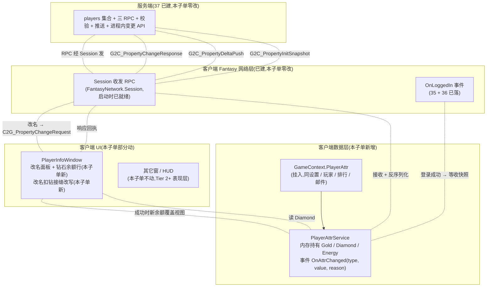

<style>
  pre.code { margin:8px 0; padding:12px; background:#0d1622; border:1px solid var(--border); border-radius:8px; overflow:auto; font-size:13px; line-height:1.55; }
  table.tight td, table.tight th { padding:6px 10px; }
  .pill-srv { display:inline-block; font-size:11px; padding:1px 7px; border-radius:10px; background:rgba(255,176,90,.18); color:#ffb05a; margin-left:6px; }
  .pill-cli { display:inline-block; font-size:11px; padding:1px 7px; border-radius:10px; background:rgba(108,140,255,.16); color:#6c8cff; margin-left:6px; }
  .pill-core{ display:inline-block; font-size:11px; padding:1px 7px; border-radius:10px; background:rgba(91,214,160,.16); color:#5bd6a0; margin-left:6px; }
  .pill-enh { display:inline-block; font-size:11px; padding:1px 7px; border-radius:10px; background:rgba(108,140,255,.16); color:#6c8cff; margin-left:6px; }
  .pill-cut { display:inline-block; font-size:11px; padding:1px 7px; border-radius:10px; background:rgba(255,122,138,.16); color:#ff7a8a; margin-left:6px; }
  .yes { color:#5bd6a0; font-weight:bold; }
  .no  { color:#ff7a8a; font-weight:bold; }
</style>

# 玩家属性客户端 · 钻石首次实装 + 接服务端(Tier 2 第 2 子单)

承接 37 服务端段已 PASS 的 Tier 2 玩家属性账本(MongoDB `players` 集合 + 三条 RPC + 服务端进程内变更 API),收口 Tier 2 真实玩家属性权威体系**客户端段**。本子单**首次为客户端建钻石(及金币/体力)的元层数据持有 + 接服务端推送 + 改名扣钻真接线**——这是 Tier 2 让钻石从「待实装占位」过渡到「服务端账本驱动」的客户端段。

> [!WARNING]
> **读前必看 · 简报基线与现状的差异(以现状为准)**
>
> 现状审计(grep + Read 核实)与本子单 boss 简报存在显著差异。**本设计以现状为基线,简报中与现状相左的描述按现状解读**:
>
> - **简报称「客户端 PlayerPrefs 持金币/钻石/体力作为元层属性」**——现状无:`PlayerInfo` 持 `Id / Name / Avatar / Frame / Exp / RenameCount / UnlockedAvatarIds / UnlockedFrameIds`(无三属性);`MergeMetaSave` DTO 字段集无三属性;`PlayerPrefs` 中无三属性 key(grep 全 HotFix 仅在 settings / mail / rank / player-info 等本职位置使用)。**结论**:本子单实质 = 「**钻石作为元层属性首次实装**(数据层 + 接服务端)」而非「数据源迁移」——无源可迁。
> - **简报称「PlayerNameGenerator.cs:152 钻石消费校验恒返 true 反作弊缺口」**——文件不存在该行:`PlayerNameGenerator.cs` 全文件 31 行,内容是名字生成器(前缀 `Player` + 6 个随机字符),**与钻石校验无关**。真正的钻石占位行在 [`PlayerInfoWindow.cs:152`](#38-player-attr-client::truth) `trySpendDiamond: cost => true`,且**不是反作弊缺口**——`PlayerRenameService.cs:48` 注释明示:「钻石 num_id=3 无可花费余额字段(item-system 遗留 #19),**生产默认实现返 true(去变现:不靠钻石卡改名),待钻石实装接真实扣减不返工**」;`ItemGrant.cs:85` 注释明示:「钻石(=3)数值系统**尚未实装专门字段**,本轮不落」;设计 18 §3.2 O8、设计 25 §七 O8 均显式声明。「占位」与「反作弊缺口」本质不同:缺口指**已有校验设计被绕过**,占位指**未实装等接入**。
> - **简报称「Player 模块持有方式」「打方块拿金币」「体力消耗等玩法消费路径」**——现状无:① 「Player 模块」(`GameLogic.BlockBlast.Player.PlayerInfo`)不持金币/钻石/体力;② 打方块无金币产出(`ClearSettlement` 产消除得分 / 元素 / 触发宝箱 / IngestElement,不产金币);③ 体力 = merge-order Demo 切片**局内态**(`BlockGameState.MergeState.Energy`,开局 Reset),不是跨会话元层余额;④ **现状唯一一个真实需要扣钻的玩法路径** = 改名(`PlayerInfoWindow.cs:152`)。
> - **简报称「数据源迁移 + 反作弊缺口关闭」二件事**——现状下两件事都不成立。本子单按现状重新切分为「**钻石首次实装 + 改名扣钻接服务端**」(核心档)+ 金币/体力数据层挂入(增强档,无玩法接入)+ 玩法接入(可砍档,留 Tier 2+ 业务玩法刀)。
> - **服务端段 37 已 PASS 的契约不动**:三条 RPC(属性快照下发 / `C2G_PropertyChangeRequest` / `G2C_PropertyDeltaPush`)+ 服务端进程内变更 API + 校验体系 + 反作弊红线(客户端绝对值禁报)全部沿用。本子单只接客户端段,不动协议契约。

> [!NOTE]
> **立项信息**
>
> | 项 | 内容 |
> | --- | --- |
> | **类型** | 全栈特性 · Tier 2 真实玩家属性权威体系第 2 子单(客户端段,收口)。承接 37 服务端段(地基);本子单提供客户端段「**首次实装** + 接服务端」的数据层、订阅推送、改名扣钻一个真接线点;不动服务端 / 不动协议契约 / 不动 Fantasy 仓。 |
> | **方向约束** | 离线还原 · **去变现**:钻石首次实装作虚拟货币的客户端账本视图,数据由服务端权威驱动;**不**含付费会员 / VIP / 充值绑定 / 内购入口;钻石增加由「未来活动 / 任务 / 邮件发放经服务端进程内变更 API」(本子单不接业务玩法路径)。加法式:新增 `PlayerAttrService` + `GameContext.PlayerAttr` 持有 + 改名扣钻接缝改写;`PlayerInfo` / `MergeMetaSave` / `PlayerPrefs` 零迁移(本就无三属性数据)。 |
> | **需求降层** | **a. 表层要求**(GDD Tier 2 + boss 简报):钻石(及金币/体力)由服务端账本驱动,改名扣钻经服务端校验流;客户端展示余额、订阅推送、不再持权威值。 **b. 底层目的**(为玩家 / 工程达成什么):**让钻石真值在客户端首次落地为可观测的元层属性**——未实装前 `cost => true` 等价「钻石不卡改名」,虽不影响诚实玩家体验但 ① 钻石的**所有产出 / 消费路径**(未来兑换码 / 邮件 / 商店等)都没有客户端可见落点;② 未实装意味着 Tier 2 服务端段 37 已建好但客户端**取不到余额**显示。本子单收口让 ① 改名扣钻这一个有 spec 的消费路径走通(端到端验证服务端段地基);② 钻石的客户端视图可被订阅,后续业务玩法刀只需接 `PropertyChangeRequest` 即可。 **c. 有无更直达 b 的做法**:b 的本质 = 「让钻石(及金币/体力)在客户端有数据层 + 一个真接线点端到端跑通」,本设计是最直达做法。**备选(已否)**:① 不接改名扣钻,只建数据层(增强档)→ 服务端段地基永远没有端到端验证,等后续业务玩法刀触发时再发现数据层 bug 成本更高;② 全套接入金币/体力玩法路径(可砍档)→ 金币无既有玩法消费/产出路径,体力是局内态非元层余额,接入需先建玩法(超本子单范围);③ HUD 全屏显示三属性(增强档)→ UI 表现层职责,需美术 + 设计 25/27 表现层换皮配套,本子单只让 PlayerInfoWindow 钻石余额在改名面板显示(支撑「钻石不足」分支验证)。 |
> | **范围(产品 · 玩法)** | **新增**:① `PlayerAttrService`(命名空间 `GameLogic.BlockBlast.Player`,纯逻辑 C# 类,内存持有钻石/金币/体力本地视图 + 订阅 `G2C_PropertyDeltaPush` + 收 `G2C_PropertyInitSnapshot`);② `GameContext.PlayerAttr` 挂入(同 36 设置 / 玩家 / 排行 / 邮件持有范式);③ 启动期接线(`GameApp.StartGameLogic` / `FantasyNetwork.OnLoggedIn`,使登录成功后 `PlayerAttrService` 准备收快照);④ `PlayerInfoWindow.cs:152` 改名扣钻 `trySpendDiamond` 由 `cost => true` 改为「发 `C2G_PropertyChangeRequest`(类型=钻石, delta=-cost, reason=`"player_rename"`)同步等响应,成功 → 返 `true`(改名继续);失败 → 返 `false`(改名拒绝)」;⑤ `PlayerInfoWindow` UI 钻石余额面板:在改名按钮旁显示当前钻石数(`PlayerAttrService.Diamond` 视图绑定),支持「钻石不足」分支可观测。 **不动**:`PlayerInfo`(玩家本地信息层,与服务端属性账本正交)、`MergeMetaSave`(本就无三属性字段)、`PlayerPrefs`(本就无三属性 key)、`PlayerNameGenerator`(与钻石无关)、`PlayerRenameService`(注入接缝保持,仅外部传入的 `trySpendDiamond` 实现换内核)、服务端 37 任何契约、`Assets/Fantasy/Scripts/*`(网络门面已具备 `Session` 字段,发 RPC 直接走 Session)。 **协议**:**零新增协议**(沿用 37 已建三条 RPC);客户端段仅消费协议。 **服务端零改**(本子单纯 client 段)。 |
> | **关键约束** | 客户端遵 TEngine 既有约定(UIWindow 生命周期 / GameContext 单例 / FindChildComponent / SetSubSprite / 异步用 UniTask,正本以 HotFix 为准);改名扣钻是**同步等待响应**(`async UniTask<bool>` + `OnRenameSubmit` 改 `async`,等 `C2G_PropertyChangeRequest` 返码后再决策是否改名,**非** fire-and-forget,避免「先成功后扣钻」错位);服务端响应携带新余额 → 客户端本地视图直接更新(免一次回查);服务端推送(`G2C_PropertyDeltaPush`)是真值刷新,客户端**永远以推送为准**覆盖本地视图(沿 37 §5.4 推送是绝对快照口径)。本篇不指字面字段名(沿 37 code-blind 范式),具体 RPC 字段由 dev 据 37 服务端段已落地的字段名取。 |

## 一、前后端职责切分(本子单视角) {#split}

| 环节 | 归属 | 说明 |
| --- | --- | --- |
| 持权威值(三属性余额) | **服务端**(37 已建) | `players` 集合,本子单不动 |
| 持本地视图(展示用) | **客户端 · 本子单新增** | `PlayerAttrService` 内存持有 + 订阅推送;**禁**写本地存档(本子单不让三属性入 `MergeMetaSave`,避免本地态与服务端账本两份漂移) |
| 首登创建初始记录 | **服务端**(37 已建) | 沿用 35 RegisterOrLogin 钩子 + 37 `setOnInsert` |
| 登录后接属性快照 | **客户端 · 本子单新增** | `PlayerAttrService` 监听 `G2C_PropertyInitSnapshot`,内存初始化三属性视图 |
| 发起属性变更声明 | **客户端 · 本子单新增** | 仅一个真接线点(改名扣钻);其它玩法路径留 Tier 2+ |
| 校验变更合法性 | **服务端**(37 已建) | 沿用 37 §3.4 校验体系(MongoDB FindOneAndUpdate 原子) |
| 接收响应 + 更新视图 | **客户端 · 本子单新增** | 收 `G2C_PropertyChangeResponse` 后:成功 → 用响应携带的新余额覆盖本地视图;失败 → 不动视图、按错码处理 |
| 接 `G2C_PropertyDeltaPush` | **客户端 · 本子单新增** | 推送来即覆盖本地视图(绝对值快照覆盖,不做相对推断) |
| 显示属性(HUD / 面板) | **客户端 · 本子单部分新增** | 本子单只在 `PlayerInfoWindow` 改名面板加钻石余额文本(支撑「钻石不足」可观测);Classic 主玩法 HUD 顶栏三属性接续 = [设计 42](#42-tarot-hud-player-attr-bind)(已收口) |
| 业务内部消费 / 增加(商店 / 兑换码 / 活动 / 邮件 / 任务 / 排行结算等) | **后续刀** | 各业务系统刀按其各自范围接 RPC / 服务端进程内变更 API;本子单不接 |
| ledger 历史流水 | **不做** <span class="pill-cut">Tier 2+</span> | 37 已明示本子单不含 |

> [!NOTE]
> **为什么本子单只做一个真接线点(改名扣钻),不一次性接金币/体力/全玩法?**
>
> 接线点的判据 = 「**该路径在工程上已有 spec、有现存调用方、且 spec 明示要扣资源**」。grep 工程:① 改名扣钻 = 唯一命中(`PlayerInfoWindow.cs:152` 占位、`PlayerRenameService.cs` 接缝、`RenameReject.NotEnoughDiamond` 分支齐全);② 金币 = 全工程无消费/产出路径(打方块产元素不产金币、宝箱产元素和体力不产金币、订单交付产元素/经验/虔诚不产金币);③ 体力 = `BlockGameState.MergeState.Energy` 是局内态,Reset 每局重置(非元层余额);若按服务端 37 范式把体力换成服务端账本,需先把局内态升级为「跨会话余额 + 局内消费」**二层模型**(超本子单范围,属玩法机制改动)。结论:**金币/体力的数据层挂入**(增强档)可做,但**接入实际玩法**(可砍档)在本子单内做不了。为让收口干净,本子单**核心档 = 数据层三属性持有 + 改名扣钻一个真接线点**,**增强档** = 金币/体力数据层一同挂入(同套服务接订阅,代码量边际增加 0),**可砍档** = 金币/体力玩法接入(留 Tier 2+ 业务玩法刀)。

## 二、现状证据(基线审计) {#truth}

简报与现状有差异处,逐项给证据:

| 简报描述 | 现状(grep / Read 核实) | 结论 |
| --- | --- | --- |
| 「客户端 PlayerPrefs 持金币/钻石/体力」 | `grep -rn PlayerPrefs HotFix/`:命中只在 settings(`ISettingsStore.cs`) / mail(`MailPersistence.cs`) / rank(`RankPersistence.cs`) / save-system(`Persistence.cs`)等本职位置,**无三属性 key** | **无源可迁** |
| 「Player 模块持金币/钻石/体力」 | `PlayerInfo.cs`(整 132 行)字段集 = `Id / Name / RenameCount / Exp / CurrentAvatarId / CurrentFrameId / UnlockedAvatarIds / UnlockedFrameIds`,无三属性 | **Player 模块本就不持** |
| 「PlayerNameGenerator.cs:152 钻石校验恒返 true 反作弊缺口」 | `PlayerNameGenerator.cs` 全文件 31 行,只是 `static class` 含 `Generate(System.Random rng)` 方法生成「Player+6字符」名字,**无 152 行、无钻石校验** | **行号 + 文件指错;且非校验函数** |
| 「钻石消费校验已实装但可被绕过」 | `PlayerRenameService.cs:48` 注释:「钻石 num_id=3 无可花费余额字段(item-system 遗留 #19),**生产默认实现返 true(去变现:不靠钻石卡改名),待钻石实装接真实扣减不返工**」;`ItemGrant.cs:85` 注释:「钻石(=3)数值系统**尚未实装专门字段**,本轮不落」 | **是「未实装占位」非「校验缺口」** |
| 「打方块拿金币」 | `ClearSettlement.cs` + `MergeOrderState.cs` 全文件:消除产消除得分(`Score`)/ 元素(`MergeElement`,经 `IngestElement`)/ 触发宝箱(`ChestSystem`)/ 触发盲盒补给,**无金币产出** | **此路径不存在** |
| 「体力消耗」 | `BlockGameState.cs:36-39` + `MergeOrderState.cs`:体力(`Energy`)是 `MergeOrderMode` 局内态,Reset 进入合成订单 Demo 时初始化、退出 / 重开重置 | **是局内态非元层余额** |

真实落点(本子单收口):

| 真实落点 | 位置 | 当前形态 | 本子单处置 |
| --- | --- | --- | --- |
| 改名扣钻占位 | `PlayerInfoWindow.cs:152` | `trySpendDiamond: cost => true` + TODO 注释 | **改写**:走 `C2G_PropertyChangeRequest`(类型=钻石, delta=-cost, reason=`"player_rename"`) |
| 钻石余额展示 | 无 | 现 PlayerInfoWindow 无钻石面板 | **新增**:改名面板加一行钻石余额(读 `PlayerAttrService.Diamond`),支撑「钻石不足」分支可观测 |
| 金币 / 体力客户端账本视图 | 无 | 完全无 | **新增**:`PlayerAttrService` 内存持有,初始 = `G2C_PropertyInitSnapshot` 携带,变化随 `G2C_PropertyDeltaPush`;无 UI 显示(增强档,玩法接入是可砍档) |

## 三、系统模型 {#model}

四方参与:服务端(37 已建,本子单消费)、客户端 RPC 入口、客户端数据层(本子单新增 `PlayerAttrService`)、客户端 UI(本子单只动 `PlayerInfoWindow` 改名扣钻 + 钻石余额面板)。



> [!NOTE]
> **为什么 `PlayerAttrService` 不挂进 `PlayerInfo`,而是独立挂入 `GameContext`?**
>
> 三个理由:① **职责正交**:`PlayerInfo`(设计 18)= 本地玩家信息(名字 / 头像 / 等级 / 经验等元层信息),`PlayerAttrService` = 服务端属性账本的客户端视图——前者是「玩法元层信息」,后者是「服务端账本镜像」;② **持久化口径不同**:`PlayerInfo` 落 `MergeMetaSave`(本地持久),`PlayerAttrService` **不持久化**(本地视图随会话起,重启从快照重新初始化,符合 37 「客户端不持权威值」红线);③ **既有范式同**:36 设计稿已展示 `GameContext` 持 `Settings / Player / Rank / Mail` 多服务的范式——本子单加 `PlayerAttr` 成员同口径,不投机性合并到 `Player` 引入两份状态。

## 四、`PlayerAttrService` 行为契约 {#service}

新增类 `PlayerAttrService`(命名空间 `GameLogic.BlockBlast.Player`,纯逻辑 C#,不依赖 UnityEngine),职责:

| 项 | 内容 |
| --- | --- |
| **构造** | `new PlayerAttrService()`,三属性视图默认 0(等收 `G2C_PropertyInitSnapshot` 覆盖) |
| **状态字段** | `Gold` / `Diamond` / `Energy`(int,只读对外,内部 setter)+ `IsReady`(bool,收到首次 `Snapshot` 后置 true) |
| **应用快照入口** | `ApplySnapshot(int gold, int diamond, int energy)`:覆盖三属性 + 置 `IsReady` = true + 触发 `OnAttrChanged`(type=All) |
| **应用推送入口** | `ApplyDeltaPush(AttrType type, int newBalance, string reason)`:按 type 覆盖对应字段 + 触发 `OnAttrChanged`(type, newBalance, reason) |
| **应用响应入口** | `ApplyChangeResponse(AttrType type, int newBalance, string reason)`:同 `ApplyDeltaPush`(避免响应到达早于推送时本地视图滞后) |
| **事件** | `event Action<AttrType, int, string> OnAttrChanged`:UI 订阅以刷新显示;PlayerInfoWindow 钻石面板订阅本事件 |
| **发起变更入口** | `UniTask<ChangeResult> TryChangeAsync(AttrType type, int delta, string reason)`:封装发 `C2G_PropertyChangeRequest` + 等响应,返结构化 `ChangeResult`(成功 / 余额不足 / 上界溢出 / 类型未知 / 服务暂不可用 / 未登录 / 网络断);**成功时**先 `ApplyChangeResponse` 再返结果(使调用方拿到新视图);**失败时**不动视图 |
| **AttrType 枚举** | `Gold / Diamond / Energy`(+ `All` 用于全量快照);与服务端三类映射 |
| **ChangeResult 结构** | `(bool Success, ChangeReject Reason, int NewBalance)`;`ChangeReject` 枚举 = `None / NotEnoughBalance / TypeUpperOverflow / TypeUnknown / ServiceUnavailable / NotLoggedIn / NetworkDown` |

**RPC 接线点**:`PlayerAttrService` 由启动期接线代码挂到 `FantasyNetwork` 的消息分发上(具体接法见 [§五](#38-player-attr-client::wiring))——本服务内**不直接引用** `Fantasy.*` 命名空间,保持纯逻辑可单测;`TryChangeAsync` 经构造期注入的 `IRpcGateway`(本子单声明的接缝,生产实现走 `FantasyNetwork.Session`,测试实现返桩响应)。

**`OnAttrChanged` 时机**:`ApplySnapshot`(type=All)+ 三个 Apply* 入口各自(type=对应类型);**不**在 `TryChangeAsync` 直接触发,以免与响应到达后的 `ApplyChangeResponse` 重复。

## 五、启动接线 {#wiring}

接线点定位(grep 工程现状):
- `GameApp.StartGameLogic`(热更入口,非热更区无法引用 `GameContext`,沿 23 设置接线落点口径)
- `FantasyNetwork.OnLoggedIn`(35 + 36 已落,登录成功后触发)
- `FantasyNetwork.Session`(35 + 36 已落,登录成功后非 null)

接线步骤(行为级,具体代码符号由 dev 取):

| 步骤 | 行为 | 落点 |
| --- | --- | --- |
| 1 | `GameApp.StartGameLogic` 内 `GameContext.Instance` 初始化时,创建 `PlayerAttrService` 实例(构造期注入 `IRpcGateway` 生产实现 = 经 `FantasyNetwork.Session` 发 RPC 的薄壳)+ 挂入 `GameContext.PlayerAttr` | `GameApp.cs` 启动序 + `GameContext.OnInit` 加一行 |
| 2 | 在 `FantasyNetwork` 内注册 `G2C_PropertyInitSnapshot` / `G2C_PropertyDeltaPush` 的消息分发处理,把消息转交 `GameContext.Instance.PlayerAttr.ApplySnapshot` / `.ApplyDeltaPush` | `Assets/Fantasy/Scripts/FantasyNetwork.cs`(本子单**仅在此文件加薄壳分发钩子**,业务逻辑全在 HotFix 内) |
| 3 | `PlayerAttrService.TryChangeAsync` 内经 `IRpcGateway` 调 `Session.Call<C2G_PropertyChangeRequest, G2C_PropertyChangeResponse>` 等响应,把响应转 `ChangeResult` | `PlayerAttrService` 内 + `IRpcGateway` 生产实现内 |

**简报「客户端业务代码零 diff」红线在本子单不适用**——37 §SV15 是「服务端段 + 协议生成物」红线,客户端段必然有业务代码 diff(数据层 + 接线 + UI 接钮)。本子单的 git diff 范围:
- `Assets/GameScripts/HotFix/GameLogic/GameContext.cs`(+1 字段 + `OnInit` 加 init 调用)
- `Assets/GameScripts/HotFix/GameLogic/Module/BlockBlast/Player/PlayerAttrService.cs`(新建)
- `Assets/GameScripts/HotFix/GameLogic/Module/BlockBlast/Player/IRpcGateway.cs`(新建,纯接缝)
- `Assets/GameScripts/HotFix/GameLogic/UI/PlayerInfoWindow.cs`(改名扣钻接缝改写 + 加钻石余额行)
- `Assets/Fantasy/Scripts/FantasyNetwork.cs`(加 2 处消息分发钩子;沿 35/36 既有的事件注册口径)
- `Assets/Fantasy/Scripts/RpcGatewayProd.cs`(新建,生产实现)
- `Assets/GameProto/*`(协议生成物可能更新,沿 30/31/32 范式,**业务代码不手改生成物**)

## 六、改名扣钻同步等待时序 {#flow}

```mermaid
sequenceDiagram
    participant U as 玩家
    participant W as PlayerInfoWindow
    participant R as PlayerRenameService
    participant S as PlayerAttrService
    participant N as Fantasy 网络层
    participant V as 服务端(37)
    U->>W: ① 编辑名字 + 按确定
    W->>R: ② TryRename(p, newName, words, trySpendDiamond)
    Note over R: 已校验非空 / 长度 / 屏蔽字 / 首次免费
    alt RenameCount == 0(首次免费)
        R-->>W: 直返 Ok(cost=0)<br/>不调 trySpendDiamond
        W->>W: 写名 + SavePlayer
        W-->>U: 改名成功
    else 非首次(cost = 100)
        R->>S: ③ trySpendDiamond(100)<br/>即 PlayerAttrService.TryChangeAsync(Diamond, -100, "player_rename")
        S->>N: ④ C2G_PropertyChangeRequest(钻石, -100, "player_rename")
        N->>V: ⑤ Session 转发
        V->>V: ⑥ MongoDB FindOneAndUpdate 原子写
        alt 服务端成功
            V-->>N: G2C_PropertyChangeResponse(成功, 新余额)
            N-->>S: 响应回执
            S->>S: ApplyChangeResponse(钻石, 新余额, "player_rename")
            S-->>R: ⑦ ChangeResult(true, None, 新余额)
            R-->>W: Ok(cost=100)
            W->>W: 写名 + SavePlayer
            W-->>U: 改名成功
            Note over S,V: 服务端推送 G2C_PropertyDeltaPush 异步到达<br/>本服务覆盖视图(等价幂等;Apply 实现按 type 直接 set,重入无副作用)
        else 服务端拒(余额不足 / 类型上界 / 服务暂不可用 / 未登录)
            V-->>N: G2C_PropertyChangeResponse(错码, 当前余额)
            N-->>S: 响应回执
            S->>S: ApplyChangeResponse(钻石, 当前余额, "player_rename_failed")<br/>(同步刷视图,即使是失败响应,余额可能本就因别处推送已变)
            S-->>R: ChangeResult(false, 对应 Reason, 当前余额)
            R-->>W: Rejected(NotEnoughDiamond / 等)<br/>(本子单复用 RenameReject 现有枚举,服务不可用 / 上界溢出按对应 reason 映射;细分见 §六对照表)
            W-->>U: 显示拒绝原因
        end
    end
```

> [!NOTE]
> **为什么同步等响应,不 fire-and-forget?**
>
> `PlayerRenameService.TryRename` 的设计语义是「**任一步不过即拒,后续不执行**」(`PlayerRenameService.cs:45` 注释)。若 `trySpendDiamond` fire-and-forget(发出 RPC 立即返 true),则:① 玩家会先看到改名成功,几百 ms 后再看到「钻石余额减了」或「钻石不足提示」(用户感知错位);② 服务端拒绝时,客户端已改名但服务端没扣钻,**两端状态不一致**;③ 改名落盘(`SavePlayer`)与扣钻成败解耦,出错难追溯。同步等响应是最简洁的端到端语义。**代价**:`OnRenameSubmit` 内 `await` 引入 `async` + 改名响应延迟 = 一次 RTT(几十 ms 起,本机服务端几 ms)——是可接受的体验代价。

> [!NOTE]
> **`RenameReject` 枚举如何容纳服务端新错码?**
>
> 现有枚举 = `None / Empty / TooLong / Profanity / NotEnoughDiamond`。本子单**不改枚举**(避免改设计 18 数据层契约,sweep 范围最小);服务端的「上界溢出 / 服务暂不可用 / 未登录」三类错码在改名场景下都映射到 `NotEnoughDiamond`(文案为「钻石不足或服务暂不可用」),具体细分错码经 `ChangeResult.Reason` 在 `PlayerInfoWindow.ShowRenameReject` 内再判:
>
> | 服务端 ChangeReject | 改名 UI 文案 |
> | --- | --- |
> | `NotEnoughBalance` | 「钻石不足」(同既有文案) |
> | `TypeUpperOverflow` | 「钻石余额异常,请稍后再试」(改名扣钻 delta 为负,理论不会触发,但兼容) |
> | `ServiceUnavailable` | 「网络异常,请稍后再试」 |
> | `NotLoggedIn` | 「请重新登录」 |
> | `NetworkDown` | 「网络断开,请检查连接」 |

## 七、整局走查与崩法 {#walk}

把本子单的所有机制在「**改名前快照未到 / 改名时网络断 / 改名同时余额被推送变更 / 钻石未刷新 UI / 服务端拒后客户端冒进 / RPC 异常断连**」六类场景下走一遍,每个机制点出最可能炸的那类 + 对策:

### 7.1 快照未到 / 服务还未 Ready

| 崩法 | 后果 | 对策 |
| --- | --- | --- |
| 玩家在 `PlayerAttrService.IsReady = false` 时点改名 + 钻石余额面板显示 0(默认初值) | UI 显示「钻石 0」误导玩家;改名扣钻直接走服务端拒 | `PlayerInfoWindow` 在 `OnRefresh` / `OnCreate` 内检查 `IsReady`:false → 钻石面板显示「加载中...」+ 改名扣钻按钮 disabled;true → 显示真实余额 + 按钮 enabled;`PlayerAttrService.OnAttrChanged` 订阅时再切回 enabled(纯 UI 状态机) |
| 玩家在登录 → 主菜单 → 个人信息窗这段时间(几百 ms 内)点改名,服务端 Snapshot 还在路上 | 同上 | 同上 |
| 服务端永远不下发 Snapshot(协议 bug / 服务端崩) | 改名永远 disabled、钻石面板一直「加载中...」| 验收 E2 真往返核 Snapshot 必下发;dev 加合理超时(本子单不强求重试机制,沿 37 §5.7 推送丢失下次登录对齐口径) |

### 7.2 改名时网络断

| 崩法 | 后果 | 对策 |
| --- | --- | --- |
| 改名按下 → 发 RPC → 网络断 → 响应永不到达 → `await` 永久挂起 | 改名 UI 卡住,玩家无反馈 | `PlayerAttrService.TryChangeAsync` 内加超时(默认 10s,可配),超时返 `ChangeResult(false, NetworkDown, 0)`;`PlayerInfoWindow` 收到 NetworkDown 显示「网络断开」+ 回到只读态(不写名);**不假装成功** |
| RPC 发到一半 Session 关闭(`FantasyNetwork.OnDisconnected`)| 同上 | `PlayerAttrService` 订阅 `OnDisconnected` 事件,触发时把所有 pending `TryChangeAsync` 一并以 `NetworkDown` 结束 |

### 7.3 改名同时余额被推送变更(异步)

| 崩法 | 后果 | 对策 |
| --- | --- | --- |
| 玩家点改名(发 -100 RPC)的几乎同时,别处(后台活动 / 另一会话)给该 UUID 推送了 +500 → 推送先到、改名响应后到 | 推送把余额从 X 推到 X+500;改名响应说「扣后 X+500-100 = X+400」;**两条覆盖语义都对,绝对值快照覆盖即可** | `PlayerAttrService.ApplyDeltaPush` 和 `ApplyChangeResponse` 都用「按 type set 新余额」,顺序无关——最后到的为准,与服务端实际一致(沿 37 §5.4 推送顺序不保证,但每条新余额都是 MongoDB 当时实际值) |
| 改名响应先到(扣完 X-100),推送后到(+500 后到 X-100+500 = X+400)| 同上 | 同上 |
| 改名响应 + 推送都迟到很久,玩家在等期间已离开 PlayerInfoWindow | `PlayerAttrService` 仍持有最新视图;下次进窗刷新即可 | UI 订阅 `OnAttrChanged`,不在窗口生命周期外做副作用 |

### 7.4 钻石未刷新 UI / 视图与服务端不一致

| 崩法 | 后果 | 对策 |
| --- | --- | --- |
| `PlayerInfoWindow` 钻石面板订阅 `OnAttrChanged` 但 UI 端没 invoke 主线程 | 异步事件直接改 Unity UI 致异常 | `PlayerAttrService` 是纯逻辑类、不依赖 UnityEngine;`FantasyNetwork` 已是主线程 Scene(沿 35/36 范式),RPC 回调本在主线程;`OnAttrChanged` 在主线程触发即可 |
| `OnAttrChanged` 订阅未解绑致 Window 销毁后 GC root | 内存泄漏 | `PlayerInfoWindow.OnDestroy`(或同口径 OnClose)解绑事件;沿 TEngine UIWindow 生命周期 |
| 钻石余额面板 + 改名按钮分开订阅,事件来时一刷一不刷 | 视图分裂 | 单一订阅 → 一次 `Refresh()` 同时刷面板 + 按钮 enabled |

### 7.5 服务端拒后客户端冒进

| 崩法 | 后果 | 对策 |
| --- | --- | --- |
| `trySpendDiamond` 返 false 但 `OnRenameSubmit` 未读返值就写名 | 服务端没扣钻,客户端却改了名,两端状态不一致 | `PlayerRenameService.TryRename` 现有逻辑(§3 ③):`!spent → return Rejected(NotEnoughDiamond)`;严格不写名(无需改);本子单只换 `trySpendDiamond` 内核,接缝语义保 |
| 服务端响应解析失败(协议改了但客户端没同步)| 视为 `ChangeResult(false, ServiceUnavailable, 0)` | `IRpcGateway` 内 try/catch + 转 ServiceUnavailable;沿 36 范式 |

### 7.6 RPC 异常断连(`G2C_PropertyDeltaPush` 推送侧)

| 崩法 | 后果 | 对策 |
| --- | --- | --- |
| 推送消息分发钩子注册失败 / 消息名拼错(`PostInit` 时机不对)| 服务端推了客户端没收 | 启动接线在 `GameApp.StartGameLogic` 一次性挂(early init);验收 E2 真往返核「改一次余额收到一次推送」 |
| `PlayerAttrService.IsReady` 为 true 但 `ApplyDeltaPush` 传 type 越界 | 异常 | switch + default 吞掉记 Log;不影响其它 type |

### 7.7 诚实边界(本子单守住什么、不守什么)

本子单**守住**:
- 客户端三属性数据层首次落地(`PlayerAttrService`)+ `GameContext.PlayerAttr` 挂入
- 钻石余额在 `PlayerInfoWindow` 改名面板可见(支撑「钻石不足」可观测)
- 改名扣钻一个真接线点端到端经服务端校验(等价 Tier 2 服务端段 37 的端到端验证)
- 服务端拒(余额不足 / 服务暂不可用)时客户端不冒进(改名不发生)
- 启动期接线干净(`FantasyNetwork` 消息分发钩子 + `OnLoggedIn` + `GameContext` 持有)
- 服务端契约不破(零新增 RPC、零改 37 已落地的字段名 / 错码)

本子单**不守**:
- **金币 / 体力玩法路径接入**(无既有玩法消费/产出,留 Tier 2+ 业务玩法刀;数据层视图本子单挂入,但无 UI / 无消费/产出调用方)
- **HUD 全屏显示三属性余额** —— 本子单不守,但 Classic 主玩法 HUD 顶栏三属性接续 = [设计 42](#42-tarot-hud-player-attr-bind)(已收口,沿 `PlayerInfoWindow` 钻石面板订阅范式扩到 `GameWindow.BuildTopBar` 三资源条)
- **本地视图与服务端的强一致性**(沿 37 §5.4 推送丢失 / 顺序乱序 = 下次登录拉快照对齐;本子单不加客户端去抖 / 不定期主动 GetSnapshot 校准)
- **离线变更 / 队列重发**(网络断 = 改名拒绝,沿 30 兑换码不本地放行口径,关闭超发面)
- **`PlayerNameGenerator` 本身**(文件仅含名字生成,与属性无关;简报误指,本子单不动)
- **`PlayerInfo` / `MergeMetaSave` 加三属性字段**(本子单红线:三属性不入本地存档,避免本地态与服务端账本两份漂移)
- **`PlayerPrefs` 三属性 key 退役**(本就无此 key,自然解决)

## 八、与既有稿关系 {#related}

| 既有稿 | 关系 | 本子单是否改写 |
| --- | --- | --- |
| [14 跨会话存档](#14-save-system) | 本子单**不**让三属性入 `MergeMetaSave`;14 现有 9 字段零改;本地视图随会话起,服务端账本是单一权威 | **不改** |
| [16 道具底层系统](#16-item-system) | `ItemGrant.cs:85` 注释「钻石(=3)未实装专门字段,本轮不落,返 false」——本子单后,钻石**作为元层属性账本**已实装(在服务端 + 客户端 PlayerAttrService);但 ItemGrant 是道具使用效果落点,改它需让 `ItemUseEffect.Numeric` 类型在 num_id=3(Diamond) 时调 `PlayerAttrService.TryChangeAsync` —— 这属于「道具使用效果接服务端」 = Tier 2+ 业务玩法刀,**本子单不接** | **不改**(声明前瞻:Tier 2+ 接道具使用效果调 PlayerAttrService) |
| [18 玩家信息系统](#18-player-info) | §3.2 + §3.4 O8 显式声明「扣钻接缝外置,生产返 true,待钻石实装接真实扣减不返工」;本子单按此声明落地——**接缝不动,内核换为调服务端**。`RenameReject` 枚举不动 | **不改**(本子单按 18 §3.4 O8 的「不返工」承诺接入) |
| [19 设置系统](#19-settings-system) | 正交 | **不改** |
| [25 个人信息窗换皮](#25-player-info-window-art) | §七 O8 「扣钻接缝默认 true(去变现,设计 18 O8)」——本子单后,`trySpendDiamond` 不再默认 true 而是调服务端 | **同步**:25 §七 O8 + §3.2 改名描述 + §九 H1 改名验收的「扣钻 cost => true」表述需更新为「调服务端校验流」,沿 conventions §6 覆盖式重写(被本子单过时) |
| [30/31/32/33 服务端化全栈批次](#30-redeem-code-server) | 本子单完全正交 | **不改** |
| [35 账号服务端 + 36 账号客户端](#35-account-server) | 本子单沿用 35 / 36 已落的 account = UUID + `FantasyNetwork.OnLoggedIn`;本子单依赖 36 的 `Boot` 完成后会话已挂账号身份 | **不改**(本子单是 36 客户端段的「玩家属性段并列」收口,不动 36) |
| [37 玩家属性服务端](#37-player-attr-server) | 本子单是 37 的**客户端段**收口;37 三 RPC + 校验体系 + 反作弊红线沿用 | **不改**(37 §6.2 已声明客户端段下一刀 = 本子单) |

**同步落点(本子单触发的他篇覆盖式重写,在同一任务内完成)**:

| 他篇 | 触发原因 | 处置 |
| --- | --- | --- |
| 设计 25 §七 O8 + §3.2 + §九 H1 | 本子单让「扣钻 cost => true」过时 | conventions §6 覆盖式重写:把「默认 true(去变现)」改写为「调 PlayerAttrService.TryChangeAsync 接服务端校验,失败按 ChangeResult.Reason 映射 RenameReject」,删除「待钻石实装接真实扣减」TODO 注 |
| 设计 18 §3.2 + §3.4 O8 | 本子单兑现 O8「待钻石实装接真实扣减不返工」承诺 | conventions §6 覆盖式重写:把「O8 待钻石实装」改写为「O8 已兑现:扣钻经 PlayerAttrService 调服务端,接缝(`trySpendDiamond` 注入)不变」,标 O8 已 close |

**不触发同步的**:14 / 16 / 19 / 30 / 31 / 32 / 33 / 35 / 36 / 37 全部零改写。

## 九、验收点 {#accept}

### 9.1 客户端单测(EditMode,CV)

`PlayerAttrService` 是纯逻辑类,可直接 EditMode 测;`PlayerInfoWindow` UI 部分需 Play 验。

| # | 验收点 | 完成定义(行为可观测) |
| --- | --- | --- |
| CV1 | `PlayerAttrService.ApplySnapshot` | 初始 `IsReady = false`,三属性 = 0;`ApplySnapshot(100, 200, 5)` 后 `IsReady = true`,`Gold = 100 / Diamond = 200 / Energy = 5`;`OnAttrChanged` 触发一次(type=All) |
| CV2 | `PlayerAttrService.ApplyDeltaPush` | `ApplyDeltaPush(Diamond, 150, "test")` 后 `Diamond = 150`;`OnAttrChanged` 触发一次(type=Diamond, value=150, reason="test");其它字段不变 |
| CV3 | `PlayerAttrService.ApplyChangeResponse` | 同 CV2;反复调用(模拟响应与推送都到)结果幂等 |
| CV4 | `PlayerAttrService.TryChangeAsync` 成功 | 注入桩 `IRpcGateway` 返 `(成功, 50, "spend")`,调 `TryChangeAsync(Diamond, -50, "spend")` 返 `ChangeResult(true, None, 50)`;`Diamond` 字段 = 50;`OnAttrChanged` 触发一次 |
| CV5 | `PlayerAttrService.TryChangeAsync` 失败 - 余额不足 | 注入桩返 `(余额不足, 30)`,调 `TryChangeAsync(Diamond, -100, "spend")` 返 `ChangeResult(false, NotEnoughBalance, 30)`;视图刷为 30;`OnAttrChanged` 触发 |
| CV6 | `PlayerAttrService.TryChangeAsync` 失败 - 服务不可用 | 注入桩抛异常或返服务不可用,调 `TryChangeAsync` 返 `ChangeResult(false, ServiceUnavailable, 0)`;视图**不变** |
| CV7 | `PlayerAttrService.TryChangeAsync` 失败 - 网络断超时 | 注入桩永不返,超时(默认 10s)返 `ChangeResult(false, NetworkDown, 0)` |
| CV8 | `GameContext.PlayerAttr` 持有 | `GameContext.Instance.PlayerAttr != null`(在 `GameContext.OnInit` 或测试注入入口后) |
| CV9 | `GameContext.InitPlayerAttrWith(...)` 测试注入入口 | 同 `InitSettingsWithStore` 范式:让单测灌入桩 `IRpcGateway`,不污染真实网络;`PlayerInfoWindow` 测试经此注入 |

### 9.2 PlayerInfoWindow 单测(EditMode 可达部分,W)

| # | 验收点 | 完成定义 |
| --- | --- | --- |
| W1 | 钻石余额面板订阅 | `PlayerAttrService` 触发 `OnAttrChanged(Diamond, X, _)` 后,面板显示「X」(由测试用 sandbox `PlayerInfoWindow` 或直接验 UI 文本绑定逻辑) |
| W2 | `IsReady = false` 时禁改名 | 面板显示「加载中...」+ 改名按钮 disabled;`IsReady` 切 true 后 enabled |
| W3 | `OnRenameSubmit` 经 `PlayerAttrService.TryChangeAsync` 路径 | 灌入桩 `IRpcGateway` 返 `(成功, 100, "player_rename")`,改名提交 → 写名 + `SavePlayer`(经 mock `MergeMetaPersistence`)成功;UI 切回只读态 |
| W4 | `OnRenameSubmit` 服务端拒 - 余额不足 | 灌入桩返 `(余额不足, 30)`,改名提交 → 不写名;UI 显示「钻石不足」 |
| W5 | `OnRenameSubmit` 服务端拒 - 服务暂不可用 | 灌入桩返 `(服务暂不可用, 0)`,改名提交 → 不写名;UI 显示「网络异常,请稍后再试」 |
| W6 | 首次改名免费(不走 RPC) | `RenameCount = 0` + 改名 → `PlayerAttrService.TryChangeAsync` **不被调用**(桩 `IRpcGateway` 记录调用次数 = 0);改名成功 |

### 9.3 真往返(PlayMode + Fantasy 服务端,E)

依赖本机 MongoDB + Fantasy 服务端起服;不可达 → BLOCKED 非 FAIL(同 35/36/37 口径)。

| # | 验收点 | 完成定义 |
| --- | --- | --- |
| E1 | 启动 → 登录 → 收快照 → PlayerAttrService.IsReady | Unity 客户端 Play 起、Fantasy 服务端起、MongoDB 起 → 自动登录成功后 5s 内 `GameContext.Instance.PlayerAttr.IsReady = true` + 三属性 = 服务端配置初始值(默认 金币 0 / 钻石 0 / 体力 5) |
| E2 | 改名扣钻真往返(钻石余额充足) | 手测:① 进 PlayerInfoWindow → 见钻石余额面板;② 用 server 工具或 33 排行结算路径调 `服务端进程内 ChangeProperty(UUID, 钻石, +500, "test_grant")` 让钻石 = 500;③ 客户端立刻收 `G2C_PropertyDeltaPush` → UI 钻石面板刷新为 500;④ 改名 → `C2G_PropertyChangeRequest`(钻石, -100, "player_rename") → 服务端 200(扣后)= MongoDB `players` 该 UUID 钻石 = 400 + 改名成功 + UI 钻石面板刷新为 400 |
| E3 | 改名扣钻真往返(钻石余额不足) | 钻石 = 50 + 第二次改名(`RenameCount > 0`)→ `C2G_PropertyChangeRequest`(钻石, -100, "player_rename") → 服务端拒「余额不足 + 当前 50」→ 客户端 UI「钻石不足」+ 改名未发生 + MongoDB `players` 钻石仍 = 50 |

### 9.4 BLOCKED 边界 + 不在本子单验收

- **本机 MongoDB 不可达 / Fantasy 服务端起不来** → E1 / E2 / E3 判 BLOCKED 非 FAIL
- **金币 / 体力玩法路径** → Tier 2+ 业务玩法刀
- **HUD 全屏显示三属性** → 已接续 = [设计 42](#42-tarot-hud-player-attr-bind)(Classic 主玩法 HUD `GameWindow` 顶栏三资源条接 `PlayerAttrService`)
- **客户端去抖 / 主动 GetSnapshot 校准** → Tier 3 强一致需求时加
- **`PlayerNameGenerator` 改动**(简报误指,本子单不动)

### 9.5 Code Review(SV)

| # | 验收点 | 核什么 |
| --- | --- | --- |
| SV1 | 编译 + 协议生成物 | dotnet / Unity 编译 0 error;`Assets/GameProto/*` 生成物若有更新沿 30/31/32/35/37 范式不手改 |
| SV2 | `PlayerAttrService` 不依赖 UnityEngine | grep `using UnityEngine` = 不命中;可在纯 C# EditMode 测 |
| SV3 | 客户端绝对值禁报 | `PlayerAttrService.TryChangeAsync` 请求负载**仅含**类型 + delta + reason 三字段;**不**传当前余额(沿 37 反作弊红线) |
| SV4 | 三属性不入本地存档 | grep `MergeMetaSave` / `PlayerPrefs`:无三属性 key / 字段加入(避免两份漂移) |
| SV5 | 同步等响应 | `OnRenameSubmit` 是 `async`,`TryRename` 内 `trySpendDiamond` 经 `await ...GetAwaiter().GetResult()` 不出现(纯异步,UI 上下文等)|
| SV6 | 视图覆盖语义 | `ApplyDeltaPush` / `ApplyChangeResponse` 按 type set,**不**做「旧值 + delta」相对推断(沿 37 推送是绝对快照) |
| SV7 | 启动接线时机 | `FantasyNetwork` 消息分发钩子在 `GameApp.StartGameLogic` 早期挂(登录前),保 Snapshot 不丢 |
| SV8 | RenameReject 枚举不动 | grep `RenameReject` 定义:仍 `None / Empty / TooLong / Profanity / NotEnoughDiamond` 五项,服务端新错码经 `PlayerInfoWindow.ShowRenameReject` 内分支映射 |
| SV9 | 设计 25 / 18 同步落地 | grep 25 §七 O8 + §3.2 + §九 H1 + 18 §3.2 + §3.4 O8:全部已重写为「调 PlayerAttrService 接服务端」 |

## 十、待拍板清单 {#open}

| # | 开关 | 本设计默认 | 备选 / 触发改动 |
| --- | --- | --- | --- |
| O1 | 金币 / 体力数据层挂入(增强档) | **挂入**(`PlayerAttrService` 同步持三属性,代码量边际增加 0;无 UI 接入) | 不挂(只持 Diamond)→ 后续 Tier 2+ 业务玩法刀再加,本子单代码改一行,无实质区别。**默认挂入**,使后续业务玩法刀的接入面最小 |
| O2 | 钻石余额 UI 显示位置 | **PlayerInfoWindow 改名面板** | 全屏 HUD(需美术 + 设计 25/27 表现层,超本子单);备选不取 |
| O3 | `TryChangeAsync` 超时秒数 | **10s** | 5s / 30s;Tier 2+ 据玩家体验调 |
| O4 | 改名扣钻 reason 字符串 | **`"player_rename"`** | 加 reason 子分类(如带改名次数)→ Tier 2+ ledger 落地刀按需 |
| O5 | `IsReady = false` 时改名按钮态 | **disabled + 「加载中...」文案** | 按钮可点 + 点时提示「请稍后...」(UX 取舍,本子单取前者更清晰)|
| O6 | `RenameReject` 枚举扩展 | **不扩展**(SV8,5 项保持) | 加 `ServiceUnavailable` 等新项 → 改设计 18 数据层契约,扩散面大;不取 |
| O7 | 启动接线落点 | **`GameApp.StartGameLogic`** | `FantasyNetwork.Boot` 内 / `GameContext.OnInit` 内;沿 36 范式取 `GameApp` |

## 十一、风险表 {#risk}

| 风险 | 应对 |
| --- | --- |
| **简报基线错** | 已逐项列证据(§读前必看 + §二);本设计以现状为基线,boss 复核时核对此节;若 boss 拍板「按简报原范围(数据源迁移 + 反作弊缺口关闭)」打回——结论会与现状不可调和,工程上不可能做(无源可迁 / 无缺口可关闭) |
| **`PlayerAttrService` 在登录前被 UI 触发** | `IsReady = false` 时改名按钮 disabled;dev 实现时严格(SV6);test E1 验「登录后 5s 内 IsReady = true」防回归 |
| **改名扣钻同步等响应致 UI 卡顿** | RTT 几十 ms;`UniTask` 不阻塞主线程;超时 10s 兜底;若 boss 觉得体验差,O3 可改;但不取 fire-and-forget(§六论证) |
| **服务端推送丢失 / 顺序乱序** | 沿 37 §5.4 推送是绝对快照,客户端按 type set;真值最终一致(下次推送 / 下次登录拉快照);本子单不加客户端去抖 / 不主动 GetSnapshot 校准 |
| **设计 25 / 18 同步漏改** | SV9 grep 验;本任务交接区列改写清单,test 必核 |
| **金币 / 体力玩法路径误以为本子单接入** | §读前必看 + §一切分表 + §诚实边界 三处明示「本子单不接」;dev 拒绝越界改动 |
| **测试注入桩与生产 `FantasyNetwork.Session` 行为分裂** | `IRpcGateway` 接缝集中,生产实现是薄壳(`Session.Call<C2G, G2C>` 直转 `ChangeResult`);桩与生产差异 = 接缝两侧的 mock,行为一致;CV9 验测试入口存在 |
| **协议字段名 dev 取错(37 已落地的字段名 vs 简报口径)** | dev 以 37 服务端段已 PASS 的字段名为准 grep 取(无需重设计);若发现与 37 设计稿字段名不符 → 优先信代码(代码是 dev 单一事实源)|
| **`FantasyNetwork.cs` 加消息分发钩子破 35/36 既有钩子** | 沿 35/36 既有 OnLoggedIn 范式加(增量,无重写);test 验 35 / 36 / 37 验收点全部仍 PASS |

## 关联文档

- [14 · 跨会话存档(本子单不让三属性入 MergeMetaSave,正交)](#14-save-system)
- [16 · 道具底层系统(钻石作为道具使用效果落点接 PlayerAttrService 是 Tier 2+ 业务玩法刀)](#16-item-system)
- [18 · 玩家信息系统(本子单兑现 §3.4 O8 「待钻石实装」承诺,同步重写该节)](#18-player-info)
- [25 · 个人信息窗换皮(本子单触发 §七 O8 + §3.2 + §九 H1 同步重写)](#25-player-info-window-art)
- [35 · 账号服务端 + 36 · 账号客户端(本子单沿用其 account = UUID + OnLoggedIn 链路)](#35-account-server)
- [37 · 玩家属性服务端(本子单的基础;沿用三 RPC + 校验 + 推送)](#37-player-attr-server)
