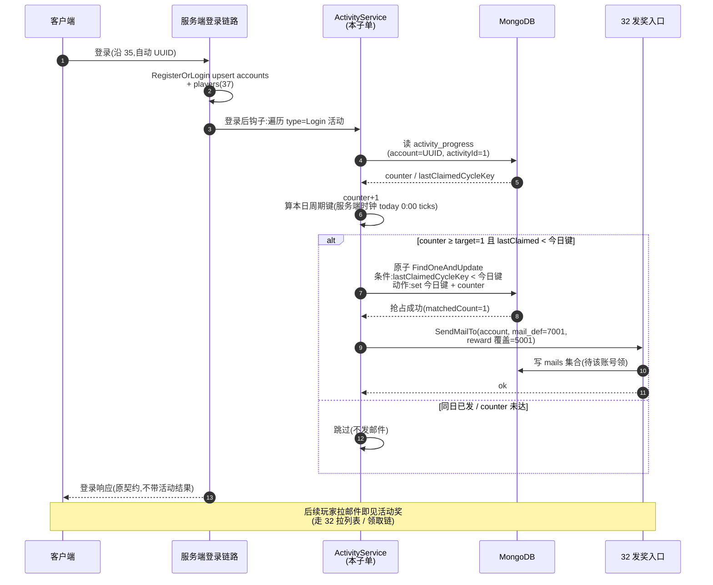

# 活动系统服务端地基 · 基础架构 + 每日登录跑通(Tier 4 第 1 子单)

把 Tier 4 活动系统的**配置 / 达标节律 / 发奖入口**三层基础架构在服务端建起来,并用 1 个最简活动实例(**每日登录奖**)端到端跑通验证。9 套活动的其它 8 套(签到 / 分享 / 邀请 / 累计登录 / 累计游戏 / 累计消费 / 累计获得 / 累计交付 / 限时回归——具体清单由后续刀确认)留**后续逐套刀**,每套只是在本架构上加 1 行 `activity.xlsx` 配置 + 1 个达标计数器,**无需再动地基**。

本篇兑现两件事:① 让活动系统有**统一基础架构**(配置存哪 / 进度存哪 / 发奖走哪),避免每套活动各自实现一遍重复代码;② 让 [设计 18 头像 EVENT 解锁](#18-player-info) 的 `AvatarUnlockService.GrantUnlock` 接缝(本子单调查发现已设计好,等待活动系统接入)有未来对接路径(本子单不接,留 Tier 4 第 2 子单)。

> [!WARNING]
> **读前必看 · 五条边界**
>
> - **本子单是「架构 + 1 个实例」,不是「9 套活动全做」。**架构层(配置表 / 进度集合 / 达标节律 / 发奖入口)是 9 套活动公用的地基,做一次受用;每套具体活动只是在 `activity.xlsx` 加一行 + 服务端按 `type` 字段选预设计数器。本子单交付**地基 + 每日登录奖**(架构跑通验证),其余 8 套留后续刀(每套刀的工作量 = 加配置 + 1 个事件钩子)。
> - **活动是「服务端权威」类系统,与排行榜结算同范式。**「这账号本周期是否达标 / 是否已发」由服务端裁定,客户端**不**自报达标。本子单沿用 [设计 33 §3.3](#33-rank-settle-server::idem) 的「周期幂等键 + 判未发 + 写已发原子」、[设计 32 §3.5](#32-mail-server::source-api) 的「服务端进程内发奖入口」、[设计 37 §3.5](#37-player-attr-server::internal-api) 的「服务端进程内变更 API」三套已建范式,**不另造**。
> - **客户端工程零 diff,本子单纯 server only。**本子单不动 `Assets/`;若 9 套活动需客户端 UI 展示(活动入口 / 活动详情 / 进度条等),交客户端段后续刀。每日登录奖的可观测验证 = 玩家登录 → 邮箱里多一封活动结算邮件(走既有 32 拉邮件 + 领奖链路,客户端表现层零改),无需新 UI。
> - **「头像 EVENT 解锁」本子单不接,留 Tier 4 第 2 子单。**`AvatarUnlockService.GrantUnlock` 是客户端进程内 API,服务端发放头像解锁需走「服务端发邮件挂礼包 → 客户端领奖时礼包效果包含『解锁头像 N』 → 客户端 ItemUse 调 GrantUnlock」通路。礼包→头像解锁通路属设计 16 道具系统的扩展(`UseEffect` 加「解锁头像」效果),不在本子单范围。本子单只把活动→发邮件这一段通,头像解锁是「邮件领奖落地」的下游能力。
> - **9 套活动具体清单本子单不锁死,留 boss / 产品定。**简报提及「9 套活动」但未列清单,本子单按通用类型(`type` 字段:登录 / 累计 / 周期 / 时段)定架构使任何类型可接入,具体 9 套是哪 9 套由后续刀逐套定 `activity.xlsx` 行 + 选择 `type`。

> [!NOTE]
> **立项信息** {#intro}
>
> | 项 | 内容 |
> | --- | --- |
> | **类型** | 全栈特性 · Tier 4 活动系统第 1 子单(地基 + 1 实例)。出 code-free 设计意图 + 行为级达标契约 + 行为级验收,交服务端段(集合 + 配置表 + 达标节律 + 发奖入口接通)落地;客户端工程零 diff。 |
> | **方向约束** | 离线还原 · **去变现**:活动奖来自 `activity.xlsx` 配置的礼包随机库 id(同 30/31/32/33 路径),**不**含付费活动 / 充值返利 / VIP 任务——活动是「玩家行为(登录 / 签到 / 累计成就)→ 服务端给奖」的运营手段,不是付费入口。加法式:服务端是已引入的权威端([设计 30](#30-redeem-code-server) 起),本特性新增活动配置 + 达标计数 + 发奖编排;复用 [设计 32](#32-mail-server) 发奖入口 + [设计 37](#37-player-attr-server) 变更 API + [设计 16](#16-item-system) 礼包库 + [设计 21](#21-mail-system) 邮件模板。客户端既有发奖落点(16)/ 持久化(14)零改动。 |
> | **需求降层** | **a. 表层要求**(简报字面):Tier 4 活动系统第 1 子单 = 活动基础架构 + 每日登录奖跑通;9 套活动其它 8 套留后续。活动配置表存哪 / 达标节律怎么走 / 发奖走哪三件事在本子单定型。 **b. 底层目的**(为玩家 / 运营达成什么):让运营能用统一框架运营 9 套活动而无需为每套活动写新代码,降低活动上下线成本;让玩家「登录 / 签到 / 累计成就」类行为有真实跨设备权威进度(本机刷计数对服务端不算数)+ 防重发(同周期一份奖),这是离线方案做不到的(本地存档可改、跨设备无同步)。 **c. 有无更直达 b 的做法**:b 的本质 = 「活动配置 + 进度 + 发奖三层各有一套服务端权威 + 可扩展到 9 套」,直达做法 = Luban 表(配置)+ MongoDB 集合(进度)+ 复用 32 发奖入口(发奖)。备选(已否):① 把 9 套活动都写死成单独表 / 单独集合 → 重复实现 9 遍,扩展性差;② 把活动放客户端(沿设计 22 §3.4.2 离线方案)→ 跨设备同步 + 防重发都做不到,这正是把 22 §3.4 留客户端、本特性新做服务端版的原因;③ 不做地基直接做每日登录奖一套 → 其它 8 套各自从头写,违简报「地基 + 1 实例」要求。无更优解,按表层「地基 + 每日登录奖」实现。 |
> | **范围(产品 · 玩法)** | **服务端新增**:① `activity.xlsx` 配置表(同 22/32 同源导出 c+s,字段见 [§3.1](#39-activity-server::config));② MongoDB `activity_progress` 集合(每账号每活动一条进度,字段见 [§3.2](#39-activity-server::storage));③ 达标节律接缝(本子单只接「登录触发」一种,其余两种 [§3.5](#39-activity-server::trigger) 留 O3);④ 发奖编排(达标 → 按 `activity.reward` 经 [设计 32 §3.5](#32-mail-server::source-api) 投活动结算邮件 + 写已发周期键,原子幂等,沿 [设计 33 §3.3](#33-rank-settle-server::idem));⑤ 每日登录奖活动实例(`activity_id=1, type=login, cycle=daily, target=1, reward=礼包库 id, mail_def=邮件模板 id`)端到端跑通。 **服务端不动**:30/31/32/33/35/37 既有业务集合 schema、客户端工程任何代码。 **协议**:**本子单无新增客户端协议**(达标是服务端内部触发,沿 33 模式)。 **客户端零改**(Unity 工程)。 |
> | **关键约束** | 服务端遵 Fantasy.Net 既有约定(处理逻辑 / MongoDB 存储 / 错误码非异常 / 不手改生成物 / 不手动注册,正本以服务端工程 fantasy-net 为准,本稿不写代码符号);裁决以**结果不抛异常**回包;沿 30/31/32/33/35/37 已确立的「身份从会话取」「MongoDB 持久」「检查 + 写入原子单条命令」「服务端时钟」基线。本篇正文为 code-free 设计意图,不含协议消息名 / 字段代码名 / 类名 / 文件路径 / 接缝清单——服务端段据行为语义定 schema 字段名与处理逻辑挂钩点。 |

## 二、现状审计(给定基线证据) {#audit}

简报中 4 处描述与代码现状对照核实,记为本子单设计基线:

| 简报描述 | 现状证据 | 本子单据此处置 |
| --- | --- | --- |
| 「AvatarUnlockService.cs 钩子恒返未解锁」 | `Assets/GameScripts/HotFix/GameLogic/Module/BlockBlast/Player/AvatarUnlockService.cs` 全文件 94 行 — `IsUnlocked` 返「集合已含 OR 等级达标」,EVENT 类型仅当 `GrantUnlock(p, e)` 已被调用过(把 id 写进 `PlayerInfo.UnlockedAvatarIds/FrameIds`)才算解锁;`GrantUnlock` 注释明示「活动发放钩子(O3):本轮无活动系统调用,接入时由活动系统调」 | **描述基本正确,但定性错**:这不是「缺口」是「已设计好的活动发放接缝,等待活动系统对接」。本子单不直接调 `GrantUnlock`(它是客户端进程内 API,服务端不可直调),改走「服务端发邮件挂礼包 → 客户端领奖时 ItemUse 调 GrantUnlock」通路,通路本身留 Tier 4 第 2 子单(需扩 16 道具系统 `UseEffect` 加「解锁头像 N」效果) |
| 「RankPersistence 日期本地判可刷」 | `Assets/GameScripts/HotFix/GameLogic/Module/Rank/RankPersistence.cs` `RankBoardProgress.dailyClaimDateBin` 字段确实存「本地日期 Ticks」,PlayerPrefs 持久,本机改存档可绕过 | **描述正确**,但这是排行榜每日 / 点赞奖的客户端段问题。[设计 33 §七 O1](#33-rank-settle-server::open) 已把「每日 / 点赞奖上后端」留后续刀。Tier 4 活动系统**从一开始**用服务端权威(`activity_progress` 集合 + 服务端时钟跨天判)避免重蹈;**本子单不修 RankPersistence**,该字段待 33-O1 后续刀处置 |
| 「工程是否已有活动 / event / 每日 / quest 底盘」 | `grep activity / quest / dailytask / 每日任务 / 签到 / login.*reward` 在 `Assets/GameScripts/HotFix/GameLogic` 下 **0 命中**;`UnlockCond.Event=2` 在 Avatar 表 / 测试中只是枚举档位,非已建链路 | **工程零既有活动底盘**,本子单从零建。设计 22 排行榜「每日奖 / 点赞奖」是排行榜配套的小型「每日类」机制,**非通用活动系统**,职责正交 |
| GDD 是否提及「9 套活动」 | `design-docs/01-gameplay-overview.md`(玩法总览)/ `11-core-loop-completion.md`(核心补全)/ `29-gameplay-fusion.md`(融合裁决)全文 grep 「活动」**0 命中**,只有「**每日**」在排行榜 22 §3.4.2 提到 | **GDD 主篇无活动章节**,9 套活动具体清单由 boss / 产品后续定。本子单按通用类型抽象架构,使任何类型可接入 |

## 三、设计正文 {#detail}

### 3.1 活动配置表(`activity.xlsx`) {#config}

新建 Luban 配置表,`##group=c,s` 双端同源(同 `rank.xlsx` / `mail.xlsx`)。一行 = 一个活动定义,后续刀加新活动 = 加新行 + 在服务端 `type` 分支加预设计数器(若是已有 `type` 则只加配置行)。

| 列 | 类型 | 语义 | 示例(每日登录奖) |
| --- | --- | --- | --- |
| `activity_id` | int(主键) | 活动唯一 id | 1 |
| `name_text_id` | int | 活动名 textId(占位口径同 num/item/mail) | 390001 |
| `desc_text_id` | int | 活动描述 textId | 390002 |
| `type` | enum | 触发类型(`Login` / `Cumulative` 已交付;`Schedule / Action` 留 O3) | `Login` |
| `cycle` | enum | 周期(`Daily` 跨服务端日重置 / `Weekly` 跨周 / `OneShot` 一次性永发 / `Always` 满足即可领) | `Daily` |
| `target` | int | 达标阈值(计数器需 ≥ target 才达标) | 1 |
| `reward` | int | 达标发放的礼包随机库 id(指向 `giftrandom` 索引,与 22/32 同源) | 5001 |
| `mail_def` | int | 结算邮件模板 id(指向 `mail.xlsx` 邮件模板,标题 / 正文 / 发件人 textId 取自此模板;为 0 时用占位文案 110805/110806) | 7001 |
| `start_at` | long | 活动开放时间(unix 秒,0 = 永远开放) | 0 |
| `end_at` | long | 活动关闭时间(unix 秒,0 = 永不关闭) | 0 |

> [!NOTE]
> **`type` 字段是 9 套活动的扩展点。** 9 套活动按 `type` 分组,每组一套预设计数逻辑:
>
> | `type` | 计数器更新时机 | 本子单状态 |
> | --- | --- | --- |
> | `Login` | 玩家登录时 +1(每日去重 / 累计去重由 `cycle` 控) | **本子单实现**(每日登录奖示例) |
> | `Cumulative` | 服务端进程内某动作触发(如「累计游戏 N 局」「累计交付 N 单」),由各业务系统调一个服务端进程内 API | **第 4 子单已兑现**:`ActivityProgressService.Increment` + 归一 RPC `C2G_ActivityIncrement` + 1 套样例(累计游戏 100 局 OneShot,`activity_id=5`),详 [设计 47](#47-activity-cumulative) |
> | `Schedule` | 周期 tick(如「每日某时段领」)由服务端定时器触发 | 留 O3(节律由 server-dev 按 Fantasy.Net 现状定) |
> | `Action` | 某一次性动作(如「分享一次」「邀请一人」),需对应业务系统的事件钩子 | 留 O3(本作目前无分享 / 邀请系统) |
>
> **架构跑通 `Login` 后,其它三类只是加 type 分支 + 一个外部触发钩子**——加新 `type` 时不动 `activity_progress` schema / 不动发奖编排 / 不动配置表结构,只在「计数器+1 的时机」加新触发点。这是「地基 + 1 实例」的扩展性核心。

### 3.2 进度存储(MongoDB `activity_progress` 集合) {#storage}

新建集合,**每账号每活动一条记录**(主键复合 = `account` + `activityId`)。**不与** `players` / `accounts` 合并:活动进度是横向跨活动的(每账号 N 条)、且会高频写(每次达标判定都可能更新),独立集合便于演进。

| 字段 | 类型 | 语义 |
| --- | --- | --- |
| `_id` | string | 复合主键,格式 `{account}_{activityId}`(简洁 + 索引天然支持) |
| `account` | string | 账号 UUID(沿 35 `accounts._id` 值) |
| `activityId` | int | 活动 id(沿 `activity.xlsx.activity_id`) |
| `counter` | long | 当前周期计数器(`Daily` 跨天清零、`OneShot/Always` 不清零、`Weekly` 跨周清零) |
| `lastClaimedCycleKey` | long | **本活动上次发放的周期键**(幂等键,沿 [设计 33 §3.3](#33-rank-settle-server::idem));`Daily` = 本日服务端 0:00 ticks / `Weekly` = 本周一服务端 0:00 ticks / `OneShot` = 1 表已发 / `Always` = 0 永不发放(每次满足就发,本子单不取此组合) |
| `lastUpdatedAt` | long | 末次更新时间(服务端 unix ms,审计 / 调试用) |
| `version` | int | schema 版本(预留迁移,本轮恒 1) |

> [!NOTE]
> **为什么进度独立集合 `activity_progress`,不并入 `players`?**
>
> `players`(37 集合)持金币 / 钻石 / 体力余额,字段集固定 3 项;活动进度是**横向跨活动的**(每账号每活动一条,9 套活动 + 未来 N 套全在此集合),并入 `players` 会让 `players` 文档膨胀且每次 N 套活动达标判都改 `players` 文档,产生不必要的写竞争。独立集合让两类数据各自演进:`players` 是「玩家属性账本」、`activity_progress` 是「玩家活动进度账本」,职责单一(同 35 `accounts` vs 37 `players` 分集合范式)。

### 3.3 达标判定 + 周期幂等键 {#cycle}

「这账号本周期是否达标 / 是否已发」由服务端按 `cycle` 字段算「本周期键」,与 `lastClaimedCycleKey` 比对。**周期键由服务端时钟算**(客户端改不了),同 [设计 33 §3.1](#33-rank-settle-server::due) 服务端时钟口径。

| `cycle` | 本周期键(服务端时钟) | 跨周期 |
| --- | --- | --- |
| `Daily` | 服务端当前时刻所在自然日 0:00 ticks | 服务端跨日 0:00 → 新周期键 |
| `Weekly` | 服务端当前时刻所在自然周(周一 0:00)ticks | 服务端跨周一 0:00 → 新周期键 |
| `OneShot` | 1(常量) | 不跨周期(发过即终止,`lastClaimedCycleKey=1` 永远 ≥ 1) |
| `Always` | 服务端当前 ticks(每次满足即新) | 每次判定都新,等价不防重(本子单不取此组合) |

**达标判据**:`counter >= target` **且** `lastClaimedCycleKey < 本周期键`。两者都满足 → 进发奖流程。

> [!NOTE]
> **为什么用「本周期键 > 上次发放周期键」而非「布尔已发 / 计数已发次数」?**
>
> 沿 [设计 33 §3.3 旁注](#33-rank-settle-server::idem) 同口径:布尔无法跨周期区分,计数会因并发竞态错乱。本周期键是**单调时刻**,新周期 → 键变大 → 自然过期;同周期内重复达标 → 键相等 → 判已发跳过。这与 33 排行榜结算幂等键 = 本周期结算时刻完全同范式。

### 3.4 发奖编排:达标 → 投活动邮件 → 写已发周期键(原子) {#orchestrate}

达标后执行(沿 33 §3.2 服务端编排顺序,适配活动场景):

1. **判达标 + 周期未发**:`counter >= target` 且 `lastClaimedCycleKey < 本周期键`(否则跳过,不发);
2. **原子「判未发 + 写已发」**:对 `activity_progress` 单条 `FindOneAndUpdate` 条件写——仅当存量 `lastClaimedCycleKey < 本周期键` 才更新为本周期键并占位。并发两次达标判定只有一次原子成功、执行后续发奖(崩法见 [§五](#39-activity-server::walk));
3. **抢占成功后投活动结算邮件**:经 [设计 32 §3.5](#32-mail-server::source-api) 服务端发奖入口给该账号投一封活动结算邮件,**附件库 id = `activity.reward`**(非邮件模板自带 reward,沿 [设计 33 §3.2 旁注](#33-rank-settle-server::orchestrate) 同口径),标题 / 正文取 `mail_def` 邮件模板;`mail_def=0` → 兜底占位标题 / 发件人(110806/110805,沿 33 §3.5);`reward=0` → 不发邮件、仅记已发(`OneShot` 类型一次性活动用此处置);
4. **抢占失败(并发竞态)**:本次跳过,不抛、不重试(本周期内其它路径已处理)。

> [!NOTE]
> **抢占必在副作用(发邮件)之前。**
>
> 「先抢占已发周期键 → 再发邮件」是 claim-then-act 范式:即便发邮件途中崩,周期键已记,重启不会重发同周期奖(玩家漏一封但不超发,运营可补);**反过来「先发邮件再写周期键」**则崩在中间 → 邮件已投,周期键未写,重启重达标 → 重发邮件 = 玩家多收奖,这违全栈反作弊红线(同 33 §3.3 旁注「严格一次需账号级幂等」同源)。本子单**接受漏发窄窗 + 不接受超发窄窗**——漏发可补,超发不可。

### 3.5 达标节律(本子单接「登录触发」一种) {#trigger}

「`counter+1` 在何时被触发」按 `type` 分:

| `type` | 触发时机 | 本子单状态 |
| --- | --- | --- |
| `Login` | 玩家登录链路完成时(沿 35 RegisterOrLogin upsert 链),对该账号所有 `type=Login` 的活动各自走「`counter+1 → 判达标 → 发奖编排`」流程 | **已兑现:多活动并存**(Tier 4 累计 4 套 `type=Login` 活动,详 [设计 43](#43-activity-login-batch));`Daily / OneShot / Weekly` 三种 cycle 在同一钩子内各自独立处理 |
| `Cumulative` | 各业务系统经服务端进程内 API 调「`ActivityProgressService.Increment(account, activityId, delta)`」(服务端业务方直调) / 客户端业务系统经归一 RPC `C2G_ActivityIncrement(activityId, delta)` 推达 handler → handler 校验后调同一 service | **第 4 子单已兑现**:service + handler + 协议 + 1 套样例(累计游戏 100 局),详 [设计 47](#47-activity-cumulative) |
| `Schedule` | 服务端定时器触发(每小时 / 每分钟 tick),节律由 server-dev 定 | 留 O3(同 33 §3.4 触发节律口径) |
| `Action` | 业务系统某一次性事件钩子(分享 / 邀请等) | 留 O3(本作目前无分享 / 邀请系统) |

> [!NOTE]
> **登录触发节律为什么足够 `Login` 类活动?**
>
> `Login` 类活动的「计数+1 时机」本就是登录(玩家不登录则不会判达标);登录链路在 35 已建,在 35 RegisterOrLogin upsert 完成后挂一个钩子,**按 `type=Login` 全表过滤遍历**,对每个活动各自 `counter+1 + 判达标 + 发奖`(沿用 [§3.4](#39-activity-server::orchestrate) 单活动原子条件写,不同活动文档由 `{account}_{activityId}` 复合主键天然隔离)。架构上,**`Login` 触发是「随路插入」、`Cumulative` 是「事件订阅」、`Schedule` 是「定时 tick」**,三类节律入口形态不同但共用 §3.4 发奖编排。Tier 4 已落地 4 套 `type=Login` 活动并存(`Daily / OneShot / Weekly` 三种 cycle):每日登录奖 / EVENT 解锁 / 累计 7 天大奖 / 周累计 5 天奖(具体见 [设计 40](#40-event-unlock-relay) + [设计 43](#43-activity-login-batch))+ 1 套 `type=Cumulative` 活动(累计游戏 100 局,`activity_id=5`,详 [设计 47](#47-activity-cumulative))。

### 3.6 每日登录奖跑通示例 {#example}

> [!NOTE]
> **每日登录奖玩家可观测路径**:玩家次日登录 → 不弹任何 UI(服务端内部触发,无新协议)→ 玩家打开邮箱(沿 21/32 客户端表现层)→ 邮件列表中多一封「每日登录奖励」(`mail_def=7001` 邮件模板的标题 / 正文 + 附件库 5001) → 玩家点领取 → 走 32 领奖链拿礼包奖励。整条路径**无新客户端 UI / 协议**,本子单可观测验证完全经 server-test + 邮件落库即可核(SV9 真往返)。

## 四、服务异常下的行为 {#degrade}

| 情形 | 服务端行为 | 为什么 |
| --- | --- | --- |
| MongoDB 不可达(读 / 写 `activity_progress` 失败) | 本次达标判定不发生、不写键,下次登录 / 节律重试;server-test 此情形列 **BLOCKED** 非 FAIL | 存储不可达是环境问题,同 31/32/33 口径 |
| 32 发奖入口投邮件失败(MongoDB / 序列化) | 周期键已写、邮件未投 = 漏发窄窗(沿 33 §四「投递失败与已结标记的次序」同诚实取舍);运营可补,不抛致登录链路中断 | 漏发可补 + 不超发,优于反向次序 |
| `activity.xlsx` 配置缺活动行 / `mail_def` 邮件模板缺 / `reward` 礼包库未登记 | 兜底:无配置则跳过(不发);`mail_def` 缺则占位文案投出仍挂奖(同 33 §3.2 兜底);`reward` 未登记则邮件挂该 id 投出,玩家领取时 32 按「抽取查无 → 成功但奖励列表空」处置 | 不漏奖 / 不抛 / 让运营事后补配置 |
| 同账号并发登录两次(连点 / 多端) | 双触发达标判定 → 原子条件写只一次成功(matchedCount=1)+ 一次发邮件;另一次抢占失败、跳过 | §3.4 原子键 |
| 客户端伪造「我每日已登录」上报 | **无该协议存在**(本子单无新客户端协议);登录是服务端 RegisterOrLogin 链路认证的,客户端无法伪造登录这一事实 | 沿 33 §3.4 无客户端触发协议口径 |
| 服务端跨时区 / 跨日界 | 本日周期键以**服务端时区 0:00 ticks** 算,服务端运维定时区,客户端跨时区不影响 | 服务端时钟,沿 33 §3.1 |

## 五、整局走查 · 每个机制的崩法与对策 {#walk}

把一次「玩家登录 → 服务端判每日登录奖达标 → 投邮件 → 玩家次日邮箱领奖」在纸面跑一遍,逐机制点出最可能炸的类(零值 / 满值 / 并发 / 中途存档 / 恶意利用)+ 对策:

| 机制 | 最可能的崩法 | 类别 | 对策 |
| --- | --- | --- | --- |
| 周期键幂等(判未发 + 写已发) | 同日并发两次登录都先读到 `lastClaimedCycleKey < 今日键`,各自抢占发奖 → 玩家同日双收 | 并发 | [§3.4](#39-activity-server::orchestrate):「判未发 + 写已发」单次原子条件写(`FindOneAndUpdate` `{ _id, lastClaimedCycleKey: {$lt: 今日键} }` set 新键),matchedCount=1 才发奖。这是本子单**最核心**的坑,同 [33/30/32](#33-rank-settle-server) 原子主题 |
| 发奖中途崩(写键后发邮件失败) | 周期键已写、邮件投递失败崩 → 玩家漏一封 | 中途存档 | 接受漏发窄窗(运营可补,沿 33 §四诚实取舍);**不**接受反过来「先发邮件后写键」(超发不可补);严格不漏需账号级原子事务,本子单不做(O7 后续) |
| 客户端伪造登录上报 | 客户端调用「我登录了」协议刷计数 | 恶意利用 | **无该协议**:登录由服务端 35 链路认证产生,客户端无法伪造登录这一事实(沿 33 §3.4 无客户端触发协议) |
| 服务端时钟 vs 客户端时钟 | 客户端改本地时钟想催 / 拖 `Daily` 重置 | 恶意利用 | 周期键以**服务端时钟**算(§3.3),客户端改本地时钟无关;同 33 §3.1 |
| 跨设备同 UUID 双登 | 玩家本机 + 朋友手机用同 UUID 登,两端各自触发达标 → 双收 | 恶意利用 / 并发 | 原子键阻断双收(同源「同账号并发」对策);Tier 3 跨设备识别另开,本特性不解决 |
| `activity_id` 配置错(指向不存在 `mail_def`) | `mail_def=99` 但 `mail.xlsx` 无此模板 → 服务端崩 / 邮件丢 | 配置 / 零值 | 兜底用 110806/110805 占位标题 / 发件人仍挂奖投出(沿 33 §3.2 兜底);**不**抛致登录链路中断;运营事后补 `mail.xlsx` |

> [!WARNING]
> **承认的固有限制(诚实边界)**
>
> 本子单**守的**:① 活动配置 / 进度 / 周期幂等 / 发奖入口的**服务端权威**(玩家本机刷计数无意义,因登录类计数由服务端记;签到 / 累计类计数由各业务系统服务端调记);② 同周期单账号原子防重发(并发 / 重启 / 同日重复登录不超发);③ 服务端时钟下的周期跨界(`Daily/Weekly` 由服务端时区控);④ 9 套活动的**架构扩展性**(后续 8 套加 1 行配置 + 至多 1 类新 `type` 计数器)。
>
> 本子单**不守的**:① 反过来的「漏发」窄窗(写键后发邮件失败,玩家漏一封,运营补;严格不漏 = 账号级事务,O7);② 跨设备识别同一玩家(Tier 3);③ 9 套活动的具体玩法接入(留后续每套刀);④ 头像 EVENT 解锁的最终通路(留 Tier 4 第 2 子单,需扩 16 `UseEffect`);⑤ 客户端 UI 展示活动(无活动入口窗 / 详情窗,本子单纯 server only);⑥ `Schedule/Action` 类型活动的节律实现(O3);⑦ `RankPersistence.dailyClaimDateBin` 本地判可刷的缺口(那是 33-O1 排行榜每日 / 点赞奖,与本特性正交)。

## 六、与既有特性的关系 {#relations}

| 既有 | 本子单与其关系 | 是否改动 |
| --- | --- | --- |
| [设计 18 头像 EVENT 解锁](#18-player-info) | `AvatarUnlockService.GrantUnlock` 是客户端进程内接缝,**本子单不直接调用**;留 Tier 4 第 2 子单经「邮件 → 礼包 → ItemUse 调用 GrantUnlock」通路接(需扩 16 `UseEffect`) | 零改动 |
| [设计 22 排行榜「每日 / 点赞奖」](#22-rank-system) | 那是排行榜专属的「每日 / 点赞」小机制(与排行榜名次配套),客户端段 `RankPersistence.dailyClaimDateBin` 本地存档可刷,留 [33-O1](#33-rank-settle-server::open) 后续刀。本特性的 `cycle=Daily` 是**通用活动**的每日节律,职责正交 | 零改动 |
| [设计 32 邮件 §3.5](#32-mail-server::source-api) 服务端发奖入口 | **复用**(沿 33 同范式):活动结算调发奖入口投活动结算邮件 | 零改动 |
| [设计 33 排行榜结算服务端](#33-rank-settle-server) | **同范式**:服务端内部触发 + 周期幂等键 + 复用发奖入口 + 服务端时钟。本特性是 33 同范式在「活动」领域的二次落地,代码层不一定能直接复用 33 的服务但行为契约同源 | 零改动 |
| [设计 35 账号服务端](#35-account-server) | 登录链路 `RegisterOrLogin` upsert 完成后加一个挂钩遍历 `type=Login` 活动判达标,与 37 的「首登 setOnInsert players」同样是登录链路扩展点 | 35 处理逻辑加一个挂钩点(零字段 / 零集合改) |
| [设计 37 玩家属性服务端](#37-player-attr-server) | 活动奖可能含「+N 金币 / 钻石 / 体力」,届时调 37 服务端进程内变更 API(`ChangeProperty`) — 但本子单的每日登录奖只发**礼包**(经邮件领奖链 → 16 落地),不直接调 37。未来若加「直发金币」类活动配置(`reward` 同时支持礼包 id 与「直发属性」)再扩 | 零改动 |
| [设计 16 道具系统](#16-item-system) `giftrandom` | 活动 `reward` = 礼包随机库 id,沿 22/32/33 同源 | 零改动 |
| [设计 21 邮件 / 32 客户端段领奖链](#21-mail-system) | 活动奖落玩家邮箱,玩家拉列表 + 领奖走既有 32 客户端段链路(已落地) | 零改动 |
| 既有四全栈特性(30/31/32/33)+ 35/36/37/38 | 本特性正交,均不依赖其内部状态 | 零改动 |

## 七、待拍板清单(范围开关 + 可砍档) {#open}

自治授权下均取安全默认推进;列此交 boss / 用户复核,要改另开增量。

| # | 开关 | 安全默认 | 备选 / 触发改动 |
| --- | --- | --- | --- |
| O1 | 9 套活动具体清单 | **Tier 4 累计已交付 4 套**(每日登录奖 / EVENT 解锁 / 累计 7 天大奖 / 周累计 5 天奖,见 [设计 40](#40-event-unlock-relay) + [设计 43](#43-activity-login-batch));其余 5 套留运营后续定具体名称 + 类型 + 数值 核心 | 运营按 GDD 后续刀定其余 5 套活动,逐套刀加 `activity.xlsx` 行(若仍 `type=Login` 类则零代码改 = 沿 [设计 43 §3.5](#43-activity-login-batch::iterate) 已验扩展能力) |
| O2 | `type=Login` 节律支撑多活动并存 + `type=Cumulative` 节律支撑客户端业务推活动 | **均已兑现**(Tier 4 累计 4 套 `Login` 活动 + 三种 cycle 并存,详 [设计 43](#43-activity-login-batch);1 套 `Cumulative` 活动 + 归一 RPC + handler + service,详 [设计 47](#47-activity-cumulative))。`Schedule / Action` 留架构接缝不接(每接一类各需对应外部触发) 核心 | 9 套活动若需 `Schedule` 类(每日某时段领等)→ server-dev 加定时器节律;若需 `Action` 类(分享 / 邀请等)→ 各业务系统加事件钩子 |
| O3 | `Schedule/Action` 节律实现 | **不在本子单**:架构层接缝挖好(同一 `ActivityProgressService` 内部 API),只待 server-dev 加定时器节律 / 各业务系统接入事件钩子;`Cumulative` 已交付(详 [设计 47](#47-activity-cumulative)) 后续 | 各类型需求出现时各自接入;`Schedule` 节律沿 33 §3.4 同范式由 server-dev 定 |
| O4 | 9 套活动客户端 UI(活动入口 / 详情 / 进度条) | **不做** 客户端段后续:本子单纯 server only;每日登录奖玩家可观测路径 = 邮箱(沿 21/32) | 后续客户端段刀加「活动窗」UI 展示活动列表 / 进度(需美术);本子单架构已为 UI 展示备好「拉 `activity_progress`」服务端能力的扩展位 |
| O5 | 头像 EVENT 解锁通路 | **由 [设计 40 server 段](#40-event-unlock-relay)(已 PASS Fantasy `bafed768`)+ [设计 41 client 段](#41-event-unlock-client) 联合兑现 Tier 4 第 2 子单**:server 段 `AuthoritativeDefs` 加 EVENT 活动实例(`activity_id=2, target=7, reward=6101`)+ `GiftPoolSeeds` 加 EVENT 礼包条目(单项必中 `ItemId=30101 × 1`),本 39 ActivityDef schema 与 [32 SendMailTo](#32-mail-server::source-api) 签名零改;client 段沿 [16 §3.7 UseEffect](#16-item-system::useeffect) 范式扩 `ItemGrant.Resolve` switch 加 `case 5` + `ResolveAndApply` EVENT 分支调 `AvatarUnlockService.GrantUnlock` + 客户端 Luban `itemdef.xlsx / giftrandom.xlsx` 加共识对齐行 由 40+41 联合接 | 见 [设计 40 EVENT server 段](#40-event-unlock-relay) + [设计 41 EVENT client 段](#41-event-unlock-client) |
| O6 | 活动奖直发属性(非礼包) | **不做**:本子单 `reward` 字段仅指向 `giftrandom` 库 id(经邮件领奖链落地),不直发 +N 金币 / 钻石 / 体力 | 未来若需「活动达标即时 +N 钻石」(无邮件中间步)→ 加 `reward_type` 字段(库 id / 属性 delta)+ 服务端按 type 分支选 32 SendMailTo / 37 ChangeProperty;本子单架构已能扩 |
| O7 | 严格账号级幂等(漏发零容忍) | **不做**:本子单接受漏发窄窗(写键后发邮件失败,运营可补),沿 33 §四口径 后续 | 真要「严格每账号每周期恰好一次」需账号级事务(发邮件 + 写键同一事务),实现重,本子单不做 |

> **核心 / 增强 / 可砍三档**:核心 = 配置表 + 进度集合 + 周期幂等键 + 登录触发 + 复用 32 发奖入口 + 1 个每日登录奖实例。砍掉所有非核心(O3/O4/O5/O6/O7)后,核心循环「登录 → 服务端判达标 → 投活动邮件 → 玩家次日登录拉邮件领奖」仍成立。9 套活动其余 8 套(O1)、客户端 UI(O4)、头像解锁(O5)、直发属性(O6)、严格幂等(O7)各自是独立后续刀,不属本子单可砍档而是后续范围。

## 八、验收点 {#accept}

按段拆:**服务端验收**(server-test 跑服真往返 + Code Review 核,本增量主验)、**客户端验收**(本子单无客户端段)、**联调验收**(本子单与已落地的 32 客户端段拉邮件 / 领奖链路自然形成联调)。完成定义均为**行为可观测**,不含代码定位。

服务端内部触发,server-test 能**直接真往返验证**(无需客户端触发器):起服 + 预置 `activity.xlsx` 含每日登录奖配置 + 模拟登录触发达标判 → 查 MongoDB `activity_progress` 字段 + 查 32 发奖入口投出的活动邮件落到该账号收件箱 + 该账号拉列表 / 领取得奖。**力争真往返 PASS**;真往返写库依赖 MongoDB,本机不可达时按 **BLOCKED** 处理(非 FAIL):编译 / 源生成器产物 / Code Review 照常验。

### 8.1 服务端验收(server-test,本增量主验) {#accept-server}

| # | 验收点(完成定义,可逐条核) |
| --- | --- |
| SV1 | **`activity.xlsx` 同源导出**:Luban 产物两端可加载,`##group=c,s` 字段集与 [§3.1](#39-activity-server::config) 一致;每日登录奖示例行存在(`activity_id=1, type=Login, cycle=Daily, target=1, reward=5001, mail_def=7001`) |
| SV2 | **`activity_progress` 集合 schema**:字段集与 [§3.2](#39-activity-server::storage) 一致;`_id` 复合主键格式 `{account}_{activityId}` 索引天然支持 |
| SV3 | **登录触发达标判**:模拟账号登录(沿 35 RegisterOrLogin upsert 链)→ 服务端遍历 `type=Login` 活动(本子单仅 1 套)→ 对每日登录奖 `counter+1` + 算本日周期键(服务端时钟 today 0:00 ticks) |
| SV4 | **首次跨日 / 同日重发**:首次登录 → `lastClaimedCycleKey < 今日键` 且 `counter ≥ 1` 抢占成功 → 投活动邮件;同日再次登录 → `lastClaimedCycleKey = 今日键` 不达标条件 → 跳过不重发(玩家同日不双收) |
| SV5 | **跨日重发**:模拟服务端时钟跨日(`+24h`)+ 同账号登录 → 新日周期键 > `lastClaimedCycleKey` → 再次抢占 + 发新一封活动邮件(玩家次日仍能领) |
| SV6 | **原子并发幂等**:同账号并发两次登录触发达标判 → `FindOneAndUpdate` 条件写仅一次 matchedCount=1 → 仅一次发邮件;另一次跳过(玩家不双收) |
| SV7 | **跨会话 / 重启幂等**:登录发奖后重启服务端 + 该账号同日再登录 → 读到 `lastClaimedCycleKey=今日键` 跳过(不重发);跨日重启 + 再登录 → 正常发下一日 |
| SV8 | **`mail_def` / `reward` 边界**:`mail_def=0` → 占位文案投出仍挂 reward(110806/110805);`mail_def` 邮件模板缺失 → 兜底占位;`reward=0` → 仅记已发不投邮件(`OneShot` 永发类用);`reward` 礼包库未登记 → 邮件仍投,领取时 32 按「抽取查无」处置 |
| SV9 | **真往返**(力争):起服 + mongod 探针验 `activity_progress` 集合写入 + 32 发奖入口投出的邮件落到 `mails` 集合该账号收件箱;该账号拉列表(走 32 协议)可见活动邮件 + 领取得 `activity.reward` 库抽出的奖 |
| SV10 | **服务端时钟独立**:服务端跨日界由服务端时区 0:00 ticks 算,模拟客户端「改本地时钟」无效(本子单无客户端触发协议,不需验证;但 §3.3 周期键公式须严格用服务端时钟) |
| SV11 | **既有六全栈零回归**:登录链路、30/31/32/33/35/37 既有协议 / 集合 / 行为全部 PASS 不破;`accounts/players` schema 零 diff |
| SV12 | **Code Review**:服务端遵 Fantasy.Net 约定(处理逻辑 / MongoDB 存储 / 错误码非异常 / 不手改生成物 / 不手动注册);重点核「周期幂等键=判未发+写已发原子(非先判后写)」「发奖必经 32 §3.5 入口(不另造发奖路径)」「`activity_progress` 独立集合不并入 `players`」「登录触发挂钩在 35 RegisterOrLogin upsert 完成后(不动 35 既有 schema)」「服务端时钟算周期键(非客户端传入)」「`type=Login` 实做、其余三类留架构接缝不实做」 |

### 8.2 客户端验收(本子单无客户端段) {#accept-client}

| # | 验收点 |
| --- | --- |
| CV1 | **客户端工程零 diff**:`git status` 显示 `Assets/` 下零改动;本子单纯 server only |

### 8.3 联调验收(本子单与既有 32 客户端段) {#accept-e2e}

本子单与已落地的 32 客户端段(拉邮件 / 领奖)自然联调:活动结算邮件投到 `mails` 集合后,32 客户端段拉列表协议下发该账号应收邮件,玩家点领走 32 领取协议,服务端抽 `activity.reward` 库返「道具 id × 数量」,客户端按既有落点(16)发奖 + 17 展示。

| # | 验收点 |
| --- | --- |
| E1 | 真往返:模拟账号首次登录 → 服务端发活动邮件 → 该账号 32 客户端拉列表见活动邮件(`mail_def=7001` 标题 / 正文 + 附件库 `5001`)→ 领取得奖 + 16 本地落地 + 17 展示 |
| E2 | 跨会话 / 跨设备:同账号(同 UUID)首次登录发奖后,在另一会话登录 → 同日不重发(服务端原子幂等);次日同账号登录 → 再发一份 |
| E3 | 全栈零回归:本子单不破既有六全栈(30/31/32/33/35/37)+ 客户端 38 PASS;登录链路、改名扣钻、邮件运营推送、排行榜结算 / 数据源、兑换码全行为不变 |

> [!WARNING]
> **不在本特性验收 / 视环境 BLOCKED**
>
> - 9 套活动其它 8 套(O1)→ 后续逐套刀,本子单不验。
> - `Schedule/Action` 类型节律实现(O3)→ 留后续(Cumulative 已交付,详 [设计 47](#47-activity-cumulative))。
> - 头像 EVENT 解锁通路(O5)→ Tier 4 第 2 子单。
> - 客户端活动 UI 入口(O4)→ 客户端段后续。
> - 直发属性类活动(O6)→ 后续扩 `reward_type`。
> - 严格账号级幂等(O7)→ 漏发零容忍场景另开。
> - 跨物理设备(E2 的「换设备」变体)真实联网验证 → 自治模式下以「同账号跨会话」近似,真跨设备列 BLOCKED。
> - 服务端跑服手验(SV/E)依赖 MongoDB 可达;不可达列 BLOCKED。

## 九、风险表 {#risk}

| 风险 | 应对 |
| --- | --- |
| **同周期重复发奖**:并发触发 / 重启重触发 / 同日重复登录,先判后写非原子致双收 | [§3.4](#39-activity-server::orchestrate) / [§五](#39-activity-server::walk):「判未发 + 写已发」单次原子条件写;周期键持久 MongoDB 跨会话 / 重启;验收 SV4/SV6/SV7 专门断言同日 / 并发 / 重启只发一次 |
| **发奖中途崩漏发**:写键后发邮件失败 → 玩家漏一封 | [§3.4](#39-activity-server::orchestrate) + [§四](#39-activity-server::degrade):接受漏发窄窗(运营可补);严格不漏需账号级事务列 O7;诚实边界明示 |
| **另造发奖路径**:活动自己写一套「投活动邮件」绕过 32 §3.5 入口 → 与邮件领取链漂移 | 读前必看第 2 条 + [§3.4](#39-activity-server::orchestrate):活动结算必经 32 §3.5 服务端发奖入口;验收 SV9 + Code Review SV12 核 |
| **客户端伪造登录上报**:做成客户端 RPC 触发 → 任意客户端可伪造登录刷奖 | 读前必看第 2 条 + [§3.4 / §3.5](#39-activity-server::trigger):达标触发是服务端 RegisterOrLogin 链路认证产生,**无客户端触发协议**;客户端无法伪造登录这一事实 |
| **客户端改本地时钟催 / 拖 `Daily` 重置** | [§3.3](#39-activity-server::cycle):周期键以**服务端时钟**算(本日 0:00 ticks),客户端本地时钟无关;同 33 §3.1 |
| **活动数据膨胀**:9 套活动每账号每条记录 + 未来扩到 N 套 | `activity_progress` 复合主键 `{account}_{activityId}`,按 account 查仅 N 条(N=活动总数,数量级 10-50),索引高效;同 33 类「按账号 / 按榜遍历」性能口径 |
| **活动配置错指 `mail_def` / `reward`**:配置缺失 / 错指 → 服务端崩 | [§3.4 / §四](#39-activity-server::degrade):兜底文案 / 邮件挂未登记奖 id / 跳过空配置;均不抛致登录链路中断;验收 SV8 |
| **跨设备同 UUID 双登**:本机 + 朋友手机同 UUID 双登 → 双触发 | 原子键阻断双收(同源「同账号并发」对策);Tier 3 跨设备识别另开,本特性不解决,诚实边界明示 |
| **简报「头像解锁缺口」误读**:误以为本子单要直接调 `GrantUnlock` 把头像解锁链路打通 | [§二](#39-activity-server::audit) 现状审计 + [O5](#39-activity-server::open):头像解锁通路需扩 16 `UseEffect`,留 Tier 4 第 2 子单,本子单不接 |
| **简报「日期本地判可刷」误归本子单**:误以为本子单要修 `RankPersistence.dailyClaimDateBin` | [§二](#39-activity-server::audit) 现状审计 + [§六](#39-activity-server::relations):那是 33-O1 排行榜每日 / 点赞奖,职责正交;本子单不修 |
| **范围溢出做满 9 套**:顺手把 9 套活动全做 → 超本子单「地基 + 1 实例」 | 立项框范围 + 读前必看第 1 条 + [§七 O1](#39-activity-server::open):本子单交付架构 + 每日登录奖,9 套清单 boss 后续定 + 逐套刀实做 |

## 相关文档

- [← 返回总览](#)
- [设计 32 邮件服务端化 §3.5 服务端发奖入口](#32-mail-server::source-api)(本子单复用)
- [设计 33 排行榜结算服务端化](#33-rank-settle-server)(本子单同范式)
- [设计 35 账号服务端](#35-account-server)(本子单挂钩登录链路)
- [设计 37 玩家属性服务端 §3.5 服务端进程内变更 API](#37-player-attr-server::internal-api)(后续 O6 直发属性时复用)
- [设计 18 玩家信息系统 头像 EVENT 解锁](#18-player-info)(本子单不接,留 Tier 4 第 2 子单)
- [设计 16 道具系统 `giftrandom`](#16-item-system)(本子单 `reward` 字段指向)
