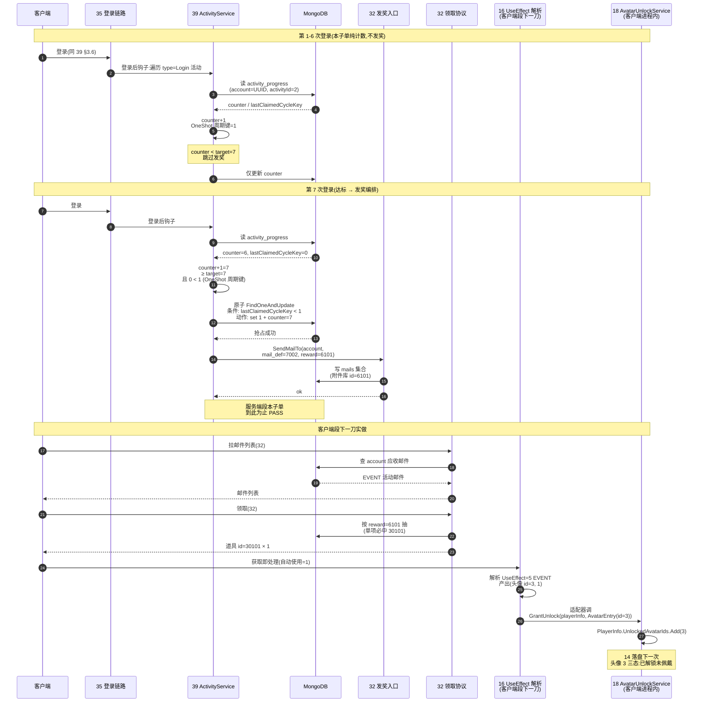

# EVENT 头像解锁通路 · server 段(Tier 4 第 2 子单)

把「**服务端活动达标 → 邮件礼包 → 客户端 ItemUse 解锁头像/框**」整条 EVENT 通路在**配置层**接通,兑现 [设计 18 §3.6](#18-player-info::unlock) 旁注「活动发放 = 把 id 加进玩家已解锁集合」的待对接钩子。承接 [Tier 4 第 1 子单 §D7](#39-activity-server::audit)「GrantUnlock 是已设计好的活动发放接缝,本子单不接、留第 2 子单」(已 PASS Fantasy de5d4da7 + 设计稿 f5d44f7f)。

本子单只做 server 段(纯服务端配置 + 1 个 EVENT 解锁活动实例),客户端段下一刀实做「[设计 16 §3.7](#16-item-system::useeffect) UseEffect 解析层加 EVENT 分支 + 适配器调 `AvatarUnlockService.GrantUnlock`」。

> [!WARNING]
> **读前必看 · 五条边界**
>
> - **本子单是「configuration-only server 段」,不含服务端新 handler / 协议 / 集合 schema。** EVENT 解锁就是「在已有的 [活动 → 邮件礼包 → 道具] 通路上加一个新道具类型」。服务端段交付 = 4 张已有 Luban 表各加 1 行(`__enums__` 加 EVENT 枚举档 + `item` 加 EVENT 道具 + `giftrandom` 加 EVENT 礼包 + `activity` 加 EVENT 解锁活动) + `AuthoritativeDefs` 注册新道具/礼包行;**无新 MongoDB 集合、无新协议、无服务端代码 handler 改动**。
> - **守 [32 §3.5 SendMailTo](#32-mail-server::source-api) 签名零改。**简报 ②a 提议「reward 列表附 EVENT 类型 item」需要扩 SendMailTo 让 EVENT 标记跟着 reward 流到客户端,违 [39 §四 守不变量 ④](#39-activity-server::degrade)。沿 [设计 16 §3.7 既有 UseEffect 范式](#16-item-system::useeffect),EVENT 就是「一个特殊使用效果(`UseEffect=5`)的道具」,经礼包随机库携带,在 [39 ActivityDef](#39-activity-server::config) 的 `reward` 字段填 EVENT 礼包 id 即可,**不需要在 39 ActivityDef 加新字段、不需要扩邮件领取响应、不需要新 G2C_AvatarUnlockPush 协议**。
> - **客户端工程零 diff,本子单纯 server 段 only。**客户端段下一刀(独立子单)做两件事:① [设计 16 §3.7](#16-item-system::useeffect) UseEffect 解析层加 `EVENT=5` 分支(产出「(头像/框 id, 1)」)+ ② 适配器层调 `AvatarUnlockService.GrantUnlock(playerInfo, avatarId)`。**本子单交付后立即可单测的「server 段 PASS」**:Luban 配置加载正常 + 起服 + 模拟 7 次登录 → `activity_progress` 集合的 EVENT 活动 `lastClaimedCycleKey` 写已发 + `mails` 集合收件箱多一封活动邮件,`reward=6101`(EVENT 礼包 id)挂在邮件附件;**真正头像解锁的端到端可观测验证**需客户端段下一刀实做后才能跑完整条链。
> - **不在本子单做的事:** ① 客户端 UseEffect 解析层加 EVENT 分支(交客户端段);② 适配器层调 `GrantUnlock`(交客户端段);③ 9 套 EVENT 解锁头像活动清单(本子单只起 1 个实例验通路,运营后续按头像表逐个开活动);④ 已解锁头像集合的服务端同步(`PlayerInfo.UnlockedAvatarIds` 仍是 [设计 18 §3.8](#18-player-info::persist) 客户端存档字段,不上服务端,跨设备同步是 Tier 3 范围);⑤ 头像表 `id=3 avt_star` 等具体 EVENT 头像清单(沿 [设计 18 §3.5](#18-player-info::schema) 样例,本子单 server 段只用 `avt_star=3` 占位)。
> - **EVENT 头像解锁集合仍在客户端存档,不上服务端。** [18 §3.8](#18-player-info::persist) 已解锁集合(`UnlockedAvatarIds/FrameIds`)写进 `MergeMetaSave` 本地存档(平铺并入元层存档,保底夹值)。本子单不动该存档,EVENT 通路落地后玩家在本设备上解锁状态持久;跨设备「同 UUID 是否带着已解锁集合走」是 Tier 3 跨设备识别范畴(沿 [39 §五 诚实边界](#39-activity-server::walk) 同口径)。

> [!NOTE]
> **立项信息** {#intro}
>
> | 项 | 内容 |
> | --- | --- |
> | **类型** | 全栈特性 · Tier 4 活动系统第 2 子单 server 段。出 code-free 设计意图 + 行为级配置契约 + 行为级验收,交服务端段(4 张 Luban 表各加 1 行 + `AuthoritativeDefs` 注册新行)落地;客户端工程零 diff;客户端段(UseEffect 解析 + 适配器)留下一子单。 |
> | **方向约束** | 离线还原 · **去变现**:EVENT 解锁的奖励是「头像/框」(无付费、无 VIP)。**加法式 + 复用至上**:不动 [32 SendMailTo](#32-mail-server::source-api) 签名、不动 [39 ActivityDef](#39-activity-server::config) schema、不动 [16 UseEffect](#16-item-system::useeffect) 解析层结构(只加新枚举档 + 新道具行)、不动 [18 AvatarUnlockService](#18-player-info::unlock) API。新增全在配置层(4 张表各 1 行) + 客户端段下一刀的 UseEffect 分支 + 适配器接 `GrantUnlock`。 |
> | **需求降层** | **a. 表层要求**(简报字面):Tier 4 第 2 子单,接通『服务端活动达标 → 邮件 reward 携带 EVENT 标记 → 客户端识别解锁』通路;本单仅 server 段;ActivityDef 增 EventUnlockId 字段(简报建议)。 **b. 底层目的**(为玩家 / 运营 / 工程达成什么):让 [设计 18 §3.6](#18-player-info::unlock) 的「活动发放头像/框」三态落地——玩家通过累计登录/签到等活动行为可解锁本来只能等级解锁不到的「事件限定头像」(`avt_star` 等),运营有抓手做「累计登录 7 天送限定头像」类长期激励;工程上「活动→邮件→道具→解锁集合」整条链复用已有 4 个子系统(39/32/16/18),不引入新协议、不引入新集合,扩展面积最小。 **c. 有无更直达 b 的做法**:b 的本质 = 「让 EVENT 解锁道具能跟普通货币/图案道具一样经活动 reward 礼包发到玩家」。直达做法对比: **方案 A(简报建议)**:`ActivityDef` 加 `EventUnlockId` 字段;服务端在投邮件时把 EVENT 标记塞进 reward 列表 → 客户端识别。**方案 B(本子单采纳)**:沿 [16 §3.7 UseEffect](#16-item-system::useeffect) 范式,加 `UseEffect=5 EVENT` 枚举档 + 新 EVENT 解锁道具 + 新 EVENT 礼包,`ActivityDef.reward` 填 EVENT 礼包 id 即可。**方案 A 的代价**:① 扩 [32 SendMailTo](#32-mail-server::source-api) 签名让 EVENT 标记跟着 reward 列表流到客户端(违 [39 §四 守不变量 ④](#39-activity-server::degrade));② [16 §3.7](#16-item-system::useeffect) 既有 5 档使用效果(0 无 / 1 货币 / 2 图案 / 3 自选 / 4 随机)本就是「道具产出种类」的扩展点,EVENT 解锁本质就是「第 6 档产出种类」,塞进 ActivityDef 等于把跨子系统的关注点局部化到活动层,违正交分层;③ 「邮件附 EVENT 标记 item」需扩邮件领取响应数据契约,涉及 [21/32 全链路](#32-mail-server::claim-resp) 改动。**方案 B 的优势**:① 零 [32](#32-mail-server) / [39](#39-activity-server) schema 改动;② [16 §3.7](#16-item-system::useeffect) 已有架构能等比扩展(新加 1 档 UseEffect = 现有任何子系统都已具备扩展机制);③ 客户端段下一刀的工作量 = 「16 加 1 个 EVENT 分支 + 1 个适配器调 GrantUnlock」,与方案 A 的「客户端识别 EVENT 标记 + 调 GrantUnlock」工作量等价。**结论**:取方案 B(沿 [16 UseEffect](#16-item-system::useeffect) 范式扩,不加 ActivityDef 字段)。 |
> | **范围(产品 · 玩法)** | **服务端段交付**:① `__enums__.xlsx`「使用效果」枚举加 `EVENT=5` 档(同源导出 c+s);② `item.xlsx` 加 1 行 EVENT 解锁头像道具(示例:`id=30101, type=2 材料, 使用效果=5 EVENT, 效果目标=3 头像 id avt_star, 效果数量=1, 自动使用=1, 叠放=0`,从邮件礼包抽出后立即解锁不进背包);③ `giftrandom.xlsx` 加 1 行 EVENT 礼包(示例:`所属礼包=6101, 奖品=30101, 数量=1, 权重=100`,礼包内必中 EVENT 道具);④ `activity.xlsx` 加 1 行 EVENT 解锁活动实例(示例:`activity_id=2, name_text_id=390003, desc_text_id=390004, type=Login, cycle=OneShot, target=7, reward=6101, mail_def=7002, start_at=0, end_at=0`,语义 = 累计登录 7 次永久解锁一次 EVENT 头像);⑤ Fantasy.Net `AuthoritativeDefs` 注册新道具 / 礼包 / 活动行(沿 [39 §3.1](#39-activity-server::config) 同源导出加载范式)。 **服务端段不动**:① [32 SendMailTo](#32-mail-server::source-api) 入口签名;② [39 ActivityDef](#39-activity-server::config) schema;③ [39 §3.4 发奖编排](#39-activity-server::orchestrate) 流程(本子单的 EVENT 活动经同一流程,只是 `reward` 字段值变了);④ MongoDB `activity_progress` schema;⑤ [16 道具表 18 字段](#16-item-system::schema) 结构(本子单沿用,新加 1 行而已);⑥ 既有四全栈 + 35/36/37 任何代码。 **客户端段不动**:任何 `Assets/` 代码(客户端段下一刀实做 UseEffect 解析 + 适配器)。 |
> | **关键约束** | 服务端遵 Fantasy.Net 既有约定(配置加载 / 不手改生成物 / 不手动注册);沿 [39 §3.4 发奖编排](#39-activity-server::orchestrate) 流程不动一行代码,只让新 EVENT 活动行进入同一流程;EVENT 道具落到玩家邮箱后,服务端层面认定通路完成——客户端拿到「道具 id × 数量」后的解析路径由客户端段下一刀实做。本篇正文为 code-free 配置契约,不含字段代码名 / 类名 / 文件路径——服务端段据行为语义定字段名 / `AuthoritativeDefs` 注册形态。 |

## 二、现状审计(给定基线证据) {#audit}

[Tier 4 第 1 子单 PASS 后基线](#39-activity-server)审计 + 简报方案 A 与现有范式的冲突核实:

| 简报描述 / 现状 | 现状证据 | 本子单据此处置 |
| --- | --- | --- |
| 简报 ②a「ActivityDef 增 EventUnlockId 字段;reward 列表附 EVENT 类型 item(itemId = EventUnlockId,Count=1)」 | [32 §3.5 SendMailTo](#32-mail-server::source-api) 入参 = 「目标账号 + 发件人 textId + 标题/正文 textId + 附件库 id + 有效期」,**附件库 id 是单个 `giftrandom` 库 id**,reward 列表 = 服务端按该库 id 抽礼包随机库一次得到的「道具 id × 数量」(见 [32 §3.4 领取响应](#32-mail-server::claim-resp))。SendMailTo 本身无「reward 列表」入参,EVENT 标记无处可塞 | **不取简报方案 A**(加字段 + 扩 SendMailTo 签名);取方案 B(EVENT 走道具 / 礼包路径,见 §三) |
| [16 §3.7 UseEffect](#16-item-system::useeffect) 现状 5 档 | `0 无 / 1 货币 / 2 图案 / 3 自选 / 4 随机`,该节明示「使用效果是道具产出种类的扩展点」 | **EVENT 自然属第 6 档**,加 `5 EVENT` 与既有架构同源扩展;客户端段下一刀只需在 [16 §3.7 解析表](#16-item-system::useeffect) 加 1 行,与既有 5 档同范式 |
| [18 §3.6 旁注](#18-player-info::unlock)「真实『发放』动作 = 把 id 加进该玩家的已解锁集合(将来活动系统调用)」 | `AvatarUnlockService.GrantUnlock(p, e)` 接受 `(PlayerInfo, AvatarEntry)` 入参,把 id 写进 `PlayerInfo.UnlockedAvatarIds/FrameIds`(按头像表「类型」字段区分头像 vs 框);客户端进程内 API,服务端不可直调 | **客户端段下一刀的适配器调用点已就位**;EVENT 道具携带「头像/框 id」(`效果目标` 字段),适配器查 [18 §3.5 头像表](#18-player-info::schema) 「类型」字段决定写入哪个集合(`UnlockedAvatarIds` vs `UnlockedFrameIds`),沿 [16 §3.7 适配器](#16-item-system::useeffect) 范式 |
| [18 §3.5 头像表](#18-player-info::schema) 样例行 `id=3, 类型=头像, 图片=avt_star, 解锁条件=2 活动发放, 条件参数=9001` | 已有「活动发放」档样例,`条件参数=9001` 是「活动 id 字段(本设计不判,留值)」——即活动 id 9001 解锁本头像;[18 §3.6](#18-player-info::unlock) 「活动发放本设计不判 → 未解锁」恰是本子单要补的钩子 | EVENT 道具 `效果目标=3` 指向头像 `avt_star`;[18 §3.5](#18-player-info::schema) `条件参数=9001` 与本子单 `activity_id=2` 不一致(18 占位 9001,39 第 1 子单已用 1,本子单用 2)—— `条件参数` 字段是 [18 §3.6](#18-player-info::unlock) 现状「不判 / 留值」,**本子单不修改 18 头像表已样例,仅取「类型=活动发放档存在 + GrantUnlock 通路就位」事实**;具体 `条件参数` 后续 18 真接活动系统时由运营对齐填 |
| [39 §3.4 发奖编排](#39-activity-server::orchestrate) 流程 | 「判达标 + 周期未发」→「原子写已发周期键」→「调 32 SendMailTo 投邮件,附件库 id = `activity.reward`」→「失败跳过不重试」 | EVENT 活动经**完全相同**的流程,无需任何代码改动——只要 `activity.xlsx` 加 EVENT 解锁活动行 + AuthoritativeDefs 注册,新活动自动进入 [§3.4](#39-activity-server::orchestrate) 流程 |
| [39 §3.5 触发节律](#39-activity-server::trigger) 现状只实做 `Login` 类 | `Cumulative / Schedule / Action` 留架构接缝不实做;本子单的「累计登录 7 次」属 `Login` 类(每次登录 +1,`cycle=OneShot` 达标即永发不重置) | 本子单 EVENT 活动 `type=Login`,直接沿 [39 §3.5](#39-activity-server::trigger) 已实做的登录触发钩子;`cycle=OneShot` 沿 [39 §3.3](#39-activity-server::cycle)「`lastClaimedCycleKey=1` 表已发」一次性永发 |

## 三、设计正文 {#detail}

### 3.1 EVENT 通路四张表的最小增量 {#tables}

EVENT 解锁通路接通 = 4 张已有 Luban 表各加 1 行 + 1 个枚举档,**无新表 / 无 schema 改 / 无新协议**:

```mermaid
graph LR
    A["__enums__.xlsx<br/>加 EVENT=5 档"] --> B["item.xlsx<br/>加 EVENT 解锁道具行<br/>(id=30101, UseEffect=5,<br/>效果目标=3 头像 id)"]
    B --> C["giftrandom.xlsx<br/>加 EVENT 礼包行<br/>(所属礼包=6101,<br/>奖品=30101, 数量=1, 权重=100)"]
    C --> D["activity.xlsx<br/>加 EVENT 解锁活动行<br/>(activity_id=2, type=Login,<br/>cycle=OneShot, target=7,<br/>reward=6101, mail_def=7002)"]
    D --> E["AuthoritativeDefs<br/>注册新道具 / 礼包 / 活动行"]

    style A fill:#1a1a2a,stroke:#5bd6a0
    style B fill:#1a1a2a,stroke:#5bd6a0
    style C fill:#1a1a2a,stroke:#5bd6a0
    style D fill:#1a1a2a,stroke:#5bd6a0
    style E fill:#1a1a2a,stroke:#ffb05a
```

### 3.2 `__enums__.xlsx`「使用效果」枚举加 EVENT 档 {#enum}

沿 [16 §3.7 使用效果](#16-item-system::useeffect) 既有 5 档,加第 6 档:

| 名称 | 值 | 含义 | 数量字段语义 | 效果目标字段语义 |
| --- | --- | --- | --- | --- |
| 无 | 0 | 纯持有材料 | — | — |
| 货币 | 1 | 货币产出 | 货币数量 | 货币 id |
| 图案 | 2 | 图案产出 | 图案数量 | 图案标识 |
| 自选 | 3 | 自选礼包 | — | 礼包 id |
| 随机 | 4 | 随机礼包 | — | 礼包 id |
| **EVENT** | **5** | **解锁头像/框** | **1(恒定)** | **头像/框 id(指向 [18 §3.5](#18-player-info::schema) 头像表)** |

EVENT 档「效果目标」= 头像/框 id;头像 vs 框由头像表「类型」字段(头像=1 / 框=2)区分,适配器查表决定写入哪个集合。

### 3.3 `item.xlsx` 加 EVENT 解锁道具行 {#item}

| 字段 | 类型 | 值 | 说明 |
| --- | --- | --- | --- |
| `id` | int(主键) | 30101 | 道具 id,沿 [16 道具表 30001-30008](#16-item-system::enum) 样例段 30000+ |
| `name_text_id` | int | 110101 | 道具名 textId(占位) |
| `desc_text_id` | int | 110102 | 描述 textId(占位) |
| `type` | enum | 2 材料 | 进背包语义,但实际本道具 `自动使用=1` 不进背包 |
| `使用效果` | enum | **5 EVENT** | 新加枚举档 |
| `效果目标` | int | 3 | 指向 [18 §3.5](#18-player-info::schema) 头像表 `id=3 avt_star`(活动发放档样例) |
| `效果数量` | int | 1 | EVENT 解锁是「解或未解」,数量恒 1(适配器忽略此字段、按 [16 §3.7 EVENT 适配器旁注](#16-item-system::useeffect-event) 落地) |
| 其余字段 | — | 沿 [16 §3.3 样例](#16-item-system::enum) | 图案等级=0 / 参数=0 / 叠放=0 / 品质=4 史诗 / 自动使用=1 |

**自动使用=1**:EVENT 道具从邮件礼包抽出后立即解析 + 落点(走 [16 §3.7 适配器](#16-item-system::useeffect))调 `AvatarUnlockService.GrantUnlock`,**不进背包**(沿 [16 §3.7 自动使用字段](#16-item-system::useeffect) 「立即结算 vs 进背包」二分,EVENT 类必须立即结算)。

> [!NOTE]
> **为什么 `效果目标` 直接存头像 id 而非「活动 id 关联到头像」?**
>
> 沿 [18 §3.5 头像表「条件参数」字段](#18-player-info::schema) 语义反过来想:头像表的 `条件参数=9001` 是「活动发放本头像」的占位字段,意思是「未来活动系统接入时,某活动达标会解锁此头像」。但**反向查**(给定活动 id,要发哪些头像)需扫整张头像表过滤——若每个 EVENT 活动都从头像表反查,服务端要么扫表(慢、易错配)要么需新建索引(违加法式)。**正向查**(给定 EVENT 道具,要解锁哪个头像)只需读道具行 `效果目标`,O(1)、配置直观、运营加新 EVENT 活动只需 [3 张表](#39-activity-server) 加行(配 EVENT 头像道具 → 配礼包 → 配活动)。
>
> 18 头像表 `条件参数` 字段保留(已有样例,无需改);其语义实际由「活动配置时把 EVENT 礼包指向该头像 id」反向兑现,**头像表不需要正向被活动系统查**,沿 [18 §3.6](#18-player-info::unlock) 「活动发放本设计不判 → 未解锁」原状即可。

### 3.4 `giftrandom.xlsx` 加 EVENT 礼包行 {#gift}

| 字段 | 值 | 说明 |
| --- | --- | --- |
| `行主键` | (自增,沿 16 §3.4 范式) | — |
| `所属礼包` | 6101 | EVENT 礼包 id;沿 [16 §3.4 样例 6001 随机礼包段](#16-item-system::packs) 用 6100+ 段区分 |
| `奖品` | 30101 | 指向 §3.3 新建的 EVENT 解锁道具 |
| `数量` | 1 | EVENT 解锁恒 1 |
| `权重` | 100 | 单项礼包必中(沿 [16 §3.6 「单项奖池必中该项」](#16-item-system::gift)) |

EVENT 礼包只 1 行 = 必中;若未来要做「随机解锁 N 个 EVENT 头像中的 1 个」(随机库内多行 EVENT 道具),沿 [16 §3.6 权重抽样](#16-item-system::gift) 同范式直接扩,本子单不取。

### 3.5 `activity.xlsx` 加 EVENT 解锁活动行 {#activity}

| 字段 | 值 | 说明 |
| --- | --- | --- |
| `activity_id` | 2 | 沿 [39 §3.1 每日登录奖 = 1](#39-activity-server::config),本子单用 2 |
| `name_text_id` | 390003 | 占位 textId |
| `desc_text_id` | 390004 | 占位 textId |
| `type` | `Login` | 沿 [39 §3.5 已实做的登录触发节律](#39-activity-server::trigger) |
| `cycle` | `OneShot` | 一次性永发(达标后 `lastClaimedCycleKey=1` 永远 ≥ 1,沿 [39 §3.3](#39-activity-server::cycle)) |
| `target` | 7 | 累计登录 7 次达标(每次登录 +1,达 7 解锁) |
| `reward` | 6101 | 指向 §3.4 EVENT 礼包 |
| `mail_def` | 7002 | 活动结算邮件模板 id(占位,server-dev 据 `mail.xlsx` 既有行取或新建) |
| `start_at` | 0 | 永远开放 |
| `end_at` | 0 | 永不关闭 |

**语义**:玩家累计登录 7 次后,服务端在第 7 次登录时触发 [39 §3.4 发奖编排](#39-activity-server::orchestrate)——抢占 `lastClaimedCycleKey=1` 写入,投活动结算邮件挂 EVENT 礼包 id `6101`;邮件落玩家收件箱,玩家领取 → 服务端按库 id 6101 抽 → 必中 EVENT 道具 30101 → 客户端段下一刀(本子单不实做):[16 §3.7 EVENT 适配器](#16-item-system::useeffect-event) 调 `AvatarUnlockService.GrantUnlock(playerInfo, 头像 id=3)` → `PlayerInfo.UnlockedAvatarIds` 加 3 → 玩家头像列表 [18 §3.6](#18-player-info::unlock) 三态从「未解锁」变「已解锁未佩戴」。

### 3.6 整条 EVENT 通路时序 {#flow}

## 四、服务异常下的行为 {#degrade}

沿 [39 §四 服务异常](#39-activity-server::degrade) 已有口径,本子单只新增配置层 → 行为与第 1 子单完全一致:

| 情形 | 服务端行为 | 为什么 |
| --- | --- | --- |
| EVENT 活动配置缺(`activity_id=2` 行未导入) | 服务端跳过该活动判定,登录链不抛;玩家不解锁 | 沿 [39 §四](#39-activity-server::degrade) 配置缺行为口径,无回归 |
| EVENT 道具配置缺(`item_id=30101` 行未导入,但礼包行已配) | 32 领取响应「抽取查无 → 成功但奖励列表空」(沿 [32 §3.4 旁注](#32-mail-server::claim-resp));玩家不解锁 | 配置缺不抛,运营事后补,沿 [32](#32-mail-server::claim-resp) 已有口径 |
| EVENT 礼包配置缺(`giftrandom 6101` 未导入,活动 reward=6101) | 同上,32 抽取查无返空奖励列表 | 同上 |
| 客户端段未实做 UseEffect=5 EVENT 解析分支 | 邮件领取仍成功(服务端不知客户端有没有 EVENT 解析能力);客户端收到道具 id=30101 × 1 → [16 §3.7](#16-item-system::useeffect) 已有 5 档无 EVENT 分支 → **未定义行为**(沿 16 §3.7 「使用效果」字段值未覆盖时如何 fallback,留客户端段决定) | **诚实边界**:服务端段只保证「道具 id × 数量」抵达客户端;客户端段未做 EVENT 分支时整条链不通(但服务端不知),这是本子单 server 段的固有限制,客户端段下一刀立即补 |
| MongoDB 不可达 | 沿 [39 §四](#39-activity-server::degrade):本次达标判定不发生、不写键、不发邮件;server-test 列 **BLOCKED** 非 FAIL | 同 39 第 1 子单口径 |

## 五、整局走查 · EVENT 通路的崩法与对策 {#walk}

把「玩家累计登录 7 次 → 邮箱收 EVENT 礼包 → 领取 → 头像解锁」整条链跑一遍,逐点出最可能炸的类(零值 / 满值 / 并发 / 中途存档 / 恶意利用)+ 对策:

| 机制 | 最可能的崩法 | 类别 | 对策 |
| --- | --- | --- | --- |
| OneShot 一次性永发幂等 | 玩家第 7 次登录达标发奖后,第 8 次再登录 → `counter+1=8 ≥ 7` 仍满足,服务端误重发 | 并发 / 重启 | [39 §3.3](#39-activity-server::cycle) OneShot 周期键 = 常量 1;达标后写入 `lastClaimedCycleKey=1`;第 8 次判定 `1 < 1` = false → 跳过,不重发(沿 [39 §3.4 原子键](#39-activity-server::orchestrate)) |
| EVENT 道具被当普通道具进背包 | 客户端段下一刀漏 `自动使用=1` 处理,EVENT 道具进背包后没解锁 | 配置 / 客户端漏处理 | [§3.3](#40-event-unlock-relay::item) 道具行 `自动使用=1`;[16 §3.7](#16-item-system::useeffect) 「获取即处理」入口读自动使用字段决定走「立即结算」;客户端段下一刀验收点须断言 EVENT 道具不进背包 |
| GrantUnlock 入参类型错配(头像 vs 框) | EVENT 道具 `效果目标=3` 是头像 id,客户端段适配器误把它当框 id 写进 `UnlockedFrameIds` | 配置错指 / 客户端漏处理 | [§3.2 EVENT 档](#40-event-unlock-relay::enum) 明确「适配器查 [18 §3.5](#18-player-info::schema) 头像表『类型』字段决定写入头像 vs 框集合」;客户端段下一刀验收点须含「类型字段读取 + 集合分流」 |
| EVENT 头像 id 在 18 头像表不存在 | EVENT 道具 `效果目标=999` 指向不存在的头像 → `GrantUnlock` 失败 / 静默 | 配置错指 | [16 §3.7 EVENT 适配器](#16-item-system::useeffect-event) 旁注「已含则幂等无操作」;头像表查无应静默 / 记日志不抛,客户端段下一刀决定;**本子单守:`item.xlsx` EVENT 道具 `效果目标` 必须指向 18 头像表实存行**(server-dev 落 30101 道具行时配置检查,人工核对) |
| 跨设备同 UUID 双登 → 同时第 7 次登录 | 两端各自触发达标判定 → 原子键阻断双发,只一端收 EVENT 邮件 | 并发 / 恶意利用 | [39 §3.4 原子键](#39-activity-server::orchestrate) 沿用;`lastClaimedCycleKey=1` 单条原子写,一端 matchedCount=1 发邮件,另一端跳过 |
| 已解锁集合本地存档可改 | 玩家本机改 `MergeMetaSave` 把 `UnlockedAvatarIds` 加上 EVENT 头像 id 绕过活动达标 | 恶意利用 | **诚实边界承认**:[18 §3.8 持久化](#18-player-info::persist) 是本地 PlayerPrefs 存档,本就可改;但**服务端已发的 EVENT 邮件**仍在收件箱,**跨设备(同 UUID)**重新登录时邮件仍在(服务端权威),改本机存档只是单设备欺骗自己;真正的「跨设备已解锁集合同步」是 Tier 3 范围 |

> [!WARNING]
> **承认的固有限制(诚实边界)**
>
> 本子单 server 段**守的**:① EVENT 道具能经活动 reward 礼包路径抵达玩家收件箱(配置层接通);② 同账号同 EVENT 活动 OneShot 一次性永发不重发(沿 [39 §3.4](#39-activity-server::orchestrate) 原子幂等);③ 配置层各表行的 id 引用一致性([§3.5 activity.reward → §3.4 giftrandom.所属礼包 → §3.3 item.id → §3.2 EVENT 枚举值](#40-event-unlock-relay::tables));④ [32 SendMailTo](#32-mail-server::source-api) 签名零改 + [39 ActivityDef](#39-activity-server::config) schema 零字段加。
>
> 本子单 server 段**不守的**:① 客户端 UseEffect 解析层 EVENT=5 分支(留客户端段下一刀);② 适配器调 `GrantUnlock` 接线(留客户端段);③ `PlayerInfo.UnlockedAvatarIds` 本地存档防篡改(沿 [18 §3.8](#18-player-info::persist) 现状);④ 跨设备同 UUID 已解锁集合同步(Tier 3 范围);⑤ EVENT 头像清单(本子单 server 段只起 1 个实例,9 套 EVENT 解锁头像活动留运营后续逐套刀);⑥ 端到端可观测「头像解锁」(需客户端段下一刀实做后才能跑完整条链)。

## 六、与既有特性的关系 {#relations}

| 既有 | 本子单与其关系 | 是否改动 |
| --- | --- | --- |
| [设计 16 §3.7 UseEffect](#16-item-system::useeffect) | **添加 `EVENT=5` 接缝声明**:在 §3.7 末尾增 [`useeffect-event`](#16-item-system::useeffect-event) 旁注节,描述 EVENT 档产出种类 + 适配器调 `GrantUnlock` + 「服务端段先行不动解析层 / 客户端段下一刀实做」分工 | 16-item-system.md §3.7 末尾加 [`useeffect-event`](#16-item-system::useeffect-event) 旁注节(本任务内同步) |
| [设计 18 §3.6 头像/框解锁判定](#18-player-info::unlock) | `AvatarUnlockService.GrantUnlock` 是适配器调用点,本子单 server 段不动;[18 §3.6 旁注](#18-player-info::unlock) 「真实『发放』动作 = 把 id 加进集合」由本子单(server 段配置层 + 客户端段适配器接线)联合兑现 | 零改动(18 已留钩子) |
| [设计 32 §3.5 SendMailTo](#32-mail-server::source-api) | EVENT 通路完全沿用,签名零改;EVENT 活动经 SendMailTo 投邮件,附件库 id = 本子单新建的 EVENT 礼包 id `6101` | 零改动 |
| [设计 39 第 1 子单](#39-activity-server) | EVENT 活动经 [§3.4 发奖编排](#39-activity-server::orchestrate) / [§3.5 登录触发节律](#39-activity-server::trigger) / [§3.3 OneShot 周期键](#39-activity-server::cycle) 同流程,服务端代码无任何变更;[§七 O5 头像 EVENT 解锁通路](#39-activity-server::open) 待拍板项**由本子单兑现** | 零改动;[§七 O5](#39-activity-server::open) 状态从「不在本子单」更新为「本子单兑现 server 段、客户端段下一刀」 |
| [设计 14 跨会话存档](#14-save-system) | EVENT 解锁结果(`PlayerInfo.UnlockedAvatarIds` 加新头像 id)沿 [18 §3.8 平铺并入元层存档](#18-player-info::persist) 自动随既有落盘 | 零改动 |
| [设计 21 邮件系统](#21-mail-system) | EVENT 邮件经客户端 21 / 32 已有拉列表 + 领取链路落地 | 零改动 |
| 既有四全栈 + 35/36/37/38 | 本子单正交,均不依赖其内部状态 | 零改动 |

## 七、待拍板清单(范围开关 + 可砍档) {#open}

自治授权下均取安全默认推进;列此交 boss / 用户复核,要改另开增量。

| # | 开关 | 安全默认 | 备选 / 触发改动 |
| --- | --- | --- | --- |
| O1 | 9 套 EVENT 解锁头像活动清单 | **本子单不定 9 套清单**;只起 1 个 EVENT 解锁活动实例(累计登录 7 次 → 解锁 `avt_star`)验通路 核心 | 运营定 9 套 EVENT 头像活动(`avt_star`/`frm_event` 等)+ 各自 `cycle/target/reward/mail_def`,逐套刀加 `activity.xlsx` 行 |
| O2 | EVENT 道具 `效果目标` 字段语义 | **存头像/框 id**,客户端适配器查 [18 §3.5](#18-player-info::schema) 头像表「类型」字段分流头像 vs 框集合 核心 | 备选(已否):为头像和框各建一个 UseEffect 档(`5 EVENT_AVATAR / 6 EVENT_FRAME`)→ 枚举膨胀,且 [18 §3.5 头像表](#18-player-info::schema) 本就是头像与框共表,统一档更对称 |
| O3 | EVENT 道具 `自动使用=1` 立即结算 vs 进背包 | **立即结算**(`自动使用=1`)→ 邮件领取后 EVENT 道具不进背包、立即解锁;玩家不需要「进背包再点用」 核心 | 备选(已否):`自动使用=0` 进背包待玩家手动用 → 给玩家「我赚到一个 EVENT 道具」展示感,但与 EVENT 解锁「立即奖励反馈」体验不符,且背包未做(沿 [16 §3.8](#16-item-system::bag))显示需 UI 投放 |
| O4 | EVENT 礼包内多项 vs 单项必中 | **单项必中**(EVENT 礼包内 1 行,权重 100) 核心 | 备选:多项 EVENT 头像随机抽 1 → 增加「开礼包」惊喜感,但 [18 §3.6](#18-player-info::unlock) 已解锁判定「已含则幂等」,二次重抽到已解锁头像玩家会觉得「白给」;运营若想做需配合「不重复抽」机制,本子单不取 |
| O5 | 客户端段 UseEffect 解析 + 适配器实做 | **不在本子单**(留客户端段下一刀)客户端段后续 | 客户端段下一刀:[16 §3.7](#16-item-system::useeffect) 解析层加 `case 5 EVENT` 分支 + [16 §3.7 EVENT 适配器旁注](#16-item-system::useeffect-event) 落 GrantUnlock 接线;改动面 = 1 处解析层 + 1 处适配器,无新协议 |
| O6 | 跨设备同 UUID 已解锁集合同步 | **不在本子单**(Tier 3 跨设备识别) Tier 3 后续 | Tier 3 真做时把 `UnlockedAvatarIds/FrameIds` 从 [18 §3.8 本地存档](#18-player-info::persist) 搬服务端 `players` 集合 / 新建 `player_unlocks` 集合,本子单架构正交 |
| O7 | EVENT 头像 textId 多语言 | 占位 textId(沿 [18 §3.5](#18-player-info::schema) `300003` 等占位现状) 后续 | 多语言文本表建成后查表替换,本子单 server 段不参与 UI 表现 |
| O8 | EVENT 解锁活动 cycle=OneShot vs Weekly/Daily | **OneShot**(一次性永发):累计登录 7 次永久解锁 1 次 核心 | 备选(已否):Weekly/Daily → 「每周/每天解锁 1 个 EVENT 头像」,但 EVENT 头像是限量限定资源,周期重发与「事件限定」语义矛盾;若运营要做需另建「EVENT 限时活动」配 `cycle=Daily` + `start_at/end_at` 时窗 + reward 指不同礼包 |

> **核心 / 增强 / 可砍三档**:核心 = §3.2 EVENT 枚举 + §3.3 EVENT 道具 + §3.4 EVENT 礼包 + §3.5 EVENT 活动 + `AuthoritativeDefs` 注册 + O1/O2/O3/O4/O8 默认。砍掉所有「可砍 / 后续」档(O5/O6/O7)后,server 段配置层 EVENT 通路接通仍成立——只是客户端段未实做 EVENT 解析时玩家解锁链不完整,这是「server 段先行」的固有切片状态。

## 八、验收点 {#accept}

按段拆:**服务端验收**(server-test 跑服真往返 + Code Review 核,本增量主验)、**客户端验收**(本子单无客户端段)、**联调验收**(本子单 server 段与已落地的 32 客户端段拉邮件链路自然联调到「收到 EVENT 道具」)。完成定义均为**行为可观测**,不含代码定位。

### 8.1 服务端验收(server-test,本增量主验) {#accept-server}

| # | 验收点(完成定义,可逐条核) |
| --- | --- |
| SV1 | **`__enums__.xlsx` 使用效果枚举导出**:Luban 产物两端可加载;`EVENT=5` 档存在,值与 [§3.2](#40-event-unlock-relay::enum) 一致 |
| SV2 | **`item.xlsx` EVENT 道具导出**:`id=30101, 使用效果=5, 效果目标=3, 效果数量=1, 自动使用=1` 行存在(字段值与 [§3.3](#40-event-unlock-relay::item) 一致);Luban 双端同源导出 |
| SV3 | **`giftrandom.xlsx` EVENT 礼包导出**:`所属礼包=6101, 奖品=30101, 数量=1, 权重=100` 行存在(字段值与 [§3.4](#40-event-unlock-relay::gift) 一致);双端同源 |
| SV4 | **`activity.xlsx` EVENT 解锁活动导出**:`activity_id=2, type=Login, cycle=OneShot, target=7, reward=6101, mail_def=7002, start_at=0, end_at=0` 行存在(字段值与 [§3.5](#40-event-unlock-relay::activity) 一致);双端同源 |
| SV5 | **`AuthoritativeDefs` 加载 EVENT 行**:服务端冷启动后 `AuthoritativeDefs` 缓存新道具 / 礼包 / 活动行(查询接口能按 id 取到);沿 [39 §3.1 同源加载](#39-activity-server::config) 范式,无新加载点 |
| SV6 | **EVENT 活动经 [39 §3.4 发奖编排](#39-activity-server::orchestrate) 流程**:模拟账号累计登录 7 次 → 服务端在第 7 次登录时遍历 `type=Login` 活动 → 对 EVENT 活动 `counter+1=7 ≥ target=7` 且 `lastClaimedCycleKey=0 < OneShot 周期键=1` 抢占成功 → 投活动结算邮件(`mail_def=7002, reward=6101`)|
| SV7 | **OneShot 永发幂等**:第 7 次登录达标后,第 8 / 9 / ... 次再登录 → `lastClaimedCycleKey=1` 不再 `< 1` → 跳过不重发(沿 [39 §3.3 OneShot 周期键](#39-activity-server::cycle))|
| SV8 | **真往返**(力争):起服 + 预置 4 张 Luban 表新行 + mongod 探针:① 触发账号第 1-6 次登录 → `activity_progress` 表的 `activityId=2` 文档 `counter` 从 1 → 6,`lastClaimedCycleKey=0`(未发);② 触发第 7 次登录 → `counter=7, lastClaimedCycleKey=1`(已发);③ `mails` 集合该账号收件箱多一封 `mail_def=7002` 邮件,附件库 id=6101;④ 拉邮件列表(走 [32 客户端拉列表协议](#32-mail-server::pull))见该邮件;⑤ 领取(走 [32 领取协议](#32-mail-server::claim))→ 服务端按库 id `6101` 抽 → 单项必中 → 响应「成功 · 已发奖」+ 奖励列表 `[(道具 id=30101, 数量=1)]` |
| SV9 | **服务端段不破 [39 第 1 子单 PASS](#39-activity-server)**:每日登录奖 `activity_id=1` 行为不变;`activity_progress` 集合 schema 零字段加;[32 SendMailTo](#32-mail-server::source-api) 签名零改;[39 ActivityDef](#39-activity-server::config) schema 零字段加 |
| SV10 | **配置层引用一致性**:`activity.reward=6101 → giftrandom.所属礼包=6101 → giftrandom.奖品=30101 → item.id=30101 → item.效果目标=3 → 18 头像表 id=3 实存`;链路上任一断 → server-test 标记配置错(对应 [§五 崩法表「EVENT 头像 id 不存在」](#40-event-unlock-relay::walk))|
| SV11 | **既有六全栈 + 35/36/37/38 + 39 零回归**:30/31/32/33/35/37 既有协议 / 集合 / 行为 + 38 客户端属性 + 39 每日登录奖全部 PASS 不破;客户端工程零 diff |
| SV12 | **Code Review**:服务端遵 Fantasy.Net 约定(配置加载 / 不手改生成物 / 不手动注册);重点核「无 [32 SendMailTo](#32-mail-server::source-api) 签名改动」「无 [39 ActivityDef](#39-activity-server::config) schema 字段加」「无新 handler / 集合 / 协议」「EVENT 通路完全沿 [39 §3.4 发奖编排](#39-activity-server::orchestrate) 流程」「[16 道具表](#16-item-system::schema) 与 [18 头像表](#18-player-info::schema) 现状字段结构零改」(逐条核)|

### 8.2 客户端验收(本子单无客户端段) {#accept-client}

| # | 验收点 |
| --- | --- |
| CV1 | **客户端工程零 diff**:`git status` 显示 `Assets/` 下零改动;本子单纯 server only |

### 8.3 联调验收(本子单 server 段与既有 32 客户端段) {#accept-e2e}

本子单 server 段与已落地的 [32 客户端段](#32-mail-server)(拉邮件 / 领奖)自然联调到「玩家收到 EVENT 道具」一步,**头像真正解锁**需客户端段下一刀实做。

| # | 验收点 |
| --- | --- |
| E1 | 真往返 server 段切片:模拟账号累计登录 7 次 → 服务端发 EVENT 活动邮件 → 该账号 32 客户端拉列表见活动邮件(`mail_def=7002` 标题 / 正文 + 附件库 `6101`)→ 领取得 `[(道具 id=30101, 数量=1)]` 响应 |
| E2 | OneShot 永发跨会话:第 7 次登录后即领取邮件 → 重启服务端 + 同账号再登录第 8/9/... 次 → `lastClaimedCycleKey=1` 持久不变 → 不重发 EVENT 邮件 |
| E3 | 客户端段未实做时的可观测限制:客户端收到道具 30101 后,[16 §3.7 解析层](#16-item-system::useeffect) 当前 5 档无 EVENT 分支,行为按 [§四 异常](#40-event-unlock-relay::degrade) 「未定义」处置;**本子单不验「头像真正解锁」**,标 BLOCKED(客户端段下一刀实做后联调验)|

> [!WARNING]
> **不在本特性验收 / 视环境 BLOCKED**
>
> - 9 套 EVENT 解锁头像活动具体清单(O1)→ 后续逐套刀,本子单不验
> - 客户端 UseEffect 解析 + 适配器接线(O5)→ 客户端段下一刀,本子单 E3 标 BLOCKED 而非 FAIL
> - 跨设备已解锁集合同步(O6)→ Tier 3 范围
> - 头像 / 道具多语言 textId(O7)→ 后续
> - 服务端跑服手验(SV / E)依赖 MongoDB 可达;不可达列 BLOCKED 非 FAIL(沿 [39 BLOCKED 边界](#39-activity-server::accept))

## 九、风险表 {#risk}

| 风险 | 应对 |
| --- | --- |
| **简报方案 A(加 EventUnlockId 字段 + 扩 SendMailTo)被强推**:误以为本子单一定要加 39 字段 | [立项框](#40-event-unlock-relay::intro) 需求降层 c + [§二 现状审计](#40-event-unlock-relay::audit) 已论证方案 A 违 [39 §四 守不变量 ④](#39-activity-server::degrade);采用方案 B 沿 [16 UseEffect 范式](#16-item-system::useeffect) 扩,与既有架构正交;若 boss 坚持方案 A 需另开增量改 32 SendMailTo 签名 |
| **客户端段下一刀未实做 EVENT 解析致整条链不通** | [§五 诚实边界 + §四 异常 + 验收 E3 标 BLOCKED](#40-event-unlock-relay::walk):本子单 server 段只保证「道具 id × 数量」抵达客户端;头像真正解锁需客户端段实做;两子单串联 PASS = 整条链 PASS |
| **EVENT 道具 `效果目标` 配置错指**(指向不存在的头像) | [§五 崩法表](#40-event-unlock-relay::walk) + SV10 配置层引用一致性核;[16 §3.7 EVENT 适配器旁注](#16-item-system::useeffect-event) 「已含则幂等无操作」;头像表查无客户端段静默 + 记日志不抛 |
| **EVENT 道具被当普通道具进背包**(客户端段漏 `自动使用=1` 处理) | [§3.3](#40-event-unlock-relay::item) 道具行 `自动使用=1`;[16 §3.7](#16-item-system::useeffect) 「获取即处理」入口决定;客户端段下一刀验收点须含 |
| **本地存档可改绕过活动达标**(玩家本机改 `MergeMetaSave` 解锁 EVENT) | [§五 诚实边界承认](#40-event-unlock-relay::walk):本地存档可改是 [18 §3.8](#18-player-info::persist) 固有限制;但服务端 EVENT 邮件仍权威,跨设备(同 UUID)重新登录邮件仍在;真正的「跨设备已解锁集合同步」是 Tier 3 范围 |
| **OneShot 永发误重发**(第 8 次登录达标条件仍满足) | [§五 崩法表 + SV7](#40-event-unlock-relay::walk):[39 §3.3 OneShot 周期键 = 1](#39-activity-server::cycle) + [§3.4 原子条件写](#39-activity-server::orchestrate) `lastClaimedCycleKey < 1 → 1`;第 8 次判定 `1 < 1` = false 自然跳过 |
| **简报方案 A 设计稿同步「ActivityDef 加 EventUnlockId 字段」误改 39** | [§六 关系表](#40-event-unlock-relay::relations) 明列 [39](#39-activity-server) 零改动;[39 §七 O5](#39-activity-server::open) 状态更新由本子单兑现非加字段;本任务内不动 39 设计稿 schema 描述,仅由本任务 [§六](#40-event-unlock-relay::relations) 描述「39 第 1 子单 PASS 后,本子单兑现 O5」 |
| **范围溢出做满 9 套 EVENT 活动** | [立项框范围](#40-event-unlock-relay::intro) + [读前必看第 1 条](#40-event-unlock-relay::intro) + [§七 O1](#40-event-unlock-relay::open):本子单 server 段交付 1 个 EVENT 解锁活动实例验通路,9 套清单运营后续 |

## 相关文档

- [← 返回总览](#)
- [设计 39 活动系统服务端地基(Tier 4 第 1 子单)](#39-activity-server)(本子单承接)
- [设计 32 邮件服务端化 §3.5 SendMailTo](#32-mail-server::source-api)(本子单复用,签名零改)
- [设计 16 道具系统 §3.7 使用效果](#16-item-system::useeffect)(本子单在末尾加 EVENT 接缝旁注)
- [设计 18 玩家信息系统 §3.6 头像解锁判定](#18-player-info::unlock)(本子单兑现「活动发放」钩子的服务端反面)
- [设计 14 跨会话存档](#14-save-system)(EVENT 解锁结果随 18 §3.8 平铺并入元层存档)
- [设计 21 邮件系统](#21-mail-system)(EVENT 邮件经客户端 21 / 32 已有链路落地)
