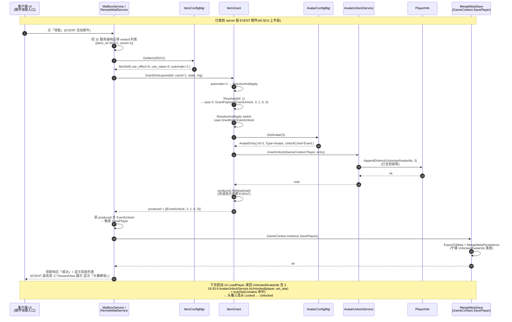

# EVENT 头像解锁客户端段(Tier 4 第 2 子单 · client)

收口 Tier 4 第 2 子单 EVENT 头像解锁全栈。承接 [40 EVENT 头像解锁通路 server 段](#40-event-unlock-relay)(已 PASS Fantasy `bafed768` + 设计稿 `d3e3b4fd`):服务端 `AuthoritativeDefs` 已加 EVENT 活动实例(`activity_id=2`, `Type=Login`, `cycle=OneShot`, `Target=7`, `Reward=6101`)+ `GiftPoolSeeds` 已加 EVENT 礼包条目(`Index=6101 → ItemId=30101 × 1, Rate=100` 单项必中)。server 段以「服务端工程无 Luban,只守 `(道具 id=30101, 数量=1)` 抵达邮件附件」收口,显式留下「**客户端 `itemdef.xlsx` 须含 `id=30101` 行,本子单 server 段不交付**」(`MailServiceComponentSystem.cs:90-92` 注释)给客户端段接。

本子单做四件事:① 客户端 Luban 加两行配置(`itemdef.xlsx` 加 EVENT 道具 + `giftrandom.xlsx` 加 EVENT 礼包,与 server 段共识对齐);② 扩 [设计 16 §3.7](#16-item-system::useeffect-event) 解析层加 `UseEffect=5` EVENT 分支;③ 加 EVENT 适配器调 [设计 18](#18-player-info::unlock) `AvatarUnlockService.GrantUnlock` 落 `PlayerInfo.UnlockedAvatarIds`;④ EditMode 单测三类覆盖 + 全栈真往返 E1。

> [!WARNING]
> **读前必看 · 五条边界**
>
> - **本子单是「Luban 加两行 + 客户端代码三处加分支」的 client-only 子单。** Fantasy 仓零 diff;Luban `itemdef.xlsx` 加 1 行(`id=30101`)+ `giftrandom.xlsx` 加 1 行(`index=6101`);代码改三处:`ItemGrant.cs` Resolve switch 加 `case 5` + `ResolveAndApply` 加 EVENT 分支 + 新加 `GrantKind.EventUnlock` 枚举档;`AvatarUnlockService.GrantUnlock` / `AvatarConfigMgr.GetAvatar` / `PlayerInfo` 全部零改。
> - **客户端 Luban 表与服务端 `AuthoritativeDefs` / `GiftPoolSeeds` 共识对齐是硬约束。** Server 段已固化:`activity.reward=6101 → giftpool index=6101 → item_id=30101 × 1`。客户端 `giftrandom.xlsx` 的 `index=6101 → item_id=30101 × 1` 必须与之逐字段对齐(`item_id` / `num` / `rate=100` 单项必中);客户端 `itemdef.xlsx` 的 `id=30101` 道具行 `use_effect=5, use_value=3, use_num=1, automatic=1` 也必须如此,否则邮件领取链解析路径不通。
> - **EVENT 道具 `automatic=1` 立即结算,不进背包。** 沿 [设计 16 §3.7 「自动使用字段」二分](#16-item-system::useeffect) + [40 §3.3 D4 立即结算决策](#40-event-unlock-relay::item):邮件领取后 EVENT 道具立即解锁(不需要玩家「进背包再点用」二次操作)。`automatic=0` 进背包路径在本子单**未定义**(沿 [40 §五 EVENT 类只能立即结算](#40-event-unlock-relay::walk))。
> - **EVENT 适配器获取 `PlayerInfo` 走 `GameContext.Instance.Player`,与 18/25 已落地范式一致。** [设计 18](#18-player-info) 数据层在 `GameLogic.BlockBlast.Player` 命名空间;`PlayerInfo` 由 `GameContext` 持有(沿 [设计 23 §五 GameContext 挂入](#23-settings-window-art) 范式)。EVENT 解锁后随 [设计 14 跨会话存档](#14-save-system) 经 `MergeMetaSave` 自动落盘(平铺并入元层存档,沿 [18 §3.8 持久化](#18-player-info::persist))。
> - **已解锁集合仍在客户端存档,不上服务端;跨设备同步是 Tier 3 范围。** 沿 [40 §五 诚实边界](#40-event-unlock-relay::walk):本子单 client 段守「邮件领取 → EVENT 解析 → GrantUnlock 写本机 `UnlockedAvatarIds`」;**不守**本地存档防篡改、跨设备同 UUID 已解锁集合同步、HUD 显示头像三态切换(头像三态判定由 [设计 18 §3.6 AvatarUnlockService.IsUnlocked](#18-player-info::unlock) 自动反映,真实显示由 [设计 25 个人信息窗](#25-player-info-window-art) 与未来头像选择窗承接)。

> [!NOTE]
> **立项信息** {#intro}
>
> | 项 | 内容 |
> | --- | --- |
> | **类型** | 全栈特性 · Tier 4 活动系统第 2 子单 client 段(本子单收口该全栈 server 段先行 + client 段收口的双子单切片)。出 code-free 行为级配置契约 + 行为级解析 / 适配器规范 + 行为级验收;开发承接落地 EVENT 解析层 + EVENT 适配器 + 两行 Luban 配置。 |
> | **方向约束** | 离线还原 · **去变现**:EVENT 解锁的奖励是「头像 / 框」(无付费、无 VIP)。**加法式 + 复用至上**:零改 Fantasy 仓;零改 [32 SendMailTo](#32-mail-server::source-api) 签名;零改 [39 ActivityDef](#39-activity-server::config) schema;零改 [18 `AvatarUnlockService.GrantUnlock`](#18-player-info::unlock) API 签名;零改 [16 `ItemGrant.Resolve` / `GrantOnAcquire` / `ResolveAndApply` 外部签名](#16-item-system::useeffect)(只在 `switch(def.UseEffect)` 增 `case 5` + 在 `ResolveAndApply` 加 EVENT 分支);零改 16 道具表 21 字段结构(`itemdef.xlsx` 仅加新行 30101);零改 avatar 头像表(`use_value=3` 引用现有 `id=3 avt_star`)。 |
> | **需求降层** | **a. 表层要求**(简报字面):本子单收口 EVENT 解锁全栈;[1] plan 阶段先调查取证(grep 16 UseEffect 现有 EffectType 枚举 / handler 体系 + AvatarUnlockService 现状 / GrantUnlock API 签名 / 持久化范式 + 30101 在 16-item-system 怎么定义 + 26-avatar-frame-system 头像系统现状);按 40 设计稿实做 client 段:a) 16 UseEffect 加 EffectType=5 EVENT handler、b) handler 内调 AvatarUnlockService.GrantUnlock(目标 id 由道具内容指定)、c) ItemId=30101 道具配置加行(类型=EVENT, EffectType=5, EffectTarget=具体头像 / 框 id);d) E1 全栈真往返。 **b. 底层目的**:让 [40 EVENT 通路](#40-event-unlock-relay) server 段已固化的「邮件附件 `(道具 id=30101, 数量=1)` 抵达客户端」继续往下走 → 客户端解析 EVENT 道具 → 调 `GrantUnlock` 把 `avatar id=3` 写进 `PlayerInfo.UnlockedAvatarIds` → 跨会话落盘 `MergeMetaSave` → 头像三态判定从 Locked → Unlocked → 玩家可在头像选择窗换装(选择窗 UI 投放是 [设计 25 后续屏](#25-player-info-window-art))。 **c. 有无更直达 b 的做法**:① 简报 b 「16 UseEffect 加 EffectType=5 EVENT handler」措辞与现状有出入 — 客户端 `ItemDef.UseEffect` 字段是 `int`(不是枚举,`ItemDef.cs:34`,Luban 桥接 `ItemConfigMgr.ToItemDef` 沿用 `int`),无需在 `__enums__.xlsx` 加 `EUseEffect.EVENT` 枚举档(现 `__enums__.xlsx` 的 `EVENT` 行是 `avatar.EUnlockCond` 段、与道具 use_effect 无关)。`itemdef.xlsx` 的 `use_effect` 列直接填整数 `5` 即可。**直达做法**:沿 [16 §3.7 UseEffect 解析层](#16-item-system::useeffect) 已有 `switch(def.UseEffect)` 五档(`case 1/2/3/4/default`),加 `case 5: return new GrantPayload(GrantKind.EventUnlock, def.UseValue, count, 0, 0)` 即正交扩展;`ResolveAndApply` 加 `case GrantKind.EventUnlock` 分支调 `AvatarConfigMgr.GetAvatar(targetId)` → 若 entry 非 null + PlayerInfo 非 null → `AvatarUnlockService.GrantUnlock(p, e)`。改动面 = 3 处代码(`GrantKind` 枚举加 1 档 + `Resolve` switch 加 1 case + `ResolveAndApply` switch 加 1 case)+ 2 行 Luban 配置(`itemdef.xlsx` + `giftrandom.xlsx` 各 1 行)。② 简报 c 「ItemId=30101 道具配置加行 — 类型=EVENT, EffectType=5, EffectTarget=具体头像 / 框 id」措辞与现状有出入 — `itemdef.xlsx` 的 `type` 字段是 `item.EItemType` 枚举(`CURRENCY=1 / MATERIAL=2 / FUNC_MATERIAL=3 / GIFT_SELECT=5 / GIFT_RANDOM=6`,无 `EVENT` 值),`type` 字段是「背包归类」(沿 [16 §3.3 类型枚举](#16-item-system::enum)),EVENT 道具语义近「**进背包**的材料但 `automatic=1` 不进背包」,取 `type=MATERIAL`(直接 EVENT 不属背包归类、与 EVENT 立即结算语义一致 — 同 30001 经验道具 `type=CURRENCY` + `automatic=1` 立即结算先例)。`use_effect=5` 才是 EVENT 区分位。 **结论**:沿 16 §3.7 UseEffect 解析层范式正交扩 + 沿 [40 §3.3 EVENT 道具行 schema](#40-event-unlock-relay::item) 落 itemdef.xlsx 行(`type=MATERIAL` 沿 16 类型枚举 / `use_effect=5` 是 EVENT 区分位 / `use_value=3` 指 avatar id `avt_star`)。改动面与简报 a 表层等价但更直达架构。 |
> | **范围(产品 · 玩法)** | **客户端段交付**:① `itemdef.xlsx` 加 1 行 EVENT 解锁道具(`id=30101, name=110101, desc=210101, icon=icon_avatar_event 占位, quality=4 EPIC, automatic=1 立即结算, type=MATERIAL, param=0, use_effect=5, use_value=3 指 avatar id=3 avt_star, use_num=1, use_level=0, stacking=0, 限时整套填 0`);② `giftrandom.xlsx` 加 1 行 EVENT 礼包(`auto_id=11, index=6101, item_id=30101, num=1, rate=100` 单项必中,与 server `GiftPoolSeeds` 共识对齐);③ `ItemGrant.cs` 加 `GrantKind.EventUnlock` 枚举档;④ `ItemGrant.Resolve` switch 加 `case 5: return new GrantPayload(GrantKind.EventUnlock, def.UseValue, count, 0, 0)` 分支;⑤ `ItemGrant.ResolveAndApply` switch 加 `case GrantKind.EventUnlock` 分支:取 `GameContext.Instance.Player` + `AvatarConfigMgr.GetAvatar(payload.TargetId)` → 若都非 null → `AvatarUnlockService.GrantUnlock(p, e)`;若 PlayerInfo / entry 为 null → 静默(记日志,不抛);记 `produced.Add(payload)` 供调用方观察;⑥ EditMode 单测三类:`Resolve` EVENT 分支产出对 / `ResolveAndApply` 命中 GrantUnlock 落 UnlockedAvatarIds / 边界(entry 不存在 / PlayerInfo 为 null / 已含 id 幂等无操作)。 **客户端段不动**:① Fantasy 仓任何代码(零 diff);② [32 SendMailTo](#32-mail-server::source-api) 入口签名;③ [39 ActivityDef](#39-activity-server::config) schema;④ [18 `AvatarUnlockService.GrantUnlock`](#18-player-info::unlock) API 签名;⑤ [16 `ItemGrant.Resolve` / `GrantOnAcquire` / `ResolveAndApply`](#16-item-system::useeffect) 外部签名(仅在 switch 内增分支);⑥ [16 道具表 21 字段结构](#16-item-system::schema)(仅加新行);⑦ avatar 头像表(仅引用现有 `id=3 avt_star`);⑧ `PlayerInfo` / `MergeMetaSave` DTO 结构(`UnlockedAvatarIds` 字段已就位、自然落盘);⑨ 既有六全栈 + 35/36/37/38 + 39 + 40 + 16/18 所有 PASS 状态;⑩ HUD 显示头像三态切换(由 [25 个人信息窗](#25-player-info-window-art) / 未来头像选择窗承接,本子单不投放 UI 表现层);⑪ 9 套 EVENT 头像活动清单(运营后续逐套刀)。 |
> | **关键约束** | 客户端遵 TEngine 既有约定([16 §3.5 注册表加载](#16-item-system::registry) ConfigSystem / EditMode 单测经 `InitForTest` 注入,不碰 YooAsset);`ItemGrant.cs` 扩展沿 [既有 5 档 switch + ResolveAndApply 递归 5 层防环](#16-item-system::useeffect) 范式;EVENT 适配器纯逻辑可单测;Luban `itemdef.xlsx` / `giftrandom.xlsx` 加行后须重导表生成 `.bytes` + 自动产生 `ItemDef` / `GiftRandom` Luban 类(导表工具链不可达 → BLOCKED 非 FAIL,沿 numeric-system / 16 §六 BLOCKED 边界 + memory「Luban 配置表类设计」)。本篇正文为 code-free 行为级契约 + 必要的类型 / 方法名锚点(用于 dev 接线锚定 — 沿 38 「Tier 收口 / 接缝定义型 design-docs 允许引接线点位置」例外)。 |

## 二、现状审计(给定基线证据) {#audit}

[Tier 4 第 2 子单 server 段 PASS 后](#40-event-unlock-relay) 基线审计 + 客户端代码 / 配置现状逐处核实:

| 简报描述 / 现状 | 现状证据 | 本子单据此处置 |
| --- | --- | --- |
| 简报 b「16 UseEffect 加 EffectType=5 EVENT handler」 | `Assets/GameScripts/HotFix/GameLogic/Module/BlockBlast/Item/ItemDef.cs:34`:`public int UseEffect;`(`int` 非枚举);`ItemConfigMgr.ToItemDef`:`UseEffect = row.UseEffect`(Luban 桥接也是 `int`);`Assets/GameScripts/HotFix/GameProto/GameConfig/ItemDef.cs:28`:`UseEffect = _buf.ReadInt()`(Luban 生成类 `int`);`__enums__.xlsx` 现有 5 段(`item.EQuality / test.AccessFlag / num.ENumType / item.EItemQuality / item.EItemType / avatar.EAvatarType / avatar.EUnlockCond`)无 `item.EUseEffect` 段 | **不在 `__enums__.xlsx` 加 `EUseEffect.EVENT` 枚举档**;`itemdef.xlsx` 的 `use_effect` 列直接填整数 `5`;沿 `ItemGrant.cs` 既有 `switch(def.UseEffect)` 五档(`case 1: 货币 / case 2: 图案 / case 3: 自选 / case 4: 随机 / default: 纯持有`)加 `case 5: EVENT` 即正交扩展 |
| 简报 c「ItemId=30101 道具配置加行 — 类型=EVENT」 | `__enums__.xlsx` `item.EItemType` 段五档(`CURRENCY=1 / MATERIAL=2 / FUNC_MATERIAL=3 / GIFT_SELECT=5 / GIFT_RANDOM=6`),无 `EVENT` 值;`itemdef.xlsx` 的 `type` 列语义是「背包归类」(沿 [16 §3.3](#16-item-system::enum));既有 30001 经验道具 `type=CURRENCY` + `automatic=1` 立即结算先例 | **`type` 字段不取 `EVENT`(不存在)**;取 `type=MATERIAL`(背包归类,EVENT 立即结算 → 与 30001 同范式);`use_effect=5` 才是 EVENT 区分位(沿 [40 §3.3 D4](#40-event-unlock-relay::item) 立即结算决策) |
| 简报 c「EffectTarget=具体头像 / 框 id」 | `itemdef.xlsx` 的 `use_value` 列(`int`)在 `use_effect=1` 时存货币 id / `=2` 时存图案 key / `=3/4` 时存礼包 index;`avatar.xlsx` 现有 `id=3, type=AVATAR, image=avt_star, unlock_cond=EVENT, unlock_param=9001` 行(EVENT 头像样例) | `use_value=3` 指 `avt_star` 头像 id(沿 [40 §3.3](#40-event-unlock-relay::item));注:avatar.xlsx `unlock_param=9001` 与本子单 `activity_id=2` 不一致 — 沿 [40 §二 现状审计](#40-event-unlock-relay::audit):`unlock_param` 字段是 [18 §3.5](#18-player-info::schema) 现状「不判 / 留值」,本子单不修改 avatar 头像表已样例,仅取「`unlock_cond=EVENT` 档存在 + `GrantUnlock` 通路就位」事实 |
| 简报 b「handler 内调 AvatarUnlockService.GrantUnlock」+ 「目标 id 由道具内容指定」 | `AvatarUnlockService.GrantUnlock(PlayerInfo p, AvatarEntry e)` 已就位(`File:64`,头像 / 框由 `AvatarEntry.Type` 自动分流到 `UnlockedAvatarIds` / `UnlockedFrameIds`,去重已含则幂等无操作);`AvatarConfigMgr.GetAvatar(int id)` 已就位(`File:52`,查无返 null) | EVENT 适配器:取 `payload.TargetId`(= `use_value` = avatar id)→ `AvatarConfigMgr.GetAvatar(targetId)` 得 `AvatarEntry e`(已含 Type 区分头像 / 框)→ 若 `e != null` + `playerInfo != null` → `AvatarUnlockService.GrantUnlock(playerInfo, e)`;`e == null` 静默不抛(沿 [40 §五 崩法表](#40-event-unlock-relay::walk)「头像 id 不存在 → 静默 / 记日志」);`playerInfo == null` 同(EditMode 单测可注入 null) |
| 「PlayerInfo 来源」 | `GameContext.Instance.Player`(沿 18/25 范式;`PlayerInfoWindow.cs:52`:`private PlayerInfo P => GameContext.Instance.Player;` 先例) | EVENT 适配器内取 `GameContext.Instance?.Player`(防 EditMode 单测无 GameContext 实例);若为 null 静默 |
| 客户端 itemdef.xlsx 现状 | 现有 8 行 30001-30008(覆盖 5 档 use_effect 0/1/2/3/4 + 类型 5 档),无 30101 行 | 加 1 行 `id=30101`(沿 [40 §3.3](#40-event-unlock-relay::item) 行规范) |
| 客户端 giftrandom.xlsx 现状 | 现有 4 行 `index=6001`(随机礼包样例),无 `index=6101` 行 | 加 1 行 `auto_id=11, index=6101, item_id=30101, num=1, rate=100`(单项必中,与 server `GiftPoolSeeds` AutoId=6101001 / Index=6101 / ItemId=30101 / Num=1 / Rate=100 共识对齐;客户端 auto_id=11 是行内自增主键,与 server 内部 AutoId 不需对齐字面量,只对齐 `index / item_id / num / rate` 四个语义键) |
| 客户端三处领奖路径都已接 `ItemGrant.GrantOnAcquire` | `MailboxService.cs:189` / `RemoteMailService.cs:106` / `RedeemService.cs:119` 都已对 reward `(itemId, count)` 调 `ItemGrant.GrantOnAcquire(itemDef, count, state, rng)` | EVENT 道具 30101 加入 `itemdef.xlsx` 后,三处自动通过同一解析路径吃下;`GrantOnAcquire` → `automatic=1` → `ResolveAndApply` → `Resolve` → `GrantKind.EventUnlock` → 新增 EVENT 分支调 `GrantUnlock` |
| EVENT 道具落盘 | `PlayerInfo.UnlockedAvatarIds` 是 `int[]` 字段;`GrantUnlock` 内 `AppendDistinct` 重赋数组;`MergeMetaSave` 平铺 `UnlockedAvatarIds`([18 §3.8 平铺并入元层存档](#18-player-info::persist));玩家信息变更后须显式 `GameContext.Instance.SavePlayer()`(沿 `PlayerInfoWindow.cs:250` 先例) | EVENT 适配器调 `GrantUnlock` 后须显式 `SavePlayer()` 落盘 — **决策点 D3** 详 §三 |

## 三、设计正文 {#detail}

### 3.1 客户端段落地三层 {#layers}

EVENT 通路客户端段 = **配置层 + 解析层 + 适配器层**,各层职责单一、各自可单测,沿 [16 §2.1 四层分层](#16-item-system::layers) 既有架构无新分层:

```mermaid
flowchart TD
    subgraph cfg["配置层 · Luban 加两行(共识与 server 对齐)"]
        c1["itemdef.xlsx 加 EVENT 解锁道具行<br/>(id=30101, use_effect=5, use_value=3, automatic=1)"]
        c2["giftrandom.xlsx 加 EVENT 礼包行<br/>(index=6101, item_id=30101, num=1, rate=100)"]
    end
    subgraph parse["解析层 · ItemGrant.Resolve 加 case 5"]
        p1["switch(def.UseEffect) 加 case 5<br/>→ GrantPayload(GrantKind.EventUnlock, use_value, count, 0, 0)"]
        p2["新加 GrantKind.EventUnlock 枚举档"]
    end
    subgraph adapt["适配器层 · ResolveAndApply 加 EVENT 分支"]
        a1["case GrantKind.EventUnlock:<br/>取 GameContext.Instance?.Player<br/>+ AvatarConfigMgr.GetAvatar(payload.TargetId)<br/>→ 都非 null → AvatarUnlockService.GrantUnlock(p, e)<br/>→ 调用方负责 SavePlayer 落盘"]
    end
    subgraph reuse["复用既有(零改)"]
        r1["AvatarUnlockService.GrantUnlock<br/>(签名零改,Type 自动分流头像/框)"]
        r2["AvatarConfigMgr.GetAvatar<br/>(签名零改,查无返 null)"]
        r3["GrantOnAcquire / ResolveAndApply<br/>外部签名零改,仅 switch 加分支"]
        r4["三处领奖路径(MailboxService /<br/>RemoteMailService / RedeemService)<br/>零改,自动通过同一解析路径吃下 EVENT"]
    end
    cfg -->|Luban 导表 .bytes| parse
    parse --> adapt
    adapt --> reuse

    style c1 fill:#1a1a2a,stroke:#5bd6a0
    style c2 fill:#1a1a2a,stroke:#5bd6a0
    style p1 fill:#1a1a2a,stroke:#6c8cff
    style p2 fill:#1a1a2a,stroke:#6c8cff
    style a1 fill:#1a1a2a,stroke:#ffb05a
```

### 3.2 配置层 · `itemdef.xlsx` 加 EVENT 解锁道具行 {#item}

沿 [40 §3.3 道具行规范](#40-event-unlock-relay::item) 落客户端 itemdef.xlsx,字段值与 `ItemConfigMgr.ToItemDef` 桥接对齐:

| 字段(列名) | 类型 | 值 | 说明 |
| --- | --- | --- | --- |
| `id` | `int`(主键) | 30101 | 沿 [40 §3.3](#40-event-unlock-relay::item) + [16 道具表 30000+ 段](#16-item-system::enum) |
| `name` | `int` | 110101 | 占位 textId |
| `desc` | `int` | 210101 | 占位 textId |
| `icon` | `string` | `icon_avatar_event` | 占位(无美术,沿 [16 §七 O8](#16-item-system::open)) |
| `quality` | `item.EItemQuality` | `EPIC`(4) | 史诗(沿 [40 §3.3](#40-event-unlock-relay::item)) |
| `light` | `string` | (空) | 占位 |
| `automatic` | `int` | **1** | **立即结算**,不进背包(沿 [40 §3.3 D4](#40-event-unlock-relay::item)) |
| `type` | `item.EItemType` | **`MATERIAL`(2)** | 沿 [§二审计第 2 行](#41-event-unlock-client::audit):`EItemType` 无 `EVENT` 档,取 `MATERIAL` 为背包归类(配 `automatic=1` 立即结算后实际不进背包,与 30001 经验道具 `CURRENCY+automatic=1` 范式同源) |
| `param` | `int` | 0 | EVENT 类不用礼包参数 |
| `use_effect` | `int` | **5** | **新增 EVENT 档**(`int` 字段直接填 5,无需扩枚举) |
| `use_value` | `int` | **3** | **avatar id**(指向 `avatar.xlsx id=3 avt_star`) |
| `use_num` | `int` | 1 | EVENT 解锁恒 1 |
| `use_level` | `int` | 0 | EVENT 类无图案等级 |
| `stacking` | `int` | 0 | EVENT 不可叠(`automatic=1` 立即结算实际不进背包,叠放语义不生效) |
| 限时整套(`term / term_prompt / term_time / compensate / compensate_email`)| 沿 [16 §3.2](#16-item-system::schema) | 全填 0 / 空 | 沿 [16 §七 O5](#16-item-system::open) 限时挂起 |
| `jump_list` | `(array#sep=,),int` | (空) | 沿 [16 §七 O7](#16-item-system::open) 跳转挂起 |

### 3.3 配置层 · `giftrandom.xlsx` 加 EVENT 礼包行 {#gift}

| 字段 | 值 | 说明 |
| --- | --- | --- |
| `auto_id` | 11 | 行主键(`giftrandom.xlsx` 当前 1-4 行主键 1-4,新行取 11 留段位;客户端自增主键,与 server `GiftPoolSeeds.AutoId=6101001` 不需对齐字面量) |
| `index` | **6101** | **EVENT 礼包 id**,与 server 段 `GiftPoolSeeds.Index=6101` 共识对齐 |
| `item_id` | **30101** | 指向 §3.2 EVENT 解锁道具 |
| `num` | 1 | 单项必中数量 |
| `rate` | 100 | 单项礼包必中(沿 [16 §3.6 单项奖池必中该项](#16-item-system::gift)) |

> [!WARNING]
> **共识对齐硬约束**:server 段 `MailServiceComponentSystem.GiftPoolSeeds` 已固化 `(Index=6101, ItemId=30101, Num=1, Rate=100)`;客户端 `giftrandom.xlsx` 此行的 `index / item_id / num / rate` **四个语义键必须逐字段对齐**,否则邮件领取链解析路径不通。server 段抽奖在服务端返「`(道具 id, 数量)`」给客户端,客户端按 `道具 id` 查 `itemdef` 解析,故 `item_id=30101` 是「服务端抽出来的 id 在客户端配置必须查得到」的共识。

### 3.4 解析层 · `GrantKind.EventUnlock` + `Resolve` switch 加 case 5 {#parse}

`Assets/GameScripts/HotFix/GameLogic/Module/BlockBlast/Item/ItemGrant.cs` 改两处:

**改动 1**:`GrantKind` 枚举加 `EventUnlock` 档(沿 [16 §3.7 既有 5 档 None/Numeric/Pattern/GiftSelect/GiftRandom](#16-item-system::useeffect)):

| 档 | 值 | 含义 |
| --- | --- | --- |
| None | 0 | 纯持有材料(进背包,无即时效果)|
| Numeric | 1 | 货币 |
| Pattern | 2 | 图案 |
| GiftSelect | 3 | 自选礼包 |
| GiftRandom | 4 | 随机礼包 |
| **EventUnlock** | **5** | **EVENT 解锁头像 / 框(TargetId=avatar id;Amount 恒 1,适配器忽略)** |

**改动 2**:`Resolve` 方法 `switch(def.UseEffect)` 加 `case 5`:

| 分支 | 产出 GrantPayload |
| --- | --- |
| `case 1` | `(Numeric, def.UseValue, def.UseNum * count, 0, 0)`(既有) |
| `case 2` | `(Pattern, def.UseValue, def.UseNum * count, def.UseLevel, 0)`(既有) |
| `case 3` | `(GiftSelect, def.UseValue, 0, 0, def.Param)`(既有) |
| `case 4` | `(GiftRandom, def.UseValue, 0, 0, def.Param)`(既有) |
| **`case 5`** | **`(EventUnlock, def.UseValue, count, 0, 0)`**(新增:`TargetId=use_value=avatar id`;`Amount=count` 沿既有 None 范式但适配器忽略此字段) |
| `default` | `(None, def.Id, count, 0, 0)`(既有) |

### 3.5 适配器层 · `ResolveAndApply` 加 EVENT 分支 {#adapter}

`ResolveAndApply` 方法 `switch(payload.Kind)` 现有 5 档(`Numeric / Pattern / GiftRandom / GiftSelect / default`),加 `case GrantKind.EventUnlock` 分支:

**行为级完成定义**(脱代码顺序):

1. 取 `playerInfo = GameLogic.GameContext.Instance?.Player`(防 EditMode 单测无 GameContext 实例时为 null,与 18/25 范式一致);
2. 取 `entry = GameLogic.Config.AvatarConfigMgr.GetAvatar(payload.TargetId)`(沿 `PlayerInfoTests` 现状,`AvatarConfigMgr.GetAvatar` 查无返 null 不抛);
3. 若 `playerInfo != null` 且 `entry != null` → 调 `GameLogic.BlockBlast.Player.AvatarUnlockService.GrantUnlock(playerInfo, entry)`(`GrantUnlock` 内已含 `AppendDistinct` 去重幂等);
4. **任何情形**(成功 / playerInfo 为 null / entry 为 null)均 `produced.Add(payload)` 记产出结构(供调用方观察 EVENT 触发,沿既有 GiftSelect 分支记结构范式);
5. 任何情形均**不抛**异常(沿 [40 §五 崩法表](#40-event-unlock-relay::walk):配置错指 / 头像 id 不存在 → 静默 / 记日志)。

**关键决策 D3 · 落盘归调用方**:EVENT 适配器**不在 `ResolveAndApply` 内显式调 `SavePlayer()`**;落盘由**调用方**(`MailboxService.ClaimMail` / `RemoteMailService.OnClaimResp` / `RedeemService.Apply` 等)负责。

> [!NOTE]
> **为什么落盘不在 EVENT 适配器内?**
>
> ① 既有适配器(`ApplyNumeric` / `ApplyPattern`)都只写运行期态 `MergeOrderState`,落盘由更外层流程(`MergeOrderPersistence.Save`)统一触发,本子单沿此范式;
>
> ② 一封邮件领取可能含多个奖励(如 EVENT 道具 + 货币 + 图案),每个 EVENT 触发即落盘 = 多次磁盘 IO,沿调用方统一落盘 = 1 次 IO;
>
> ③ 三处领奖路径(`MailboxService` / `RemoteMailService` / `RedeemService`)的落盘策略不一(邮件领取需考虑同步 / 异步,兑换码可即时落盘),本子单不替它们决定 — 留 dev 在三处调用点末尾按现状各自决定;**dev 实现时须在三处调用点的「`GrantOnAcquire` 调用后」核对是否需要触发 `GameContext.Instance.SavePlayer()`**(若 produced 列表中含 `GrantKind.EventUnlock` 则触发;若无 EVENT 则沿既有不动)。

### 3.6 整条 EVENT 通路 client 段时序 {#flow}

## 四、服务异常下的行为 {#degrade}

| 情形 | 客户端行为 | 为什么 |
| --- | --- | --- |
| 邮件领取响应失败 / 服务不可用 | 沿 [32 客户端段](#32-mail-server) 既有口径:邮件不变成已领取,EVENT 不触发(不本地放行)| 沿 30 / 32 「不本地放行」红线:邮件领取是服务端权威,客户端不绕过 |
| `itemdef.xlsx` 30101 行缺失 | `ItemConfigMgr.GetItem(30101) → null`;`GrantOnAcquire(null, ...) → 返回空列表`(`ItemGrant.cs:69`「def == null return new GrantPayload(GrantKind.None, ...)」既有兜底);UI 显示「未知道具」或省略 | 沿 [16 §3.5 注册表](#16-item-system::registry) 查无返空不抛口径;**本子单避免**:验收点 CV1 配置层 itemdef.xlsx 30101 行必存在 |
| `giftrandom.xlsx` 6101 行缺失 | server 段抽奖不受影响(server 段不读 Luban,用 `GiftPoolSeeds` 硬编码注册);客户端无影响(客户端只解析「服务端返回的 reward 列表」`(30101, 1)`,不本地抽奖)| 客户端 `giftrandom.xlsx` 6101 行**仅为本地完整性 + 双端同源**(若未来客户端需「展示 EVENT 礼包预览」时按 `GetGiftRandom(6101)` 查池);本子单领取路径不依赖客户端礼包池 |
| `AvatarConfigMgr.GetAvatar(3)` 查无 | 适配器静默 + 记日志(`payload.TargetId=3` 但 avatar 表无 id=3);`produced.Add(payload)` 仍记结构;不调 `GrantUnlock` | 沿 [40 §五 崩法表](#40-event-unlock-relay::walk):配置错指 → 静默 / 记日志;**本子单避免**:avatar.xlsx id=3 avt_star 已样例(`§二审计第 3 行`),CV1 验收点核对 |
| `GameContext.Instance?.Player` 为 null(EditMode 单测无 GameContext 实例 / 启动期未加载玩家) | 适配器静默 + 不调 `GrantUnlock`;`produced.Add(payload)` 仍记结构 | 防 EditMode 单测无 GameContext 实例;启动期不会进入邮件领取路径(`GameContext` 在 `Procedure` 启动后加载) |
| EVENT 道具 `automatic=0`(配置错) | `GrantOnAcquire` 走「进背包路径」分支,EVENT 道具被当普通材料进背包(自动 use_effect=5 无对应解析,玩家无法从背包用)| **本子单避免**:CV1 验收点核对 `itemdef.xlsx 30101 行 automatic=1`;`automatic=0` EVENT 道具的「玩家在背包点用」分支属 [16 §七 O9 道具背包 UI](#16-item-system::open) 范围(本子单不实做)|
| EVENT 道具 `use_effect=5` 但 case 5 未实做(漏改 ItemGrant.cs) | `switch(def.UseEffect)` 走 `default` 分支 → `GrantPayload(None, def.Id, count, 0, 0)`;EVENT 道具被当普通材料,产出列表里只有 `None` 档 | **本子单避免**:CV2 验收点核对 `Resolve(use_effect=5) → GrantKind.EventUnlock`;dev 落地必查 case 5 已加 |
| `AvatarUnlockService.GrantUnlock` 调用后未 SavePlayer(三处调用点漏触发) | 运行期 `UnlockedAvatarIds` 已含 3,头像三态正常显示已解锁;下次启动 `LoadPlayer` 读回时 `UnlockedAvatarIds` 不含 3,EVENT 解锁丢失 | **本子单避免**:E1 真往返验收点必含「重启后 `UnlockedAvatarIds` 持久含 3」;dev 三处调用点(`MailboxService.ClaimMail` / `RemoteMailService.OnClaimResp` / `RedeemService.Apply`)实做时按 §3.5 D3 决策核对落盘触发 |

## 五、整局走查 · EVENT 客户端段崩法与对策 {#walk}

把「邮件领取 → EVENT 解析 → GrantUnlock → 落盘 → 重启 → 头像三态判已解锁」整条客户端链跑一遍,逐点出最可能炸的类(零值 / 满值 / 并发 / 中途存档 / 恶意利用):

| 机制 | 最可能的崩法 | 类别 | 对策 |
| --- | --- | --- | --- |
| `ItemGrant.Resolve` case 5 EVENT 分支 | `use_value=0` 或 `use_value` 不在 avatar 表 | 配置错指 | §四 异常表 EVENT 行 + CV1 验收点核 use_value=3 实存;适配器层 `AvatarConfigMgr.GetAvatar` 查无返 null → 静默不抛(沿 [40 §五](#40-event-unlock-relay::walk))|
| EVENT 适配器调 `GrantUnlock` | 多次领取同一 EVENT 邮件(理论上不可能,服务端原子防重)→ `GrantUnlock` 被调多次 | 并发 / 重复 | `AvatarUnlockService.GrantUnlock` → `AppendDistinct` 已含则幂等无操作(`File:84`);无副作用 |
| EVENT 落盘 | 玩家本机改 `MergeMetaSave` 把 `UnlockedAvatarIds` 加上 EVENT 头像 id 绕过活动达标 | 恶意利用 | **诚实边界承认**(沿 [40 §五](#40-event-unlock-relay::walk)):本地存档可改是 [18 §3.8](#18-player-info::persist) 固有限制;但**服务端 EVENT 邮件**仍权威,跨设备同 UUID 重新登录邮件仍在(服务端权威);改本机存档只是单设备欺骗自己;Tier 3 跨设备已解锁集合同步是后续 |
| EVENT 道具被三处领奖路径之一漏接 SavePlayer | EVENT 解锁运行期生效,重启后丢失 | 中途存档 / 漏触发 | §3.5 D3:dev 在三处调用点的「`GrantOnAcquire` 调用后」核对 produced 列表是否含 `GrantKind.EventUnlock`,含则 `SavePlayer`;E1 验收点必含「重启后持久」核对 |
| EVENT 头像 entry 类型错(头像 vs 框) | EVENT 道具 `use_value=3` 是头像 id,适配器误把它当框 id 写进 `UnlockedFrameIds` | 配置错指 / 实现错 | `AvatarConfigMgr.GetAvatar(3)` 返 `AvatarEntry{Type=Avatar}`;`GrantUnlock` 内 `AvatarEntry.Type` 自动分流(`File:78-81`);本子单适配器**不**自己判 Type,完全依赖 `GrantUnlock` 内部分流 |
| 跨设备同 UUID 双登 → 同时领取同一 EVENT 邮件 | 客户端 A / B 各自调 `GrantUnlock` 落本机存档 → 各自显示已解锁(同 UUID 服务端账号一封邮件理论上服务端原子防重,但客户端 A 已领后客户端 B 不再看到此邮件);若并发漏窗(同时拉同一邮件未领状态)→ 服务端原子防重一封,只一端领取成功 → 另一端响应「已领取」+ 客户端不本地放行 → EVENT 不触发 | 并发 / 跨设备 | 客户端端依赖服务端 32 领取原子防重(沿 [32 §3.4 领取原子防重](#32-mail-server::claim));客户端无需新增防重 |

> [!WARNING]
> **承认的固有限制(诚实边界)**
>
> 本子单 client 段**守的**:① EVENT 道具经客户端三处领奖路径同一解析路径吃下(`ItemGrant.Resolve` + `ResolveAndApply` 加 case 5,正交扩展);② `AvatarUnlockService.GrantUnlock` 调用产生「头像 id 加入 `UnlockedAvatarIds` 集合」效果;③ 调用方按 D3 决策触发 `SavePlayer` 后 EVENT 解锁跨会话持久(沿 14 跨会话存档 + 18 §3.8 平铺并入元层存档);④ Fantasy 仓零 diff + 既有六全栈 + 35-40 + 16/18 PASS 不破;⑤ 客户端 `giftrandom.xlsx` index=6101 与 server `GiftPoolSeeds` Index=6101 共识对齐(`item_id / num / rate` 四个语义键)。
>
> 本子单 client 段**不守的**:① `PlayerInfo.UnlockedAvatarIds` 本地存档防篡改(沿 [18 §3.8](#18-player-info::persist) 现状);② 跨设备同 UUID 已解锁集合同步(Tier 3 范围);③ EVENT 道具 `automatic=0` 进背包路径(本子单 `automatic=1` 立即结算,沿 [40 §3.3 D4](#40-event-unlock-relay::item));④ EVENT 头像选择窗 UI / 头像三态切换显示(由 [设计 25 个人信息窗](#25-player-info-window-art) 与未来头像选择窗承接,本子单不投放 UI 表现层);⑤ 9 套 EVENT 头像活动清单(运营后续逐套刀);⑥ 端到端 `头像三态从 Locked → Unlocked` 真机可观测(E1 真往返 + 内存断言可观测,UI 三态切换显示由后续表现层刀承接)。

## 六、与既有特性的关系 {#relations}

| 既有 | 本子单与其关系 | 是否改动 |
| --- | --- | --- |
| [设计 40 EVENT 头像解锁通路 server 段](#40-event-unlock-relay) | 承接关系。40 server 段以「客户端 itemdef.xlsx 须含 id=30101 行,本子单 server 段不交付」收口;本子单兑现该共识。本子单同步改 40 §8.3 E3 状态(从「客户端段下一刀实做后联调验」→「由 41 兑现」) | 40 §8.3 E3 文字状态同步更新(本任务内同步,沿 conventions §6) |
| [设计 16 §3.7 UseEffect 接缝 + EVENT 旁注节](#16-item-system::useeffect-event) | 16 §3.7 末尾 `useeffect-event` 旁注节当前描述「server 段先行不动解析层 / 客户端段下一刀实做」,本子单兑现客户端段。同步改 16 §3.7 EVENT 旁注节状态(从「客户端段下一刀实做」→「客户端段由 41 兑现 + UseEffect 解析层 case 5 + EVENT 适配器」) | 16 §3.7 EVENT 旁注节状态同步更新(本任务内同步,沿 conventions §6) |
| [设计 39 §七 O5 EVENT 通路](#39-activity-server::open) | 39 §七 O5 当前状态「由 40 兑现」,本子单收口客户端段后 → 「由 40 (server) + 41 (client) 联合兑现 EVENT 解锁全栈」 | 39 §七 O5 文字状态同步更新(本任务内同步,沿 conventions §6) |
| [设计 18 §3.6 AvatarUnlockService.GrantUnlock](#18-player-info::unlock) | `GrantUnlock(PlayerInfo, AvatarEntry)` API 已就位,本子单调用方,API 签名零改;18 §3.6 旁注「活动发放 = 把 id 加进玩家已解锁集合」由本子单 + 40 联合兑现 | 18 §3.6 零改(旁注已含「将来活动系统调用」的钩子描述,本子单为其填上调用方,不需改旁注文字)|
| [设计 16 §3.7 ItemGrant 解析层](#16-item-system::useeffect) | 本子单**加法式扩展**:`Resolve` switch 加 `case 5` / `ResolveAndApply` switch 加 `case GrantKind.EventUnlock` / `GrantKind` 枚举加 `EventUnlock`;`Resolve` / `GrantOnAcquire` / `ResolveAndApply` / `ApplyNumeric` / `ApplyPattern` 外部签名零改 | 实现层 `ItemGrant.cs` 三处加分支(代码改动,非设计稿改);16 §3.7 正文 5 档表(`§3.7 单个道具的解析` 节)同步加 EVENT 行(本任务内同步,沿 conventions §6;旁注节 `useeffect-event` 也同步状态)|
| [设计 14 跨会话存档](#14-save-system) | EVENT 解锁结果 `UnlockedAvatarIds` 经既有 14 LoadPlayer/SavePlayer 路径自然落盘(沿 18 §3.8 平铺并入元层存档);本子单需在三处领奖调用点核对触发 `GameContext.Instance.SavePlayer()` | 14 零改(平铺持久化路径已就位)|
| [设计 18 PlayerInfo](#18-player-info) | `PlayerInfo.UnlockedAvatarIds` 字段已就位、`MergeMetaSave` DTO 已平铺;本子单不动 `PlayerInfo` DTO / `MergeMetaSave` schema | 零改 |
| [设计 32 邮件客户端段(MailboxService / RemoteMailService)](#32-mail-server) | 三处领奖路径之一,EVENT 通路领取主路径;本子单需在 `MailboxService.ClaimMail` / `RemoteMailService.OnClaimResp` 末尾按 D3 决策核对触发 `SavePlayer` | 实现层小改(若 produced 含 EVENT 触发落盘),设计稿 32 零改(本子单不动 32 设计;领奖路径职责未变)|
| [设计 30 兑换码客户端段(RedeemService)](#20-redeem-code-system) | 第三处领奖路径;本子单同样需在 `RedeemService.Apply` 末尾按 D3 决策核对触发 `SavePlayer`(虽然兑换码理论上不发 EVENT 道具,但代码层零特殊化与三路径一致更安全)| 实现层小改(若 produced 含 EVENT 触发落盘),设计稿 20 / 30 零改 |
| 既有六全栈(20/30/21/32/22/31 / 33)+ 35/36/37/38 + 39/40 + 16/18 | 全部正交,均不依赖其内部状态 | 零改动 |
| `AvatarConfigMgr` / `avatar.xlsx` | 适配器调用方;`GetAvatar(int id)` API 签名零改;`avatar.xlsx` `id=3 avt_star` 行已样例存在,零改 | 零改 |

## 七、待拍板清单(范围开关 + 可砍档) {#open}

自治授权下均取安全默认推进;列此交 boss / 用户复核,要改另开增量。

| # | 开关 | 安全默认 | 备选 / 触发改动 |
| --- | --- | --- | --- |
| O1 | EVENT 适配器是否在 ResolveAndApply 内显式 SavePlayer | **不在适配器内 SavePlayer**;由三处领奖路径调用方按 D3 决策核对触发 核心 | 备选:适配器内 SavePlayer → 一封邮件多个 EVENT 落盘 N 次 IO;且 EditMode 单测须模拟 GameContext / MergeMetaPersistence 整链,违 [16 §3.5 注册表纯逻辑可单测](#16-item-system::registry) 原则 |
| O2 | EVENT 道具 `type` 字段取值 | **`type=MATERIAL`(2)**(沿 §二审计 + §3.2 字段表;`EItemType` 无 EVENT 档,取 MATERIAL 配 `automatic=1` 立即结算)核心 | 备选(已否):新加 `EItemType.EVENT` 枚举档 → 涉及 `__enums__.xlsx` + `ItemConfigMgr` + Luban 重导 + `_buf.ReadInt()` 桥接的覆盖测试,范围扩大;且 `type` 是「背包归类」语义、与 `use_effect=5` 区分位语义重叠 |
| O3 | EVENT 道具 `automatic=1` 立即结算 vs `automatic=0` 进背包 | **`automatic=1` 立即结算**(沿 [40 §3.3 D4](#40-event-unlock-relay::item))核心 | 备选(已否):`automatic=0` 进背包待玩家手动用 → 需 [16 §七 O9 道具背包 UI](#16-item-system::open),本子单不实做;且 EVENT 类语义「立即解锁」与「进背包」体验冲突 |
| O4 | `giftrandom.xlsx` 客户端 6101 行是否必须加 | **必须加**(沿 §3.3 共识对齐硬约束 + Luban `##group=c,s` 双端同源原则)核心 | 备选(已否):客户端不加(只 server 加)→ 双端同源破坏 + 未来「客户端展示 EVENT 礼包预览」场景无配置;**注**:本子单领取路径不依赖客户端礼包池(服务端抽奖返奖励列表),但双端同源是 Luban 工程约定 |
| O5 | 9 套 EVENT 解锁头像活动清单 | **本子单不定 9 套清单**;只复用 40 server 段已起的 1 个 EVENT 解锁活动实例(`activity_id=2, target=7, reward=6101`)验通路 运营后续 | 运营定 9 套 EVENT 头像活动(`avt_star / frm_event` 等)+ 各自 `cycle/target/reward/mail_def`,逐套刀 Fantasy `AuthoritativeDefs` + `GiftPoolSeeds` + 客户端 `itemdef.xlsx` + `giftrandom.xlsx` + `avatar.xlsx`(若需新头像)同步加行,无需新代码 |
| O6 | EVENT 头像选择窗 UI / 头像三态切换显示 | **本子单不投放 UI 表现层**;[18 §3.6 IsUnlocked](#18-player-info::unlock) 自动反映三态;[25 个人信息窗](#25-player-info-window-art) 当前已显示头像但无三态网格选择 表现层后续 | 头像选择窗(Tier 4+ 表现层刀):仿 25 窗范式 + AvatarConfigMgr.GetByType + 三态网格 + 点击换装 |
| O7 | 跨设备同 UUID 已解锁集合同步 | **本子单不在 Tier 4 范围**(沿 [40 §五 诚实边界](#40-event-unlock-relay::walk))Tier 3 后续 | Tier 3 真做时把 `UnlockedAvatarIds/FrameIds` 从 [18 §3.8 本地存档](#18-player-info::persist) 搬服务端 `players` 集合 / 新建 `player_unlocks` 集合,本子单架构正交 |
| O8 | EVENT 头像 textId 多语言 | 占位 textId(`name=110101 / desc=210101`,沿 [16 §3.3 110000+ 段](#16-item-system::enum) 现状)后续 | 多语言文本表建成后查表替换,本子单不参与 |

> **核心 / 增强 / 可砍三档**:核心 = §3.2 itemdef 加 30101 + §3.3 giftrandom 加 6101 + §3.4 GrantKind 加 EventUnlock + §3.4 Resolve case 5 + §3.5 ResolveAndApply EVENT 分支 + 三处领奖路径 SavePlayer 触发(D3)+ O1/O2/O3/O4 默认。砍掉所有「可砍 / 后续」档(O5/O6/O7/O8)后,核心循环「邮件领取 → EVENT 解析 → GrantUnlock → SavePlayer → 重启持久」仍成立 — UI 三态切换显示由 [25 / 未来头像选择窗](#25-player-info-window-art) 后续刀承接,本子单内存断言 + 重启读回是可验收的端到端边界。

## 八、验收点 {#accept}

按段拆:**配置验收(CV1)**、**单测验收(CV2-CV5)**、**零回归验收(CV6)**、**真往返验收(E1)**。完成定义均为**行为可观测**,不含代码定位。

### 8.1 客户端验收(client-test,本增量主验) {#accept-client}

| # | 验收点(完成定义,可逐条核) |
| --- | --- |
| CV1 | **配置层 Luban 加行 + 重导**:① `Configs/GameConfig/Datas/itemdef.xlsx` 含 `id=30101` 行,字段值与 [§3.2](#41-event-unlock-client::item) 一致(`use_effect=5, use_value=3, use_num=1, automatic=1, type=MATERIAL, quality=4 EPIC`);② `Configs/GameConfig/Datas/giftrandom.xlsx` 含 `index=6101, item_id=30101, num=1, rate=100` 行(与 server `GiftPoolSeeds` 共识对齐);③ Luban 重导 → `Assets/AssetRaw/Configs/bytes/item_tbitemdef.bytes` 加载后能按 id=30101 取到道具(经 `AssetDatabase.LoadAssetAtPath<TextAsset>` → `new TbItemDef(ByteBuf)` 直读,绕 YooAsset,沿 [WeightCfgLubanTests 范式 + memory「Luban 配置表类设计」](#16-item-system::registry)) |
| CV2 | **`ItemGrant.Resolve` EVENT 分支产出正确**:EditMode 单测注入 EVENT 道具 POCO(`use_effect=5, use_value=3, use_num=1`),调 `Resolve(def, count=1)` 返 `GrantPayload{ Kind=GrantKind.EventUnlock, TargetId=3, Amount=1, Level=0, Times=0 }` |
| CV3 | **EVENT 适配器命中 GrantUnlock 路径**:EditMode 单测构造 `PlayerInfo` + `AvatarConfigMgr.InitForTest` 注入 `AvatarEntry{Id=3, Type=Avatar, UnlockCond=Event}`;构造 `GameContext` 实例并注入 `PlayerInfo`(或重构适配器允许测试注入 player);调 `ResolveAndApply` EVENT 分支 → `playerInfo.UnlockedAvatarIds` 含 3;再调一次 → 仍只含 3(`AppendDistinct` 幂等)|
| CV4 | **EVENT 适配器静默 · entry 不存在**:`AvatarConfigMgr.InitForTest` 不注入任何 entry;调 `ResolveAndApply` EVENT 分支(`use_value=999`)→ 不抛 + `playerInfo.UnlockedAvatarIds` 仍为 null/空 + `produced` 列表含 `(EventUnlock, 999, ...)` 结构 |
| CV5 | **EVENT 适配器静默 · PlayerInfo 为 null**:`GameContext.Instance.Player = null`(或 GameContext 实例本身为 null);调 `ResolveAndApply` EVENT 分支 → 不抛 + `produced` 列表含 EVENT 结构 |
| CV6 | **既有 EditMode 单测全绿零回归**:`ItemSystemTests / PlayerInfoTests / MailSystemTests / MailRemoteSourceTests / RedeemCodeSystemTests / RewardDisplayTests / WeightCfgLubanTests` 全部 PASS;Luban 重导后 `ItemDef.cs` 桥接字段全部正常加载;`ItemGrant.Resolve` 既有五档(0/1/2/3/4)行为不变(`Resolve(use_effect=1)` 仍产 Numeric,等等) |
| CV7 | **既有 Play 模式启动到主菜单零回归**:工程启动 → `GameApp.StartGameLogic` → `LoginUI` 自动登录 → 主菜单可点开邮件(已建窗口可访问)+ 已建 PlayerInfoWindow / 设置窗 / 排行榜窗等无报错(沿 36 SettingsWindow Logout 接线收口范式 + 38 PlayerInfoWindow 改名扣钻范式同口径) |
| CV8 | **三处领奖路径调用点的 SavePlayer 触发(D3)**:dev 实现时在 `MailboxService.ClaimMail` / `RemoteMailService.OnClaimResp` / `RedeemService.Apply` 的 `GrantOnAcquire` 调用后核对 `produced` 列表是否含 `GrantKind.EventUnlock`,含则触发 `GameContext.Instance?.SavePlayer()`;不含则沿既有不动 |

### 8.2 联调验收(server + client 全栈) {#accept-e2e}

| # | 验收点 |
| --- | --- |
| E1 | **全栈真往返**:① 起 Fantasy 服务端(mongod 27017 + Main.exe)+ 启动 Unity Play 模式 + 客户端自动登录(account=SystemInfo UUID);② 模拟客户端登录 7 次(或经测试钩子直推 `ActivityEvalHelper.OnLogin` 7 次)→ server 段 `activity_progress` 集合 `activity_id=2` 文档 `counter=7, lastClaimedCycleKey=1` + `mails` 集合该账号收件箱多一封 `mail_def=7002` 邮件(附件库 id=6101);③ 客户端拉邮件列表见该 EVENT 活动邮件;④ 客户端点领取 → 服务端按 `Index=6101` 抽 `GiftPoolSeeds` 单项必中 → 响应「成功」+ 奖励列表 `[(itemId=30101, count=1)]`;⑤ 客户端 `MailboxService.ClaimMail` 收响应 → `GrantOnAcquire` → `Resolve` case 5 → `ResolveAndApply` EVENT 分支 → `AvatarConfigMgr.GetAvatar(3)` 得 `avt_star entry` → `AvatarUnlockService.GrantUnlock(player, entry)` → `player.UnlockedAvatarIds` 含 3;⑥ `MailboxService` 末尾按 D3 触发 `GameContext.SavePlayer` → `MergeMetaSave` 平铺 `UnlockedAvatarIds`;⑦ 重启 Unity Play 模式 → `LoadPlayer` 读回 `UnlockedAvatarIds` 仍含 3;⑧ 用 `AvatarUnlockService.IsUnlocked(player, avt_star_entry)` 验返 `true` |
| E2 | **OneShot 永发跨会话**:E1 完成后,触发第 8/9/... 次登录 → server 段 `lastClaimedCycleKey=1` 持久不变(`1 < 1` = false 跳过)→ 不重发 EVENT 邮件 → 客户端收件箱无第二封 EVENT 邮件 |
| E3 | **既有六全栈 + 35/36/37/38 + 39 + 40 + 16/18 零回归 + Fantasy 仓零 diff**:① `cd D:/work/TEngine_block/Fantasy && git status -s` 显示**本子单提交后**仅含与 EVENT 客户端段无关的预存改动(`AGENTS.md` / `Docs/...` / `Fantasy.config`,本子单不动);② 客户端工程 `git diff` 仅含 `Configs/GameConfig/Datas/itemdef.xlsx` + `Configs/GameConfig/Datas/giftrandom.xlsx` + `Assets/AssetRaw/Configs/bytes/*.bytes`(Luban 重导产物)+ `Assets/GameScripts/HotFix/GameLogic/Module/BlockBlast/Item/ItemGrant.cs`(三处 switch 加分支)+ `Assets/GameScripts/HotFix/GameProto/GameConfig/*.cs`(Luban 生成类增量,若有新字段)+ 三处领奖路径调用点(`MailboxService.cs` / `RemoteMailService.cs` / `RedeemService.cs`,按 D3 触发 SavePlayer 小改)+ 新增 EditMode 单测文件 |

> [!WARNING]
> **不在本特性验收 / 视环境 BLOCKED**
>
> - 9 套 EVENT 解锁头像活动具体清单(O5)→ 后续逐套刀,本子单不验
> - EVENT 头像选择窗 UI / 三态切换显示(O6)→ 表现层后续刀,本子单不验
> - 跨设备已解锁集合同步(O7)→ Tier 3 范围
> - 头像 / 道具多语言 textId(O8)→ 后续
> - 真往返(E1/E2)依赖 **MongoDB(27017) + Fantasy 服务端(Main.exe)+ Unity Play 模式**:任一不可达列 BLOCKED 非 FAIL(沿 [40 BLOCKED 边界](#40-event-unlock-relay::accept) + memory「local-mongodb-for-server-roundtrip」+ server-test memory「feedback-blocked-vs-fail」)
> - **Luban 工具链不可达** → CV1 列 BLOCKED 非 FAIL(沿 numeric-system / 16 §六 BLOCKED 边界 + memory「Luban 配置表类设计」);CV2-CV6 纯逻辑单测仍可单独跑(经 `ItemConfigMgr.InitForTest` 注入,不依赖 .bytes 文件)
> - 客户端工程 EditMode 跑通(CV2-CV6)是本子单**必验**;真往返(E1/E2)力争 PASS、不可达 BLOCKED

## 九、风险表 {#risk}

| 风险 | 应对 |
| --- | --- |
| **server 段 `GiftPoolSeeds` 与客户端 `giftrandom.xlsx` 6101 行共识漂移** | §3.3 共识对齐硬约束 + CV1 验收点逐字段核 `(index, item_id, num, rate)` 四个语义键;server 段 commit `bafed768` 已固化 server 侧,本子单 CV1 锁客户端侧 |
| **三处领奖路径漏触发 SavePlayer 致 EVENT 解锁运行期生效 / 重启丢失** | §3.5 D3 决策 + §四 异常表 + CV8 验收点 + E1 真往返必含「重启后持久」核对 |
| **`Resolve` switch 加 case 5 写错位致 default 兜底未走** | CV2 验收点 + §四 异常表「漏改 case 5」行;dev 落地必跑 `Resolve(use_effect=5)` 单测 |
| **EVENT 适配器对 null `GameContext` / null `PlayerInfo` 抛 NRE** | §3.5 行为级完成定义第 1 步「`GameContext.Instance?.Player`」+ CV5 验收点 + §四 异常表「PlayerInfo 为 null 静默」行 |
| **`AvatarConfigMgr.GetAvatar(3)` 运行期返 null(YooAsset 未加载 avatar 表)** | `AvatarConfigMgr.EnsureLoaded` 沿 16 §3.5 ConfigSystem 加载范式,与 `ItemConfigMgr` 同源;运行期由 `Procedure` 启动后注册;若 `Procedure` 漏注册 → CV1 配置层验收 + Play 启动期 Log 核 |
| **EVENT 道具被三处领奖路径之一(RedeemService)发出致体验混乱** | 兑换码 / 邮件 / 排行榜结算理论上都可能发 EVENT 道具(本子单不限制 server 段配置),客户端三处路径 D3 处理一致 = 任一路径发都能解锁;运营层「EVENT 头像由活动专属」是配置层约定,不在客户端层强制 |
| **EVENT 道具 `automatic=0` 配置错** | §四 异常表「automatic=0 EVENT 道具被当普通材料进背包」+ CV1 验收点核 `automatic=1` |
| **Luban 表加行后 `ItemDef` 生成类字段对不齐**(理论不可能,Luban 自动生成) | Luban 工具链生成类是确定性的,字段对齐由 Luban 保证;若工具链不可达 → BLOCKED 非 FAIL,沿 numeric-system 先例 |
| **本子单同步改 40 §8.3 E3 / 16 §3.7 EVENT 旁注 / 39 §七 O5 状态时漏改某处** | §六 关系表逐条列出三处同步落点;plan 收尾自检对四篇做语体扫描(避「钉死/焊死/绑死/打死/死在」);grep「客户端段下一刀」核四篇是否仍残留过时表述 |
| **简报 c「ItemId=30101 道具配置加行 — 类型=EVENT」误导 dev 加 `EItemType.EVENT` 枚举档** | §二审计 + §3.2 字段表 + §七 O2 明示 `type=MATERIAL`(`EItemType` 无 EVENT 档);本设计稿正文不含「加 EVENT 枚举」描述,dev 落地按 §3.2 字段表执行 |

## 相关文档

- [← 返回总览](#)
- [设计 40 EVENT 头像解锁通路 server 段](#40-event-unlock-relay)(本子单承接 + 同步改 §8.3 E3 状态)
- [设计 39 活动系统服务端地基(Tier 4 第 1 子单)](#39-activity-server)(本子单承接 + 同步改 §七 O5 状态)
- [设计 16 道具系统 §3.7 UseEffect](#16-item-system::useeffect)(本子单扩 case 5 + 同步改 §3.7 EVENT 旁注节状态)
- [设计 18 玩家信息系统 §3.6 头像解锁判定](#18-player-info::unlock)(本子单调用 `AvatarUnlockService.GrantUnlock`)
- [设计 14 跨会话存档](#14-save-system)(EVENT 解锁结果随 18 §3.8 平铺并入元层存档自动落盘)
- [设计 32 邮件客户端段](#32-mail-server)(EVENT 通路主要领取路径)
- [设计 30 兑换码客户端段](#20-redeem-code-system)(EVENT 通路 + Luban 配置共识)
