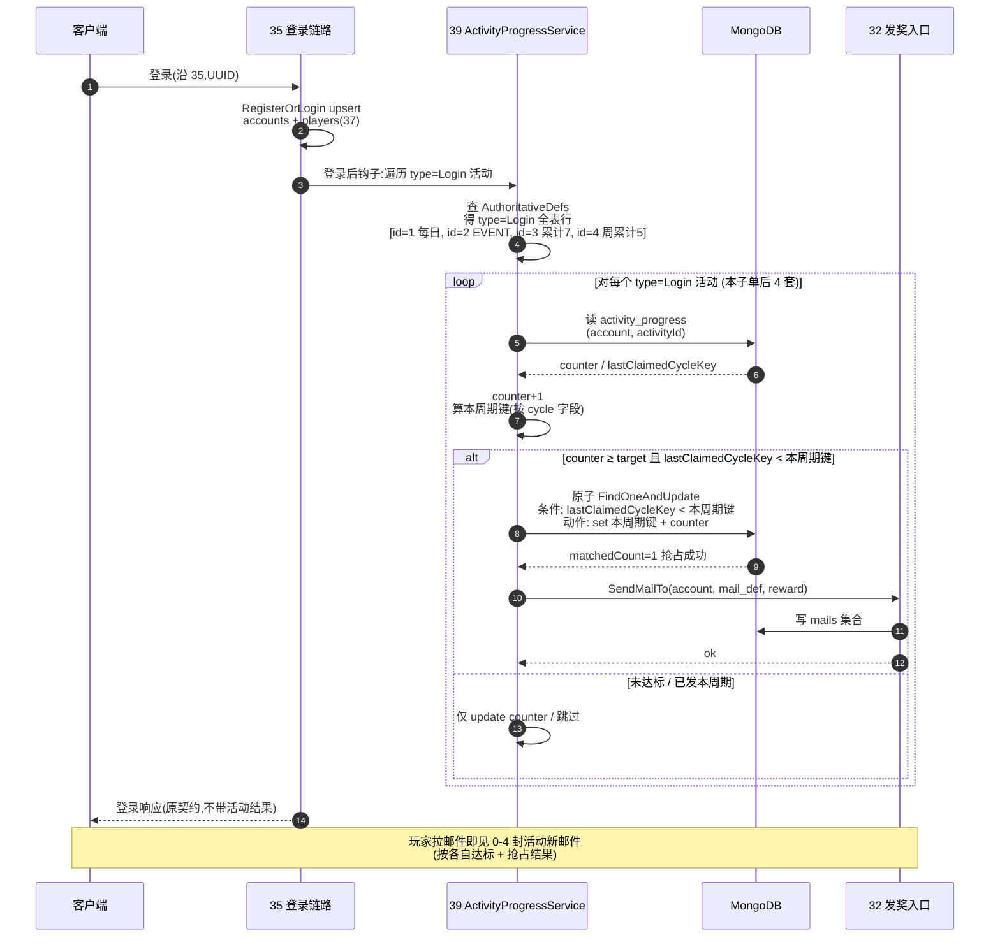

# Login 类活动批量扩档 · 共享登录节律(Tier 4 第 3 子单)

把 [Tier 4 第 1 子单 §3.5](#39-activity-server::trigger) 旁注「未来若加累计登录 N 天 / 连续登录 N 天等共享此节律」兑现:在已建的 [ActivityProgressService](#39-activity-server::orchestrate) 「登录后钩子 → 遍历 `type=Login` 活动 → 各自 `counter+1` + 判达标 + 发奖」流程上,**批量加 2 套新 Login 类活动配置**(无新节律实现、无新触发节律、无新协议),验证「同一节律支撑多个 `type=Login` 活动」的扩展性,并交付一套阶梯式累计登录活动模板供运营复用。

> [!WARNING]
> **读前必看 · 五条边界**
>
> - **本子单是「配置层 + 服务端遍历语义验证」,不新增节律实现。** 三类未实做节律(`Cumulative` / `Schedule` / `Action`)**留 [O3](#39-activity-server::open) 不动**;本子单只在已实做的 `Login` 节律上加 2 套新配置行,验「同一节律多活动并发」语义。
> - **客户端工程零 diff,本子单纯 server only。** 客户端工程不动一行;活动结果走玩家邮箱(沿 [21/32 客户端段](#32-mail-server) 已落地)可观测。
> - **不动 [39 ActivityDef schema / activity_progress schema / 32 SendMailTo 签名](#39-activity-server::config)。** 仅在 `activity.xlsx` 加 2 行 + 服务端 `AuthoritativeDefs` 注册 + 视需要在 `mail.xlsx` 加 1-2 行邮件模板(沿 [§3.4 兜底口径](#39-activity-server::orchestrate),`mail_def` 复用 7001 也合法、不强加新模板)。
> - **与 [第 1 子单每日登录奖(`activity_id=1`)](#39-activity-server) 共存且零回归。** 三个 `type=Login` 活动在登录链路 **同一钩子内** 各自走「读自己的 `activity_progress` 文档 + `counter+1` + 判达标 + 抢占 + 发奖」流程,互不污染(沿 [§3.2 复合主键 `{account}_{activityId}`](#39-activity-server::storage)),「每日登录奖」既有行为完全不变。
> - **与 [第 2 子单 EVENT 解锁活动(`activity_id=2`)](#40-event-unlock-relay) 共存。** EVENT 活动是 `type=Login + cycle=OneShot + target=7`,本子单加的两套也是 `type=Login`,登录钩子遍历到 EVENT 时该套也照常 `counter+1`(EVENT 计数器从 1 长到 7 是本子单加的活动起作用之前就已存在的行为,EVENT 达标语义不变)。

> [!NOTE]
> **立项信息** {#intro}
>
> | 项 | 内容 |
> | --- | --- |
> | **类型** | 全栈特性 · Tier 4 活动系统第 3 子单 · 服务端段。出 code-free 设计意图 + 行为级配置契约 + 行为级验收,交服务端段(`activity.xlsx` 加 2 行 + 视需要 `mail.xlsx` 加 1-2 行 + `AuthoritativeDefs` 注册新行 + 登录钩子若实现的是「单活动 if 取 `activity_id=1`」需改为「按 `type=Login` 全表遍历」)落地;客户端工程零 diff。 |
> | **方向约束** | 离线还原 · **去变现**:活动奖来自礼包随机库(同 30/31/32/33 路径)沿 [39 reward 字段语义](#39-activity-server::config),不引入付费 / VIP 任务。**加法式 + 复用至上**:不动 [39 ActivityDef schema](#39-activity-server::config) / [activity_progress schema](#39-activity-server::storage) / [32 SendMailTo 签名](#32-mail-server::source-api) / [39 §3.4 发奖编排](#39-activity-server::orchestrate) / [§3.5 Login 触发节律](#39-activity-server::trigger);新增全在配置层(`activity.xlsx` 2 行 + `mail.xlsx` 最多 2 行) + 服务端 `AuthoritativeDefs` 注册 + 登录钩子的「按 `type` 过滤遍历」语义验证(若现状已正确实现则零代码改)。 |
> | **需求降层** | **a. 表层要求**(简报字面):Tier 4 活动系统第 3 子单 = 批量加 2-3 套 Login 类活动配置 + 扩 ActivityProgressService 使 Login 触发遍历**所有** `type=Login` 活动;典型候选 = 累计登录 N 天阶梯奖 / 连续登录 N 天奖。 **b. 底层目的**(为玩家 / 运营 / 工程达成什么):**对玩家**——除了「每日登录得一封小奖邮件」(第 1 子单),新增「累计登录到第 N 天得阶梯大奖」类长期激励,让回流玩家也有累计目标(与 EVENT 解锁的「累计 7 次解锁头像」语义互补,EVENT 是头像专属、本子单是常规奖)。**对运营**——验证「同一节律(`type=Login`)支撑多个并行活动」的架构能力,后续运营要加新 Login 类活动只需配 1 行(无需 server-dev 改代码);**对工程**——兑现 [39 §3.5 旁注](#39-activity-server::trigger)「未来若加累计登录 N 天 / 连续登录 N 天等共享此节律」,从「架构上声明可扩展」升为「真实存在 ≥ 3 套 Login 活动并行验过」,扩展能力从「猜测」变「证实」。 **c. 有无更直达 b 的做法**:b 的本质 = 「同节律多活动并发跑通 + 提供一套阶梯类活动模板」。直达做法对比: **方案 A(本子单采纳)** — 加 2 套不同 cycle 的 Login 活动(累计 7 天 OneShot + 周累计 5 天 Weekly),配置层验证 3 个 `type=Login` 活动各自周期键独立。**方案 B(放弃)** — 加 1 套「累计登录 N 天阶梯奖」用「同一活动多档奖励」表达(类似 [22/33 排行榜 RankRewardTier 同 id 多行聚合](#22-rank-system)),给 1 个 activity_id 配 `target=7/15/30` 三档奖。**方案 B 否的理由**:① 违 [39 ActivityDef schema](#39-activity-server::config) 一行一活动单字段 reward 语义,要么扩 schema(加多档子表)要么把 `target/reward` 改成列表——任一都违「不动 39 schema」守不变量;② 阶梯档判定要在 [§3.4 发奖编排](#39-activity-server::orchestrate) 内加「逐档比对 + 多周期键」逻辑,违「不动发奖编排」;③ 实际等价 = 用 3 个 `activity_id` 各 1 档配置就能表达(本子单方案 A),无需改 schema。**方案 C(放弃)** — 加「连续登录 N 天」(中断需重置 counter,与「累计」语义不同)。**方案 C 否的理由**:连续登录需要额外「上次登录日期」字段判中断重置,违 [activity_progress schema 零字段加](#39-activity-server::storage);本子单架构层验证不引入新字段,「连续登录」作为独立需求列 [§七 O3](#43-activity-login-batch::open) 待后续刀,需扩 schema 时再做。**结论**:取方案 A — 2 套累计登录类活动(OneShot 累计 7 天大奖 + Weekly 周累计 5 天复用奖)+ 验证遍历语义,纯配置层、零 schema 改、零节律新建。 |
> | **范围(产品 · 玩法)** | **服务端段交付**:① `activity.xlsx` 加 2 行新 Login 类活动行(见 [§3.2](#43-activity-login-batch::activities));② `mail.xlsx` 加 1-2 行活动结算邮件模板(可选,见 [§3.4 兜底口径](#43-activity-login-batch::mail));③ `giftrandom.xlsx` 加 2 行新奖励礼包(累计 7 天大奖 + 周累计 5 天奖,见 [§3.3](#43-activity-login-batch::rewards));④ 服务端 `AuthoritativeDefs` 注册新活动 / 礼包 / 邮件模板行;⑤ 验证服务端登录钩子是「按 `type=Login` 全表遍历」非「硬编码 if `activity_id=1`」(若现状已正确遍历则零代码改,详 [§3.5](#43-activity-login-batch::iterate))。 **服务端段不动**:[39 ActivityDef schema](#39-activity-server::config) / [activity_progress schema](#39-activity-server::storage) / [§3.4 发奖编排](#39-activity-server::orchestrate) / [§3.5 Login 触发节律](#39-activity-server::trigger) / [32 SendMailTo 签名](#32-mail-server::source-api) / [既有六全栈 + 35/36/37/38](#39-activity-server::relations) 任何代码。 **客户端段不动**:任何 `Assets/` 代码。 **协议**:**无新增客户端协议**(沿 [39 §四](#39-activity-server::degrade) 服务端内部触发口径)。 |
> | **关键约束** | 服务端遵 Fantasy.Net 既有约定(配置加载 / MongoDB 存储 / 不手改生成物 / 不手动注册);**新增活动行的 cycle 选取须使「与每日登录奖(`cycle=Daily`)」+ 「EVENT 解锁(`cycle=OneShot`)」三套并存时,周期键算法各自独立**(沿 [39 §3.3](#39-activity-server::cycle));`mail_def` 选取若复用 [第 1 子单 7001](#39-activity-server::config) 邮件模板也合法(沿 [§3.4 兜底口径](#39-activity-server::orchestrate))但视觉无区分;`reward` 须指向 [giftrandom](#16-item-system::gift) 实存库 id。本篇正文为 code-free 配置契约,不含字段代码名 / 类名 / 文件路径——server-dev 据行为语义定字段名 / `AuthoritativeDefs` 注册形态 / 登录钩子遍历实现。 |

## 二、现状审计(给定基线证据) {#audit}

| 简报描述 / 现状 | 现状证据 / 设计基线 | 本子单据此处置 |
| --- | --- | --- |
| 简报「典型候选:累计登录 N 天阶梯奖、连续登录 N 天奖」 | [39 §3.5 旁注](#39-activity-server::trigger) 明示「未来若加累计登录 N 天 / 连续登录 N 天等共享此节律」 | **取「累计 N 天」类**(沿用 `counter` 自然递增 + 周期键判已发,零 schema 改);**「连续 N 天」类列 O3 后续刀**(需「上次登录日期 + 中断重置」字段,违 schema 零字段加,见 [立项框 c.方案 C](#43-activity-login-batch::intro)) |
| 简报「扩 ActivityProgressService 使 Login 触发遍历所有 type=Login 活动」 | [39 §3.5 节律表](#39-activity-server::trigger) 明示「对该账号所有 `type=Login` 的活动各自走 ... 流程」(已规范层声明遍历语义) | **本子单是「兑现 + 验证」**:若 server-dev 第 1 子单实现已按 `type=Login` 全表遍历 → 零代码改、纯配置加行验证扩展;若实现是硬编码「`if activityId==1`」单活动判定 → 需改为遍历(见 [§3.5](#43-activity-login-batch::iterate)) |
| 简报「具体活动 plan 决定,典型候选 = 累计 / 连续 N 天」 | GDD 无活动具体清单(见 [39 §二审计 第 4 行](#39-activity-server::audit));[设计 13 §「不做」清单](#13-piety-temple-repair) 提到「~9 套活动」是排除项;无产品锁定的清单 | **plan 自治拍板**:取「累计 7 天 OneShot + 周累计 5 天 Weekly」两套(数值理由见 [§3.2](#43-activity-login-batch::activities)),`activity_id=3, 4` 分配(沿 [39 第 1 子单 `id=1` + 40 第 2 子单 `id=2`](#40-event-unlock-relay::activity) 占位段);具体清单 9 套留运营 [O1](#43-activity-login-batch::open) |
| 简报「mongod 须在,否则验收 BLOCKED 非 FAIL」 | [39 §八 BLOCKED 边界](#39-activity-server::accept) 已定口径;[全局 memory](#) 「本机 MongoDB 便携版 mongod 在 D:\mongodb-portable」 | **沿用** BLOCKED 口径(SV9 真往返不可达时);[server-test 按 BLOCKED 处理](#39-activity-server::accept) |
| 简报「不影响第 1 子单每日登录奖现有行为(零回归)」 | [39 §3.2 复合主键 `{account}_{activityId}`](#39-activity-server::storage) 天然隔离不同 activityId 文档;[§3.4 发奖编排](#39-activity-server::orchestrate) 每活动一次原子 `FindOneAndUpdate` 互不干涉 | 零回归是**架构天然保证**(每活动独立文档);本子单只在「登录钩子是否真按 `type=Login` 遍历(非硬编码单 id)」一处验证(SV3) |

## 三、设计正文 {#detail}

### 3.1 新增活动 plan 拍板原则 {#principles}

为避免本子单与第 1 / 第 2 子单的活动数值 / 节律重叠,新增的 2 套活动遵循以下分流原则:

| 维度 | 第 1 子单(`id=1`) | 第 2 子单(`id=2`) | 本子单 A(`id=3`) | 本子单 B(`id=4`) |
| --- | --- | --- | --- | --- |
| 语义 | 每日登录得小奖 | 累计 7 次登录得头像 | **累计 7 天登录得大奖**(常规礼包,与 EVENT 头像区分) | **周累计 5 天登录得周奖**(可重复周拿) |
| `type` | `Login` | `Login` | `Login` | `Login` |
| `cycle` | `Daily`(每天重置 + 每天发) | `OneShot`(永发一次) | `OneShot`(永发一次) | `Weekly`(每周一重置 + 每周发) |
| `target` | 1 | 7 | 7 | 5 |
| 奖励性质 | 小:体力 / 金币 | 头像 EVENT 解锁 | 中:钻石礼包 | 小-中:金币 + 体力礼包 |
| 玩家感知 | 每日小确幸 | 累计 7 次解锁限定头像 | 累计 7 天得「累计奖励」大奖(与每日奖区分) | 每周打满 5 天得周奖(回流抓手) |

**为何不在本子单做「连续 N 天」**:连续登录需要新字段(「上次登录日期 + 是否中断重置 counter」)违 [activity_progress schema 零字段加](#39-activity-server::storage),且语义上「连续中断重置」与「累计自然递增」是两类节律(连续是 [§3.5 Action 类](#39-activity-server::trigger) 的退化形态而非纯 Login 累计),需独立设计;列 [§七 O3](#43-activity-login-batch::open) 后续刀。

### 3.2 两套新 Login 活动配置(`activity.xlsx` 加 2 行) {#activities}

沿 [39 §3.1 字段集](#39-activity-server::config) 不动 schema,加两行:

| `activity_id` | `name_text_id` | `desc_text_id` | `type` | `cycle` | `target` | `reward` | `mail_def` | `start_at` | `end_at` |
| --- | --- | --- | --- | --- | --- | --- | --- | --- | --- |
| 3 | 390005 | 390006 | `Login` | `OneShot` | 7 | 5003 | 7003 | 0 | 0 |
| 4 | 390007 | 390008 | `Login` | `Weekly` | 5 | 5004 | 7004 | 0 | 0 |

> **活动 3(累计 7 天大奖,OneShot 永发一次)** — 玩家累计登录 7 天后服务端在第 7 次登录时发一次中型礼包(钻石为主),`OneShot` 周期键 = 1 永不重发(沿 [39 §3.3](#39-activity-server::cycle));与活动 2(EVENT 头像解锁)`target` 同为 7 但 reward 不同(活动 2 → 6101 EVENT 礼包;活动 3 → 5003 钻石礼包),**两活动在同一第 7 次登录时同时达标 + 各自抢占 + 各自发邮件**(玩家邮箱当次收到 2 封新邮件,沿 [§3.6](#43-activity-login-batch::flow) 时序图)。
>
> **活动 4(周累计 5 天奖,Weekly 每周重发)** — 玩家本周累计登录 5 天后服务端在第 5 次登录(本周内)时发一次小-中型礼包(金币 + 体力为主),周期键 = 本周一 0:00 服务端时钟 ticks(沿 [39 §3.3](#39-activity-server::cycle)),跨周日 24:00 → 周一 0:00 自然重置(`counter` 跨周清零、`lastClaimedCycleKey < 新周键` 重新抢占)。

**`counter` 跨周期重置语义沿 [39 §3.2 旁注](#39-activity-server::storage):** `cycle=Weekly` 跨周清零,`cycle=OneShot` 不清零(达标后停留在 ≥ target 值,但发奖判定靠 `lastClaimedCycleKey=1` 拦截不重发)。本子单**不在 activity_progress schema 里加「周首日 counter」字段**,服务端在判定时按「本周期内首次进入(`lastClaimedCycleKey < 本周期键`)→ counter 清零再 +1」处理(沿 [39 §3.3 周期键](#39-activity-server::cycle) 同范式,server-dev 按 Fantasy.Net 既有 ActivityProgressService 实现处置)。

### 3.3 两套新奖励礼包(`giftrandom.xlsx` 加 2 行) {#rewards}

沿 [16 §3.6 礼包随机库](#16-item-system::gift) 同范式,礼包内可单项必中也可多项加权;本子单两套均取**单项必中**(运营要做随机抽多项另开):

| 所属礼包 | 奖品 | 数量 | 权重 | 说明 |
| --- | --- | --- | --- | --- |
| 5003 | (钻石 num_id) | 100 | 100 | 活动 3 累计 7 天大奖,中型钻石包(具体 num_id 由 server-dev 据 [15 num.xlsx](#15-numeric-system) 钻石定义对齐;若工程已有「钻石 num_id」常量则照用;100 钻石数值按现有 [37 PropertyChangeRequest](#37-player-attr-server::internal-api) 上界 999999 内,中等量级) |
| 5004 | (金币 num_id) | 500 | 50 | 活动 4 周累计 5 天奖,金币 500 |
| 5004 | (体力 num_id) | 5 | 50 | 活动 4 周累计 5 天奖,体力 5(与金币 50:50 权重各 50% 概率抽中,玩家每周收一种小奖) |

> **礼包 5004 多行加权**:沿 [16 §3.6](#16-item-system::gift) 同 id 多行聚合,服务端按权重抽 1 项(权重 50:50 各 50% 概率)。**若 server-dev 嫌权重抽奖增量复杂**,可砍为单项必中(取金币 500 / 体力 5 二选一)— 不影响架构验证,记 [§七 O4 待裁](#43-activity-login-batch::open)。

**真接「邮件 → 道具 → 货币」路径需先确认 [16 道具表](#16-item-system::schema) 中「金币 / 钻石 / 体力」的对应行 id 是否已存在**(沿 [16 §3.7 货币使用效果](#16-item-system::useeffect)`useEffect=1 货币 + 效果目标=num_id`):
- 若已存在 → 礼包行 `奖品` 字段填该道具 id(不是 num_id 而是道具 id),server-dev 据 [16](#16-item-system::enum) 现状直接复用;
- 若不存在(简报 [16 §3.3 样例 30001-30008](#16-item-system::enum) 是图案 / 材料,无货币道具行) → server-dev 加 3 行货币道具(钻石 / 金币 / 体力 各 1 道具 `useEffect=1 货币 + 效果目标=对应 num_id + 自动使用=1`,沿 [40 §3.3 EVENT 道具 30101](#40-event-unlock-relay::item) 同范式);**这一项归本子单的「奖励落点」必要前置**,详 [§七 O5](#43-activity-login-batch::open) 范围处理。

### 3.4 邮件模板(`mail.xlsx` 加 1-2 行,可砍) {#mail}

沿 [32 §3.5 服务端发奖入口](#32-mail-server::source-api) + [39 §3.4 兜底口径](#39-activity-server::orchestrate),`mail_def=0` 或邮件模板缺失时用占位文案(110806 / 110805)仍能挂奖投出。本子单两套活动各取一档处理:

| `mail_def` | 模板用途 | 处置 |
| --- | --- | --- |
| 7003 | 活动 3「累计 7 天大奖」邮件标题/正文 textId | **可选加** — 占位文案投出也合法;运营要做差异化文案则加 mail.xlsx 一行 |
| 7004 | 活动 4「周累计 5 天奖」邮件标题/正文 textId | 同上 |

**plan 默认决策**:`mail_def=7003 / 7004` 写进活动配置 + `mail.xlsx` 加 2 行占位 textId(沿 [39 第 1 子单 `mail_def=7001` 范式](#39-activity-server::config)),若 server-dev 嫌引入 textId 翻译表增量繁则砍 2 行 mail 模板、活动配置 `mail_def` 字段写 0 走 [39 §3.4 兜底](#39-activity-server::orchestrate);两种走法对 SV / E 验收都通过(SV8「`mail_def=0` 兜底文案投出」已在 [39](#39-activity-server::accept) 验过)。

### 3.5 「登录后钩子遍历所有 `type=Login` 活动」语义验证 {#iterate}

[39 §3.5](#39-activity-server::trigger) 节律表声明:**「登录后钩子:对该账号所有 `type=Login` 的活动各自走 ... 流程」**。本子单兑现「3 个 `type=Login` 活动在同一登录钩子内各自独立处理」并验证:

> **关键观察**:**遍历必须是「按 `type=Login` 字段过滤的全表迭代」,不能硬编码 `if activityId==1` 处理一套**。第 1 子单 server-dev 实现现状若已正确遍历(本子单 plan **不读工程代码**,以 [§3.5 规范声明](#39-activity-server::trigger) 为基线、SV3 现场验证)→ 本子单零代码改;若实现是单活动硬编码 → 改为按 type 遍历(server-dev 接 dev 增量,见 [§六 与 39 关系](#43-activity-login-batch::relations))。
>
> **同次登录多活动并发抢占**:同次登录触发钩子内顺序处理 3 / 4 个活动,**不是并发**(单连接、单事件循环);并发场景是「同账号两连接同时登录」(沿 [39 §五](#39-activity-server::walk) 同账号并发原子)。同次登录的「同时达标 多活动」由顺序处理 + 每活动各自原子条件写自然满足(各自一次 `FindOneAndUpdate`)。

### 3.6 整局走查 · 三 / 四套 Login 活动并存的关键场景 {#flow}

| 场景 | 预期行为 | 沿用对策 |
| --- | --- | --- |
| **第 1 次登录**(新账号) | 同时触发:活动 1 `counter=1≥1` 达标 + 抢占 today key → 发 7001 邮件;活动 2 `counter=1<7` 不达标;活动 3 `counter=1<7` 不达标;活动 4 `counter=1<5` 不达标(`Weekly` 本周键已写入 `lastClaimedCycleKey` 字段?**否**——只写 `counter`,周期键仅在抢占成功才写,沿 [39 §3.4](#39-activity-server::orchestrate)) | [§3.4 抢占判据](#39-activity-server::orchestrate) |
| **第 7 次登录**(同账号,同一日内连登 7 次) **注:`Daily` 与 `OneShot` 的「累计」语义在「同一日内」与「跨日」表现不同** | 活动 1 `counter` 同日内 `lastClaimedCycleKey=today key` 跳过(每日只发一次);活动 2 `counter=7≥7` 达标抢占 OneShot key=1 → 发 EVENT 礼包邮件;活动 3 `counter=7≥7` 达标抢占 OneShot key=1 → 发活动 3 大奖邮件;活动 4 `counter=7≥5` 本周内已达标 → 抢占 Weekly key(本周一 ticks)→ 发活动 4 周奖邮件;**第 7 次同次登录玩家邮箱收 3 封新邮件**(活动 2/3/4 各一封) | [§3.4 抢占判据](#39-activity-server::orchestrate) + [§3.2 复合主键独立](#39-activity-server::storage) |
| **第 8 次登录**(同账号,同日再连) | 活动 1 跳过(Daily 已发);活动 2 `1<1`=false 跳过(OneShot 已发);活动 3 `1<1`=false 跳过(OneShot 已发);活动 4 本周内 `本周键<本周键`=false 跳过(Weekly 本周已发);**第 8 次同日同次再连邮箱无新邮件** | [§3.3 OneShot/Weekly 周期键](#39-activity-server::cycle) |
| **跨日(次日凌晨后)第 1 次登录** | 活动 1 today key 变 → `lastClaimedKey<新 today key` 抢占 → 发新一封每日邮件;活动 2/3 已 OneShot key=1 不变 → 跳过(永发停);活动 4 若仍在本周内 → 跳过(本周已发);若跨周一 0:00 之后 → 本周键变 + counter 已 ≥ target → 抢占 → 发新一封周奖邮件 | [§3.3 跨周期](#39-activity-server::cycle) |
| **跨周一 0:00 第一次登录**(同账号,处于活动 4 已结上周后) | 活动 4 本周键 > `lastClaimedCycleKey=上周一 ticks` → 但 counter 是否清零?**按 [§3.2 旁注](#43-activity-login-batch::activities)** 服务端在判定时按「本周期内首次进入 → counter 清零再 +1」处理,故 `counter=1<5` 不达标(本周首登)、不发奖、玩家需继续连登到 5 天 | [§3.3 周期键 + counter 清零语义](#39-activity-server::cycle) |
| **同账号并发两连接同时登录(连点 / 多端)** | 每活动各自 `FindOneAndUpdate` 条件写抢占,matchedCount=1 仅一次发奖;另一连接抢占失败跳过(沿 [39 §3.4](#39-activity-server::orchestrate));**3 个活动各自只发 1 封,不双发** | [39 §3.4 原子键](#39-activity-server::orchestrate) |
| **第 1 子单(`id=1`)行为零回归** | 活动 1 `Daily / target=1 / reward=5001 / mail_def=7001` 字段未改;**登录钩子从「按 type 遍历」迭代到 `id=1` 时与第 1 子单 PASS 后行为完全一致**(发 7001 邮件) | [§3.2 主键独立](#39-activity-server::storage) + SV3 验证 |
| **第 2 子单(`id=2`)行为零回归** | 活动 2 EVENT 解锁 OneShot/target=7/reward=6101/mail_def=7002 字段未改;**第 7 次登录达标抢占 OneShot key=1 + 投 EVENT 礼包邮件**与第 2 子单 PASS 后行为一致 | [§3.2 主键独立](#39-activity-server::storage) + SV5 验证 |

## 四、服务异常下的行为 {#degrade}

沿 [39 §四 服务异常](#39-activity-server::degrade) 已有口径,本子单只新增配置层 → 行为与第 1 / 第 2 子单完全一致;新增三 / 四套并存的关键异常补充:

| 情形 | 服务端行为 | 为什么 |
| --- | --- | --- |
| 4 套 Login 活动中某 1 套配置缺(如 `activity_id=4` 行未导入) | 服务端遍历 `type=Login` 不到该行,该套跳过;其余 3 套照常处理;登录链不抛 | 沿 [39 §四 配置缺行为](#39-activity-server::degrade) |
| 4 套中某 1 套 `reward` 礼包未登记(如 `5004` 未配 giftrandom) | 该套照常抢占 + 投邮件挂未登记 reward id;玩家领取时 [32 §3.4](#32-mail-server::claim-resp) 「抽取查无 → 成功但奖励列表空」 | 沿 [39 §四 + 32 已有口径](#32-mail-server::claim-resp) |
| 4 套中某 1 套 `mail_def` 邮件模板缺(7003/7004 缺) | 该套用占位文案 110806/110805 投出,奖仍挂 | 沿 [39 §3.4 兜底](#39-activity-server::orchestrate) |
| 同次登录 4 套同时达标 + 3 / 4 套抢占成功 + 第 4 套 SendMailTo 中途崩 | 已抢占的 3 套 `lastClaimedCycleKey` 已写、3 封邮件已投;第 4 套 `lastClaimedCycleKey` 已写但邮件未投 = 漏发窄窗(沿 [39 §3.4 claim-then-act](#39-activity-server::orchestrate)) | 沿 [39 §四 + §五 「漏发窄窗」诚实取舍](#39-activity-server::walk):漏发可补 + 不超发,优于反向次序 |
| 4 套全部达标 + 邮件箱已达上限(沿 [21 §3.4 maxCount=100 + retainDays=30](#21-mail-system)) | 沿 [21 §3.4 超量清理 + 32 拉列表 retain_days 服务端过滤](#21-mail-system) — 邮箱不会因本子单 3 封额外邮件破上限(100 上限对 4 套小活动充裕);若运营后续把 9 套全开 + 都 OneShot 每账号一次性收 9 封 → 仍在 100 上限内 | 不引入新邮箱清理策略,沿 21 既有 |

## 五、整局走查 · 关键崩法与对策 {#walk}

把「新账号 1-8 次连登 + 跨日 / 跨周」整条链跑一遍,逐机制点出最可能崩的类(零值 / 满值 / 并发 / 中途存档 / 恶意利用)+ 对策:

| 机制 | 最可能的崩法 | 类别 | 对策 |
| --- | --- | --- | --- |
| 登录钩子按 `type` 遍历 | server-dev 第 1 子单实现是硬编码 `if activityId==1`(单活动)→ 加新活动行后服务端忽略不处理 → 玩家从不得活动 3/4 奖 | 范围 / 接入 | [§3.5](#43-activity-login-batch::iterate) 明确要求按 type 遍历 + SV3 验证遍历正确(模拟 3 / 4 套并存 + 触发登录 + 查 `activity_progress` 集合 4 个文档同时被处理) |
| `Weekly` 周期键算 | 第 1 子单未实现 `Weekly` 节律(只实 `Daily / OneShot`),活动 4 引入 `Weekly` 后周期键算错(如取自然周还是 ISO 周?跨年周边界?) | 零值 / 边界 | [§3.3 周期键表](#39-activity-server::cycle) 已声明「`Weekly` = 本周一 0:00 ticks」,server-dev 接 dev 增量按此实现,**ISO 周与自然周边界以服务端时区为准**(同 [39 §3.3](#39-activity-server::cycle) 服务端时钟口径);SV6 模拟跨周一 0:00 验证周期键变更 |
| Weekly `counter` 跨周重置 | server-dev 沿用 Daily 跨日清零代码路径处理 Weekly,但 Daily 是「每次登录 +1 后判 today key」,Weekly 是「本周内累计登录次数」,counter 含义不同 → 实现混淆致跨周不清零或同日重复加 | 零值 / 边界 | [§3.2 旁注](#43-activity-login-batch::activities) 明确「按本周期内首次进入(`lastClaimedCycleKey < 本周期键`)→ counter 清零再 +1」;SV6 验证活动 4 跨周一 0:00 + 同账号 1 次登录 → counter=1 而非累加上周 |
| OneShot 永发幂等(活动 3) | 活动 2(EVENT)+ 活动 3 同为 OneShot/target=7,第 7 次登录两活动同时达标 → 同次登录两活动各自抢占 OneShot key=1 → 双发 EVENT 邮件 + 大奖邮件 | 配置 / 期望 | **预期行为不是崩**:两活动 `activity_id` 不同 → `activity_progress` 文档不同 → 各自独立抢占 → 各自发邮件(同次登录玩家邮箱多 2 封,沿 [§3.6 第 7 次登录场景](#43-activity-login-batch::flow));[§3.2 复合主键独立](#39-activity-server::storage) 自然防交叉 |
| 同账号并发两连接同时第 7 次登录 | 4 套活动 × 2 连接 = 8 次潜在抢占;每活动只应一次成功 | 并发 | [39 §3.4 原子条件写](#39-activity-server::orchestrate) 沿用;每活动 `FindOneAndUpdate` 条件 `lastClaimedCycleKey<本周期键` → 仅一次 matchedCount=1;SV7 模拟并发 |
| 玩家本机改本地时钟想催 `Weekly` 重置 | 客户端改本地时钟跨「假周一 0:00」想让活动 4 提早发周奖 | 恶意利用 | [§3.3 服务端时钟](#39-activity-server::cycle):周期键以服务端时区算,客户端本地时钟无关;同 [33 §3.1](#33-rank-settle-server::due) |
| 多活动达标但 SendMailTo 串崩 | 4 套全达标顺序处理 1→2→3→4,第 3 套 SendMailTo 抛异常致流程整体中断 → 第 4 套未处理 | 中途存档 | server-dev 实现按 [39 §3.4](#39-activity-server::orchestrate) 「失败跳过不抛」语义,**单活动 SendMailTo 失败不中断后续活动遍历**(try / 错误隔离);SV12 Code Review 核 |
| `mail.xlsx` `mail_def=7003 / 7004` 多语言 textId 未配 | 邮件标题 / 正文显示文本 id 字面值(玩家看到「@390005@」)| 配置 | sentinel 配置可,占位 textId 沿 [num/item/mail 占位口径](#39-activity-server::config);多语言文本翻译表归 [O7 后续](#43-activity-login-batch::open) |

> [!WARNING]
> **承认的固有限制(诚实边界)**
>
> 本子单**守的**:① 3 / 4 套 `type=Login` 活动在同一登录钩子内各自独立处理(架构扩展能力验证);② 各套独立的 cycle 周期键 + 原子幂等(`Daily / OneShot / Weekly` 三种 cycle 并存正确);③ 跨日 / 跨周 `counter` + `lastClaimedCycleKey` 正确变迁;④ 第 1 / 第 2 子单零回归(活动 1 / 2 既有行为完全不变);⑤ 配置层引用一致性(`activity.reward → giftrandom.所属礼包 → item.id → num_id` 链路实存)。
>
> 本子单**不守的**:① 「连续登录 N 天」类活动(需扩 schema 加「上次登录日期 + 中断重置」,违 [§3.2 schema 零字段加](#39-activity-server::storage),列 [O3](#43-activity-login-batch::open));② `Cumulative / Schedule / Action` 类节律实现(沿 [39 §3.5 留 O3](#39-activity-server::trigger));③ 9 套活动全部清单(只交付 2 套新行,具体 9 套留运营 [O1](#43-activity-login-batch::open));④ 客户端 UI 展示活动入口 / 进度条(沿 [39 O4 后续](#39-activity-server::open));⑤ 严格账号级幂等(沿 [39 O7](#39-activity-server::open));⑥ 多语言文本翻译表(textId 占位,[O7](#43-activity-login-batch::open));⑦ 跨设备 `activity_progress` 同步(沿 [40 O6 Tier 3 范围](#40-event-unlock-relay::open));⑧ 「同次登录多活动达标」的事务原子(单活动原子 ✓;多活动间无事务,某活动中途崩可能 N 套已发 + N+1 套未发 = 玩家漏部分奖,运营可补)。

## 六、与既有特性的关系 {#relations}

| 既有 | 本子单与其关系 | 是否改动 |
| --- | --- | --- |
| [设计 39 Tier 4 第 1 子单](#39-activity-server) | **配置层加 2 行 + 验证遍历语义**;§3.5 旁注「未来若加累计登录 N 天等共享此节律」由本子单兑现;§七 O1 / O2 状态从「不在本子单」更新为「本子单兑现增 2 套 Login 类活动」;§3.5 节律表 `Login` 行「本子单状态」从「本子单实现(每日登录奖示例)」更新为「第 1 / 第 3 子单累计兑现 3-4 套并存」 | **39 设计稿同步重写**:§3.5 节律表 + §七 O1 / O2 状态说明 + §3.6 跑通示例若需加「多活动并存」备注(由本子单同任务内同步) |
| [设计 40 Tier 4 第 2 子单 server 段](#40-event-unlock-relay) | EVENT 活动(`activity_id=2`)是 `type=Login` 之一,本子单加新 Login 活动后 EVENT 仍照常处理(沿 [§3.6 第 7 次登录场景](#43-activity-login-batch::flow));40 设计稿无需改动 | 零改动 |
| [设计 41 Tier 4 第 2 子单 client 段](#41-event-unlock-client) | 客户端 EVENT 解析 + 适配器与本子单正交,本子单加的活动 3/4 reward 是常规货币礼包(非 EVENT),走 [16 §3.7 货币 useEffect=1 + 17 通用奖励展示](#16-item-system::useeffect) 既有路径,不动 41 客户端 | 零改动 |
| [设计 32 §3.5 SendMailTo](#32-mail-server::source-api) | 完全沿用,签名零改 | 零改动 |
| [设计 33 排行榜结算](#33-rank-settle-server) | 与本子单无交集(本子单是活动 Login 节律,33 是排行榜结算节律) | 零改动 |
| [设计 16 道具系统 `giftrandom`](#16-item-system::gift) | 加 2 套礼包行(`5003 / 5004`);若 [16 道具表](#16-item-system::enum) 无货币道具(`useEffect=1`)→ server-dev 同任务内补 3 行货币道具(钻石 / 金币 / 体力),沿 [40 §3.3 EVENT 道具](#40-event-unlock-relay::item) 同范式;**本子单建议但不强制**[16 §3.3 货币道具行的补充](#16-item-system::enum)(详见 [§七 O5](#43-activity-login-batch::open) 范围处理) | giftrandom.xlsx 加 2-3 行;item.xlsx 视现状或加 0 行(已有货币道具) / 加 3 行货币道具 |
| [设计 15 num.xlsx](#15-numeric-system) | 钻石 / 金币 / 体力 num_id 沿用既有定义(本子单不新增数值类型) | 零改动 |
| [设计 17 通用奖励展示](#17-reward-display) | 活动 3/4 玩家领奖后用 17 RewardView 展示「钻石 +100」等,沿 [21/32 领奖归一展示](#32-mail-server::claim-resp) | 零改动 |
| [设计 18 玩家信息](#18-player-info) | 与本子单正交(本子单不涉头像) | 零改动 |
| [设计 21 邮件 / 32 客户端段领奖链](#21-mail-system) | 活动 3/4 邮件落玩家邮箱,沿既有拉列表 + 领奖链(已落地) | 零改动 |
| [设计 37 玩家属性服务端](#37-player-attr-server) | 活动 3/4 玩家领奖时,客户端经 [32 §3.4 领取链](#32-mail-server::claim-resp) 拿到 `(钻石道具 id, 100)` 等,客户端段 [16 §3.7 货币使用效果](#16-item-system::useeffect) 路径调 [37 PropertyChangeRequest](#37-player-attr-server::internal-api) 增加余额(沿 [38 客户端段 ItemGrant 已接入服务端属性 PASS](#38-player-attr-client)),整链已通 | 零改动 |
| [设计 38 玩家属性客户端](#38-player-attr-client) | 同上,38 已 PASS 的 `ItemGrant + PlayerAttrService` 链路本子单借力 | 零改动 |
| 既有六全栈 + 35/36/37/38 + 39/40/41 | 本子单正交 + 同范式扩展,均不依赖其内部状态(配置层加行 + 验证遍历) | 零改动 |

## 七、待拍板清单(范围开关 + 可砍档) {#open}

自治授权下均取安全默认推进;列此交 boss / 用户复核,要改另开增量。

| # | 开关 | 安全默认 | 备选 / 触发改动 |
| --- | --- | --- | --- |
| O1 | 9 套活动具体清单 | **本子单不定 9 套清单**;本子单只交付 2 套新 Login 类活动(`id=3, 4`)验证架构扩展性;算上第 1 / 2 子单已交付的活动 1(每日登录奖)+ 活动 2(EVENT 解锁),Tier 4 累计交付 4 套活动 核心 | 9 套活动其余 5 套由 boss / 运营后续定具体名称 + 类型 + 数值,逐套刀加 `activity.xlsx` 行(若仍 `type=Login` 类 → 零代码改;若需 `Cumulative / Schedule / Action` → 见 O3 后续节律实做) |
| O2 | 本子单选 2 套累计登录类(`OneShot 7 天大奖 + Weekly 5 天周奖`) | **取**:OneShot 7 天大奖(累计验证) + Weekly 5 天周奖(`Weekly` 节律验证) 核心 | 备选:① 加第 3 套(累计 30 天月奖 OneShot) — 数值大、玩家长留抓手但本子单非必需;② 改为 7 天 / 14 天 / 30 天三档阶梯 — 违 schema 一行一活动(沿 [立项框 b 方案 B 否](#43-activity-login-batch::intro));③ 改 1 套为「连续登录 N 天」— 需扩 schema(O3) |
| O3 | 「连续登录 N 天」类活动 | **不做** — 需扩 [activity_progress schema](#39-activity-server::storage) 加「上次登录日期 + 中断重置」字段,违守不变量 后续 | 真做时:① schema 加 `lastLoginDate` 字段(服务端时钟 utc 日期);② 登录钩子按 `lastLoginDate` 判「是否昨日」决定 counter+1 还是 reset;③ 走单独 `type=ConsecLogin` 枚举档(避免与累计混);④ 算独立后续刀 |
| O4 | 活动 4 礼包(5004)单项必中 vs 多项加权 | **多项加权**(金币 500 / 体力 5 各 50% 概率) 增强 | 备选(可砍):单项必中(取金币 500 一项) — server-dev 嫌权重抽奖增量复杂时可砍,验收等价 |
| O5 | [16 道具表](#16-item-system::enum) 货币道具行(钻石 / 金币 / 体力)是否补全 | **取「视现状」**:server-dev 落地时若 [16 §3.3](#16-item-system::enum) 已有货币道具行(`useEffect=1 货币`)→ 礼包 `奖品` 字段直接复用;若不存在 → server-dev 同任务内补 3 行货币道具(沿 [40 §3.3 EVENT 道具](#40-event-unlock-relay::item) 范式),plan 不替 16 设计稿写此 3 行;实质这 3 行属 [16 §3.3 道具表内容](#16-item-system::enum) 范畴,server-dev 据现状取或补 核心 | 备选:由 plan 在本子单独立列出 3 行货币道具 — 但这属于 [16](#16-item-system) 应有的内容(非活动专属),让 server-dev 现场据 [16](#16-item-system) 现状取或补更尊重单一信息源 |
| O6 | `mail.xlsx` 加 2 行邮件模板(7003 / 7004) | **加**:沿 [39 7001 范式](#39-activity-server::config) 加 2 行占位 textId,运营后续改文案不返工 核心 | 可砍:活动配置 `mail_def=0` 走 [39 §3.4 兜底文案](#39-activity-server::orchestrate) — 验收等价但运营无法定制活动 3/4 文案 |
| O7 | 多语言 textId 翻译表 | **占位 textId**(390005-390008,沿 [num/item/mail 占位口径](#39-activity-server::config)) 后续 | 多语言文本表建成后查表替换;本子单 server 段不参与 UI 表现 |
| O8 | 服务端登录钩子若是「硬编码单活动 if `id==1`」(非按 type 遍历) | **server-dev 同任务内改为按 type 遍历**(沿 [39 §3.5](#39-activity-server::trigger) 规范声明,plan 不读代码,以规范层为基线 + SV3 现场验证;若规范已被实现兑现 → 零改;若未兑现 → 同任务内改) 核心 | 若 server-dev 嫌改遍历语义增量大 → 列为后续刀,本子单 SV3 / SV5 标 BLOCKED 非 FAIL;**否的理由**:遍历是 [39 规范层声明](#39-activity-server::trigger),「第 1 子单 PASS」语义本就含遍历正确(单活动情形与遍历语义不区分),改遍历是兑现规范不是新增 |
| O9 | 活动 1 / 2 / 3 / 4 同次登录多达标的 UI 提示 | **不做** — server 段无 UI(沿 [39 O4 客户端 UI 留后续](#39-activity-server::open));玩家拉邮件即见各封,玩家自行感知「同次得 3 封新邮件」 客户端段后续 | 客户端段做活动入口窗时统一展示活动进度 + 弹「累计 7 天达成!」类提示 |

> **核心 / 增强 / 可砍三档**:核心 = `activity.xlsx` 加 2 行(O2 默认) + `giftrandom.xlsx` 加 2-3 行(O4 默认) + `mail.xlsx` 加 2 行(O6 默认) + 货币道具行视现状(O5) + 登录钩子按 type 遍历语义(O8) + AuthoritativeDefs 注册。砍掉 O4(简化为单项必中) + O6(`mail_def=0`)后,核心循环「登录 → 服务端遍历 type=Login → 各自达标 + 抢占 + 发邮件」仍成立,只是活动 4 玩家每周收同一礼包(无随机) + 邮件无差异化文案。

## 八、验收点 {#accept}

按段拆:**服务端验收**(server-test 跑服真往返 + Code Review 核,本增量主验)、**客户端验收**(本子单无客户端段)、**联调验收**(本子单与已落地的 [32 客户端段](#32-mail-server) 拉邮件 / 领奖链路自然形成联调)。完成定义均为**行为可观测**,不含代码定位。

### 8.1 服务端验收(server-test,本增量主验) {#accept-server}

| # | 验收点(完成定义,可逐条核) |
| --- | --- |
| SV1 | **`activity.xlsx` 加 2 行同源导出**:Luban 产物两端(c+s)可加载;`activity_id=3` 行字段值与 [§3.2](#43-activity-login-batch::activities) 一致(`type=Login, cycle=OneShot, target=7, reward=5003, mail_def=7003`);`activity_id=4` 行字段值与 [§3.2](#43-activity-login-batch::activities) 一致(`type=Login, cycle=Weekly, target=5, reward=5004, mail_def=7004`) |
| SV2 | **`giftrandom.xlsx` 加 2-3 行同源导出**:Luban 产物可加载;`5003` 礼包行(钻石单项)+ `5004` 礼包行(金币 + 体力多项加权,或砍为单项必中);奖品 id 指向 [16](#16-item-system::enum) 实存货币道具行(若 16 无货币道具行 → server-dev 同任务内补 3 行,SV2 验补行存在) |
| SV3 | **登录钩子按 `type=Login` 遍历**(核心架构验证):模拟单账号登录 → 服务端在登录钩子内**同次顺序处理所有 4 套** `type=Login` 活动(`id=1, 2, 3, 4`)+ 各自 `counter+1` + 各自判达标;查 `activity_progress` 集合 → 该账号下应有 4 个文档(`{account}_1 / {account}_2 / {account}_3 / {account}_4`)各自正确写入(沿 [§3.2 复合主键](#39-activity-server::storage)) |
| SV4 | **`Daily` 周期键算正确**(活动 1 回归):同账号第 1 次登录 → 活动 1 `lastClaimedCycleKey=today 0:00 ticks` 抢占成功 → 投 7001 邮件;同日第 2 次登录 → 活动 1 跳过(行为完全等同第 1 子单 PASS 后) |
| SV5 | **`OneShot` 周期键算正确**(活动 2 / 3 回归 + 新增):同账号累计登录 7 次 → 活动 2 `counter=7 ≥ 7` 抢占 OneShot key=1 → 发 EVENT 邮件;活动 3 `counter=7 ≥ 7` 抢占 OneShot key=1 → 发活动 3 大奖邮件;**第 7 次同次登录玩家邮箱新增 2 封活动邮件**(活动 2 EVENT + 活动 3 大奖);第 8 次同账号登录 → 活动 2 / 3 各自 `1<1`=false 跳过,不重发 |
| SV6 | **`Weekly` 周期键算正确 + 跨周 counter 清零**(活动 4 新增):同账号本周内累计登录 5 次 → 活动 4 `counter=5 ≥ 5` + `本周一 ticks > 0` 抢占成功 → 发活动 4 周奖邮件;本周内第 6 次再登录 → 活动 4 跳过(本周已发);**模拟服务端时钟跨周一 0:00 + 同账号第 1 次登录** → 活动 4 `lastClaimedCycleKey=上周一 ticks < 新本周一 ticks` + counter 清零再 +1 = 1 < 5 不达标 → 不发奖;同账号本周内继续累计 4 次(共 5 次) → 第 5 次抢占成功 → 发新一封活动 4 周奖邮件 |
| SV7 | **多活动并发原子幂等**:同账号并发两连接同时第 7 次登录 → 每活动各自 `FindOneAndUpdate` 条件写抢占仅一次 matchedCount=1;**4 套活动每套各发邮件最多 1 次,无双发**(每连接最多看到「自己抢到的活动」邮件投出确认) |
| SV8 | **`mail.xlsx` 加 2 行模板可选 / 兜底**:`mail_def=7003 / 7004` 加占位 textId 投出邮件时邮件标题 / 正文取自此模板;**或** `mail_def=7003 / 7004` 缺时邮件用占位文案 110806 / 110805 投出(沿 [39 §3.4 兜底](#39-activity-server::orchestrate)) |
| SV9 | **真往返**(力争):起服(本机 mongod 127.0.0.1:27017) + 预置 4 张 Luban 表新行(`activity.xlsx 2 行 + giftrandom.xlsx 2-3 行 + mail.xlsx 2 行 + item.xlsx 视情况 3 行`) + `AuthoritativeDefs` 注册:① 模拟账号第 1 次登录 → `activity_progress` 集合多 4 个文档,4 个 `counter=1`,活动 1 `lastClaimedCycleKey=today 0:00 ticks`,活动 2/3 `lastClaimedCycleKey=0`(`counter=1<7` 未达标),活动 4 `lastClaimedCycleKey=0`(`counter=1<5` 未达标),`mails` 集合该账号收件箱多 1 封(活动 1 每日奖);② 累计登录至第 7 次(同日内,模拟跨日?或纯连登?— 第 1 子单是「同日只触发一次每日发奖」即第 1 次后活动 1 跳过,故 1-7 次同日连登活动 1 只发 1 封;活动 2/3 累计 counter 到 7;活动 4 累计到 5 在第 5 次发周奖) → 玩家邮箱实际累计应有:活动 1 邮件 1 封 + 活动 4 周奖邮件 1 封(第 5 次发) + 活动 2 EVENT 邮件 1 封(第 7 次发) + 活动 3 大奖邮件 1 封(第 7 次发) = **共 4 封**;③ 第 8 次登录 → 邮箱无新邮件;④ 拉邮件列表(走 [32 客户端拉列表协议](#32-mail-server::pull))见 4 封;⑤ 领取每封(走 [32 领取协议](#32-mail-server::claim))→ 服务端按各 reward 库抽 → 响应「成功 · 已发奖」 + 奖励列表 |
| SV10 | **跨日 / 跨周时钟独立**:模拟服务端时钟 +24h(跨日) → 同账号第 9 次登录 → 活动 1 today key 变 → 再发 7001;活动 2/3 OneShot 不变 → 跳过;活动 4 仍本周内 → 跳过(本周已发,counter 不清零);模拟服务端时钟 +7d(跨周一) → 同账号第 10 次登录 → 活动 4 counter 清零 = 1 < 5 不发奖 |
| SV11 | **第 1 / 第 2 子单 PASS 行为零回归**:① 活动 1 行为完全等同第 1 子单 PASS 后(SV4 验);② 活动 2 行为完全等同第 2 子单 PASS 后(SV5 验);③ `activity_progress` 集合 schema 字段集与 [39 §3.2](#39-activity-server::storage) 一致(零字段加);④ `activity.xlsx` schema 字段集与 [39 §3.1](#39-activity-server::config) 一致(零字段加);⑤ [32 SendMailTo](#32-mail-server::source-api) 签名零改;⑥ 既有六全栈 + 35/36/37/38 + 39/40 PASS 不破 |
| SV12 | **Code Review**:服务端遵 Fantasy.Net 约定(配置加载 / MongoDB 存储 / 错误码非异常 / 不手改生成物 / 不手动注册);重点核 ① **登录钩子按 `type=Login` 全表遍历**(非硬编码 `if activityId==1`,SV3 验证现状,若现状错则同任务内改);② **多活动遍历内单活动 SendMailTo 失败不中断后续活动**(try / 错误隔离,沿 [§5 崩法表](#43-activity-login-batch::walk));③ **`Weekly` 节律周期键算 = 本周一 0:00 ticks 服务端时区**(沿 [39 §3.3](#39-activity-server::cycle));④ **Weekly 跨周 counter 清零**(沿 [§3.2 旁注](#43-activity-login-batch::activities) 「本周期内首次进入 → counter 清零再 +1」实现);⑤ 配置层引用一致性(`activity.reward=5003 → giftrandom.所属礼包=5003 → giftrandom.奖品=货币道具 id → item.id=货币道具 id`);⑥ 无新协议 / 无新集合 / 无 schema 改动 / 无 SendMailTo 签名改动 |

### 8.2 客户端验收(本子单无客户端段) {#accept-client}

| # | 验收点 |
| --- | --- |
| CV1 | **客户端工程零 diff**:`git status` 显示 `Assets/` 下零改动;本子单纯 server only |

### 8.3 联调验收(本子单与既有 32 客户端段) {#accept-e2e}

本子单与已落地的 [32 客户端段](#32-mail-server)(拉邮件 / 领奖)+ [38 PASS 后客户端段 ItemGrant + PlayerAttrService](#38-player-attr-client) 链路自然联调到「玩家领奖后属性增加」。

| # | 验收点 |
| --- | --- |
| E1 | 真往返:模拟账号累计登录 7 天 → 服务端发 4 封活动邮件(`mail_def=7001 + 7002 + 7003 + 7004`);该账号客户端拉邮件列表见 4 封 → 逐封领取得 reward(每日奖 / EVENT / 累计 7 天大奖 / 周累计 5 天奖)→ 客户端按 16 货币 useEffect=1 路径调 [37 PropertyChangeRequest](#37-player-attr-server::internal-api) 增加余额 → [38 PlayerAttrService](#38-player-attr-client) 推送 `G2C_PropertyDeltaPush` → 玩家 HUD 见钻石 / 金币 / 体力变化(沿 [42 tarot HUD 三属性绑定 PASS 后](#42-tarot-hud-player-attr-bind)) |
| E2 | Weekly 跨会话:活动 4 第 5 次登录领奖后 → 重启服务端 + 同账号本周内继续登录 → 不重发(沿 [39 §3.3 周期键持久 MongoDB](#39-activity-server::cycle));服务端跨周一 0:00 后 + 同账号继续累计登录 5 天 → 发新一封周奖邮件 |
| E3 | 全栈零回归:本子单不破既有六全栈(30/31/32/33/35/37)+ 客户端 38 + 39 第 1 子单 + 40/41 第 2 子单 PASS;登录链路、改名扣钻、邮件运营推送、排行榜结算 / 数据源、兑换码、EVENT 头像解锁全行为不变 |

> [!WARNING]
> **不在本特性验收 / 视环境 BLOCKED**
>
> - 9 套活动其余 5 套(O1)→ 后续逐套刀,本子单不验
> - 「连续登录 N 天」类活动(O3)→ 后续刀,需扩 schema
> - 客户端活动 UI 入口 / 详情 / 进度条(O9)→ 客户端段后续
> - 直发属性类活动(沿 [39 O6](#39-activity-server::open))→ 后续扩 `reward_type`
> - 严格账号级幂等(沿 [39 O7](#39-activity-server::open))→ 漏发零容忍场景另开
> - 多语言 textId 翻译表(O7)→ 后续
> - 服务端跑服手验(SV / E)依赖本机 mongod 可达;**mongod 不可达列 BLOCKED 非 FAIL**(沿 [39 BLOCKED 边界](#39-activity-server::accept))

## 九、风险表 {#risk}

| 风险 | 应对 |
| --- | --- |
| **登录钩子硬编码 `if activityId==1`** 致新活动行被忽略 | [§3.5](#43-activity-login-batch::iterate) 明确规范层声明遍历 + SV3 现场验证 + [O8](#43-activity-login-batch::open) 「若现状错则同任务内改」;[§六 与 39 关系](#43-activity-login-batch::relations) 列「同任务内同步重写 39 §3.5 节律表」 |
| **`Weekly` 节律周期键算错**(自然周 vs ISO 周 vs 服务端时区) | [§3.3 服务端时钟 + 周一 0:00 ticks](#39-activity-server::cycle) 已声明;SV6 模拟跨周一 0:00 验证;[§5 崩法表](#43-activity-login-batch::walk) 列 |
| **Weekly counter 跨周不清零** | [§3.2 旁注](#43-activity-login-batch::activities)「本周期内首次进入 → counter 清零再 +1」;SV6 验证;Code Review SV12 ④ |
| **同次登录多活动遍历中某活动 SendMailTo 抛异常中断后续活动遍历** | [§5 崩法表](#43-activity-login-batch::walk) + Code Review SV12 ② try / 错误隔离 |
| **活动 3 与活动 2 同为 OneShot/target=7 误认为冲突** | [§3.6 第 7 次登录场景](#43-activity-login-batch::flow):两活动 `activity_id` 不同 → `activity_progress` 文档不同 → 各自独立抢占;[§3.2 复合主键独立](#39-activity-server::storage) 自然防交叉,**预期行为是「同次玩家邮箱多 2 封新邮件」** |
| **第 1 / 第 2 子单 PASS 行为回归** | SV4 / SV5 / SV11 ①② 显式验回归;复合主键 + 独立 `FindOneAndUpdate` 架构天然保证 |
| **货币道具行(钻石 / 金币 / 体力)未在 16 道具表存在,礼包抽出无效奖** | [§七 O5](#43-activity-login-batch::open):server-dev 同任务内据 [16](#16-item-system::enum) 现状取或补;SV2 验补行存在;[§五 崩法表](#43-activity-login-batch::walk) 「reward 未登记」沿 [32 已有兜底](#32-mail-server::claim-resp) 不抛 |
| **简报误读 = 扩 ActivityProgressService 加新代码** | [§二 现状审计第 2 行](#43-activity-login-batch::audit):**本子单是「兑现 + 验证」遍历语义**,若实现已正确则零代码改;**非简报字面理解的「扩 service 加新代码」**;[§六 与 39 关系](#43-activity-login-batch::relations) 同任务内同步重写 39 §3.5 节律表 |
| **范围溢出做满 9 套活动** | [立项框范围](#43-activity-login-batch::intro) + 读前必看第 1 / 第 5 条 + [§七 O1](#43-activity-login-batch::open):本子单只交付 2 套验扩展性;9 套清单运营后续 |
| **「连续登录 N 天」类活动被强推进本子单** | [§3.1 分流原则](#43-activity-login-batch::principles) + [§七 O3](#43-activity-login-batch::open):需扩 schema,违守不变量,留后续刀 |
| **邮箱满超量清理影响活动奖** | [§四 服务异常](#43-activity-login-batch::degrade) 「4 套小活动在 100 上限内充裕」;[21 §3.4 既有清理 + 32 retain_days 服务端过滤](#21-mail-system) 沿用 |

## 相关文档

- [← 返回总览](#)
- [设计 39 活动系统服务端地基(Tier 4 第 1 子单)](#39-activity-server)(本子单承接 + 同任务内同步重写 §3.5 节律表 + §七 O1 / O2 状态)
- [设计 40 EVENT 头像解锁通路(Tier 4 第 2 子单 server)](#40-event-unlock-relay)(与本子单共存 Login 节律 + 复合主键独立)
- [设计 41 EVENT 头像解锁客户端段(Tier 4 第 2 子单 client)](#41-event-unlock-client)(与本子单正交,活动 3/4 走货币 useEffect 路径)
- [设计 32 邮件服务端化 §3.5 SendMailTo](#32-mail-server::source-api)(本子单复用,签名零改)
- [设计 16 道具系统 §3.6 礼包随机库](#16-item-system::gift)(本子单加 2-3 行;货币道具行视现状)
- [设计 37 玩家属性服务端 §3.5 内部变更 API](#37-player-attr-server::internal-api)(活动 3/4 货币奖最终落点)
- [设计 38 玩家属性客户端](#38-player-attr-client)(ItemGrant 已通服务端属性)
- [设计 42 tarot HUD 三属性绑定](#42-tarot-hud-player-attr-bind)(E1 真往返时玩家 HUD 见货币变化)
